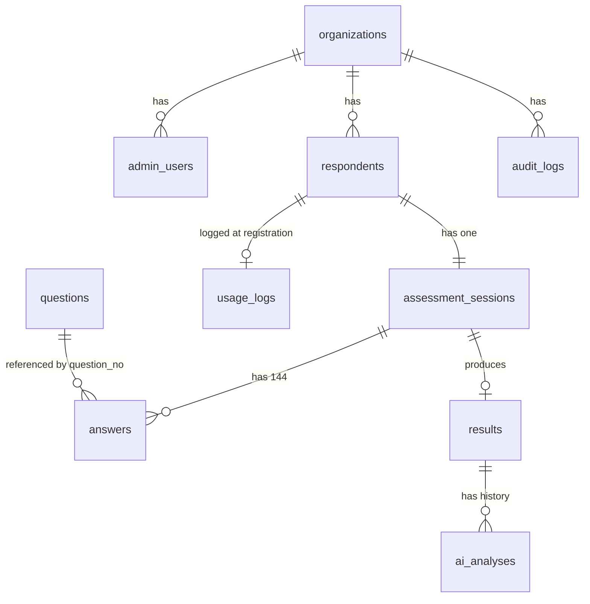

# 基本設計 00 共通定義

| 項目 | 内容 |
|---|---|
| 文書名 | 適性検査システム 基本設計 00 共通定義 |
| 版 | 1.1 |
| 作成日 | 2026-09-17（1.1 版: 2026-09-21。01〜08 の 1.1 版からの改版依頼を取り込んだ。変更点は §9） |
| 対象 | 基本設計 01〜09 の全分冊、および実装者 |

## 0. 本書の位置づけ

本書は、要件定義書（`docs/要件定義書.md`）と付録 A〜E に基づいて新システムを設計する際に、**全分冊（01〜08）と実装コードが共通で従う定義**を確定するものです。用語と識別子、データベースの命名規約とテーブル名、TypeScript の型名とディレクトリ構成、API のパス規約、役割、分冊の担当範囲を定めます。

- 各分冊は本書の用語・識別子・テーブル名・型名をそのまま使います。分冊側で別名を作らないでください。
- 本書に無い詳細（列定義、計算手順、画面レイアウト、API の入出力）は各分冊が定めます。本書と分冊が矛盾した場合は本書を正とし、分冊を修正します。
- 本書の内容を変更する場合は、本書を改版したうえで影響する分冊を改版します。

### 0.1 参照した要件

| 参照元 | 参照した内容 |
|---|---|
| 要件定義書 §2 | 用語定義（組織アカウント、オーナー、受検者、回答データ、16 尺度、資質 4 型、適性タイプ 16 種、ソーシャルスタイル 4 分類、相性 5 軸、リスク 7 項目、信頼係数、比較組織、合致度／偏差値／評価／立ち位置） |
| 要件定義書 §3、§4 | システム全体像、利用者と権限（受検者、管理者、オーナー、管理者追加、スーパーアドミン） |
| 要件定義書 §5、§6 | 業務フロー、機能要件 U-01〜U-09、A-01〜A-13、採点エンジンの構造（§6.3）、文言の出し分け（§6.4）、視覚化（§6.5）、AI 解説（§6.6） |
| 要件定義書 §7 | 画面一覧 S-01〜S-11 と結果詳細のセクション構成 |
| 要件定義書 §8 | データモデル（組織アカウント、受検者、回答、結果、チャート用データ、AI 分析、利用回数管理、マスタ） |
| 要件定義書 §9、§10 | 非機能要件（個人情報保護、認証、性能、対応端末）、外部連携 |
| 要件定義書 §11 | 既存不具合 10 件と新システムでの方針 |
| 要件定義書 §12 | 未確認事項 |
| 付録A | 設問 204 問と採点への逆引き表（Q145〜Q204 は指標に未使用） |
| 付録B §1〜§13 | 配点属性 9 種、各指標の計算式、同点時の優先順位、比較計算、立ち位置、旧ロジック混在 |
| 付録C §1〜§8 | 文言マスタの構造（タイプ別 5 種、特性詳細 5 カテゴリ、項目詳細、育成方法 14 項目、ソーシャルスタイル別、タイプ別の対処法、立ち位置、色分け、組織内分類） |
| 付録D §1〜§3 | AI 解説の入出力、JSON スキーマ、プロンプト全文 |
| 付録E §1〜§7 | レーダーチャートの軸順と設定値、ゲージ、スライダー、評価レター、組織内分類マトリクスの色、PDF |
| tests/fixtures/README.md、tests/verify_fixtures.py | 検証用データの項目名と検証項目（資質候補・ソーシャルスタイルの同点処理、比較計算の再計算） |

### 0.2 決定事項との対応

依頼主が決定した事項（変更不可）と、本書のどこで担保するかの対応です。

| # | 決定事項 | 本書での対応 |
|---|---|---|
| 1 | Next.js（App Router、TypeScript）+ Supabase（PostgreSQL、Auth、Storage）+ Vercel。グラフは ApexCharts（react-apexcharts） | §3 ディレクトリ構成、§4 API 規約、§2 DB 規約（Supabase の `auth.users` との対応、RLS 前提） |
| 2 | 要件定義書 §11 の既存不具合 10 件を全て修正して実装 | §1.11 に不具合ごとの共通ルール（優劣性を上書きしない、思考の傾向の参照先、母集団の定義、比較値を永続化しない、信頼係数の色、内部名の統一、同点時の優先順位、採点バージョン）を定義し、担当分冊を指定 |
| 3 | 出題は Q1〜Q144 のみ。Q145〜Q204 は設問マスタに「採点対象外・非出題」として残してよい | §1.9 設問の識別子と `is_active` / `is_scored` の定義、`AnswerMap` は Q1〜Q144 を必須とする（§3.4） |
| 4 | 既存システムのデータは移行しない | §2.4 の `scoring_version` は将来のロジック変更に備えて持つが、初期データは空。旧ロジック（付録B §13）の扱いは設計対象外 |
| 5 | AI 解説は Claude API（Anthropic）。連携先は将来差し替え可能な構造 | §3.6 `lib/ai/` の provider インターフェースと環境変数名 |
| 6 | 日本語のみ。管理画面は PC 幅、受検者画面はスマートフォン対応 | §3.7 ルートグループの分離（`(respondent)` と `(admin)`）、§6 の分冊担当（05 が受検者側、06 が管理者側） |

## 1. 用語集と識別子

### 1.1 業務用語 ↔ 英語識別子

英語識別子は、テーブル名・列名では snake_case、TypeScript の型名では PascalCase、変数名・JSON キーでは camelCase に変換して使います（変換規則は §2.1、§3.1）。「既存での呼称」は要件定義書・付録が既存システムの名称として記載しているものです。

| 業務用語（日本語） | 識別子（基底形） | 定義 | 既存での呼称 | 根拠 |
|---|---|---|---|---|
| 組織 | `organization` | 医院ごとの契約単位。受検者・管理者・結果はすべて組織に属する。データ分離の単位 | 組織アカウント（「パスワード」フィールドの値が組織識別子を兼ねる） | 要件定義書 §2、§8.1 |
| 管理者（管理者アカウント） | `admin_user` | 組織に属し、管理画面にログインする利用者。役割 `owner` / `admin` / `super_admin` を持つ（§5） | 組織アカウント（User）、管理者 | 要件定義書 §4、§8.1 |
| オーナー（院長） | `owner`（`admin_user.role` の値） | 管理者のうち、既存スタッフ（幹部）の結果も閲覧できる役割 | オーナー（フラグ） | 要件定義書 §4 |
| スーパーアドミン | `super_admin`（`admin_user.role` の値） | 既存にフラグのみ存在し機能は未確認。§5 参照 | スーパーアドミン（フラグ） | 要件定義書 §4 |
| 受検者 | `respondent` | 受検リンクから登録し設問に回答する人。1 行 = 1 回の受検登録（§2.4） | 受検者、User レコード | 要件定義書 §2、§8.2 |
| 受検者区分 | `respondent_kind` | `applicant`（求職者、`p=user`）または `executive`（既存スタッフ＝幹部、`p=executives`） | 区分（幹部／その他） | 要件定義書 §6.1 U-03、§8.2 |
| 職業 | `occupation` | 職業コード 1〜9（§1.10） | 職業 | 要件定義書 §6.1 U-02 |
| 過去の診断経験 | `diagnosis_experience` | `first_time`（初めて診断する）または `experienced`（過去に診断したことがある） | 過去の診断経験 | 要件定義書 §6.1 U-01 |
| 受検リンク | `assessment_link` | 組織ごとの受検用 URL。求職者用と既存スタッフ用の 2 種 | 求職者用回答リンク、既存スタッフ用回答リンク | 要件定義書 §5、§6.2 A-12 |
| 管理者追加用リンク | `admin_invite_link` | 同一組織の管理者を追加するサインアップ用 URL | 管理者追加用リンク（signup?q=組織ID） | 要件定義書 §4、§6.2 A-12 |
| 受検セッション | `assessment_session` | 受検 1 回分の進行状態（下書き→送信済み）と回答の入れ物 | ユーザーrowデータ（ステータス 下書き／送信済み） | 要件定義書 §6.1 U-07、§8.3 |
| 回答 | `answer` | 設問 1 問に対する 5 件法の選択 | Q1〜Q204 の選択肢 | 要件定義書 §8.3 |
| 設問 | `question` | 設問番号 `question_no`（1〜204）と設問文 | 設問、Q 番号 | 付録A |
| 選択肢 | `choice` | 5 件法の選択肢。`choice_code` 1〜5（§1.9） | そう思う〜そう思わない | 付録A、付録B §1 |
| 配点属性 | `score_attribute` | 選択肢が持つ 9 種の配点値（§1.9） | スコア、信頼係数、+ソーシャル など | 付録B §1 |
| 指標 | `indicator` | 採点エンジンが算出する値の総称（16 尺度、5 軸、4 型、7 リスク、16 タイプ得点、4 スタイル、信頼係数） | 指標 | 要件定義書 §6.3 |
| 採点結果 | `result` | 受検 1 回分の確定した全指標。1 セッションにつき 1 行 | 回答データ | 要件定義書 §2、§8.4 |
| 採点バージョン | `scoring_version` | 採点式の版。結果行に保存し、母集団の条件に使う（§1.11） | 1112変更済み（推定） | 要件定義書 §8.4、付録B §13 |
| 16 尺度（性格特性） | `trait`（複数形 `traits`） | 各 0〜30、0.5 刻み | 性格特性（16 尺度） | 要件定義書 §2、付録B §2 |
| 相性（組織との相性 5 軸） | `compatibility` | 各軸の理論範囲 −100〜100、表示 0〜100 | 組織との相性 | 要件定義書 §2、付録B §3 |
| 資質（資質タイプ 4 型） | `aptitude` | 各 0〜約 150、1.25 刻み。第一候補 `aptitude_first`、第二候補 `aptitude_second` | 資質タイプ、資質第一候補／第二候補 | 要件定義書 §2、付録B §4 |
| リスク（7 項目） | `risk` | 計算値 −40〜100（保存値。§1.5）、表示 0〜100、2.5 刻み | リスク | 要件定義書 §2、付録B §5、03 §5.10 |
| 適性タイプ（16 種） | `aptitude_type` | 16 タイプ得点 `aptitude_type_scores` の最大がタイプ | タイプ、タイプデータ | 要件定義書 §2、付録B §6 |
| キャラクター | `character` | 適性タイプに 1 対 1 で付くキャラクター名とイラスト | キャラクター名、イラスト | 付録C §1、§8 |
| ソーシャルスタイル（4 分類） | `social_style` | 計算値 −29〜29（保存値。§1.7）、表示レンジ 0〜30、0.25 刻み。最大の分類がスタイル | ソーシャルスタイル、組織内分類 | 要件定義書 §2、付録B §7、03 §5.10 |
| 組織内分類 | `classification` | ソーシャルスタイル 4 分類 × 16 キャラクターのマトリクス画面と、その分類 | 組織内分類 | 要件定義書 §6.2 A-11、付録C §8 |
| 信頼係数 | `reliability` | 0〜100。「どちらでもない」の多さで下がる | 信頼係数 | 要件定義書 §2、付録B §8 |
| 比較組織（比較範囲） | `comparison_scope` | 結果詳細で選ぶ比較母集団の範囲。`organization`（組織全体）または `team`（A〜Z チーム） | 比較組織 | 要件定義書 §2、§6.2 A-08 |
| 母集団 | `population` | 比較計算に使う結果の集合（§1.11 の定義） | 比較母集団 P | 付録B §9 |
| 合致度 | `match_score` | 0〜100。16 尺度の平均との差分から算出 | 合致度 | 付録B §9 |
| 偏差値 | `deviation_score` | 5 軸の平均との差から算出 | 偏差値 | 付録B §9 |
| 評価 | `grade` | A〜E | 評価 | 付録B §9 |
| 立ち位置 | `position` | 偏差値による 5 段階 | 比較対象内での立ち位置 | 付録B §10、付録C §6 |
| 除外 | `excluded`（列名 `is_excluded`） | 比較母集団から除く受検者のフラグ | 組織データからの除外 | 要件定義書 §6.2 A-04 |
| チーム | `team`（列名 `team_code`） | 管理者が受検者に付ける A〜Z の区分。母集団の絞り込みに使う | チーム（Aチーム〜Zチーム） | 要件定義書 §6.2 A-03 |
| 利用履歴 | `usage_log` | 受検登録の履歴（名前・電話番号・回答日時・診断経験） | 利用回数管理 | 要件定義書 §6.2 A-06、§8.7 |
| AI 解説 | `ai_analysis` | LLM が生成した採用・育成アドバイス（JSON）とその生成状態 | AI 解説、AI 分析、AI生成ステータス | 要件定義書 §6.6、§8.6、付録D |
| PDF 出力 | `pdf_export` | 結果詳細の PDF。モード `full`（全画面）／`restricted`（評価・合致度・リスクを非表示） | ダウンロード（2 モード） | 要件定義書 §6.2 A-10、付録E §7 |
| 項目詳細 | `trait_highlight` | 16 尺度の最大・最小の尺度と、その文言 | 項目詳細（最も高い／低い項目） | 要件定義書 §6.4、付録C §3 |
| 特性詳細 | `trait_detail` | 適性タイプの集合で出し分ける 5 カテゴリの定型文 | 特性詳細 | 付録C §2 |
| 育成方法 | `development_guide` | 資質型ごとの 14 項目の文言 | 育成方法 | 付録C §4 |
| タイプ別の対処法 | `style_interaction` | 閲覧者スタイル 4 × 対象者スタイル 4 の文言 | タイプ別の対処法 | 付録C §5 |
| 監査ログ | `audit_log` | 個人情報を含む画面・API へのアクセス記録 | （既存には無い） | 要件定義書 §9 個人情報保護 |

### 1.2 16 尺度（traits）

日本語名は付録B §2 の見出しを正とします。並び順（`sort_order`）はレーダーチャートの軸順（付録E §1）です。「別名」は付録D のプロンプト内の辞書に付記された括弧書きで、識別子の意味の参考として載せています（画面には使いません）。

| sort_order | 日本語名（表示名） | 識別子 `TraitKey` | DB 列名（`results`） | 別名（付録D） | 範囲 |
|---:|---|---|---|---|---|
| 1 | 協力性 | `cooperativeness` | `trait_cooperativeness` | 協調性 | 0〜30 |
| 2 | 適応力 | `adaptability` | `trait_adaptability` | 順応性 | 0〜30 |
| 3 | 優劣性 | `deliberateness` | `trait_deliberateness` | 優柔性 | 0〜30 |
| 4 | 謙虚さ | `humility` | `trait_humility` | 謙譲性 | 0〜30 |
| 5 | 反省力 | `reflectiveness` | `trait_reflectiveness` | 自省心 | 0〜30 |
| 6 | 規則遵守力 | `rule_compliance` | `trait_rule_compliance` | 規律性 | 0〜30 |
| 7 | こだわり | `persistence` | `trait_persistence` | 固執性 | 0〜30 |
| 8 | 感情の豊かさ | `emotionality` | `trait_emotionality` | 情動性 | 0〜30 |
| 9 | 敏感さ | `sensitivity` | `trait_sensitivity` | 感受性 | 0〜30 |
| 10 | 自己肯定感 | `self_esteem` | `trait_self_esteem` | 自己信頼性 | 0〜30 |
| 11 | 革新的思考 | `innovativeness` | `trait_innovativeness` | 革新性 | 0〜30 |
| 12 | 行動力 | `activeness` | `trait_activeness` | 活動性 | 0〜30 |
| 13 | 前向きさ | `positiveness` | `trait_positiveness` | 積極性 | 0〜30 |
| 14 | リーダーシップ | `leadership` | `trait_leadership` | 指導性 | 0〜30 |
| 15 | 発想力 | `creativity` | `trait_creativity` | 創造性 | 0〜30 |
| 16 | コミュニケーション力 | `communication` | `trait_communication` | 社交性 | 0〜30 |

- 設計判断: 「優劣性」の識別子は、付録D の別名「優柔性」と高低の意味（高い = 冷静・思慮深い、低い = 判断が早い。付録C §3）から `deliberateness` としました。直訳の `superiority` は意味が異なるため使いません。
- 「優劣性」の値は計算値をそのまま保存します。既存の `= 12` 上書きは実装しません（要件定義書 §11 の 1 番、付録B §12）。

### 1.3 相性 5 軸（compatibility）

日本語名は付録B §3 を正とします。並び順は要件定義書 §2 および付録D の入力テンプレートの順です。

| sort_order | 日本語名 | 識別子 `CompatibilityKey` | DB 列名 | 低い側ラベル ↔ 高い側ラベル（付録E §4） | 範囲 |
|---:|---|---|---|---|---|
| 1 | 適応する環境 | `adaptive_environment` | `compat_adaptive_environment` | 個人優先型 ↔ 組織優先型 | 理論 −100〜100、表示 0〜100 |
| 2 | 適応する業務 | `adaptive_work` | `compat_adaptive_work` | 変化の少ない業務 ↔ 変化の多い業務 | 同上 |
| 3 | 思考の傾向 | `thinking_tendency` | `compat_thinking_tendency` | 主観的 ↔ 客観的 | 同上 |
| 4 | 意思決定 | `decision_making` | `compat_decision_making` | 依存的 ↔ 主体的 | 同上 |
| 5 | ストレス耐性 | `stress_tolerance` | `compat_stress_tolerance` | ストレスを感じやすい ↔ ストレスを感じにくい | 同上 |

- 値は整数です（付録B §3）。負値は実際に発生します（要件定義書 §12、付録B §3）。**DB には計算値（負値を含む）をそのまま保存**し、スライダー表示での扱いは 06 分冊が定めます（§8 の設計判断 D-07）。
- 偏差値の計算では、思考の傾向の受検者側の値に必ず `compat_thinking_tendency` を使います（要件定義書 §11 の 2 番）。

### 1.4 資質 4 型（aptitude）

**内部名は「感性開放型」に統一**し（要件定義書 §11 の 8 番）、表示名は別に持ちます。既存の表示表記「感性解放型」（付録B §4、付録C §4、検証用データの `資質第一候補`）は新システムでは使いません。並び順（`sort_order`）は付録B §4 のフィールド定義順で、これが**同点時の優先順位**です。

| sort_order（同点時の優先順） | 内部名（日本語） | 表示名 | 識別子 `AptitudeKey` | DB 列名 | 付録D の呼称 | 範囲 |
|---:|---|---|---|---|---|---|
| 1 | 感性開放型 | 直感型 | `sensory_open` | `aptitude_sensory_open` | 直感型／感性解放型（言語感覚） | 0〜約 150、1.25 刻み |
| 2 | 環境受容型 | 柔軟型 | `environment_receptive` | `aptitude_environment_receptive` | 柔軟型／環境受容型（視覚） | 同上 |
| 3 | 自己実現型 | 目標達成型 | `self_actualizing` | `aptitude_self_actualizing` | 目標達成型／自己実現型（体感覚） | 同上 |
| 4 | 探求論理型 | 専門追求型 | `inquiry_logical` | `aptitude_inquiry_logical` | 専門追求型／探求論理型（聴覚） | 同上 |

- 第一候補 `aptitude_first`、第二候補 `aptitude_second` は `AptitudeKey` を保存します（日本語文字列は保存しません）。
- 画面（レーダーチャートの軸、育成方法の見出し）には表示名（直感型など）を使います（付録E §1、付録C §4）。内部名（感性開放型など）はマスタのメタデータと本書での説明にのみ使います。
- 付録D のプロンプト全文は初期値としてそのまま採用するため、プロンプト内の「感性解放型」表記はそのまま残します（付録D §3、07 分冊）。

### 1.5 リスク 7 項目（risk）

日本語名（正式名）は付録B §5 の見出しを正とします。短縮名は要件定義書 §2、AI 入力ラベルは付録D §3 の入力テンプレートです。

| sort_order | 正式名（付録B） | 短縮名（要件定義書 §2） | AI 入力ラベル（付録D） | 識別子 `RiskKey` | DB 列名 | 範囲 |
|---:|---|---|---|---|---|---|
| 1 | 不祥事が発生するリスク | 不祥事 | 不祥事 | `misconduct` | `risk_misconduct` | 0〜100、2.5 刻み |
| 2 | 苦情を強く主張するリスク | 苦情 | 苦情 | `complaint` | `risk_complaint` | 同上 |
| 3 | メンタル面の不服が起こるリスク | メンタル面の不服 | メンタル不服 | `mental_distress` | `risk_mental_distress` | 同上 |
| 4 | 不注意からミスが発生するリスク | 不注意ミス | 不注意ミス | `careless_mistake` | `risk_careless_mistake` | 同上 |
| 5 | 退職時におけるトラブル発生のリスク | 退職時トラブル | 退職トラブル | `resignation_trouble` | `risk_resignation_trouble` | 同上 |
| 6 | コミュニケーションが課題となり業務に支障が出るリスク | コミュニケーション起因の業務支障 | コミュ起因の支障 | `communication_issue` | `risk_communication_issue` | 同上 |
| 7 | モチベーションの不足により就業自体に繋がるリスク | モチベーション不足による就業辞退 | 就業辞退 | `low_motivation` | `risk_low_motivation` | 同上 |

- 合算値が負になり得るため、DB には計算値をそのまま保存し、画面では負値を「0%」と表示します（付録B §5）。

### 1.6 適性タイプ 16 種（aptitude_type）

日本語名は付録B §6 の表を正とします。「短縮名」は「タイプ」を除いた名称で、付録C §2 の表示条件や組織内分類のラベルに使われている形です。所属分類（ソーシャルスタイル）とキャラクター名は付録C §1、§8 です。

| sort_order | 表示名 | 短縮名 | 識別子 `AptitudeTypeKey` | DB 列名（得点） | 所属分類 `SocialStyleKey` | キャラクター名（結果詳細、付録C §1） | キャラクター名（組織内分類、付録C §8） |
|---:|---|---|---|---|---|---|---|
| 1 | アテンダントタイプ | アテンダント | `attendant` | `type_attendant` | `expressive` | ハルカ | はるか |
| 2 | フォロワータイプ | フォロワー | `follower` | `type_follower` | `amiable` | ナオ | なお |
| 3 | スペシャリストタイプ | スペシャリスト | `specialist` | `type_specialist` | `amiable` | リツカ | りつか |
| 4 | クリエイタータイプ | クリエイター | `creator` | `type_creator` | `analytical` | レイ | れい |
| 5 | プロフェッショナルタイプ | プロフェッショナル | `professional` | `type_professional` | `analytical` | マドカ | まどか |
| 6 | ゼネラリストタイプ | ゼネラリスト | `generalist` | `type_generalist` | `amiable` | カナ | かな |
| 7 | サイエンティストタイプ | サイエンティスト | `scientist` | `type_scientist` | `analytical` | アイリ | あいり |
| 8 | パイオニアタイプ | パイオニア | `pioneer` | `type_pioneer` | `driving` | ヒナタ | ひなた |
| 9 | コンダクタータイプ | コンダクター | `conductor` | `type_conductor` | `amiable` | アカリ | あかり |
| 10 | コントローラータイプ | コントローラー | `controller` | `type_controller` | `driving` | ナツキ | なつき |
| 11 | アーティストタイプ | アーティスト | `artist` | `type_artist` | `analytical` | ミユ | みゆ |
| 12 | レビュワータイプ | レビュワー | `reviewer` | `type_reviewer` | `driving` | エリカ | えりか |
| 13 | プロモータータイプ | プロモーター | `promoter` | `type_promoter` | `expressive` | サラ | さら |
| 14 | アクタータイプ | アクター | `actor` | `type_actor` | `driving` | マイ | まい |
| 15 | レセプショニストタイプ | レセプショニスト | `receptionist` | `type_receptionist` | `expressive` | リサ | りさ |
| 16 | フリーランサータイプ | フリーランサー | `freelancer` | `type_freelancer` | `expressive` | ノゾミ | のぞみ |

- `results.aptitude_type` には `AptitudeTypeKey` を保存します。16 タイプ得点は既存では保存されていませんでしたが（tests/fixtures/README.md）、新システムでは `type_*` 列に保存します（要件定義書 §8.5 の「タイプデータ」を結果行に統合。§9 性能要件「結果を 1 レコードにまとめる」）。
- 16 タイプ得点の同点時の優先順位は要件定義書・付録に記載がありません。設計判断: 上表の `sort_order`（付録B §6 の表の順）で最初のタイプを採用します（§8 の D-03）。
- キャラクター名は結果詳細ではカタカナ、組織内分類画面ではひらがなで記載されています（付録C §1 と §8）。設計判断: マスタに `character_name`（カタカナ）と `character_name_hiragana`（ひらがな）の両方を持ち、画面ごとに使い分けます（§8 の D-04）。
- 付録D のプロンプト内では「コンダクター」が「コンタクター」と記載されています。推定: 既存プロンプトの誤記。プロンプト全文は初期値としてそのまま採用し、修正の要否は 07 分冊で判断します。

### 1.7 ソーシャルスタイル 4 分類（social_style）

英語名は付録B §7、カタカナ表示名は付録E §1（レーダーチャートの軸）、日本語名は要件定義書 §2 および付録C §8 です。並び順（`sort_order`）は付録B §7 の式の順で、**同点時の優先順位**でもあります（要件定義書 §11 の 4 番。Expressive と Analytical の順は仮置き）。

| sort_order（同点時の優先順） | 英語名（表示） | カタカナ名（表示） | 日本語名（表示） | 識別子 `SocialStyleKey` | DB 列名（値） | 組織内分類の位置（付録C §8） | 色（付録E §6） |
|---:|---|---|---|---|---|---|---|
| 1 | Driving | ドライビング | 実行型 | `driving` | `style_driving` | 感情を抑える × 意見を主張する | rgba(149,112,161) 紫系 |
| 2 | Expressive | エクスプレッシブ | 直感型 | `expressive` | `style_expressive` | 感情を表す × 意見を主張する | rgba(229,179,83) 橙系 |
| 3 | Analytical | アナリティカル | 分析型 | `analytical` | `style_analytical` | 感情を抑える × 意見を聞く | rgba(65,166,123) 緑系 |
| 4 | Amiable | エミアブル | 温和型 | `amiable` | `style_amiable` | 感情を表す × 意見を聞く | rgba(65,148,175) 青系 |

- `results.social_style` には `SocialStyleKey` を保存します。
- レーダーチャートの軸順は `ドライビング, エクスプレッシブ, エミアブル, アナリティカル`（付録E §1）で、上表の同点優先順（Driving, Expressive, Analytical, Amiable）とは異なります。表示順は付録E を正とし、優先順は付録B を正とします。両者を混同しないよう、マスタでは `sort_order`（優先順）と `chart_order`（軸順）を別に持ちます。
- 4 値の値域: 付録B §7 の式（所属 4 タイプの得点の最大値 ÷ 2）から、計算値は −29〜29 になり得ます（16 タイプ得点が −58〜58 のため。03 §5.10）。要件定義書 §2・付録B §7 の見出し「0〜30」はレーダーチャートの表示レンジです。**DB には計算値（負値を含む）をそのまま保存**し（02 §3.9）、レーダー描画時に 0〜30 のレンジで負値を 0 に丸めます（03 §8.4 `clampForRadar`、06 §6.4。03 D3-06 の改版要請を 1.1 版で反映）。
- 注意: 日本語名「直感型」は資質 4 型の表示名「直感型」（感性開放型）と同じ文字列です。コードでは `SocialStyleKey.expressive` と `AptitudeKey.sensory_open` で区別され混同しませんが、画面文言を書く際は文脈（ソーシャルスタイルか資質か）を必ず明示します。

### 1.8 その他の列挙値

#### 評価（grade）

| 値 | 条件（付録B §9） | 文字色（付録C §7） |
|---|---|---|
| `A` | 合致度 ≥ 80 かつ 偏差値 ≥ 60 | 赤 |
| `B` | 合致度 ≥ 70 かつ 偏差値 ≥ 50 | 橙 |
| `C` | 合致度 ≥ 60 かつ 偏差値 ≥ 40 | 緑 |
| `D` | 合致度 ≥ 60 かつ 偏差値 ≥ 30 | 黄 |
| `E` | 上記以外 | 薄い青 |

判定は上から順に評価し、最初に成立した条件を採用します（付録B §9 の「最も良い評価が採用される」と同値）。

#### 立ち位置（position）

| 識別子 `PositionKey` | 偏差値（付録B §10） | 表示名（付録C §6） |
|---|---|---|
| `strong_leader` | 60 以上 | 個が強いリーダータイプ |
| `cooperative_leader` | 50 以上 60 未満 | 協調性を重視するリーダータイプ |
| `follower` | 40 以上 50 未満 | フォロワータイプ |
| `passive_follower` | 30 以上 40 未満 | フォロワータイプ（消極的） |
| `unfit` | 30 未満 | アンフィットネス |

#### 受検者区分（respondent_kind）

| 値 | 意味 | URL パラメータ（要件定義書 §6.1 U-03） |
|---|---|---|
| `applicant` | 求職者 | `p=user` |
| `executive` | 既存スタッフ（幹部）。オーナーのみ閲覧可（A-13） | `p=executives` |

#### 過去の診断経験（diagnosis_experience）

| 値 | 表示文言（要件定義書 §6.1 U-01） |
|---|---|
| `first_time` | 初めて診断する |
| `experienced` | 過去に診断したことがある |

#### 受検セッションの状態（session_status）

| 値 | 意味 | 既存（要件定義書 §8.3） |
|---|---|---|
| `draft` | 登録済みで回答中（送信前） | 下書き |
| `submitted` | 送信済み。採点結果が存在する | 送信済み |

#### AI 生成状態（ai_generation_status）

| 値 | 意味 | 既存（要件定義書 §6.6） |
|---|---|---|
| `not_generated` | 生成前 | 生成前 |
| `generating` | 生成中 | 生成中 |
| `completed` | 生成完了 | 生成完了 |
| `failed` | 生成失敗（設計判断: 再試行可能にするため追加。§8 の D-10） | （無し） |

#### PDF モード（pdf_mode）

| 値 | 意味（要件定義書 §6.2 A-10、付録E §7） |
|---|---|
| `full` | 全画面ダウンロード |
| `restricted` | 評価・組織との合致度・リスクを非表示にしてダウンロード |

#### 比較範囲（comparison_scope）

| `kind` | 追加パラメータ | 意味 |
|---|---|---|
| `organization` | なし | 組織全体 |
| `team` | `teamCode`（`A`〜`Z`） | 指定チームのみ |

#### 管理者の役割（admin_role）

`owner` / `admin` / `super_admin`。定義は §5。

### 1.9 設問・選択肢・配点属性

#### 設問

- 設問の識別子は `question_no`（整数 1〜204）です。UUID は使いません（マスタの自然キー。§2.1 の例外）。
- 設問マスタは 204 問すべてを保持し、次の 2 つのフラグを持ちます（決定事項 3）。

| question_no | `is_active`（出題する） | `is_scored`（採点に使う） |
|---|---|---|
| 1〜144 | true | true |
| 145〜204 | false | false |

- `AnswerMap`（§3.4）は Q1〜Q144 を必須とし、Q145〜Q204 を含んでいても採点エンジンは無視します。
- ステップとページ: 既存は Step1〜Step4 各 5 ページ（要件定義書 §6.1 U-05）。1 ページあたりの問数は未確認（要件定義書 §12）。用語として `step`（1〜4）と `page`（1〜5）を定義し、144 問の割り当ては 05 分冊が確定しました（1 ステップ 36 問、ページ構成 7・7・7・7・8 問。05 §5.3.2 D05-01。§8 の D-08）。URL 上は通しページ番号 `pageNo`（1〜20）を使い、`step` / `page` との変換は `lib/masters/exam-pages.ts`（04 §4.4 D04-46）に置きます。

#### 選択肢（choice_code）

表示順（付録A）に 1〜5 を振ります。回答の DB 保存値・API の値はこの整数です。

| choice_code | 表示文言 | 識別子 `ChoiceKey` |
|---:|---|---|
| 1 | そう思う | `agree` |
| 2 | どちらかと言えばそう思う | `somewhat_agree` |
| 3 | どちらでもない | `neutral` |
| 4 | どちらかと言えばそう思わない | `somewhat_disagree` |
| 5 | そう思わない | `disagree` |

#### 配点属性 9 種（score_attribute）

日本語名は付録B §1 の列見出しを正とします。

| 日本語名（付録B） | 識別子 `ScoreAttributeKey` | 使う指標 |
|---|---|---|
| スコア | `score` | 16 尺度、リスク（一部） |
| 信頼係数 | `reliability` | 信頼係数 |
| +ソーシャル | `social_plus` | 資質 |
| -ソーシャル | `social_minus` | 資質 |
| スコア(重要) | `score_important` | 適性タイプ |
| スコア(相性) | `score_compat` | 相性（加算項） |
| スコア(-相性) | `score_compat_minus` | 相性（減算項） |
| スコア(タイプ用) | `score_type` | 適性タイプ、リスク（一部） |
| ソーシャル(重要) | `social_important` | 資質 |

配点値（コピー用。付録B §1 と同一）:

```json
{
  "1": { "score": 2,   "reliability": 1,    "social_plus": 5,     "social_minus": -2.5, "score_important": 3,    "score_compat": 5,  "score_compat_minus": 5,  "score_type": 2,  "social_important": 7.5 },
  "2": { "score": 1.5, "reliability": 1,    "social_plus": 2.5,   "social_minus": -1.25, "score_important": 1.5, "score_compat": 3,  "score_compat_minus": 3,  "score_type": 1,  "social_important": 3.75 },
  "3": { "score": 1,   "reliability": -0.5, "social_plus": 0,     "social_minus": 0,    "score_important": 0,    "score_compat": 0,  "score_compat_minus": 0,  "score_type": 0,  "social_important": 0 },
  "4": { "score": 0.5, "reliability": 1,    "social_plus": -1.25, "social_minus": 2.5,  "score_important": -1.5, "score_compat": -3, "score_compat_minus": -3, "score_type": -1, "social_important": -2.5 },
  "5": { "score": 0,   "reliability": 1,    "social_plus": -2.5,  "social_minus": 5,    "score_important": -3,   "score_compat": -5, "score_compat_minus": -5, "score_type": -2, "social_important": -5 }
}
```

キーは `choice_code`（1 = そう思う）です。

### 1.10 職業（occupation）

職業コードは要件定義書 §6.1 U-02 の記載順に 1〜9 です。DB には `occupation_code`（整数）を保存し、表示名はマスタ（`lib/masters/occupations.ts`）で引きます。

| occupation_code | 表示名 | 識別子（参考） |
|---:|---|---|
| 1 | 歯科医師 | `dentist` |
| 2 | 歯科衛生士 | `dental_hygienist` |
| 3 | 歯科助手(アシスタント・受付) | `dental_assistant_reception` |
| 4 | アシスタント | `assistant` |
| 5 | 受付 | `reception` |
| 6 | TC | `treatment_coordinator` |
| 7 | 事務スタッフ | `office_staff` |
| 8 | 技工士 | `dental_technician` |
| 9 | その他 | `other` |

- 推定: 「TC」はトリートメントコーディネーターの略と推定して識別子を付けました。表示名は「TC」のままです。

### 1.11 不具合修正に関わる共通ルール（決定事項 2）

要件定義書 §11 の 10 件を、分冊をまたいで守るルールとして再定義します。担当分冊が実装方法を定めます。

| §11 の番号 | 共通ルール | 担当分冊 |
|---|---|---|
| 1 | 優劣性（`trait_deliberateness`）は付録B §2 の式の計算値を保存する。固定値での上書き処理を一切実装しない。テストで「優劣性が計算値と一致する」ことを検証する | 03、08 |
| 2 | 偏差値の「思考の傾向」は `受検者.compat_thinking_tendency − avg(compat_thinking_tendency)` で計算する。16 尺度の値を参照しない | 03、08 |
| 3、10 | **母集団（population）の定義**: 同一組織（`organization_id` が一致）、`respondents.is_excluded = false`、`results.scoring_version = 現行の SCORING_VERSION`、論理削除されていない（`results.deleted_at is null` かつ `respondents.deleted_at is null`）結果の集合。チーム選択時はさらに `respondents.team_code` が一致するもの。16 尺度の差分、5 軸の偏差、レーダーチャートの比較対象系列は**すべて同じ母集団**から計算する（実装は 02 §8.4 の `fetch_population()` 1 箇所）。仮置き: 閲覧対象の受検者自身も条件を満たせば母集団に含める（§8 の D-05）。既存スタッフ（幹部）の結果も条件を満たせば含める（§8 の D-06。`admin` 役割が母集団経由で幹部の値を推定できるリスクは 02 D02-07 で依頼主確認事項） | 02（取得関数）、03（計算）、04（API）、06（表示） |
| 4 | 同点時の優先順位を定数として定義する。資質: `sensory_open > environment_receptive > self_actualizing > inquiry_logical`。ソーシャルスタイル: `driving > expressive > analytical > amiable`（Expressive と Analytical の順は仮置き）。16 タイプ得点: §1.6 の `sort_order` 順（設計判断） | 03、08 |
| 5 | 信頼係数の色は高いほど良い色（緑系）にする。付録C §7 の 5 段階（リスクの色）を逆順に適用したうえで、**上位 2 段階（60〜79、80〜100）は緑系（黄緑・濃い緑）に置き換える**（単純な逆順では 80 以上が「薄い青」になり「緑系」と両立しないため。06 §5.2 D06-04。具体値は 06 §5.2 が正で、1.1 版で 06 の依頼を反映）。合致度の色は既存どおり（付録C §7）とし、変更の要否は §8 の D-09 で依頼主確認事項とする | 06、07（PDF） |
| 6 | 比較計算の結果（差分、平均、偏差値、合致度、評価、立ち位置）は**DB に保存しない**。管理者テーブルに比較用の列を作らない。API 呼び出しごとにサーバ側で計算して返す | 02、04 |
| 7 | Q145〜Q204 は出題も採点もしない（決定事項 3、§1.9） | 03、05 |
| 8 | 資質の内部名は「感性開放型」、識別子は `sensory_open`。「感性解放型」はコード・DB・画面に出さない（付録D プロンプト内の転記のみ例外） | 全分冊 |
| 9 | 既存データは移行しない（決定事項 4）。`results.scoring_version` を持ち、将来ロジックを変更した場合に母集団条件で区別できるようにする | 02、03 |

## 2. データベース命名規約とテーブル一覧

### 2.1 命名規約

| 対象 | 規約 | 例 |
|---|---|---|
| スキーマ | 業務テーブルは `public`。Supabase Auth のテーブルは `auth`（変更しない） | `public.results`、`auth.users` |
| テーブル名 | snake_case、複数形 | `respondents`、`assessment_sessions` |
| 列名 | snake_case、単数形。略語は §1 の識別子に従う（`compat_`、`trait_` など） | `organization_id`、`trait_humility` |
| 主キー | `id uuid primary key default gen_random_uuid()`。例外: マスタテーブルは安定した自然キーを主キーにしてよい（`questions.question_no`） | |
| 外部キー列 | `{参照テーブルの単数形}_id` | `respondent_id`、`result_id` |
| 監査列 | すべてのテーブルに `created_at timestamptz not null default now()`、`updated_at timestamptz not null default now()`（更新トリガーで自動更新）。論理削除するテーブルには `deleted_at timestamptz null` | |
| 組織分離 | 組織に属するすべてのテーブルに `organization_id uuid not null references organizations(id)` を持たせる（結合を経由せずに RLS を書けるようにするための非正規化）。RLS を必ず有効にする | `results.organization_id` |
| 真偽値 | `is_` / `has_` / `can_` を接頭辞にする | `is_excluded`、`is_active` |
| 列挙型 | PostgreSQL の `enum` 型。型名は単数形 snake_case | `admin_role`、`respondent_kind`、`session_status`、`aptitude_key`、`aptitude_type_key`、`social_style_key`、`ai_generation_status`、`diagnosis_experience` |
| 数値指標 | `numeric(7,3)`（信頼係数の小数第 3 位まで、負値を含む） | `trait_*`、`compat_*`、`aptitude_*`、`risk_*`、`type_*`、`style_*`、`reliability` |
| 日時 | `timestamptz`（UTC で保存し、表示は Asia/Tokyo） | `submitted_at` |
| インデックス名 | `idx_{table}_{columns}` | `idx_results_organization_id_submitted_at` |
| 一意制約名 | `uq_{table}_{columns}` | `uq_answers_session_id_question_no` |
| 外部キー制約名 | `fk_{table}_{column}` | `fk_results_respondent_id` |
| チェック制約名 | `ck_{table}_{説明}` | `ck_respondents_team_code` |
| トリガー・関数名 | snake_case、関数は動詞で始める | `set_updated_at()`、`trg_results_set_updated_at` |
| マイグレーションファイル | `supabase/migrations/YYYYMMDDHHMMSS_{snake_case_description}.sql` | `supabase/migrations/20260917000001_create_organizations.sql` |
| Storage バケット | kebab-case | `pdf-exports`（命名の例。本フェーズでは PDF を Storage に保存しないためバケットは作成しない。07 D07-21、02 §9） |

指標列の接頭辞（§1 の表と対応）:

| 指標 | 接頭辞 | 列数 |
|---|---|---|
| 16 尺度 | `trait_` | 16 |
| 相性 5 軸 | `compat_` | 5 |
| 資質 4 型 | `aptitude_` | 4（＋ `aptitude_first`、`aptitude_second`） |
| リスク 7 項目 | `risk_` | 7 |
| 16 タイプ得点 | `type_` | 16（＋ `aptitude_type`） |
| ソーシャルスタイル 4 値 | `style_` | 4（＋ `social_style`） |
| 信頼係数 | （接頭辞なし） | `reliability` |

### 2.2 テーブル一覧

列の詳細・制約・RLS ポリシーは 02 分冊が定めます。ここではテーブル名と役割、組織分離と論理削除の有無を確定します。

| # | テーブル名 | 役割 | 既存の対応（要件定義書 §8） | `organization_id` | 論理削除 |
|---|---|---|---|---|---|
| 1 | `organizations` | 組織（医院）。組織名、コード、顧客番号、受検リンク用の ID、管理者追加用の招待トークン | §8.1 の組織関連列 | （自身が組織） | あり |
| 2 | `admin_users` | 管理者。`id` は `auth.users.id` と同一値。役割（`role`）、氏名、利用停止フラグ。**比較計算の一時値は持たない** | §8.1 の User（管理者側） | あり | あり |
| 3 | `respondents` | 受検者。氏名、電話番号、職業コード、診断経験、区分、チーム、除外フラグ。1 行 = 1 回の受検登録 | §8.2 | あり | あり |
| 4 | `assessment_sessions` | 受検セッション。状態（`draft` / `submitted`）、受検者本人の再開用トークン、開始・送信日時 | §8.3 の識別・ステータス | あり | あり |
| 5 | `answers` | 回答。セッション ID × 設問番号ごとに 1 行、`choice_code` 1〜5 | §8.3 の Q1〜Q204 | あり | なし（セッションに従属） |
| 6 | `results` | 採点結果。全指標（§2.1 の接頭辞列）、適性タイプ、ソーシャルスタイル、資質候補、信頼係数、`scoring_version`、送信日時、AI 生成状態。1 セッション 1 行。チャート用データはこの行から導出する | §8.4、§8.5 | あり | あり |
| 7 | `ai_analyses` | AI 解説の生成履歴。`raw_json`、モデル名、プロンプト版、判定 3 種、対象結果 ID。最新の行を結果から参照する | §8.6 | あり | なし |
| 8 | `usage_logs` | 利用履歴。受検登録時に作成し、送信時に結果 ID を紐づける | §8.7 | あり | なし |
| 9 | `audit_logs` | 監査ログ。管理者による結果閲覧・PDF 出力・削除などの操作記録（要件定義書 §9 個人情報保護「アクセスログ」） | （既存に無し） | あり | なし |
| 10 | `questions` | 設問マスタ。`question_no`（主キー）、設問文、`is_active`、`is_scored`、ステップ・ページ番号 | §8.8 設問マスタ | なし（全組織共通） | なし |

補足:

- 配点マスタ、指標定義マスタ、文言マスタ、タイプ・スタイル・資質の定義は **コード内定数（`lib/masters/`）を正**とし、DB テーブルを持ちません（§8 の D-01）。`questions` テーブルは回答の外部キー整合と管理用に持ち、内容は `lib/masters/questions.ts` からシードします。
- 比較計算用のテーブルは作りません（§1.11 の 6 番）。
- チームは A〜Z の固定値のため `teams` テーブルを作らず、`respondents.team_code char(1)` にチェック制約を付けます。
- 受検者・セッション・結果は 1:1:1 です（設計判断: 個人情報（`respondents`）と回答・結果を分け、監査ログや RLS を分けやすくする。§8 の D-02）。管理画面の回答一覧はこの 3 テーブルを結合して作ります。
- 削除（要件定義書 §6.2 A-05）は論理削除（`deleted_at`）とします。物理削除の運用は 02 分冊が定めます（§8 の D-11）。
- 既存の「未使用」列（対人関係、行動特性、業務対応、情報及び精神面、アドバイス、分類表用。要件定義書 §8.4）は作りません。

### 2.3 テーブル間の関係



### 2.4 採点バージョン

```ts
// lib/scoring/version.ts
export const SCORING_VERSION = "1.0.0" as const;
```

- `results.scoring_version text not null` にこの値を保存します。
- 母集団条件（§1.11 の 3・10 番）は `scoring_version = SCORING_VERSION` を含めます。新システムは空から開始するため（決定事項 4）、初期状態では全行が同一バージョンです。
- 採点式を変更する場合はこの定数を上げ、旧バージョン行の扱い（再採点か母集団除外か）を改めて設計します。

## 3. TypeScript の規約、主要な型、ディレクトリ構成

### 3.1 命名規約

| 対象 | 規約 | 例 |
|---|---|---|
| 型・インターフェース | PascalCase。接尾辞: DB 行 `Row`、API 応答 `Dto`、API 入力 `Input`、マスタ定義 `Definition` | `ResultRow`、`ResultDetailDto`、`RegisterRespondentInput`、`AptitudeTypeDefinition` |
| 列挙値 | TypeScript の `enum` は使わず、`as const` 配列 + 文字列リテラル型のユニオンで表す | `TRAIT_KEYS`、`TraitKey` |
| 定数 | UPPER_SNAKE_CASE | `SCORING_VERSION`、`TRAIT_KEYS` |
| 関数・変数・JSON キー | camelCase。DB 列名（snake_case）との変換は `lib/db/mappers/` に集約する | `matchScore`、`deviationScore` |
| ファイル名 | kebab-case。React コンポーネントのファイルは PascalCase | `compute-traits.ts`、`TraitRadar.tsx` |
| ディレクトリ名 | kebab-case | `lib/scoring/` |
| 環境変数 | UPPER_SNAKE_CASE。ブラウザに公開するものだけ `NEXT_PUBLIC_` 接頭辞 | `SUPABASE_SERVICE_ROLE_KEY`、`NEXT_PUBLIC_SUPABASE_URL` |
| テストファイル | 対象ファイル名 + `.test.ts`（単体）、`.spec.ts`（E2E） | `compute-traits.test.ts` |

- `strict: true` を必須とし、`any` を禁止します（`unknown` から絞り込む）。
- 数値はすべて JavaScript の `number` で扱い、採点エンジン内で丸めません。丸めは表示層（`lib/presentation/`）だけで行います。

### 3.2 環境変数名

01 分冊が値の管理方法を定めます。名前は本書で確定します。

| 変数名 | 用途 |
|---|---|
| `NEXT_PUBLIC_SUPABASE_URL` | Supabase プロジェクト URL |
| `NEXT_PUBLIC_SUPABASE_ANON_KEY` | Supabase 匿名キー（ブラウザ用） |
| `SUPABASE_SERVICE_ROLE_KEY` | サーバ専用キー（受検者 API の書き込み、PDF 生成などサーバ処理でのみ使用） |
| `NEXT_PUBLIC_APP_BASE_URL` | 受検リンク・招待リンクの生成に使う公開 URL |
| `AI_PROVIDER` | AI 解説の連携先。初期値 `anthropic`。ローカル・CI 用に `stub` を許容し、本番では起動時検証で拒否する（01 D01-07、07 §5.4） |
| `ANTHROPIC_API_KEY` | Claude API キー（サーバ専用・秘匿。`AI_PROVIDER=anthropic` のとき必須） |
| `AI_MODEL` | 使用モデル名（初期値 `claude-opus-5`。07 §4.1、§8 の D-17） |
| `AI_PROMPT_VERSION` | プロンプト版（`ai_analyses.prompt_version` に保存。初期値 `recruitment-v1`。07 §2.2 D07-02。起動時に `lib/ai/prompts/` の `PROMPT_REGISTRY` と照合する。01 §4.3） |
| `PDF_TOKEN_SECRET` | PDF 印刷トークン（HMAC-SHA256）の署名鍵。サーバ専用・秘匿・環境ごとに別の値（32 バイト以上の乱数）。04 §7.2 D04-40、01 §4.1（1.1 版で 01・04・07・08 の依頼により追加） |
| `PDF_CHROMIUM_EXECUTABLE_PATH` | ローカル・CI 専用（任意）。PDF 生成に使う Chrome／Chromium の実行ファイルのパス。Vercel には置かない（Vercel は `@sparticuz/chromium` を使う）。07 §9.12、01 §4.1（1.1 版で追加） |

- Vercel が自動設定する変数（`VERCEL`、`VERCEL_ENV`、`VERCEL_URL`、`VERCEL_AUTOMATION_BYPASS_SECRET`）と GitHub Actions 専用の変数（`SUPABASE_ACCESS_TOKEN` など）は本表に載せません（01 §4.1 の派生表、D01-30）。
- 値の管理方法（設定場所・秘匿区分・起動時検証）は 01 §4 が定めます。環境変数を追加する場合は本表に追記してから使います（01 §4.1）。

### 3.3 ディレクトリ構成

```text
.
├── app/                                  # Next.js App Router
│   ├── (respondent)/                     # 受検者側（スマートフォン対応、ログイン不要）
│   │   └── exam/
│   │       ├── page.tsx                  # S-02 受検者登録（?q={organizationId}&p=user|executives）
│   │       └── [sessionId]/
│   │           ├── page.tsx              # S-03 診断開始
│   │           ├── questions/[page]/page.tsx   # S-04 設問（ページ単位）
│   │           └── complete/page.tsx     # 完了（要件定義書 §6.1 U-09、内容は未確認）
│   ├── (admin)/                          # 管理者側（PC 幅、ログイン必須）
│   │   └── admin/
│   │       ├── layout.tsx                # admin.css の読み込みのみ。認証チェックは持たない（06 D06-27）
│   │       ├── login/page.tsx            # S-01
│   │       ├── signup/page.tsx           # 管理者追加（?q={inviteToken}）
│   │       ├── password-reset/page.tsx
│   │       ├── page.tsx                  # S-05 回答一覧
│   │       ├── results/[resultId]/page.tsx   # S-06 結果詳細
│   │       ├── results/[resultId]/print/{page,layout}.tsx   # PDF 用の印刷用ページ（Cookie 不要、印刷トークンで認可。07 §9.4）
│   │       ├── classification/page.tsx   # S-07 組織内分類
│   │       └── account/page.tsx          # S-08 アカウント
│   ├── api/v1/                           # Route Handlers（§4）
│   │   ├── respondent/...
│   │   └── admin/...
│   ├── auth/callback/route.ts            # Supabase Auth のコールバック
│   ├── auth/invite/route.ts              # POST /auth/invite: 招待トークンによる管理者追加（01 D01-11、04 §6.2）
│   └── layout.tsx
├── middleware.ts                         # 管理者 Auth セッションの更新と未認証の遮断（01 §5.5、04 §8.5）
├── components/
│   ├── ui/                               # 汎用 UI（ボタン、入力、ポップアップ）
│   ├── charts/                           # ApexCharts ラッパー（TraitRadar, AptitudeRadar, SocialStyleRadar, DonutGauge, CompatSlider, GradeLetter）
│   ├── respondent/                       # 受検者側の画面部品
│   ├── admin/                            # 管理者側の画面部品（結果詳細の各セクションを含む）
│   └── pdf/                              # PDF 用の印刷レイアウト部品（PrintResultDocument, PrintReadyMarker）
├── lib/
│   ├── scoring/                          # 採点エンジン。純関数のみ、I/O なし（03 分冊。追加ファイルは 03 §1.3）
│   │   ├── types.ts                      # §3.4 の型
│   │   ├── version.ts                    # SCORING_VERSION
│   │   ├── compute-traits.ts
│   │   ├── compute-compatibility.ts
│   │   ├── compute-aptitudes.ts
│   │   ├── compute-risks.ts
│   │   ├── compute-aptitude-types.ts
│   │   ├── compute-social-styles.ts
│   │   ├── compute-reliability.ts
│   │   ├── score.ts                      # scoreAnswers(answers): ScoreResult
│   │   └── compare.ts                    # compareWithPopulation(subject, population): ComparisonResult
│   ├── masters/                          # マスタ定数（設問、配点、指標定義、タイプ・資質・スタイル定義、文言、職業）
│   │   ├── data/                         # 付録A〜C から機械生成した JSON（03 §4、08 §7。コミットする生成物）
│   │   ├── questions.ts
│   │   ├── choice-scores.ts
│   │   ├── exam-pages.ts                 # pageNo ⇄ step/page の変換（04 D04-46）
│   │   ├── indicators/                   # traits.ts, compatibility.ts, aptitudes.ts, risks.ts, aptitude-types.ts, social-styles.ts
│   │   ├── texts/                        # 付録C の文言（type-texts.ts, trait-details.ts, trait-highlights.ts, development-guides.ts, style-texts.ts, style-interactions.ts, positions.ts, classifications.ts）
│   │   └── occupations.ts
│   ├── presentation/                     # 表示用の変換（文言の出し分け、色、立ち位置、グラフ用データ整形、丸め）
│   ├── ai/                               # AI 解説（provider インターフェース、Anthropic 実装、プロンプト組み立て、JSON 検証）
│   ├── pdf/                              # PDF 生成
│   ├── db/                               # Supabase クライアント生成、リポジトリ、Row ↔ ドメインの変換（mappers/）
│   ├── auth/                             # 認可ヘルパー（現在の管理者・役割の取得、受検者トークン検証、PDF 印刷トークン）
│   ├── services/                         # ユースケース（受検登録、回答保存、送信と採点、比較取得、AI 生成、PDF 出力）
│   └── utils/                            # env.ts（環境変数の唯一の読み出し口）、logger.ts、phone-number.ts（電話番号の正規化。04・05 が共有）
├── scripts/                              # 生成・運用スクリプト（generate-masters, generate-texts, generate-question-seed, create-owner, check-env。01 §2）
├── supabase/
│   ├── migrations/                       # DDL（§2.1 のファイル名規約。02 §11 の 16 本）
│   ├── seed/                             # questions のシード（生成物）
│   ├── seed.sql                          # ローカル専用の組織・オーナー（01 §11。本番には投入しない）
│   └── config.toml
├── tests/
│   ├── unit/                             # lib/ の単体テスト
│   ├── integration/                      # API・DB を含むテスト
│   ├── e2e/                              # 画面の E2E
│   └── fixtures/                         # 既存の existing_results.json を含む検証用データ
├── public/
│   ├── fonts/                            # PDF 印刷用の Noto Sans JP（07 §9.7）
│   └── images/                           # イラスト（§3.8）
└── docs/
```

- 1.1 版で追加した項目（`layout.tsx`、印刷用ページ、`auth/invite`、`middleware.ts`、`lib/masters/data/`・`exam-pages.ts`・`indicators/social-styles.ts`、`lib/utils/phone-number.ts`、`scripts/`、`supabase/seed.sql`、`public/fonts/`）は、01〜08 が 1.1 版で確定した配置を本書に取り込んだものです。各ファイルの内容は該当分冊が正です。

- `lib/scoring/` と `lib/masters/` は **Next.js や Supabase に依存しない**純粋な TypeScript とし、Node のテストランナーだけで検証できるようにします。
- `lib/presentation/` は表示用の変換だけを行い、DB や API に触れません。
- 画面（Server Component）は `lib/services/` を直接呼んで初期表示データを得てよく、ブラウザからの更新操作は §4 の Route Handler を経由します。

### 3.4 採点エンジンの主要な型（`lib/scoring/types.ts`）

以下は 03 分冊が実装する型の名称と形を確定するものです。03 分冊はこの型をそのまま使い、必要なら追加のみ行います（名称変更は不可）。

```ts
// lib/scoring/types.ts

/** 設問番号 1〜204。採点対象は 1〜144 */
export type QuestionNo = number;

/** 選択肢コード。1 = そう思う … 5 = そう思わない（§1.9） */
export type ChoiceCode = 1 | 2 | 3 | 4 | 5;

/** 回答の集合。Q1〜Q144 のキーを必ず含む。Q145〜Q204 は無視される */
export type AnswerMap = Readonly<Record<QuestionNo, ChoiceCode>>;

/** 配点属性 9 種（§1.9） */
export const SCORE_ATTRIBUTE_KEYS = [
  "score", "reliability", "social_plus", "social_minus", "score_important",
  "score_compat", "score_compat_minus", "score_type", "social_important",
] as const;
export type ScoreAttributeKey = (typeof SCORE_ATTRIBUTE_KEYS)[number];
export type ChoiceScoreAttributes = Readonly<Record<ScoreAttributeKey, number>>;

/** 16 尺度（§1.2 の順） */
export const TRAIT_KEYS = [
  "cooperativeness", "adaptability", "deliberateness", "humility", "reflectiveness",
  "rule_compliance", "persistence", "emotionality", "sensitivity", "self_esteem",
  "innovativeness", "activeness", "positiveness", "leadership", "creativity", "communication",
] as const;
export type TraitKey = (typeof TRAIT_KEYS)[number];
export type TraitScores = Readonly<Record<TraitKey, number>>;

/** 相性 5 軸（§1.3 の順） */
export const COMPATIBILITY_KEYS = [
  "adaptive_environment", "adaptive_work", "thinking_tendency", "decision_making", "stress_tolerance",
] as const;
export type CompatibilityKey = (typeof COMPATIBILITY_KEYS)[number];
export type CompatibilityScores = Readonly<Record<CompatibilityKey, number>>;

/** 資質 4 型（§1.4 の順 = 同点時の優先順） */
export const APTITUDE_KEYS = [
  "sensory_open", "environment_receptive", "self_actualizing", "inquiry_logical",
] as const;
export type AptitudeKey = (typeof APTITUDE_KEYS)[number];
export type AptitudeScores = Readonly<Record<AptitudeKey, number>>;

/** リスク 7 項目（§1.5 の順） */
export const RISK_KEYS = [
  "misconduct", "complaint", "mental_distress", "careless_mistake",
  "resignation_trouble", "communication_issue", "low_motivation",
] as const;
export type RiskKey = (typeof RISK_KEYS)[number];
export type RiskScores = Readonly<Record<RiskKey, number>>;

/** 適性タイプ 16 種（§1.6 の順 = 同点時の優先順） */
export const APTITUDE_TYPE_KEYS = [
  "attendant", "follower", "specialist", "creator", "professional", "generalist",
  "scientist", "pioneer", "conductor", "controller", "artist", "reviewer",
  "promoter", "actor", "receptionist", "freelancer",
] as const;
export type AptitudeTypeKey = (typeof APTITUDE_TYPE_KEYS)[number];
export type AptitudeTypeScores = Readonly<Record<AptitudeTypeKey, number>>;

/** ソーシャルスタイル 4 分類（§1.7 の順 = 同点時の優先順。表示順とは異なる） */
export const SOCIAL_STYLE_KEYS = ["driving", "expressive", "analytical", "amiable"] as const;
export type SocialStyleKey = (typeof SOCIAL_STYLE_KEYS)[number];
export type SocialStyleScores = Readonly<Record<SocialStyleKey, number>>;

/** 受検 1 回分の採点結果（results テーブルの指標部分と 1 対 1） */
export interface ScoreResult {
  readonly scoringVersion: string;            // SCORING_VERSION
  readonly traits: TraitScores;               // 0〜30
  readonly compatibility: CompatibilityScores; // 整数、負値あり
  readonly aptitudes: AptitudeScores;         // 0 以上、1.25 刻み
  readonly aptitudeFirst: AptitudeKey;
  readonly aptitudeSecond: AptitudeKey;
  readonly risks: RiskScores;                 // ×5 後の値、負値あり
  readonly aptitudeTypeScores: AptitudeTypeScores;
  readonly aptitudeType: AptitudeTypeKey;
  readonly socialStyles: SocialStyleScores;   // 計算値 −29〜29（表示レンジ 0〜30）、0.25 刻み、負値あり（§1.7）
  readonly socialStyle: SocialStyleKey;
  readonly reliability: number;               // 0〜100
}

/** 評価 A〜E（§1.8） */
export type Grade = "A" | "B" | "C" | "D" | "E";

/** 立ち位置（§1.8） */
export const POSITION_KEYS = [
  "strong_leader", "cooperative_leader", "follower", "passive_follower", "unfit",
] as const;
export type PositionKey = (typeof POSITION_KEYS)[number];

/** チーム A〜Z */
export type TeamCode =
  | "A" | "B" | "C" | "D" | "E" | "F" | "G" | "H" | "I" | "J" | "K" | "L" | "M"
  | "N" | "O" | "P" | "Q" | "R" | "S" | "T" | "U" | "V" | "W" | "X" | "Y" | "Z";

/** 比較範囲（§1.8） */
export type ComparisonScope =
  | { readonly kind: "organization" }
  | { readonly kind: "team"; readonly teamCode: TeamCode };

/** 比較計算の入力: 母集団は 16 尺度と 5 軸だけあればよい */
export interface PopulationMember {
  readonly traits: TraitScores;
  readonly compatibility: CompatibilityScores;
}

/** 比較計算の結果（DB に保存しない。§1.11 の 6 番） */
export interface ComparisonResult {
  readonly scope: ComparisonScope;
  readonly populationSize: number;            // 0 のときは比較不能（04・06 分冊で扱いを定める）
  readonly traitAverages: TraitScores;        // 母集団平均（レーダーの比較対象系列）
  readonly traitDiffs: TraitScores;           // |平均 − 受検者|
  readonly compatibilityAverages: CompatibilityScores;
  readonly axisDeviations: CompatibilityScores; // (受検者 − 平均) / 2 + 50
  readonly matchScore: number;                // 合致度 0〜100
  readonly deviationScore: number;            // 偏差値
  readonly grade: Grade;
  readonly position: PositionKey;
}
```

採点エンジンの公開関数名（03 分冊が実装）:

```ts
// lib/scoring/score.ts
export function scoreAnswers(answers: AnswerMap): ScoreResult;

// lib/scoring/compare.ts
export function compareWithPopulation(
  subject: PopulationMember,
  population: readonly PopulationMember[],
  scope: ComparisonScope,
): ComparisonResult;
```

### 3.5 マスタ定義の型（`lib/masters/`）

```ts
// lib/masters/types.ts
import type {
  AptitudeKey, AptitudeTypeKey, SocialStyleKey, TraitKey, CompatibilityKey, RiskKey,
  QuestionNo, ScoreAttributeKey, ChoiceCode, ChoiceScoreAttributes, PositionKey,
} from "@/lib/scoring/types";

export interface QuestionDefinition {
  readonly questionNo: QuestionNo;
  readonly text: string;
  readonly isActive: boolean;   // 出題する（Q1〜Q144 のみ true）
  readonly isScored: boolean;   // 採点に使う（Q1〜Q144 のみ true）
  readonly step: 1 | 2 | 3 | 4 | null;   // 非出題は null
  readonly page: 1 | 2 | 3 | 4 | 5 | null;
}

/** 指標 1 つ分の加減算定義（付録B の式をデータ化したもの） */
export interface IndicatorTerm {
  readonly questionNo: QuestionNo;
  readonly attribute: ScoreAttributeKey;
  readonly sign: 1 | -1;
}
export interface IndicatorDefinition<K extends string> {
  readonly key: K;
  readonly terms: readonly IndicatorTerm[];
  readonly constant: number;          // 16 尺度の +14、それ以外は 0
  readonly multiplier: number;        // リスクの ×5、それ以外は 1
  readonly clampMin: number | null;   // 資質・信頼係数の 0、それ以外は null
}

export interface TraitDefinition extends IndicatorDefinition<TraitKey> {
  readonly label: string;             // 協力性
  readonly sortOrder: number;         // レーダー軸順
}
export interface CompatibilityDefinition extends IndicatorDefinition<CompatibilityKey> {
  readonly label: string;
  readonly lowLabel: string;          // 個人優先型
  readonly highLabel: string;         // 組織優先型
  readonly sortOrder: number;
}
export interface AptitudeDefinition extends IndicatorDefinition<AptitudeKey> {
  readonly internalName: string;      // 感性開放型
  readonly label: string;             // 直感型
  readonly sortOrder: number;         // 同点時の優先順
}
export interface RiskDefinition extends IndicatorDefinition<RiskKey> {
  readonly label: string;             // 正式名
  readonly shortLabel: string;        // 短縮名
  readonly aiLabel: string;           // AI 入力ラベル
  readonly sortOrder: number;
}
export interface AptitudeTypeDefinition extends IndicatorDefinition<AptitudeTypeKey> {
  readonly label: string;             // アテンダントタイプ
  readonly shortLabel: string;        // アテンダント
  readonly socialStyle: SocialStyleKey;
  readonly characterName: string;     // ハルカ
  readonly characterNameHiragana: string; // はるか
  readonly sortOrder: number;         // 同点時の優先順
}
export interface SocialStyleDefinition {
  readonly key: SocialStyleKey;
  readonly labelEn: string;           // Driving
  readonly labelKatakana: string;     // ドライビング
  readonly labelJa: string;           // 実行型
  readonly color: string;             // rgba(149,112,161)
  readonly sortOrder: number;         // 同点時の優先順
  readonly chartOrder: number;        // レーダー軸順
}
export interface PositionDefinition {
  readonly key: PositionKey;
  readonly minDeviation: number | null;
  readonly maxDeviation: number | null; // 未満
  readonly label: string;
  readonly description: string;
}
export type ChoiceScoreTable = Readonly<Record<ChoiceCode, ChoiceScoreAttributes>>;
```

### 3.6 AI 連携の型（`lib/ai/`）

連携先を差し替え可能にするため（決定事項 5）、provider インターフェースを定義し、Anthropic 実装をその 1 つとします。詳細は 07 分冊。

```ts
// lib/ai/types.ts
export interface AiAnalysisInput {
  readonly respondentName: string;
  readonly occupationLabel: string;
  readonly result: import("@/lib/scoring/types").ScoreResult;
}

/** 付録D §2 の JSON スキーマと 1 対 1 */
export interface AiAnalysisOutput {
  readonly summary: string;
  readonly verdict: {
    readonly sokusenryoku: "非常に高い" | "高い" | "中" | "低い" | "非常に低い";
    readonly teichaku_risk: "非常に低い" | "低い" | "中" | "高い" | "非常に高い";
    readonly sougou: "推奨" | "条件付きで推奨" | "要検討" | "非推奨";
  };
  readonly strengths: readonly string[];
  readonly cautions: readonly string[];
  readonly questions: ReadonlyArray<{ readonly q: string; readonly intent: string }>;
  readonly retention: {
    readonly levers: ReadonlyArray<{ readonly label: "関わり方" | "任せ方" | "認め方" | "伸ばし方"; readonly text: string }>;
    readonly sign: string;
    readonly action: string;
  };
}

/** 生成オプション（04 §7.1 の契約。signal は 04 D04-38 の 240 秒） */
export interface GenerateOptions {
  readonly model: string;          // AI_MODEL
  readonly promptVersion: string;  // AI_PROMPT_VERSION
  readonly signal: AbortSignal;
}

/** トークン使用量（07 §4.8。stub は null） */
export interface AiUsage {
  readonly inputTokens: number;
  readonly outputTokens: number;
  readonly cacheReadInputTokens: number;
  readonly cacheCreationInputTokens: number;
}

/** generate() の戻り値（07 §5.1。1.0 版の { output, rawText, model } を含む） */
export interface AiGenerateResult {
  readonly output: AiAnalysisOutput;   // 検証済み
  readonly rawText: string;            // ai_analyses.raw_text
  readonly model: string;              // 実際に応答したモデル
  readonly promptVersion: string;
  readonly analysisKind: string;       // ai_analyses.analysis_kind（"recruitment"）
  readonly usage: AiUsage | null;
  readonly stopReason: string | null;
  readonly requestId: string | null;
}

export interface AiProvider {
  readonly name: "anthropic" | "stub";   // ai_analyses.provider に保存（07 §5.1）
  generate(input: AiAnalysisInput, options: GenerateOptions): Promise<AiGenerateResult>;
}

export type AiGenerationStatus = "not_generated" | "generating" | "completed" | "failed";
```

- 出力キー（`sokusenryoku`、`teichaku_risk`、`sougou`、`levers` の `label` 値など）は付録D §2 のスキーマをそのまま使い、camelCase に変換しません（既存 JSON との互換を優先）。
- 1.1 版で 07 §5.1 の追加（`GenerateOptions`、`AiUsage`、`AiGenerateResult`、`name` のユニオン）を本書に取り込みました（1.0 版の形との互換は保たれています）。新しい連携先を追加するときは `name` のユニオンに値を足し、`lib/ai/provider.ts` の分岐に加えます（07 §5.1）。

### 3.7 画面のルートグループ

| ルートグループ | 対象 | 幅 | 認証 |
|---|---|---|---|
| `app/(respondent)/exam/...` | 受検者側 S-02〜S-04、完了画面 | スマートフォン対応（決定事項 6） | ログイン不要。組織 ID とセッショントークンで認可 |
| `app/(admin)/admin/...` | 管理者側 S-01、S-05〜S-08（S-09〜S-11 はポップアップ） | PC 幅（決定事項 6） | Supabase Auth 必須（ログイン・サインアップ・パスワード再設定を除く） |

受検者登録 URL のクエリパラメータは既存の `q`（組織 ID）と `p`（`user` / `executives`）を踏襲します（要件定義書 §6.1 U-03。設計判断: 既存リンクの形式を管理者が説明しやすいように維持。§8 の D-12）。

### 3.8 イラストの配置

既存の画像ファイルは提供されていません（要件定義書 §8.8、§12）。配置場所と命名だけを定めます。

| 種別 | パス | 枚数 |
|---|---|---|
| 適性タイプ（結果詳細） | `public/images/types/{AptitudeTypeKey}.png` | 16 |
| 組織内分類のキャラクター | `public/images/characters/{AptitudeTypeKey}.png` | 16 |
| 資質 | `public/images/aptitudes/{AptitudeKey}.png` | 4 |
| ソーシャルスタイル（偉人） | `public/images/styles/{SocialStyleKey}.png` | 4 |
| 立ち位置 | `public/images/positions/{PositionKey}.png` | 5 |

- 未確認（要件定義書 §12）: 適性タイプのイラストと組織内分類のキャラクターが同一画像かどうか。設計判断: 別パスを用意し、同一なら同じファイルを置く（§8 の D-13）。

## 4. API のパス規約

### 4.1 共通規約

| 項目 | 規約 |
|---|---|
| 実装方式 | Next.js Route Handler（`app/api/v1/**/route.ts`）。Server Action は使わず、ブラウザからの更新操作はすべて Route Handler を経由する（テストと監査ログを一元化するため） |
| ベースパス | `/api/v1` |
| 受検者用 | `/api/v1/respondent/...`。ログイン不要。組織 ID とセッションのトークン（HttpOnly Cookie）で認可する |
| 管理者用 | `/api/v1/admin/...`。Supabase Auth のセッション必須。`organization_id` は認証情報から導き、リクエストで受け取らない |
| リソース名 | 複数形 kebab-case | 
| パスパラメータ | UUID。`{sessionId}`、`{resultId}`、`{respondentId}` |
| クエリパラメータ・JSON キー | camelCase |
| 日時 | ISO 8601（UTC、`Z` 付き）。表示側で Asia/Tokyo に変換 |
| 成功応答 | リソースの JSON をそのまま返す。一覧は `{ "items": [...], "total": n }` |
| エラー応答 | `{ "error": { "code": "UPPER_SNAKE_CASE", "message": "日本語の説明", "details": {} } }` と適切な HTTP ステータス（400 入力不備、401 未認証、403 権限なし、404 存在しない、409 状態不整合、422 検証エラー、500 内部エラー） |
| 入力検証 | サーバ側で必ず検証する（スキーマ検証ライブラリは 01 分冊が選定）。検証エラーは 422 |
| 比較計算 | `GET` で都度計算して返し、保存しない（§1.11 の 6 番） |

### 4.2 エンドポイント一覧（代表。確定は 04 分冊）

受検者用:

| メソッド | パス | 用途 | 要件 |
|---|---|---|---|
| GET | `/api/v1/respondent/organizations/{organizationId}` | 受検リンクの検証と再開可能セッションの検索（04 で追加。04 §4.1） | U-03、§9 可用性 |
| POST | `/api/v1/respondent/sessions` | 受検者登録とセッション作成（`organizationId`、`kind`、氏名、電話番号、職業、診断経験） | U-01〜U-03、§8.7 |
| GET | `/api/v1/respondent/sessions/{sessionId}` | 進行状態と保存済み回答の取得（再開） | §9 可用性 |
| POST | `/api/v1/respondent/sessions/{sessionId}/start` | 「開始する」の記録（`started_at`。04 で追加。04 §4.3） | U-04 |
| PUT | `/api/v1/respondent/sessions/{sessionId}/answers` | ページ単位の回答保存 | U-07 |
| POST | `/api/v1/respondent/sessions/{sessionId}/submit` | 送信・採点・結果保存 | U-08 |

管理者用:

| メソッド | パス | 用途 | 要件 |
|---|---|---|---|
| GET | `/api/v1/admin/results` | 回答一覧（幹部データはオーナーのみ） | A-02、A-13 |
| GET | `/api/v1/admin/results/{resultId}` | 結果詳細（全指標と文言の出し分けに必要なデータ） | A-07 |
| GET | `/api/v1/admin/results/{resultId}/comparison?scope=organization` または `?scope=team&teamCode=A` | 比較計算（都度計算） | A-08 |
| POST | `/api/v1/admin/results/{resultId}/ai-analysis` | AI 解説の生成（生成済みなら保存済みを返す） | A-09 |
| GET | `/api/v1/admin/results/{resultId}/ai-analysis` | 保存済み AI 解説の取得 | A-09 |
| GET | `/api/v1/admin/results/{resultId}/pdf?mode=full` または `?mode=restricted` | PDF 出力 | A-10 |
| PATCH | `/api/v1/admin/respondents/{respondentId}` | チーム・除外フラグの更新 | A-03、A-04 |
| DELETE | `/api/v1/admin/respondents/{respondentId}` | 削除（論理削除） | A-05 |
| GET | `/api/v1/admin/usage-logs` | 利用履歴 | A-06 |
| GET | `/api/v1/admin/classification` | 組織内分類（分類 × タイプごとの人数と該当者） | A-11 |
| GET | `/api/v1/admin/me` | ログイン中の管理者情報と組織情報（3 種のリンクを含む） | A-12 |
| PATCH | `/api/v1/admin/me` | 氏名・メールアドレス・パスワードの変更（Auth 連携部分は 02・04 分冊） | A-12 |
| POST | `/api/v1/admin/me/login-events` | ログイン成功の監査記録 `admin.login`（04 で追加。04 §5.1 D04-24） | §9 アクセスログ |
| POST | `/api/v1/admin/organization/invite-token` | 管理者追加用リンクの再発行（owner のみ。04 で追加。04 §5.2、02 D02-02） | A-12 |
| GET | `/api/v1/admin/admin-users` | 同一組織の管理者一覧（owner のみ。04 で追加。04 §5.11。要件定義書に記載なし） | §4 管理者追加 |

認証（ログイン、パスワード再設定、サインアップ）は Supabase Auth の SDK を使い、`/api/v1` の配下には置きません。コールバックは `app/auth/callback/route.ts`、招待トークンによる管理者追加は `app/auth/invite/route.ts`（`POST /auth/invite`。公開サインアップは無効にし、サーバがトークン検証後に Auth Admin API で作成する。01 D01-09・D01-11、04 §6.2）です。役割変更・利用停止・管理者削除の API は本フェーズでは提供しません（04 §5.12 D04-50。運用者が 02 §7.5 の SQL で行う）。

## 5. 役割の定義

要件定義書 §4 に従い、管理者（`admin_users`）の役割 `role` を次の 3 値で定義します。受検者は役割を持ちません（ログインしない）。

| `role` | 日本語名 | できること | 根拠 |
|---|---|---|---|
| `admin` | 管理者 | 自組織の回答一覧・結果詳細・組織内分類・利用履歴・アカウント設定の閲覧、チーム設定、除外設定、削除、AI 解説の生成、PDF 出力。**既存スタッフ（`respondent_kind = executive`）の結果は一覧にも詳細にも表示されない** | 要件定義書 §4、§6.2 A-13 |
| `owner` | オーナー（院長） | `admin` のすべてに加え、既存スタッフ（幹部）の結果の閲覧 | 要件定義書 §4 |
| `super_admin` | スーパーアドミン | 既存にフラグはあるが機能は未確認（要件定義書 §4）。設計判断: 本フェーズでは所属組織内で `owner` と同じ権限とし、組織横断の機能は実装しない。将来の運用機能のために値のみ予約する（§8 の D-14） | 要件定義書 §4 |

補足:

- 管理者追加用リンクからサインアップした利用者は同一組織の `admin` になります（要件定義書 §4）。`owner` の付与方法（初期オーナーの作成、昇格）は 02 分冊が定めます。
- `admin_users.is_suspended`（利用停止）が true の管理者はログインできても管理 API を利用できません（要件定義書 §8.1 の「利用停止」フラグ）。
- 幹部データの「非表示」の具体的な挙動は未確認です（要件定義書 §12）。設計判断: `admin` に対しては一覧・詳細・組織内分類・利用履歴のいずれにも幹部データを返さない（存在自体を見せない。API は 404。04 D04-07）。母集団には含めます（§1.11、D-06）。ただし、`admin` がチーム指定で母集団を幹部 1 名に絞る、または求職者の値との差から幹部の 16 尺度・5 軸を推定できる抜け道があるため、02 §8.4 D02-07 が「`admin` のときは幹部を母集団から除く」案を推奨して依頼主確認事項としています。採用された場合は D-06 と `fetch_population()`（02）、08 I-25 を改版します。
- 受検者は自分のセッションに対してのみ、セッショントークンで回答の保存と送信ができます。結果は閲覧しません（要件定義書 §4、§6.1 U-09）。

## 6. 分冊一覧と担当範囲

| 分冊 | ファイル | 題名 | 担当範囲 | 主に参照する要件 |
|---|---|---|---|---|
| 00 | `00_共通定義.md` | 共通定義（本書） | 用語・識別子、DB 命名規約とテーブル名、TS 規約と主要型、API 規約、役割、分冊構成 | 全体 |
| 01 | `01_システム構成.md` | システム構成・環境・デプロイ | Next.js／Supabase／Vercel の構成図、環境（ローカル・プレビュー・本番）、環境変数の管理、依存ライブラリと版（react-apexcharts、スキーマ検証、PDF 生成など）、CI、監視、バックアップ、セキュリティ設定（TLS、保存時暗号化、Storage の公開範囲） | 決定事項 1、要件定義書 §9、§10 |
| 02 | `02_データベース設計.md` | データベース設計・認証・権限 | §2.2 の全テーブルの列定義・制約・インデックス（DDL）、enum 型、RLS ポリシー、`auth.users` との対応、役割の付与、初期オーナー作成、招待トークン、論理削除の運用、監査ログの記録対象、`questions` のシード | 要件定義書 §4、§8、§9、§11 の 6・9 番 |
| 03 | `03_採点エンジン設計.md` | 採点エンジン設計 | `lib/scoring/` と `lib/masters/`（設問・配点・指標定義）の設計。付録B 全式のデータ化、計算手順、同点処理、負値・クランプ、`scoreAnswers` / `compareWithPopulation` の仕様、母集団の定義の実装、検証用データによるテスト方針 | 付録A、付録B、要件定義書 §6.3、§11 の 1〜4・7・10 番 |
| 04 | `04_API設計.md` | API・サーバ処理設計 | §4 の全エンドポイントの入出力（`Dto` / `Input`）、認可チェック、受検フロー（登録→保存→送信→採点→結果保存→利用履歴）、比較計算 API、削除、`lib/services/` の設計、エラーコード一覧、監査ログの書き込み箇所 | 要件定義書 §5、§6.1、§6.2、§9 性能 |
| 05 | `05_画面設計_受検者.md` | 画面設計（受検者側） | S-02〜S-04 と完了画面のレイアウト（スマートフォン対応）、入力検証と赤枠警告、ステップ・ページ分割（144 問の割り当て）、未回答時の挙動、中断・再開、文言 | 要件定義書 §6.1、§7、§12、付録A |
| 06 | `06_画面設計_管理者.md` | 画面設計（管理者側）とグラフ | S-01、S-05〜S-11 のレイアウト（PC 幅）、結果詳細の 7 セクション、文言の出し分け（`lib/masters/texts/`、`lib/presentation/`）、ApexCharts の設定（付録E）、ゲージ・スライダー・評価レター・立ち位置・組織内分類、色分けルール（信頼係数の緑系化を含む）、比較未選択時の表示、負値のスライダー表示 | 要件定義書 §6.2、§6.4、§6.5、§7、付録C、付録E、§11 の 5 番 |
| 07 | `07_AI解説とPDF.md` | AI 解説・PDF 出力設計 | `lib/ai/`（provider インターフェース、Anthropic 実装、プロンプト全文の管理、JSON 検証、失敗時の扱い、生成状態の遷移、`ai_analyses` への保存）、`lib/pdf/`（2 モードの印刷レイアウト、生成方式、A4 縦、Storage の利用有無） | 付録D、付録E §7、要件定義書 §6.6、§6.2 A-09・A-10、決定事項 5 |
| 08 | `08_実装計画とテスト計画.md` | 実装計画・テスト計画・受入 | 実装順序とマイルストーン、テスト方針（単体・結合・E2E）、`tests/verify_fixtures.py` の各チェックの移植、合成回答による採点テスト、不具合 10 件の修正確認項目、受入基準、リリース手順 | 要件定義書 §11、§13、tests/fixtures/README.md、tests/verify_fixtures.py |
| 09 | `09_要件対応表.md` | 要件対応表（最終点検） | 要件定義書 §6 の機能要件（U／A／V）、§7 の画面（S）、§11 の不具合 10 件、決定事項 1〜6 が 00〜08 のどこで設計されているかの対応表と、残った未解決事項 | 要件定義書 §6、§7、§11、決定事項 |

分冊間の境界:

- 文言マスタ（付録C）のデータ構造は 06 が定めます。AI 解説の表示（7 ブロック）も 06 の結果詳細に含めますが、生成処理は 07 です。
- 比較計算は 03（純関数）→ 04（母集団の取得と API）→ 06（表示）の順に責任を分けます。母集団の定義は §1.11 で確定済みです。
- 認証画面（S-01、サインアップ、パスワード再設定）のレイアウトは 06、認証の仕組みは 02、API は 04 です。
- 設問マスタの内容（Q1〜Q204 の文言）は 03 の `lib/masters/questions.ts` が正で、05 はそれを表示するだけです。

## 7. 決定事項の再掲

依頼主が決定した事項（変更不可）:

1. 技術構成: Next.js（App Router、TypeScript）+ Supabase（PostgreSQL、Auth、Storage）+ Vercel。グラフは既存と同じ ApexCharts（react-apexcharts）。
2. 要件定義書 §11 の既存不具合 10 件は全て修正して実装する（優劣性の固定上書きをしない、思考の傾向の誤参照を直す、比較母集団を「同一組織・除外でない・現行ロジックで採点済み」に統一、比較計算値を閲覧者アカウントに保存せずサーバ側で都度計算、信頼係数の色は高いほど良い色（緑系）、内部名の表記統一、など）。
3. 出題は Q1〜Q144 のみ（Q145〜Q204 は採点に使われないため出題しない。設問マスタには「採点対象外・非出題」として残してよい）。
4. 既存システムのデータは移行しない（新システムは空から開始）。
5. AI 解説は Claude API（Anthropic）を使う。連携先は将来差し替え可能な構造にする。
6. 日本語のみ。管理画面は PC 幅、受検者画面はスマートフォン対応。

## 8. 未確認事項・設計判断一覧

| ID | 区分 | 内容 | 本書での仮置き | 影響分冊 |
|---|---|---|---|---|
| D-01 | 設計判断 | 配点・指標定義・文言・タイプ定義のマスタを DB ではなくコード内定数（`lib/masters/`）で持つ | `questions` のみ DB に持ちシードする。文言変更はコード改版で行う | 02、03、06 |
| D-02 | 設計判断 | 受検者・セッション・結果を 1:1:1 の別テーブルにする | 個人情報と結果を分離。一覧は結合で作る | 02、04 |
| D-03 | 設計判断 | 16 タイプ得点の同点時の優先順位（要件定義書・付録に記載なし） | §1.6 の `sort_order`（付録B §6 の表の順）で先のものを採用 | 03、08 |
| D-04 | 設計判断 | キャラクター名がカタカナ（付録C §1）とひらがな（付録C §8）で異なる | マスタに両方を持ち、結果詳細はカタカナ、組織内分類はひらがな | 06 |
| D-05 | 決定済み（10 K-01） | 母集団に閲覧対象の受検者自身を含めるか | 含める（条件を満たす場合） | 03、04 |
| D-06 | 決定済み（10 K-01） | 母集団に既存スタッフ（幹部）の結果を含めるか | 含める（除外フラグで制御可能）。02 D02-07 の「`admin` のときは幹部を除く」案は採用しない（`admin` が母集団経由で幹部の値を推定できる点は依頼主が許容） | 02、03、04、08 |
| D-07 | 未確認（要件定義書 §12） | 相性 5 軸が負値のときのスライダー表示 | DB には負値のまま保存。表示は 06 が確定（0 の位置にマーカー、数値非表示、注記を表示。06 §6.6 D06-14） | 06、07 |
| D-08 | 未確認（要件定義書 §12）→ 05 で確定 | 設問ページの分割と未回答時の「次へ」の挙動 | 1 ステップ 36 問、ページ 7・7・7・7・8 問（05 D05-01）。未回答があれば「次へ」を `aria-disabled` にし、飛ばして進む手段を設けない（05 D05-03）。依頼主確認事項 | 03、05 |
| D-09 | 決定済み（10 K-02） | 合致度の色分け。信頼係数と同様に「高いほど良い」指標だが決定事項 2 では言及なし | 既存どおり付録C §7 のルールを適用。信頼係数のみ逆順（緑系） | 06、07 |
| D-10 | 設計判断 | AI 生成状態に `failed` を追加 | 失敗時に再試行できるようにする | 02、07 |
| D-11 | 未確認（要件定義書 §12） | 削除の論理／物理、確認ダイアログの有無 | 論理削除（`deleted_at`）。確認ダイアログを表示する（06 P-06）。物理削除は運用者が 180 日後に実行（02 D02-10、依頼主確認事項） | 02、04、06 |
| D-12 | 設計判断 | 受検者登録 URL のパラメータ名 `q` / `p` を既存踏襲 | `/exam?q={organizationId}&p=user` および `p=executives` | 04、05、06 |
| D-13 | 決定済み（10 K-05） | イラスト画像の実物。適性タイプとキャラクターの画像が同一かどうか | 依頼主は提供せず、実装者が SVG で作成する（`{key}.svg`）。適性タイプとキャラクターは同一ファイルを使う | 06、07 |
| D-14 | 未確認（要件定義書 §4） | スーパーアドミンの機能 | 所属組織内で `owner` と同権限。組織横断機能は実装しない | 02、04 |
| D-15 | 未確認（要件定義書 §12） | 受検完了後の画面内容、完了メールの有無 | 完了画面は固定文言のみ。メールは送らない | 05 |
| D-16 | 未確認（要件定義書 §12） | 受検の中断・再開可否 | セッショントークン（Cookie）で再開可能にする | 04、05 |
| D-17 | 決定済み（10 K-03） | AI 連携のモデル名・生成パラメータ | Claude API を使用（決定事項 5）。`claude-opus-5` で確定、`max_tokens 16000`、適応思考、`effort high`、構造化出力（07 §4.1、§4.2）。月額・日次の上限は仮置きのまま | 07 |
| D-18 | 未確認（要件定義書 §12） | PDF の実際のレイアウト | 結果詳細と同一レイアウトを A4 縦で印刷用に組む | 07 |
| D-19 | 推定 | 職業「TC」はトリートメントコーディネーターの略 | 識別子 `treatment_coordinator`。表示名は「TC」のまま | 05 |
| D-20 | 推定 | 付録D プロンプト内の「コンタクター」は「コンダクター」の誤記 | プロンプト全文は初期値としてそのまま採用。修正の要否は 07 が判断 | 07 |
| D-21 | 設計判断 | ソーシャルスタイルの同点時に Expressive を Analytical より優先（付録B §7 の仮置きを採用） | `driving > expressive > analytical > amiable` | 03、08 |
| D-22 | 設計判断 | 管理者テーブルの `id` を `auth.users.id` と同一にする | Supabase Auth との結合を単純化 | 02 |
| D-23 | 設計判断 | 受検者 API の DB 書き込みはサーバ側でサービスロールキーを使い、組織 ID とセッショントークンをサーバで検証する | ブラウザから直接 DB に書かせない | 02、04 |
| D-24 | 設計判断 | 監査ログテーブル `audit_logs` を追加 | 要件定義書 §9 の「アクセスログ」を満たす | 02、04 |
| D-25 | 設計判断（1.1 版。06 D06-04 の改版要請を反映） | 信頼係数の色の「逆順」の解釈（§1.11 の 5 番） | 付録C §7 の 5 段階を逆順に適用し、上位 2 段階（60〜79、80〜100）を緑系（黄緑・濃い緑）に置き換える。具体値は 06 §5.2 | 03、06、07、08 |
| D-26 | 設計判断（1.1 版。03 D3-06 の改版要請を反映） | ソーシャルスタイル 4 値とリスク 7 項目の値域の書き方（§1.1、§1.7、§3.4） | 「計算値（保存値。負値を含む）」と「表示レンジ」を分けて記載する。クランプは表示層のみ（03 §8.4） | 02、03、06、07 |
| D-27 | 設計判断（1.1 版。01・04・07・08 の依頼を反映） | 環境変数 `PDF_TOKEN_SECRET`・`PDF_CHROMIUM_EXECUTABLE_PATH` の追加（§3.2） | 名称を本書で確定。値の管理は 01 §4 | 01、04、07、08 |

## 9. 改版履歴

| 版 | 日付 | 内容 |
|---|---|---|
| 1.0 | 2026-09-17 | 初版 |
| 1.1 | 2026-09-21 | 最終点検（09 分冊）で 01〜08 の 1.1 版からの改版依頼を反映。§1.1・§1.7・§3.4 のソーシャルスタイルとリスクの値域を「計算値／表示レンジ」に分けた（03 D3-06、D-26）。§1.11 の 5 番を「逆順＋上位 2 段階を緑系に置換」に改めた（06 D06-04、D-25）。§1.11 の 3・10 番に `respondents.deleted_at` と 02 D02-07 のリスクを追記。§1.9 のページ分割を 05 で確定した旨に更新。§2.1 の Storage バケットは本フェーズでは作成しない旨を注記。§3.2 に `PDF_TOKEN_SECRET`・`PDF_CHROMIUM_EXECUTABLE_PATH` を追加し、`AI_PROVIDER` の `stub`、`AI_MODEL`・`AI_PROMPT_VERSION` の初期値を記載（D-27）。§3.3 に 01〜08 で確定したファイルを追加。§3.6 の `AiProvider` を 07 §5.1 の形（`GenerateOptions`、`AiGenerateResult`）に更新。§4.2 に 04 で追加した 5 エンドポイントと `POST /auth/invite` を掲載。§5 に D02-07 の注記。§6 に 09 を追加。§8 の D-06・D-07・D-08・D-11・D-17 を各分冊の確定内容に更新し、D-25〜D-27 を追加 |
| 1.2 | 2026-09-21 | 依頼主の決定（10_決定記録 K-01〜K-05）を反映。D-05・D-06（母集団に幹部と本人を含める）、D-09（合致度の色は既存どおり）、D-13（イラストは実装者が SVG で作成）、D-17（`claude-opus-5` で確定）を決定済みに更新。データ保持は削除しない方針（K-04。02 D02-10・D02-31） |
