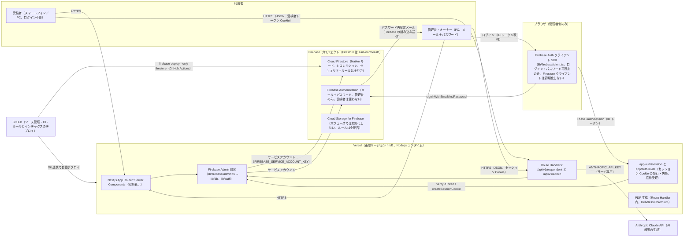
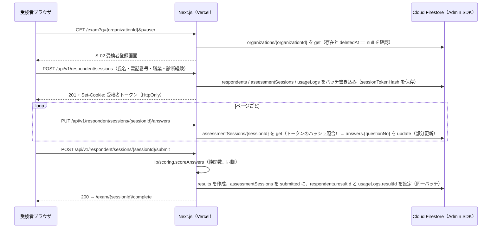
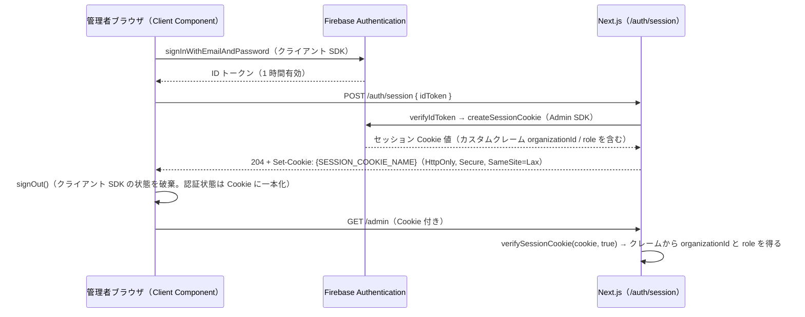
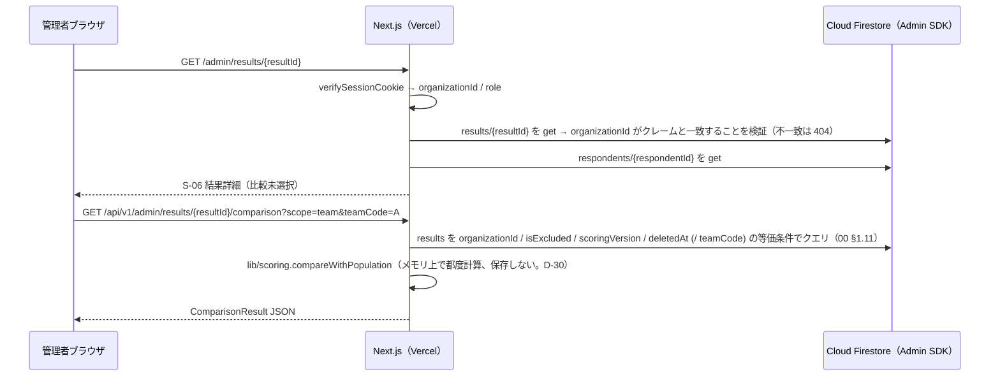
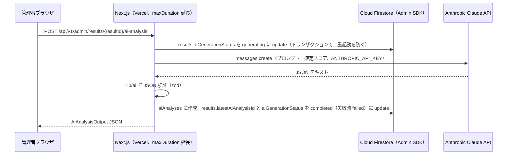
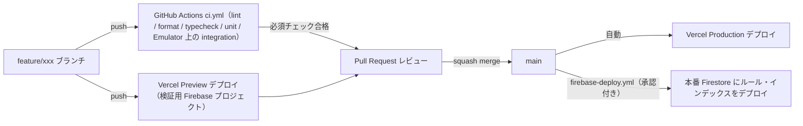
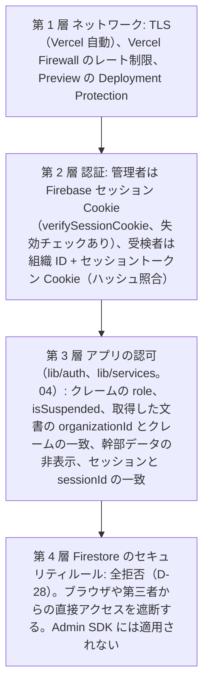

# 基本設計 01 システム構成・環境・Firebase プロジェクト設定・デプロイ

| 項目 | 内容 |
|---|---|
| 文書名 | 適性検査システム 基本設計 01 システム構成・環境・Firebase プロジェクト設定・デプロイ |
| 版 | 2.0 |
| 作成日 | 2026-09-17 |
| 更新日 | 2026-09-21（2.0 版: 技術構成の変更（Supabase → Firebase。10 K-06、00 2.0 版）を反映した全面改版。§12.2 参照） |
| 対象 | 実装者、運用担当、依頼主（環境準備の手順） |
| 前提文書 | `docs/基本設計/00_共通定義.md` 2.0 版（用語・コレクション名・型名・環境変数名・API 規約は本書でも 00 に従う。00 が正） |

## 0. 本書の位置づけ

本書は、新システムを **どこで・何を使って・どう動かすか** を確定する分冊です。全体アーキテクチャ、リポジトリ構成、依存ライブラリと版の方針、環境（ローカル Emulator・プレビュー・本番）と環境変数の管理、Firebase プロジェクトの設定、開発フローと CI/CD、依頼主が自分で行う環境準備の手順、セキュリティ方針、非機能要件への対応、監視・ログ・バックアップを定めます。

- 本書は 00 共通定義（§2 Firestore 規約、§2.5 アクセス経路、§3.2 環境変数名、§3.3 ディレクトリ構成、§4 API 規約、§5 役割）を前提とし、そこに **値の管理方法・実行基盤・Firebase プロジェクト側の設定・運用手順** を加えるものです。00 で確定済みの名称は変更しません。
- 他分冊の範囲（Firestore の文書定義・ルール・インデックス・アクセス層・認証の仕組みは 02、採点は 03、API 入出力は 04、画面は 05・06、AI と PDF の処理内容は 07、実装順・テスト計画は 08）は定義せず、参照だけにします。本書を理解するために必要な最小限の再掲のみ行います。02・04・08 は本書と同時に Firebase 前提へ改版中のため、本書からの参照は 00 2.0 版に記載された範囲（00 §2.2、§3.3、§4、§5、§8 D-28〜D-34）にとどめ、各分冊の節番号は引用しません。
- 実行基盤の決定（Vercel の関数実行時間、Node.js ランタイム、Firebase プロジェクトの分け方、Firestore のロケーション、Firebase CLI の実行方法など）は他分冊の前提条件になるため、本書で確定します。
- 記載した外部サービス（Vercel、Firebase、Google Cloud、GitHub、Anthropic）の画面名・メニュー名は変わり得るため、手順は「概ね」の位置と内容で書いています。実際の画面が異なる場合は同じ目的の項目を探してください。
- Firebase の仕様のうち設計時点で確信が持てない点は「実装時確認」と明記し、記憶で断定しません。実装初期に検証用プロジェクトまたは Emulator で確認し、結果を運用文書に記録します。

### 0.1 参照した要件

| 参照元 | 参照した内容 |
|---|---|
| 要件定義書 §3 | システム全体像（受検者はログイン不要、管理者はメール＋パスワード） |
| 要件定義書 §4 | 利用者と権限（役割と組織分離の前提） |
| 要件定義書 §6.1 U-03、§6.2 A-12 | 受検リンク・管理者追加用リンクの形式（URL 生成に使う公開 URL） |
| 要件定義書 §6.5、付録E | ApexCharts の採用（ライブラリ選定の根拠）、PDF の生成方式候補（付録E §7） |
| 要件定義書 §6.6、§10、付録D | 生成 AI 連携（API キーとモデル名の管理）。既存の **応答フォーマット** は Gemini 形式（candidates/content/parts）だった（要件定義書 §10）。リクエスト形式・モデル名・API キーは未確認 |
| 要件定義書 §9 | 非機能要件（個人情報保護、認証、性能、可用性、出力、多言語、対応端末） |
| 要件定義書 §10 | 外部連携（生成 AI、メール、PDF、CSV は未確認） |
| 要件定義書 §12 | 未確認事項（モバイル表示、完了メール、パスワード再設定メールの文言など） |
| 00 共通定義 §2.1、§2.2、§2.5 | Firestore の命名規約（既定データベース、ロケーションは 01 が定める、全拒否ルール、複合インデックスの宣言場所）、コレクション 8 つ、アクセス経路（Admin SDK のみ） |
| 00 共通定義 §3.2 | 環境変数名（本書で値の管理方法を定める） |
| 00 共通定義 §3.3 | ディレクトリ構成（`firebase/`、`lib/firebase/`、`lib/db/`、`lib/auth/`、`scripts/`。本書で設定ファイル・CI 用ディレクトリを追加） |
| 00 共通定義 §4.1、§4.2 | Route Handler のみ使用、入力検証ライブラリは 01 が選定、セッション Cookie による管理者認証、認証処理の配置（`/auth/session`、`/auth/invite`） |
| 00 共通定義 §5 | カスタムクレーム（`organizationId`、`role`）、利用停止の手順 |
| 00 共通定義 §8 | D-16（セッショントークンで再開）、D-17（モデル名）、D-22（`adminUsers` の ID = Auth uid）、D-23（受検者 API は Admin SDK）、D-24（`auditLogs`）、D-28（全拒否ルール）、D-29（回答 map）、D-30（メモリ集計）、D-31（セッション Cookie）、D-32（受検者トークン）、D-33（Emulator）、D-34（複製フィールド） |
| 10 決定記録 K-06 | 技術構成の変更（Supabase → Firebase）と確定した構成 |
| tests/fixtures/README.md | 検証用データの取り扱い注意（リポジトリ公開範囲） |

### 0.2 決定事項との対応

| # | 決定事項（変更不可） | 本書での対応 |
|---|---|---|
| 1 | Next.js（App Router、TypeScript）on Vercel + Firebase（Cloud Firestore（Native モード）、Firebase Authentication（メール＋パスワード）、Cloud Storage for Firebase（必要な場合））。サーバ側は Admin SDK のみ、ブラウザから Firestore に直接アクセスしない。ローカル・CI は Emulator Suite。グラフは ApexCharts（react-apexcharts）。2.0 版で Supabase から変更（10 K-06） | §1 アーキテクチャ、§3 ライブラリ（`next`、`firebase`、`firebase-admin`、`firebase-tools`、`apexcharts`、`react-apexcharts`）、§4 環境変数、§5 環境と Firebase プロジェクト設定、§6 デプロイ（ルール・インデックス） |
| 2 | 要件定義書 §11 の不具合 10 件を修正 | 本書の直接の担当はないが、6 番（比較値を永続化しない）を「サーバ側で母集団の `results` を読みメモリ上で都度計算する Route Handler」という実行方式で担保（§1.3、D-30）。9 番（`scoringVersion`）はコード改版とインデックスのデプロイ運用（§6.4）で将来のロジック改版に備える |
| 3 | 出題は Q1〜Q144 のみ | 本書の対象外（03・05）。設問マスタはコード内定数のため、Firestore への投入手順は無い（00 D-01） |
| 4 | 既存データは移行しない | 移行ツール・移行用環境は用意しない。初期データは組織と初期オーナーの作成だけ（§7.6） |
| 5 | AI 解説は Claude API。連携先は差し替え可能 | `@anthropic-ai/sdk` を採用し（§3.2）、`AI_PROVIDER` で provider を切り替える環境変数設計（§4）。API キーはサーバ専用（§8.3） |
| 6 | 日本語のみ。管理画面は PC 幅、受検者画面はスマートフォン対応 | i18n ライブラリを入れない（§3.3）。表示タイムゾーンを Asia/Tokyo に固定（§4.4）。E2E テストで受検者画面をモバイルビューポートでも実行（§6.3） |

## 1. 全体アーキテクチャ

### 1.1 構成図



- ブラウザから Firestore に直接アクセスする経路は **ありません**（00 §2.5、D-28）。ブラウザが Firebase と直接通信するのは、管理者のログインとパスワード再設定に使う Firebase Auth クライアント SDK だけです。
- Firestore・Cloud Storage のセキュリティルールは全拒否のため、誤ってブラウザから呼んでも拒否されます。認可はすべてサーバコード（`lib/auth/`、`lib/services/`、Route Handler）で行います（00 §4.1）。

### 1.2 構成要素と責務

| 構成要素 | 担うもの | 根拠・設計判断 |
|---|---|---|
| Next.js（App Router、TypeScript） | 受検者画面（`app/(respondent)`）、管理者画面（`app/(admin)`）、API（`app/api/v1`）、認証用 Route Handler（`app/auth/session`、`app/auth/invite`）。画面の初期表示は Server Component が `lib/services/` を直接呼び、更新操作はすべて Route Handler を経由する（00 §3.3、§4.1） | 決定事項 1 |
| Vercel | Next.js のホスティング（Serverless Functions）、Git 連携による Preview／Production デプロイ、環境変数の保管、アクセスログ、Firewall（レート制限） | 決定事項 1 |
| Cloud Firestore（Native モード） | 00 §2.2 の 8 コレクション（`organizations`、`adminUsers`、`respondents`、`assessmentSessions`、`results`、`aiAnalyses`、`usageLogs`、`auditLogs`）。マスタはコード内定数で Firestore に持たない（00 D-01）。組織分離は文書の `organizationId` とサーバの検証（00 §2.1）。比較計算の結果は保存しない（00 §1.11 の 6 番）。ロケーションは `asia-northeast1`（§5.3） | 決定事項 1、2、10 K-06 |
| Firebase Authentication | 管理者のメール＋パスワード認証、パスワード再設定メール、管理者追加（Admin SDK `createUser`）。組織 ID と役割はカスタムクレーム（00 §5）。受検者は Auth を使わず、組織 ID とセッショントークンで認可（00 §4.1、D-32） | 要件定義書 §9 認証、D-16、D-22、D-31 |
| Firebase Admin SDK | サーバ（Route Handler、Server Component、`scripts/`）から Firestore・Auth にアクセスする唯一の経路。`lib/firebase/admin.ts` で単一インスタンスを初期化し、`lib/db/`・`lib/auth/` だけが使う（00 §2.5、§3.3） | D-23、D-28 |
| Firebase Auth クライアント SDK（ブラウザ） | ログイン（`signInWithEmailAndPassword`）で ID トークンを取得し `POST /auth/session` に渡す。パスワード再設定メールの送信。Firestore クライアントは初期化しない（00 §2.5） | D-31 |
| Cloud Storage for Firebase | PDF を保存する場合の非公開領域。07 D07-21 で「本フェーズでは保存しない（応答ストリームで返す）」と確定しているため、**本フェーズでは有効化しない**（§5.3、§8.5、D01-45）。`firebase/storage.rules`（全拒否）はリポジトリに置くだけでデプロイしない | 決定事項 1、付録E §7、07 D07-21 |
| Firebase Emulator Suite | ローカル・CI の Auth（9099）と Firestore（8080）。本番・検証プロジェクトには接続しない（00 D-33） | 決定事項 1 |
| Anthropic Claude API | AI 解説の生成。`lib/ai/` の provider の 1 実装（00 §3.6）。呼び出しはサーバ（Route Handler）からのみ | 決定事項 5 |
| PDF 生成 | 結果詳細の印刷用レイアウトを HTML→PDF 変換（付録E §7 の推奨）。Vercel の Node.js ランタイム上で実行（§3.2、§5.4）。レイアウトと処理内容は 07 分冊 | 要件定義書 §9 出力 |
| メール送信 | パスワード再設定メールは Firebase Authentication の組み込み送信を使う（SMTP 事業者の契約は不要。送信元の表示名・返信先・送信元ドメインはコンソールで変更可。§5.3、§7.7）。アプリからの直接送信はない（D-15） | 要件定義書 §10、D01-24 |
| GitHub | ソース管理、Pull Request、GitHub Actions による lint・typecheck・unit test・Emulator 上の結合テスト、Firestore のルール・インデックスのデプロイ | 開発フローの前提（§6） |

### 1.3 処理の流れ（代表 4 本）

受検（登録→回答→送信→採点）:



管理者のログイン（セッション Cookie の発行）:



結果詳細の閲覧と比較（比較値は保存しない）:



AI 解説の生成:



- 採点は送信時に同期実行します（要件定義書 §9 性能「2 秒以内」）。`lib/scoring/` は I/O を持たない純関数のため、Route Handler 内で完結します。
- 比較計算・AI 生成・PDF 生成はすべて Route Handler（サーバ）で行い、ブラウザには結果だけを返します。ブラウザから Firestore に直接読み書きすることはありません（D-23、D-28）。
- 複数文書の整合が必要な書き込みはバッチ書き込みまたはトランザクションで行います（00 §2.2 の補足。単位は 02・04 が確定）。

### 1.4 実行ランタイムの方針

| 項目 | 方針 | 理由 |
|---|---|---|
| Route Handler・Server Component のランタイム | すべて Node.js ランタイム（`export const runtime = "nodejs"`）。Edge ランタイムは使わない | Firebase Admin SDK（gRPC を使う Firestore クライアント、セッション Cookie の検証）、PDF 生成（Chromium）、Anthropic SDK は Node.js 前提。ランタイムを混在させない方が事故が少ない（設計判断 D01-01） |
| `middleware.ts` | Edge ランタイムで動くため Admin SDK を呼ばず、**セッション Cookie の有無だけ** を見て未認証を遮断する（00 §3.3、D-31）。Cookie の検証は Node ランタイムの layout／Route Handler で行う | 実装時確認: Next.js の middleware が Node.js ランタイムを選べる版であれば、そこで `verifySessionCookie` を行う設計に変えてもよいが、本書は Edge 前提で設計する |
| 関数のリージョン | `hnd1`（東京） | Firestore を `asia-northeast1`（東京）に置くため、往復遅延を抑える（D01-22） |
| 関数の実行時間上限 | 既定は Vercel の初期値。AI 解説生成と PDF 生成の Route Handler だけ `export const maxDuration` で延長する（AI: 300 秒、PDF: 120 秒を上限の目安。§5.4） | LLM の応答時間と Chromium の起動時間。Vercel Pro プラン以上が必要（§7.2） |
| Admin SDK のインスタンス | モジュールスコープで 1 回だけ初期化し（`getApps().length === 0` のときだけ `initializeApp`）、関数インスタンスが温かい間は再利用する（§5.5） | Serverless Function の再利用時に二重初期化で例外になることを避ける |
| キャッシュ | 管理者画面・API はすべて動的（`dynamic = "force-dynamic"` またはリクエストごとの Cookie 参照により自動的に動的）。受検者画面も動的。静的化するのはイラスト等の `public/` だけ | 個人情報を含む画面をキャッシュしない |
| 画像 | `public/images/**`（00 §3.8）。`next/image` の最適化は使ってもよいが、外部ドメインは許可しない | イラストは自前配置のみ |

## 2. リポジトリ構成

00 §3.3 のディレクトリ構成を正とし、本書で **設定ファイル・CI・ドキュメント・スクリプト** を追加します。以下は最上位から見た全体です（`app/`、`lib/`、`components/` の内部は 00 §3.3 のとおり）。

```text
.
├── .github/
│   ├── workflows/
│   │   ├── ci.yml                    # lint・typecheck・unit test・マスタ再生成検査・Emulator 上の結合テスト（§6.2）
│   │   ├── e2e.yml                   # E2E（08 分冊が内容を定める。Emulator を起動して実行。§6.3）
│   │   └── firebase-deploy.yml       # Firestore のルール・インデックスのデプロイ（§6.4）
│   ├── dependabot.yml                # 依存関係の更新監視（§3.1）
│   ├── PULL_REQUEST_TEMPLATE.md
│   └── CODEOWNERS                    # 任意
├── app/                              # 00 §3.3
├── components/                       # 00 §3.3
├── lib/                              # 00 §3.3
│   ├── firebase/
│   │   ├── client.ts                 # ブラウザ専用。Firebase Auth クライアント SDK の初期化のみ（§5.5）
│   │   └── admin.ts                  # サーバ専用。Admin SDK の初期化（単一インスタンス。§5.5）
│   ├── db/                           # Firestore アクセス層（02 が内部構成を確定）
│   ├── auth/                         # session-cookie.ts、claims.ts、respondent-token.ts、pdf-token.ts（02・04）
│   └── utils/
│       ├── env.ts                    # 環境変数の読み取りと検証（§4.3）
│       └── logger.ts                 # 構造化ログ（§8.6）
├── middleware.ts                     # 管理者ページで Cookie の有無だけを確認（§5.5）
├── public/
│   ├── fonts/                        # Noto Sans JP（OFL）。PDF 印刷用ページで使う（07 §9.7）
│   └── images/{types,characters,aptitudes,styles,positions}/   # 00 §3.8
├── firebase/
│   ├── firebase.json                 # Emulator の設定（auth 9099、firestore 8080、ui 4000）と rules・indexes のパス（§5.6）
│   ├── .firebaserc                   # プロジェクト別名 production / staging（§5.6）
│   ├── firestore.rules               # 全拒否（00 D-28。内容は 02）
│   ├── firestore.indexes.json        # 複合インデックス（02）
│   └── storage.rules                 # 全拒否（本フェーズではデプロイしない。§8.5）
├── scripts/
│   ├── generate-masters.ts           # 付録A・B → lib/masters/data/*.json（03 §4.5、08）
│   ├── generate-texts.ts             # 付録C → lib/masters/data/texts/*.json（08）
│   ├── create-owner.ts               # 組織と初期オーナーの作成（Admin SDK。§7.6）
│   ├── set-admin-role.ts             # 役割変更・利用停止（Admin SDK。00 §5）
│   ├── seed-local.ts                 # Emulator 用の組織・オーナー投入（§11）。本番には投入しない
│   └── check-env.ts                  # 必須環境変数の存在確認（CI・起動前）
├── tests/
│   ├── unit/                         # Vitest（Emulator 不要）
│   ├── integration/                  # Vitest（Emulator 必須。08）
│   ├── e2e/                          # Playwright（Emulator 必須。08）
│   ├── fixtures/                     # existing_results.json（既存）
│   └── verify_fixtures.py            # 既存（移植は 08 分冊）
├── docs/
│   ├── 要件定義書.md、付録A〜E
│   └── 基本設計/00〜10
├── .env.example                      # 環境変数の雛形（値は空。§4.5）
├── .gitignore                        # .env*.local、node_modules、.next、playwright-report、firebase-debug.log、firestore-debug.log、ui-debug.log、firebase/emulator-data など
├── .nvmrc                            # Node.js の版（§3.1）
├── .prettierrc、eslint.config.mjs
├── next.config.ts                    # セキュリティヘッダー（§8.7）、サーバ専用パッケージの指定
├── package.json                      # packageManager 固定、scripts（§3.4）
├── pnpm-lock.yaml
├── playwright.config.ts
├── tsconfig.json                     # strict、paths: @/* → ./*
├── vercel.json                       # regions、関数設定（§5.2）
├── vitest.config.ts
└── README.md
```

補足:

- `lib/scoring/` と `lib/masters/` は Next.js・Firebase に依存しない純粋な TypeScript とします（00 §3.3）。`tsconfig.json` の `paths` を `@/*` に統一し、これら 2 ディレクトリからは `@/lib/scoring`・`@/lib/masters` 以外を import しないことを ESLint の `no-restricted-imports` で機械的に禁止します（§3.5）。
- 2.0 版で `supabase/`（migrations、seed、config.toml）、`scripts/generate-question-seed.ts`、`lib/db/database.types.ts`（生成物）、`app/auth/callback/route.ts` を **廃止** しました。設問マスタはコード内定数のみで持つため、シード投入の仕組みは不要です（00 D-01）。Firestore の型は 02 が `Doc` 型として手書きで定義し、生成ツールは使いません（D01-06）。
- Firebase CLI（`firebase-tools`）の設定ファイルは `firebase/` に置き、CLI はリポジトリ直下から `--config firebase/firebase.json` を付けて実行します（§5.6、設計判断 D01-37。00 §3.3 の「実装時確認」への本書の回答。CLI がこの配置で `.firebaserc` を見つけられない場合は `--project` を明示して補う）。
- `scripts/generate-masters.ts` と `scripts/generate-texts.ts` の中身は 03 §4.5・08 が定めます。本書は配置と `package.json` の scripts 名（§3.4）、CI の再生成検査（§6.2）を担当します。
- `scripts/create-owner.ts`・`scripts/set-admin-role.ts`・`scripts/seed-local.ts` は Admin SDK を直接使う運用・開発用スクリプトです（00 §3.3。`firebase-admin` の import が許される場所）。処理内容（クレームの付与、`adminUsers` 文書の形）は 02 が定め、本書は配置・実行方法・接続先の切り替え（§4.2、§7.6、§11）を定めます。
- Emulator が出力するログ（`firebase-debug.log`、`firestore-debug.log`、`ui-debug.log`）とエクスポートデータ（`firebase/emulator-data/`）は `.gitignore` に入れます。
- `tests/fixtures/existing_results.json` は依頼主の既存システム由来です（tests/fixtures/README.md）。リポジトリは **private** で運用し、公開範囲を変える場合は依頼主に確認します（§8.1）。

## 3. 主要ライブラリと版の方針

### 3.1 版の決め方（共通ルール）

| ルール | 内容 |
|---|---|
| ロックファイル固定 | `pnpm-lock.yaml` をコミットし、CI・Vercel は `pnpm install --frozen-lockfile` で再現する |
| メジャー版の固定 | `package.json` ではキャレット（`^`）を使い、メジャー版はロックファイルで固定する。メジャー更新は PR で個別に行う |
| 実装開始時に確定 | 下表の「版の方針」は本書作成時点の方針です。**実装開始時に各ライブラリの最新安定版を確認し、`package.json` に記録した版を正** とします。本書の表は改版しません |
| Node.js | Vercel がサポートする最新の LTS（本書時点では 22 系を想定）。`.nvmrc` と `package.json` の `engines.node`、Vercel のプロジェクト設定（Node.js Version）を一致させる。`firebase-admin` が要求する Node.js の下限を満たすことを実装開始時に確認する |
| パッケージマネージャ | pnpm。`package.json` の `packageManager` フィールドで版を固定し、Corepack で有効化する（設計判断 D01-02） |
| 更新の監視 | GitHub の Dependabot（`.github/dependabot.yml`、週次、グループ化）を有効にし、セキュリティ更新は優先して取り込む。`firebase`・`firebase-admin`・`firebase-tools` は同じグループにまとめ、Emulator の結合テスト（§6.2）で互換性を確認してから取り込む |

### 3.2 採用ライブラリ

| 区分 | パッケージ | 版の方針 | 用途 | 根拠・備考 |
|---|---|---|---|---|
| フレームワーク | `next` | App Router が安定している最新メジャー（本書時点では 15 系を想定） | 画面・API・認証用 Route Handler | 決定事項 1 |
| UI | `react`、`react-dom` | `next` が要求する版に合わせる（19 系想定） | | 決定事項 1 |
| 言語 | `typescript` | 5 系最新 | `strict: true`、`any` 禁止（00 §3.1） | |
| グラフ | `apexcharts`、`react-apexcharts` | 既存は ApexCharts v3.37.3（付録E 冒頭）。新規は最新安定版を採用し、付録E §2 の設定キー（`type: radar`、`yaxis.max`、`yaxis.show`、`stroke`、`fill`、`markers.size`、`legend.position`、`dataLabels.enabled`）が同じ意味で使えることを実装初期に確認する。差異があれば 3 系の最新に固定する | レーダー 3 種、ドーナツゲージ（`radialBar`、付録E §3） | 決定事項 1、要件定義書 §6.5。`react-apexcharts` はブラウザ専用のため `next/dynamic` の `ssr: false` で読み込む（06 分冊）。D01-25 |
| Firebase（サーバ） | `firebase-admin` | 最新安定版（モジュール形式の import `firebase-admin/app`、`firebase-admin/auth`、`firebase-admin/firestore` を使う） | `lib/firebase/admin.ts` の初期化、`lib/db/`（Firestore）、`lib/auth/`（`verifyIdToken`、`createSessionCookie`、`verifySessionCookie`、`createUser`、`setCustomUserClaims`、`revokeRefreshTokens`）、`scripts/` | 決定事項 1、00 §2.5、§3.3。`app/`・`components/` からは import しない（§3.5） |
| Firebase（ブラウザ） | `firebase` | 最新安定版（モジュール形式の import `firebase/app`、`firebase/auth` のみ。`firebase/firestore` は import しない） | `lib/firebase/client.ts` の初期化、ログイン・パスワード再設定の Client Component | 決定事項 1、00 §2.5。ツリーシェイクにより Auth 以外のバンドルを含めない |
| Firebase CLI | `firebase-tools`（devDependency） | 最新安定版 | Emulator Suite の起動（`emulators:start`、`emulators:exec`）、ルール・インデックスのデプロイ（`deploy --only firestore`） | 決定事項 1、00 D-33。Emulator の実行には Java ランタイムが必要（要求される版は `firebase-tools` のリリースノートに従う。実装時確認。§11） |
| 入力検証 | `zod` | 最新安定版 | Route Handler の入力検証（00 §4.1「01 が選定」）、**Firestore 書き込み前のスキーマ検証**（00 §2.1。Firestore に型制約がないため）、環境変数の検証（§4.3）、AI 出力 JSON の検証（07 分冊） | 設計判断 D01-03: TypeScript 型を推論でき、`Doc` 型（02）と同じ定義から検証スキーマを作れる |
| AI | `@anthropic-ai/sdk` | 最新安定版 | `lib/ai/providers/anthropic.ts`（07 分冊）。`AiProvider` インターフェース（00 §3.6）の実装として閉じ込め、他の場所から直接 import しない | 決定事項 5 |
| PDF | `puppeteer-core` + `@sparticuz/chromium`（候補） | 最新安定版。両者の対応する Chromium 版を合わせる | 印刷用ページを Headless Chromium で PDF 化（付録E §7 の推奨方式）。Vercel の Serverless Function で動かすための軽量 Chromium | 設計判断 D01-04（§5.4）。採否と代替（`@react-pdf/renderer` など）の最終判断は 07 分冊 |
| 日時 | 標準の `Intl.DateTimeFormat`（`timeZone: "Asia/Tokyo"`） | — | 表示のタイムゾーン変換（00 §2.1「`Timestamp`（UTC）で保存し、表示は Asia/Tokyo」）。日時ライブラリは原則追加しない | 設計判断 D01-05 |
| 単体・結合テスト | `vitest` | 最新安定版 | `tests/unit`、`tests/integration`（結合は Emulator 上。08） | 依頼指定 |
| E2E テスト | `@playwright/test` | 最新安定版 | `tests/e2e`。受検者画面はモバイルビューポートでも実行 | 依頼指定 |
| Lint・整形 | `eslint`、`eslint-config-next`、`typescript-eslint`、`prettier` | 最新安定版 | CI で実行（§6.2） | |
| スクリプト実行 | `tsx`（devDependency） | 最新安定版 | `scripts/*.ts` を TypeScript のまま実行する（§3.4） | 設計判断 D01-36: ビルド不要で単発スクリプトを動かすため。Next.js のバンドルには含めない |

### 3.3 採用しないもの

| 候補 | 採用しない理由 |
|---|---|
| Chart.js | 既存で読み込まれていたが結果画面のグラフはすべて ApexCharts だった（要件定義書 §6.5） |
| Server Action | 00 §4.1 で Route Handler のみと確定（テストと監査ログの一元化） |
| Firestore の ODM・ラッパー（型付きコンバータのライブラリなど） | コレクション 8 つ・フィールド名は 00 で確定済みで、Admin SDK の `withConverter` と `lib/db/mappers/` の手書き変換で足りる（設計判断 D01-06。02 が `Doc` 型と変換を定める） |
| Firestore クライアント SDK（`firebase/firestore`） | ブラウザから Firestore にアクセスしない（00 §2.5、D-28）。バンドルに含めない |
| Cloud Functions for Firebase | サーバ処理は Next.js の Route Handler（Vercel）に集約する。トリガー処理（文書の作成時に別文書を更新する等）は使わず、複製フィールドの同期はバッチ書き込みで行う（00 D-34）。デプロイ先を 2 つにしない（設計判断 D01-06） |
| Firebase Hosting | Next.js のホスティングは Vercel（決定事項 1）。Firebase 側は Firestore と Auth だけを使う |
| Firebase App Check | 本フェーズでは使わない（§8.10、設計判断 D01-40） |
| Supabase 関連（`@supabase/supabase-js`、`@supabase/ssr`、Supabase CLI） | 2.0 版で廃止（10 K-06） |
| i18n ライブラリ | 日本語のみ（決定事項 6） |
| CSV 出力ライブラリ | 既存に CSV 出力ボタンは確認できず（要件定義書 §10、未確認）。要件にないため入れない |
| 状態管理ライブラリ（Redux 等） | 画面ごとの状態は React の標準機能で足りる。必要になれば 06 分冊で判断 |
| メール送信 SDK・SMTP 事業者 | パスワード再設定メールは Firebase Authentication が送る（§7.7）。アプリからの直接送信はない（D-15: 完了メールは送らない） |

### 3.4 `package.json` の雛形

```json
{
  "name": "tekisei-kensa",
  "private": true,
  "packageManager": "pnpm@{実装開始時に固定した版}",
  "engines": { "node": ">=22 <23" },
  "scripts": {
    "dev": "next dev",
    "build": "next build",
    "start": "next start",
    "lint": "eslint .",
    "format": "prettier --check .",
    "format:write": "prettier --write .",
    "typecheck": "tsc --noEmit",
    "test": "vitest run --project unit",
    "test:watch": "vitest --project unit",
    "test:integration": "vitest run --project integration",
    "test:integration:emu": "pnpm firebase emulators:exec --only auth,firestore --project demo-tekisei \"pnpm test:integration\"",
    "test:e2e": "playwright test",
    "check-env": "tsx scripts/check-env.ts",
    "masters:generate": "tsx scripts/generate-masters.ts",
    "texts:generate": "tsx scripts/generate-texts.ts",
    "masters:check": "tsx scripts/generate-masters.ts --check && tsx scripts/generate-texts.ts --check",
    "owner:create": "tsx scripts/create-owner.ts",
    "admin:set-role": "tsx scripts/set-admin-role.ts",
    "seed:local": "tsx scripts/seed-local.ts",
    "firebase": "firebase --config firebase/firebase.json",
    "emulators": "pnpm firebase emulators:start --only auth,firestore --project demo-tekisei",
    "emulators:persist": "pnpm firebase emulators:start --only auth,firestore --project demo-tekisei --import firebase/emulator-data --export-on-exit",
    "firestore:deploy": "pnpm firebase deploy --only firestore",
    "ci": "pnpm lint && pnpm format && pnpm typecheck && pnpm test"
  }
}
```

- `firebase` スクリプトは `firebase-tools` に設定ファイルの場所を渡す共通の入口です。ほかの `firebase` 系スクリプトはこれを経由します（`pnpm firebase <サブコマンド>`。D01-37）。
- ローカル・CI の Emulator は **`demo-` で始まるプロジェクト ID**（`demo-tekisei`）で起動します。Firebase CLI は `demo-` 接頭辞のプロジェクト ID を「実在しないデモ用プロジェクト」として扱い、実プロジェクトへの接続や認証情報を要求しません（設計判断 D01-38。実装時確認: `demo-` 接頭辞の扱いと、クライアント SDK・Admin SDK 側の `projectId` を同じ値にすればよいこと）。アプリ側は `NEXT_PUBLIC_FIREBASE_PROJECT_ID=demo-tekisei` で同じ ID を使います（§4.2）。
- `test:integration:emu` は Emulator を起動し、結合テストを実行し、終了後に Emulator を止めるまでを 1 コマンドで行います（`firebase emulators:exec`）。CI はこれを使います（§6.2）。ローカルで Emulator を立てたまま繰り返すときは `pnpm emulators` と `pnpm test:integration` を別ターミナルで使います。
- `emulators:persist` は Emulator のデータを `firebase/emulator-data/` に保存・復元する開発用の任意コマンドです（git 管理外）。テストではデータを保存しません（テストごとにクリア。00 D-33）。
- `masters:generate`・`texts:generate`・`masters:check` は 08 が要求するもので、`--check` は再生成結果がコミット済みの生成物とバイト一致することを検査します。`masters:check` は CI（§6.2）で実行します。2.0 版で `seed:questions`（`questions` テーブルのシード生成）を廃止しました。
- `owner:create`・`admin:set-role` は本番・検証プロジェクトに対して実行する運用スクリプトです（§7.6）。対象プロジェクトのサービスアカウント鍵を環境変数で受け取るため、実装者のローカルからは **Emulator に対してのみ** 実行し、本番・検証プロジェクトに対しては依頼主または運用責任者が実行します。
- Vitest の `--project` は `vitest.config.ts` で `unit`（`tests/unit/**`、Emulator 不要）と `integration`（`tests/integration/**`、Emulator 必須）を分けるためのものです。詳細は 08 分冊。

### 3.5 Lint 規則のうち本書で確定するもの

| 規則 | 内容 |
|---|---|
| `@typescript-eslint/no-explicit-any: error` | 00 §3.1（`any` 禁止） |
| `no-restricted-imports`（第 1 群） | `lib/scoring/**` と `lib/masters/**` から `next`、`react`、`firebase`、`firebase/*`、`firebase-admin`、`firebase-admin/*`、`@anthropic-ai/*`、`@/lib/db`、`@/lib/firebase`、`@/lib/auth`、`@/lib/services`、`@/lib/ai`、`@/lib/pdf` の import を禁止（純関数の維持、00 §3.3） |
| `no-restricted-imports`（第 2 群） | `app/**`、`components/**` から `firebase-admin`、`firebase-admin/*`、`@/lib/firebase/admin`、`@/lib/db/*`、`@anthropic-ai/*`、`puppeteer-core`、`@sparticuz/chromium` の import を禁止（サーバ専用処理を `lib/services/`・`lib/auth/`・Route Handler に閉じ込める。00 §3.3「`firebase-admin` を import してよいのは `lib/firebase/admin.ts`、`lib/db/`、`lib/auth/`、`scripts/` だけ」）。例外: `app/api/**/route.ts` と `app/auth/**/route.ts` からの `@/lib/services`・`@/lib/auth` の import は許可（Route Handler 自体はサーバ専用） |
| `no-restricted-imports`（第 3 群） | `firebase/app`・`firebase/auth`（クライアント SDK）の import を `lib/firebase/client.ts` と `components/admin/auth/**`（ログイン・パスワード再設定の Client Component。配置は 06）以外で禁止。`firebase/firestore`・`firebase/storage` はどこからも禁止（00 §2.5） |
| `no-restricted-syntax`（`process.env` の直接参照） | `lib/utils/env.ts` 以外で `process.env` を参照することを禁止する（§4.3）。**例外は `scripts/**`**（Next.js の外で単発実行する運用・生成スクリプト。`scripts/check-env.ts` は `process.env` を検証する側であり、`scripts/create-owner.ts` は `serverEnv()` が要求する `AI_MODEL` 等を持たない環境でも動く必要がある）。`lib/pdf/browser.ts` が Vercel 上かどうかを判定する場合も `process.env.VERCEL` を直接読まず、`serverEnv().VERCEL`（§4.3 の `isVercel()`）を使う（07 §9.10） |
| `no-console: error`（`lib/utils/logger.ts` と `scripts/**` を除く） | ログは §8.6 の logger 経由に限定し、個人情報の混入経路を減らす |
| Prettier | 既定設定（幅 100、ダブルクォート、セミコロンあり）。議論しない |

## 4. 環境変数

### 4.1 一覧

名前は 00 §3.2 で確定済みです。本書で用途の詳細、設定場所、秘匿区分、公開範囲を定めます。「ブラウザ公開」が「あり」のものだけ `NEXT_PUBLIC_` 接頭辞を持ちます。

| 変数名 | 用途 | ブラウザ公開 | 秘匿 | 設定場所 | 値の例（形式） |
|---|---|---|---|---|---|
| `NEXT_PUBLIC_FIREBASE_API_KEY` | Firebase Web アプリの API キー。ブラウザの Firebase Auth クライアント SDK の初期化に使う。秘匿情報ではないが、Google Cloud コンソールで **HTTP リファラーと API の制限** を設定する（§5.3、D01-46） | あり | なし | ローカル `.env.local`（Emulator 用のダミー値でよい）、Vercel（Preview は検証用、Production は本番用プロジェクトの値） | `AIza...` の形式の文字列。ローカルは `demo-api-key` |
| `NEXT_PUBLIC_FIREBASE_AUTH_DOMAIN` | Firebase Auth の認証ドメイン | あり | なし | 同上 | `{project-id}.firebaseapp.com`。ローカルは `localhost` |
| `NEXT_PUBLIC_FIREBASE_PROJECT_ID` | Firebase プロジェクト ID。ブラウザとサーバの両方で使う（サーバは Admin SDK の `projectId`、サービスアカウント鍵の `project_id` との一致検証。§4.3） | あり | なし | 同上 | `tekisei-prod` のような文字列。ローカルは `demo-tekisei` |
| `NEXT_PUBLIC_FIREBASE_APP_ID` | Firebase Web アプリ ID | あり | なし | 同上 | `1:{数字}:web:{16 進}`。ローカルは `demo-app-id` |
| `NEXT_PUBLIC_FIREBASE_AUTH_EMULATOR_HOST` | ローカル・CI 専用（任意）。設定時はブラウザの Auth クライアントを Auth Emulator に接続する（`connectAuthEmulator`） | あり | なし | ローカル `.env.local`、CI。**Vercel には置かない**（§4.3 の起動時検証で `VERCEL = "1"` かつ設定ありは失敗） | `127.0.0.1:9099` |
| `FIREBASE_SERVICE_ACCOUNT_KEY` | サービスアカウント JSON を **Base64 化した値**。Admin SDK（Firestore・Auth）の初期化に使う。サーバ専用・秘匿。Emulator 使用時（下記 2 変数が設定されているとき）は省略可（§4.3） | なし | **秘匿** | Vercel（Preview は検証用、Production は本番用プロジェクトの鍵。Sensitive 指定）、運用者の作業用シェル（`owner:create` 等の実行時のみ）。**ローカル `.env.local` と GitHub Actions には置かない**（ローカル・CI は Emulator） | 作り方は §4.6 |
| `FIREBASE_AUTH_EMULATOR_HOST` | ローカル・CI 専用。Admin SDK が自動認識して Auth Emulator に接続する | なし | なし | ローカル `.env.local`、CI。Vercel には置かない（起動時検証で拒否） | `127.0.0.1:9099` |
| `FIRESTORE_EMULATOR_HOST` | ローカル・CI 専用。Admin SDK が自動認識して Firestore Emulator に接続する | なし | なし | 同上 | `127.0.0.1:8080` |
| `FIREBASE_STORAGE_BUCKET` | Cloud Storage for Firebase のバケット名。本フェーズでは PDF を保存しないため **未設定**（07 D07-21、§8.5） | なし | なし | （未設定） | `{project-id}.appspot.com` などの形式（実際のバケット名はコンソールで確認） |
| `SESSION_COOKIE_NAME` | 管理者セッション Cookie の名前（任意。初期値 `admin_session`。04） | なし | なし | 任意。通常は未設定 | `admin_session` |
| `NEXT_PUBLIC_APP_BASE_URL` | 受検リンク・管理者追加用リンクの生成（要件定義書 §6.2 A-12）、パスワード再設定メールの戻り先 URL の組み立て（**サーバ側のみ**。ブラウザ側の扱いは §4.2） | あり | なし | ローカル `http://localhost:3000`、Preview はデプロイ URL を自動で使うため未設定可（§4.2）、Production は本番ドメイン | `https://{本番ドメイン}` |
| `AI_PROVIDER` | AI 解説の連携先。`lib/ai/` の provider 選択（00 §3.6） | なし | なし | 全環境 | `anthropic` |
| `ANTHROPIC_API_KEY` | Claude API キー。サーバ処理でのみ使用 | なし | **秘匿** | ローカル `.env.local`（開発者個人のキー、または未設定でスタブ provider）、Vercel（Sensitive 指定）。GitHub Actions には置かない（CI で実 API を呼ばない） | `sk-ant-...` |
| `AI_MODEL` | 使用モデル名。`aiAnalyses.model` に保存 | なし | なし | 全環境 | 初期値 `claude-opus-5`（07 §4.1、D-17。`.env.example` に記載。§4.5） |
| `AI_PROMPT_VERSION` | プロンプト版。`aiAnalyses.promptVersion` に保存。起動時に `lib/ai/prompts/index.ts` の `PROMPT_REGISTRY` に存在することを検証する（07 §2.2、§4.3） | なし | なし | 全環境 | 初期値 `recruitment-v1`（07 §2.2、D07-02） |
| `PDF_TOKEN_SECRET` | PDF 印刷トークン（HMAC-SHA256）の署名鍵（04 D04-40、07 §9.9）。他の鍵から派生させず専用に持つ | なし | **秘匿** | ローカル `.env.local`、Vercel（Preview／Production で **別の値**、Sensitive 指定）、GitHub Actions（ジョブ内で生成。§6.2、§6.3） | `openssl rand -base64 32` で生成した 44 文字の文字列（32 バイト以上の乱数） |
| `PDF_CHROMIUM_EXECUTABLE_PATH` | ローカル・CI で PDF 生成に使う Chrome／Chromium の実行ファイルのパス（07 §9.12）。未設定ならローカルでは PDF 生成のみ「未設定」エラーになり、他の機能は動く | なし | なし | ローカル `.env.local`（任意）と CI（`e2e.yml` が `playwright install` 直後に Playwright の Chromium のパスをジョブ内で設定する。§6.3）。**Vercel には置かない**（起動時検証で `VERCEL = "1"` かつ設定ありは失敗） | `/Applications/Google Chrome.app/Contents/MacOS/Google Chrome` のような絶対パス |

補足（新規ではなく運用上の派生。00 §3.2 には載せない）:

| 変数名 | 用途 | 設定場所 |
|---|---|---|
| `NODE_ENV` | Next.js が自動設定。手動で設定しない | — |
| `VERCEL_ENV`、`VERCEL_URL` | Vercel が自動設定。`production` / `preview` / `development`。Preview で `NEXT_PUBLIC_APP_BASE_URL` 未設定時のフォールバックに使う（§4.2） | Vercel 自動 |
| `VERCEL` | Vercel が自動設定（Vercel 上では `"1"`）。`lib/pdf/browser.ts` が `@sparticuz/chromium` を使うかローカルの Chromium を使うかの判定に使う（07 §9.10）。参照は `serverEnv().VERCEL`（`isVercel()`）経由に限る（§3.5、§4.3） | Vercel 自動 |
| `VERCEL_AUTOMATION_BYPASS_SECRET` | Vercel の Deployment Protection の「Protection Bypass for Automation」を有効にすると Vercel が自動設定する。Preview で PDF 生成の Chromium が自分自身の印刷用ページを開くとき `x-vercel-protection-bypass` ヘッダーに載せる（07 §9.13）。本番では未設定（ヘッダーを付けない）。**推定: 変数名・ヘッダー名は Vercel の機能名から推定したもので、実装時に Vercel のドキュメントで確認する（07 D07-23、本書 D01-31）** | Vercel 自動（Preview のみ。§5.2） |
| `GOOGLE_APPLICATION_CREDENTIALS` | **アプリは読まない**。GitHub Actions の `firebase-deploy.yml` が Firebase CLI の認証に使う（CI 用サービスアカウント鍵のファイルパス。§6.4）。アプリの Admin SDK は `FIREBASE_SERVICE_ACCOUNT_KEY` だけを使い、この変数による暗黙の認証情報探索に依存しない | GitHub Actions のジョブ内（Secrets からファイルに書き出す） |
| `FIREBASE_CI_SERVICE_ACCOUNT_KEY`（GitHub Secret 名） | **アプリは読まない**。ルール・インデックスをデプロイする CI 用サービスアカウント鍵（Base64 JSON）。Environment ごとに別の鍵 | GitHub Actions Secrets（Environment `staging`、`production`） |
| `PLAYWRIGHT_BASE_URL` | E2E の対象 URL。ローカルは `http://localhost:3000` | ローカル、GitHub Actions |

- 環境変数を **追加する場合は 00 §3.2 に追記してから** 使います。`GOOGLE_APPLICATION_CREDENTIALS` と `FIREBASE_CI_SERVICE_ACCOUNT_KEY` はアプリが読まない CI 専用の値のため、`VERCEL_*` と同じく派生表の扱いとし、00 §3.2 には載せません（設計判断 D01-30。00 §3.2 の注記「GitHub Actions 専用の変数は本表に載せない」と一致）。
- 2.0 版で Supabase 用の 3 変数（`NEXT_PUBLIC_SUPABASE_URL`、`NEXT_PUBLIC_SUPABASE_ANON_KEY`、`SUPABASE_SERVICE_ROLE_KEY`）と CI 用の 4 変数（`SUPABASE_ACCESS_TOKEN`、`SUPABASE_PROJECT_REF`、`SUPABASE_DB_PASSWORD`、`SUPABASE_DB_URL`）を削除しました。
- `AI_PROVIDER` に `stub` を許容します（設計判断 D01-07）。`ANTHROPIC_API_KEY` を持たない開発者やローカルの E2E で、固定の `AiAnalysisOutput` を返す provider に切り替えるためです。`stub` の実装は 07 分冊（`lib/ai/providers/stub.ts`）。本番で `stub` が設定された場合は起動時検証（§4.3）で失敗させます。
- セッション Cookie の署名鍵は不要です（Firebase が署名する。00 §3.2、D-31）。受検者トークンの署名鍵も不要です（乱数のハッシュを保存する。D-32）。

### 4.2 環境ごとの値の管理

| 環境 | Next.js の実行場所 | Firebase | 環境変数の置き場所 | 備考 |
|---|---|---|---|---|
| ローカル（開発者 PC） | `pnpm dev` | **Emulator Suite**（Auth 9099、Firestore 8080）。プロジェクト ID は `demo-tekisei`。実プロジェクトには接続しない | `.env.local`（git 管理外） | 実 API キーは任意。無ければ `AI_PROVIDER=stub`。`FIREBASE_SERVICE_ACCOUNT_KEY` は置かない |
| CI（GitHub Actions） | ビルド・テストのみ | `ci.yml`・`e2e.yml` はジョブ内で Emulator を起動（`firebase emulators:exec`）。`firebase-deploy.yml` だけが実プロジェクトに接続する（ルール・インデックスのデプロイ。§6.4） | ワークフロー内の `env:` と GitHub Environment Secrets（`FIREBASE_CI_SERVICE_ACCOUNT_KEY` のみ） | 実 API キー・アプリ用のサービスアカウント鍵は置かない |
| Preview（Vercel） | PR ごとの Preview デプロイ | **検証用 Firebase プロジェクト**（本番とは別プロジェクト） | Vercel の環境変数（Preview スコープ） | Preview URL は Vercel の Deployment Protection で保護（§8.8） |
| Production（Vercel） | `main` ブランチのデプロイ | **本番 Firebase プロジェクト**（依頼主が作成済みのプロジェクト） | Vercel の環境変数（Production スコープ、秘匿値は Sensitive 指定） | 本番ドメインを割り当て |

- 設計判断 D01-08（2.0 版で更新）: Firebase プロジェクトは **本番用と検証用の 2 つ** を作ります。依頼主が作成済みのプロジェクトを本番用とし、検証用（`staging`）を追加で作成します（§7.4）。理由: Firestore のセキュリティルール・インデックス・Auth の設定はプロジェクト単位のため、Preview で試す変更が本番に影響しないようにする。Preview デプロイはすべて検証用プロジェクトを共有します。検証用プロジェクトのデータはテストデータのみとし、実在の受検者情報を入れません。1 プロジェクト内で複数の Firestore データベースを作って分ける方式は採りません（Auth は分けられず、Admin SDK・Emulator の設定も複雑になるため）。
- 実装者のローカルは常に Emulator です。検証用プロジェクトに接続する必要がある作業（Auth 設定の確認、インデックスの検証など）は Preview デプロイで行うか、依頼主または運用責任者が実行します。
- Preview では `NEXT_PUBLIC_APP_BASE_URL` を固定できない（URL がデプロイごとに変わる）ため、未設定なら `https://${VERCEL_URL}` を使います。`lib/utils/env.ts` の `appBaseUrl()` にこのフォールバックを実装します。Production では必ず明示設定します。
- `appBaseUrl()` は **サーバ専用** です（`serverEnv()` を経由するため、ブラウザからは呼べません）。ブラウザ側で基底 URL が必要な処理（パスワード再設定メールの戻り先 `continueUrl` など。06）は、次のいずれかで求めます（設計判断 D01-35）。
  1. `window.location.origin` を使う（推奨。Preview でもそのデプロイ自身の URL になる）。
  2. Server Component が `appBaseUrl()` の値を props で Client Component に渡す。

  ブラウザ側のコードから `process.env.NEXT_PUBLIC_APP_BASE_URL` を **直接参照しません**（Preview では未設定のため `undefined/...` のような URL になる。§3.5 の Lint でも禁止）。受検リンク・招待リンクの文字列はサーバ（04 の `GET /api/v1/admin/me`）が `appBaseUrl()` で生成し、画面は表示するだけです。
- ブラウザ側で戻り先 URL（`continueUrl`）を Firebase Auth に渡す場合、そのドメインが Firebase Auth の「承認済みドメイン」に登録されている必要があります（§5.3。実装時確認: 承認済みドメインの検査対象に `continueUrl` が含まれること、および Preview のワイルドカードドメインを登録できるかどうか。登録できない場合、Preview ではパスワード再設定の戻り先を検証用の固定ドメイン（Vercel のブランチ固定 URL など）にする）。
- `.env.local` はコミットしません。`.gitignore` に `.env*.local` を入れ、`.env.example` にキー名だけを置きます（§4.5）。

### 4.3 起動時の検証（`lib/utils/env.ts`）

環境変数の読み取りを 1 箇所に集約し、`zod` で検証します。`process.env` を直接読むコードを他の場所に書きません（`no-restricted-syntax` で `process.env` の直接参照を `lib/utils/env.ts` 以外で禁止）。

```ts
// lib/utils/env.ts
import { z } from "zod";
import { PROMPT_REGISTRY } from "@/lib/ai/prompts"; // 文字列定数のみ。lib/ai/prompts は env.ts を import しない（循環回避）

const hostPattern = /^[A-Za-z0-9.-]+:\d+$/; // 例 127.0.0.1:8080

const serverSchema = z.object({
  NEXT_PUBLIC_FIREBASE_API_KEY: z.string().min(1),
  NEXT_PUBLIC_FIREBASE_AUTH_DOMAIN: z.string().min(1),
  NEXT_PUBLIC_FIREBASE_PROJECT_ID: z.string().min(1),
  NEXT_PUBLIC_FIREBASE_APP_ID: z.string().min(1),
  NEXT_PUBLIC_FIREBASE_AUTH_EMULATOR_HOST: z.string().regex(hostPattern).optional(),
  // サービスアカウント JSON の Base64。Emulator 使用時は省略可（下で条件検証）
  FIREBASE_SERVICE_ACCOUNT_KEY: z.string().min(1).optional(),
  FIREBASE_AUTH_EMULATOR_HOST: z.string().regex(hostPattern).optional(),
  FIRESTORE_EMULATOR_HOST: z.string().regex(hostPattern).optional(),
  FIREBASE_STORAGE_BUCKET: z.string().min(1).optional(),
  SESSION_COOKIE_NAME: z.string().regex(/^[A-Za-z0-9_-]+$/).default("admin_session"),
  NEXT_PUBLIC_APP_BASE_URL: z.string().url().optional(),
  AI_PROVIDER: z.enum(["anthropic", "stub"]).default("anthropic"),
  ANTHROPIC_API_KEY: z.string().min(1).optional(),
  AI_MODEL: z.string().min(1),
  AI_PROMPT_VERSION: z.string().min(1),
  // PDF 印刷トークンの HMAC 鍵（04 D04-40）。32 バイトの乱数を base64（44 文字）または hex（64 文字）で表した文字列
  PDF_TOKEN_SECRET: z.string().min(32),
  // ローカル・CI 専用・任意（07 §9.12）。Vercel では @sparticuz/chromium を使うため未設定
  PDF_CHROMIUM_EXECUTABLE_PATH: z.string().min(1).optional(),
  VERCEL: z.string().optional(),
  VERCEL_ENV: z.enum(["production", "preview", "development"]).optional(),
  VERCEL_URL: z.string().optional(),
  // Preview の Protection Bypass for Automation（07 §9.13、D07-23。推定: 変数名は実装時に確認）
  VERCEL_AUTOMATION_BYPASS_SECRET: z.string().optional(),
});

const publicSchema = z.object({
  NEXT_PUBLIC_FIREBASE_API_KEY: z.string().min(1),
  NEXT_PUBLIC_FIREBASE_AUTH_DOMAIN: z.string().min(1),
  NEXT_PUBLIC_FIREBASE_PROJECT_ID: z.string().min(1),
  NEXT_PUBLIC_FIREBASE_APP_ID: z.string().min(1),
  NEXT_PUBLIC_FIREBASE_AUTH_EMULATOR_HOST: z.string().regex(hostPattern).optional(),
});

/** サービスアカウント JSON のうち Admin SDK の cert() に必要な 3 項目だけを検証する */
const serviceAccountSchema = z.object({
  project_id: z.string().min(1),
  client_email: z.string().email(),
  private_key: z.string().min(1),
});

export type ServerEnv = z.infer<typeof serverSchema>;
export type PublicEnv = z.infer<typeof publicSchema>;
export type ServiceAccount = z.infer<typeof serviceAccountSchema>;

let cached: ServerEnv | null = null;

/** サーバ専用。Route Handler、Server Component、lib/services、lib/firebase/admin から呼ぶ */
export function serverEnv(): ServerEnv {
  if (cached) return cached;
  const parsed = serverSchema.safeParse(process.env);
  if (!parsed.success) {
    throw new Error(`環境変数が不正です: ${parsed.error.issues.map((i) => i.path.join(".")).join(", ")}`);
  }
  const env = parsed.data;
  const onVercel = env.VERCEL === "1";
  const usingEmulator = Boolean(env.FIRESTORE_EMULATOR_HOST || env.FIREBASE_AUTH_EMULATOR_HOST);

  if (onVercel && usingEmulator) {
    throw new Error("Vercel 上では FIRESTORE_EMULATOR_HOST / FIREBASE_AUTH_EMULATOR_HOST を設定しないでください");
  }
  if (onVercel && env.NEXT_PUBLIC_FIREBASE_AUTH_EMULATOR_HOST) {
    throw new Error("Vercel 上では NEXT_PUBLIC_FIREBASE_AUTH_EMULATOR_HOST を設定しないでください");
  }
  if (usingEmulator && !(env.FIRESTORE_EMULATOR_HOST && env.FIREBASE_AUTH_EMULATOR_HOST)) {
    throw new Error("Emulator を使う場合は FIRESTORE_EMULATOR_HOST と FIREBASE_AUTH_EMULATOR_HOST の両方を設定してください");
  }
  if (!usingEmulator && !env.FIREBASE_SERVICE_ACCOUNT_KEY) {
    throw new Error("Emulator を使わない場合は FIREBASE_SERVICE_ACCOUNT_KEY が必要です");
  }
  if (env.FIREBASE_SERVICE_ACCOUNT_KEY) {
    // 形式と project_id の一致を起動時に検証する（別プロジェクトの鍵を誤って登録する事故を防ぐ）
    const sa = parseServiceAccount(env.FIREBASE_SERVICE_ACCOUNT_KEY);
    if (sa.project_id !== env.NEXT_PUBLIC_FIREBASE_PROJECT_ID) {
      throw new Error("FIREBASE_SERVICE_ACCOUNT_KEY の project_id が NEXT_PUBLIC_FIREBASE_PROJECT_ID と一致しません");
    }
  }
  if (env.AI_PROVIDER === "anthropic" && !env.ANTHROPIC_API_KEY) {
    throw new Error("AI_PROVIDER=anthropic には ANTHROPIC_API_KEY が必要です");
  }
  if (env.VERCEL_ENV === "production" && env.AI_PROVIDER === "stub") {
    throw new Error("本番環境で AI_PROVIDER=stub は使用できません");
  }
  if (env.VERCEL_ENV === "production" && !env.NEXT_PUBLIC_APP_BASE_URL) {
    throw new Error("本番環境では NEXT_PUBLIC_APP_BASE_URL を設定してください");
  }
  if (!(env.AI_PROMPT_VERSION in PROMPT_REGISTRY)) {
    // 07 §2.2 の依頼。存在しない版で aiAnalyses.promptVersion を書かない
    throw new Error(`AI_PROMPT_VERSION=${env.AI_PROMPT_VERSION} は lib/ai/prompts の PROMPT_REGISTRY にありません`);
  }
  if (onVercel && env.PDF_CHROMIUM_EXECUTABLE_PATH) {
    throw new Error("Vercel 上では PDF_CHROMIUM_EXECUTABLE_PATH を設定しないでください（@sparticuz/chromium を使う）");
  }
  cached = env;
  return env;
}

/** Base64 の JSON をサービスアカウントとして復号・検証する。値そのものはログに出さない */
export function parseServiceAccount(base64: string): ServiceAccount {
  let json: unknown;
  try {
    json = JSON.parse(Buffer.from(base64, "base64").toString("utf8"));
  } catch {
    throw new Error("FIREBASE_SERVICE_ACCOUNT_KEY を Base64 の JSON として読めません");
  }
  const parsed = serviceAccountSchema.safeParse(json);
  if (!parsed.success) {
    throw new Error("FIREBASE_SERVICE_ACCOUNT_KEY に project_id / client_email / private_key がありません");
  }
  return parsed.data;
}

/** Emulator に接続しているか（lib/firebase/admin.ts、scripts が参照） */
export function isEmulator(): boolean {
  return Boolean(serverEnv().FIRESTORE_EMULATOR_HOST);
}

/** Vercel 上で動いているか（07 §9.10 の lib/pdf/browser.ts が使う。process.env.VERCEL を直接読まない） */
export function isVercel(): boolean {
  return serverEnv().VERCEL === "1";
}

/** ブラウザでも使える値だけ。NEXT_PUBLIC_ 以外を含めない */
export function publicEnv(): PublicEnv {
  return publicSchema.parse({
    NEXT_PUBLIC_FIREBASE_API_KEY: process.env.NEXT_PUBLIC_FIREBASE_API_KEY,
    NEXT_PUBLIC_FIREBASE_AUTH_DOMAIN: process.env.NEXT_PUBLIC_FIREBASE_AUTH_DOMAIN,
    NEXT_PUBLIC_FIREBASE_PROJECT_ID: process.env.NEXT_PUBLIC_FIREBASE_PROJECT_ID,
    NEXT_PUBLIC_FIREBASE_APP_ID: process.env.NEXT_PUBLIC_FIREBASE_APP_ID,
    NEXT_PUBLIC_FIREBASE_AUTH_EMULATOR_HOST: process.env.NEXT_PUBLIC_FIREBASE_AUTH_EMULATOR_HOST || undefined,
  });
}

/** 受検リンク・招待リンク・メールの戻り先の基底 URL */
export function appBaseUrl(): string {
  const env = serverEnv();
  if (env.NEXT_PUBLIC_APP_BASE_URL) return env.NEXT_PUBLIC_APP_BASE_URL.replace(/\/$/, "");
  if (env.VERCEL_URL) return `https://${env.VERCEL_URL}`;
  return "http://localhost:3000";
}
```

- `publicEnv()` は Next.js のビルド時置換に合わせて `process.env.NEXT_PUBLIC_*` を個別に参照します（オブジェクト全体を渡すとブラウザ側で置換されないため）。`publicEnv()` に `NEXT_PUBLIC_APP_BASE_URL` を **含めません**（Preview では未設定であり、ブラウザ側は `window.location.origin` を使う。§4.2、D01-35）。
- `appBaseUrl()`・`isVercel()`・`isEmulator()`・`parseServiceAccount()` は `serverEnv()` を経由するためサーバ専用です。Client Component（`"use client"`）から import した場合は `serverEnv()` が `process.env` を読めず検証エラーになるので、ブラウザ側では呼びません。
- `FIREBASE_SERVICE_ACCOUNT_KEY` の `project_id` と `NEXT_PUBLIC_FIREBASE_PROJECT_ID` の一致検証（設計判断 D01-39）は、Vercel の Preview に本番の鍵を登録するといった取り違えを起動時に検出するためのものです。検証は形式と一致だけで、鍵の値をログや例外メッセージに含めません。
- `scripts/check-env.ts` は同じスキーマで `.env.local` を検証し、`pnpm dev` の前に実行できるようにします。`PDF_TOKEN_SECRET` が未設定のときは「`openssl rand -base64 32` で生成して設定してください」と案内します。Emulator 用の 3 変数が揃っていないときはその旨を案内します。
- `AI_PROMPT_VERSION` のレジストリ照合（07 §2.2 の依頼）は `serverEnv()` の初回呼び出しで行うため、Route Handler の最初のリクエストで失敗が表面化します。`scripts/check-env.ts` も同じ照合を行い、起動前に検出できるようにします。
- `scripts/create-owner.ts` 等の運用スクリプトは `serverEnv()` を使わず（`AI_MODEL` 等を要求しないため）、`process.env` から Firebase 関連の変数だけを読み、`parseServiceAccount()` と `lib/firebase/admin.ts` の初期化関数を共有します（§3.5 の例外）。

### 4.4 タイムゾーンとロケール

- Firestore は `Timestamp`（UTC）、API は ISO 8601 UTC（00 §2.1、§4.1）。表示は `lib/presentation/format-datetime.ts`（ファイル名は 06 §10.3 に合わせる）の 1 関数に集約し、`Intl.DateTimeFormat("ja-JP", { timeZone: "Asia/Tokyo", ... })` で変換します。
- サーバの `TZ` 環境変数に依存しません（Vercel の関数は UTC で動く前提で、明示的に `timeZone` を渡す）。
- `Timestamp` ↔ `Date` の変換は `lib/db/mappers/` に集約します（00 §3.1）。`Timestamp.toDate()` は UTC 基準の `Date` を返すため、タイムゾーンの考慮は表示層だけで行います。

### 4.5 `.env.example`

```bash
# --- Firebase（ブラウザ用の公開設定。Firebase コンソール → プロジェクトの設定 → 全般 → マイアプリ → SDK の設定と構成）---
# ローカルは Emulator を使うためダミー値でよい（プロジェクト ID は demo- で始める）
NEXT_PUBLIC_FIREBASE_API_KEY=demo-api-key
NEXT_PUBLIC_FIREBASE_AUTH_DOMAIN=localhost
NEXT_PUBLIC_FIREBASE_PROJECT_ID=demo-tekisei
NEXT_PUBLIC_FIREBASE_APP_ID=demo-app-id

# --- Firebase Emulator（ローカル・CI 専用。Vercel には置かない）---
NEXT_PUBLIC_FIREBASE_AUTH_EMULATOR_HOST=127.0.0.1:9099
FIREBASE_AUTH_EMULATOR_HOST=127.0.0.1:9099
FIRESTORE_EMULATOR_HOST=127.0.0.1:8080

# --- Firebase（サーバ用。Emulator 使用時は空のままでよい。作り方は 01 §4.6。ローカルには本番・検証の鍵を置かない）---
FIREBASE_SERVICE_ACCOUNT_KEY=
# 本フェーズでは未使用（07 D07-21）
FIREBASE_STORAGE_BUCKET=
# 任意。未設定なら admin_session
SESSION_COOKIE_NAME=

# --- アプリ ---
# 受検リンク・招待リンクの基底 URL。ローカルは http://localhost:3000。Preview では未設定可
NEXT_PUBLIC_APP_BASE_URL=http://localhost:3000

# --- AI 解説 ---
# anthropic | stub（stub は API キー不要。本番では不可）
AI_PROVIDER=stub
ANTHROPIC_API_KEY=
# 初期値は docs/基本設計/07_AI解説とPDF.md §4.1・§2.2（D-17、D07-02）
AI_MODEL=claude-opus-5
AI_PROMPT_VERSION=recruitment-v1

# --- PDF ---
# 印刷トークンの署名鍵（04 D04-40）。openssl rand -base64 32 で生成。環境ごとに別の値にする
PDF_TOKEN_SECRET=
# ローカルの Chrome / Chromium の実行ファイル（07 §9.12）。任意。未設定なら PDF 生成だけが「未設定」エラーになる
PDF_CHROMIUM_EXECUTABLE_PATH=

# --- テスト ---
PLAYWRIGHT_BASE_URL=http://localhost:3000
```

### 4.6 `FIREBASE_SERVICE_ACCOUNT_KEY` の作り方

サービスアカウント鍵は **Firebase プロジェクトの全データを読み書きできる秘密情報** です。次の手順で作り、Base64 化した値を Vercel の環境変数（Sensitive）にだけ登録します。

1. Firebase コンソールで対象プロジェクト（本番用または検証用）を開き、概ね「プロジェクトの設定（歯車）→ サービス アカウント」を開く。
2. 「Firebase Admin SDK」の欄で「新しい秘密鍵の生成」を押し、JSON ファイルをダウンロードする（ファイル名は `{project-id}-firebase-adminsdk-{識別子}.json` のような形式）。
3. ダウンロードした JSON を **1 行の Base64 文字列** にする。改行を含めないこと（Vercel の環境変数に貼り付けたとき改行があると復号に失敗する）。

   ```bash
   # macOS
   base64 -i {ダウンロードした JSON のパス} | tr -d '\n' > service-account.b64

   # Linux
   base64 -w 0 {ダウンロードした JSON のパス} > service-account.b64
   ```

   ```powershell
   # Windows（PowerShell）
   [Convert]::ToBase64String([IO.File]::ReadAllBytes("{ダウンロードした JSON のパス}")) | Set-Content -NoNewline service-account.b64
   ```

4. `service-account.b64` の中身（1 行）を Vercel の環境変数 `FIREBASE_SERVICE_ACCOUNT_KEY` に登録する（本番用プロジェクトの鍵は Production スコープ、検証用プロジェクトの鍵は Preview スコープ。Sensitive を有効にする。§7.2）。
5. 登録後、ダウンロードした JSON と `service-account.b64` は **削除する**（パスワードマネージャに保管する場合は JSON をそのまま登録し、Base64 は都度作る）。リポジトリ、`.env.local`、チャット、Issue、メールに **貼らない**。
6. 復号の確認は §4.3 の起動時検証（`project_id` の一致）に任せる。ローカルで確認したい場合は次のコマンドで `project_id` だけを表示する（鍵の本体は表示しない）。

   ```bash
   base64 -d service-account.b64 | node -e 'let s="";process.stdin.on("data",d=>s+=d).on("end",()=>console.log(JSON.parse(s).project_id))'
   ```

- 値の大きさ: サービスアカウント JSON は概ね 2〜3 KB で、Base64 化しても 4 KB 程度です。Vercel の環境変数の上限（実装時確認: 1 変数あたりと合計の上限）に収まります。
- 鍵の使い分け: 本番用プロジェクトと検証用プロジェクトで別の鍵（別のサービスアカウント）になります。CI のルール・インデックスのデプロイには、アプリ用とは別に権限を絞ったサービスアカウントを作ります（§6.4、§7.4）。
- ローテーション: 漏えいの疑いがあるとき、担当者の離任時、年 1 回のいずれかで、Firebase コンソール（またはGoogle Cloud コンソールの IAM → サービス アカウント → キー）で新しい鍵を生成して Vercel の値を差し替え、再デプロイ後に古い鍵を削除します（§8.3）。

## 5. 環境とデプロイ基盤の設定

### 5.1 環境の一覧

| 環境 | 目的 | URL | データ | 誰が使う |
|---|---|---|---|---|
| ローカル | 実装・単体・結合テスト・E2E | `http://localhost:3000` | Firebase Emulator Suite（Auth、Firestore）。起動のたびに空から始まり、`pnpm seed:local` で組織とオーナーを投入する（§11） | 実装者 |
| Preview | PR ごとの動作確認・レビュー | Vercel が発行する PR 用 URL | 検証用 Firebase プロジェクト（テストデータのみ） | 実装者、レビュー担当、依頼主（受入前の確認） |
| 本番 | 実運用 | 本番ドメイン | 本番 Firebase プロジェクト（依頼主が作成済み） | 管理者・オーナー、受検者 |

### 5.2 Vercel プロジェクト設定

| 設定 | 値 | 備考 |
|---|---|---|
| Framework Preset | Next.js | 自動検出 |
| Root Directory | リポジトリ直下 | |
| Build Command | `pnpm build` | 既定のままでよい |
| Install Command | `pnpm install --frozen-lockfile` | ロックファイル固定 |
| Node.js Version | `.nvmrc` と同じ | |
| Production Branch | `main` | |
| Preview Deployments | 全ブランチ（PR）で有効 | |
| Deployment Protection | Preview を Vercel Authentication で保護（§8.8）。あわせて **Protection Bypass for Automation を有効化** する（設計判断 D01-31） | 個人情報を扱う画面を無防備に公開しない。検証データのみとはいえ保護する。Bypass は、Preview で PDF 生成の Chromium が自分自身の印刷用ページを開くために必要（07 §9.13）。有効化するとシークレットは Vercel が環境変数（`VERCEL_AUTOMATION_BYPASS_SECRET`）として関数に渡す。**推定: 変数名・ヘッダー名（`x-vercel-protection-bypass`）は実装時に Vercel のドキュメントで確認する（07 D07-23）** |
| Environment Variables | §4.2 のとおり。秘匿値（`FIREBASE_SERVICE_ACCOUNT_KEY`、`ANTHROPIC_API_KEY`、`PDF_TOKEN_SECRET`）は Sensitive を指定 | Preview と Production で **別の Firebase プロジェクトの値** を登録する |
| Functions Region | `hnd1` | `vercel.json` で指定 |
| Functions のメモリ（CPU／メモリ サイズ） | 既定より大きいサイズ（**1 GB 以上**）をプロジェクト設定で選ぶ（設計判断 D01-32） | PDF 生成の Chromium のため（07 §9.9、§9.10、§11 (4)）。Next.js App Router のセグメント設定では `memory` を指定できないため、Vercel のプロジェクト設定（Functions の既定サイズ）で **全関数共通** に設定する。**推定: 設定箇所の名称と選べるサイズはプランと時期で変わるため、実装時に Vercel のドキュメントで確認する。** |
| Domains | 本番ドメインを Production に割り当て | 依頼主が取得（§7.3） |
| Vercel Firewall | レート制限ルール（§8.4） | プランにより利用可否が異なる |

`vercel.json`:

```json
{
  "$schema": "https://openapi.vercel.sh/vercel.json",
  "regions": ["hnd1"],
  "framework": "nextjs"
}
```

- 関数ごとの `maxDuration` は `vercel.json` ではなく各 Route Handler の `export const maxDuration = 300;` で指定します（Next.js App Router のセグメント設定。対象は §5.4）。メモリは上表「Functions のメモリ」のとおり Vercel のプロジェクト設定で全関数共通に設定します（推定: 設定箇所は実装時に確認）。
- `next.config.ts` で `firebase-admin`（および `puppeteer-core`、`@sparticuz/chromium`）を **サーバ専用の外部パッケージ** として指定します（Next.js 15 では `serverExternalPackages`。実装時確認: 指定しなくてもバンドルが正しく動く場合は不要だが、gRPC のネイティブ依存とプロトコル定義ファイルをバンドラが壊す事例に備え、初期から指定する。§8.7 の設定例に含める）。

### 5.3 Firebase プロジェクト設定（本番・検証で同じ）

依頼主は本番用プロジェクトについて「プロジェクトの作成」「Firestore（本番モード、`asia-northeast1`）の作成」「Authentication のメール／パスワードの有効化」を完了しています。残りの設定を含めて、本番・検証の両プロジェクトで揃える値を以下に定めます（依頼主の作業手順は §7.4）。

| 設定 | 値 | 備考 |
|---|---|---|
| 料金プラン | **Blaze（従量課金）** を推奨し、Cloud Billing の **予算アラート** を設定する（設計判断 D01-14。2.0 版で Supabase Pro から置換） | 無料枠内の利用量でも、無料プランでは 1 日の無料割当を超えた時点で読み書きが拒否され得るため、本番は課金アカウントを紐づけて上限で止まらないようにする。Firestore のスケジュールバックアップ（§9.3）は課金アカウントの紐づけが前提（実装時確認）。月額の見積もりは §10.1 |
| Firestore: モード・ロケーション | Native モード、既定データベース `(default)`、ロケーション `asia-northeast1`（東京）。本番モード（ルールは全拒否）で作成済み | ロケーションは作成後に変更できない（実装時確認）。検証用プロジェクトも同じロケーションで作る。Vercel の `hnd1` と同一地域（D01-22） |
| Firestore: セキュリティルール | `firebase/firestore.rules`（全拒否。00 D-28、内容は 02）を CI からデプロイ（§6.4）。コンソールで直接編集しない | 「本番モード」で作成したときの初期ルールも全拒否のため、初回デプロイ前でも安全 |
| Firestore: 複合インデックス | `firebase/firestore.indexes.json`（02）を CI からデプロイ（§6.4）。コンソールの「インデックスを作成」リンクからは作らない（作った場合は JSON に取り込む） | インデックスの構築には時間がかかるため、インデックスを要するクエリを含むコードの **デプロイ前** に完了させる（§6.4 の順序） |
| Firestore: 削除保護・PITR | 削除保護（データベースの誤削除防止）は有効にする（実装時確認: 設定箇所）。ポイントインタイムリカバリ（PITR）は依頼主判断（追加課金。§9.3） | |
| Authentication: プロバイダ | メール／パスワードのみ有効（作成済み）。「メールリンク（パスワードなしでログイン）」は無効。他のプロバイダ（Google、電話など）は追加しない | 要件定義書 §9 認証 |
| Authentication: ユーザーの自己登録 | **無効**（概ね「Authentication → 設定 → ユーザー アクション → 作成（登録）を有効にする」をオフ。設計判断 D01-09、D01-28） | 公開サインアップ（クライアント SDK の `createUserWithEmailAndPassword`）を止める。管理者追加は `POST /auth/invite` がサーバで招待トークンを検証したうえで Admin SDK `createUser` でユーザーを作る（00 §4.2）。実装時確認: この設定が Admin SDK の `createUser` に影響しないこと（影響する場合は設定を有効のままにし、クライアント側で `createUserWithEmailAndPassword` を呼ばないことをコードと Lint で担保する） |
| Authentication: メール列挙保護 | 有効（新規プロジェクトの既定に従う。実装時確認） | 存在しないメールアドレスとパスワード誤りの応答を区別させない。ログイン画面のエラー文言は「メールアドレスまたはパスワードが正しくありません」の 1 種類にする（06） |
| Authentication: パスワード ポリシー | 8 文字以上、英字と数字を含む（設計判断 D01-10。概ね「Authentication → 設定 → パスワード ポリシー」で設定。実装時確認: 設定項目の有無。無い場合はサーバ側（`POST /auth/invite`、`PATCH /api/v1/admin/me`）の入力検証で同じ条件を課す） | 既存要件なし |
| Authentication: 承認済みドメイン | `localhost`（既定）、`{project-id}.firebaseapp.com`（既定）、本番ドメイン（本番プロジェクト）、Preview の検証用ドメイン（検証プロジェクト。§4.2） | パスワード再設定メールの戻り先（`continueUrl`）に使うドメイン。実装時確認: ワイルドカードの可否 |
| Authentication: メール テンプレート | 「パスワードの再設定」「メールアドレスの変更」の件名・本文を日本語にする（文言は 06 分冊が定める）。送信者名は依頼主の医院名またはサービス名。返信先は依頼主の連絡先 | 既存文言は未確認（要件定義書 §12）。D01-23 |
| Authentication: 送信元ドメイン | 任意。既定では Firebase の既定ドメインから送られる。依頼主のドメインから送りたい場合は「テンプレート → ドメインをカスタマイズ」で DNS レコード（SPF・DKIM 相当）を設定する（§7.7） | 到達率の改善のため推奨するが必須ではない（D01-24） |
| Authentication: アクション URL | パスワード再設定メールのリンク先。既定は Firebase がホストする画面（`{authDomain}/__/auth/action`）。**本書の推奨**: `{本番ドメイン}/admin/password-reset` にカスタマイズし、画面側でクライアント SDK の `verifyPasswordResetCode`／`confirmPasswordReset` を使って完了させる（設計判断 D01-47。方式の確定は 00 §4.2 のとおり 02・04・06） | 既定の Firebase ホスト画面は英語表記が混じり、本システムの管理画面と見た目が揃わないため。検証用プロジェクトでは Preview のドメインが固定できないため、既定のままか検証用の固定ドメインにする |
| Authentication: セッション Cookie | 有効期限は 14 日を上限に 04 が定める（00 §4.1。実装時確認: `createSessionCookie` の `expiresIn` の範囲は 5 分〜14 日）。属性は §5.7 | D-31 |
| Web アプリの登録 | コンソールの「プロジェクトの設定 → 全般 → マイアプリ → アプリを追加 → ウェブ」で 1 つ登録し、`apiKey`、`authDomain`、`projectId`、`appId` を控える（§7.4）。Firebase Hosting は設定しない | ブラウザの Auth クライアント SDK の初期化に必要（§4.1） |
| API キーの制限 | Web アプリ登録時に自動作成されるブラウザ用 API キーに、Google Cloud コンソール（APIs & Services → 認証情報）で **アプリケーションの制限（HTTP リファラー: 本番ドメインまたは Preview のドメイン）** と **API の制限（Firebase Authentication が使う API のみ。概ね Identity Toolkit API と Token Service API）** を設定する（設計判断 D01-46） | API キーは秘匿情報ではないが、他人のサイトから流用されて Auth の割当を消費されることを防ぐ。実装時確認: 制限後もログイン・パスワード再設定が動くこと（必要な API の一覧） |
| サービスアカウント | (1) アプリ用（Vercel の `FIREBASE_SERVICE_ACCOUNT_KEY`）: Firebase Admin SDK の既定サービスアカウント（`firebase-adminsdk-...`）の鍵を「新しい秘密鍵の生成」で発行（§4.6）。(2) CI 用（`FIREBASE_CI_SERVICE_ACCOUNT_KEY`）: Google Cloud コンソールの IAM で **別のサービスアカウント** を作り、Firestore のルールとインデックスのデプロイに必要な最小の役割（実装時確認: 概ね「Firebase ルール管理者」と「Cloud Datastore インデックス管理者」に相当する役割）だけを付与して鍵を発行（§6.4） | アプリ用の鍵に全権があるため、CI には渡さない |
| Cloud Storage for Firebase | **本フェーズでは有効化しない**（設計判断 D01-45。07 D07-21 で PDF を保存しないと確定）。将来有効化する場合は既定バケットを作り、`firebase/storage.rules`（全拒否）をデプロイし、`FIREBASE_STORAGE_BUCKET` を設定する（§8.5） | 実装時確認: 既定バケットの作成に必要な料金プラン |
| App Check | 使わない（§8.10、D01-40） | |
| Cloud Functions、Hosting、Extensions | 使わない（§3.3） | |
| 予算アラート | Cloud Billing で月額の予算を設定し、50%・90%・100% で依頼主にメール通知する（§9.1） | 従量課金の想定外の増加に気づくため |
| メンバー | 「プロジェクトの設定 → ユーザーと権限」で実装者を「編集者」以上で招待する（検証用は「オーナー」でもよい）。本番用のオーナー権限は依頼主のみ | 契約・所有権を依頼主に置く |

### 5.4 実行時間・メモリの割り当て

| Route Handler | `maxDuration` | 理由 |
|---|---|---|
| `POST /api/v1/respondent/sessions/{sessionId}/submit` | 既定（採点は数十 ms。Firestore のバッチ書き込み 4 件は通常 1 秒未満） | 要件定義書 §9「2 秒以内」 |
| `GET /api/v1/admin/results/{resultId}/comparison` | 既定 | 母集団の読み取り（数百文書）とメモリ上の計算。§10.1 の見積もりで数秒以内 |
| `POST /api/v1/admin/results/{resultId}/ai-analysis` | 300 秒 | LLM の生成待ち。既存は `maxOutputTokens=8192` と思考設定が確認されており（要件定義書 §12）、応答に数十秒以上かかり得る。Vercel Pro 以上が前提 |
| `GET /api/v1/admin/results/{resultId}/pdf` | 120 秒 | Chromium 起動＋レンダリング |
| その他 | 既定 | |

- 設計判断 D01-04（PDF の実行基盤）: Vercel の Node.js Function 上で `puppeteer-core` + `@sparticuz/chromium` を使い、印刷用ページ（`app/(admin)/admin/results/[resultId]/print/page.tsx`。07 分冊）を自分自身にアクセスして PDF 化します。制約: 関数のデプロイサイズ上限（Vercel の仕様。概ね 250 MB 展開後）に収まること、`@sparticuz/chromium` の版と `puppeteer-core` の版を合わせること。印刷用ページへのアクセスは PDF 印刷トークン（04 §7.2、07 §9.9）で認可し、管理者 Cookie は転送しません（D01-26）。
- AI 生成の同期待ち（300 秒）が運用上長すぎる場合の代替（非同期化して `aiGenerationStatus` をポーリング）は 07 分冊に委ねます。本書は同期方式でも動く上限を確保します。
- メモリ: PDF 生成の Chromium のため関数メモリは **1 GB 以上** とします（07 §9.9、§9.10）。設定は §5.2「Functions のメモリ」のとおり Vercel のプロジェクト設定で全関数共通に行い、依頼主手順 §7.2 に含めます（設計判断 D01-32）。
- PDF 生成の全体タイムアウトは 07 §9.10 が 90 秒の `AbortSignal` で管理します。`maxDuration = 120` はその外側の安全弁です。
- Admin SDK の Firestore クライアントは gRPC 接続を保持します。Serverless Function のコールドスタート時に初回接続の遅延（推定: 数百 ms）が加わりますが、要件（2 秒以内）の範囲内です。実装時確認: コールドスタートを含めた送信 API の応答時間を Preview で計測する（08）。

### 5.5 Firebase SDK の初期化（`lib/firebase/`）と `middleware.ts`

サーバ用（Admin SDK）とブラウザ用（Auth クライアント SDK）を **別ファイル** に分けます（00 §3.3）。Admin SDK はサービスアカウントで動作し、セキュリティルールの影響を受けません。ブラウザ用は Auth の初期化だけを行い、Firestore クライアントを初期化しません。

```ts
// lib/firebase/admin.ts  ── サーバ専用。Admin SDK の単一インスタンス
import { cert, getApps, initializeApp, type App } from "firebase-admin/app";
import { getAuth, type Auth } from "firebase-admin/auth";
import { getFirestore, type Firestore } from "firebase-admin/firestore";
import { serverEnv, parseServiceAccount } from "@/lib/utils/env";

function getApp(): App {
  const existing = getApps();
  if (existing.length > 0) return existing[0];
  const env = serverEnv();
  if (env.FIRESTORE_EMULATOR_HOST) {
    // Emulator: 認証情報は不要。FIRESTORE_EMULATOR_HOST / FIREBASE_AUTH_EMULATOR_HOST を SDK が自動認識する（00 §2.5、D-33）
    return initializeApp({ projectId: env.NEXT_PUBLIC_FIREBASE_PROJECT_ID });
  }
  const sa = parseServiceAccount(env.FIREBASE_SERVICE_ACCOUNT_KEY!); // serverEnv() が存在を保証済み
  return initializeApp({
    credential: cert({ projectId: sa.project_id, clientEmail: sa.client_email, privateKey: sa.private_key }),
    projectId: sa.project_id,
  });
}

/** Firestore。lib/db/ からのみ呼ぶ */
export function adminFirestore(): Firestore {
  const db = getFirestore(getApp());
  return db;
}

/** Firebase Auth（Admin）。lib/auth/ と scripts/ からのみ呼ぶ */
export function adminAuth(): Auth {
  return getAuth(getApp());
}
```

- `getApps()` で既存インスタンスを再利用するのは、Serverless Function の再利用時や Next.js の開発サーバのホットリロード時に `initializeApp` が二重に呼ばれて例外になることを避けるためです（§1.4）。
- Firestore の設定（`ignoreUndefinedProperties` など）は 02 が定めます。`undefined` を含むオブジェクトの書き込みは Admin SDK が既定で拒否するため、`Doc` 型に `undefined` を使わず `null` を明示する 00 §2.1 の規約と整合させます（実装時確認: 設定の要否）。
- Emulator への接続は環境変数だけで切り替わり、コードに Emulator 用の分岐は `projectId` だけの初期化以外にありません。したがって本番・検証・ローカルで同じコードが動きます（D-33）。

```ts
// lib/firebase/client.ts  ── ブラウザ専用。Firebase Auth クライアント SDK の初期化のみ
"use client";
import { getApps, initializeApp, type FirebaseApp } from "firebase/app";
import { connectAuthEmulator, getAuth, inMemoryPersistence, setPersistence, type Auth } from "firebase/auth";
import { publicEnv } from "@/lib/utils/env";

let authInstance: Auth | null = null;

/** ログイン・パスワード再設定の Client Component からのみ呼ぶ。Firestore クライアントは初期化しない（00 §2.5） */
export function clientAuth(): Auth {
  if (authInstance) return authInstance;
  const env = publicEnv();
  const app: FirebaseApp =
    getApps()[0] ??
    initializeApp({
      apiKey: env.NEXT_PUBLIC_FIREBASE_API_KEY,
      authDomain: env.NEXT_PUBLIC_FIREBASE_AUTH_DOMAIN,
      projectId: env.NEXT_PUBLIC_FIREBASE_PROJECT_ID,
      appId: env.NEXT_PUBLIC_FIREBASE_APP_ID,
    });
  const auth = getAuth(app);
  if (env.NEXT_PUBLIC_FIREBASE_AUTH_EMULATOR_HOST) {
    connectAuthEmulator(auth, `http://${env.NEXT_PUBLIC_FIREBASE_AUTH_EMULATOR_HOST}`, { disableWarnings: true });
  }
  // 認証状態をブラウザに永続化しない。ID トークンは POST /auth/session に渡した直後に signOut() で破棄する（00 §4.2）
  void setPersistence(auth, inMemoryPersistence);
  authInstance = auth;
  return auth;
}
```

- `inMemoryPersistence` により、クライアント SDK の認証状態（ID トークン・リフレッシュトークン）を `localStorage`・IndexedDB に保存しません（設計判断 D01-41）。認証状態はサーバが発行するセッション Cookie に一本化します（00 §4.2「発行後にブラウザ側では `signOut()`」）。`setPersistence` は非同期のため、ログイン処理はこの関数の戻り値を待ってから `signInWithEmailAndPassword` を呼びます（06）。
- Emulator に接続するときの `apiKey`・`appId` はダミー値で動きます（§4.5。実装時確認）。
- ログインの流れ（00 §4.1）: `signInWithEmailAndPassword` → `user.getIdToken()` → `fetch("/auth/session", { method: "POST", body: { idToken } })` → 応答の `Set-Cookie` を受け取る → `signOut()` → `/admin` へ遷移。ID トークンはリクエストボディで 1 回送るだけで、Cookie にもストレージにも保存しません。

`middleware.ts`（Edge ランタイム。Cookie の有無だけを確認）:

```ts
// middleware.ts（app/ と同階層）
import { NextResponse, type NextRequest } from "next/server";

export const config = {
  matcher: ["/admin/:path*", "/api/v1/admin/:path*"],
};

// 遮断しないパス（認証画面自身と、PDF 印刷トークンで認可する印刷用ページ）
const PUBLIC_ADMIN_PATHS = [/^\/admin\/login$/, /^\/admin\/signup$/, /^\/admin\/password-reset$/, /^\/admin\/results\/[^/]+\/print$/];

export function middleware(request: NextRequest) {
  const { pathname } = request.nextUrl;
  if (PUBLIC_ADMIN_PATHS.some((re) => re.test(pathname))) return NextResponse.next();
  // Edge ランタイムでは Admin SDK が動かないため、Cookie の存在だけを見る（00 §3.3、D-31）。
  // 名前は SESSION_COOKIE_NAME の既定値。Edge では lib/utils/env.ts を使えないため、環境変数を変える場合はここも合わせる（実装時確認）
  const cookieName = process.env.SESSION_COOKIE_NAME || "admin_session"; // eslint-disable-line no-restricted-syntax
  if (request.cookies.has(cookieName)) return NextResponse.next();
  if (pathname.startsWith("/api/")) {
    return NextResponse.json({ error: { code: "UNAUTHENTICATED", message: "ログインが必要です", details: {} } }, { status: 401 });
  }
  const login = new URL("/admin/login", request.url);
  login.searchParams.set("next", pathname);
  return NextResponse.redirect(login);
}
```

- `middleware.ts` は **利便性のための早期遮断** であり、認証の根拠ではありません。Cookie の検証（`verifySessionCookie(cookie, true)`）、役割、`isSuspended`、`organizationId` の一致は Node ランタイムの `lib/auth/` で毎回行います（00 §4.1 の認可 3 段階、04）。Cookie の値が偽物でも middleware は通しますが、直後の検証で 401 になります。
- `middleware.ts` は `lib/utils/env.ts` を import しません（`serverEnv()` は Edge で動かない値を要求し、`PROMPT_REGISTRY` の import も不要なため）。`process.env` の直接参照はこのファイルに限り Lint の例外とします（§3.5 に追記。設計判断 D01-01 の補足）。
- 除外パス: `/admin/login`、`/admin/signup`、`/admin/password-reset`（認証画面自身。除外しないとログイン画面が自分自身へ無限リダイレクトする）、`/admin/results/{resultId}/print`（PDF 生成の Chromium が開く印刷用ページ。管理者 Cookie を持たず、クエリ `token`（PDF 印刷トークン。04 §7.2、07 §9.9）だけで認可する）。受検者側（`/exam/**`、`/api/v1/respondent/**`）と `/auth/**` はそもそも対象外（Cookie `tk_session` の検証は Route Handler 内。04）。
- `/admin/login` にログイン済み（Cookie あり）で来た場合の `/admin` へのリダイレクトは画面側（06）で行います。

### 5.6 Firebase CLI の設定ファイル（`firebase/`）

```json
// firebase/firebase.json
{
  "firestore": {
    "rules": "firestore.rules",
    "indexes": "firestore.indexes.json"
  },
  "emulators": {
    "auth": { "host": "127.0.0.1", "port": 9099 },
    "firestore": { "host": "127.0.0.1", "port": 8080 },
    "ui": { "enabled": true, "port": 4000 },
    "singleProjectMode": true
  }
}
```

```json
// firebase/.firebaserc（プロジェクト ID は依頼主から受け取った値に置き換える）
{
  "projects": {
    "production": "{本番用プロジェクトの ID}",
    "staging": "{検証用プロジェクトの ID}"
  }
}
```

- `storage` の設定は本フェーズでは `firebase.json` に **含めません**（バケットを作らないため。含めると `firebase deploy` がバケットの存在を要求して失敗し得る。実装時確認）。`firebase/storage.rules` はファイルとして置き、Storage を有効化するときに `firebase.json` へ追加します（§8.5、D01-45）。
- `rules`・`indexes` のパスは `firebase.json` からの相対パスです。CLI はリポジトリ直下から `--config firebase/firebase.json` で実行します（§3.4 の `pnpm firebase`。D01-37）。実装時確認: `--config` 指定時に `.firebaserc` が `firebase/` から読まれること。読まれない場合は `--project` を明示する（CI ではいずれにせよ `--project` を明示する。§6.4）。
- Emulator のポートは 00 §3.2・D-33 の値（Auth 9099、Firestore 8080）に固定し、Emulator UI は 4000 です。ホストを `127.0.0.1` に固定するのは、`localhost` が IPv6 に解決される環境で Admin SDK の接続先（`FIRESTORE_EMULATOR_HOST=127.0.0.1:8080`）と食い違うことを避けるためです。
- `singleProjectMode: true` は、Emulator に別のプロジェクト ID で接続してしまう設定ミス（データが見えない）を警告させるためのものです（実装時確認: オプション名）。
- Emulator の Firestore は複合インデックスを **要求しません**（インデックス無しでもクエリが動く）。したがって Emulator でのテスト合格は `firestore.indexes.json` の過不足を保証しません。00 D-33 の「Emulator の未定義インデックス警告で検証する」は、実装時確認の結果によっては期待どおり動かない可能性があるため、本書は **検証用プロジェクトへのデプロイ後に Preview で全クエリを実行する手順** を 08 のリリース前確認に含めることを依頼します（§12.1、D01-42）。

### 5.7 認証まわりの配置（02・04 分冊との境界）

00 §4.2 は「ログイン・ログアウト・パスワード再設定・サインアップは `/api/v1` の配下に置かない」としています。本書は実行場所と使う SDK・鍵を固定し、入出力は 04、Firestore 側の処理（`adminUsers` 文書、招待トークン）は 02 に委ねます。

| 処理 | 実行場所 | 使う SDK・鍵 | 担当 |
|---|---|---|---|
| ログイン | ブラウザ（`lib/firebase/client.ts`、`signInWithEmailAndPassword`）→ `POST /auth/session`（`app/auth/session/route.ts`。`verifyIdToken` → `createSessionCookie`） | ブラウザ: Web API キー（公開）。サーバ: Admin SDK（サービスアカウント） | 06（画面）、04（入出力）、02（Cookie の発行・検証の仕様） |
| ログアウト | `DELETE /auth/session`（Cookie 削除 + `revokeRefreshTokens`） | Admin SDK | 04 |
| セッション Cookie の検証 | Node ランタイムの `lib/auth/session-cookie.ts`（`verifySessionCookie(cookie, true)`）。`middleware.ts` は Cookie の有無だけ（§5.5） | Admin SDK | 02、04 |
| パスワード再設定メール送信 | ブラウザ（クライアント SDK `sendPasswordResetEmail`。戻り先は `window.location.origin` 基準。§4.2）を **本書の推奨** とする。サーバ方式（Admin SDK `generatePasswordResetLink` + 自前送信）は送信手段が無いため採らない（設計判断 D01-47。確定は 02・04・06） | Web API キー | 06、02、04 |
| 再設定後のパスワード更新 | ブラウザ（クライアント SDK `confirmPasswordReset`。アクション URL を `/admin/password-reset` にカスタマイズした場合。§5.3）または Firebase の既定画面 | Web API キー | 06 |
| **招待の受理（管理者追加）** | `app/auth/invite/route.ts`（`POST /auth/invite`。`/api/v1` の外、`app/auth/` 配下。設計判断 D01-11）。サーバが招待トークンを検証 → Admin SDK `createUser({ email, password, displayName, emailVerified: true })` → `setCustomUserClaims(uid, { organizationId, role: "admin" })` → `adminUsers/{uid}` 文書を作成（00 §4.2）→ 200 を返し、ブラウザが `signInWithEmailAndPassword` → `POST /auth/session` でログインする | Admin SDK | 02（トークン・文書）、04（入出力）、06（画面） |
| メール・パスワード変更（ログイン中） | `PATCH /api/v1/admin/me`（Admin SDK `updateUser`。00 §4.2） | Admin SDK | 04 |
| 初期オーナーの作成 | 運用スクリプト `scripts/create-owner.ts`（`pnpm owner:create`。§7.6）。組織文書の作成 → `createUser` → `setCustomUserClaims({ organizationId, role: "owner" })` → `adminUsers/{uid}` 文書 | Admin SDK（対象プロジェクトのサービスアカウント鍵） | 02（処理内容）、01（配置・手順） |
| 役割変更・利用停止 | 運用スクリプト `scripts/set-admin-role.ts`（`pnpm admin:set-role`）。`setCustomUserClaims` + `updateUser({ disabled })` + `revokeRefreshTokens` + `adminUsers` 文書の更新（00 §5） | Admin SDK | 02、01 |

- 2.0 版で廃止したもの: `app/auth/callback/route.ts`（Supabase Auth のコード交換）、DB トリガーによる `admin_users` 行の自動作成、RPC による招待トークン検証。Firebase には DB トリガーが無いため、`adminUsers` 文書は **Route Handler・スクリプトが明示的に作成** します（D01-28）。
- Firebase コンソールの「Authentication → Users → ユーザーを追加」で作ったユーザーはカスタムクレームも `adminUsers` 文書も持たないため、ログインできても管理 API は 401 になります（00 §5）。**管理者・オーナーの作成には必ず `POST /auth/invite` または `scripts/create-owner` を使います**（§7.6）。
- Firebase Auth の ID トークン（1 時間）は `POST /auth/session` に渡す瞬間だけ存在し、以後の認証はセッション Cookie（最長 14 日）で行います。Cookie の失効チェック（`checkRevoked = true`）は Firebase Auth のバックエンドへの問い合わせを伴うため、リクエストごとに数十〜数百 ms の遅延が加わり得ます（推定）。00 §4.1 のとおり失効チェックありを既定とし、性能要件に対する影響と緩和策（失効チェックの頻度を下げる等）の評価は 04 に委ねます（D01-48、§12.1）。

### 5.8 受検者のセッショントークン（実行基盤側の条件）

トークンの生成・保存・検証の仕様は 02・04 分冊です（00 D-32）。本書は Cookie の属性とスコープを固定します。

| 項目 | 値 |
|---|---|
| Cookie 名 | `tk_session` |
| 値 | セッショントークン（乱数 32 バイト以上。Firestore には SHA-256 ハッシュ `assessmentSessions.sessionTokenHash` を保存し、平文は Cookie にのみ存在する。00 D-32） |
| 属性 | `HttpOnly; Secure; SameSite=Lax; Path=/`。ローカル（`http://localhost`）のみ `Secure` を外す |
| 有効期限 | **発行から 7 日**。`PUT …/answers` と `POST …/start` のたびに `assessmentSessions.tokenExpiresAt` を「現在 + 7 日」に延長し、延長のたびに `Set-Cookie`（`Expires = tokenExpiresAt`）を返す（05 D05-09、10 K-04「再開できる期間」）。値は依頼主確認事項（D01-12） |
| 発行 | `POST /api/v1/respondent/sessions` の応答で `Set-Cookie` |
| 検証 | `/api/v1/respondent/sessions/{sessionId}/**` で、`assessmentSessions/{sessionId}` を 1 回 `get` し、Cookie のトークンのハッシュが `sessionTokenHash` と一致、`tokenExpiresAt` が未経過、`deletedAt == null` であること（04）。**`status == "draft"` の要求は `PUT …/answers`、`POST …/start`、`POST …/submit` だけ**（送信済みなら 409 `SESSION_ALREADY_SUBMITTED`）。`GET …/sessions/{sessionId}` は `submitted` でも許可する（再開ページと完了画面が送信後もセッションを参照するため。05 D05-15） |

- 管理者のセッション Cookie（`SESSION_COOKIE_NAME`。既定 `admin_session`）とは別の Cookie です。同じブラウザで受検者画面と管理者画面を開いても干渉しません。

## 6. 開発フローと CI/CD

### 6.1 ブランチと Pull Request



| ルール | 内容 |
|---|---|
| 開発は GitHub 上のみ | ソース・設計書・CI 設定はすべてこのリポジトリで管理する。ローカルの未コミット変更は成果物として扱わない |
| ブランチ | `main`（本番）と作業ブランチ（`feature/…`、`fix/…`）。`main` への直接 push は禁止（Branch protection） |
| PR の必須条件 | `ci.yml` の全ジョブ合格、レビュー 1 名以上の承認、`main` との競合なし。E2E（`e2e.yml`）は画面に触れる PR で手動起動し合格させる（08 分冊が対象を定める） |
| マージ方式 | squash merge。コミットメッセージは PR タイトル |
| リリース | `main` へのマージ = 本番デプロイ。**`firestore.indexes.json` の追加を含む PR は、本番デプロイの前に `firebase-deploy.yml` を実行してインデックスの構築を完了させる**（§6.4 の順序）。`firestore.rules` は全拒否のまま変えないが、変更した場合も同じ経路でデプロイする |
| PR テンプレート | 変更概要、影響する分冊、`firestore.indexes.json`・`firestore.rules` の変更有無、環境変数の追加有無、テスト方法、不具合 10 件（要件定義書 §11）への影響の有無 |

### 6.2 `ci.yml`

```yaml
name: ci
on:
  pull_request:
  push:
    branches: [main]

concurrency:
  group: ci-${{ github.ref }}
  cancel-in-progress: true

jobs:
  check:
    runs-on: ubuntu-latest
    timeout-minutes: 20
    steps:
      - uses: actions/checkout@v4
      - uses: pnpm/action-setup@v4
      - uses: actions/setup-node@v4
        with:
          node-version-file: .nvmrc
          cache: pnpm
      - uses: actions/setup-java@v4          # Firebase Emulator の実行に Java が必要（版は firebase-tools の要求に従う。実装時確認）
        with:
          distribution: temurin
          java-version: "21"
      - run: pnpm install --frozen-lockfile
      - run: pnpm lint
      - run: pnpm format
      - run: pnpm typecheck
      - name: マスタ生成物が付録と一致していることを確認（08）
        run: pnpm masters:check
      - run: pnpm test
      - name: Emulator 上の結合テスト（00 D-33）
        run: pnpm test:integration:emu
        env:
          NEXT_PUBLIC_FIREBASE_API_KEY: demo-api-key
          NEXT_PUBLIC_FIREBASE_AUTH_DOMAIN: localhost
          NEXT_PUBLIC_FIREBASE_PROJECT_ID: demo-tekisei
          NEXT_PUBLIC_FIREBASE_APP_ID: demo-app-id
          FIREBASE_AUTH_EMULATOR_HOST: 127.0.0.1:9099
          FIRESTORE_EMULATOR_HOST: 127.0.0.1:8080
          NEXT_PUBLIC_APP_BASE_URL: http://localhost:3000
          AI_PROVIDER: stub
          AI_MODEL: claude-opus-5
          AI_PROMPT_VERSION: recruitment-v1
          PDF_TOKEN_SECRET: dummy-pdf-token-secret-do-not-ship-0123456789
      - name: ダミーのサービスアカウント鍵を作る（ブラウザ用バンドルへの混入検査用。実在の鍵ではない）
        id: dummy_sa
        run: |
          json='{"project_id":"demo-tekisei","client_email":"dummy-service-account-do-not-ship@example.com","private_key":"dummy-service-account-do-not-ship"}'
          echo "value=$(printf '%s' "$json" | base64 -w 0)" >> "$GITHUB_OUTPUT"
      - name: build（環境変数はダミー。実 API・実プロジェクトには接続しない）
        run: pnpm build
        env:
          NEXT_PUBLIC_FIREBASE_API_KEY: demo-api-key
          NEXT_PUBLIC_FIREBASE_AUTH_DOMAIN: localhost
          NEXT_PUBLIC_FIREBASE_PROJECT_ID: demo-tekisei
          NEXT_PUBLIC_FIREBASE_APP_ID: demo-app-id
          FIREBASE_AUTH_EMULATOR_HOST: 127.0.0.1:9099
          FIRESTORE_EMULATOR_HOST: 127.0.0.1:8080
          FIREBASE_SERVICE_ACCOUNT_KEY: ${{ steps.dummy_sa.outputs.value }}
          AI_PROVIDER: stub
          AI_MODEL: claude-opus-5
          AI_PROMPT_VERSION: recruitment-v1
          PDF_TOKEN_SECRET: dummy-pdf-token-secret-do-not-ship-0123456789
      - name: サーバ専用の値がブラウザ用バンドルに含まれていないことを確認
        run: |
          for needle in dummy-pdf-token-secret-do-not-ship dummy-service-account-do-not-ship; do
            if grep -R "$needle" .next/static >/dev/null 2>&1; then
              echo "サーバ専用の値（$needle）がクライアントバンドルに混入しています"; exit 1; fi
          done
```

- `pnpm build` の直前に、判別可能な文字列 `dummy-service-account-do-not-ship` を含む **ダミーのサービスアカウント JSON** を Base64 化して `FIREBASE_SERVICE_ACCOUNT_KEY` に渡すステップ（上記 `steps.dummy_sa`。`{"project_id":"demo-tekisei","client_email":"dummy-service-account-do-not-ship@example.com","private_key":"dummy-service-account-do-not-ship"}` を `base64 -w 0` した値を `GITHUB_OUTPUT` に書く）を置きます。ビルド時に Route Handler が評価されても Emulator 用の変数があるため `FIREBASE_SERVICE_ACCOUNT_KEY` は使われませんが、その値がブラウザ用バンドル（`.next/static`）に出ていないことを最後のステップで確認します（§8.3）。`client_email` の `example.com` は例示用ドメインであり、実在のアドレスではありません。
- `AI_PROMPT_VERSION` は §4.3 の起動時検証で `PROMPT_REGISTRY` と照合されるため、CI のビルドでも実在する版（初期値 `recruitment-v1`）を渡します。
- `PDF_TOKEN_SECRET` はビルドの検証（`min(32)`）を通すためのダミーです（36 文字以上）。実際の署名は行いません。
- `pnpm masters:check` は 08 の再生成検査です。付録A〜C から生成した `lib/masters/data/*.json` がコミット済みの生成物と一致しないと失敗します。
- `pnpm test` は `unit` プロジェクトのみです（Emulator 不要、数秒で終わる）。`pnpm test:integration:emu` は `firebase emulators:exec` が Auth・Firestore の Emulator を起動し、`tests/integration/**` を実行し、終了後に Emulator を止めます。Emulator の初回起動時に JAR がダウンロードされるため、`~/.cache/firebase/emulators` を `actions/cache` でキャッシュすると速くなります（任意。実装時確認: キャッシュのパス）。
- 結合テストはテストごとに Emulator のデータをクリアします（00 D-33。Firestore は `DELETE http://127.0.0.1:8080/emulator/v1/projects/demo-tekisei/databases/(default)/documents`、Auth は `DELETE http://127.0.0.1:9099/emulator/v1/projects/demo-tekisei/accounts`。実装時確認: エンドポイントのパス。08）。
- `pnpm build` を CI で回すのは、Vercel のビルド失敗を PR 段階で検出するためです。ビルドは実プロジェクトに接続しません（画面はすべて動的で、ビルド時にデータ取得しない）。

### 6.3 `e2e.yml`（枠のみ。内容は 08 分冊）

```yaml
name: e2e
on:
  workflow_dispatch:
  pull_request:
    types: [labeled]   # ラベル "run-e2e" が付いたときだけ実行
  push:
    branches: [main]   # main でも実行して回帰を検知する（08 D08-06）

jobs:
  e2e:
    if: github.event_name != 'pull_request' || github.event.label.name == 'run-e2e'
    runs-on: ubuntu-latest
    timeout-minutes: 30
    env:
      NEXT_PUBLIC_FIREBASE_API_KEY: demo-api-key
      NEXT_PUBLIC_FIREBASE_AUTH_DOMAIN: localhost
      NEXT_PUBLIC_FIREBASE_PROJECT_ID: demo-tekisei
      NEXT_PUBLIC_FIREBASE_APP_ID: demo-app-id
      NEXT_PUBLIC_FIREBASE_AUTH_EMULATOR_HOST: 127.0.0.1:9099
      FIREBASE_AUTH_EMULATOR_HOST: 127.0.0.1:9099
      FIRESTORE_EMULATOR_HOST: 127.0.0.1:8080
      NEXT_PUBLIC_APP_BASE_URL: http://localhost:3000
      AI_PROVIDER: stub
      AI_MODEL: claude-opus-5
      AI_PROMPT_VERSION: recruitment-v1
      PLAYWRIGHT_BASE_URL: http://localhost:3000
    steps:
      - uses: actions/checkout@v4
      - uses: pnpm/action-setup@v4
      - uses: actions/setup-node@v4
        with:
          node-version-file: .nvmrc
          cache: pnpm
      - uses: actions/setup-java@v4
        with:
          distribution: temurin
          java-version: "21"
      - run: pnpm install --frozen-lockfile
      - name: PDF 印刷トークンの鍵をジョブ内で生成（GitHub Secrets に置かない）
        run: echo "PDF_TOKEN_SECRET=$(openssl rand -hex 32)" >> "$GITHUB_ENV"
      - name: 日本語フォント（任意。07 D07-20 の方式では不要。ヘッダー・フッター描画失敗時の保険として残す）
        run: sudo apt-get update && sudo apt-get install -y fonts-noto-cjk
      - run: pnpm exec playwright install --with-deps chromium
      - name: Playwright の Chromium を PDF 生成に使う（07 §9.12）
        run: |
          echo "PDF_CHROMIUM_EXECUTABLE_PATH=$(node -e "console.log(require('@playwright/test').chromium.executablePath())")" >> "$GITHUB_ENV"
          test -x "$(node -e "console.log(require('@playwright/test').chromium.executablePath())")"
      - run: pnpm build
      - name: Emulator を起動し、シードを投入して E2E を実行（Emulator は終了時に停止）
        run: pnpm firebase emulators:exec --only auth,firestore --project demo-tekisei "pnpm seed:local && pnpm test:e2e"
      - uses: actions/upload-artifact@v4
        if: failure()
        with:
          name: playwright-report
          path: playwright-report
```

- `firebase emulators:exec` に渡すコマンドの中で `pnpm seed:local`（Emulator 用の組織・オーナー投入。§11）→ `pnpm test:e2e` の順に実行します。`playwright.config.ts` の `webServer` が `pnpm start`（ビルド済みの Next.js）を起動する前提です（08）。Emulator が起動している間だけアプリが動けばよいため、アプリの起動は `emulators:exec` の内側で行います。
- `on.push.branches: [main]` は 08 D08-06 の依頼です。`main` への push では `if` の条件が `pull_request` でないため常に実行されます。
- CI 上の PDF 生成は、`VERCEL` が未設定のため `lib/pdf/browser.ts` がローカル経路（`PDF_CHROMIUM_EXECUTABLE_PATH`）を選びます。`require('@playwright/test')` を使うのは、pnpm の厳密な `node_modules` では `playwright` が直接依存に無いと解決できないためです。
- Playwright は受検者画面をモバイルビューポート（例: iPhone 相当の `devices` プリセット）と PC の両方で実行します（決定事項 6）。プロジェクト定義は `playwright.config.ts`（08 分冊）。
- E2E のログイン操作はブラウザから Auth Emulator（`NEXT_PUBLIC_FIREBASE_AUTH_EMULATOR_HOST`）に対して行われます。Emulator はメールを送らないため、パスワード再設定の E2E は Emulator UI（4000）または Emulator の REST API で生成されたリンク（`oobCode`）を取得して検証します（実装時確認: 取得方法。08）。

### 6.4 Firestore のルール・インデックスのデプロイ（`firebase-deploy.yml`）

Supabase のマイグレーションに相当するものは Firestore にはありません（スキーマレス）。デプロイの対象は **セキュリティルール（全拒否）と複合インデックス** の 2 つだけで、データの構造変更はコードの変更（`Doc` 型と `mappers`。02）として扱います。

| 項目 | 方針 |
|---|---|
| 変更の作り方 | `firebase/firestore.indexes.json` を手で編集する（02 が定義。00 §2.1「`firebase/firestore.indexes.json` で宣言し、CLI でデプロイする」）。ルールは全拒否のまま原則変更しない |
| ローカル | Emulator はルールを読み込むが（`firebase.json` の `rules`）、Admin SDK からのアクセスにはルールが適用されない。インデックスは Emulator では不要（§5.6） |
| 検証用プロジェクトへの適用 | PR のマージ前に `firebase-deploy.yml` を `workflow_dispatch` で `target = staging` を選んで実行し、Preview で該当クエリを実行して確認する |
| 本番への適用 | `main` へのマージ後、`firebase-deploy.yml` を `target = production` で実行。GitHub Environments の `production` に **必須レビュアー（依頼主または運用責任者）** を設定し、承認後に走る |
| 順序 | 新しい複合インデックスを要するクエリを含む変更は「インデックスのデプロイ → 構築完了の確認（Firebase コンソールの Firestore → インデックス）→ Vercel のデプロイ」。インデックス無しでクエリを実行すると `FAILED_PRECONDITION` で失敗する。不要になったインデックスの削除は「参照するコードを消したデプロイ → 次の PR で JSON から削除してデプロイ」の 2 段階 |
| フィールドの追加・改名 | Firestore は文書ごとに異なるフィールドを持てるため、追加は「新フィールドを `null` 込みで書く新コードをデプロイ」で足りる。既存文書への一括追加（バックフィル）が必要な場合は `scripts/` に Admin SDK のスクリプトを書き、検証用で試してから本番で実行する（02、08）。`scoringVersion` を上げる改版（00 §2.4）は 03・08 の再採点方針に従う |
| ロールバック | ルール・インデックスは JSON を戻して再デプロイする。データはバックアップから復元（§9.3） |

```yaml
name: firebase-deploy
on:
  workflow_dispatch:
    inputs:
      target:
        description: 適用先（Firebase プロジェクトの別名。firebase/.firebaserc）
        type: choice
        options: [staging, production]
        required: true

jobs:
  deploy:
    runs-on: ubuntu-latest
    environment: ${{ inputs.target }}        # production には必須レビュアーを設定
    timeout-minutes: 15
    steps:
      - uses: actions/checkout@v4
      - uses: pnpm/action-setup@v4
      - uses: actions/setup-node@v4
        with:
          node-version-file: .nvmrc
          cache: pnpm
      - run: pnpm install --frozen-lockfile
      - name: CI 用サービスアカウント鍵をファイルに書き出す（ジョブ終了時に破棄される一時領域）
        run: |
          echo "${{ secrets.FIREBASE_CI_SERVICE_ACCOUNT_KEY }}" | base64 -d > "$RUNNER_TEMP/firebase-ci.json"
          echo "GOOGLE_APPLICATION_CREDENTIALS=$RUNNER_TEMP/firebase-ci.json" >> "$GITHUB_ENV"
      - name: ルールとインデックスをデプロイ
        run: pnpm firebase deploy --only firestore --project ${{ inputs.target }} --non-interactive
      - name: 鍵ファイルを削除
        if: always()
        run: rm -f "$RUNNER_TEMP/firebase-ci.json"
```

- Firebase CLI は `GOOGLE_APPLICATION_CREDENTIALS` が指すサービスアカウント鍵で認証します（実装時確認: CLI がこの変数を認識すること。認識しない場合は `firebase login:ci` で得たトークンを `FIREBASE_TOKEN` として使う方式に切り替えるが、非推奨の扱いとなっている可能性があるため、まずサービスアカウント方式を試す）。
- `--project` には `.firebaserc` の別名（`staging` / `production`）を渡します。別名の解決に失敗する場合はプロジェクト ID そのものを Environment の変数として持ちます。
- CI 用サービスアカウントの役割は最小にします（§5.3。実装時確認: `firebase deploy --only firestore` に必要な役割）。アプリ用の鍵（`FIREBASE_SERVICE_ACCOUNT_KEY`）は GitHub に置きません。
- GitHub Environments は `staging` と `production` の 2 つを作り、Secrets を環境ごとに分けます。`production` にのみ必須レビュアーを設定します。
- 初回セットアップでは、ルール（全拒否）とインデックスを両プロジェクトに 1 回デプロイします（§7.8 のチェックリスト）。

### 6.5 Vercel デプロイの流れ

| イベント | Vercel の動作 | 使う環境変数 |
|---|---|---|
| 作業ブランチへの push／PR 作成 | Preview デプロイ。PR にプレビュー URL がコメントされる | Preview スコープ（検証用 Firebase プロジェクト） |
| `main` へのマージ | Production デプロイ | Production スコープ（本番 Firebase プロジェクト） |
| デプロイ失敗 | 直前の正常なデプロイが残る（自動ロールバック相当） | |
| 手動ロールバック | Vercel の Deployments 一覧から過去デプロイを「Promote to Production」 | インデックスとの整合に注意（§6.4 の順序。古いコードが使うインデックスを削除済みなら先に戻す） |

- Vercel の Git 連携は「Ignored Build Step」を使わず、すべてのブランチでビルドします（Preview URL を常に得るため）。
- Vercel のビルドは `ci.yml` と独立して走ります。`ci.yml` が失敗しても Preview はできますが、`main` へのマージは Branch protection で止まります。

## 7. 依頼主が行う環境準備の手順

依頼主のアカウントで各サービスを契約し、実装者を招待する形にします（契約・請求・所有権を依頼主に置くため）。画面名は概ねの表記で、実際の画面では位置や文言が異なることがあります。同じ目的の項目を探してください。

**注意（全手順に共通）**: サービスアカウントの秘密鍵（JSON）、Anthropic の API キー、Vercel に登録する秘匿値は、**チャット・メール・Issue・設計書に貼らないでください**。登録先（Vercel の環境変数、GitHub の Secrets、パスワードマネージャ）にだけ入れ、実装者に共有する必要がある場合はパスワードマネージャの共有機能など、履歴に残らない手段を使います。実装者が値を必要とすることは原則ありません（実装者のローカルは Emulator で動きます）。

### 7.1 GitHub

1. GitHub の Organization（または個人アカウント）で **private リポジトリ** を作成する（本リポジトリ `Tekisei-Kensa` をそのまま使う場合はこの手順は不要）。
2. Settings → Collaborators and teams で実装者を `Write` 権限で招待する。
3. Settings → Branches で `main` の Branch protection を作成する（概ね「Require a pull request before merging」「Require status checks to pass」で `ci / check` を必須、「Require approvals: 1」）。
4. Settings → Environments で `staging` と `production` を作成し、`production` に「Required reviewers」として依頼主自身（または運用責任者）を設定する。
5. Settings → Secrets and variables → Actions で、各 Environment に §6.4 の Secret `FIREBASE_CI_SERVICE_ACCOUNT_KEY`（CI 用サービスアカウント鍵の Base64。値は §7.4 の手順 8 で作る）を登録する（`staging` には検証用プロジェクトの鍵、`production` には本番用プロジェクトの鍵）。
6. Settings → Code security で Secret scanning と Push protection を有効にする（§8.9）。

### 7.2 Vercel（ログイン済み）

1. **Pro プラン**のチーム（Team）を作成する（設計判断 D01-13: Hobby プランは商用利用不可であり、関数の実行時間延長・Deployment Protection・Firewall のレート制限もプランに依存するため）。
2. Team Settings → Members で実装者を招待する。
3. 「Add New… → Project」で GitHub 連携を有効にし（初回は GitHub 側で Vercel アプリにリポジトリへのアクセスを許可する）、§7.1 のリポジトリを選ぶ。Framework は Next.js が自動選択される。Root Directory はそのまま。
4. 最初のデプロイは環境変数が無いためビルドで失敗してもよい。Project Settings → Environment Variables で次の変数を登録する。**Production と Preview で登録する値が異なる**点に注意する（Production は本番用プロジェクト、Preview は検証用プロジェクトの値）。秘匿値は「Sensitive」を有効にする。

   | 変数名 | Production | Preview | 秘匿 |
   |---|---|---|---|
   | `NEXT_PUBLIC_FIREBASE_API_KEY` | 本番用プロジェクトの Web アプリ設定（§7.4 手順 5） | 検証用プロジェクトの同項目 | なし |
   | `NEXT_PUBLIC_FIREBASE_AUTH_DOMAIN` | 同上 | 同上 | なし |
   | `NEXT_PUBLIC_FIREBASE_PROJECT_ID` | 同上 | 同上 | なし |
   | `NEXT_PUBLIC_FIREBASE_APP_ID` | 同上 | 同上 | なし |
   | `FIREBASE_SERVICE_ACCOUNT_KEY` | 本番用プロジェクトの鍵の Base64（§4.6、§7.4 手順 6） | 検証用プロジェクトの鍵の Base64 | **Sensitive** |
   | `NEXT_PUBLIC_APP_BASE_URL` | `https://{本番ドメイン}`（§7.3 でドメインを決めてから） | 登録しない（自動で Preview URL を使う） | なし |
   | `AI_PROVIDER` | `anthropic` | `anthropic`（実 API を使わない期間は `stub` でもよい） | なし |
   | `ANTHROPIC_API_KEY` | 本番用キー（§7.5） | 検証用キー（§7.5） | **Sensitive** |
   | `AI_MODEL` | `claude-opus-5` | 同じ | なし |
   | `AI_PROMPT_VERSION` | `recruitment-v1` | 同じ | なし |
   | `PDF_TOKEN_SECRET` | `openssl rand -base64 32` で生成した値 | **別途生成した別の値** | **Sensitive** |

   `PDF_TOKEN_SECRET` は依頼主または実装者が **Production と Preview で別々に** 生成し、パスワードマネージャに控える（値そのものは誰にも共有しなくてよい。漏えい時は再生成して差し替えるだけでよい）。`FIREBASE_AUTH_EMULATOR_HOST`、`FIRESTORE_EMULATOR_HOST`、`NEXT_PUBLIC_FIREBASE_AUTH_EMULATOR_HOST`、`PDF_CHROMIUM_EXECUTABLE_PATH`、`FIREBASE_STORAGE_BUCKET`、`SESSION_COOKIE_NAME` は Vercel に **登録しない**。
5. Project Settings → General → Node.js Version を `.nvmrc` と同じ版にする。
6. Project Settings → Deployment Protection で Preview を「Vercel Authentication」で保護する。依頼主が Preview を見る場合は Vercel のチームメンバーであること。同じ画面で「Protection Bypass for Automation」を有効にする（PDF 生成が Preview で動くために必要。§5.2、07 §9.13）。有効化で生成されるシークレットは Vercel が環境変数として関数に渡すため、手で登録する必要はない（推定: 画面名・変数名は実装時に確認。D01-31）。
7. Project Settings → Functions（概ね「Function CPU」「Memory」と表示される項目）で、関数のメモリを **1 GB 以上** のサイズにする（PDF 生成の Chromium のため。§5.2、§5.4。推定: 項目名と選べるサイズは実装時に確認。D01-32）。
8. Project Settings → Domains で本番ドメインを追加し、表示される DNS レコード（CNAME または A）をドメイン事業者側に設定する（§7.3）。
9. （任意）Firewall で §8.4 のレート制限ルールを作成する。
10. 環境変数を登録・変更したあとは、Deployments から最新のデプロイを「Redeploy」して反映する（環境変数はビルド時・実行時に読まれるため、変更だけでは既存デプロイに反映されない）。

### 7.3 ドメイン

1. 本番用ドメイン（例: 依頼主が保有するドメインのサブドメイン）を決める。
2. ドメイン事業者の DNS 管理画面で、Vercel が指示するレコードを追加する。
3. Vercel 側で証明書が自動発行されるまで待つ（TLS は Vercel が自動管理。要件定義書 §9「通信は TLS」）。
4. 決めたドメインを `NEXT_PUBLIC_APP_BASE_URL`（Production）に設定し、Firebase Authentication の承認済みドメイン（§7.4 手順 10）と、API キーの HTTP リファラー制限（§7.4 手順 9）に追加する。

### 7.4 Firebase（本番用プロジェクトは一部作成済み）

依頼主は本番用プロジェクトについて、プロジェクトの作成、Firestore（本番モード、`asia-northeast1`）の作成、Authentication のメール／パスワードの有効化を完了しています。以下は **残りの作業** と、**検証用プロジェクトを同じ手順で作る作業** です。手順 1〜3 は検証用プロジェクトにだけ必要です。

1. （検証用のみ）Firebase コンソールで「プロジェクトを追加」し、名前を `{本番用の名前}-staging` のように付ける。Google アナリティクスは無効でよい。
2. （検証用のみ）左メニューの「Firestore Database」→「データベースの作成」で、**本番モード**（ルールが全拒否で始まる）、ロケーション **`asia-northeast1`（Tokyo）** を選ぶ。ロケーションは後から変更できない（実装時確認）。
3. （検証用のみ）「Authentication」→「始める」→ ログイン方法で「メール／パスワード」を有効にする（「メールリンク」は無効のまま）。
4. （両方）料金プランを **Blaze（従量課金）** に変更し（コンソール左下のプラン表示から）、請求先アカウントを紐づける。続けて Google Cloud コンソールの「お支払い → 予算とアラート」で月額の予算（金額は依頼主が決める。目安は §10.1）を設定し、50%・90%・100% で通知する（§5.3）。
5. （両方）**ウェブアプリの登録と設定値の取得**: 「プロジェクトの設定（歯車）→ 全般 → マイアプリ → アプリを追加 → ウェブ（`</>` のアイコン）」でアプリのニックネーム（例: `tekisei-web`）を入力して登録する。「Firebase Hosting も設定する」は **チェックしない**。登録後に表示される `firebaseConfig` のうち次の 4 つを控える（この画面は後から「プロジェクトの設定 → 全般 → マイアプリ → SDK の設定と構成」で再表示できる）。

   | `firebaseConfig` のキー | 登録先の環境変数 |
   |---|---|
   | `apiKey` | `NEXT_PUBLIC_FIREBASE_API_KEY` |
   | `authDomain` | `NEXT_PUBLIC_FIREBASE_AUTH_DOMAIN` |
   | `projectId` | `NEXT_PUBLIC_FIREBASE_PROJECT_ID` |
   | `appId` | `NEXT_PUBLIC_FIREBASE_APP_ID` |

   これら 4 つは秘匿情報ではありません（ブラウザに配布される値）。`messagingSenderId`、`storageBucket`、`measurementId` は使いません。
6. （両方）**サービスアカウント鍵の発行（アプリ用）**: 「プロジェクトの設定 → サービス アカウント」→「Firebase Admin SDK」で「新しい秘密鍵の生成」を押し、JSON をダウンロードする。§4.6 の手順で Base64 化し、Vercel の `FIREBASE_SERVICE_ACCOUNT_KEY`（本番用は Production、検証用は Preview）に登録する。**JSON は誰にも送らず、登録後に削除する**（パスワードマネージャへの保管は可）。
7. （両方）「プロジェクトの設定 → ユーザーと権限」で実装者を招待する（検証用は「オーナー」、本番用は「編集者」を推奨）。
8. （両方）**CI 用サービスアカウントの作成**: Google Cloud コンソール（Firebase プロジェクトと同じ ID のプロジェクト）→「IAM と管理 → サービス アカウント → サービス アカウントを作成」で名前 `github-firestore-deploy` などを付け、役割として Firestore のルールとインデックスのデプロイに必要なもの（実装時確認: 概ね「Firebase ルール管理者」と「Cloud Datastore インデックス管理者」に相当。実装者が検証用プロジェクトで最小の組み合わせを確認し、依頼主に伝える）を付与する。作成後「キー → 鍵を追加 → 新しい鍵を作成 → JSON」でダウンロードし、§4.6 と同じ方法で Base64 化して GitHub の Environment Secret `FIREBASE_CI_SERVICE_ACCOUNT_KEY`（§7.1 手順 5）に登録する。
9. （両方）**API キーの制限**: Google Cloud コンソール →「API とサービス → 認証情報」で、手順 5 の登録時に自動作成されたブラウザ用キー（概ね「Browser key (auto created by Firebase)」）を開き、「アプリケーションの制限 → ウェブサイト」に本番ドメイン（本番用）または Preview のドメインパターン（検証用。例 `https://*.vercel.app/*`）を追加し、「API の制限 → キーを制限」で Firebase Authentication に必要な API だけを選ぶ（実装時確認: 実装者が検証用プロジェクトで必要な API を確認して依頼主に伝える。§5.3）。
10. （両方）「Authentication → 設定」で次を設定する。
    - 「ユーザー アクション」の「作成（登録）を有効にする」を **オフ**（自己登録の無効化。§5.3。実装時確認: 項目の有無と Admin SDK への影響）。
    - 「承認済みドメイン」に本番ドメイン（本番用）を追加する。
    - 「パスワード ポリシー」で 8 文字以上・英字と数字を含む設定（項目がある場合。§5.3）。
    - 「メール列挙保護」が有効であることを確認する（項目がある場合）。
11. （両方）「Authentication → Templates（テンプレート）」で「パスワードの再設定」「メールアドレスの変更」の言語を日本語にし、送信者名・返信先を設定する。本文の文言は 06 分冊の指定に従う（実装者が文面を依頼主に渡す）。アクション URL のカスタマイズ（§5.3 の推奨）は実装者が方式を確定してから依頼主が設定する。送信元ドメインのカスタマイズは任意（§7.7）。
12. （両方）実装者が `firebase-deploy.yml` でルール（全拒否）とインデックスをデプロイしたあと（§6.4）、§7.6 の初期オーナー作成を行う。
13. Cloud Storage は **有効化しない**（本フェーズでは使わない。§5.3、§8.5）。App Check も設定しない（§8.10）。

### 7.5 Anthropic（Claude API）

1. Anthropic Console でアカウントを作成し、組織を作る。支払い方法を登録し、必要に応じて月額の利用上限（Spend limit）を設定する（設計判断 D01-15: 想定外の課金を防ぐため、上限を必ず設定する）。
2. API Keys で本番用のキーを 1 つ作成し、名前を「tekisei-production」などにする。表示されたキーを Vercel の Production 環境変数 `ANTHROPIC_API_KEY`（Sensitive）に登録する。キーは作成時にしか表示されないため、登録後は Console に戻って確認できない。**キーをチャットやメールに貼らない**。
3. 検証用（Preview）には別のキーを作成し、Vercel の Preview 環境変数に登録する（本番と分けて利用量を把握できるようにする）。
4. `AI_MODEL` の初期値は 07 分冊の指定値（`claude-opus-5`）を設定する。モデルの変更は環境変数の変更だけで行える。
5. 使用量は Console の Usage で確認する。上限に達すると AI 解説の生成が失敗する（`aiGenerationStatus = failed`。D-10）ため、月次で確認する。

### 7.6 初期オーナーの作成（組織ごと）

新システムは空から開始する（決定事項 4）ため、最初の組織とオーナーは運用作業で作ります。処理内容（`organizations` 文書のフィールド、`adminUsers` 文書の形、クレームの値）は 02 が定め、スクリプトの配置（`scripts/create-owner.ts`、`pnpm owner:create`）と実行手順は本書です（設計判断 D01-29）。

**Firebase コンソールの「Authentication → Users → ユーザーを追加」は使いません。** コンソールで作ったユーザーにはカスタムクレーム（`organizationId`、`role`）も `adminUsers` 文書も無いため、ログインはできても管理画面を使えません（00 §5）。Firestore コンソールで `organizations`・`adminUsers` 文書を手で作ることもしません（クレームと文書の不整合を招くため）。

1. 運用者（依頼主または運用責任者）の PC で、対象プロジェクト（本番用または検証用）のサービスアカウント鍵（§4.6 で作った Base64 の 1 行）を **一時的に** 環境変数に置き、スクリプトを実行する。スクリプトは Admin SDK で (1) `organizations` 文書を作成し、(2) `createUser({ email, displayName, emailVerified: true, password: <スクリプトが生成し表示しない乱数> })` でユーザーを作り、(3) `setCustomUserClaims(uid, { organizationId, role: "owner" })` を付与し、(4) `adminUsers/{uid}` 文書を作成する（00 §4.2、§5）。

   ```bash
   # リポジトリ直下で実行。鍵は .env.local に書かず、この 1 回の実行にだけ渡す
   # （シェル履歴に残さないよう、先頭に空白を置く・履歴を無効にするなどの運用は各自の環境に従う）
   FIREBASE_SERVICE_ACCOUNT_KEY="$(cat service-account.b64)" \
   NEXT_PUBLIC_FIREBASE_PROJECT_ID={対象プロジェクトの ID} \
   pnpm owner:create \
     --org-name "{組織名（医院名）}" --org-code "{組織コード}" --customer-number "{顧客番号}" \
     --email "{オーナーのメールアドレス}" --display-name "{オーナーの表示名}"
   ```

   - `NEXT_PUBLIC_FIREBASE_PROJECT_ID` は鍵の `project_id` との一致検証（§4.3）に使う。取り違えると実行前に失敗する。
   - 既存の組織にオーナーを追加する場合は `--org-name` などの代わりに `--organization-id {organizations の文書 ID}` を渡す（同一組織に複数のオーナーを置く場合。02）。
   - 成功時は作成した組織の文書 ID（受検リンクの `q` パラメータの値になる）とユーザーの uid だけを表示し、パスワード・鍵・トークンは表示しない。
   - `service-account.b64` は実行後に削除する。
2. オーナーは `https://{本番ドメイン}/admin/login` の「パスワードをお忘れの方」から自分のメールアドレスを入力し、Firebase が送るパスワード再設定メールのリンクでパスワードを設定する（§5.7。スクリプトが設定した乱数パスワードは誰も知らないため、この手順が初回のパスワード設定を兼ねる。設計判断 D01-29）。メールが届かない場合は迷惑メールフォルダと、Firebase コンソールのテンプレート設定（§7.4 手順 11）を確認する。
3. オーナーがログインし、アカウント画面に 3 種のリンク（求職者用、既存スタッフ用、管理者追加用）が表示されることを確認する。
4. 以降の管理者追加は、オーナーがアカウント画面の「管理者追加用リンク」を使って行う（要件定義書 §6.2 A-12。§5.7 の `POST /auth/invite`）。運用作業は不要。
5. 組織を追加するときも手順 1〜3 を繰り返す。役割の変更・利用停止は `pnpm admin:set-role`（00 §5、02）で、組織の削除・オーナーの交代は本フェーズでは運用者のスクリプト作業（02。未確認: 要件定義書に組織管理の記載なし）。

ローカル環境（Emulator）の組織とオーナーは、`scripts/seed-local.ts` が同じ関数を使って投入します（§11）。

### 7.7 メール送信

1. パスワード再設定メールとメールアドレス変更の確認メールは Firebase Authentication が送信します。SMTP 事業者の契約や DNS の設定は **必須ではありません**（既存は Postmark 連携があったが、新システムでは不要。要件定義書 §10、D01-24）。
2. 送信者名と返信先はテンプレート画面（§7.4 手順 11）で設定します。
3. 任意: 依頼主のドメインから送りたい場合（到達率の改善）は、「Authentication → Templates → ドメインをカスタマイズ」で表示される DNS レコードをドメイン事業者側に設定し、検証を完了させます。
4. 検証用プロジェクトで、実装者が架空でない自分のメールアドレス（テスト用）を使い、パスワード再設定メールが実際に届くことを確認します。Firebase の組み込み送信には 1 日あたりの送信数の上限があります（実装時確認: 上限値。歯科医院 1 組織あたりの管理者数（数名）に対しては十分と推定）。

### 7.8 準備完了のチェックリスト

| # | 項目 | 確認方法 |
|---|---|---|
| 1 | GitHub リポジトリに実装者が Write 権限で参加している | 実装者が push できる |
| 2 | Branch protection と Environments（`staging`、`production`）が設定され、各 Environment に `FIREBASE_CI_SERVICE_ACCOUNT_KEY` がある | Settings で確認 |
| 3 | Vercel Pro のプロジェクトが GitHub と連携し、Preview／Production の環境変数が揃っている | 環境変数一覧に §7.2 手順 4 の **11 個**（Preview は `NEXT_PUBLIC_APP_BASE_URL` を除く 10 個）がある。Emulator 用の変数と `PDF_CHROMIUM_EXECUTABLE_PATH` は無い |
| 4 | Preview の Deployment Protection（Vercel Authentication）と Protection Bypass for Automation が有効、関数メモリが 1 GB 以上 | Project Settings で確認（§7.2 手順 6〜7） |
| 5 | 本番ドメインが Vercel に割り当てられ HTTPS で開ける | ブラウザで確認 |
| 6 | Firebase の本番・検証プロジェクトが Blaze プランで、Firestore が `asia-northeast1` の本番モードで作成され、Auth の設定（メール／パスワードのみ、自己登録オフ、承認済みドメイン、テンプレート）が済んでいる。ウェブアプリが登録されている | コンソールで確認 |
| 7 | `firebase-deploy.yml` が `staging`・`production` の両方で成功し、コンソールの「Firestore → ルール」が全拒否、「インデックス」が「有効」になっている | Actions の実行結果とコンソール |
| 8 | API キーにリファラー制限と API 制限が設定され、Preview／本番でログインできる | ログイン画面で確認 |
| 9 | Anthropic の API キーが Vercel に登録され、利用上限が設定されている | Console の Limits |
| 10 | 予算アラートが設定されている | Google Cloud コンソールの「お支払い」 |
| 11 | `pnpm owner:create` で作った初期オーナーがパスワード再設定メールでパスワードを設定し、ログインでき、アカウント画面に 3 種のリンクが表示される | 本番でログイン |

## 8. セキュリティ方針

### 8.1 データの分類と取り扱い

| 分類 | 該当データ | 取り扱い |
|---|---|---|
| 個人情報 | 受検者の氏名・電話番号（`respondents`、`usageLogs`）、管理者の氏名（`adminUsers.displayName`）とメールアドレス（Firebase Auth のユーザー。文書には持たない。00 §2.2） | 通信は TLS、保存は Firestore・Firebase Auth の保存時暗号化、アクセスはサーバの組織検証で組織内に限定、閲覧・出力は `auditLogs` に記録（D-24）。ログ・エラーメッセージ・URL に出さない（§8.6） |
| 評価情報 | `results`、`aiAnalyses`、`assessmentSessions.answers` | 個人情報と同じ扱い。受検者本人にも見せない（要件定義書 §4） |
| 秘密情報 | `FIREBASE_SERVICE_ACCOUNT_KEY`（アプリ用サービスアカウント鍵）、`FIREBASE_CI_SERVICE_ACCOUNT_KEY`（CI 用）、`ANTHROPIC_API_KEY`、`PDF_TOKEN_SECRET` | Vercel の Sensitive 変数・GitHub Environment Secrets・パスワードマネージャにのみ保管。リポジトリ・チャット・Issue・設計書に書かない |
| 公開してよい設定値 | `NEXT_PUBLIC_FIREBASE_*`（API キーを含む） | ブラウザに配布される。API キーは制限を設定する（§5.3） |
| 検証用データ | `tests/fixtures/existing_results.json`（匿名化済み） | リポジトリは private を維持（tests/fixtures/README.md） |

### 8.2 認可の層



- 2.0 版の重要な違い: 1.x 版では第 4 層（RLS）が「アプリの認可に漏れがあっても他組織のデータを返さない」最後の砦でしたが、Firestore の全拒否ルールは Admin SDK に適用されないため、**組織分離の唯一の防御は第 3 層（サーバコード）** です。したがって 00 §4.1 の認可 3 段階（(1) Cookie の検証、(2) `role` による機能制限、(3) 取得した文書の `organizationId` とクレームの一致確認）を **すべての管理者 API・Server Component で必ず通す** こと、そのための共通関数を `lib/auth/`・`lib/db/` に置き個別の Route Handler で `organizationId` の条件を書き忘れない構造にすること（02・04）、結合テストで「他組織の文書 ID を指定すると 404 になる」ことを全エンドポイントについて検証すること（08）を、本書から依頼します（§12.1、D01-42）。
- 第 4 層の役割は「ブラウザ・第三者・誤ったクライアント SDK 利用からの直接アクセスを遮断する」ことです。ルールを全拒否以外に変えないことを CI の簡単な検査（`firestore.rules` の内容が固定文字列と一致する）で担保します（08）。
- 受検者 API は `sessionId` とトークン（ハッシュ）の一致、`tokenExpiresAt` の未経過、`deletedAt == null` を必ず検証し、更新系はさらに `status == "draft"` を要求して該当セッション 1 件に限定します（§5.8）。
- `admin` 役割に幹部データを見せない制御（00 §5）はアプリ層で行い、一覧クエリに `respondentKind == "applicant"` の条件を付け、単一文書の取得後にも `respondentKind` を確認します（04）。

### 8.3 秘密情報の扱い

| ルール | 内容 |
|---|---|
| サービスアカウント鍵 | `lib/utils/env.ts`（復号・検証）と `lib/firebase/admin.ts`（初期化）以外で参照しない。ブラウザバンドルへの混入を CI で検査（§6.2）。Vercel では Sensitive 指定。GitHub・ローカルには置かない |
| CI 用サービスアカウント | ルール・インデックスのデプロイに必要な役割だけを持つ別のサービスアカウント（§5.3、§7.4）。GitHub Environment Secrets にのみ置き、ジョブ内で一時ファイルに書き出して終了時に削除する（§6.4） |
| Anthropic API キー | `lib/ai/providers/anthropic.ts` 以外で参照しない。ログに出さない。SDK は環境変数から自動で読むが、本システムでは `serverEnv()` 経由で明示的に渡す（読み取り箇所を 1 つにするため） |
| セッション Cookie | `HttpOnly; Secure; SameSite=Lax; Path=/`。値（Firebase が署名した JWT）をログ・URL・ローカルストレージに出さない。ログアウト時は Cookie 削除と `revokeRefreshTokens`（00 §4.2） |
| 受検者トークン | 平文は Cookie にのみ存在し、Firestore には SHA-256 ハッシュだけを保存する（D-32）。Firestore のエクスポート・バックアップにも平文は含まれない |
| PDF 印刷トークン | `PDF_TOKEN_SECRET` で HMAC 署名し、短命（07 §9.9）。URL に載るため印刷用ページの応答ヘッダーで `Referrer-Policy: no-referrer`（§8.7） |
| ローテーション | 漏えいの疑い、担当者の離任、年 1 回のいずれかで、サービスアカウント鍵（アプリ用・CI 用）、Anthropic のキー、`PDF_TOKEN_SECRET` を再発行し Vercel／GitHub の値を更新する。サービスアカウント鍵は新しい鍵で再デプロイしてから古い鍵を削除する（§4.6） |
| ローカル | `.env.local` は git 管理外。実装者のローカルには本番・検証のキーを置かない（ローカルは Emulator、AI は `stub` または個人の検証用キー） |

### 8.4 レート制限と濫用対策

| 対象 | 方式 | 目安 |
|---|---|---|
| 受検者登録 `POST /api/v1/respondent/sessions` | Vercel Firewall のレート制限ルール（パスと IP 単位）。加えてアプリ側で、`auditLogs` を `organizationId == 対象組織`、`action == "respondent.register"`、`ipAddress == 接続元`、`createdAt > 現在 − 10 分` の条件で数え（Firestore の `count()` 集計クエリ、または該当文書の取得件数。方式は 04。複合インデックスは 02）、超過時は 429 `RATE_LIMITED`（`Retry-After: 600`）を返す | IP あたり 10 分に 20 件（設計判断 D01-16。歯科医院の求職者登録は同時に多数発生しない） |
| 回答保存・送信 | トークン検証で本人のセッションに限定。Firewall の一般的なレート制限 | IP あたり 1 分に 120 リクエスト |
| 招待受理 `POST /auth/invite`、セッション発行 `POST /auth/session` | Vercel Firewall のレート制限ルール（パスと IP 単位）。アプリ側の判定は無し | IP あたり 1 分に 5 件（招待）、1 分に 20 件（セッション発行） |
| ログイン・パスワード再設定 | Firebase Authentication の組み込みの保護（ログイン試行の制限、メール送信の割当）を使う（実装時確認: 制限値と設定箇所）。ブラウザから Firebase Auth に直接届くため Vercel Firewall は関与しない | Firebase 既定 |
| AI 解説生成 `POST …/ai-analysis` | 生成済みなら再生成しない（要件定義書 §6.6）。`generating` 中の二重起動をトランザクションで検出し 409 で拒否（04）。組織あたりの 1 日の生成回数上限（例: 200 回）を `aiAnalyses` の件数（`count()` 集計または取得件数）で判定 | 上限値は仮置き（D01-17、10 K-03） |
| PDF 生成 | 管理者セッション必須。Firewall の一般的なレート制限 | IP あたり 1 分に 10 件 |
| 受検リンクの組織 ID | Firestore の自動 ID（20 文字の英数字）のため推測は困難だが、リンクを知る者は誰でも受検登録できる（要件定義書 §9 で許容）。本フェーズでは組織の **論理削除（`organizations.deletedAt`）** で受付を止める（04、05 D05-31）。専用の受付停止フラグは将来課題（D01-27） | |
| Firestore の割当消費 | 上記の受検者登録・回答保存のレート制限が Firestore の読み書き回数の上限を兼ねる。予算アラート（§5.3）で異常な増加に気づく | |

- Vercel Firewall のルールは Vercel のダッシュボードで設定するため、設定内容を `docs/運用/vercel-firewall.md` のような運用文書に記録します（本設計の対象外。08 分冊のリリース手順に含める）。

### 8.5 Cloud Storage for Firebase の公開範囲（将来 PDF を保存する場合）

- 07 分冊は「保存せずに応答ストリームで返す」方式を確定しました（07 D07-21）。したがって **本フェーズでは Cloud Storage を有効化せず、バケットを作りません**（設計判断 D01-45）。本節は将来 PDF を保存する設計に変えた場合の条件として残します。
- 有効化する場合: 既定バケットを作り、`firebase/storage.rules` を全拒否（`allow read, write: if false;`。00 §2.1）のままデプロイし（`firebase.json` に `storage` を追加。§5.6）、読み書きは Admin SDK からのみ行います。ダウンロードは Route Handler が発行する **署名付き URL（有効期限 60 秒）** か、Route Handler がバイト列を中継する方式のいずれかにします。
- オブジェクトのパスは `pdf-exports/{organizationId}/{resultId}/{mode}-{timestamp}.pdf`（00 §2.1 の命名）。ファイル名に氏名を含めません。
- 保持期間: 生成後 24 時間で削除（設計判断 D01-18。PDF は都度生成でき、保存は一時領域としてのみ使う）。削除は生成時に同一結果の古いオブジェクトを消す方式で足ります（Cloud Scheduler 等は使わない）。

### 8.6 ログに個人情報を出さない

`lib/utils/logger.ts` を唯一のログ出口にし、構造化 JSON（1 行）で出力します。Vercel のランタイムログと Google Cloud のログに個人情報が残らないようにします。

| 出してよい | 出してはいけない |
|---|---|
| `requestId`（リクエストごとの UUID）、`route`、`method`、`status`、`durationMs`、`organizationId`、`adminUid`、`sessionId`、`resultId`、`respondentId`、エラーコード（00 §4.1）、Firestore の読み取り件数（性能調査用）、例外のスタック（メッセージから個人情報を除いたもの） | 氏名、電話番号、メールアドレス、回答内容、採点値、AI 解説本文、プロンプト本文、Cookie 値、ID トークン、セッション Cookie の値、受検者トークン、API キー、サービスアカウント鍵、リクエストボディの生データ、Firestore 文書の生データ |

```ts
// lib/utils/logger.ts
type Level = "debug" | "info" | "warn" | "error";
type Fields = Readonly<Record<string, string | number | boolean | null | undefined>>;

const FORBIDDEN_KEYS = new Set([
  "name", "displayName", "fullName", "phone", "phoneNumber", "email", "password", "token", "idToken",
  "sessionCookie", "cookie", "authorization", "answers", "rawText", "rawJson", "prompt", "apiKey", "privateKey",
]);

function sanitize(fields: Fields): Fields {
  const out: Record<string, Fields[string]> = {};
  for (const [k, v] of Object.entries(fields)) {
    out[k] = FORBIDDEN_KEYS.has(k) ? "[redacted]" : v;
  }
  return out;
}

function emit(level: Level, message: string, fields: Fields = {}): void {
  const line = JSON.stringify({ level, message, time: new Date().toISOString(), ...sanitize(fields) });
  // eslint-disable-next-line no-console
  (level === "error" ? console.error : console.log)(line);
}

export const logger = {
  debug: (m: string, f?: Fields) => emit("debug", m, f),
  info: (m: string, f?: Fields) => emit("info", m, f),
  warn: (m: string, f?: Fields) => emit("warn", m, f),
  error: (m: string, f?: Fields) => emit("error", m, f),
};
```

- `FORBIDDEN_KEYS` は最低限の網であり、**フィールド名に頼らず、そもそも個人情報を渡さない** のが原則です。コードレビューの確認項目に入れます（08 分冊）。
- Admin SDK・Firebase Auth が投げる例外のメッセージには、メールアドレス（`auth/email-already-exists` など）が含まれることがあります。例外をログに出すときはエラーコード（`error.code`）だけを出し、`error.message` をそのまま出しません。
- エラー応答の `message`（00 §4.1）にも個人情報を含めません。入力検証エラーはフィールド名と理由だけを返します。
- 個人情報へのアクセス記録（誰が・いつ・どの結果を見たか）はログではなく `auditLogs` コレクションに残します（D-24、02・04 分冊）。ログは調査用、監査ログは記録用と役割を分けます。

### 8.7 HTTP セキュリティヘッダー

`next.config.ts` で全ルートに付与します。

```ts
// next.config.ts
import type { NextConfig } from "next";

const isDev = process.env.NODE_ENV !== "production"; // eslint-disable-line no-restricted-syntax -- ビルド設定ファイルは Lint の対象外にする

// ブラウザの Firebase Auth クライアント SDK が通信する先（メール＋パスワード認証とトークン交換）。
// 実装時確認: 制限後にログイン・パスワード再設定が動くこと。不足があれば追加する
const firebaseAuthOrigins = ["https://identitytoolkit.googleapis.com", "https://securetoken.googleapis.com"];
const emulatorOrigins = isDev ? ["http://127.0.0.1:9099", "http://localhost:9099"] : [];

const securityHeaders = [
  { key: "X-Content-Type-Options", value: "nosniff" },
  { key: "X-Frame-Options", value: "DENY" },
  { key: "Referrer-Policy", value: "strict-origin-when-cross-origin" },
  { key: "Permissions-Policy", value: "camera=(), microphone=(), geolocation=()" },
  { key: "Strict-Transport-Security", value: "max-age=63072000; includeSubDomains" },
  {
    key: "Content-Security-Policy",
    value: [
      "default-src 'self'",
      "script-src 'self' 'unsafe-inline'",   // ApexCharts と Next.js のインラインスクリプトのため。nonce 化は実装時に検討
      "style-src 'self' 'unsafe-inline'",    // ApexCharts が style 属性を動的に付与する
      "img-src 'self' data: blob:",
      "font-src 'self' data:",
      `connect-src 'self' ${[...firebaseAuthOrigins, ...emulatorOrigins].join(" ")}`,
      "frame-ancestors 'none'",
      "base-uri 'self'",
      "form-action 'self'",
    ].join("; "),
  },
];

// PDF 印刷用ページ（07 §9.4）。URL にトークンが載るため、検索避けと Referer 抑止を上書きする
const printPageHeaders = [
  { key: "X-Robots-Tag", value: "noindex, nofollow" },
  { key: "Referrer-Policy", value: "no-referrer" },
];

const nextConfig: NextConfig = {
  reactStrictMode: true,
  poweredByHeader: false,
  // Admin SDK と Chromium はサーバ専用の外部パッケージとしてバンドルしない（§5.2。実装時確認: 要否）
  serverExternalPackages: ["firebase-admin", "puppeteer-core", "@sparticuz/chromium"],
  headers: async () => [
    { source: "/(.*)", headers: securityHeaders },
    { source: "/admin/results/:resultId/print", headers: printPageHeaders },
  ],
  images: { remotePatterns: [] },
};

export default nextConfig;
```

- CSP の `connect-src` に Firebase Auth の API ドメインを含めるのは、ブラウザからのログイン・パスワード再設定（§5.5）のためです。Firestore のドメイン（`firestore.googleapis.com`）は **含めません**（ブラウザから Firestore にアクセスしない。00 §2.5。誤って呼んだ場合は CSP でも遮断される）。Anthropic の API はサーバからのみ呼ぶため含めません。
- 1.x 版の `https://*.supabase.co` は 2.0 版で削除しました。
- PDF 生成時に Chromium が印刷用ページを開く際も同じヘッダーが適用されます。印刷用ページで外部リソースを使わない前提です（フォントは `public/fonts/` の同梱、07 §9.7）。
- 印刷用ページ `/admin/results/{resultId}/print` には、07 §9.4 の依頼に従い `X-Robots-Tag: noindex, nofollow` と `Referrer-Policy: no-referrer` を追加します。同じ `source` に後から並ぶルールが同名ヘッダーを上書きするため、`Referrer-Policy` は全体の `strict-origin-when-cross-origin` より印刷用ページの `no-referrer` が優先されます（推定: Next.js の `headers()` は複数ルールが一致した場合に後勝ちで結合する。実装時に応答ヘッダーで確認）。07 は `metadata.robots` でも `noindex` を指定するため二重の防御になります。

### 8.8 Preview 環境の保護

- Vercel の Deployment Protection（Vercel Authentication）で、Preview URL はチームメンバーのみが開けるようにします。
- 検証用 Firebase プロジェクトには実在の受検者情報を入れません。E2E・手動確認は架空データで行います。
- Preview で AI 解説を試す場合は検証用の Anthropic キーを使い、架空の氏名を入力します（プロンプトに氏名が含まれるため。付録D §3）。
- 検証用プロジェクトの API キーにもリファラー制限を設定します（§5.3）。

### 8.9 依存関係と脆弱性

- Dependabot（週次）と `pnpm audit`（CI の任意ジョブ）で既知の脆弱性を検出し、`high` 以上は次のリリースまでに更新します。
- GitHub の Secret scanning と Push protection を有効にし、サービスアカウント鍵（JSON の `private_key` は検出パターンに含まれる）や API キーの誤コミットを防ぎます。
- `firebase-admin`・`firebase` の更新は Emulator 上の結合テスト（§6.2）を通してから取り込みます。

### 8.10 Firebase App Check を使わない理由（設計判断 D01-40）

- App Check は、ブラウザやアプリからの Firebase サービス（Firestore、Auth など）への直接アクセスを正規のアプリからのものに限定する仕組みです。本システムでは Firestore へのアクセスがすべてサーバ（Admin SDK）経由で、App Check の対象になる直接アクセスはログインとパスワード再設定の Firebase Auth 呼び出しだけです。
- Firebase Auth に対する濫用（総当たり、メール送信の割当消費）は Firebase Auth の組み込みの保護と API キーの制限（§5.3、§8.4）で抑えられ、App Check（reCAPTCHA の導入・トークンの検証・Emulator でのデバッグトークン運用）を追加するほどの脅威は本フェーズでは想定しません。
- 将来、ブラウザから Firebase を直接使う機能を追加する場合や、Auth への濫用が観測された場合に再検討します。

（以降は執筆中）
