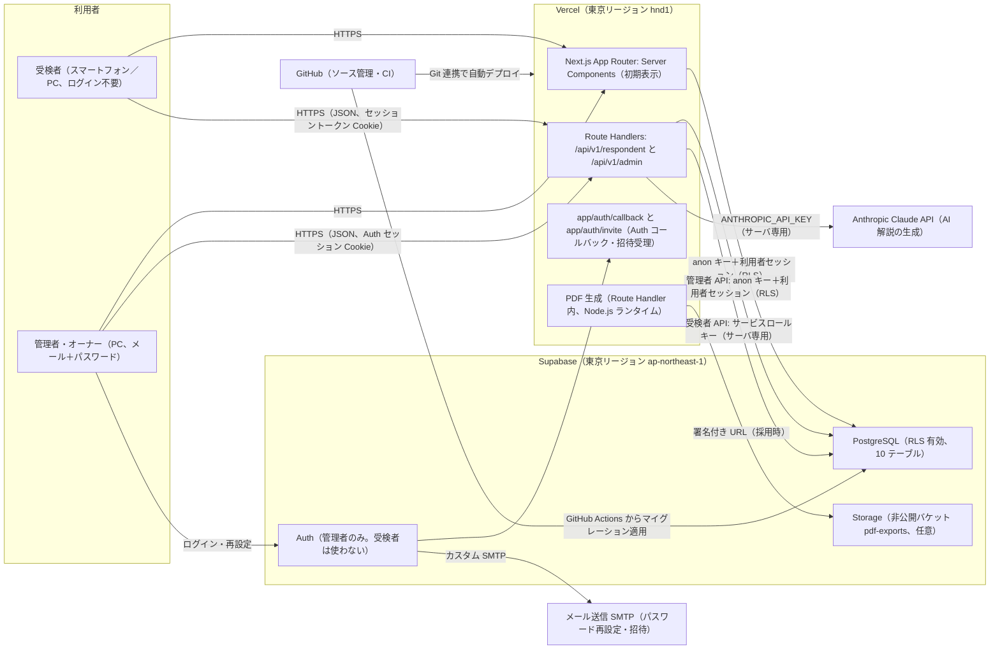
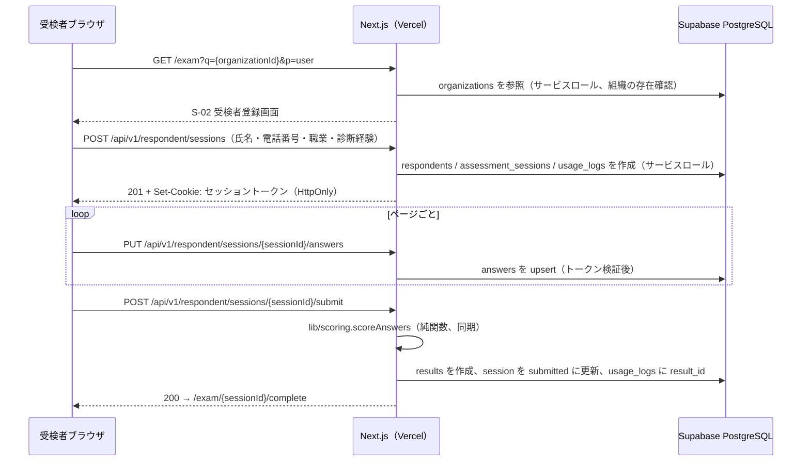
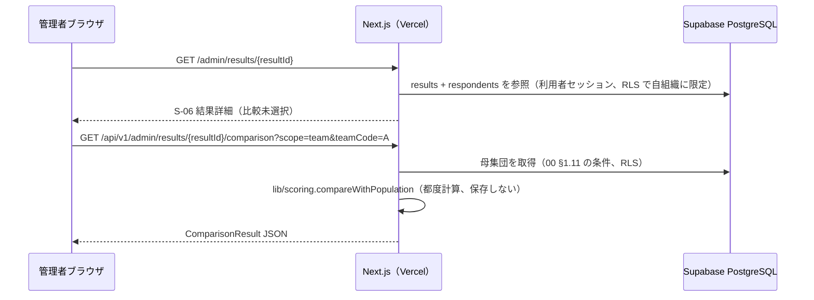
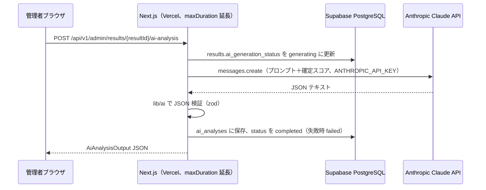
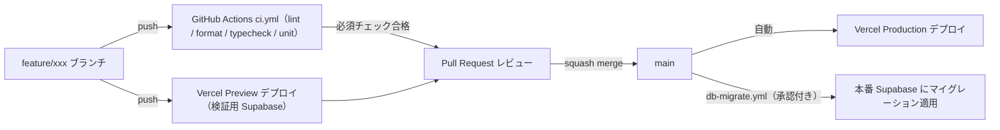
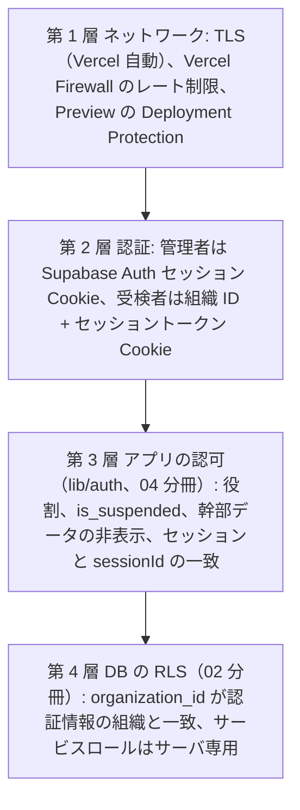

# 基本設計 01 システム構成・環境・デプロイ

| 項目 | 内容 |
|---|---|
| 文書名 | 適性検査システム 基本設計 01 システム構成・環境・デプロイ |
| 版 | 1.2 |
| 作成日 | 2026-09-17 |
| 更新日 | 2026-09-21（1.2 版: 最終点検。00 1.1 版への掲載を反映、`e2e.yml` に `PDF_CHROMIUM_EXECUTABLE_PATH` の設定ステップを取り込み、§4.1 の設定場所を「CI でも設定する」に改版、`seed.sql` の例示メールアドレスをプレースホルダに変更。§12.2 参照） |
| 対象 | 実装者、運用担当、依頼主（環境準備の手順） |
| 前提文書 | `docs/基本設計/00_共通定義.md`（用語・テーブル名・型名・API 規約は本書でも 00 に従う） |

## 0. 本書の位置づけ

本書は、新システムを **どこで・何を使って・どう動かすか** を確定する分冊です。全体アーキテクチャ、リポジトリ構成、依存ライブラリと版の方針、環境（ローカル・プレビュー・本番）と環境変数の管理、開発フローと CI/CD、依頼主が自分で行う環境準備の手順、セキュリティ方針、非機能要件への対応、監視・ログ・バックアップを定めます。

- 本書は 00 共通定義（§3.2 環境変数名、§3.3 ディレクトリ構成、§4 API 規約）を前提とし、そこに **値の管理方法・実行基盤・運用手順** を加えるものです。00 で確定済みの名称は変更しません。
- 他分冊の範囲（DDL・RLS は 02、採点は 03、API 入出力は 04、画面は 05・06、AI と PDF の処理内容は 07、実装順・テスト計画は 08）は定義せず、参照だけにします。本書を理解するために必要な最小限の再掲のみ行います。
- 実行基盤の決定（Vercel の関数実行時間、Node.js ランタイム、Storage バケットの公開範囲など）は他分冊の前提条件になるため、本書で確定します。
- 記載した外部サービス（Vercel、Supabase、GitHub、Anthropic）の画面名・メニュー名は変わり得るため、手順は「概ね」の位置と内容で書いています。実際の画面が異なる場合は同じ目的の項目を探してください。

### 0.1 参照した要件

| 参照元 | 参照した内容 |
|---|---|
| 要件定義書 §3 | システム全体像（受検者はログイン不要、管理者はメール＋パスワード） |
| 要件定義書 §4 | 利用者と権限（RLS と役割の前提） |
| 要件定義書 §6.1 U-03、§6.2 A-12 | 受検リンク・管理者追加用リンクの形式（URL 生成に使う公開 URL） |
| 要件定義書 §6.5、付録E | ApexCharts の採用（ライブラリ選定の根拠）、PDF の生成方式候補（付録E §7） |
| 要件定義書 §6.6、§10、付録D | 生成 AI 連携（API キーとモデル名の管理）。既存の **応答フォーマット** は Gemini 形式（candidates/content/parts）だった（要件定義書 §10）。リクエスト形式・モデル名・API キーは未確認 |
| 要件定義書 §9 | 非機能要件（個人情報保護、認証、性能、可用性、出力、多言語、対応端末） |
| 要件定義書 §10 | 外部連携（生成 AI、メール、PDF、CSV は未確認） |
| 要件定義書 §12 | 未確認事項（モバイル表示、完了メール、パスワード再設定メールの文言など） |
| 00 共通定義 §2.1 | マイグレーションファイル名規約、Storage バケットの命名（kebab-case） |
| 00 共通定義 §3.2 | 環境変数名（本書で値の管理方法を定める） |
| 00 共通定義 §3.3 | ディレクトリ構成（本書で設定ファイル・CI 用ディレクトリを追加） |
| 00 共通定義 §4.1 | Route Handler のみ使用、入力検証ライブラリは 01 が選定 |
| 00 共通定義 §8 | D-16（セッショントークンで再開）、D-17（モデル名は 07）、D-22（`admin_users.id = auth.users.id`）、D-23（受検者 API はサービスロールキー）、D-24（`audit_logs`） |
| tests/fixtures/README.md | 検証用データの取り扱い注意（リポジトリ公開範囲） |

### 0.2 決定事項との対応

| # | 決定事項（変更不可） | 本書での対応 |
|---|---|---|
| 1 | Next.js（App Router、TypeScript）+ Supabase（PostgreSQL、Auth、Storage）+ Vercel。グラフは ApexCharts（react-apexcharts） | §1 アーキテクチャ、§3 ライブラリ（`next`、`@supabase/supabase-js`、`@supabase/ssr`、`apexcharts`、`react-apexcharts`）、§5 環境、§6 デプロイ |
| 2 | 要件定義書 §11 の不具合 10 件を修正 | 本書の直接の担当はないが、6 番（比較値を永続化しない）を「サーバ側で都度計算する Route Handler」という実行方式で担保（§1.3）。9 番（`scoring_version`）はマイグレーション運用（§6.4）で将来のロジック改版に備える |
| 3 | 出題は Q1〜Q144 のみ | 本書の対象外（03・05）。設問マスタのシード投入手順（§6.4）のみ本書 |
| 4 | 既存データは移行しない | 移行ツール・移行用環境は用意しない。初期データは `questions` のシードと初期オーナーの作成だけ（§6.4、§7.6） |
| 5 | AI 解説は Claude API。連携先は差し替え可能 | `@anthropic-ai/sdk` を採用し（§3.2）、`AI_PROVIDER` で provider を切り替える環境変数設計（§4）。API キーはサーバ専用（§8.3） |
| 6 | 日本語のみ。管理画面は PC 幅、受検者画面はスマートフォン対応 | i18n ライブラリを入れない（§3.4）。表示タイムゾーンを Asia/Tokyo に固定（§4.4）。E2E テストで受検者画面をモバイルビューポートでも実行（§6.3） |

## 1. 全体アーキテクチャ

### 1.1 構成図



### 1.2 構成要素と責務

| 構成要素 | 担うもの | 根拠・設計判断 |
|---|---|---|
| Next.js（App Router、TypeScript） | 受検者画面（`app/(respondent)`）、管理者画面（`app/(admin)`）、API（`app/api/v1`）、Auth コールバック。画面の初期表示は Server Component が `lib/services/` を直接呼び、更新操作はすべて Route Handler を経由する（00 §3.3、§4.1） | 決定事項 1 |
| Vercel | Next.js のホスティング（Serverless Functions）、Git 連携による Preview／Production デプロイ、環境変数の保管、アクセスログ、Firewall（レート制限） | 決定事項 1 |
| Supabase PostgreSQL | 00 §2.2 の 10 テーブル。組織分離は RLS（02 分冊）。比較計算の結果は保存しない（00 §1.11 の 6 番） | 決定事項 1、2 |
| Supabase Auth | 管理者のメール＋パスワード認証、パスワード再設定メール、管理者追加（招待）。受検者は Auth を使わず、組織 ID とセッショントークンで認可（00 §4.1） | 要件定義書 §9 認証、D-16、D-22 |
| Supabase Storage | PDF を保存する場合の非公開バケット `pdf-exports`（00 §2.1 の例）。保存の要否は 07 分冊が決める。本書は「保存するならこのバケット・この公開範囲」を定める（§8.5） | 決定事項 1、付録E §7 |
| Anthropic Claude API | AI 解説の生成。`lib/ai/` の provider の 1 実装（00 §3.6）。呼び出しはサーバ（Route Handler）からのみ | 決定事項 5 |
| PDF 生成 | 結果詳細の印刷用レイアウトを HTML→PDF 変換（付録E §7 の推奨）。Vercel の Node.js ランタイム上で実行（§3.2、§5.4）。レイアウトと処理内容は 07 分冊 | 要件定義書 §9 出力 |
| メール送信 | Supabase Auth が送るパスワード再設定・招待メールのための SMTP。既存は Postmark 連携があった（要件定義書 §10）が、新システムでは依頼主が SMTP 事業者を選定する（§7.7） | 要件定義書 §10 |
| GitHub | ソース管理、Pull Request、GitHub Actions による lint・typecheck・unit test、DB マイグレーションの適用 | 開発フローの前提（§6） |

### 1.3 処理の流れ（代表 3 本）

受検（登録→回答→送信→採点）:



結果詳細の閲覧と比較（比較値は保存しない）:



AI 解説の生成:



- 採点は送信時に同期実行します（要件定義書 §9 性能「2 秒以内」）。`lib/scoring/` は I/O を持たない純関数のため、Route Handler 内で完結します。
- 比較計算・AI 生成・PDF 生成はすべて Route Handler（サーバ）で行い、ブラウザには結果だけを返します。ブラウザから Supabase に直接書き込むことはありません（D-23）。

### 1.4 実行ランタイムの方針

| 項目 | 方針 | 理由 |
|---|---|---|
| Route Handler のランタイム | すべて Node.js ランタイム（`export const runtime = "nodejs"`）。Edge ランタイムは使わない | サービスロールキーを使う DB 書き込み、PDF 生成（Chromium）、Anthropic SDK の利用は Node.js 前提。ランタイムを混在させない方が事故が少ない（設計判断 D01-01） |
| 関数のリージョン | `hnd1`（東京） | Supabase を東京リージョンに置くため、DB との往復遅延を抑える |
| 関数の実行時間上限 | 既定は Vercel の初期値。AI 解説生成と PDF 生成の Route Handler だけ `export const maxDuration` で延長する（AI: 300 秒、PDF: 120 秒を上限の目安。§5.4） | LLM の応答時間と Chromium の起動時間。Vercel Pro プラン以上が必要（§7.2） |
| キャッシュ | 管理者画面・API はすべて動的（`dynamic = "force-dynamic"` またはリクエストごとの Cookie 参照により自動的に動的）。受検者画面も動的。静的化するのはイラスト等の `public/` だけ | 個人情報を含む画面をキャッシュしない |
| 画像 | `public/images/**`（00 §3.8）。`next/image` の最適化は使ってもよいが、外部ドメインは許可しない | イラストは自前配置のみ |

## 2. リポジトリ構成

00 §3.3 のディレクトリ構成を正とし、本書で **設定ファイル・CI・ドキュメント・スクリプト** を追加します。以下は最上位から見た全体です（`app/`、`lib/`、`components/` の内部は 00 §3.3 のとおり）。

```text
.
├── .github/
│   ├── workflows/
│   │   ├── ci.yml                    # lint・typecheck・unit test・マスタ再生成検査（§6.2）
│   │   ├── e2e.yml                   # E2E（08 分冊が内容を定める。PR 時は手動起動可、main への push でも実行）
│   │   └── db-migrate.yml            # Supabase マイグレーション適用（§6.4）
│   ├── dependabot.yml                # 依存関係の更新監視（§3.1）
│   ├── PULL_REQUEST_TEMPLATE.md
│   └── CODEOWNERS                    # 任意
├── app/                              # 00 §3.3
├── components/                       # 00 §3.3
├── lib/                              # 00 §3.3
│   └── utils/
│       ├── env.ts                    # 環境変数の読み取りと検証（§4.3）
│       └── logger.ts                 # 構造化ログ（§8.6）
├── middleware.ts                     # 管理者 Auth セッションの更新と未認証の遮断（§5.5）
├── public/
│   ├── fonts/                        # Noto Sans JP（OFL）。PDF 印刷用ページで使う（07 §9.7）
│   └── images/{types,characters,aptitudes,styles,positions}/   # 00 §3.8
├── supabase/
│   ├── migrations/                   # 00 §2.1 の命名規約
│   ├── seed/
│   │   └── questions.sql             # questions のシード（03 の lib/masters/questions.ts から生成。本番にも投入）
│   ├── seed.sql                      # ローカル専用の組織・オーナー（§11）。本番には投入しない
│   └── config.toml                   # ローカル Supabase の設定。db.seed.sql_paths で上記 2 ファイルを読む（§6.4）
├── scripts/
│   ├── generate-masters.ts           # 付録A・B → lib/masters/data/*.json（03 §4.5、08 §7.1）
│   ├── generate-texts.ts             # 付録C → lib/masters/data/texts/*.json（08 §7.1）
│   ├── generate-question-seed.ts     # lib/masters/questions.ts → supabase/seed/questions.sql
│   ├── create-owner.ts               # 初期オーナーの作成（サービスロール。§7.6）
│   └── check-env.ts                  # 必須環境変数の存在確認（CI・起動前）
├── tests/
│   ├── unit/                         # Vitest
│   ├── integration/                  # Vitest（ローカル Supabase が必要）
│   ├── e2e/                          # Playwright
│   ├── fixtures/                     # existing_results.json（既存）
│   └── verify_fixtures.py            # 既存（移植は 08 分冊）
├── docs/
│   ├── 要件定義書.md、付録A〜E
│   └── 基本設計/00〜08
├── .env.example                      # 環境変数の雛形（値は空。§4.5）
├── .gitignore                        # .env*.local、node_modules、.next、playwright-report など
├── .nvmrc                            # Node.js の版（§3.1）
├── .prettierrc、eslint.config.mjs
├── next.config.ts                    # セキュリティヘッダー（§8.7）
├── package.json                      # packageManager 固定、scripts（§3.5）
├── pnpm-lock.yaml
├── playwright.config.ts
├── tsconfig.json                     # strict、paths: @/* → ./*
├── vercel.json                       # regions、関数設定（§5.4）
├── vitest.config.ts
└── README.md
```

補足:

- `lib/scoring/` と `lib/masters/` は Next.js・Supabase に依存しない純粋な TypeScript とします（00 §3.3）。`tsconfig.json` の `paths` を `@/*` に統一し、これら 2 ディレクトリからは `@/lib/scoring`・`@/lib/masters` 以外を import しないことを ESLint の `no-restricted-imports` で機械的に禁止します（§3.5）。
- `supabase/seed/questions.sql` は手書きせず、`scripts/generate-question-seed.ts` で `lib/masters/questions.ts` から生成します。設問文の正は 03 分冊の `lib/masters/questions.ts` です（00 §6 分冊間の境界）。スクリプト名は 03 §4.5・08 §7.1 の記載（`generate-question-seed.ts`）で統一します。02 §10.1 の提案名 `generate-questions-seed.ts`（複数形）は本書の名前に合わせて改版を依頼します（§12 引き渡し事項）。
- シードの読み込みは `supabase/config.toml` の `[db.seed] sql_paths = ["./seed/questions.sql", "./seed.sql"]` に一本化します（02 §10.2 の前提。設計判断 D01-34）。旧版で書いていた「`seed.sql` から `\i` で読む」方式は採りません（`supabase db reset` は `psql` ではなく CLI が SQL を流すため、`\i` に依存しない）。
- `scripts/generate-masters.ts` と `scripts/generate-texts.ts` の中身は 03 §4.5・08 §7.1 が定めます。本書は配置と `package.json` の scripts 名（§3.4）、CI の再生成検査（§6.2）を担当します。
- `tests/fixtures/existing_results.json` は依頼主の既存システム由来です（tests/fixtures/README.md）。リポジトリは **private** で運用し、公開範囲を変える場合は依頼主に確認します（§8.1）。

## 3. 主要ライブラリと版の方針

### 3.1 版の決め方（共通ルール）

| ルール | 内容 |
|---|---|
| ロックファイル固定 | `pnpm-lock.yaml` をコミットし、CI・Vercel は `pnpm install --frozen-lockfile` で再現する |
| メジャー版の固定 | `package.json` ではキャレット（`^`）を使い、メジャー版はロックファイルで固定する。メジャー更新は PR で個別に行う |
| 実装開始時に確定 | 下表の「版の方針」は本書作成時点の方針です。**実装開始時に各ライブラリの最新安定版を確認し、`package.json` に記録した版を正** とします。本書の表は改版しません |
| Node.js | Vercel がサポートする最新の LTS（本書時点では 22 系を想定）。`.nvmrc` と `package.json` の `engines.node`、Vercel のプロジェクト設定（Node.js Version）を一致させる |
| パッケージマネージャ | pnpm。`package.json` の `packageManager` フィールドで版を固定し、Corepack で有効化する（設計判断 D01-02） |
| 更新の監視 | GitHub の Dependabot（`.github/dependabot.yml`、週次、グループ化）を有効にし、セキュリティ更新は優先して取り込む |

### 3.2 採用ライブラリ

| 区分 | パッケージ | 版の方針 | 用途 | 根拠・備考 |
|---|---|---|---|---|
| フレームワーク | `next` | App Router が安定している最新メジャー（本書時点では 15 系を想定） | 画面・API・Auth コールバック | 決定事項 1 |
| UI | `react`、`react-dom` | `next` が要求する版に合わせる（19 系想定） | | 決定事項 1 |
| 言語 | `typescript` | 5 系最新 | `strict: true`、`any` 禁止（00 §3.1） | |
| グラフ | `apexcharts`、`react-apexcharts` | 既存は ApexCharts v3.37.3（付録E 冒頭）。新規は最新安定版を採用し、付録E §2 の設定キー（`type: radar`、`yaxis.max`、`yaxis.show`、`stroke`、`fill`、`markers.size`、`legend.position`、`dataLabels.enabled`）が同じ意味で使えることを実装初期に確認する。差異があれば 3 系の最新に固定する | レーダー 3 種、ドーナツゲージ（`radialBar`、付録E §3） | 決定事項 1、要件定義書 §6.5。`react-apexcharts` はブラウザ専用のため `next/dynamic` の `ssr: false` で読み込む（06 分冊） |
| DB／認証クライアント | `@supabase/supabase-js`、`@supabase/ssr` | 2 系最新 | サーバ・ブラウザの Supabase クライアント、Cookie ベースの Auth セッション（§5.5） | 決定事項 1 |
| 入力検証 | `zod` | 最新安定版 | Route Handler の入力検証（00 §4.1「01 が選定」）、環境変数の検証（§4.3）、AI 出力 JSON の検証（07 分冊） | 設計判断 D01-03: TypeScript 型を推論でき、`@anthropic-ai/sdk` のヘルパーとも組み合わせられる |
| AI | `@anthropic-ai/sdk` | 最新安定版 | `lib/ai/providers/anthropic.ts`（07 分冊）。`AiProvider` インターフェース（00 §3.6）の実装として閉じ込め、他の場所から直接 import しない | 決定事項 5 |
| PDF | `puppeteer-core` + `@sparticuz/chromium`（候補） | 最新安定版。両者の対応する Chromium 版を合わせる | 印刷用ページを Headless Chromium で PDF 化（付録E §7 の推奨方式）。Vercel の Serverless Function で動かすための軽量 Chromium | 設計判断 D01-04（§5.4）。採否と代替（`@react-pdf/renderer` など）の最終判断は 07 分冊 |
| 日時 | 標準の `Intl.DateTimeFormat`（`timeZone: "Asia/Tokyo"`） | — | 表示のタイムゾーン変換（00 §2.1「UTC で保存し、表示は Asia/Tokyo」）。日時ライブラリは原則追加しない | 設計判断 D01-05 |
| 単体・結合テスト | `vitest` | 最新安定版 | `tests/unit`、`tests/integration` | 依頼指定 |
| E2E テスト | `@playwright/test` | 最新安定版 | `tests/e2e`。受検者画面はモバイルビューポートでも実行 | 依頼指定 |
| Lint・整形 | `eslint`、`eslint-config-next`、`typescript-eslint`、`prettier` | 最新安定版 | CI で実行（§6.2） | |
| Supabase CLI | `supabase`（devDependency または `npx`） | 最新安定版 | ローカル DB の起動、マイグレーション作成・適用、型生成（`supabase gen types typescript`） | |
| スクリプト実行 | `tsx`（devDependency） | 最新安定版 | `scripts/*.ts` を TypeScript のまま実行する（§3.4 の `check-env`、`seed:questions`、`masters:generate`、`texts:generate`、`masters:check`、`owner:create`） | 設計判断 D01-36: ビルド不要で単発スクリプトを動かすため。Next.js のバンドルには含めない |

### 3.3 採用しないもの

| 候補 | 採用しない理由 |
|---|---|
| Chart.js | 既存で読み込まれていたが結果画面のグラフはすべて ApexCharts だった（要件定義書 §6.5） |
| Server Action | 00 §4.1 で Route Handler のみと確定（テストと監査ログの一元化） |
| ORM（Prisma、Drizzle など） | テーブル 10 本・列名は 00 で確定済みで、RLS を利用者セッションで効かせるには `supabase-js` の PostgREST 経由が単純。DB の型は `supabase gen types` で生成する（設計判断 D01-06） |
| i18n ライブラリ | 日本語のみ（決定事項 6） |
| CSV 出力ライブラリ | 既存に CSV 出力ボタンは確認できず（要件定義書 §10、未確認）。要件にないため入れない |
| 状態管理ライブラリ（Redux 等） | 画面ごとの状態は React の標準機能で足りる。必要になれば 06 分冊で判断 |
| メール送信 SDK | メールは Supabase Auth が SMTP 経由で送る（§7.7）。アプリからの直接送信はない（D-15: 完了メールは送らない） |

### 3.4 `package.json` の雛形

```json
{
  "name": "tekisei-kensa",
  "private": true,
  "packageManager": "pnpm@{実装開始時に固定した版}",
  "engines": { "node": ">=22 <23" },
  "scripts": {
    "dev": "next dev",
    "build": "next build",
    "start": "next start",
    "lint": "eslint .",
    "format": "prettier --check .",
    "format:write": "prettier --write .",
    "typecheck": "tsc --noEmit",
    "test": "vitest run --project unit",
    "test:watch": "vitest --project unit",
    "test:integration": "vitest run --project integration",
    "test:e2e": "playwright test",
    "check-env": "tsx scripts/check-env.ts",
    "masters:generate": "tsx scripts/generate-masters.ts",
    "texts:generate": "tsx scripts/generate-texts.ts",
    "seed:questions": "tsx scripts/generate-question-seed.ts",
    "masters:check": "tsx scripts/generate-masters.ts --check && tsx scripts/generate-texts.ts --check && tsx scripts/generate-question-seed.ts --check",
    "owner:create": "tsx scripts/create-owner.ts",
    "db:start": "supabase start",
    "db:stop": "supabase stop",
    "db:reset": "supabase db reset",
    "db:migration": "supabase migration new",
    "db:types": "supabase gen types typescript --local > lib/db/database.types.ts",
    "ci": "pnpm lint && pnpm format && pnpm typecheck && pnpm test"
  }
}
```

- `lib/db/database.types.ts` は生成物ですがコミットします（Vercel ビルドで CLI を動かさないため）。マイグレーションを変えたら再生成して同じ PR に含めます。
- `masters:generate`・`texts:generate`・`masters:check` は 08 §7.1・§7.6 が要求するもので、`--check` は再生成結果がコミット済みの生成物とバイト一致することを検査します（検査内容は 08 §7.6）。`masters:check` は CI（§6.2）で実行します。
- `owner:create` は初期オーナーを作る運用スクリプトです（§7.6）。対象プロジェクトのサービスロールキーを環境変数で受け取るため、実装者のローカルからは **ローカル Supabase に対してのみ** 実行し、本番・検証プロジェクトに対しては依頼主または運用責任者が実行します。
- Vitest の `--project` は `vitest.config.ts` で `unit`（`tests/unit/**`、Supabase 不要）と `integration`（`tests/integration/**`、ローカル Supabase 必須）を分けるためのものです。詳細は 08 分冊。

### 3.5 Lint 規則のうち本書で確定するもの

| 規則 | 内容 |
|---|---|
| `@typescript-eslint/no-explicit-any: error` | 00 §3.1（`any` 禁止） |
| `no-restricted-imports` | `lib/scoring/**` と `lib/masters/**` から `next`、`react`、`@supabase/*`、`@anthropic-ai/*`、`@/lib/db`、`@/lib/services`、`@/lib/ai`、`@/lib/pdf` の import を禁止（純関数の維持、00 §3.3） |
| `no-restricted-imports`（第 2 群） | `app/**`、`components/**` から `@anthropic-ai/*`、`puppeteer-core`、`@sparticuz/chromium`、`SUPABASE_SERVICE_ROLE_KEY` を読む `@/lib/db/service-client` の import を禁止（サーバ専用処理を `lib/services/`・Route Handler に閉じ込める） |
| `no-restricted-syntax`（`process.env` の直接参照） | `lib/utils/env.ts` 以外で `process.env` を参照することを禁止する（§4.3）。**例外は `scripts/**`**（Next.js の外で単発実行する運用・生成スクリプト。`scripts/check-env.ts` は `process.env` を検証する側であり、`scripts/create-owner.ts` は `serverEnv()` が要求する `AI_MODEL` 等を持たない環境でも動く必要がある）。`lib/pdf/browser.ts` が Vercel 上かどうかを判定する場合も `process.env.VERCEL` を直接読まず、`serverEnv().VERCEL`（§4.3 の `isVercel()`）を使う（07 §9.10 への改版依頼。§12） |
| `no-console: error`（`lib/utils/logger.ts` と `scripts/**` を除く） | ログは §8.6 の logger 経由に限定し、個人情報の混入経路を減らす |
| Prettier | 既定設定（幅 100、ダブルクォート、セミコロンあり）。議論しない |

## 4. 環境変数

### 4.1 一覧

名前は 00 §3.2 で確定済みです。本書で用途の詳細、設定場所、秘匿区分、公開範囲を定めます。「ブラウザ公開」が「あり」のものだけ `NEXT_PUBLIC_` 接頭辞を持ちます。

| 変数名 | 用途 | ブラウザ公開 | 秘匿 | 設定場所 | 値の例（形式） |
|---|---|---|---|---|---|
| `NEXT_PUBLIC_SUPABASE_URL` | Supabase プロジェクト URL。ブラウザ・サーバ両方の Supabase クライアントが使う | あり | なし | ローカル `.env.local`、Vercel（Preview／Production）、GitHub Actions（E2E 用） | `https://{project-ref}.supabase.co` |
| `NEXT_PUBLIC_SUPABASE_ANON_KEY` | 匿名キー。RLS が効く前提でブラウザに配布してよい。管理者 API はこのキー＋利用者セッションで DB にアクセスする | あり | なし（公開前提。ただし RLS が無効なテーブルを作らないことが条件） | 同上 | JWT 文字列 |
| `SUPABASE_SERVICE_ROLE_KEY` | サービスロールキー。RLS をバイパスする。**受検者 API の書き込み（D-23）、招待の受理、監査ログ書き込みなどサーバ処理でのみ使用**。ブラウザに渡さない | なし | **秘匿** | ローカル `.env.local`（ローカル Supabase のキー）、Vercel（Sensitive 指定）、GitHub Actions Secrets（結合テスト用はローカル Supabase のキーで足りる） | JWT 文字列 |
| `NEXT_PUBLIC_APP_BASE_URL` | 受検リンク・管理者追加用リンクの生成（要件定義書 §6.2 A-12）、Auth のリダイレクト先の組み立て（**サーバ側のみ**。ブラウザ側の扱いは §4.2） | あり | なし | ローカル `http://localhost:3000`、Preview はデプロイ URL を自動で使うため未設定可（§4.2）、Production は本番ドメイン | `https://{本番ドメイン}` |
| `AI_PROVIDER` | AI 解説の連携先。`lib/ai/` の provider 選択（00 §3.6） | なし | なし | 全環境 | `anthropic` |
| `ANTHROPIC_API_KEY` | Claude API キー。サーバ処理でのみ使用 | なし | **秘匿** | ローカル `.env.local`（開発者個人のキー、または未設定でスタブ provider）、Vercel（Sensitive 指定）。GitHub Actions には置かない（CI で実 API を呼ばない） | `sk-ant-...` |
| `AI_MODEL` | 使用モデル名。`ai_analyses.model` に保存 | なし | なし | 全環境 | 初期値 `claude-opus-5`（07 §4.1、D-17。`.env.example` に記載。§4.5） |
| `AI_PROMPT_VERSION` | プロンプト版。`ai_analyses.prompt_version` に保存。起動時に `lib/ai/prompts/index.ts` の `PROMPT_REGISTRY` に存在することを検証する（07 §2.2、§4.3） | なし | なし | 全環境 | 初期値 `recruitment-v1`（07 §2.2、D07-02） |
| `PDF_TOKEN_SECRET` | PDF 印刷トークン（HMAC-SHA256）の署名鍵（04 §7.2、D04-40。07 §9.9）。`SUPABASE_SERVICE_ROLE_KEY` から派生させず専用に持つ | なし | **秘匿** | ローカル `.env.local`、Vercel（Preview／Production で **別の値**、Sensitive 指定）、GitHub Actions（E2E ではジョブ内で生成。§6.3） | `openssl rand -base64 32` で生成した 44 文字の文字列（32 バイト以上の乱数）。00 §3.2 に掲載済み（00 1.1 版 D-27） |
| `PDF_CHROMIUM_EXECUTABLE_PATH` | ローカル・CI で PDF 生成に使う Chrome／Chromium の実行ファイルのパス（07 §9.12）。未設定ならローカルでは PDF 生成のみ「未設定」エラーになり、他の機能は動く | なし | なし | ローカル `.env.local`（任意）と CI（`e2e.yml` が `playwright install` 直後に Playwright の Chromium のパスをジョブ内で設定する。§6.3、08 §3.4.2）。**Vercel には置かない**（Vercel は `@sparticuz/chromium` を使う。§4.3 の起動時検証で `VERCEL = "1"` かつ設定ありは失敗） | `/Applications/Google Chrome.app/Contents/MacOS/Google Chrome` のような絶対パス。00 §3.2 に掲載済み（00 1.1 版 D-27） |

補足（新規ではなく運用上の派生）:

| 変数名 | 用途 | 設定場所 |
|---|---|---|
| `NODE_ENV` | Next.js が自動設定。手動で設定しない | — |
| `VERCEL_ENV`、`VERCEL_URL` | Vercel が自動設定。`production` / `preview` / `development`。Preview で `NEXT_PUBLIC_APP_BASE_URL` 未設定時のフォールバックに使う（§4.2） | Vercel 自動 |
| `VERCEL` | Vercel が自動設定（Vercel 上では `"1"`）。`lib/pdf/browser.ts` が `@sparticuz/chromium` を使うかローカルの Chromium を使うかの判定に使う（07 §9.10）。参照は `serverEnv().VERCEL`（`isVercel()`）経由に限る（§3.5、§4.3） | Vercel 自動 |
| `VERCEL_AUTOMATION_BYPASS_SECRET` | Vercel の Deployment Protection の「Protection Bypass for Automation」を有効にすると Vercel が自動設定する。Preview で PDF 生成の Chromium が自分自身の印刷用ページを開くとき `x-vercel-protection-bypass` ヘッダーに載せる（07 §9.13）。本番では未設定（ヘッダーを付けない）。**推定: 変数名・ヘッダー名は Vercel の機能名から推定したもので、実装時に Vercel のドキュメントで確認する（07 D07-23、本書 D01-31）** | Vercel 自動（Preview のみ。§5.2） |
| `SUPABASE_ACCESS_TOKEN`、`SUPABASE_PROJECT_REF`、`SUPABASE_DB_PASSWORD` | **アプリは読まない**。GitHub Actions の `db-migrate.yml` が Supabase CLI でマイグレーションを適用するために使う（§6.4） | GitHub Actions Secrets（Environment ごと） |
| `PLAYWRIGHT_BASE_URL` | E2E の対象 URL。ローカルは `http://localhost:3000` | ローカル、GitHub Actions |

- 環境変数を **追加する場合は 00 §3.2 に追記してから** 使います。本書 1.1 版で追加した `PDF_TOKEN_SECRET`（04 D04-40）と `PDF_CHROMIUM_EXECUTABLE_PATH`（07 §9.12）は、他分冊からの追加依頼を受けて本書が先行して確定し、00 1.1 版 §3.2（D-27）に掲載されました。`VERCEL`・`VERCEL_AUTOMATION_BYPASS_SECRET` は Vercel の自動設定変数のため、`VERCEL_ENV`・`VERCEL_URL` と同じく派生表の扱いとし、00 §3.2 には載せません（設計判断 D01-30。00 §3.2 の注記と一致）。
- `AI_PROVIDER` に `stub` を許容します（設計判断 D01-07）。`ANTHROPIC_API_KEY` を持たない開発者やローカルの E2E で、固定の `AiAnalysisOutput` を返す provider に切り替えるためです。`stub` の実装は 07 分冊（`lib/ai/providers/stub.ts`）。本番で `stub` が設定された場合は起動時検証（§4.3）で失敗させます。

### 4.2 環境ごとの値の管理

| 環境 | Next.js の実行場所 | Supabase | 環境変数の置き場所 | 備考 |
|---|---|---|---|---|
| ローカル（開発者 PC） | `pnpm dev` | Supabase CLI のローカル環境（Docker）。`supabase start` が表示する URL とキーを使う | `.env.local`（git 管理外） | 実 API キーは任意。無ければ `AI_PROVIDER=stub` |
| CI（GitHub Actions） | ビルド・テストのみ | `ci.yml` は Supabase 不要（unit のみ）。`e2e.yml` はジョブ内で `supabase start` | ワークフロー内の `env:` と GitHub Secrets | 実 API キーは置かない |
| Preview（Vercel） | PR ごとの Preview デプロイ | **検証用 Supabase プロジェクト**（本番とは別プロジェクト） | Vercel の環境変数（Preview スコープ） | Preview URL は Vercel の Deployment Protection で保護（§8.8） |
| Production（Vercel） | `main` ブランチのデプロイ | **本番 Supabase プロジェクト** | Vercel の環境変数（Production スコープ、秘匿値は Sensitive 指定） | 本番ドメインを割り当て |

- 設計判断 D01-08: Supabase プロジェクトは **本番用と検証用の 2 つ** を作ります。Supabase の Branching 機能は使いません（プラン依存・運用が増えるため）。Preview デプロイはすべて検証用プロジェクトを共有します。検証用プロジェクトのデータはテストデータのみとし、実在の受検者情報を入れません。
- Preview では `NEXT_PUBLIC_APP_BASE_URL` を固定できない（URL がデプロイごとに変わる）ため、未設定なら `https://${VERCEL_URL}` を使います。`lib/utils/env.ts` の `appBaseUrl()` にこのフォールバックを実装します。Production では必ず明示設定します。
- `appBaseUrl()` は **サーバ専用** です（`serverEnv()` を経由するため、ブラウザからは呼べません）。ブラウザ側で基底 URL が必要な処理（`resetPasswordForEmail` の `redirectTo`、Auth コールバック後の戻り先など）は、次のいずれかで求めます（設計判断 D01-35）。
  1. `window.location.origin` を使う（推奨。Preview でもそのデプロイ自身の URL になる）。
  2. Server Component が `appBaseUrl()` の値を props で Client Component に渡す。
  
  ブラウザ側のコードから `process.env.NEXT_PUBLIC_APP_BASE_URL` を **直接参照しません**（Preview では未設定のため `undefined/auth/callback` のような URL になる。§3.5 の Lint でも禁止）。04 §6.3 と 06 §3.3 の `resetPasswordForEmail(email, { redirectTo: `${NEXT_PUBLIC_APP_BASE_URL}/auth/callback?next=/admin/password-reset` })` は `${window.location.origin}/auth/callback?next=/admin/password-reset` に改版を依頼します（§12）。受検リンク・招待リンクの文字列はサーバ（04 の `GET /api/v1/admin/me`）が `appBaseUrl()` で生成し、画面は表示するだけです（06 §8 の方針と同じ）。
- Preview でブラウザ側のリダイレクト先が `window.location.origin` になる前提として、Supabase Auth の Redirect URLs に Preview のワイルドカード（`https://*-{vercel-team}.vercel.app/auth/callback`。§5.3）が登録されている必要があります。登録が無いと Supabase は Site URL へ戻します。
- `.env.local` はコミットしません。`.gitignore` に `.env*.local` を入れ、`.env.example` にキー名だけを置きます（§4.5）。

### 4.3 起動時の検証（`lib/utils/env.ts`）

環境変数の読み取りを 1 箇所に集約し、`zod` で検証します。`process.env` を直接読むコードを他の場所に書きません（`no-restricted-syntax` で `process.env` の直接参照を `lib/utils/env.ts` 以外で禁止）。

```ts
// lib/utils/env.ts
import { z } from "zod";
import { PROMPT_REGISTRY } from "@/lib/ai/prompts"; // 文字列定数のみ。lib/ai/prompts は env.ts を import しない（循環回避）

const serverSchema = z.object({
  NEXT_PUBLIC_SUPABASE_URL: z.string().url(),
  NEXT_PUBLIC_SUPABASE_ANON_KEY: z.string().min(1),
  SUPABASE_SERVICE_ROLE_KEY: z.string().min(1),
  NEXT_PUBLIC_APP_BASE_URL: z.string().url().optional(),
  AI_PROVIDER: z.enum(["anthropic", "stub"]).default("anthropic"),
  ANTHROPIC_API_KEY: z.string().min(1).optional(),
  AI_MODEL: z.string().min(1),
  AI_PROMPT_VERSION: z.string().min(1),
  // PDF 印刷トークンの HMAC 鍵（04 D04-40）。32 バイトの乱数を base64（44 文字）または hex（64 文字）で表した文字列
  PDF_TOKEN_SECRET: z.string().min(32),
  // ローカル専用・任意（07 §9.12）。Vercel では @sparticuz/chromium を使うため未設定
  PDF_CHROMIUM_EXECUTABLE_PATH: z.string().min(1).optional(),
  VERCEL: z.string().optional(),
  VERCEL_ENV: z.enum(["production", "preview", "development"]).optional(),
  VERCEL_URL: z.string().optional(),
  // Preview の Protection Bypass for Automation（07 §9.13、D07-23。推定: 変数名は実装時に確認）
  VERCEL_AUTOMATION_BYPASS_SECRET: z.string().optional(),
});

const publicSchema = z.object({
  NEXT_PUBLIC_SUPABASE_URL: z.string().url(),
  NEXT_PUBLIC_SUPABASE_ANON_KEY: z.string().min(1),
});

export type ServerEnv = z.infer<typeof serverSchema>;
export type PublicEnv = z.infer<typeof publicSchema>;

let cached: ServerEnv | null = null;

/** サーバ専用。Route Handler、Server Component、lib/services から呼ぶ */
export function serverEnv(): ServerEnv {
  if (cached) return cached;
  const parsed = serverSchema.safeParse(process.env);
  if (!parsed.success) {
    throw new Error(`環境変数が不正です: ${parsed.error.issues.map((i) => i.path.join(".")).join(", ")}`);
  }
  const env = parsed.data;
  if (env.AI_PROVIDER === "anthropic" && !env.ANTHROPIC_API_KEY) {
    throw new Error("AI_PROVIDER=anthropic には ANTHROPIC_API_KEY が必要です");
  }
  if (env.VERCEL_ENV === "production" && env.AI_PROVIDER === "stub") {
    throw new Error("本番環境で AI_PROVIDER=stub は使用できません");
  }
  if (env.VERCEL_ENV === "production" && !env.NEXT_PUBLIC_APP_BASE_URL) {
    throw new Error("本番環境では NEXT_PUBLIC_APP_BASE_URL を設定してください");
  }
  if (!(env.AI_PROMPT_VERSION in PROMPT_REGISTRY)) {
    // 07 §2.2 の依頼。存在しない版で ai_analyses.prompt_version を書かない
    throw new Error(`AI_PROMPT_VERSION=${env.AI_PROMPT_VERSION} は lib/ai/prompts の PROMPT_REGISTRY にありません`);
  }
  if (env.VERCEL === "1" && env.PDF_CHROMIUM_EXECUTABLE_PATH) {
    throw new Error("Vercel 上では PDF_CHROMIUM_EXECUTABLE_PATH を設定しないでください（@sparticuz/chromium を使う）");
  }
  cached = env;
  return env;
}

/** Vercel 上で動いているか（07 §9.10 の lib/pdf/browser.ts が使う。process.env.VERCEL を直接読まない） */
export function isVercel(): boolean {
  return serverEnv().VERCEL === "1";
}

/** ブラウザでも使える値だけ。NEXT_PUBLIC_ 以外を含めない */
export function publicEnv(): PublicEnv {
  return publicSchema.parse({
    NEXT_PUBLIC_SUPABASE_URL: process.env.NEXT_PUBLIC_SUPABASE_URL,
    NEXT_PUBLIC_SUPABASE_ANON_KEY: process.env.NEXT_PUBLIC_SUPABASE_ANON_KEY,
  });
}

/** 受検リンク・招待リンク・Auth リダイレクトの基底 URL */
export function appBaseUrl(): string {
  const env = serverEnv();
  if (env.NEXT_PUBLIC_APP_BASE_URL) return env.NEXT_PUBLIC_APP_BASE_URL.replace(/\/$/, "");
  if (env.VERCEL_URL) return `https://${env.VERCEL_URL}`;
  return "http://localhost:3000";
}
```

- `publicEnv()` は Next.js のビルド時置換に合わせて `process.env.NEXT_PUBLIC_*` を個別に参照します（オブジェクト全体を渡すとブラウザ側で置換されないため）。`publicEnv()` に `NEXT_PUBLIC_APP_BASE_URL` を **含めません**（Preview では未設定であり、ブラウザ側は `window.location.origin` を使う。§4.2、D01-35）。
- `appBaseUrl()` と `isVercel()` は `serverEnv()` を経由するためサーバ専用です。Client Component（`"use client"`）から import した場合は `serverEnv()` が `process.env` を読めず検証エラーになるので、ブラウザ側では呼びません。
- `scripts/check-env.ts` は同じスキーマで `.env.local` を検証し、`pnpm dev` の前に実行できるようにします。`PDF_TOKEN_SECRET` が未設定のときは「`openssl rand -base64 32` で生成して設定してください」と案内します。
- `AI_PROMPT_VERSION` のレジストリ照合（07 §2.2 の依頼）は `serverEnv()` の初回呼び出しで行うため、Route Handler の最初のリクエストで失敗が表面化します。`scripts/check-env.ts` も同じ照合を行い、起動前に検出できるようにします。

### 4.4 タイムゾーンとロケール

- DB は `timestamptz`（UTC）、API は ISO 8601 UTC（00 §2.1、§4.1）。表示は `lib/presentation/format-datetime.ts`（ファイル名は 06 §10.3 に合わせる）の 1 関数に集約し、`Intl.DateTimeFormat("ja-JP", { timeZone: "Asia/Tokyo", ... })` で変換します。
- サーバの `TZ` 環境変数に依存しません（Vercel の関数は UTC で動く前提で、明示的に `timeZone` を渡す）。

### 4.5 `.env.example`

```bash
# --- Supabase（supabase start の出力、または Supabase ダッシュボード → Project Settings → API）---
NEXT_PUBLIC_SUPABASE_URL=
NEXT_PUBLIC_SUPABASE_ANON_KEY=
SUPABASE_SERVICE_ROLE_KEY=

# --- アプリ ---
# 受検リンク・招待リンクの基底 URL。ローカルは http://localhost:3000。Preview では未設定可
NEXT_PUBLIC_APP_BASE_URL=http://localhost:3000

# --- AI 解説 ---
# anthropic | stub（stub は API キー不要。本番では不可）
AI_PROVIDER=anthropic
ANTHROPIC_API_KEY=
# 初期値は docs/基本設計/07_AI解説とPDF.md §4.1・§2.2（D-17、D07-02）
AI_MODEL=claude-opus-5
AI_PROMPT_VERSION=recruitment-v1

# --- PDF ---
# 印刷トークンの署名鍵（04 D04-40）。openssl rand -base64 32 で生成。環境ごとに別の値にする
PDF_TOKEN_SECRET=
# ローカルの Chrome / Chromium の実行ファイル（07 §9.12）。任意。未設定なら PDF 生成だけが「未設定」エラーになる
PDF_CHROMIUM_EXECUTABLE_PATH=

# --- テスト ---
PLAYWRIGHT_BASE_URL=http://localhost:3000
```

## 5. 環境とデプロイ基盤の設定

### 5.1 環境の一覧

| 環境 | 目的 | URL | データ | 誰が使う |
|---|---|---|---|---|
| ローカル | 実装・単体・結合テスト | `http://localhost:3000` | ローカル Supabase（Docker）。`supabase db reset` で毎回作り直せる | 実装者 |
| Preview | PR ごとの動作確認・レビュー | Vercel が発行する PR 用 URL | 検証用 Supabase プロジェクト（テストデータのみ） | 実装者、レビュー担当、依頼主（受入前の確認） |
| 本番 | 実運用 | 本番ドメイン | 本番 Supabase プロジェクト | 管理者・オーナー、受検者 |

### 5.2 Vercel プロジェクト設定

| 設定 | 値 | 備考 |
|---|---|---|
| Framework Preset | Next.js | 自動検出 |
| Root Directory | リポジトリ直下 | |
| Build Command | `pnpm build` | 既定のままでよい |
| Install Command | `pnpm install --frozen-lockfile` | ロックファイル固定 |
| Node.js Version | `.nvmrc` と同じ | |
| Production Branch | `main` | |
| Preview Deployments | 全ブランチ（PR）で有効 | |
| Deployment Protection | Preview を Vercel Authentication で保護（§8.8）。あわせて **Protection Bypass for Automation を有効化** する（設計判断 D01-31） | 個人情報を扱う画面を無防備に公開しない。検証データのみとはいえ保護する。Bypass は、Preview で PDF 生成の Chromium が自分自身の印刷用ページを開くために必要（07 §9.13）。有効化するとシークレットは Vercel が環境変数（`VERCEL_AUTOMATION_BYPASS_SECRET`）として関数に渡す。**推定: 変数名・ヘッダー名（`x-vercel-protection-bypass`）は実装時に Vercel のドキュメントで確認する（07 D07-23）** |
| Environment Variables | §4.2 のとおり。秘匿値は Sensitive を指定 | |
| Functions Region | `hnd1` | `vercel.json` で指定 |
| Functions のメモリ（CPU／メモリ サイズ） | 既定より大きいサイズ（**1 GB 以上**）をプロジェクト設定で選ぶ（設計判断 D01-32） | PDF 生成の Chromium のため（07 §9.9、§9.10、§11 (4)）。Next.js App Router のセグメント設定では `memory` を指定できないため、Vercel のプロジェクト設定（Functions の既定サイズ）で **全関数共通** に設定する。**推定: 設定箇所の名称と選べるサイズはプランと時期で変わるため、実装時に Vercel のドキュメントで確認する。** `vercel.json` の `functions` で App Router の Route Handler に個別指定できる場合はそちらを優先し、確認結果を運用文書に記録する |
| Domains | 本番ドメインを Production に割り当て | 依頼主が取得（§7.3） |
| Vercel Firewall | レート制限ルール（§8.4） | プランにより利用可否が異なる |

`vercel.json`:

```json
{
  "$schema": "https://openapi.vercel.sh/vercel.json",
  "regions": ["hnd1"],
  "framework": "nextjs"
}
```

- 関数ごとの `maxDuration` は `vercel.json` ではなく各 Route Handler の `export const maxDuration = 300;` で指定します（Next.js App Router のセグメント設定。対象は §5.4）。**メモリはセグメント設定では指定できません**（旧版の記述を訂正）。メモリは上表「Functions のメモリ」のとおり Vercel のプロジェクト設定で全関数共通に設定します（推定: 設定箇所は実装時に確認）。

### 5.3 Supabase プロジェクト設定（本番・検証で同じ）

| 設定 | 値 | 備考 |
|---|---|---|
| Region | Tokyo（`ap-northeast-1`） | Vercel の `hnd1` と同一地域 |
| Postgres | Supabase の既定版。拡張は `pgcrypto`（`gen_random_uuid()` は標準で利用可） | 02 分冊の DDL に従う |
| Auth: Providers | Email のみ有効。OAuth 等は無効 | 要件定義書 §9 認証 |
| Auth: Allow new users to sign up | **無効**（設計判断 D01-09、D01-28） | 管理者追加は招待トークン経由のみ。公開サインアップ（ブラウザからの `signUp`）を止め、`POST /auth/invite`（04 §6.2）がサーバで招待トークンを検証したうえで Auth Admin API `auth.admin.createUser` でユーザーを作成する（§5.6）。Auth Admin API はこの設定の影響を受けない（サービスロールでの作成は「サインアップ」ではない。推定: Supabase の仕様として一般的だが、実装初期に検証用プロジェクトで `createUser` が成功することを確認する）。**02 §5.1（サインアップの公開「有効」）と 06 §3.2（ブラウザの `signUp`）は本方式に合わせて改版を依頼する（§12）** |
| Auth: Confirm email | **有効**（02 D02-22 に合わせる）。ただしアカウント作成には影響しない | 管理者（招待経由）もオーナー（§7.6）も `auth.admin.createUser({ email_confirm: true, ... })` で作成するため（04 §6.2、D04-37。02 §7.2）、この設定値は招待・オーナー作成に影響しない。効くのはログイン中のメールアドレス変更（`PATCH /api/v1/admin/me`、00 §4.2）の確認メールだけ。**旧版の「無効」は 02 D02-22 との食い違いだったため改める**（設計判断 D01-28）。パスワード再設定は有効 |
| Auth: Site URL | 本番は本番ドメイン、検証は検証用の代表 Preview URL | パスワード再設定メールのリンク先 |
| Auth: Redirect URLs | `https://{本番ドメイン}/auth/callback`、検証は `https://*-{vercel-team}.vercel.app/auth/callback`（ワイルドカード） | Preview URL が変わるため |
| Auth: Email templates | 日本語化（件名・本文）。文言は 06 分冊が定める | 既存文言は未確認（要件定義書 §12） |
| Auth: SMTP | **カスタム SMTP を設定**（§7.7） | Supabase 既定の送信は本番運用向けの制限があるため（概ね送信レート・送信先の制限） |
| Auth: Password | 最小 8 文字以上。文字種要件はダッシュボードの設定に従う（設計判断 D01-10: 8 文字以上、Supabase が提供する強度設定の中で「英字と数字を含む」相当） | 既存要件なし |
| Auth: JWT expiry | 既定（1 時間）。リフレッシュは `@supabase/ssr` が Cookie で行う | |
| Storage | バケット `pdf-exports`（非公開）。PDF を保存する設計を 07 が採用した場合のみ作成（§8.5）。**07 D07-21 は「本フェーズでは作成しない（PDF は応答ストリームで返す）」と確定したため、初期構築では作らない** | 00 §2.1 の命名 |
| Database: Connection | アプリは PostgREST（`supabase-js`）経由のみ。直接の Postgres 接続はマイグレーション（CLI）と運用作業だけ | |
| Backups | Pro プランの日次バックアップ（§9.3）。PITR は依頼主判断 | |
| Network restrictions | 任意。設定するなら GitHub Actions のランナー IP が固定でない点に注意し、マイグレーションは Supabase API 経由（CLI）で行う | |

### 5.4 実行時間・メモリの割り当て

| Route Handler | `maxDuration` | 理由 |
|---|---|---|
| `POST /api/v1/respondent/sessions/{sessionId}/submit` | 既定（採点は数十 ms） | 要件定義書 §9「2 秒以内」 |
| `POST /api/v1/admin/results/{resultId}/ai-analysis` | 300 秒 | LLM の生成待ち。既存は `maxOutputTokens=8192` と思考設定が確認されており（要件定義書 §12）、応答に数十秒以上かかり得る。Vercel Pro 以上が前提 |
| `GET /api/v1/admin/results/{resultId}/pdf` | 120 秒 | Chromium 起動＋レンダリング |
| その他 | 既定 | |

- 設計判断 D01-04（PDF の実行基盤）: Vercel の Node.js Function 上で `puppeteer-core` + `@sparticuz/chromium` を使い、印刷用ページ（`app/(admin)/admin/results/[resultId]/print/page.tsx` などの配置は 07 分冊）を自分自身にアクセスして PDF 化します。制約: 関数のデプロイサイズ上限（Vercel の仕様。概ね 250 MB 展開後）に収まること、`@sparticuz/chromium` の版と `puppeteer-core` の版を合わせること。印刷用ページへのアクセスには管理者の Cookie を転送するか、短命の署名付きトークンを使う（07 分冊が確定。本書は「Cookie 転送よりも、PDF 生成専用の一時トークンを結果 ID に紐づけて発行し、印刷用ページはそのトークンだけを受け付ける」方式を推奨）。
- AI 生成の同期待ち（300 秒）が運用上長すぎる場合の代替（非同期化して `ai_generation_status` をポーリング）は 07 分冊に委ねます。本書は同期方式でも動く上限を確保します。
- メモリ: PDF 生成の Chromium のため関数メモリは **1 GB 以上** とします（07 §9.9、§9.10）。設定は §5.2「Functions のメモリ」のとおり Vercel のプロジェクト設定で全関数共通に行い、依頼主手順 §7.2 に含めます（設計判断 D01-32）。
- PDF 生成の全体タイムアウトは 07 §9.10 が 90 秒の `AbortSignal` で管理します。`maxDuration = 120` はその外側の安全弁です。

### 5.5 Supabase クライアントの生成（`lib/db/`）

利用者セッションで RLS を効かせるクライアントと、サービスロールのクライアントを **別ファイル・別関数** に分けます。

```ts
// lib/db/server-client.ts  ── 管理者側。Cookie の Auth セッションを使い、RLS が効く
import { createServerClient } from "@supabase/ssr";
import { cookies } from "next/headers";
import { publicEnv } from "@/lib/utils/env";
import type { Database } from "@/lib/db/database.types";

export async function createUserClient() {
  const env = publicEnv();
  const cookieStore = await cookies();
  return createServerClient<Database>(env.NEXT_PUBLIC_SUPABASE_URL, env.NEXT_PUBLIC_SUPABASE_ANON_KEY, {
    cookies: {
      getAll: () => cookieStore.getAll(),
      setAll: (list) => {
        try {
          for (const { name, value, options } of list) cookieStore.set(name, value, options);
        } catch {
          // Server Component からの呼び出しでは Cookie を書けず cookies().set() が例外を投げる。
          // セッション（トークン）の更新は middleware.ts が全 /admin/** リクエストで行うため、ここでは無視してよい。
        }
      },
    },
  });
}
```

- `setAll` を `try/catch` で囲む理由: 本書 §1.2 のとおり画面の初期表示は Server Component が `lib/services/` を直接呼び、そこで `createUserClient()`（04 §2.5.1 の `requireAdmin` が `supabase.auth.getUser()` を呼ぶ）を使います。`@supabase/ssr` はアクセストークンの期限が近いと `setAll` で Cookie を書き換えようとしますが、Server Component では `cookies().set()` が例外を投げます。Route Handler では書けるので、`try/catch` は Server Component の場合だけ効きます（設計判断 D01-33）。
- Cookie の更新責務は `middleware.ts` に置きます（下記）。`middleware.ts` は対象パスの **すべてのリクエスト** で `createServerClient` を作り `auth.getUser()` を呼び、更新されたトークンを応答の `Set-Cookie` に載せます。これにより Server Component が Cookie を書けなくてもセッションは切れません。

```ts
// lib/db/service-client.ts  ── サーバ専用。RLS をバイパスする。受検者 API・招待受理・監査ログ書き込み
import { createClient } from "@supabase/supabase-js";
import { serverEnv } from "@/lib/utils/env";
import type { Database } from "@/lib/db/database.types";

export function createServiceClient() {
  const env = serverEnv();
  return createClient<Database>(env.NEXT_PUBLIC_SUPABASE_URL, env.SUPABASE_SERVICE_ROLE_KEY, {
    auth: { persistSession: false, autoRefreshToken: false },
  });
}
```

```ts
// lib/db/browser-client.ts  ── ブラウザ。ログイン・ログアウト・パスワード再設定の Auth 操作にのみ使う
import { createBrowserClient } from "@supabase/ssr";
import { publicEnv } from "@/lib/utils/env";
import type { Database } from "@/lib/db/database.types";

export function createBrowserSupabase() {
  const env = publicEnv();
  return createBrowserClient<Database>(env.NEXT_PUBLIC_SUPABASE_URL, env.NEXT_PUBLIC_SUPABASE_ANON_KEY);
}
```

- `service-client.ts` は `lib/services/` と Route Handler からのみ import します（§3.5 の Lint）。ブラウザ側のバンドルに `SUPABASE_SERVICE_ROLE_KEY` が入らないことを、`next build` 後に `.next/static` を文字列検索する CI ステップで確認します（§6.2）。
- ブラウザからの DB 読み書きは行いません。ブラウザの Supabase クライアントは Auth 操作（`signInWithPassword`、`signOut`、`resetPasswordForEmail`、`updateUser`）に限定します。データの取得・更新は Server Component と Route Handler 経由です（00 §3.3、§4.1）。
- Auth セッションの Cookie 更新は Next.js の `middleware.ts`（`app/` と同階層）で `@supabase/ssr` の推奨手順に従い行います。`middleware.ts` は `/admin/**` と `/api/v1/admin/**` に適用し、未認証なら `/admin/login?next=<元のパス>` へリダイレクト（画面）または 401 `UNAUTHENTICATED`（API）を返します（04 §8.5）。認可（役割・`is_suspended`）の判定は middleware ではなく `lib/auth/` で行います（04 分冊）。
- **除外パス**（認証を要求しない。04 §8.5、07 §9.4）:
  - `/admin/login`、`/admin/signup`、`/admin/password-reset` — 認証画面自身。除外しないとログイン画面が自分自身へ無限リダイレクトする。`/admin/password-reset` は `/auth/callback` で確立した `type=recovery` の一時セッションを持つが、middleware では要求しない（06 §3.3）。
  - `/admin/results/{resultId}/print` — PDF 生成の Chromium が開く印刷用ページ。管理者 Cookie を持たず、クエリ `token`（PDF 印刷トークン。04 §7.2、07 §9.9）だけで認可する（07 §9.4）。除外しないと Chromium のアクセスがログイン画面へリダイレクトされる。
  - 受検者側（`/exam/**`、`/api/v1/respondent/**`）と `/auth/**` はそもそも対象外（Cookie `tk_session` の検証は Route Handler 内。04 §2.5.2）。
  - 除外パスでも Auth Cookie の **更新** は害がないため、実装は「対象パス全体でセッションを更新し、除外パスでは未認証でも遮断しない」とします（`/admin/login` にログイン済みで来た場合の `/admin` へのリダイレクトは画面側。06 §3.1）。

```ts
// middleware.ts（app/ と同階層）。matcher の例
export const config = {
  matcher: ["/admin/:path*", "/api/v1/admin/:path*"],
};

// 遮断しないパス（Cookie の更新だけ行う）
const PUBLIC_ADMIN_PATHS = [/^\/admin\/login$/, /^\/admin\/signup$/, /^\/admin\/password-reset$/, /^\/admin\/results\/[^/]+\/print$/];
```

- `matcher` は Next.js の制約で静的な文字列・パターンしか書けないため、除外は関数本体で `PUBLIC_ADMIN_PATHS` に照合して行います。`/admin/results/{resultId}/print` の `{resultId}` は UUID ですが、middleware では形式検証をせず（印刷用ページ側がトークンで検証する）、パス形状だけで除外します。

### 5.6 認証まわりの配置（02・04 分冊との境界）

00 §4.2 は「ログイン・パスワード再設定・サインアップは Supabase Auth の SDK を使い `/api/v1` の配下には置かない」としています。§5.3 で公開サインアップを無効にするため、招待の受理だけはサーバ処理が必要です。

管理者追加（招待）の方式は分冊間で割れていたため、本書 1.1 版で **04 §6.2 の方式に一本化** します（設計判断 D01-28。§12 の引き渡し事項で 02・06 に改版を依頼）:

| 観点 | 確定した方式 | 採らない方式（02 §5.1・§7.3、06 §3.2 の旧記述） |
|---|---|---|
| Supabase Auth の設定 | 「Allow new users to sign up」**無効**（§5.3） | 有効のまま、無効トークンの `signUp` をトリガーで失敗させる |
| ブラウザの処理 | `/admin/signup?q=トークン` の画面が `POST /auth/invite`（04 §6.2）に `{ inviteToken, name, email, password }` を送る。成功後に `signInWithPassword` でログイン | ブラウザが `signUp({ email, password, options: { data: { invite_token, name } } })` を呼ぶ |
| ユーザー作成 | Route Handler がサービスロールで `auth.admin.createUser({ email, password, email_confirm: true, user_metadata: { invite_token, name } })` | Auth の公開サインアップ |
| `admin_users` 行の作成 | **02 §7.3 のトリガー `handle_new_auth_user()`** が `user_metadata.invite_token` で `organizations` を照合し `role = 'admin'` で INSERT する。**Route Handler は `admin_users` に直接 INSERT しない**（旧版の「`admin_users` に `role = admin` で作成」は取り下げ） | 同じ（トリガー） |
| 事前検証 | 画面表示時に RPC `validate_admin_invite_token()`（02 §7.3）で組織名を得て、無効ならフォームを出さない。Route Handler も同じ RPC で再検証（04 §6.2） | 同じ |
| メール確認 | `email_confirm: true` で作成するため確認メールは送らない（04 D04-37。依頼主確認事項） | 設定に依存 |
| 選んだ理由 | 公開サインアップを閉じられる（トークン無しの `signUp` を Auth に到達させない）。トリガー例外（DB エラー 500）をブラウザに見せず、Route Handler が 404／409 に変換できる（04 §6.2）。00 §4.2 との整合は D01-11 のとおり `app/auth/invite/route.ts` に置くことで保つ | — |

| 処理 | 実行場所 | 使うキー | 担当 |
|---|---|---|---|
| ログイン | ブラウザ → Supabase Auth（`signInWithPassword`） | anon | 06（画面）、02（設定） |
| ログアウト | ブラウザ → Supabase Auth（`signOut`） | anon | 06 |
| パスワード再設定メール送信 | ブラウザ → Supabase Auth（`resetPasswordForEmail`、リダイレクト先は `/auth/callback?next=/admin/password-reset`） | anon | 06、02 |
| 再設定後のパスワード更新 | ブラウザ → Supabase Auth（`updateUser`） | anon | 06 |
| Auth コールバック（コード→セッション交換） | `app/auth/callback/route.ts` | anon（`@supabase/ssr`） | 02、04 |
| **招待の受理（管理者追加）** | `app/auth/invite/route.ts`（`POST /auth/invite`。`/api/v1` の外、`app/auth/` 配下に置く。設計判断 D01-11） | **サービスロール**（RPC `validate_admin_invite_token()` でトークン検証 → `auth.admin.createUser({ email, password, email_confirm: true, user_metadata: { invite_token, name } })` → `admin_users` 行は 02 §7.3 のトリガー `handle_new_auth_user()` が `role = 'admin'` で作る。**Route Handler は `admin_users` に直接 INSERT しない** → 200 を返し、ブラウザが `signInWithPassword` でログインする。04 §6.2） | 02（トークン・トリガー）、04（入出力）、06（画面） |
| メール・パスワード変更（ログイン中） | `PATCH /api/v1/admin/me`（00 §4.2） | 利用者セッション（`updateUser`）＋必要なら サービスロール | 04 |
| 初期オーナーの作成 | 運用スクリプト `scripts/create-owner.ts`（`pnpm owner:create`。§7.6）。SQL で `provision_organization()` を実行して組織を作り、`auth.admin.createUser` に `app_metadata: { organization_id, role: 'owner' }` を付けて呼ぶ。`admin_users` の `owner` 行はトリガー `handle_new_auth_user()` が作る（02 §7.2） | **サービスロール**（スクリプト）。**Supabase ダッシュボードの「Add user」は使えない**（`app_metadata` も `invite_token` も無いためトリガーが `INVITE_TOKEN_REQUIRED` で失敗する。02 §7.3） | 02（RPC・トリガー）、01（スクリプトの配置・手順） |

### 5.7 受検者のセッショントークン（実行基盤側の条件）

トークンの生成・保存・検証の仕様は 02・04 分冊です。本書は Cookie の属性とスコープを固定します。

| 項目 | 値 |
|---|---|
| Cookie 名 | `tk_session` |
| 値 | セッショントークン（推測不能な乱数。DB には元の値ではなくハッシュを保存する方式を推奨。02 分冊が確定） |
| 属性 | `HttpOnly; Secure; SameSite=Lax; Path=/`。ローカル（`http://localhost`）のみ `Secure` を外す |
| 有効期限 | **発行から 7 日**。`PUT …/answers` と `POST …/start` のたびに `assessment_sessions.token_expires_at = now() + 7 日` に延長し、延長のたびに `Set-Cookie`（`Expires = token_expires_at`）を返す（02 §3.6・§7.4 D02-13、04 §2.5.2 D04-10、05 §6.1 D05-09）。旧版の「24 時間」（D01-12）は 02・04・05 の 7 日・延長方式に合わせて改版した。値は依頼主確認事項（05 D05-09） |
| 発行 | `POST /api/v1/respondent/sessions` の応答で `Set-Cookie` |
| 検証 | `/api/v1/respondent/sessions/{sessionId}/**` で、Cookie のトークンの **ハッシュ** と `{sessionId}` の組が `assessment_sessions` に存在し、`token_expires_at > now()`、`deleted_at is null` であること（04 §2.5.2 `requireRespondentSession`）。**`status = draft` の要求は `PUT …/answers`、`POST …/start`、`POST …/submit` だけ**（service 側で判定し、送信済みなら 409 `SESSION_ALREADY_SUBMITTED`）。`GET …/sessions/{sessionId}` は `submitted` でも許可する（再開ページと完了画面 R-05 が送信後もセッションを参照するため。04 §2.5.2、05 §1.3 D05-15） |

## 6. 開発フローと CI/CD

### 6.1 ブランチと Pull Request



| ルール | 内容 |
|---|---|
| 開発は GitHub 上のみ | ソース・設計書・CI 設定はすべてこのリポジトリで管理する。ローカルの未コミット変更は成果物として扱わない |
| ブランチ | `main`（本番）と作業ブランチ（`feature/…`、`fix/…`）。`main` への直接 push は禁止（Branch protection） |
| PR の必須条件 | `ci.yml` の全ジョブ合格、レビュー 1 名以上の承認、`main` との競合なし。E2E（`e2e.yml`）は画面に触れる PR で手動起動し合格させる（08 分冊が対象を定める） |
| マージ方式 | squash merge。コミットメッセージは PR タイトル |
| リリース | `main` へのマージ = 本番デプロイ。**DB マイグレーションを含む PR は、本番デプロイの前に `db-migrate.yml` を実行してスキーマを先に進める**（§6.4 の順序） |
| PR テンプレート | 変更概要、影響する分冊、マイグレーションの有無、環境変数の追加有無、テスト方法、不具合 10 件（要件定義書 §11）への影響の有無 |

### 6.2 `ci.yml`

```yaml
name: ci
on:
  pull_request:
  push:
    branches: [main]

concurrency:
  group: ci-${{ github.ref }}
  cancel-in-progress: true

jobs:
  check:
    runs-on: ubuntu-latest
    timeout-minutes: 15
    steps:
      - uses: actions/checkout@v4
      - uses: pnpm/action-setup@v4
      - uses: actions/setup-node@v4
        with:
          node-version-file: .nvmrc
          cache: pnpm
      - run: pnpm install --frozen-lockfile
      - run: pnpm lint
      - run: pnpm format
      - run: pnpm typecheck
      - name: マスタ生成物が付録と一致していることを確認（08 §7.6）
        run: pnpm masters:check
      - run: pnpm test
      - name: build（環境変数はダミー。実 API・実 DB には接続しない）
        run: pnpm build
        env:
          NEXT_PUBLIC_SUPABASE_URL: http://127.0.0.1:54321
          NEXT_PUBLIC_SUPABASE_ANON_KEY: dummy
          SUPABASE_SERVICE_ROLE_KEY: dummy-service-role-key-do-not-ship
          AI_PROVIDER: stub
          AI_MODEL: claude-opus-5
          AI_PROMPT_VERSION: recruitment-v1
          PDF_TOKEN_SECRET: dummy-pdf-token-secret-do-not-ship-0123456789
      - name: サーバ専用の値がブラウザ用バンドルに含まれていないことを確認
        run: |
          for needle in dummy-service-role-key-do-not-ship dummy-pdf-token-secret-do-not-ship; do
            if grep -R "$needle" .next/static >/dev/null 2>&1; then
              echo "サーバ専用の値（$needle）がクライアントバンドルに混入しています"; exit 1; fi
          done
```

- `AI_PROMPT_VERSION` は §4.3 の起動時検証で `PROMPT_REGISTRY` と照合されるため、CI のビルドでも実在する版（初期値 `recruitment-v1`）を渡します。`dummy` では `next build` 中に Route Handler を評価した時点で失敗し得ます。
- `PDF_TOKEN_SECRET` はビルドの検証（`min(32)`）を通すためのダミーです（36 文字以上）。実際の署名は行いません。
- `pnpm masters:check` は 08 §7.6 の再生成検査です（`pnpm test` の直前）。付録A〜C から生成した `lib/masters/data/*.json` と `supabase/seed/questions.sql` がコミット済みの生成物と一致しないと失敗します。
- `pnpm test` は `unit` プロジェクトのみです（Supabase 不要、数秒で終わる）。`lib/scoring`・`lib/masters`・`lib/presentation`・`lib/ai` の JSON 検証など純関数のテストがここに入ります（08 分冊）。
- `pnpm build` を CI で回すのは、Vercel のビルド失敗を PR 段階で検出するためです。ビルドは実 DB に接続しません（画面はすべて動的で、ビルド時にデータ取得しない）。
- 最後のステップは、`SUPABASE_SERVICE_ROLE_KEY` に判別可能なダミー値を入れてビルドし、その値がブラウザ用バンドル（`.next/static`）に出ていないことを確認するものです（§8.3）。

### 6.3 `e2e.yml`（枠のみ。内容は 08 分冊）

```yaml
name: e2e
on:
  workflow_dispatch:
  pull_request:
    types: [labeled]   # ラベル "run-e2e" が付いたときだけ実行
  push:
    branches: [main]   # main でも実行して回帰を検知する（08 D08-06）

jobs:
  e2e:
    if: github.event_name != 'pull_request' || github.event.label.name == 'run-e2e'
    runs-on: ubuntu-latest
    timeout-minutes: 30
    steps:
      - uses: actions/checkout@v4
      - uses: pnpm/action-setup@v4
      - uses: actions/setup-node@v4
        with:
          node-version-file: .nvmrc
          cache: pnpm
      - uses: supabase/setup-cli@v1
      - run: pnpm install --frozen-lockfile
      - run: supabase start                       # ローカル Supabase（Docker）。migrations と config.toml の seed が適用される
      - name: ローカル Supabase のキーを環境変数に取り込む
        run: supabase status -o env >> "$GITHUB_ENV"
      - name: supabase status の変数名をアプリの変数名に読み替える（08 §3.4.2）
        run: |
          echo "NEXT_PUBLIC_SUPABASE_URL=$API_URL" >> "$GITHUB_ENV"
          echo "NEXT_PUBLIC_SUPABASE_ANON_KEY=$ANON_KEY" >> "$GITHUB_ENV"
          echo "SUPABASE_SERVICE_ROLE_KEY=$SERVICE_ROLE_KEY" >> "$GITHUB_ENV"
          echo "NEXT_PUBLIC_APP_BASE_URL=http://localhost:3000" >> "$GITHUB_ENV"
          echo "PDF_TOKEN_SECRET=$(openssl rand -hex 32)" >> "$GITHUB_ENV"
      - name: 日本語フォント（任意。07 D07-20 の方式では不要。ヘッダー・フッター描画失敗時の保険として残す。08 §3.4.2）
        run: sudo apt-get update && sudo apt-get install -y fonts-noto-cjk
      - run: pnpm exec playwright install --with-deps chromium
      - name: Playwright の Chromium を PDF 生成に使う（07 §9.12、08 §3.4.2）
        run: |
          echo "PDF_CHROMIUM_EXECUTABLE_PATH=$(node -e "console.log(require('@playwright/test').chromium.executablePath())")" >> "$GITHUB_ENV"
          test -x "$(node -e "console.log(require('@playwright/test').chromium.executablePath())")"
      - run: pnpm test:integration
      - run: pnpm build && pnpm test:e2e
        env:
          AI_PROVIDER: stub
          AI_MODEL: claude-opus-5
          AI_PROMPT_VERSION: recruitment-v1
          PLAYWRIGHT_BASE_URL: http://localhost:3000
      - uses: actions/upload-artifact@v4
        if: failure()
        with:
          name: playwright-report
          path: playwright-report
```

- `supabase status -o env` が出力する変数名（`API_URL`、`ANON_KEY`、`SERVICE_ROLE_KEY` など）とアプリの変数名（`NEXT_PUBLIC_SUPABASE_URL` など）は異なるため、08 §3.4.2 の読み替えステップをそのまま取り込みました。`PDF_TOKEN_SECRET` は CI ではジョブごとに生成します（GitHub Secrets に置かない）。
- `on.push.branches: [main]` は 08 D08-06 の依頼です。`main` への push では `if` の条件が `pull_request` でないため常に実行されます。
- CI 上の PDF 生成は、`VERCEL` が未設定のため `lib/pdf/browser.ts` がローカル経路（`PDF_CHROMIUM_EXECUTABLE_PATH`）を選びます。上記の「Playwright の Chromium を PDF 生成に使う」ステップ（08 §3.4.2 と同一。1.2 版で取り込み）が、`playwright install` が入れた Chromium のパスをジョブ内で設定します（07 §9.12）。`require('@playwright/test')` を使うのは、pnpm の厳密な `node_modules` では `playwright` が直接依存に無いと解決できないためです（08 §3.4.2）。
- Playwright は受検者画面をモバイルビューポート（例: iPhone 相当の `devices` プリセット）と PC の両方で実行します（決定事項 6）。プロジェクト定義は `playwright.config.ts`（08 分冊）。

### 6.4 DB マイグレーションの運用（`db-migrate.yml`）

| 項目 | 方針 |
|---|---|
| 作成 | `pnpm db:migration {snake_case_description}` で `supabase/migrations/` に作成（00 §2.1 のファイル名規約）。DDL は 02 分冊 |
| ローカル適用 | `supabase db reset`（全マイグレーション適用＋ `supabase/config.toml` の `[db.seed] sql_paths = ["./seed/questions.sql", "./seed.sql"]` に登録したシードの適用。02 §10.2、§2 補足、D01-34） |
| 検証用プロジェクトへの適用 | PR のマージ前に、`db-migrate.yml` を `workflow_dispatch` で `target = staging` を選んで実行。Preview で動作確認する |
| 本番への適用 | `main` へのマージ後、`db-migrate.yml` を `target = production` で実行。GitHub Environments の `production` に **必須レビュアー（依頼主または運用責任者）** を設定し、承認後に走る |
| 順序 | 後方互換な変更（列追加、テーブル追加）は「マイグレーション → デプロイ」。非互換な変更（列削除・改名）は 2 段階（先に参照を外したコードをデプロイ → 次の PR で削除）。`scoring_version` を上げる改版（00 §2.4）はこの手順に加えて 03・08 分冊の再採点方針に従う |
| シード | `questions` のシードはマイグレーションではなく `supabase/seed/questions.sql` に置く。本番への投入は初回セットアップ時に `db-migrate.yml` の `seed = true` オプションで 1 回だけ実行（`insert ... on conflict (question_no) do update` で冪等にする） |
| ロールバック | 原則「前進のみ」（修正マイグレーションを追加）。緊急時は Supabase のバックアップから復元（§9.3） |

```yaml
name: db-migrate
on:
  workflow_dispatch:
    inputs:
      target:
        description: 適用先
        type: choice
        options: [staging, production]
        required: true
      seed:
        description: questions のシードも投入する（初回のみ true）
        type: boolean
        default: false

jobs:
  migrate:
    runs-on: ubuntu-latest
    environment: ${{ inputs.target }}        # production には必須レビュアーを設定
    timeout-minutes: 15
    steps:
      - uses: actions/checkout@v4
      - uses: supabase/setup-cli@v1
      - run: supabase link --project-ref "$SUPABASE_PROJECT_REF"
        env:
          SUPABASE_ACCESS_TOKEN: ${{ secrets.SUPABASE_ACCESS_TOKEN }}
          SUPABASE_PROJECT_REF: ${{ secrets.SUPABASE_PROJECT_REF }}
          SUPABASE_DB_PASSWORD: ${{ secrets.SUPABASE_DB_PASSWORD }}
      - run: supabase db push
        env:
          SUPABASE_ACCESS_TOKEN: ${{ secrets.SUPABASE_ACCESS_TOKEN }}
          SUPABASE_DB_PASSWORD: ${{ secrets.SUPABASE_DB_PASSWORD }}
      - if: ${{ inputs.seed }}
        run: psql "$DATABASE_URL" -v ON_ERROR_STOP=1 -f supabase/seed/questions.sql
        env:
          DATABASE_URL: ${{ secrets.SUPABASE_DB_URL }}
```

- `SUPABASE_DB_URL` はシード投入にだけ使う接続文字列です（GitHub Environment Secret）。`db push` は CLI のリンク情報で接続するため通常は不要です。
- GitHub Environments は `staging` と `production` の 2 つを作り、Secrets を環境ごとに分けます。`production` にのみ必須レビュアーを設定します。

### 6.5 Vercel デプロイの流れ

| イベント | Vercel の動作 | 使う環境変数 |
|---|---|---|
| 作業ブランチへの push／PR 作成 | Preview デプロイ。PR にプレビュー URL がコメントされる | Preview スコープ（検証用 Supabase） |
| `main` へのマージ | Production デプロイ | Production スコープ（本番 Supabase） |
| デプロイ失敗 | 直前の正常なデプロイが残る（自動ロールバック相当） | |
| 手動ロールバック | Vercel の Deployments 一覧から過去デプロイを「Promote to Production」 | DB スキーマとの整合に注意（§6.4 の順序） |

- Vercel の Git 連携は「Ignored Build Step」を使わず、すべてのブランチでビルドします（Preview URL を常に得るため）。
- Vercel のビルドは `ci.yml` と独立して走ります。`ci.yml` が失敗しても Preview はできますが、`main` へのマージは Branch protection で止まります。

## 7. 依頼主が行う環境準備の手順

依頼主のアカウントで各サービスを契約し、実装者を招待する形にします（契約・請求・所有権を依頼主に置くため）。画面名は概ねの表記です。

### 7.1 GitHub

1. GitHub の Organization（または個人アカウント）で **private リポジトリ** を作成する（本リポジトリ `Tekisei-Kensa` をそのまま使う場合はこの手順は不要）。
2. Settings → Collaborators and teams で実装者を `Write` 権限で招待する。
3. Settings → Branches で `main` の Branch protection を作成する（概ね「Require a pull request before merging」「Require status checks to pass」で `ci / check` を必須、「Require approvals: 1」）。
4. Settings → Environments で `staging` と `production` を作成し、`production` に「Required reviewers」として依頼主自身（または運用責任者）を設定する。
5. Settings → Secrets and variables → Actions で、各 Environment に §6.4 の Secrets（`SUPABASE_ACCESS_TOKEN`、`SUPABASE_PROJECT_REF`、`SUPABASE_DB_PASSWORD`、`SUPABASE_DB_URL`）を登録する（値は §7.4 で取得）。

### 7.2 Vercel

1. Vercel でアカウントを作成し、**Pro プラン**のチーム（Team）を作成する（設計判断 D01-13: Hobby プランは商用利用不可であり、関数の実行時間延長・Deployment Protection・Firewall のレート制限もプランに依存するため）。
2. Team Settings → Members で実装者を招待する。
3. 「Add New… → Project」で GitHub 連携を有効にし、§7.1 のリポジトリを選ぶ。Framework は Next.js が自動選択される。Root Directory はそのまま。
4. 最初のデプロイは環境変数が無いためビルドで失敗してもよい。Project Settings → Environment Variables で §4.1 の変数を **Production と Preview のそれぞれ** に登録する（値は §7.4、§7.5 で取得）。秘匿値（`SUPABASE_SERVICE_ROLE_KEY`、`ANTHROPIC_API_KEY`、`PDF_TOKEN_SECRET`）は「Sensitive」を有効にする。`PDF_TOKEN_SECRET` は依頼主または実装者が `openssl rand -base64 32` で **Production と Preview で別々に** 生成し、パスワードマネージャに控える（値そのものは誰にも共有しなくてよい。漏えい時は再生成して差し替えるだけでよい）。
5. Project Settings → General → Node.js Version を `.nvmrc` と同じ版にする。
6. Project Settings → Deployment Protection で Preview を「Vercel Authentication」で保護する。依頼主が Preview を見る場合は Vercel のチームメンバーであること。同じ画面で「Protection Bypass for Automation」を有効にする（PDF 生成が Preview で動くために必要。§5.2、07 §9.13）。有効化で生成されるシークレットは Vercel が環境変数として関数に渡すため、手で登録する必要はない（推定: 画面名・変数名は実装時に確認。D01-31）。
7. Project Settings → Functions（概ね「Function CPU」「Memory」と表示される項目）で、関数のメモリを **1 GB 以上** のサイズにする（PDF 生成の Chromium のため。§5.2、§5.4、07 §9.10。推定: 項目名と選べるサイズは実装時に確認。D01-32）。
8. Project Settings → Domains で本番ドメインを追加し、表示される DNS レコード（CNAME または A）をドメイン事業者側に設定する（§7.3）。
9. （任意）Firewall で §8.4 のレート制限ルールを作成する。

### 7.3 ドメイン

1. 本番用ドメイン（例: 依頼主が保有するドメインのサブドメイン）を決める。
2. ドメイン事業者の DNS 管理画面で、Vercel が指示するレコードを追加する。
3. Vercel 側で証明書が自動発行されるまで待つ（TLS は Vercel が自動管理。要件定義書 §9「通信は TLS」）。
4. 決めたドメインを `NEXT_PUBLIC_APP_BASE_URL`（Production）と Supabase Auth の Site URL・Redirect URLs（§5.3）に設定する。

### 7.4 Supabase

1. Supabase でアカウントを作成し、Organization を作る。**Pro プラン**にする（設計判断 D01-14: 無料プランはプロジェクトが一定期間の無操作で一時停止され、日次バックアップも無いため本番に適さない）。
2. Organization → Members で実装者を招待する。
3. 「New project」で **本番用プロジェクト** を作成する。Region は Tokyo（Northeast Asia）。Database Password は生成された強いものを使い、パスワードマネージャに保管する（`SUPABASE_DB_PASSWORD` として GitHub Environment `production` に登録）。
4. 同様に **検証用プロジェクト** を作成する（`staging` 用）。
5. 各プロジェクトの Project Settings → API（概ね「Data API」「API Keys」）で次を控える。
   - Project URL → `NEXT_PUBLIC_SUPABASE_URL`
   - anon（public）キー → `NEXT_PUBLIC_SUPABASE_ANON_KEY`
   - service_role キー → `SUPABASE_SERVICE_ROLE_KEY`（**絶対にブラウザやチャットに貼らない**。Vercel の Sensitive 変数にだけ登録）
   - Project Settings → General の Reference ID → `SUPABASE_PROJECT_REF`
   - Project Settings → Database の接続文字列（Direct または Session mode）→ `SUPABASE_DB_URL`（シード用）
6. アカウントメニュー → Access Tokens で個人アクセストークンを 1 つ発行し、`SUPABASE_ACCESS_TOKEN` として GitHub Environment（`staging`、`production` の両方）に登録する。トークンは依頼主のアカウントに紐づくため、担当者交代時は再発行する。
7. Authentication → Providers で Email を有効、他を無効にする。Authentication → Settings（概ね「Sign In / Up」）で「Allow new users to sign up」を **オフ** にする（§5.3）。Email provider の「Confirm email」は **オン** のままにする（§5.3。管理者・オーナーの作成は Auth Admin API で確認済みとして作るため、この設定はメールアドレス変更の確認にだけ効く）。
8. Authentication → URL Configuration で Site URL と Redirect URLs を §5.3 のとおり設定する。
9. Authentication → Emails（Templates）で件名・本文を日本語にする（文言は 06 分冊の指定に従う）。
10. Authentication → SMTP Settings（概ね「Custom SMTP」）で §7.7 の SMTP 情報を設定する。
11. （PDF を Storage に保存する設計を採用した場合）Storage で `pdf-exports` バケットを **Private** で作成する（§8.5）。
12. 実装者がマイグレーション（§6.4）を適用したあと、§7.6 の初期オーナー作成を行う。

### 7.5 Anthropic（Claude API）

1. Anthropic Console でアカウントを作成し、組織を作る。支払い方法を登録し、必要に応じて月額の利用上限（Spend limit）を設定する（設計判断 D01-15: 想定外の課金を防ぐため、上限を必ず設定する）。
2. API Keys で本番用のキーを 1 つ作成し、名前を「tekisei-production」などにする。表示されたキーを Vercel の Production 環境変数 `ANTHROPIC_API_KEY`（Sensitive）に登録する。キーは作成時にしか表示されないため、登録後は Console に戻って確認できない。
3. 検証用（Preview）には別のキーを作成し、Vercel の Preview 環境変数に登録する（本番と分けて利用量を把握できるようにする）。
4. `AI_MODEL` の初期値は 07 分冊の指定値を設定する。モデルの変更は環境変数の変更だけで行える。
5. 使用量は Console の Usage で確認する。上限に達すると AI 解説の生成が失敗する（`ai_generation_status = failed`。D-10）ため、月次で確認する。

### 7.6 初期オーナーの作成（組織ごと）

新システムは空から開始する（決定事項 4）ため、最初の組織とオーナーは運用作業で作ります。手順は **02 §7.2（D02-04）に従います**。RPC `provision_organization()` とトリガー `handle_new_auth_user()` の実体は 02 分冊、スクリプトの配置（`scripts/create-owner.ts`、`pnpm owner:create`）は本書です（設計判断 D01-29）。

**Supabase ダッシュボードの Authentication → Users → 「Add user」は使えません。** 02 §7.3 のトリガー `handle_new_auth_user()` は、`app_metadata` に `organization_id` が無く `user_metadata` に `invite_token` も無い INSERT に対して `INVITE_TOKEN_REQUIRED` 例外を投げるため、ダッシュボードからの作成は失敗します（旧版の手順 1〜2 は取り下げ）。`admin_users` への手動 INSERT も、トリガーと二重になるため行いません。

1. Supabase ダッシュボード → SQL Editor で（サービスロール相当の権限で）組織を作成し、返された組織 ID（UUID）を控える。引数は組織名・組織コード・顧客番号（02 §7.2）。

   ```sql
   select public.provision_organization('組織名', '組織コード', '顧客番号');
   -- => 組織 ID（uuid）
   ```

2. 運用者の PC で、対象プロジェクト（本番または検証用）の接続情報を環境変数に置き、オーナー作成スクリプトを実行する。スクリプトは 02 §7.2 の Node の例をそのまま `scripts/create-owner.ts` に収めたもので、`auth.admin.createUser({ email, email_confirm: true, user_metadata: { name }, app_metadata: { organization_id, role: "owner" } })` を呼び、続けて `resetPasswordForEmail()` で **パスワード設定用（recovery）メール** を送る。`admin_users` の `owner` 行はトリガー `handle_new_auth_user()` が作る（`app_metadata.organization_id` があると役割は指定値 `owner`。02 §7.3）。

   ```bash
   # 対象プロジェクトの値を一時的に環境変数で渡す（.env.local には書かない。シェル履歴に残さないよう先頭に空白を置く等の運用は各自の環境に従う）
   NEXT_PUBLIC_SUPABASE_URL=https://{project-ref}.supabase.co \
   SUPABASE_SERVICE_ROLE_KEY={対象プロジェクトの service_role キー} \
   NEXT_PUBLIC_APP_BASE_URL=https://{本番ドメイン} \
   pnpm owner:create {手順 1 の組織 ID} {オーナーのメールアドレス} "{オーナーの表示名}"
   ```

   - スクリプトの入力: 第 1 引数が組織 ID、第 2 引数がメールアドレス、第 3 引数が `admin_users.name` に入る表示名（省略時は 02 §7.2 の例に従う）。
   - `NEXT_PUBLIC_APP_BASE_URL` は recovery メールの `redirectTo`（`{基底 URL}/auth/callback?next=/admin/password-reset`）に使う。本番ではドメイン確定後（§7.3）に実行する。
   - `inviteUserByEmail` は使わない（`app_metadata` を渡せずトリガーが失敗する。02 §7.2）。
   - 成功時は作成したユーザーの UUID と「recovery メールを送信した」旨だけを表示し、キーやトークンは表示しない。
3. オーナーは届いたメールのリンクから `/admin/password-reset` でパスワードを設定し、`https://{本番ドメイン}/admin/login` からログインする（02 §7.2 手順 3）。初期パスワードを別経路で伝える運用は不要になる（recovery メールが届かない場合は §7.7 の SMTP 設定を確認する）。
4. 以降の管理者追加は、オーナーがアカウント画面の「管理者追加用リンク」を使って行う（要件定義書 §6.2 A-12。§5.6 の `POST /auth/invite`）。運用作業は不要。
5. 組織を追加するときも手順 1〜3 を繰り返す。組織の削除・オーナーの交代は本フェーズでは運用者の SQL 作業（02 分冊。未確認: 要件定義書に組織管理の記載なし）。

ローカル環境のオーナーは、`supabase/seed.sql` で同じ経路（`raw_app_meta_data` 付きの `auth.users` 行）を再現します（§11）。

### 7.7 メール送信（SMTP）

1. SMTP を提供する事業者（既存は Postmark 連携があった。要件定義書 §10）を依頼主が選定し、契約する。
2. 送信元ドメインの認証（SPF・DKIM）を DNS に設定する（事業者の案内に従う）。
3. SMTP のホスト・ポート・ユーザー名・パスワード・送信元アドレスを Supabase の Custom SMTP に設定する（§7.4 の手順 10）。
4. パスワード再設定メールが実際に届くことを検証用プロジェクトで確認する。

### 7.8 準備完了のチェックリスト

| # | 項目 | 確認方法 |
|---|---|---|
| 1 | GitHub リポジトリに実装者が Write 権限で参加している | 実装者が push できる |
| 2 | Branch protection と Environments（`staging`、`production`）が設定されている | Settings で確認 |
| 3 | Vercel Pro のプロジェクトが GitHub と連携し、Preview／Production の環境変数が揃っている | 環境変数一覧に §4.1 の **9 個**（`NEXT_PUBLIC_SUPABASE_URL`、`NEXT_PUBLIC_SUPABASE_ANON_KEY`、`SUPABASE_SERVICE_ROLE_KEY`、`NEXT_PUBLIC_APP_BASE_URL`（Production のみ必須）、`AI_PROVIDER`、`ANTHROPIC_API_KEY`、`AI_MODEL`、`AI_PROMPT_VERSION`、`PDF_TOKEN_SECRET`）がある。`PDF_CHROMIUM_EXECUTABLE_PATH` はローカル専用のため Vercel には無い |
| 4 | Preview の Deployment Protection（Vercel Authentication）と Protection Bypass for Automation が有効、関数メモリが 1 GB 以上 | Project Settings で確認（§7.2 手順 6〜7） |
| 5 | 本番ドメインが Vercel に割り当てられ HTTPS で開ける | ブラウザで確認 |
| 6 | Supabase の本番・検証プロジェクトが東京リージョンで作成され、Auth の設定（サインアップ無効、Confirm email 有効、Site URL、Redirect URLs、SMTP、テンプレート）が済んでいる | ダッシュボードで確認 |
| 7 | GitHub Environment Secrets に Supabase のトークン類が登録され、`db-migrate.yml` が `staging` で成功する | Actions の実行結果 |
| 8 | Anthropic の API キーが Vercel に登録され、利用上限が設定されている | Console の Limits |
| 9 | `pnpm owner:create` で作った初期オーナーに recovery メールが届き、パスワード設定後にログインでき、アカウント画面に 3 種のリンクが表示される | 本番でログイン |

## 8. セキュリティ方針

### 8.1 データの分類と取り扱い

| 分類 | 該当データ | 取り扱い |
|---|---|---|
| 個人情報 | 受検者の氏名・電話番号（`respondents`、`usage_logs`）、管理者の氏名・メールアドレス（`admin_users`、`auth.users`） | 通信は TLS、保存は Supabase の暗号化ストレージ、アクセスは RLS で組織内に限定、閲覧・出力は `audit_logs` に記録（D-24）。ログ・エラーメッセージ・URL に出さない（§8.6） |
| 評価情報 | `results`、`ai_analyses`、`answers` | 個人情報と同じ扱い。受検者本人にも見せない（要件定義書 §4） |
| 秘密情報 | `SUPABASE_SERVICE_ROLE_KEY`、`ANTHROPIC_API_KEY`、SMTP パスワード、DB パスワード、Supabase アクセストークン | Vercel の Sensitive 変数・GitHub Environment Secrets・パスワードマネージャにのみ保管。リポジトリ・チャット・Issue に書かない |
| 検証用データ | `tests/fixtures/existing_results.json`（匿名化済み） | リポジトリは private を維持（tests/fixtures/README.md） |

### 8.2 認可の層



- 第 3 層と第 4 層を **両方** 置きます。管理者 API は利用者セッションのクライアント（RLS 有効）で DB にアクセスするため、アプリの認可に漏れがあっても他組織のデータは返りません。受検者 API はサービスロール（RLS バイパス）のため、第 3 層のトークン検証が唯一の防御になります。したがって受検者 API は **`sessionId` とトークン（ハッシュ）の一致、`token_expires_at` の未経過、組織 ID の一致** を必ず検証し、更新系（`PUT …/answers`、`POST …/start`、`POST …/submit`）はさらに **`status = draft`** を要求して該当セッション 1 件に限定します（04 §2.5.2。§5.7）。
- `admin` 役割に幹部データを見せない制御（00 §5）はアプリ層（第 3 層）と RLS（第 4 層）の両方で実装します（02 分冊の RLS ポリシーに `respondent_kind` の条件を含める）。

### 8.3 秘密情報の扱い

| ルール | 内容 |
|---|---|
| サービスロールキー | `lib/db/service-client.ts` 以外で参照しない。ブラウザバンドルへの混入を CI で検査（§6.2）。Vercel では Sensitive 指定 |
| Anthropic API キー | `lib/ai/providers/anthropic.ts` 以外で参照しない。ログに出さない。SDK は環境変数から自動で読むが、本システムでは `serverEnv()` 経由で明示的に渡す（読み取り箇所を 1 つにするため） |
| ローテーション | 漏えいの疑い、担当者の離任、年 1 回のいずれかで、Supabase のキー、Anthropic のキー、SMTP パスワード、Supabase アクセストークンを再発行し Vercel／GitHub の値を更新する |
| ローカル | `.env.local` は git 管理外。実装者のローカルには本番のキーを置かない（ローカルはローカル Supabase、AI は `stub` または個人の検証用キー） |

### 8.4 レート制限と濫用対策

| 対象 | 方式 | 目安 |
|---|---|---|
| 受検者登録 `POST /api/v1/respondent/sessions` | Vercel Firewall のレート制限ルール（パスと IP 単位）。加えてアプリ側で、`audit_logs` を `organization_id = 対象組織 and action = 'respondent.register' and ip_address = 接続元 and created_at > now() − 10 分` で数え（サービスロール）、超過時は 429 `RATE_LIMITED`（`Retry-After: 600`）を返す（04 §2.8、D04-13）。**`assessment_sessions` に IP ハッシュ列は持たない**（旧版の `created_ip_hash` 案は取り下げ。02 の DDL に列が無く、04 が監査ログの `ip_address` で確定したため） | IP あたり 10 分に 20 件（設計判断 D01-16。歯科医院の求職者登録は同時に多数発生しない） |
| 回答保存・送信 | トークン検証で本人のセッションに限定。Firewall の一般的なレート制限 | IP あたり 1 分に 120 リクエスト |
| 招待受理 `POST /auth/invite` | Vercel Firewall のレート制限ルール（パスと IP 単位）。アプリ側の判定は無し（04 §6.2） | IP あたり 1 分に 5 件（04 §6.2、§10） |
| ログイン・パスワード再設定 | Supabase Auth の組み込みレート制限（メール送信・認証試行）を使う。設定値はダッシュボードで確認 | Supabase 既定 |
| AI 解説生成 `POST …/ai-analysis` | 生成済みなら再生成しない（要件定義書 §6.6）。`generating` 中の二重起動を 409 で拒否（04 分冊）。組織あたりの 1 日の生成回数上限（例: 200 回）を `ai_analyses` の件数で判定 | 上限値は依頼主確認（D01-17） |
| PDF 生成 | 管理者セッション必須。Firewall の一般的なレート制限 | IP あたり 1 分に 10 件 |
| 受検リンクの組織 ID | UUID のため推測は困難だが、リンクを知る者は誰でも受検登録できる（要件定義書 §9 で許容）。本フェーズでは組織の **論理削除（`organizations.deleted_at`）** で受付を止める（04 §4.1、05 D05-31）。専用の受付停止フラグ（旧版の `organizations.is_active` 案、D01-27）は 02 の DDL に無く、追加は **将来課題** とする（04 D04-15） | |

- Vercel Firewall のルールは Vercel のダッシュボードで設定するため、設定内容を `docs/運用/vercel-firewall.md` のような運用文書に記録します（本設計の対象外。08 分冊のリリース手順に含める）。

### 8.5 Storage の公開範囲

- バケット `pdf-exports` を作る場合は **Private** とし、ダウンロードは Route Handler が発行する **署名付き URL（有効期限 60 秒）** か、Route Handler がバイト列を中継する方式のいずれかにします。バケットの RLS ポリシーはサービスロールのみ書き込み可・利用者は読み取り不可（署名付き URL でのみ取得）とします。
- オブジェクトキーは `{organization_id}/{result_id}/{mode}-{timestamp}.pdf`。ファイル名に氏名を含めません。
- 保持期間: 生成後 24 時間で削除（設計判断 D01-18。PDF は都度生成でき、保存は一時領域としてのみ使う）。削除は Supabase の Storage API を呼ぶ簡単なクリーンアップ（Vercel Cron は本フェーズでは使わず、生成時に同一結果の古いオブジェクトを削除する方式で足りる）。
- 07 分冊は「保存せずに応答ストリームで返す」方式を確定しました（07 D07-21、§11 (8)）。したがって **本フェーズではこのバケットを作りません**。本節は将来 PDF を保存する設計に変えた場合の条件として残します。

### 8.6 ログに個人情報を出さない

`lib/utils/logger.ts` を唯一のログ出口にし、構造化 JSON（1 行）で出力します。Vercel のランタイムログと Supabase のログに個人情報が残らないようにします。

| 出してよい | 出してはいけない |
|---|---|
| `requestId`（リクエストごとの UUID）、`route`、`method`、`status`、`durationMs`、`organizationId`、`adminUserId`、`sessionId`、`resultId`、`respondentId`、エラーコード（00 §4.1）、例外のスタック（メッセージから個人情報を除いたもの） | 氏名、電話番号、メールアドレス、回答内容、採点値、AI 解説本文、プロンプト本文、Cookie 値、トークン、API キー、リクエストボディの生データ |

```ts
// lib/utils/logger.ts
type Level = "debug" | "info" | "warn" | "error";
type Fields = Readonly<Record<string, string | number | boolean | null | undefined>>;

const FORBIDDEN_KEYS = new Set([
  "name", "fullName", "phone", "phoneNumber", "email", "password", "token",
  "cookie", "authorization", "answers", "rawJson", "prompt", "apiKey",
]);

function sanitize(fields: Fields): Fields {
  const out: Record<string, Fields[string]> = {};
  for (const [k, v] of Object.entries(fields)) {
    out[k] = FORBIDDEN_KEYS.has(k) ? "[redacted]" : v;
  }
  return out;
}

function emit(level: Level, message: string, fields: Fields = {}): void {
  const line = JSON.stringify({ level, message, time: new Date().toISOString(), ...sanitize(fields) });
  // eslint-disable-next-line no-console
  (level === "error" ? console.error : console.log)(line);
}

export const logger = {
  debug: (m: string, f?: Fields) => emit("debug", m, f),
  info: (m: string, f?: Fields) => emit("info", m, f),
  warn: (m: string, f?: Fields) => emit("warn", m, f),
  error: (m: string, f?: Fields) => emit("error", m, f),
};
```

- `FORBIDDEN_KEYS` は最低限の網であり、**フィールド名に頼らず、そもそも個人情報を渡さない** のが原則です。コードレビューの確認項目に入れます（08 分冊）。
- エラー応答の `message`（00 §4.1）にも個人情報を含めません。入力検証エラーはフィールド名と理由だけを返します。
- 個人情報へのアクセス記録（誰が・いつ・どの結果を見たか）はログではなく `audit_logs` テーブルに残します（D-24、02・04 分冊）。ログは調査用、監査ログは記録用と役割を分けます。

### 8.7 HTTP セキュリティヘッダー

`next.config.ts` で全ルートに付与します。

```ts
// next.config.ts
import type { NextConfig } from "next";

const securityHeaders = [
  { key: "X-Content-Type-Options", value: "nosniff" },
  { key: "X-Frame-Options", value: "DENY" },
  { key: "Referrer-Policy", value: "strict-origin-when-cross-origin" },
  { key: "Permissions-Policy", value: "camera=(), microphone=(), geolocation=()" },
  { key: "Strict-Transport-Security", value: "max-age=63072000; includeSubDomains" },
  {
    key: "Content-Security-Policy",
    value: [
      "default-src 'self'",
      "script-src 'self' 'unsafe-inline'",   // ApexCharts と Next.js のインラインスクリプトのため。nonce 化は実装時に検討
      "style-src 'self' 'unsafe-inline'",    // ApexCharts が style 属性を動的に付与する
      "img-src 'self' data: blob:",
      "font-src 'self' data:",
      "connect-src 'self' https://*.supabase.co",
      "frame-ancestors 'none'",
      "base-uri 'self'",
      "form-action 'self'",
    ].join("; "),
  },
];

// PDF 印刷用ページ（07 §9.4）。URL にトークンが載るため、検索避けと Referer 抑止を上書きする
const printPageHeaders = [
  { key: "X-Robots-Tag", value: "noindex, nofollow" },
  { key: "Referrer-Policy", value: "no-referrer" },
];

const nextConfig: NextConfig = {
  reactStrictMode: true,
  poweredByHeader: false,
  headers: async () => [
    { source: "/(.*)", headers: securityHeaders },
    { source: "/admin/results/:resultId/print", headers: printPageHeaders },
  ],
  images: { remotePatterns: [] },
};

export default nextConfig;
```

- CSP の `connect-src` に Supabase の URL を含めるのは、ブラウザからの Auth 操作（§5.5）のためです。Anthropic の API はサーバからのみ呼ぶため含めません。
- PDF 生成時に Chromium が印刷用ページを開く際も同じヘッダーが適用されます。印刷用ページで外部リソースを使わない前提です（フォントは `public/fonts/` の同梱、07 §9.7）。
- 印刷用ページ `/admin/results/{resultId}/print` には、07 §9.4・§11 (7) の依頼に従い `X-Robots-Tag: noindex, nofollow` と `Referrer-Policy: no-referrer` を追加します。同じ `source` に後から並ぶルールが同名ヘッダーを上書きするため、`Referrer-Policy` は全体の `strict-origin-when-cross-origin` より印刷用ページの `no-referrer` が優先されます（推定: Next.js の `headers()` は複数ルールが一致した場合に後勝ちで結合する。実装時に応答ヘッダーで確認）。07 は `metadata.robots` でも `noindex` を指定するため二重の防御になります。

### 8.8 Preview 環境の保護

- Vercel の Deployment Protection（Vercel Authentication）で、Preview URL はチームメンバーのみが開けるようにします。
- 検証用 Supabase には実在の受検者情報を入れません。E2E・手動確認は架空データで行います。
- Preview で AI 解説を試す場合は検証用の Anthropic キーを使い、架空の氏名を入力します（プロンプトに氏名が含まれるため。付録D §3）。

### 8.9 依存関係と脆弱性

- Dependabot（週次）と `pnpm audit`（CI の任意ジョブ）で既知の脆弱性を検出し、`high` 以上は次のリリースまでに更新します。
- GitHub の Secret scanning と Push protection を有効にし、キーの誤コミットを防ぎます。

## 9. 監視・ログ・バックアップ

### 9.1 監視

| 対象 | 方法 | 確認者・頻度 |
|---|---|---|
| アプリの稼働 | Vercel のプロジェクト画面（Deployments の状態、Runtime Logs のエラー）。外形監視は本フェーズでは Vercel の標準機能の範囲（設計判断 D01-19: 追加の監視 SaaS は導入しない。必要になれば依頼主が判断） | 実装者（リリース時）、運用担当（週次） |
| 関数エラー・タイムアウト | Vercel Runtime Logs で `level: "error"` を検索。AI 生成と PDF のタイムアウトは `maxDuration` 超過として現れる | 週次 |
| DB | Supabase ダッシュボードの Reports（CPU、接続数、ディスク）、Advisors（RLS 未設定・性能の警告） | 週次。RLS 警告は **ゼロ** を維持 |
| Auth | Supabase の Auth Logs（ログイン失敗の急増） | 月次 |
| AI 利用量 | Anthropic Console の Usage、`ai_analyses` の件数 | 月次 |
| 容量・課金 | Vercel と Supabase の Usage 画面 | 月次 |

### 9.2 ログ

| ログ | 場所 | 保持 | 内容 |
|---|---|---|---|
| アプリログ（§8.6） | Vercel Runtime Logs | Vercel のプランに応じた期間（短い）。長期保存が必要なら Vercel の Log Drains で外部に転送（本フェーズでは未導入、D01-19） | 個人情報なし |
| アクセスログ | Vercel（リクエストログ） | 同上 | URL にはセッション ID・結果 ID の UUID のみが含まれ、氏名等は含まれない（クエリに個人情報を載せない設計を 04 分冊で徹底） |
| DB ログ | Supabase Logs（Postgres、PostgREST、Auth） | Supabase のプランに応じた期間 | SQL 文に値が含まれ得るため、閲覧権限は依頼主と実装責任者に限定 |
| 監査ログ | `audit_logs` テーブル（02 分冊） | 無期限（本フェーズ）。保持期間の短縮は依頼主判断 | 誰が・いつ・何を（閲覧、PDF 出力、削除、除外・チーム変更、AI 生成） |

### 9.3 バックアップと復旧

| 項目 | 方針 |
|---|---|
| DB バックアップ | Supabase Pro の日次自動バックアップ（保持期間はプランに従う。概ね 7 日）。より細かい復旧点が必要なら PITR アドオンを依頼主判断で追加 |
| 復旧手順 | Supabase ダッシュボード → Database → Backups から復元。復元中はアプリを停止（Vercel で「メンテナンス中」を返す設定は用意しないため、復元は利用の少ない時間帯に行い、管理者に事前連絡する） |
| 復旧目標 | RPO: 24 時間（日次バックアップ）、RTO: 数時間（設計判断 D01-20。一般的な SaaS 水準（要件定義書 §9 可用性）として妥当と判断。厳しくする場合は PITR） |
| Storage | `pdf-exports` は一時領域（§8.5）のためバックアップ対象外。PDF は再生成できる |
| ソースコード | GitHub が正。Vercel の過去デプロイからも復元可能 |
| 設定 | Vercel・Supabase の設定は本書と運用文書に記録し、再構築できるようにする。環境変数の値はパスワードマネージャに控える |
| 復旧訓練 | リリース前に 1 回、検証用プロジェクトでバックアップからの復元を試す（08 分冊の受入項目に含める） |

## 10. 非機能要件（要件定義書 §9）への対応

| 区分 | 要件（要件定義書 §9） | 対応 | 担当分冊 |
|---|---|---|---|
| 個人情報保護 | 通信は TLS | Vercel が本番ドメインの証明書を自動発行・更新。HSTS ヘッダー（§8.7）。Supabase への接続も HTTPS | 01 |
| | 保存時の暗号化 | Supabase（AWS 上）のストレージ暗号化を利用。アプリ層での追加暗号化は行わない（設計判断 D01-21: 検索・一覧表示に氏名・電話番号を使うため列暗号化は運用コストに見合わない。要件は基盤の暗号化で満たすと判断し、依頼主に確認する） | 01 |
| | アクセスログ | `audit_logs` に管理者の閲覧・出力・変更を記録（D-24）。アプリログには個人情報を出さない（§8.6） | 02、04 |
| | 組織間のデータ分離（組織 ID による行レベル制御） | 全業務テーブルに `organization_id` を持ち RLS を有効化（00 §2.1）。管理者 API は利用者セッションで DB にアクセス（§5.5） | 02、04 |
| | 受検リンクに組織 ID が含まれる点は許容 | 既存踏襲（`?q={organizationId}`、D-12）。受付停止は本フェーズでは組織の論理削除（`deleted_at`）で行う（§8.4。専用フラグは将来課題、D01-27） | 02、04、05 |
| 認証 | 管理者はメール＋パスワード | Supabase Auth（Email provider のみ） | 02、06 |
| | パスワード再設定メール | Supabase Auth の再設定メール（カスタム SMTP、日本語テンプレート） | 02、06、01（SMTP） |
| | 管理者追加はリンク経由のサインアップ | 公開サインアップは無効化し、招待トークンをサーバで検証して作成（§5.3、§5.6） | 02、04 |
| 性能 | 結果詳細を 1〜2 リクエストで描画 | `results` に全指標を 1 行で持ち（00 §2.2）、結果詳細の初期表示は Server Component が 1 回の結合クエリで取得。比較は 1 API（`/comparison`）。AI 解説は別 API（ボタン押下時） | 02、04、06 |
| | 採点は送信時に同期実行し 2 秒以内 | `lib/scoring` は純関数で I/O なし。送信 API は「採点 → `results` 挿入 → セッション更新 → 利用履歴更新」を 1 トランザクション相当（02 分冊が RPC か複数クエリかを定める）で行う。東京リージョンに集約し往復遅延を抑える（§1.4） | 03、04 |
| 可用性 | 一般的な SaaS 水準 | Vercel と Supabase のマネージド基盤（東京リージョン）。日次バックアップ（§9.3）。単一リージョン構成（設計判断 D01-22: マルチリージョンは要件外） | 01 |
| | 回答をページ単位で保存し、離脱時に再開できることが望ましい | `PUT …/answers` でページ単位保存。セッショントークン Cookie（発行から 7 日、保存のたびに延長）で再開（§5.7、D-16、02 D02-13） | 04、05 |
| 出力 | PDF（A4 縦、結果詳細と同一レイアウト、2 モード） | Node.js Function 上の Headless Chromium で HTML→PDF（§5.4）。レイアウトは 07 | 07 |
| 多言語 | 日本語のみ | i18n を入れない。`lang="ja"`。日時は Asia/Tokyo（§4.4） | 01、05、06 |
| 対応端末 | 管理画面は PC 幅（既存 1440px） | 06 分冊。E2E は PC ビューポート | 06、08 |
| | 受検者画面はスマートフォン対応 | 05 分冊。E2E をモバイルビューポートでも実行（§6.3） | 05、08 |

## 11. 実装者向けの初回セットアップ手順（ローカル）

```bash
# 1. 取得
git clone {リポジトリの URL} && cd Tekisei-Kensa

# 2. Node.js と pnpm
nvm use            # .nvmrc の版
corepack enable    # package.json の packageManager に従う
pnpm install --frozen-lockfile

# 3. ローカル Supabase（Docker が必要）
pnpm db:start      # migrations と seed が適用される
supabase status    # API URL / anon key / service_role key を表示

# 4. 環境変数
cp .env.example .env.local
# .env.local に supabase status の値を転記。AI は AI_PROVIDER=stub でよい
pnpm check-env

# 5. 型生成（マイグレーションを変えたときも実行）
pnpm db:types

# 6. 起動と確認
pnpm dev           # http://localhost:3000
pnpm ci            # lint / format / typecheck / unit
pnpm test:integration
pnpm exec playwright install --with-deps chromium && pnpm test:e2e
```

- ローカルの初期オーナーは `supabase/seed.sql` に **ローカル専用** の組織とオーナーを含めます（メールアドレスは RFC 2606 の例示用ドメイン `example.com` のもの（下記 SQL の `{ローカル用メールアドレス}`）、パスワードは README に記載。実在のアドレスは使わない）。本番のシード（`questions.sql`）とは別ファイルにし、本番には投入しません（`db-migrate.yml` の `seed` は `questions.sql` のみを実行。ローカルは `config.toml` の `sql_paths` で両方を読む。§6.4）。
- ローカル用オーナーも本番と同じ経路（§7.6）で作ります。`supabase db reset` だけで E2E が動く必要がある（§6.3）ため、`seed.sql` では `provision_organization()` と `auth.users` への直接 INSERT で再現します。**`raw_app_meta_data` に `organization_id` と `role` を必ず含めます**（無いとトリガー `handle_new_auth_user()` が `INVITE_TOKEN_REQUIRED` で失敗する。02 §7.3）。`admin_users` には INSERT しません（トリガーが作る）。

```sql
-- supabase/seed.sql（ローカル専用。本番には投入しない）
-- 1. 組織（02 §7.2 の RPC。組織 ID を固定したい場合は organizations に直接 INSERT してもよい）
select public.provision_organization('ローカル検証歯科医院', 'LOCAL-001', 'C-LOCAL');

-- 2. オーナー（auth.users に直接 INSERT。トリガーが admin_users の owner 行を作る）
insert into auth.users (
  id, instance_id, aud, role, email, encrypted_password, email_confirmed_at,
  raw_app_meta_data, raw_user_meta_data, created_at, updated_at
)
select
  gen_random_uuid(), '00000000-0000-0000-0000-000000000000', 'authenticated', 'authenticated',
  '{ローカル用メールアドレス（example.com の例示用アドレス）}', crypt('{README に記載するローカル用パスワード}', gen_salt('bf')), now(),
  jsonb_build_object('provider', 'email', 'providers', jsonb_build_array('email'),
                     'organization_id', o.id, 'role', 'owner'),
  jsonb_build_object('name', 'ローカル院長'),
  now(), now()
from public.organizations o where o.code = 'LOCAL-001';
```

- 推定: `auth.users` の必須列（`instance_id`、`aud`、`role`、`encrypted_password` の形式など）は Supabase の Auth スキーマの版に依存するため、実装初期にローカル Supabase で `signInWithPassword` が成功することを確認します。直接 INSERT で問題が出る場合は、`seed.sql` からオーナーの INSERT を外し、`pnpm db:reset` の直後に `pnpm owner:create`（ローカルのキー）を実行する手順に切り替えます（E2E ではワークフローに同じステップを足す）。`auth.identities` の行が必要な版では同じ `seed.sql` で追加します。`organizations.code` の列名は 02 §3.2 に従います（本書の SQL は 02 の列名を前提とした例）。

## 12. 未確認事項・設計判断一覧

00 §8 の D-01〜D-24 に加えて、本書で行った判断を `D01-xx` として列挙します。他分冊は該当 ID を引用してください。

| ID | 区分 | 内容 | 本書での仮置き・判断 | 影響分冊 |
|---|---|---|---|---|
| D01-01 | 設計判断 | Route Handler のランタイム | すべて Node.js。Edge は使わない（§1.4） | 04、07 |
| D01-02 | 設計判断 | パッケージマネージャ | pnpm。`packageManager` で版固定、Corepack で有効化（§3.1） | 08 |
| D01-03 | 設計判断 | 入力検証ライブラリ（00 §4.1 で 01 が選定） | `zod`。API 入力、環境変数、AI 出力 JSON の検証に共通利用（§3.2） | 04、07 |
| D01-04 | 設計判断 | PDF の実行基盤 | Vercel Node.js Function 上の `puppeteer-core` + `@sparticuz/chromium`。印刷用ページは一時トークンで保護する方式を推奨。最終判断は 07（§3.2、§5.4） | 07 |
| D01-05 | 設計判断 | 日時ライブラリ | 追加しない。`Intl.DateTimeFormat`（Asia/Tokyo）に集約（§3.2、§4.4） | 05、06 |
| D01-06 | 設計判断 | ORM | 使わない。`supabase-js` + `supabase gen types`（§3.3） | 02、04 |
| D01-07 | 設計判断 | `AI_PROVIDER` の値 | `anthropic` に加え `stub` を許容（ローカル・CI 用）。本番では起動時検証で拒否（§4.1、§4.3） | 07、08 |
| D01-08 | 設計判断 | Supabase プロジェクトの分け方 | 本番用と検証用の 2 プロジェクト。Branching は使わない。Preview は検証用を共有（§4.2） | 08 |
| D01-09 | 設計判断 | 公開サインアップ | Supabase Auth の「Allow new users to sign up」を無効化。管理者追加は `POST /auth/invite` が招待トークンをサーバで検証し Auth Admin API `createUser` で作成。`admin_users` 行は 02 のトリガーが作る（§5.3、§5.6。方式の一本化は D01-28） | 02、04、06 |
| D01-10 | 設計判断（既存要件なし） | パスワード強度 | 8 文字以上、英字と数字を含む相当の設定（§5.3） | 02、06 |
| D01-11 | 設計判断 | 招待受理の Route Handler の配置 | `app/auth/invite/route.ts`（`/api/v1` の外、Auth コールバックと同じ `app/auth/` 配下）。00 §4.2「認証は `/api/v1` に置かない」と整合（§5.6） | 02、04、06 |
| D01-12 | 未確認（要件定義書 §12: 受検の中断・再開可否） | 受検者セッション Cookie の有効期限 | **発行から 7 日。`PUT …/answers` と `POST …/start` のたびに `token_expires_at = now() + 7 日` に延長し、`Set-Cookie` の `Expires` を同期**（02 D02-13、04 D04-10、05 D05-09 に合わせて 1.1 版で改版。旧版は 24 時間）。Cookie 名 `tk_session`、`HttpOnly; Secure; SameSite=Lax; Path=/`（§5.7）。値は依頼主確認事項 | 04、05 |
| D01-13 | 設計判断（依頼主確認事項） | Vercel のプラン | Pro（商用利用、関数実行時間の延長、Deployment Protection、Firewall のため）（§7.2） | — |
| D01-14 | 設計判断（依頼主確認事項） | Supabase のプラン | Pro（無操作停止の回避、日次バックアップ、カスタム SMTP）（§7.4） | — |
| D01-15 | 設計判断（依頼主確認事項） | Anthropic の利用上限 | Console で月額上限を設定する。上限到達時は AI 生成が `failed` になる（§7.5） | 07 |
| D01-16 | 設計判断 | 受検者登録のレート制限 | Vercel Firewall + アプリ側（IP あたり 10 分 20 件）。判定は `audit_logs`（`action = 'respondent.register'`、`ip_address`、直近 10 分）の件数で行う（04 D04-13）。**`assessment_sessions.created_ip_hash` 列は持たない**（旧版の案は 1.1 版で取り下げ。02 への列追加は不要）（§8.4） | 02、04 |
| D01-17 | 設計判断（依頼主確認事項） | AI 生成の組織あたり日次上限 | 200 回を仮置き。`ai_analyses` の件数で判定（§8.4） | 04、07 |
| D01-18 | 設計判断 | PDF を Storage に保存する場合の保持 | 非公開バケット `pdf-exports`、署名付き URL 60 秒、24 時間で削除、キーに氏名を含めない（§8.5）。保存の要否は 07 | 07 |
| D01-19 | 設計判断 | 監視・ログ基盤 | Vercel と Supabase の標準機能の範囲。外形監視・Log Drains・エラー監視 SaaS は本フェーズでは導入しない（§9.1、§9.2） | 08 |
| D01-20 | 設計判断（依頼主確認事項） | 復旧目標 | RPO 24 時間、RTO 数時間。PITR は依頼主判断（§9.3） | 08 |
| D01-21 | 設計判断（依頼主確認事項） | 保存時の暗号化の範囲 | 基盤（Supabase）の暗号化で要件を満たすとし、アプリ層の列暗号化は行わない（§10） | 02 |
| D01-22 | 設計判断 | リージョン構成 | Vercel `hnd1`、Supabase 東京の単一リージョン（§1.4、§5.3、§10） | — |
| D01-23 | 未確認（要件定義書 §12: パスワード再設定メールの文言） | Auth メールのテンプレート | Supabase の標準テンプレートを日本語化。文言は 06 分冊（§5.3） | 06 |
| D01-24 | 未確認（要件定義書 §10: メール連携） | SMTP 事業者 | 依頼主が選定・契約。既存は Postmark 連携があった（§7.7） | — |
| D01-25 | 設計判断 | ApexCharts の版 | 最新安定版を採用し、付録E §2 の設定キーが同じ意味で使えることを確認。問題があれば 3 系最新に固定（§3.2） | 06 |
| D01-26 | 設計判断 | 印刷用ページの認可 | Cookie 転送ではなく、結果 ID に紐づく短命トークンを PDF 生成時に発行して印刷用ページが受け付ける方式を推奨（§5.4）。確定は 07 | 07 |
| D01-27 | 設計判断（**取り下げ／将来課題**） | 組織の受付停止 | 旧版の `organizations.is_active` 案は 02 の DDL に無く、04・05 は `deleted_at is null` のみで判定して確定した（04 D04-15、05 D05-31）。本フェーズは論理削除で受付を止め、専用フラグの追加は将来課題とする（§8.4） | 02、04、05 |
| D01-28 | 設計判断（分冊間の食い違いの解消） | 管理者追加（招待）の方式 | 04 §6.2 の方式に一本化: 公開サインアップ無効、ブラウザは `POST /auth/invite` を呼び、Route Handler がトークン検証後に `auth.admin.createUser({ email_confirm: true, user_metadata: { invite_token, name } })`、`admin_users` 行は 02 のトリガー `handle_new_auth_user()` が作る（Route Handler は直接 INSERT しない）。Supabase の「Confirm email」は有効（02 D02-22）のままで、招待・オーナー作成には影響しない（§5.3、§5.6）。02 §5.1・§7.3 と 06 §3.2 に改版を依頼 | 02、04、06 |
| D01-29 | 設計判断（02 D02-04 の手順の配置） | 初期オーナーの作成手順 | SQL で `provision_organization()` → `scripts/create-owner.ts`（`pnpm owner:create`、サービスロール）で `createUser`（`app_metadata: { organization_id, role: 'owner' }`、`email_confirm: true`）→ recovery メールでパスワード設定。ダッシュボードの「Add user」と `admin_users` への手動 INSERT は使わない（§7.6）。ローカルは `seed.sql` で `raw_app_meta_data` 付きの `auth.users` 行を投入（§11） | 02、08 |
| D01-30 | 設計判断（04 D04-40、07 §9.12 の追加依頼） | 環境変数の追加 | `PDF_TOKEN_SECRET`（必須・秘匿・環境ごとに別の値）と `PDF_CHROMIUM_EXECUTABLE_PATH`（ローカル・CI 専用・任意）を §4.1 に追加し、起動時検証に加えた（§4.3）。`VERCEL`・`VERCEL_AUTOMATION_BYPASS_SECRET` は Vercel 自動設定のため派生表の扱い。00 §3.2 には 00 1.1 版（D-27）で掲載済み | 00、04、07、08 |
| D01-31 | 推定（Vercel の機能名。07 D07-23 と同じ） | Preview の Deployment Protection の回避 | Protection Bypass for Automation を有効化し、Vercel が渡す `VERCEL_AUTOMATION_BYPASS_SECRET` を PDF 生成の自己アクセス時に `x-vercel-protection-bypass` ヘッダーで送る（§5.2、§7.2）。変数名・ヘッダー名は実装時に確認 | 07 |
| D01-32 | 設計判断（07 §9.10 の依頼）＋推定（設定箇所） | 関数メモリ | 1 GB 以上。Next.js のセグメント設定では `memory` を指定できないため、Vercel のプロジェクト設定（Functions の既定サイズ）で全関数共通に設定する。設定箇所の名称・選べるサイズは実装時に確認し運用文書に記録（§5.2、§5.4、§7.2） | 07、08 |
| D01-33 | 設計判断 | `createUserClient()` の `setAll` | `try/catch` で囲み、Server Component からの呼び出しでは Cookie の更新を `middleware.ts` に委ねる。`middleware.ts` は対象パスの全リクエストでセッションを更新する（§5.5） | 04、06 |
| D01-34 | 設計判断（02 §10.2 の前提に合わせる） | シードの読み込み方式 | `supabase/config.toml` の `[db.seed] sql_paths = ["./seed/questions.sql", "./seed.sql"]` に一本化。`seed.sql` からの `\i` 方式は廃止（§2、§6.4） | 02、08 |
| D01-35 | 設計判断 | ブラウザ側の基底 URL | `appBaseUrl()` はサーバ専用。ブラウザ側（`resetPasswordForEmail` の `redirectTo` 等）は `window.location.origin` を使い、`process.env.NEXT_PUBLIC_APP_BASE_URL` を直接参照しない（§4.2、§4.3）。04 §6.3・06 §3.3 に改版を依頼 | 04、06 |
| D01-36 | 設計判断 | スクリプト実行環境 | `tsx` を devDependency に追加し、`scripts/*.ts` を TypeScript のまま実行する。`scripts/**` は `process.env` 直接参照と `console` の Lint 禁止から除外（§3.2、§3.5） | 08 |

### 12.1 他分冊への引き渡し事項（1.1 版。1.2 版時点の反映状況）

本書 1.1 版の改版により、次の分冊に記述の改版を依頼しました。1.2 版（最終点検）時点で、下表の依頼は **すべて各分冊に反映済み** です（00 1.1 版 §3.2、02 1.1 版 §5.1・§7.3・§10.1、04 1.2 版 §6.3・§8.5、06 1.2 版 §3.2・§3.3、07 1.1 版 §9.8、08 1.1 版 §3.4.2・I-09）。表は改版の経緯として残します。

| 宛先 | 事項 | 本書の根拠 |
|---|---|---|
| 00（共通定義） | §3.2 環境変数名に `PDF_TOKEN_SECRET`（PDF 印刷トークンの HMAC 鍵。04 D04-40）と `PDF_CHROMIUM_EXECUTABLE_PATH`（ローカル専用の Chromium 実行ファイル。07 §9.12）を追記する。`VERCEL`・`VERCEL_AUTOMATION_BYPASS_SECRET` は Vercel 自動設定のため追記不要（本書 §4.1 の派生表） | §4.1、D01-30 |
| 02（DB） | (1) §5.1 の「管理者追加」行を `signUp(...)` から「`POST /auth/invite`（04 §6.2）→ サービスロールの `auth.admin.createUser` → トリガー」に、「サインアップの公開は有効」を「無効（01 D01-09）」に改める。(2) §7.3 のシーケンスの `B->>A: signUp(...)` を `B->>N: POST /auth/invite` → `N->>A: auth.admin.createUser(...)` に改める（トリガーの処理は変更なし）。(3) D02-22 の「メール確認あり」は維持し、「招待・オーナー作成は `email_confirm: true` のため影響しない（04 D04-37、01 D01-28）」を注記する。(4) §10.1 の生成スクリプト名を `scripts/generate-question-seed.ts`（単数形。03・08 と同じ）に合わせる。(5) §7.2 の Node スクリプトの配置は `scripts/create-owner.ts`（`pnpm owner:create`）で確定 | §5.3、§5.6、§2、§7.6、D01-28、D01-29、D01-34 |
| 04（API） | (1) §6.3 の `resetPasswordForEmail` の `redirectTo` を `${window.location.origin}/auth/callback?next=/admin/password-reset` に改める（ブラウザ側で `NEXT_PUBLIC_APP_BASE_URL` を参照しない）。(2) §8.5 の適用パスの除外に `/admin/results/{resultId}/print` を加える（07 §9.4、本書 §5.5）。(3) §7.2・D04-40 の `PDF_TOKEN_SECRET` は本書 §4.1 で確定（変更なし） | §4.2、§5.5、D01-35 |
| 05（受検者画面） | 変更依頼なし。§5.7 の有効期限（7 日・延長）と検証条件（GET は `submitted` でも可）を 05 §1.3・§6.1 に合わせた | §5.7、D01-12 |
| 06（管理者画面） | (1) §3.2 サインアップ画面の「送信」を `signUp(...)` から `POST /auth/invite`（04 §6.2 の入出力）に改め、成功後に `signInWithPassword` でログインして `/admin` へ遷移する流れにする（確認メールは送られない。04 D04-37）。(2) §3.3 の `resetPasswordForEmail` の `redirectTo` を `${window.location.origin}/auth/callback?next=/admin/password-reset` に改める | §4.2、§5.6、D01-28、D01-35 |
| 07（AI・PDF） | (1) `lib/pdf/browser.ts` の `process.env.VERCEL === "1"` を `isVercel()`（`lib/utils/env.ts`）に改める（本書 §3.5 の Lint と整合）。(2) `VERCEL_AUTOMATION_BYPASS_SECRET` と `PDF_CHROMIUM_EXECUTABLE_PATH` は `serverEnv()` から読む。(3) §11 (1)〜(5)、(7)、(9) は本書 §4.1・§4.3・§4.5・§5.2・§5.4・§5.5・§8.7 で反映済み。(6) `public/fonts/` は §2 のツリーに追加済み。(8) `pdf-exports` バケットは作らない旨を §5.3・§8.5 に反映済み | §3.5、§4.1、§4.3、§8.7 |
| 08（実装・テスト） | (1) §7.1 の 3 コマンドと §7.6 の CI ステップ、§3.4.2 の 2 ステップ、D08-06 の `on.push` は本書 §3.4・§6.2・§6.3 に反映済み。(2) E2E で PDF を検証する場合は `PDF_CHROMIUM_EXECUTABLE_PATH` に Playwright の Chromium のパスを渡すステップを 08 側で定める。(3) PR-2.1 の「ローカル専用 `supabase/seed.sql`」は本書 §11 の SQL（`raw_app_meta_data` 付き）を前提にする。(4) `scripts/create-owner.ts` の結合テスト（ローカル Supabase に対する `owner:create` → ログイン）を I- 系に加えることを検討 | §3.4、§6.2、§6.3、§7.6、§11 |

### 12.2 改版履歴

| 版 | 日付 | 内容 |
|---|---|---|
| 1.0 | 2026-09-17 | 初版 |
| 1.2 | 2026-09-21 | 最終点検（09）。00 1.1 版 §3.2 に `PDF_TOKEN_SECRET`・`PDF_CHROMIUM_EXECUTABLE_PATH` が掲載されたことを §4.1・D01-30 に反映。`PDF_CHROMIUM_EXECUTABLE_PATH` の設定場所を「ローカルと CI（Vercel には置かない）」に改版し、§6.3 の `e2e.yml` に 08 §3.4.2 の Chromium パス設定ステップを取り込み（07 §11 (3)、08 §9 (1)(2) の依頼）。§11 の `seed.sql` の例示メールアドレスをプレースホルダに変更。§12.1 に反映状況を追記 |
| 1.1 | 2026-09-19 | レビュー指摘への対応。must: 管理者追加方式を 04 §6.2 に一本化（§5.3、§5.6、D01-28）、初期オーナー作成手順を 02 §7.2 に合わせて書き直し（§5.6、§7.6、§11、D01-29）、受検者 Cookie の有効期限を 7 日・延長に改版（§5.7、§10、D01-12）、環境変数 `PDF_TOKEN_SECRET`・`PDF_CHROMIUM_EXECUTABLE_PATH`・`VERCEL`・`VERCEL_AUTOMATION_BYPASS_SECRET` と `AI_PROMPT_VERSION` のレジストリ照合を追加（§4.1、§4.3、§4.5、§6.2、§6.3、§7.8、D01-30）。should: レート制限の判定を `audit_logs` に変更し `is_active` を将来課題に（§8.4、D01-16、D01-27）、受検者トークンの検証条件から `status = draft` を更新系に限定（§5.7、§8.2）、middleware の除外パスと印刷用ページのヘッダー（§5.5、§8.7）、Protection Bypass（§5.2、§7.2、D01-31）、ブラウザ側の基底 URL の扱い（§4.2、§4.3、D01-35）、スクリプト名・seed 読込・CI ステップ・`format-datetime.ts`・`tsx`・`dependabot.yml`（§2、§3.2、§3.4、§4.4、§6.2、§6.3、D01-34、D01-36）、07 の初期値と `/auth/invite` の Firewall ルール・関数メモリ（§4.1、§4.5、§5.2、§5.4、§7.2、§8.4、D01-32）、§0.1 の「リクエスト形式」を「応答フォーマット」に訂正、`createUserClient()` の `setAll` を `try/catch` に（§5.5、D01-33）。あわせて 07 D07-21（`pdf-exports` は作らない）と `public/fonts/` を反映 |

以上。
