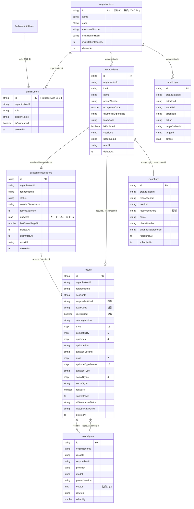
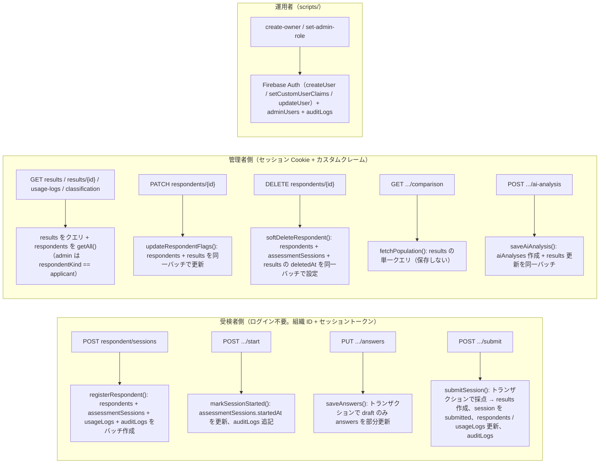
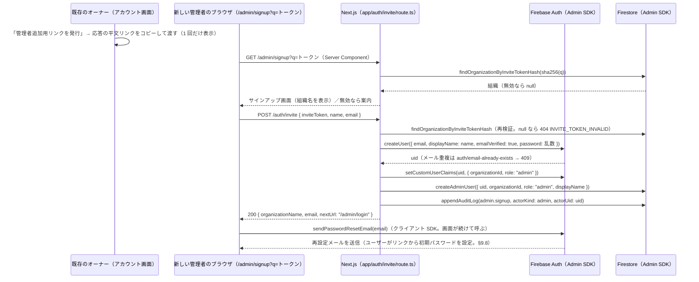

# 基本設計 02 データモデル設計（Firestore）

| 項目 | 内容 |
|---|---|
| 文書名 | 適性検査システム 基本設計 02 データモデル設計（Firestore）・セキュリティルール・インデックス・アクセス層・認証 |
| 版 | 2.1（2.0 版: 技術構成の変更（Supabase → Firebase。10 K-06）に伴う全面改版。2.1 版: Firebase 化後の分冊間整合（04・01・08 の 2.0 版と突き合わせ、04 が必要とする関数・インデックスを追加）。変更点は §16） |
| 作成日 | 2026-09-17（1.1 版: 2026-09-19、1.2 版: 2026-09-21、2.0 版: 2026-09-21、2.1 版: 2026-09-21） |
| 対象 | 実装者（データモデル・認証・API）、01・03・04・06・07・08 分冊の設計者 |
| 前提 | `docs/基本設計/00_共通定義.md` 2.0 版（以下「共通定義」）の用語・コレクション名・フィールド名・型名・規約に従う。共通定義と本書が矛盾した場合は共通定義を正とする |

## 0. 本書の位置づけ

本書は、要件定義書 §8 のデータモデルを Cloud Firestore（Native モード）の文書に落とし、コピーして使える `firebase/firestore.rules`・`firebase/storage.rules`・`firebase/firestore.indexes.json`、`lib/db/` の型（`XxxDoc`）と mapper、アクセス層（`lib/db/repositories/`）の関数仕様、Firebase Authentication との対応（`uid` = `adminUsers` の文書 ID、カスタムクレーム）、役割の付与、招待トークン、受検者トークン、論理削除の運用、監査ログの記録対象、Emulator 用のシードを確定するものです（共通定義 §6 の 02 分冊の担当範囲）。

- コレクション名・フィールド名・列挙値・型名は共通定義 §1〜§3 をそのまま使います。本書はフィールドの詳細・検証規則・インデックス・書き込み手順・関数仕様を追加するだけで、共通定義に無い別名を作りません。
- 採点の計算手順は 03 分冊、API の入出力と `lib/services/` は 04 分冊、画面は 05・06 分冊、AI 解説と PDF の処理は 07 分冊、実装計画とテストは 08 分冊が定めます。本書ではそれらが Firestore に「何を」「どの形で」「どの単位（バッチ／トランザクション）で」書き込み・読み出すかを定めます。
- RDB にあった外部キー・一意制約・CHECK 制約・トリガー・RLS・SQL 関数は Firestore には存在しません（共通定義 §2）。本書ではそれらを **(1) サーバ側のスキーマ検証、(2) アクセス層の関数（バッチ／トランザクション）、(3) 不変条件の一覧（§10）と結合テスト（08）** に置き換えます。
- Firestore・Firebase Auth の仕様のうち、設計時点で確信が持てない点は「実装時確認」と明記し、確認結果で設計を変える場合の代替案を併記します（§15）。

### 0.1 参照した要件

| 参照元 | 参照した内容 |
|---|---|
| 要件定義書 §2 | 用語（組織アカウント、オーナー、受検者、回答データ、各指標） |
| 要件定義書 §4 | 利用者と権限（受検者、管理者、オーナー、管理者追加、スーパーアドミン） |
| 要件定義書 §5 | 業務フロー（リンク発行→登録→回答→送信→採点→閲覧→チーム・除外・削除） |
| 要件定義書 §6.1 U-01〜U-09、§6.2 A-01〜A-13、§6.6 | 受検者・管理者機能、AI 解説の保存と状態 |
| 要件定義書 §8.1〜§8.8 | データモデル（組織アカウント、受検者、回答、結果、チャート用データ、AI 分析、利用回数管理、マスタ） |
| 要件定義書 §9 | 個人情報保護（TLS、保存時暗号化、アクセスログ、組織間のデータ分離）、認証（メール＋パスワード、再設定メール、リンク経由のサインアップ）、性能（結果を 1 レコードに、1〜2 リクエストで描画）、可用性（ページ単位保存と再開） |
| 要件定義書 §11 | 不具合 1〜10 と方針（特に 6 番: 比較値を永続化しない、9 番: 採点バージョン、10 番: 母集団の定義） |
| 要件定義書 §12 | 未確認事項（幹部データの非表示挙動、削除の論理／物理、中断・再開可否、完了メール、負値表示など） |
| 付録A | 設問 204 問、Q145〜Q204 が採点に未使用であること（回答 map のキー範囲 1〜144 の根拠） |
| 付録B §1〜§10、§13 | 配点属性 9 種、各指標の値域と刻み（数値の検証規則の根拠）、比較計算（母集団の定義）、旧ロジック混在（`scoringVersion` の根拠） |
| 付録C §1、§7、§8 | タイプ・キャラクターの対応（マスタをコード定数にする判断の根拠）、色分け、組織内分類 |
| 付録D §1、§2 | AI 分析レコードの項目（raw_json、model、prompt_version、verdict 3 種、信頼係数）と JSON スキーマ |
| 付録E §7 | PDF 出力（Cloud Storage for Firebase の利用有無は 07 分冊が判断） |
| tests/fixtures/README.md、tests/verify_fixtures.py | 検証用データの項目（16 タイプ得点が既存に無いこと、値の刻み） |
| 10 決定記録 K-01〜K-06 | 母集団に幹部と本人を含める（K-01）、データは削除しない（K-04）、技術構成の変更（K-06） |

### 0.2 決定事項との対応

| # | 決定事項 | 本書での対応 |
|---|---|---|
| 1 | Next.js + Firebase（Cloud Firestore、Firebase Authentication、Cloud Storage for Firebase）+ Vercel（10 K-06） | §3 でコレクションの文書定義、§6 でセキュリティルール（全拒否）、§7 で複合インデックス、§8 で Admin SDK のアクセス層、§9 で Firebase Auth との対応（カスタムクレーム、セッション Cookie、招待、受検者トークン）を定める。Cloud Storage は本フェーズでは使わない（07 D07-21。`storage.rules` は全拒否で配置する。§6.2） |
| 2 | 不具合 10 件の修正 | 6 番: 比較計算の値を保存するフィールド・コレクションを一切持たない（§3.2、§8.5）。9・10 番: `results.scoringVersion` と母集団取得関数 `fetchPopulation()`（§8.5）。1・2・4・8 番: 内部名・識別子は共通定義に統一（列挙値は `sensory_open` など）。7 番（Q145〜Q204 を採点に使わない）は `answers` のキー範囲検証（1〜144。§3.4）で担保。5 番（信頼係数の色）は 06・07 |
| 3 | 出題は Q1〜Q144 のみ | `assessmentSessions.answers` のキーは `"1"`〜`"144"` に限定し、サーバのスキーマ検証で範囲外を 422 にする（§3.4、D02-12） |
| 4 | 既存データは移行しない | 初期データは無し（Firestore は空から開始）。設問マスタもコード定数のみで Firestore に持たない（§4）。旧ロジックの扱いは設計対象外 |
| 5 | AI 解説は Claude API、差し替え可能 | `aiAnalyses.provider` / `model` / `promptVersion` で連携先を記録（§3.6） |
| 6 | 日本語のみ、管理 PC 幅、受検者スマホ | データモデルには影響なし。文言は日本語のみ（多言語フィールドを持たない） |

### 0.3 1.x 版（Supabase）からの主な変更

| 1.x 版（PostgreSQL） | 2.0 版（Firestore） | 根拠 |
|---|---|---|
| テーブル 10 本（`questions`、`answers` を含む）、snake_case の列名 | トップレベルのコレクション 8 つ（共通定義 §2.2）、camelCase のフィールド名。`questions` はコード定数のみ、`answers` は `assessmentSessions.answers` の map | 共通定義 §2.1、§2.2、D-01、D-29 |
| `results` の指標列 55 本（`trait_*` など） | `results` の map フィールド 6 つ（`traits`、`compatibility`、`aptitudes`、`risks`、`aptitudeTypeScores`、`socialStyles`）+ `reliability`。`ScoreResult` をそのまま保存 | 共通定義 §2.1、§3.4 |
| 外部キー・一意制約・CHECK・トリガー | サーバのスキーマ検証 + アクセス層のバッチ／トランザクション + 不変条件（§10） | 共通定義 §2 |
| RLS ポリシーと列権限、`security definer` 関数 | セキュリティルールは全拒否。認可はサーバコード（`requireAdmin` + `organizationId` の一致確認 + 役割判定。§9.3） | 共通定義 D-28 |
| SQL 関数 `provision_organization()`、`register_respondent()`、`finalize_assessment_session()`、`soft_delete_respondent()`、`fetch_population()`、`rotate_admin_invite_token()`、`purge_*()` | TypeScript のリポジトリ関数（§8、対応表は §14）。`purge_*` は廃止（10 K-04、K-06 補足） | 10 K-06 |
| Supabase Auth（`auth.users` の INSERT トリガーで `admin_users` を作成、役割は DB 参照） | Firebase Auth（Admin SDK `createUser` + `setCustomUserClaims` + `adminUsers` 文書の作成をサーバコードで順に行う。役割はカスタムクレーム。§9） | 共通定義 §4.1、§5、D-31 |
| `@supabase/ssr` の Cookie | `createSessionCookie` / `verifySessionCookie` のセッション Cookie（§9.11） | 共通定義 D-31 |
| `resume_token_hash`（再開トークン） | `sessionTokenHash`（受検者トークン。名称は共通定義 §2.2 に合わせた） | 共通定義 D-32 |
| 型名 `XxxRow`（`supabase gen types` の別名） | 型名 `XxxDoc`（手書き。`Timestamp` を含む保存形）+ ドメイン型（`Date` を含む）+ mapper | 共通定義 §3.1 |
| 物理削除関数（定義のみ残す） | 廃止。将来物理削除する場合は `scripts/` に Admin SDK のスクリプトとして設計する | 10 K-04、K-06 補足 |

## 1. 全体像

### 1.1 データモデル図

参照はすべて string の ID フィールドです（`DocumentReference` は使いません。共通定義 §2.1）。回答は `assessmentSessions` 文書の map フィールドで、独立したコレクションではありません。図中の `map` は Firestore の map 型、`ts` は `Timestamp` を表します。



`firebaseAuthUsers` は Firebase Authentication のユーザー（メールアドレス、パスワード、`disabled`、カスタムクレーム）で、Firestore の文書ではありません。

### 1.2 要件定義書 §8 との対応

| 要件定義書 §8 | 新システムのコレクション | 備考 |
|---|---|---|
| §8.1 組織アカウント（User）の組織関連列（組織名、コード、顧客番号、組織識別子） | `organizations` | 既存の「パスワード」（組織識別子）は `organizations` の文書 ID（自動 ID）に置き換える（要件定義書 §8.1、共通定義 D-12） |
| §8.1 の認証列・権限フラグ・お名前 | Firebase Auth のユーザー（メールアドレス、パスワード、`disabled`、カスタムクレーム `organizationId`・`role`）+ `adminUsers`（役割・氏名・利用停止・組織の複製） | 管理者／オーナー／スーパーアドミンの 3 フラグは `role` の 1 値に統合（共通定義 §5） |
| §8.1 の「チーム」 | `respondents.teamCode`（正）と `results.teamCode`（複製） | 既存は受検者ユーザーに設定（要件定義書 §8.1）。`teams` コレクションは作らない（共通定義 §2.2） |
| §8.1 の比較計算の一時値 | （フィールド・コレクションを作らない） | 要件定義書 §11 の 6 番。§8.5 参照 |
| §8.2 受検者 | `respondents` | |
| §8.3 回答（ユーザーrowデータ） | `assessmentSessions`（`status` と `answers` map） | Q1〜Q144 のみ。Q145〜Q204 のキーは受け付けない |
| §8.4 結果（回答データ） | `results` | 全指標を 1 文書に。「未使用」列と「判定」列は作らない。「1112変更済み」は `scoringVersion` に置き換える |
| §8.5 チャート用データ | （コレクションを作らない） | `results` から導出（要件定義書 §9 性能、共通定義 §2.2） |
| §8.6 AI 分析 | `aiAnalyses` + `results` の AI 関連フィールド | 判定 3 種は `output.verdict` の map に含まれるため別フィールドに抜粋しない（07 §3.3） |
| §8.7 利用回数管理 | `usageLogs` | |
| §8.8 マスタ | `lib/masters/`（コード定数のみ） | §4 参照 |
| §9 アクセスログ | `auditLogs` | 既存には無い（共通定義 D-24） |

### 1.3 データの流れ（Firestore から見た書き込み主体）

すべての読み書きは Next.js のサーバ（Route Handler、Server Component、`scripts/`）から Admin SDK で行います（共通定義 §2.5）。ブラウザは Firestore に触れません。



- 受検者側の書き込みは、組織 ID と受検者トークンをサーバで検証したうえで Admin SDK が行います（共通定義 D-23、本書 §9.10）。登録と送信はそれぞれ `registerRespondent()`（バッチ）と `submitSession()`（トランザクション）で原子性を担保します（§8.4）。
- 管理者側の読み書きは、セッション Cookie の検証（`verifySessionCookie`）→ クレームの `role` による機能制限 → 取得した文書の `organizationId` とクレームの一致確認、の 3 段階を必ず通します（共通定義 §4.1、本書 §9.3）。

## 2. 共通規約（本書での確定事項）

共通定義 §2.1 の規約を前提に、本書で次を確定します。

| 項目 | 規約 |
|---|---|
| 文書 ID | Firestore の自動 ID（`db.collection(...).doc()` が生成する 20 文字の英数字）。例外: `adminUsers` の文書 ID は Firebase Auth の `uid`（共通定義 D-22）。連番や推測可能な ID は使わない。バッチ・トランザクションで複数文書を同時に作るときは、書き込み前に `doc()` で ID を採番し、相互参照フィールド（`respondents.sessionId` など）に入れる |
| `organizations` の ID | 受検リンク `/exam?q={organizationId}` の `q` の値になる（共通定義 §3.7）。公開される前提で扱い、この ID だけで管理者を追加できてはならない（招待トークンは別の乱数。§9.7） |
| 監査フィールド | すべての文書に `createdAt`、`updatedAt`（`Timestamp`）。作成時は両方に `FieldValue.serverTimestamp()`、更新時は `updatedAt` に `FieldValue.serverTimestamp()` を必ず書く。アプリが `Date` から作った `Timestamp` を入れない（サーバ時刻に統一する。例外: `tokenExpiresAt` などアプリが計算する期限） |
| 論理削除 | `deletedAt`（`Timestamp` または `null`）を持つコレクション: `organizations`、`adminUsers`、`respondents`、`assessmentSessions`、`results`。**作成時に `deletedAt: null` を明示的に書く**（`where("deletedAt", "==", null)` に一致させるため。共通定義 §1.11、§2.1）。`aiAnalyses`・`usageLogs`・`auditLogs` は履歴のため持たない。削除の運用は §8.6 |
| 論理削除された文書の扱い | 単一文書の `get` 後に `deletedAt !== null` なら「存在しない」として扱う（04 は 404）。クエリは必ず `deletedAt == null` を条件に含める。復元は運用者が `deletedAt: null` に戻す（§8.6） |
| 除外フラグ | `respondents.isExcluded`（正）と `results.isExcluded`（複製）。母集団条件にのみ使い、一覧・詳細の表示は制限しない（要件定義書 §6.2 A-04） |
| 組織分離 | すべてのコレクションの文書に `organizationId`（string、必須。`organizations` は自身の ID を持たない）。組織に属する文書へのクエリは必ず `organizationId` の等価条件を含める。単一文書の取得後は `organizationId` がクレームと一致することを検証し、不一致は「存在しない」と同じ扱い（404）にする（共通定義 §2.1） |
| 複製フィールド | `respondents` の `kind`・`teamCode`・`isExcluded`・`deletedAt` を `results`（`respondentKind`・`teamCode`・`isExcluded`・`deletedAt`）に、`kind` を `usageLogs`（`respondentKind`）に複製する。正は常に `respondents`。複製を更新するときは **同一バッチ**で両方を更新する（§8.4、§10。共通定義 D-34） |
| 参照フィールド | `{参照コレクションの単数形}Id`（string）。`assessmentSessions` を参照するフィールドは `sessionId`（共通定義 §2.2 の表記に合わせる） |
| 数値 | `number`（倍精度）。計算値をそのまま保存し、丸めない（共通定義 §3.1）。整数であるべき値（`occupationCode`、`choice_code`、`compatibility` の各値）は検証で `Number.isInteger` を確認する |
| 日時 | `Timestamp`（UTC）。ISO 文字列・epoch 数値では保存しない。ドメイン型では `Date` に変換する（mapper。§5.3） |
| 文字列 | 長さの上限はコードポイント単位（`Array.from(s).length`）で数え、サーバのスキーマ検証で制限する（§3 の各表）。前後の空白は保存前に除去する |
| 列挙値 | string。値は共通定義 §1.8 の識別子。書き込み前にスキーマ検証で列挙値の集合に限定する |
| map のキー | 指標 map のキーは `TraitKey` などの識別子（snake_case のまま。共通定義 §2.1）。`answers` のキーは設問番号の 10 進文字列（`"1"`〜`"144"`。先頭ゼロなし） |
| スキーマ検証 | Firestore に型制約が無いため、**書き込み前に必ず検証**する。検証スキーマは `lib/db/schemas/` に置き（ライブラリは 01 が選定。zod 等）、リポジトリ関数の入口で適用する。読み取り時の検証は行わない（書き込みを一元化しているため。ただし mapper は必須フィールドの欠落を例外にする） |
| 一意性 | Firestore に一意制約は無い。一意にしたい値（`inviteTokenHash`、`sessionTokenHash`）は 32 バイトの乱数の SHA-256 で衝突を無視できるものとし、存在確認は行わない（共通定義 §2.1）。「1 受検者 1 セッション 1 結果」は ID の相互参照（`respondents.sessionId`・`resultId`、`assessmentSessions.resultId`）と `submitSession()` のトランザクション内の状態検査で守る（§10） |
| 書き込み単位 | 複数文書の整合が必要な書き込みは、**読み取り結果に依存しないものはバッチ（`db.batch()`）、依存するものはトランザクション（`db.runTransaction()`）** で行う（§8.1）。1 回の書き込みは最大 5 文書（送信時）で、上限（500 件。実装時確認）に対して十分小さい |
| 複合インデックス | `firebase/firestore.indexes.json`（§7）で宣言する。クエリを追加・変更するときは本書 §7 に追記してからデプロイする。単一フィールドの除外（`fieldOverrides`）も同ファイルで宣言する |
| セキュリティルール | `firebase/firestore.rules` と `firebase/storage.rules` は全拒否（§6）。ルールで認可を表現しない（共通定義 D-28） |
| 文書サイズ | 1 文書 1 MiB 以下（Firestore の上限。実装時確認）。最大の文書は `aiAnalyses`（`output` と `rawText`。付録D の出力は数 KB〜十数 KB）と `assessmentSessions`（`answers` 144 エントリで数 KB）で、上限に対して十分小さい |
| コレクション名の参照 | コードでは `lib/db/collections.ts` の `COLLECTIONS` 定数を使い、文字列リテラルを直接書かない（共通定義 §3.1） |
| Admin SDK の初期化 | `lib/firebase/admin.ts` の単一インスタンス。Firestore は同ファイルのアクセサ `adminFirestore()`、Auth は `adminAuth()` から取得する（関数名は 01 §5.5 が正）。`lib/db/` 以外から `firebase-admin/firestore` を import しない（共通定義 §3.3） |

## 3. コレクション定義

各表の「型」は Firestore の型（string / number / boolean / Timestamp / map / null）、「必須」は「作成時に必ず書く」の意味です（`null` 可のフィールドも `null` を明示的に書きます。省略しません）。「複製元」は非正規化フィールドの正となる文書です。「検証」はサーバのスキーマ検証（§2）の規則で、1.x 版の CHECK 制約に相当します。

### 3.1 organizations（組織）

文書 ID: 自動 ID（受検リンクの `q`）。

| フィールド | 型 | 必須 | 説明・根拠 | 検証 | 複製元 |
|---|---|---|---|---|---|
| `name` | string | ○ | 組織名（要件定義書 §8.1） | 空白のみ不可、1〜200 文字 | |
| `code` | string / null | ○ | 「コード」（要件定義書 §8.1）。用途・一意性は未確認。任意項目で一意にしない（D02-18） | 1〜100 文字または `null` | |
| `customerNumber` | string / null | ○ | 「顧客番号」（同上） | 同上 | |
| `inviteTokenHash` | string | ○ | 管理者追加用リンク `/admin/signup?q={inviteToken}` のトークンの SHA-256（hex）。平文はリンク生成時にのみ扱い、保存しない（§9.7） | `^[0-9a-f]{64}$` | |
| `inviteTokenIssuedAt` | Timestamp | ○ | トークンの発行（再発行）日時 | | |
| `createdAt` / `updatedAt` | Timestamp | ○ | 共通 | | |
| `deletedAt` | Timestamp / null | ○ | 論理削除（契約終了時。運用は §8.6） | | |

- 既存の「組織識別子（パスワード）」は使いません。既存リンク形式 `?q={組織ID}` の値は本コレクションの文書 ID です。
- 比較計算用のフィールドは持ちません（要件定義書 §11 の 6 番）。
- 受付停止フラグ `isActive` は持ちません（D02-27）。受検リンクの検証（04 §4.1）、`createOrganization()`、招待トークンの検証は `deletedAt == null` のみで判定します。
- 招待トークンの平文は `inviteTokenHash` から復元できないため、**アカウント画面に表示する管理者追加用リンクは、平文トークンを保存せずに表示できません**。設計判断 D02-35: 招待トークンは平文を保存せずハッシュのみ保存し、リンクは **再発行時の応答でのみ 1 回表示** します（オーナーが「管理者追加用リンクを発行」を押すと新しいトークンを生成し、その応答にだけ平文リンクを含める。以後アカウント画面には「発行日時」と「再発行」ボタンだけを表示する）。理由: 組織の管理者全員が常時見られる固定リンクを平文で保持すると、Firestore のエクスポートやログから漏えいした場合にそのまま管理者を追加できる。既存の「固定リンクを常時表示」（要件定義書 §6.2 A-12）との差になるため、06 M-07 と 04 §5.2 への申し送りとします（§15.1）。この判断を採用しない場合の代替: `inviteToken`（平文）を保存し、`GET /api/v1/admin/me` で返す（1.x 版と同じ）。その場合は本表の `inviteTokenHash` を `inviteToken` に置き換え、§7 のインデックスも同名に変えます。

### 3.2 adminUsers（管理者）

文書 ID: Firebase Auth の `uid`（共通定義 D-22）。

| フィールド | 型 | 必須 | 説明・根拠 | 検証 | 複製元 |
|---|---|---|---|---|---|
| `organizationId` | string | ○ | 所属組織。変更しない。カスタムクレームの `organizationId` と同じ値（正はクレーム。共通定義 §5） | `organizations` に存在し `deletedAt == null` | カスタムクレーム |
| `role` | string | ○ | `owner` / `admin` / `super_admin`（共通定義 §5）。招待リンク経由は `admin`。クレームの `role` と同じ値 | 列挙値 | カスタムクレーム |
| `displayName` | string | ○ | お名前（要件定義書 §6.2 A-12）。空文字を許容 | 0〜100 文字 | |
| `isSuspended` | boolean | ○ | 利用停止（要件定義書 §8.1）。true の管理者は Firebase Auth 側も `disabled: true` にする（§9.5） | | |
| `createdAt` / `updatedAt` | Timestamp | ○ | | | |
| `deletedAt` | Timestamp / null | ○ | 論理削除。設定後は管理 API を利用できない（§9.5） | | |

- メールアドレスとパスワードは Firebase Auth にのみ保持し、本文書に複製しません（D02-01。画面表示は Admin SDK の `getUser(uid)` から得る。一覧は `getUsers([{ uid }...])` でまとめて引く。実装時確認: 1 回あたりの上限 100 件）。
- 比較計算の一時値（要件定義書 §8.1）は持ちません（要件定義書 §11 の 6 番、共通定義 §1.11）。
- 本文書は「Firebase Auth のユーザーが存在し、クレームが設定済み」の後に作ります（§9.7 の手順）。文書が無いユーザーはログインできても管理 API を利用できません（`ADMIN_NOT_REGISTERED`。04）。

### 3.3 respondents（受検者）

文書 ID: 自動 ID。1 文書 = 1 回の受検登録（共通定義 §1.1）。

| フィールド | 型 | 必須 | 説明・根拠 | 検証 | 複製元 |
|---|---|---|---|---|---|
| `organizationId` | string | ○ | 受検リンクの `q`（要件定義書 §8.2） | `organizations` に存在し `deletedAt == null`（登録時に確認） | |
| `kind` | string | ○ | `applicant`（`p=user`）／`executive`（`p=executives`）。登録後は変更しない | 列挙値 | |
| `name` | string | ○ | 氏名（必須。要件定義書 §6.1 U-01）。個人情報 | 空白のみ不可、1〜100 文字 | |
| `phoneNumber` | string | ○ | 電話番号（必須）。正規化規則は 04（`lib/utils/phone-number.ts`）。個人情報 | 1〜30 文字（正規化後） | |
| `occupationCode` | number | ○ | 職業コード（共通定義 §1.10） | 整数 1〜9 | |
| `diagnosisExperience` | string | ○ | `first_time` / `experienced`（要件定義書 §6.1 U-01） | 列挙値 | |
| `teamCode` | string / null | ○ | チーム A〜Z。未設定は `null`（要件定義書 §6.2 A-03）。**正** | `^[A-Z]$` または `null` | （正） |
| `isExcluded` | boolean | ○ | 比較母集団からの除外（要件定義書 §6.2 A-04）。初期値 false。**正** | | （正） |
| `sessionId` | string | ○ | 対応する `assessmentSessions` の文書 ID（登録時に採番。1:1） | | |
| `usageLogId` | string | ○ | 対応する `usageLogs` の文書 ID（登録時に採番。1:1）。送信時にクエリ無しで利用履歴を更新するために持つ（D02-36） | | |
| `resultId` | string / null | ○ | 送信後に `results` の文書 ID を設定。それまで `null`（1:1） | | |
| `createdAt` / `updatedAt` | Timestamp | ○ | `createdAt` が登録日時 | | |
| `deletedAt` | Timestamp / null | ○ | 論理削除（要件定義書 §6.2 A-05、共通定義 D-11）。設定時は `assessmentSessions`・`results` にも同一バッチで設定（§8.6） | | （正） |

- 氏名・電話番号は個人情報です。保存時暗号化は Firestore の既定の暗号化に依り、フィールド単位の暗号化は行いません（D02-24。追加の要否は 01 分冊）。
- 一覧・母集団は `results` を起点にするため、`respondents` へのクエリは本フェーズでは行いません（`get` / `getAll` のみ。§7）。

### 3.4 assessmentSessions（受検セッション）

文書 ID: 自動 ID（受検者画面 URL `/exam/{sessionId}`）。

| フィールド | 型 | 必須 | 説明・根拠 | 検証 | 複製元 |
|---|---|---|---|---|---|
| `organizationId` | string | ○ | 受検者の組織を複製（変更しない） | | `respondents` |
| `respondentId` | string | ○ | 1 受検者 1 セッション（共通定義 D-02） | | |
| `status` | string | ○ | `draft` / `submitted`（要件定義書 §8.3）。初期値 `draft` | 列挙値 | |
| `sessionTokenHash` | string | ○ | 受検者トークンの SHA-256（hex）。平文は HttpOnly Cookie にのみ存在（§9.10、共通定義 D-32） | `^[0-9a-f]{64}$` | |
| `tokenExpiresAt` | Timestamp | ○ | トークン有効期限。発行から 7 日、開始・回答保存のたびに延長（D02-13。10 K-04「再開できる期間」） | | |
| `answers` | map | ○ | 回答。キーは設問番号の文字列 `"1"`〜`"144"`、値は `choice_code` 1〜5（共通定義 §2.2、D-29）。初期値は空 map `{}`。ページ単位の保存はフィールドパス `answers.{questionNo}` の部分更新（§8.4） | キーは `^[1-9][0-9]?$` または `^1[0-3][0-9]$` または `^14[0-4]$`（= 整数 1〜144。先頭ゼロ不可）、値は整数 1〜5 | |
| `lastSavedPageNo` | number / null | ○ | 最後に保存した通しページ番号 1〜20（共通定義 §1.9 の `pageNo`。再開位置。05 分冊）。`step` / `page` への変換は `lib/masters/exam-pages.ts`（1.x 版の `last_saved_step` / `last_saved_page` を 1 つに統合。D02-37） | 整数 1〜20 または `null` | |
| `lastAnsweredAt` | Timestamp / null | ○ | 最終保存日時 | | |
| `startedAt` | Timestamp / null | ○ | 「開始する」押下日時（要件定義書 §6.1 U-04）。初回のみ設定（冪等） | | |
| `submittedAt` | Timestamp / null | ○ | 送信日時。`status == "submitted"` と同時に設定 | | |
| `resultId` | string / null | ○ | 送信後に `results` の文書 ID | | |
| `createdAt` / `updatedAt` | Timestamp | ○ | | | |
| `deletedAt` | Timestamp / null | ○ | 受検者の論理削除に連動 | | `respondents` |

- 管理者 API は本コレクションを読みません。管理画面は `results` と `respondents` だけで構成できます（要件定義書 §6.2 A-02。D02-09）。
- 進行状況（回答済み数）は `Object.keys(answers).length` から導出します（別フィールドに持たない）。
- 送信後（`status == "submitted"`）の `answers` は変更しません。`saveAnswers()` のトランザクションが `status` を検査して拒否します（§8.4、§10）。
- `answers` の map は単一フィールドインデックスから除外します（§7.2。144 キーぶんのインデックス書き込みを避ける）。
- 接続元 IP は本文書に持ちません（D02-28）。受検者登録のレート制限は `auditLogs`（`action == "respondent.register"`、`ipAddress`、直近 10 分）の件数で判定します（04 §2.8、§8.4 の `countRecentAuditLogs()`）。
- 放置された `draft` セッション（氏名・電話番号を `respondents`・`usageLogs` に含む）は削除しません（10 K-04。D02-31）。管理者が個別に論理削除する手段は本フェーズでは無く（`results` 起点の一覧に出ないため）、運用者が `scripts/` で対応します。

### 3.5 results（採点結果）

文書 ID: 自動 ID（管理画面 URL `/admin/results/{resultId}`）。1 セッション 1 文書。指標部分は `ScoreResult`（共通定義 §3.4）と 1 対 1 で、`scoreAnswers()` の戻り値をそのまま（キー名を変えずに）保存します。

| フィールド | 型 | 必須 | 説明・根拠 | 検証 | 複製元 |
|---|---|---|---|---|---|
| `organizationId` | string | ○ | | | `respondents` |
| `respondentId` | string | ○ | 1 受検者 1 結果 | | |
| `sessionId` | string | ○ | 1 セッション 1 結果 | | |
| `respondentKind` | string | ○ | `respondents.kind` の複製。一覧クエリで `admin` に幹部を返さないため（共通定義 §5、D-34） | 列挙値 | `respondents.kind` |
| `teamCode` | string / null | ○ | `respondents.teamCode` の複製。母集団のチーム条件（共通定義 §1.11） | `^[A-Z]$` または `null` | `respondents.teamCode` |
| `isExcluded` | boolean | ○ | `respondents.isExcluded` の複製。母集団条件 | | `respondents.isExcluded` |
| `scoringVersion` | string | ○ | 採点に使った `SCORING_VERSION`（共通定義 §2.4）。母集団条件に使う | 空白不可、1〜20 文字 | |
| `traits` | map | ○ | 16 尺度。キー `TraitKey`、値 number 0〜30（付録B §2、0.5 刻み）。`deliberateness` は計算値をそのまま保存（要件定義書 §11 の 1 番） | 16 キー全部、各 0〜30 | |
| `compatibility` | map | ○ | 相性 5 軸。キー `CompatibilityKey`、値 整数 −100〜100（負値あり。付録B §3） | 5 キー全部、各整数 −100〜100 | |
| `aptitudes` | map | ○ | 資質 4 型。キー `AptitudeKey`、値 0 以上（付録B §4、1.25 刻み） | 4 キー全部、各 0 以上 | |
| `aptitudeFirst` / `aptitudeSecond` | string | ○ | 資質第一・第二候補（`AptitudeKey`） | 列挙値、両者が異なる | |
| `risks` | map | ○ | リスク 7 項目。キー `RiskKey`、値 number（×5 後、負値あり得る。付録B §5） | 7 キー全部 | |
| `aptitudeTypeScores` | map | ○ | 16 タイプ得点。キー `AptitudeTypeKey`、値 number（負値あり得る。付録B §6） | 16 キー全部 | |
| `aptitudeType` | string | ○ | 適性タイプ（`AptitudeTypeKey`） | 列挙値 | |
| `socialStyles` | map | ○ | ソーシャルスタイル 4 値。キー `SocialStyleKey`、値 number（計算値 −29〜29。共通定義 §1.7） | 4 キー全部 | |
| `socialStyle` | string | ○ | ソーシャルスタイル（`SocialStyleKey`） | 列挙値 | |
| `reliability` | number | ○ | 信頼係数 0〜100（付録B §8） | 0〜100 | |
| `submittedAt` | Timestamp | ○ | 回答日時（要件定義書 §8.4、一覧の並び順 A-02）。`assessmentSessions.submittedAt` と同じ値 | | |
| `aiGenerationStatus` | string | ○ | `not_generated` / `generating` / `completed` / `failed`（要件定義書 §6.6、共通定義 D-10）。初期値 `not_generated` | 列挙値 | |
| `aiGenerationStartedAt` | Timestamp / null | ○ | `generating` に遷移した日時（滞留検知用。07 §6） | | |
| `aiGenerationError` | string / null | ○ | 直近の失敗理由（`failed` のとき）。07 §4.6 の `AiFailureReason` の文字列または `internal_error` のみ。自由文（例外メッセージ等）は保存しない | `^[a-z_]{1,50}$` または `null` | |
| `latestAiAnalysisId` | string / null | ○ | 最新の `aiAnalyses` の文書 ID（要件定義書 §8.4）。指す文書の `resultId` が自分の ID であること（§10） | | |
| `createdAt` / `updatedAt` | Timestamp | ○ | | | |
| `deletedAt` | Timestamp / null | ○ | 受検者の論理削除に連動（同一バッチ） | | `respondents.deletedAt` |

- 数値の検証は付録B で理論上保証される範囲にだけ付けます（D02-15。負値が発生し得るものには付けない）。`scoreAnswers()`（03）の出力を検証するのは二重ですが、Firestore に型制約が無いため書き込み直前の検証を残します。
- 要件定義書 §8.4 の「判定」列は既存の意味が未確認のため作りません。評価 A〜E・合致度・偏差値・立ち位置は比較値であり保存しません（§8.5）。
- 「AI生成文章（JSON）」（要件定義書 §8.4）は `results` に複製せず、`latestAiAnalysisId` 経由で `aiAnalyses.output` を参照します。
- 指標 map 6 つは単一フィールドインデックスから除外します（§7.2。フィルタに使わず、`select()` の射影にだけ使うため）。

### 3.6 aiAnalyses（AI 解説）

文書 ID: 自動 ID。生成が成功したときにだけ作ります（失敗は `results.aiGenerationStatus = failed` と `aiGenerationError` に記録。D02-14）。フィールドの値の取得元は 07 §7.1 です。

| フィールド | 型 | 必須 | 説明・根拠 | 検証 | 複製元 |
|---|---|---|---|---|---|
| `organizationId` | string | ○ | 「医院」（付録D §1） | | `results` |
| `resultId` | string | ○ | 対象結果 | | |
| `respondentId` | string | ○ | 「Person」（付録D §1） | | `results.respondentId` |
| `analysisKind` | string | ○ | 分析種別（要件定義書 §8.6「採用分析」= `recruitment`）。将来の種別追加用 | 1〜50 文字 | |
| `provider` | string | ○ | 連携先名（`AiProvider.name`。`anthropic` / `stub`。07 §5.1）。将来の追加に備え列挙値で固定しない | 1〜50 文字 | |
| `model` | string | ○ | 実際に応答したモデル名（要件定義書 §8.6） | 1〜100 文字 | |
| `promptVersion` | string | ○ | `AI_PROMPT_VERSION`（共通定義 §3.2） | 1〜50 文字 | |
| `output` | map | ○ | 付録D §2 スキーマの JSON（検証済み。`AiAnalysisOutput`）。キーは付録D のまま。`verdict` も入れ子の map で持ち、別フィールドに抜粋しない（07 §3.3） | 07 の JSON 検証済みであること | |
| `rawText` | string | ○ | LLM 応答の生テキスト（再検証・障害調査用）。個人情報（氏名）を含み得る | 1 文字以上 | |
| `usage` | map / null | ○ | トークン使用量（`AiUsage`。stub は `null`） | | |
| `stopReason` | string / null | ○ | 応答の停止理由 | | |
| `requestId` | string / null | ○ | 連携先のリクエスト ID | | |
| `status` | string | ○ | 本フェーズは常に `completed`（将来の非同期化に備える。07 §6.5） | 列挙値 | |
| `reliability` | number | ○ | 生成時点の信頼係数の複製（要件定義書 §8.6） | 0〜100 | `results.reliability` |
| `generatedBy` | string | ○ | 生成を実行した管理者の `uid` | | |
| `createdAt` / `updatedAt` | Timestamp | ○ | `createdAt` が生成日時（1.x 版の `generated_at` を統合） | | |

- 論理削除は持ちません。受検者を論理削除しても本文書は残りますが、`results` が見えないため参照されません。
- `output`・`rawText`・`usage` は単一フィールドインデックスから除外します（§7.2。`rawText` はインデックス対象の文字列の上限（実装時確認: 1,500 バイト）を超え得るため、除外しないと書き込みが失敗する可能性がある）。

### 3.7 usageLogs（利用履歴）

文書 ID: 自動 ID。受検登録時に作成し、送信時に `resultId` と `submittedAt` を設定します（D02-30）。

| フィールド | 型 | 必須 | 説明・根拠 | 検証 | 複製元 |
|---|---|---|---|---|---|
| `organizationId` | string | ○ | 「組織識別子」（要件定義書 §8.7） | | `respondents` |
| `respondentId` | string | ○ | 登録元の受検者（1:1。`respondents.usageLogId` と相互参照） | | |
| `resultId` | string / null | ○ | 送信時に設定（共通定義 §2.2） | | |
| `respondentKind` | string | ○ | `respondents.kind` の複製。幹部の履歴を `admin` に見せないため（D02-05） | 列挙値 | `respondents.kind` |
| `name` | string | ○ | 名前の複製（要件定義書 §8.7）。個人情報 | 1〜100 文字 | `respondents.name` |
| `phoneNumber` | string | ○ | 電話番号の複製。個人情報 | 1〜30 文字 | `respondents.phoneNumber` |
| `diagnosisExperience` | string | ○ | 過去の診断経験 | 列挙値 | `respondents.diagnosisExperience` |
| `registeredAt` | Timestamp | ○ | 受検登録日時（`respondents.createdAt` と同じ時刻） | | |
| `submittedAt` | Timestamp / null | ○ | 回答日時（利用履歴ポップアップの「回答日時」。要件定義書 §6.2 A-06）。未送信は `null` | | |
| `createdAt` / `updatedAt` | Timestamp | ○ | | | |

- 受検者を論理削除しても履歴は残します（D02-11。既存の利用回数管理は独立レコード。要件定義書 §8.7）。物理削除は行いません（10 K-04）。
- 未送信の登録が「回答日時 = null」で並びます。表示は 06 M-07 が確定済みの方針に従います（1.x 版 §14.1 の申し送り）。

### 3.8 auditLogs（監査ログ）

文書 ID: 自動 ID。追記のみ（更新・削除する関数を作らない）。

| フィールド | 型 | 必須 | 説明・根拠 | 検証 | 複製元 |
|---|---|---|---|---|---|
| `organizationId` | string | ○ | 操作対象の組織 | | |
| `actorKind` | string | ○ | `admin`（管理者）／`respondent`（受検者）／`system`（運用者・スクリプト）（D02-17） | 列挙値 | |
| `actorUid` | string / null | ○ | `admin` なら Firebase Auth の `uid`、`respondent` なら `respondents` の文書 ID、`system` なら `null`（共通定義 §2.2 の `actorUid`） | | |
| `actorRole` | string / null | ○ | `admin` のときクレームの `role`。それ以外は `null` | 列挙値または `null` | |
| `action` | string | ○ | 操作種別（§11 の一覧。04 の `AuditAction` と一致） | `^[a-z_]+\.[a-z_]+$` | |
| `targetCollection` | string / null | ○ | 対象コレクション名（`COLLECTIONS` の値） | | |
| `targetId` | string / null | ○ | 対象文書 ID | | |
| `details` | map | ○ | 補足（比較範囲、PDF モード、変更前後の値など）。氏名・電話番号・メールアドレス・トークン・生の AI 出力は入れない。値は string / number / boolean / null / string の配列に限る（04 の `AuditDetails`） | 上記の値型 | |
| `ipAddress` | string / null | ○ | 接続元（Vercel の `x-forwarded-for` 先頭。04 分冊）。IPv4 / IPv6 の文字列 | 45 文字以内 | |
| `userAgent` | string / null | ○ | | 500 文字以内（超過分は切り詰め） | |
| `createdAt` / `updatedAt` | Timestamp | ○ | 追記専用のため両者は同じ値 | | |

- 保存期間: 無期限（10 K-04。D02-17）。
- 閲覧 API は本フェーズでは提供しません（04）。運用者が Firebase コンソールまたは `scripts/` で参照します。
- `details`・`userAgent` は単一フィールドインデックスから除外します（§7.2）。

## 4. マスタデータの持ち方

### 4.1 判断

| マスタ（要件定義書 §8.8） | 持ち方 | 理由 |
|---|---|---|
| 設問（204 問、付録A） | コード定数 `lib/masters/questions.ts` のみ。Firestore に `questions` コレクションを **持たない**（共通定義 D-01。1.x 版の DB シードは廃止） | 回答が `assessmentSessions.answers` の map になり外部キー整合が不要になった。出題範囲（1〜144）はサーバのスキーマ検証で保証する。設問文の変更は採点結果の意味を変えるため、コードと同じ版管理（Git・リリース）に乗せる |
| 選択肢配点（5 × 9 属性、付録B §1） | コード定数 `lib/masters/choice-scores.ts` | 採点エンジン（純関数）が Firestore 非依存であるべき（共通定義 §3.3）。値は付録B の固定表で運用中に変更しない |
| 指標定義（各指標の加減算設問と属性、付録B §2〜§8） | コード定数 `lib/masters/indicators/` | 同上。単体テストで付録B の式と 1 対 1 に検証できる（08 分冊） |
| 16 タイプ・資質・スタイル・立ち位置の定義（名称、キャラクター、色、順序） | コード定数 `lib/masters/indicators/`（型は共通定義 §3.5） | 画面・PDF・AI 入力が同じ定数を参照する |
| 表示文言（付録C） | コード定数 `lib/masters/texts/`（構造は 06 分冊） | 管理画面で編集する要件は無い（要件定義書 §6.4「マスタ化された定型文の条件選択」）。Firestore に置くと読み取り課金と型安全性の手当てが増えるだけで利点がない |
| 職業（9 種） | コード定数 `lib/masters/occupations.ts` | `respondents.occupationCode` は整数、表示名はコード側 |
| イラスト | `public/images/`（共通定義 §3.8、10 K-05） | 静的ファイル |

Firestore にマスタ用のコレクションは **1 つも作りません**。

### 4.2 版の記録

| 対象 | 版の識別子 | 記録先 |
|---|---|---|
| 採点式・配点表・指標定義・設問→指標マッピング・設問文・出題フラグ | `SCORING_VERSION`（`lib/scoring/version.ts`、初期値 `"1.0.0"`。共通定義 §2.4） | `results.scoringVersion`（採点時） |
| AI プロンプト | `AI_PROMPT_VERSION`（環境変数） | `aiAnalyses.promptVersion` |
| AI モデル・連携先 | `AI_MODEL`、`AI_PROVIDER` | `aiAnalyses.model`、`aiAnalyses.provider` |

- D02-16: 設問と配点を別々の版で持たず、`SCORING_VERSION` 1 つで「採点結果に使ったマスタ一式」を表します。設問文の誤字修正など採点に影響しない変更はパッチ版（`1.0.1`）を上げ、母集団条件は 03 分冊が比較規則を定めるまでは完全一致（共通定義 §1.11）とします。1.x 版の `questions.master_version` は廃止です（設問文の改版履歴は Git で追う。08 D08-13）。
- 将来「管理画面から文言を編集したい」要件が出た場合は、`lib/masters/texts/` と同じ形の map を保持するコレクションを追加し、`lib/masters/` をフォールバックにする方式で拡張できます（本フェーズでは実装しません）。

## 5. TypeScript 側の契約（`lib/db/`）

### 5.1 構成

```text
lib/db/
├── collections.ts          # COLLECTIONS 定数と型付きコレクション参照（withConverter）
├── types.ts                # XxxDoc（保存形。Timestamp を含む）と列挙値の型
├── domain.ts               # ドメイン型（接尾辞なし。Date を含む。id を持つ）
├── errors.ts               # RepositoryError と RepositoryErrorCode
├── schemas/                # 書き込み前のスキーマ検証（ライブラリは 01 が選定）
│   ├── organization.ts
│   ├── admin-user.ts
│   ├── respondent.ts
│   ├── assessment-session.ts
│   ├── result.ts
│   ├── ai-analysis.ts
│   ├── usage-log.ts
│   └── audit-log.ts
├── mappers/                # Doc ↔ ドメイン型の変換
│   ├── timestamp.ts        # toDate / toTimestamp / toNullableDate
│   ├── organization.ts
│   ├── admin-user.ts
│   ├── respondent.ts
│   ├── assessment-session.ts
│   ├── result.ts           # toResult / toScoreResult / toPopulationMember / toResultDocFields
│   ├── ai-analysis.ts
│   ├── usage-log.ts
│   └── audit-log.ts
└── repositories/           # コレクションごとの読み書き（§8）
    ├── organizations-repository.ts
    ├── admin-users-repository.ts
    ├── respondents-repository.ts
    ├── assessment-sessions-repository.ts
    ├── results-repository.ts
    ├── ai-analyses-repository.ts
    ├── usage-logs-repository.ts
    └── audit-logs-repository.ts
```

- `firebase-admin/firestore` を import するのは `lib/db/` と `lib/firebase/admin.ts`、`lib/auth/`、`scripts/` だけです（共通定義 §3.3）。`lib/services/` はリポジトリ関数とドメイン型だけを使い、`Timestamp` や `DocumentSnapshot` を扱いません。
- ドメイン型は「文書 ID を `id` として持ち、`Timestamp` を `Date` に変換したもの」です。API の `Dto` への変換は 04 が定めます。

### 5.2 `lib/db/collections.ts`

```ts
// lib/db/collections.ts
import {
  type CollectionReference,
  type DocumentData,
  type FirestoreDataConverter,
  type QueryDocumentSnapshot,
} from "firebase-admin/firestore";
import { adminFirestore } from "@/lib/firebase/admin"; // 関数名は 01 §5.5 が正
import type {
  AdminUserDoc, AiAnalysisDoc, AssessmentSessionDoc, AuditLogDoc,
  OrganizationDoc, RespondentDoc, ResultDoc, UsageLogDoc,
} from "@/lib/db/types";

export const COLLECTIONS = {
  organizations: "organizations",
  adminUsers: "adminUsers",
  respondents: "respondents",
  assessmentSessions: "assessmentSessions",
  results: "results",
  aiAnalyses: "aiAnalyses",
  usageLogs: "usageLogs",
  auditLogs: "auditLogs",
} as const;
export type CollectionName = (typeof COLLECTIONS)[keyof typeof COLLECTIONS];

/** 保存形をそのまま型付けするコンバータ（変換は行わない。読み取り時の検証は mapper が行う） */
function docConverter<T extends DocumentData>(): FirestoreDataConverter<T> {
  return {
    toFirestore: (doc: T) => doc,
    fromFirestore: (snapshot: QueryDocumentSnapshot) => snapshot.data() as T,
  };
}

export function organizationsRef(): CollectionReference<OrganizationDoc> {
  return adminFirestore().collection(COLLECTIONS.organizations).withConverter(docConverter<OrganizationDoc>());
}
export function adminUsersRef(): CollectionReference<AdminUserDoc> {
  return adminFirestore().collection(COLLECTIONS.adminUsers).withConverter(docConverter<AdminUserDoc>());
}
export function respondentsRef(): CollectionReference<RespondentDoc> {
  return adminFirestore().collection(COLLECTIONS.respondents).withConverter(docConverter<RespondentDoc>());
}
export function assessmentSessionsRef(): CollectionReference<AssessmentSessionDoc> {
  return adminFirestore().collection(COLLECTIONS.assessmentSessions).withConverter(docConverter<AssessmentSessionDoc>());
}
export function resultsRef(): CollectionReference<ResultDoc> {
  return adminFirestore().collection(COLLECTIONS.results).withConverter(docConverter<ResultDoc>());
}
export function aiAnalysesRef(): CollectionReference<AiAnalysisDoc> {
  return adminFirestore().collection(COLLECTIONS.aiAnalyses).withConverter(docConverter<AiAnalysisDoc>());
}
export function usageLogsRef(): CollectionReference<UsageLogDoc> {
  return adminFirestore().collection(COLLECTIONS.usageLogs).withConverter(docConverter<UsageLogDoc>());
}
export function auditLogsRef(): CollectionReference<AuditLogDoc> {
  return adminFirestore().collection(COLLECTIONS.auditLogs).withConverter(docConverter<AuditLogDoc>());
}
```

- 実装時確認: `withConverter` を付けた参照に対する `update()` の部分更新（`FieldValue.serverTimestamp()` やフィールドパス指定）の型付け。型が合わない場合は `update()` だけコンバータ無しの参照（`adminFirestore().collection(...).doc(id)`）で行います。

### 5.3 `lib/db/types.ts`（`XxxDoc`。保存形）

`XxxDoc` は Firestore に保存されている形そのものです（`Timestamp` を含む。文書 ID は含まない）。`readonly` で定義し、書き込みは `XxxDoc` 全体（作成時）または部分（更新時。`Partial` とフィールドパス）で行います。

```ts
// lib/db/types.ts
import type { Timestamp } from "firebase-admin/firestore";
import type {
  AptitudeKey, AptitudeTypeKey, ScoreResult, SocialStyleKey, TeamCode,
} from "@/lib/scoring/types";
import type { AiAnalysisOutput, AiGenerationStatus, AiUsage } from "@/lib/ai/types";

/** 列挙値（共通定義 §1.8、§5） */
export const ADMIN_ROLES = ["owner", "admin", "super_admin"] as const;
export type AdminRole = (typeof ADMIN_ROLES)[number];
export const RESPONDENT_KINDS = ["applicant", "executive"] as const;
export type RespondentKind = (typeof RESPONDENT_KINDS)[number];
export const DIAGNOSIS_EXPERIENCES = ["first_time", "experienced"] as const;
export type DiagnosisExperience = (typeof DIAGNOSIS_EXPERIENCES)[number];
export const SESSION_STATUSES = ["draft", "submitted"] as const;
export type SessionStatus = (typeof SESSION_STATUSES)[number];
export const AUDIT_ACTOR_KINDS = ["admin", "respondent", "system"] as const;
export type AuditActorKind = (typeof AUDIT_ACTOR_KINDS)[number];
export const AI_ANALYSIS_STATUSES = ["completed"] as const;
export type AiAnalysisStatus = (typeof AI_ANALYSIS_STATUSES)[number];

/** 監査フィールド（共通定義 §2.1） */
export interface BaseDoc {
  readonly createdAt: Timestamp;
  readonly updatedAt: Timestamp;
}
/** 論理削除を持つ文書。作成時に deletedAt: null を明示する */
export interface SoftDeletableDoc extends BaseDoc {
  readonly deletedAt: Timestamp | null;
}

export interface OrganizationDoc extends SoftDeletableDoc {
  readonly name: string;
  readonly code: string | null;
  readonly customerNumber: string | null;
  readonly inviteTokenHash: string;         // sha256 hex
  readonly inviteTokenIssuedAt: Timestamp;
}

export interface AdminUserDoc extends SoftDeletableDoc {
  readonly organizationId: string;          // カスタムクレームと同じ値
  readonly role: AdminRole;                 // カスタムクレームと同じ値
  readonly displayName: string;
  readonly isSuspended: boolean;
}

export interface RespondentDoc extends SoftDeletableDoc {
  readonly organizationId: string;
  readonly kind: RespondentKind;
  readonly name: string;
  readonly phoneNumber: string;
  readonly occupationCode: number;          // 1〜9
  readonly diagnosisExperience: DiagnosisExperience;
  readonly teamCode: TeamCode | null;       // 正
  readonly isExcluded: boolean;             // 正
  readonly sessionId: string;
  readonly usageLogId: string;
  readonly resultId: string | null;
}

/** answers の保存形。キーは "1"〜"144"、値は 1〜5（choice_code） */
export type AnswersField = Readonly<Record<string, number>>;

export interface AssessmentSessionDoc extends SoftDeletableDoc {
  readonly organizationId: string;
  readonly respondentId: string;
  readonly status: SessionStatus;
  readonly sessionTokenHash: string;        // sha256 hex
  readonly tokenExpiresAt: Timestamp;
  readonly answers: AnswersField;
  readonly lastSavedPageNo: number | null;  // 1〜20
  readonly lastAnsweredAt: Timestamp | null;
  readonly startedAt: Timestamp | null;
  readonly submittedAt: Timestamp | null;
  readonly resultId: string | null;
}

/** results 文書。指標部分は ScoreResult をそのまま含む（共通定義 §2.1、§3.4） */
export interface ResultDoc extends SoftDeletableDoc, ScoreResult {
  readonly organizationId: string;
  readonly respondentId: string;
  readonly sessionId: string;
  readonly respondentKind: RespondentKind;  // 複製
  readonly teamCode: TeamCode | null;       // 複製
  readonly isExcluded: boolean;             // 複製
  readonly submittedAt: Timestamp;
  readonly aiGenerationStatus: AiGenerationStatus;
  readonly aiGenerationStartedAt: Timestamp | null;
  readonly aiGenerationError: string | null;  // AiFailureReason | "internal_error"
  readonly latestAiAnalysisId: string | null;
}

export interface AiAnalysisDoc extends BaseDoc {
  readonly organizationId: string;
  readonly resultId: string;
  readonly respondentId: string;
  readonly analysisKind: string;            // "recruitment"
  readonly provider: string;                // "anthropic" | "stub"
  readonly model: string;
  readonly promptVersion: string;
  readonly output: AiAnalysisOutput;        // 付録D §2 のキーのまま
  readonly rawText: string;
  readonly usage: AiUsage | null;
  readonly stopReason: string | null;
  readonly requestId: string | null;
  readonly status: AiAnalysisStatus;
  readonly reliability: number;
  readonly generatedBy: string;             // uid
}

export interface UsageLogDoc extends BaseDoc {
  readonly organizationId: string;
  readonly respondentId: string;
  readonly resultId: string | null;
  readonly respondentKind: RespondentKind;  // 複製
  readonly name: string;                    // 複製
  readonly phoneNumber: string;             // 複製
  readonly diagnosisExperience: DiagnosisExperience;
  readonly registeredAt: Timestamp;
  readonly submittedAt: Timestamp | null;
}

export type AuditDetailValue = string | number | boolean | null | readonly string[];
export type AuditDetails = Readonly<Record<string, AuditDetailValue>>;

export interface AuditLogDoc extends BaseDoc {
  readonly organizationId: string;
  readonly actorKind: AuditActorKind;
  readonly actorUid: string | null;
  readonly actorRole: AdminRole | null;
  readonly action: string;                  // 04 の AuditAction（§11）
  readonly targetCollection: string | null;
  readonly targetId: string | null;
  readonly details: AuditDetails;
  readonly ipAddress: string | null;
  readonly userAgent: string | null;
}

/** 参照用に再エクスポート（services が lib/scoring を直接 import しなくてよいように） */
export type { AptitudeKey, AptitudeTypeKey, SocialStyleKey, TeamCode };
```

### 5.4 `lib/db/domain.ts`（ドメイン型）

ドメイン型は `XxxDoc` から `Timestamp` を `Date` に置き換え、文書 ID `id` を加えたものです。型の導出を機械的にするため、次のユーティリティ型で定義します。

```ts
// lib/db/domain.ts
import type { Timestamp } from "firebase-admin/firestore";
import type {
  AdminUserDoc, AiAnalysisDoc, AssessmentSessionDoc, AuditLogDoc,
  OrganizationDoc, RespondentDoc, ResultDoc, UsageLogDoc,
} from "@/lib/db/types";

/** Timestamp を Date に、Timestamp | null を Date | null に置き換える（map の中は再帰しない。指標 map は number のみのため不要） */
type Dated<T> = {
  readonly [K in keyof T]: T[K] extends Timestamp ? Date
    : T[K] extends Timestamp | null ? Date | null
    : T[K];
};
type WithId<T> = { readonly id: string } & Dated<T>;

export type Organization = WithId<OrganizationDoc>;
export type AdminUser = WithId<AdminUserDoc>;
export type Respondent = WithId<RespondentDoc>;
export type AssessmentSession = WithId<AssessmentSessionDoc>;
export type Result = WithId<ResultDoc>;
export type AiAnalysis = WithId<AiAnalysisDoc>;
export type UsageLog = WithId<UsageLogDoc>;
export type AuditLog = WithId<AuditLogDoc>;
```

- 実装時確認: `Dated` の条件型が `Timestamp | null` を先に `Timestamp` の分岐で判定してしまわないこと（分配的条件型の挙動）。問題があれば各ドメイン型を手書きに切り替えます（フィールド数は最大 30 程度）。

### 5.5 `lib/db/mappers/`（変換の方針）

| 変換 | 関数 | 規則 |
|---|---|---|
| `Timestamp` → `Date` | `toDate(ts: Timestamp): Date`、`toNullableDate(ts: Timestamp | null): Date | null` | `ts.toDate()`。`undefined`（フィールド欠落）は例外（必須フィールドの欠落 = データ不整合） |
| `Date` → `Timestamp` | `toTimestamp(date: Date): Timestamp` | `Timestamp.fromDate(date)`。アプリが計算する期限（`tokenExpiresAt`）にのみ使う。`createdAt` / `updatedAt` は `FieldValue.serverTimestamp()` を書くため使わない |
| `Doc` → ドメイン型 | `toOrganization(id, doc)`、`toAdminUser(id, doc)`、`toRespondent(id, doc)`、`toAssessmentSession(id, doc)`、`toResult(id, doc)`、`toAiAnalysis(id, doc)`、`toUsageLog(id, doc)`、`toAuditLog(id, doc)` | `DocumentSnapshot` を受け取る `fromSnapshot(snapshot)` 形式のオーバーロードも用意し、`exists === false` なら `null` を返す |
| `results` 文書 → `ScoreResult` | `toScoreResult(doc: ResultDoc): ScoreResult` | 指標 map 6 つ + `aptitudeFirst` / `aptitudeSecond` / `aptitudeType` / `socialStyle` / `reliability` / `scoringVersion` を取り出す。map のキーは変換しない。`ScoreResult` の全キーが揃っていることを検証し、欠落は例外 |
| `results` 文書 → `PopulationMember` | `toPopulationMember(data: Pick<ResultDoc, "traits" | "compatibility">): PopulationMember` | `select("traits", "compatibility")` の結果から変換。16 キー・5 キーが揃っていることを検証 |
| `ScoreResult` → `results` の作成データ | `toResultDocFields(score: ScoreResult): Pick<ResultDoc, keyof ScoreResult>` | そのまま展開する（キー名の変換なし）。`submitSession()` が識別・複製・AI・監査フィールドを合成して `ResultDoc` を完成させる |
| `AnswersField` ↔ `AnswerMap` | `toAnswerMap(answers: AnswersField): AnswerMap`、`toAnswersField(answers: Partial<AnswerMap>): AnswersField` | キーの `string` ↔ `number` 変換。`toAnswerMap` は 1〜144 が揃っていることを検証しない（`assertAnswerMap`（03）が行う） |

```ts
// lib/db/mappers/result.ts（契約。実装は 04 分冊と共同）
import type { AnswerMap, PopulationMember, ScoreResult } from "@/lib/scoring/types";
import type { AnswersField, ResultDoc } from "@/lib/db/types";
import type { Result } from "@/lib/db/domain";

export function toResult(id: string, doc: ResultDoc): Result;
export function toScoreResult(doc: ResultDoc): ScoreResult;
export function toPopulationMember(data: Pick<ResultDoc, "traits" | "compatibility">): PopulationMember;
export function toResultDocFields(score: ScoreResult): Pick<ResultDoc, keyof ScoreResult>;

// lib/db/mappers/assessment-session.ts
export function toAnswerMap(answers: AnswersField): AnswerMap;
export function toAnswersField(answers: Partial<AnswerMap>): AnswersField;
```

- Firestore の `number` は JavaScript の `number` としてそのまま返るため、1.x 版にあった `numeric` 文字列の `Number()` 変換は不要です。
- mapper は純関数で、Firestore へのアクセスを持ちません（単体テストで検証。08）。

### 5.6 `lib/db/errors.ts`

リポジトリ関数は状態不整合・存在しない文書を **例外ではなく型付きエラー** で表し、04 が HTTP ステータスに変換します（1.x 版の SQL 関数の `raise exception` に相当）。

```ts
// lib/db/errors.ts
export const REPOSITORY_ERROR_CODES = [
  "ORGANIZATION_NOT_FOUND",      // 組織が無い・論理削除済み（404）
  "ADMIN_USER_NOT_FOUND",        // adminUsers 文書が無い・クレームと不一致（403 ADMIN_NOT_REGISTERED。04 §2.5.1 が正）
  "ADMIN_USER_SUSPENDED",        // isSuspended または deletedAt（403 ADMIN_SUSPENDED）
  "RESPONDENT_NOT_FOUND",        // 受検者が無い・他組織・論理削除済み・admin に見えない幹部（404）
  "SESSION_NOT_FOUND",           // セッションが無い・論理削除済み（404 / 401）
  "SESSION_ALREADY_SUBMITTED",   // submitted への保存・再送信（409）
  "ANSWERS_INCOMPLETE",          // 144 問未満での送信（409）
  "RESULT_NOT_FOUND",            // 結果が無い・他組織・論理削除済み・admin に見えない幹部（404）
  "INVITE_TOKEN_INVALID",        // 招待トークン不一致・組織削除済み（404）
  "AI_ANALYSIS_MISMATCH",        // latestAiAnalysisId の整合違反（500。§10）
  "AI_ALREADY_GENERATING",       // aiGenerationStatus が generating で、かつ滞留とみなせない（409 AI_GENERATING。04 §5.9）
  "VALIDATION_ERROR",            // スキーマ検証失敗（422）
] as const;
export type RepositoryErrorCode = (typeof REPOSITORY_ERROR_CODES)[number];

export class RepositoryError extends Error {
  constructor(
    public readonly code: RepositoryErrorCode,
    message: string,
    public readonly details: Readonly<Record<string, string | number>> = {},
  ) {
    super(message);
    this.name = "RepositoryError";
  }
}
```

## 6. セキュリティルール（全拒否）

Firestore・Cloud Storage へのアクセスはサーバの Admin SDK（サービスアカウント）だけが行い、Admin SDK にはセキュリティルールが適用されません（共通定義 §2.5）。ブラウザ・第三者からの直接アクセスをすべて拒否するため、ルールは **全拒否** です。認可はルールで表現せず、サーバコード（§9.3）で行います（共通定義 D-28）。

### 6.1 `firebase/firestore.rules`

```text
rules_version = '2';

// 適性検査システム: Firestore へのアクセスはサーバ（Admin SDK）のみ。
// クライアント SDK からの読み書きはすべて拒否する（00 §2.5、D-28）。
// 認可は Next.js のサーバコードで行うため、このファイルに条件を追加しない。
service cloud.firestore {
  match /databases/{database}/documents {
    match /{document=**} {
      allow read, write: if false;
    }
  }
}
```

### 6.2 `firebase/storage.rules`

本フェーズでは Cloud Storage for Firebase を使いません（07 D07-21。PDF はバイト列を同期で返し保存しない）。バケットが既定で作成される場合に備え、ルールは全拒否で配置します（01 がデプロイ対象に含めるかを決める。バケットを作成しない場合はデプロイ対象から外す）。

```text
rules_version = '2';

// 適性検査システム: Cloud Storage は本フェーズでは使用しない（07 D07-21）。
// 将来 PDF を保存する場合もサーバ（Admin SDK）からのみアクセスし、クライアントからは拒否する。
service firebase.storage {
  match /b/{bucket}/o {
    match /{allPaths=**} {
      allow read, write: if false;
    }
  }
}
```

### 6.3 検証（08 分冊へ）

- Firestore Emulator 上で、クライアント SDK（または REST の未認証・匿名認証・任意の ID トークン）から各コレクションの `get` / `list` / `create` / `update` / `delete` を試み、すべて拒否されること（`@firebase/rules-unit-testing` の `assertFails`。実装時確認: パッケージ名と版は 01）。
- Admin SDK（`FIRESTORE_EMULATOR_HOST` 設定時）からは読み書きできること。
- 将来 PDF を Storage に保存する場合の設計（バケット、パス `pdf-exports/{organizationId}/{resultId}/{mode}.pdf`、署名付き URL の有効期限）は 07 §9.11 に残し、本書ではルールを全拒否のまま維持します（署名付き URL は Admin SDK が発行するためルールに依らない。実装時確認）。

## 7. インデックス（`firebase/firestore.indexes.json`）

### 7.1 クエリ一覧とインデックス

本システムが発行するクエリ（`where` / `orderBy` を持つもの）の全一覧です。単一文書の `get` / `getAll` はインデックス不要のため載せません。等価条件だけのクエリは単一フィールドの既定インデックスの合成で処理できる可能性があります（実装時確認）が、共通定義 §1.11 に従い母集団クエリを含めて複合インデックスを宣言し、Emulator の未定義インデックス警告（08）で過不足を検出します。

| # | コレクション | クエリ（条件 → 並び順） | 用途 | 複合インデックス |
|---|---|---|---|---|
| Q1 | `results` | `organizationId ==`, `isExcluded == false`, `scoringVersion ==`, `deletedAt == null` | 母集団（組織全体）。`fetchPopulation()`（§8.5） | `organizationId, isExcluded, scoringVersion, deletedAt` |
| Q2 | `results` | Q1 + `teamCode ==` | 母集団（チーム） | `organizationId, isExcluded, scoringVersion, deletedAt, teamCode` |
| Q3 | `results` | `organizationId ==`, `deletedAt == null` → `submittedAt desc` | 回答一覧（owner / super_admin）、組織内分類、PDF・詳細以外の一覧系 | `organizationId, deletedAt, submittedAt desc` |
| Q4 | `results` | `organizationId ==`, `respondentKind == "applicant"`, `deletedAt == null` → `submittedAt desc` | 回答一覧・組織内分類（admin。幹部を除く） | `organizationId, respondentKind, deletedAt, submittedAt desc` |
| Q5 | `usageLogs` | `organizationId ==` → `registeredAt desc` | 利用履歴（owner / super_admin） | `organizationId, registeredAt desc` |
| Q6 | `usageLogs` | `organizationId ==`, `respondentKind == "applicant"` → `registeredAt desc` | 利用履歴（admin） | `organizationId, respondentKind, registeredAt desc` |
| Q7 | `aiAnalyses` | `resultId ==` → `createdAt desc` | 生成履歴（本フェーズでは `latestAiAnalysisId` の `get` を使い、クエリは運用・テスト用） | `resultId, createdAt desc` |
| Q8 | `adminUsers` | `organizationId ==`, `deletedAt == null` → `createdAt asc` | 管理者一覧（owner。04 §5.11） | `organizationId, deletedAt, createdAt asc` |
| Q9 | `organizations` | `inviteTokenHash ==`, `deletedAt == null`（`limit(1)`） | 招待トークンの検証（§9.7） | `inviteTokenHash, deletedAt` |
| Q10 | `assessmentSessions` | `sessionTokenHash ==`（`limit(1)`） | Cookie からの再開可能セッションの検索（04 §4.1。`deletedAt`・`tokenExpiresAt` はコードで判定） | 不要（単一フィールド） |
| Q11 | `auditLogs` | `organizationId ==`, `action ==`, `ipAddress ==`, `createdAt >= 現在 − 10 分`（`count()`） | 受検者登録のレート制限（04 §2.8「組織 × IP」、D02-28） | `organizationId, action, ipAddress, createdAt` |
| Q12 | `auditLogs` | `organizationId ==` → `createdAt desc` | 運用者の参照・結合テスト | `organizationId, createdAt desc` |
| Q13 | `usageLogs` | Q5 / Q6 と同じ等価条件（`count()`） | 利用履歴の `total`（04 §5.8 の `{items, total}`） | Q5 / Q6 と共用 |
| Q14 | `aiAnalyses` | `organizationId ==`, `createdAt >= 当日 0 時（Asia/Tokyo）`（`count()`） | AI 生成回数の日次上限（04 §2.8 `countAiAnalysesSince()`） | `organizationId, createdAt` |

- 回答一覧（04 §5.3）は Q3 / Q4 で組織の結果を**全件**取得し（`select()` で射影。§8.5 `listResults()`）、検索・絞り込み・並び替え・ページングは 04 がメモリ上で行います（04 D04-55。1 組織あたり数百件規模の前提。共通定義 §1.11）。したがって `results` の `count()` や `offset` / カーソルは使いません。利用履歴（04 §5.8）は `limit` + `offset` と Q13 の `count()` で `{items, total}` を返します。`offset` は読み飛ばした文書も読み取り課金の対象になる（実装時確認）ため、件数が数千件を超える組織が出た場合はカーソル方式へ切り替えます（§12）。
- `deletedAt == null` の等価条件が `null` 値の文書に一致することは実装時確認です（共通定義 §1.11）。一致しない場合は全コレクションに `isDeleted`（boolean）を追加し、Q1〜Q4・Q8・Q9 の `deletedAt` を `isDeleted == false` に置き換えます（インデックスも同名で差し替え。D02-38）。
- `count()` 集計クエリ（Q11、Q13、Q14）の課金は「インデックスエントリ 1,000 件ごとに 1 読み取り」（実装時確認）で、通常のクエリより安価です。Q11・Q14 は不等号条件（`createdAt >=`）を含むため、等価条件のフィールドを先に、`createdAt` を最後に置いた複合インデックスが必要です（実装時確認: 不等号を含む `count()` の可否）。

### 7.2 単一フィールドインデックスの除外

次のフィールドはクエリ条件に使わないため、単一フィールドインデックス（自動作成）を除外し、書き込みコストとインデックスサイズを抑えます。`rawText` と `output` は、インデックス対象の値の上限（実装時確認: 1 エントリ約 1,500 バイト）を超えると書き込み自体が失敗する可能性があるため、除外が必須です。

| コレクション | フィールド | 理由 |
|---|---|---|
| `assessmentSessions` | `answers` | map の 144 キーが個別にインデックスされる（実装時確認: map の各キーに単一フィールドインデックスが自動作成されるか）。設問単位の検索要件は無い |
| `results` | `traits`、`compatibility`、`aptitudes`、`risks`、`aptitudeTypeScores`、`socialStyles` | `select()` の射影にだけ使い、条件に使わない |
| `aiAnalyses` | `output`、`rawText`、`usage` | 長文・入れ子の map。条件に使わない |
| `auditLogs` | `details`、`userAgent` | 条件に使わない。`userAgent` は 500 文字まで許容 |

### 7.3 `firebase/firestore.indexes.json`（全文）

```json
{
  "indexes": [
    {
      "collectionGroup": "results",
      "queryScope": "COLLECTION",
      "fields": [
        { "fieldPath": "organizationId", "order": "ASCENDING" },
        { "fieldPath": "isExcluded", "order": "ASCENDING" },
        { "fieldPath": "scoringVersion", "order": "ASCENDING" },
        { "fieldPath": "deletedAt", "order": "ASCENDING" }
      ]
    },
    {
      "collectionGroup": "results",
      "queryScope": "COLLECTION",
      "fields": [
        { "fieldPath": "organizationId", "order": "ASCENDING" },
        { "fieldPath": "isExcluded", "order": "ASCENDING" },
        { "fieldPath": "scoringVersion", "order": "ASCENDING" },
        { "fieldPath": "deletedAt", "order": "ASCENDING" },
        { "fieldPath": "teamCode", "order": "ASCENDING" }
      ]
    },
    {
      "collectionGroup": "results",
      "queryScope": "COLLECTION",
      "fields": [
        { "fieldPath": "organizationId", "order": "ASCENDING" },
        { "fieldPath": "deletedAt", "order": "ASCENDING" },
        { "fieldPath": "submittedAt", "order": "DESCENDING" }
      ]
    },
    {
      "collectionGroup": "results",
      "queryScope": "COLLECTION",
      "fields": [
        { "fieldPath": "organizationId", "order": "ASCENDING" },
        { "fieldPath": "respondentKind", "order": "ASCENDING" },
        { "fieldPath": "deletedAt", "order": "ASCENDING" },
        { "fieldPath": "submittedAt", "order": "DESCENDING" }
      ]
    },
    {
      "collectionGroup": "usageLogs",
      "queryScope": "COLLECTION",
      "fields": [
        { "fieldPath": "organizationId", "order": "ASCENDING" },
        { "fieldPath": "registeredAt", "order": "DESCENDING" }
      ]
    },
    {
      "collectionGroup": "usageLogs",
      "queryScope": "COLLECTION",
      "fields": [
        { "fieldPath": "organizationId", "order": "ASCENDING" },
        { "fieldPath": "respondentKind", "order": "ASCENDING" },
        { "fieldPath": "registeredAt", "order": "DESCENDING" }
      ]
    },
    {
      "collectionGroup": "aiAnalyses",
      "queryScope": "COLLECTION",
      "fields": [
        { "fieldPath": "resultId", "order": "ASCENDING" },
        { "fieldPath": "createdAt", "order": "DESCENDING" }
      ]
    },
    {
      "collectionGroup": "adminUsers",
      "queryScope": "COLLECTION",
      "fields": [
        { "fieldPath": "organizationId", "order": "ASCENDING" },
        { "fieldPath": "deletedAt", "order": "ASCENDING" },
        { "fieldPath": "createdAt", "order": "ASCENDING" }
      ]
    },
    {
      "collectionGroup": "organizations",
      "queryScope": "COLLECTION",
      "fields": [
        { "fieldPath": "inviteTokenHash", "order": "ASCENDING" },
        { "fieldPath": "deletedAt", "order": "ASCENDING" }
      ]
    },
    {
      "collectionGroup": "auditLogs",
      "queryScope": "COLLECTION",
      "fields": [
        { "fieldPath": "organizationId", "order": "ASCENDING" },
        { "fieldPath": "action", "order": "ASCENDING" },
        { "fieldPath": "ipAddress", "order": "ASCENDING" },
        { "fieldPath": "createdAt", "order": "ASCENDING" }
      ]
    },
    {
      "collectionGroup": "auditLogs",
      "queryScope": "COLLECTION",
      "fields": [
        { "fieldPath": "organizationId", "order": "ASCENDING" },
        { "fieldPath": "createdAt", "order": "DESCENDING" }
      ]
    },
    {
      "collectionGroup": "aiAnalyses",
      "queryScope": "COLLECTION",
      "fields": [
        { "fieldPath": "organizationId", "order": "ASCENDING" },
        { "fieldPath": "createdAt", "order": "ASCENDING" }
      ]
    }
  ],
  "fieldOverrides": [
    { "collectionGroup": "assessmentSessions", "fieldPath": "answers", "indexes": [] },
    { "collectionGroup": "results", "fieldPath": "traits", "indexes": [] },
    { "collectionGroup": "results", "fieldPath": "compatibility", "indexes": [] },
    { "collectionGroup": "results", "fieldPath": "aptitudes", "indexes": [] },
    { "collectionGroup": "results", "fieldPath": "risks", "indexes": [] },
    { "collectionGroup": "results", "fieldPath": "aptitudeTypeScores", "indexes": [] },
    { "collectionGroup": "results", "fieldPath": "socialStyles", "indexes": [] },
    { "collectionGroup": "aiAnalyses", "fieldPath": "output", "indexes": [] },
    { "collectionGroup": "aiAnalyses", "fieldPath": "rawText", "indexes": [] },
    { "collectionGroup": "aiAnalyses", "fieldPath": "usage", "indexes": [] },
    { "collectionGroup": "auditLogs", "fieldPath": "details", "indexes": [] },
    { "collectionGroup": "auditLogs", "fieldPath": "userAgent", "indexes": [] }
  ]
}
```

- デプロイは Firebase CLI（`firebase --config firebase/firebase.json deploy --only firestore`。`firestore` ターゲットはルールとインデックスの両方を含む。01 §6・§7、08 リリース手順）。本番のインデックス作成には時間がかかるため、リリース手順ではルール・インデックスをアプリより先にデプロイします。
- 実装時確認: (1) `fieldOverrides` の `"indexes": []` が map フィールド全体（サブフィールドを含む）の除外として機能すること。機能しない場合はサブフィールドごとに除外を列挙する。(2) `deletedAt` の `null` 値がインデックスに含まれること。(3) Emulator が未定義の複合インデックスを警告する（本番では `FAILED_PRECONDITION` になる）こと。
- クエリを追加するときは §7.1 の表に行を足し、本 JSON を更新してからコードを書きます。

## 8. アクセス層（`lib/db/repositories/`）

### 8.1 共通規約

| 項目 | 規約 |
|---|---|
| 責務 | Firestore の読み書きだけを行う。HTTP・Cookie・クレームの検証は `lib/auth/`・04 の `lib/services/` が行い、リポジトリは **検証済みの `organizationId` と閲覧者情報（`Viewer`）** を引数で受け取る。監査ログは、複数文書の書き込みと同じバッチに含める必要があるもの（登録・送信・削除・再発行）はリポジトリが書き、単独で書けるもの（閲覧系）は 04 の service が `appendAuditLog()` で書く（§11） |
| 戻り値 | ドメイン型（§5.4）または ID。`DocumentSnapshot`・`Timestamp` を返さない |
| 存在しない・見えない | 単一取得は `null` を返す（他組織・論理削除済み・`admin` に見えない幹部を区別しない。04 はすべて 404）。状態遷移を伴う書き込みは `RepositoryError`（§5.6） |
| 組織分離 | すべての取得関数は `organizationId` を必須引数に取り、`get` 後に `doc.organizationId === organizationId` を確認する（クエリは条件に含める）。例外は文書 ID が既知でクレームに依らない受検者側の `getSessionByTokenHash()` と、運用者用の関数 |
| 幹部の可視性 | `Viewer.role` が `admin` のとき、`respondentKind == "executive"`（`results`・`usageLogs`）／`kind == "executive"`（`respondents`）の文書を返さない。判定は `canViewExecutives(role)`（`lib/auth/claims.ts`。§9.4）を使う |
| バッチとトランザクション | 読み取り結果に依存しない複数文書の作成・更新はバッチ（`db.batch()`）。状態を検査してから書くもの（回答保存、送信）はトランザクション（`db.runTransaction()`）。トランザクション内では **すべての読み取りを書き込みより先に** 行う（Admin SDK の制約。実装時確認） |
| タイムスタンプ | `createdAt` / `updatedAt` は `FieldValue.serverTimestamp()`。同一バッチ内の複数文書で「同じ時刻」が必要なもの（`submittedAt`、`deletedAt`、`registeredAt`）は、サーバ側で `Timestamp.now()` を 1 回取得して全文書に同じ値を書く（`serverTimestamp()` は文書ごとに評価される可能性があるため。実装時確認） |
| スキーマ検証 | 作成データは `lib/db/schemas/` で検証してから書く（§2）。検証失敗は `RepositoryError("VALIDATION_ERROR")` |
| 再試行 | トランザクションの競合再試行は Admin SDK に任せる（既定 5 回。実装時確認）。`RepositoryError` は再試行しない（`runTransaction` のコールバックから投げた例外はそのまま呼び出し元に伝播する。実装時確認） |
| ログ | 個人情報（氏名・電話番号・メールアドレス・トークン平文・`rawText`）をサーバログに出さない |

閲覧者情報の型（`lib/auth/claims.ts`。§9.2）:

```ts
// lib/auth/claims.ts（02 が確定。04 の requireAdmin が生成する）
import type { AdminRole } from "@/lib/db/types";

export interface AdminClaims {
  readonly organizationId: string;
  readonly role: AdminRole;
}
export interface Viewer extends AdminClaims {
  readonly uid: string;
}
export function canViewExecutives(role: AdminRole): boolean; // owner / super_admin → true
```

リクエスト付帯情報（監査ログ用。04 の `RequestMeta` と同じ形）:

```ts
export interface RequestMeta {
  readonly ipAddress: string | null;
  readonly userAgent: string | null;
}
```

### 8.2 関数一覧

| ファイル | 関数 | 書き込み単位 | 呼び出し元 | 1.x 版の対応（§14） |
|---|---|---|---|---|
| `organizations-repository.ts` | `createOrganization()` | バッチ（organizations + auditLogs） | `scripts/create-owner`、`scripts/seed-local` | `provision_organization()` |
| | `getOrganization()` | 読み取り | 04（受検リンク検証、`/admin/me`） | RLS `organizations_select_own` |
| | `findOrganizationByInviteTokenHash()` | 読み取り（Q9） | `POST /auth/invite`、サインアップ画面 | `validate_admin_invite_token()` |
| | `rotateInviteToken()` | バッチ（organizations + auditLogs） | `POST /api/v1/admin/organization/invite-token`（owner）、`scripts/create-owner` | `rotate_admin_invite_token()` |
| `admin-users-repository.ts` | `createAdminUser()` | 単一作成（`set`。既存なら失敗） | `lib/auth/admin-accounts.ts`（§9.6、§9.7） | トリガー `handle_new_auth_user()` |
| | `getAdminUser()` | 読み取り | 04 `requireAdmin`、`/admin/me` | RLS ヘルパー |
| | `listAdminUsers()` | 読み取り（Q8） | `GET /api/v1/admin/admin-users`（owner） | RLS `admin_users_select_self_or_owner` |
| | `updateAdminUserDisplayName()` | 単一更新 | `PATCH /api/v1/admin/me` | 列権限 `update (name)` |
| | `setAdminUserRole()`、`setAdminUserSuspended()`、`softDeleteAdminUser()` | 単一更新（Auth 側の操作は `lib/auth/admin-accounts.ts` が同時に行う。§9.9） | `scripts/set-admin-role` | 運用者の SQL（§7.5） |
| `respondents-repository.ts` | `registerRespondent()` | バッチ（respondents + assessmentSessions + usageLogs + auditLogs） | `POST /api/v1/respondent/sessions` | `register_respondent()` |
| | `getRespondent()` | 読み取り | 04 | RLS `respondents_select_same_org` |
| | `getRespondentById()` | 読み取り（`viewer` 無し。組織一致・`deletedAt == null` のみ） | 04 受検者 API（`sessionId` からの受検者取得。幹部の可視性判定は不要） | 同上 |
| | `getRespondentsByIds()` | `getAll()`（100 件ずつ） | 一覧・組織内分類 | 結合 |
| | `updateRespondentFlags()` | バッチ（respondents + results + auditLogs） | `PATCH /api/v1/admin/respondents/{id}` | 列権限 `update (team_code, is_excluded)` |
| | `softDeleteRespondent()` | バッチ（respondents + assessmentSessions + results + auditLogs） | `DELETE /api/v1/admin/respondents/{id}` | `soft_delete_respondent()` |
| `assessment-sessions-repository.ts` | `getSession()` | 読み取り | 04 受検者 API | — |
| | `getSessionByTokenHash()` | 読み取り（Q10） | `GET /api/v1/respondent/organizations/{id}`（再開） | `resume_token_hash` UNIQUE 検索 |
| | `markSessionStarted()` | トランザクション（初回のみ `startedAt`）+ auditLogs | `POST …/start` | UPDATE `started_at` |
| | `saveAnswers()` | トランザクション（draft 検査 → `answers.{n}` 部分更新） | `PUT …/answers` | `answers` UPSERT + トリガー |
| | `submitSession()` | トランザクション（session + respondent + usageLog 読み取り → results 作成 + 3 文書更新 + auditLogs） | `POST …/submit` | `finalize_assessment_session()` |
| `results-repository.ts` | `getResult()` | 読み取り | 結果詳細・比較・AI・PDF | RLS `results_select_same_org` |
| | `listResults()` | 読み取り（Q3 / Q4。全件を `select` で射影。絞り込み・並び替え・ページングは 04 がメモリ上で行う。D04-55） | `GET /api/v1/admin/results` | 一覧 SELECT |
| | `listResultsForClassification()` | 読み取り（Q3 / Q4、`select`） | `GET /api/v1/admin/classification` | 集計 SELECT |
| | `fetchPopulation()` | 読み取り（Q1 / Q2、`select`） | `GET …/comparison`、PDF | `fetch_population()` |
| `ai-analyses-repository.ts` | `markAiGenerationStarted()` | トランザクション（状態検査。`generating` の滞留判定を含む） | `POST …/ai-analysis` | UPDATE AI 列 |
| | `countAiAnalysesSince()` | `count()` 集計（Q14） | 04 §2.8 AI 生成回数の上限 | — |
| | `saveAiAnalysis()` | バッチ（aiAnalyses 作成 + results 更新 + auditLogs） | 同上（成功時） | INSERT + UPDATE + トリガー検証 |
| | `markAiGenerationFailed()` | 単一更新 + auditLogs | 同上（失敗時） | UPDATE AI 列 |
| | `getAiAnalysis()` | 読み取り | 結果詳細・`GET …/ai-analysis`・PDF | RLS `ai_analyses_select_same_org` |
| `usage-logs-repository.ts` | `listUsageLogs()` | 読み取り（Q5 / Q6 + Q13 の `count()`。`limit` + `offset`） | `GET /api/v1/admin/usage-logs` | RLS `usage_logs_select_same_org` |
| `audit-logs-repository.ts` | `appendAuditLog()` | 単一作成 | 04 service（閲覧系の記録） | RLS `audit_logs_insert_self` |
| | `addAuditLogToBatch()` | バッチに追加（内部用） | 他のリポジトリ | — |
| | `countRecentAuditLogs()` | `count()` 集計（Q11。組織 × IP） | 04 §2.8 レート制限 | `audit_logs` の COUNT |

### 8.3 組織・管理者

```ts
// lib/db/repositories/organizations-repository.ts
import type { Organization } from "@/lib/db/domain";

export interface CreateOrganizationInput {
  readonly name: string;
  readonly code: string | null;
  readonly customerNumber: string | null;
}
export interface CreatedOrganization {
  readonly organizationId: string;
  readonly inviteToken: string;   // 平文。呼び出し元（scripts）が 1 回だけ表示する。保存しない
}
/** 組織を作成し、初回の招待トークンを発行する。auditLogs に organization.create（actorKind: system） */
export function createOrganization(input: CreateOrganizationInput): Promise<CreatedOrganization>;

/** deletedAt == null の組織を返す。無ければ null */
export function getOrganization(organizationId: string): Promise<Organization | null>;

/** 招待トークン（平文）のハッシュで組織を引く。無効・削除済みなら null（Q9） */
export function findOrganizationByInviteTokenHash(inviteTokenHash: string): Promise<Organization | null>;

export interface RotateInviteTokenInput {
  readonly organizationId: string;
  readonly actor: { readonly kind: "admin"; readonly uid: string; readonly role: "owner" | "super_admin" }
               | { readonly kind: "system" };
  readonly meta: RequestMeta | null;
}
/** 新しいトークンを生成し inviteTokenHash / inviteTokenIssuedAt を更新。auditLogs に organization.rotate_invite_token。平文を返す（応答で 1 回だけ表示。D02-35） */
export function rotateInviteToken(input: RotateInviteTokenInput): Promise<{ readonly inviteToken: string; readonly issuedAt: Date }>;
```

```ts
// lib/db/repositories/admin-users-repository.ts
import type { AdminUser } from "@/lib/db/domain";
import type { AdminRole } from "@/lib/db/types";

export interface CreateAdminUserInput {
  readonly uid: string;             // Firebase Auth の uid = 文書 ID
  readonly organizationId: string;
  readonly role: AdminRole;
  readonly displayName: string;
}
/** adminUsers 文書を作成する（set with { exists: false } 相当。既に存在すれば失敗。実装時確認: create() の利用） */
export function createAdminUser(input: CreateAdminUserInput): Promise<void>;

/** 文書を返す（isSuspended / deletedAt の判定は呼び出し元（requireAdmin）が行う）。無ければ null */
export function getAdminUser(uid: string): Promise<AdminUser | null>;

/** 同一組織の deletedAt == null の管理者を createdAt 昇順で返す（Q8）。メールアドレスは含まない（04 が Auth から引く） */
export function listAdminUsers(organizationId: string): Promise<readonly AdminUser[]>;

export function updateAdminUserDisplayName(input: { readonly uid: string; readonly organizationId: string; readonly displayName: string }): Promise<void>;

/** 以下は scripts/set-admin-role 専用（Auth 側の操作と組み合わせるのは lib/auth/admin-accounts.ts。§9.9） */
export function setAdminUserRole(input: { readonly uid: string; readonly role: AdminRole }): Promise<void>;
export function setAdminUserSuspended(input: { readonly uid: string; readonly isSuspended: boolean }): Promise<void>;
export function softDeleteAdminUser(input: { readonly uid: string }): Promise<void>;
```

- `createOrganization()` の処理: (1) 入力検証、(2) `organizationsRef().doc()` で ID 採番、(3) 招待トークン `issueInviteToken()`（§9.7。32 バイト乱数 → base64url 平文と SHA-256 hex）、(4) バッチで `organizations` 文書（`deletedAt: null` 明示）と `auditLogs`（`organization.create`）を作成、(5) `{ organizationId, inviteToken }` を返す。
- `rotateInviteToken()` の認可（owner / super_admin のみ）は 04 の service が `Viewer.role` で判定してから呼びます（リポジトリは `actor` を監査ログに記録するだけ）。

### 8.4 受検者・セッション（登録・保存・送信・更新・削除）

```ts
// lib/db/repositories/respondents-repository.ts
import type { Respondent } from "@/lib/db/domain";
import type { DiagnosisExperience, RespondentKind, TeamCode } from "@/lib/db/types";
import type { Viewer, RequestMeta } from "@/lib/auth/claims";

export interface RegisterRespondentInput {
  readonly organizationId: string;          // 呼び出し元が getOrganization() で存在確認済み
  readonly kind: RespondentKind;
  readonly name: string;                    // 前後空白除去済み
  readonly phoneNumber: string;             // 正規化済み（lib/utils/phone-number.ts）
  readonly occupationCode: number;          // 1〜9
  readonly diagnosisExperience: DiagnosisExperience;
  readonly sessionTokenHash: string;        // hashRespondentToken(token)（§9.10）
  readonly tokenExpiresAt: Date;            // issueRespondentToken(now).expiresAt
  readonly meta: RequestMeta;
}
export interface RegisteredRespondent {
  readonly respondentId: string;
  readonly sessionId: string;
  readonly usageLogId: string;
  readonly registeredAt: Date;
}
/**
 * 受検者登録。respondents / assessmentSessions / usageLogs / auditLogs（respondent.register）を
 * 1 バッチで作成する。3 文書の ID は事前に採番し相互参照フィールドに入れる。
 * 組織が無い・削除済みなら RepositoryError("ORGANIZATION_NOT_FOUND")（バッチ前に get で確認）
 */
export function registerRespondent(input: RegisterRespondentInput): Promise<RegisteredRespondent>;

/** 組織一致・deletedAt == null・幹部の可視性（viewer.role）を満たす受検者。満たさなければ null */
export function getRespondent(input: { readonly respondentId: string; readonly viewer: Viewer }): Promise<Respondent | null>;

/** 受検者 API 用（閲覧者が管理者でない経路。04 §4）。組織一致・deletedAt == null のみ確認し、幹部の可視性は判定しない。満たさなければ null */
export function getRespondentById(input: { readonly respondentId: string; readonly organizationId: string }): Promise<Respondent | null>;

/**
 * ID の集合で受検者をまとめて取得する（getAll()。100 件ずつに分割。実装時確認: 1 回あたりの上限）。
 * 戻り値は respondentId → Respondent の Map。存在しない・組織不一致の ID は含まれない。
 * 論理削除済みの文書も返す（呼び出し元は results 側の deletedAt で既に絞っている）
 */
export function getRespondentsByIds(input: { readonly organizationId: string; readonly respondentIds: readonly string[] }): Promise<ReadonlyMap<string, Respondent>>;

export interface UpdateRespondentFlagsInput {
  readonly respondentId: string;
  readonly viewer: Viewer;
  readonly patch: { readonly teamCode?: TeamCode | null; readonly isExcluded?: boolean };  // 少なくとも 1 つ
  readonly meta: RequestMeta;
}
export interface UpdatedRespondentFlags {
  readonly before: { readonly teamCode: TeamCode | null; readonly isExcluded: boolean };
  readonly after: { readonly teamCode: TeamCode | null; readonly isExcluded: boolean };
}
/**
 * チーム・除外フラグの更新。respondents（正）と results（複製。resultId が null なら respondents のみ）を
 * 同一バッチで更新し、変更があった項目ごとに auditLogs（respondent.update_team / respondent.update_exclusion。
 * details は { before, after }）を同じバッチに追加する。変更が無ければ何も書かず before == after を返す。
 * 受検者が見えなければ RepositoryError("RESPONDENT_NOT_FOUND")
 */
export function updateRespondentFlags(input: UpdateRespondentFlagsInput): Promise<UpdatedRespondentFlags>;

export interface SoftDeleteRespondentInput {
  readonly respondentId: string;
  readonly viewer: Viewer;
  readonly meta: RequestMeta;
}
/**
 * 論理削除。respondents / assessmentSessions（sessionId）/ results（resultId。null なら対象外）の
 * deletedAt を同じ Timestamp で設定し、auditLogs（respondent.delete）を同一バッチで追記する。
 * 既に削除済み・見えない場合は RepositoryError("RESPONDENT_NOT_FOUND")（04 は 2 回目の DELETE を 404 にする）。
 * usageLogs / aiAnalyses は変更しない（履歴として残す。D02-11）。物理削除は行わない（10 K-04）
 */
export function softDeleteRespondent(input: SoftDeleteRespondentInput): Promise<{ readonly deletedAt: Date }>;
```

```ts
// lib/db/repositories/assessment-sessions-repository.ts
import type { AssessmentSession } from "@/lib/db/domain";
import type { AnswerMap, ChoiceCode, QuestionNo, ScoreResult } from "@/lib/scoring/types";
import type { RequestMeta } from "@/lib/auth/claims";

/** deletedAt == null のセッション。無ければ null。トークン照合（sessionTokenHash・tokenExpiresAt）は呼び出し元（lib/auth/respondent-token.ts）が行う */
export function getSession(sessionId: string): Promise<AssessmentSession | null>;

/** Cookie のトークンのハッシュで検索（Q10、limit 1）。deletedAt != null・期限切れは null。組織 ID の一致も確認する */
export function getSessionByTokenHash(input: { readonly organizationId: string; readonly sessionTokenHash: string; readonly now: Date }): Promise<AssessmentSession | null>;

/**
 * 「開始する」の記録。トランザクションで status == draft を検査し、startedAt が null のときだけ設定する（冪等）。
 * tokenExpiresAt を延長する。初回のみ auditLogs（session.start）を追記する。
 * submitted なら RepositoryError("SESSION_ALREADY_SUBMITTED")
 */
export function markSessionStarted(input: { readonly sessionId: string; readonly tokenExpiresAt: Date; readonly meta: RequestMeta }): Promise<{ readonly startedAt: Date; readonly isFirstStart: boolean }>;

export interface SaveAnswersInput {
  readonly sessionId: string;
  readonly answers: Readonly<Partial<Record<QuestionNo, ChoiceCode>>>;  // 1 ページ分（7〜8 問）。キー 1〜144、値 1〜5（検証済み）
  readonly lastSavedPageNo: number;         // 1〜20
  readonly tokenExpiresAt: Date;            // now + 7 日（延長）
}
/**
 * ページ単位の回答保存。トランザクションで (1) セッションを get、(2) deletedAt == null かつ status == draft を検査、
 * (3) answers.{questionNo} をフィールドパス指定で部分更新（他のページの回答は触らない）、
 * lastSavedPageNo / lastAnsweredAt / tokenExpiresAt / updatedAt を更新する。
 * submitted なら RepositoryError("SESSION_ALREADY_SUBMITTED")。無ければ "SESSION_NOT_FOUND"。
 * 戻り値は保存後の回答済み数
 */
export function saveAnswers(input: SaveAnswersInput): Promise<{ readonly answeredCount: number }>;

export interface SubmitSessionInput {
  readonly sessionId: string;
  readonly meta: RequestMeta;
}
export interface SubmitSessionDeps {
  /** 03 の scoreAnswers。テストで差し替えられるよう注入する（既定は lib/scoring/score の実装） */
  readonly scoreAnswers: (answers: AnswerMap) => ScoreResult;
  /** 03 の assertAnswerMap（Q1〜Q144 が揃っていることの検証。欠落は例外） */
  readonly assertAnswerMap: (answers: Readonly<Record<number, number>>) => AnswerMap;
}
export interface SubmittedSession {
  readonly resultId: string;
  readonly submittedAt: Date;
  readonly scoringVersion: string;
}
/**
 * 送信の確定（1 トランザクション）。
 * 読み取り: assessmentSessions（sessionId）、respondents（session.respondentId）、usageLogs（respondent.usageLogId）。
 * 検査: session.deletedAt == null、session.status == "draft"（違えば SESSION_ALREADY_SUBMITTED）、
 *       respondent.deletedAt == null（違えば SESSION_NOT_FOUND）、answers に 1〜144 が揃っている（違えば ANSWERS_INCOMPLETE）。
 * 採点: deps.assertAnswerMap(toAnswerMap(session.answers)) → deps.scoreAnswers()（永続化済みの回答で採点する）。
 * 書き込み（同一トランザクション）:
 *   results.create（ID は事前採番。toResultDocFields(score) + organizationId / respondentId / sessionId /
 *     respondentKind = respondent.kind / teamCode = respondent.teamCode / isExcluded = respondent.isExcluded /
 *     submittedAt = now / aiGenerationStatus = "not_generated" / aiGenerationStartedAt = null / aiGenerationError = null /
 *     latestAiAnalysisId = null / deletedAt = null）
 *   assessmentSessions.update（status = "submitted", submittedAt = now, resultId）
 *   respondents.update（resultId）
 *   usageLogs.update（resultId, submittedAt = now）
 *   auditLogs.create（session.submit。details: { scoringVersion }）
 * 二重送信: 同時に 2 リクエストが来ても、トランザクションの再実行で後発が status == "submitted" を読み
 * SESSION_ALREADY_SUBMITTED になる（Firestore の楽観的同時実行制御。実装時確認）
 */
export function submitSession(input: SubmitSessionInput, deps?: SubmitSessionDeps): Promise<SubmittedSession>;
```

- `saveAnswers()` の部分更新は `transaction.update(ref, { [new FieldPath("answers", "12")]: 3, ... })` の形で行います（`answers.12` のドット記法でも同じ意味ですが、`FieldPath` を使ってキーの解釈を明示する）。1 ページ分（最大 8 問）を 1 回の `update` にまとめるため、書き込みは 1 文書 1 回です。
- `submitSession()` の所要時間: 読み取り 3 + 採点（純関数、ミリ秒）+ 書き込み 5 で、要件定義書 §9 の「採点は送信時に同期実行し 2 秒以内」を満たします（PF テストは 08）。
- 送信後の `answers` は変更しません。`saveAnswers()` と `markSessionStarted()` のトランザクションが `status` を検査するため、`submitted` のセッションに対する書き込み経路は存在しません（§10 の不変条件 I-4）。

### 8.5 結果の取得・母集団

```ts
// lib/db/repositories/results-repository.ts
import type { Result } from "@/lib/db/domain";
import type { ComparisonScope, PopulationMember, AptitudeTypeKey, SocialStyleKey } from "@/lib/scoring/types";
import type { RespondentKind, TeamCode } from "@/lib/db/types";
import type { AiGenerationStatus } from "@/lib/ai/types";
import type { Viewer } from "@/lib/auth/claims";

/** 組織一致・deletedAt == null・幹部の可視性（viewer.role）を満たす結果。満たさなければ null */
export function getResult(input: { readonly resultId: string; readonly viewer: Viewer }): Promise<Result | null>;

/** 回答一覧の 1 行（04 §5.3 の一覧・検索・並び替えに必要な列だけ。指標 map は含まない） */
export interface ResultListRow {
  readonly resultId: string;
  readonly respondentId: string;
  readonly respondentKind: RespondentKind;
  readonly teamCode: TeamCode | null;
  readonly isExcluded: boolean;
  readonly aptitudeType: AptitudeTypeKey;
  readonly socialStyle: SocialStyleKey;
  readonly reliability: number;
  readonly aiGenerationStatus: AiGenerationStatus;
  readonly scoringVersion: string;
  readonly submittedAt: Date;
}
/**
 * 回答一覧。Q3（owner / super_admin）または Q4（admin: respondentKind == "applicant"）で組織の結果を **全件** 読み、
 * select() で上記の列に射影して submittedAt 降順で返す（04 §5.3 が確定した契約。1 組織あたり数百件規模の前提。
 * 検索・絞り込み・並び替え・ページング・total の算出は 04 がメモリ上で行う。D04-55）。
 * 氏名などは含まれないため、呼び出し元が respondentId で getRespondentsByIds() を呼び突き合わせる（04）。
 * 件数が数千件を超える組織が出た場合は limit + カーソル（startAfter(submittedAt, __name__)）方式へ切り替える（§12）
 */
export function listResults(input: { readonly viewer: Viewer }): Promise<readonly ResultListRow[]>;

export interface ClassificationMember {
  readonly resultId: string;
  readonly respondentId: string;
  readonly respondentKind: RespondentKind;
  readonly isExcluded: boolean;             // 04 §5.7 の集計対象の判定に使う
  readonly aptitudeType: AptitudeTypeKey;
  readonly socialStyle: SocialStyleKey;
  readonly submittedAt: Date;
}
/**
 * 組織内分類用。Q3 / Q4 と同じ条件で全件を select("respondentId", "respondentKind", "isExcluded", "aptitudeType", "socialStyle", "submittedAt")
 * で読み、分類 × タイプごとの人数と該当者は呼び出し元（04）がメモリ上で集計する
 */
export function listResultsForClassification(input: { readonly viewer: Viewer }): Promise<readonly ClassificationMember[]>;

/**
 * 母集団の取得（共通定義 §1.11 のクエリ。Q1 / Q2）。
 * 条件: organizationId ==, isExcluded == false, scoringVersion == SCORING_VERSION, deletedAt == null
 *       （scope.kind == "team" なら teamCode == scope.teamCode）。
 * 幹部・閲覧対象本人も条件を満たせば含める（10 K-01）。viewer.role による絞り込みは行わない。
 * select("traits", "compatibility") で射影し、toPopulationMember() で変換する。各行に文書 ID（resultId）を添えて返す
 * （04 が「本人を含む母集団」の判定や重複除外に使える。03 の比較計算は PopulationMember 部分だけを読む）。
 * 個人情報は含まない。結果は保存しない（要件定義書 §11 の 6 番）
 */
export interface PopulationRow extends PopulationMember { readonly resultId: string; }
export function fetchPopulation(input: { readonly organizationId: string; readonly scope: ComparisonScope }): Promise<readonly PopulationRow[]>;
```

`fetchPopulation()` の本体（共通定義 §1.11 のコピー用クエリを関数化したもの）:

```ts
// lib/db/repositories/results-repository.ts（fetchPopulation の本体）
import { SCORING_VERSION } from "@/lib/scoring/version";
import { resultsRef } from "@/lib/db/collections";
import { toPopulationMember } from "@/lib/db/mappers/result";

export async function fetchPopulation({ organizationId, scope }: { organizationId: string; scope: ComparisonScope }) {
  let query = resultsRef()
    .where("organizationId", "==", organizationId)
    .where("isExcluded", "==", false)
    .where("scoringVersion", "==", SCORING_VERSION)
    .where("deletedAt", "==", null);
  if (scope.kind === "team") {
    query = query.where("teamCode", "==", scope.teamCode);
  }
  // 比較計算に必要なのは 16 尺度と 5 軸だけ（00 §3.4 PopulationMember）
  const snapshot = await query.select("traits", "compatibility").get();
  return snapshot.docs.map((doc) => ({ resultId: doc.id, ...toPopulationMember(doc.data()) }));
}
```

- 実装時確認: (1) `select()` が map フィールド全体（`traits` の 16 キー）を返すこと。返さない場合は `select()` を外し全フィールドを読む（読み取り回数は同じ。転送量が増えるだけ）。(2) `withConverter` 付きの参照で `select()` の戻り値の型が `Partial` にならない場合は、コンバータ無しの参照で発行する。(3) `where("deletedAt", "==", null)` が `null` 値に一致すること（一致しなければ D02-38 の `isDeleted` に切り替え）。
- 対象受検者（分子側）は `getResult()` で別に取得し、`isExcluded` や `teamCode` に関わらず比較できます（要件定義書 §6.2 A-08 は比較組織の選択に受検者側の条件を付けていない）。対象の `scoringVersion` が現行と異なっても比較は実行します（04）。
- `populationSize == 0` の扱い（比較不能）は 04・06。
- 母集団の件数（推定: 1 組織あたり数百件）に対し、本関数は 1 クエリ・N 読み取りです。件数が数千件に達した場合の対策（`average()` 集計クエリへの置き換え、平均のキャッシュ）は 04 が性能要件に対して評価します（共通定義 D-30）。母集団の条件を変えるときは本関数だけを変更します（03・04・06 は影響を受けない）。

### 8.6 AI 解説・利用履歴・監査ログ

```ts
// lib/db/repositories/ai-analyses-repository.ts
import type { AiAnalysis } from "@/lib/db/domain";
import type { AiGenerateResult } from "@/lib/ai/types";
import type { Viewer, RequestMeta } from "@/lib/auth/claims";

/**
 * 生成開始。トランザクションで results を読み、可視性と aiGenerationStatus を検査し、
 * generating / aiGenerationStartedAt = now / aiGenerationError = null に更新する。
 * - completed なら何もせず { alreadyCompleted: true, latestAiAnalysisId } を返す（07 §6: 再表示時は再生成しない）。
 * - generating で aiGenerationStartedAt が now − staleAfterMs より新しければ RepositoryError("AI_ALREADY_GENERATING")（04 は 409 AI_GENERATING）。
 *   それより古い（滞留。07 §6 の規則）場合は再開始として generating に上書きする。
 * - not_generated / failed は開始する。
 * 見えなければ RepositoryError("RESULT_NOT_FOUND")
 */
export function markAiGenerationStarted(input: { readonly resultId: string; readonly viewer: Viewer; readonly staleAfterMs: number }): Promise<{ readonly alreadyCompleted: boolean; readonly latestAiAnalysisId: string | null }>;

/** AI 生成回数の上限（04 §2.8）用。organizationId が一致し createdAt >= since の aiAnalyses 件数（Q14、count() 集計） */
export function countAiAnalysesSince(input: { readonly organizationId: string; readonly since: Date }): Promise<number>;

export interface SaveAiAnalysisInput {
  readonly resultId: string;
  readonly viewer: Viewer;                  // generatedBy = viewer.uid
  readonly generated: AiGenerateResult;     // 07 §5.1（output は検証済み）
  readonly reliability: number;             // results.reliability（生成時点）
  readonly meta: RequestMeta;
}
/**
 * 成功時の保存。aiAnalyses を作成（ID は事前採番）し、同一バッチで results を
 * { aiGenerationStatus: "completed", aiGenerationError: null, latestAiAnalysisId } に更新、
 * auditLogs（result.ai_generate。details: { status: "completed", aiAnalysisId }）を追記する。
 * organizationId / respondentId は results 文書の値を写す（呼び出し元の値を信用しない。§10 I-7）
 */
export function saveAiAnalysis(input: SaveAiAnalysisInput): Promise<{ readonly aiAnalysisId: string }>;

/** 失敗時。results を { aiGenerationStatus: "failed", aiGenerationError: reason } に更新し、auditLogs（result.ai_generate。details: { status: "failed", reason }）を追記する */
export function markAiGenerationFailed(input: { readonly resultId: string; readonly viewer: Viewer; readonly reason: string; readonly meta: RequestMeta }): Promise<void>;

/** results の可視性を継承する（先に getResult() で results を取得し、その latestAiAnalysisId で get。resultId と organizationId の一致を検証）。無ければ null */
export function getAiAnalysis(input: { readonly aiAnalysisId: string; readonly resultId: string; readonly organizationId: string }): Promise<AiAnalysis | null>;
```

```ts
// lib/db/repositories/usage-logs-repository.ts
import type { UsageLog } from "@/lib/db/domain";
import type { Viewer } from "@/lib/auth/claims";

export interface ListUsageLogsInput {
  readonly viewer: Viewer;
  readonly order: "asc" | "desc";           // registeredAt の並び（04 §5.8。既定 desc）
  readonly offset: number;                  // (page − 1) × pageSize（04 が計算）
  readonly limit: number;                   // pageSize（1〜200）
}
/**
 * 利用履歴。Q5（owner / super_admin）または Q6（admin: respondentKind == "applicant"）を registeredAt の order で
 * limit + offset 読み、同じ等価条件の count()（Q13）で total を返す（04 §5.8 の契約 `{items, total}`）。
 * offset は読み飛ばした文書も課金対象（実装時確認）だが、1 組織あたり数百件規模の前提で許容する（§12）
 */
export function listUsageLogs(input: ListUsageLogsInput): Promise<{ readonly items: readonly UsageLog[]; readonly total: number }>;
```

```ts
// lib/db/repositories/audit-logs-repository.ts
import type { WriteBatch, Transaction } from "firebase-admin/firestore";
import type { AdminRole, AuditActorKind, AuditDetails } from "@/lib/db/types";

export interface AuditEntry {
  readonly organizationId: string;
  readonly actorKind: AuditActorKind;
  readonly actorUid: string | null;
  readonly actorRole: AdminRole | null;
  readonly action: string;                  // 04 の AuditAction ∪ §11 の一覧
  readonly targetCollection: string | null;
  readonly targetId: string | null;
  readonly details: AuditDetails;
  readonly ipAddress: string | null;
  readonly userAgent: string | null;        // 500 文字に切り詰める
}
/** 監査ログを同じ書き込み単位に含めるための型（04 §2.6 と共有） */
export type AuditWriter = WriteBatch | Transaction;

/** 単独の追記（閲覧系の記録。04 の service が呼ぶ） */
export function appendAuditLog(entry: AuditEntry): Promise<{ readonly auditLogId: string }>;
/** 他のリポジトリ・04 の service がバッチ／トランザクションに監査ログを含めるための関数。戻り値は採番した auditLogId */
export function addAuditLogToBatch(batch: AuditWriter, entry: AuditEntry): string;
/** レート制限用（Q11、count() 集計）。organizationId・action・ipAddress が一致し createdAt >= since の件数（04 §2.8「組織 × IP」） */
export function countRecentAuditLogs(input: { readonly organizationId: string; readonly action: string; readonly ipAddress: string; readonly since: Date }): Promise<number>;
```

- `countRecentAuditLogs()` は `ipAddress` が `null` のリクエストには使えません（04 §2.8 が `null` のときの扱い（制限しない）を確定）。実装時確認: `count()` 集計クエリが不等号条件（`createdAt >=`）と等価条件の組み合わせで使えること。

## 9. 認証と権限（Firebase Authentication）

### 9.1 Firebase Auth のユーザーと `adminUsers` 文書の対応

| 概念 | Firebase Auth 側 | Firestore 側（`adminUsers`） |
|---|---|---|
| 管理者の認証主体 | ユーザー（`uid`、メールアドレス、パスワード、`emailVerified`、`disabled`、カスタムクレーム） | 文書 ID = `uid`。`organizationId`・`role`（クレームの複製）、`displayName`、`isSuspended`、`deletedAt` |
| 所属組織と役割の **正** | カスタムクレーム `{ organizationId, role }`（§9.2） | 複製（一覧表示・監査・運用スクリプトの参照用） |
| メールアドレス | 正（`getUser(uid).email`） | 持たない（D02-01） |
| パスワード | 正（ハッシュは Firebase が管理） | 持たない |
| 利用停止 | `disabled: true` | `isSuspended: true`（同時に設定。§9.5） |
| 削除 | 本フェーズでは Auth ユーザーを削除しない（`disabled` にする） | `deletedAt`（§9.9） |
| ログイン | クライアント SDK `signInWithEmailAndPassword` → ID トークン → `POST /auth/session` → セッション Cookie（§9.11） | `requireAdmin` が文書を 1 回読み、`isSuspended` / `deletedAt` を確認する |
| 受検者 | 使わない（ログイン不要。要件定義書 §3、§4） | 受検者トークン（§9.10） |

- 1 つの Auth ユーザーは 1 つの組織にだけ属します（クレームは 1 組みしか持てない）。同一人物が複数組織の管理者になる場合は組織ごとに別のメールアドレスでユーザーを作ります（要件定義書に複数組織所属の要件は無い）。

### 9.2 カスタムクレーム

```json
{ "organizationId": "<organizations の文書 ID>", "role": "owner" }
```

- 設定は Admin SDK の `setCustomUserClaims(uid, claims)` で、サーバ（`POST /auth/invite`）と運用スクリプト（`scripts/create-owner`、`scripts/set-admin-role`）だけが行います。ブラウザからは設定できません。
- クレームは ID トークン・セッション Cookie に含まれ、`verifySessionCookie()` の戻り値（`DecodedIdToken`）から読みます。`lib/auth/claims.ts` の `parseAdminClaims(decoded): AdminClaims | null` が `organizationId`（英数字 1〜128 文字）と `role`（3 値）の形式を検証し、満たさなければ `null`（04 §2.5.1 は 403 `ADMIN_NOT_REGISTERED`。Cookie 自体は有効なため 401 にしない）。
- クレームは **発行済みのトークン・Cookie には反映されません**。役割変更・利用停止のときは `revokeRefreshTokens(uid)` で既存セッションを失効させ、再ログインさせます（§9.9。実装時確認: `verifySessionCookie(cookie, true)` が `tokensValidAfterTime` で失効を判定すること）。
- クレームの合計サイズ上限（実装時確認: 1,000 バイト）に対し、2 キーで十分小さいです。
- 認可の判定はクレームだけで行えますが、利用停止・削除の即時反映のため `requireAdmin` は `adminUsers` 文書も毎回読みます（§9.5。1 読み取り／リクエスト。§12）。クレームと文書の `organizationId`・`role` が食い違う場合（`set-admin-role` の途中失敗）は **クレームを正** とし、監査ログに `admin.claims_mismatch`（actorKind: system）を残して 04 が 403 `ADMIN_NOT_REGISTERED` にします（04 §2.5.1。運用者が `scripts/set-admin-role --sync` で文書をクレームに合わせる）。

`lib/auth/claims.ts`（契約）:

```ts
// lib/auth/claims.ts
import type { DecodedIdToken } from "firebase-admin/auth";
import type { AdminRole } from "@/lib/db/types";

export interface AdminClaims { readonly organizationId: string; readonly role: AdminRole; }
export interface Viewer extends AdminClaims { readonly uid: string; }

export function parseAdminClaims(decoded: DecodedIdToken): AdminClaims | null;
export function canViewExecutives(role: AdminRole): boolean;     // role === "owner" || role === "super_admin"
export function canManageOrganization(role: AdminRole): boolean; // 同上（招待トークン再発行、管理者一覧）
export function toCustomClaims(claims: AdminClaims): { organizationId: string; role: AdminRole };
```

### 9.3 役割ごとの認可判定表

共通定義 §5 を操作単位に展開したものです。判定はすべてサーバコード（04 の `requireAdmin` + 各 service）で行い、Firestore のルールは関与しません。「求職者」は `respondentKind == "applicant"`、「幹部」は `"executive"` のデータです。

| 操作（API） | `admin` | `owner` | `super_admin` | 判定に使う情報 |
|---|---|---|---|---|
| 回答一覧・結果詳細・比較・AI 解説・PDF（求職者） | ○ | ○ | ○ | クレームの `organizationId` と文書の一致 |
| 同上（幹部） | ×（404。存在を見せない） | ○ | ○ | `canViewExecutives(role)` と `results.respondentKind` |
| チーム設定・除外設定・削除（求職者） | ○ | ○ | ○ | 同上 |
| 同上（幹部） | ×（404） | ○ | ○ | `respondents.kind` |
| 組織内分類（人数・該当者） | ○（幹部を含めない） | ○ | ○ | Q4 / Q3 |
| 利用履歴 | ○（幹部の行を含めない） | ○ | ○ | Q6 / Q5 |
| 比較の母集団に幹部・本人を含める | ○ | ○ | ○ | 役割に依らない（10 K-01） |
| アカウント（自分の氏名・メール・パスワードの変更） | ○ | ○ | ○ | `uid` |
| 受検リンク 2 種の表示 | ○ | ○ | ○ | `organizationId` |
| 管理者追加用リンクの発行（再発行。平文は応答で 1 回だけ。D02-35） | × | ○ | ○ | `canManageOrganization(role)` |
| 同一組織の管理者一覧 | × | ○ | ○ | 同上 |
| 役割変更・利用停止・管理者削除 | × | × | × | 本フェーズは `scripts/set-admin-role`（運用者）のみ |
| 監査ログの閲覧 | × | × | × | 本フェーズは API 無し（運用者がコンソール・スクリプトで参照） |
| 組織横断の操作 | × | × | ×（値のみ予約。共通定義 D-14） | |
| `isSuspended` または `deletedAt` 設定済み、`adminUsers` 文書が無い、クレーム不正 | すべて × | すべて × | すべて × | §9.5 |

- `super_admin` は本フェーズでは `owner` と同権限です（共通定義 D-14、D02-23）。
- 認可の 3 段階（共通定義 §4.1）: (1) `verifySessionCookie(cookie, true)` → (2) `parseAdminClaims` と `role` による機能制限 → (3) 取得した文書の `organizationId` とクレームの一致確認（不一致は 404）。リポジトリ関数は (3) を内部で行います（§8.1）。

### 9.4 幹部データの `admin` への非表示

要件定義書 §12 は「オーナー以外に対する非表示の具体的な挙動」を未確認としています。仮置き（共通定義 §5、D02-06）: `admin` には幹部のデータが **存在しないように見える**（API は 404。一覧・組織内分類・利用履歴に含まれない）。実現方法:

| 経路 | 実装 |
|---|---|
| 一覧系（`results`、`usageLogs`） | クエリに `respondentKind == "applicant"` を付ける（Q4、Q6）。`owner` / `super_admin` は付けない（Q3、Q5） |
| 単一取得（`results`、`respondents`、`aiAnalyses`） | `get` 後に `canViewExecutives(viewer.role) || doc.respondentKind === "applicant"` を確認し、満たさなければ `null` |
| 母集団（`fetchPopulation()`） | 絞り込まない（10 K-01。`admin` が母集団経由で幹部の値を推定できる点は依頼主が許容） |
| 表示位置（`owner`） | 求職者と同じ一覧に混在させ、区分列で見分ける（06） |

複製フィールド `results.respondentKind`・`usageLogs.respondentKind` は `respondents.kind` から `registerRespondent()`・`submitSession()` が書き、`kind` は登録後に変更しないため同期処理は不要です（§10）。

### 9.5 停止中・削除済みの管理者

利用停止（要件定義書 §8.1 の「利用停止」）は次の 3 点を **この順で** 同時に行います（`lib/auth/admin-accounts.ts` の `suspendAdminUser()`。§9.9）:

1. Admin SDK `updateUser(uid, { disabled: true })` — 以後ログインできない。
2. Admin SDK `revokeRefreshTokens(uid)` — 既存のセッション Cookie を失効させる。
3. `adminUsers.isSuspended = true`（`setAdminUserSuspended()`）。

`requireAdmin`（04）の判定:

| 状態 | `verifySessionCookie(cookie, true)` | `adminUsers` 文書 | 結果 |
|---|---|---|---|
| 正常 | 成功 | あり、`isSuspended == false`、`deletedAt == null` | 通過 |
| 停止中（上記 3 点実施済み） | 失効（`auth/session-cookie-revoked`）または無効化ユーザーとして拒否（推定。実装時確認: `checkRevoked = true` が `disabled` ユーザーを `auth/user-disabled` で拒否すること） | `isSuspended == true` | 401 `SESSION_EXPIRED` または 403 `ADMIN_SUSPENDED`（04）。Cookie 検証が通った場合でも文書の `isSuspended` で 403 にする（二重防御） |
| 論理削除済み | 同上（`softDeleteAdminUser()` も `disabled` と失効を行う） | `deletedAt != null` | 403 `ADMIN_SUSPENDED` |
| 文書が無い（招待処理の途中失敗） | 成功 | なし | 403 `ADMIN_NOT_REGISTERED`（04 §2.5.1） |
| クレーム無し・不正、または文書とクレームの不一致 | 成功 | — | 403 `ADMIN_NOT_REGISTERED`（04 §2.5.1。不一致は `admin.claims_mismatch` を記録。§9.2） |

- 停止解除は `updateUser(uid, { disabled: false })` と `isSuspended = false` です（トークンの再発行は不要。再ログインで新しい Cookie を得る）。
- 実装時確認で `checkRevoked` が `disabled` を拒否しない場合でも、文書の `isSuspended` により管理 API は拒否されます。Cookie の有効期間中（7 日。§9.11）にログインだけができてしまう可能性は無く（`disabled` はログイン自体を拒否する。実装時確認）、既存 Cookie による API 利用は文書の確認で止まります。

### 9.6 組織と初期オーナーの作成（運用者。`scripts/create-owner`）

要件定義書には組織の新規作成手順の記載がありません（未確認）。設計判断 D02-04: 本フェーズでは運用者が `scripts/create-owner` を Admin SDK（サービスアカウント）で実行します。画面は作りません。

手順（`scripts/create-owner.ts`。`pnpm owner:create --org-name "..." --org-code "..." --customer-number "..." --email {オーナーのメールアドレス} --display-name "院長"`。既存組織にオーナーを追加する場合は `--organization-id`）:

1. `--organization-id` が無ければ `createOrganization()`（§8.3）で組織を作り、`organizationId` と **招待トークンの平文リンク** を標準出力に 1 回だけ表示する（運用者が安全な経路でオーナーに渡す。ログに残さない）。
2. `lib/auth/admin-accounts.ts` の `createAdminAccount({ email, displayName, organizationId, role: "owner" })` を呼ぶ:
   1. Admin SDK `createUser({ email, displayName, emailVerified: true, password: <32 バイトの乱数> })`。パスワードは誰にも開示せず、オーナーは再設定メールで自分のパスワードを設定する（D02-39。乱数パスワードを付ける理由: パスワードプロバイダの無いユーザーに対して再設定メールが送れるかが不確実なため。実装時確認: `password` 無しで作成したユーザーに `sendPasswordResetEmail` が成功すれば乱数パスワードは不要）。
   2. `setCustomUserClaims(uid, { organizationId, role: "owner" })`。
   3. `createAdminUser({ uid, organizationId, role: "owner", displayName })`（`adminUsers` 文書）。
   4. `appendAuditLog({ action: "admin.create", actorKind: "system", targetCollection: "adminUsers", targetId: uid, details: { role: "owner" } })`。
   5. 途中で失敗した場合（例: 1 は成功したが 3 で失敗）はスクリプトが **同じ `uid` に対して 2〜4 を再実行できる** ように、各手順を冪等にする（`setCustomUserClaims` は上書き、`createAdminUser` は既存なら成功扱い、監査ログは重複可）。Auth ユーザーの削除によるロールバックは行わない（メールアドレスの再利用時に混乱するため）。
3. オーナーへの案内: ログイン画面（S-01）の「パスワードをお忘れの方」からメールアドレスを入力し、届いた再設定メールのリンクで初期パスワードを設定する（§9.8）。招待メール（`generateSignInWithEmailLink` 等）は使わない（D02-39。理由: 本システムはメール送信基盤を持たず、Firebase が送るメールは再設定メールとメールアドレス変更確認メールに限って利用する。01 §5 でテンプレートを設定する）。

- メールアドレスが既に登録済みなら `createUser` が `auth/email-already-exists` で失敗します。スクリプトはエラーを表示して終了し、運用者が判断します（別組織への再割り当ては行わない。§9.1）。
- 本番プロジェクトに対する実行は依頼主または運用責任者が行います（01 §3.4、08）。実装者はローカル Emulator と検証プロジェクトに対してのみ実行します。

### 9.7 管理者追加（招待リンク。`POST /auth/invite` の裏側）

既存は `signup?q=組織ID` の固定リンクでした（要件定義書 §4、§6.2 A-12）。新システムでは組織 ID（受検リンクで公開される）とは別の乱数トークンを使います（要件定義書 §9 個人情報保護）。

| 項目 | 内容 |
|---|---|
| トークン | `issueInviteToken()`（`lib/auth/invite-token.ts`）が 32 バイトの乱数を生成し base64url（43 文字）の平文と SHA-256 hex を返す。平文はリンク `{NEXT_PUBLIC_APP_BASE_URL}/admin/signup?q={inviteToken}` にだけ現れ、`organizations.inviteTokenHash` にハッシュだけを保存する（D02-35） |
| 有効期限 | 持たない（再発行されるまで有効。既存の固定リンクと同じ運用）。漏えい時はオーナーが再発行する（`rotateInviteToken()`。旧トークンは即時無効） |
| 事前検証 | サインアップ画面（Server Component）が `findOrganizationByInviteTokenHash(hash(q))` で組織名を取得し、無効ならフォームを出さない（06 M-02） |
| 公開サインアップ | 行わない。ブラウザの `createUserWithEmailAndPassword` は使わず、Firebase コンソールで「メール／パスワード」プロバイダは有効のまま **自己登録を無効化** する（実装時確認: コンソールの「ユーザーアカウントの作成（管理者のみ）」設定の名称と、Admin SDK `createUser` がこの設定の影響を受けないこと。01 §5） |

`POST /auth/invite { inviteToken, name, email }`（入出力の確定は 04 §6.3。リクエストの項目名は 04 に合わせて `name`（Firestore では `displayName` に保存）。パスワードは受け取らない。D02-39）の処理:



- 役割は必ず `admin` です（要件定義書 §4）。昇格は `scripts/set-admin-role`（§9.9）。
- 手順の途中失敗（`createUser` 成功後に `setCustomUserClaims` や `createAdminUser` が失敗）への対処: Route Handler は 500 を返し、失敗した `uid` をサーバログ（メールアドレスは出さない）に記録します。同じメールアドレスで再度 `POST /auth/invite` を受けたとき、`createUser` が `auth/email-already-exists` を返した場合は `getUserByEmail(email)` で `uid` を引き、**クレームが未設定かつ `adminUsers` 文書が無いユーザーに限り** 手順 2〜4 を再実行して完了させます（クレームまたは文書が既にある場合は 409 `EMAIL_ALREADY_REGISTERED`）。これにより手作業の修復を不要にします（D02-40）。
- 初期パスワードの設定はパスワード再設定メールで行います（D02-39）。サインアップ画面がフォーム送信の成功後にクライアント SDK `sendPasswordResetEmail(auth, email)` を呼び、「登録したメールアドレスに設定用のメールを送りました」と案内します（06 M-02。実装時確認: (1) Firebase の「メール列挙保護」が有効な場合、`sendPasswordResetEmail` は存在しないメールアドレスでも成功を返す（本フローでは直前に作成しているため影響なし）。(2) 作成直後のユーザーに対して即時に送信できること）。サーバ側の Admin SDK `generatePasswordResetLink(email)` はリンクを返すだけでメールを送らないため、メール送信基盤を持たない本システムでは使いません（将来メール基盤を導入したときの代替手段として残す）。
- 代替案（採用しない）: 1.x 版と同じく `POST /auth/invite` でパスワードも受け取り `createUser({ password })` で設定する。フォーム 1 回で完了する利点があるが、メールアドレスの実在確認ができない（`emailVerified: true` で作るため）。再設定メール方式なら「メールを受け取れる人だけがログインできる」ことが担保されるため、こちらを採用します。06 M-02（パスワード入力欄を無くす。06 D06-30）と 04 §6.3（入力から `password` を外す）に反映済みです（§15.1）。

### 9.8 パスワード再設定・メールアドレス変更・パスワード変更

| 処理 | 方式 | 備考 |
|---|---|---|
| パスワード再設定（ログイン画面「パスワードをお忘れの方」、招待・初期オーナーの初期設定） | ブラウザのクライアント SDK `sendPasswordResetEmail(auth, email, actionCodeSettings)` → Firebase がメール送信 → リンク先で `verifyPasswordResetCode(auth, oobCode)` と `confirmPasswordReset(auth, oobCode, newPassword)`（06 の `/admin/password-reset` 画面） | メールのテンプレートと送信元、**アクション URL を `{NEXT_PUBLIC_APP_BASE_URL}/admin/password-reset` にカスタマイズ** する設定は Firebase コンソール（01 §5）。実装時確認: (1) カスタムアクション URL に `mode` と `oobCode` がクエリで渡されること、(2) 未設定のときは Firebase がホストする既定ページで再設定が完了し、その場合も本システムは動作すること（既定ページを許容し、画面は 06 が判断）。サーバ側の `generatePasswordResetLink` は使わない（D02-39） |
| メールアドレス変更（`PATCH /api/v1/admin/me`） | サーバの Admin SDK `updateUser(uid, { email })` | 確認メールは送られない（Admin SDK の更新は即時。実装時確認）。誤入力・乗っ取りの防護として 04 §5.10 が確定: ブラウザがクライアント SDK `reauthenticateWithCredential` で再認証し、得た ID トークンを `reauthIdToken` として添付する（サーバは `verifyIdToken` で `uid` 一致と `auth_time` が直近 5 分以内であることを確認）。監査ログ `account.update`（`fields: ["email"]`。値は入れない）。変更後は `revokeRefreshTokens(uid)` により全端末で再ログイン（応答 `reloginRequired: true`） |
| パスワード変更（同上） | サーバの Admin SDK `updateUser(uid, { password })` + `revokeRefreshTokens(uid)`（全端末のセッションを失効。応答 `reloginRequired: true` で自端末も再ログイン。04 §5.10） | `reauthIdToken` の添付は上と同じ。最小 8 文字（04 のスキーマ）。Firebase 側のパスワードポリシー（実装時確認: コンソールで設定可能な最小長・文字種）と一致させる |
| 氏名変更 | `updateAdminUserDisplayName()` + Admin SDK `updateUser(uid, { displayName })`（表示用の複製。正は `adminUsers.displayName`） | |

### 9.9 役割変更・利用停止・管理者削除（運用者。`scripts/set-admin-role`）

本フェーズでは画面・API を作らず（04 D04-50）、運用者が `scripts/set-admin-role` を実行します。Auth と Firestore の両方を更新するため、`lib/auth/admin-accounts.ts` に組み合わせ関数を置き、スクリプトはそれを呼ぶだけにします。

```ts
// lib/auth/admin-accounts.ts（Auth + adminUsers の組み合わせ操作。scripts/ と POST /auth/invite が使う）
import type { AdminRole } from "@/lib/db/types";

export interface CreateAdminAccountInput {
  readonly email: string;
  readonly displayName: string;
  readonly organizationId: string;
  readonly role: AdminRole;                 // create-owner は "owner"、/auth/invite は "admin"
  readonly actorKind: "system" | "admin";   // 監査ログ
}
/** createUser（乱数パスワード）→ setCustomUserClaims → createAdminUser → auditLogs。各手順は冪等（§9.6、§9.7） */
export function createAdminAccount(input: CreateAdminAccountInput): Promise<{ readonly uid: string }>;

/** setCustomUserClaims（role 差し替え）→ revokeRefreshTokens → setAdminUserRole → auditLogs（admin.role_change） */
export function changeAdminRole(input: { readonly uid: string; readonly role: AdminRole }): Promise<void>;

/** updateUser({ disabled }) → revokeRefreshTokens（停止時のみ）→ setAdminUserSuspended → auditLogs（admin.suspend / admin.unsuspend） */
export function setAdminSuspended(input: { readonly uid: string; readonly isSuspended: boolean }): Promise<void>;

/** updateUser({ disabled: true }) → revokeRefreshTokens → softDeleteAdminUser → auditLogs（admin.delete）。Auth ユーザーは削除しない */
export function deleteAdminAccount(input: { readonly uid: string }): Promise<void>;

/** クレームと adminUsers 文書の organizationId / role を照合し、文書をクレームに合わせる（--sync） */
export function syncAdminUserFromClaims(input: { readonly uid: string }): Promise<{ readonly changed: boolean }>;
```

- `scripts/set-admin-role --uid {uid} --role owner`、`--suspend` / `--unsuspend`、`--delete`、`--sync`。対象の特定は `uid`（運用者がコンソールまたは `--email` で `getUserByEmail` から引く）。
- 監査ログは `actorKind: "system"`、`actorUid: null`、`details: { role }` などで記録します（§11）。

### 9.10 受検者のセッショントークン

受検者はログインしません（要件定義書 §3、§4）。中断・再開（共通定義 D-16）とセッションの本人性は次で担保します。

| 項目 | 内容 |
|---|---|
| 発行 | `POST /api/v1/respondent/sessions` で、サーバが 32 バイトの乱数を生成し base64url 文字列（43 文字）にする。SHA-256（hex、64 文字）を `assessmentSessions.sessionTokenHash` に保存し、平文を HttpOnly・Secure・SameSite=Lax の Cookie にセットする（Cookie 名とパスは 04） |
| 検証 | `/api/v1/respondent/sessions/{sessionId}/...` の各リクエストで、`getSession(sessionId)` を取得し、`sessionTokenHash === sha256(cookie)`（定数時間比較）、`tokenExpiresAt > now`、`deletedAt == null` を満たさなければ 401。URL の `sessionId` を起点に `get` するため、ハッシュによるクエリは再開検索（Q10）のときだけ |
| 有効期限 | 発行から 7 日。「開始する」と回答保存のたびに `tokenExpiresAt = now + 7 日` に延長し、Cookie も同じ期限で再発行（D02-13）。期限切れでもデータは残る（10 K-04「再開できる期間」） |
| 送信済み | `status == "submitted"` のセッションには保存・送信を受け付けない（409。§8.4） |
| 平文の保存 | Firestore・サーバログ・監査ログに平文を残さない。署名鍵は不要（共通定義 D-32） |

```ts
// lib/auth/respondent-token.ts（契約。実装は 04 分冊）
export interface IssuedRespondentToken {
  readonly token: string;      // Cookie に入れる平文（base64url、43 文字）
  readonly tokenHash: string;  // assessmentSessions.sessionTokenHash（sha256 hex、64 文字）
  readonly expiresAt: Date;    // tokenExpiresAt
}
export const RESPONDENT_TOKEN_TTL_MS: number;  // 7 日
export function issueRespondentToken(now: Date): IssuedRespondentToken;
export function hashRespondentToken(token: string): string;
export function extendRespondentToken(now: Date): Date;  // now + TTL
```

招待トークンも同じ形式です（`lib/auth/invite-token.ts` の `issueInviteToken()` / `hashInviteToken()`。TTL は無し）。

### 9.11 管理者のセッション Cookie

共通定義 §4.1・D-31 の方式を本書で確定します（入出力は 04 §6）。

| 項目 | 内容 |
|---|---|
| 発行 | `POST /auth/session { idToken }` → `verifyIdToken(idToken, true)` → `auth_time` が直近 5 分以内であることを確認（古い ID トークンの再利用防止。実装時確認: `DecodedIdToken.auth_time` の単位）→ `createSessionCookie(idToken, { expiresIn })` → `Set-Cookie`（名前は `SESSION_COOKIE_NAME`、初期値 `admin_session`。HttpOnly、Secure、SameSite=Lax、Path=/）。発行時にはクレームの有無を検査しない（クレーム未設定のユーザーも Cookie は得られるが、`requireAdmin` で 403 `ADMIN_NOT_REGISTERED` になる。04 §6.1、D04-54）。発行後、ブラウザは `signOut()` してクライアント SDK の状態を捨てる（認証状態を Cookie に一本化） |
| 有効期限 | `expiresIn` は **7 日**（04 §6.1、D04-53 が確定。Firebase の許容範囲は 5 分〜14 日。実装時確認）。共通定義 D-31 も 7 日に改める |
| 検証 | 各管理者リクエストで `verifySessionCookie(cookie, true)`（失効チェックあり。Auth サーバへの問い合わせを伴う。実装時確認: レイテンシと呼び出し制限）→ `parseAdminClaims` → `getAdminUser(uid)`（§9.5）。`middleware.ts` は Cookie の有無だけを見てログインへ遮断する（Edge で Admin SDK が動かないため。共通定義 §3.3） |
| ログアウト | `DELETE /auth/session` → Cookie 削除 + `revokeRefreshTokens(uid)`（他端末の Cookie も失効） |
| 失効 | 役割変更・停止・削除・パスワード変更で `revokeRefreshTokens(uid)`（§9.5、§9.8、§9.9） |
| 監査 | ログイン成功は `POST /api/v1/admin/me/login-events`（04 §5.10、D04-24）で `admin.login` を記録する（確定。`POST /auth/session` では書かない） |

```ts
// lib/auth/session-cookie.ts（契約。実装は 04 分冊 §2.5.1）
import type { DecodedIdToken } from "firebase-admin/auth";

export const SESSION_COOKIE_NAME: string;         // 環境変数 SESSION_COOKIE_NAME。初期値 admin_session
export const SESSION_COOKIE_MAX_AGE_MS: number;   // 7 日（D04-53）
/** verifyIdToken(idToken, true) と auth_time の確認 → createSessionCookie。クレームは検査しない（D04-54） */
export function createAdminSessionCookie(idToken: string): Promise<{ readonly cookie: string; readonly expiresAt: Date; readonly uid: string }>;
/** verifySessionCookie(cookie, true)。失効・無効は null。クレームの解釈は呼び出し元（requireAdmin）が parseAdminClaims で行う */
export function verifyAdminSessionCookie(cookie: string): Promise<DecodedIdToken | null>;
export function revokeAdminSessions(uid: string): Promise<void>;                    // revokeRefreshTokens(uid)
```

## 10. 不変条件と整合性（アプリ側で守る規則）

Firestore には外部キー・一意制約・CHECK・トリガーが無いため、1.x 版で DB が保証していた整合性を次の規則で守ります。各規則は「守る手段」と「検証する場所」（08 の結合テスト）を持ちます。

| ID | 不変条件 | 守る手段 | 検証 |
|---|---|---|---|
| I-1 | 受検者 : セッション : 結果 = 1 : 1 : 1。`respondents.sessionId` ↔ `assessmentSessions.respondentId`、`respondents.resultId` ↔ `results.respondentId`、`assessmentSessions.resultId` ↔ `results.sessionId` が相互に一致する | `registerRespondent()` が 2 文書の ID を事前採番して相互参照を同一バッチで書く。`submitSession()` が `results` の作成と 2 文書の `resultId` 設定を同一トランザクションで行う。`results` を作る経路は `submitSession()` だけ | 08: 登録後・送信後の 3 文書の相互参照一致 |
| I-2 | `results` は `assessmentSessions.status == "submitted"` のセッションにだけ存在し、1 セッションに 1 文書 | `submitSession()` が `status == "draft"` を検査してから作成する。トランザクションの再実行で後発は `submitted` を読み拒否される | 08: 同時 2 送信で片方が 409、`results` は 1 文書 |
| I-3 | `results` の複製フィールド（`respondentKind`、`teamCode`、`isExcluded`、`deletedAt`）と `usageLogs.respondentKind` は `respondents` の値と常に一致する | `submitSession()` が作成時に `respondents` から写す。`updateRespondentFlags()`・`softDeleteRespondent()` が両文書を同一バッチで更新する。`kind` は登録後に変更しない。これら以外に `respondents` の 4 フィールドを書く関数を作らない | 08: 更新・削除後に両文書を読んで一致、`fetchPopulation()` の件数が変わる |
| I-4 | `submitted` のセッションの `answers` は変更されない | `saveAnswers()`・`markSessionStarted()` がトランザクション内で `status` を検査する。`answers` を書く関数はこの 1 つだけ | 08: 送信後の `PUT …/answers` が 409、`answers` が不変 |
| I-5 | `answers` のキーは `"1"`〜`"144"`、値は 1〜5 | `saveAnswers()` の入口のスキーマ検証（範囲外は 422 で Firestore に到達させない） | 08: `145` を含む本文が 422 |
| I-6 | `results` の指標は `scoreAnswers(answers)` と一致し、`scoringVersion == SCORING_VERSION`（作成時） | `submitSession()` が永続化済みの `answers` から採点し、`ScoreResult` をそのまま保存する。書き込み前のスキーマ検証（§3.5） | 08: 保存値と再計算値の一致、`traits.deliberateness` が計算値（要件定義書 §11 の 1 番） |
| I-7 | `results.latestAiAnalysisId` が指す `aiAnalyses` 文書は `resultId == results の ID` かつ同じ `organizationId` | `saveAiAnalysis()` が `results` 文書の値から `aiAnalyses` を作り、同一バッチで `latestAiAnalysisId` を設定する。`latestAiAnalysisId` を書く関数はこの 1 つだけ。`getAiAnalysis()` は読み取り時にも一致を検証し、不一致は `AI_ANALYSIS_MISMATCH`（500） | 08: 生成後の一致、他結果の ID を指す状態を作れないこと |
| I-8 | 組織に属する文書の `organizationId` は親（`respondents` → `organizations`）と一致し変更されない | 作成時に親から写す。`organizationId` を更新する関数を作らない | 08: 全コレクションの `organizationId` が登録元と一致 |
| I-9 | `adminUsers` の文書 ID = Auth の `uid`、`organizationId`・`role` はクレームと一致 | `createAdminAccount()` の手順順序（クレーム → 文書）。`changeAdminRole()` が両方を更新。不一致は 403 `ADMIN_NOT_REGISTERED` + `admin.claims_mismatch` | 08: 招待後のクレームと文書の一致 |
| I-10 | `deletedAt` を持つ文書は作成時に `null` を明示的に持つ | 作成データの型 `SoftDeletableDoc` が `deletedAt` を必須にし、スキーマ検証で欠落を拒否する | 08: 作成直後の文書に `deletedAt: null` が存在し、`deletedAt == null` クエリに一致 |
| I-11 | 論理削除は `respondents`・`assessmentSessions`・`results` を同一バッチで同じ時刻に設定し、他の文書（`usageLogs`、`aiAnalyses`、`auditLogs`）は変更しない | `softDeleteRespondent()` | 08: 削除後に 3 文書の `deletedAt` が同値、一覧・詳細・母集団から消え、利用履歴は残る |
| I-12 | 招待トークン・受検者トークンの平文は保存されない | ハッシュ化関数以外にトークンを受け取る書き込み関数を作らない。`auditLogs.details` に入れない | 08: 全コレクションを走査して 43 文字の base64url 値が無いこと（サンプル検査） |
| I-13 | 比較計算の値（差分・平均・偏差値・合致度・評価・立ち位置）はどのコレクションにも保存されない | 該当フィールドを型に持たない。`compareWithPopulation()` の戻り値をリポジトリに渡す関数が無い | 08: 比較 API 呼び出し後に `adminUsers`・`results` の文書が変化しない |
| I-14 | 監査ログは追記のみ | 更新・削除する関数を作らない | 08: リポジトリの公開関数一覧に該当関数が無い |

- 「関数を作らない」型の規則は、`lib/db/repositories/` の公開関数一覧（§8.2）を正とし、追加時に本表を更新します。
- 将来、整合性の自動検証が必要になった場合は、`scripts/check-integrity`（Admin SDK で全文書を走査し I-1・I-3・I-7 を検査）を追加します（本フェーズでは 08 の結合テストで代替）。

## 11. 監査ログの記録対象

要件定義書 §9「アクセスログ」を満たすため、個人情報（氏名・電話番号・結果）を扱う操作を記録します。「書き手」が「リポジトリ」のものは §8 の関数が同一バッチで書き、「service」のものは 04 の `lib/services/` が `appendAuditLog()` で書きます。04 の `AuditAction` 型はこの表の `action` と一致させます。

| `action` | actorKind | 契機 | targetCollection | details の例 | 書き手 |
|---|---|---|---|---|---|
| `organization.create` | system | 組織の作成（§9.6） | organizations | `{ "hasCode": true }` | リポジトリ `createOrganization()` |
| `organization.rotate_invite_token` | admin / system | 招待トークン再発行（§9.7） | organizations | | リポジトリ `rotateInviteToken()` |
| `admin.create` | system | 初期オーナーの作成（§9.6） | adminUsers | `{ "role": "owner" }` | `createAdminAccount()` |
| `admin.signup` | admin | 招待リンクからの登録（`POST /auth/invite`） | adminUsers | `{ "role": "admin" }` | `createAdminAccount()`（`actorUid` = 作成した `uid`） |
| `admin.login` | admin | ログイン成功 | adminUsers | | service（04 D04-24） |
| `admin.role_change` / `admin.suspend` / `admin.unsuspend` / `admin.delete` | system | 運用者による操作（§9.9） | adminUsers | `{ "role": "owner" }` | `lib/auth/admin-accounts.ts` |
| `admin.claims_mismatch` | system | クレームと文書の不一致を検出（§9.2） | adminUsers | `{ "claimRole": "admin", "docRole": "owner" }` | service（`requireAdmin`） |
| `respondent.register` | respondent | 受検者登録（U-01） | respondents | `{ "kind": "applicant" }` | リポジトリ `registerRespondent()` |
| `session.start` | respondent | 「開始する」押下（U-04。初回のみ） | assessmentSessions | | リポジトリ `markSessionStarted()` |
| `session.submit` | respondent | 送信・採点（U-08） | results | `{ "scoringVersion": "1.0.0" }` | リポジトリ `submitSession()` |
| `result.list` | admin | 回答一覧の表示（A-02） | | `{ "count": 25 }` | service |
| `result.view` | admin | 結果詳細の表示（A-07） | results | | service |
| `result.comparison` | admin | 比較計算（A-08） | results | `{ "scope": "team", "teamCode": "A", "populationSize": 12 }` | service |
| `result.ai_generate` | admin | AI 解説の生成完了・失敗（A-09） | results | `{ "status": "completed", "aiAnalysisId": "..." }` / `{ "status": "failed", "reason": "timeout" }` | リポジトリ `saveAiAnalysis()` / `markAiGenerationFailed()` |
| `result.pdf_export` | admin | PDF 出力（A-10） | results | `{ "mode": "restricted" }` | service |
| `respondent.update_team` | admin | チーム変更（A-03） | respondents | `{ "before": null, "after": "A" }` | リポジトリ `updateRespondentFlags()` |
| `respondent.update_exclusion` | admin | 除外変更（A-04） | respondents | `{ "before": false, "after": true }` | リポジトリ `updateRespondentFlags()` |
| `respondent.delete` | admin | 削除（A-05） | respondents | | リポジトリ `softDeleteRespondent()` |
| `usage_log.view` | admin | 利用履歴の表示（A-06） | | | service |
| `classification.view` | admin | 組織内分類の表示（A-11） | | | service |
| `account.update` | admin | 氏名・メール・パスワード変更（A-12） | adminUsers | `{ "fields": ["name", "email"] }`（変更した項目の API 上の名前。値は入れない。04 §5.10） | service |

- `details` に氏名・電話番号・メールアドレス・パスワード・トークン・生の AI 出力を入れません。
- 上表が記録対象の全てです。04 が新しい `action` を追加するときは本表に追記します（形式 `^[a-z_]+\.[a-z_]+$`）。
- 1.x 版にあった `respondent.purge`・`session.purge_abandoned`・`audit_log.purge` は物理削除の廃止（10 K-04）により削除しました。
- `ipAddress` は受検者登録のレート制限（Q11）にも使うため、`respondent.register` では必ず記録します（取得できなければ `null`。04 が扱いを決める）。

## 12. 課金と読み取り回数の見積もり

Firestore の課金単位は文書の読み取り・書き込み・削除の回数と保存量です（単価は 01 が管理。以下は回数だけを見積もる）。管理者リクエストには `requireAdmin` の `adminUsers` 読み取り 1 回（§9.5）と `verifySessionCookie(cookie, true)` の Auth 問い合わせ（Firestore の課金対象外）が共通で含まれます。

| 操作 | 読み取り | 書き込み | 内訳 |
|---|---|---|---|
| 受検者登録（`POST sessions`） | 1 + レート制限の `count()` | 4 | `organizations` 1、`count()`（Q11。インデックスエントリ 1,000 件ごとに 1 読み取り。実装時確認）／`respondents`・`assessmentSessions`・`usageLogs`・`auditLogs` |
| 再開（`GET sessions/{id}`） | 1 | 0 | `assessmentSessions` 1（`answers` 144 件を含む。1.x 版の 145 行 → 1 文書） |
| 開始（`POST …/start`） | 1 | 1〜2 | トランザクション読み 1、更新 1、初回のみ監査 1 |
| 回答保存（`PUT …/answers`。20 ページ） | 1／ページ | 1／ページ | トランザクション読み 1、`answers.{n}` の部分更新 1。受検 1 回で 20 読み・20 書き |
| 送信（`POST …/submit`） | 3 | 5 | `assessmentSessions`・`respondents`・`usageLogs` 読み／`results` 作成、3 文書更新、監査 1 |
| **受検 1 回の合計** | 約 26 | 約 31 | 上記の合計（1.x 版の SQL では 1 トランザクションでも行数は同程度） |
| 結果詳細（`GET results/{id}`） | 4 | 1 | `adminUsers` 1、`results` 1、`respondents` 1、`aiAnalyses` 1（`latestAiAnalysisId` があるとき）／監査 `result.view` |
| 比較計算（`GET …/comparison`。母集団 N 件） | 2 + N | 1 | `adminUsers` 1、`results` 1（対象）、母集団 N（`select` でも 1 文書 1 読み取り）／監査。N = 100 なら 102 読み。N = 500 なら 502 読み |
| 結果詳細画面の初期表示（詳細 + 比較 1 回） | 6 + N | 2 | 要件定義書 §9「1〜2 リクエストで描画」を満たす（API 2 本） |
| 回答一覧（N 件中、1 ページ P 件） | 1 + N + P | 1 | `adminUsers` 1、`results` N（全件を `select` で射影。絞り込み・ページングはメモリ上。D04-55）、`respondents` P（表示ページ分を `getAll`。04 が採用する範囲）／監査 `result.list`。N = 300、P = 50 なら約 351 読み |
| 組織内分類 | 1 + N | 1 | `results` 全件（`select` で射影） |
| 利用履歴（1 ページ P 件、`offset` = O） | 2 + O + P | 1 | `adminUsers` 1、`count()` 1（Q13）、`usageLogs` O + P（`offset` の読み飛ばし分も課金対象。実装時確認） |
| AI 解説の生成（成功） | 2 + 1 | 3 | `adminUsers` 1、トランザクション読み 1（`generating` へ）、書き 1／`aiAnalyses` 作成、`results` 更新、監査（同一バッチ） |
| PDF 出力（比較あり） | 4 + N | 1 | 結果詳細と同じ + 母集団 |
| チーム・除外変更 | 2 | 2〜3 | `adminUsers` 1、`respondents` 1／`respondents`、`results`、監査 |
| 削除 | 2 | 4 | `respondents`・`assessmentSessions`・`results`、監査 |

- 規模の前提: 1 組織あたり結果 数百件（既存 73 件。要件定義書 §13）、組織数は未確認。管理者の操作頻度は「採用時に結果詳細を数回閲覧」程度と推定され、読み取りの大半は比較計算の母集団 N 件です。N が数千件に達する組織が現れた場合は、04 が (1) 母集団平均の短時間キャッシュ（`results` の更新を契機に無効化）、(2) `average()` 集計クエリ（実装時確認: map フィールドへの対応と 1 クエリあたりの集計数の上限。共通定義 D-30）への置き換えを検討します。
- 保存量: `results` 1 文書 約 2〜3 KB、`assessmentSessions` 約 2〜3 KB、`aiAnalyses` 約 10〜20 KB、`auditLogs` 1 件 約 0.5 KB。1 組織 1,000 受検で 30 MB 程度と推定され、保存量の課金は無視できます。
- 書き込みコストを下げるため、条件に使わないフィールドの単一フィールドインデックスを除外しています（§7.2。1 文書の書き込みにつきインデックスエントリ数だけ書き込み処理が発生する。実装時確認: インデックスエントリは課金上の「書き込み回数」には含まれず保存量とレイテンシに影響する）。

## 13. ローカル・CI（Firebase Emulator Suite）

### 13.1 構成

| 項目 | 内容 |
|---|---|
| Emulator | Auth と Firestore（`firebase/firebase.json` に定義。ポートは 01。UI は任意） |
| 接続 | Admin SDK は `FIRESTORE_EMULATOR_HOST`・`FIREBASE_AUTH_EMULATOR_HOST` があれば自動的に Emulator に接続する（共通定義 §3.2、D-33）。`FIREBASE_SERVICE_ACCOUNT_KEY` は不要で、`projectId` だけで初期化する（実装時確認。01 §4） |
| ルール・インデックス | Emulator は `firestore.rules` と `firestore.indexes.json` を読み込む。未定義の複合インデックスを要するクエリは警告（本番では失敗）として検出する（08。実装時確認: 警告の出力先） |
| データの永続化 | 行わない（起動ごとに空。`--import` / `--export-on-exit` は使わない。テストは毎回シードから作る） |

### 13.2 シード（`scripts/seed-local`）

ローカル開発で管理画面を触るための最小データを Emulator に投入します。本番・検証プロジェクトには投入しません（Emulator の環境変数が無ければ起動時に拒否する）。

| 投入するもの | 内容 |
|---|---|
| 組織 1 つ | `createOrganization({ name: "ローカル歯科医院", code: "LOCAL-001", customerNumber: "C-LOCAL" })`（架空。招待トークンの平文を標準出力に表示） |
| オーナー 1 人 | `createAdminAccount({ email: {引数または環境変数 SEED_OWNER_EMAIL。既定は RFC 2606 の予約ドメイン example.com の架空アドレス}, role: "owner" })` のあと、Emulator では再設定メールが届かないため Admin SDK `updateUser(uid, { password: {引数 --password または環境変数 SEED_OWNER_PASSWORD} })` で直接パスワードを設定する（ローカル専用の分岐。本番コードには含めない） |
| 管理者 1 人 | 同様に `role: "admin"`（幹部の非表示を確認するため） |
| 受検者 | `registerRespondent()` → `saveAnswers()`（合成回答。03 §10 の生成器）→ `submitSession()` を、求職者 8 人・幹部 2 人（うち 1 人 `isExcluded`、チーム A・B を混在）で実行し、比較・分類・利用履歴が動く状態にする。送信前の下書き 1 人も残す |
| 実行 | `pnpm seed:local`（Emulator 起動後）。冪等ではなく、実行前に §13.3 でクリアする |

- シードは本書 §8 のリポジトリ関数だけを使って投入します（Firestore に直接 `set` しない）。これによりシード自体がリポジトリの結合テストを兼ねます。
- 08 の結合テストは本スクリプトを使わず、テストごとに必要な最小データをリポジトリ関数で作ります（テスト間の独立性）。例外は性能テスト PF-05（母集団 500 件）で、`results` に直接 `set` する（08）。
- スクリプトは `main()` と投入関数を分け、投入関数を 08 の結合テスト（I-09）から import できるようにします（`scripts/create-owner` も同様。01 §2）。

### 13.3 テストデータのクリア

テストごとに Emulator のデータを空にします（08）。実装時確認: 次の REST エンドポイントのパスと `projectId` の扱い。

| 対象 | 方法 |
|---|---|
| Firestore | `DELETE http://{FIRESTORE_EMULATOR_HOST}/emulator/v1/projects/{projectId}/databases/(default)/documents` |
| Auth | `DELETE http://{FIREBASE_AUTH_EMULATOR_HOST}/emulator/v1/projects/{projectId}/accounts` |

- 両方を `tests/integration/helpers/clear-emulator.ts` にまとめ、各テストの `beforeEach` で呼びます。
- エンドポイントが利用できない場合の代替: Admin SDK で全コレクションを `listDocuments()` → バッチ削除、Auth は `listUsers()` → `deleteUsers()`（遅いが確実）。

### 13.4 検証（08 分冊へ）

- §6 のルールが Emulator でクライアントアクセスを拒否し、Admin SDK は通ること。
- §7 の全クエリ（Q1〜Q13）を Emulator で発行し、未定義インデックスの警告が出ないこと。
- §8 の各関数の正常系・状態エラー（`SESSION_ALREADY_SUBMITTED`、`ANSWERS_INCOMPLETE`、`RESPONDENT_NOT_FOUND` ほか）・組織分離・幹部の可視性。
- §9 の招待（クレーム・文書の作成、途中失敗からの再実行）、停止（Cookie 失効と 403）、`create-owner` の冪等性。
- §10 の不変条件 I-1〜I-14。
- 実装時確認事項（`deletedAt == null`、`select()` の map 射影、`count()`、`getAll()` の上限、`checkRevoked` と `disabled`）を実装初期の検証項目として 08 の計画に含める。

## 14. 1.x 版の SQL 関数・RLS との対応表

| 1.x 版（PostgreSQL） | 2.0 版（TypeScript） | 差異・備考 |
|---|---|---|
| `provision_organization(p_name, p_code, p_customer_number)` | `createOrganization(input)`（§8.3） | 招待トークンの平文を戻り値で返す（ハッシュのみ保存。D02-35）。監査 `organization.create` |
| `validate_admin_invite_token(p_token)` | `findOrganizationByInviteTokenHash(hash)`（§8.3） | ハッシュで検索。`anon` から呼べる関数ではなく Server Component がサーバで呼ぶ |
| `rotate_admin_invite_token()` | `rotateInviteToken(input)`（§8.3） | 認可は service が `role` で判定 |
| `handle_new_auth_user()`（トリガー） | `createAdminAccount(input)`（§9.6、§9.7、`lib/auth/admin-accounts.ts`） | `createUser` → `setCustomUserClaims` → `createAdminUser` の順にサーバコードで実行。冪等・再実行可能 |
| `current_admin_organization_id()` / `current_admin_role()` / `current_admin_can_view_executives()` / `current_admin_can_view_kind()`（RLS ヘルパー） | `requireAdmin`（04）+ `parseAdminClaims` / `canViewExecutives`（§9.2） | クレームと `adminUsers` 文書から判定 |
| RLS ポリシー（`*_select_same_org` など） | 各リポジトリ関数の `organizationId` 一致確認と `respondentKind` 条件（§8.1、§9.4） | ルールは全拒否 |
| 列権限（`grant update (team_code, is_excluded)` など） | 更新関数の引数型（`updateRespondentFlags()` の `patch` は 2 項目のみ） | 型で更新可能なフィールドを限定 |
| `register_respondent(...)` | `registerRespondent(input)`（§8.4） | 4 文書を 1 バッチ |
| `finalize_assessment_session(p_session_id, p_result)` | `submitSession(input, deps)`（§8.4） | 採点をトランザクション内で行う（1.x は TS で採点してから RPC に JSON を渡していた） |
| `reject_answer_after_submit()`（トリガー） | `saveAnswers()` のトランザクション内 `status` 検査（§8.4、I-4） | |
| `copy_respondent_kind()`（トリガー） | `submitSession()`・`registerRespondent()` が `respondents.kind` から写す（I-3） | |
| `check_results_latest_ai_analysis()`（トリガー） | `saveAiAnalysis()` が同一バッチで整合を作る + `getAiAnalysis()` の読み取り時検証（I-7） | |
| `soft_delete_respondent(p_respondent_id, p_ip_address, p_user_agent)` | `softDeleteRespondent(input)`（§8.4） | 3 文書 + 監査を 1 バッチ |
| `fetch_population(p_scoring_version, p_team_code)` | `fetchPopulation({ organizationId, scope })`（§8.5） | `results` の複製フィールドで単一クエリ（`respondents` との結合なし）。`select` で 16 尺度と 5 軸だけ |
| `set_updated_at()`（トリガー） | 各更新関数が `updatedAt: FieldValue.serverTimestamp()` を書く（§2） | 書き忘れはレビュー・テストで検出 |
| `purge_deleted_respondents(p_retention_days)`、`purge_abandoned_sessions(p_grace_days)` | **廃止**（10 K-04、K-06 補足） | 将来物理削除する場合は `scripts/purge-respondents` として Admin SDK のスクリプトを改めて設計する（`aiAnalyses` → `results` → `assessmentSessions` → `respondents` の順に削除し、`usageLogs` の氏名・電話番号を「（削除済み）」に置換する、という 1.x 版の手順は参考として有効） |
| `questions` テーブルとシード SQL | **廃止**（§4） | `lib/masters/questions.ts` のみ |
| `supabase/migrations/*.sql`（16 本） | `firebase/firestore.rules`、`firebase/storage.rules`、`firebase/firestore.indexes.json`（§6、§7） | スキーマはコード（`lib/db/types.ts`・`lib/db/schemas/`）で表現し、マイグレーションの概念は無い。フィールド追加時は「作成時に必ず書く」規則により旧文書に欠落が生じるため、読み取り側（mapper）で既定値を補うか、`scripts/` で一括更新する（追加時に本書へ手順を記載する） |

## 15. 未確認事項・設計判断一覧

### 15.1 他分冊への改版依頼・申し送り（2.0 版。2.1 版で反映状況を追記）

本書の Firestore 化で確定した事項のうち、他分冊の記述に影響するものです。2.1 版の分冊間整合で全件の反映を確認し、「反映状況」列を追加しました。分冊間で契約が食い違っていた項目は、共通定義 §6 の優先順位（関数名・型名・エラーコード・コレクションは本書、API の入出力は 04、環境変数・スクリプト名は 01、テスト ID は 08）で解消し、本書側を改めたものは「本書を 04 に合わせた」と記します。

| 宛先 | 内容 | 本書の根拠 | 反映状況（2.1 版） |
|---|---|---|---|
| 04 §4.2、§4.4、§4.5 | 受検者 API は `registerRespondent()`・`saveAnswers()`・`submitSession()` を呼ぶ。`submitSession()` は永続化済みの回答をトランザクション内で採点する（`deps` で注入）。`RepositoryError` のコードと HTTP ステータスの対応（§5.6） | §8.4、§5.6 | 反映済み（04 2.1 版で関数名を本書に統一） |
| 04 §4.4、05 | `assessmentSessions.lastSavedPageNo`（1〜20）に統合した。`exam-pages.ts` で `step` / `page` に変換する | §3.4 D02-37 | 反映済み（04 2.1 版、05 1.4 版） |
| 04 §5.3（一覧）、§5.8（利用履歴） | ページング方式 | §8.5、§7.1、§12 | 本書を 04 に合わせた: 回答一覧は全件取得 + メモリ上の絞り込み（D04-55）、利用履歴は `limit` + `offset` + `count()`。カーソル方式は件数が増えたときの切り替え先として §8.5 に残す |
| 04 §5.2、06 M-07 | 管理者追加用リンクは再発行時の応答でのみ平文を 1 回表示し、常時表示しない | §3.1 D02-35、§9.7 | 反映済み（04 D04-56、06 1.4 版 M-07）。依頼主確認事項として 09 §6.1 に登録 |
| 04 §6.3、06 M-02 | `POST /auth/invite` の入力からパスワードを外し、成功後に画面がクライアント SDK `sendPasswordResetEmail` を呼ぶ。途中失敗の回復規則（D02-40） | §9.7 D02-39、D02-40 | 反映済み（04 2.1 版で `deleteUser` による補償を D02-40 の回復に置換。リクエスト項目名は 04 の `name` に本書を合わせた） |
| 04 §2.5（`requireAdmin`） | `verifySessionCookie(cookie, true)` → `parseAdminClaims` → `getAdminUser(uid)` を毎回確認する。クレームと文書の不一致は `admin.claims_mismatch` | §9.2、§9.5 | 反映済み。ステータスは 04 の 403 `ADMIN_NOT_REGISTERED` に本書を合わせた（§5.6、§9.5） |
| 04 §2.6 | `AuditAction` に `organization.create`、`organization.rotate_invite_token`、`admin.create`、`admin.role_change` / `admin.suspend` / `admin.unsuspend` / `admin.delete`、`admin.claims_mismatch`、`session.submit`、`respondent.delete` を追加。`purge` 系は削除 | §11 | 反映済み（04 2.1 版 §2.6） |
| 04 §6.3、06 | パスワード再設定はクライアント SDK `sendPasswordResetEmail` + カスタムアクション URL `/admin/password-reset` | §9.8 | 反映済み（04 §6.4、06 M-03） |
| 01 §5（Firebase プロジェクト設定） | Auth・Firestore・Storage のコンソール設定項目 | §6、§9.7、§9.8 | 反映済み（01 §5.1〜§5.4） |
| 01 §2、§4 | `scripts/create-owner`・`scripts/set-admin-role`・`scripts/seed-local` の引数と環境変数。Emulator 使用時は `FIREBASE_SERVICE_ACCOUNT_KEY` 不要 | §9.6、§9.9、§13.2 | 反映済み（01 §2、§4.3、§9.4。`pnpm owner:create` / `admin:set-role` / `seed:local`） |
| 07 §7.1 | `aiAnalyses` のフィールド定義（§3.6）と `saveAiAnalysis()` / `markAiGenerationStarted()` / `markAiGenerationFailed()` の契約 | §3.6、§8.6 | 反映済み（07 1.4 版。`generatedBy` に統一） |
| 08 §2、§5 | 結合テストの前提を本書の関数名・エラーコード・不変条件 I-1〜I-14・実装時確認事項に合わせる。Emulator のクリア方法。PF-05 の `results` 直接 `set` を許容 | §8、§10、§13 | 反映済み（08 2.1 版） |
| 03 | `submitSession()` が `assertAnswerMap` と `scoreAnswers` を `deps` として受け取る | §8.4 | 反映済み（03 1.4 版 §1.1、§5.9、§11） |

2.1 版で 04・01・08 の要請により本書に追加した契約: `getRespondentById()`、`countAiAnalysesSince()`（Q14）、`countRecentAuditLogs()` の `organizationId`（Q11）、`AuditWriter` 型、`ClassificationMember.isExcluded`、`ResultListRow`（`listResults()` の全件契約）、`PopulationRow.resultId`、`markAiGenerationStarted()` の `staleAfterMs` と `AI_ALREADY_GENERATING`、`listUsageLogs()` の `offset`、セッション Cookie 7 日（D04-53）と発行時のクレーム非検査（D04-54）、`PATCH /me` の `reauthIdToken`（D04-23）、`adminFirestore()`（01 §5.5）。

### 15.2 未確認事項・設計判断一覧

1.x 版の ID は可能な限り維持し、Firestore 前提に書き直しました。廃止した判断は「廃止」と記します。

| ID | 区分 | 内容 | 本書での仮置き | 影響分冊 |
|---|---|---|---|---|
| D02-01 | 設計判断 | `adminUsers` にメールアドレスを複製しない | 表示は Admin SDK の `getUser(uid)` / `getUsers()` から得る（実装時確認: `getUsers()` の 1 回あたり上限 100 件） | 04、06 |
| D02-02 | 設計判断 | 招待は組織ごとの固定トークン（`organizations.inviteTokenHash`）。招待コレクション（1 回限り）は作らない | 漏えい時は `rotateInviteToken()` で再発行（`POST /api/v1/admin/organization/invite-token`。owner） | 04、06 |
| D02-03 | 設計判断（2.0 版で更新） | 役割・組織の決定はサーバコード（`createAdminAccount()`）が行い、利用者由来の値は招待トークンだけを信用する。役割は招待経由なら必ず `admin` | クレームはサーバだけが設定する（ブラウザから設定不可） | 01、04 |
| D02-04 | 未確認（要件定義書に記載なし） | 組織と初期オーナーの作成方法 | 運用者が `scripts/create-owner`（Admin SDK）で作成。画面は作らない | 01、08 |
| D02-05 | 設計判断（2.0 版で更新） | `respondentKind` を `results` と `usageLogs` に複製 | `registerRespondent()`・`submitSession()` が写す。`kind` は不変のため同期不要 | 03、04 |
| D02-06 | 未確認（要件定義書 §12） | 幹部データをオーナー以外に非表示にする具体的な挙動 | `admin` には存在しないように見える（404。クエリ条件と `get` 後の判定）。`owner` には求職者と同じ一覧に混在 | 04、06 |
| D02-07 | 決定済み（10 K-01） | 母集団に幹部・本人を含める | `fetchPopulation()` は役割で絞らない。`admin` が母集団経由で幹部の値を推定できる点は依頼主が許容 | 00、03、04、06、08 |
| D02-08 | 設計判断（2.0 版で更新） | 認可はサーバコードのみ。セキュリティルールは全拒否 | 1.x 版の「RLS で DB 側でも強制」は廃止（共通定義 D-28） | 01、04 |
| D02-09 | 設計判断 | `assessmentSessions` を管理者 API から読まない | 管理画面は `results` と `respondents` だけで構成 | 04、06 |
| D02-10 | 決定済み（10 K-04） | 削除の論理／物理と保持期間 | 論理削除のみ。物理削除は行わず、`purge_*` は廃止 | 04、08 |
| D02-11 | 設計判断 | 利用履歴は受検者の論理削除後も残す | 件数は残る | 04、06 |
| D02-12 | 設計判断（2.0 版で更新） | `answers` のキーを 1〜144 に限定 | サーバのスキーマ検証（422）。将来出題を増やすときは検証規則を変更 | 03、05 |
| D02-13 | 未確認（要件定義書 §12） | 中断・再開の可否と期限 | 受検者トークン（SHA-256 保存）を 7 日有効、開始・保存のたびに延長。期限切れでもデータは残る（K-04） | 04、05 |
| D02-14 | 設計判断 | AI 生成の失敗は `results.aiGenerationStatus = failed` と `aiGenerationError` に記録し、`aiAnalyses` 文書は成功時のみ作る | 再試行時は `generating` に戻す（07） | 07 |
| D02-15 | 設計判断 | 数値の検証は付録B で保証される範囲にだけ付ける（16 尺度 0〜30、5 軸 −100〜100 の整数、資質 0 以上、信頼係数 0〜100） | リスク・タイプ得点・スタイルは負値があり得るため付けない | 03、08 |
| D02-16 | 設計判断（2.0 版で更新） | 設問と配点の版は `SCORING_VERSION` 1 つで表し、`results.scoringVersion` に記録する | 母集団条件は完全一致。`questions.master_version` は廃止 | 03、08 |
| D02-17 | 設計判断 | `auditLogs` は追記専用。`actorKind` 3 値。保持は無期限（10 K-04） | 閲覧 API は本フェーズ無し（運用者がコンソール・スクリプト） | 01、04、07、08 |
| D02-18 | 未確認（要件定義書 §8.1） | 組織の「コード」「顧客番号」の用途・一意性 | 任意入力、一意性は保証しない | 06 |
| D02-19 | 設計判断（07 D07-21 で確定） | PDF を Cloud Storage に保存しない | `storage.rules` は全拒否で配置。バケットは作らない（01） | 01、07、08 |
| D02-20 | 設計判断（2.0 版で更新） | 送信の確定を `submitSession()` の 1 トランザクションで行い、採点もその中で実行する | 永続化済みの回答から採点する（service が渡す値を信用しない） | 03、04 |
| D02-21 | 設計判断 | `assessmentSessions` を参照するフィールド名は `sessionId` | 共通定義 §2.2 に一致 | 04 |
| D02-22 | 未確認（要件定義書 §12） | サインアップ・パスワード再設定の画面文言とメール設定 | Firebase のメールテンプレートを 01 が設定。初期パスワードは再設定メールで設定（D02-39）。最小 8 文字 | 01、04、06 |
| D02-23 | 未確認（要件定義書 §4） | スーパーアドミンの機能 | 所属組織内で `owner` と同権限（共通定義 D-14） | 04 |
| D02-24 | 設計判断 | 氏名・電話番号のフィールド単位暗号化は行わない（Firestore の既定の暗号化に依る） | 追加の要否は 01 が判断 | 01 |
| D02-25 | 設計判断（2.0 版で更新） | 論理削除された文書はクエリ条件（`deletedAt == null`）と `get` 後の判定で管理者から見えなくする | 復元は運用者が `deletedAt: null` に戻す（3 文書同時） | 04、06 |
| D02-26 | 設計判断 | 要件定義書 §8.4 の「判定」列と「未使用」列は作らない | 評価 A〜E は比較値のため保存しない | 06 |
| D02-27 | 設計判断 | 組織の受付停止フラグ `isActive` は追加しない | 受付停止は `deletedAt`（論理削除）で行う | 01、04、05 |
| D02-28 | 設計判断 | `assessmentSessions` に接続元 IP を持たない | レート制限は `auditLogs`（`respondent.register`、`ipAddress`、直近 10 分）の `count()` で判定（Q11） | 01、04 |
| D02-29 | 設計判断（2.0 版で更新） | 受検者登録の 4 文書作成を `registerRespondent()` の 1 バッチで行う | 3 文書の ID を事前採番し相互参照を書く | 04、08 |
| D02-30 | 設計判断（既存との差） | `usageLogs` は受検登録時に作成し、送信時に `resultId`・`submittedAt` を設定する | 未送信の登録が回答日時 `null` で並ぶ（表示は 06） | 04、06 |
| D02-31 | 決定済み（10 K-04） | 放置された `draft` セッションの保持 | 削除しない | 01、05、06、08 |
| D02-32 | 設計判断（2.0 版で更新） | 管理者追加の方式: 公開サインアップ無効、`POST /auth/invite` がサーバで招待トークン検証後に `createAdminAccount()`（`createUser` → クレーム → 文書） | 途中失敗は同じメールでの再要求で補完（D02-40） | 01、04、06 |
| D02-33 | 廃止 | （1.x: `force row level security` 下の `security definer` 関数の所有者に関する前提） | Firestore には該当しない | — |
| D02-34 | 設計判断（2.0 版で更新） | `aiAnalyses` と `results.latestAiAnalysisId` の整合 | `saveAiAnalysis()` が `results` 文書の値から作成し同一バッチで設定（I-7）。読み取り時にも検証 | 04、07、08 |
| D02-35 | 設計判断（2.0 版で追加。2.1 版: 04 D04-56・06 に反映済み） | 招待トークンは平文を保存せずハッシュのみ保存し、リンクは再発行時の応答で 1 回だけ表示する | 既存の「固定リンクを常時表示」（A-12）との差。採用しない場合は `inviteToken`（平文）を保存し `GET /admin/me` で返す（§3.1）。依頼主確認事項（09 §6.1） | 00、04、06、09 |
| D02-36 | 設計判断（2.0 版で追加） | `respondents.usageLogId` を持つ | 送信時にクエリ無しで `usageLogs` を更新するため（トランザクション内の読み取りを `get` だけにする） | 04 |
| D02-37 | 設計判断（2.0 版で追加） | 再開位置は `lastSavedPageNo`（1〜20）1 つで持つ | 1.x 版の `last_saved_step` / `last_saved_page` を統合。変換は `exam-pages.ts` | 04、05 |
| D02-38 | 実装時確認（2.0 版で追加） | `where("deletedAt", "==", null)` が `null` 値の文書に一致すること | 一致しない場合は全コレクションに `isDeleted`（boolean）を追加し、クエリとインデックスを `isDeleted == false` に差し替える | 00、04、08 |
| D02-39 | 設計判断（2.0 版で追加） | 初期パスワード（招待・初期オーナー）はパスワード再設定メールで設定する。`POST /auth/invite` はパスワードを受け取らない。`createUser` には乱数パスワードを付ける | メールを受け取れる人だけがログインできることを担保する。実装時確認: パスワード無しのユーザーへの `sendPasswordResetEmail`、メール列挙保護の影響、カスタムアクション URL | 01、04、06 |
| D02-40 | 設計判断（2.0 版で追加） | 招待処理の途中失敗（Auth ユーザーだけが残る）の回復 | 同じメールでの再要求時に、クレーム・文書が無いユーザーに限り手順を再実行する。Auth ユーザーの削除によるロールバックは行わない | 04、08 |
| D02-41 | 実装時確認（2.0 版で追加） | `select()` の map フィールド射影、`count()` 集計の条件、`getAll()` の上限、`fieldOverrides` の map 除外、インデックス対象文字列の上限、`withConverter` と `update()` の型 | 各項目の代替を §5.2、§7、§8.5 に記載 | 04、08 |
| D02-42 | 実装時確認（2.0 版で追加） | `verifySessionCookie(cookie, true)` が `disabled` ユーザーと `revokeRefreshTokens` 後の Cookie を拒否すること、`expiresIn` の許容範囲（5 分〜14 日。本書は 7 日を採用。D04-53） | 拒否しない場合も `adminUsers.isSuspended` の毎回確認で管理 API は止まる（§9.5） | 01、04、08 |
| D02-43 | 設計判断（2.0 版で追加） | `requireAdmin` が `adminUsers` 文書を毎回読む（1 読み取り／リクエスト） | 停止・削除の即時反映とクレーム不一致の検出のため。コストは §12 に計上 | 00、04 |
| D02-44 | 設計判断（2.1 版で追加） | 回答一覧は組織の `results` を全件読み、絞り込み・並び替え・ページングは 04 がメモリ上で行う（04 D04-55） | 1 組織あたり数百件規模の前提。数千件を超える組織が現れたらカーソル方式（§8.5）へ切り替える | 04、08 |
| D02-45 | 設計判断（2.1 版で追加） | AI 生成の `generating` 滞留判定（`staleAfterMs`）をリポジトリのトランザクション内で行い、滞留していない場合は `AI_ALREADY_GENERATING` を返す | 閾値は 07 §6 が確定（04 が引数で渡す） | 04、07 |

## 16. 改版履歴

| 版 | 日付 | 内容 |
|---|---|---|
| 1.0 | 2026-09-17 | 初版（Supabase / PostgreSQL） |
| 1.1 | 2026-09-19 | レビュー指摘 15 件への対応（`register_respondent()` の収録、`organizations.is_active` を追加しない、IP ハッシュ列を持たない、`ai_analyses` INSERT の整合検証、`purge_abandoned_sessions()`、監査ログ無期限ほか） |
| 1.2 | 2026-09-21 | 最終点検で §8.6 の `admin.signup` の書き手を 04 D04-36 改に合わせた。10 決定記録 K-01・K-04 を D02-07・D02-10・D02-31 に反映 |
| 2.0 | 2026-09-21 | 技術構成の変更（10 K-06。Supabase → Firebase）に伴う全面改版。題名を「データモデル設計（Firestore）」に変更。§1 をコレクションの参照関係図と Admin SDK 経由のデータの流れに置換。§2 を Firestore の規約（自動 ID、`Timestamp`、`deletedAt: null` の明示、複製フィールド、スキーマ検証、バッチ／トランザクション）に置換。§3 を 8 コレクションの文書定義表（`organizations`、`adminUsers`、`respondents`、`assessmentSessions`（`answers` map）、`results`（`ScoreResult` の map 保存と複製フィールド）、`aiAnalyses`、`usageLogs`、`auditLogs`）に置換し、`questions`・`answers` テーブルを廃止。§4 でマスタを全てコード定数に。§5 を `XxxDoc` 型・ドメイン型・mapper・`RepositoryError` に置換。§6 に `firestore.rules`・`storage.rules`（全拒否）、§7 に `firestore.indexes.json`（複合インデックス 11 本、単一フィールド除外 12 件）とクエリ一覧 Q1〜Q13 を追加。§8 にアクセス層の関数一覧とシグネチャ（`createOrganization`、`registerRespondent`、`saveAnswers`、`submitSession`、`listResults`、`fetchPopulation`、`updateRespondentFlags`、`softDeleteRespondent`、`saveAiAnalysis`、`appendAuditLog` ほか）。§9 を Firebase Auth（`uid` = 文書 ID、カスタムクレーム、認可判定表、幹部の非表示、停止中の扱い、`scripts/create-owner`、`POST /auth/invite` の裏側、再設定メール、`scripts/set-admin-role`、受検者トークン、セッション Cookie）に置換。§10 に不変条件 I-1〜I-14、§12 に読み取り回数の見積もり、§13 に Emulator のシードとクリア、§14 に 1.x 版の SQL 関数との対応表を追加。`purge_*` を廃止（10 K-04）。§15 の D02-xx を Firestore 前提に書き直し、D02-33 を廃止、D02-35〜D02-43 を追加。他分冊への申し送りを §15.1 に整理 |
| 2.1 | 2026-09-21 | Firebase 化後の分冊間整合（00 §6 の優先順位に基づく）。04・01・08 の 2.0 版と突き合わせ、04 が必要とする契約を追加: `getRespondentById()`、`countAiAnalysesSince()` と Q14（`aiAnalyses: organizationId + createdAt`）、`countRecentAuditLogs()` に `organizationId` を追加し Q11 のインデックスを `organizationId, action, ipAddress, createdAt` に変更、`AuditWriter` 型、`ClassificationMember.isExcluded`、`listResults()` を全件取得（`ResultListRow`）に変更し Q13 を `usageLogs` の件数に付け替え、`fetchPopulation()` の戻り値に `resultId`（`PopulationRow`）、`markAiGenerationStarted()` に `staleAfterMs` と `AI_ALREADY_GENERATING`、`listUsageLogs()` を `offset` 方式に変更。API 契約を 04 に合わせた: セッション Cookie 7 日（D04-53）・発行時にクレームを検査しない（D04-54）、クレーム不正・不一致・文書無しは 403 `ADMIN_NOT_REGISTERED`、`PATCH /me` の `reauthIdToken`、`POST /auth/invite` の項目名 `name`、ログイン監査は `login-events` に確定。`lib/firebase/admin.ts` のアクセサ名を 01 の `adminFirestore()` に統一。デプロイコマンドを `--config firebase/firebase.json deploy --only firestore` に統一。§13.2 に `main()` と投入関数の分離。§15.1 に反映状況を追記、D02-44・D02-45 を追加 |
