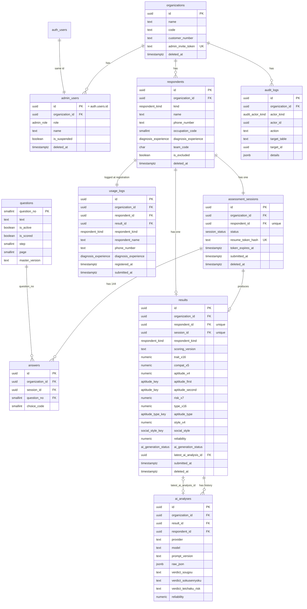
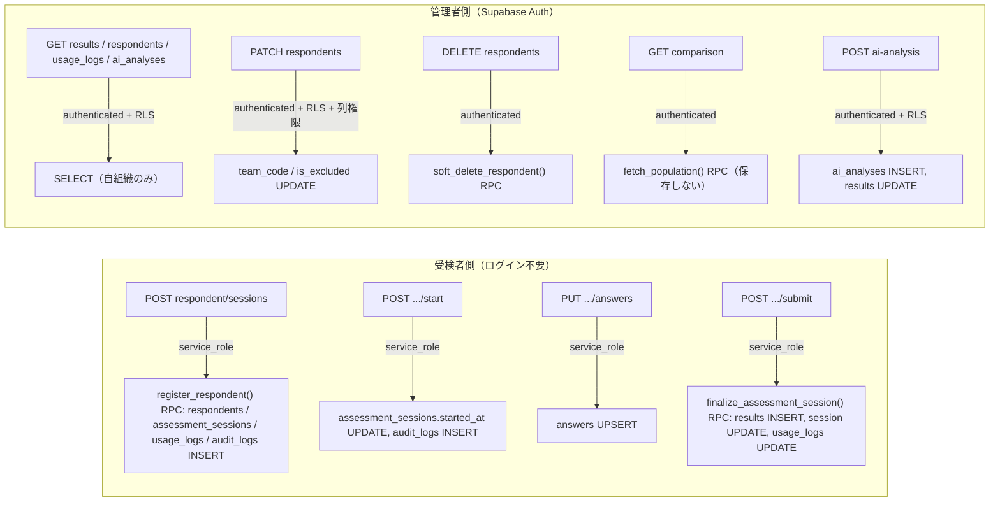
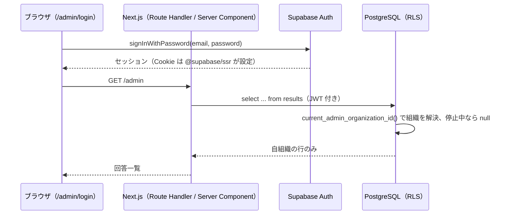
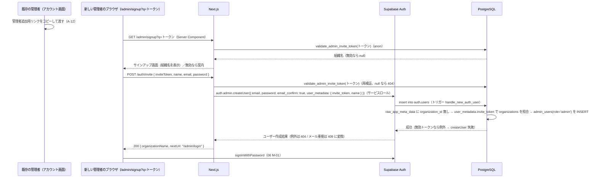

# 基本設計 02 データベース設計・認証・権限

| 項目 | 内容 |
|---|---|
| 文書名 | 適性検査システム 基本設計 02 データベース設計・認証・権限 |
| 版 | 1.2（1.1 版: レビュー指摘 15 件への対応。変更点は §14.1。1.2 版: 最終点検で §8.6 の `admin.signup` の書き手を 04 D04-36 改に合わせた） |
| 作成日 | 2026-09-17（1.1 版: 2026-09-19、1.2 版: 2026-09-21） |
| 対象 | 実装者（DB・認証・API）、01・03・04・06・07・08 分冊の設計者 |
| 前提 | `docs/基本設計/00_共通定義.md`（以下「共通定義」）の用語・テーブル名・型名・規約に従う |

## 0. 本書の位置づけ

本書は、要件定義書 §8 のデータモデルを Supabase（PostgreSQL）のテーブルに落とし、コピーして実行できる DDL（`supabase/migrations/`）、RLS ポリシー、Supabase Auth との対応、役割の付与、招待トークン、論理削除の運用、監査ログの記録対象、`questions` のシードを確定するものです（共通定義 §6 の 02 分冊の担当範囲）。

- テーブル名・列名の接頭辞・enum 型名・型名は共通定義 §1、§2 をそのまま使います。本書は列定義・制約・インデックス・ポリシーを追加するだけで、共通定義に無い別名を作りません。
- 採点の計算手順は 03 分冊、API の入出力と `lib/services/` は 04 分冊、画面は 05・06 分冊、AI 解説と PDF の処理は 07 分冊が定めます。本書ではそれらが DB に「何を」「どの形で」書き込み・読み出すかだけを定めます。
- 本書の SQL は Supabase の PostgreSQL 15 以上（`gen_random_uuid()` 組み込み、`pgcrypto` は `extensions` スキーマ）を前提とします。

### 0.1 参照した要件

| 参照元 | 参照した内容 |
|---|---|
| 要件定義書 §2 | 用語（組織アカウント、オーナー、受検者、回答データ、各指標） |
| 要件定義書 §4 | 利用者と権限（受検者、管理者、オーナー、管理者追加、スーパーアドミン） |
| 要件定義書 §5 | 業務フロー（リンク発行→登録→回答→送信→採点→閲覧→チーム・除外・削除） |
| 要件定義書 §6.1 U-01〜U-09、§6.2 A-01〜A-13、§6.6 | 受検者・管理者機能、AI 解説の保存と状態 |
| 要件定義書 §8.1〜§8.8 | データモデル（組織アカウント、受検者、回答、結果、チャート用データ、AI 分析、利用回数管理、マスタ） |
| 要件定義書 §9 | 個人情報保護（TLS、保存時暗号化、アクセスログ、組織間の行レベル分離）、認証、性能（結果を 1 レコードに）、可用性（ページ単位保存と再開） |
| 要件定義書 §11 | 不具合 1〜10 と方針（特に 6 番: 比較値を永続化しない、9 番: 採点バージョン、10 番: 母集団の定義） |
| 要件定義書 §12 | 未確認事項（幹部データの非表示挙動、削除の論理／物理、中断・再開可否、完了メール、負値表示など） |
| 付録A | 設問 204 問（`questions` のシード元）、Q145〜Q204 が採点に未使用であること |
| 付録B §1〜§10、§13 | 配点属性 9 種、各指標の値域と刻み（列の型・CHECK 制約の根拠）、比較計算（母集団の定義）、旧ロジック混在（`scoring_version` の根拠） |
| 付録C §1、§7、§8 | タイプ・キャラクターの対応（マスタをコード定数にする判断の根拠）、色分け、組織内分類 |
| 付録D §1、§2 | AI 分析レコードの項目（raw_json、model、prompt_version、verdict 3 種、信頼係数）と JSON スキーマ |
| 付録E §7 | PDF 出力（Storage の利用は 07 分冊が判断） |
| tests/fixtures/README.md、tests/verify_fixtures.py | 検証用データの項目（16 タイプ得点が既存に無いこと、値の刻み） |

### 0.2 決定事項との対応

| # | 決定事項 | 本書での対応 |
|---|---|---|
| 1 | Next.js + Supabase（PostgreSQL、Auth、Storage）+ Vercel | §5 で `auth.users` と `admin_users` の対応、§6 で RLS、§7 で Supabase Auth の利用方法を定める。Storage は本フェーズでは使わない（07 D07-21。将来使う場合の仕様を §9 に残す） |
| 2 | 不具合 10 件の修正 | 6 番: 比較計算の列・テーブルを一切持たない（§3.2、§8）。9・10 番: `results.scoring_version` と母集団取得関数 `fetch_population()`（§8.4）。1・2・4・8 番: 内部名・識別子は共通定義に統一（enum 値は `sensory_open` など）。7 番（Q145〜Q204 を採点に使わない）は §3.5・§3.7 の CHECK と決定事項 3 の行で担保。5 番（信頼係数の色）は 06・07 |
| 3 | 出題は Q1〜Q144 のみ | `questions.is_active` / `is_scored`（§3.5）と `answers.question_no` の CHECK（1〜144）（§3.7、設計判断 D02-12） |
| 4 | 既存データは移行しない | 初期データは `questions` のシードのみ（§10）。旧ロジック行の扱いは設計対象外 |
| 5 | AI 解説は Claude API、差し替え可能 | `ai_analyses.provider` / `model` / `prompt_version` 列で連携先を記録（§3.10） |
| 6 | 日本語のみ、管理 PC 幅、受検者スマホ | DB には影響なし。文言は日本語のみ（多言語列を持たない） |

## 1. 全体像

### 1.1 ER 図



`auth_users` は Supabase Auth の `auth.users`（変更しない）です。図中の `numeric trait_x16` などは列群の省略表記で、実際の列名は §3.9 のとおりです。

### 1.2 要件定義書 §8 との対応

| 要件定義書 §8 | 新システムのテーブル | 備考 |
|---|---|---|
| §8.1 組織アカウント（User）の組織関連列（組織名、コード、顧客番号、組織識別子） | `organizations` | 既存の「パスワード」（組織識別子）は `organizations.id`（uuid）に置き換える（要件定義書 §8.1） |
| §8.1 の認証列・権限フラグ・お名前 | `auth.users`（メールアドレス、パスワード）+ `admin_users`（役割、氏名、利用停止） | 管理者／オーナー／スーパーアドミンの 3 フラグは `admin_users.role` の 1 列に統合（共通定義 §5） |
| §8.1 の「チーム」 | `respondents.team_code` | 既存は受検者ユーザーに設定（要件定義書 §8.1）。`teams` テーブルは作らない（共通定義 §2.2） |
| §8.1 の比較計算の一時値 | （テーブル・列を作らない） | 要件定義書 §11 の 6 番。§8 参照 |
| §8.2 受検者 | `respondents` | |
| §8.3 回答（ユーザーrowデータ） | `assessment_sessions` + `answers` | ステータスはセッション、Q1〜Q144 は設問ごとの行に分解 |
| §8.4 結果（回答データ） | `results` | 全指標を 1 行に。「未使用」列は作らない。「1112変更済み」は `scoring_version` に置き換える |
| §8.5 チャート用データ | （テーブルを作らない） | `results` から導出（要件定義書 §9 性能、共通定義 §2.2） |
| §8.6 AI 分析 | `ai_analyses` + `results` の AI 列 | |
| §8.7 利用回数管理 | `usage_logs` | |
| §8.8 マスタ | `questions`（DB）+ `lib/masters/`（コード定数） | §4 参照 |
| §9 アクセスログ | `audit_logs` | 既存には無い（共通定義 D-24） |

### 1.3 データの流れ（DB から見た書き込み主体）



- 受検者側の書き込みはサーバ（Route Handler）がサービスロールキーで行い、組織 ID とセッショントークンをサーバで検証します（共通定義 D-23、本書 §7.4）。登録（4 表への INSERT）と送信（採点結果の確定）はそれぞれ RPC `register_respondent()`（§11.16、設計判断 D02-29）と `finalize_assessment_session()`（D02-20）で 1 トランザクションにします。
- 管理者側の読み書きはログイン中の管理者の JWT で行い、RLS と列権限で組織分離と役割差を DB 側でも強制します（設計判断 D02-08）。

## 2. 共通規約（本書での確定事項）

共通定義 §2.1 の規約を前提に、本書で次を確定します。

| 項目 | 規約 |
|---|---|
| 主キー | `id uuid primary key default gen_random_uuid()`（uuid v4）。例外は `questions.question_no smallint`。連番の整数 ID は使わない（URL に露出する ID の推測を防ぐ） |
| 監査列 | 全テーブルに `created_at timestamptz not null default now()`、`updated_at timestamptz not null default now()`。`updated_at` はトリガー `set_updated_at()` で自動更新し、アプリからは書かない |
| 論理削除 | `deleted_at timestamptz null` を持つテーブル: `organizations`、`admin_users`、`respondents`、`assessment_sessions`、`results`。`answers` はセッションに従属、`ai_analyses` / `usage_logs` / `audit_logs` / `questions` は履歴・マスタのため持たない（共通定義 §2.2）。削除の運用は §8.5 |
| 除外フラグ | `respondents.is_excluded boolean not null default false`。母集団条件にのみ使い、一覧・詳細の表示は制限しない（要件定義書 §6.2 A-04） |
| 組織分離 | `questions` 以外の全テーブルに `organization_id uuid not null` を持ち、RLS を有効化する。`admin_users` と `respondents` 以外の `organization_id` は親から複製した非正規化列で、更新しない |
| 外部キー列名 | `{参照テーブルの単数形}_id`。例外: `assessment_sessions` を参照する列は `session_id`（共通定義 §2.1 の制約名例 `uq_answers_session_id_question_no` に合わせる。設計判断 D02-21） |
| 数値指標 | `numeric(7,3)`。丸めは表示層のみ（共通定義 §3.1）。DB では計算値をそのまま保存する |
| 日時 | `timestamptz`。UTC で保存。表示は Asia/Tokyo（表示層） |
| 文字列 | `text`。長さ制限は CHECK 制約で付ける（`varchar(n)` は使わない） |
| enum | PostgreSQL の enum 型。値の追加は `alter type ... add value` のマイグレーションで行う |
| RLS | 全テーブルで `enable row level security` + `force row level security`（テーブル所有者にも適用。サービスロールは `bypassrls` 属性で通過する） |
| `security definer` 関数の所有者 | 本書の `security definer` 関数（§6.2 のヘルパー、§7.3、§8.4、§8.5、§11.16）は、**マイグレーション実行ロールが所有し、そのロールが `bypassrls` 属性を持つ** ことを前提とする（Supabase では `postgres` ロール。推定: Supabase の `postgres` は `bypassrls` を持つ一般的な構成だが、実装初期に `select rolbypassrls from pg_roles where rolname = current_user` で確認する）。`force row level security` により所有者にも RLS が適用されるため、所有者が `bypassrls` を持たない環境（自前の PostgreSQL、CI のスタブ）では `authenticated` から呼んだ RPC が「ポリシー無し = 拒否」で失敗する。他環境では所有者に `alter role ... bypassrls` を付与するか、§11.18 のスタブを使う（設計判断 D02-33） |
| 権限 | Supabase 既定の `anon` / `authenticated` への全権限付与を取り消し、必要な表・列にだけ再付与する（§6.4） |
| RPC 関数 | `security definer` の関数は `set search_path = public, extensions` を必ず付け、`revoke execute ... from public, anon, authenticated` のうえ必要な役割にだけ `grant execute` する |
| マイグレーション | `supabase/migrations/20260917000001_*.sql` からの連番（§11 の一覧）。本番適用は 01 分冊の手順に従う |

## 3. テーブル定義

各表の「NULL」は NULL 可否、「既定値」は DDL の default です。DDL 全文は §11 にまとめて掲載し、ここでは表と補足を記載します。

### 3.1 enum 型

| 型名 | 値（定義順） | 根拠 |
|---|---|---|
| `admin_role` | `owner`, `admin`, `super_admin` | 共通定義 §5 |
| `respondent_kind` | `applicant`, `executive` | 共通定義 §1.8 |
| `diagnosis_experience` | `first_time`, `experienced` | 共通定義 §1.8 |
| `session_status` | `draft`, `submitted` | 共通定義 §1.8 |
| `aptitude_key` | `sensory_open`, `environment_receptive`, `self_actualizing`, `inquiry_logical` | 共通定義 §1.4（同点優先順） |
| `aptitude_type_key` | `attendant`, `follower`, `specialist`, `creator`, `professional`, `generalist`, `scientist`, `pioneer`, `conductor`, `controller`, `artist`, `reviewer`, `promoter`, `actor`, `receptionist`, `freelancer` | 共通定義 §1.6 |
| `social_style_key` | `driving`, `expressive`, `analytical`, `amiable` | 共通定義 §1.7（同点優先順） |
| `ai_generation_status` | `not_generated`, `generating`, `completed`, `failed` | 共通定義 §1.8、D-10 |
| `audit_actor_kind` | `admin`, `respondent`, `system` | 本書で追加（設計判断 D02-17） |

- `grade`（A〜E）、`position`、`team_code`、`choice_code`、`occupation_code`、PDF モード、比較範囲は DB に enum を作りません。評価・立ち位置は保存しない値（§8）、チーム・選択肢・職業コードは CHECK 制約付きの `char(1)` / `smallint` です。

### 3.2 organizations（組織）

| 列名 | 型 | NULL | 既定値 | 制約 | 説明・根拠 |
|---|---|---|---|---|---|
| `id` | uuid | 不可 | `gen_random_uuid()` | PK | 組織 ID。受検リンクの `q` パラメータに使う（要件定義書 §6.1 U-03、共通定義 D-12） |
| `name` | text | 不可 | | `ck_organizations_name_not_blank`（空白のみ不可、200 文字以内） | 組織名（要件定義書 §8.1） |
| `code` | text | 可 | | 100 文字以内 | 「コード」（要件定義書 §8.1）。用途・一意性は未確認（要件定義書 §8.1 は表示・識別用とのみ記載）。設計判断 D02-18: 一意制約を付けない任意項目 |
| `customer_number` | text | 可 | | 100 文字以内 | 「顧客番号」（同上） |
| `admin_invite_token` | text | 不可 | `encode(gen_random_bytes(24), 'hex')` | UNIQUE `uq_organizations_admin_invite_token` | 管理者追加用リンク `/admin/signup?q={inviteToken}` のトークン（共通定義 §1.1、§3.7）。§7.3 |
| `admin_invite_token_rotated_at` | timestamptz | 不可 | `now()` | | トークンの最終更新日時 |
| `created_at` / `updated_at` | timestamptz | 不可 | `now()` | | 共通 |
| `deleted_at` | timestamptz | 可 | | | 論理削除（契約終了時。運用は §8.5） |

- 既存の「組織識別子（パスワード）」は使いません。既存リンク形式 `?q={組織ID}` の値は本テーブルの `id` です。
- 比較計算用の列は持ちません（要件定義書 §11 の 6 番）。
- 未確認: 組織の作成方法（要件定義書に組織の新規登録画面の記載なし）。設計判断 D02-04: 運用者がサービスロールで作成する（§7.2）。
- 受付停止フラグ `is_active` は **持ちません**（設計判断 D02-27）。01 D01-27 の旧案（`organizations.is_active`）に対する本書の回答です。理由: 要件定義書に受付停止の機能は無く（§6.2 A-01〜A-13 に該当なし）、本フェーズの受付停止は契約終了と同じ `deleted_at`（論理削除）で行える。受検リンクの検証（04 §4.1）、`provision_organization()`、RLS の条件は `deleted_at is null` のみとし、04 D04-15・05 D05-31 の「追加されたら条件に加える」は **追加しない** で確定します。将来、削除と区別した一時停止が必要になったときに `is_active boolean not null default true` を追加し、同じ 3 箇所の条件に `and is_active` を加えます。

### 3.3 admin_users（管理者）

| 列名 | 型 | NULL | 既定値 | 制約 | 説明・根拠 |
|---|---|---|---|---|---|
| `id` | uuid | 不可 | | PK、FK `auth.users(id) on delete cascade` | `auth.users.id` と同一値（共通定義 D-22） |
| `organization_id` | uuid | 不可 | | FK `organizations(id)` | 所属組織。変更しない |
| `role` | admin_role | 不可 | `'admin'` | | 役割（共通定義 §5）。招待リンク経由は `admin`（要件定義書 §4） |
| `name` | text | 不可 | `''` | 100 文字以内 | お名前（要件定義書 §6.2 A-12） |
| `is_suspended` | boolean | 不可 | `false` | | 利用停止（要件定義書 §8.1）。true の管理者は全ての管理 API・RLS で拒否される（§6.2） |
| `created_at` / `updated_at` | timestamptz | 不可 | `now()` | | |
| `deleted_at` | timestamptz | 可 | | | 論理削除。削除後は RLS で拒否 |

- メールアドレスとパスワードは `auth.users` にのみ保持し、本テーブルに複製しません（設計判断 D02-01: 二重管理を避ける。画面表示は Auth SDK の `getUser()` から得る）。
- 比較計算の一時値（要件定義書 §8.1）は持ちません（要件定義書 §11 の 6 番、共通定義 §1.11）。
- 行の作成は `auth.users` への INSERT トリガーで自動化します（§7.3）。

### 3.4 respondents（受検者）

| 列名 | 型 | NULL | 既定値 | 制約 | 説明・根拠 |
|---|---|---|---|---|---|
| `id` | uuid | 不可 | `gen_random_uuid()` | PK | 受検者 ID。1 行 = 1 回の受検登録（共通定義 §1.1） |
| `organization_id` | uuid | 不可 | | FK | 受検リンクの `q`（要件定義書 §8.2） |
| `kind` | respondent_kind | 不可 | | | `applicant`（`p=user`）／`executive`（`p=executives`）。登録後は変更しない |
| `name` | text | 不可 | | 空白不可、100 文字以内 | 氏名（必須。要件定義書 §6.1 U-01） |
| `phone_number` | text | 不可 | | 空白不可、30 文字以内 | 電話番号（必須）。形式検証は 04・05 分冊（既存の形式は未確認） |
| `occupation_code` | smallint | 不可 | | `ck_respondents_occupation_code` 1〜9 | 職業コード（共通定義 §1.10） |
| `diagnosis_experience` | diagnosis_experience | 不可 | | | 過去の診断経験（要件定義書 §6.1 U-01） |
| `team_code` | char(1) | 可 | `null` | `ck_respondents_team_code` `^[A-Z]$` | チーム A〜Z。未設定は NULL（要件定義書 §6.2 A-03） |
| `is_excluded` | boolean | 不可 | `false` | | 組織データからの除外（要件定義書 §6.2 A-04） |
| `created_at` / `updated_at` | timestamptz | 不可 | `now()` | | `created_at` が登録日時 |
| `deleted_at` | timestamptz | 可 | | | 論理削除（要件定義書 §6.2 A-05、共通定義 D-11） |

- インデックス: `idx_respondents_organization_id_created_at (organization_id, created_at desc) where deleted_at is null`、`idx_respondents_organization_id_team_code (organization_id, team_code) where deleted_at is null`。
- 氏名・電話番号は個人情報です。保存時暗号化は Supabase のディスク暗号化に依り、列単位の暗号化は行いません（設計判断 D02-24。追加の要否は 01 分冊）。

### 3.5 questions（設問マスタ）

| 列名 | 型 | NULL | 既定値 | 制約 | 説明・根拠 |
|---|---|---|---|---|---|
| `question_no` | smallint | 不可 | | PK、`ck_questions_question_no` 1〜204 | 設問番号（自然キー。共通定義 §1.9） |
| `text` | text | 不可 | | | 設問文（付録A） |
| `is_active` | boolean | 不可 | | | 出題する（Q1〜Q144 のみ true。決定事項 3） |
| `is_scored` | boolean | 不可 | | `ck_questions_scored_implies_active`（`is_scored` なら `is_active`） | 採点に使う（Q1〜Q144 のみ true） |
| `step` | smallint | 可 | | 1〜4、`is_active` と同時に NULL／非 NULL | ステップ（共通定義 §1.9、D-08） |
| `page` | smallint | 可 | | 1〜5 | ページ |
| `master_version` | text | 不可 | | | シード元の `SCORING_VERSION`（§4.3） |
| `created_at` / `updated_at` | timestamptz | 不可 | `now()` | | |

- 全組織共通のため `organization_id` を持ちません。RLS は有効にし、`authenticated` に SELECT のみ許可します（受検者画面の設問文は `lib/masters/questions.ts` から表示するため `anon` には権限を与えません。共通定義 §6 の分冊間の境界）。
- 内容は `lib/masters/questions.ts` が正で、DB 行はシード（§10）で同期します。

### 3.6 assessment_sessions（受検セッション）

| 列名 | 型 | NULL | 既定値 | 制約 | 説明・根拠 |
|---|---|---|---|---|---|
| `id` | uuid | 不可 | `gen_random_uuid()` | PK | セッション ID。受検者画面 URL `/exam/{sessionId}` |
| `organization_id` | uuid | 不可 | | FK | 受検者の組織を複製 |
| `respondent_id` | uuid | 不可 | | FK、UNIQUE `uq_assessment_sessions_respondent_id` | 1 受検者 1 セッション（共通定義 D-02） |
| `status` | session_status | 不可 | `'draft'` | `ck_assessment_sessions_submitted`（`submitted` と `submitted_at` の整合） | 下書き／送信済み（要件定義書 §8.3） |
| `resume_token_hash` | text | 不可 | | UNIQUE | 受検者本人の再開用トークンの SHA-256（hex）。生のトークンは HttpOnly Cookie にのみ置く（§7.4、共通定義 D-16） |
| `token_expires_at` | timestamptz | 不可 | | | トークン有効期限。仮置き: 発行から 7 日、回答保存のたびに延長（設計判断 D02-13） |
| `started_at` | timestamptz | 可 | | | 「開始する」押下日時（要件定義書 §6.1 U-04） |
| `last_saved_step` | smallint | 可 | | 1〜4 | 最後に保存したステップ（再開位置。05 分冊） |
| `last_saved_page` | smallint | 可 | | 1〜5 | 最後に保存したページ |
| `last_answered_at` | timestamptz | 可 | | | 最終保存日時 |
| `submitted_at` | timestamptz | 可 | | | 送信日時 |
| `created_at` / `updated_at` | timestamptz | 不可 | `now()` | | |
| `deleted_at` | timestamptz | 可 | | | 受検者の論理削除に連動 |

- `authenticated`（管理者）には権限を与えません。管理画面は `results` と `respondents` だけを見ます（要件定義書 §6.2 A-02 の一覧列は結果と受検者で構成できる。設計判断 D02-09）。
- 進行状況（回答済み数）は `answers` の件数から導出します。
- 接続元 IP のハッシュ列（01 D01-16 の旧案 `created_ip_hash`）は **持ちません**（設計判断 D02-28）。受検者登録のレート制限は `audit_logs.ip_address`（`action = 'respondent.register'`、直近 10 分）の件数で判定します（04 §2.8、D04-13 を受け入れ）。理由: 同じ情報を 2 箇所に持たない、`audit_logs` は追記専用で改ざんされにくい、`assessment_sessions` に個人を特定し得る値を増やさない。
- 送信されないまま放置された `draft` セッション（氏名・電話番号を `respondents`・`usage_logs` に含む）は、`token_expires_at` から一定期間後に `purge_abandoned_sessions()` で物理削除します（§8.5、設計判断 D02-31）。

### 3.7 answers（回答）

| 列名 | 型 | NULL | 既定値 | 制約 | 説明・根拠 |
|---|---|---|---|---|---|
| `id` | uuid | 不可 | `gen_random_uuid()` | PK | |
| `organization_id` | uuid | 不可 | | FK | セッションの組織を複製 |
| `session_id` | uuid | 不可 | | FK `assessment_sessions(id) on delete cascade` | |
| `question_no` | smallint | 不可 | | FK `questions(question_no)`、`ck_answers_question_no_range` 1〜144 | 設問番号。Q145〜Q204 の行は作れない（決定事項 3。設計判断 D02-12） |
| `choice_code` | smallint | 不可 | | `ck_answers_choice_code` 1〜5 | 1 = そう思う … 5 = そう思わない（共通定義 §1.9）。生データをそのまま保持し、配点値は保存しない |
| `created_at` / `updated_at` | timestamptz | 不可 | `now()` | | `updated_at` が回答変更日時 |

- 一意制約 `uq_answers_session_id_question_no (session_id, question_no)`。ページ単位の保存は `insert ... on conflict (session_id, question_no) do update set choice_code = excluded.choice_code` で行います（04 分冊）。
- 送信後（`status = submitted`）の回答は変更しません（`finalize_assessment_session()` 以降の書き込みは 04 分冊が拒否する。DB 側の防御としてトリガー `trg_answers_reject_after_submit` を置きます。§11）。

### 3.8 results（採点結果）— 識別・版・AI 列

| 列名 | 型 | NULL | 既定値 | 制約 | 説明・根拠 |
|---|---|---|---|---|---|
| `id` | uuid | 不可 | `gen_random_uuid()` | PK | 結果 ID。管理画面 URL `/admin/results/{resultId}` |
| `organization_id` | uuid | 不可 | | FK | |
| `respondent_id` | uuid | 不可 | | FK、UNIQUE | 1 受検者 1 結果 |
| `session_id` | uuid | 不可 | | FK、UNIQUE | 1 セッション 1 結果 |
| `respondent_kind` | respondent_kind | 不可 | | | `respondents.kind` の複製（INSERT トリガーで設定。RLS を結合なしで書くための非正規化。設計判断 D02-05） |
| `submitted_at` | timestamptz | 不可 | | | 回答日時（要件定義書 §8.4、一覧の並び順 A-02） |
| `scoring_version` | text | 不可 | | | 採点に使った `SCORING_VERSION`（共通定義 §2.4）。母集団条件に使う |
| （指標列 55 本） | numeric(7,3) | 不可 | | §3.9 | |
| `aptitude_first` / `aptitude_second` | aptitude_key | 不可 | | `ck_results_aptitude_candidates_differ` | 資質第一・第二候補（付録B §4） |
| `aptitude_type` | aptitude_type_key | 不可 | | | 適性タイプ（付録B §6） |
| `social_style` | social_style_key | 不可 | | | ソーシャルスタイル（付録B §7） |
| `reliability` | numeric(7,3) | 不可 | | 0〜100 | 信頼係数（付録B §8） |
| `ai_generation_status` | ai_generation_status | 不可 | `'not_generated'` | | AI 生成状態（要件定義書 §6.6、共通定義 D-10） |
| `ai_generation_started_at` | timestamptz | 可 | | | `generating` に遷移した日時（滞留検知用。07 分冊） |
| `ai_generation_error` | text | 可 | | `ck_results_ai_error_code`（`^[a-z_]{1,50}$`） | 直近の失敗理由（`failed` のとき）。**07 §4.6 の `AiFailureReason` の文字列（`provider_error`、`rate_limited`、`invalid_request`、`auth_error`、`timeout`、`invalid_json`、`truncated`、`refusal`、`config_error`）または `internal_error` のみ** を保存し、自由文（例外メッセージ等）は保存しない（07 からの確定事項。CHECK で英小文字と `_` に限定する）。個人情報・API キーを含めない |
| `latest_ai_analysis_id` | uuid | 可 | | FK `ai_analyses(id)`（後付け）、トリガー `trg_results_check_latest_ai_analysis`（指す行の `result_id` が自分の `id` であること。§11.10、設計判断 D02-34） | 最新 AI 分析（要件定義書 §8.4） |
| `created_at` / `updated_at` | timestamptz | 不可 | `now()` | | |
| `deleted_at` | timestamptz | 可 | | | 受検者の論理削除に連動 |

- インデックス: `idx_results_organization_id_submitted_at (organization_id, submitted_at desc) where deleted_at is null`（一覧）、`idx_results_population (organization_id, scoring_version) where deleted_at is null`（母集団取得）。
- 要件定義書 §8.4 の「判定」列は既存の意味が未確認のため作りません。評価 A〜E は比較値であり保存しません（§8）。
- 「AI生成文章（JSON）」（要件定義書 §8.4）は `results` に複製せず、`latest_ai_analysis_id` 経由で `ai_analyses.raw_json` を参照します。

### 3.9 results — 指標列（55 本）

列名は共通定義 §1.2〜§1.7 の「DB 列名」と一致します。型はすべて `numeric(7,3) not null`。CHECK 制約は付録B で理論上保証される範囲にだけ付けます（設計判断 D02-15。負値が発生し得るものには付けない）。

| 列群 | 列名 | CHECK | 根拠（値域・刻み） |
|---|---|---|---|
| 16 尺度 | `trait_cooperativeness`, `trait_adaptability`, `trait_deliberateness`, `trait_humility`, `trait_reflectiveness`, `trait_rule_compliance`, `trait_persistence`, `trait_emotionality`, `trait_sensitivity`, `trait_self_esteem`, `trait_innovativeness`, `trait_activeness`, `trait_positiveness`, `trait_leadership`, `trait_creativity`, `trait_communication` | 0〜30 | 付録B §2（0.5 刻み）。`trait_deliberateness` は計算値をそのまま保存（要件定義書 §11 の 1 番） |
| 相性 5 軸 | `compat_adaptive_environment`, `compat_adaptive_work`, `compat_thinking_tendency`, `compat_decision_making`, `compat_stress_tolerance` | −100〜100 | 付録B §3（整数、負値あり） |
| 資質 4 型 | `aptitude_sensory_open`, `aptitude_environment_receptive`, `aptitude_self_actualizing`, `aptitude_inquiry_logical` | 0 以上 | 付録B §4（負値は 0 に切り上げ、1.25 刻み） |
| リスク 7 項目 | `risk_misconduct`, `risk_complaint`, `risk_mental_distress`, `risk_careless_mistake`, `risk_resignation_trouble`, `risk_communication_issue`, `risk_low_motivation` | なし | 付録B §5（×5 後、負値あり得る） |
| 16 タイプ得点 | `type_attendant`, `type_follower`, `type_specialist`, `type_creator`, `type_professional`, `type_generalist`, `type_scientist`, `type_pioneer`, `type_conductor`, `type_controller`, `type_artist`, `type_reviewer`, `type_promoter`, `type_actor`, `type_receptionist`, `type_freelancer` | なし | 付録B §6（負値あり得る）。既存には保存されていなかったが新システムでは保存する（共通定義 §1.6） |
| ソーシャルスタイル 4 値 | `style_driving`, `style_expressive`, `style_analytical`, `style_amiable` | なし | 付録B §7（タイプ得点 ÷ 2。0.25 刻み） |
| 信頼係数 | `reliability` | 0〜100 | 付録B §8 |

- `numeric(7,3)` の理由: 信頼係数 `100 − 0.735n` は小数第 3 位まで、資質は最大約 145、負値を含む（共通定義 §2.1）。
- チャート用データ（要件定義書 §8.5）はこの行から表示層で組み立てます（06 分冊）。

### 3.10 ai_analyses（AI 解説）

| 列名 | 型 | NULL | 既定値 | 制約 | 説明・根拠 |
|---|---|---|---|---|---|
| `id` | uuid | 不可 | `gen_random_uuid()` | PK | |
| `organization_id` | uuid | 不可 | | FK | 「医院」（付録D §1） |
| `result_id` | uuid | 不可 | | FK `results(id)` | 対象回答データ |
| `respondent_id` | uuid | 不可 | | FK `respondents(id)` | 「Person」（付録D §1） |
| `analysis_kind` | text | 不可 | `'recruitment'` | 50 文字以内 | 分析種別（要件定義書 §8.6「採用分析」）。将来の種別追加用 |
| `provider` | text | 不可 | | 50 文字以内 | 連携先名（`AiProvider.name`）。**値は `anthropic` / `stub` の 2 値**（07 §5.1。`stub` はローカル・CI 用で本番では起動時検証により使えない。01 §4.3）。将来の連携先追加に備え enum・CHECK での値の固定はしない（決定事項 5） |
| `model` | text | 不可 | | 100 文字以内 | 使用モデル（要件定義書 §8.6） |
| `prompt_version` | text | 不可 | | 50 文字以内 | `AI_PROMPT_VERSION`（共通定義 §3.2） |
| `raw_json` | jsonb | 不可 | | | 付録D §2 スキーマの JSON（検証済み） |
| `raw_text` | text | 不可 | | | LLM 応答の生テキスト（再検証・障害調査用） |
| `verdict_sougou` | text | 不可 | | `推奨`／`条件付きで推奨`／`要検討`／`非推奨` | 判定の抜粋（要件定義書 §8.6、付録D §2） |
| `verdict_sokusenryoku` | text | 不可 | | 5 段階 | 同上 |
| `verdict_teichaku_risk` | text | 不可 | | 5 段階 | 同上 |
| `reliability` | numeric(7,3) | 不可 | | | 生成時点の信頼係数の複製（要件定義書 §8.6） |
| `generated_by` | uuid | 可 | | FK `admin_users(id)` | 生成を実行した管理者 |
| `generated_at` | timestamptz | 不可 | `now()` | | |
| `created_at` / `updated_at` | timestamptz | 不可 | `now()` | | |

- 行は生成が成功したときにだけ作ります。失敗は `results.ai_generation_status = failed` と `ai_generation_error` に記録します（設計判断 D02-14）。状態遷移と再試行は 07 分冊。
- インデックス: `idx_ai_analyses_result_id_generated_at (result_id, generated_at desc)`。
- 論理削除は持ちません。受検者を物理削除するときに一緒に削除します（§8.5）。

### 3.11 usage_logs（利用履歴）

| 列名 | 型 | NULL | 既定値 | 制約 | 説明・根拠 |
|---|---|---|---|---|---|
| `id` | uuid | 不可 | `gen_random_uuid()` | PK | |
| `organization_id` | uuid | 不可 | | FK | 「組織識別子」（要件定義書 §8.7） |
| `respondent_id` | uuid | 可 | | FK `respondents(id) on delete set null`、UNIQUE | 登録元の受検者。登録時は必ず設定し、物理削除後に NULL になる |
| `result_id` | uuid | 可 | | FK `results(id) on delete set null` | 送信時に紐づける（共通定義 §2.2） |
| `respondent_kind` | respondent_kind | 不可 | | | `respondents.kind` の複製（トリガー設定）。幹部の履歴を `admin` に見せないため（設計判断 D02-05） |
| `respondent_name` | text | 不可 | | | 名前の複製（要件定義書 §8.7） |
| `phone_number` | text | 不可 | | | 電話番号の複製 |
| `diagnosis_experience` | diagnosis_experience | 不可 | | | 過去の診断経験 |
| `registered_at` | timestamptz | 不可 | `now()` | | 受検登録日時（新システムで追加する列。既存の「作成日時」とは意味が異なる。下記 D02-30） |
| `submitted_at` | timestamptz | 可 | | | 回答日時（利用履歴ポップアップの「回答日時」。要件定義書 §6.2 A-06）。未送信の行は NULL |
| `created_at` / `updated_at` | timestamptz | 不可 | `now()` | | |

- 設計判断 D02-11: 受検者行を論理削除しても履歴は残す（既存の利用回数管理は独立レコード。要件定義書 §8.7）。物理削除時は名前・電話番号を `'（削除済み）'` に置き換え、件数は残す（§8.5）。
- 設計判断 D02-30（作成契機）: 本テーブルの行は **受検登録時に作成し、送信時に `result_id` と `submitted_at` を設定** します（共通定義 §2.2 の 8 番と同じ前提）。既存システムでは利用回数管理レコードは **送信時**（受検完了ワークフロー）に作成され（要件定義書 §6.1 U-08、§5 手順 4）、既存の「作成日時」（§8.7）は送信時刻に相当します。新システムで登録時に作成する理由: (1) 送信に至らなかった登録も組織の利用実績として把握できる、(2) `register_respondent()` の 1 トランザクションで確定でき、送信時の更新（`finalize_assessment_session()`）は `respondent_id` で 1 行を UPDATE するだけになる。この変更の結果、利用履歴（A-06）には未送信の登録が「回答日時 = 空」で並びます。06 分冊への申し送り: 未送信行の表示（回答日時欄を「未回答」等とするか、送信済みのみを表示するか）を M-07 の利用履歴ポップアップで確定してください（§14.1）。既存の件数と一致させたい場合は 04 の一覧取得で `submitted_at is not null` を条件に加えれば既存と同じ集合になります。
- インデックス: `idx_usage_logs_organization_id_registered_at (organization_id, registered_at desc)`。

### 3.12 audit_logs（監査ログ）

| 列名 | 型 | NULL | 既定値 | 制約 | 説明・根拠 |
|---|---|---|---|---|---|
| `id` | uuid | 不可 | `gen_random_uuid()` | PK | |
| `organization_id` | uuid | 不可 | | FK | 操作対象の組織 |
| `actor_kind` | audit_actor_kind | 不可 | | | `admin`（管理者）／`respondent`（受検者）／`system`（バッチ・運用者） |
| `actor_id` | uuid | 可 | | | `admin` なら `admin_users.id`、`respondent` なら `respondents.id`、`system` なら NULL |
| `action` | text | 不可 | | `ck_audit_logs_action` `^[a-z_]+\.[a-z_]+$` | 操作種別（§8.6 の一覧） |
| `target_table` | text | 可 | | | 対象テーブル名 |
| `target_id` | uuid | 可 | | | 対象行 ID |
| `details` | jsonb | 不可 | `'{}'` | | 補足（比較範囲、PDF モード、変更前後の値など）。氏名・電話番号は入れない |
| `ip_address` | inet | 可 | | | 接続元（Vercel の `x-forwarded-for` 先頭。04 分冊） |
| `user_agent` | text | 可 | | 500 文字以内 | |
| `created_at` / `updated_at` | timestamptz | 不可 | `now()` | | 追記専用。UPDATE／DELETE の権限を誰にも与えない |

- インデックス: `idx_audit_logs_organization_id_created_at (organization_id, created_at desc)`、`idx_audit_logs_actor_id_created_at (actor_id, created_at desc)`。
- 保存期間: **本フェーズは無期限**（01 §9 の保持期間表に合わせる。設計判断 D02-17）。保持期間の短縮（例: 1 年）は依頼主確認後に §8.5 の削除手順で行います。

## 4. マスタデータの持ち方

### 4.1 判断

| マスタ（要件定義書 §8.8） | 持ち方 | 理由 |
|---|---|---|
| 設問（204 問、付録A） | **コード定数 `lib/masters/questions.ts` が正 + DB `questions` にシード** | `answers.question_no` の外部キー整合と、DB 側での出題範囲チェック（1〜144）に使う。設問文の変更は採点結果の意味を変えるため、コードと同じ版管理（Git・リリース）に乗せる |
| 選択肢配点（5 × 9 属性、付録B §1） | コード定数 `lib/masters/choice-scores.ts` | 採点エンジン（純関数）が DB 非依存であるべき（共通定義 §3.3）。値は付録B の固定表で運用中に変更しない |
| 指標定義（各指標の加減算設問と属性、付録B §2〜§8） | コード定数 `lib/masters/indicators/` | 同上。単体テストで付録B の式と 1 対 1 に検証できる（08 分冊） |
| 16 タイプ・資質・スタイル・立ち位置の定義（名称、キャラクター、色、順序） | コード定数 `lib/masters/indicators/`（型は共通定義 §3.5） | 画面・PDF・AI 入力が同じ定数を参照する |
| 表示文言（付録C） | コード定数 `lib/masters/texts/`（構造は 06 分冊） | 88KB の定型文を管理画面で編集する要件は無い（要件定義書 §6.4「マスタ化された定型文の条件選択」）。DB に置くと RLS・キャッシュ・型安全性の手当てが増えるだけで利点がない |
| 職業（9 種） | コード定数 `lib/masters/occupations.ts` | `respondents.occupation_code` は整数、表示名はコード側 |
| イラスト | `public/images/`（共通定義 §3.8） | 静的ファイル |

これは共通定義 D-01 を本書で確定したものです。DB テーブルは `questions` の 1 本だけです。

### 4.2 DB テーブル化しない場合の注意

- 文言・配点を変えるときはコードを改版し、`SCORING_VERSION`（採点に影響する変更のとき）を上げてリリースします。
- 将来「管理画面から文言を編集したい」要件が出た場合は、`lib/masters/texts/` と同じ形の JSON を保持するテーブルを追加し、`lib/masters/` をフォールバックにする方式で拡張できます（本フェーズでは実装しません）。

### 4.3 版の記録

| 対象 | 版の識別子 | 記録先 |
|---|---|---|
| 採点式・配点表・指標定義・設問→指標マッピング・設問文・出題フラグ | `SCORING_VERSION`（`lib/scoring/version.ts`、初期値 `"1.0.0"`。共通定義 §2.4） | `results.scoring_version`（採点時）、`questions.master_version`（シード時） |
| AI プロンプト | `AI_PROMPT_VERSION`（環境変数） | `ai_analyses.prompt_version` |
| AI モデル・連携先 | `AI_MODEL`、`AI_PROVIDER` | `ai_analyses.model`、`ai_analyses.provider` |

- 設計判断 D02-16: 設問と配点を別々の版で持たず、`SCORING_VERSION` 1 つで「採点結果に使ったマスタ一式」を表します。設問文の誤字修正など採点に影響しない変更はパッチ版（`1.0.1`）を上げ、母集団条件は 03 分冊が「メジャー・マイナーが一致」などの比較規則を定めるまでは完全一致（共通定義 §1.11）とします。
- 03 分冊の `lib/masters/questions.ts` は本書 §10 のシード SQL を生成する元データです。両者の差分検出は 08 分冊のテスト（DB の `questions` と定数の全件一致）で行います。

## 5. Supabase Auth との対応と役割

### 5.1 対応関係

| 概念 | Supabase 側 | 本システム側 |
|---|---|---|
| 管理者の認証主体 | `auth.users`（メールアドレス、パスワードハッシュ、確認状態） | `admin_users`（`id` が同一。役割・氏名・利用停止・組織） |
| ログイン | `signInWithPassword`（メール + パスワード。要件定義書 §6.2 A-01） | セッション Cookie は `@supabase/ssr` で管理（01・04 分冊） |
| パスワード再設定 | `resetPasswordForEmail` → メールのリンク → `/auth/callback` → `/admin/password-reset` で `updateUser({ password })` | 画面は 06 分冊 |
| メールアドレス変更 | `updateUser({ email })`（確認メール） | `PATCH /api/v1/admin/me` の Auth 連携部分（04 分冊） |
| パスワード変更 | `updateUser({ password })` | 同上 |
| 管理者追加 | ブラウザは `signUp` を **呼ばない**。`POST /auth/invite`（04 §6.2、01 D01-11）がサーバで `validate_admin_invite_token()` を実行した後、**サービスロール**で Auth Admin API `auth.admin.createUser({ email, password, email_confirm: true, user_metadata: { invite_token, name } })` を呼ぶ | トリガー `handle_new_auth_user()` が `user_metadata.invite_token` を照合して `admin_users`（`role = 'admin'`）を作成（§7.3）。Route Handler は `admin_users` に直接 INSERT しない |
| 初期オーナー | Auth Admin API `auth.admin.createUser` に `app_metadata: { organization_id, role: 'owner' }`（`inviteUserByEmail` は `app_metadata` を渡せないため使わない。§7.2） | トリガーで `admin_users` を作成（§7.2） |
| 受検者 | 使わない（ログイン不要。要件定義書 §3） | セッショントークン（§7.4） |
| 役割の判定 | 使わない（JWT のカスタムクレームは使わない） | RLS ヘルパー関数が `admin_users` を参照（§6.2） |

- 設計判断 D02-03: 役割・組織の決定に `raw_user_meta_data`（Auth Admin API の `user_metadata` に入る値。公開サインアップを有効にした場合は利用者が自由に設定できる）を信用しません。利用者由来の値は `invite_token` だけを受け取り、組織は DB の照合で決め、役割は必ず `admin`。`raw_app_meta_data`（サービスロールでしか設定できない）に `organization_id` と `role` があるときだけそれを採用します。公開サインアップを無効にしても（D02-32）、トリガーはこの規則を変えず、`createUser` 経由でも `signUp` 経由でも同じ判定をします（多層防御）。
- 設計判断 D02-32（1.1 版で 01 D01-28・04 §6.2 の方式に一本化）: Supabase Auth の設定（01 §5.3 で反映）は、Email プロバイダ有効、**「Allow new users to sign up」無効**（01 D01-09。ブラウザからの `signUp` を Auth に到達させない）、**「Confirm email」有効**（D02-22。ただし管理者・オーナーは `email_confirm: true` で作成するため、この設定が効くのはログイン中のメールアドレス変更（`updateUser({ email })`）の確認メールとパスワード再設定メールだけ。招待経由の登録には確認メールを送らない。04 D04-37）、パスワード最小長 仮置き 8（04 §6.2 の zod スキーマと同値）、リダイレクト URL に `{NEXT_PUBLIC_APP_BASE_URL}/auth/callback` を登録。旧版（1.0）の「サインアップの公開は有効、招待トークン無しの `signUp` はトリガーで失敗させる」は取り下げます。理由: 公開サインアップを閉じればトークン無しの `signUp` 自体を受け付けず、トリガー例外（DB エラー 500）をブラウザに見せずに Route Handler が 404／409 に変換できる（01 §5.6）。Auth Admin API はこの設定の影響を受けない（推定: 01 D01-09 と同じ。実装初期に検証用プロジェクトで `createUser` が成功することを確認する）。

### 5.2 役割ごとの権限（DB 側で強制するもの）

共通定義 §5 を DB の権限に翻訳したものです。画面・API 側の制御は 04・06 分冊が重ねます。

| 操作 | `admin` | `owner` | `super_admin` | サービスロール（受検者 API・運用） |
|---|---|---|---|---|
| 自組織の `organizations` SELECT | ○ | ○ | ○ | ○ |
| 招待トークンの再発行 `rotate_admin_invite_token()` | × | ○ | ○ | ○ |
| 自組織の `admin_users` SELECT | 自分の行のみ | 組織内全員 | 組織内全員 | ○ |
| `admin_users.name` UPDATE | 自分のみ | 自分のみ | 自分のみ | ○ |
| 役割変更・利用停止・管理者の削除 | × | ×（本フェーズは運用者が SQL で実施。§7.5） | × | ○ |
| `respondents` / `results` / `usage_logs` / `ai_analyses` SELECT（`applicant`） | ○ | ○ | ○ | ○ |
| 同上（`executive` = 幹部） | **×**（行自体が見えない。仮置き、§6.3） | ○ | ○ | ○ |
| `respondents.team_code` / `is_excluded` UPDATE | ○（見える行のみ） | ○ | ○ | ○ |
| 削除 `soft_delete_respondent()` | ○（見える行のみ） | ○ | ○ | ○ |
| `ai_analyses` INSERT、`results` の AI 列 UPDATE | ○（見える行のみ） | ○ | ○ | ○ |
| 母集団取得 `fetch_population()` | ○（幹部も含む数値のみ。母集団が少数のとき幹部の値が推定できるリスクは D02-07 に記載、依頼主確認事項） | ○ | ○ | ○ |
| `audit_logs` INSERT | ○（自分を actor として） | ○ | ○ | ○ |
| `audit_logs` SELECT | × | ○ | ○ | ○ |
| `assessment_sessions` / `answers` | × | × | × | ○ |
| `questions` SELECT | ○ | ○ | ○ | ○ |
| `is_suspended = true` または `deleted_at` 設定済みの管理者 | すべて × | すべて × | すべて × | — |

- `super_admin` は本フェーズでは `owner` と同権限です（共通定義 D-14）。組織横断の機能は作りません。
- 幹部データを `admin` に見せない範囲は「一覧・詳細・組織内分類・利用履歴」すべてです（共通定義 §5 の設計判断）。母集団には含めます（共通定義 D-06）。この差を実現するため、母集団は RLS を経由しない関数で取得します（§8.4）。

## 6. RLS（行レベルセキュリティ）

### 6.1 方針

1. すべての `public` テーブルで RLS を有効化し、`force row level security` を付けます。
2. `anon` には `public` のテーブル・関数への権限を一切与えません（受検者側はサーバのサービスロール経由。共通定義 D-23）。例外は招待トークン検証関数（§7.3）。
3. `authenticated`（ログイン中の管理者）には、§5.2 の表に対応する SELECT／INSERT／UPDATE 権限を **テーブル・列単位で** 付与し、行の範囲は RLS ポリシーで絞ります。
4. サービスロール（`service_role`、`bypassrls`）はポリシーを通過するため、サーバ側コードが必ず組織 ID と対象 ID を検証します（04 分冊）。
5. ポリシー内でのヘルパー関数呼び出しは `(select ...)` で包み、1 クエリ 1 回の評価にします（PostgreSQL の initPlan 最適化）。

### 6.2 ヘルパー関数

`admin_users` 自身にも RLS がかかるため、ヘルパーは `security definer` で `admin_users` を読みます。利用停止・論理削除の管理者には `null` を返し、すべてのポリシーが不成立になります。

```sql
-- ログイン中の管理者の組織 ID。管理者でない・停止中・削除済みなら null
create or replace function public.current_admin_organization_id()
returns uuid
language sql
stable
security definer
set search_path = public, extensions
as $$
  select a.organization_id
  from public.admin_users a
  where a.id = auth.uid()
    and a.is_suspended = false
    and a.deleted_at is null
$$;

-- ログイン中の管理者の役割。管理者でない・停止中・削除済みなら null
create or replace function public.current_admin_role()
returns public.admin_role
language sql
stable
security definer
set search_path = public, extensions
as $$
  select a.role
  from public.admin_users a
  where a.id = auth.uid()
    and a.is_suspended = false
    and a.deleted_at is null
$$;

-- 幹部（executive）の結果を閲覧できるか（owner / super_admin）
create or replace function public.current_admin_can_view_executives()
returns boolean
language sql
stable
security definer
set search_path = public, extensions
as $$
  select coalesce(public.current_admin_role() in ('owner', 'super_admin'), false)
$$;

-- 受検者区分ごとの可視判定（respondents / results / usage_logs のポリシーで共用）
create or replace function public.current_admin_can_view_kind(p_kind public.respondent_kind)
returns boolean
language sql
stable
security definer
set search_path = public, extensions
as $$
  select p_kind = 'applicant' or public.current_admin_can_view_executives()
$$;

revoke execute on function public.current_admin_organization_id() from public, anon;
revoke execute on function public.current_admin_role() from public, anon;
revoke execute on function public.current_admin_can_view_executives() from public, anon;
revoke execute on function public.current_admin_can_view_kind(public.respondent_kind) from public, anon;
grant execute on function public.current_admin_organization_id() to authenticated, service_role;
grant execute on function public.current_admin_role() to authenticated, service_role;
grant execute on function public.current_admin_can_view_executives() to authenticated, service_role;
grant execute on function public.current_admin_can_view_kind(public.respondent_kind) to authenticated, service_role;
```

### 6.3 ポリシー一覧

ポリシー名は `{table}_{操作}_{範囲}` とします。`to authenticated` 以外の役割にはポリシーを作りません（= 拒否）。

| テーブル | 操作 | ポリシー名 | 条件（using / with check） |
|---|---|---|---|
| `organizations` | SELECT | `organizations_select_own` | `id = current_admin_organization_id() and deleted_at is null` |
| `admin_users` | SELECT | `admin_users_select_self_or_owner` | `organization_id = current_admin_organization_id() and deleted_at is null and (id = auth.uid() or current_admin_can_view_executives())` |
| `admin_users` | UPDATE | `admin_users_update_self` | using: `id = auth.uid() and organization_id = current_admin_organization_id() and deleted_at is null`。with check: 同じ（列は `name` のみ許可。§6.4）。`current_admin_organization_id()` は停止中・削除済みなら null を返すため、停止中の管理者は自分の `name` も更新できない（§3.3、§5.2 の「すべて ×」と一致） |
| `respondents` | SELECT | `respondents_select_same_org` | `organization_id = current_admin_organization_id() and deleted_at is null and current_admin_can_view_kind(kind)` |
| `respondents` | UPDATE | `respondents_update_same_org` | using: SELECT と同じ。with check: `organization_id = current_admin_organization_id()`（列は `team_code`, `is_excluded` のみ。削除は RPC） |
| `results` | SELECT | `results_select_same_org` | `organization_id = current_admin_organization_id() and deleted_at is null and current_admin_can_view_kind(respondent_kind)` |
| `results` | UPDATE | `results_update_ai_same_org` | using: SELECT と同じ。with check: `organization_id = current_admin_organization_id()`（列は AI 4 列のみ）。`latest_ai_analysis_id` が自分の `id` を `result_id` に持つ `ai_analyses` 行を指すことはトリガー `trg_results_check_latest_ai_analysis` が保証する（§11.10。外部キー検査は RLS を通らないため、他組織・他結果の `ai_analyses.id` を指せないよう DB 側で検証する。設計判断 D02-34） |
| `ai_analyses` | SELECT | `ai_analyses_select_same_org` | `organization_id = current_admin_organization_id() and exists (select 1 from results r where r.id = result_id)`（`results` の可視性を継承。幹部の除外もこれで効く） |
| `ai_analyses` | INSERT | `ai_analyses_insert_same_org` | with check: `organization_id = current_admin_organization_id() and generated_by = auth.uid() and exists (select 1 from results r where r.id = result_id and r.respondent_id = ai_analyses.respondent_id and r.organization_id = ai_analyses.organization_id)`（`result_id` が可視であることに加え、`respondent_id`・`organization_id` が当該 `results` 行と一致することを検証する。管理者 API はサービスロールを使わず利用者セッションで書く（04 D04-21）ため、整合の保証はこのポリシーとトリガーが担う。D02-34） |
| `usage_logs` | SELECT | `usage_logs_select_same_org` | `organization_id = current_admin_organization_id() and current_admin_can_view_kind(respondent_kind)` |
| `audit_logs` | SELECT | `audit_logs_select_owner` | `organization_id = current_admin_organization_id() and current_admin_can_view_executives()` |
| `audit_logs` | INSERT | `audit_logs_insert_self` | with check: `organization_id = current_admin_organization_id() and actor_kind = 'admin' and actor_id = auth.uid()` |
| `questions` | SELECT | `questions_select_authenticated` | `true` |
| `assessment_sessions` | — | （なし） | 管理者は触れない |
| `answers` | — | （なし） | 同上 |

幹部データの非表示について: 要件定義書 §12 は「オーナー以外に対する非表示の具体的な挙動」を未確認としています。仮置き（共通定義 §5、本書 D02-06）: `admin` には幹部の行が **存在しないように見える**（404 相当）。一覧上の表示位置も未確認のため、`owner` には求職者と同じ一覧に混在させ、区分列で見分けます（06 分冊）。

### 6.4 権限（GRANT）

既定付与の取り消し（`alter default privileges`）は、関数や表を作る前に効かせる必要があるため、最初のマイグレーション（§11.1）に置きます。ここでは表への付与だけを行います（関数への `execute` は各関数の定義直後に個別に付与済み）。

```sql
-- 念のため、表・シーケンスへの既定付与を取り消す（関数は個別に grant 済みのため触らない）
revoke all on all tables in schema public from anon, authenticated;
revoke all on all sequences in schema public from anon, authenticated;

-- 管理者（authenticated）に必要最小限を付与
grant select on public.organizations to authenticated;
grant select on public.admin_users to authenticated;
grant update (name) on public.admin_users to authenticated;
grant select on public.respondents to authenticated;
grant update (team_code, is_excluded) on public.respondents to authenticated;
grant select on public.results to authenticated;
grant update (ai_generation_status, ai_generation_started_at, ai_generation_error, latest_ai_analysis_id)
  on public.results to authenticated;
grant select, insert on public.ai_analyses to authenticated;
grant select on public.usage_logs to authenticated;
grant select, insert on public.audit_logs to authenticated;
grant select on public.questions to authenticated;

-- service_role は Supabase 既定で全権限を持つ（bypassrls）。明示しておく
grant all on all tables in schema public to service_role;
grant all on all sequences in schema public to service_role;
```

- `updated_at` は BEFORE UPDATE トリガーが代入するため列権限に含めなくて構いません（列権限は文中で明示した列にだけ適用される）。
- `respondents.deleted_at` などの論理削除列は `authenticated` に UPDATE 権限を与えず、`soft_delete_respondent()`（`security definer`）だけが更新します（§8.5）。

## 7. 認証・招待・受検者トークン

### 7.1 管理者ログインの流れ



- `admin_users` に行が無い（トリガー失敗等）、`is_suspended`、`deleted_at` のいずれかなら DB からは何も返りません。04 分冊はこれを 403（`ADMIN_SUSPENDED` など）に変換します。

### 7.2 組織と初期オーナーの作成（運用者）

要件定義書には組織の新規作成手順の記載がありません（未確認）。設計判断 D02-04: 本フェーズでは運用者がサービスロールで作成します。

1. 運用者が SQL（Supabase ダッシュボードの SQL エディタ、または CLI）で `provision_organization()` を実行し、組織 ID を得る。
2. 運用者が Auth Admin API でオーナーを作成する。`app_metadata` に組織 ID と役割を入れる。トリガー `handle_new_auth_user()` が `admin_users` に `owner` 行を作る。
3. オーナーはメールのリンク（招待メール、または「パスワードを忘れた方」）からパスワードを設定してログインする。

```sql
-- 運用者が実行（service_role）
select public.provision_organization('サンプル歯科医院', 'SAMPLE-001', 'C-0001');
-- => 組織 ID（uuid）
```

```ts
// 運用者が Node で実行する例（サービスロールキーを使う。配置場所は 01 分冊）
import { createClient } from "@supabase/supabase-js";

const supabase = createClient(process.env.NEXT_PUBLIC_SUPABASE_URL!, process.env.SUPABASE_SERVICE_ROLE_KEY!, {
  auth: { autoRefreshToken: false, persistSession: false },
});

const organizationId = process.argv[2]; // provision_organization() が返した uuid
const ownerEmail = process.argv[3];     // オーナーのメールアドレス

// createUser は INSERT 時に app_metadata を持つため、トリガー handle_new_auth_user が owner 行を作れる。
// inviteUserByEmail は app_metadata を渡せず（INSERT 時に invite_token も無い）トリガーが失敗するので使わない。
const { error: createError } = await supabase.auth.admin.createUser({
  email: ownerEmail,
  email_confirm: true,
  user_metadata: { name: "院長" },
  app_metadata: { organization_id: organizationId, role: "owner" },
});
if (createError) throw createError;

// パスワード設定用のリンクを送る（Auth の recovery メール）
const { error: resetError } = await supabase.auth.resetPasswordForEmail(ownerEmail, {
  redirectTo: `${process.env.NEXT_PUBLIC_APP_BASE_URL}/auth/callback?next=/admin/password-reset`,
});
if (resetError) throw resetError;
```

### 7.3 管理者追加（招待リンク）の流れ



- トークンは組織ごとに 1 本（`organizations.admin_invite_token`）です。既存も `signup?q=組織ID` の固定リンクでした（要件定義書 §4、§6.2 A-12）。設計判断 D02-02: 既存と同じ「組織単位の固定リンク」を踏襲し、招待テーブル（1 回限りの招待）は作りません。漏えい時はオーナーが `rotate_admin_invite_token()` で再発行します。
- トークンは既存の「組織 ID そのもの」ではなく別の乱数にします（組織 ID は受検リンクで公開されるため、それだけで管理者を追加できてはならない。要件定義書 §9 個人情報保護）。
- 主体はブラウザではなく Next.js（`app/auth/invite/route.ts`、サービスロール）です（設計判断 D02-32。01 D01-09・D01-11・D01-28、04 §6.2 の方式）。公開サインアップは無効のため、ブラウザから直接 `signUp` を呼んでも Auth が拒否します。
- トリガー `handle_new_auth_user()` は **`createUser` 経由でも `signUp` 経由でも同じ分岐で動きます**。Auth Admin API の `user_metadata` は `auth.users.raw_user_meta_data` に、`app_metadata` は `raw_app_meta_data` に入ります。招待経由の `createUser` は `app_metadata` を渡さないため（Supabase が既定で付ける `provider` / `providers` キーだけが入る。推定: 一般的な挙動で、実装初期に確認する）、`raw_app_meta_data ? 'organization_id'` が偽になり `invite_token` の分岐に入ります。オーナー作成（§7.2）は `app_metadata.organization_id` を渡すため前者の分岐に入ります。
- トリガーが例外を投げると Auth Admin API は `createUser` をエラー（`Database error creating new user` 相当）で失敗させ、`auth.users` の行は残りません（トリガーは同一トランザクション）。04 §6.2 はこれを 404 `INVITE_TOKEN_INVALID` に変換します。画面側は事前に `validate_admin_invite_token()` で検証し、無効なトークンではフォームを出しません（06 M-02）。`validate_admin_invite_token()` を `anon` から呼べるようにしているのは、この事前検証（Server Component が anon キーで実行）のためです。
- 06 §3.2 M-02（1.0 版時点でブラウザの `signUp` を書いている）への改版依頼を §14.1 に記載します。

```sql
-- auth.users への INSERT で admin_users を作る
create or replace function public.handle_new_auth_user()
returns trigger
language plpgsql
security definer
set search_path = public, extensions
as $$
declare
  v_organization_id uuid;
  v_role public.admin_role;
  v_token text;
  v_name text;
begin
  v_name := left(coalesce(new.raw_user_meta_data ->> 'name', ''), 100);

  if new.raw_app_meta_data ? 'organization_id' then
    -- サービスロール（運用者）が app_metadata を指定した場合: 役割は指定値（既定 owner）
    v_organization_id := (new.raw_app_meta_data ->> 'organization_id')::uuid;
    v_role := coalesce((new.raw_app_meta_data ->> 'role')::public.admin_role, 'owner');
    if not exists (select 1 from public.organizations o where o.id = v_organization_id and o.deleted_at is null) then
      raise exception 'ORGANIZATION_NOT_FOUND' using errcode = 'P0001';
    end if;
  else
    -- 招待リンク経由: user_metadata の invite_token だけを信用し、役割は必ず admin
    v_token := new.raw_user_meta_data ->> 'invite_token';
    if v_token is null or length(v_token) = 0 then
      raise exception 'INVITE_TOKEN_REQUIRED' using errcode = 'P0001';
    end if;
    select o.id into v_organization_id
    from public.organizations o
    where o.admin_invite_token = v_token and o.deleted_at is null;
    if v_organization_id is null then
      raise exception 'INVITE_TOKEN_INVALID' using errcode = 'P0001';
    end if;
    v_role := 'admin';
  end if;

  insert into public.admin_users (id, organization_id, role, name)
  values (new.id, v_organization_id, v_role, v_name);
  return new;
end;
$$;

drop trigger if exists trg_auth_users_handle_new on auth.users;
create trigger trg_auth_users_handle_new
  after insert on auth.users
  for each row execute function public.handle_new_auth_user();

-- サインアップ画面の事前検証（anon から呼べる唯一の関数）。組織名だけを返す
create or replace function public.validate_admin_invite_token(p_token text)
returns text
language sql
stable
security definer
set search_path = public, extensions
as $$
  select o.name
  from public.organizations o
  where o.admin_invite_token = p_token and o.deleted_at is null
$$;
revoke execute on function public.validate_admin_invite_token(text) from public;
grant execute on function public.validate_admin_invite_token(text) to anon, authenticated, service_role;

-- 招待トークンの再発行（owner / super_admin）
create or replace function public.rotate_admin_invite_token()
returns text
language plpgsql
security definer
set search_path = public, extensions
as $$
declare
  v_organization_id uuid := public.current_admin_organization_id();
  v_token text;
begin
  if v_organization_id is null or not public.current_admin_can_view_executives() then
    raise exception 'FORBIDDEN' using errcode = '42501';
  end if;
  v_token := encode(extensions.gen_random_bytes(24), 'hex');
  update public.organizations
     set admin_invite_token = v_token,
         admin_invite_token_rotated_at = now()
   where id = v_organization_id;
  insert into public.audit_logs (organization_id, actor_kind, actor_id, action, target_table, target_id)
  values (v_organization_id, 'admin', auth.uid(), 'organization.rotate_invite_token', 'organizations', v_organization_id);
  return v_token;
end;
$$;
revoke execute on function public.rotate_admin_invite_token() from public, anon;
grant execute on function public.rotate_admin_invite_token() to authenticated, service_role;
```

- 招待トークンの再発行 API は共通定義 §4.2 に無いため、04 分冊が `POST /api/v1/admin/organization/invite-token` として追加するか、本フェーズでは運用者対応とするかを決めます（本書からの提案。§14.2 D02-02。06 §3.7 M-07 は追加する前提で設計済み）。

### 7.4 受検者のセッショントークン

受検者はログインしません（要件定義書 §3、§4）。中断・再開（共通定義 D-16）とセッションの本人性は次で担保します。

| 項目 | 内容 |
|---|---|
| 発行 | `POST /api/v1/respondent/sessions` で、サーバが 32 バイトの乱数を生成し base64url 文字列にする。SHA-256（hex）を `assessment_sessions.resume_token_hash` に保存し、生の値を HttpOnly・Secure・SameSite=Lax の Cookie にセットする（Cookie 名とパスは 04 分冊） |
| 検証 | `/api/v1/respondent/sessions/{sessionId}/...` の各リクエストで、Cookie の値を SHA-256 し、`id = sessionId and resume_token_hash = hash and token_expires_at > now() and deleted_at is null` の行を取得する。無ければ 401 |
| 有効期限 | 仮置き: 発行から 7 日。回答保存のたびに `token_expires_at = now() + 7 日` に延長（設計判断 D02-13）。送信済み（`submitted`）のセッションには保存・送信を受け付けない（409） |
| DB 権限 | 受検者側の全 SQL はサービスロールで実行し、上記の検証をサーバコード（`lib/auth/respondent-token.ts`、04 分冊）で必ず行う（共通定義 D-23） |
| 生トークンの保存 | DB・ログ・監査ログに生の値を残さない |

```ts
// lib/auth/respondent-token.ts（契約。実装は 04 分冊）
export interface IssuedRespondentToken {
  readonly token: string;      // Cookie に入れる生の値（base64url、43 文字）
  readonly tokenHash: string;  // assessment_sessions.resume_token_hash に保存（sha256 hex、64 文字）
  readonly expiresAt: Date;    // token_expires_at
}
export function issueRespondentToken(now: Date): IssuedRespondentToken;
export function hashRespondentToken(token: string): string;
```

### 7.5 役割変更・利用停止・管理者削除（運用者）

本フェーズでは画面を作らず、運用者がサービスロールで実行します（要件定義書に役割変更画面の記載なし。未確認）。

```sql
-- 昇格（admin → owner）。:admin_id は対象の admin_users.id（uuid）
update public.admin_users set role = 'owner' where id = :admin_id;

-- 利用停止／解除
update public.admin_users set is_suspended = true  where id = :admin_id;
update public.admin_users set is_suspended = false where id = :admin_id;

-- 管理者の論理削除（Auth 側のユーザーは残す。ログインしても何も見えない）
update public.admin_users set deleted_at = now() where id = :admin_id;

-- Auth 側も削除する場合（admin_users は on delete cascade で消える）
-- supabase.auth.admin.deleteUser(adminId) を Node から実行
```

- `audit_logs` に `admin.role_change` などを `actor_kind = 'system'` で残します（運用者が同じトランザクションで INSERT する。§8.6）。

## 8. 比較計算の非永続化と母集団の取得

### 8.1 方針（要件定義書 §11 の 6・10 番）

- 比較計算の結果（16 尺度の差分、平均、5 軸の偏差、合致度、偏差値、評価、立ち位置）を保存する列・テーブルは **作りません**。`admin_users` にも `results` にもありません。
- 比較は `GET /api/v1/admin/results/{resultId}/comparison` のたびにサーバで計算します（03 分冊の `compareWithPopulation`、04 分冊の API）。DB のキャッシュテーブルも作りません。
- チャート用の比較対象系列（レーダーの「比較対象」）も同じ計算結果から作ります（要件定義書 §11 の 10 番）。

### 8.2 母集団の定義（DB 条件）

共通定義 §1.11 の 3・10 番を SQL 条件に翻訳したものです。

```sql
-- 母集団 P（scope = organization）
select r.trait_cooperativeness, ..., r.compat_stress_tolerance
from public.results r
join public.respondents p on p.id = r.respondent_id
where r.organization_id = :organization_id
  and r.deleted_at is null
  and p.deleted_at is null
  and p.is_excluded = false
  and r.scoring_version = :scoring_version      -- SCORING_VERSION
  -- scope = team のときは次を追加
  -- and p.team_code = :team_code
```

- 閲覧対象の受検者自身も条件を満たせば含みます（共通定義 D-05）。
- 幹部（`executive`）も条件を満たせば含みます（共通定義 D-06）。`admin` 役割には RLS で幹部行が見えないため、母集団は RLS を通さない関数で取得します（§8.4）。

### 8.3 対象受検者の条件

比較対象の受検者（分子側）は `results.id = :resultId` の行で、`is_excluded` や `team_code` に関わらず比較できます（要件定義書 §6.2 A-08 は比較組織の選択に受検者側の条件を付けていない）。

### 8.4 母集団取得関数 `fetch_population()`

```sql
-- 呼び出し元の管理者の組織について、母集団の 16 尺度と 5 軸だけを返す（個人情報を含まない）
create or replace function public.fetch_population(
  p_scoring_version text,
  p_team_code char(1) default null
)
returns table (
  result_id uuid,
  trait_cooperativeness numeric(7,3), trait_adaptability numeric(7,3), trait_deliberateness numeric(7,3),
  trait_humility numeric(7,3), trait_reflectiveness numeric(7,3), trait_rule_compliance numeric(7,3),
  trait_persistence numeric(7,3), trait_emotionality numeric(7,3), trait_sensitivity numeric(7,3),
  trait_self_esteem numeric(7,3), trait_innovativeness numeric(7,3), trait_activeness numeric(7,3),
  trait_positiveness numeric(7,3), trait_leadership numeric(7,3), trait_creativity numeric(7,3),
  trait_communication numeric(7,3),
  compat_adaptive_environment numeric(7,3), compat_adaptive_work numeric(7,3),
  compat_thinking_tendency numeric(7,3), compat_decision_making numeric(7,3),
  compat_stress_tolerance numeric(7,3)
)
language plpgsql
stable
security definer
set search_path = public, extensions
as $$
declare
  v_organization_id uuid := public.current_admin_organization_id();
begin
  if v_organization_id is null then
    raise exception 'FORBIDDEN' using errcode = '42501';
  end if;
  if p_team_code is not null and p_team_code !~ '^[A-Z]$' then
    raise exception 'INVALID_TEAM_CODE' using errcode = '22023';
  end if;
  return query
    select r.id,
      r.trait_cooperativeness, r.trait_adaptability, r.trait_deliberateness,
      r.trait_humility, r.trait_reflectiveness, r.trait_rule_compliance,
      r.trait_persistence, r.trait_emotionality, r.trait_sensitivity,
      r.trait_self_esteem, r.trait_innovativeness, r.trait_activeness,
      r.trait_positiveness, r.trait_leadership, r.trait_creativity,
      r.trait_communication,
      r.compat_adaptive_environment, r.compat_adaptive_work,
      r.compat_thinking_tendency, r.compat_decision_making,
      r.compat_stress_tolerance
    from public.results r
    join public.respondents p on p.id = r.respondent_id
    where r.organization_id = v_organization_id
      and r.deleted_at is null
      and p.deleted_at is null
      and p.is_excluded = false
      and r.scoring_version = p_scoring_version
      and (p_team_code is null or p.team_code = p_team_code);
end;
$$;
revoke execute on function public.fetch_population(text, char) from public, anon;
grant execute on function public.fetch_population(text, char) to authenticated, service_role;
```

- 04 分冊はこの関数を `supabase.rpc("fetch_population", { p_scoring_version: SCORING_VERSION, p_team_code })` で呼び、行を `PopulationMember[]` に変換して `compareWithPopulation()` に渡します。`result_id` は本人を含むかどうかの判定（`includesSubject`）やデバッグ用で、応答には含めません。
- `populationSize = 0` のときの扱い（比較不能）は 04・06 分冊（共通定義 §3.4）。
- **幹部の値が母集団経由で `admin` に伝わるリスク**（D02-07 に追記、依頼主確認事項）: 本関数は `current_admin_can_view_kind()` を使わず全区分を返すため（共通定義 D-06「母集団に幹部を含める」の実装）、`admin` 役割が `p_team_code` で幹部 1 名だけのチームを指定すると、母集団 1 件 = その幹部の 16 尺度・5 軸がそのまま得られます。母集団が 2 件以上でも、`admin` は求職者の値を全て閲覧できるため、平均との差から幹部の値を逆算できます（要件定義書 §6.2 A-13「幹部データはオーナーのみ閲覧可能」に対する抜け道）。本書の仮置きは共通定義 D-06 のとおり **含める**（00 を変更しないため）とし、依頼主に次の案を提示します。(1) 呼び出し元が `admin` のときは幹部を母集団から除く（D-06 の例外。本関数の WHERE に `and (p.kind = 'applicant' or public.current_admin_can_view_executives())` を 1 行足すだけで実装でき、リスクを根本から塞ぐ。ただし 00 D-06、08 I-25 の期待値、04 §10 (1) の変更が必要）、(2) 母集団件数が閾値（例: 2）未満なら行を返さず `populationSize = 0` として比較不能にする（08 I-24・I-28 の `populationSize = 1` の期待値が変わる。逆算は防げない）、(3) 現状維持（幹部を母集団に含める運用上の意味を優先し、除外フラグ A-04 で幹部を母集団から外す運用を案内する）。本書は (1) を推奨します。採用案が決まり次第、本関数・00 D-06・04・06 の比較不能表示・08 のテストに反映します。

### 8.5 論理削除・物理削除の運用

| 項目 | 内容 |
|---|---|
| 削除操作（A-05） | `soft_delete_respondent(p_respondent_id)` を呼ぶ。`respondents`、`assessment_sessions`、`results` の `deleted_at` を同一時刻で設定し、`audit_logs` に `respondent.delete` を追記する（1 トランザクション）。`answers`・`ai_analyses`・`usage_logs` はそのまま残す |
| 削除後の見え方 | RLS の SELECT ポリシーに `deleted_at is null` が含まれるため、管理者からは一覧・詳細・組織内分類から消える。母集団からも外れる（§8.2）。利用履歴は残る（D02-11） |
| 復元 | 本フェーズでは画面を作らない。運用者が `deleted_at = null` に戻す（3 テーブル同時） |
| 物理削除 | 運用者が `purge_deleted_respondents(p_retention_days)` を定期実行する。論理削除から `p_retention_days` 日を過ぎた受検者について、`ai_analyses` → `results` → `assessment_sessions`（`answers` は cascade）→ `respondents` の順に DELETE し、`usage_logs` の `respondent_name` / `phone_number` を `'（削除済み）'` に置き換える。関数本体は §11.16。仮置き: 180 日（設計判断 D02-10、依頼主確認事項） |
| 放置された下書きの物理削除 | 送信されないまま放置された `draft` セッションは、管理画面（`results` 起点）に表示されず管理者が削除操作をできない（§3.6、05 D05-30）一方、`respondents`・`usage_logs` に氏名・電話番号を含む（要件定義書 §9 個人情報保護）。運用者が `purge_abandoned_sessions(p_grace_days)` を定期実行し、`status = 'draft' and deleted_at is null and token_expires_at < now() − p_grace_days 日` のセッションについて、`assessment_sessions`（`answers` は cascade。下書きのため `trg_answers_reject_after_submit` は発火しても拒否しない）→ `respondents` の順に DELETE し、`usage_logs` は `purge_deleted_respondents()` と同じく氏名・電話番号を `'（削除済み）'` に置き換えて件数を残す。`audit_logs` に `session.purge_abandoned` を追記する。関数本体は §11.16。仮置き: `p_grace_days = 30`（トークン失効（最終保存から 7 日。D02-13）後さらに 30 日、すなわち最終保存から約 37 日で消える。設計判断 D02-31、依頼主確認事項）。既に論理削除された下書き（`deleted_at` 設定済み）は本関数の対象外で、`purge_deleted_respondents()` が扱う |
| 監査ログの削除 | 本フェーズは無期限保持（D02-17）。依頼主が保持期間（例: 1 年）を決めた場合は、運用者が次の SQL を定期実行する（関数は作らない）: `delete from public.audit_logs where created_at < now() - interval '365 days'`。実行の記録として同じトランザクションで `insert into public.audit_logs (organization_id, actor_kind, action, target_table, details)` に `action = 'audit_log.purge'`、`details = { "retentionDays": 365, "count": 件数 }` を組織ごとに追記する（`organization_id` は削除対象の組織ごとに 1 行） |
| 組織の削除 | `organizations.deleted_at` を設定すると、ヘルパー関数は組織を返さなくなり（§6.2 は `organizations.deleted_at` を見ないため、`admin_users` 側も同時に `deleted_at` を設定する運用とする）、受検リンクも無効（04 分冊が登録時に `organizations.deleted_at is null` を確認）。専用の受付停止フラグは持たない（D02-27） |

```sql
create or replace function public.soft_delete_respondent(
  p_respondent_id uuid,
  p_ip_address inet default null,
  p_user_agent text default null
)
returns void
language plpgsql
security definer
set search_path = public, extensions
as $$
declare
  v_organization_id uuid := public.current_admin_organization_id();
  v_kind public.respondent_kind;
  v_now timestamptz := now();
begin
  if v_organization_id is null then
    raise exception 'FORBIDDEN' using errcode = '42501';
  end if;
  select p.kind into v_kind
  from public.respondents p
  where p.id = p_respondent_id and p.organization_id = v_organization_id and p.deleted_at is null
  for update;
  if v_kind is null or not public.current_admin_can_view_kind(v_kind) then
    raise exception 'RESPONDENT_NOT_FOUND' using errcode = 'P0002';
  end if;

  update public.respondents set deleted_at = v_now where id = p_respondent_id;
  update public.assessment_sessions set deleted_at = v_now where respondent_id = p_respondent_id and deleted_at is null;
  update public.results set deleted_at = v_now where respondent_id = p_respondent_id and deleted_at is null;

  insert into public.audit_logs (organization_id, actor_kind, actor_id, action, target_table, target_id, ip_address, user_agent)
  values (v_organization_id, 'admin', auth.uid(), 'respondent.delete', 'respondents', p_respondent_id, p_ip_address, left(p_user_agent, 500));
end;
$$;
revoke execute on function public.soft_delete_respondent(uuid, inet, text) from public, anon;
grant execute on function public.soft_delete_respondent(uuid, inet, text) to authenticated, service_role;
```

- 物理削除関数 `purge_deleted_respondents()`・`purge_abandoned_sessions()` の本体は §11.16 に掲載します。
- `usage_logs.respondent_id` は物理削除後もダングリングにならないよう、FK を `on delete set null` にしています（§3.11）。

### 8.6 監査ログの記録対象

要件定義書 §9「アクセスログ」を満たすため、個人情報（氏名・電話番号・結果）を扱う操作を記録します。書き込み箇所は 04 分冊（`lib/services/`）、DB 側関数で書くものは本書。

| `action` | actor_kind | 契機 | target | details の例 | 書き手 |
|---|---|---|---|---|---|
| `respondent.register` | respondent | 受検者登録（U-01） | respondents | `{ "kind": "applicant" }` | DB 関数 `register_respondent()`（§11.16。04 が service_role で呼ぶ） |
| `session.start` | respondent | 「開始する」押下（U-04）。`POST …/sessions/{sessionId}/start`（04 D04-12） | assessment_sessions | | 04（service_role） |
| `session.submit` | respondent | 送信・採点（U-08） | results | `{ "scoringVersion": "1.0.0" }` | DB 関数 `finalize_assessment_session()`（§11.16。04 が service_role で呼ぶ） |
| `session.purge_abandoned` | system | 放置された下書きの物理削除（§8.5） | assessment_sessions | `{ "graceDays": 30, "count": 2 }` | DB 関数 `purge_abandoned_sessions()` |
| `audit_log.purge` | system | 監査ログの保持期間による削除（§8.5。依頼主が期間を決めた場合のみ） | audit_logs | `{ "retentionDays": 365, "count": 120 }` | 運用者 |
| `admin.signup` | admin | 招待リンクからの登録（`POST /auth/invite`） | admin_users | | 04 `POST /auth/invite` が `createUser` 成功後にサービスロールで書く（`actor_id` = 作成した Auth ユーザーの ID。04 §6.2 D04-36 改。1.2 版で「初回ログイン時に補完」を取り下げ） |
| `admin.login` | admin | ログイン成功 | admin_users | | 04 |
| `result.list` | admin | 回答一覧の表示（A-02） | | `{ "count": 25 }` | 04 |
| `result.view` | admin | 結果詳細の表示（A-07） | results | | 04 |
| `result.comparison` | admin | 比較計算（A-08） | results | `{ "scope": "team", "teamCode": "A", "populationSize": 12 }` | 04 |
| `result.ai_generate` | admin | AI 解説の生成開始・完了・失敗（A-09） | results | `{ "status": "completed", "aiAnalysisId": "..." }` | 04／07 |
| `result.pdf_export` | admin | PDF 出力（A-10） | results | `{ "mode": "restricted" }` | 04 |
| `respondent.update_team` | admin | チーム変更（A-03） | respondents | `{ "before": null, "after": "A" }` | 04 |
| `respondent.update_exclusion` | admin | 除外変更（A-04） | respondents | `{ "before": false, "after": true }` | 04 |
| `respondent.delete` | admin | 削除（A-05） | respondents | | DB 関数 `soft_delete_respondent()` |
| `respondent.purge` | system | 物理削除 | respondents | `{ "retentionDays": 180, "count": 3 }` | DB 関数 `purge_deleted_respondents()` |
| `usage_log.view` | admin | 利用履歴の表示（A-06） | | | 04 |
| `classification.view` | admin | 組織内分類の表示（A-11） | | | 04 |
| `account.update` | admin | 氏名・メール・パスワード変更（A-12） | admin_users | `{ "fields": ["name"] }`（値は入れない） | 04 |
| `organization.rotate_invite_token` | admin | 招待トークン再発行 | organizations | | DB 関数 `rotate_admin_invite_token()` |
| `admin.role_change` / `admin.suspend` / `admin.delete` | system | 運用者による操作（§7.5） | admin_users | `{ "role": "owner" }` | 運用者 |

- `details` に氏名・電話番号・メールアドレス・パスワード・トークン・生の AI 出力を入れません。
- 上表が記録対象の全てです。04 が新しい `action` を追加するときは本表に追記します（`ck_audit_logs_action` の形式 `^[a-z_]+\.[a-z_]+$` を満たすこと）。

## 9. Storage（本フェーズでは使わない。将来 PDF を保存する場合の仕様）

07 分冊は **PDF を Storage に保存せず、生成したバイト列を同期で返す** と確定しました（07 D07-21）。したがって本フェーズではバケットもポリシーも **作成せず**、§11.17 のマイグレーションも作りません（設計判断 D02-19 を更新）。将来 PDF を保存する（07 §9.11: 署名付き URL 60 秒、24 時間で削除）ことになった場合の仕様として、以下を残します。

| 項目 | 内容 |
|---|---|
| バケット | `pdf-exports`（非公開。共通定義 §2.1） |
| オブジェクトパス | `{organization_id}/{result_id}/{mode}.pdf`（`mode` は `full` / `restricted`） |
| 書き込み | サーバ（service_role）のみ |
| 読み取り | 自組織のフォルダのみ（`authenticated`）。幹部の PDF は `results` の可視性に従う |
| 保持 | 受検者の物理削除時に同じフォルダを削除（07・運用） |

```sql
insert into storage.buckets (id, name, public)
values ('pdf-exports', 'pdf-exports', false)
on conflict (id) do nothing;

create policy "pdf_exports_select_same_org"
  on storage.objects for select to authenticated
  using (
    bucket_id = 'pdf-exports'
    and (storage.foldername(name))[1] = (select public.current_admin_organization_id())::text
    and exists (
      select 1 from public.results r
      where r.id = ((storage.foldername(name))[2])::uuid
    )
  );
```

## 10. `questions` のシード

### 10.1 方針

- 正は `lib/masters/questions.ts`（03 分冊）。`supabase/seed/questions.sql` はそこから生成し、`insert ... on conflict (question_no) do update` で冪等にします。生成スクリプトは `scripts/generate-question-seed.ts`（01 §2、03 §4.5、08 §7.5 の名称に統一。1.0 版の提案名 `generate-questions-seed.ts` は取り下げ）。`pnpm seed:questions` で生成し、`pnpm masters:check`（`--check`）で生成物の一致を CI で検査します（01 §6.2）。
- ステップ・ページの割り当ては共通定義 D-08 の仮置き（1 ステップ 36 問、ページ 7・7・7・7・8 問）を 05 分冊が確定します。仮置きでの計算式: `idx = question_no − 1`、`step = idx ÷ 36 + 1`、`page = min(idx mod 36 ÷ 7 + 1, 5)`（整数除算）。
- `master_version` は生成時の `SCORING_VERSION` です。

### 10.2 シード SQL の形式（抜粋）

```sql
-- supabase/seed/questions.sql（生成物。手で編集しない）
-- generated from lib/masters/questions.ts, SCORING_VERSION = 1.0.0
insert into public.questions (question_no, text, is_active, is_scored, step, page, master_version) values
  (1,   '人の好き嫌いが多い',                       true,  true,  1, 1, '1.0.0'),
  (2,   '大勢の前でも平気である',                   true,  true,  1, 1, '1.0.0'),
  (7,   '不満がたくさんある',                       true,  true,  1, 1, '1.0.0'),
  (8,   '気難しい性格といわれる',                   true,  true,  1, 2, '1.0.0'),
  (36,  '神経質な性格だと思っている',               true,  true,  1, 5, '1.0.0'),
  (37,  '他人より一歩先の行動を取ることが多い',     true,  true,  2, 1, '1.0.0'),
  (144, '（付録A の Q144 の設問文）',                 true,  true,  4, 5, '1.0.0'),
  (145, '（付録A の Q145 の設問文）',                 false, false, null, null, '1.0.0'),
  (204, '単独仕事より、チーム仕事の方が好きだ',     false, false, null, null, '1.0.0')
on conflict (question_no) do update
  set text = excluded.text,
      is_active = excluded.is_active,
      is_scored = excluded.is_scored,
      step = excluded.step,
      page = excluded.page,
      master_version = excluded.master_version;
```

- 上記は形式の例で、実際の生成物は Q1〜Q204 の全行を含みます。設問文は付録A のとおり（03 分冊の定数から機械生成し、手入力しない）。
- ローカルでは `supabase db reset` が `supabase/config.toml` の `[db.seed] sql_paths = ["./seed/questions.sql", "./seed.sql"]` に登録したシードを適用します（01 §2・§6.4、D01-34 で確定。`seed.sql` はローカル専用の組織・オーナーで本番には投入しない）。本番・検証環境は 01 §6.4 の `db-migrate.yml`（`seed = true` オプションで `psql -f supabase/seed/questions.sql` を 1 回だけ実行）と 08 分冊のリリース手順で適用します。

### 10.3 検証（08 分冊へ）

- DB の `questions` と `lib/masters/questions.ts` の全 204 行（文言・フラグ・ステップ・ページ・版）が一致すること。
- `is_active = true` の件数が 144、`is_scored = true` の件数が 144、`step`/`page` の組み合わせごとの件数が 05 分冊の割り当てと一致すること。

## 11. DDL（コピー用。`supabase/migrations/`）

ファイルは番号順に適用します。各ファイルの内容をそのまま保存してください。マイグレーションは **01〜16 の 16 本** です（§11.17 は本フェーズでは作成しない。07 D07-21）。

- 検証: 本書の SQL は、ローカル Supabase（`supabase db reset`。01 §6.4）に番号順に適用できること、§7.3 のトリガー、§6.3 の RLS（admin・owner・停止中・anon）、列権限、`register_respondent()`・`finalize_assessment_session()`・`soft_delete_respondent()`・`purge_deleted_respondents()`・`purge_abandoned_sessions()`・`fetch_population()` の動作を、**08 分冊の結合テスト I-01〜I-08・I-11〜I-18・I-50 で検証します**。執筆時の机上検証はリポジトリに含まれないため、本書は「検証済み」とは主張しません（1.0 版の「確認済み」の記述は取り下げ）。
- 前提バージョン: §0 のとおり PostgreSQL 15 以上（Supabase の既定）。
- Supabase 以外の PostgreSQL（自前環境、CI のコンテナ）で適用する場合は、§11.18 のスタブを先に流し、マイグレーション実行ロールが `bypassrls` を持つことを確認します（§2、D02-33）。

### 11.1 `20260917000001_create_extensions_and_types.sql`

```sql
-- 以後に public スキーマへ作る表・シーケンス・関数に、Supabase 既定の権限付与
-- （anon / authenticated への全権限、PUBLIC への execute）を行わない。
-- 必要な権限は §6.4 と各関数の定義で個別に付与する
alter default privileges in schema public revoke all on tables from public, anon, authenticated;
alter default privileges in schema public revoke all on sequences from public, anon, authenticated;
alter default privileges in schema public revoke all on functions from public, anon, authenticated;

-- 拡張（Supabase では extensions スキーマに入る）
create extension if not exists pgcrypto with schema extensions;

-- enum 型（共通定義 §2.1、本書 §3.1）
create type public.admin_role as enum ('owner', 'admin', 'super_admin');
create type public.respondent_kind as enum ('applicant', 'executive');
create type public.diagnosis_experience as enum ('first_time', 'experienced');
create type public.session_status as enum ('draft', 'submitted');
create type public.aptitude_key as enum (
  'sensory_open', 'environment_receptive', 'self_actualizing', 'inquiry_logical'
);
create type public.aptitude_type_key as enum (
  'attendant', 'follower', 'specialist', 'creator', 'professional', 'generalist',
  'scientist', 'pioneer', 'conductor', 'controller', 'artist', 'reviewer',
  'promoter', 'actor', 'receptionist', 'freelancer'
);
create type public.social_style_key as enum ('driving', 'expressive', 'analytical', 'amiable');
create type public.ai_generation_status as enum ('not_generated', 'generating', 'completed', 'failed');
create type public.audit_actor_kind as enum ('admin', 'respondent', 'system');
```

### 11.2 `20260917000002_create_common_functions.sql`

```sql
-- updated_at の自動更新
create or replace function public.set_updated_at()
returns trigger
language plpgsql
as $$
begin
  new.updated_at := now();
  return new;
end;
$$;

-- respondents.kind を results / usage_logs に複製する（非正規化列の整合を保証）
create or replace function public.copy_respondent_kind()
returns trigger
language plpgsql
security definer
set search_path = public, extensions
as $$
begin
  select p.kind into new.respondent_kind
  from public.respondents p
  where p.id = new.respondent_id;
  if new.respondent_kind is null then
    raise exception 'RESPONDENT_NOT_FOUND' using errcode = 'P0002';
  end if;
  return new;
end;
$$;
```

### 11.3 `20260917000003_create_organizations.sql`

```sql
create table public.organizations (
  id uuid primary key default gen_random_uuid(),
  name text not null,
  code text null,
  customer_number text null,
  admin_invite_token text not null default encode(extensions.gen_random_bytes(24), 'hex'),
  admin_invite_token_rotated_at timestamptz not null default now(),
  created_at timestamptz not null default now(),
  updated_at timestamptz not null default now(),
  deleted_at timestamptz null,
  constraint uq_organizations_admin_invite_token unique (admin_invite_token),
  constraint ck_organizations_name_not_blank check (length(btrim(name)) between 1 and 200),
  constraint ck_organizations_code_length check (code is null or length(code) <= 100),
  constraint ck_organizations_customer_number_length check (customer_number is null or length(customer_number) <= 100)
);

create trigger trg_organizations_set_updated_at
  before update on public.organizations
  for each row execute function public.set_updated_at();

comment on table public.organizations is '組織（医院）。id は受検リンクの q パラメータ';
comment on column public.organizations.admin_invite_token is '管理者追加用リンク /admin/signup?q= のトークン';
```

### 11.4 `20260917000004_create_admin_users.sql`

```sql
create table public.admin_users (
  id uuid primary key,
  organization_id uuid not null,
  role public.admin_role not null default 'admin',
  name text not null default '',
  is_suspended boolean not null default false,
  created_at timestamptz not null default now(),
  updated_at timestamptz not null default now(),
  deleted_at timestamptz null,
  constraint fk_admin_users_id foreign key (id) references auth.users (id) on delete cascade,
  constraint fk_admin_users_organization_id foreign key (organization_id) references public.organizations (id),
  constraint ck_admin_users_name_length check (length(name) <= 100)
);

create index idx_admin_users_organization_id on public.admin_users (organization_id);

create trigger trg_admin_users_set_updated_at
  before update on public.admin_users
  for each row execute function public.set_updated_at();

comment on table public.admin_users is '管理者。id = auth.users.id。比較計算の一時値は持たない（要件定義書 §11 の 6 番）';
```

### 11.5 `20260917000005_create_questions.sql`

```sql
create table public.questions (
  question_no smallint primary key,
  text text not null,
  is_active boolean not null,
  is_scored boolean not null,
  step smallint null,
  page smallint null,
  master_version text not null,
  created_at timestamptz not null default now(),
  updated_at timestamptz not null default now(),
  constraint ck_questions_question_no check (question_no between 1 and 204),
  constraint ck_questions_text_not_blank check (length(btrim(text)) > 0),
  constraint ck_questions_step check (step is null or step between 1 and 4),
  constraint ck_questions_page check (page is null or page between 1 and 5),
  constraint ck_questions_active_has_step_page check (
    (is_active and step is not null and page is not null)
    or (not is_active and step is null and page is null)
  ),
  constraint ck_questions_scored_implies_active check (not is_scored or is_active)
);

create trigger trg_questions_set_updated_at
  before update on public.questions
  for each row execute function public.set_updated_at();

comment on table public.questions is '設問マスタ（204 問）。正は lib/masters/questions.ts。Q145〜Q204 は非出題・採点対象外';
```

### 11.6 `20260917000006_create_respondents.sql`

```sql
create table public.respondents (
  id uuid primary key default gen_random_uuid(),
  organization_id uuid not null,
  kind public.respondent_kind not null,
  name text not null,
  phone_number text not null,
  occupation_code smallint not null,
  diagnosis_experience public.diagnosis_experience not null,
  team_code char(1) null,
  is_excluded boolean not null default false,
  created_at timestamptz not null default now(),
  updated_at timestamptz not null default now(),
  deleted_at timestamptz null,
  constraint fk_respondents_organization_id foreign key (organization_id) references public.organizations (id),
  constraint ck_respondents_name_not_blank check (length(btrim(name)) between 1 and 100),
  constraint ck_respondents_phone_number_not_blank check (length(btrim(phone_number)) between 1 and 30),
  constraint ck_respondents_occupation_code check (occupation_code between 1 and 9),
  constraint ck_respondents_team_code check (team_code is null or team_code ~ '^[A-Z]$')
);

create index idx_respondents_organization_id_created_at
  on public.respondents (organization_id, created_at desc) where deleted_at is null;
create index idx_respondents_organization_id_team_code
  on public.respondents (organization_id, team_code) where deleted_at is null;

create trigger trg_respondents_set_updated_at
  before update on public.respondents
  for each row execute function public.set_updated_at();

comment on table public.respondents is '受検者。1 行 = 1 回の受検登録。氏名・電話番号は個人情報';
comment on column public.respondents.team_code is 'チーム A〜Z。未設定は NULL';
comment on column public.respondents.is_excluded is '比較母集団からの除外';
```

### 11.7 `20260917000007_create_assessment_sessions.sql`

```sql
create table public.assessment_sessions (
  id uuid primary key default gen_random_uuid(),
  organization_id uuid not null,
  respondent_id uuid not null,
  status public.session_status not null default 'draft',
  resume_token_hash text not null,
  token_expires_at timestamptz not null,
  started_at timestamptz null,
  last_saved_step smallint null,
  last_saved_page smallint null,
  last_answered_at timestamptz null,
  submitted_at timestamptz null,
  created_at timestamptz not null default now(),
  updated_at timestamptz not null default now(),
  deleted_at timestamptz null,
  constraint fk_assessment_sessions_organization_id foreign key (organization_id) references public.organizations (id),
  constraint fk_assessment_sessions_respondent_id foreign key (respondent_id) references public.respondents (id),
  constraint uq_assessment_sessions_respondent_id unique (respondent_id),
  constraint uq_assessment_sessions_resume_token_hash unique (resume_token_hash),
  constraint ck_assessment_sessions_resume_token_hash check (resume_token_hash ~ '^[0-9a-f]{64}$'),
  constraint ck_assessment_sessions_submitted check ((status = 'submitted') = (submitted_at is not null)),
  constraint ck_assessment_sessions_last_saved_step check (last_saved_step is null or last_saved_step between 1 and 4),
  constraint ck_assessment_sessions_last_saved_page check (last_saved_page is null or last_saved_page between 1 and 5)
);

create index idx_assessment_sessions_organization_id_status
  on public.assessment_sessions (organization_id, status) where deleted_at is null;

create trigger trg_assessment_sessions_set_updated_at
  before update on public.assessment_sessions
  for each row execute function public.set_updated_at();

comment on table public.assessment_sessions is '受検セッション。1 受検者 1 セッション。resume_token_hash は再開トークンの SHA-256';
```

### 11.8 `20260917000008_create_answers.sql`

```sql
create table public.answers (
  id uuid primary key default gen_random_uuid(),
  organization_id uuid not null,
  session_id uuid not null,
  question_no smallint not null,
  choice_code smallint not null,
  created_at timestamptz not null default now(),
  updated_at timestamptz not null default now(),
  constraint fk_answers_organization_id foreign key (organization_id) references public.organizations (id),
  constraint fk_answers_session_id foreign key (session_id) references public.assessment_sessions (id) on delete cascade,
  constraint fk_answers_question_no foreign key (question_no) references public.questions (question_no),
  constraint uq_answers_session_id_question_no unique (session_id, question_no),
  constraint ck_answers_question_no_range check (question_no between 1 and 144),
  constraint ck_answers_choice_code check (choice_code between 1 and 5)
);

create trigger trg_answers_set_updated_at
  before update on public.answers
  for each row execute function public.set_updated_at();

-- 送信済みセッションの回答は変更できない
create or replace function public.reject_answer_after_submit()
returns trigger
language plpgsql
security definer
set search_path = public, extensions
as $$
declare
  v_status public.session_status;
begin
  select s.status into v_status from public.assessment_sessions s where s.id = coalesce(new.session_id, old.session_id);
  if v_status = 'submitted' then
    raise exception 'SESSION_ALREADY_SUBMITTED' using errcode = 'P0001';
  end if;
  if tg_op = 'DELETE' then
    return old;
  end if;
  return new;
end;
$$;

create trigger trg_answers_reject_after_submit
  before insert or update or delete on public.answers
  for each row execute function public.reject_answer_after_submit();

comment on table public.answers is '回答。choice_code 1=そう思う … 5=そう思わない。Q1〜Q144 のみ';
```

- 注意: 送信済みセッションの回答は本トリガーにより DELETE も拒否されます。物理削除（`purge_deleted_respondents()`、§11.16）はトリガーを一時無効化したうえで `assessment_sessions` の `on delete cascade` で回答を消します。

### 11.9 `20260917000009_create_results.sql`

```sql
create table public.results (
  id uuid primary key default gen_random_uuid(),
  organization_id uuid not null,
  respondent_id uuid not null,
  session_id uuid not null,
  respondent_kind public.respondent_kind not null,
  submitted_at timestamptz not null,
  scoring_version text not null,

  -- 16 尺度（0〜30。共通定義 §1.2）
  trait_cooperativeness numeric(7,3) not null,
  trait_adaptability numeric(7,3) not null,
  trait_deliberateness numeric(7,3) not null,
  trait_humility numeric(7,3) not null,
  trait_reflectiveness numeric(7,3) not null,
  trait_rule_compliance numeric(7,3) not null,
  trait_persistence numeric(7,3) not null,
  trait_emotionality numeric(7,3) not null,
  trait_sensitivity numeric(7,3) not null,
  trait_self_esteem numeric(7,3) not null,
  trait_innovativeness numeric(7,3) not null,
  trait_activeness numeric(7,3) not null,
  trait_positiveness numeric(7,3) not null,
  trait_leadership numeric(7,3) not null,
  trait_creativity numeric(7,3) not null,
  trait_communication numeric(7,3) not null,

  -- 相性 5 軸（−100〜100、負値あり。共通定義 §1.3）
  compat_adaptive_environment numeric(7,3) not null,
  compat_adaptive_work numeric(7,3) not null,
  compat_thinking_tendency numeric(7,3) not null,
  compat_decision_making numeric(7,3) not null,
  compat_stress_tolerance numeric(7,3) not null,

  -- 資質 4 型（0 以上。共通定義 §1.4）
  aptitude_sensory_open numeric(7,3) not null,
  aptitude_environment_receptive numeric(7,3) not null,
  aptitude_self_actualizing numeric(7,3) not null,
  aptitude_inquiry_logical numeric(7,3) not null,
  aptitude_first public.aptitude_key not null,
  aptitude_second public.aptitude_key not null,

  -- リスク 7 項目（×5 後、負値あり得る。共通定義 §1.5）
  risk_misconduct numeric(7,3) not null,
  risk_complaint numeric(7,3) not null,
  risk_mental_distress numeric(7,3) not null,
  risk_careless_mistake numeric(7,3) not null,
  risk_resignation_trouble numeric(7,3) not null,
  risk_communication_issue numeric(7,3) not null,
  risk_low_motivation numeric(7,3) not null,

  -- 16 タイプ得点（共通定義 §1.6）
  type_attendant numeric(7,3) not null,
  type_follower numeric(7,3) not null,
  type_specialist numeric(7,3) not null,
  type_creator numeric(7,3) not null,
  type_professional numeric(7,3) not null,
  type_generalist numeric(7,3) not null,
  type_scientist numeric(7,3) not null,
  type_pioneer numeric(7,3) not null,
  type_conductor numeric(7,3) not null,
  type_controller numeric(7,3) not null,
  type_artist numeric(7,3) not null,
  type_reviewer numeric(7,3) not null,
  type_promoter numeric(7,3) not null,
  type_actor numeric(7,3) not null,
  type_receptionist numeric(7,3) not null,
  type_freelancer numeric(7,3) not null,
  aptitude_type public.aptitude_type_key not null,

  -- ソーシャルスタイル 4 値（共通定義 §1.7）
  style_driving numeric(7,3) not null,
  style_expressive numeric(7,3) not null,
  style_analytical numeric(7,3) not null,
  style_amiable numeric(7,3) not null,
  social_style public.social_style_key not null,

  -- 信頼係数（0〜100）
  reliability numeric(7,3) not null,

  -- AI 解説の状態（要件定義書 §6.6、共通定義 D-10）
  ai_generation_status public.ai_generation_status not null default 'not_generated',
  ai_generation_started_at timestamptz null,
  ai_generation_error text null,
  latest_ai_analysis_id uuid null,

  created_at timestamptz not null default now(),
  updated_at timestamptz not null default now(),
  deleted_at timestamptz null,

  constraint fk_results_organization_id foreign key (organization_id) references public.organizations (id),
  constraint fk_results_respondent_id foreign key (respondent_id) references public.respondents (id),
  constraint fk_results_session_id foreign key (session_id) references public.assessment_sessions (id),
  constraint uq_results_respondent_id unique (respondent_id),
  constraint uq_results_session_id unique (session_id),
  constraint ck_results_scoring_version_not_blank check (length(btrim(scoring_version)) > 0),
  constraint ck_results_traits_range check (
    trait_cooperativeness between 0 and 30 and trait_adaptability between 0 and 30
    and trait_deliberateness between 0 and 30 and trait_humility between 0 and 30
    and trait_reflectiveness between 0 and 30 and trait_rule_compliance between 0 and 30
    and trait_persistence between 0 and 30 and trait_emotionality between 0 and 30
    and trait_sensitivity between 0 and 30 and trait_self_esteem between 0 and 30
    and trait_innovativeness between 0 and 30 and trait_activeness between 0 and 30
    and trait_positiveness between 0 and 30 and trait_leadership between 0 and 30
    and trait_creativity between 0 and 30 and trait_communication between 0 and 30
  ),
  constraint ck_results_compat_range check (
    compat_adaptive_environment between -100 and 100 and compat_adaptive_work between -100 and 100
    and compat_thinking_tendency between -100 and 100 and compat_decision_making between -100 and 100
    and compat_stress_tolerance between -100 and 100
  ),
  constraint ck_results_aptitudes_non_negative check (
    aptitude_sensory_open >= 0 and aptitude_environment_receptive >= 0
    and aptitude_self_actualizing >= 0 and aptitude_inquiry_logical >= 0
  ),
  constraint ck_results_aptitude_candidates_differ check (aptitude_first <> aptitude_second),
  constraint ck_results_reliability_range check (reliability between 0 and 100),
  -- 07 §4.6 の AiFailureReason（provider_error など）または internal_error の理由コードのみ。自由文は保存しない
  constraint ck_results_ai_error_code check (ai_generation_error is null or ai_generation_error ~ '^[a-z_]{1,50}$')
);

create index idx_results_organization_id_submitted_at
  on public.results (organization_id, submitted_at desc) where deleted_at is null;
create index idx_results_population
  on public.results (organization_id, scoring_version) where deleted_at is null;

create trigger trg_results_set_updated_at
  before update on public.results
  for each row execute function public.set_updated_at();

create trigger trg_results_copy_respondent_kind
  before insert on public.results
  for each row execute function public.copy_respondent_kind();

comment on table public.results is '採点結果。全指標 1 行。比較計算値（合致度・偏差値・評価・立ち位置）は保存しない';
comment on column public.results.trait_deliberateness is '優劣性。計算値をそのまま保存（固定値 12 の上書きはしない）';
comment on column public.results.scoring_version is '採点に使った SCORING_VERSION。母集団条件に使う';
```

### 11.10 `20260917000010_create_ai_analyses.sql`

```sql
create table public.ai_analyses (
  id uuid primary key default gen_random_uuid(),
  organization_id uuid not null,
  result_id uuid not null,
  respondent_id uuid not null,
  analysis_kind text not null default 'recruitment',
  provider text not null,
  model text not null,
  prompt_version text not null,
  raw_json jsonb not null,
  raw_text text not null,
  verdict_sougou text not null,
  verdict_sokusenryoku text not null,
  verdict_teichaku_risk text not null,
  reliability numeric(7,3) not null,
  generated_by uuid null,
  generated_at timestamptz not null default now(),
  created_at timestamptz not null default now(),
  updated_at timestamptz not null default now(),
  constraint fk_ai_analyses_organization_id foreign key (organization_id) references public.organizations (id),
  constraint fk_ai_analyses_result_id foreign key (result_id) references public.results (id),
  constraint fk_ai_analyses_respondent_id foreign key (respondent_id) references public.respondents (id),
  constraint fk_ai_analyses_generated_by foreign key (generated_by) references public.admin_users (id) on delete set null,
  constraint ck_ai_analyses_analysis_kind check (length(analysis_kind) between 1 and 50),
  constraint ck_ai_analyses_provider check (length(provider) between 1 and 50),
  constraint ck_ai_analyses_model check (length(model) between 1 and 100),
  constraint ck_ai_analyses_prompt_version check (length(prompt_version) between 1 and 50),
  constraint ck_ai_analyses_raw_json_object check (jsonb_typeof(raw_json) = 'object'),
  constraint ck_ai_analyses_verdict_sougou check (verdict_sougou in ('推奨', '条件付きで推奨', '要検討', '非推奨')),
  constraint ck_ai_analyses_verdict_sokusenryoku check (verdict_sokusenryoku in ('非常に高い', '高い', '中', '低い', '非常に低い')),
  constraint ck_ai_analyses_verdict_teichaku_risk check (verdict_teichaku_risk in ('非常に低い', '低い', '中', '高い', '非常に高い'))
);

create index idx_ai_analyses_result_id_generated_at
  on public.ai_analyses (result_id, generated_at desc);
create index idx_ai_analyses_organization_id on public.ai_analyses (organization_id);

create trigger trg_ai_analyses_set_updated_at
  before update on public.ai_analyses
  for each row execute function public.set_updated_at();

-- results → ai_analyses の後付け外部キー
alter table public.results
  add constraint fk_results_latest_ai_analysis_id
  foreign key (latest_ai_analysis_id) references public.ai_analyses (id) on delete set null;

-- latest_ai_analysis_id は「自分の result_id を持つ ai_analyses 行」しか指せない（設計判断 D02-34）。
-- 外部キー検査は RLS を通らないため、利用者セッション（authenticated）が他組織・他結果の id を
-- 指す UPDATE を DB 側で拒む。security definer で ai_analyses を読む（呼び出し元の RLS に依存しない）
create or replace function public.check_results_latest_ai_analysis()
returns trigger
language plpgsql
security definer
set search_path = public, extensions
as $$
begin
  if new.latest_ai_analysis_id is null then
    return new;
  end if;
  if not exists (
    select 1 from public.ai_analyses a
    where a.id = new.latest_ai_analysis_id
      and a.result_id = new.id
      and a.organization_id = new.organization_id
  ) then
    raise exception 'AI_ANALYSIS_MISMATCH' using errcode = '23514';
  end if;
  return new;
end;
$$;

create trigger trg_results_check_latest_ai_analysis
  before insert or update of latest_ai_analysis_id on public.results
  for each row execute function public.check_results_latest_ai_analysis();

comment on table public.ai_analyses is 'AI 解説の生成履歴。成功時のみ行を作る。raw_json は付録D §2 のスキーマ。provider は anthropic / stub';
```

### 11.11 `20260917000011_create_usage_logs.sql`

```sql
create table public.usage_logs (
  id uuid primary key default gen_random_uuid(),
  organization_id uuid not null,
  respondent_id uuid null,
  result_id uuid null,
  respondent_kind public.respondent_kind not null,
  respondent_name text not null,
  phone_number text not null,
  diagnosis_experience public.diagnosis_experience not null,
  registered_at timestamptz not null default now(),
  submitted_at timestamptz null,
  created_at timestamptz not null default now(),
  updated_at timestamptz not null default now(),
  constraint fk_usage_logs_organization_id foreign key (organization_id) references public.organizations (id),
  constraint fk_usage_logs_respondent_id foreign key (respondent_id) references public.respondents (id) on delete set null,
  constraint fk_usage_logs_result_id foreign key (result_id) references public.results (id) on delete set null,
  constraint uq_usage_logs_respondent_id unique (respondent_id),
  constraint ck_usage_logs_respondent_name_length check (length(respondent_name) between 1 and 100),
  constraint ck_usage_logs_phone_number_length check (length(phone_number) between 1 and 30)
);

create index idx_usage_logs_organization_id_registered_at
  on public.usage_logs (organization_id, registered_at desc);

create trigger trg_usage_logs_set_updated_at
  before update on public.usage_logs
  for each row execute function public.set_updated_at();

create trigger trg_usage_logs_copy_respondent_kind
  before insert on public.usage_logs
  for each row execute function public.copy_respondent_kind();

comment on table public.usage_logs is '利用履歴（利用回数管理）。登録時に作成し、送信時に result_id と submitted_at を設定';
```

- `respondent_id` は物理削除後に NULL になるため NULL 可です。`uq_usage_logs_respondent_id` は NULL を複数許容します。

### 11.12 `20260917000012_create_audit_logs.sql`

```sql
create table public.audit_logs (
  id uuid primary key default gen_random_uuid(),
  organization_id uuid not null,
  actor_kind public.audit_actor_kind not null,
  actor_id uuid null,
  action text not null,
  target_table text null,
  target_id uuid null,
  details jsonb not null default '{}'::jsonb,
  ip_address inet null,
  user_agent text null,
  created_at timestamptz not null default now(),
  updated_at timestamptz not null default now(),
  constraint fk_audit_logs_organization_id foreign key (organization_id) references public.organizations (id),
  constraint ck_audit_logs_action check (action ~ '^[a-z_]+\.[a-z_]+$'),
  constraint ck_audit_logs_details_object check (jsonb_typeof(details) = 'object'),
  constraint ck_audit_logs_user_agent_length check (user_agent is null or length(user_agent) <= 500)
);

create index idx_audit_logs_organization_id_created_at
  on public.audit_logs (organization_id, created_at desc);
create index idx_audit_logs_actor_id_created_at
  on public.audit_logs (actor_id, created_at desc);

create trigger trg_audit_logs_set_updated_at
  before update on public.audit_logs
  for each row execute function public.set_updated_at();

comment on table public.audit_logs is '監査ログ（追記専用）。個人情報を details に入れない';
```

### 11.13 `20260917000013_create_auth_helpers.sql`

§6.2 のヘルパー関数 4 本、§7.3 の `handle_new_auth_user()`・トリガー・`validate_admin_invite_token()`・`rotate_admin_invite_token()` をこの順で 1 ファイルに収めます（本文のコードブロックをそのまま連結）。

### 11.14 `20260917000014_enable_rls_and_policies.sql`

```sql
-- RLS 有効化（所有者にも強制）
alter table public.organizations enable row level security;
alter table public.organizations force row level security;
alter table public.admin_users enable row level security;
alter table public.admin_users force row level security;
alter table public.questions enable row level security;
alter table public.questions force row level security;
alter table public.respondents enable row level security;
alter table public.respondents force row level security;
alter table public.assessment_sessions enable row level security;
alter table public.assessment_sessions force row level security;
alter table public.answers enable row level security;
alter table public.answers force row level security;
alter table public.results enable row level security;
alter table public.results force row level security;
alter table public.ai_analyses enable row level security;
alter table public.ai_analyses force row level security;
alter table public.usage_logs enable row level security;
alter table public.usage_logs force row level security;
alter table public.audit_logs enable row level security;
alter table public.audit_logs force row level security;

-- organizations
create policy organizations_select_own on public.organizations
  for select to authenticated
  using (id = (select public.current_admin_organization_id()) and deleted_at is null);

-- admin_users
create policy admin_users_select_self_or_owner on public.admin_users
  for select to authenticated
  using (
    organization_id = (select public.current_admin_organization_id())
    and deleted_at is null
    and (id = (select auth.uid()) or (select public.current_admin_can_view_executives()))
  );
-- organization_id = current_admin_organization_id() を含めることで、停止中・削除済みの管理者
-- （ヘルパーが null を返す）は RETURNING の有無に関わらず UPDATE できない（§3.3、§5.2）
create policy admin_users_update_self on public.admin_users
  for update to authenticated
  using (
    id = (select auth.uid())
    and organization_id = (select public.current_admin_organization_id())
    and deleted_at is null
  )
  with check (
    id = (select auth.uid())
    and organization_id = (select public.current_admin_organization_id())
    and deleted_at is null
  );

-- questions
create policy questions_select_authenticated on public.questions
  for select to authenticated
  using (true);

-- respondents
create policy respondents_select_same_org on public.respondents
  for select to authenticated
  using (
    organization_id = (select public.current_admin_organization_id())
    and deleted_at is null
    and (select public.current_admin_can_view_kind(kind))
  );
create policy respondents_update_same_org on public.respondents
  for update to authenticated
  using (
    organization_id = (select public.current_admin_organization_id())
    and deleted_at is null
    and (select public.current_admin_can_view_kind(kind))
  )
  with check (organization_id = (select public.current_admin_organization_id()));

-- results
create policy results_select_same_org on public.results
  for select to authenticated
  using (
    organization_id = (select public.current_admin_organization_id())
    and deleted_at is null
    and (select public.current_admin_can_view_kind(respondent_kind))
  );
create policy results_update_ai_same_org on public.results
  for update to authenticated
  using (
    organization_id = (select public.current_admin_organization_id())
    and deleted_at is null
    and (select public.current_admin_can_view_kind(respondent_kind))
  )
  with check (organization_id = (select public.current_admin_organization_id()));

-- ai_analyses（results の可視性を継承）
create policy ai_analyses_select_same_org on public.ai_analyses
  for select to authenticated
  using (
    organization_id = (select public.current_admin_organization_id())
    and exists (select 1 from public.results r where r.id = ai_analyses.result_id)
  );
-- result_id が可視（組織・削除・幹部の条件を満たす）であることに加え、respondent_id と organization_id が
-- その results 行と一致することを検証する（設計判断 D02-34）
create policy ai_analyses_insert_same_org on public.ai_analyses
  for insert to authenticated
  with check (
    organization_id = (select public.current_admin_organization_id())
    and generated_by = (select auth.uid())
    and exists (
      select 1 from public.results r
      where r.id = ai_analyses.result_id
        and r.respondent_id = ai_analyses.respondent_id
        and r.organization_id = ai_analyses.organization_id
    )
  );

-- usage_logs
create policy usage_logs_select_same_org on public.usage_logs
  for select to authenticated
  using (
    organization_id = (select public.current_admin_organization_id())
    and (select public.current_admin_can_view_kind(respondent_kind))
  );

-- audit_logs
create policy audit_logs_select_owner on public.audit_logs
  for select to authenticated
  using (
    organization_id = (select public.current_admin_organization_id())
    and (select public.current_admin_can_view_executives())
  );
create policy audit_logs_insert_self on public.audit_logs
  for insert to authenticated
  with check (
    organization_id = (select public.current_admin_organization_id())
    and actor_kind = 'admin'
    and actor_id = (select auth.uid())
  );

-- assessment_sessions / answers: authenticated・anon にポリシーなし（= 拒否）。service_role のみ
```

- `exists (select 1 from public.results r ...)` は呼び出し元の権限で評価されるため、`results` の SELECT ポリシー（組織・削除・幹部）がそのまま効きます。

### 11.15 `20260917000015_create_grants.sql`

§6.4 の GRANT 文をそのまま収めます。

### 11.16 `20260917000016_create_rpc_functions.sql`

§8.4 の `fetch_population()`、§8.5 の `soft_delete_respondent()`、下記の `provision_organization()`、`register_respondent()`、`finalize_assessment_session()`、`purge_deleted_respondents()`、`purge_abandoned_sessions()` を収めます。

| 関数 | 呼び出し元 | 用途 |
|---|---|---|
| `provision_organization()` | 運用者（service_role） | 組織の作成（§7.2） |
| `register_respondent()` | 04 受検者 API（service_role） | 受検者登録の 4 表 INSERT を 1 トランザクションに（04 D04-17 を受け入れ。設計判断 D02-29） |
| `finalize_assessment_session()` | 04 受検者 API（service_role） | 送信の確定（D02-20） |
| `soft_delete_respondent()` | 04 管理者 API（authenticated） | 論理削除（§8.5） |
| `fetch_population()` | 04 管理者 API（authenticated） | 母集団取得（§8.4） |
| `purge_deleted_respondents()` | 運用者（service_role） | 論理削除からの物理削除（§8.5） |
| `purge_abandoned_sessions()` | 運用者（service_role） | 放置された下書きの物理削除（§8.5、D02-31） |

```sql
-- 組織の作成（運用者・service_role）
create or replace function public.provision_organization(
  p_name text,
  p_code text default null,
  p_customer_number text default null
)
returns uuid
language plpgsql
security definer
set search_path = public, extensions
as $$
declare
  v_id uuid;
begin
  insert into public.organizations (name, code, customer_number)
  values (p_name, p_code, p_customer_number)
  returning id into v_id;
  insert into public.audit_logs (organization_id, actor_kind, action, target_table, target_id)
  values (v_id, 'system', 'organization.create', 'organizations', v_id);
  return v_id;
end;
$$;
revoke execute on function public.provision_organization(text, text, text) from public, anon, authenticated;
grant execute on function public.provision_organization(text, text, text) to service_role;

-- 受検者登録（service_role のみ）。respondents / assessment_sessions / usage_logs / audit_logs を 1 トランザクションで作成
-- （04 §4.2.2 の SQL を採用。usage_logs.respondent_kind はトリガー trg_usage_logs_copy_respondent_kind が
--   respondents.kind から設定するため INSERT 列に含めない。含めても同じ値で上書きされるため結果は変わらない）
create or replace function public.register_respondent(
  p_organization_id uuid,
  p_kind public.respondent_kind,
  p_name text,
  p_phone_number text,
  p_occupation_code smallint,
  p_diagnosis_experience public.diagnosis_experience,
  p_resume_token_hash text,
  p_token_expires_at timestamptz,
  p_ip_address inet default null,
  p_user_agent text default null
)
returns table (respondent_id uuid, session_id uuid)
language plpgsql
security definer
set search_path = public, extensions
as $$
declare
  v_respondent_id uuid;
  v_session_id uuid;
begin
  if not exists (select 1 from public.organizations o where o.id = p_organization_id and o.deleted_at is null) then
    raise exception 'ORGANIZATION_NOT_FOUND' using errcode = 'P0002';
  end if;

  insert into public.respondents (organization_id, kind, name, phone_number, occupation_code, diagnosis_experience)
  values (p_organization_id, p_kind, p_name, p_phone_number, p_occupation_code, p_diagnosis_experience)
  returning id into v_respondent_id;

  insert into public.assessment_sessions (organization_id, respondent_id, resume_token_hash, token_expires_at)
  values (p_organization_id, v_respondent_id, p_resume_token_hash, p_token_expires_at)
  returning id into v_session_id;

  insert into public.usage_logs (organization_id, respondent_id, respondent_name, phone_number, diagnosis_experience)
  values (p_organization_id, v_respondent_id, p_name, p_phone_number, p_diagnosis_experience);

  insert into public.audit_logs (organization_id, actor_kind, actor_id, action, target_table, target_id, details, ip_address, user_agent)
  values (p_organization_id, 'respondent', v_respondent_id, 'respondent.register', 'respondents', v_respondent_id,
          jsonb_build_object('kind', p_kind::text), p_ip_address, left(p_user_agent, 500));

  return query select v_respondent_id, v_session_id;
end;
$$;
revoke execute on function public.register_respondent(uuid, public.respondent_kind, text, text, smallint, public.diagnosis_experience, text, timestamptz, inet, text) from public, anon, authenticated;
grant execute on function public.register_respondent(uuid, public.respondent_kind, text, text, smallint, public.diagnosis_experience, text, timestamptz, inet, text) to service_role;

-- 送信の確定（service_role のみ）。採点は TS 側（lib/scoring）で行い、結果行を JSON で渡す
-- p_result のキーは results の列名（snake_case）。id / organization_id / respondent_id / session_id /
-- respondent_kind / submitted_at / AI 列 / 監査列は本関数が上書きする
create or replace function public.finalize_assessment_session(
  p_session_id uuid,
  p_result jsonb
)
returns uuid
language plpgsql
security definer
set search_path = public, extensions
as $$
declare
  v_session public.assessment_sessions%rowtype;
  v_answer_count integer;
  v_result_id uuid := gen_random_uuid();
  v_now timestamptz := now();
  v_row public.results%rowtype;
begin
  select * into v_session
  from public.assessment_sessions s
  where s.id = p_session_id and s.deleted_at is null
  for update;
  if v_session.id is null then
    raise exception 'SESSION_NOT_FOUND' using errcode = 'P0002';
  end if;
  if v_session.status <> 'draft' then
    raise exception 'SESSION_ALREADY_SUBMITTED' using errcode = 'P0001';
  end if;

  select count(*) into v_answer_count
  from public.answers a
  where a.session_id = p_session_id and a.question_no between 1 and 144;
  if v_answer_count <> 144 then
    raise exception 'ANSWERS_INCOMPLETE' using errcode = 'P0001', detail = format('answered=%s', v_answer_count);
  end if;
  if coalesce(p_result ->> 'scoring_version', '') = '' then
    raise exception 'SCORING_VERSION_REQUIRED' using errcode = 'P0001';
  end if;

  v_row := jsonb_populate_record(
    null::public.results,
    p_result || jsonb_build_object(
      'id', v_result_id,
      'organization_id', v_session.organization_id,
      'respondent_id', v_session.respondent_id,
      'session_id', p_session_id,
      'submitted_at', v_now,
      'ai_generation_status', 'not_generated',
      'ai_generation_started_at', null,
      'ai_generation_error', null,
      'latest_ai_analysis_id', null,
      'created_at', v_now,
      'updated_at', v_now,
      'deleted_at', null
    )
  );
  -- respondent_kind はトリガー copy_respondent_kind が設定する
  insert into public.results select (v_row).*;

  update public.assessment_sessions
     set status = 'submitted', submitted_at = v_now
   where id = p_session_id;

  update public.usage_logs
     set result_id = v_result_id, submitted_at = v_now
   where respondent_id = v_session.respondent_id;

  insert into public.audit_logs (organization_id, actor_kind, actor_id, action, target_table, target_id, details)
  values (v_session.organization_id, 'respondent', v_session.respondent_id, 'session.submit', 'results', v_result_id,
          jsonb_build_object('scoringVersion', p_result ->> 'scoring_version'));

  return v_result_id;
end;
$$;
revoke execute on function public.finalize_assessment_session(uuid, jsonb) from public, anon, authenticated;
grant execute on function public.finalize_assessment_session(uuid, jsonb) to service_role;

-- 物理削除（運用者・service_role）。answers は sessions の on delete cascade で消す
create or replace function public.purge_deleted_respondents(p_retention_days integer default 180)
returns integer
language plpgsql
security definer
set search_path = public, extensions
as $$
declare
  v_threshold timestamptz := now() - make_interval(days => p_retention_days);
  v_ids uuid[];
  v_count integer;
begin
  select array_agg(id) into v_ids
  from public.respondents
  where deleted_at is not null and deleted_at < v_threshold;
  v_count := coalesce(array_length(v_ids, 1), 0);
  if v_count = 0 then
    return 0;
  end if;

  insert into public.audit_logs (organization_id, actor_kind, action, target_table, details)
  select distinct p.organization_id, 'system'::public.audit_actor_kind, 'respondent.purge', 'respondents',
         jsonb_build_object('retentionDays', p_retention_days, 'count', v_count)
  from public.respondents p where p.id = any (v_ids);

  update public.usage_logs
     set respondent_name = '（削除済み）', phone_number = '（削除済み）'
   where respondent_id = any (v_ids);
  update public.results set latest_ai_analysis_id = null where respondent_id = any (v_ids);
  delete from public.ai_analyses where respondent_id = any (v_ids);
  delete from public.results where respondent_id = any (v_ids);
  -- 送信済みセッションの answers は trg_answers_reject_after_submit が直接 DELETE を拒むため、
  -- セッション削除の cascade で消す（cascade による削除も行トリガーは発火するので、先にトリガーを一時無効化する）
  alter table public.answers disable trigger trg_answers_reject_after_submit;
  delete from public.assessment_sessions where respondent_id = any (v_ids);
  alter table public.answers enable trigger trg_answers_reject_after_submit;
  delete from public.respondents where id = any (v_ids);
  return v_count;
end;
$$;
revoke execute on function public.purge_deleted_respondents(integer) from public, anon, authenticated;
grant execute on function public.purge_deleted_respondents(integer) to service_role;

-- 放置された下書き（送信されないまま token_expires_at から p_grace_days 日を過ぎた draft）の物理削除（運用者・service_role）
-- 対象は deleted_at が未設定の draft のみ（論理削除済みは purge_deleted_respondents() が扱う）。
-- draft には results / ai_analyses が存在しない。answers はセッションの on delete cascade で消える
-- （draft のため trg_answers_reject_after_submit は拒否しない）。usage_logs は氏名・電話番号を置換して件数を残す
create or replace function public.purge_abandoned_sessions(p_grace_days integer default 30)
returns integer
language plpgsql
security definer
set search_path = public, extensions
as $$
declare
  v_threshold timestamptz := now() - make_interval(days => p_grace_days);
  v_respondent_ids uuid[];
  v_count integer;
begin
  select array_agg(s.respondent_id) into v_respondent_ids
  from public.assessment_sessions s
  where s.status = 'draft'
    and s.deleted_at is null
    and s.token_expires_at < v_threshold;
  v_count := coalesce(array_length(v_respondent_ids, 1), 0);
  if v_count = 0 then
    return 0;
  end if;

  insert into public.audit_logs (organization_id, actor_kind, action, target_table, details)
  select distinct p.organization_id, 'system'::public.audit_actor_kind, 'session.purge_abandoned', 'assessment_sessions',
         jsonb_build_object('graceDays', p_grace_days, 'count', v_count)
  from public.respondents p where p.id = any (v_respondent_ids);

  update public.usage_logs
     set respondent_name = '（削除済み）', phone_number = '（削除済み）'
   where respondent_id = any (v_respondent_ids);
  delete from public.assessment_sessions where respondent_id = any (v_respondent_ids) and status = 'draft';
  delete from public.respondents where id = any (v_respondent_ids);
  return v_count;
end;
$$;
revoke execute on function public.purge_abandoned_sessions(integer) from public, anon, authenticated;
grant execute on function public.purge_abandoned_sessions(integer) to service_role;
```

- `alter table ... disable trigger` は関数所有者（テーブル所有者 `postgres`）の権限で実行されます。`security definer` のため `service_role` から呼んでも動作します。`purge_deleted_respondents()` と `purge_abandoned_sessions()` は運用者が手動または定期ジョブ（01 分冊）で実行します（推奨: 日次で両方）。
- `finalize_assessment_session()` に渡す `p_result` は `lib/db/mappers/result.ts` の `toResultInsertJson(scoreResult)` が作ります（§12）。
- `register_respondent()` の呼び出し方（引数の組み立て、トークンの発行）は 04 §4.2 のとおりです。`p_resume_token_hash` は `hashRespondentToken()` の出力（§7.4）、`p_token_expires_at` は `issueRespondentToken()` の `expiresAt` です。

### 11.17 `20260917000017_create_storage_pdf_exports.sql`（本フェーズでは作成しない）

07 D07-21（PDF を Storage に保存しない）により、**このファイルは作りません**。マイグレーションは 01〜16 の 16 本です。将来 PDF を保存することになった場合は、§9 の SQL を新しい番号のファイルとして追加します（番号 17 を予約しません）。

### 11.18 Supabase 以外の PostgreSQL に適用する場合のスタブ（参考）

08 分冊の結合テストはローカル Supabase（`supabase db reset`）で行うため、通常このスタブは不要です。自前の PostgreSQL コンテナ等で §11.1〜§11.16 を流したい場合にだけ、マイグレーションの **前に** スーパーユーザーで次を実行します。推定: Supabase の実装（`auth.uid()` の定義、既定ロールの属性）は公開されている一般的な構成を基にしており、本番の Supabase には適用しません。

```sql
-- スタブ: Supabase 相当のロール・スキーマ・auth.users・auth.uid()（自前 PostgreSQL 専用。Supabase には流さない）
create role anon nologin;
create role authenticated nologin;
create role service_role nologin bypassrls;
-- マイグレーション実行ロール（Supabase の postgres 相当）。security definer 関数の所有者になるため bypassrls が必要（§2、D02-33）
create role migrator login password 'local-only' bypassrls createrole;
grant anon, authenticated, service_role to migrator;

create schema if not exists auth;
create schema if not exists extensions;
create schema if not exists storage;
grant usage on schema auth, extensions, public to anon, authenticated, service_role, migrator;
grant create on schema public, extensions to migrator;

create table if not exists auth.users (
  id uuid primary key default gen_random_uuid(),
  email text unique,
  raw_app_meta_data jsonb not null default '{}'::jsonb,
  raw_user_meta_data jsonb not null default '{}'::jsonb,
  created_at timestamptz not null default now()
);
grant select, insert, update, delete on auth.users to migrator, service_role;
alter table auth.users owner to migrator;  -- auth.users へのトリガー作成（§7.3）に所有権が必要

-- auth.uid(): JWT の sub を返す。テストでは set_config('request.jwt.claim.sub', '{admin_users.id}', true) で管理者を偽装する
create or replace function auth.uid()
returns uuid
language sql
stable
as $$
  select coalesce(
    nullif(current_setting('request.jwt.claim.sub', true), ''),
    (nullif(current_setting('request.jwt.claims', true), '')::jsonb ->> 'sub')
  )::uuid
$$;
grant execute on function auth.uid() to anon, authenticated, service_role, migrator;
```

- 以後のマイグレーション（§11.1〜§11.16）は `migrator` で実行します。`create extension pgcrypto with schema extensions` にはスーパーユーザーまたは拡張の作成権限が必要なため、スタブ側で先に作成しておいても構いません。
- RLS の検証は `set role authenticated; select set_config('request.jwt.claim.sub', '{admin_users.id}', true);` の後に SELECT / UPDATE を実行して行います（08 I-01〜I-08 と同じ観点）。

## 12. TypeScript 側の契約（`lib/db/`）

型名は共通定義 §3.1 の接尾辞規約（`Row`）に従います。`supabase gen types typescript` の生成型（`lib/db/database.types.ts`）を元にし、ここに示す `Row` 型はその別名として定義します（生成型と手書き型の二重管理を避ける）。

```ts
// lib/db/types.ts
import type { Database } from "@/lib/db/database.types"; // supabase gen types typescript の出力

type Tables = Database["public"]["Tables"];
type Enums = Database["public"]["Enums"];

export type OrganizationRow = Tables["organizations"]["Row"];
export type AdminUserRow = Tables["admin_users"]["Row"];
export type RespondentRow = Tables["respondents"]["Row"];
export type AssessmentSessionRow = Tables["assessment_sessions"]["Row"];
export type AnswerRow = Tables["answers"]["Row"];
export type ResultRow = Tables["results"]["Row"];
export type AiAnalysisRow = Tables["ai_analyses"]["Row"];
export type UsageLogRow = Tables["usage_logs"]["Row"];
export type AuditLogRow = Tables["audit_logs"]["Row"];
export type QuestionRow = Tables["questions"]["Row"];

export type AdminRole = Enums["admin_role"];                     // "owner" | "admin" | "super_admin"
export type RespondentKindValue = Enums["respondent_kind"];      // "applicant" | "executive"
export type SessionStatusValue = Enums["session_status"];        // "draft" | "submitted"
export type AiGenerationStatusValue = Enums["ai_generation_status"];

/** fetch_population() の 1 行 */
export type PopulationRow = Database["public"]["Functions"]["fetch_population"]["Returns"][number];
```

```ts
// lib/db/mappers/result.ts（契約。実装は 04 分冊）
import type { PopulationMember, ScoreResult } from "@/lib/scoring/types";
import type { PopulationRow, ResultRow } from "@/lib/db/types";

/** results 行 → 採点結果（numeric 列は文字列で返るため Number() に変換する） */
export function toScoreResult(row: ResultRow): ScoreResult;

/** 採点結果 → finalize_assessment_session() の p_result（キーは results の列名 snake_case） */
export type ResultInsertJson = { readonly [column: string]: string | number };
export function toResultInsertJson(result: ScoreResult): ResultInsertJson;

/** fetch_population() の行 → 比較計算の入力 */
export function toPopulationMember(row: PopulationRow): PopulationMember;
```

- `numeric` 列は supabase-js では文字列（`string`）で返ります。`Number()` への変換は `lib/db/mappers/` に閉じ込め、他の層で文字列の数値を扱いません。
- `toResultInsertJson` が出力するキーの一覧は §3.9 の 55 列 + `scoring_version`、`aptitude_first`、`aptitude_second`、`aptitude_type`、`social_style`、`reliability` です。それ以外のキー（`id`、`organization_id` など）は関数側が上書きします。

## 13. 性能・運用上の注意

| 項目 | 内容 |
|---|---|
| 結果詳細 | `results` 1 行 + `respondents` 1 行 + `ai_analyses` 最新 1 行で描画できる（要件定義書 §9 性能）。比較は別 API で 1 回の `fetch_population()` 呼び出し |
| 回答一覧 | `results` を `idx_results_organization_id_submitted_at` で取得し、`respondents` を結合。ページングは 04 分冊 |
| 組織内分類 | `results.aptitude_type`・`social_style` の集計（`group by`）で人数、該当者一覧は同じ結果集合から |
| 母集団 | `idx_results_population` + `respondents` 結合。1 組織あたり数百件規模を想定（既存 73 件。要件定義書 §13） |
| バックアップ・PITR | 01 分冊 |
| 保持期間 | 論理削除の物理削除 180 日（仮置き、D02-10）、放置された下書きはトークン失効後 30 日（仮置き、D02-31）、監査ログは本フェーズ無期限（D02-17。短縮は依頼主判断）。いずれも依頼主確認事項 |
| 個人情報の所在 | `respondents.name` / `phone_number`、`usage_logs.respondent_name` / `phone_number`、`auth.users.email`、`ai_analyses.raw_json`（summary に氏名を含む。付録D §2） |

## 14. 未確認事項・設計判断一覧

### 14.1 他分冊への改版依頼・申し送り（1.1 版）

レビュー指摘への対応で確定した事項のうち、他分冊の記述に影響するものです。00 共通定義の変更を要するものはありません（D-06 は依頼主の判断次第で変更が必要になり得るため、条件付きで記載）。

| 宛先 | 内容 | 本書の根拠 |
|---|---|---|
| 06 §3.2 M-02 | 「送信」をブラウザの `signUp` から **`POST /auth/invite`（04 §6.2）の呼び出し** に改める。成功後は確認メールを待たず `/admin/login` へ誘導（`email_confirm: true` で作成されるため確認メールは送られない）。失敗は 404 `INVITE_TOKEN_INVALID`／409 `EMAIL_ALREADY_REGISTERED` の文言に置き換える | §5.1、§7.3、D02-32 |
| 06 M-07 利用履歴 | `usage_logs` は登録時に作成されるため、未送信の登録が「回答日時 = NULL」で並ぶ。表示（「未回答」等）または送信済みのみの表示を確定する | §3.11 D02-30 |
| 04 §4.2.2、§11 D04-17 | `register_respondent()` を本書 §11.16 に収めた（採用）。04 側の「02 への追加依頼」は 04 1.2 版で「02 §11.16 を正とする」に改版済み。INSERT 列から `usage_logs.respondent_kind` を除いた | §11.16、D02-29 |
| 04 §4.1 D04-15、05 D05-31 | `organizations.is_active` は **追加しない** で確定。「追加されたら条件に加える」の保留を解消してよい | §3.2、D02-27 |
| 04 §2.8 D04-13、01 D01-16 | IP ハッシュ列は持たず `audit_logs.ip_address` で代替（受け入れ） | §3.6、D02-28 |
| 04 §2.6 | `audit_logs.action` に `session.start`・`session.purge_abandoned`・`audit_log.purge` を追加した（`AuditAction` 型への反映は `session.start` のみ。他は DB 関数・運用者が書く） | §8.6 |
| 04 §5.9、07 §4.6 | `results.ai_generation_error` は CHECK `^[a-z_]{1,50}$` で理由コードに限定した（`AiFailureReason` と `internal_error` はすべて満たす） | §3.8、§11.9 |
| 04 §5.9 | `ai_analyses` INSERT の with check に `respondent_id`・`organization_id` の一致を追加し、`results.latest_ai_analysis_id` にトリガー検証を追加した。サービス側は同じ `results` 行の値を渡せば影響なし | §6.3、§11.10、D02-34 |
| 08 §PR-2.1、I-01〜 | マイグレーションは **01〜16 の 16 本**（§11.17 は作らない）。結合テストに `register_respondent()`（I-11 で既に前提）、`purge_abandoned_sessions()`（放置 draft の物理削除と `usage_logs` の置換）、`admin_users_update_self`（停止中の管理者が RETURNING 無しの UPDATE でも `name` を変えられないこと）、`ai_analyses` INSERT の不一致拒否、`latest_ai_analysis_id` の不一致拒否を追加する。結合テスト環境は関数所有者が `bypassrls` を持つこと（§2 D02-33、§11.18） | §11、§11.18 |
| 08 §2.3 確認ポイント | 「監査ログ保持 1 年の仮置き」を「本フェーズ無期限（01 §9 と同じ）。短縮は依頼主判断」に改める。D02-31（放置 draft 30 日）を確認ポイントに追加 | §3.12、D02-17、D02-31 |
| 01 §12 | 02 §5.1・§7.3 の改版（D01-28）、`generate-question-seed.ts` への名称統一（D01-34 と同じ読み込み方式）を本版で反映済み。D01-16・D01-27 は本書 D02-28・D02-27 で確定 | §5.1、§7.3、§10.1 |
| 00 D-06（条件付き） | 母集団経由で幹部の値が `admin` に推定できるリスク（§8.4）について、依頼主が案 (1)「`admin` のときは幹部を母集団から除く」を採用した場合のみ D-06 の変更が必要。00 1.1 版は §1.11・§5・D-06 にこのリスクと依頼主確認事項である旨を注記済み（仮置きは「含める」のまま） | §8.4、D02-07 |
| 04 §10（1.2 版で反映） | `admin.signup` の書き手を「04 `POST /auth/invite`（service_role）」に改めた（§8.6） | §8.6、04 D04-36 改 |

### 14.2 未確認事項・設計判断一覧

| ID | 区分 | 内容 | 本書での仮置き | 影響分冊 |
|---|---|---|---|---|
| D02-01 | 設計判断 | `admin_users` にメールアドレスを複製しない | 表示は Auth SDK の `getUser()` から得る | 04、06 |
| D02-02 | 設計判断 | 招待は組織ごとの固定トークン（`organizations.admin_invite_token`）。招待テーブルは作らない | 漏えい時は `rotate_admin_invite_token()` で再発行。再発行 API の追加要否は 04 が判断 | 04、06 |
| D02-03 | 設計判断 | 役割・組織の決定は `auth.users` の INSERT トリガーで行い、利用者由来の値は `invite_token` のみ信用する。`createUser` 経由でも `signUp` 経由でも同じ判定 | `raw_app_meta_data`（サービスロール専用）に `organization_id` / `role` があれば優先 | 01、04 |
| D02-04 | 未確認（要件定義書に記載なし） | 組織と初期オーナーの作成方法 | 運用者がサービスロールで `provision_organization()` + Auth Admin API `createUser` | 01、08 |
| D02-05 | 設計判断 | `respondent_kind` を `results` と `usage_logs` に複製（トリガーで整合） | RLS を結合なしで書く | 03、04 |
| D02-06 | 未確認（要件定義書 §12） | 幹部データをオーナー以外に非表示にする具体的な挙動 | `admin` には行が存在しないように見える（RLS で除外）。`owner` には求職者と同じ一覧に混在 | 04、06 |
| D02-07 | 設計判断 + 依頼主確認事項 | 母集団は RLS を通さない `fetch_population()` で取得し、幹部・本人を含める（共通定義 D-05、D-06）。**リスク**: `admin` がチーム指定等で母集団を幹部 1 名に絞る、または求職者の値との差から、幹部の 16 尺度・5 軸を推定できる（要件定義書 §6.2 A-13 に対する抜け道。§8.4） | 返す列は 16 尺度と 5 軸のみ（個人情報は含まない）。仮置きは D-06 のとおり含める。対策案 (1) `admin` のときは幹部を母集団から除く、(2) 母集団が閾値未満なら比較不能、(3) 現状維持（除外フラグで運用）を依頼主に提示した結果、**(3) で決定（10 K-01）**。幹部と本人を含める | 00、03、04、06、08 |
| D02-08 | 設計判断 | 管理者の読み書きはログイン中の JWT で行い、RLS と列権限で組織分離・役割差を DB でも強制する | サービスロールは受検者 API・RPC・運用に限定 | 01、04 |
| D02-09 | 設計判断 | `assessment_sessions` / `answers` には管理者の権限を一切与えない | 管理画面は `results` と `respondents` だけで構成 | 04、06 |
| D02-10 | 未確認（要件定義書 §12）→ 決定済み（10 K-04） | 削除の論理／物理と保持期間 | 論理削除のみ（共通定義 D-11）。**物理削除は行わない**（依頼主決定「データは削除しない」）。`purge_deleted_respondents()` は定義のみ残し、定期実行しない | 04、08 |
| D02-11 | 設計判断 | 利用履歴は受検者の論理削除後も残す。物理削除時は氏名・電話番号を「（削除済み）」に置換 | 件数は残る | 04、06 |
| D02-12 | 設計判断 | `answers.question_no` に CHECK（1〜144） | Q145〜Q204 の回答行は作れない。将来出題を増やすときは制約を変更 | 03、05 |
| D02-13 | 未確認（要件定義書 §12） | 中断・再開の可否と期限 | 再開トークン（SHA-256 保存）を 7 日有効、保存のたびに延長 | 04、05 |
| D02-14 | 設計判断 | AI 生成の失敗は `results.ai_generation_status = failed` と `ai_generation_error` に記録し、`ai_analyses` 行は成功時のみ作る | 再試行時は `generating` に戻す | 07 |
| D02-15 | 設計判断 | 数値列の CHECK は付録B で保証される範囲にだけ付ける（16 尺度 0〜30、5 軸 −100〜100、資質 0 以上、信頼係数 0〜100） | リスク・タイプ得点・スタイルは負値があり得るため付けない | 03、08 |
| D02-16 | 設計判断 | 設問と配点の版は `SCORING_VERSION` 1 つで表し、`results.scoring_version` と `questions.master_version` に記録する | 母集団条件は完全一致 | 03、08 |
| D02-17 | 設計判断 | `audit_logs` は追記専用、閲覧は owner のみ。`audit_actor_kind` enum を追加。保持は **本フェーズ無期限**（01 §9 に合わせる。1.0 版の「1 年」は取り下げ） | 記録対象は §8.6。保持期間の短縮は依頼主確認後に §8.5 の SQL で運用者が削除する | 01、04、07、08 |
| D02-18 | 未確認（要件定義書 §8.1） | 組織の「コード」「顧客番号」の用途・一意性 | 任意入力、一意制約なし | 06 |
| D02-19 | 設計判断（07 D07-21 で確定） | PDF を Storage に保存しない。バケット `pdf-exports` とポリシーは **本フェーズでは作成しない**（§11.17 のマイグレーションも作らない。マイグレーションは 16 本） | 将来保存する場合の仕様を §9 に残す | 01、07、08 |
| D02-20 | 設計判断 | 送信の確定を RPC `finalize_assessment_session()` で 1 トランザクション化 | 採点は TS、書き込みは RPC | 03、04 |
| D02-21 | 設計判断 | `assessment_sessions` を参照する列名は `session_id` | 共通定義 §2.1 の制約名例に合わせる | 04 |
| D02-22 | 未確認（要件定義書 §12） | サインアップ・パスワード再設定の画面文言とメール設定 | Supabase の「Confirm email」は有効だが、**効くのはログイン中のメールアドレス変更とパスワード再設定のメールのみ**。管理者（招待）・オーナーは `email_confirm: true` で作成するため確認メールを送らない（04 D04-37、01 D01-28）。パスワード最小 8 文字 | 01、04、06 |
| D02-23 | 未確認（要件定義書 §4） | スーパーアドミンの機能 | 所属組織内で `owner` と同権限（共通定義 D-14） | 04 |
| D02-24 | 設計判断 | 氏名・電話番号の列単位暗号化は行わない（Supabase のディスク暗号化に依る） | 追加の要否は 01 が判断 | 01 |
| D02-25 | 設計判断 | 論理削除された行は RLS の SELECT ポリシーで管理者から見えなくする | 復元は運用者が SQL で行う | 04、06 |
| D02-26 | 設計判断 | 要件定義書 §8.4 の「判定」列と「未使用」列は作らない | 評価 A〜E は比較値のため保存しない | 06 |
| D02-27 | 設計判断（01 D01-27 への回答） | 組織の受付停止フラグ `organizations.is_active` は追加しない | 受付停止は `deleted_at`（論理削除）で行う。04 D04-15・05 D05-31 の保留を「追加しない」で解消（§3.2） | 01、04、05 |
| D02-28 | 設計判断（01 D01-16・04 D04-13 への回答） | `assessment_sessions` に接続元 IP のハッシュ列を持たない | レート制限は `audit_logs.ip_address`（`respondent.register`、直近 10 分）で判定（§3.6） | 01、04 |
| D02-29 | 設計判断（04 D04-17 を受け入れ） | 受検者登録の 4 表 INSERT を RPC `register_respondent()` で 1 トランザクション化 | 04 §4.2.2 の SQL を §11.16 に収録。`usage_logs.respondent_kind` は INSERT 列に含めずトリガーで設定 | 04、08 |
| D02-30 | 設計判断（既存との差） | `usage_logs` は受検登録時に作成し、送信時に `result_id`・`submitted_at` を設定する。既存は送信時に作成（要件定義書 U-08、§5 手順 4）で「作成日時」は送信時刻に相当 | 未送信の登録が利用履歴に回答日時 NULL で並ぶ。表示は 06 が確定（§3.11） | 04、06 |
| D02-31 | 設計判断 + 依頼主確認事項（要件定義書 §9 個人情報保護）→ 決定済み（10 K-04） | 送信されないまま放置された `draft` セッション（氏名・電話番号を含む）の保持期間と削除 | **物理削除は行わない**（依頼主決定「データは削除しない」）。`purge_abandoned_sessions(p_grace_days)` は定義のみ残し、定期実行しない。将来削除する場合は §11.16 の関数を使う | 01、05、06、08 |
| D02-32 | 設計判断（01 D01-28・04 §6.2 に一本化） | 管理者追加の方式: 公開サインアップ無効、`POST /auth/invite` がサーバで `validate_admin_invite_token()` 後に Auth Admin API `createUser({ email_confirm: true, user_metadata: { invite_token, name } })`、`admin_users` 行はトリガーが作る | 1.0 版の「サインアップ公開・ブラウザ `signUp`」は取り下げ（§5.1、§7.3）。06 M-02 へ改版依頼（§14.1） | 01、04、06 |
| D02-33 | 設計判断（前提の明記） | `force row level security` 下で `security definer` 関数が動くのは、関数所有者（マイグレーション実行ロール）が `bypassrls` を持つ場合に限る | Supabase では `postgres` ロール（推定。実装初期に `pg_roles.rolbypassrls` で確認）。他環境は §11.18 のスタブまたは `alter role ... bypassrls`（§2） | 01、08 |
| D02-34 | 設計判断 | `ai_analyses` と `results.latest_ai_analysis_id` の整合を DB 側で保証する（管理者 API は利用者セッションで書くため、外部キーだけでは他組織・他結果の id を指せてしまう） | `ai_analyses_insert_same_org` の with check に `respondent_id`・`organization_id` の一致を追加。`results` に BEFORE INSERT OR UPDATE トリガー `trg_results_check_latest_ai_analysis`（§6.3、§11.10、§11.14） | 04、07、08 |
