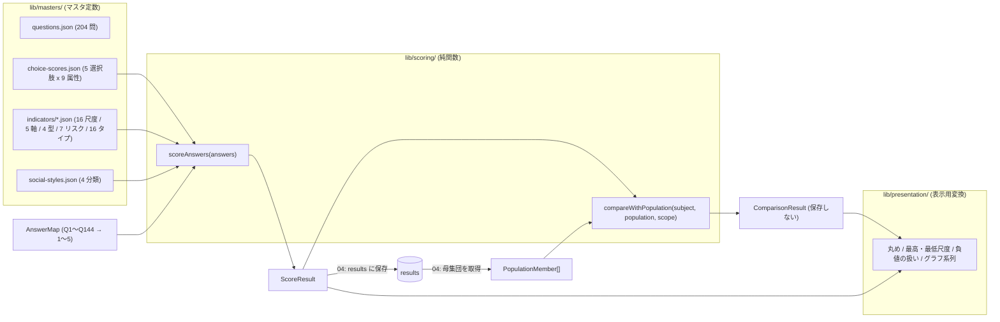
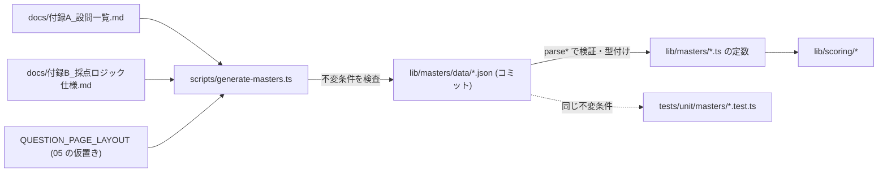

# 基本設計 03 採点エンジン設計

| 項目 | 内容 |
|---|---|
| 文書名 | 適性検査システム 基本設計 03 採点エンジン設計 |
| 版 | 1.3（1.1 版: レビュー指摘反映: T-14 境界値、§4.2・§5.10 誤記、§7.1 母集団条件、§7.3 未確認表記、§8.2 色注釈、D3-06・D3-14・D3-18。1.2 版: 最終点検で D3-06 の 00 改版要請が 00 1.1 版に反映されたことを §2.2・§5.7・§12 に反映。1.3 版: K-06（Supabase → Firebase）に伴う部分改版。変更点は §13） |
| 作成日 | 2026-09-17（改版 2026-09-19、1.2 版 2026-09-21、1.3 版 2026-09-21） |
| 対象 | `lib/scoring/` と `lib/masters/`（設問・配点・指標定義）の実装者、04（API）・06（管理者画面）・08（テスト）の設計者 |

## 0. 本書の位置づけ

本書は、付録B の全計算式を TypeScript の純粋関数群（`lib/scoring/`）として実装するための設計書です。あわせて、計算式の元データとなるマスタ（設問・配点属性・指標定義。`lib/masters/`）の形式と生成方針、比較計算（合致度・偏差値・評価・立ち位置）の仕様、表示用判定（`lib/presentation/`）との責任分界、丸めの規則、テスト設計を定めます。

- 用語・識別子・型名・ディレクトリは `docs/基本設計/00_共通定義.md`（以下「00」）に従います。00 §3.4 の型はそのまま使い、本書では**追加のみ**行います（追加した型・関数は §2.3 と §12 に一覧化します）。
- `lib/scoring/` と `lib/masters/` は Next.js・Firebase に依存しない純粋な TypeScript とし、I/O（Firestore、HTTP、ファイル）を一切行いません（00 §3.3）。Firestore からの母集団取得（02 の `fetchPopulation()`。00 §1.11）や結果保存は 02（`lib/db/`）・04（`lib/services/`）の範囲です。
- 表示用の変換（文言の出し分け、色、丸め、グラフ用データ整形）は `lib/presentation/` に置き、採点エンジンには含めません。本書は `lib/presentation/` のうち採点結果の解釈に直結する部分（丸め規則、最高・最低尺度の選定、負値の扱い）だけを定め、色分けの具体値やレイアウトは 06 分冊に委ねます。

### 0.1 参照した要件

| 参照元 | 参照した内容 |
|---|---|
| 要件定義書 §6.3 | 採点エンジンの構造（決定論的な加算・減算、主要式、Q145〜Q204 が未使用） |
| 要件定義書 §6.4 | 項目詳細（16 尺度の最大・最小）、育成方法（資質第一・第二候補） |
| 要件定義書 §8.4、§8.5 | 結果の列群、チャート用データを結果から導出する方針 |
| 要件定義書 §9 | 性能（採点は送信時に同期実行し 2 秒以内） |
| 要件定義書 §11 | 不具合 10 件（1 優劣性の上書き、2 思考の傾向の誤参照、3 母集団の不統一、4 同点時の優先順位、7 Q145〜Q204、8 内部名の表記ゆれ、9・10 母集団の定義と版の混在） |
| 要件定義書 §12 | 未確認事項（負値のスライダー表示、母集団の正確な定義、旧版ロジックの内容） |
| 付録A | 設問 204 問の文言、設問ごとの採点への使われ方（逆引き表） |
| 付録B §1〜§13 | 配点属性 9 種、16 尺度、相性 5 軸、資質 4 型、リスク 7 項目、適性タイプ 16 種、ソーシャルスタイル 4 分類、信頼係数、比較計算、立ち位置、既存の欠陥、旧ロジック混在 |
| 付録C §3、§6、§7 | 項目詳細の同点時の扱いが未確認であること、立ち位置 5 段階、色分けの値域 |
| 付録E §1〜§4 | レーダーチャートの軸順と最大値、ゲージの「NN%」表示、スライダーの 0〜100 表示 |
| tests/fixtures/README.md、tests/verify_fixtures.py | 検証用データで検証できること・できないこと、6 つの検証項目 |

### 0.2 決定事項との対応

| # | 決定事項 | 本書での対応 |
|---|---|---|
| 1 | Next.js + Firebase（Cloud Firestore、Firebase Authentication）+ Vercel、ApexCharts（10 K-06） | 採点エンジンはフレームワーク非依存の純関数（§1.2）。`ScoreResult` は map 構造のまま `results` 文書に保存される（§5.9、00 §2.1）。グラフ用の系列データは `lib/presentation/` で `ScoreResult` / `ComparisonResult` から整形する（§8） |
| 2 | 要件定義書 §11 の不具合 10 件を修正 | §6 に反映点一覧。優劣性は計算値を保存、思考の傾向は `compatibility.thinking_tendency` を参照、母集団は 1 種類、比較値は非永続化、同点順は定数化、Q145〜Q204 非採点、内部名統一、`scoringVersion` 付与 |
| 3 | 出題は Q1〜Q144 のみ | `AnswerMap` は Q1〜Q144 を必須とし、Q145〜Q204 は存在しても無視（§5.9）。設問マスタは 204 問を保持し `isActive` / `isScored` で区別（§4.3） |
| 4 | 既存データは移行しない | 旧ロジック（付録B §13）は実装しない。`scoringVersion` を結果に付与し、母集団条件に使う（§7.1） |
| 5 | AI 解説は Claude API | 本書の範囲外。AI 入力は `ScoreResult` をそのまま渡す（00 §3.6、07 分冊） |
| 6 | 日本語のみ、管理画面 PC 幅・受検者画面スマホ対応 | 本書の範囲外（表示は 05・06 分冊） |

## 1. 採点エンジンの全体像

### 1.1 責任範囲と入出力



| 関数 | 入力 | 出力 | 呼び出し元（04 分冊） |
|---|---|---|---|
| `scoreAnswers(answers)` | `AnswerMap`（Q1〜Q144 → 1〜5） | `ScoreResult`（全指標、候補、タイプ、スタイル、信頼係数、`scoringVersion`） | 受検者の送信 API（`POST /api/v1/respondent/sessions/{sessionId}/submit`）。結果は `results` に 1 行で保存 |
| `compareWithPopulation(subject, population, scope)` | 閲覧対象の 16 尺度・5 軸、母集団（同じ形の配列）、比較範囲 | `ComparisonResult`（平均、差分、偏差、合致度、偏差値、評価、立ち位置） | 比較 API（`GET /api/v1/admin/results/{resultId}/comparison`）。**保存しない** |

### 1.2 設計原則

1. **純関数**: 同じ入力に対して常に同じ出力を返し、外部状態を読み書きしません。`Date`、乱数、環境変数も参照しません。
2. **丸めない**: 採点エンジンは JavaScript の `number` で計算し、途中でも最後でも丸めません（00 §3.1）。丸めは `lib/presentation/` のみで行います（§9）。
3. **式をデータとして持つ**: 付録B の各式は「項の配列 + 定数 + 乗数 + 下限」というデータ（`IndicatorDefinition`、00 §3.5）で表し、評価器は 1 つ（`evaluateIndicator`）です。式をコードに直書きしません。これにより、付録B と実装の突合をマスタの検査に置き換えられます（§10.3）。
4. **同点処理は定数の順序で決める**: 資質・16 タイプ・ソーシャルスタイルの同点時の優先順位は、00 §3.4 の `APTITUDE_KEYS` / `APTITUDE_TYPE_KEYS` / `SOCIAL_STYLE_KEYS` の配列順そのものとし、比較関数を 1 つ（`pickFirstMax`）に集約します（要件定義書 §11 の 4 番、00 §1.11）。
5. **負値はクランプ指示のある指標だけ 0 にする**: 付録B に「負なら 0」と書かれている指標のうち、資質 4 型は `IndicatorDefinition.clampMin = 0` で表し、信頼係数は専用実装（`compute-reliability.ts`、§5.8、D3-15）の内部で 0 未満を 0 にします。相性 5 軸・リスク 7 項目・16 タイプ得点・ソーシャルスタイル 4 値は負値のまま返します。負値の表示は `lib/presentation/`（§8.4）で扱います。
6. **既存の残存アクションは実装しない**: 優劣性の `= 12` 上書き、最終ページの旧計算式（付録B §12）、`÷1` の正規化（付録B §3）、`+ 0` の項（付録B §6 注）は、いずれも実装しません。

### 1.3 ファイル構成

00 §3.3 のディレクトリに、本書で追加するファイルを含めた一覧です（追加分は「追加」と記載）。

```text
lib/
├── scoring/
│   ├── types.ts                  # 00 §3.4 の型（追加型は §2.3）
│   ├── version.ts                # SCORING_VERSION = "1.0.0"
│   ├── errors.ts                 # 追加: InvalidAnswerMapError, EmptyPopulationError
│   ├── evaluate.ts               # 追加: evaluateIndicator, pickFirstMax, rankKeys（共通評価器）
│   ├── validate-answers.ts       # 追加: assertAnswerMap（Q1〜Q144 の検証）
│   ├── compute-traits.ts
│   ├── compute-compatibility.ts
│   ├── compute-aptitudes.ts
│   ├── compute-risks.ts
│   ├── compute-aptitude-types.ts
│   ├── compute-social-styles.ts
│   ├── compute-reliability.ts
│   ├── score.ts                  # scoreAnswers
│   └── compare.ts                # compareWithPopulation, GRADE_RULES, POSITION_RULES
├── masters/
│   ├── types.ts                  # 00 §3.5 の型
│   ├── validate.ts               # 追加: JSON マスタの読み込み時検証（型の絞り込み）
│   ├── data/                     # 追加: 機械生成した JSON マスタ（§4）
│   │   ├── questions.json
│   │   ├── choice-scores.json
│   │   ├── traits.json
│   │   ├── compatibility.json
│   │   ├── aptitudes.json
│   │   ├── risks.json
│   │   ├── aptitude-types.json
│   │   └── social-styles.json    # 追加: SocialStyleDefinition の配列（00 §3.3 の indicators/ 5 ファイルに対応する 6 つ目）
│   ├── questions.ts              # QUESTIONS, SCORED_QUESTION_NOS, QUESTION_PAGE_LAYOUT
│   ├── choice-scores.ts          # CHOICE_SCORE_TABLE
│   ├── indicators/
│   │   ├── traits.ts             # TRAIT_DEFINITIONS
│   │   ├── compatibility.ts      # COMPATIBILITY_DEFINITIONS
│   │   ├── aptitudes.ts          # APTITUDE_DEFINITIONS
│   │   ├── risks.ts              # RISK_DEFINITIONS
│   │   ├── aptitude-types.ts     # APTITUDE_TYPE_DEFINITIONS
│   │   └── social-styles.ts      # 追加: SOCIAL_STYLE_DEFINITIONS（00 §3.3 には無い。§2.3、§4.4）
│   ├── texts/                    # 付録C の文言（06 分冊）
│   └── occupations.ts
├── presentation/
│   ├── rounding.ts               # 追加: 表示用の丸め（§9）
│   ├── trait-highlights.ts       # 追加: 最高・最低尺度の選定（§8.3）
│   ├── negative-values.ts        # 追加: 負値の表示規則（§8.4）
│   └── ...                       # 色分け・文言出し分け・グラフ系列（06 分冊）
scripts/
└── generate-masters.ts           # 追加: 付録A・付録B から lib/masters/data/*.json を生成（§4.5）
tests/
└── unit/
    ├── masters/                  # マスタの不変条件テスト（§10.3）
    └── scoring/                  # 採点・比較の単体テスト（§10）
```

- `scripts/` は 01 分冊が定義済みのディレクトリ（`scripts/create-owner`、`scripts/seed-local` など。00 §3.3）です。`generate-masters.ts` はそこに追加します。
- 設問文の正は `lib/masters/questions.ts`（実体は `data/questions.json`）です。Firestore に設問のコレクションは持たず（00 §1.9、D-01）、1.x 版で 01 が生成していた設問シード（`supabase/seed/questions.sql`）と `scripts/generate-question-seed.ts` は 1.3 版で廃止しました（K-06）。回答の設問番号が 1〜144 の範囲であることは 04 のスキーマ検証が保証します（00 §2.2）。

## 2. 型定義

### 2.1 入力（回答）

00 §3.4 の定義を再掲します（変更なし）。

```ts
// lib/scoring/types.ts（00 §3.4 より抜粋）
export type QuestionNo = number;                 // 1〜204。採点対象は 1〜144
export type ChoiceCode = 1 | 2 | 3 | 4 | 5;      // 1 = そう思う … 5 = そう思わない
export type AnswerMap = Readonly<Record<QuestionNo, ChoiceCode>>;
```

`AnswerMap` の契約:

| 条件 | 扱い |
|---|---|
| Q1〜Q144 のキーがすべて存在し、値が 1〜5 の整数 | 正常。採点する |
| Q1〜Q144 のいずれかが欠落 | `InvalidAnswerMapError`（`missing` に欠落番号の配列） |
| 値が 1〜5 以外（0、6、小数、`NaN`、文字列） | `InvalidAnswerMapError`（`invalid` に番号と値の配列） |
| Q145〜Q204 のキーが存在する | 無視する（エラーにしない。決定事項 3、00 §1.9） |
| 1〜204 以外のキーが存在する | 無視する（設計判断 D3-14: 純関数としての防御的な扱い。API 層は回答保存時に `questionNo` 1〜144 以外を 422 で拒否し（04 §4.4）、送信 API は `assessmentSessions.answers`（map。キーは `"1"`〜`"144"` の文字列。00 §2.2、D-29）から `AnswerMap` を組み立てるため、通常運用ではこのようなキーは採点エンジンに到達しない） |

- 回答の型はオブジェクトのキーが文字列に変換される点に注意します。`assertAnswerMap` は `Number(key)` で正規化して検証します（Firestore の `answers` map は文字列キーで読み戻されるため、04 の mapper は変換せずそのまま渡してよい）。
- 未回答を許容しません。「未回答があれば送信できない」は 05 分冊（受検者画面）と 04 分冊（送信 API の 422）で担保し、採点エンジンは完全な回答のみ受け付けます。

### 2.2 出力（採点結果）

00 §3.4 の `ScoreResult` をそのまま使います。各フィールドの値域・刻み・負値の有無を確定します（理論値は §5.10 で導出）。

| フィールド | 型 | 値域（理論） | 刻み | 負値 | 備考 |
|---|---|---|---|---|---|
| `scoringVersion` | `string` | `"1.0.0"` | － | － | `SCORING_VERSION` |
| `traits` | `TraitScores` | 0〜30 | 0.5 | なし | 付録B §2。全 16 尺度が加算 8 問・減算 7 問（§5.2） |
| `compatibility` | `CompatibilityScores` | −100〜100 | 1 | **あり** | 付録B §3。クランプしない |
| `aptitudes` | `AptitudeScores` | 0〜145 | 1.25 | なし（0 に切り上げ） | 付録B §4 |
| `aptitudeFirst` / `aptitudeSecond` | `AptitudeKey` | － | － | － | 同点時は `APTITUDE_KEYS` 順 |
| `risks` | `RiskScores` | −40〜100 | 2.5 | **あり** | 付録B §5。×5 後の値。クランプしない（表示で 0% に丸める） |
| `aptitudeTypeScores` | `AptitudeTypeScores` | −58〜58 | 0.5 | **あり** | 付録B §6。既存では未保存だが新システムでは保存（00 §1.6） |
| `aptitudeType` | `AptitudeTypeKey` | － | － | － | 同点時は `APTITUDE_TYPE_KEYS` 順（設計判断 D-03） |
| `socialStyles` | `SocialStyleScores` | −29〜29 | 0.25 | **あり** | 付録B §7。クランプしない（§5.7） |
| `socialStyle` | `SocialStyleKey` | － | － | － | 同点時は `SOCIAL_STYLE_KEYS` 順（D-21） |
| `reliability` | `number` | 0〜100 | 0.735 の倍数（100 − 0.735n） | なし（0 に切り上げ） | 付録B §8 |

補足: ソーシャルスタイル 4 値の「0〜30」（付録B §7 の見出し）はレーダーチャートの表示レンジで、付録B §7 の式（所属 4 タイプの得点の最大値 ÷ 2）から導出した計算値は −29〜29 になり得ます（全問「そう思わない」で −29。§5.10、§10.4 の全問 5 の列）。00 1.1 版 §1.1・§1.7・§3.4（D-26）はこれを「計算値 −29〜29（保存値）、表示レンジ 0〜30」と記載しており、本書の扱い「採点エンジンではクランプせず、Firestore にも計算値のまま number（倍精度）で保存する（00 §2.1「負値を含む計算値をそのまま保存し、丸めない」）。レーダー描画時に 0 に丸める（06 §6.4）」と一致します（§8.4。1.1 版の D3-06 の改版要請は 00 1.1 版で反映済み）。

### 2.3 本書で追加する型・定数・関数

00 §3.4 に**追加**するもの（名称変更はありません）。

```ts
// lib/scoring/errors.ts
export class InvalidAnswerMapError extends Error {
  readonly name = "InvalidAnswerMapError";
  constructor(
    readonly missing: readonly QuestionNo[],                       // 欠落した設問番号（昇順）
    readonly invalid: ReadonlyArray<{ questionNo: QuestionNo; value: unknown }>, // 不正な値
  ) { super("回答が不完全または不正です"); }
}

export class EmptyPopulationError extends Error {
  readonly name = "EmptyPopulationError";
  constructor(readonly scope: ComparisonScope) { super("比較母集団が 0 件です"); }
}
```

```ts
// lib/scoring/evaluate.ts
import type { AnswerMap, ChoiceCode } from "./types";
import type { ChoiceScoreTable, IndicatorDefinition } from "@/lib/masters/types";

/** 付録B の 1 式を評価する共通評価器。丸めない */
export function evaluateIndicator<K extends string>(
  def: IndicatorDefinition<K>,
  answers: AnswerMap,
  table: ChoiceScoreTable,
): number;

/** 最大値を持つキーを返す。同点時は keys の並び順で先のもの */
export function pickFirstMax<K extends string>(
  scores: Readonly<Record<K, number>>,
  keys: readonly K[],
): K;

/** 値の降順、同点時は keys の並び順で安定ソートしたキー配列を返す */
export function rankKeys<K extends string>(
  scores: Readonly<Record<K, number>>,
  keys: readonly K[],
): readonly K[];
```

```ts
// lib/scoring/validate-answers.ts
/** Q1〜Q144 が揃い、値が 1〜5 であることを検証する。失敗時は InvalidAnswerMapError */
export function assertAnswerMap(input: Readonly<Record<string | number, unknown>>): AnswerMap;
```

```ts
// lib/scoring/compare.ts（追加分）
export const THRESHOLD_EPSILON = 1e-9;   // 閾値判定の許容誤差（§7.6）

export interface GradeRule { readonly grade: Grade; readonly minMatch: number; readonly minDeviation: number }
export const GRADE_RULES: readonly GradeRule[];   // A→D の順。§7.4

export interface PositionRule { readonly key: PositionKey; readonly minDeviation: number | null }
export const POSITION_RULES: readonly PositionRule[]; // strong_leader→unfit の順。§7.5

export function computeMatchScore(subjectTraits: TraitScores, traitAverages: TraitScores): number;
export function computeAxisDeviations(subject: CompatibilityScores, averages: CompatibilityScores): CompatibilityScores;
export function computeDeviationScore(axisDeviations: CompatibilityScores): number;
export function decideGrade(matchScore: number, deviationScore: number): Grade;
export function decidePosition(deviationScore: number): PositionKey;
```

```ts
// lib/masters/questions.ts（追加分）
export const SCORED_QUESTION_NOS: readonly QuestionNo[];   // [1, 2, ..., 144]
export const SCORED_QUESTION_COUNT = 144 as const;
/** 05 分冊の仮置き（D-08）。値は 05 分冊が確定する */
export const QUESTION_PAGE_LAYOUT: {
  readonly stepCount: 4; readonly questionsPerStep: 36;
  readonly pageSizes: readonly [7, 7, 7, 7, 8];
};
```

```ts
// lib/masters/indicators/social-styles.ts（追加。§4.4）
import type { SocialStyleDefinition } from "@/lib/masters/types";   // 00 §3.5 の型
/** 4 分類の定義（sortOrder = 同点優先順、chartOrder = レーダー軸順）。SOCIAL_STYLE_KEYS 順 */
export const SOCIAL_STYLE_DEFINITIONS: readonly SocialStyleDefinition[];
```

```ts
// lib/presentation/trait-highlights.ts（§8.3）
export interface TraitHighlight { readonly key: TraitKey; readonly value: number }
export function pickHighestTrait(traits: TraitScores): TraitHighlight;
export function pickLowestTrait(traits: TraitScores): TraitHighlight;
export function sortTraitsForList(traits: TraitScores): readonly TraitHighlight[]; // 一覧ポップアップ用
```

## 3. 配点属性 9 種の定義データ

### 3.1 データ構造

配点属性（`ScoreAttributeKey`、00 §1.9）は選択肢コード（1〜5）ごとに 9 個の数値を持つ表 `ChoiceScoreTable`（00 §3.5）です。JSON マスタ `lib/masters/data/choice-scores.json` の形式は次のとおりです（値は付録B §1 と同一。00 §1.9 の JSON と同じ内容）。

```json
{
  "generatedFrom": ["docs/付録B_採点ロジック仕様.md#1"],
  "choices": {
    "1": { "label": "そう思う",                 "score": 2,   "reliability": 1,    "social_plus": 5,     "social_minus": -2.5,  "score_important": 3,    "score_compat": 5,  "score_compat_minus": 5,  "score_type": 2,  "social_important": 7.5  },
    "2": { "label": "どちらかと言えばそう思う",   "score": 1.5, "reliability": 1,    "social_plus": 2.5,   "social_minus": -1.25, "score_important": 1.5,  "score_compat": 3,  "score_compat_minus": 3,  "score_type": 1,  "social_important": 3.75 },
    "3": { "label": "どちらでもない",             "score": 1,   "reliability": -0.5, "social_plus": 0,     "social_minus": 0,     "score_important": 0,    "score_compat": 0,  "score_compat_minus": 0,  "score_type": 0,  "social_important": 0    },
    "4": { "label": "どちらかと言えばそう思わない", "score": 0.5, "reliability": 1,    "social_plus": -1.25, "social_minus": 2.5,   "score_important": -1.5, "score_compat": -3, "score_compat_minus": -3, "score_type": -1, "social_important": -2.5 },
    "5": { "label": "そう思わない",               "score": 0,   "reliability": 1,    "social_plus": -2.5,  "social_minus": 5,     "score_important": -3,   "score_compat": -5, "score_compat_minus": -5, "score_type": -2, "social_important": -5   }
  }
}
```

```ts
// lib/masters/choice-scores.ts
import raw from "./data/choice-scores.json";
import { parseChoiceScoreTable } from "./validate";
export const CHOICE_SCORE_TABLE: ChoiceScoreTable = parseChoiceScoreTable(raw);
```

### 3.2 属性と指標の対応（付録B §1〜§8 から確定）

| `ScoreAttributeKey` | 日本語名（付録B §1） | 使用する指標 | 符号の扱い |
|---|---|---|---|
| `score` | スコア | 16 尺度（全項）、リスク（一部の項） | 尺度では加算・減算の両方、リスクでは加算のみ |
| `reliability` | 信頼係数 | 信頼係数 | Q1〜Q144 全問を加算 |
| `social_plus` | +ソーシャル | 資質 4 型 | 加算のみ |
| `social_minus` | -ソーシャル | 資質 4 型 | 加算のみ（属性値自体が符号反転している） |
| `social_important` | ソーシャル(重要) | 資質 4 型 | 加算のみ |
| `score_type` | スコア(タイプ用) | 16 タイプ得点（加算・減算）、リスク（一部の項、加算） | タイプでは減算項あり |
| `score_important` | スコア(重要) | 16 タイプ得点 | 加算のみ |
| `score_compat` | スコア(相性) | 相性 5 軸の加算項（および 適応する環境 の `− Q4.スコア(相性)`） | 加算・減算 |
| `score_compat_minus` | スコア(-相性) | 相性 5 軸の減算項 | 減算のみ |

- `score_compat` と `score_compat_minus` は同じ値ですが（付録B §1 補足）、付録B の式との対応を保つため別属性として保持します。適応する環境の `− Q4.スコア(相性)` は `score_compat` を減算する唯一の項で、機械生成時にそのまま保持します（付録B §3）。
- 全ての配点値は 2 進小数で正確に表現できる値（0.25 の整数倍）のため、加減算は誤差なく行われ、同点判定は厳密等号で問題ありません（§7.6）。

## 4. 設問→指標マッピング（JSON マスタ）

### 4.1 指標定義の共通形式

付録B の各式を、00 §3.5 の `IndicatorDefinition` に対応する JSON で表します。1 ファイルに 1 指標群を収めます。

```json
{
  "generatedFrom": ["docs/付録B_採点ロジック仕様.md#2"],
  "generatedAt": "2026-09-17T00:00:00Z",
  "kind": "trait",
  "indicators": [
    {
      "key": "cooperativeness",
      "label": "協力性",
      "sortOrder": 1,
      "constant": 14,
      "multiplier": 1,
      "clampMin": null,
      "terms": [
        { "questionNo": 24,  "attribute": "score", "sign": 1 },
        { "questionNo": 93,  "attribute": "score", "sign": 1 },
        { "questionNo": 67,  "attribute": "score", "sign": 1 },
        { "questionNo": 116, "attribute": "score", "sign": 1 },
        { "questionNo": 130, "attribute": "score", "sign": 1 },
        { "questionNo": 26,  "attribute": "score", "sign": 1 },
        { "questionNo": 139, "attribute": "score", "sign": 1 },
        { "questionNo": 96,  "attribute": "score", "sign": 1 },
        { "questionNo": 1,   "attribute": "score", "sign": -1 },
        { "questionNo": 35,  "attribute": "score", "sign": -1 },
        { "questionNo": 63,  "attribute": "score", "sign": -1 },
        { "questionNo": 108, "attribute": "score", "sign": -1 },
        { "questionNo": 118, "attribute": "score", "sign": -1 },
        { "questionNo": 22,  "attribute": "score", "sign": -1 },
        { "questionNo": 91,  "attribute": "score", "sign": -1 }
      ]
    }
  ]
}
```

フィールドの意味（00 §3.5 `IndicatorDefinition` と 1 対 1）:

| フィールド | 意味 | 16 尺度 | 相性 5 軸 | 資質 4 型 | リスク 7 | 16 タイプ |
|---|---|---|---|---|---|---|
| `key` | 識別子（00 §1） | `TraitKey` | `CompatibilityKey` | `AptitudeKey` | `RiskKey` | `AptitudeTypeKey` |
| `terms[]` | 項の配列。**付録B の式の出現順を保持し、重複も保持する** | 15 項 | 20 項 | 26 項 | 10 項 | 26 項 |
| `terms[].attribute` | 配点属性 | `score` | `score_compat` / `score_compat_minus` | `social_plus` / `social_minus` / `social_important` | `score` / `score_type` | `score_type` / `score_important` |
| `terms[].sign` | 1 = 加算、−1 = 減算 | 8 / 7 | 軸による（§5.3） | 全て 1 | 全て 1 | 加算 17〜20、減算 0〜3、重要 6（全て 1） |
| `constant` | 項の合計に加える定数 | 14 | 0 | 0 | 0 | 0 |
| `multiplier` | 合計（定数加算後）に掛ける乗数 | 1 | 1 | 1 | 5 | 1 |
| `clampMin` | 下限（これ未満なら下限値に置換）。`null` は無制限 | `null` | `null` | 0 | `null` | `null` |

指標群ごとの追加フィールド（00 §3.5 の各 `Definition` に対応）:

| kind | 追加フィールド | 値の出典 |
|---|---|---|
| `trait` | `label`、`sortOrder`（レーダー軸順） | 00 §1.2 |
| `compatibility` | `label`、`lowLabel`、`highLabel`、`sortOrder` | 00 §1.3 |
| `aptitude` | `internalName`（感性開放型）、`label`（直感型）、`sortOrder`（同点優先順） | 00 §1.4 |
| `risk` | `label`（正式名）、`shortLabel`、`aiLabel`、`sortOrder` | 00 §1.5 |
| `aptitude_type` | `label`、`shortLabel`、`socialStyle`、`characterName`、`characterNameHiragana`、`sortOrder`（同点優先順） | 00 §1.6、付録B §6、付録C §1・§8 |

### 4.2 各指標群の項の構成（付録B から機械的に確認した結果）

生成元の付録B を解析した結果を、マスタの不変条件（§10.3 のテストで検証）として確定します。

16 尺度（付録B §2）: 全 16 尺度が加算 8 問・減算 7 問・定数 +14 です。付録B §2 冒頭に「加算 7 問・減算 7 問の尺度は 0〜28」とありますが、実際の式には加算 7 問の尺度は存在しません。全尺度の理論範囲は 0〜30 です。

相性 5 軸（付録B §3）:

| 軸 | 加算（`score_compat`, +1） | 減算 | 合計 |
|---|---:|---|---:|
| 適応する環境 | 18 | 2（Q4 は `score_compat` を −1、Q60 は `score_compat_minus` を −1） | 20 |
| 適応する業務 | 20 | 0 | 20 |
| 思考の傾向 | 20 | 0 | 20 |
| 意思決定 | 16 | 4（`score_compat_minus` を −1: Q56, Q71, Q89, Q97） | 20 |
| ストレス耐性 | 4 | 16（`score_compat_minus` を −1） | 20 |

資質 4 型（付録B §4）:

| 型 | `social_plus` | `social_minus` | `social_important` | 合計 | 備考 |
|---|---:|---:|---:|---:|---|
| 感性開放型 `sensory_open` | 16 | 4 | 6 | 26 | |
| 環境受容型 `environment_receptive` | 19 | 1 | 6 | 26 | |
| 自己実現型 `self_actualizing` | 15 | 5 | 6 | 26 | **Q13 の `social_plus` が 2 回出現**（付録B §4 の式、付録A の逆引き表とも一致）。既存の出力と一致させるため重複を保持する（§12 の D3-04） |
| 探求論理型 `inquiry_logical` | 19 | 1 | 6 | 26 | |

- 全型で `social_important` 6 問のうち一部は `social_plus` にも登場します（例: 感性開放型の Q26・Q29・Q74）。同一設問が異なる属性で複数回使われるのは仕様です。

リスク 7 項目（付録B §5）:

| リスク | `score` | `score_type` | 合計 |
|---|---:|---:|---:|
| 不祥事 `misconduct` | 6 | 4 | 10 |
| 苦情 `complaint` | 10 | 0 | 10 |
| メンタル面の不服 `mental_distress` | 9 | 1 | 10 |
| 不注意ミス `careless_mistake` | 6 | 4 | 10 |
| 退職時トラブル `resignation_trouble` | 7 | 3 | 10 |
| コミュニケーション起因の業務支障 `communication_issue` | 9 | 1 | 10 |
| モチベーション不足による就業辞退 `low_motivation` | 10 | 0 | 10 |

16 タイプ（付録B §6）:

| タイプ | 所属 | 加算（`score_type`, +1） | 減算（`score_type`, −1） | 重要（`score_important`, +1） |
|---|---|---:|---|---:|
| attendant | expressive | 20 | 0 | 6 |
| follower | amiable | 20 | 0 | 6 |
| specialist | amiable | 20 | 0 | 6 |
| creator | analytical | 20 | 0 | 6 |
| professional | analytical | 20 | 0 | 6 |
| generalist | amiable | 18 | 2（Q45, Q46） | 6 |
| scientist | analytical | 17 | 3（Q11, Q25, Q45） | 6 |
| pioneer | driving | 20 | 0 | 6 |
| conductor | amiable | 19 | 1（Q4） | 6 |
| controller | driving | 20 | 0 | 6 |
| artist | analytical | 20 | 0 | 6 |
| reviewer | driving | 20 | 0 | 6 |
| promoter | expressive | 20 | 0 | 6 |
| actor | driving | 20 | 0 | 6 |
| receptionist | expressive | 20 | 0 | 6 |
| freelancer | expressive | 20 | 0 | 6 |

設問の使用状況（付録A 逆引き表と一致）:

- Q1〜Q144 のうち、Q64 と Q144 は指標に使われず信頼係数だけに使われます。
- Q145〜Q204 はどの指標にも信頼係数にも使われません（要件定義書 §6.3、§11 の 7 番）。マスタでは `isActive = false`、`isScored = false` で保持します。

### 4.3 設問マスタ

```json
{
  "generatedFrom": ["docs/付録A_設問一覧.md"],
  "questions": [
    { "questionNo": 1,   "text": "人の好き嫌いが多い",        "isActive": true,  "isScored": true,  "step": 1,    "page": 1 },
    { "questionNo": 144, "text": "食べ物の好き嫌いが多い",    "isActive": true,  "isScored": true,  "step": 4,    "page": 5 },
    { "questionNo": 145, "text": "行動的、野心的、エネルギッシュである", "isActive": false, "isScored": false, "step": null, "page": null }
  ]
}
```

- `step` / `page` は `QUESTION_PAGE_LAYOUT`（§2.3。05 分冊の仮置き D-08: 1 ステップ 36 問、ページ 7・7・7・7・8 問）から生成時に計算します。Q1〜Q36 がステップ 1、Q37〜Q72 がステップ 2、Q73〜Q108 がステップ 3、Q109〜Q144 がステップ 4。各ステップ内で 1〜7 問目がページ 1、8〜14 がページ 2、15〜21 がページ 3、22〜28 がページ 4、29〜36 がページ 5。05 分冊が割り当てを変更した場合は `QUESTION_PAGE_LAYOUT` を更新して再生成します。
- 設問文は付録A の転記をそのまま使います（表記ゆれ・誤字も含めて変更しません。変更は依頼主確認事項）。

```ts
// lib/masters/questions.ts
export const QUESTIONS: readonly QuestionDefinition[];                 // 204 件、questionNo 昇順
export const QUESTION_BY_NO: ReadonlyMap<QuestionNo, QuestionDefinition>;
export const SCORED_QUESTION_NOS: readonly QuestionNo[];               // 1..144
export const ACTIVE_QUESTIONS: readonly QuestionDefinition[];          // isActive = true の 144 件
```

### 4.4 ソーシャルスタイル・立ち位置マスタ

ソーシャルスタイル（`social-styles.json`）は式を持たないため `IndicatorDefinition` ではなく 00 §3.5 の `SocialStyleDefinition` の配列です。`sortOrder`（同点優先順: driving 1、expressive 2、analytical 3、amiable 4）と `chartOrder`（レーダー軸順: driving 1、expressive 2、amiable 3、analytical 4）を別に持ちます（00 §1.7）。

立ち位置の閾値は採点ロジック（付録B §10）のため `lib/scoring/compare.ts` の `POSITION_RULES` に置き、表示名・説明文（付録C §6）は 06 分冊の `lib/masters/texts/positions.ts`（`PositionDefinition`）が `key` で結合します。閾値を 2 箇所に書かないため、`PositionDefinition.minDeviation` / `maxDeviation` は `POSITION_RULES` から導出して埋めます。

### 4.5 マスタの生成方針

- 生成元は付録A（設問文）と付録B（式・タイプ表）です。**実装フェーズで `scripts/generate-masters.ts` が付録の Markdown を解析して `lib/masters/data/*.json` を生成**し、生成物をリポジトリにコミットします。手書きしません。
- 解析規則: 付録B §2〜§5 のコードブロックを `=` の右辺で分割し、`([+-])? Q(\d+)\.(属性名)` を出現順に走査して項を作ります（先頭項の符号なしは +1、直前の演算子が `-` なら −1）。`+ 14` を定数として拾います。§6 の表は列（加算・減算・重要）ごとに `Q(\d+)` を拾います。属性名は `+ソーシャル` / `-ソーシャル` / `スコア(-相性)` を含むため、長い名前から先に照合します。
- 生成時に §4.2 の不変条件（項数、属性の組み合わせ、定数、Q145〜Q204 が未使用、Q64・Q144 が信頼係数のみ）を検査し、1 つでも外れたら生成を失敗させます。同じ検査を `tests/unit/masters/` の単体テストとしても持ちます（§10.3）。
- 付録の記述が変わった（依頼主が式を修正した）場合は、付録を改版 → 再生成 → `SCORING_VERSION` を上げる（00 §2.4）の順で反映します。
- 生成した JSON の読み込みは `lib/masters/validate.ts` の `parse*` 関数で行い、キーが `TRAIT_KEYS` などの既知の集合に含まれること、項の `attribute` が `SCORE_ATTRIBUTE_KEYS` に含まれること、`questionNo` が 1〜144 であることを実行時（モジュール初期化時）に 1 回検証して型を絞り込みます。検証失敗は起動時エラーとし、不正なマスタで採点が走らないようにします。



## 5. 各計算の仕様

### 5.1 共通評価器

すべての式は次の 1 関数で評価します。

```ts
// lib/scoring/evaluate.ts
export function evaluateIndicator<K extends string>(
  def: IndicatorDefinition<K>,
  answers: AnswerMap,
  table: ChoiceScoreTable,
): number {
  let sum = 0;
  for (const term of def.terms) {
    const choice = answers[term.questionNo];           // assertAnswerMap 済みなので必ず 1〜5
    sum += term.sign * table[choice][term.attribute];
  }
  const value = (sum + def.constant) * def.multiplier;
  return def.clampMin !== null && value < def.clampMin ? def.clampMin : value;
}

export function pickFirstMax<K extends string>(scores: Readonly<Record<K, number>>, keys: readonly K[]): K {
  let best = keys[0];
  for (const k of keys) if (scores[k] > scores[best]) best = k;   // 厳密な > なので同点は先のキーが残る
  return best;
}

export function rankKeys<K extends string>(scores: Readonly<Record<K, number>>, keys: readonly K[]): readonly K[] {
  return [...keys].sort((a, b) => scores[b] - scores[a] || keys.indexOf(a) - keys.indexOf(b));
}
```

- 評価順は「項の合計 → 定数加算 → 乗数 → 下限クランプ」です。付録B の各式はこの順で表現できます（リスクは合計 ×5、資質は合計を 0 で下限、16 尺度は合計 +14）。
- `pickFirstMax` と `rankKeys` は同点時に `keys` の先頭側を優先します。`keys` には必ず 00 §3.4 の定数配列（`APTITUDE_KEYS` など）を渡し、別の順序の配列を渡してはいけません（要件定義書 §11 の 4 番の担保）。

### 5.2 性格特性 16 尺度（付録B §2）

```
trait_k = Σ(加算 8 問の score) − Σ(減算 7 問の score) + 14
```

| 項目 | 仕様 |
|---|---|
| 入力属性 | `score`（2 / 1.5 / 1 / 0.5 / 0） |
| 定数・乗数・下限 | +14、×1、なし |
| 値域・刻み | 0〜30、0.5 刻み（式から自動的にこの範囲に収まるためクランプ不要） |
| 出力 | `ScoreResult.traits`（`TRAIT_KEYS` 順の 16 値） |
| 優劣性 | `deliberateness` も他の 15 尺度と同じ式で計算し、**そのまま保存**する。固定値の代入処理をどこにも書かない（要件定義書 §11 の 1 番、付録B §12） |

```ts
// lib/scoring/compute-traits.ts
export function computeTraits(answers: AnswerMap): TraitScores {
  const out = {} as Record<TraitKey, number>;
  for (const def of TRAIT_DEFINITIONS) out[def.key] = evaluateIndicator(def, answers, CHOICE_SCORE_TABLE);
  return out;
}
```

### 5.3 組織との相性 5 軸（付録B §3）

```
compat_axis = Σ(加算項の score_compat) − Σ(減算項の score_compat または score_compat_minus)
```

| 項目 | 仕様 |
|---|---|
| 入力属性 | `score_compat`（5 / 3 / 0 / −3 / −5）、減算項は `score_compat_minus`（同じ値）。適応する環境の Q4 だけ `score_compat` を減算（付録B §3 の式どおり） |
| 定数・乗数・下限 | 0、×1、**なし**（負値をそのまま返す。付録B §3 の `÷1` は実装しない） |
| 値域・刻み | −100〜100、整数 |
| 出力 | `ScoreResult.compatibility`（`COMPATIBILITY_KEYS` 順の 5 値）。**Firestore（`results.compatibility` map）には負値のまま保存**（00 §1.3） |
| 表示 | 0〜100 のスライダー（付録E §4）。負値の表示は §8.4 と 06 分冊（D-07） |

### 5.4 資質タイプ 4 型と第一・第二候補（付録B §4）

```
aptitude_raw = Σ(social_plus 項) + Σ(social_minus 項) + Σ(social_important 項)
aptitude     = max(0, aptitude_raw)
```

| 項目 | 仕様 |
|---|---|
| 入力属性 | `social_plus`、`social_minus`、`social_important`。項の符号は全て +1（`social_minus` は属性値が負に反転済み） |
| 定数・乗数・下限 | 0、×1、**下限 0**（型ごとに独立にクランプ） |
| 値域・刻み | 0〜145、1.25 刻み（付録B の「約 150」は最大 145。全 26 項が最大値のとき 16×5 + 4×5 + 6×7.5 = 145） |
| 第一候補 | `aptitudeFirst = rankKeys(aptitudes, APTITUDE_KEYS)[0]` |
| 第二候補 | `aptitudeSecond = rankKeys(aptitudes, APTITUDE_KEYS)[1]` |
| 同点時 | `APTITUDE_KEYS` の順 = 感性開放型 > 環境受容型 > 自己実現型 > 探求論理型（付録B §4、00 §1.4）。クランプ後の値で判定する（4 型すべて 0 なら第一 = `sensory_open`、第二 = `environment_receptive`。付録B §4 の実データ例と一致） |
| 内部名 | JSON マスタの `internalName` は「感性開放型」。「感性解放型」はコード・マスタ・Firestore に一切出さない（00 §1.4） |
| 出力 | `ScoreResult.aptitudes`、`aptitudeFirst`、`aptitudeSecond` |

- 設計判断: 候補の判定はクランプ後の値で行います。既存システムでも「資質第一候補」はクランプ後（保存値）から決まっていたと推定されます（推定: 付録B §4 は「計算後、負の値は 0 に切り上げます」と「第一候補は 4 型の最大値」を同じ節で説明しており、クランプ前の値は保存されていないため）。クランプ前後で順位が変わるのは複数の型が負値のときだけで、その場合はいずれも 0 となり定義順の優先で決まります。

### 5.5 リスク 7 項目（付録B §5）

```
risk = ( Σ(score 項) + Σ(score_type 項) ) × 5
```

| 項目 | 仕様 |
|---|---|
| 入力属性 | `score`（0〜2）、`score_type`（−2〜2）。項の符号は全て +1 |
| 定数・乗数・下限 | 0、**×5**、**なし** |
| 値域・刻み | −40〜100、2.5 刻み。`score_type` を含む 5 項目は負値になり得る（不祥事・不注意ミスは最小 −40、退職時トラブル −30、メンタル面の不服・コミュニケーション起因の業務支障 −10。苦情・モチベーション不足は最小 0） |
| 保存値 | **計算値（負値を含む）をそのまま保存**（00 §1.5）。設計判断: 表示で「0%」にする（付録B §5）のは `lib/presentation/`（§8.4）の責務とし、採点エンジンでは情報を落とさない |
| 出力 | `ScoreResult.risks`（`RISK_KEYS` 順の 7 値） |

### 5.6 適性タイプ 16 種の得点とタイプ決定（付録B §6）

```
type_score_t = Σ(加算設問の score_type) − Σ(減算設問の score_type) + Σ(重要設問の score_important)
aptitudeType = argmax_t type_score_t   （同点時は APTITUDE_TYPE_KEYS の順）
```

| 項目 | 仕様 |
|---|---|
| 入力属性 | `score_type`（±2）、`score_important`（±3） |
| 定数・乗数・下限 | 0、×1、なし。付録B §6 注の `+ 0` は実装しない |
| 値域・刻み | −58〜58、0.5 刻み（減算項を持つタイプの最大値は generalist 50、scientist 46、conductor 54） |
| タイプ決定 | `aptitudeType = pickFirstMax(aptitudeTypeScores, APTITUDE_TYPE_KEYS)` |
| 同点時 | **推定・設計判断（D-03）**: 付録B に記載がないため、`APTITUDE_TYPE_KEYS` の順（付録B §6 の表の順: attendant, follower, specialist, creator, professional, generalist, scientist, pioneer, conductor, controller, artist, reviewer, promoter, actor, receptionist, freelancer）で先のタイプを採用する。既存の argmax の同点挙動は検証用データからも判別できない（tests/fixtures/README.md「できないこと」）ため、依頼主確認事項とする |
| 出力 | `ScoreResult.aptitudeTypeScores`（16 値。新システムでは `results.aptitudeTypeScores` map に保存。00 §1.6）、`aptitudeType` |

### 5.7 ソーシャルスタイル 4 値とスタイル決定（付録B §7）

```
style_s = max( type_score_t for t where t.socialStyle = s ) / 2
socialStyle = argmax_s style_s   （同点時は SOCIAL_STYLE_KEYS の順）
```

| 項目 | 仕様 |
|---|---|
| 入力 | `aptitudeTypeScores` と `APTITUDE_TYPE_DEFINITIONS[].socialStyle`（所属分類。各分類 4 タイプ） |
| 計算 | 分類ごとに所属 4 タイプの得点の最大値を取り、2 で割る |
| 値域・刻み | 計算値は −29〜29、0.25 刻み（§5.10）。表示レンジは 0〜30（00 §1.7。D3-06 の改版要請は 00 1.1 版で反映済み）。設計判断: クランプせず計算値を保存し、描画時に 0 に丸める（§8.4） |
| スタイル決定 | `socialStyle = pickFirstMax(socialStyles, SOCIAL_STYLE_KEYS)` |
| 同点時 | `SOCIAL_STYLE_KEYS` の順 = Driving > Expressive > Analytical > Amiable（付録B §7、要件定義書 §11 の 4 番、00 D-21）。**Expressive と Analytical の順は仮置き**（既存データでは判別不能） |
| レーダー軸順 | Driving, Expressive, Amiable, Analytical（付録E §1）。優先順とは異なるので `SOCIAL_STYLE_DEFINITIONS[].chartOrder` を使う（表示は 06 分冊） |
| 出力 | `ScoreResult.socialStyles`（`SOCIAL_STYLE_KEYS` 順の 4 値）、`socialStyle` |

### 5.8 信頼係数（付録B §8）

```
raw         = Σ_{q=1..144} reliability(answers[q]) − 144     （そう思う等: +1、どちらでもない: −0.5）
reliability = max(0, raw × 0.49 + 100)
```

| 項目 | 仕様 |
|---|---|
| 入力属性 | `reliability`（1 または −0.5）。対象は **Q1〜Q144 の全問**（`SCORED_QUESTION_NOS`）。Q145〜Q204 は含めない |
| 定数・乗数・下限 | 合計 −144 の後に ×0.49、+100、**下限 0** |
| 値域 | 0〜100。「どちらでもない」を n 問選ぶと 100 − 0.735n（n = 0 で 100、n = 136 で 0.04、n ≥ 137 で 0） |
| 実装 | `IndicatorDefinition` では表現しにくい（×0.49 の後に +100）ため、`compute-reliability.ts` に専用実装を置く。式の定数 `RELIABILITY_QUESTION_COUNT = 144`、`RELIABILITY_SLOPE = 0.49`、`RELIABILITY_OFFSET = 100` を定数化する |
| 浮動小数 | `0.49 × (−1.5n)` は 2 進小数で誤差を持つ（例: n = 14 で 89.71000000000001 になり得る）。採点エンジンでは丸めず、Firestore にも number（倍精度）のままその値が保存される（保存時の丸めは無い。§9.1、D3-19）。表示は §9.2 の丸めで真値と同じ見た目になる。テストは許容誤差 1e-9 で比較する |

```ts
// lib/scoring/compute-reliability.ts
export const RELIABILITY_QUESTION_COUNT = 144 as const;
export const RELIABILITY_SLOPE = 0.49 as const;
export const RELIABILITY_OFFSET = 100 as const;
export function computeReliability(answers: AnswerMap): number {
  let sum = 0;
  for (const q of SCORED_QUESTION_NOS) sum += CHOICE_SCORE_TABLE[answers[q]].reliability;
  const value = (sum - RELIABILITY_QUESTION_COUNT) * RELIABILITY_SLOPE + RELIABILITY_OFFSET;
  return value < 0 ? 0 : value;
}
```

### 5.9 `scoreAnswers` の組み立て

```ts
// lib/scoring/score.ts
export function scoreAnswers(input: AnswerMap): ScoreResult {
  const answers = assertAnswerMap(input);                       // Q1〜Q144 必須、Q145〜 は無視
  const traits = computeTraits(answers);
  const compatibility = computeCompatibility(answers);
  const aptitudes = computeAptitudes(answers);                  // クランプ済み
  const [aptitudeFirst, aptitudeSecond] = rankKeys(aptitudes, APTITUDE_KEYS);
  const risks = computeRisks(answers);
  const aptitudeTypeScores = computeAptitudeTypes(answers);
  const aptitudeType = pickFirstMax(aptitudeTypeScores, APTITUDE_TYPE_KEYS);
  const socialStyles = computeSocialStyles(aptitudeTypeScores);
  const socialStyle = pickFirstMax(socialStyles, SOCIAL_STYLE_KEYS);
  const reliability = computeReliability(answers);
  return Object.freeze({
    scoringVersion: SCORING_VERSION,
    traits, compatibility, aptitudes, aptitudeFirst, aptitudeSecond,
    risks, aptitudeTypeScores, aptitudeType, socialStyles, socialStyle, reliability,
  });
}
```

- 各 `compute*` は `AnswerMap` を受け取り、指標群の `Record` を返します。相互依存はソーシャルスタイルが 16 タイプ得点に依存する 1 箇所だけです。
- 戻り値は凍結し、呼び出し側（02 の `lib/db/mappers/`、04 の送信サービス）が `results` 文書に書き込みます。`ScoreResult` は **そのままの形で保存**します（00 §2.1「`ScoreResult` をそのまま保存し、そのまま読み戻せる形にする」）: 指標群は map フィールド `traits`・`compatibility`・`aptitudes`・`risks`・`aptitudeTypeScores`・`socialStyles`（map のキーは `TraitKey` などの snake_case のまま）、単値は `aptitudeFirst`・`aptitudeSecond`・`aptitudeType`・`socialStyle`・`reliability`・`scoringVersion`。1.x 版の列名変換（`trait_*` など）は不要になりました（K-06）。mapper は値を丸めず、`Object.freeze` を外す以外の変換をしません。

### 5.10 値域・刻みの一覧（理論値の導出）

| 指標 | 最小になる回答 | 最小 | 最大になる回答 | 最大 | 刻み |
|---|---|---:|---|---:|---:|
| 16 尺度 | 加算 8 問全て「そう思わない」、減算 7 問全て「そう思う」 | 0 − 14 + 14 = 0 | 加算 8 問全て「そう思う」、減算全て「そう思わない」 | 16 − 0 + 14 = 30 | 0.5 |
| 相性 5 軸 | 加算項全て 5、減算項全て 1 | −100 | 加算項全て 1、減算項全て 5 | 100 | 1 |
| 資質 4 型 | （クランプ） | 0 | 全 26 項が最大 | 145 | 1.25 |
| リスク（`score_type` 4 項） | `score_type` 項全て 5、`score` 項全て 5 | (0 − 8) × 5 = −40 | 全て 1 | 20 × 5 = 100 | 2.5 |
| 16 タイプ得点（減算なし） | 全て 5 | −40 − 18 = −58 | 全て 1 | 40 + 18 = 58 | 0.5 |
| ソーシャルスタイル | 全て 5 | −29 | 全て 1 | 29 | 0.25 |
| 信頼係数 | 「どちらでもない」137 問以上 | 0 | 「どちらでもない」0 問 | 100 | 0.735 の倍数 |

## 6. 不具合修正の反映点一覧（要件定義書 §11）

| §11 | 事象 | 本書での反映 | 実装箇所 | テスト（§10） |
|---|---|---|---|---|
| 1 | 優劣性が常に 12 に上書きされる | `deliberateness` は他尺度と同じ `evaluateIndicator` で計算し、上書き処理を実装しない。マスタにも固定値の仕組みを持たない | `compute-traits.ts` | T-01（全問「そう思う」で 16、全問「どちらでもない」で 15 になること）、T-06（合成回答で 12 以外の値が出ること） |
| 2 | 思考の傾向の偏差で受検者側に適応力を参照 | `computeAxisDeviations` は `subject.compatibility[axis] − averages[axis]` を全 5 軸で同じ式で計算する。`TraitScores` を引数に取らない（型で誤参照を防ぐ） | `compare.ts` | T-11（検証用データの sample で修正後の値 53.195 / 69.189 を再現） |
| 3 | 16 尺度の差分で母集団が尺度・条件により不統一 | `compareWithPopulation` は 1 つの `population` 配列から平均 16 値・平均 5 軸・差分・偏差をすべて計算する。尺度や大小関係で母集団を切り替えるコードパスが存在しない | `compare.ts` | T-12（平均・差分・レーダー系列が同じ母集団から出ること） |
| 4 | ソーシャルスタイル・資質の同点処理が不明確 | `pickFirstMax` / `rankKeys` と 00 §3.4 の定数配列順で確定。16 タイプ得点の同点順も定義順（D-03） | `evaluate.ts` | T-02〜T-05（全同点ケース）、T-10（検証用データ 73 件の候補・スタイル名の再現） |
| 5 | 信頼係数の色が高いほど赤 | 採点エンジンは関与しない。色分けは `lib/presentation/`（06 分冊）。本書は値の範囲だけ保証する | － | － |
| 6 | 比較値を閲覧者アカウントに書き込み | `ComparisonResult` を返すだけで永続化しない。DB へ書く関数を `lib/scoring/` に置かない | `compare.ts`、04 分冊 | 08 分冊（結合テスト: 比較 API 呼び出し後に `adminUsers` 文書が更新されないこと） |
| 7 | Q145〜Q204 が採点に使われない | `AnswerMap` は Q1〜Q144 のみ必須、Q145〜Q204 は無視。マスタの項に 145 以上の設問番号が存在しないことを不変条件にする | `validate-answers.ts`、`generate-masters.ts` | T-07（Q145〜Q204 を含めても結果が変わらない）、M-05 |
| 8 | 「感性開放型」と「感性解放型」の表記ゆれ | マスタの `internalName` は「感性開放型」、識別子は `sensory_open`。「感性解放型」は `lib/` 配下に出現しない | `aptitudes.json` | M-07（`lib/` 配下のソースを走査して「感性解放型」が無いこと。付録D プロンプト転記の `lib/ai/prompts/` は除外） |
| 9 | 旧版ロジックで採点されたデータの混在 | 既存データは移行しない（決定事項 4）。`ScoreResult.scoringVersion = SCORING_VERSION` を必ず付与し、母集団条件に使う | `score.ts`、`version.ts` | T-08 |
| 10 | 比較平均の分母が差分とレーダーで食い違う | 母集団は 04 分冊が 00 §1.11 の条件で 1 回だけ取得し、その配列を `compareWithPopulation` に渡す。差分・平均・レーダー用の比較系列（`traitAverages`）は同じ呼び出しの戻り値から取る | `compare.ts`、04 分冊 | T-12、`populationSize` を応答に含めて画面で件数を確認できるようにする（06 分冊） |

## 7. 比較計算（付録B §9〜§10）

### 7.1 母集団の定義（00 §1.11 の再掲）

| 条件 | 内容 | 担当 |
|---|---|---|
| 同一組織 | `results.organizationId == 閲覧対象の organizationId` | 04（取得） |
| 除外でない | `results.isExcluded == false`（正は `respondents.isExcluded`。`results` に複製された値をクエリ条件に使う。00 D-34） | 04 |
| 現行ロジックで採点済み | `results.scoringVersion == SCORING_VERSION` | 04 |
| 論理削除されていない | `results.deletedAt == null`（作成時に `null` を明示的に書く。00 §2.1）。`respondents`・`assessmentSessions`・`results` の `deletedAt` は 02 の論理削除バッチが同一バッチで設定するため、`results` の 1 条件で同等に担保される。実装時確認: Admin SDK の `where("deletedAt", "==", null)` が null 値の文書に一致すること（一致しない場合は 02 が `isDeleted` を追加する。00 §1.11） | 04（02 の `fetchPopulation()` を呼ぶ。`lib/db/repositories/results-repository.ts`） |
| チーム選択時 | `results.teamCode == scope.teamCode`（正は `respondents.teamCode`。複製値） | 04 |
| 本人の包含 | 閲覧対象の受検者自身も条件を満たせば含める（D-05。10 K-01 で決定済み） | 04（含めて渡す） |
| 幹部の包含 | `results.respondentKind == "executive"` も条件を満たせば含める（D-06。10 K-01 で決定済み）。閲覧者が `admin` で幹部の結果を見られない場合でも、母集団の平均には含める（00 §5 補足） | 04 |

- 上表は 00 §1.11 のコピー用クエリ（`results` コレクションの等価条件のみ。コレクション横断の結合はしない）と同一です。条件の実装は 02 の `fetchPopulation()` 1 箇所に置き、本書と 04 は条件を再定義しません。

- `compareWithPopulation` は渡された `population` をそのまま母集団として扱い、**フィルタも重複排除もしません**。`scope` は結果に転記するためだけに受け取ります（呼び出し側が正しい条件で取得した責任を持つ）。
- 母集団の各要素は `PopulationMember`（16 尺度と 5 軸のみ。00 §3.4）で、`results` 文書の `traits`・`compatibility` map から 02 の `toPopulationMember()`（`lib/db/mappers/`）が作ります。`fetchPopulation()` は `select("traits", "compatibility")` で射影して読み（実装時確認: map フィールドへの射影が機能すること。機能しなければ全フィールドを読む。00 §1.11）、`TRAIT_KEYS`・`COMPATIBILITY_KEYS` の全キーが number で存在することを mapper が検証します（欠けていれば `compareWithPopulation` の平均が `NaN` になるため、mapper で `Error` にする）。

### 7.2 入出力

```ts
// lib/scoring/compare.ts
export function compareWithPopulation(
  subject: PopulationMember,
  population: readonly PopulationMember[],
  scope: ComparisonScope,
): ComparisonResult;
```

| 母集団件数 | 挙動 |
|---|---|
| 0 件 | `EmptyPopulationError` を投げる。00 §3.4 の「`populationSize` が 0 のときは比較不能」は API 応答（04 分冊）で表現し、純関数は平均を定義できない状態を返さない（設計判断 D3-08）。04 分冊は 409 などの「比較不能」応答に変換し、06 分冊は「比較対象がいません」相当の表示をする |
| 1 件 | 通常どおり計算する。母集団が本人のみの場合（D-05）は平均 = 本人、差分は全て 0、合致度 100、各軸偏差 50、偏差値 50、評価 B、立ち位置 `cooperative_leader` になる。`populationSize = 1` を返すので、06 分冊は件数を表示して解釈の注意を促す（設計判断 D3-09） |
| 2 件以上 | 通常どおり計算する |

### 7.3 計算手順

```
n            = population.length
avgTrait_i   = Σ_p population[p].traits[i] / n                     (i = 16 尺度)
avgCompat_a  = Σ_p population[p].compatibility[a] / n              (a = 5 軸)
diff_i       = | avgTrait_i − subject.traits[i] |
matchScore   = max(0, 100 − 0.5 × Σ_i diff_i)
dev_a        = (subject.compatibility[a] − avgCompat_a) / 2 + 50
deviationScore = (dev_適応する環境 + dev_適応する業務 + dev_思考の傾向 + dev_意思決定 + dev_ストレス耐性) / 5
grade        = decideGrade(matchScore, deviationScore)
position     = decidePosition(deviationScore)
```

```ts
export function compareWithPopulation(subject, population, scope): ComparisonResult {
  if (population.length === 0) throw new EmptyPopulationError(scope);
  const traitAverages = averageRecord(population.map((m) => m.traits), TRAIT_KEYS);
  const compatibilityAverages = averageRecord(population.map((m) => m.compatibility), COMPATIBILITY_KEYS);
  const traitDiffs = mapRecord(TRAIT_KEYS, (k) => Math.abs(traitAverages[k] - subject.traits[k]));
  const matchScore = computeMatchScore(subject.traits, traitAverages);
  const axisDeviations = computeAxisDeviations(subject.compatibility, compatibilityAverages);
  const deviationScore = computeDeviationScore(axisDeviations);
  return Object.freeze({
    scope, populationSize: population.length,
    traitAverages, traitDiffs, compatibilityAverages, axisDeviations,
    matchScore, deviationScore,
    grade: decideGrade(matchScore, deviationScore),
    position: decidePosition(deviationScore),
  });
}
```

- 平均は単純算術平均です（重み付けなし）。`averageRecord` は合計してから `n` で割ります（各要素を先に割らない。誤差を小さくするため）。
- `traitAverages` は付録E §1 の「比較対象」系列（レーダーチャートの緑系列）にそのまま使います。付録E §2 の取得値（18.406666…）のとおり、平均は丸めずに渡します。
- `compatibilityAverages` は結果に含めます。既存画面のスライダーに比較対象（母集団平均）のマーカーが表示されるかは未確認（付録E §4 の「未確認: 既存画面では確認できず」。§12 の D3-18）です。新システムで表示するかは 06 分冊の判断とし、本書は値を返すだけにとどめます。
- 合致度は理論上 100 を超えないため上限クランプは不要です（差分は非負）。

### 7.4 評価 A〜E

```ts
export const GRADE_RULES: readonly GradeRule[] = [
  { grade: "A", minMatch: 80, minDeviation: 60 },
  { grade: "B", minMatch: 70, minDeviation: 50 },
  { grade: "C", minMatch: 60, minDeviation: 40 },
  { grade: "D", minMatch: 60, minDeviation: 30 },
];
export function decideGrade(matchScore: number, deviationScore: number): Grade {
  for (const r of GRADE_RULES) {
    if (matchScore >= r.minMatch - THRESHOLD_EPSILON && deviationScore >= r.minDeviation - THRESHOLD_EPSILON) return r.grade;
  }
  return "E";
}
```

- 付録B §9 は E から始めて D → C → B → A の順に上書きする式ですが、「最後に成立した条件 = 最も良い評価」なので、A から順に最初に成立したものを返す実装と同値です（00 §1.8）。
- 合致度が 60 未満なら偏差値に関わらず E です（検証用データの sample: 合致度 49.84、偏差値 68.689 → E）。

### 7.5 立ち位置 5 段階（付録B §10）

```ts
export const POSITION_RULES: readonly PositionRule[] = [
  { key: "strong_leader",      minDeviation: 60 },
  { key: "cooperative_leader", minDeviation: 50 },
  { key: "follower",           minDeviation: 40 },
  { key: "passive_follower",   minDeviation: 30 },
  { key: "unfit",              minDeviation: null },
];
export function decidePosition(deviationScore: number): PositionKey {
  for (const r of POSITION_RULES) {
    if (r.minDeviation === null || deviationScore >= r.minDeviation - THRESHOLD_EPSILON) return r.key;
  }
  return "unfit";
}
```

- 立ち位置は偏差値のみで決まり、合致度は使いません（付録B §10）。評価 E でも `strong_leader` になり得ます（sample: 偏差値 68.689 → `strong_leader`）。

### 7.6 数値精度と閾値判定

| 項目 | 方針 |
|---|---|
| 採点結果の同点判定 | 配点値はすべて 0.25 の整数倍で 2 進小数として正確なため、加減算の結果も正確。`>` / `===` による同点判定は厳密で問題ない |
| 平均・偏差値の閾値判定 | `n` で割るため真値が閾値ちょうど（例: 合致度 60.000）でも浮動小数では 59.999999… になり得る。`decideGrade` / `decidePosition` は `THRESHOLD_EPSILON = 1e-9` を引いた閾値と比較する（設計判断 D3-10）。合致度・偏差値は 100 − 0.5 × (有理数) の形で誤差は 1e-12 程度のため 1e-9 で十分 |
| 保存 | 比較計算の結果は保存しない（要件定義書 §11 の 6 番）。`ScoreResult` は Firestore の number（倍精度）にそのまま保存し（§9.1）、読み戻した値は採点時の値と同一（丸め損失も丸めによる補正も無い） |
| テストの比較 | 期待値との比較は許容誤差 1e-9 |

### 7.7 検証用データ sample による確認（tests/verify_fixtures.py の 6 番の移植）

`tests/fixtures/existing_results.json` の `sample.比較計算値（組織全体）` から、既存の観測値と修正後の期待値を次のとおり定めます（受検者 R073、平均は既存が算出した値をそのまま入力に使う）。

| 項目 | 入力 | 既存の観測値（不具合あり） | 新システムの期待値（不具合修正後） |
|---|---|---|---|
| 合致度 | 差分 16 値の合計 = 100.3181818… | 49.84090909… | 同じ（式は不変） |
| 適応する環境の偏差 | (83 − 41.69) / 2 + 50 | 70.655 | 70.655 |
| 適応する業務の偏差 | (95 − 41.38) / 2 + 50 | 76.81 | 76.81 |
| 思考の傾向の偏差 | 既存: (適応力 23 − 21.61) / 2 + 50。新: (思考の傾向 28 − 21.61) / 2 + 50 | 50.695 | **53.195** |
| 意思決定の偏差 | (78 − 33.39) / 2 + 50 | 72.305 | 72.305 |
| ストレス耐性の偏差 | (90 − 44.04) / 2 + 50 | 72.98 | 72.98 |
| 偏差値 | 5 軸の平均 | 68.689 | **69.189** |
| 評価 | 合致度 49.84 < 60 | E | E |
| 立ち位置 | 偏差値 ≥ 60 | 個が強いリーダータイプ | `strong_leader` |

- 母集団の平均そのもの（分母 55 件・75 件の食い違い）は再現できません（付録B §9、tests/fixtures/README.md）。テストでは平均を入力として与え、平均から先の式を検証します（T-11）。

## 8. 表示用判定は `lib/presentation/` に置く

### 8.1 責任分界

| 処理 | 置き場所 | 根拠 |
|---|---|---|
| 指標の計算、候補・タイプ・スタイルの決定、比較計算 | `lib/scoring/` | 本書 |
| 丸め（表示桁）、「NN%」整形 | `lib/presentation/rounding.ts` | §9 |
| 最高・最低尺度の選定（項目詳細） | `lib/presentation/trait-highlights.ts` | §8.3 |
| 負値の表示（相性スライダー、リスク 0%、ソーシャルスタイル） | `lib/presentation/negative-values.ts` | §8.4 |
| 色分け（リスク・信頼係数・合致度の 5 段階、評価レターの色） | `lib/presentation/`（06 分冊） | 付録C §7、要件定義書 §11 の 5 番 |
| 文言の出し分け（タイプ別・特性詳細・育成方法・スタイル別・立ち位置） | `lib/presentation/` + `lib/masters/texts/`（06 分冊） | 付録C |
| グラフ用系列（レーダー 3 種、ゲージ、スライダー） | `lib/presentation/`（06 分冊） | 付録E |

`lib/presentation/` は `ScoreResult` / `ComparisonResult` と `lib/masters/` だけに依存し、Firestore・API には触れません（00 §3.3）。

### 8.2 06 分冊への引き渡し（色分けの関数形）

色分けの値域は付録C §7 のとおりですが、信頼係数は高いほど緑系にします（要件定義書 §11 の 5 番、00 §1.11）。段階と色の対応は 06 分冊 D06-04（上位 2 段階を緑系に置き換える方式）が定め、本書は「高いほど良い色」という向きだけを要求します。合致度は既存踏襲（D-09、依頼主確認）。関数形だけ本書で定め、色の具体値と実装は 06 分冊が定めます。

```ts
// lib/presentation/colors.ts（06 分冊が実装）
export type ValueBand = "very_low" | "low" | "middle" | "high" | "very_high"; // 0〜20 / 20〜40 / 40〜60 / 60〜80 / 80〜100
export function bandOf(displayValue: number): ValueBand;      // 付録C §7 の値域。判定は表示値（丸め後、§9.3）で行う
export function riskColor(displayValue: number): string;      // band をそのまま（高いほど赤）
export function reliabilityColor(displayValue: number): string; // 高いほど緑系。段階と色の対応は 06 D06-04 が定める（単純な逆順ではない）
export function matchScoreColor(displayValue: number): string; // 既存どおり（D-09）
export function gradeColor(grade: Grade): string;             // A 赤 / B 橙 / C 緑 / D 黄 / E 薄い青
```

### 8.3 最高・最低尺度の選定（項目詳細。付録C §3）

| 項目 | 規則 |
|---|---|
| 最も高い項目 | `traits` の最大値を持つ尺度。**同点時は `TRAIT_KEYS`（レーダー軸順）で先の尺度**を採用する |
| 最も低い項目 | `traits` の最小値を持つ尺度。同点時は同じく `TRAIT_KEYS` で先の尺度 |
| 一覧ポップアップ | `sortTraitsForList`: 値の降順、同点は `TRAIT_KEYS` 順（安定ソート） |
| 根拠 | 付録C §3 は「同点時の優先順位は未確認。既存はレーダーチャート用レコードを Y 値で並べ替えた先頭を使用」。**推定・設計判断（D3-11）**: レーダーチャート用レコードの `sort`（1〜16 = 軸順。要件定義書 §8.5）が同点時の並びを決めていたと推定し、軸順で先のものを採用する |
| 全尺度同点 | 全問同一回答では 16 尺度が全て同値になる。このとき最高 = 最低 = `cooperativeness` になるが、画面上は「最も高い」「最も低い」の両方に同じ尺度が出る。設計判断: そのまま表示する（06 分冊で注記の要否を判断） |

### 8.4 負値の表示規則

| 指標 | 保存値 | 表示（仮置き。確定は 06 分冊） | 根拠 |
|---|---|---|---|
| 相性 5 軸 | 負値のまま | スライダーは 0 の位置にマーカーを置き、値の表示は行わない（D-07 の仮置き）。`clampForSlider(value) = min(100, max(0, value))` を `negative-values.ts` に置く | 要件定義書 §12、付録E §4 |
| リスク 7 項目 | 負値のまま | 「0%」と表示し、ゲージは 0（`clampPercent(value) = min(100, max(0, value))`） | 付録B §5 |
| 16 タイプ得点 | 負値のまま | 画面には表示しない（タイプ名のみ）。AI 入力にも含めない（付録D §3 の入力テンプレートにタイプ得点は無い） | 付録D |
| ソーシャルスタイル 4 値 | 負値のまま | レーダーの最大値 30 固定（付録E §1）。負値は 0 に丸めて描画する（`clampForRadar`。設計判断 D3-06）。既存データでは負値は観測されていない（verify_fixtures.py の 1 番） | 付録E §1 |
| 資質 4 型 | 0 以上（クランプ済み） | そのまま | 付録B §4 |

## 9. 丸め・小数の扱い

### 9.1 採点エンジンと Firestore

| 段階 | 規則 |
|---|---|
| 採点エンジン内 | 丸めない（00 §3.1）。すべて `number` |
| 各指標の真値の小数桁 | 16 尺度 1 桁（0.5 刻み）、相性 0 桁、資質 2 桁（1.25 刻み）、リスク 1 桁（2.5 刻み）、タイプ得点 1 桁、ソーシャルスタイル 2 桁（0.25 刻み）、信頼係数 3 桁（0.735n） |
| Firestore 保存 | number（倍精度。00 §2.1）。採点エンジンが返した値を mapper も丸めずそのまま書く。信頼係数以外の指標は 0.25 の整数倍で 2 進小数として正確なため誤差は無い。信頼係数は浮動小数の誤差（例: 89.71000000000001）を含んだまま保存され得る（1.x 版の `numeric(7,3)` による保存時の丸めは無くなった。設計判断 D3-19）。読み戻した値は書いた値と同一（Firestore の number は IEEE 754 倍精度） |
| API 応答 | JSON の number としてそのまま返す（04 分冊）。文字列化・丸めは行わない |
| 比較計算 | 平均・差分・偏差値は丸めない。保存もしない |

### 9.2 画面表示の丸め規則（`lib/presentation/rounding.ts`）

| 表示箇所 | 値 | 規則 | 例 |
|---|---|---|---|
| 16 尺度の数値（項目詳細、一覧ポップアップ） | 0.5 刻み | そのまま。整数なら小数を付けない（`formatStep(v)`） | 22.5 → 「22.5」、27 → 「27」 |
| レーダーチャート（16 尺度・資質・ソーシャルスタイル・比較対象平均） | 任意 | 丸めない（系列データに真値を渡す。付録E §2 の取得値どおり） | 18.406666… |
| 相性スライダーの位置 | 整数 | そのまま（負値は §8.4） | 83 → 83 の位置 |
| リスクのゲージ「NN%」 | 2.5 刻み | 小数第 1 位を四捨五入して整数（`Math.round`）。負値は 0 | 37.5 → 「38%」、−5 → 「0%」 |
| 信頼係数のゲージ「NN%」 | 3 桁 | 四捨五入して整数 | 89.71 → 「90%」 |
| 合致度のゲージ「NN%」 | 任意 | 四捨五入して整数 | 49.84 → 「50%」 |
| 偏差値 | 任意 | 数値の表示は要件定義書・付録に記載がない。表示する場合は小数第 1 位（06 分冊） | 68.689 → 「68.7」 |
| 資質 4 型の数値 | 1.25 刻み | 表示する場合はそのまま（最大 2 桁） | 68.75 |
| AI 解説への入力値 | 各指標 | 07 分冊が定める（付録D §3 は `<信頼係数>%` などの埋め込み） | － |

- 「NN%」の桁数は付録E §3 に「中央に『NN%』」とあるのみで、小数の有無は未確認です。設計判断（D3-12）: 整数で表示し、四捨五入（`Math.round`。0.5 は切り上げ）とします。依頼主確認事項です。
- 四捨五入は `Math.round(v)` を使います（負値は事前に 0 にクランプするため `Math.round(-0.5)` の挙動は関係しません）。

### 9.3 色分けの判定に使う値

設計判断（D3-13）: 色分け（§8.2）は**表示値（丸め後）**で判定します。79.6 を「80%」と表示しながら 60〜80 の色にすると利用者に矛盾して見えるためです。閾値の意味（付録C §7「80 以上」）は表示値に対して適用します。06 分冊が別の判断をする場合は本書の D3-13 を更新します。

## 10. テスト設計

### 10.1 方針

| 種別 | 対象 | ツール | 場所 |
|---|---|---|---|
| 単体（マスタ） | `lib/masters/data/*.json` の不変条件 | vitest（01 分冊） | `tests/unit/masters/` |
| 単体（採点） | `scoreAnswers` と各 `compute*`、境界ケース・合成回答 | vitest | `tests/unit/scoring/` |
| 単体（比較） | `compareWithPopulation`、評価・立ち位置、0 件・1 件 | vitest | `tests/unit/scoring/compare.test.ts` |
| 単体（表示） | 丸め、最高・最低尺度、負値の表示 | vitest | `tests/unit/presentation/` |
| 検証用データ | `tests/fixtures/existing_results.json` による再現（verify_fixtures.py の移植） | vitest | `tests/unit/scoring/fixtures.test.ts` |
| 性能 | 144 問の採点時間 | vitest | `tests/unit/scoring/performance.test.ts` |

結合・E2E（送信 API → 保存 → 比較 API）は 08 分冊です。

### 10.2 合成回答の生成ヘルパー

```ts
// tests/unit/scoring/helpers.ts
export function uniformAnswers(choice: ChoiceCode): AnswerMap;                 // Q1〜Q144 が全て choice
export function cyclicAnswers(): AnswerMap;                                     // Q(q) = ((q − 1) mod 5) + 1
export function withOverrides(base: AnswerMap, overrides: Partial<Record<QuestionNo, ChoiceCode>>): AnswerMap;
export function neutralCount(answers: AnswerMap): number;                       // 「どちらでもない」の数
```

### 10.3 マスタの不変条件テスト（M-01〜M-08）

| ID | 検証内容 | 期待 |
|---|---|---|
| M-01 | 16 尺度の各定義: 項数 15、`score` のみ、+1 が 8・−1 が 7、`constant = 14`、`multiplier = 1`、`clampMin = null` | §4.2 の表 |
| M-02 | 相性 5 軸: 項数 20、属性は `score_compat` / `score_compat_minus`、減算項の数（2, 0, 0, 4, 16）、`clampMin = null` | §4.2 |
| M-03 | 資質 4 型: 項数 26、`social_important` 6、全項 +1、`clampMin = 0`。自己実現型に `questionNo = 13, attribute = social_plus` が 2 件 | §4.2 |
| M-04 | リスク 7: 項数 10、全項 +1、`multiplier = 5`、`score_type` の数（4, 0, 1, 4, 3, 1, 0） | §4.2 |
| M-05 | 16 タイプ: 加算 + 減算 = 20、重要 6、減算の設問（generalist Q45・Q46、scientist Q11・Q25・Q45、conductor Q4）、所属分類が各 4 タイプ。全マスタの `questionNo` が 1〜144 | §4.2、要件定義書 §11 の 7 番 |
| M-06 | 設問マスタ: 204 件、`questionNo` 1〜204 が欠落・重複なし、1〜144 が `isActive = isScored = true`、145〜204 が両方 `false` かつ `step = page = null`。1〜144 の `step` / `page` が `QUESTION_PAGE_LAYOUT` と一致 | 00 §1.9 |
| M-07 | `lib/` 配下のソース（`lib/ai/prompts/` を除く）に文字列「感性解放型」が含まれない | 00 §1.11 の 8 番 |
| M-08 | 配点表: 5 選択肢 × 9 属性が付録B §1 と一致。`score_compat` と `score_compat_minus` が全選択肢で等しい | 付録B §1 |

### 10.4 境界ケースの期待値（T-01〜T-05）

付録B の式に配点表を代入して導出した期待値です（§4.2 の項数から手計算でき、`scripts/generate-masters.ts` と独立に検証できます）。

全問同一回答のときの各指標（1 = そう思う、2 = どちらかと言えばそう思う、3 = どちらでもない、4 = どちらかと言えばそう思わない、5 = そう思わない）:

| 指標 | 全問 1 | 全問 2 | 全問 3 | 全問 4 | 全問 5 | 導出 |
|---|---:|---:|---:|---:|---:|---|
| 16 尺度（全尺度同値） | 16 | 15.5 | 15 | 14.5 | 14 | 8s − 7s + 14（s = score） |
| 適応する環境 | 80 | 48 | 0 | −48 | −80 | 18c − c − c（c = score_compat） |
| 適応する業務 | 100 | 60 | 0 | −60 | −100 | 20c |
| 思考の傾向 | 100 | 60 | 0 | −60 | −100 | 20c |
| 意思決定 | 60 | 36 | 0 | −36 | −60 | 16c − 4c |
| ストレス耐性 | −60 | −36 | 0 | 36 | 60 | 4c − 16c |
| 感性開放型 | 115 | 57.5 | 0 | 0（raw −25） | 0（raw −50） | 16p + 4m + 6i |
| 環境受容型 | 137.5 | 68.75 | 0 | 0（raw −36.25） | 0（raw −72.5） | 19p + m + 6i |
| 自己実現型 | 107.5 | 53.75 | 0 | 0（raw −21.25） | 0（raw −42.5） | 15p + 5m + 6i（Q13 重複込み） |
| 探求論理型 | 137.5 | 68.75 | 0 | 0（raw −36.25） | 0（raw −72.5） | 19p + m + 6i |
| 不祥事 | 100 | 65 | 30 | −5 | −40 | (6s + 4t) × 5 |
| 苦情 | 100 | 75 | 50 | 25 | 0 | 10s × 5 |
| メンタル面の不服 | 100 | 72.5 | 45 | 17.5 | −10 | (9s + t) × 5 |
| 不注意ミス | 100 | 65 | 30 | −5 | −40 | (6s + 4t) × 5 |
| 退職時トラブル | 100 | 67.5 | 35 | 2.5 | −30 | (7s + 3t) × 5 |
| コミュニケーション起因 | 100 | 72.5 | 45 | 17.5 | −10 | (9s + t) × 5 |
| モチベーション不足 | 100 | 75 | 50 | 25 | 0 | 10s × 5 |
| タイプ得点（減算なし 13 タイプ） | 58 | 29 | 0 | −29 | −58 | 20t + 6i |
| generalist | 50 | 25 | 0 | −25 | −50 | 18t − 2t + 6i |
| scientist | 46 | 23 | 0 | −23 | −46 | 17t − 3t + 6i |
| conductor | 54 | 27 | 0 | −27 | −54 | 19t − t + 6i |
| driving / expressive | 29 | 14.5 | 0 | −14.5 | −29 | max ÷ 2 |
| analytical | 29 | 14.5 | 0 | −11.5 | −23 | scientist が最大（減算項が効く） |
| amiable | 29 | 14.5 | 0 | −12.5 | −25 | generalist が最大 |
| 信頼係数 | 100 | 100 | 0（raw −216 → −5.84） | 100 | 100 | (Σ − 144) × 0.49 + 100 |

記号: s = `score`、c = `score_compat`、p = `social_plus`、m = `social_minus`、i = `social_important`、t = `score_type`。

同点処理の期待値:

| ID | ケース | 期待 |
|---|---|---|
| T-01 | 全問 1 | `traits` 全て 16（優劣性も 16）。`aptitudeFirst = environment_receptive`（137.5、探求論理型と同点 → 定義順で先）、`aptitudeSecond = inquiry_logical`。`aptitudeType = attendant`（58 が 13 タイプで同点 → 定義順の先頭）。`socialStyle = driving`（4 値とも 29）。`reliability = 100` |
| T-02 | 全問 3 | `traits` 全て 15。資質 4 型 0 → `aptitudeFirst = sensory_open`、`aptitudeSecond = environment_receptive`（付録B §4 の実データ例と一致）。タイプ得点全て 0 → `attendant`。スタイル全て 0 → `driving`。`reliability = 0` |
| T-03 | 全問 5 | `traits` 全て 14。資質全て 0（クランプ）→ `sensory_open` / `environment_receptive`。タイプ得点は scientist −46 が最大 → `aptitudeType = scientist`、`socialStyle = analytical`（−23 が最大）。リスクは苦情・モチベーション不足 0、他は負値。`reliability = 100` |
| T-04 | 全問 4 | `aptitudeType = scientist`（−23）、`socialStyle = analytical`（−11.5）。相性は 適応する環境 −48 など負値、ストレス耐性 +36 |
| T-05 | 全問 2 | `traits` 15.5、資質 環境受容型 = 探求論理型 = 68.75 → `environment_receptive` / `inquiry_logical`。タイプ 29 が同点 → `attendant`。スタイル 14.5 同点 → `driving` |

### 10.5 合成回答による回帰ベクトル（T-06〜T-09）

T-06: 周期回答 `Q(q) = ((q − 1) mod 5) + 1`（Q1 = 1, Q2 = 2, Q3 = 3, Q4 = 4, Q5 = 5, Q6 = 1, …）の期待値。付録B の式から導出した値で、実装の回帰検知に使います。

| 指標 | 期待値 |
|---|---|
| 協力性 / 適応力 / 優劣性 / 謙虚さ | 15 / 13.5 / 14 / 13 |
| 反省力 / 規則遵守力 / こだわり / 感情の豊かさ | 14.5 / 18.5 / 13 / 13.5 |
| 敏感さ / 自己肯定感 / 革新的思考 / 行動力 | 16 / 15.5 / 13.5 / 15.5 |
| 前向きさ / リーダーシップ / 発想力 / コミュニケーション力 | 16 / 16 / 13 / 17 |
| 適応する環境 / 適応する業務 / 思考の傾向 / 意思決定 / ストレス耐性 | −3 / 0 / 11 / −13 / −7 |
| 感性開放型 / 環境受容型 / 自己実現型 / 探求論理型 | 13.75 / 7.5 / 22.5 / 12.5 |
| `aptitudeFirst` / `aptitudeSecond` | `self_actualizing` / `sensory_open` |
| 不祥事 / 苦情 / メンタル面の不服 / 不注意ミス | 27.5 / 47.5 / 30 / 57.5 |
| 退職時トラブル / コミュニケーション起因 / モチベーション不足 | 42.5 / 52.5 / 42.5 |
| attendant / follower / specialist / creator | 3.5 / 8 / 4 / 6.5 |
| professional / generalist / scientist / pioneer | 5 / −2.5 / 2.5 / 9.5 |
| conductor / controller / artist / reviewer | −2.5 / −1 / −10 / 4.5 |
| promoter / actor / receptionist / freelancer | −2 / −4.5 / −1 / 7.5 |
| `aptitudeType` | `pioneer`（9.5） |
| driving / expressive / analytical / amiable | 4.75 / 3.75 / 3.25 / 4 |
| `socialStyle` | `driving` |
| 信頼係数 | 78.685（「どちらでもない」29 問: 100 − 0.735 × 29） |

- この回答では優劣性が 14、最高尺度は規則遵守力（18.5）、最低尺度は 謙虚さ（13。こだわり・発想力と同点 → 軸順で先の謙虚さ）です。T-01 と合わせて「優劣性が 12 に固定されない」ことの確認になります（要件定義書 §11 の 1 番）。

| ID | ケース | 期待 |
|---|---|---|
| T-07 | T-06 の回答に Q145〜Q204 を任意の値で追加 | `scoreAnswers` の結果が T-06 と深い等価 |
| T-08 | 任意の回答 | `scoringVersion === SCORING_VERSION`、戻り値が `Object.isFrozen` |
| T-09 | 不正入力: Q100 欠落、Q5 = 0、Q7 = 6、Q9 = "3"（文字列）、Q10 = 2.5 | `InvalidAnswerMapError` で `missing = [100]`、`invalid` に 5・7・9・10 |
| T-09b | 信頼係数の境界: 「どちらでもない」を n 問（n = 0, 1, 14, 136, 137, 144）にした回答 | 100、99.265、89.71、0.04、0、0（許容誤差 1e-9） |

### 10.6 性質テスト（T-10。乱数回答）

固定シードの疑似乱数で 1,000 件の回答を生成し、次を検証します。

| 性質 | 検証 |
|---|---|
| 値域と刻み | 16 尺度 0〜30・0.5 刻み、相性 −100〜100・整数、資質 0〜145・1.25 刻み、リスク −40〜100・2.5 刻み、タイプ −58〜58・0.5 刻み、スタイル −29〜29・0.25 刻み、信頼係数 0〜100（verify_fixtures.py の 1 番に対応） |
| 候補の整合 | `aptitudeFirst` の値 ≥ `aptitudeSecond` の値。同点なら `APTITUDE_KEYS` で first が先 |
| タイプ・スタイルの整合 | `aptitudeTypeScores[aptitudeType]` が最大。`socialStyles[socialStyle]` が最大。同点なら定義順で先。`socialStyles[s] × 2` が所属タイプ得点の最大と一致 |
| 決定性 | 同じ回答で 2 回呼んで深い等価 |
| 順序非依存 | `AnswerMap` のキー順を入れ替えても結果が同じ |

### 10.7 検証用データによるテスト（T-10b〜T-12。verify_fixtures.py の移植）

`tests/fixtures/existing_results.json` の日本語キーを 00 の識別子に写す変換（`tests/unit/scoring/fixture-adapter.ts`。「感性解放型」→ `sensory_open` の写像はこのアダプタにのみ許す）を用意し、次を移植します。

| ID | verify_fixtures.py | 移植内容 | 期待 |
|---|---|---|---|
| T-10b | 1. 範囲と刻み | 73 件の値が §5.10 の範囲・刻みに収まる（相性・資質・スタイルは `現行ロジック整合 = true` の 31 件のみ） | 全件合格 |
| T-10c | 2. 資質候補 | 各行の `資質4` を `AptitudeScores` に写し `rankKeys(…, APTITUDE_KEYS)` の上位 2 つが `資質第一候補` / `資質第二候補` と一致 | 73 件一致（同点を含む 8 件も一致） |
| T-10d | 3. ソーシャルスタイル | 各行の `ソーシャルスタイル4` に `pickFirstMax(…, SOCIAL_STYLE_KEYS)` を適用し `ソーシャルスタイル` と一致 | 73 件一致（同点 15 件も一致。Expressive と Analytical が同点最大の行は存在しない） |
| T-10e | 4. 優劣性 = 12 | 既存不具合の再現確認は新システムでは不要。代わりに sample の `レーダーチャート個別特性.優劣性 = 13`（正しい値）と `records[R073].優劣性 = 12` が異なることを、テストのドキュメント用途で確認する | 13 ≠ 12 |
| T-10f | 5. sample のチャート用レコード | sample の 16 尺度（優劣性除く）・資質・スタイルが records の R073 と一致 | 一致 |
| T-11 | 6. 比較計算 | §7.7 の表。既存の観測値は「思考の傾向に適応力を使う」不具合込みの値なので、新システムの `computeAxisDeviations` に受検者の `compatibility.thinking_tendency = 28` を渡すと 53.195、偏差値 69.189、評価 E、立ち位置 `strong_leader` になることを検証。合致度 49.8409… と他 4 軸の偏差は観測値と一致 | §7.7 |
| T-12 | （追加） | 母集団 2 件の合成例: 受検者 = 全問 1、母集団 = [全問 1, 全問 3]。平均 16 尺度 15.5、差分 0.5 × 16 = 8 → 合致度 96。平均 5 軸 (40, 50, 50, 30, −30)、偏差 (70, 75, 75, 65, 35) → 偏差値 64、評価 A、立ち位置 `strong_leader`。`traitAverages` がレーダーの比較系列として同じ値であること | 計算どおり |
| T-13 | （追加） | 母集団 0 件 → `EmptyPopulationError`。母集団 1 件（本人のみ）→ 差分全 0、合致度 100、偏差値 50、評価 B、`cooperative_leader`、`populationSize = 1` | §7.2 |
| T-14 | （追加） | 評価・立ち位置の境界（§7.6 の `THRESHOLD_EPSILON = 1e-9`。閾値との差が ε の内側なら閾値成立、外側なら不成立）。(合致度, 偏差値) の順で、閾値ちょうど: (80, 60) → A、(60, 30) → D。ε の内側（成立）: (80 − 1e-10, 60) → A、(60, 30 − 1e-10) → D、(60 − 1e-10, 60) → C。ε の外側（不成立）: (79.99, 60) → B、(60, 29.99) → E、(59.99, 60) → E。立ち位置: 偏差値 60 → `strong_leader`、60 − 1e-10 → `strong_leader`、59.99 → `cooperative_leader`。入力値は `80 - 1e-10` のように式で書き、10 進リテラルに展開しない | §7.4〜§7.6 |

### 10.8 表示用判定のテスト（P-01〜P-04）

| ID | ケース | 期待 |
|---|---|---|
| P-01 | `pickHighestTrait` / `pickLowestTrait`: T-06 の traits | 最高 `rule_compliance`（18.5）、最低 `humility`（13） |
| P-02 | 全尺度同値（T-02） | 最高 = 最低 = `cooperativeness` |
| P-03 | 丸め: 37.5 → 「38%」、89.71 → 「90%」、49.84 → 「50%」、−5 → 「0%」、22.5 → 「22.5」、27 → 「27」 | §9.2 |
| P-04 | 負値: 相性 −7 → スライダー位置 0、リスク −40 → 0%、スタイル −14.5 → レーダー 0 | §8.4 |

### 10.9 性能（要件定義書 §9）

| 項目 | 目標 | 測定方法 |
|---|---|---|
| `scoreAnswers` 1 回 | 同期で数ミリ秒以内（1 ms 未満が目安。項の総数は 16×15 + 5×20 + 4×26 + 7×10 + 16×26 + 144 = 1,074 回の表引きと加算のみ） | 乱数回答 1,000 件を連続採点し、1 件あたりの平均が 5 ms 未満であることを CI で確認（ウォームアップ 100 件を除く） |
| `compareWithPopulation` | 母集団 1,000 件で 10 ms 未満（21 値 × 1,000 件の加算） | 同上 |
| 送信 API 全体 2 秒以内 | 採点はボトルネックにならない。Firestore のバッチ書き込みを含む計測は 08 分冊 | － |

- 採点はリクエストスレッド上で同期実行します（ワーカーやキューは使いません）。

## 11. 他分冊への引き渡し事項

| 宛先 | 事項 |
|---|---|
| 02（DB） | `results` の指標列は §2.2 の値域（負値を含む）を許容する `numeric(7,3)`。`type_*` 16 列を必ず持つ。`scoring_version text not null` |
| 04（API・services） | 送信サービスは `assertAnswerMap` の `InvalidAnswerMapError` を 422 に、`EmptyPopulationError` を「比較不能」応答（409 相当。コードは 04 が定める）に変換する。母集団は §7.1 の条件で 1 回のクエリで取得し、本人（D-05）・幹部（D-06）を含めて `PopulationMember[]` に写す。`ComparisonResult` は丸めずに返し、`populationSize` を含める |
| 05（受検者画面） | `QUESTION_PAGE_LAYOUT` の値を確定し、変更時は `lib/masters/questions.ts` を更新して再生成する。未回答の送信を防ぐ（採点エンジンは不完全な回答を受け付けない） |
| 06（管理者画面） | 表示規則 §8.3（同点時は軸順）、§8.4（負値）、§9.2（丸め）、§9.3（色判定は表示値）を前提に実装する。`SOCIAL_STYLE_DEFINITIONS[].chartOrder` でレーダー軸を並べる。`populationSize` を画面に出す（1 件のときの注記を含む）。`POSITION_RULES` の閾値を `texts/positions.ts` に再定義しない |
| 07（AI・PDF） | AI 入力は `ScoreResult` の真値を渡し、パーセント表示の丸めは付録D の埋め込み位置で 07 が決める。PDF は 06 と同じ `lib/presentation/` を使う |
| 08（テスト） | §10 の T-01〜T-14、M-01〜M-08、P-01〜P-04 を単体テストとして実装する。verify_fixtures.py は §10.7 の対応で移植する。不具合 10 件の確認項目は §6 の表を使う |

## 12. 未確認事項・設計判断一覧

00 §8 の ID（D-xx）を踏襲したものと、本書で追加したもの（D3-xx）を一覧化します。

| ID | 区分 | 内容 | 本書での仮置き | 影響分冊 |
|---|---|---|---|---|
| D-03 | 設計判断（推定を含む） | 16 タイプ得点の同点時の優先順位は付録B に記載がない | `APTITUDE_TYPE_KEYS` の順（付録B §6 の表の順）で先のタイプ。依頼主確認事項 | 03、06、08 |
| D-05 | 未確認（要件定義書 §12、付録B §9） | 母集団に閲覧対象の受検者自身を含めるか | 含める。`compareWithPopulation` は渡された配列をそのまま平均する | 03、04 |
| D-06 | 未確認（要件定義書 §12） | 母集団に幹部の結果を含めるか | 含める | 03、04 |
| D-07 | 未確認（要件定義書 §12） | 相性 5 軸が負値のときのスライダー表示 | 0 の位置に表示。保存値は負値のまま | 06、07 |
| D-08 | 未確認（要件定義書 §12） | 設問ページの分割 | `QUESTION_PAGE_LAYOUT` = 1 ステップ 36 問、7・7・7・7・8 問 | 03、05 |
| D-21 | 設計判断 | ソーシャルスタイル同点時の Expressive と Analytical の順 | Expressive を優先（付録B §7 の仮置き） | 03、08 |
| D3-01 | 設計判断 | 付録B の式をコードに直書きせず、JSON マスタ（`IndicatorDefinition`）+ 共通評価器で実装する | §4、§5.1 | 03、08 |
| D3-02 | 設計判断 | マスタは `scripts/generate-masters.ts` で付録A・付録B の Markdown から機械生成し、生成物をコミットする | §4.5 | 01、03、08 |
| D3-03 | 設計判断 | 生成 JSON は実行時（モジュール初期化時）に `lib/masters/validate.ts` で検証して型を絞り込む | §4.5 | 03 |
| D3-04 | 推定 | 自己実現型の式で Q13 の `+ソーシャル` が 2 回出現する（付録B §4、付録A 逆引き表）。既存システムの編集痕跡と推定される | 既存の出力と一致させるため重複を保持する。式の修正は依頼主確認事項 | 03、08 |
| D3-05 | 設計判断 | 付録B §2 冒頭の「加算 7 問の尺度は 0〜28」は実際の式に該当なし（全尺度 8 問／7 問） | 全 16 尺度を 0〜30 として扱う | 03、06 |
| D3-06 | 設計判断（00 改版要請 → 00 1.1 版 D-26 で反映済み） | ソーシャルスタイル 4 値は付録B §7 の式から計算上 −29〜29 になり得る。00 §1.1・§1.7・§3.4 は 1.1 版で「計算値 −29〜29（保存値）、表示レンジ 0〜30」に、リスクも「計算値 −40〜100、表示 0〜100」に改版された | クランプせず保存（02 の `numeric(7,3)` は負値を許容）。レーダー描画時に 0 に丸める（06 §6.4）。§2.2 補足は 00 への参照に置き換え済み | 00、02、03、06 |
| D3-07 | 推定 | 資質の第一・第二候補はクランプ後の値で決まる | クランプ後の値で `rankKeys` | 03 |
| D3-08 | 設計判断 | 母集団 0 件の扱い | `compareWithPopulation` は `EmptyPopulationError` を投げる。API 応答での表現は 04 | 03、04、06 |
| D3-09 | 設計判断 | 母集団 1 件（本人のみ）の扱い | 通常どおり計算（合致度 100、偏差値 50、評価 B）。`populationSize` で画面に注記 | 03、04、06 |
| D3-10 | 設計判断 | 評価・立ち位置の閾値判定に浮動小数の誤差対策として `THRESHOLD_EPSILON = 1e-9` を用いる | §7.6 | 03、08 |
| D3-11 | 推定・設計判断 | 項目詳細（最高・最低尺度）の同点時の扱い（付録C §3 で未確認） | `TRAIT_KEYS`（レーダー軸順）で先の尺度を採用 | 03、06 |
| D3-12 | 設計判断（依頼主確認事項） | ゲージ「NN%」の小数の有無（付録E §3 で未確認） | 四捨五入して整数表示 | 06、07 |
| D3-13 | 設計判断 | 色分けの判定に使う値 | 表示値（丸め後）で判定 | 06、07 |
| D3-14 | 設計判断 | `AnswerMap` に 1〜204 以外のキーがあっても無視する | エラーにしない（純関数としての防御的な扱い）。API 層（04 §4.4）は 1〜144 以外を 422 で拒否するため、通常運用では到達しない。API 側で受け入れる根拠ではない | 03、04 |
| D3-15 | 設計判断 | 信頼係数の式は `IndicatorDefinition` で表現せず専用実装にする | `compute-reliability.ts` に定数 144・0.49・100 を持つ | 03 |
| D3-16 | 未確認（要件定義書 §12） | 2025-11-12 のロジック変更の内容（旧版の式） | 実装しない（決定事項 4）。`SCORING_VERSION = "1.0.0"` で現行式のみ | 03 |
| D3-17 | 未確認（要件定義書 §12、付録B §9） | 既存の比較母集団の正確な定義（分母 55 件・75 件の食い違い） | 00 §1.11 の定義に統一。既存の平均値の再現はテスト対象外 | 03、04、08 |
| D3-18 | 未確認（付録E §4） | 既存画面の相性スライダーに比較対象（母集団平均）のマーカーが表示されるか（付録E §4「未確認: 既存画面では確認できず」） | `ComparisonResult.compatibilityAverages` は返す。表示の有無は 06 分冊が判断する | 03、06 |
