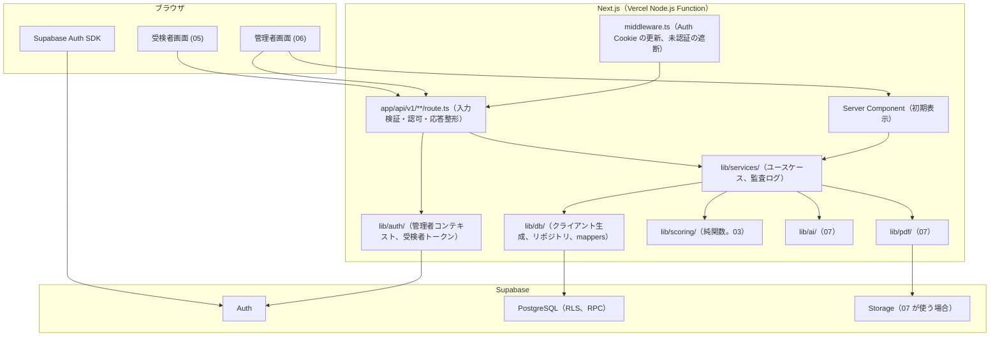
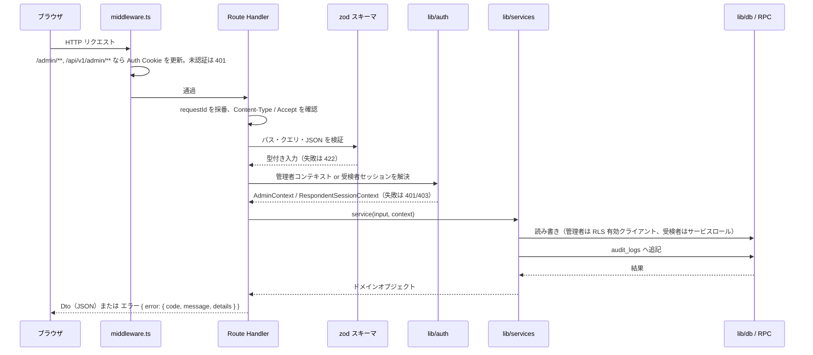
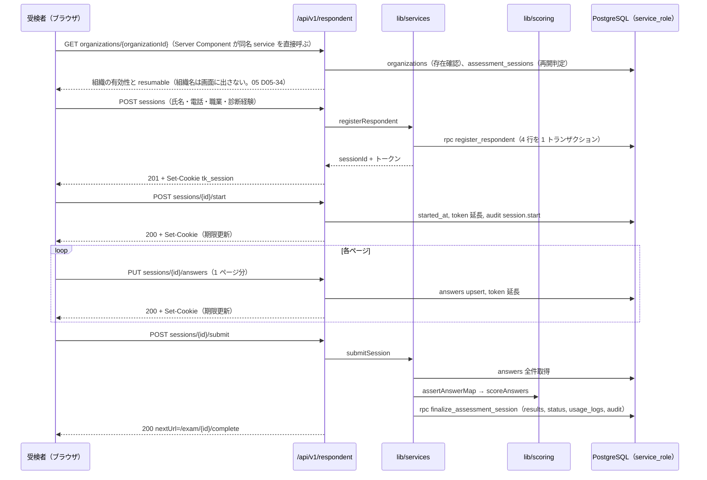
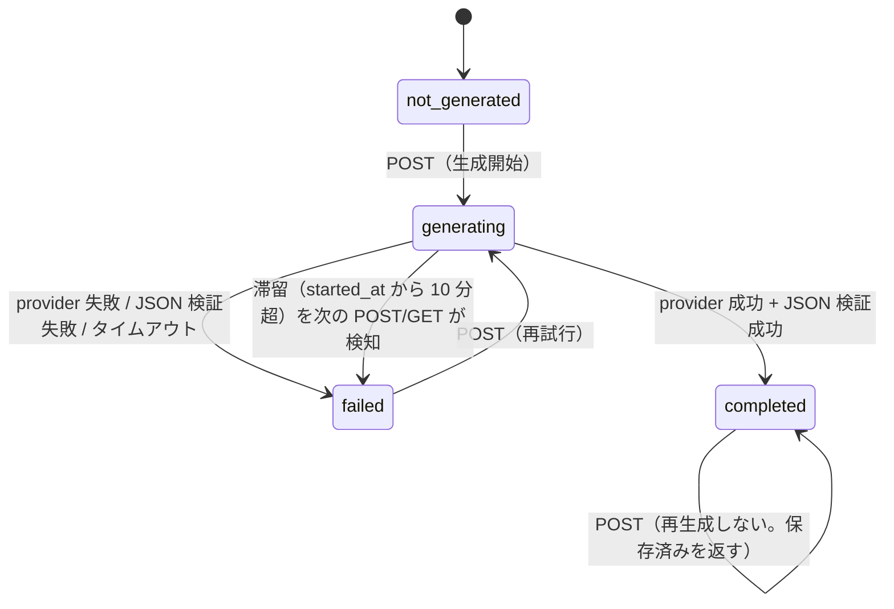
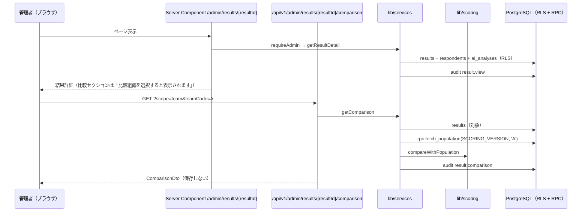
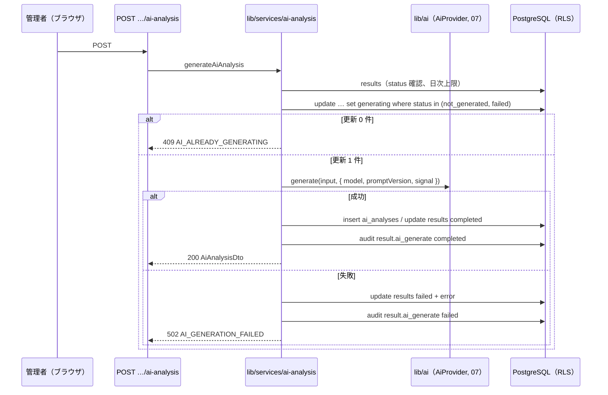

# 基本設計 04 API・サーバ処理設計

| 項目 | 内容 |
|---|---|
| 文書名 | 適性検査システム 基本設計 04 API・サーバ処理設計 |
| 版 | 1.2 |
| 作成日 | 2026-09-17（1.1 版: 2026-09-19、1.2 版: 2026-09-21。改版履歴は §12） |
| 対象 | 実装者（Route Handler、`lib/services/`、`lib/auth/`、`lib/db/` の実装担当）、05〜08 分冊の設計者 |

## 0. 本書の位置づけ

本書は、共通定義（`00_共通定義.md`。以下「00」）の §4 で「代表」として挙げたエンドポイントを **確定** し、各 API の入出力（`Dto` / `Input`）、認可、エラー、サーバ側の処理手順（`lib/services/`）、入力検証、監査ログの書き込み箇所、レート制限、長時間処理（AI 解説・PDF）の扱いを定めるものです。

- 用語・識別子・テーブル名・型名は 00 に従います。DB の列定義・RLS・RPC 関数は 02 分冊（`02_データベース設計.md`。以下「02」）、採点・比較の純関数は 03 分冊（以下「03」）、環境変数・ライブラリ・実行基盤は 01 分冊（以下「01」）が定めたものをそのまま使い、本書では参照に留めます。
- 本書の範囲外: 画面のレイアウトと文言（05・06）、AI プロンプトと PDF レイアウト（07）、テスト計画（08）。
- 本書と 00 が矛盾した場合は 00 を正とします。本書と 01〜03 の間で食い違いがある箇所は §11 の一覧に明記し、本書での採用案を示しています。
- 05〜08 が本書に依頼した API・Dto・エラーコードのうち、本書が名称や形を変えて確定したものは §10 の引き渡し事項に「読み替え」として列挙しています（API の契約は本書が正。05 §7.1、06 §8.2 の記載どおり）。

### 0.1 参照した要件

| 参照元 | 参照した内容 |
|---|---|
| 要件定義書 §3、§4 | 受検者はログイン不要、管理者はメール＋パスワード、役割（管理者・オーナー・管理者追加・スーパーアドミン） |
| 要件定義書 §5 | 業務フロー（リンク送付→登録→回答→送信→採点→閲覧→チーム・除外・削除） |
| 要件定義書 §6.1 U-01〜U-09 | 受検者登録の入力項目、職業コード、`q` / `p` パラメータ、開始画面、ページ単位の回答保存、送信時の採点、完了後遷移 |
| 要件定義書 §6.2 A-01〜A-13 | ログイン、回答一覧（列・並び順）、チーム設定、除外設定、削除、利用履歴、結果詳細、比較組織選択、AI 解説、PDF、組織内分類、アカウント、幹部データの閲覧制限 |
| 要件定義書 §6.3、§6.6 | 送信時の同期採点、AI 解説の生成状態と保存 |
| 要件定義書 §7 | 画面一覧と結果詳細のセクション構成（1〜2 リクエストで描画するための応答設計） |
| 要件定義書 §8 | データモデル（受検者・回答・結果・AI 分析・利用履歴） |
| 要件定義書 §9 | 個人情報保護（アクセスログ）、認証、性能（1〜2 リクエスト、採点 2 秒以内）、可用性（ページ単位保存・再開） |
| 要件定義書 §11 | 不具合 10 件（特に 3・6・10 番: 母集団の統一、比較値の非永続化） |
| 要件定義書 §12 | 未確認事項（中断・再開、削除ダイアログ、幹部の非表示挙動、完了画面など） |
| 付録B §9〜§10 | 比較計算の式（API で都度計算） |
| 付録C §8 | 組織内分類の集計単位（分類 × キャラクター） |
| 付録D §1〜§2 | AI 解説の入出力と JSON スキーマ（API 応答の形） |
| 付録E §7 | PDF の 2 モード |
| tests/fixtures/README.md | 比較計算の観測値（応答 JSON の項目が検証項目を網羅していること） |

### 0.2 決定事項との対応

| # | 決定事項 | 本書での対応 |
|---|---|---|
| 1 | Next.js（App Router）+ Supabase + Vercel | Route Handler（`app/api/v1/**/route.ts`）のみで API を構成（§1）。管理者 API は利用者セッションの Supabase クライアント（RLS 有効）、受検者 API はサービスロール（§2.5） |
| 2 | 不具合 10 件の修正 | 比較 API は母集団を 02 の `fetch_population()`（00 §1.11 の定義）で 1 回だけ取得し、差分・偏差・レーダー系列を同じ結果から返す（§5.4）。比較値は保存しない。優劣性・思考の傾向は 03 の純関数に委ね、API 側で値を加工しない |
| 3 | 出題は Q1〜Q144 のみ | 回答保存 API は `questionNo` 1〜144 以外を 422 で拒否（§4.4）。送信 API は Q1〜Q144 の揃いを検証（§4.5） |
| 4 | 既存データは移行しない | 移行用 API は作らない。`scoring_version` は送信時に `SCORING_VERSION` を保存 |
| 5 | AI 解説は Claude API、差し替え可能 | AI 解説 API は `lib/ai/` の `AiProvider` 経由でのみ生成し、provider 名を応答に含める（§5.9） |
| 6 | 日本語のみ、管理画面 PC 幅、受検者画面スマートフォン対応 | エラーメッセージは日本語固定。受検者 API は 1 ページ分の回答をまとめて保存し、通信回数を抑える（§4.4） |

## 1. 全体方針

### 1.1 Route Handler と Server Action の使い分け

00 §4.1 のとおり **Server Action は使いません**。ブラウザからの更新操作はすべて Route Handler（`app/api/v1/**/route.ts`）を経由します。

| 処理の種類 | 実装場所 | 理由 |
|---|---|---|
| ブラウザからの更新（登録、回答保存、送信、チーム・除外変更、削除、AI 生成、アカウント変更） | Route Handler | 入力検証・認可・監査ログ・エラー形式を 1 か所（§2）に集約し、結合テスト（08）で HTTP レベルで検証できるようにする |
| ブラウザからの再取得（比較計算、一覧の絞り込み、AI 解説の取得、PDF） | Route Handler | 同上。比較計算は都度計算のため GET で呼ぶ（00 §4.1） |
| 画面の初期表示データ | Server Component が `lib/services/` を直接呼ぶ（00 §3.3） | HTTP を経由しないことで初期描画の往復を減らす（要件定義書 §9 性能）。**Route Handler と同じ service 関数を呼ぶ** ため、認可と監査ログの挙動は API と一致する |
| 認証操作（ログイン、ログアウト、パスワード再設定メール、再設定後のパスワード更新） | ブラウザから Supabase Auth SDK（00 §4.2、01 §5.6） | `/api/v1` には置かない |
| Auth コールバック、招待受理 | `app/auth/callback/route.ts`、`app/auth/invite/route.ts`（01 D01-11） | Auth 系の Route Handler。§6 |

- 設計判断 D04-01: Server Component から service を直接呼ぶ場合も、閲覧系の監査ログ（`result.view` など）は service 内で書きます（Route Handler に書かない）。これにより、画面の初期表示でも API 経由でも同じ記録が残ります。
- 設計判断 D04-02: Route Handler の実行ランタイムはすべて Node.js（01 D01-01）。`export const runtime = "nodejs"` を各 `route.ts` に明記します。

### 1.2 層構成



| 層 | 責務 | してはいけないこと |
|---|---|---|
| Route Handler | HTTP の入出力。`Request` から入力を取り出し zod で検証（§2.3）、認可コンテキストを得て（§2.5）、service を 1 つ呼び、結果を `Dto` にして返す。例外を §2.4 のエラー応答に変換する | SQL を書く、採点・比較の計算をする、監査ログを直接書く |
| `lib/services/` | ユースケース単位の処理。トランザクション境界（RPC 呼び出し）、監査ログ、状態遷移の判定 | HTTP（`Request` / `Response`）に触れる、`process.env` を読む（01 §4.3 の `serverEnv()` 経由のみ） |
| `lib/auth/` | 管理者コンテキスト（組織 ID・役割・停止状態）の解決、受検者トークンの発行・検証 | 業務データの読み書き |
| `lib/db/` | Supabase クライアントの生成（01 §5.5）、テーブル単位のリポジトリ関数、Row ↔ ドメインの変換（`mappers/`） | 認可判定、業務ルール |
| `lib/scoring/`、`lib/masters/` | 採点・比較の純関数（03） | I/O |

### 1.3 リクエスト処理の共通の流れ



## 2. 共通仕様

### 2.1 URL・メソッド・ヘッダー

| 項目 | 規約（00 §4.1 の再掲と補足） |
|---|---|
| ベースパス | `/api/v1`。受検者用 `/api/v1/respondent/...`、管理者用 `/api/v1/admin/...` |
| メソッド | 取得 GET、作成 POST、部分更新 PATCH、全置換 PUT、削除 DELETE。GET は副作用を持たない（監査ログの追記は副作用とみなさない） |
| パスパラメータ | UUID（`{sessionId}`、`{resultId}`、`{respondentId}`、`{organizationId}`）。UUID 形式でなければ 404（存在しない扱い。設計判断 D04-03: 400 にすると ID の推測に手掛かりを与えるため） |
| クエリ・JSON キー | camelCase |
| リクエストの Content-Type | POST／PUT／PATCH は `application/json`。それ以外は 415 `UNSUPPORTED_MEDIA_TYPE` |
| 応答の Content-Type | `application/json; charset=utf-8`。PDF のみ `application/pdf` |
| 日時 | ISO 8601、UTC、`Z` 付き（例: `2026-09-17T01:23:45.678Z`） |
| 数値 | JSON の number。採点値は丸めない（03 §9）。`numeric` 列は `lib/db/mappers/` で `Number()` に変換する（02 §12） |
| 一覧応答 | `{ "items": [...], "total": n }` に加え、ページングを使う API は `page`、`pageSize` を含める（§2.2） |
| 応答ヘッダー | `X-Request-Id`（サーバが採番した UUID）。`Cache-Control: no-store`（個人情報を含むため全 API で固定） |
| リクエスト ID | `X-Request-Id` ヘッダーをクライアントが送ってきても使わず、サーバで採番する（ログの偽装防止） |
| 文字数 | 文字数の上限はコードポイント単位（`Array.from(s).length`）で数える。DB の制約（02 §3）と同じ |

### 2.2 ページング・並び替え

一覧 API（回答一覧、利用履歴）に共通です。

| パラメータ | 型 | 既定値 | 制約 |
|---|---|---|---|
| `page` | integer | 1 | 1 以上 |
| `pageSize` | integer | 50 | 1〜200 |
| `sort` | string | API ごとに定義 | 許可された列名のみ |
| `order` | `asc` / `desc` | API ごとに定義 | |

応答:

```json
{
  "items": [],
  "total": 123,
  "page": 1,
  "pageSize": 50
}
```

- 設計判断 D04-04: 既存の回答一覧は全件表示と推定されますが（要件定義書 §6.2 A-02 にページングの記載なし。未確認）、1 組織あたり数百件規模（02 §13）でも 1 リクエストで返せるよう `pageSize` の上限を 200 とし、06 分冊は初期表示で `pageSize=200` を使ってよいこととします。

### 2.3 入力検証（zod）

01 D01-03 のとおり `zod` を使います。スキーマは **Route Handler と同じディレクトリではなく `lib/services/schemas/`** に置き、Route Handler・Server Component・テストから共有します（設計判断 D04-05）。

共通スキーマ（コピー用）:

```ts
// lib/services/schemas/common.ts
import { z } from "zod";

export const uuidSchema = z.string().uuid();

/** コードポイント単位で文字数を数える */
const cpLength = (s: string): number => Array.from(s).length;

/** 前後空白を除去し、空白のみを拒否する必須文字列 */
export const requiredText = (max: number) =>
  z
    .string()
    .transform((s) => s.trim())
    .refine((s) => s.length > 0, { message: "必須項目です" })
    .refine((s) => cpLength(s) <= max, { message: `${max} 文字以内で入力してください` });

export const teamCodeSchema = z.string().regex(/^[A-Z]$/, { message: "チームは A〜Z です" });

export const choiceCodeSchema = z.union([z.literal(1), z.literal(2), z.literal(3), z.literal(4), z.literal(5)]);

export const scoredQuestionNoSchema = z.number().int().min(1).max(144);

export const pagingSchema = z.object({
  page: z.coerce.number().int().min(1).default(1),
  pageSize: z.coerce.number().int().min(1).max(200).default(50),
});

export const comparisonScopeQuerySchema = z
  .object({
    scope: z.enum(["organization", "team"]),
    teamCode: teamCodeSchema.optional(),
  })
  .superRefine((v, ctx) => {
    if (v.scope === "team" && v.teamCode === undefined) {
      ctx.addIssue({ code: z.ZodIssueCode.custom, path: ["teamCode"], message: "scope=team のときは teamCode が必要です" });
    }
    if (v.scope === "organization" && v.teamCode !== undefined) {
      ctx.addIssue({ code: z.ZodIssueCode.custom, path: ["teamCode"], message: "scope=organization のときは teamCode を指定できません" });
    }
  });

export const pdfModeSchema = z.enum(["full", "restricted"]);
```

検証の規則:

| 規則 | 内容 |
|---|---|
| 未知のキー | JSON ボディの未知キーは無視する（`z.object` の既定。`strict()` は使わない）。将来のキー追加でクライアントを壊さないため |
| 検証失敗 | 422 `VALIDATION_ERROR`。`details.issues` に `{ path: "answers[3].choiceCode", message: "..." }` の配列を入れる。**入力値そのものは `details` に含めない**（個人情報の混入防止。01 §8.6） |
| JSON 構文エラー | 400 `INVALID_JSON` |
| 電話番号 | 既存の形式検証は未確認（02 §3.4）。仮置き（設計判断 D04-06）: 前後空白を除去し、全角数字・全角ハイフンを半角に正規化したうえで、`^[0-9+()\-]{8,20}$` を満たすこと。DB には正規化後の値を保存する。表示・赤枠の条件は 05 分冊 |
| 氏名 | 1〜100 文字（02 §3.4）。文字種は制限しない |

検証エラー応答の例:

```json
{
  "error": {
    "code": "VALIDATION_ERROR",
    "message": "入力内容に誤りがあります",
    "details": {
      "issues": [
        { "path": "phoneNumber", "message": "電話番号の形式が正しくありません" },
        { "path": "occupationCode", "message": "職業を選択してください" }
      ]
    }
  }
}
```

### 2.4 エラー応答とエラーコード一覧

形式は 00 §4.1 のとおりです。`code` は本書で一覧化し、`lib/services/errors.ts` の `ApiError` クラスで表現します。

```ts
// lib/services/errors.ts
export type ApiErrorCode =
  | "INVALID_JSON" | "UNSUPPORTED_MEDIA_TYPE" | "VALIDATION_ERROR"
  | "UNAUTHENTICATED" | "RESPONDENT_TOKEN_INVALID" | "RESPONDENT_TOKEN_EXPIRED"
  | "FORBIDDEN" | "ADMIN_SUSPENDED" | "ADMIN_NOT_REGISTERED" | "ROLE_REQUIRED"
  | "NOT_FOUND" | "ORGANIZATION_NOT_FOUND" | "SESSION_NOT_FOUND" | "RESULT_NOT_FOUND" | "RESPONDENT_NOT_FOUND"
  | "SESSION_ALREADY_SUBMITTED" | "ANSWERS_INCOMPLETE" | "POPULATION_EMPTY"
  | "AI_ALREADY_GENERATING" | "AI_GENERATION_FAILED" | "AI_DAILY_LIMIT_EXCEEDED"
  | "PDF_GENERATION_FAILED" | "INVITE_TOKEN_INVALID" | "EMAIL_ALREADY_REGISTERED" | "CURRENT_PASSWORD_MISMATCH"
  | "RATE_LIMITED" | "INTERNAL_ERROR";

export class ApiError extends Error {
  constructor(
    readonly status: number,
    readonly code: ApiErrorCode,
    message: string,
    readonly details: Readonly<Record<string, unknown>> = {},
  ) {
    super(message);
    this.name = "ApiError";
  }
}
```

| HTTP | `code` | `message`（日本語。この文言を返す） | 発生箇所 |
|---:|---|---|---|
| 400 | `INVALID_JSON` | リクエスト本文を JSON として読み取れません | 全 POST／PUT／PATCH |
| 415 | `UNSUPPORTED_MEDIA_TYPE` | Content-Type は application/json を指定してください | 同上 |
| 422 | `VALIDATION_ERROR` | 入力内容に誤りがあります | 全 API（`details.issues`） |
| 401 | `UNAUTHENTICATED` | ログインが必要です | 管理者 API（Auth セッションなし） |
| 401 | `RESPONDENT_TOKEN_INVALID` | 受検セッションを確認できません。受検リンクから登録し直してください | 受検者 API（Cookie なし・不一致） |
| 401 | `RESPONDENT_TOKEN_EXPIRED` | 受検セッションの有効期限が切れました。受検リンクから登録し直してください | 受検者 API（期限切れ） |
| 403 | `FORBIDDEN` | この操作を行う権限がありません | 汎用 |
| 403 | `ADMIN_SUSPENDED` | このアカウントは利用停止中です | `admin_users.is_suspended = true` または `deleted_at` 設定済み |
| 403 | `ADMIN_NOT_REGISTERED` | 管理者として登録されていません | Auth にはいるが `admin_users` に行がない |
| 403 | `ROLE_REQUIRED` | この操作にはオーナー権限が必要です | owner／super_admin 限定 API を admin が呼んだ |
| 404 | `NOT_FOUND` | 指定されたリソースが見つかりません | UUID 形式不正、未定義パス |
| 404 | `ORGANIZATION_NOT_FOUND` | 受検リンクが無効です。管理者にお問い合わせください | 受検者登録（組織なし・論理削除済み） |
| 404 | `SESSION_NOT_FOUND` | 受検セッションが見つかりません | 送信 API のみ（RPC `finalize_assessment_session()` の例外を変換。§4.5 手順 6）。Cookie とセッション ID の検証（§2.5.2）では行が無い場合も 401 `RESPONDENT_TOKEN_INVALID` に統一し、このコードは返さない |
| 404 | `RESULT_NOT_FOUND` | 診断結果が見つかりません | 管理者 API（他組織・削除済み・admin に対する幹部データを含む） |
| 404 | `RESPONDENT_NOT_FOUND` | 受検者が見つかりません | 管理者 API（同上） |
| 409 | `SESSION_ALREADY_SUBMITTED` | この受検はすでに送信済みです | 回答保存・送信・開始 |
| 422 | `ANSWERS_INCOMPLETE` | 未回答の設問があります | 送信（`details.missing` に設問番号の配列） |
| 409 | `POPULATION_EMPTY` | 比較対象となる受検者がいません | 比較計算（母集団 0 件。03 D3-08） |
| 409 | `AI_ALREADY_GENERATING` | AI 解説を生成中です。しばらくしてから再度お試しください | AI 生成 |
| 502 | `AI_GENERATION_FAILED` | AI 解説の生成に失敗しました。再度お試しください | AI 生成（provider エラー・JSON 検証失敗・タイムアウト） |
| 429 | `AI_DAILY_LIMIT_EXCEEDED` | 本日の AI 解説の生成回数の上限に達しました | AI 生成（01 D01-17） |
| 500 | `PDF_GENERATION_FAILED` | PDF の生成に失敗しました。再度お試しください | PDF |
| 404 | `INVITE_TOKEN_INVALID` | 管理者追加用リンクが無効です。管理者に新しいリンクを発行してもらってください | 招待受理 |
| 409 | `EMAIL_ALREADY_REGISTERED` | このメールアドレスはすでに登録されています | 招待受理、メール変更 |
| 422 | `CURRENT_PASSWORD_MISMATCH` | 現在のパスワードが正しくありません | パスワード変更 |
| 429 | `RATE_LIMITED` | アクセスが集中しています。しばらくしてから再度お試しください | レート制限（§2.8） |
| 500 | `INTERNAL_ERROR` | サーバ内部でエラーが発生しました | 予期しない例外。`details` は空、`X-Request-Id` で追跡 |

- 設計判断 D04-07: 他組織のリソース、論理削除済みのリソース、`admin` が見られない幹部（`executive`）のリソースは、いずれも **404** で返し、403 と区別しません（存在自体を見せない。00 §5、02 D02-06）。
- 設計判断 D04-08: `AI_GENERATION_FAILED` は 502（上流エラー）にします。500 と区別することで、監視（01 §9）で自システムの障害と外部 API の障害を分けて数えられます。
- `message` は画面にそのまま表示できる日本語にします（06・05 分冊は原則としてこの文言を表示し、必要なら上書きします）。個人情報・トークン・SQL・スタックトレースを含めません。
- 05 §7.1 が仮称として挙げた 401 `UNAUTHORIZED` は採用せず、`RESPONDENT_TOKEN_INVALID`（Cookie なし・不一致・行なし）と `RESPONDENT_TOKEN_EXPIRED`（期限切れ）の 2 つに分けます（設計判断 D04-42: 画面の表示は同じ E-04 でよいが、期限切れは「登録し直し」の案内、それ以外は「受検リンクから開き直す」の案内に分けられるようにする）。05 §7.1・§9・D05-26 の読み替えは §10 に列挙します。

### 2.5 認可の共通処理（`lib/auth/`）

#### 2.5.1 管理者コンテキスト

```ts
// lib/auth/admin-context.ts
import type { AdminRole } from "@/lib/db/types";
import type { SupabaseClient } from "@supabase/supabase-js";
import type { Database } from "@/lib/db/database.types";

export interface AdminContext {
  readonly adminUserId: string;          // auth.users.id = admin_users.id
  readonly organizationId: string;
  readonly role: AdminRole;              // "owner" | "admin" | "super_admin"
  readonly canViewExecutives: boolean;   // role が owner または super_admin（00 §5、D-14）
  readonly email: string;                // auth.users.email（表示用。02 D02-01）
  readonly name: string;                 // admin_users.name
  readonly supabase: SupabaseClient<Database>; // 利用者セッションのクライアント（RLS 有効。01 §5.5 createUserClient）
  readonly request: RequestMeta;         // §2.6 の監査ログ用
}

export interface RequestMeta {
  readonly requestId: string;
  readonly ipAddress: string | null;     // x-forwarded-for の先頭（02 §3.12）
  readonly userAgent: string | null;     // 500 文字で切り詰め
}

/**
 * Auth セッションから管理者コンテキストを解決する。
 * - セッションなし → ApiError(401, UNAUTHENTICATED)
 * - admin_users に行がない → ApiError(403, ADMIN_NOT_REGISTERED)
 * - is_suspended または deleted_at → ApiError(403, ADMIN_SUSPENDED)
 */
export async function requireAdmin(request: Request): Promise<AdminContext>;

/**
 * Server Component 用（引数なし）。Cookie は createUserClient() が next/headers の cookies() から読み、
 * RequestMeta は headers() から組み立てる（requestId は採番）。判定は Request 版と同じ（§8.3）。
 */
export async function requireAdmin(): Promise<AdminContext>;

/** owner / super_admin 以外なら ApiError(403, ROLE_REQUIRED) */
export function requireOwner(ctx: AdminContext): AdminContext;
```

処理手順（`requireAdmin`）:

1. `createUserClient()`（01 §5.5）で `supabase.auth.getUser()` を呼び、ユーザーがなければ 401。`getSession()` ではなく `getUser()` を使う（Cookie 改ざん対策として Auth サーバで検証させる）。
2. `admin_users` を `id = auth.uid()` で 1 行取得する。RLS ポリシー `admin_users_select_self_or_owner`（02 §6.3）は停止・削除済みの管理者には行を返さないため、行がない場合は次のどちらかを判定する: サービスロールで `admin_users` を `id` で引き、行が存在して `is_suspended` または `deleted_at` なら `ADMIN_SUSPENDED`、行が無ければ `ADMIN_NOT_REGISTERED`（設計判断 D04-09: 利用停止であることを本人に伝えるため、この判定に限りサービスロールを使う。返す情報は状態のみ）。
3. `canViewExecutives = role in ("owner", "super_admin")`。
4. `RequestMeta` を組み立てる。

- 幹部データの非表示は **RLS（02 §6.3）が担保** し、アプリ層では追加の絞り込みをしません。ただし、応答に `kind` を含める API（一覧・詳細）は、`admin` が `executive` の行を受け取らないことを結合テストで確認します（08）。
- `super_admin` は `owner` と同じ扱いです（00 D-14、02 D02-23）。

#### 2.5.2 受検者セッションコンテキスト

02 §7.4 と 01 §5.7 の仕様を実装します。

```ts
// lib/auth/respondent-token.ts（02 §7.4 の契約を実装）
import { createHash, randomBytes } from "node:crypto";

export const RESPONDENT_COOKIE_NAME = "tk_session";                 // 01 §5.7
export const RESPONDENT_TOKEN_TTL_MS = 7 * 24 * 60 * 60 * 1000;      // 7 日（02 D02-13。§11 D04-10）

export interface IssuedRespondentToken {
  readonly token: string;      // base64url 43 文字
  readonly tokenHash: string;  // sha256 hex 64 文字
  readonly expiresAt: Date;
}

export function issueRespondentToken(now: Date): IssuedRespondentToken {
  const token = randomBytes(32).toString("base64url");
  return { token, tokenHash: hashRespondentToken(token), expiresAt: new Date(now.getTime() + RESPONDENT_TOKEN_TTL_MS) };
}

export function hashRespondentToken(token: string): string {
  return createHash("sha256").update(token, "utf8").digest("hex");
}

/** Set-Cookie の属性（01 §5.7）。ローカルのみ Secure を外す */
export function respondentCookieOptions(expiresAt: Date, isLocal: boolean) {
  return { name: RESPONDENT_COOKIE_NAME, httpOnly: true, secure: !isLocal, sameSite: "lax" as const, path: "/", expires: expiresAt };
}
```

```ts
// lib/auth/respondent-session.ts
import type { SessionStatusValue, RespondentKindValue } from "@/lib/db/types";

export interface RespondentSessionContext {
  readonly sessionId: string;
  readonly organizationId: string;
  readonly respondentId: string;
  readonly kind: RespondentKindValue;
  readonly status: SessionStatusValue;   // draft | submitted
  readonly tokenExpiresAt: Date;
  readonly request: RequestMeta;
}

/**
 * Cookie のトークンと {sessionId} の組を検証する。
 * - Cookie なし → 401 RESPONDENT_TOKEN_INVALID
 * - 行なし（id と hash の不一致、deleted_at あり）→ 401 RESPONDENT_TOKEN_INVALID
 * - token_expires_at <= now → 401 RESPONDENT_TOKEN_EXPIRED
 * status の判定（draft 必須）は呼び出し側の service が行う（GET は submitted でも許可するため）
 */
export async function requireRespondentSession(request: Request, sessionId: string): Promise<RespondentSessionContext>;

/**
 * Server Component 用。next/headers の cookies() から tk_session を読む以外は requireRespondentSession と同じ。
 * 05 §1.3 の判定表（R-02〜R-05 の初期表示）が呼ぶ。RequestMeta は headers() から組み立てる（requestId は採番）。
 */
export async function requireRespondentSessionFromCookies(sessionId: string): Promise<RespondentSessionContext>;

/**
 * 受検リンク（/exam?q&p）を開き直したときの再開判定（05 §6.3 の ResumeBanner）。
 * Cookie のトークンだけから assessment_sessions を 1 行引き、
 * 「organization_id と kind が一致」「status = draft」「deleted_at is null」「token_expires_at > now()」のときだけ sessionId を返す。
 * それ以外（Cookie なし・行なし・別組織・別区分・submitted・期限切れ）は null を返し、例外を投げない。個人情報は返さない。
 */
export async function findResumableSession(
  cookieToken: string | null,
  organizationId: string,
  kind: RespondentKindValue,
): Promise<{ readonly sessionId: string; readonly answeredCount: number } | null>;
```

処理手順（`requireRespondentSession`）:

1. `sessionId` が UUID でなければ 404 `NOT_FOUND`。
2. Cookie `tk_session` を読み、無ければ 401 `RESPONDENT_TOKEN_INVALID`。
3. `hashRespondentToken(token)` を計算し、サービスロールで `assessment_sessions` を `id = sessionId and resume_token_hash = hash and deleted_at is null` で 1 行取得。無ければ 401 `RESPONDENT_TOKEN_INVALID`（`sessionId` の存在有無を区別しない。404 `SESSION_NOT_FOUND` は返さない）。
4. `token_expires_at <= now()` なら 401 `RESPONDENT_TOKEN_EXPIRED`。
5. `respondents` から `kind` を取得してコンテキストを返す。

処理手順（`findResumableSession`。設計判断 D04-43）:

1. `cookieToken` が無ければ `null`。
2. `hashRespondentToken(cookieToken)` で `assessment_sessions` を `resume_token_hash = hash and deleted_at is null` で 1 行取得（`resume_token_hash` は UNIQUE。02 §3.6）。無ければ `null`。
3. `organization_id = organizationId`、`status = 'draft'`、`token_expires_at > now()` を満たさなければ `null`。
4. `respondents.kind = kind` でなければ `null`（05 §6.3: 区分の取り違えを防ぐ）。
5. `answers` の件数を数え、`{ sessionId, answeredCount }` を返す（05 の `ResumeBanner` は `sessionId` だけを使う。`answeredCount` は「n 問まで回答済み」の表示用で、氏名などは含めない）。

- 受検者 API はサービスロール（RLS バイパス）で動くため、**全ての読み書きを `sessionId` 1 件に限定** し、`organization_id` はコンテキストの値を使います（01 §8.2、00 D-23）。リクエストで組織 ID を受け取るのは登録 API（§4.2）と受検リンク検証 API（§4.1。`findResumableSession` を呼ぶ）だけです。
- `findResumableSession` は Cookie の所持者が「自分の」`draft` セッションを見つけるだけの関数で、`sessionId` を返した後の実際の再開は `requireRespondentSession` の通常の検証（トークン一致）を経ます。トークンを持たない第三者は `sessionId` を得られません。

### 2.6 監査ログ（`lib/services/audit.ts`）

02 §8.6 の表のうち「書き手 04」の行を本書の service が書きます。DB 関数が書くもの（`respondent.delete`、`session.submit`、`organization.rotate_invite_token`）は service から書きません。

```ts
// lib/services/audit.ts
import type { SupabaseClient } from "@supabase/supabase-js";
import type { Database } from "@/lib/db/database.types";
import type { RequestMeta } from "@/lib/auth/admin-context";

export type AuditAction =
  | "respondent.register" | "session.start"
  | "admin.signup" | "admin.login"
  | "result.list" | "result.view" | "result.comparison" | "result.ai_generate" | "result.pdf_export"
  | "respondent.update_team" | "respondent.update_exclusion"
  | "usage_log.view" | "classification.view" | "account.update";

export interface AuditEntry {
  readonly organizationId: string;
  readonly actorKind: "admin" | "respondent" | "system";
  readonly actorId: string | null;
  readonly action: AuditAction;
  readonly targetTable: string | null;
  readonly targetId: string | null;
  readonly details: AuditDetails;
  readonly request: RequestMeta;
}

/** details の値は文字列・数値・真偽値・null か、それらの配列（例: account.update の fields）。ネストしたオブジェクトは入れない */
export type AuditDetailValue = string | number | boolean | null;
export type AuditDetails = Readonly<Record<string, AuditDetailValue | ReadonlyArray<AuditDetailValue>>>;

/** 追記専用。失敗しても業務処理は成功させる（ログに warn を出す）。設計判断 D04-11 */
export async function writeAuditLog(client: SupabaseClient<Database>, entry: AuditEntry): Promise<void>;
```

| 規則 | 内容 |
|---|---|
| 書き込みクライアント | 管理者の操作は **利用者セッションのクライアント**（RLS ポリシー `audit_logs_insert_self` により `actor_id = auth.uid()` が強制される。02 §6.3）。受検者の操作はサービスロール |
| タイミング | 更新系は本処理の **成功後**。閲覧系（`result.view` など）はデータ取得の成功後。失敗した操作は記録しない（失敗はアプリログ、01 §8.6） |
| 失敗時 | 監査ログの INSERT が失敗しても本処理の応答は変えない（設計判断 D04-11: 閲覧をログ障害で止めない。ただし `logger.warn` で `requestId` とともに記録し、監視対象にする） |
| `details` | 個人情報を入れない（02 §8.6）。値は `{ before, after }` のように列の値だけ。配列は `account.update` の `fields`（02 §8.6 の例 `{ "fields": ["name"] }`）のように文字列の配列に限る（`AuditDetails` 型） |
| `admin.signup` | 招待受理 `POST /auth/invite`（§6.2）がサービスロールで書く（`actor_kind = 'admin'`、`actor_id` = 作成した Auth ユーザーの ID。設計判断 D04-36 改）。`login-events`（§5.1）では書かない |
| `ip_address` | `x-forwarded-for` の先頭要素を `inet` に変換できる場合のみ設定。変換できなければ NULL |
| `session.start` | 02 §8.6 に無い action を本書で追加（受検開始「開始する」の記録。設計判断 D04-12）。02 の `ck_audit_logs_action`（`^[a-z_]+\.[a-z_]+$`）を満たす |

### 2.7 ログ

01 §8.6 の `logger` を使い、Route Handler の入口と出口で次を 1 行ずつ出します。

```json
{ "level": "info", "message": "request.end", "requestId": "…", "route": "/api/v1/admin/results/[resultId]/comparison", "method": "GET", "status": 200, "durationMs": 38, "organizationId": "…", "adminUserId": "…", "resultId": "…" }
```

- リクエストボディ・応答ボディ・Cookie・クエリの文字列値（`q` の検索語を含む）は出しません。
- `ApiError` は `status >= 500` のときだけ `error` レベル、それ以外は `info` に `code` を含めます。

### 2.8 レート制限

01 §8.4 の方針を実装に落とします。Vercel Firewall（基盤側）に加えて、アプリ側で判定するものは次の 2 つです。

| 対象 | 判定方法 | 上限（仮置き） | 応答 |
|---|---|---|---|
| 受検者登録 `POST /api/v1/respondent/sessions` | `audit_logs` を `organization_id = 対象組織 and action = 'respondent.register' and ip_address = 接続元 and created_at > now() − 10 分` で件数取得（サービスロール）。02 に `created_ip_hash` 列が無いため、01 D01-16 の「IP ハッシュ列」の代わりに **監査ログの `ip_address` 列を使う**（設計判断 D04-13。02 への列追加は不要） | 20 件 / 10 分 / IP / 組織（01 D01-16） | 429 `RATE_LIMITED`、`Retry-After: 600` |
| AI 解説生成 `POST …/ai-analysis` | `ai_analyses` を `organization_id = 自組織 and generated_at >= 当日 00:00（Asia/Tokyo）` で件数取得（RLS 経由。幹部分は admin には見えないが、上限判定の誤差として許容） | 200 件 / 日 / 組織（01 D01-17。依頼主確認） | 429 `AI_DAILY_LIMIT_EXCEEDED` |

- `ip_address` が取得できない（NULL）場合はアプリ側の登録レート制限を適用しません（Firewall 側に委ねる）。
- 回答保存・送信・PDF・一覧は Firewall のみ（01 §8.4）。

### 2.9 Vercel の実行時間制限と `maxDuration`

01 §5.4 のとおり `route.ts` に `export const maxDuration` を書きます。

| Route Handler | `maxDuration` | 本書での扱い |
|---|---|---|
| `POST …/ai-analysis` | 300 | 同期方式（§7.1）。応答を待つ間ブラウザは「生成中」を表示 |
| `GET …/pdf` | 120 | 同期生成してストリーム返却（§7.2） |
| `POST …/submit` | 既定（10 秒） | 採点は数十 ms（03 §10.9）。RPC 1 回 |
| その他 | 既定 | |

### 2.10 Route Handler の雛形

全ての `route.ts` はこの形に揃えます（設計判断 D04-14: 共通ラッパー `handle()` で採番・ログ・エラー変換を一元化）。

```ts
// lib/services/http.ts
import { NextResponse } from "next/server";
import { randomUUID } from "node:crypto";
import { ZodError } from "zod";
import { ApiError } from "@/lib/services/errors";
import { logger } from "@/lib/utils/logger";
import type { RequestMeta } from "@/lib/auth/admin-context";

export function requestMeta(request: Request): RequestMeta {
  const forwarded = request.headers.get("x-forwarded-for");
  const ip = forwarded ? forwarded.split(",")[0]?.trim() ?? null : null;
  const ua = request.headers.get("user-agent");
  return { requestId: randomUUID(), ipAddress: ip && ip.length > 0 ? ip : null, userAgent: ua ? ua.slice(0, 500) : null };
}

export async function readJson<T>(request: Request, parse: (input: unknown) => T): Promise<T> {
  const ct = request.headers.get("content-type") ?? "";
  if (!ct.toLowerCase().startsWith("application/json")) {
    throw new ApiError(415, "UNSUPPORTED_MEDIA_TYPE", "Content-Type は application/json を指定してください");
  }
  let body: unknown;
  try {
    body = await request.json();
  } catch {
    throw new ApiError(400, "INVALID_JSON", "リクエスト本文を JSON として読み取れません");
  }
  return parse(body);
}

export function json<T>(meta: RequestMeta, body: T, init: { status?: number; headers?: Record<string, string> } = {}) {
  return NextResponse.json(body, {
    status: init.status ?? 200,
    headers: { "Cache-Control": "no-store", "X-Request-Id": meta.requestId, ...init.headers },
  });
}

export async function handle(request: Request, route: string, fn: (meta: RequestMeta) => Promise<Response>): Promise<Response> {
  const meta = requestMeta(request);
  const started = Date.now();
  try {
    const res = await fn(meta);
    logger.info("request.end", { requestId: meta.requestId, route, method: request.method, status: res.status, durationMs: Date.now() - started });
    return res;
  } catch (e: unknown) {
    const err = toApiError(e);
    const level = err.status >= 500 ? "error" : "info";
    logger[level]("request.error", { requestId: meta.requestId, route, method: request.method, status: err.status, code: err.code, durationMs: Date.now() - started });
    return json(meta, { error: { code: err.code, message: err.message, details: err.details } }, { status: err.status });
  }
}

function toApiError(e: unknown): ApiError {
  if (e instanceof ApiError) return e;
  if (e instanceof ZodError) {
    const issues = e.issues.map((i) => ({ path: i.path.join("."), message: i.message }));
    return new ApiError(422, "VALIDATION_ERROR", "入力内容に誤りがあります", { issues });
  }
  return new ApiError(500, "INTERNAL_ERROR", "サーバ内部でエラーが発生しました");
}
```

```ts
// app/api/v1/admin/results/[resultId]/comparison/route.ts（例）
import { handle, json } from "@/lib/services/http";
import { requireAdmin } from "@/lib/auth/admin-context";
import { comparisonScopeQuerySchema, uuidSchema } from "@/lib/services/schemas/common";
import { getComparison } from "@/lib/services/comparison";
import { ApiError } from "@/lib/services/errors";

export const runtime = "nodejs";

export async function GET(request: Request, { params }: { params: Promise<{ resultId: string }> }) {
  return handle(request, "/api/v1/admin/results/[resultId]/comparison", async (meta) => {
    const { resultId } = await params;
    if (!uuidSchema.safeParse(resultId).success) throw new ApiError(404, "NOT_FOUND", "指定されたリソースが見つかりません");
    const url = new URL(request.url);
    const query = comparisonScopeQuerySchema.parse(Object.fromEntries(url.searchParams));
    const ctx = await requireAdmin(request);
    const dto = await getComparison(ctx, { resultId, scope: query.scope === "team" ? { kind: "team", teamCode: query.teamCode! } : { kind: "organization" } });
    return json(meta, dto);
  });
}
```

- `teamCode!` の非 null 断言は `superRefine` で保証済みの箇所に限って許可します（Lint の `no-non-null-assertion` をこの行だけ無効化するより、`comparisonScopeQuerySchema` の `transform` で `ComparisonScope` に変換する実装を推奨）。

## 3. エンドポイント一覧（確定）

00 §4.2 の「代表」を確定し、本書で追加したものに「追加」を付けます。

### 3.1 受検者用（ログイン不要）

| メソッド | パス | 用途 | 認可 | 節 |
|---|---|---|---|---|
| GET | `/api/v1/respondent/organizations/{organizationId}` | 受検リンクの検証（組織名の取得）。追加 | なし（組織 ID の知識のみ） | §4.1 |
| POST | `/api/v1/respondent/sessions` | 受検者登録とセッション作成。Cookie 発行 | なし（レート制限あり） | §4.2 |
| GET | `/api/v1/respondent/sessions/{sessionId}` | 進行状態と保存済み回答の取得（再開） | セッショントークン | §4.3 |
| POST | `/api/v1/respondent/sessions/{sessionId}/start` | 「開始する」の記録。追加 | セッショントークン、`draft` | §4.3 |
| PUT | `/api/v1/respondent/sessions/{sessionId}/answers` | ページ単位の回答保存（上書き） | セッショントークン、`draft` | §4.4 |
| POST | `/api/v1/respondent/sessions/{sessionId}/submit` | 送信・採点・結果保存 | セッショントークン、`draft` | §4.5 |

### 3.2 管理者用（Supabase Auth 必須）

| メソッド | パス | 用途 | 認可 | 節 |
|---|---|---|---|---|
| GET | `/api/v1/admin/me` | ログイン中の管理者と組織情報、3 種のリンク | admin 以上 | §5.1 |
| PATCH | `/api/v1/admin/me` | 氏名・メールアドレス・パスワードの変更 | admin 以上 | §5.1 |
| POST | `/api/v1/admin/me/login-events` | ログイン成功の記録（`admin.login`）。追加 | admin 以上 | §5.1 |
| POST | `/api/v1/admin/organization/invite-token` | 管理者追加用リンクの再発行。追加（02 D02-02） | owner／super_admin | §5.2 |
| GET | `/api/v1/admin/admin-users` | 同一組織の管理者一覧（アカウント画面 M-07。06 D06-20 の依頼）。追加 | owner／super_admin | §5.11 |
| GET | `/api/v1/admin/results` | 回答一覧（検索・並び替え・チーム・除外の絞り込み） | admin 以上（幹部は owner のみ） | §5.3 |
| GET | `/api/v1/admin/results/{resultId}` | 結果詳細（全指標・受検者情報・AI 解説の状態と本文） | 同上 | §5.4 |
| GET | `/api/v1/admin/results/{resultId}/comparison` | 比較計算（都度計算、非永続化） | 同上 | §5.5 |
| PATCH | `/api/v1/admin/respondents/{respondentId}` | チーム・除外フラグの更新 | 同上 | §5.6 |
| DELETE | `/api/v1/admin/respondents/{respondentId}` | 削除（論理削除） | 同上 | §5.6 |
| GET | `/api/v1/admin/classification` | 組織内分類（分類 × タイプの人数と該当者） | 同上 | §5.7 |
| GET | `/api/v1/admin/usage-logs` | 利用履歴 | 同上 | §5.8 |
| POST | `/api/v1/admin/results/{resultId}/ai-analysis` | AI 解説の生成（生成済みなら保存済みを返す） | 同上 | §5.9 |
| GET | `/api/v1/admin/results/{resultId}/ai-analysis` | AI 解説の取得（状態のポーリングにも使う） | 同上 | §5.9 |
| GET | `/api/v1/admin/results/{resultId}/pdf` | PDF 出力（`mode=full` / `restricted`） | 同上 | §5.10 |

### 3.3 認証系（`/api/v1` の外）

| メソッド | パス | 用途 | 節 |
|---|---|---|---|
| GET | `/auth/callback` | Supabase Auth のコード→セッション交換（パスワード再設定・メール確認） | §6.1 |
| POST | `/auth/invite` | 招待トークンによる管理者追加（01 D01-11） | §6.2 |

- 役割変更・利用停止・管理者削除の API は本フェーズでは **提供しません**（§5.12。02 §7.5 の運用者対応）。
- 受検者登録（`POST /api/v1/respondent/sessions`）は要件定義書 §6.2 A-12 の「受検リンク発行」に対応する管理者側の操作を **必要としません**。受検リンクは組織 ID から `GET /api/v1/admin/me` が組み立てて返す固定 URL であり（00 §3.7）、受検者ごとの事前登録はありません（要件定義書 §5 の業務フロー）。

## 4. 受検者 API

受検者 API はすべてサービスロールのクライアント（01 §5.5 `createServiceClient()`）で DB にアクセスします（00 D-23）。

### 4.1 受検リンクの検証 `GET /api/v1/respondent/organizations/{organizationId}`

受検者登録画面（S-02）が無効なリンクの判定（フォームを出さない）と再開可能セッションの検索（`resumable`）に使います（05 §5.1.1、§6.3）。応答の `organizationName` は 05 の画面では表示しません（05 D05-34。値は返すが描画しない）。Server Component は同名の service `getOrganizationForAssessment` を直接呼び、ブラウザからこの API を呼ぶことはありません（05 §7.1）。

| 項目 | 内容 |
|---|---|
| 認可 | なし |
| パス | `organizationId`: UUID |
| クエリ | `kind`: `applicant` / `executive`（省略可。URL の `p=user` → `applicant`、`p=executives` → `executive` への変換は 05 分冊の画面側で行う。00 D-12） |
| 処理 | `organizations` を `id = organizationId and deleted_at is null` で取得。無ければ 404 `ORGANIZATION_NOT_FOUND`。あわせて Cookie `tk_session` があれば `findResumableSession(cookieToken, organizationId, kind)`（§2.5.2）を呼び、再開可能な `draft` セッションを `resumable` に入れる（`kind` 省略時は `applicant` として判定） |
| 監査ログ | なし |

レスポンス（200）:

```json
{
  "organizationId": "8f0b4b6e-2f0e-4a1c-9c56-1d7d9b1a2c33",
  "organizationName": "サンプル歯科医院",
  "kind": "applicant",
  "resumable": { "sessionId": "c1d2e3f4-5a6b-4c7d-8e9f-0a1b2c3d4e5f", "answeredCount": 57 }
}
```

- `resumable` は再開できるセッションが無いとき `null`。05 §6.3 の `ResumeBanner` はこの値で表示を決めます（Server Component で初期表示するときは同名の service `getOrganizationForAssessment` が `cookies()` からトークンを読んで同じ判定をします。§8.3）。
- Cookie が無効・別組織・別区分・送信済み・期限切れのいずれでも `resumable: null` を返し、エラーにはしません（受検リンクの検証自体は成功しているため）。

エラー:

| HTTP | code | 条件 |
|---:|---|---|
| 404 | `NOT_FOUND` | `organizationId` が UUID でない |
| 404 | `ORGANIZATION_NOT_FOUND` | 組織なし・論理削除済み |
| 422 | `VALIDATION_ERROR` | `kind` が `applicant` / `executive` 以外 |

- 01 D01-27 の `organizations.is_active`（受付停止）は 02 が **追加しないと確定** しました（02 §3.2 D02-27）。本書は `deleted_at is null` のみで判定します。受付停止は組織の論理削除で行います（§11 D04-15。1.2 版で保留を解消）。

### 4.2 受検者登録 `POST /api/v1/respondent/sessions`

要件定義書 §6.1 U-01〜U-03、§8.2、§8.7 に対応します。

| 項目 | 内容 |
|---|---|
| 認可 | なし。レート制限あり（§2.8） |
| 前提 | 組織が存在し論理削除されていない |
| 処理 | 1 トランザクションで `respondents`、`assessment_sessions`、`usage_logs`、`audit_logs` に 1 行ずつ作成（§4.2.2 の RPC）。応答で Cookie `tk_session` を発行 |
| 監査ログ | `respondent.register`（actor `respondent`、`details: { kind }`）。RPC 内で書く |

リクエスト:

```json
{
  "organizationId": "8f0b4b6e-2f0e-4a1c-9c56-1d7d9b1a2c33",
  "kind": "applicant",
  "name": "山田 太郎",
  "phoneNumber": "090-1234-5678",
  "occupationCode": 2,
  "diagnosisExperience": "first_time"
}
```

zod スキーマ:

```ts
// lib/utils/phone-number.ts（I/O なし・依存なし。04 の zod スキーマと 05 の画面側検証が同じ実装を共有する。05 D05-16）
export const PHONE_PATTERN = /^[0-9+()\-]{8,20}$/;

/** 全角数字・全角ハイフン類を半角に正規化する（設計判断 D04-06） */
export function normalizePhoneNumber(raw: string): string {
  return raw
    .trim()
    .replace(/[０-９]/g, (c) => String.fromCharCode(c.charCodeAt(0) - 0xfee0))
    .replace(/[－‐‑–—ー]/g, "-")
    .replace(/[（]/g, "(")
    .replace(/[）]/g, ")")
    .replace(/\s+/g, "");
}
```

```ts
// lib/services/schemas/respondent.ts
import { z } from "zod";
import { requiredText, uuidSchema } from "./common";
import { normalizePhoneNumber, PHONE_PATTERN } from "@/lib/utils/phone-number";   // 1.2 版: 実体を lib/utils/ に移し、05 と共有（D05-16）

export const registerRespondentInputSchema = z.object({
  organizationId: uuidSchema,
  kind: z.enum(["applicant", "executive"]),
  name: requiredText(100),
  phoneNumber: z
    .string()
    .transform(normalizePhoneNumber)
    .refine((s) => PHONE_PATTERN.test(s), { message: "電話番号の形式が正しくありません" }),
  occupationCode: z.number().int().min(1).max(9),
  diagnosisExperience: z.enum(["first_time", "experienced"]),
});
export type RegisterRespondentInput = z.infer<typeof registerRespondentInputSchema>;
```

レスポンス（201）と `Set-Cookie`:

```json
{
  "sessionId": "c1d2e3f4-5a6b-4c7d-8e9f-0a1b2c3d4e5f",
  "organizationId": "8f0b4b6e-2f0e-4a1c-9c56-1d7d9b1a2c33",
  "kind": "applicant",
  "status": "draft",
  "tokenExpiresAt": "2026-09-24T01:23:45.678Z",
  "nextUrl": "/exam/c1d2e3f4-5a6b-4c7d-8e9f-0a1b2c3d4e5f"
}
```

```text
Set-Cookie: tk_session=<base64url 43 文字>; Path=/; Expires=<tokenExpiresAt>; HttpOnly; Secure; SameSite=Lax
```

エラー:

| HTTP | code | 条件 |
|---:|---|---|
| 422 | `VALIDATION_ERROR` | 必須欠落、形式不正 |
| 404 | `ORGANIZATION_NOT_FOUND` | 組織なし・論理削除済み |
| 429 | `RATE_LIMITED` | 同一組織・同一 IP で 10 分に 20 件超 |

#### 4.2.1 処理手順（`lib/services/respondent-registration.ts`）

```ts
export async function registerRespondent(input: RegisterRespondentInput, request: RequestMeta): Promise<{
  readonly sessionId: string; readonly organizationId: string; readonly kind: RespondentKindValue;
  readonly issued: IssuedRespondentToken;
}>;
```

1. `organizations` を検証（§4.1 と同じ条件）。
2. レート制限の判定（§2.8）。
3. `issueRespondentToken(now)` でトークンを発行。
4. RPC `register_respondent()`（§4.2.2）を呼び、`respondent_id` と `session_id` を得る。
5. 応答に Cookie を付けて返す。**生のトークンは応答ボディに含めない**（Cookie のみ。02 §7.4）。

- 推定: 既存では受検者が登録のたびに User レコードとして作成される（要件定義書 §8.1）ため、同一人物の再登録は別レコードになると推定します（同一人物の再登録の扱いは要件定義書・付録に記載なし）。新システムでも 00 §1.1 の定義「1 行 = 1 回の受検登録」に従い、同じ人が再度リンクから登録すれば別の受検者行ができます。
- 設計判断 D04-16: 重複登録の抑止（同一電話番号の検出など）は要件に無いため行いません。誤って二重に登録された受検者は管理者が一覧から削除できます（要件定義書 §6.2 A-05）。同一ブラウザからの再訪は §4.1 の `resumable` で再開を促します（05 §6.3）。

#### 4.2.2 RPC `register_respondent()`（02 §11.16 に収録済み。02 が正）

受検者・セッション・利用履歴・監査ログの 4 行を **1 トランザクション** で作るため、本書 1.0 版が提案した関数です（設計判断 D04-17。PostgREST 経由の複数 INSERT はトランザクションにならないため）。02 1.1 版が `20260917000016_create_rpc_functions.sql`（02 §11.16、D02-29）に収録して確定したため、**関数本体は 02 §11.16 が正** です。以下は参照用の写しで、02 との差は `usage_logs.respondent_kind` を INSERT 列に含めるか（02 はトリガー設定のため含めない）だけです。列名・制約は 02 §3.4、§3.6、§3.11、§3.12 に従っています。

```sql
-- 受検者登録（service_role のみ）。respondents / assessment_sessions / usage_logs / audit_logs を 1 トランザクションで作成
create or replace function public.register_respondent(
  p_organization_id uuid,
  p_kind public.respondent_kind,
  p_name text,
  p_phone_number text,
  p_occupation_code smallint,
  p_diagnosis_experience public.diagnosis_experience,
  p_resume_token_hash text,
  p_token_expires_at timestamptz,
  p_ip_address inet default null,
  p_user_agent text default null
)
returns table (respondent_id uuid, session_id uuid)
language plpgsql
security definer
set search_path = public, extensions
as $$
declare
  v_respondent_id uuid;
  v_session_id uuid;
begin
  if not exists (select 1 from public.organizations o where o.id = p_organization_id and o.deleted_at is null) then
    raise exception 'ORGANIZATION_NOT_FOUND' using errcode = 'P0002';
  end if;

  insert into public.respondents (organization_id, kind, name, phone_number, occupation_code, diagnosis_experience)
  values (p_organization_id, p_kind, p_name, p_phone_number, p_occupation_code, p_diagnosis_experience)
  returning id into v_respondent_id;

  insert into public.assessment_sessions (organization_id, respondent_id, resume_token_hash, token_expires_at)
  values (p_organization_id, v_respondent_id, p_resume_token_hash, p_token_expires_at)
  returning id into v_session_id;

  insert into public.usage_logs (organization_id, respondent_id, respondent_kind, respondent_name, phone_number, diagnosis_experience)
  values (p_organization_id, v_respondent_id, p_kind, p_name, p_phone_number, p_diagnosis_experience);

  insert into public.audit_logs (organization_id, actor_kind, actor_id, action, target_table, target_id, details, ip_address, user_agent)
  values (p_organization_id, 'respondent', v_respondent_id, 'respondent.register', 'respondents', v_respondent_id,
          jsonb_build_object('kind', p_kind::text), p_ip_address, left(p_user_agent, 500));

  return query select v_respondent_id, v_session_id;
end;
$$;
revoke execute on function public.register_respondent(uuid, public.respondent_kind, text, text, smallint, public.diagnosis_experience, text, timestamptz, inet, text) from public, anon, authenticated;
grant execute on function public.register_respondent(uuid, public.respondent_kind, text, text, smallint, public.diagnosis_experience, text, timestamptz, inet, text) to service_role;
```

- 02 §3.11 は `usage_logs.respondent_kind` を「トリガー設定」としており、02 §11.16 の確定版は上の INSERT から `respondent_kind` を除いています（どちらでも結果は同じ）。実装は 02 §11.16 の SQL を使います。

### 4.3 進行状態の取得と開始

#### `GET /api/v1/respondent/sessions/{sessionId}`

中断・再開（00 D-16、02 D02-13）と、設問ページの初期表示に使います。

| 項目 | 内容 |
|---|---|
| 認可 | セッショントークン（§2.5.2）。`submitted` でも 200 を返す（完了画面が状態を確認できるように） |
| 処理 | `assessment_sessions` 1 行 + `answers` 全行（`session_id` 一致）を取得。`organizations.name` を付ける |
| 監査ログ | なし |

レスポンス（200）:

```json
{
  "sessionId": "c1d2e3f4-5a6b-4c7d-8e9f-0a1b2c3d4e5f",
  "organizationName": "サンプル歯科医院",
  "kind": "applicant",
  "status": "draft",
  "startedAt": "2026-09-17T01:25:00.000Z",
  "lastSavedStep": 2,
  "lastSavedPage": 3,
  "answeredCount": 57,
  "totalCount": 144,
  "answers": [
    { "questionNo": 1, "choiceCode": 2 },
    { "questionNo": 2, "choiceCode": 4 }
  ],
  "tokenExpiresAt": "2026-09-24T01:23:45.678Z"
}
```

- `answers` は `questionNo` 昇順の **配列** です（05 §7.1 の仮の `Record<QuestionNo, ChoiceCode>` ではない。設計判断 D04-44: JSON のキーが数値文字列になる `Record` より、配列の方が zod での検証と TypeScript の型が素直になる。画面側は `new Map(answers.map(a => [a.questionNo, a.choiceCode]))` で引く）。144 件でも約 4 KB のため分割しません。
- 再開位置 `resumePageNo`（05 §6.2）は応答に **含めません**。05 D05-08 のとおり画面側が `answers` から導出します（`lastSavedStep` / `lastSavedPage` は参考値。§4.4 D04-18）。
- 受検者の氏名・電話番号は返しません（画面で使わない。要件定義書 §7 S-03・S-04 に表示なし）。

エラー:

| HTTP | code | 条件 |
|---:|---|---|
| 401 | `RESPONDENT_TOKEN_INVALID` | Cookie なし・不一致・行なし（削除済みを含む） |
| 401 | `RESPONDENT_TOKEN_EXPIRED` | `token_expires_at` 経過 |
| 404 | `NOT_FOUND` | `sessionId` が UUID でない |

#### `POST /api/v1/respondent/sessions/{sessionId}/start`

「開始する」（要件定義書 §6.1 U-04）の押下を記録します。設計判断 D04-12: `started_at`（02 §3.6）を埋めるための最小の API。設問ページへの遷移の可否は 05 §5.2.2 D05-32 に従い、**200 を受け取ったときだけ遷移** します（05 は `started_at` を設問ページ表示の前提条件にしているため。1.2 版で 1.1 版の「失敗しても設問画面へ進めてよい」を取り下げ）。

| 項目 | 内容 |
|---|---|
| 認可 | セッショントークン、`status = draft`（`submitted` は 409 `SESSION_ALREADY_SUBMITTED`） |
| リクエスト | 本文なし（`Content-Type` 不要） |
| 処理 | `started_at is null` のときだけ `started_at = now()` を設定（冪等）。`token_expires_at = now() + 7 日` に延長し、Cookie を同じ期限で再発行する（01 D01-12、05 §6.1 に合わせる。設計判断 D04-45）。`audit_logs` に `session.start`（初回のみ。2 回目以降の冪等な呼び出しでは書かない） |
| レスポンス | 200（下記） |

レスポンス（200）:

```json
{
  "sessionId": "c1d2e3f4-5a6b-4c7d-8e9f-0a1b2c3d4e5f",
  "startedAt": "2026-09-17T01:25:00.000Z",
  "tokenExpiresAt": "2026-09-24T01:25:00.000Z"
}
```

- 05 §7.1 は `start` の応答を `RespondentSessionDto`（進行状態）としていますが、本書は上の最小形にします（設計判断 D04-45: `start` 直後の設問ページは Server Component が `getSessionProgress` で初期表示するため、応答に回答を含める必要がない）。

エラー:

| HTTP | code | 条件 |
|---:|---|---|
| 401 | `RESPONDENT_TOKEN_INVALID` / `RESPONDENT_TOKEN_EXPIRED` | Cookie 不正・期限切れ |
| 404 | `NOT_FOUND` | `sessionId` が UUID でない |
| 409 | `SESSION_ALREADY_SUBMITTED` | 送信済み |

### 4.4 回答の保存 `PUT /api/v1/respondent/sessions/{sessionId}/answers`

要件定義書 §6.1 U-07（設問ごとに保持）、§9 可用性（ページ単位で保存）に対応します。**1 ページ分の回答をまとめて上書き保存** します。

| 項目 | 内容 |
|---|---|
| 認可 | セッショントークン、`status = draft` |
| 処理 | `answers` に `insert ... on conflict (session_id, question_no) do update`（02 §3.7）。`assessment_sessions` の `last_saved_step` / `last_saved_page` / `last_answered_at` を更新し、`token_expires_at` を `now() + 7 日` に延長。Cookie も同じ期限で再発行 |
| 監査ログ | なし（回答内容は評価情報。保存のたびに記録しない。送信時に `session.submit` が残る） |

リクエスト（`pageNo` は 05 §5.3.1 の **通しページ番号 1〜20**。1.1 版で `step` / `page` から変更）:

```json
{
  "pageNo": 8,
  "answers": [
    { "questionNo": 51, "choiceCode": 1 },
    { "questionNo": 52, "choiceCode": 3 },
    { "questionNo": 53, "choiceCode": 5 }
  ]
}
```

zod スキーマ:

```ts
// lib/services/schemas/respondent.ts（続き）
import { choiceCodeSchema, scoredQuestionNoSchema } from "./common";

/** 通しページ番号（05 §5.3.1）。4 ステップ × 5 ページ = 20（03 §2.3 QUESTION_PAGE_LAYOUT から導出） */
export const examPageNoSchema = z.number().int().min(1).max(20);

export const saveAnswersInputSchema = z
  .object({
    pageNo: examPageNoSchema,
    answers: z
      .array(z.object({ questionNo: scoredQuestionNoSchema, choiceCode: choiceCodeSchema }))
      .min(1)
      .max(8),
  })
  .superRefine((v, ctx) => {
    const seen = new Set<number>();
    v.answers.forEach((a, i) => {
      if (seen.has(a.questionNo)) {
        ctx.addIssue({ code: z.ZodIssueCode.custom, path: ["answers", i, "questionNo"], message: "設問番号が重複しています" });
      }
      seen.add(a.questionNo);
    });
  });
export type SaveAnswersInput = z.infer<typeof saveAnswersInputSchema>;
```

`pageNo` と `step` / `page` の変換（service が使う純関数。`lib/masters/exam-pages.ts` に置き、05 の `lib/presentation/exam-pages.ts` からも同じ関数を再エクスポートして使う。設計判断 D04-46: service は `lib/presentation/` を import しないため、変換関数は `lib/masters/` 側に置く）:

```ts
// lib/masters/exam-pages.ts（純関数。I/O なし）
import { ACTIVE_QUESTIONS, QUESTION_PAGE_LAYOUT } from "@/lib/masters/questions";
import type { QuestionNo } from "@/lib/scoring/types";

export const EXAM_PAGES_PER_STEP = QUESTION_PAGE_LAYOUT.pageSizes.length;                       // 5
export const EXAM_PAGE_COUNT = QUESTION_PAGE_LAYOUT.stepCount * EXAM_PAGES_PER_STEP;             // 20

export function toStep(pageNo: number): number {          // ceil(pageNo / 5)
  return Math.ceil(pageNo / EXAM_PAGES_PER_STEP);
}
export function toPageInStep(pageNo: number): number {    // ((pageNo − 1) mod 5) + 1
  return ((pageNo - 1) % EXAM_PAGES_PER_STEP) + 1;
}
export function toPageNo(step: number, pageInStep: number): number {  // (step − 1) × 5 + pageInStep
  return (step - 1) * EXAM_PAGES_PER_STEP + pageInStep;
}
/** pageNo に属する設問番号の集合（QuestionDefinition.step / page で判定。02 §3.5、03 §2.3） */
export function questionNosOfPage(pageNo: number): ReadonlySet<QuestionNo> {
  const step = toStep(pageNo);
  const page = toPageInStep(pageNo);
  return new Set(ACTIVE_QUESTIONS.filter((q) => q.step === step && q.page === page).map((q) => q.questionNo));
}
```

処理手順（`lib/services/answer-saving.ts`）:

1. `requireRespondentSession`。`status !== "draft"` なら 409 `SESSION_ALREADY_SUBMITTED`。
2. `questionNosOfPage(input.pageNo)` を求め、`answers[].questionNo` がすべてその集合に含まれることを確認。含まれない設問があれば 422 `VALIDATION_ERROR`（`details.issues[].path = "answers[i].questionNo"`、`message = "このページの設問ではありません"`）。これにより `is_active = true`（1〜144）の確認も兼ねる。
3. `answers` を一括 upsert（1 クエリ。`organization_id` はコンテキストの値）。
4. `assessment_sessions` を更新（`last_saved_step = toStep(pageNo)`、`last_saved_page = toPageInStep(pageNo)`、`last_answered_at = now()`、`token_expires_at = now() + 7 日`）。02 §3.6 の CHECK（`last_saved_step` 1〜4、`last_saved_page` 1〜5）は変換後の値で満たされる。
5. 200 を返し、Cookie を再発行。

- 設計判断 D04-18（1.1 版で改）: 入力は 05 §5.3.1 の通しページ番号 `pageNo` とし、`step` / `page` への変換は service が行います。設問番号が `pageNo` のページに属することは **サーバで検証** します（05 §7.1 の前提に合わせる）。ページ割り当て（00 D-08）は 03 の `QUESTION_PAGE_LAYOUT` と設問マスタの `step` / `page` に一元化されているため、割り当てを変えても API の契約は変わりません（旧版の「整合を検証しない」理由は解消）。`last_saved_step` / `last_saved_page` は「再開位置」の参考値として保存するだけで、採点にも 05 の再開判定（D05-08: `answers` から導出）にも使いません。
- 設計判断 D04-19: 部分保存（ページ内の一部の設問だけ）も受け付けます。未回答チェックは画面（05）と送信 API（§4.5）で行います。

レスポンス（200）:

```json
{
  "sessionId": "c1d2e3f4-5a6b-4c7d-8e9f-0a1b2c3d4e5f",
  "pageNo": 8,
  "savedCount": 3,
  "answeredCount": 60,
  "totalCount": 144,
  "lastSavedStep": 2,
  "lastSavedPage": 3,
  "tokenExpiresAt": "2026-09-24T02:00:00.000Z"
}
```

- 05 §7.1 の `SaveAnswersDto.resumePageNo` は含めません（05 D05-08 のとおり画面側が保存済み回答から導出する。§10）。

エラー:

| HTTP | code | 条件 |
|---:|---|---|
| 401 | `RESPONDENT_TOKEN_INVALID` / `RESPONDENT_TOKEN_EXPIRED` | Cookie 不正・期限切れ |
| 404 | `NOT_FOUND` | `sessionId` が UUID でない |
| 409 | `SESSION_ALREADY_SUBMITTED` | 送信済み（DB トリガー `trg_answers_reject_after_submit` の例外も同じコードに変換） |
| 422 | `VALIDATION_ERROR` | `pageNo` が 1〜20 以外、設問番号が 1〜144 以外、選択肢が 1〜5 以外、重複、`pageNo` のページに属さない設問番号、1 リクエスト 9 件以上 |

### 4.5 送信 `POST /api/v1/respondent/sessions/{sessionId}/submit`

要件定義書 §6.1 U-08、§6.3、§9 性能（採点は送信時に同期実行し 2 秒以内）に対応します。

| 項目 | 内容 |
|---|---|
| 認可 | セッショントークン、`status = draft` |
| リクエスト | 本文なし。**最終ページの回答は事前に §4.4 で保存されていること**（送信 API は回答を受け取らない。設計判断 D04-20: 保存と送信を分けることで、送信失敗時も回答が失われない） |
| 処理 | 保存済み回答を読み込み → `assertAnswerMap`（03）→ `scoreAnswers`（03）→ RPC `finalize_assessment_session()`（02 §11.16）。RPC が `results` 作成、`status = submitted`、`usage_logs.result_id` の紐づけ、`audit_logs`（`session.submit`）を 1 トランザクションで行う |
| 二重送信防止 | (1) service で `status` を確認し 409。(2) RPC 内の `select ... for update` と `status <> 'draft'` 判定で、同時リクエストの片方だけが成功する（02 §11.16）。(3) 05 分冊は送信ボタンを押下後に無効化する |
| 監査ログ | `session.submit`（RPC 内） |

処理手順（`lib/services/submission.ts`）:

```ts
export async function submitSession(ctx: RespondentSessionContext): Promise<{ readonly resultId: string; readonly submittedAt: string }>;
```

1. `ctx.status !== "draft"` なら 409 `SESSION_ALREADY_SUBMITTED`。
2. `answers` を `session_id` で全件取得し、`{ [questionNo]: choiceCode }` に変換。
3. `assertAnswerMap(map)`（03 §2.3）。`InvalidAnswerMapError` は 422 `ANSWERS_INCOMPLETE` に変換し、`details.missing` に欠落設問番号（昇順）を入れる。`invalid` が空でなければ同じコードで `details.invalid` に設問番号だけを入れる（値は入れない）。
4. `scoreAnswers(map)` → `ScoreResult`。`scoringVersion` は `SCORING_VERSION`。
5. `toResultInsertJson(result)`（02 §12）で JSON を作り、`supabase.rpc("finalize_assessment_session", { p_session_id, p_result })`。
6. RPC の例外を変換: `SESSION_ALREADY_SUBMITTED` → 409、`ANSWERS_INCOMPLETE` → 422（3 と同じ形。`details.missing` は再計算して付ける）、`SESSION_NOT_FOUND` → 404。
7. 200 を返す。Cookie は削除しない（完了画面が `GET …/sessions/{sessionId}` で状態を確認できるように残す。期限は延長しない）。

レスポンス（200）:

```json
{
  "sessionId": "c1d2e3f4-5a6b-4c7d-8e9f-0a1b2c3d4e5f",
  "status": "submitted",
  "submittedAt": "2026-09-17T01:40:12.345Z",
  "nextUrl": "/exam/c1d2e3f4-5a6b-4c7d-8e9f-0a1b2c3d4e5f/complete"
}
```

- `resultId` と採点結果は受検者に返しません（要件定義書 §4: 受検者は結果を閲覧しない）。
- 既存の「2 秒待機後に遷移」（要件定義書 §5）は再現しません。採点は同期で完了してから応答します。
- `ANSWERS_INCOMPLETE` の欠落設問番号は `details.missing`（05 §7.1 の仮称 `details.missingQuestionNos` ではない）。05 は `pageNoOfQuestion(missing[0])` で未回答ページへ誘導します（§10）。

エラー:

| HTTP | code | 条件 |
|---:|---|---|
| 409 | `SESSION_ALREADY_SUBMITTED` | 送信済み |
| 422 | `ANSWERS_INCOMPLETE` | Q1〜Q144 に欠落。`details: { "missing": [141, 142, 143, 144] }` |
| 401 | `RESPONDENT_TOKEN_INVALID` / `RESPONDENT_TOKEN_EXPIRED` | Cookie 不正・期限切れ |
| 404 | `NOT_FOUND` | `sessionId` が UUID でない |
| 404 | `SESSION_NOT_FOUND` | RPC `finalize_assessment_session()` が行を見つけられない（トークン検証の直後に削除された場合のみ。通常は発生しない） |
| 500 | `INTERNAL_ERROR` | RPC の予期しない失敗（採点結果は保存されない。再送信可能） |

### 4.6 受検フロー全体（シーケンス）



## 5. 管理者 API

管理者 API はすべて `requireAdmin`（§2.5.1）を通し、DB アクセスは **利用者セッションのクライアント（RLS 有効）** で行います（02 D02-08）。例外は §2.5.1 の停止判定と、`fetch_population()` などの `security definer` RPC の呼び出し（これも利用者セッションで呼ぶ）です。サービスロールは管理者 API では使いません（設計判断 D04-21）。

### 5.1 アカウント `GET/PATCH /api/v1/admin/me`、`POST /api/v1/admin/me/login-events`

要件定義書 §6.2 A-12 に対応します。

#### `GET /api/v1/admin/me`

| 項目 | 内容 |
|---|---|
| 認可 | admin 以上 |
| 処理 | `AdminContext` + `organizations` 1 行。3 種のリンクをサーバ側の `appBaseUrl()`（01 §4.3。`NEXT_PUBLIC_APP_BASE_URL`、無ければ `https://${VERCEL_URL}`）から組み立てる。画面は返された文字列を表示するだけ（01 D01-35） |
| 監査ログ | なし |

レスポンス（200）:

```json
{
  "adminUserId": "3d5f1c0a-7b2e-4d9f-8a1b-2c3d4e5f6a7b",
  "name": "山田 花子",
  "email": "（auth.users.email）",
  "role": "owner",
  "canViewExecutives": true,
  "organization": {
    "organizationId": "8f0b4b6e-2f0e-4a1c-9c56-1d7d9b1a2c33",
    "name": "サンプル歯科医院",
    "code": "SAMPLE-001",
    "customerNumber": "C-0001"
  },
  "links": {
    "applicant": "https://example.invalid/exam?q=8f0b4b6e-2f0e-4a1c-9c56-1d7d9b1a2c33&p=user",
    "executive": "https://example.invalid/exam?q=8f0b4b6e-2f0e-4a1c-9c56-1d7d9b1a2c33&p=executives",
    "adminInvite": "https://example.invalid/admin/signup?q=<admin_invite_token>"
  }
}
```

- `links.adminInvite` の `admin_invite_token` は `organizations` 行から読みます。RLS `organizations_select_own` で自組織の行は全列読めるため（02 §6.4 の `grant select on organizations`）、`admin` にも招待リンクが見えます。要件定義書 §6.2 A-12 では管理者追加用リンクはアカウント画面（全管理者が見られる画面）に表示されているため、これを踏襲します（設計判断 D04-22）。
- `code` / `customerNumber` は NULL のとき `null`。

エラー（`requireAdmin` 共通。以降の管理者 API でも同じため、各 API の表では省略する）:

| HTTP | code | 条件 |
|---:|---|---|
| 401 | `UNAUTHENTICATED` | Auth セッションなし（middleware が先に返す。§8.5） |
| 403 | `ADMIN_NOT_REGISTERED` | Auth にはいるが `admin_users` に行がない |
| 403 | `ADMIN_SUSPENDED` | `is_suspended = true` または `deleted_at` 設定済み |

#### `PATCH /api/v1/admin/me`

| 項目 | 内容 |
|---|---|
| 認可 | admin 以上 |
| リクエスト | `name`、`email`、`password` のいずれか 1 つ以上。`password` 変更時は `currentPassword` 必須 |
| 処理 | `name` → `admin_users.name` を UPDATE（RLS `admin_users_update_self`）。`email` → `supabase.auth.updateUser({ email })`（利用者セッション。確認メールが送られ、確認後に反映）。`password` → **Cookie に結び付かない一時クライアント**（下記）で `signInWithPassword(ctx.email, currentPassword)` を呼んで現在のパスワードを検証し、成功したらその一時クライアントは破棄して、利用者セッションのクライアントで `updateUser({ password })` を実行する |
| 監査ログ | `account.update`（`details: { "fields": ["name", "email"] }`。値は入れない。`fields` は変更した項目名の配列で、§2.6 `AuditDetails` の配列値） |

現在のパスワードの検証に使う一時クライアント（設計判断 D04-47）:

```ts
// lib/auth/password-check.ts
import { createClient } from "@supabase/supabase-js";
import { publicEnv } from "@/lib/utils/env";

/**
 * 現在のパスワードを検証する。成功しても Cookie・セッションは一切変更しない。
 * createUserClient()（01 §5.5）は cookies() の setAll でセッションを書き戻すため、
 * そこで signInWithPassword を呼ぶと新しいセッションが発行され Auth Cookie が置き換わる。
 * 検証だけが目的なので persistSession: false の使い捨てクライアントを使う。
 */
export async function verifyCurrentPassword(email: string, currentPassword: string): Promise<boolean> {
  const env = publicEnv();
  const temp = createClient(env.NEXT_PUBLIC_SUPABASE_URL, env.NEXT_PUBLIC_SUPABASE_ANON_KEY, {
    auth: { persistSession: false, autoRefreshToken: false, detectSessionInUrl: false },
  });
  const { data, error } = await temp.auth.signInWithPassword({ email, password: currentPassword });
  if (error || !data.session) return false;
  // 発行されたセッションは保存せず、サーバ側でも即座に失効させる（失敗しても検証結果には影響しない）
  await temp.auth.signOut({ scope: "local" }).catch(() => undefined);
  return true;
}
```

- 検証失敗は 422 `CURRENT_PASSWORD_MISMATCH`。`signInWithPassword` は Supabase Auth のログイン試行のレート制限（01 §8.4 の Auth 組み込み制限）を受けるため、短時間に繰り返すと Auth 側のエラーになる。この場合も 422 `CURRENT_PASSWORD_MISMATCH` ではなく 429 `RATE_LIMITED` に変換する（Auth のエラーコードが `over_request_rate_limit` のとき）。
- `signOut({ scope: "local" })` は一時クライアント内のメモリ上のセッションを捨てるだけで、利用者の既存セッション（Cookie）には影響しない。

リクエスト:

```json
{
  "name": "山田 花子",
  "email": "（新しいメールアドレス）",
  "password": "（新しいパスワード）",
  "currentPassword": "（現在のパスワード）"
}
```

zod スキーマ:

```ts
// lib/services/schemas/admin-account.ts
import { z } from "zod";
import { requiredText } from "./common";

export const updateMeInputSchema = z
  .object({
    name: requiredText(100).optional(),
    email: z.string().email({ message: "メールアドレスの形式が正しくありません" }).max(254).optional(),
    password: z.string().min(8, { message: "パスワードは 8 文字以上で入力してください" }).max(72).optional(),
    currentPassword: z.string().min(1).max(72).optional(),
  })
  .refine((v) => v.name !== undefined || v.email !== undefined || v.password !== undefined, { message: "変更する項目がありません" })
  .refine((v) => v.password === undefined || v.currentPassword !== undefined, { path: ["currentPassword"], message: "現在のパスワードを入力してください" });
export type UpdateMeInput = z.infer<typeof updateMeInputSchema>;
```

レスポンス（200）: `GET /api/v1/admin/me` と同じ形。`email` の変更は確認メールの承認後に反映されるため、応答の `email` は変更前の値で、`pendingEmail` に新しい値を含めます。

```json
{ "adminUserId": "…", "name": "山田 花子", "email": "（現在の値）", "pendingEmail": "（新しい値）", "role": "owner", "canViewExecutives": true, "organization": {}, "links": {} }
```

エラー:

| HTTP | code | 条件 |
|---:|---|---|
| 422 | `VALIDATION_ERROR` | 項目なし、形式不正、パスワード短い |
| 422 | `CURRENT_PASSWORD_MISMATCH` | 現在のパスワードが不一致 |
| 409 | `EMAIL_ALREADY_REGISTERED` | Auth が重複メールを拒否 |
| 429 | `RATE_LIMITED` | 現在のパスワード検証が Auth のログイン試行制限に掛かった |

- パスワードの強度規則（01 D01-10: 8 文字以上、英字と数字を含む）は Supabase Auth 側の設定で強制されます。API 側は長さのみ検証し、Auth のエラーは 422 `VALIDATION_ERROR`（`issues[0].path = "password"`）に変換します。
- 設計判断 D04-23: 要件定義書 §6.2 A-12 に「現在のパスワード」の入力は記載がありません（未確認）。個人情報を扱う管理画面のため、パスワード変更時は現在のパスワードの再入力を必須にします。06 分冊はフォームに項目を追加してください。

#### `POST /api/v1/admin/me/login-events`

02 §8.6 の `admin.login` を記録するための API です（設計判断 D04-24: Supabase Auth のログインはブラウザと Auth サーバの間で完結し、サーバ側で成功を検知する場所が無いため、ログイン画面が成功直後にこの API を 1 回呼ぶ）。

| 項目 | 内容 |
|---|---|
| 認可 | admin 以上 |
| リクエスト | 本文なし |
| 処理 | `audit_logs` に `admin.login` を 1 件 INSERT（利用者セッションのクライアント。RLS `audit_logs_insert_self`）。**それ以外の読み書きはしない** |
| レスポンス | 204 |

- 1.0 版の「`audit_logs` に `admin.signup` が無ければ補完する」は取り下げます（設計判断 D04-36 改）。理由: この API は利用者セッションのクライアントで動き、`audit_logs` の SELECT は owner／super_admin 限定（02 §6.3 `audit_logs_select_owner`、02 §5.2）のため、`admin` 役割では判定が常に「無い」となり二重記録になる。`admin.signup` は招待受理 `POST /auth/invite`（§6.2）がサービスロールで書きます。
- 呼び忘れやブロックがあっても業務には影響しません（監査記録の欠落として扱い、06 分冊はログイン成功後に必ず呼ぶ）。`admin.login` の実行元 IP は `x-forwarded-for` から取得します。

エラー: `requireAdmin` 共通のもののみ（401／403）。

### 5.2 招待トークンの再発行 `POST /api/v1/admin/organization/invite-token`

02 D02-02 の提案を採用し、API として追加します（設計判断 D04-25）。

| 項目 | 内容 |
|---|---|
| 認可 | owner／super_admin（`requireOwner`）。`admin` は 403 `ROLE_REQUIRED` |
| リクエスト | 本文なし |
| 処理 | RPC `rotate_admin_invite_token()`（02 §7.3）。RPC 内で権限確認と監査ログ（`organization.rotate_invite_token`）が行われる |
| レスポンス | 200（下記） |

レスポンス（200）:

```json
{
  "adminInvite": "https://example.invalid/admin/signup?q=<新しい admin_invite_token>",
  "rotatedAt": "2026-09-17T03:00:00.000Z"
}
```

エラー:

| HTTP | code | 条件 |
|---:|---|---|
| 403 | `ROLE_REQUIRED` | `admin` が呼んだ（`requireOwner`。RPC の `FORBIDDEN` 例外も同じコードに変換） |

- 再発行すると旧リンクは即時無効になります。06 分冊はアカウント画面に「管理者追加用リンクを再発行する」ボタン（オーナーのみ表示）と確認ダイアログを置きます。

### 5.3 回答一覧 `GET /api/v1/admin/results`

要件定義書 §6.2 A-02（列、回答日時降順）、A-03（チーム）、A-04（除外）、A-13（幹部はオーナーのみ）に対応します。

| 項目 | 内容 |
|---|---|
| 認可 | admin 以上。幹部（`executive`）は RLS により owner／super_admin にのみ返る |
| 処理 | `results` を基点に `respondents` を結合（`results.respondent_id = respondents.id`）。両方とも RLS で自組織・未削除・区分の条件が付く |
| 監査ログ | `result.list`（`details: { "count": 件数, "page": n }`） |

クエリパラメータ:

| 名前 | 型 | 既定値 | 内容 |
|---|---|---|---|
| `q` | string（100 文字以内） | なし | 氏名の部分一致（`ilike '%q%'`。`%` と `_` はエスケープ）。電話番号の部分一致も同時に行う（正規化後の値に対して。設計判断 D04-26） |
| `teamCode` | `A`〜`Z` または `none` | なし | チームで絞り込み。`none` は未設定（NULL）のみ |
| `excluded` | `all` / `only` / `none` | `all` | 除外フラグの表示切替。`all` = 全件、`only` = 除外のみ、`none` = 除外を含めない |
| `kind` | `applicant` / `executive` | なし | 区分で絞り込み（owner が幹部だけを見るため。admin が `executive` を指定した場合は結果 0 件） |
| `sort` | `submittedAt` / `name` / `teamCode` / `occupationCode` | `submittedAt` | 並び替え列 |
| `order` | `asc` / `desc` | `desc`（`sort=submittedAt` のとき）、`asc`（それ以外） | |
| `page`、`pageSize` | §2.2 | 1、50 | |

zod スキーマ:

```ts
// lib/services/schemas/admin-results.ts
import { z } from "zod";
import { pagingSchema, teamCodeSchema } from "./common";

export const listResultsQuerySchema = pagingSchema.extend({
  q: z.string().trim().max(100).optional(),
  teamCode: z.union([teamCodeSchema, z.literal("none")]).optional(),
  excluded: z.enum(["all", "only", "none"]).default("all"),
  kind: z.enum(["applicant", "executive"]).optional(),
  sort: z.enum(["submittedAt", "name", "teamCode", "occupationCode"]).default("submittedAt"),
  order: z.enum(["asc", "desc"]).optional(),
});
export type ListResultsQuery = z.infer<typeof listResultsQuerySchema>;
```

レスポンス（200）:

```json
{
  "items": [
    {
      "resultId": "a7c1e2d3-4b5f-4a6e-9d8c-7b6a5f4e3d2c",
      "respondentId": "5e6f7a8b-9c0d-4e1f-a2b3-c4d5e6f7a8b9",
      "name": "山田 太郎",
      "phoneNumber": "090-1234-5678",
      "occupationCode": 2,
      "kind": "applicant",
      "teamCode": "A",
      "isExcluded": false,
      "submittedAt": "2026-09-17T01:40:12.345Z",
      "aptitudeType": "attendant",
      "socialStyle": "expressive",
      "aiGenerationStatus": "not_generated"
    }
  ],
  "total": 73,
  "page": 1,
  "pageSize": 50
}
```

- 職業名（`歯科衛生士`）は返しません。06 分冊が `lib/masters/occupations.ts` で引きます（00 §1.10）。
- `aptitudeType` / `socialStyle` / `aiGenerationStatus` は一覧の要件（A-02）には無い列ですが、組織内分類やアイコン表示に使えるよう含めます（設計判断 D04-27。追加コストが無い列のみ）。
- `sort=name` は `respondents.name` の文字列順（PostgreSQL の照合順序に依存。日本語の読み順にはならない。仮置き）。

処理手順（`lib/services/result-list.ts`）:

1. PostgREST で `results` を `select("id, respondent_id, submitted_at, aptitude_type, social_style, ai_generation_status, respondents!inner(name, phone_number, occupation_code, kind, team_code, is_excluded)")` で取得。`!inner` により受検者側の RLS 条件（削除済み・幹部）も効く。
2. 絞り込みは PostgREST のフィルタ（`ilike`、`eq`、`is`）。`q` は `or(name.ilike.*q*,phone_number.ilike.*q*)` を `respondents` 側に適用。
3. 並び替えは `order(...)`（結合先の列は `{ referencedTable: "respondents" }`）。`submittedAt` は `results.submitted_at`。
4. `count: "exact"` で `total` を取得。
5. 監査ログ `result.list`。

エラー:

| HTTP | code | 条件 |
|---:|---|---|
| 422 | `VALIDATION_ERROR` | `q` が 100 文字超、`teamCode` / `excluded` / `kind` / `sort` / `order` / `page` / `pageSize` が許可値以外 |

### 5.4 結果詳細 `GET /api/v1/admin/results/{resultId}`

要件定義書 §6.2 A-07、§7 の結果詳細（7 セクション）、§9 性能（1〜2 リクエストで描画）に対応します。**このレスポンス 1 つで、比較を除く全セクションを描画できる** ことを保証します。比較（評価・合致度・立ち位置・比較対象系列）は §5.5 の 2 つ目のリクエストです。

| 項目 | 内容 |
|---|---|
| 認可 | admin 以上（幹部は owner／super_admin） |
| 処理 | `results` 1 行 + `respondents` 1 行 + `ai_analyses` 最新 1 行（`latest_ai_analysis_id`）を取得。指標は `toScoreResult(row)`（02 §12）で `ScoreResult` に変換し、そのまま `scores` に入れる |
| 監査ログ | `result.view`（target `results`） |

レスポンス（200）:

```json
{
  "resultId": "a7c1e2d3-4b5f-4a6e-9d8c-7b6a5f4e3d2c",
  "respondent": {
    "respondentId": "5e6f7a8b-9c0d-4e1f-a2b3-c4d5e6f7a8b9",
    "name": "山田 太郎",
    "occupationCode": 2,
    "kind": "applicant",
    "diagnosisExperience": "first_time",
    "teamCode": "A",
    "isExcluded": false
  },
  "submittedAt": "2026-09-17T01:40:12.345Z",
  "scoringVersion": "1.0.0",
  "scores": {
    "scoringVersion": "1.0.0",
    "traits": {
      "cooperativeness": 27, "adaptability": 23, "deliberateness": 13, "humility": 7,
      "reflectiveness": 4, "rule_compliance": 22.5, "persistence": 19.5, "emotionality": 18,
      "sensitivity": 22, "self_esteem": 27, "innovativeness": 23.5, "activeness": 28,
      "positiveness": 27, "leadership": 28, "creativity": 22.5, "communication": 30
    },
    "compatibility": {
      "adaptive_environment": 83, "adaptive_work": 95, "thinking_tendency": 28, "decision_making": 78, "stress_tolerance": 90
    },
    "aptitudes": {
      "sensory_open": 122.5, "environment_receptive": 132.5, "self_actualizing": 85, "inquiry_logical": 37.5
    },
    "aptitudeFirst": "environment_receptive",
    "aptitudeSecond": "sensory_open",
    "risks": {
      "misconduct": 12.5, "complaint": 40, "mental_distress": 22.5, "careless_mistake": 35,
      "resignation_trouble": 17.5, "communication_issue": 10, "low_motivation": 27.5
    },
    "aptitudeTypeScores": {
      "attendant": 56, "follower": 41, "specialist": 38, "creator": 30, "professional": 35, "generalist": 49,
      "scientist": 22, "pioneer": 55, "conductor": 47, "controller": 52, "artist": 33, "reviewer": 40,
      "promoter": 55.5, "actor": 54, "receptionist": 55, "freelancer": 53
    },
    "aptitudeType": "attendant",
    "socialStyles": { "driving": 28, "expressive": 28, "analytical": 24.5, "amiable": 29 },
    "socialStyle": "amiable",
    "reliability": 92.65
  },
  "aiAnalysis": {
    "status": "completed",
    "startedAt": null,
    "error": null,
    "latest": {
      "aiAnalysisId": "0f1e2d3c-4b5a-4968-8776-655443322110",
      "provider": "anthropic",
      "model": "（AI_MODEL の値）",
      "promptVersion": "（AI_PROMPT_VERSION の値）",
      "generatedAt": "2026-09-17T02:00:00.000Z",
      "reliability": 92.65,
      "output": { "summary": "…", "verdict": { "sokusenryoku": "高い", "teichaku_risk": "低い", "sougou": "推奨" }, "strengths": [], "cautions": [], "questions": [], "retention": { "levers": [], "sign": "…", "action": "…" } }
    }
  }
}
```

エラー:

| HTTP | code | 条件 |
|---:|---|---|
| 404 | `NOT_FOUND` | `resultId` が UUID でない |
| 404 | `RESULT_NOT_FOUND` | 他組織・削除済み・`admin` に対する幹部データ（RLS で行が返らない。D04-07） |

- 06 §8.2 が依頼した `aiGenerationStatus` / `aiGenerationError` / `latestAiAnalysis` は、本書では `aiAnalysis.status` / `aiAnalysis.error` / `aiAnalysis.latest` にまとめています（§5.9 の GET と同じ形にして画面の型を 1 つにするため）。06 §8.2 の任意項目 `availableTeamCodes`（D06-09）は **採用しません**（設計判断 D04-48: 「チームごとの人数」は閲覧者の RLS で数えると `fetch_population()` の母集団（幹部を含む。00 D-06）と一致せず、比較の `populationSize` と食い違う値を画面に出すことになる。06 D06-09 は「含まれない場合は全チームを同じ表記で表示」で成立する）。
- `scores` は 00 §3.4 の `ScoreResult` と **同じキー名**（指標キーは snake_case の `TraitKey` などをそのまま使う。00 §3.1 の「JSON キーは camelCase」の例外。設計判断 D04-28: `TraitKey` 等は識別子であり、DB 列名・マスタ・画面・テストで同じ文字列を使う方が誤りが少ない）。
- 数値は丸めません（03 §9）。表示の丸め・色分け・文言の出し分けは 06 分冊の `lib/presentation/` が行います。上の数値は形式を示す例であり、整合した実データではありません。
- `aiAnalysis.output` は付録D §2 のスキーマそのもの（00 §3.6 `AiAnalysisOutput`）。`latest` は生成が一度も成功していなければ `null`。
- 電話番号は結果詳細画面に表示されないため含めません（要件定義書 §7 S-06）。

### 5.5 比較計算 `GET /api/v1/admin/results/{resultId}/comparison`

要件定義書 §6.2 A-08、§11 の 3・6・10 番、付録B §9〜§10 に対応します。**保存せず、呼び出しごとに計算** します（00 §1.11 の 6 番）。

| 項目 | 内容 |
|---|---|
| 認可 | admin 以上（対象結果が見えること） |
| クエリ | `scope=organization` または `scope=team&teamCode=A`（§2.3 `comparisonScopeQuerySchema`） |
| 処理 | (1) 対象 `results` 1 行を取得（RLS）。(2) RPC `fetch_population(p_scoring_version = SCORING_VERSION, p_team_code)`（02 §8.4）で母集団を 1 回取得。(3) `toPopulationMember` で変換し、`compareWithPopulation(subject, population, scope)`（03 §7）。(4) `EmptyPopulationError` は 409 `POPULATION_EMPTY` |
| 監査ログ | `result.comparison`（`details: { scope, teamCode, populationSize }`） |

レスポンス（200）:

```json
{
  "resultId": "a7c1e2d3-4b5f-4a6e-9d8c-7b6a5f4e3d2c",
  "scope": { "kind": "organization" },
  "scoringVersion": "1.0.0",
  "populationSize": 55,
  "includesSubject": true,
  "traitAverages": {
    "cooperativeness": 18.406666666666666, "adaptability": 18.773333333333333, "deliberateness": 14.96, "humility": 12.613333333333333,
    "reflectiveness": 9.78, "rule_compliance": 16.886666666666667, "persistence": 16.74, "emotionality": 15.44,
    "sensitivity": 15.106666666666667, "self_esteem": 18.533333333333335, "innovativeness": 18.64666666666667, "activeness": 19.626666666666665,
    "positiveness": 16.473333333333333, "leadership": 16.36, "creativity": 16.706666666666667, "communication": 18.453333333333333
  },
  "traitDiffs": {
    "cooperativeness": 8.593333333333334, "adaptability": 4.226666666666667, "deliberateness": 1.96, "humility": 5.613333333333333,
    "reflectiveness": 5.78, "rule_compliance": 5.613333333333333, "persistence": 2.76, "emotionality": 2.56,
    "sensitivity": 6.893333333333333, "self_esteem": 8.466666666666665, "innovativeness": 4.85333333333333, "activeness": 8.373333333333335,
    "positiveness": 10.526666666666667, "leadership": 11.64, "creativity": 5.793333333333333, "communication": 11.546666666666667
  },
  "compatibilityAverages": { "adaptive_environment": 41.69, "adaptive_work": 41.38, "thinking_tendency": 21.61, "decision_making": 33.39, "stress_tolerance": 44.04 },
  "axisDeviations": { "adaptive_environment": 70.655, "adaptive_work": 76.81, "thinking_tendency": 53.195, "decision_making": 72.305, "stress_tolerance": 72.98 },
  "matchScore": 49.84090909090909,
  "deviationScore": 69.189,
  "grade": "E",
  "position": "strong_leader",
  "computedAt": "2026-09-17T02:10:00.000Z"
}
```

- `traitAverages` はレーダーの「比較対象」系列（付録E §1）にそのまま使い、`traitDiffs`・`axisDeviations`・`matchScore`・`deviationScore`・`grade`・`position` と **同じ母集団** から計算されています（要件定義書 §11 の 10 番）。
- `includesSubject` は `fetch_population()` の `result_id` に対象の `resultId` が含まれるかどうかです（00 D-05 の仮置き「本人を含める」を画面で説明できるようにする。設計判断 D04-29）。対象受検者が除外（`is_excluded = true`）または別チームなら `false` になります。
- `populationSize = 1`（本人のみ）でも 200 で返します（03 D3-09）。06 分冊は `populationSize` と `includesSubject` を表示して注記します。
- 上の数値例は検証用データ `sample`（tests/fixtures/README.md。比較組織「組織全体」選択時の観測値）を入力にした 03 §7.7 の期待値（思考の傾向の不具合修正後）です。そのため `scope` は `organization` にしています。`populationSize: 55` は README が示唆する差分の分母（55 件）に合わせた **例示** で、新システムで同じ件数になることを意味しません。母集団の平均そのものは新システムでは再現しません（03 D3-17）。`scope=team` の応答は `"scope": { "kind": "team", "teamCode": "A" }` になる以外は同じ形です。

エラー:

| HTTP | code | 条件 |
|---:|---|---|
| 404 | `RESULT_NOT_FOUND` | 対象結果が見えない |
| 409 | `POPULATION_EMPTY` | 母集団 0 件（`details: { "scope": "team", "teamCode": "B" }`） |
| 422 | `VALIDATION_ERROR` | `scope` 不正、`teamCode` 欠落 |

処理手順（`lib/services/comparison.ts`）:

```ts
import type { ComparisonScope, ComparisonResult } from "@/lib/scoring/types";

export interface ComparisonDto extends ComparisonResult {
  readonly resultId: string;
  readonly scoringVersion: string;
  readonly includesSubject: boolean;
  readonly computedAt: string;
}

export async function getComparison(ctx: AdminContext, input: { readonly resultId: string; readonly scope: ComparisonScope }): Promise<ComparisonDto>;
```

1. `results` を `id = resultId` で取得（RLS）。無ければ 404 `RESULT_NOT_FOUND`。
2. `ctx.supabase.rpc("fetch_population", { p_scoring_version: SCORING_VERSION, p_team_code: scope.kind === "team" ? scope.teamCode : null })`。
3. `population = rows.map(toPopulationMember)`、`includesSubject = rows.some((r) => r.result_id === resultId)`。
4. `subject = { traits: score.traits, compatibility: score.compatibility }`（対象行から）。
5. `compareWithPopulation(subject, population, scope)`。`EmptyPopulationError` → 409。
6. 監査ログ `result.comparison`。
7. `ComparisonResult` を丸めずにそのまま返す。

- 対象受検者自身の `scoring_version` が `SCORING_VERSION` と異なる場合（将来のロジック改版後）も比較は実行します（対象側の条件は付けない。02 §8.3）。応答の `scoringVersion` は母集団の条件に使った値です。

### 5.6 受検者の更新・削除 `PATCH/DELETE /api/v1/admin/respondents/{respondentId}`

要件定義書 §6.2 A-03（チーム）、A-04（除外）、A-05（削除）に対応します。

#### `PATCH /api/v1/admin/respondents/{respondentId}`

| 項目 | 内容 |
|---|---|
| 認可 | admin 以上（見える行のみ。RLS `respondents_update_same_org`） |
| リクエスト | `teamCode`（`A`〜`Z` または `null` = 未設定）、`isExcluded`（boolean）のいずれか 1 つ以上 |
| 処理 | 変更前の行を取得 → UPDATE（列は `team_code`、`is_excluded` のみ。02 §6.4 の列権限） → 変更があった項目ごとに監査ログ |
| 監査ログ | `respondent.update_team`（`details: { before, after }`）、`respondent.update_exclusion`（同） |

リクエスト:

```json
{ "teamCode": "B", "isExcluded": true }
```

zod スキーマ:

```ts
// lib/services/schemas/admin-respondents.ts
import { z } from "zod";
import { teamCodeSchema } from "./common";

export const updateRespondentInputSchema = z
  .object({
    teamCode: teamCodeSchema.nullable().optional(),
    isExcluded: z.boolean().optional(),
  })
  .refine((v) => v.teamCode !== undefined || v.isExcluded !== undefined, { message: "変更する項目がありません" });
export type UpdateRespondentInput = z.infer<typeof updateRespondentInputSchema>;
```

レスポンス（200）:

```json
{
  "respondentId": "5e6f7a8b-9c0d-4e1f-a2b3-c4d5e6f7a8b9",
  "teamCode": "B",
  "isExcluded": true,
  "updatedAt": "2026-09-17T02:15:00.000Z"
}
```

処理手順（`lib/services/respondent-management.ts` の `updateRespondent`）:

1. `respondents` を `id = respondentId` で 1 行取得（RLS）。無ければ 404 `RESPONDENT_NOT_FOUND`（他組織・削除済み・`admin` に対する幹部を含む。08 I-21 の期待どおり）。
2. 入力と現在値を比べ、変更のある列だけ UPDATE（`.eq("id", respondentId)`、`select("id, team_code, is_excluded, updated_at")` で更新後の行を受け取る）。更新件数が 0 なら、手順 1 と UPDATE の間に削除された場合なので 404 `RESPONDENT_NOT_FOUND`。
3. 変更があった項目ごとに監査ログ。

エラー:

| HTTP | code | 条件 |
|---:|---|---|
| 404 | `NOT_FOUND` | `respondentId` が UUID でない |
| 404 | `RESPONDENT_NOT_FOUND` | RLS で見えない行（他組織・削除済み・`admin` に対する幹部）。取得または UPDATE の件数 0 |
| 422 | `VALIDATION_ERROR` | 項目なし、`teamCode` が `A`〜`Z`／`null` 以外、`isExcluded` が boolean 以外 |

- 変更が無い（同じ値）場合も 200 を返し、監査ログは書きません。
- 除外・チームの変更は次回の比較計算（§5.5）から反映されます。比較値を保存していないため再計算処理は不要です（要件定義書 §11 の 6 番）。
- 送信前（結果が無い受検者）は回答一覧に出ないため、この API の対象になりません（一覧は `results` 基点。§5.3）。ただし `respondentId` を直接指定すれば RLS 上は更新できます。害はないため制限しません。

#### `DELETE /api/v1/admin/respondents/{respondentId}`

| 項目 | 内容 |
|---|---|
| 認可 | admin 以上（見える行のみ） |
| リクエスト | 本文なし。確認ダイアログは画面側（06）。要件定義書 §12 で未確認のため 00 D-11 の仮置き「確認ダイアログを表示する」に従う |
| 処理 | RPC `soft_delete_respondent(p_respondent_id, p_ip_address, p_user_agent)`（02 §8.5）。`respondents`・`assessment_sessions`・`results` を論理削除し、監査ログ `respondent.delete` を RPC 内で書く |
| レスポンス | 204 |
| エラー | 404 `RESPONDENT_NOT_FOUND`（RPC の `RESPONDENT_NOT_FOUND` 例外を変換。他組織・削除済み・admin に対する幹部を含む） |

- 論理削除後は一覧・詳細・組織内分類・母集団から消え、利用履歴は残ります（02 §8.5、D02-11）。物理削除は運用（02 D02-10）で、API は作りません。
- 冪等性: 既に削除済みの行に対する DELETE は 404 です（設計判断 D04-30: RPC が行を見つけられないため。06 分冊は一覧を再取得して整合させる）。

### 5.7 組織内分類 `GET /api/v1/admin/classification`

要件定義書 §6.2 A-11、付録C §8（4 分類 × 16 キャラクター、人数、該当者一覧）に対応します。

| 項目 | 内容 |
|---|---|
| 認可 | admin 以上（幹部は owner のみ集計に含まれる。§11 D04-31） |
| クエリ | `includeExcluded`: boolean（既定 `true`。設計判断 D04-32: 既存の集計条件は未確認。組織内分類は「組織にどんな人がいるか」を見る画面のため除外者も数える。06 で切替 UI を置くかは任意） |
| 処理 | `results` を `select("id, aptitude_type, social_style, submitted_at, respondents!inner(name, kind, is_excluded)")` で全件取得（RLS）。サーバ側で `aptitude_type` ごとにグループ化し、`lib/masters/` の `AptitudeTypeDefinition.socialStyle` で分類に束ねる |
| 監査ログ | `classification.view`（`details: { "count": 件数 }`） |

レスポンス（200）:

```json
{
  "total": 73,
  "styles": [
    {
      "socialStyle": "driving",
      "count": 20,
      "types": [
        {
          "aptitudeType": "pioneer",
          "count": 6,
          "members": [
            { "resultId": "a7c1e2d3-4b5f-4a6e-9d8c-7b6a5f4e3d2c", "respondentId": "5e6f7a8b-9c0d-4e1f-a2b3-c4d5e6f7a8b9", "name": "山田 太郎", "kind": "applicant", "isExcluded": false, "submittedAt": "2026-09-17T01:40:12.345Z" }
          ]
        },
        { "aptitudeType": "controller", "count": 5, "members": [] },
        { "aptitudeType": "actor", "count": 5, "members": [] },
        { "aptitudeType": "reviewer", "count": 4, "members": [] }
      ]
    },
    { "socialStyle": "expressive", "count": 18, "types": [] },
    { "socialStyle": "amiable", "count": 19, "types": [] },
    { "socialStyle": "analytical", "count": 16, "types": [] }
  ]
}
```

- 集計の軸は **適性タイプ（`results.aptitude_type`）** です。分類（象限）はタイプが属するソーシャルスタイル（00 §1.6 の「所属分類」）で決め、`results.social_style`（4 値の最大）は使いません。付録C §8 は「各分類に 4 キャラクター（適性タイプ）を並べ、それぞれの該当人数を表示」としており、キャラクター単位の人数はタイプで数えるためです（設計判断 D04-33）。`results.social_style` と所属分類は一致しないことがあり（例: タイプはアテンダント（expressive）だが 4 値の最大は amiable）、画面で両者を混同しないよう 06 分冊に引き渡します。
- `styles` の順序は付録C §8 の表示（2×2 マトリクス）に合わせて 06 分冊が並べ替えます。API は `SOCIAL_STYLE_KEYS` の順で返します。`types` は 00 §1.6 の `sort_order` 順、`members` は `submittedAt` 降順。
- 16 タイプ × 4 分類の枠は、人数 0 でも必ず返します（`count: 0`、`members: []`）。
- 該当者一覧（付録C §8「該当回答者の一覧（氏名・回答日時）」）を同じ応答に含めるため、ポップアップ表示に追加リクエストは不要です。1 組織あたり数百件規模（02 §13）を前提とし、応答は 100 KB 程度に収まります。
- 06 §8.2 が依頼した形 `{ style, count, types: [{ type, count, respondents: [...] }] }` に対し、本書は `socialStyle` / `aptitudeType` / `members` を確定名とします（00 §1.6 の識別子名に揃える。`style` / `type` は TypeScript の予約語に近く、`respondents` はテーブル名と紛らわしいため）。06 の読み替えは §10 に列挙します。

エラー:

| HTTP | code | 条件 |
|---:|---|---|
| 401 | `UNAUTHENTICATED` | Auth セッションなし（`requireAdmin` 共通。§5.1） |
| 403 | `ADMIN_NOT_REGISTERED` / `ADMIN_SUSPENDED` | `requireAdmin` 共通（§5.1） |
| 422 | `VALIDATION_ERROR` | `includeExcluded` が `true` / `false` 以外 |

### 5.8 利用履歴 `GET /api/v1/admin/usage-logs`

要件定義書 §6.2 A-06、§8.7 に対応します。

| 項目 | 内容 |
|---|---|
| 認可 | admin 以上（幹部の履歴は RLS `usage_logs_select_same_org` で owner のみ） |
| クエリ | `page`、`pageSize`（§2.2）。`sort` は `registeredAt` 固定、`order` 既定 `desc` |
| 処理 | `usage_logs` を `organization_id`（RLS）で取得 |
| 監査ログ | `usage_log.view`（`details: { "count": 件数 }`） |

レスポンス（200）:

```json
{
  "items": [
    {
      "usageLogId": "9a8b7c6d-5e4f-4a3b-8c2d-1e0f9a8b7c6d",
      "respondentId": "5e6f7a8b-9c0d-4e1f-a2b3-c4d5e6f7a8b9",
      "resultId": "a7c1e2d3-4b5f-4a6e-9d8c-7b6a5f4e3d2c",
      "name": "山田 太郎",
      "phoneNumber": "090-1234-5678",
      "kind": "applicant",
      "diagnosisExperience": "first_time",
      "registeredAt": "2026-09-17T01:23:45.678Z",
      "submittedAt": "2026-09-17T01:40:12.345Z"
    }
  ],
  "total": 80,
  "page": 1,
  "pageSize": 50
}
```

- `submittedAt` が `null` の行は登録したが送信していない受検者です（利用回数管理は登録時に作られる。要件定義書 §8.7）。既存の利用履歴ポップアップ（S-09）の「回答日時」に何を表示していたかは未確認のため、06 分冊は `submittedAt`、無ければ `registeredAt` を表示する仮置きとします。
- 論理削除された受検者の履歴も返ります（02 D02-11）。`respondentId` が `null` の行は物理削除済みで、氏名・電話番号は「（削除済み）」です。
- 06 §8.2 が依頼した項目名 `respondentName` は、本書では `name`（回答一覧 §5.3・組織内分類 §5.7 と同じ項目名）で確定します。06 の読み替えは §10 に列挙します。

エラー:

| HTTP | code | 条件 |
|---:|---|---|
| 401 | `UNAUTHENTICATED` | Auth セッションなし（`requireAdmin` 共通。§5.1） |
| 403 | `ADMIN_NOT_REGISTERED` / `ADMIN_SUSPENDED` | `requireAdmin` 共通（§5.1） |
| 422 | `VALIDATION_ERROR` | `page` / `pageSize` / `order` が許可値以外（§2.2） |

### 5.9 AI 解説 `POST/GET /api/v1/admin/results/{resultId}/ai-analysis`

要件定義書 §6.2 A-09、§6.6、付録D、00 §3.6、02 §3.10、01 §5.4（`maxDuration` 300）に対応します。生成処理そのもの（プロンプト組み立て、provider 呼び出し、JSON 検証、`ai_analyses` への保存、状態遷移）は 07 分冊の `lib/ai/` と `lib/services/ai-analysis.ts` の共同責任で、本書は **API の契約と状態の扱い** を定めます。

#### 状態遷移（02 D02-14、00 D-10）



#### `POST /api/v1/admin/results/{resultId}/ai-analysis`

| 項目 | 内容 |
|---|---|
| 認可 | admin 以上（対象結果が見えること） |
| リクエスト | 本文なし |
| 処理 | 下記の手順。**同期方式**（応答まで生成を待つ。`maxDuration = 300`） |
| 監査ログ | `result.ai_generate`（`details: { "status": "completed" / "failed", "aiAnalysisId", "inputTokens", "outputTokens" }`。トークン数は 07 §4.8 の `AiGenerateResult.usage` から（stub は `null`）。開始時には書かず、終了時に 1 件） |

処理手順（`lib/services/ai-analysis.ts`）:

1. `results` を取得（RLS）。無ければ 404 `RESULT_NOT_FOUND`。
2. `ai_generation_status` で分岐:
   - `completed` → `ai_analyses` の最新行を返す（200、再生成しない。要件定義書 §6.6）。
   - `generating` かつ `ai_generation_started_at > now() − 10 分` → 409 `AI_ALREADY_GENERATING`。
   - `generating` かつ 10 分以上前 → 滞留とみなし `failed` に更新してから続行（設計判断 D04-34: Vercel の関数が途中で打ち切られた場合の復旧）。
   - `not_generated` / `failed` → 続行。
3. 日次上限の判定（§2.8）。超過なら 429 `AI_DAILY_LIMIT_EXCEEDED`。
4. 条件付き UPDATE で `generating` に遷移: `update results set ai_generation_status = 'generating', ai_generation_started_at = now(), ai_generation_error = null where id = resultId and ai_generation_status in ('not_generated', 'failed')`。更新件数が 0 なら別リクエストが先に開始しているため 409 `AI_ALREADY_GENERATING`（二重起動防止。01 §8.4）。
5. `AiAnalysisInput`（氏名、職業表示名、`ScoreResult`）を組み立て、`AiProvider.generate()`（07）を呼ぶ。
6. 成功: `ai_analyses` に INSERT（`generated_by = auth.uid()`）→ `results` を `completed` + `latest_ai_analysis_id` に UPDATE → 監査ログ → 200。
7. 失敗: `results` を `failed` + `ai_generation_error`（下記の短い理由コード。個人情報・API キー・生の応答本文を含めない）に UPDATE → 監査ログ → 502 `AI_GENERATION_FAILED`（`details.reason` に同じコードを載せる）。

`ai_generation_error` に保存する値（07 §4.6 の `AI_FAILURE_REASONS` と同じ語彙。07 の一覧が正で、本書は service 側が付ける `internal_error` だけを追加する）:

```text
provider_error   5xx / 529 overloaded / 接続エラー（再試行で回復し得る）
rate_limited     provider のレート制限（HTTP 429）
invalid_request  400 / 404（モデル名の誤り、パラメータ不備）
auth_error       401 / 403 / 402（API キー・権限・課金）
timeout          タイムアウト・240 秒の AbortSignal（D04-38）
invalid_json     応答本文を付録D §2 のスキーマで検証できなかった
truncated        stop_reason = max_tokens
refusal          stop_reason = refusal
config_error     プロンプト版・provider 名の不整合
internal_error   DB エラーなど自システム側の失敗（07 §6.2 の依頼どおり service が付ける）
```

レスポンス（200。GET と同じ形）:

```json
{
  "resultId": "a7c1e2d3-4b5f-4a6e-9d8c-7b6a5f4e3d2c",
  "status": "completed",
  "startedAt": null,
  "error": null,
  "latest": {
    "aiAnalysisId": "0f1e2d3c-4b5a-4968-8776-655443322110",
    "provider": "anthropic",
    "model": "（AI_MODEL の値）",
    "promptVersion": "（AI_PROMPT_VERSION の値）",
    "generatedAt": "2026-09-17T02:00:00.000Z",
    "reliability": 92.65,
    "output": {
      "summary": "山田さんは、要するに…",
      "verdict": { "sokusenryoku": "高い", "teichaku_risk": "低い", "sougou": "推奨" },
      "strengths": ["…", "…"],
      "cautions": ["…（意思決定78）", "…"],
      "questions": [{ "q": "…", "intent": "…" }],
      "retention": {
        "levers": [
          { "label": "関わり方", "text": "…" },
          { "label": "任せ方", "text": "…" },
          { "label": "認め方", "text": "…" },
          { "label": "伸ばし方", "text": "…" }
        ],
        "sign": "…",
        "action": "…"
      }
    }
  }
}
```

エラー:

| HTTP | code | 条件 |
|---:|---|---|
| 404 | `RESULT_NOT_FOUND` | 対象結果が見えない |
| 409 | `AI_ALREADY_GENERATING` | 生成中（10 分以内） |
| 429 | `AI_DAILY_LIMIT_EXCEEDED` | 組織の日次上限 |
| 502 | `AI_GENERATION_FAILED` | 生成失敗（`details: { "reason": "invalid_json" }`） |

#### `GET /api/v1/admin/results/{resultId}/ai-analysis`

| 項目 | 内容 |
|---|---|
| 認可 | admin 以上 |
| 処理 | `results` の AI 4 列 + `ai_analyses` 最新行。`generating` の滞留（10 分超）を検知したら `failed` に更新して返す |
| 監査ログ | なし（結果詳細の `result.view` に含まれる扱い） |
| レスポンス | POST と同じ形。`latest` は無ければ `null` |

- 07 分冊が非同期方式（生成をバックグラウンドで続け、POST が `generating` で即応答）に変更した場合も、この GET をポーリングに使えるよう `status` と `startedAt` を含めています（§7.1）。
- 結果詳細（§5.4）の応答に `aiAnalysis` を含めているため、画面の初期表示でこの GET を呼ぶ必要はありません。

### 5.10 PDF 出力 `GET /api/v1/admin/results/{resultId}/pdf`

要件定義書 §6.2 A-10、§9 出力（A4 縦、2 モード）、付録E §7、01 §5.4（`maxDuration` 120、`puppeteer-core` + `@sparticuz/chromium`）に対応します。生成方式・レイアウト・Storage の利用有無は 07 分冊が確定し、本書は API の契約と認可を定めます。

| 項目 | 内容 |
|---|---|
| 認可 | admin 以上（対象結果が見えること） |
| クエリ | `mode=full` / `mode=restricted`（§2.3 `pdfModeSchema`）。`restricted` は評価・組織との合致度・リスクを非表示（00 §1.8）。`scope` / `teamCode`（省略可）: 比較組織を選択した状態で出力するとき、§5.5 と同じ形式で渡す。省略時は比較セクションを「比較組織を選択すると表示されます」の表示のままにする |
| 処理 | (1) 対象結果の可視性を確認（RLS）。(2) 07 の `lib/pdf/` に `resultId`、`mode`、`scope`、`AdminContext` を渡して PDF のバイト列を得る。(3) `application/pdf` でストリーム返却 |
| 応答ヘッダー | `Content-Type: application/pdf`、`Content-Disposition: attachment; filename="result-{resultId 先頭 8 文字}-{mode}.pdf"`（ファイル名に氏名を含めない。01 §8.5）、`Cache-Control: no-store` |
| 監査ログ | `result.pdf_export`（`details: { "mode": "restricted", "scope": "organization" }`） |
| エラー | 404 `RESULT_NOT_FOUND`、409 `POPULATION_EMPTY`（`scope` 指定時に母集団 0 件。設計判断 D04-35: 比較セクションを空にして出力するのではなくエラーにし、画面側で `scope` を外して再要求させる）、500 `PDF_GENERATION_FAILED` |

- 印刷用ページ（`app/(admin)/admin/results/[resultId]/print/...`。07 分冊）を Chromium から取得する際の認可は、01 D01-26 の推奨どおり **PDF 生成時に発行する短命トークン** を使います。本書はそのトークンの契約だけを定めます（§7.2）。
- `mode=restricted` でも API のパスとクエリで指定するだけで、非表示処理は印刷用ページ（06・07）が行います。API は `mode` を印刷用ページに渡します。
- Storage に保存する場合（07 判断、01 §8.5）も API の契約は同じです（署名付き URL を返す方式に変える場合は `302` リダイレクトではなく、`{ "downloadUrl": "…", "expiresAt": "…" }` の JSON を返す `POST …/pdf` を別途追加する。本フェーズは同期ストリーム返却を基本とする）。

### 5.11 管理者一覧 `GET /api/v1/admin/admin-users`

06 §3.7 のアカウント画面（M-07）「管理者一覧（オーナーのみ）」が依頼した API（06 D06-20、06 §8.2）を **採用** します（設計判断 D04-49）。要件定義書 §6.2 A-12 には管理者一覧の記載がありません（未確認）。依頼範囲「アカウント（管理者一覧、招待、役割）」に基づく 06 の判断を受け、DB 側の準備（02 §5.2: owner／super_admin は組織内の `admin_users` を SELECT できる。RLS `admin_users_select_self_or_owner`、02 §6.3）が既にあるため、読み取り専用の一覧として追加します。

| 項目 | 内容 |
|---|---|
| 認可 | owner／super_admin（`requireOwner`）。`admin` は 403 `ROLE_REQUIRED` |
| クエリ | なし（1 組織あたりの管理者は少数のため、ページングしない） |
| 処理 | `admin_users` を `select("id, name, role, is_suspended, created_at")` で取得（RLS `admin_users_select_self_or_owner` が `organization_id = 自組織 and deleted_at is null` を担保する。アプリ層では条件を追加しない）。並び順は `created_at` 昇順（先に登録した管理者＝通常はオーナーが先頭） |
| 監査ログ | なし（個人情報を含まない管理者のメタデータのみ。02 §8.6 の記録対象に無い） |

レスポンス（200）:

```json
{
  "items": [
    { "adminUserId": "3d5f1c0a-7b2e-4d9f-8a1b-2c3d4e5f6a7b", "name": "山田 花子", "role": "owner", "isSuspended": false, "createdAt": "2026-09-01T00:00:00.000Z" },
    { "adminUserId": "4e6a2d1b-8c3f-4e0a-9b2c-3d4e5f6a7b8c", "name": "山田 次郎", "role": "admin", "isSuspended": true, "createdAt": "2026-09-10T09:30:00.000Z" }
  ],
  "total": 2
}
```

- **メールアドレスは含めません**。メールアドレスは `auth.users` にのみあり（02 D02-01）、利用者セッションのクライアントでは他の管理者の `auth.users` を読めないためです。06 は氏名・役割・状態・登録日だけを表示します（06 §3.7 の項目と一致）。
- `super_admin` の行も返します（00 D-14: owner と同じ扱い。表示上の役割名は 06）。
- 停止中（`is_suspended = true`）の管理者は返しますが、削除済み（`deleted_at` 設定済み）は RLS により返りません。
- 06 §8.2 の依頼項目名 `id` は本書では `adminUserId`（00 §3.1 の「ID は `xxxId`」の規約）で確定します（§10）。

エラー:

| HTTP | code | 条件 |
|---:|---|---|
| 401 | `UNAUTHENTICATED` | Auth セッションなし（`requireAdmin` 共通。§5.1） |
| 403 | `ADMIN_NOT_REGISTERED` / `ADMIN_SUSPENDED` | `requireAdmin` 共通（§5.1） |
| 403 | `ROLE_REQUIRED` | `admin` が呼んだ（`requireOwner`） |

### 5.12 本フェーズで API を提供しない操作（役割変更・利用停止・管理者削除）

役割変更（`admin_users.role`）、利用停止（`is_suspended`）、管理者の論理削除（`deleted_at`）の API は **本フェーズでは提供しません**（設計判断 D04-50）。根拠:

- 02 §7.5「本フェーズでは画面を作らず、運用者がサービスロールで実行する」および 02 §5.2 の権限表「役割変更・利用停止・管理者の削除: owner ×、admin ×（本フェーズは運用者が SQL で実施）」。
- 02 §6.4 の列権限は `authenticated` に `admin_users` の `update (name)` しか与えていないため、利用者セッションのクライアント（D04-21）では `role` / `is_suspended` / `deleted_at` を更新できません。API を作るにはサービスロールか `security definer` RPC の追加が必要で、02 の権限設計を変えることになります。
- 要件定義書 §6.2 A-12 に役割変更・停止の画面操作は記載がありません（未確認）。

実装者への指示: `app/api/v1/admin/admin-users/[adminUserId]/route.ts` などの PATCH／DELETE は **作らない**。運用者が 02 §7.5 の SQL を実行し、監査ログ `admin.role_change` / `admin.suspend` / `admin.delete` を `actor_kind = 'system'` で同じトランザクションに残します（02 §8.6）。将来 API 化する場合は、02 に `security definer` RPC（権限確認と監査ログを内包）の追加を依頼したうえで本書に §5.13 として追加します。

## 6. 認証系の Route Handler（`/api/v1` の外）

### 6.1 `GET /auth/callback`

Supabase Auth のメールリンク（パスワード再設定、メールアドレス変更の確認、初期オーナーの招待）から戻る先です（02 §5.1、01 §5.6）。

| 項目 | 内容 |
|---|---|
| クエリ | `code`（Auth が付与）、`next`（遷移先。`/admin` 配下のパスのみ許可。既定 `/admin`） |
| 処理 | `createUserClient()` で `supabase.auth.exchangeCodeForSession(code)`。成功したら `next` へ 302。失敗したら `/admin/login?error=auth_callback` へ 302（画面の文言は 06） |
| `next` の検証 | `^/admin(/[a-z0-9\-/?=&]*)?$` に一致しない値は `/admin` に置き換える（オープンリダイレクト防止） |
| 監査ログ | なし |

### 6.2 `POST /auth/invite`（管理者追加）

01 D01-09（公開サインアップ無効）・D01-11（配置）と 02 §7.3（トリガー `handle_new_auth_user()` が `invite_token` で組織を照合し `admin` 行を作る）を組み合わせます。

| 項目 | 内容 |
|---|---|
| 認可 | なし（招待トークンの知識のみ）。レート制限は Vercel Firewall（IP あたり 1 分 5 件を推奨。運用文書へ） |
| リクエスト | `{ "inviteToken": "…", "name": "山田 次郎", "email": "…", "password": "…" }` |
| 処理 | (1) RPC `validate_admin_invite_token(p_token)`（anon 実行可。02 §7.3）で組織名を得る。`null` なら 404 `INVITE_TOKEN_INVALID`。(2) サービスロールで `auth.admin.createUser({ email, password, email_confirm: true, user_metadata: { invite_token, name } })`。トリガーが `admin_users(role = 'admin')` を作る。トリガー例外（`INVITE_TOKEN_INVALID`）は 404 に、メール重複は 409 `EMAIL_ALREADY_REGISTERED` に変換。(3) 200 を返す。ブラウザはその後 `signInWithPassword` でログインする（06） |
| 監査ログ | `admin.signup` を **この Route Handler がサービスロールで書く**（`organization_id` = 照合した組織、`actor_kind = 'admin'`、`actor_id` = `createUser` が返した `user.id`（= `admin_users.id`。00 D-22）、`target_table = 'admin_users'`、`target_id` = 同じ ID、`details = {}`、`ip_address` / `user_agent` はこの登録リクエストのもの）。設計判断 D04-36 改（1.1 版）: 1.0 版は「初回ログイン時に `login-events` が補完する」としていたが、`login-events` は利用者セッションのクライアントで動き、`admin` 役割は `audit_logs` を SELECT できない（02 §6.3 `audit_logs_select_owner`）ため補完判定が成立しない。この時点では `auth.uid()` のセッションが無く RLS `audit_logs_insert_self` を通せないので、受検者側の監査ログと同じくサービスロールで書く（`actor_id` には作成直後の Auth ユーザー ID を入れられるため整合は保てる）。`createUser` 成功後・応答前に書き、失敗しても登録は成功させる（D04-11） |

zod スキーマ:

```ts
// lib/services/schemas/auth.ts
import { z } from "zod";
import { requiredText } from "./common";

export const acceptInviteInputSchema = z.object({
  inviteToken: z.string().regex(/^[0-9a-f]{48}$/, { message: "リンクが正しくありません" }),
  name: requiredText(100),
  email: z.string().email({ message: "メールアドレスの形式が正しくありません" }).max(254),
  password: z.string().min(8, { message: "パスワードは 8 文字以上で入力してください" }).max(72),
});
export type AcceptInviteInput = z.infer<typeof acceptInviteInputSchema>;
```

レスポンス（200）:

```json
{ "organizationName": "サンプル歯科医院", "email": "（登録したメールアドレス）", "nextUrl": "/admin/login" }
```

- 設計判断 D04-37: `email_confirm: true` で作成します（招待リンクは管理者が直接手渡すもので、リンクの所持が組織との関係を示すため）。02 D02-22 の「メール確認 仮置き有効」は、パスワード再設定・メール変更の確認メールには適用され、招待経由の登録には適用されません。依頼主に確認事項として提示します（§11）。
- `inviteToken` の形式は 02 §3.2 の `encode(gen_random_bytes(24), 'hex')` = 48 文字の 16 進数です。

### 6.3 SDK で行う操作（API を置かないもの）

| 操作 | 実装（06 分冊の画面） | 備考 |
|---|---|---|
| ログイン | `signInWithPassword({ email, password })` → 成功後 `POST /api/v1/admin/me/login-events` → `/admin` へ | 失敗文言は 06 |
| ログアウト | `signOut()` → `/admin/login` へ | |
| パスワード再設定メール | `resetPasswordForEmail(email, { redirectTo: `${window.location.origin}/auth/callback?next=/admin/password-reset` })`（ブラウザ側は `NEXT_PUBLIC_APP_BASE_URL` を直接参照しない。01 §4.2 D01-35。1.2 版で改版） | Supabase の組み込みレート制限。Preview では Supabase Auth の Redirect URLs にワイルドカード登録が必要（01 §5.3） |
| 再設定後のパスワード更新 | `/admin/password-reset` で `updateUser({ password })` | セッションは `/auth/callback` が確立済み |

- 00 §4.2「認証は `/api/v1` 配下に置かない」に従います。

## 7. 長時間処理の扱い（AI 解説・PDF）

Vercel の Node.js Function は `maxDuration` を超えると打ち切られます（01 §5.4）。本書は **同期方式** を基本とし、打ち切られても状態が壊れないように設計します。

### 7.1 AI 解説

| 観点 | 設計 |
|---|---|
| 方式 | 同期（POST が生成完了まで待つ）。`maxDuration = 300`。既存も「AI解説を表示」ボタン押下から表示までを 1 操作としていた（要件定義書 §6.2 A-09） |
| 打ち切り対策 | 生成開始時に `generating` + `ai_generation_started_at` を保存しておき、打ち切られて `generating` のまま残った行は、次の POST/GET が 10 分経過で `failed` に戻す（§5.9 手順 2）。ブラウザは 502 やタイムアウト（ネットワーク切断）を受けたら GET で状態を確認する（06） |
| provider 側のタイムアウト | `AiProvider.generate()` に 240 秒の AbortSignal を渡す（設計判断 D04-38: `maxDuration` 300 の内側で自前のタイムアウトを先に発火させ、`failed` への遷移と応答を確実に行う）。07 分冊の provider 実装は `signal` を受け取る |
| 二重起動 | 条件付き UPDATE（§5.9 手順 4）で DB 側の原子性に依存する。Vercel の同時実行では同一結果に対する 2 本目が必ず 409 になる |
| 非同期化への切替 | 07 分冊が非同期（例: `waitUntil` や外部キュー）を選ぶ場合、POST は 202 `{ "status": "generating", "startedAt": "…" }` を返し、GET をポーリングに使う。応答の形は本書のまま。切替の判断基準: 実測の生成時間の中央値が 60 秒を超える場合 |
| コスト上限 | 日次上限（§2.8）と Anthropic Console の月額上限（01 D01-15） |

`AiProvider` への引き渡し（07 との境界）:

```ts
// lib/services/ai-analysis.ts が呼ぶ 07 の関数（契約）
import type { AiAnalysisInput, AiProvider } from "@/lib/ai/types";

export interface GenerateOptions {
  readonly model: string;          // AI_MODEL
  readonly promptVersion: string;  // AI_PROMPT_VERSION
  readonly signal: AbortSignal;    // 240 秒
}
export function getAiProvider(): AiProvider;  // AI_PROVIDER に応じた実装（anthropic / stub。01 D01-07）
export function buildAiAnalysisInput(args: { respondentName: string; occupationCode: number; score: ScoreResult }): AiAnalysisInput;
```

- `AiAnalysisInput.occupationLabel` は `lib/masters/occupations.ts` の表示名（例: `歯科衛生士`、`TC`）です（00 §1.10、D-19）。
- 応答の `output` は `zod` で付録D §2 のスキーマに検証済みのもの（07）。検証に失敗した生テキストは `ai_analyses` に保存せず（成功時のみ INSERT。02 D02-14）、`ai_generation_error = "invalid_json"` にします。

### 7.2 PDF

| 観点 | 設計 |
|---|---|
| 方式 | 同期（GET がバイト列を返す）。`maxDuration = 120` |
| 印刷用ページの認可 | 01 D01-26 の推奨を採用（設計判断 D04-39）。GET の処理中に **PDF 印刷トークン** を発行し、Chromium が `GET /admin/results/{resultId}/print?mode=…&scope=…&teamCode=…&token=…` を取得する（クエリの並びは 07 §9.4 の `buildPrintUrl` が正）。印刷用ページはトークンだけで認可し、管理者 Cookie を要求しない。そのため **`middleware.ts` の未認証遮断から `/admin/results/{resultId}/print` を除外** する（§8.5、設計判断 D04-41。07 §9.4・01 §5.5 の除外パスと一致）。除外しないと Chromium のアクセスが `/admin/login` へ 302 され PDF が生成できない |
| トークンの実体 | HMAC-SHA256 署名付きの短命トークン（DB に保存しない）。ペイロード: `resultId`、`organizationId`、`adminUserId`、`mode`、`scope`、`exp`（発行から 120 秒）。鍵は `SUPABASE_SERVICE_ROLE_KEY` から派生させず、専用の環境変数 `PDF_TOKEN_SECRET`（32 バイト以上）を使う（§11 D04-40）。01 §4.1・§4.3（`serverSchema` に `PDF_TOKEN_SECRET: z.string().min(32)`）は 1.1 版で追加済み。00 §3.2 には 00 1.1 版（D-27）で掲載済み |
| トークン検証の失敗 | `verifyPdfToken` は署名不一致・期限切れ・ペイロード不正のいずれも 404 `NOT_FOUND` 相当として扱い、印刷用ページは `notFound()` を返す（トークンの有無で結果の存在を推測させない。D04-07 と同じ考え方）。印刷用ページのパスの `{resultId}` とトークンの `resultId` が一致しない場合も同じ |
| 印刷用ページのデータ取得 | 印刷用ページ（Server Component）はトークンを検証後、**サービスロール** で `results` / `respondents` / `ai_analyses` / `fetch_population()` 相当の取得を行う（Cookie が無いため RLS を利用者セッションで効かせられない）。取得前に、トークンの `organizationId` と行の `organization_id` の一致、`adminUserId` の役割による幹部可視性（`kind = executive` なら owner／super_admin のみ）を **アプリ層で再検証** する（01 §8.2 の第 3 層） |
| 監査ログ | `result.pdf_export` は GET 側で 1 件。印刷用ページ側では書かない（同一操作の二重記録を避ける） |
| 生成失敗 | Chromium の起動失敗・タイムアウトは 500 `PDF_GENERATION_FAILED`。再試行は利用者操作に委ねる |

```ts
// lib/auth/pdf-token.ts
export interface PdfTokenPayload {
  readonly resultId: string;
  readonly organizationId: string;
  readonly adminUserId: string;
  readonly mode: "full" | "restricted";
  readonly scope: ComparisonScope | null;
  readonly exp: number; // Unix 秒
}
export function issuePdfToken(payload: Omit<PdfTokenPayload, "exp">, now: Date): string;            // base64url(json).base64url(hmac)
export function verifyPdfToken(token: string, now: Date): PdfTokenPayload;                             // 失敗時は ApiError(404, NOT_FOUND)
```

## 8. `lib/services/` の設計

### 8.1 ファイル構成

```text
lib/services/
├── http.ts                      # handle / readJson / json / requestMeta（§2.10）
├── errors.ts                    # ApiError / ApiErrorCode（§2.4）
├── audit.ts                     # writeAuditLog（§2.6）
├── rate-limit.ts                # 受検者登録・AI 日次上限（§2.8）
├── schemas/                     # zod スキーマ（§2.3、各 API）
│   ├── common.ts
│   ├── respondent.ts
│   ├── admin-account.ts
│   ├── admin-results.ts
│   ├── admin-respondents.ts
│   └── auth.ts
├── organization-lookup.ts       # getOrganizationForAssessment（§4.1）
├── respondent-registration.ts   # registerRespondent（§4.2）
├── session-progress.ts          # getSessionProgress / startSession（§4.3）
├── answer-saving.ts             # saveAnswers（§4.4）
├── submission.ts                # submitSession（§4.5）
├── admin-account.ts             # getMe / updateMe / recordLoginEvent / rotateInviteToken / listAdminUsers（§5.1、§5.2、§5.11）
├── result-list.ts               # listResults（§5.3）
├── result-detail.ts             # getResultDetail（§5.4）
├── comparison.ts                # getComparison（§5.5）
├── respondent-management.ts     # updateRespondent / deleteRespondent（§5.6）
├── classification.ts            # getClassification（§5.7）
├── usage-log-list.ts            # listUsageLogs（§5.8）
├── ai-analysis.ts               # generateAiAnalysis / getAiAnalysis（§5.9、07 と共同）
├── pdf-export.ts                # exportPdf（§5.10、07 と共同）
├── invite-acceptance.ts         # acceptInvite（§6.2）
└── dto/                         # 応答 Dto の型（§8.2）
    ├── respondent.ts
    ├── admin.ts
    └── result.ts
```

- ファイル名は本書が正です。08 §2.4 PR-3.1・§2.5 PR-4.1 が挙げる `answers.ts`、`results.ts`、`respondents.ts`、`usage-logs.ts` は上表の `answer-saving.ts`、`result-list.ts` + `result-detail.ts`、`respondent-management.ts`、`usage-log-list.ts` に読み替えます（設計判断 D04-52。§10 で 08 に改版を依頼）。07 が追加する `print-data.ts`（07 §9.4）はこの一覧に含めず、07 が置きます。
- `lib/auth/` の構成: `admin-context.ts`（§2.5.1）、`respondent-token.ts`・`respondent-session.ts`（§2.5.2）、`password-check.ts`（§5.1）、`pdf-token.ts`（§7.2）。

### 8.2 応答 Dto の型（`lib/services/dto/`）

00 §3.1 の接尾辞 `Dto` を付けます。以下は各 API の応答の型を確定するものです（JSON の例は §4・§5）。

```ts
// lib/services/dto/respondent.ts
import type { ChoiceCode, QuestionNo } from "@/lib/scoring/types";
import type { RespondentKindValue, SessionStatusValue } from "@/lib/db/types";

export interface AssessmentLinkDto {
  readonly organizationId: string;
  readonly organizationName: string;
  readonly kind: RespondentKindValue;
  /** 同一ブラウザで再開できる draft セッション（§4.1、D04-43）。無ければ null。個人情報は含めない */
  readonly resumable: { readonly sessionId: string; readonly answeredCount: number } | null;
}

export interface SessionStartedDto {
  readonly sessionId: string;
  readonly startedAt: string;
  readonly tokenExpiresAt: string;   // 延長後（D04-45）
}

export interface SessionCreatedDto {
  readonly sessionId: string;
  readonly organizationId: string;
  readonly kind: RespondentKindValue;
  readonly status: SessionStatusValue;
  readonly tokenExpiresAt: string;
  readonly nextUrl: string;
}

export interface SessionProgressDto {
  readonly sessionId: string;
  readonly organizationName: string;
  readonly kind: RespondentKindValue;
  readonly status: SessionStatusValue;
  readonly startedAt: string | null;
  readonly lastSavedStep: number | null;
  readonly lastSavedPage: number | null;
  readonly answeredCount: number;
  readonly totalCount: 144;
  readonly answers: ReadonlyArray<{ readonly questionNo: QuestionNo; readonly choiceCode: ChoiceCode }>;
  readonly tokenExpiresAt: string;
}

export interface AnswersSavedDto {
  readonly sessionId: string;
  readonly pageNo: number;           // 1〜20（入力の pageNo をそのまま返す）
  readonly savedCount: number;
  readonly answeredCount: number;
  readonly totalCount: 144;
  readonly lastSavedStep: number;
  readonly lastSavedPage: number;
  readonly tokenExpiresAt: string;
}

export interface SessionSubmittedDto {
  readonly sessionId: string;
  readonly status: "submitted";
  readonly submittedAt: string;
  readonly nextUrl: string;
}
```

```ts
// lib/services/dto/admin.ts
import type { AdminRole, RespondentKindValue } from "@/lib/db/types";
import type { AptitudeTypeKey, SocialStyleKey, TeamCode } from "@/lib/scoring/types";
import type { AiGenerationStatus } from "@/lib/ai/types";

export interface MeDto {
  readonly adminUserId: string;
  readonly name: string;
  readonly email: string;
  readonly pendingEmail?: string;
  readonly role: AdminRole;
  readonly canViewExecutives: boolean;
  readonly organization: {
    readonly organizationId: string;
    readonly name: string;
    readonly code: string | null;
    readonly customerNumber: string | null;
  };
  readonly links: { readonly applicant: string; readonly executive: string; readonly adminInvite: string };
}

export interface ResultListItemDto {
  readonly resultId: string;
  readonly respondentId: string;
  readonly name: string;
  readonly phoneNumber: string;
  readonly occupationCode: number;
  readonly kind: RespondentKindValue;
  readonly teamCode: TeamCode | null;
  readonly isExcluded: boolean;
  readonly submittedAt: string;
  readonly aptitudeType: AptitudeTypeKey;
  readonly socialStyle: SocialStyleKey;
  readonly aiGenerationStatus: AiGenerationStatus;
}

export interface PagedDto<T> {
  readonly items: readonly T[];
  readonly total: number;
  readonly page: number;
  readonly pageSize: number;
}

/** GET /api/v1/admin/admin-users（§5.11）。メールアドレスは含めない（auth.users にのみ存在。02 D02-01） */
export interface AdminUserItemDto {
  readonly adminUserId: string;
  readonly name: string;
  readonly role: AdminRole;
  readonly isSuspended: boolean;
  readonly createdAt: string;
}
export interface AdminUserListDto {
  readonly items: readonly AdminUserItemDto[];
  readonly total: number;
}

export interface RespondentUpdatedDto {
  readonly respondentId: string;
  readonly teamCode: TeamCode | null;
  readonly isExcluded: boolean;
  readonly updatedAt: string;
}

export interface ClassificationMemberDto {
  readonly resultId: string;
  readonly respondentId: string;
  readonly name: string;
  readonly kind: RespondentKindValue;
  readonly isExcluded: boolean;
  readonly submittedAt: string;
}
export interface ClassificationDto {
  readonly total: number;
  readonly styles: ReadonlyArray<{
    readonly socialStyle: SocialStyleKey;
    readonly count: number;
    readonly types: ReadonlyArray<{
      readonly aptitudeType: AptitudeTypeKey;
      readonly count: number;
      readonly members: readonly ClassificationMemberDto[];
    }>;
  }>;
}

export interface UsageLogItemDto {
  readonly usageLogId: string;
  readonly respondentId: string | null;
  readonly resultId: string | null;
  readonly name: string;
  readonly phoneNumber: string;
  readonly kind: RespondentKindValue;
  readonly diagnosisExperience: "first_time" | "experienced";
  readonly registeredAt: string;
  readonly submittedAt: string | null;
}
```

```ts
// lib/services/dto/result.ts
import type { ComparisonResult, ScoreResult, TeamCode } from "@/lib/scoring/types";
import type { RespondentKindValue } from "@/lib/db/types";
import type { AiAnalysisOutput, AiGenerationStatus } from "@/lib/ai/types";

export interface AiAnalysisDto {
  readonly resultId: string;
  readonly status: AiGenerationStatus;
  readonly startedAt: string | null;
  readonly error: string | null;
  readonly latest: {
    readonly aiAnalysisId: string;
    readonly provider: string;
    readonly model: string;
    readonly promptVersion: string;
    readonly generatedAt: string;
    readonly reliability: number;
    readonly output: AiAnalysisOutput;
  } | null;
}

export interface ResultDetailDto {
  readonly resultId: string;
  readonly respondent: {
    readonly respondentId: string;
    readonly name: string;
    readonly occupationCode: number;
    readonly kind: RespondentKindValue;
    readonly diagnosisExperience: "first_time" | "experienced";
    readonly teamCode: TeamCode | null;
    readonly isExcluded: boolean;
  };
  readonly submittedAt: string;
  readonly scoringVersion: string;
  readonly scores: ScoreResult;
  readonly aiAnalysis: Omit<AiAnalysisDto, "resultId">;
}

export interface ComparisonDto extends ComparisonResult {
  readonly resultId: string;
  readonly scoringVersion: string;
  readonly includesSubject: boolean;
  readonly computedAt: string;
}
```

### 8.3 service 関数の一覧

| 関数 | 入力 | 出力 | 使うクライアント | 監査ログ |
|---|---|---|---|---|
| `getOrganizationForAssessment(organizationId, kind, cookieToken)` | UUID、区分（省略時 `applicant`）、Cookie `tk_session` の値（無ければ `null`） | `AssessmentLinkDto`（`resumable` を含む） | service_role（`findResumableSession` を内部で呼ぶ） | なし |
| `registerRespondent(input, request)` | `RegisterRespondentInput` | `SessionCreatedDto` + 発行トークン | service_role（RPC `register_respondent`） | RPC 内 |
| `getSessionProgress(ctx)` | `RespondentSessionContext` | `SessionProgressDto` | service_role | なし |
| `startSession(ctx)` | 同 | `SessionStartedDto` + 新しい期限（Cookie 再発行用） | service_role | `session.start`（初回のみ） |
| `saveAnswers(ctx, input)` | `SaveAnswersInput`（`pageNo` 1〜20） | `AnswersSavedDto` + 新しい期限 | service_role | なし |
| `submitSession(ctx)` | — | `SessionSubmittedDto` | service_role（RPC `finalize_assessment_session`） | RPC 内 |
| `getMe(ctx)` | `AdminContext` | `MeDto` | user | なし |
| `updateMe(ctx, input)` | `UpdateMeInput` | `MeDto` | user（Auth `updateUser`）+ パスワード検証のみ一時クライアント（§5.1 D04-47） | `account.update` |
| `recordLoginEvent(ctx)` | — | void | user | `admin.login` のみ（`admin.signup` は書かない。D04-36 改） |
| `rotateInviteToken(ctx)` | — | `{ adminInvite, rotatedAt }` | user（RPC） | RPC 内 |
| `listAdminUsers(ctx)` | `AdminContext`（`requireOwner` 済み） | `AdminUserListDto` | user | なし |
| `listResults(ctx, query)` | `ListResultsQuery` | `PagedDto<ResultListItemDto>` | user | `result.list` |
| `getResultDetail(ctx, resultId)` | UUID | `ResultDetailDto` | user | `result.view` |
| `getComparison(ctx, { resultId, scope })` | | `ComparisonDto` | user（RPC `fetch_population`） | `result.comparison` |
| `updateRespondent(ctx, respondentId, input)` | `UpdateRespondentInput` | `RespondentUpdatedDto` | user | `respondent.update_team` / `respondent.update_exclusion` |
| `deleteRespondent(ctx, respondentId)` | | void | user（RPC `soft_delete_respondent`） | RPC 内 |
| `getClassification(ctx, { includeExcluded })` | | `ClassificationDto` | user | `classification.view` |
| `listUsageLogs(ctx, paging)` | | `PagedDto<UsageLogItemDto>` | user | `usage_log.view` |
| `generateAiAnalysis(ctx, resultId)` | | `AiAnalysisDto` | user + 07 の provider | `result.ai_generate` |
| `getAiAnalysis(ctx, resultId)` | | `AiAnalysisDto` | user | なし |
| `exportPdf(ctx, { resultId, mode, scope })` | | `{ bytes: Uint8Array; filename: string }` | user（可視性確認）+ 07 の `lib/pdf` | `result.pdf_export` |
| `acceptInvite(input, request)` | `AcceptInviteInput` | `{ organizationName, email, nextUrl }` | anon（RPC）+ service_role（Auth Admin、`audit_logs` INSERT） | `admin.signup`（service_role。§6.2 D04-36 改） |

- 「user」は利用者セッションのクライアント（`createUserClient()`）、「service_role」は `createServiceClient()` です（01 §5.5）。
- Server Component から呼ぶとき（管理者側）は `requireAdmin()` を Server Component 側で呼び、`AdminContext` を渡します。`ApiError` はページ側で `notFound()` / `redirect("/admin/login")` に変換します（06）。

`lib/auth/` の認可ヘルパーと呼び出し元（受検者側の Server Component からの呼び方を含む）:

| 関数 | 呼び出し元 | 入力の取り方 | 戻り |
|---|---|---|---|
| `requireAdmin(request)` | 管理者 Route Handler | `Request`（Cookie は `createUserClient()` が `cookies()` から読む） | `AdminContext` |
| `requireAdmin()`（引数なし） | 管理者 Server Component | `cookies()` / `headers()` から `RequestMeta` を組み立てる（`requestId` は採番） | 同 |
| `requireRespondentSession(request, sessionId)` | 受検者 Route Handler（§4.3〜§4.5） | `Request` の Cookie ヘッダーから `tk_session` を読む | `RespondentSessionContext` |
| `requireRespondentSessionFromCookies(sessionId)` | 受検者 Server Component（05 §1.3 の判定表: R-02〜R-05 の初期表示で `getSessionProgress` を直接呼ぶ前） | `next/headers` の `cookies().get("tk_session")` | 同。`ApiError` は 05 の判定表どおりページ側が `session_unavailable`（E-04）などに変換する |
| `findResumableSession(cookieToken, organizationId, kind)` | `getOrganizationForAssessment`（Route Handler・Server Component の両方から同じ service を経由） | Route Handler は `Request` の Cookie、Server Component は `cookies()` から `tk_session` を読んで渡す | `{ sessionId, answeredCount } \| null`。例外を投げない |

- 受検者側の Server Component は `Request` を持たないため、`requireRespondentSessionFromCookies` を使います（05 §7.1「Server Component は同じ内容を `lib/services/` から直接取得する」に対応）。Route Handler 版と同じ検証（§2.5.2 手順 2〜5）を共有し、Cookie の読み出し口だけが異なります。
- 受検者側の Server Component は Cookie を **書けない**（期限の延長は `PUT …/answers` と `POST …/start` の応答でのみ行う）ため、初期表示だけを繰り返しても期限は延びません（05 §6.1 の「保存と `start` のたびに延長」と一致）。

### 8.4 `lib/db/` のリポジトリと mappers

02 §12 の契約に加えて、本書が必要とする関数を確定します。SQL（PostgREST のクエリ）はここに閉じ込め、service は列名を知らないようにします。

```ts
// lib/db/repositories/results.ts（抜粋）
export async function findResultWithRespondent(client: UserClient, resultId: string): Promise<{ result: ResultRow; respondent: RespondentRow } | null>;
export async function listResultsWithRespondents(client: UserClient, query: ListResultsQuery): Promise<{ rows: ResultListRow[]; total: number }>;
export async function updateAiGenerationState(client: UserClient, resultId: string, patch: AiStatePatch, expectStatusIn: readonly AiGenerationStatus[]): Promise<boolean>; // 条件付き UPDATE。更新件数 1 なら true
export async function fetchPopulation(client: UserClient, scoringVersion: string, teamCode: TeamCode | null): Promise<PopulationRow[]>;

// lib/db/repositories/sessions.ts（抜粋。service_role）
export async function findSessionByIdAndTokenHash(client: ServiceClient, sessionId: string, tokenHash: string): Promise<AssessmentSessionRow | null>;
export async function upsertAnswers(client: ServiceClient, sessionId: string, organizationId: string, answers: ReadonlyArray<{ questionNo: number; choiceCode: number }>): Promise<number>;
export async function listAnswers(client: ServiceClient, sessionId: string): Promise<AnswerRow[]>;
export async function touchSession(client: ServiceClient, sessionId: string, patch: { lastSavedStep: number; lastSavedPage: number; lastAnsweredAt: Date; tokenExpiresAt: Date }): Promise<void>;

// lib/db/mappers/result.ts（02 §12 の契約を実装）
export function toScoreResult(row: ResultRow): ScoreResult;
export function toResultInsertJson(result: ScoreResult): ResultInsertJson;
export function toPopulationMember(row: PopulationRow): PopulationMember;

// lib/db/mappers/dto.ts
export function toResultListItemDto(row: ResultListRow): ResultListItemDto;
export function toAiAnalysisDto(result: ResultRow, latest: AiAnalysisRow | null): Omit<AiAnalysisDto, "resultId">;
export function toUsageLogItemDto(row: UsageLogRow): UsageLogItemDto;
```

- `numeric` 列の `string → number` 変換は mappers だけで行います（02 §12）。
- RPC の例外（`raise exception 'SESSION_ALREADY_SUBMITTED'` など）は PostgREST から `{ code, message }` で返るため、`lib/db/rpc-errors.ts` の `translateRpcError(error): ApiError` で `message` の先頭トークン（`SESSION_ALREADY_SUBMITTED`、`ANSWERS_INCOMPLETE`、`SESSION_NOT_FOUND`、`RESPONDENT_NOT_FOUND`、`ORGANIZATION_NOT_FOUND`、`FORBIDDEN`、`INVALID_TEAM_CODE`、`INVITE_TOKEN_INVALID`）を §2.4 のコードに対応付けます。対応表に無いものは 500 `INTERNAL_ERROR`。

### 8.5 `middleware.ts`

01 §5.5 のとおり `@supabase/ssr` の推奨手順で Auth Cookie を更新し、未認証を遮断します。

| 項目 | 内容 |
|---|---|
| 適用パス（`matcher`） | `/admin/:path*`、`/api/v1/admin/:path*`。対象パスの全リクエストで Auth Cookie を更新する（01 §5.5、D01-33） |
| 認証不要パス（未認証でも遮断しない） | 下表。`matcher` は静的パターンしか書けないため、除外は関数本体で `PUBLIC_ADMIN_PATHS`（01 §5.5 の正規表現配列）に照合する |
| 未認証時 | 画面（`/admin/**`）→ `/admin/login?next=<元のパス>` へ 302。API（`/api/v1/admin/**`）→ 401 `UNAUTHENTICATED`（§2.4 の JSON） |
| 認可 | 行わない（役割・停止は `requireAdmin` で判定。01 §5.5） |
| 受検者側 | 適用しない（Cookie `tk_session` の検証は Route Handler 内。§2.5.2） |
| セキュリティヘッダー | 01 §8.7 に従う |

認証不要パス（01 §5.5 `PUBLIC_ADMIN_PATHS` と同じ内容。両者を常に一致させる）:

| パス | 理由 | そのページでの認可 |
|---|---|---|
| `/admin/login` | 認証画面自身。除外しないと自分自身へ無限リダイレクトする | なし（ログイン済みなら画面側が `/admin` へ。06 §3.1） |
| `/admin/signup` | 招待リンクからの登録画面（`POST /auth/invite` を呼ぶ。§6.2） | `validate_admin_invite_token()` を anon で事前検証（02 §7.3） |
| `/admin/password-reset` | `/auth/callback` で確立した `type=recovery` の一時セッションを持つが、middleware では要求しない（06 §3.3） | 画面側で `getUser()` を確認 |
| `/admin/results/[resultId]/print`（07 §9.4 の `print/page.tsx`。`print/layout.tsx` 配下のこのパスのみ） | PDF 生成の Chromium が **管理者 Cookie を持たずに** 開く印刷用ページ（§7.2、設計判断 D04-41） | 認可は `verifyPdfToken`（§7.2）で行う。トークンが無い・不正なら `notFound()` |

```ts
// middleware.ts（抜粋。01 §5.5 の PUBLIC_ADMIN_PATHS を参照）
const PUBLIC_ADMIN_PATHS = [/^\/admin\/login$/, /^\/admin\/signup$/, /^\/admin\/password-reset$/, /^\/admin\/results\/[^/]+\/print$/];
```

- 印刷用ページの除外は **パス形状だけ** で行い、`{resultId}` の UUID 形式検証や `token` の検証は middleware ではしません（01 §5.5。トークン検証は印刷用ページ側の責務）。
- `/api/v1/admin/**` に除外パスはありません（PDF 生成 API `GET …/pdf` 自体は管理者 Cookie で認可する。§5.10）。

## 9. 受検フロー以外の主要シーケンス

### 9.1 結果詳細の表示と比較



### 9.2 AI 解説の生成



## 10. 他分冊への引き渡し事項

| 宛先 | 事項 |
|---|---|
| 00（共通定義） | 反映済み（00 1.1 版）: §3.2 に `PDF_TOKEN_SECRET`（D-27）、§4.2 に `GET /api/v1/admin/admin-users`（§5.11）、`POST /api/v1/admin/me/login-events`（§5.1）、`POST /api/v1/admin/organization/invite-token`（§5.2）、`POST …/sessions/{sessionId}/start`（§4.3）、`GET /api/v1/respondent/organizations/{organizationId}`（§4.1）と `POST /auth/invite` を掲載。残る依頼はない（本書 §3 が正） |
| 01（構成） | 環境変数 `PDF_TOKEN_SECRET`（§7.2、D04-40）は 01 §4.1・§4.3（`serverSchema`）1.1 版で追加済みであることを確認した。追加の依頼はない。`middleware.ts` の除外パス（01 §5.5 `PUBLIC_ADMIN_PATHS`）は本書 §8.5 の表と一致させ、片方を変えるときは両方を改版する。Vercel Firewall のルールに `POST /auth/invite`（IP あたり 1 分 5 件）を追加（01 §8.4 1.1 版で反映済み）。受検者 Cookie の有効期限は 7 日・保存と `start` のたびに延長（D04-10、D04-45。01 §5.7 1.1 版で反映済み） |
| 02（DB） | RPC `register_respondent()` は 02 §11.16 に収録済み（02 が正。§4.2.2、D04-17）。`audit_logs.action` に `session.start` を使う（02 §8.6 1.1 版に掲載済み）。02 §8.6 の `admin.signup` 行の「書き手」は 02 1.2 版で「04 `POST /auth/invite`（service_role。§6.2 D04-36 改）」に改版済み。`organizations.is_active` は 02 D02-27 で追加しないと確定（D04-15）。管理者追加方式（§6.2: 公開サインアップ無効 + Auth Admin `createUser`）は 02 D02-32・01 D01-28 と一致していることを確認した（D04-51。追加の改版依頼はない）。役割変更・利用停止・管理者削除の API は本書では提供しない（§5.12、D04-50。02 §7.5 のとおり運用者対応） |
| 03（採点） | `InvalidAnswerMapError` → 422 `ANSWERS_INCOMPLETE`、`EmptyPopulationError` → 409 `POPULATION_EMPTY` に変換（§4.5、§5.5）。`ComparisonResult` は丸めずに `ComparisonDto` に載せる。`lib/masters/exam-pages.ts`（§4.4 D04-46）は 03 の `QUESTION_PAGE_LAYOUT` と `ACTIVE_QUESTIONS` を import する純関数で、03 の `lib/masters/` に置く（05 の `lib/presentation/exam-pages.ts` は再エクスポート） |
| 05（受検者画面） | 画面遷移と API の対応: S-02 → `GET organizations/{id}`（`resumable` で `ResumeBanner`。§4.1）+ `POST sessions`、S-03 → `POST …/start`、S-04 → `GET …/sessions/{id}`（再開）+ `PUT …/answers`（ページごと）、最終ページの送信 → `PUT …/answers` の成功後に `POST …/submit`。`p=user` / `p=executives` → `kind` の変換は画面側。Cookie は同一ブラウザでのみ有効（別端末からの再開は不可）。**05 §7.1・§9・D05-26 の読み替え（本書が正。05 を改版）**: (1) エラーコード: 401 `UNAUTHORIZED` → `RESPONDENT_TOKEN_INVALID`（Cookie なし・不一致・行なし）と `RESPONDENT_TOKEN_EXPIRED`（期限切れ）の 2 つ（D04-42。画面はどちらも E-04 でよいが文言は分けられる）。`details.missingQuestionNos` → `details.missing`（§4.5）。(2) 404 `SESSION_NOT_FOUND` は「セッション ID が無い・削除済み」では返らない（その場合は 401 `RESPONDENT_TOKEN_INVALID`。§2.5.2 手順 3）。送信 API の RPC 例外でのみ発生（§2.4、§4.5）。05 §7.1 の表の該当行を E-04 のまま 401 に寄せる。(3) `RespondentSessionDto.answers` は `Record` ではなく `{ questionNo, choiceCode }[]`（昇順配列。D04-44）。`resumePageNo` は `SessionProgressDto` / `AnswersSavedDto` に **含めない**（D05-08 どおり画面側が `resolveResumePageNo(answers)` で導出。05 §7.1 の 2 つの Dto から削除）。`RespondentSessionDto` に `organizationName`、`kind`、`lastSavedStep` / `lastSavedPage`、`totalCount` が追加される（§4.3）。(4) `POST …/start` の応答は `RespondentSessionDto` ではなく `SessionStartedDto`（`{ sessionId, startedAt, tokenExpiresAt }`。D04-45）。`start` でも期限を 7 日延長し Cookie を再発行する（05 §6.1 と一致）。(5) `PUT …/answers` の入力は 05 §7.1 の `pageNo`（1〜20）のままで確定。設問番号のページ所属はサーバが検証し 422（D04-18 改。05 §7.1 の注記どおり）。応答に `pageNo` / `lastSavedStep` / `lastSavedPage` / `sessionId` / `totalCount` を含む（§4.4）。(6) `CreateRespondentSessionDto` は `{ sessionId, organizationId, kind, status, tokenExpiresAt, nextUrl }`（§4.2）。(7) `SubmitSessionDto` に `nextUrl` を含む（§4.5）。(8) 05 §1.3 の Server Component からのセッション検証は `requireRespondentSessionFromCookies(sessionId)`（§2.5.2、§8.3）を呼ぶ |
| 06（管理者画面） | ログイン成功後に `POST /api/v1/admin/me/login-events` を呼ぶ。パスワード変更フォームに「現在のパスワード」を追加（D04-23。06 §3.7 は既に項目を置いている）。オーナーのみ「管理者追加用リンクを再発行」ボタン（§5.2）と管理者一覧（§5.11）。比較の応答は `populationSize` / `includesSubject` を表示（D04-29）。組織内分類の象限はタイプの所属分類で決まり `results.social_style` とは別（D04-33）。削除は確認ダイアログ後に DELETE、404 なら一覧を再取得。結果詳細の初期表示は Server Component から `getResultDetail`、比較は `GET …/comparison`。全 API の `error.message` は日本語でそのまま表示可。**06 §8.2 の読み替え（本書 §8.2 の Dto が正。06 を改版）**: 結果詳細 `aiGenerationStatus` → `aiAnalysis.status`、`aiGenerationError` → `aiAnalysis.error`、`latestAiAnalysis` → `aiAnalysis.latest`（`output`・`generatedAt`・`reliability` などを持つ。§5.4）。`availableTeamCodes` は **採用しない**（D04-48。06 D06-09 の「含まれない場合は全チームを同じ表記で表示」を採る）。組織内分類 `style` → `socialStyle`、`type` → `aptitudeType`、`respondents` → `members`（各要素は `resultId`・`respondentId`・`name`・`kind`・`isExcluded`・`submittedAt`。§5.7）。利用履歴 `respondentName` → `name`（§5.8）。管理者一覧 `id` → `adminUserId`、メールアドレスは応答に含まれない（§5.11）。回答一覧の item には依頼項目に加えて `aptitudeType` / `socialStyle` / `aiGenerationStatus` がある（D04-27）。06 §3.2 M-02 の管理者登録はブラウザの `signUp` ではなく `POST /auth/invite`（§6.2。02 §14.1 の依頼と同じ） |
| 07（AI・PDF） | `AiProvider.generate()` は `signal`（240 秒）を受け取る（D04-38）。生成の状態遷移・滞留判定は §5.9 のとおり service が担い、provider は生成のみ。`ai_generation_error` は 07 §4.6 の `AiFailureReason` + service 側の `internal_error`（§5.9 手順 7）。PDF は `issuePdfToken` / `verifyPdfToken`（§7.2）を使い、印刷用ページはサービスロールでデータ取得しアプリ層で可視性を再検証する（07 §9.4 `lib/services/print-data.ts` は 07 が置く）。**`middleware.ts` から `/admin/results/[resultId]/print` を除外することは本書 §8.5 で確定した**（07 §9.4・§11 の依頼への回答。D04-41）。非同期化する場合は POST を 202 に変える（§7.1）。07 §11 (3) の監査ログ `details` への `inputTokens` / `outputTokens` 追加は `AuditDetails`（数値）に収まるため受け入れる |
| 08（テスト） | 結合テストの観点: (1) `admin` で幹部の結果が一覧・詳細・分類・履歴・比較対象の詳細のいずれでも 404／非表示になり、母集団には含まれる（`fetch_population`）。(2) 二重送信で片方が 409。(3) 比較 API を 2 回呼んでも DB に比較値の列・行が増えない。(4) `POPULATION_EMPTY`。(5) 期限切れ Cookie で 401 `RESPONDENT_TOKEN_EXPIRED`、Cookie なしで 401 `RESPONDENT_TOKEN_INVALID`。(6) `AI_ALREADY_GENERATING` の同時実行。(7) 監査ログの action ごとの記録有無（§2.6 の表。`admin.signup` は `POST /auth/invite` 直後に 1 件、`login-events` を複数回呼んでも増えない）。(8) `PUT …/answers` でページに属さない設問番号が 422、`pageNo` 1〜20 から `last_saved_step` / `last_saved_page` が 02 §3.6 の CHECK を満たす値に変換される。(9) `GET /api/v1/admin/admin-users` が `admin` で 403 `ROLE_REQUIRED`、owner で削除済みを除く全員を返しメールアドレスを含まない。(10) `PATCH /api/v1/admin/me` のパスワード変更後も元の Auth Cookie が置き換わらない（D04-47）。(11) 印刷用ページが管理者 Cookie なし + 有効トークンで 200、トークンなしで 404。**08 §2.4 PR-3.1・§2.5 PR-4.1 の service ファイル名を本書 §8.1 に合わせて改版**（`answers.ts` → `answer-saving.ts`、`results.ts` → `result-list.ts` + `result-detail.ts`、`respondents.ts` → `respondent-management.ts`、`usage-logs.ts` → `usage-log-list.ts`。`organization-lookup.ts`、`session-progress.ts`、`invite-acceptance.ts` を追加。D04-52）。08 §9 の 01 への依頼「`PDF_TOKEN_SECRET` を 01 §4.1 と 00 §3.2 に追記」のうち 01 は 1.1 版で完了、00 は本表の 00 行で依頼済み |

## 11. 未確認事項・設計判断一覧

00 §8 の ID（D-xx）と 01〜03 の ID を踏襲したものに加え、本書で行った判断を `D04-xx` として列挙します。

| ID | 区分 | 内容 | 本書での仮置き・判断 | 影響分冊 |
|---|---|---|---|---|
| D-11 | 未確認（要件定義書 §12） | 削除の確認ダイアログ | 画面で確認後に DELETE（API は本文なし） | 06 |
| D-12 | 設計判断 | `q` / `p` パラメータの踏襲 | 受検リンクは `GET /api/v1/admin/me` の `links` で組み立てる | 05、06 |
| D-16 | 未確認（要件定義書 §12） | 中断・再開 | Cookie `tk_session` + `GET …/sessions/{id}` で再開。同一ブラウザのみ | 05 |
| D-05／D-06 | 未確認 | 母集団に本人・幹部を含める | `fetch_population()` の結果をそのまま使い、`includesSubject` を応答に含める | 06 |
| D04-01 | 設計判断 | Server Component から service を直接呼ぶ場合も閲覧系の監査ログを service 内で書く | API 経由と同じ記録が残る | 06 |
| D04-02 | 設計判断 | 全 Route Handler を Node.js ランタイムに固定（01 D01-01） | `export const runtime = "nodejs"` | — |
| D04-03 | 設計判断 | UUID 形式でないパスパラメータは 404 | 400 にしない | 05、06 |
| D04-04 | 未確認（要件定義書 §6.2 A-02 にページングの記載なし） | 一覧のページング | `pageSize` 既定 50、上限 200。初期表示は 200 でよい | 06 |
| D04-05 | 設計判断 | zod スキーマの置き場所 | `lib/services/schemas/` に集約 | 08 |
| D04-06 | 未確認（02 §3.4） | 電話番号の形式 | 全角→半角正規化のうえ `^[0-9+()\-]{8,20}$`。依頼主確認事項 | 05 |
| D04-07 | 設計判断 | 他組織・削除済み・admin に対する幹部データは 404 | 403 と区別しない | 06、08 |
| D04-08 | 設計判断 | AI 生成失敗は 502 | 自システム障害（500）と区別 | 07 |
| D04-09 | 設計判断 | 利用停止の判定にのみサービスロールを使う | 返す情報は状態のみ | 02 |
| D04-10 | 設計判断（01 と 02 の食い違いの解消） | 受検者トークンの有効期限。01 D01-12 は 24 時間、02 D02-13 は 7 日・保存のたびに延長 | 02 の 7 日・延長方式を採用し、Cookie の `Expires` を `token_expires_at` に一致させる。01 §5.7 を改版 | 01、05 |
| D04-11 | 設計判断 | 監査ログの INSERT 失敗で本処理を失敗させない | `logger.warn` で記録し監視対象 | 01、08 |
| D04-12 | 設計判断（1.2 版で改） | `POST …/start` と action `session.start` を追加 | `started_at` の記録。設問ページへの遷移は 05 D05-32 に従い **成功時のみ**（1.1 版の「失敗しても画面は進める」は取り下げ。05 は `started_at` を設問ページ表示の前提にしている） | 02、05 |
| D04-13 | 設計判断（01 D01-16 の実装方法） | 受検者登録のレート制限に使う IP の保存先 | `assessment_sessions.created_ip_hash` ではなく `audit_logs.ip_address` を集計 | 01、02 |
| D04-14 | 設計判断 | Route Handler の共通ラッパー `handle()` | 採番・ログ・エラー変換を一元化 | 08 |
| D04-15 | 設計判断（01 D01-27、02 D02-27 で確定） | `organizations.is_active` は 02 が追加しないと確定 | `deleted_at is null` のみで判定（受付停止は組織の論理削除）。1.2 版で「追加されれば条件に加える」の保留を解消 | 02 |
| D04-16 | 設計判断（推定を含む） | 同一人物の重複登録を抑止しない | 要件に無い。「既存では登録のたびに User レコードが作られる（要件定義書 §8.1）ため再登録は別レコードになる」は推定（要件定義書・付録に再登録時の扱いの記載なし）。同一ブラウザからの再訪は `resumable`（§4.1）で再開を促す | 05 |
| D04-17 | 設計判断（02 D02-29 で採用済み） | 受検者登録を 1 トランザクションにする RPC `register_respondent()` | 関数本体は 02 §11.16 が正（§4.2.2 は参照用の写し） | 02 |
| D04-18 | 設計判断（1.1 版で改） | 回答保存の入力は通しページ番号 `pageNo`（1〜20。05 §5.3.1）。設問番号が `pageNo` のページに属することをサーバで検証する（422） | 1.0 版の `step` / `page` 入力と「整合は検証しない」を取り下げ。`step` / `page` への変換は `lib/masters/exam-pages.ts`（D04-46）。`last_saved_step` / `last_saved_page` は参考値 | 03、05 |
| D04-19 | 設計判断 | ページ内の部分保存を許可 | 未回答チェックは画面と送信 API | 05 |
| D04-20 | 設計判断 | 送信 API は回答を受け取らない | 最終ページも `PUT …/answers` で保存してから `POST …/submit` | 05 |
| D04-21 | 設計判断 | 管理者 API ではサービスロールを使わない（D04-09 を除く） | RLS を第 4 層として常に効かせる（01 §8.2） | 02 |
| D04-22 | 設計判断（要件定義書 §6.2 A-12） | 管理者追加用リンクは `admin` にも表示 | 既存のアカウント画面を踏襲 | 06 |
| D04-23 | 未確認（要件定義書 §6.2 A-12） | パスワード変更時の現在のパスワード入力 | 必須にする。依頼主確認事項 | 06 |
| D04-24 | 設計判断 | `admin.login` の記録方法 | ログイン成功直後にブラウザが `POST /api/v1/admin/me/login-events` を呼ぶ | 06 |
| D04-25 | 設計判断（02 D02-02） | 招待トークン再発行 API を追加 | `POST /api/v1/admin/organization/invite-token`（owner のみ） | 06 |
| D04-26 | 設計判断 | 一覧の `q` は氏名と電話番号の部分一致 | 正規化後の電話番号に対して | 06 |
| D04-27 | 設計判断 | 一覧に `aptitudeType` / `socialStyle` / `aiGenerationStatus` を含める | 追加コストなし | 06 |
| D04-28 | 設計判断（00 §3.1 の例外） | `scores` と比較応答の指標キーは `TraitKey` 等の snake_case 識別子をそのまま使う | DB 列名・マスタ・画面で同じ文字列 | 06、07、08 |
| D04-29 | 設計判断 | 比較応答に `includesSubject` を含める | D-05 の仮置きを画面で説明可能にする | 06 |
| D04-30 | 設計判断 | 削除済みへの DELETE は 404 | 冪等な 204 にしない | 06 |
| D04-31 | 設計判断（00 §5） | 組織内分類の人数は閲覧者の可視範囲で数える（admin は幹部を含まない） | RLS の結果をそのまま集計。owner と admin で人数が異なり得る | 06 |
| D04-32 | 未確認 | 組織内分類の集計に除外者を含めるか | 含める（`includeExcluded` 既定 true）。依頼主確認事項 | 06 |
| D04-33 | 設計判断（付録C §8） | 組織内分類の象限は適性タイプの所属分類で決める | `results.social_style` は使わない | 06 |
| D04-34 | 設計判断 | `generating` の滞留は 10 分で `failed` に戻す | 関数打ち切りからの復旧 | 07 |
| D04-35 | 設計判断 | PDF で `scope` 指定かつ母集団 0 件は 409 | 画面側で `scope` を外して再要求 | 06、07 |
| D04-36 | 設計判断（1.1 版で改） | `admin.signup` は招待受理 `POST /auth/invite` がサービスロールで書く（§6.2） | 1.0 版の「初回ログイン時に `login-events` が補完」は取り下げ。理由: `login-events` は利用者セッションで動き、`admin` 役割は `audit_logs` を SELECT できない（02 §6.3 `audit_logs_select_owner`）ため補完判定が常に「無い」となり二重記録になる。`actor_id` には `createUser` の戻りの `user.id` を入れる。02 §8.6 の書き手を改版 | 02、06、08 |
| D04-37 | 設計判断（02 D02-22 との関係） | 招待経由の管理者は `email_confirm: true` で作成 | 招待リンクの所持を組織との関係の証明とみなす。依頼主確認事項 | 02、06 |
| D04-38 | 設計判断 | AI provider 呼び出しに 240 秒の AbortSignal | `maxDuration` 300 の内側で確実に `failed` へ | 07 |
| D04-39 | 設計判断（01 D01-26） | 印刷用ページの認可は HMAC 署名付き短命トークン | DB に保存しない。120 秒 | 07 |
| D04-40 | 設計判断（00 1.1 版 D-27 で掲載済み） | 環境変数 `PDF_TOKEN_SECRET`（PDF 印刷トークンの HMAC 鍵。サーバ専用・秘匿） | 32 バイト以上の乱数。01 §4.1・§4.3 は 1.1 版で追加済み。00 §3.2 は 1.1 版で掲載済み | 00、01 |
| D04-41 | 設計判断（07 §9.4・01 §5.5 との整合） | `middleware.ts` の未認証遮断から `/admin/results/[resultId]/print` を除外する（§8.5） | 印刷用ページは管理者 Cookie を持たない Chromium が開くため。認可は `verifyPdfToken`（§7.2）。除外はパス形状のみで判定し、01 §5.5 `PUBLIC_ADMIN_PATHS` と一致させる | 01、07、08 |
| D04-42 | 設計判断（05 D05-26 の確定） | 受検者 API の 401 は `RESPONDENT_TOKEN_INVALID` と `RESPONDENT_TOKEN_EXPIRED` の 2 つ（05 仮称 `UNAUTHORIZED` は不採用） | 期限切れだけ「登録し直し」の案内に分けられるようにする。`SESSION_NOT_FOUND` は送信 RPC の例外のみ（§2.4） | 05、08 |
| D04-43 | 設計判断（05 §6.3 の要求） | 受検リンク再訪時の再開判定 `findResumableSession`（§2.5.2）を追加し、`GET organizations/{organizationId}` の応答 `resumable` で返す | Cookie のトークンハッシュだけで `draft` セッションを 1 行引く。組織・区分・期限・状態が合わないときは `null`。個人情報は返さない | 05 |
| D04-44 | 設計判断（05 §7.1 との差） | `SessionProgressDto.answers` は `{ questionNo, choiceCode }` の昇順配列（`Record` ではない）。`resumePageNo` は応答に含めない | zod 検証と型が素直。再開位置は 05 D05-08 のとおり画面側が導出 | 05 |
| D04-45 | 設計判断（05 §6.1・§7.1 との整合） | `POST …/start` は `token_expires_at` を 7 日延長して Cookie を再発行し、応答は `SessionStartedDto`（`RespondentSessionDto` ではない） | 直後の設問ページは Server Component が `getSessionProgress` で初期表示するため、回答を応答に含める必要がない | 01、05 |
| D04-46 | 設計判断 | `pageNo` ⇄ `step` / `page` の変換と `questionNosOfPage` は `lib/masters/exam-pages.ts`（03 側）に置き、05 の `lib/presentation/exam-pages.ts` は再エクスポート | service は `lib/presentation/` を import しない（層の依存方向） | 03、05 |
| D04-47 | 設計判断 | パスワード変更時の現在のパスワード検証は `persistSession: false` の一時クライアントで行い、利用者の Auth Cookie を書き換えない（§5.1） | `createUserClient()` で `signInWithPassword` を呼ぶと新セッションが発行され Cookie が置き換わる（01 §5.5 `setAll`）。Auth のログイン試行制限に掛かった場合は 429 `RATE_LIMITED` | 06、08 |
| D04-48 | 設計判断（06 D06-09 の任意項目） | 結果詳細の `availableTeamCodes` は採用しない | 閲覧者の RLS で数えたチーム人数は `fetch_population()` の母集団（幹部を含む）と食い違い、比較の `populationSize` と異なる値を画面に出すことになる。06 は全チームを同じ表記で表示 | 06 |
| D04-49 | 設計判断（06 D06-20 の依頼を採用。要件定義書 §6.2 A-12 に管理者一覧の記載なし。未確認） | `GET /api/v1/admin/admin-users`（§5.11）を追加 | owner／super_admin 限定、読み取り専用、メールアドレスは含めない（`auth.users` にのみ存在） | 06、08 |
| D04-50 | 設計判断（02 §7.5、02 §5.2） | 役割変更・利用停止・管理者削除の API は本フェーズでは提供しない（§5.12） | `authenticated` に `admin_users` の `update (name)` 以外の権限が無い。運用者が SQL で実施し監査ログを残す | 02、06 |
| D04-51 | 設計判断（01 D01-28・02 D02-32 との整合確認） | 管理者追加は公開サインアップ無効 + `POST /auth/invite` がサービスロールで Auth Admin `createUser`（§6.2） | 02 1.0 版の「ブラウザ `signUp` + 公開サインアップ有効」は 02 1.1 版（D02-32）で本書の方式に一本化済み。トリガー `handle_new_auth_user()` は `raw_user_meta_data.invite_token` を読むため `createUser` の `user_metadata` でも動く（02 §7.3 が確認済み） | 01、02、06 |
| D04-52 | 設計判断 | `lib/services/` のファイル名は本書 §8.1 が正 | 08 PR-3.1・PR-4.1 の `answers.ts` / `results.ts` / `respondents.ts` / `usage-logs.ts` を読み替え（§10） | 08 |

## 12. 改版履歴

| 版 | 日付 | 内容 |
|---|---|---|
| 1.0 | 2026-09-17 | 初版 |
| 1.2 | 2026-09-21 | 最終点検（09）。01 D01-35 に従い §6.3 の `resetPasswordForEmail` の `redirectTo` を `window.location.origin` に改版。§5.1 `GET /me` のリンク生成を `appBaseUrl()` に明記。05 D05-16 に従い `normalizePhoneNumber`／`PHONE_PATTERN` の実体を `lib/utils/phone-number.ts` に移し §4.2 のスキーマはそこから import。05 D05-32 に従い §4.3・D04-12 の「失敗しても画面は進める」を取り下げ（成功時のみ遷移）。05 D05-34 に従い §4.1・§4.6 の「組織名を表示」を改版。02 D02-27 に従い §4.1・D04-15 の `is_active` の保留を解消。§4.2.2 を「02 §11.16 が正」に改め D04-17 を採用済みに。§5.9 の監査ログ `details` に `inputTokens`／`outputTokens`（07 §4.8）を追加。§7.2・D04-40・§10 の「00 §3.2 未掲載」を掲載済みに更新 |
| 1.1 | 2026-09-19 | レビュー指摘への対応。must: (1) `middleware.ts` の認証不要パスに `/admin/results/[resultId]/print` を追加（§7.2、§8.5、D04-41）。(2) `login-events` の `admin.signup` 補完を取り下げ、招待受理がサービスロールで書く（§2.6、§5.1、§6.2、§8.3、D04-36 改）。(3) 回答保存の入力を `pageNo`（1〜20）に変更し、ページ所属をサーバで検証（§4.4、§8.2、D04-18 改、D04-46）。(4) `GET /api/v1/admin/admin-users` を追加（§3.2、§5.11、§8.1〜§8.3、D04-49）。should: 管理者追加方式の整合確認（§6.2、D04-51）、エラー表の追加と表内 JSON のコードブロック化（§4.1、§4.3、§5.1、§5.2、§5.6〜§5.9）、05・06・08 への読み替えを §10 に列挙（D04-42、D04-44、D04-45、D04-48、D04-52）、再開判定 `findResumableSession` と Server Component からの認可ヘルパーの呼び方（§2.5.2、§4.1、§8.3、D04-43）、`PDF_TOKEN_SECRET` の 00 §3.2 追記依頼（§7.2、§10、D04-40）、役割変更 API の不提供（§3.3、§5.12、D04-50）、パスワード検証の一時クライアント（§5.1、D04-47）、`AuditDetails` に配列を許容（§2.6）、比較応答例の `scope` を `organization` に・結果詳細例に `reliability` を追加（§5.4、§5.5）、D04-16 の既存挙動を推定に改める（§4.2.1）。あわせて `ai_generation_error` の語彙を 07 §4.6 に合わせ（§5.9）、§0.2 の節番号を訂正 |

以上。
