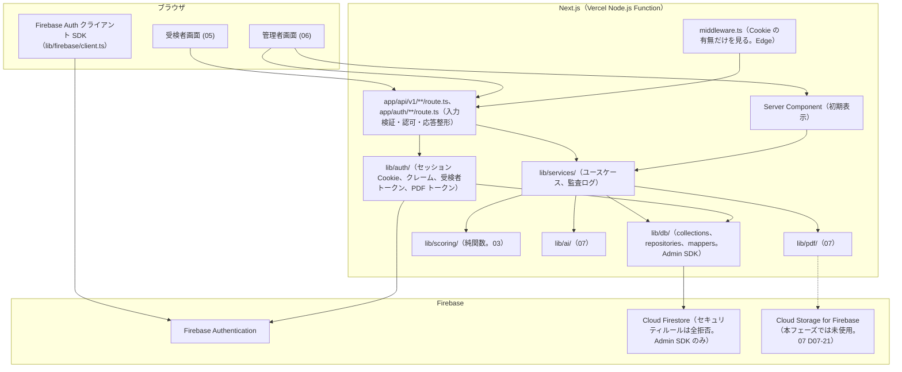
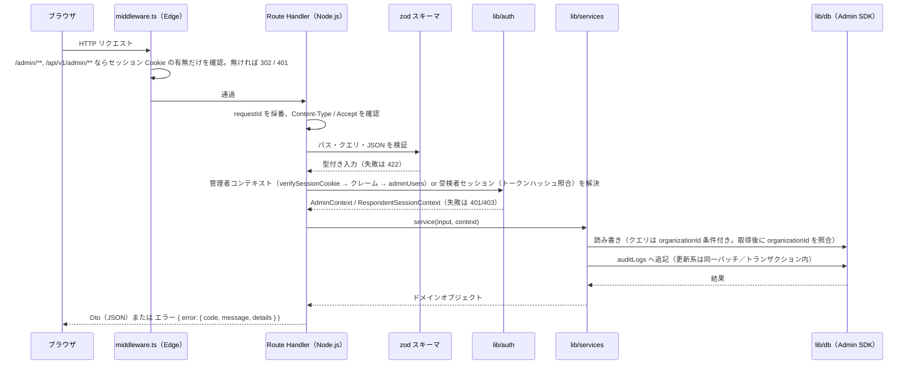
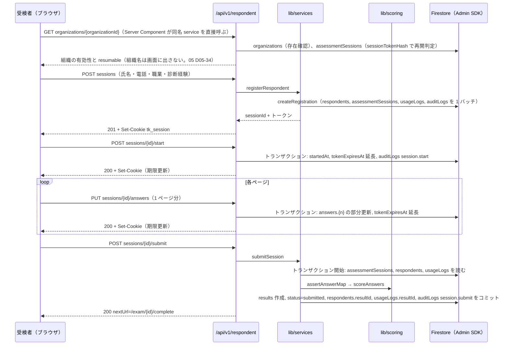
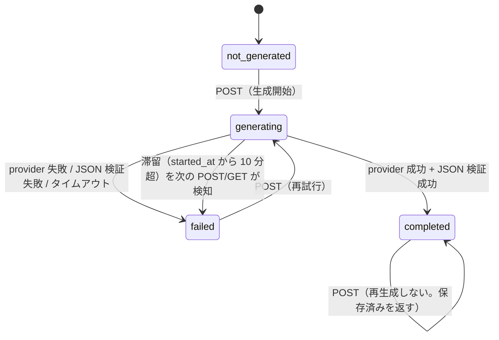
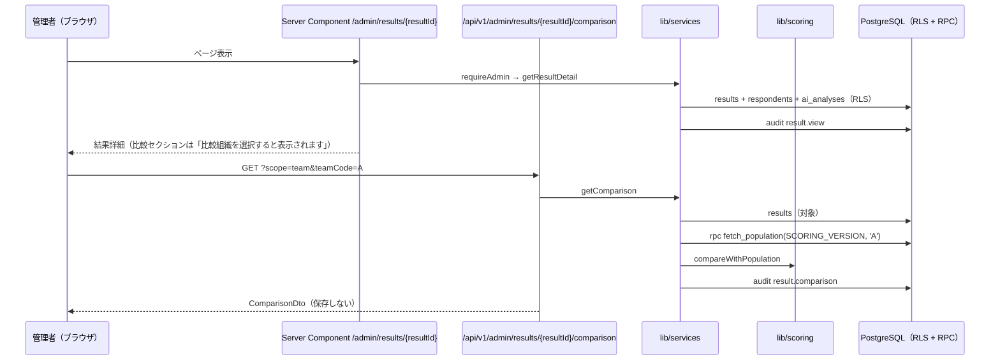
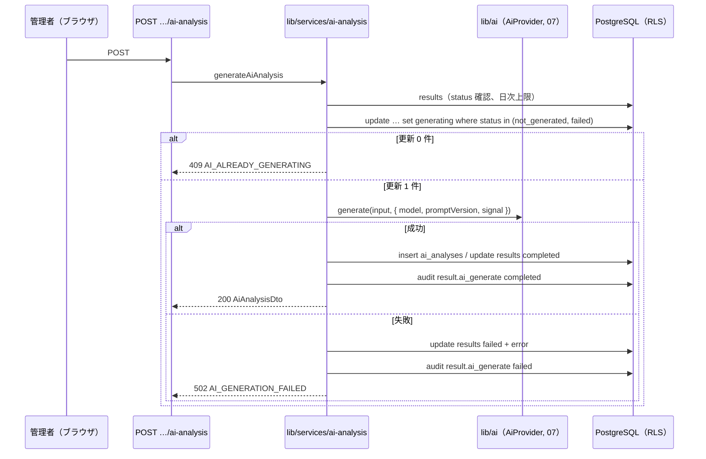

# 基本設計 04 API・サーバ処理設計

| 項目 | 内容 |
|---|---|
| 文書名 | 適性検査システム 基本設計 04 API・サーバ処理設計 |
| 版 | 2.0 |
| 作成日 | 2026-09-17（1.1 版: 2026-09-19、1.2 版: 2026-09-21、2.0 版: 2026-09-21。技術構成の変更（Supabase → Firebase。10 K-06）を反映した全面改版。改版履歴は §12） |
| 対象 | 実装者（Route Handler、`lib/services/`、`lib/auth/`、`lib/db/` の実装担当）、05〜08 分冊の設計者 |

## 0. 本書の位置づけ

本書は、共通定義（`00_共通定義.md` 2.0 版。以下「00」）の §4 で「代表」として挙げたエンドポイントを **確定** し、各 API の入出力（`Dto` / `Input`）、認可、エラー、サーバ側の処理手順（`lib/services/`）、入力検証、監査ログの書き込み箇所、レート制限、長時間処理（AI 解説・PDF）の扱いを定めるものです。

- 用語・識別子・コレクション名・フィールド名・型名は 00 に従います。Firestore のフィールド定義・検証スキーマ・複合インデックス・アクセス層（`lib/db/`）・セッション Cookie と各種トークンの実装は 02 分冊（`02_データモデル設計.md`。以下「02」）、採点・比較の純関数は 03 分冊（以下「03」）、環境変数・ライブラリ・実行基盤・Firebase プロジェクトの設定は 01 分冊（以下「01」）が定めたものをそのまま使い、本書では参照に留めます。
- 02 は K-06 に伴い本書と同時に全面改版中です。本書は 02 の節番号を参照せず、本書が呼ぶアクセス層の関数名は 00 §3.3（`lib/db/repositories/`、`lib/db/mappers/`、`lib/auth/`）の範囲で **仮置き** し、「02 参照」と付記しています。02 が別名で確定した場合は 02 を正とし、本書の関数名を読み替えます（§8.4）。
- 本書の範囲外: 画面のレイアウトと文言（05・06）、AI プロンプトと PDF レイアウト（07）、テスト計画（08）。
- 本書と 00 が矛盾した場合は 00 を正とします。本書と 01〜03 の間で食い違いがある箇所は §11 の一覧に明記し、本書での採用案を示しています。
- 05〜08 が本書に依頼した API・Dto・エラーコードのうち、本書が名称や形を変えて確定したものは §10 の引き渡し事項に「読み替え」として列挙しています（API の契約は本書が正。05 §7.1、06 §8.2 の記載どおり）。
- 2.0 版の方針: API のパス・リクエスト・レスポンス・エラーコードは 1.2 版を **原則維持** し、Supabase Auth・RLS・SQL 関数（RPC）に依存していた記述だけを Firebase Authentication（セッション Cookie、カスタムクレーム）と Cloud Firestore（Admin SDK、バッチ／トランザクション、サーバ側の認可 3 段階。00 §4.1）に置き換えました。変更した契約は §3 の一覧に「2.0 版で変更」と付記し、§12 にまとめています。

### 0.1 参照した要件

| 参照元 | 参照した内容 |
|---|---|
| 要件定義書 §3、§4 | 受検者はログイン不要、管理者はメール＋パスワード、役割（管理者・オーナー・管理者追加・スーパーアドミン） |
| 要件定義書 §5 | 業務フロー（リンク送付→登録→回答→送信→採点→閲覧→チーム・除外・削除） |
| 要件定義書 §6.1 U-01〜U-09 | 受検者登録の入力項目、職業コード、`q` / `p` パラメータ、開始画面、ページ単位の回答保存、送信時の採点、完了後遷移 |
| 要件定義書 §6.2 A-01〜A-13 | ログイン、回答一覧（列・並び順）、チーム設定、除外設定、削除、利用履歴、結果詳細、比較組織選択、AI 解説、PDF、組織内分類、アカウント、幹部データの閲覧制限 |
| 要件定義書 §6.3、§6.6 | 送信時の同期採点、AI 解説の生成状態と保存 |
| 要件定義書 §7 | 画面一覧と結果詳細のセクション構成（1〜2 リクエストで描画するための応答設計） |
| 要件定義書 §8 | データモデル（受検者・回答・結果・AI 分析・利用履歴） |
| 要件定義書 §9 | 個人情報保護（アクセスログ）、認証、性能（1〜2 リクエスト、採点 2 秒以内）、可用性（ページ単位保存・再開） |
| 要件定義書 §11 | 不具合 10 件（特に 3・6・10 番: 母集団の統一、比較値の非永続化） |
| 要件定義書 §12 | 未確認事項（中断・再開、削除ダイアログ、幹部の非表示挙動、完了画面など） |
| 付録B §9〜§10 | 比較計算の式（API で都度計算） |
| 付録C §8 | 組織内分類の集計単位（分類 × キャラクター） |
| 付録D §1〜§2 | AI 解説の入出力と JSON スキーマ（API 応答の形） |
| 付録E §7 | PDF の 2 モード |
| tests/fixtures/README.md | 比較計算の観測値（応答 JSON の項目が検証項目を網羅していること） |
| 10 決定記録 K-01〜K-06 | 母集団に本人・幹部を含める（K-01）、データは削除しない（K-04）、技術構成の変更（K-06） |

### 0.2 決定事項との対応

| # | 決定事項 | 本書での対応 |
|---|---|---|
| 1 | Next.js（App Router）+ Firebase（Cloud Firestore、Firebase Authentication、Cloud Storage for Firebase）+ Vercel（10 K-06） | Route Handler（`app/api/v1/**/route.ts`）のみで API を構成（§1）。Firestore へのアクセスはすべてサーバ側の Admin SDK（`lib/db/`）で行い、ブラウザから直接触れない（00 §2.5、D-28）。管理者 API はセッション Cookie（`verifySessionCookie`）とカスタムクレーム（`organizationId`、`role`）で認可し、取得した文書の `organizationId` を必ず照合する（認可 3 段階。00 §4.1、§2.5.1）。受検者 API は組織 ID とセッショントークン Cookie（SHA-256 ハッシュ照合。00 D-32）で認可する（§2.5.2）。ログイン・ログアウトは `POST/DELETE /auth/session`、管理者追加は `POST /auth/invite`（§6） |
| 2 | 不具合 10 件の修正 | 比較 API は母集団を 02 の `fetchPopulation()`（00 §1.11 のクエリ。`results` の複製フィールドによる単一クエリ）で 1 回だけ取得し、差分・偏差・レーダー系列を同じ結果から返す（§5.5）。比較値は保存しない（00 D-30）。優劣性・思考の傾向は 03 の純関数に委ね、API 側で値を加工しない |
| 3 | 出題は Q1〜Q144 のみ | 回答保存 API は `questionNo` 1〜144 以外を 422 で拒否（§4.4）。送信 API は Q1〜Q144 の揃いを検証（§4.5）。`assessmentSessions.answers` map のキーは `"1"`〜`"144"` に限る（00 §2.2） |
| 4 | 既存データは移行しない | 移行用 API は作らない。`results.scoringVersion` は送信時に `SCORING_VERSION` を保存 |
| 5 | AI 解説は Claude API、差し替え可能 | AI 解説 API は `lib/ai/` の `AiProvider` 経由でのみ生成し、provider 名を応答に含める（§5.9） |
| 6 | 日本語のみ、管理画面 PC 幅、受検者画面スマートフォン対応 | エラーメッセージは日本語固定。受検者 API は 1 ページ分の回答をまとめて保存し、通信回数を抑える（§4.4） |

## 1. 全体方針

### 1.1 Route Handler と Server Action の使い分け

00 §4.1 のとおり **Server Action は使いません**。ブラウザからの更新操作はすべて Route Handler（`app/api/v1/**/route.ts`）を経由します。

| 処理の種類 | 実装場所 | 理由 |
|---|---|---|
| ブラウザからの更新（登録、回答保存、送信、チーム・除外変更、削除、AI 生成、アカウント変更） | Route Handler | 入力検証・認可・監査ログ・エラー形式を 1 か所（§2）に集約し、結合テスト（08）で HTTP レベルで検証できるようにする |
| ブラウザからの再取得（比較計算、一覧の絞り込み、AI 解説の取得、PDF） | Route Handler | 同上。比較計算は都度計算のため GET で呼ぶ（00 §4.1） |
| 画面の初期表示データ | Server Component が `lib/services/` を直接呼ぶ（00 §3.3） | HTTP を経由しないことで初期描画の往復を減らす（要件定義書 §9 性能）。**Route Handler と同じ service 関数を呼ぶ** ため、認可と監査ログの挙動は API と一致する |
| 認証操作（ログイン時の ID トークン取得、パスワード再設定メールの送信、再設定コードによるパスワード設定） | ブラウザから Firebase Auth クライアント SDK（`lib/firebase/client.ts`。00 §2.5、§4.2） | `/api/v1` には置かない。ID トークンは `POST /auth/session` に渡すためだけに使い、ブラウザに保存しない（00 D-31） |
| セッション Cookie の発行・破棄、招待受理 | `app/auth/session/route.ts`（`POST` / `DELETE`）、`app/auth/invite/route.ts`（00 §3.3） | Auth 系の Route Handler。§6 |

- 設計判断 D04-01: Server Component から service を直接呼ぶ場合も、閲覧系の監査ログ（`result.view` など）は service 内で書きます（Route Handler に書かない）。これにより、画面の初期表示でも API 経由でも同じ記録が残ります。
- 設計判断 D04-02: Route Handler の実行ランタイムはすべて Node.js（01）。`export const runtime = "nodejs"` を各 `route.ts` に明記します。Firebase Admin SDK は Edge ランタイムで動作しないため（00 D-31。実装時確認）、`middleware.ts` では Admin SDK を使いません（§8.5）。

### 1.2 層構成



| 層 | 責務 | してはいけないこと |
|---|---|---|
| Route Handler | HTTP の入出力。`Request` から入力を取り出し zod で検証（§2.3）、認可コンテキストを得て（§2.5）、service を 1 つ呼び、結果を `Dto` にして返す。例外を §2.4 のエラー応答に変換する | Firestore のクエリを書く、採点・比較の計算をする、監査ログを直接書く |
| `lib/services/` | ユースケース単位の処理。整合性の単位（バッチ／トランザクション）の指定、監査ログ、状態遷移の判定、認可 3 段階のうち「文書の `organizationId` の照合」と「役割による幹部可視性」の判定 | HTTP（`Request` / `Response`）に触れる、`process.env` を読む（01 の `serverEnv()` 経由のみ）、`firebase-admin` を直接 import する（00 §3.3） |
| `lib/auth/` | セッション Cookie の発行・検証・失効（`session-cookie.ts`）、クレームの型と取得（`claims.ts`）、管理者コンテキストの解決（`admin-context.ts`）、受検者トークンの発行・ハッシュ・検証（`respondent-token.ts`、`respondent-session.ts`）、PDF 印刷トークン（`pdf-token.ts`） | 業務データの読み書き（`adminUsers` と `assessmentSessions` の認可用の取得を除く） |
| `lib/db/` | Admin SDK の Firestore への読み書き（コレクションごとのリポジトリ関数。02）、バッチ／トランザクションの実装、`Doc` ↔ ドメイン型の変換（`mappers/`。`Timestamp` ↔ `Date`、`ScoreResult` ↔ `results` 文書） | 認可判定（`organizationId` の等価条件をクエリに含めることは行うが、判定の責任は service）、業務ルール |
| `lib/scoring/`、`lib/masters/` | 採点・比較の純関数（03） | I/O |

- Firestore にはセキュリティルールによる認可がありません（00 D-28。ルールは全拒否で、Admin SDK には適用されない）。1.x 版で RLS が担っていた「他組織・削除済み・幹部の非表示」は、すべて **service のコード** で行います。組織に属する文書へのクエリは必ず `organizationId` の等価条件を含め、単一文書の取得後も `organizationId` をクレームと照合します（00 §2.1）。この 2 点を欠いた実装は結合テスト（08）で検出します。

### 1.3 リクエスト処理の共通の流れ



## 2. 共通仕様

### 2.1 URL・メソッド・ヘッダー

| 項目 | 規約（00 §4.1 の再掲と補足） |
|---|---|
| ベースパス | `/api/v1`。受検者用 `/api/v1/respondent/...`、管理者用 `/api/v1/admin/...` |
| メソッド | 取得 GET、作成 POST、部分更新 PATCH、全置換 PUT、削除 DELETE。GET は副作用を持たない（監査ログの追記は副作用とみなさない） |
| パスパラメータ | Firestore の文書 ID（`{sessionId}`、`{resultId}`、`{respondentId}`、`{organizationId}`。自動 ID は英数字 20 文字。00 §2.1）。形式は `^[A-Za-z0-9]{1,128}$` とし（00 §4.1「英数字 1〜128 文字程度」）、満たさなければ 404（存在しない扱い。設計判断 D04-03: 400 にすると ID の推測に手掛かりを与えるため）。存在確認は Firestore の取得結果で行う。2.0 版で UUID から変更 |
| クエリ・JSON キー | camelCase |
| リクエストの Content-Type | POST／PUT／PATCH は `application/json`。それ以外は 415 `UNSUPPORTED_MEDIA_TYPE` |
| 応答の Content-Type | `application/json; charset=utf-8`。PDF のみ `application/pdf` |
| 日時 | ISO 8601、UTC、`Z` 付き（例: `2026-09-17T01:23:45.678Z`）。Firestore の `Timestamp` ↔ `Date` ↔ ISO 文字列の変換は `lib/db/mappers/`（02）と Dto の組み立てで行い、service の中では `Date` で扱う |
| 数値 | JSON の number。採点値は丸めない（03 §9）。Firestore の number をそのまま返す（1.x 版の `numeric` 文字列変換は不要） |
| 一覧応答 | `{ "items": [...], "total": n }` に加え、ページングを使う API は `page`、`pageSize` を含める（§2.2） |
| 応答ヘッダー | `X-Request-Id`（サーバが採番した UUID。リクエスト ID は文書 ID ではないため UUID のまま）。`Cache-Control: no-store`（個人情報を含むため全 API で固定） |
| リクエスト ID | `X-Request-Id` ヘッダーをクライアントが送ってきても使わず、サーバで採番する（ログの偽装防止） |
| 文字数 | 文字数の上限はコードポイント単位（`Array.from(s).length`）で数える。02 の検証スキーマと同じ規則にする |

### 2.2 ページング・並び替え

一覧 API（回答一覧、利用履歴）に共通です。

| パラメータ | 型 | 既定値 | 制約 |
|---|---|---|---|
| `page` | integer | 1 | 1 以上 |
| `pageSize` | integer | 50 | 1〜200 |
| `sort` | string | API ごとに定義 | 許可された列名のみ |
| `order` | `asc` / `desc` | API ごとに定義 | |

応答:

```json
{
  "items": [],
  "total": 123,
  "page": 1,
  "pageSize": 50
}
```

- 設計判断 D04-04: 既存の回答一覧は全件表示と推定されますが（要件定義書 §6.2 A-02 にページングの記載なし。未確認）、1 組織あたり数百件規模（00 D-30 の推定）でも 1 リクエストで返せるよう `pageSize` の上限を 200 とし、06 分冊は初期表示で `pageSize=200` を使ってよいこととします。
- Firestore には SQL の `OFFSET` に相当する `offset()` がありますが、読み飛ばした文書も読み取りとして数えられます（実装時確認）。回答一覧はコレクションをまたぐ突き合わせと氏名の部分一致が必要なため、サーバのメモリ上でページングします（§5.3 D04-55）。利用履歴は `offset()` + `limit()` と `count()` 集計で行います（§5.8）。いずれも 1 組織あたり数百件規模を前提にした判断で、件数の上限の目安は §5.3 に記します。

### 2.3 入力検証（zod）

01 D01-03 のとおり `zod` を使います（00 §2.1「検証ライブラリは 01 が選定」）。スキーマは **Route Handler と同じディレクトリではなく `lib/services/schemas/`** に置き、Route Handler・Server Component・テストから共有します（設計判断 D04-05）。Firestore に型制約が無いため（00 §2.1）、API の入力検証（本節）に加えて **書き込み前の文書スキーマ検証** を 02 が定めますが、両者は同じ zod を使い、値の制約（`teamCode` の `A`〜`Z`、`choiceCode` の 1〜5 など）は共通スキーマから共有します。

共通スキーマ（コピー用）:

```ts
// lib/services/schemas/common.ts
import { z } from "zod";

/** Firestore の文書 ID（自動 ID は英数字 20 文字、Firebase Auth の uid は英数字 28 文字）。00 §4.1 */
export const docIdSchema = z.string().regex(/^[A-Za-z0-9]{1,128}$/);

/** コードポイント単位で文字数を数える */
const cpLength = (s: string): number => Array.from(s).length;

/** 前後空白を除去し、空白のみを拒否する必須文字列 */
export const requiredText = (max: number) =>
  z
    .string()
    .transform((s) => s.trim())
    .refine((s) => s.length > 0, { message: "必須項目です" })
    .refine((s) => cpLength(s) <= max, { message: `${max} 文字以内で入力してください` });

export const teamCodeSchema = z.string().regex(/^[A-Z]$/, { message: "チームは A〜Z です" });

export const choiceCodeSchema = z.union([z.literal(1), z.literal(2), z.literal(3), z.literal(4), z.literal(5)]);

export const scoredQuestionNoSchema = z.number().int().min(1).max(144);

export const pagingSchema = z.object({
  page: z.coerce.number().int().min(1).default(1),
  pageSize: z.coerce.number().int().min(1).max(200).default(50),
});

export const comparisonScopeQuerySchema = z
  .object({
    scope: z.enum(["organization", "team"]),
    teamCode: teamCodeSchema.optional(),
  })
  .superRefine((v, ctx) => {
    if (v.scope === "team" && v.teamCode === undefined) {
      ctx.addIssue({ code: z.ZodIssueCode.custom, path: ["teamCode"], message: "scope=team のときは teamCode が必要です" });
    }
    if (v.scope === "organization" && v.teamCode !== undefined) {
      ctx.addIssue({ code: z.ZodIssueCode.custom, path: ["teamCode"], message: "scope=organization のときは teamCode を指定できません" });
    }
  });

export const pdfModeSchema = z.enum(["full", "restricted"]);
```

検証の規則:

| 規則 | 内容 |
|---|---|
| 未知のキー | JSON ボディの未知キーは無視する（`z.object` の既定。`strict()` は使わない）。将来のキー追加でクライアントを壊さないため |
| 検証失敗 | 422 `VALIDATION_ERROR`。`details.issues` に `{ path: "answers[3].choiceCode", message: "..." }` の配列を入れる。**入力値そのものは `details` に含めない**（個人情報の混入防止。01 §8.6） |
| JSON 構文エラー | 400 `INVALID_JSON` |
| 電話番号 | 既存の形式検証は未確認（要件定義書 §12）。仮置き（設計判断 D04-06）: 前後空白を除去し、全角数字・全角ハイフンを半角に正規化したうえで、`^[0-9+()\-]{8,20}$` を満たすこと。Firestore（`respondents.phoneNumber`、`usageLogs.phoneNumber`）には正規化後の値を保存する。表示・赤枠の条件は 05 分冊 |
| 氏名 | 1〜100 文字。文字種は制限しない（02 の `respondents.name` の検証スキーマと同じ上限にする） |

検証エラー応答の例:

```json
{
  "error": {
    "code": "VALIDATION_ERROR",
    "message": "入力内容に誤りがあります",
    "details": {
      "issues": [
        { "path": "phoneNumber", "message": "電話番号の形式が正しくありません" },
        { "path": "occupationCode", "message": "職業を選択してください" }
      ]
    }
  }
}
```

### 2.4 エラー応答とエラーコード一覧

形式は 00 §4.1 のとおりです。`code` は本書で一覧化し、`lib/services/errors.ts` の `ApiError` クラスで表現します。

```ts
// lib/services/errors.ts
export type ApiErrorCode =
  | "INVALID_JSON" | "UNSUPPORTED_MEDIA_TYPE" | "VALIDATION_ERROR"
  | "UNAUTHENTICATED" | "ID_TOKEN_INVALID" | "RESPONDENT_TOKEN_INVALID" | "RESPONDENT_TOKEN_EXPIRED"
  | "FORBIDDEN" | "ADMIN_SUSPENDED" | "ADMIN_NOT_REGISTERED" | "ROLE_REQUIRED"
  | "NOT_FOUND" | "ORGANIZATION_NOT_FOUND" | "SESSION_NOT_FOUND" | "RESULT_NOT_FOUND" | "RESPONDENT_NOT_FOUND"
  | "SESSION_ALREADY_SUBMITTED" | "ANSWERS_INCOMPLETE" | "POPULATION_EMPTY"
  | "AI_ALREADY_GENERATING" | "AI_GENERATION_FAILED" | "AI_DAILY_LIMIT_EXCEEDED"
  | "PDF_GENERATION_FAILED" | "INVITE_TOKEN_INVALID" | "EMAIL_ALREADY_REGISTERED" | "CURRENT_PASSWORD_MISMATCH"
  | "RATE_LIMITED" | "SERVICE_UNAVAILABLE" | "INTERNAL_ERROR";

export class ApiError extends Error {
  constructor(
    readonly status: number,
    readonly code: ApiErrorCode,
    message: string,
    readonly details: Readonly<Record<string, unknown>> = {},
  ) {
    super(message);
    this.name = "ApiError";
  }
}
```

| HTTP | `code` | `message`（日本語。この文言を返す） | 発生箇所 |
|---:|---|---|---|
| 400 | `INVALID_JSON` | リクエスト本文を JSON として読み取れません | 全 POST／PUT／PATCH |
| 415 | `UNSUPPORTED_MEDIA_TYPE` | Content-Type は application/json を指定してください | 同上 |
| 422 | `VALIDATION_ERROR` | 入力内容に誤りがあります | 全 API（`details.issues`） |
| 401 | `UNAUTHENTICATED` | ログインが必要です | 管理者 API（セッション Cookie なし・検証失敗・期限切れ・失効済み。§2.5.1） |
| 401 | `ID_TOKEN_INVALID` | ログインに失敗しました。もう一度ログインしてください | `POST /auth/session`（ID トークンの検証失敗・期限切れ・`auth_time` が古い。§6.1）、`PATCH /api/v1/admin/me` の再認証トークン（§5.1。ただしこちらは 422 `CURRENT_PASSWORD_MISMATCH` に変換する）。2.0 版で追加 |
| 401 | `RESPONDENT_TOKEN_INVALID` | 受検セッションを確認できません。受検リンクから登録し直してください | 受検者 API（Cookie なし・不一致） |
| 401 | `RESPONDENT_TOKEN_EXPIRED` | 受検セッションの有効期限が切れました。受検リンクから登録し直してください | 受検者 API（期限切れ） |
| 403 | `FORBIDDEN` | この操作を行う権限がありません | 汎用 |
| 403 | `ADMIN_SUSPENDED` | このアカウントは利用停止中です | `adminUsers.isSuspended == true` または `deletedAt` 設定済み |
| 403 | `ADMIN_NOT_REGISTERED` | 管理者として登録されていません | セッション Cookie は有効だが、クレームに `organizationId` が無い・`role` が 3 値以外、または `adminUsers/{uid}` 文書が無い・文書の `organizationId` がクレームと一致しない（00 §5。§2.5.1） |
| 403 | `ROLE_REQUIRED` | この操作にはオーナー権限が必要です | owner／super_admin 限定 API を admin が呼んだ |
| 404 | `NOT_FOUND` | 指定されたリソースが見つかりません | 文書 ID の形式不正、未定義パス |
| 404 | `ORGANIZATION_NOT_FOUND` | 受検リンクが無効です。管理者にお問い合わせください | 受検者登録（組織なし・論理削除済み） |
| 404 | `SESSION_NOT_FOUND` | 受検セッションが見つかりません | 送信 API のみ（送信トランザクション内で `assessmentSessions` 文書を見つけられない。§4.5 手順 6）。Cookie とセッション ID の検証（§2.5.2）では文書が無い場合も 401 `RESPONDENT_TOKEN_INVALID` に統一し、このコードは返さない |
| 404 | `RESULT_NOT_FOUND` | 診断結果が見つかりません | 管理者 API（他組織・削除済み・admin に対する幹部データを含む） |
| 404 | `RESPONDENT_NOT_FOUND` | 受検者が見つかりません | 管理者 API（同上） |
| 409 | `SESSION_ALREADY_SUBMITTED` | この受検はすでに送信済みです | 回答保存・送信・開始 |
| 422 | `ANSWERS_INCOMPLETE` | 未回答の設問があります | 送信（`details.missing` に設問番号の配列） |
| 409 | `POPULATION_EMPTY` | 比較対象となる受検者がいません | 比較計算（母集団 0 件。03 D3-08） |
| 409 | `AI_ALREADY_GENERATING` | AI 解説を生成中です。しばらくしてから再度お試しください | AI 生成 |
| 502 | `AI_GENERATION_FAILED` | AI 解説の生成に失敗しました。再度お試しください | AI 生成（provider エラー・JSON 検証失敗・タイムアウト） |
| 429 | `AI_DAILY_LIMIT_EXCEEDED` | 本日の AI 解説の生成回数の上限に達しました | AI 生成（01 D01-17） |
| 500 | `PDF_GENERATION_FAILED` | PDF の生成に失敗しました。再度お試しください | PDF |
| 404 | `INVITE_TOKEN_INVALID` | 管理者追加用リンクが無効です。管理者に新しいリンクを発行してもらってください | 招待受理 |
| 409 | `EMAIL_ALREADY_REGISTERED` | このメールアドレスはすでに登録されています | 招待受理、メール変更（Firebase Auth の `auth/email-already-exists`） |
| 422 | `CURRENT_PASSWORD_MISMATCH` | 現在のパスワードが正しくありません | パスワード変更（再認証トークンの検証失敗。§5.1） |
| 429 | `RATE_LIMITED` | アクセスが集中しています。しばらくしてから再度お試しください | レート制限（§2.8）、Firebase の `auth/too-many-requests`、Firestore の `resource-exhausted` |
| 503 | `SERVICE_UNAVAILABLE` | 一時的にご利用いただけません。しばらくしてから再度お試しください | Firestore・Firebase Auth の一時的な失敗（`unavailable`、`deadline-exceeded`、トランザクションの再試行上限超過）。2.0 版で追加。`Retry-After: 5` を付ける |
| 500 | `INTERNAL_ERROR` | サーバ内部でエラーが発生しました | 予期しない例外。`details` は空、`X-Request-Id` で追跡 |

- 設計判断 D04-07: 他組織のリソース、論理削除済みのリソース、`admin` が見られない幹部（`executive`）のリソースは、いずれも **404** で返し、403 と区別しません（存在自体を見せない。00 §5）。Firestore にはこの絞り込みを担うルールが無いため、service が「取得した文書の `organizationId` がクレームと一致しない」「`deletedAt != null`」「`respondentKind == "executive"` かつ `canViewExecutives == false`」のいずれかを検出したときに、これらのコードを投げます。
- 設計判断 D04-08: `AI_GENERATION_FAILED` は 502（上流エラー）にします。500 と区別することで、監視（01）で自システムの障害と外部 API の障害を分けて数えられます。
- `message` は画面にそのまま表示できる日本語にします（06・05 分冊は原則としてこの文言を表示し、必要なら上書きします）。個人情報・トークン・Firestore のパス・スタックトレース・Firebase のエラーコード文字列を含めません。
- 05 §7.1 が仮称として挙げた 401 `UNAUTHORIZED` は採用せず、`RESPONDENT_TOKEN_INVALID`（Cookie なし・不一致・文書なし）と `RESPONDENT_TOKEN_EXPIRED`（期限切れ）の 2 つに分けます（設計判断 D04-42: 画面の表示は同じ E-04 でよいが、期限切れは「登録し直し」の案内、それ以外は「受検リンクから開き直す」の案内に分けられるようにする）。05 §7.1・§9・D05-26 の読み替えは §10 に列挙します。

#### Firebase 由来のエラーの対応表（`lib/services/firebase-errors.ts`）

Admin SDK の例外（`FirebaseAuthError` の `code`、Firestore の gRPC ステータスコード）は Route Handler に漏らさず、`translateFirebaseError(error): ApiError` で §2.4 のコードに変換します（1.x 版の `translateRpcError` を置き換え。設計判断 D04-60）。対応表に無いものは 500 `INTERNAL_ERROR` にし、元の `code` はサーバログにだけ出します（応答には含めない）。コード名は Admin SDK の版で変わり得るため、実装時確認とします。

| 由来 | Firebase のエラーコード（実装時確認） | 変換後 | 備考 |
|---|---|---|---|
| `verifySessionCookie` | `auth/session-cookie-expired`、`auth/session-cookie-revoked`、`auth/invalid-session-cookie-duration`、`auth/argument-error`（Cookie 文字列が不正） | 401 `UNAUTHENTICATED` | 失効（`revokeRefreshTokens` 後）と期限切れは区別しない。画面は `/admin/login` へ |
| `verifyIdToken` | `auth/id-token-expired`、`auth/id-token-revoked`、`auth/invalid-id-token`、`auth/argument-error` | 401 `ID_TOKEN_INVALID` | `POST /auth/session` のみ。`PATCH /me` の再認証では 422 `CURRENT_PASSWORD_MISMATCH` |
| `verifyIdToken` / `verifySessionCookie`（`checkRevoked = true`） | `auth/user-disabled` | `POST /auth/session` では 401 `ID_TOKEN_INVALID`、管理者 API では 403 `ADMIN_SUSPENDED` | 無効化ユーザーが拒否されること自体が実装時確認（00 §5）。拒否されない場合は `adminUsers.isSuspended` で判定する（§2.5.1 手順 4 が常に行う） |
| `createUser` / `updateUser` | `auth/email-already-exists` | 409 `EMAIL_ALREADY_REGISTERED` | |
| `createUser` / `updateUser` | `auth/invalid-email`、`auth/invalid-password`、`auth/invalid-display-name` | 422 `VALIDATION_ERROR`（`issues[0].path` に `email` / `password` / `name`） | パスワード強度は Firebase コンソールのパスワードポリシー（01）で強制される場合、`auth/invalid-password` に含まれる（実装時確認） |
| `getUser` / `updateUser` / `setCustomUserClaims` / `revokeRefreshTokens` | `auth/user-not-found` | 403 `ADMIN_NOT_REGISTERED` | セッション Cookie の uid が Auth に存在しない（運用でユーザーを削除した直後） |
| Firebase Auth 全般 | `auth/too-many-requests` | 429 `RATE_LIMITED` | |
| Firebase Auth 全般 | `auth/internal-error`、`auth/insufficient-permission`、`auth/invalid-credential`（サービスアカウントの不備） | 500 `INTERNAL_ERROR` | 構成ミス。01 の起動時検証で早期に検出する |
| Firestore | `aborted`（トランザクションの競合。SDK が既定回数再試行した後）、`unavailable`、`deadline-exceeded` | 503 `SERVICE_UNAVAILABLE` | ブラウザ側は同じ操作の再試行を促す |
| Firestore | `resource-exhausted` | 429 `RATE_LIMITED` | 割り当て超過 |
| Firestore | `failed-precondition`（複合インデックス未定義・トランザクション内での読み取り順序違反） | 500 `INTERNAL_ERROR` | 実装不備。Emulator の警告（00 D-33）と結合テストで検出する |
| Firestore | `permission-denied` | 500 `INTERNAL_ERROR` | Admin SDK では通常発生しない（サービスアカウントの権限不足 = 構成ミス） |
| Firestore | `not-found`（`update()` の対象文書が無い） | 呼び出し側の service が文脈に応じて 404（`RESPONDENT_NOT_FOUND` など）に変換 | トランザクション内では事前の `get` で判定するため通常は発生しない |

### 2.5 認可の共通処理（`lib/auth/`）

#### 2.5.1 管理者コンテキスト（セッション Cookie → カスタムクレーム → `adminUsers` 文書）

00 §4.1 の認可 3 段階「(1) セッション Cookie の検証、(2) クレームの `role` による機能制限、(3) 取得した文書の `organizationId` とクレームの `organizationId` の一致確認」のうち、(1)(2) を `requireAdmin` / `requireOwner` が、(3) を各 service が行います。

```ts
// lib/auth/claims.ts（02 が確定。本書は形だけを示す）
import type { AdminRole } from "@/lib/db/types";   // "owner" | "admin" | "super_admin"（02 参照）

/** Firebase Auth のカスタムクレーム（00 §5）。setCustomUserClaims でサーバだけが設定する */
export interface AdminClaims {
  readonly organizationId: string;
  readonly role: AdminRole;
}

/** DecodedIdToken（verifySessionCookie / verifyIdToken の戻り）からクレームを取り出す。形が合わなければ null */
export function readAdminClaims(decoded: { readonly [key: string]: unknown }): AdminClaims | null;
```

```ts
// lib/auth/session-cookie.ts（02 が確定。本書は 04 が呼ぶ関数と定数だけを示す）
export const SESSION_COOKIE_DEFAULT_NAME = "admin_session";                 // 環境変数 SESSION_COOKIE_NAME が無いときの名前（00 §3.2）
export const SESSION_COOKIE_EXPIRES_IN_MS = 7 * 24 * 60 * 60 * 1000;        // 7 日（§6.1 D04-53。createSessionCookie の上限 14 日の内側。実装時確認）

/** verifyIdToken(idToken, true) → createSessionCookie(idToken, { expiresIn }) の順に行う（§6.1） */
export async function issueSessionCookie(idToken: string, now: Date): Promise<{ readonly cookie: string; readonly uid: string; readonly expiresAt: Date }>;

/** verifySessionCookie(cookie, true)（失効チェックあり）。失敗は ApiError(401, UNAUTHENTICATED) に変換して投げる */
export async function verifySession(cookie: string): Promise<{ readonly uid: string; readonly email: string | null; readonly claims: AdminClaims | null; readonly authTime: Date }>;

/** revokeRefreshTokens(uid)。以後、この uid の既存セッション Cookie は verifySession で 401 になる（00 §5） */
export async function revokeSessions(uid: string): Promise<void>;

/** Set-Cookie の属性。HttpOnly、Secure（ローカルのみ外す）、SameSite=Lax、Path=/、Max-Age は expiresIn と同じ */
export function sessionCookieOptions(expiresAt: Date, isLocal: boolean): { name: string; httpOnly: true; secure: boolean; sameSite: "lax"; path: "/"; expires: Date };
```

```ts
// lib/auth/admin-context.ts
import type { AdminRole } from "@/lib/db/types";

export interface AdminContext {
  readonly uid: string;                  // Firebase Auth の uid = adminUsers の文書 ID（00 D-22）。Dto では adminUserId として返す
  readonly organizationId: string;       // クレームの organizationId（adminUsers 文書の同名フィールドと一致することを手順 4 で確認済み）
  readonly role: AdminRole;              // クレームの role
  readonly canViewExecutives: boolean;   // role が owner または super_admin（00 §5、D-14）
  readonly email: string | null;         // セッション Cookie の email クレーム（表示用。Firebase Auth が正で adminUsers には持たない。00 §2.2）
  readonly displayName: string;          // adminUsers.displayName
  readonly request: RequestMeta;         // §2.6 の監査ログ用
}

export interface RequestMeta {
  readonly requestId: string;
  readonly ipAddress: string | null;     // x-forwarded-for の先頭
  readonly userAgent: string | null;     // 500 文字で切り詰め
}

/**
 * セッション Cookie から管理者コンテキストを解決する。
 * - Cookie なし・検証失敗・期限切れ・失効 → ApiError(401, UNAUTHENTICATED)
 * - クレーム不正、adminUsers 文書なし、文書の organizationId 不一致 → ApiError(403, ADMIN_NOT_REGISTERED)
 * - adminUsers.isSuspended または deletedAt → ApiError(403, ADMIN_SUSPENDED)
 */
export async function requireAdmin(request: Request): Promise<AdminContext>;

/**
 * Server Component 用（引数なし）。Cookie は next/headers の cookies() から読み、
 * RequestMeta は headers() から組み立てる（requestId は採番）。判定は Request 版と同じ（§8.3）。
 */
export async function requireAdmin(): Promise<AdminContext>;

/** owner / super_admin 以外なら ApiError(403, ROLE_REQUIRED) */
export function requireOwner(ctx: AdminContext): AdminContext;
```

処理手順（`requireAdmin`）:

1. Cookie（名前は `SESSION_COOKIE_NAME`、既定 `admin_session`）を読み、無ければ 401 `UNAUTHENTICATED`。
2. `verifySession(cookie)`（内部で `verifySessionCookie(cookie, true)`）。検証失敗・期限切れ・失効（`revokeRefreshTokens` 後）はすべて 401 `UNAUTHENTICATED`（§2.4 の対応表）。無効化（`disabled`）ユーザーもここで拒否されることを期待するが、実装時確認とし、拒否されない場合に備えて手順 4 で `isSuspended` を必ず見る（00 §5）。
3. `readAdminClaims(decoded)` が `null`（`organizationId` が無い、`role` が 3 値以外）なら 403 `ADMIN_NOT_REGISTERED`（00 §5 の「ログインできても管理 API を利用できない」。1.x 版と同じく画面は E-01 で扱えるよう 403 とし、Cookie 自体は有効なので 401 にはしない。設計判断 D04-09 改）。
4. `getAdminUser(uid)`（`lib/db/repositories/admin-users-repository.ts`。02 参照）で `adminUsers/{uid}` を 1 件取得する（00 D-22: クレームから 1 回の `get` で引ける）。文書が無い、または文書の `organizationId` がクレームと異なる（運用で組織を付け替えた直後など）なら 403 `ADMIN_NOT_REGISTERED`。`isSuspended == true` または `deletedAt != null` なら 403 `ADMIN_SUSPENDED`。
5. `canViewExecutives = role in ("owner", "super_admin")`。`email` は復号したクレームの `email`（無ければ `null`。実装時確認: セッション Cookie に `email` クレームが含まれること。含まれない場合は `getUser(uid)` で引くが、`GET /me` 以外では使わないため §5.1 だけで呼ぶ）。
6. `RequestMeta` を組み立てる。

- 幹部データの非表示は **service のクエリ条件と取得後の判定** で担保します（1.x 版の RLS の代替）。一覧・組織内分類・利用履歴は `admin` のとき `respondentKind == "applicant"` の等価条件を付け（00 §5）、単一文書の取得（結果詳細・比較・更新・削除・AI・PDF）は `respondents.kind`（または `results.respondentKind`）が `executive` かつ `canViewExecutives == false` なら 404 を返します（D04-07）。共通の判定関数を `lib/services/visibility.ts` に置きます（§8.1。`assertVisibleToAdmin(ctx, doc)`）。
- `super_admin` は `owner` と同じ扱いです（00 D-14）。
- 1 リクエストあたりの Firebase への往復は `verifySessionCookie`（公開鍵をキャッシュした後はローカル検証。`checkRevoked = true` のため `tokensValidAfterTime` の確認で Auth への問い合わせが 1 回発生する。実装時確認）と `adminUsers` の `get` 1 回です。Server Component と Route Handler が同じ画面表示の中で複数回 `requireAdmin` を呼ぶ場合は、06 の `AdminShell` と同じくリクエスト単位で結果を共有します（React の `cache()`。06 §1.3）。
- 設計判断 D04-09 改（2.0 版）: 1.x 版の「利用停止の判定にのみサービスロールを使う」は、Admin SDK が常にサービスアカウントで動く 2.0 版では不要になり、`adminUsers` の取得を全リクエストで行う形に置き換えました。返す情報は状態のみで変わりません。

#### 2.5.2 受検者セッションコンテキスト

00 §4.1・D-32（乱数トークンを Cookie に、SHA-256 ハッシュを `assessmentSessions.sessionTokenHash` に保存）を実装します。トークンの発行・ハッシュ・検証の実体は `lib/auth/respondent-token.ts`（00 §3.3。02 が確定）で、本書はその契約と、`{sessionId}` との突き合わせ（`respondent-session.ts`）を定めます。

```ts
// lib/auth/respondent-token.ts（02 が確定。本書は契約を示す）
import { createHash, randomBytes } from "node:crypto";

export const RESPONDENT_COOKIE_NAME = "tk_session";                 // 01
export const RESPONDENT_TOKEN_TTL_MS = 7 * 24 * 60 * 60 * 1000;      // 7 日（00 D-32。10 K-04「再開できる期間」。§11 D04-10）

export interface IssuedRespondentToken {
  readonly token: string;      // base64url 43 文字
  readonly tokenHash: string;  // sha256 hex 64 文字
  readonly expiresAt: Date;
}

export function issueRespondentToken(now: Date): IssuedRespondentToken {
  const token = randomBytes(32).toString("base64url");
  return { token, tokenHash: hashRespondentToken(token), expiresAt: new Date(now.getTime() + RESPONDENT_TOKEN_TTL_MS) };
}

export function hashRespondentToken(token: string): string {
  return createHash("sha256").update(token, "utf8").digest("hex");
}

/** Set-Cookie の属性（01）。ローカルのみ Secure を外す */
export function respondentCookieOptions(expiresAt: Date, isLocal: boolean) {
  return { name: RESPONDENT_COOKIE_NAME, httpOnly: true, secure: !isLocal, sameSite: "lax" as const, path: "/", expires: expiresAt };
}
```

```ts
// lib/auth/respondent-session.ts
import type { SessionStatusValue, RespondentKindValue } from "@/lib/db/types";   // 02 参照

export interface RespondentSessionContext {
  readonly sessionId: string;
  readonly organizationId: string;
  readonly respondentId: string;
  readonly kind: RespondentKindValue;
  readonly status: SessionStatusValue;   // draft | submitted
  readonly tokenExpiresAt: Date;
  readonly request: RequestMeta;
}

/**
 * Cookie のトークンと {sessionId} の組を検証する。
 * - Cookie なし → 401 RESPONDENT_TOKEN_INVALID
 * - 文書なし（sessionId が無い、sessionTokenHash 不一致、deletedAt あり）→ 401 RESPONDENT_TOKEN_INVALID
 * - tokenExpiresAt <= now → 401 RESPONDENT_TOKEN_EXPIRED
 * status の判定（draft 必須）は呼び出し側の service が行う（GET は submitted でも許可するため）
 */
export async function requireRespondentSession(request: Request, sessionId: string): Promise<RespondentSessionContext>;

/**
 * Server Component 用。next/headers の cookies() から tk_session を読む以外は requireRespondentSession と同じ。
 * 05 §1.3 の判定表（R-02〜R-05 の初期表示）が呼ぶ。RequestMeta は headers() から組み立てる（requestId は採番）。
 */
export async function requireRespondentSessionFromCookies(sessionId: string): Promise<RespondentSessionContext>;

/**
 * 受検リンク（/exam?q&p）を開き直したときの再開判定（05 §6.3 の ResumeBanner）。
 * Cookie のトークンのハッシュだけで assessmentSessions を 1 件引き、
 * 「organizationId と kind が一致」「status == draft」「deletedAt == null」「tokenExpiresAt > now」のときだけ sessionId を返す。
 * それ以外（Cookie なし・文書なし・別組織・別区分・submitted・期限切れ）は null を返し、例外を投げない。個人情報は返さない。
 */
export async function findResumableSession(
  cookieToken: string | null,
  organizationId: string,
  kind: RespondentKindValue,
): Promise<{ readonly sessionId: string; readonly answeredCount: number } | null>;
```

処理手順（`requireRespondentSession`）:

1. `sessionId` が文書 ID の形式（§2.1）でなければ 404 `NOT_FOUND`。
2. Cookie `tk_session` を読み、無ければ 401 `RESPONDENT_TOKEN_INVALID`。
3. `hashRespondentToken(token)` を計算し、`getSession(sessionId)`（`lib/db/repositories/assessment-sessions-repository.ts`。02 参照）で `assessmentSessions/{sessionId}` を 1 件取得する。文書が無い、`sessionTokenHash` がハッシュと一致しない、`deletedAt != null` のいずれかなら 401 `RESPONDENT_TOKEN_INVALID`（`sessionId` の存在有無を区別しない。404 `SESSION_NOT_FOUND` は返さない）。ハッシュの比較は `timingSafeEqual` で行う。
4. `tokenExpiresAt <= now` なら 401 `RESPONDENT_TOKEN_EXPIRED`。
5. `respondentId` で `respondents` を 1 件取得して `kind` を得る（`getRespondent`。02 参照）。文書が無い・`deletedAt != null`・`organizationId` がセッションと異なる場合は整合性の異常として 401 `RESPONDENT_TOKEN_INVALID`（論理削除は 3 文書同一バッチのため通常は発生しない。00 §2.2）。コンテキストを返す。

処理手順（`findResumableSession`。設計判断 D04-43）:

1. `cookieToken` が無ければ `null`。
2. `hashRespondentToken(cookieToken)` で `findSessionByTokenHash(hash)`（02 参照。`assessmentSessions` を `sessionTokenHash == hash` かつ `deletedAt == null` で 1 件。`sessionTokenHash` は乱数由来で実質一意。00 §2.1。複合インデックス `sessionTokenHash + deletedAt` は 02 が定義）。無ければ `null`。2 件以上返った場合は衝突とみなし `null`（発生確率は無視できる）。
3. `organizationId == organizationId`、`status == "draft"`、`tokenExpiresAt > now` を満たさなければ `null`。
4. `respondents.kind == kind` でなければ `null`（05 §6.3: 区分の取り違えを防ぐ）。
5. `answers` map のキー数を数え、`{ sessionId, answeredCount }` を返す（05 の `ResumeBanner` は `sessionId` だけを使う。`answeredCount` は「n 問まで回答済み」の表示用で、氏名などは含めない）。

- 受検者 API は Admin SDK（サービスアカウント。セキュリティルールの対象外）で動くため、**全ての読み書きを `sessionId` 1 件とそれに紐づく `respondentId`・`usageLogs` 1 件に限定** し、`organizationId` はコンテキストの値を使います（00 D-23、D-28）。リクエストで組織 ID を受け取るのは登録 API（§4.2）と受検リンク検証 API（§4.1。`findResumableSession` を呼ぶ）だけです。
- `findResumableSession` は Cookie の所持者が「自分の」`draft` セッションを見つけるだけの関数で、`sessionId` を返した後の実際の再開は `requireRespondentSession` の通常の検証（トークン一致）を経ます。トークンを持たない第三者は `sessionId` を得られません。

### 2.6 監査ログ（`lib/services/audit.ts`）

`auditLogs` コレクション（00 §2.2、D-24）への追記は **すべて本書の service が行います**。1.x 版で DB 関数が書いていた `respondent.delete`、`session.submit`、`organization.rotate_invite_token` も、2.0 版では service が本処理と同じバッチ／トランザクションの中で書きます（Firestore に SQL 関数は無い。10 K-06）。`action` の一覧は本書が確定します（00 §2.2「04 が確定」）。

```ts
// lib/services/audit.ts
import type { RequestMeta } from "@/lib/auth/admin-context";
import type { AdminRole } from "@/lib/db/types";   // 02 参照

export type AuditAction =
  | "respondent.register" | "session.start" | "session.submit"
  | "admin.signup" | "admin.login"
  | "result.list" | "result.view" | "result.comparison" | "result.ai_generate" | "result.pdf_export"
  | "respondent.update_team" | "respondent.update_exclusion" | "respondent.delete"
  | "usage_log.view" | "classification.view" | "account.update" | "organization.rotate_invite_token";

export interface AuditEntry {
  readonly organizationId: string;
  readonly actorKind: "admin" | "respondent" | "system";
  readonly actorUid: string | null;         // admin: Firebase Auth の uid、respondent: respondentId、system: null（00 §2.2 の actorUid）
  readonly actorRole: AdminRole | null;     // admin のときクレームの role、それ以外は null（00 §2.2 の actorRole）
  readonly action: AuditAction;
  readonly targetCollection: string | null; // 00 §2.2 の targetCollection（COLLECTIONS の値）
  readonly targetId: string | null;
  readonly details: AuditDetails;
  readonly request: RequestMeta;            // ipAddress / userAgent を auditLogs.ipAddress / userAgent に写す
}

/** details の値は文字列・数値・真偽値・null か、それらの配列（例: account.update の fields）。ネストしたオブジェクトは入れない */
export type AuditDetailValue = string | number | boolean | null;
export type AuditDetails = Readonly<Record<string, AuditDetailValue | ReadonlyArray<AuditDetailValue>>>;

/** 単独で追記する（閲覧系）。失敗しても業務処理は成功させる（ログに warn を出す）。設計判断 D04-11 */
export async function writeAuditLog(entry: AuditEntry): Promise<void>;

/** 更新系: 本処理と同じ WriteBatch / Transaction に auditLogs の create を積む（02 の appendAuditLog(batchOrTx, doc) を呼ぶ）。本処理と一緒にコミットされ、失敗すれば本処理も失敗する */
export function enqueueAuditLog(writer: AuditWriter, entry: AuditEntry): void;
```

| 規則 | 内容 |
|---|---|
| 書き込み経路 | すべて Admin SDK（`lib/db/repositories/audit-logs-repository.ts` の `appendAuditLog`。02 参照）。1.x 版の「利用者セッションのクライアントで `actor_id = auth.uid()` を強制」は無くなったため、`actorUid` は service が `AdminContext.uid` / `RespondentSessionContext.respondentId` から必ず設定する（リクエストから受け取らない） |
| タイミング | 更新系（登録・開始・送信・チーム・除外・削除・再発行・アカウント変更・AI 生成の完了／失敗）は本処理と **同じバッチ／トランザクション** に積み、成功時だけ残る。閲覧系（`result.list`、`result.view`、`result.comparison`、`result.pdf_export`、`usage_log.view`、`classification.view`）はデータ取得の成功後に単独で追記する。失敗した操作は記録しない（失敗はアプリログ。01） |
| 失敗時 | 閲覧系の追記が失敗しても本処理の応答は変えない（設計判断 D04-11: 閲覧をログ障害で止めない。ただし `logger.warn` で `requestId` とともに記録し、監視対象にする）。更新系は同一バッチのため、監査ログだけが失敗することはない |
| `details` | 個人情報を入れない。値は `{ before, after }` のようにフィールドの値だけ。配列は `account.update` の `fields`（例 `{ "fields": ["name"] }`）のように文字列の配列に限る（`AuditDetails` 型）。Firestore には map として保存する |
| `admin.signup` | 招待受理 `POST /auth/invite`（§6.3）が Admin SDK で `adminUsers` 文書の作成と同じバッチに積む（`actorKind = "admin"`、`actorUid` = `createUser` が返した `uid`。設計判断 D04-36 改）。`login-events`（§5.1）では書かない |
| `ipAddress` | `x-forwarded-for` の先頭要素をそのまま string で保存する（Firestore に `inet` 型は無い）。取得できなければ `null` |
| `createdAt` | `FieldValue.serverTimestamp()`（00 §2.1）。レート制限（§2.8）の範囲条件に使う |
| 2.0 版で追加した action | `session.submit`、`respondent.delete`、`organization.rotate_invite_token`（1.x 版は DB 関数が書いていた）。`session.start` は 1.1 版で追加済み（D04-12）。`action` の形式は `^[a-z_]+\.[a-z_]+$`（02 の検証スキーマ） |
| `actorRole`・`actorKind` | 00 §2.2 は `actorUid`・`actorRole` を挙げている。本書は受検者・システムの操作を区別するため `actorKind` を追加し、02 に検証スキーマへの追加を依頼する（§10。設計判断 D04-61） |

### 2.7 ログ

01 の `logger` を使い、Route Handler の入口と出口で次を 1 行ずつ出します。

```json
{ "level": "info", "message": "request.end", "requestId": "…", "route": "/api/v1/admin/results/[resultId]/comparison", "method": "GET", "status": 200, "durationMs": 38, "organizationId": "…", "adminUserId": "…", "resultId": "…" }
```

- リクエストボディ・応答ボディ・Cookie・ID トークン・クエリの文字列値（`q` の検索語を含む）は出しません。
- `ApiError` は `status >= 500` のときだけ `error` レベル、それ以外は `info` に `code` を含めます。Firebase 由来の例外は変換前の `code`（`auth/...`、gRPC のステータス名）を `cause` として同じ行に出します（§2.4 の対応表）。

### 2.8 レート制限

01 の方針を実装に落とします。Vercel Firewall（基盤側）に加えて、アプリ側で判定するものは次の 2 つです。件数は Firestore の **`count()` 集計クエリ** で数え、文書本体は読みません（実装時確認: 集計クエリが範囲条件と等価条件の組み合わせで使えること、必要な複合インデックス）。

| 対象 | 判定方法 | 上限（仮置き） | 応答 |
|---|---|---|---|
| 受検者登録 `POST /api/v1/respondent/sessions` | `auditLogs` を `organizationId == 対象組織`、`action == "respondent.register"`、`ipAddress == 接続元`、`createdAt > now − 10 分` で `count()`（`countRecentRegistrations`。02 参照）。1.x 版と同じく **監査ログの `ipAddress` を使う**（設計判断 D04-13。`assessmentSessions` に IP を持たない）。複合インデックス `organizationId + action + ipAddress + createdAt` を 02 に依頼する（§10） | 20 件 / 10 分 / IP / 組織（01 D01-16） | 429 `RATE_LIMITED`、`Retry-After: 600` |
| AI 解説生成 `POST …/ai-analysis` | `aiAnalyses` を `organizationId == 自組織`、`createdAt >= 当日 00:00（Asia/Tokyo）` で `count()`（`countAiAnalysesSince`。02 参照）。`admin` が呼んだ場合も幹部分を含めて数える（1.x 版の RLS による誤差は無くなる） | 200 件 / 日 / 組織（01 D01-17、10 K-03「仮置きのまま実装」） | 429 `AI_DAILY_LIMIT_EXCEEDED` |

- `ipAddress` が取得できない（`null`）場合はアプリ側の登録レート制限を適用しません（Firewall 側に委ねる）。
- 回答保存・送信・PDF・一覧は Firewall のみ（01）。`POST /auth/session` と `POST /auth/invite` も Firewall（IP あたり 1 分 5 件を推奨。§6）で、Firebase Auth 側の組み込み制限（`auth/too-many-requests`）は 429 `RATE_LIMITED` に変換します。
- 集計クエリが使えない場合の代替: 対象文書を `select()` で最小の射影にして `limit(上限 + 1)` で読み、件数を数える（読み取り回数は上限 + 1 で頭打ち）。

### 2.9 Vercel の実行時間制限と `maxDuration`

01 のとおり `route.ts` に `export const maxDuration` を書きます。

| Route Handler | `maxDuration` | 本書での扱い |
|---|---|---|
| `POST …/ai-analysis` | 300 | 同期方式（§7.1）。応答を待つ間ブラウザは「生成中」を表示 |
| `GET …/pdf` | 120 | 同期生成してストリーム返却（§7.2） |
| `POST …/submit` | 既定（10 秒） | 採点は数十 ms（03 §10.9）。Firestore のトランザクション 1 回（読み取り 2 件、書き込み 5 件） |
| `GET /api/v1/admin/results`、`GET …/classification`、`GET …/comparison` | 既定（10 秒） | 組織内の `results` を全件読む（数百件規模）。件数が増えた場合の見直しは §5.3 の目安に従う |
| その他 | 既定 | |

- Firestore の 1 トランザクション・1 バッチあたりの書き込み上限（500 件。実装時確認）に対し、本システムの最大は送信時の 5 件です（00 §2.2）。

### 2.10 Route Handler の雛形

全ての `route.ts` はこの形に揃えます（設計判断 D04-14: 共通ラッパー `handle()` で採番・ログ・エラー変換を一元化）。

```ts
// lib/services/http.ts
import { NextResponse } from "next/server";
import { randomUUID } from "node:crypto";
import { ZodError } from "zod";
import { ApiError } from "@/lib/services/errors";
import { translateFirebaseError } from "@/lib/services/firebase-errors";
import { logger } from "@/lib/utils/logger";
import type { RequestMeta } from "@/lib/auth/admin-context";

export function requestMeta(request: Request): RequestMeta {
  const forwarded = request.headers.get("x-forwarded-for");
  const ip = forwarded ? forwarded.split(",")[0]?.trim() ?? null : null;
  const ua = request.headers.get("user-agent");
  return { requestId: randomUUID(), ipAddress: ip && ip.length > 0 ? ip : null, userAgent: ua ? ua.slice(0, 500) : null };
}

export async function readJson<T>(request: Request, parse: (input: unknown) => T): Promise<T> {
  const ct = request.headers.get("content-type") ?? "";
  if (!ct.toLowerCase().startsWith("application/json")) {
    throw new ApiError(415, "UNSUPPORTED_MEDIA_TYPE", "Content-Type は application/json を指定してください");
  }
  let body: unknown;
  try {
    body = await request.json();
  } catch {
    throw new ApiError(400, "INVALID_JSON", "リクエスト本文を JSON として読み取れません");
  }
  return parse(body);
}

export function json<T>(meta: RequestMeta, body: T, init: { status?: number; headers?: Record<string, string> } = {}) {
  return NextResponse.json(body, {
    status: init.status ?? 200,
    headers: { "Cache-Control": "no-store", "X-Request-Id": meta.requestId, ...init.headers },
  });
}

export async function handle(request: Request, route: string, fn: (meta: RequestMeta) => Promise<Response>): Promise<Response> {
  const meta = requestMeta(request);
  const started = Date.now();
  try {
    const res = await fn(meta);
    logger.info("request.end", { requestId: meta.requestId, route, method: request.method, status: res.status, durationMs: Date.now() - started });
    return res;
  } catch (e: unknown) {
    const err = toApiError(e);
    const level = err.status >= 500 ? "error" : "info";
    logger[level]("request.error", { requestId: meta.requestId, route, method: request.method, status: err.status, code: err.code, durationMs: Date.now() - started });
    return json(meta, { error: { code: err.code, message: err.message, details: err.details } }, { status: err.status });
  }
}

function toApiError(e: unknown): ApiError {
  if (e instanceof ApiError) return e;
  if (e instanceof ZodError) {
    const issues = e.issues.map((i) => ({ path: i.path.join("."), message: i.message }));
    return new ApiError(422, "VALIDATION_ERROR", "入力内容に誤りがあります", { issues });
  }
  return translateFirebaseError(e);   // §2.4 の対応表。該当しなければ 500 INTERNAL_ERROR
}
```

```ts
// app/api/v1/admin/results/[resultId]/comparison/route.ts（例）
import { handle, json } from "@/lib/services/http";
import { requireAdmin } from "@/lib/auth/admin-context";
import { comparisonScopeQuerySchema, docIdSchema } from "@/lib/services/schemas/common";
import { getComparison } from "@/lib/services/comparison";
import { ApiError } from "@/lib/services/errors";

export const runtime = "nodejs";

export async function GET(request: Request, { params }: { params: Promise<{ resultId: string }> }) {
  return handle(request, "/api/v1/admin/results/[resultId]/comparison", async (meta) => {
    const { resultId } = await params;
    if (!docIdSchema.safeParse(resultId).success) throw new ApiError(404, "NOT_FOUND", "指定されたリソースが見つかりません");
    const url = new URL(request.url);
    const query = comparisonScopeQuerySchema.parse(Object.fromEntries(url.searchParams));
    const ctx = await requireAdmin(request);
    const dto = await getComparison(ctx, { resultId, scope: query.scope === "team" ? { kind: "team", teamCode: query.teamCode! } : { kind: "organization" } });
    return json(meta, dto);
  });
}
```

- `teamCode!` の非 null 断言は `superRefine` で保証済みの箇所に限って許可します（Lint の `no-non-null-assertion` をこの行だけ無効化するより、`comparisonScopeQuerySchema` の `transform` で `ComparisonScope` に変換する実装を推奨）。

## 3. エンドポイント一覧（確定）

00 §4.2 の「代表」を確定し、本書で追加したものに「追加」を付けます。

### 3.1 受検者用（ログイン不要）

| メソッド | パス | 用途 | 認可 | 節 |
|---|---|---|---|---|
| GET | `/api/v1/respondent/organizations/{organizationId}` | 受検リンクの検証（組織名の取得）。追加 | なし（組織 ID の知識のみ） | §4.1 |
| POST | `/api/v1/respondent/sessions` | 受検者登録とセッション作成。Cookie 発行 | なし（レート制限あり） | §4.2 |
| GET | `/api/v1/respondent/sessions/{sessionId}` | 進行状態と保存済み回答の取得（再開） | セッショントークン | §4.3 |
| POST | `/api/v1/respondent/sessions/{sessionId}/start` | 「開始する」の記録。追加 | セッショントークン、`draft` | §4.3 |
| PUT | `/api/v1/respondent/sessions/{sessionId}/answers` | ページ単位の回答保存（上書き） | セッショントークン、`draft` | §4.4 |
| POST | `/api/v1/respondent/sessions/{sessionId}/submit` | 送信・採点・結果保存 | セッショントークン、`draft` | §4.5 |

### 3.2 管理者用（セッション Cookie 必須）

| メソッド | パス | 用途 | 認可 | 節 |
|---|---|---|---|---|
| GET | `/api/v1/admin/me` | ログイン中の管理者と組織情報、3 種のリンク（2.0 版で変更: `links.adminInvite` は再発行直後にしか平文を持てないため `null` を返す。§5.1） | admin 以上 | §5.1 |
| PATCH | `/api/v1/admin/me` | 氏名・メールアドレス・パスワードの変更（2.0 版で変更: `currentPassword` → `reauthIdToken`、`pendingEmail` 廃止、メール・パスワード変更後は再ログイン。§5.1） | admin 以上 | §5.1 |
| POST | `/api/v1/admin/me/login-events` | ログイン成功の記録（`admin.login`）。追加 | admin 以上 | §5.1 |
| POST | `/api/v1/admin/organization/invite-token` | 管理者追加用リンクの再発行。追加（平文のトークンはこの応答でだけ返す） | owner／super_admin | §5.2 |
| GET | `/api/v1/admin/admin-users` | 同一組織の管理者一覧（アカウント画面 M-07。06 D06-20 の依頼）。追加（2.0 版で変更: `email` を含める） | owner／super_admin | §5.11 |
| GET | `/api/v1/admin/results` | 回答一覧（検索・並び替え・チーム・除外の絞り込み） | admin 以上（幹部は owner のみ） | §5.3 |
| GET | `/api/v1/admin/results/{resultId}` | 結果詳細（全指標・受検者情報・AI 解説の状態と本文） | 同上 | §5.4 |
| GET | `/api/v1/admin/results/{resultId}/comparison` | 比較計算（都度計算、非永続化） | 同上 | §5.5 |
| PATCH | `/api/v1/admin/respondents/{respondentId}` | チーム・除外フラグの更新 | 同上 | §5.6 |
| DELETE | `/api/v1/admin/respondents/{respondentId}` | 削除（論理削除） | 同上 | §5.6 |
| GET | `/api/v1/admin/classification` | 組織内分類（分類 × タイプの人数と該当者） | 同上 | §5.7 |
| GET | `/api/v1/admin/usage-logs` | 利用履歴 | 同上 | §5.8 |
| POST | `/api/v1/admin/results/{resultId}/ai-analysis` | AI 解説の生成（生成済みなら保存済みを返す） | 同上 | §5.9 |
| GET | `/api/v1/admin/results/{resultId}/ai-analysis` | AI 解説の取得（状態のポーリングにも使う） | 同上 | §5.9 |
| GET | `/api/v1/admin/results/{resultId}/pdf` | PDF 出力（`mode=full` / `restricted`） | 同上 | §5.10 |

### 3.3 認証系（`/api/v1` の外）

| メソッド | パス | 用途 | 認可 | 節 |
|---|---|---|---|---|
| POST | `/auth/session` | ID トークン → セッション Cookie の発行（ログイン）。2.0 版で追加（00 §3.3、§4.2） | なし（ID トークンの検証） | §6.1 |
| DELETE | `/auth/session` | セッション Cookie の削除と `revokeRefreshTokens`（ログアウト）。2.0 版で追加 | セッション Cookie（無くても 204） | §6.2 |
| POST | `/auth/invite` | 招待トークンによる管理者追加（Admin SDK `createUser` + カスタムクレーム + `adminUsers`）。2.0 版で変更: 本文からパスワードを外す | なし（招待トークンの知識のみ） | §6.3 |

- 1.x 版の `GET /auth/callback`（Supabase Auth のコード交換）は **廃止** しました（00 §3.3）。パスワード再設定はブラウザの Firebase Auth クライアント SDK（`sendPasswordResetEmail` → メールのリンク → `verifyPasswordResetCode` / `confirmPasswordReset`）で完結し、サーバ API は不要です（§6.4、設計判断 D04-58）。
- 役割変更・利用停止・管理者削除の API は本フェーズでは **提供しません**（§5.12。運用者が `scripts/set-admin-role` で Admin SDK により行う。00 §4.2）。
- 受検者登録（`POST /api/v1/respondent/sessions`）は要件定義書 §6.2 A-12 の「受検リンク発行」に対応する管理者側の操作を **必要としません**。受検リンクは組織 ID（`organizations` の文書 ID）から `GET /api/v1/admin/me` が組み立てて返す固定 URL であり（00 §3.7）、受検者ごとの事前登録はありません（要件定義書 §5 の業務フロー）。

## 4. 受検者 API

受検者 API はすべて Admin SDK（`lib/db/`。サービスアカウント）で Firestore にアクセスします（00 D-23、D-28）。セキュリティルールは適用されないため、§2.5.2 のコンテキストが示す `sessionId`・`respondentId`・`organizationId` 以外の文書に触れないことを service の責任とします。複数文書の整合が必要な書き込み（登録・送信）は 02 のリポジトリ関数がバッチ／トランザクションで行い、service はそれを 1 回呼びます（00 §2.2、§6「複製フィールドの同期手順は 02 が定め、04 はそれを `lib/services/` から呼ぶ」）。

### 4.1 受検リンクの検証 `GET /api/v1/respondent/organizations/{organizationId}`

受検者登録画面（S-02）が無効なリンクの判定（フォームを出さない）と再開可能セッションの検索（`resumable`）に使います（05 §5.1.1、§6.3）。応答の `organizationName` は 05 の画面では表示しません（05 D05-34。値は返すが描画しない）。Server Component は同名の service `getOrganizationForAssessment` を直接呼び、ブラウザからこの API を呼ぶことはありません（05 §7.1）。

| 項目 | 内容 |
|---|---|
| 認可 | なし |
| パス | `organizationId`: `organizations` の文書 ID（§2.1 の形式） |
| クエリ | `kind`: `applicant` / `executive`（省略可。URL の `p=user` → `applicant`、`p=executives` → `executive` への変換は 05 分冊の画面側で行う。00 D-12） |
| 処理 | `getOrganization(organizationId)`（`lib/db/repositories/organizations-repository.ts`。02 参照）で `organizations/{organizationId}` を取得。無い、または `deletedAt != null` なら 404 `ORGANIZATION_NOT_FOUND`。あわせて Cookie `tk_session` があれば `findResumableSession(cookieToken, organizationId, kind)`（§2.5.2）を呼び、再開可能な `draft` セッションを `resumable` に入れる（`kind` 省略時は `applicant` として判定） |
| 監査ログ | なし |

レスポンス（200）:

```json
{
  "organizationId": "8f0b4b6e-2f0e-4a1c-9c56-1d7d9b1a2c33",
  "organizationName": "サンプル歯科医院",
  "kind": "applicant",
  "resumable": { "sessionId": "c1d2e3f4-5a6b-4c7d-8e9f-0a1b2c3d4e5f", "answeredCount": 57 }
}
```

- `resumable` は再開できるセッションが無いとき `null`。05 §6.3 の `ResumeBanner` はこの値で表示を決めます（Server Component で初期表示するときは同名の service `getOrganizationForAssessment` が `cookies()` からトークンを読んで同じ判定をします。§8.3）。
- Cookie が無効・別組織・別区分・送信済み・期限切れのいずれでも `resumable: null` を返し、エラーにはしません（受検リンクの検証自体は成功しているため）。

エラー:

| HTTP | code | 条件 |
|---:|---|---|
| 404 | `NOT_FOUND` | `organizationId` が文書 ID の形式でない |
| 404 | `ORGANIZATION_NOT_FOUND` | 組織なし・論理削除済み |
| 422 | `VALIDATION_ERROR` | `kind` が `applicant` / `executive` 以外 |

- 受付停止のためのフィールド（1.x 版で検討した `is_active`）は 2.0 版でも設けません。本書は `deletedAt == null` のみで判定し、受付停止は組織の論理削除で行います（§11 D04-15）。

### 4.2 受検者登録 `POST /api/v1/respondent/sessions`

要件定義書 §6.1 U-01〜U-03、§8.2、§8.7 に対応します。

| 項目 | 内容 |
|---|---|
| 認可 | なし。レート制限あり（§2.8） |
| 前提 | 組織が存在し論理削除されていない |
| 処理 | 1 つの WriteBatch で `respondents`、`assessmentSessions`、`usageLogs`、`auditLogs` に 1 文書ずつ作成（§4.2.2）。応答で Cookie `tk_session` を発行 |
| 監査ログ | `respondent.register`（actor `respondent`、`details: { kind }`）。同じバッチに積む |

リクエスト:

```json
{
  "organizationId": "8f0b4b6e-2f0e-4a1c-9c56-1d7d9b1a2c33",
  "kind": "applicant",
  "name": "山田 太郎",
  "phoneNumber": "090-1234-5678",
  "occupationCode": 2,
  "diagnosisExperience": "first_time"
}
```

zod スキーマ:

```ts
// lib/utils/phone-number.ts（I/O なし・依存なし。04 の zod スキーマと 05 の画面側検証が同じ実装を共有する。05 D05-16）
export const PHONE_PATTERN = /^[0-9+()\-]{8,20}$/;

/** 全角数字・全角ハイフン類を半角に正規化する（設計判断 D04-06） */
export function normalizePhoneNumber(raw: string): string {
  return raw
    .trim()
    .replace(/[０-９]/g, (c) => String.fromCharCode(c.charCodeAt(0) - 0xfee0))
    .replace(/[－‐‑–—ー]/g, "-")
    .replace(/[（]/g, "(")
    .replace(/[）]/g, ")")
    .replace(/\s+/g, "");
}
```

```ts
// lib/services/schemas/respondent.ts
import { z } from "zod";
import { requiredText, docIdSchema } from "./common";
import { normalizePhoneNumber, PHONE_PATTERN } from "@/lib/utils/phone-number";   // 1.2 版: 実体を lib/utils/ に移し、05 と共有（D05-16）

export const registerRespondentInputSchema = z.object({
  organizationId: docIdSchema,
  kind: z.enum(["applicant", "executive"]),
  name: requiredText(100),
  phoneNumber: z
    .string()
    .transform(normalizePhoneNumber)
    .refine((s) => PHONE_PATTERN.test(s), { message: "電話番号の形式が正しくありません" }),
  occupationCode: z.number().int().min(1).max(9),
  diagnosisExperience: z.enum(["first_time", "experienced"]),
});
export type RegisterRespondentInput = z.infer<typeof registerRespondentInputSchema>;
```

レスポンス（201）と `Set-Cookie`:

```json
{
  "sessionId": "c1d2e3f4-5a6b-4c7d-8e9f-0a1b2c3d4e5f",
  "organizationId": "8f0b4b6e-2f0e-4a1c-9c56-1d7d9b1a2c33",
  "kind": "applicant",
  "status": "draft",
  "tokenExpiresAt": "2026-09-24T01:23:45.678Z",
  "nextUrl": "/exam/c1d2e3f4-5a6b-4c7d-8e9f-0a1b2c3d4e5f"
}
```

```text
Set-Cookie: tk_session=<base64url 43 文字>; Path=/; Expires=<tokenExpiresAt>; HttpOnly; Secure; SameSite=Lax
```

エラー:

| HTTP | code | 条件 |
|---:|---|---|
| 422 | `VALIDATION_ERROR` | 必須欠落、形式不正 |
| 404 | `ORGANIZATION_NOT_FOUND` | 組織なし・論理削除済み |
| 429 | `RATE_LIMITED` | 同一組織・同一 IP で 10 分に 20 件超 |

#### 4.2.1 処理手順（`lib/services/respondent-registration.ts`）

```ts
export async function registerRespondent(input: RegisterRespondentInput, request: RequestMeta): Promise<{
  readonly sessionId: string; readonly organizationId: string; readonly kind: RespondentKindValue;
  readonly issued: IssuedRespondentToken;
}>;
```

1. `getOrganization(input.organizationId)` で組織を検証（§4.1 と同じ条件）。
2. レート制限の判定（§2.8）。
3. `issueRespondentToken(now)` でトークンを発行。
4. `createRegistration(...)`（§4.2.2）を呼び、`respondentId` と `sessionId` を得る。
5. 応答に Cookie を付けて返す。**生のトークンは応答ボディに含めない**（Cookie のみ。00 D-32）。

- 推定: 既存では受検者が登録のたびに User レコードとして作成される（要件定義書 §8.1）ため、同一人物の再登録は別レコードになると推定します（同一人物の再登録の扱いは要件定義書・付録に記載なし）。新システムでも 00 §1.1 の定義「1 文書 = 1 回の受検登録」に従い、同じ人が再度リンクから登録すれば別の受検者文書ができます。
- 設計判断 D04-16: 重複登録の抑止（同一電話番号の検出など）は要件に無いため行いません。誤って二重に登録された受検者は管理者が一覧から削除できます（要件定義書 §6.2 A-05）。同一ブラウザからの再訪は §4.1 の `resumable` で再開を促します（05 §6.3）。

#### 4.2.2 登録バッチ `createRegistration()`（02 が確定。本書は契約と書く内容を示す）

受検者・セッション・利用履歴・監査ログの 4 文書を **1 つの WriteBatch** で作ります（00 §2.2「複数文書の整合が必要な書き込み」。設計判断 D04-17 改: 1.x 版の RPC `register_respondent()` の置き換え。バッチは全件成功か全件失敗のどちらかになるため、途中失敗で受検者文書だけが残ることはない）。文書 ID は書き込み前に `collection.doc()` で採番し、相互参照（`respondents.sessionId`、`assessmentSessions.respondentId`、`usageLogs.respondentId`）を同じバッチ内で埋めます。

```ts
// lib/db/repositories/respondents-repository.ts（02 参照。関数名は仮置き）
export interface RegistrationDocs {
  readonly organizationId: string;
  readonly kind: RespondentKindValue;
  readonly name: string;
  readonly phoneNumber: string;          // 正規化後
  readonly occupationCode: number;
  readonly diagnosisExperience: "first_time" | "experienced";
  readonly sessionTokenHash: string;     // sha256 hex
  readonly tokenExpiresAt: Date;
  readonly audit: AuditEntry;            // respondent.register（§2.6）
}
export async function createRegistration(docs: RegistrationDocs): Promise<{ readonly respondentId: string; readonly sessionId: string }>;
```

バッチに積む文書（フィールドの詳細と検証スキーマは 02 が正。00 §2.2 の主要フィールドのみ示す）:

| コレクション | 文書 ID | 主なフィールド |
|---|---|---|
| `respondents` | 採番 | `organizationId`、`kind`、`name`、`phoneNumber`、`occupationCode`、`diagnosisExperience`、`teamCode: null`、`isExcluded: false`、`sessionId`、`resultId: null`、`deletedAt: null`、`createdAt`／`updatedAt`（`serverTimestamp()`） |
| `assessmentSessions` | 採番（URL の `{sessionId}`） | `organizationId`、`respondentId`、`status: "draft"`、`sessionTokenHash`、`tokenExpiresAt`、`answers: {}`、`startedAt: null`、`lastSavedStep: null`、`lastSavedPage: null`、`lastAnsweredAt: null`、`submittedAt: null`、`resultId: null`、`deletedAt: null`、監査フィールド |
| `usageLogs` | 採番 | `organizationId`、`respondentId`、`respondentKind`（`admin` の閲覧制限のためのクエリ条件。02 に追加を依頼。§10 D04-62）、`name`、`phoneNumber`、`diagnosisExperience`、`registeredAt`（`serverTimestamp()`）、`resultId: null`、`submittedAt: null`、監査フィールド |
| `auditLogs` | 採番 | §2.6 の `respondent.register`（`actorKind: "respondent"`、`actorUid` = 採番した `respondentId`、`targetCollection: "respondents"`、`targetId` = 同じ、`details: { kind }`） |

- `deletedAt: null` を作成時に明示的に書くのは、母集団クエリの `deletedAt == null` 条件に一致させるためです（00 §1.11、§2.1）。
- `sessionTokenHash` の一意性: 32 バイトの乱数由来のため、存在確認は行いません（00 §2.1）。

### 4.3 進行状態の取得と開始

#### `GET /api/v1/respondent/sessions/{sessionId}`

中断・再開（00 D-16、D-32）と、設問ページの初期表示に使います。

| 項目 | 内容 |
|---|---|
| 認可 | セッショントークン（§2.5.2）。`submitted` でも 200 を返す（完了画面が状態を確認できるように） |
| 処理 | `assessmentSessions` 1 文書（`answers` map を含む。§2.5.2 の検証で取得済みの文書を再利用し、追加の読み取りは行わない）+ `organizations` 1 文書（`name`）。`answers` map（キー `"1"`〜`"144"`）を `questionNo` 昇順の配列に変換する（00 D-29） |
| 監査ログ | なし |

レスポンス（200）:

```json
{
  "sessionId": "c1d2e3f4-5a6b-4c7d-8e9f-0a1b2c3d4e5f",
  "organizationName": "サンプル歯科医院",
  "kind": "applicant",
  "status": "draft",
  "startedAt": "2026-09-17T01:25:00.000Z",
  "lastSavedStep": 2,
  "lastSavedPage": 3,
  "answeredCount": 57,
  "totalCount": 144,
  "answers": [
    { "questionNo": 1, "choiceCode": 2 },
    { "questionNo": 2, "choiceCode": 4 }
  ],
  "tokenExpiresAt": "2026-09-24T01:23:45.678Z"
}
```

- `answers` は `questionNo` 昇順の **配列** です（05 §7.1 の仮の `Record<QuestionNo, ChoiceCode>` ではない。設計判断 D04-44: JSON のキーが数値文字列になる `Record` より、配列の方が zod での検証と TypeScript の型が素直になる。画面側は `new Map(answers.map(a => [a.questionNo, a.choiceCode]))` で引く）。144 件でも約 4 KB のため分割しません。
- 再開位置 `resumePageNo`（05 §6.2）は応答に **含めません**。05 D05-08 のとおり画面側が `answers` から導出します（`lastSavedStep` / `lastSavedPage` は参考値。§4.4 D04-18）。
- 受検者の氏名・電話番号は返しません（画面で使わない。要件定義書 §7 S-03・S-04 に表示なし）。

エラー:

| HTTP | code | 条件 |
|---:|---|---|
| 401 | `RESPONDENT_TOKEN_INVALID` | Cookie なし・不一致・文書なし（削除済みを含む） |
| 401 | `RESPONDENT_TOKEN_EXPIRED` | `tokenExpiresAt` 経過 |
| 404 | `NOT_FOUND` | `sessionId` が文書 ID の形式でない |

#### `POST /api/v1/respondent/sessions/{sessionId}/start`

「開始する」（要件定義書 §6.1 U-04）の押下を記録します。設計判断 D04-12: `assessmentSessions.startedAt`（00 §2.2）を埋めるための最小の API。設問ページへの遷移の可否は 05 §5.2.2 D05-32 に従い、**200 を受け取ったときだけ遷移** します（05 は `startedAt` を設問ページ表示の前提条件にしているため。1.2 版で 1.1 版の「失敗しても設問画面へ進めてよい」を取り下げ）。

| 項目 | 内容 |
|---|---|
| 認可 | セッショントークン、`status == "draft"`（`submitted` は 409 `SESSION_ALREADY_SUBMITTED`） |
| リクエスト | 本文なし（`Content-Type` 不要） |
| 処理 | トランザクション（`startSession`。02 参照）: `assessmentSessions/{sessionId}` を `transaction.get` → `status != "draft"` なら 409 → `startedAt == null` のときだけ `startedAt = serverTimestamp()` を設定（冪等）→ `tokenExpiresAt = now + 7 日` に延長 → 初回のみ `auditLogs` に `session.start` を同じトランザクションで作成。Cookie を同じ期限で再発行する（05 §6.1 に合わせる。設計判断 D04-45）。2 回目以降の冪等な呼び出しでは監査ログを書かない |
| レスポンス | 200（下記） |

レスポンス（200）:

```json
{
  "sessionId": "c1d2e3f4-5a6b-4c7d-8e9f-0a1b2c3d4e5f",
  "startedAt": "2026-09-17T01:25:00.000Z",
  "tokenExpiresAt": "2026-09-24T01:25:00.000Z"
}
```

- 05 §7.1 は `start` の応答を `RespondentSessionDto`（進行状態）としていますが、本書は上の最小形にします（設計判断 D04-45: `start` 直後の設問ページは Server Component が `getSessionProgress` で初期表示するため、応答に回答を含める必要がない）。

エラー:

| HTTP | code | 条件 |
|---:|---|---|
| 401 | `RESPONDENT_TOKEN_INVALID` / `RESPONDENT_TOKEN_EXPIRED` | Cookie 不正・期限切れ |
| 404 | `NOT_FOUND` | `sessionId` が文書 ID の形式でない |
| 409 | `SESSION_ALREADY_SUBMITTED` | 送信済み |

### 4.4 回答の保存 `PUT /api/v1/respondent/sessions/{sessionId}/answers`

要件定義書 §6.1 U-07（設問ごとに保持）、§9 可用性（ページ単位で保存）に対応します。**1 ページ分の回答をまとめて上書き保存** します。

| 項目 | 内容 |
|---|---|
| 認可 | セッショントークン、`status == "draft"` |
| 処理 | トランザクション 1 回（`saveAnswers`。02 参照）: `assessmentSessions/{sessionId}` を `transaction.get` → `status != "draft"` なら 409 → `answers` map を **フィールドパス指定の部分更新**（`answers.51`、`answers.52`、… を `FieldPath` で指定した `update()`。00 D-29。ページ外の回答は触らない）→ `lastSavedStep` / `lastSavedPage` / `lastAnsweredAt` を更新し、`tokenExpiresAt` を `now + 7 日` に延長。Cookie も同じ期限で再発行 |
| 監査ログ | なし（回答内容は評価情報。保存のたびに記録しない。送信時に `session.submit` が残る） |

リクエスト（`pageNo` は 05 §5.3.1 の **通しページ番号 1〜20**。1.1 版で `step` / `page` から変更）:

```json
{
  "pageNo": 8,
  "answers": [
    { "questionNo": 51, "choiceCode": 1 },
    { "questionNo": 52, "choiceCode": 3 },
    { "questionNo": 53, "choiceCode": 5 }
  ]
}
```

zod スキーマ:

```ts
// lib/services/schemas/respondent.ts（続き）
import { choiceCodeSchema, scoredQuestionNoSchema } from "./common";

/** 通しページ番号（05 §5.3.1）。4 ステップ × 5 ページ = 20（03 §2.3 QUESTION_PAGE_LAYOUT から導出） */
export const examPageNoSchema = z.number().int().min(1).max(20);

export const saveAnswersInputSchema = z
  .object({
    pageNo: examPageNoSchema,
    answers: z
      .array(z.object({ questionNo: scoredQuestionNoSchema, choiceCode: choiceCodeSchema }))
      .min(1)
      .max(8),
  })
  .superRefine((v, ctx) => {
    const seen = new Set<number>();
    v.answers.forEach((a, i) => {
      if (seen.has(a.questionNo)) {
        ctx.addIssue({ code: z.ZodIssueCode.custom, path: ["answers", i, "questionNo"], message: "設問番号が重複しています" });
      }
      seen.add(a.questionNo);
    });
  });
export type SaveAnswersInput = z.infer<typeof saveAnswersInputSchema>;
```

`pageNo` と `step` / `page` の変換（service が使う純関数。`lib/masters/exam-pages.ts` に置き、05 の `lib/presentation/exam-pages.ts` からも同じ関数を再エクスポートして使う。設計判断 D04-46: service は `lib/presentation/` を import しないため、変換関数は `lib/masters/` 側に置く）:

```ts
// lib/masters/exam-pages.ts（純関数。I/O なし）
import { ACTIVE_QUESTIONS, QUESTION_PAGE_LAYOUT } from "@/lib/masters/questions";
import type { QuestionNo } from "@/lib/scoring/types";

export const EXAM_PAGES_PER_STEP = QUESTION_PAGE_LAYOUT.pageSizes.length;                       // 5
export const EXAM_PAGE_COUNT = QUESTION_PAGE_LAYOUT.stepCount * EXAM_PAGES_PER_STEP;             // 20

export function toStep(pageNo: number): number {          // ceil(pageNo / 5)
  return Math.ceil(pageNo / EXAM_PAGES_PER_STEP);
}
export function toPageInStep(pageNo: number): number {    // ((pageNo − 1) mod 5) + 1
  return ((pageNo - 1) % EXAM_PAGES_PER_STEP) + 1;
}
export function toPageNo(step: number, pageInStep: number): number {  // (step − 1) × 5 + pageInStep
  return (step - 1) * EXAM_PAGES_PER_STEP + pageInStep;
}
/** pageNo に属する設問番号の集合（QuestionDefinition.step / page で判定。00 §3.5、03 §2.3） */
export function questionNosOfPage(pageNo: number): ReadonlySet<QuestionNo> {
  const step = toStep(pageNo);
  const page = toPageInStep(pageNo);
  return new Set(ACTIVE_QUESTIONS.filter((q) => q.step === step && q.page === page).map((q) => q.questionNo));
}
```

処理手順（`lib/services/answer-saving.ts`）:

1. `requireRespondentSession`。`status !== "draft"` なら 409 `SESSION_ALREADY_SUBMITTED`（トランザクション前の早期判定。最終判定はトランザクション内で行う）。
2. `questionNosOfPage(input.pageNo)` を求め、`answers[].questionNo` がすべてその集合に含まれることを確認。含まれない設問があれば 422 `VALIDATION_ERROR`（`details.issues[].path = "answers[i].questionNo"`、`message = "このページの設問ではありません"`）。これにより `isActive = true`（1〜144）の確認も兼ねる。
3. `saveAnswers(sessionId, { answers, lastSavedStep: toStep(pageNo), lastSavedPage: toPageInStep(pageNo), tokenExpiresAt })`（02 参照）をトランザクションで実行する。トランザクション内で `assessmentSessions/{sessionId}` を読み、`status != "draft"` または `deletedAt != null` なら中断して 409 `SESSION_ALREADY_SUBMITTED`（送信と保存が同時に走った場合の保護。1.x 版の DB トリガー `trg_answers_reject_after_submit` の代替）。`update()` には `answers.{questionNo}` をフィールドパス（`new FieldPath("answers", "51")`）で 1 問ずつ指定し、`lastSavedStep`、`lastSavedPage`、`lastAnsweredAt: serverTimestamp()`、`tokenExpiresAt`、`updatedAt` を同じ `update()` に含める（書き込みは 1 文書 1 回。00 §2.2 の理由 (2)）。
4. 更新後の `answers` のキー数（トランザクション内で読んだ文書の `answers` に今回の回答をマージして数える）を `answeredCount` にする。
5. 200 を返し、Cookie を再発行。

- 設計判断 D04-18（1.1 版で改）: 入力は 05 §5.3.1 の通しページ番号 `pageNo` とし、`step` / `page` への変換は service が行います。設問番号が `pageNo` のページに属することは **サーバで検証** します（05 §7.1 の前提に合わせる）。ページ割り当て（00 D-08）は 03 の `QUESTION_PAGE_LAYOUT` と設問マスタの `step` / `page` に一元化されているため、割り当てを変えても API の契約は変わりません。`lastSavedStep` / `lastSavedPage` は「再開位置」の参考値として保存するだけで、採点にも 05 の再開判定（D05-08: `answers` から導出）にも使いません。
- 設計判断 D04-19: 部分保存（ページ内の一部の設問だけ）も受け付けます。未回答チェックは画面（05）と送信 API（§4.5）で行います。
- 設計判断 D04-59（2.0 版）: 状態を条件にする更新（`draft` のときだけ保存・開始・送信する、`not_generated` / `failed` のときだけ AI 生成を開始する）は、すべて Firestore の **トランザクション**（`runTransaction`）で「読み取り → 条件判定 → 書き込み」を行います。Firestore にはフィールド値を条件にする更新（SQL の `UPDATE … WHERE status = …`）が無く、トランザクションの楽観ロック（読んだ文書が変更されていれば自動で再試行）が同時リクエストの片方だけを成功させる唯一の手段だからです。バッチ（`WriteBatch`）は条件判定を伴わない複数文書の書き込み（登録）にだけ使います。

レスポンス（200）:

```json
{
  "sessionId": "c1d2e3f4-5a6b-4c7d-8e9f-0a1b2c3d4e5f",
  "pageNo": 8,
  "savedCount": 3,
  "answeredCount": 60,
  "totalCount": 144,
  "lastSavedStep": 2,
  "lastSavedPage": 3,
  "tokenExpiresAt": "2026-09-24T02:00:00.000Z"
}
```

- 05 §7.1 の `SaveAnswersDto.resumePageNo` は含めません（05 D05-08 のとおり画面側が保存済み回答から導出する。§10）。

エラー:

| HTTP | code | 条件 |
|---:|---|---|
| 401 | `RESPONDENT_TOKEN_INVALID` / `RESPONDENT_TOKEN_EXPIRED` | Cookie 不正・期限切れ |
| 404 | `NOT_FOUND` | `sessionId` が文書 ID の形式でない |
| 409 | `SESSION_ALREADY_SUBMITTED` | 送信済み（トランザクション内の `status` 判定を含む） |
| 422 | `VALIDATION_ERROR` | `pageNo` が 1〜20 以外、設問番号が 1〜144 以外、選択肢が 1〜5 以外、重複、`pageNo` のページに属さない設問番号、1 リクエスト 9 件以上 |
| 503 | `SERVICE_UNAVAILABLE` | トランザクションの再試行上限超過など Firestore の一時的な失敗（§2.4）。画面は同じページの保存を再試行する（05 §6.4 の `sessionStorage` 退避が効く） |

### 4.5 送信 `POST /api/v1/respondent/sessions/{sessionId}/submit`

要件定義書 §6.1 U-08、§6.3、§9 性能（採点は送信時に同期実行し 2 秒以内）に対応します。

| 項目 | 内容 |
|---|---|
| 認可 | セッショントークン、`status == "draft"` |
| リクエスト | 本文なし。**最終ページの回答は事前に §4.4 で保存されていること**（送信 API は回答を受け取らない。設計判断 D04-20: 保存と送信を分けることで、送信失敗時も回答が失われない） |
| 処理 | トランザクション 1 回（`finalizeSubmission`。02 参照）の中で、`assessmentSessions` を読み → `status` 検査 → `assertAnswerMap`（03）→ `scoreAnswers`（03。純関数、数十 ms）→ `results` 作成、`assessmentSessions.status = "submitted"`、`respondents.resultId`、`usageLogs.resultId` / `submittedAt`、`auditLogs`（`session.submit`）の 5 書き込みをコミットする（00 §2.2「送信: `assessmentSessions` + `results` + `respondents` + `usageLogs`」） |
| 二重送信防止 | (1) service がトランザクション前に `ctx.status` を確認し 409。(2) トランザクション内で読み直した `status != "draft"` なら中断して 409（楽観ロックにより、同時リクエストの片方だけがコミットに成功する。D04-59）。(3) 05 分冊は送信ボタンを押下後に無効化する |
| 監査ログ | `session.submit`（同じトランザクション。`details: { scoringVersion }`、`targetCollection: "results"`、`targetId` = 採番した `resultId`） |

処理手順（`lib/services/submission.ts`）:

```ts
export async function submitSession(ctx: RespondentSessionContext): Promise<{ readonly resultId: string; readonly submittedAt: string }>;
```

1. `ctx.status !== "draft"` なら 409 `SESSION_ALREADY_SUBMITTED`。
2. `finalizeSubmission(sessionId, { score: (answers) => ScoreResult, audit })`（02 参照）を呼ぶ。採点関数は service が渡し、リポジトリはトランザクションの中で次を行う:
   1. `assessmentSessions/{sessionId}` を `transaction.get`。無い、または `deletedAt != null` なら `SESSION_NOT_FOUND`（トークン検証の直後に削除された場合のみ）。`status != "draft"` なら `SESSION_ALREADY_SUBMITTED`。
   2. `respondents/{respondentId}` を `transaction.get`（`kind`・`teamCode`・`isExcluded` を `results` に複製するため。00 D-34）。`usageLogs` を `respondentId == …` で `transaction.get`（クエリ。1 件）。**読み取りはすべて書き込みの前に行う**（Firestore のトランザクションの制約。実装時確認）。
   3. `answers` map を `AnswerMap`（キーは数値に変換）にし、`assertAnswerMap(map)`（03 §2.3）。`InvalidAnswerMapError` はトランザクションを中断して 422 `ANSWERS_INCOMPLETE` に変換し、`details.missing` に欠落設問番号（昇順）を入れる。`invalid` が空でなければ同じコードで `details.invalid` に設問番号だけを入れる（値は入れない）。採点前の検証のため、例外による中断では何も書かれない。
   4. `scoreAnswers(map)` → `ScoreResult`。`scoringVersion` は `SCORING_VERSION`。純関数のためトランザクションが再試行されても結果は同じ。
   5. `results` を採番して `create`: `organizationId`、`respondentId`、`sessionId`、`ScoreResult` の全フィールド（map のまま。`toResultDoc(score)`。02 `lib/db/mappers/`）、`submittedAt: serverTimestamp()`、複製フィールド `respondentKind`・`teamCode`・`isExcluded`（`respondents` の値）、`aiGenerationStatus: "not_generated"`、`latestAiAnalysisId: null`、`deletedAt: null`、監査フィールド。
   6. `assessmentSessions` を `update`: `status: "submitted"`、`submittedAt: serverTimestamp()`、`resultId`。`answers` はそのまま残す（再採点や検証に使う）。
   7. `respondents` を `update`: `resultId`。`usageLogs` を `update`: `resultId`、`submittedAt: serverTimestamp()`。
   8. `auditLogs` を `create`（`session.submit`）。
3. リポジトリの例外を変換: `SESSION_ALREADY_SUBMITTED` → 409、`ANSWERS_INCOMPLETE` → 422、`SESSION_NOT_FOUND` → 404。Firestore の一時的な失敗は 503 `SERVICE_UNAVAILABLE`（§2.4）。
4. 200 を返す。Cookie は削除しない（完了画面が `GET …/sessions/{sessionId}` で状態を確認できるように残す。期限は延長しない）。

- `submittedAt` の応答値: `serverTimestamp()` はコミット後に確定するため、応答にはトランザクション内で採った `Date`（サーバの現在時刻）を返し、文書には `serverTimestamp()` を書きます。両者は数十 ms 程度ずれ得ますが、表示は分単位のため問題ありません（実装時確認: コミット後に `results` を読み直す方が厳密。読み取り 1 回の追加で済むため、厳密さを優先する場合は読み直す）。

レスポンス（200）:

```json
{
  "sessionId": "c1d2e3f4-5a6b-4c7d-8e9f-0a1b2c3d4e5f",
  "status": "submitted",
  "submittedAt": "2026-09-17T01:40:12.345Z",
  "nextUrl": "/exam/c1d2e3f4-5a6b-4c7d-8e9f-0a1b2c3d4e5f/complete"
}
```

- `resultId` と採点結果は受検者に返しません（要件定義書 §4: 受検者は結果を閲覧しない）。
- 既存の「2 秒待機後に遷移」（要件定義書 §5）は再現しません。採点は同期で完了してから応答します。
- `ANSWERS_INCOMPLETE` の欠落設問番号は `details.missing`（05 §7.1 の仮称 `details.missingQuestionNos` ではない）。05 は `pageNoOfQuestion(missing[0])` で未回答ページへ誘導します（§10）。

エラー:

| HTTP | code | 条件 |
|---:|---|---|
| 409 | `SESSION_ALREADY_SUBMITTED` | 送信済み |
| 422 | `ANSWERS_INCOMPLETE` | Q1〜Q144 に欠落。`details: { "missing": [141, 142, 143, 144] }` |
| 401 | `RESPONDENT_TOKEN_INVALID` / `RESPONDENT_TOKEN_EXPIRED` | Cookie 不正・期限切れ |
| 404 | `NOT_FOUND` | `sessionId` が文書 ID の形式でない |
| 404 | `SESSION_NOT_FOUND` | 送信トランザクションが `assessmentSessions` 文書を見つけられない（トークン検証の直後に論理削除された場合のみ。通常は発生しない） |
| 503 | `SERVICE_UNAVAILABLE` | トランザクションの再試行上限超過など Firestore の一時的な失敗（採点結果は保存されない。再送信可能） |
| 500 | `INTERNAL_ERROR` | 予期しない失敗（同上） |

### 4.6 受検フロー全体（シーケンス）



## 5. 管理者 API

管理者 API はすべて `requireAdmin`（§2.5.1）を通し、Firestore へのアクセスは Admin SDK（`lib/db/`）で行います。Admin SDK にはセキュリティルールもロールも無いため、**認可はすべて service のコード** です（設計判断 D04-21 改（2.0 版）: 1.x 版の「RLS を第 4 層として常に効かせる」は無くなり、代わりに次の 3 点を全 service で必ず行う）:

1. 組織に属するコレクションへのクエリは `organizationId == ctx.organizationId` の等価条件を必ず含める（00 §2.1）。
2. 単一文書を取得したら、`organizationId` がクレームと一致すること、`deletedAt == null` であることを `assertVisibleToAdmin(ctx, doc)`（`lib/services/visibility.ts`。§8.1）で検証し、満たさなければ 404（D04-07）。
3. 受検者に紐づく文書（`respondents`、`results`、`usageLogs`）は、`kind` / `respondentKind` が `executive` かつ `ctx.canViewExecutives == false` なら 404（一覧系はクエリ条件 `respondentKind == "applicant"` で除外。00 §5）。

### 5.1 アカウント `GET/PATCH /api/v1/admin/me`、`POST /api/v1/admin/me/login-events`

要件定義書 §6.2 A-12 に対応します。

#### `GET /api/v1/admin/me`

| 項目 | 内容 |
|---|---|
| 認可 | admin 以上 |
| 処理 | `AdminContext` + `organizations` 1 文書（`getOrganization(ctx.organizationId)`。`deletedAt != null` なら 403 `ADMIN_SUSPENDED`（組織ごと停止している状態。画面は E-01））。受検リンク 2 種をサーバ側の `appBaseUrl()`（01。`NEXT_PUBLIC_APP_BASE_URL`、無ければ `https://${VERCEL_URL}`）から組み立てる。画面は返された文字列を表示するだけ（01 D01-35） |
| 監査ログ | なし |

レスポンス（200）:

```json
{
  "adminUserId": "3d5f1c0a-7b2e-4d9f-8a1b-2c3d4e5f6a7b",
  "name": "山田 花子",
  "email": "（auth.users.email）",
  "role": "owner",
  "canViewExecutives": true,
  "organization": {
    "organizationId": "8f0b4b6e-2f0e-4a1c-9c56-1d7d9b1a2c33",
    "name": "サンプル歯科医院",
    "code": "SAMPLE-001",
    "customerNumber": "C-0001"
  },
  "links": {
    "applicant": "https://example.invalid/exam?q=8f0b4b6e-2f0e-4a1c-9c56-1d7d9b1a2c33&p=user",
    "executive": "https://example.invalid/exam?q=8f0b4b6e-2f0e-4a1c-9c56-1d7d9b1a2c33&p=executives",
    "adminInvite": null,
    "adminInviteIssuedAt": "2026-09-17T03:00:00.000Z"
  }
}
```

- `links.adminInvite` は **常に `null`** です（2.0 版で変更。設計判断 D04-56）。理由: `organizations` には招待トークンの SHA-256 ハッシュ（`inviteTokenHash`）だけを保存し、平文を持たないため（00 §2.2、§2.1「一意にしたい値は乱数由来」）、サーバはリンクを再構成できません。平文は `POST /api/v1/admin/organization/invite-token`（§5.2）の応答で **再発行時に 1 度だけ** 返し、画面はそれを表示・コピーさせます。`adminInviteIssuedAt` は `organizations.inviteTokenIssuedAt`（未発行なら `null`）で、「発行済みのリンクがある」ことだけを画面に示すために返します。1.x 版の D04-22（`admin` にも招待リンクを表示）は、再発行が owner 限定（§5.2）である以上 `admin` には表示できなくなるため取り下げます（要件定義書 §6.2 A-12 の「アカウント画面に管理者追加用リンク」との差異。依頼主確認事項。§11 D04-56）。
- `email` はセッション Cookie の `email` クレームです（§2.5.1 手順 5）。メールアドレスを変更した直後は再ログインを求めるため（下記 `PATCH`）、古い値が表示され続けることはありません。
- `code` / `customerNumber` は未設定のとき `null`。

エラー（`requireAdmin` 共通。以降の管理者 API でも同じため、各 API の表では省略する）:

| HTTP | code | 条件 |
|---:|---|---|
| 401 | `UNAUTHENTICATED` | セッション Cookie なし（middleware が先に返す。§8.5）・検証失敗・期限切れ・失効 |
| 403 | `ADMIN_NOT_REGISTERED` | クレーム不正、`adminUsers/{uid}` 文書なし、文書の `organizationId` 不一致 |
| 403 | `ADMIN_SUSPENDED` | `adminUsers.isSuspended == true` または `deletedAt` 設定済み、組織が論理削除済み |

#### `PATCH /api/v1/admin/me`

| 項目 | 内容 |
|---|---|
| 認可 | admin 以上 |
| リクエスト | `name`、`email`、`password` のいずれか 1 つ以上。`email` または `password` を変更するときは `reauthIdToken`（ブラウザで現在のパスワードにより再認証して得た ID トークン。下記）必須。2.0 版で `currentPassword` から変更 |
| 処理 | `name` → `adminUsers.displayName` を `update`（`updateAdminUserDisplayName`。02 参照）。Firebase Auth の `displayName` も `updateUser({ displayName })` で同期する（一覧の `getUsers` では使わないが、コンソールでの識別のため）。`email` → Admin SDK `updateUser(uid, { email })`（即時反映。確認メールは送らない。設計判断 D04-57）。`password` → Admin SDK `updateUser(uid, { password })`。`email` / `password` を変更した場合は続けて `revokeSessions(uid)`（`revokeRefreshTokens`）で全セッションを失効させ、応答でセッション Cookie を削除して `reloginRequired: true` を返す（他端末に残った古いセッションも無効化するため） |
| 監査ログ | `account.update`（`details: { "fields": ["name", "email"] }`。値は入れない。`fields` は変更した項目名の配列で、§2.6 `AuditDetails` の配列値）。`revokeSessions` の前に書く |

現在のパスワードの検証（設計判断 D04-47 改（2.0 版））: Admin SDK にはパスワードを照合する API が無く（06 §8.2 の指摘）、Firebase Auth の REST API をサーバから呼ぶ方法は Web API キーの利用制限（00 §3.2。HTTP リファラー制限はサーバからの呼び出しを拒否し得る）と衝突します。そのため **ブラウザ側の再認証** に置き換えます:

1. 画面（06 §3.7）は「現在のパスワード」欄の値で `signInWithEmailAndPassword(auth, ctx.email, currentPassword)` を呼ぶ（`lib/firebase/client.ts`）。失敗（`auth/invalid-credential` など。コード名は実装時確認）は画面側で「現在のパスワードが正しくありません」（§2.4 の `CURRENT_PASSWORD_MISMATCH` と同じ文言）を表示し、API は呼ばない。
2. 成功したら `getIdToken()` で ID トークンを取り、`signOut(auth)` でクライアント SDK の状態を捨て（ログイン時と同じ。00 §4.2）、`reauthIdToken` として `PATCH` の本文に入れる。
3. サーバは `verifyIdToken(reauthIdToken, true)` を行い、`uid` が `ctx.uid` と一致し、`auth_time` が現在から **5 分以内** であることを確認する。いずれかを満たさなければ 422 `CURRENT_PASSWORD_MISMATCH`（ID トークンの検証失敗もこのコードに寄せる。§2.4）。
4. 検証に使った ID トークンは応答・ログ・Firestore のどこにも保存しない。

- この方式はセッション Cookie を書き換えず（ID トークンをセッション Cookie に交換しない）、1.x 版 D04-47 の「利用者の Cookie を置き換えない」性質を保ちます。
- ブラウザ側のログイン試行のレート制限（`auth/too-many-requests`）は画面で扱い（06）、サーバ側の `verifyIdToken` はレート制限を受けません。

リクエスト:

```json
{
  "name": "山田 花子",
  "email": "（新しいメールアドレス）",
  "password": "（新しいパスワード）",
  "reauthIdToken": "（ブラウザで再認証して得た ID トークン）"
}
```

zod スキーマ:

```ts
// lib/services/schemas/admin-account.ts
import { z } from "zod";
import { requiredText } from "./common";

export const updateMeInputSchema = z
  .object({
    name: requiredText(100).optional(),
    email: z.string().email({ message: "メールアドレスの形式が正しくありません" }).max(254).optional(),
    password: z.string().min(8, { message: "パスワードは 8 文字以上で入力してください" }).max(256).optional(),
    reauthIdToken: z.string().min(1).max(4096).optional(),
  })
  .refine((v) => v.name !== undefined || v.email !== undefined || v.password !== undefined, { message: "変更する項目がありません" })
  .refine((v) => (v.password === undefined && v.email === undefined) || v.reauthIdToken !== undefined, { path: ["reauthIdToken"], message: "現在のパスワードで再認証してください" });
export type UpdateMeInput = z.infer<typeof updateMeInputSchema>;
```

レスポンス（200）: `GET /api/v1/admin/me` と同じ形に `reloginRequired`（boolean）を加えたもの。`email` / `password` を変更した場合は `reloginRequired: true` で、応答の `Set-Cookie` がセッション Cookie を削除しています。画面は `/admin/login?reset=1` 相当の案内（06 T-36 と同じ趣旨。文言は 06）へ遷移します。1.x 版の `pendingEmail` は廃止します（即時反映のため）。

```json
{ "adminUserId": "…", "name": "山田 花子", "email": "（新しい値）", "role": "owner", "canViewExecutives": true, "organization": {}, "links": {}, "reloginRequired": true }
```

エラー:

| HTTP | code | 条件 |
|---:|---|---|
| 422 | `VALIDATION_ERROR` | 項目なし、形式不正、パスワード短い、Firebase のパスワードポリシー違反（`auth/invalid-password`。`issues[0].path = "password"`） |
| 422 | `CURRENT_PASSWORD_MISMATCH` | `reauthIdToken` の検証失敗・`uid` 不一致・`auth_time` が 5 分より前 |
| 409 | `EMAIL_ALREADY_REGISTERED` | Firebase Auth が重複メールを拒否（`auth/email-already-exists`） |

- パスワードの強度規則（01 D01-10: 8 文字以上、英字と数字を含む）は Firebase Auth のパスワードポリシー（Firebase コンソール。01）で強制できることを実装時確認とし、できない場合は zod の `refine` で同じ規則を検証します。
- 設計判断 D04-23: 要件定義書 §6.2 A-12 に「現在のパスワード」の入力は記載がありません（未確認）。個人情報を扱う管理画面のため、パスワードとメールアドレスの変更時は現在のパスワードによる再認証を必須にします（2.0 版でメールアドレス変更にも拡大。Firebase Auth のクライアント SDK がメール変更に最近のログインを要求する慣行に合わせる）。06 分冊はフォームに項目を置いています（06 §3.7）。
- 実装時確認: Admin SDK の `updateUser({ password })` / `updateUser({ email })` が既存の refresh token を自動で失効させるかどうか。自動で失効する場合も `revokeSessions` を明示的に呼ぶ設計は変えません（冪等）。

#### `POST /api/v1/admin/me/login-events`

`admin.login` を記録するための API です（設計判断 D04-24 改（2.0 版）: 2.0 版では `POST /auth/session`（§6.1）がサーバ側でログイン成功を検知できるため、そこで書く案もある（06 §8.2 の依頼 (5)）。しかし `POST /auth/session` の時点ではクレーム・`adminUsers` の検証（§2.5.1 手順 3〜4）を行わず、`organizationId` を確定できない（D04-54）ため、`requireAdmin` を通るこの API で記録する 1.x 版の方式を **維持** する。00 §4.2（2.0 版）の一覧とも一致する）。

| 項目 | 内容 |
|---|---|
| 認可 | admin 以上 |
| リクエスト | 本文なし |
| 処理 | `auditLogs` に `admin.login` を 1 件作成（`actorUid` = `ctx.uid`、`targetCollection: "adminUsers"`、`targetId` = `ctx.uid`）。**それ以外の読み書きはしない** |
| レスポンス | 204 |

- `admin.signup` は招待受理 `POST /auth/invite`（§6.3）が書きます（D04-36 改）。この API では書きません。
- 呼び忘れやブロックがあっても業務には影響しません（監査記録の欠落として扱い、06 分冊はログイン成功後・パスワード再設定後の自動ログイン後に必ず呼ぶ）。`admin.login` の実行元 IP は `x-forwarded-for` から取得します。

エラー: `requireAdmin` 共通のもののみ（401／403）。

### 5.2 招待トークンの再発行 `POST /api/v1/admin/organization/invite-token`

1.x 版 02 の提案を採用して追加した API です（設計判断 D04-25）。2.0 版では、招待リンクの平文を得られる **唯一の手段** になります（§5.1 D04-56）。

| 項目 | 内容 |
|---|---|
| 認可 | owner／super_admin（`requireOwner`）。`admin` は 403 `ROLE_REQUIRED` |
| リクエスト | 本文なし |
| 処理 | `randomBytes(32)` で招待トークンを生成し、`rotateInviteToken(organizationId, { inviteTokenHash: sha256(token), inviteTokenIssuedAt: now }, audit)`（`organizations-repository.ts`。02 参照）を 1 バッチで実行する（`organizations` の `update` + `auditLogs` の `organization.rotate_invite_token`）。平文は応答にだけ含め、Firestore・ログに残さない |
| レスポンス | 200（下記） |

レスポンス（200）:

```json
{
  "adminInvite": "https://example.invalid/admin/signup?q=<新しい招待トークン（16 進数 64 文字）>",
  "rotatedAt": "2026-09-17T03:00:00.000Z"
}
```

エラー:

| HTTP | code | 条件 |
|---:|---|---|
| 403 | `ROLE_REQUIRED` | `admin` が呼んだ（`requireOwner`） |

- 再発行すると旧リンクは即時無効になります（ハッシュが置き換わるため）。06 分冊はアカウント画面に「管理者追加用リンクを再発行する」ボタン（オーナーのみ表示）と確認ダイアログを置き、応答の `adminInvite` をその場で表示・コピーさせます。ページを離れると平文は再取得できません（06 への引き渡し。§10）。
- トークンの形式は 32 バイトの乱数の 16 進表現（64 文字）を仮置きとし、`POST /auth/invite` の入力検証（§6.3）と一致させます。02 が別の長さ・表現で確定した場合は両方を合わせます。

### 5.3 回答一覧 `GET /api/v1/admin/results`

要件定義書 §6.2 A-02（列、回答日時降順）、A-03（チーム）、A-04（除外）、A-13（幹部はオーナーのみ）に対応します。

| 項目 | 内容 |
|---|---|
| 認可 | admin 以上。幹部（`executive`）は owner／super_admin にのみ返す（`admin` のときはクエリに `respondentKind == "applicant"` を付ける。00 §5） |
| 処理 | `results` を組織条件でクエリし、`respondents` を `getAll()` でまとめて取得してサーバで突き合わせる（00 §2.2、D-02。Firestore は結合ができない）。絞り込み・並び替え・ページングはサーバのメモリ上で行う（下記、D04-55） |
| 監査ログ | `result.list`（`details: { "count": 件数, "page": n }`） |

クエリパラメータ:

| 名前 | 型 | 既定値 | 内容 |
|---|---|---|---|
| `q` | string（100 文字以内） | なし | 氏名の部分一致（大文字小文字を区別しない `includes`。Firestore には部分一致検索が無いため、サーバのメモリ上で判定する）。電話番号の部分一致も同時に行う（正規化後の値に対して。設計判断 D04-26） |
| `teamCode` | `A`〜`Z` または `none` | なし | チームで絞り込み。`none` は未設定（`null`）のみ |
| `excluded` | `all` / `only` / `none` | `all` | 除外フラグの表示切替。`all` = 全件、`only` = 除外のみ、`none` = 除外を含めない |
| `kind` | `applicant` / `executive` | なし | 区分で絞り込み（owner が幹部だけを見るため。admin が `executive` を指定した場合は結果 0 件） |
| `sort` | `submittedAt` / `name` / `teamCode` / `occupationCode` | `submittedAt` | 並び替え列 |
| `order` | `asc` / `desc` | `desc`（`sort=submittedAt` のとき）、`asc`（それ以外） | |
| `page`、`pageSize` | §2.2 | 1、50 | |

zod スキーマ:

```ts
// lib/services/schemas/admin-results.ts
import { z } from "zod";
import { pagingSchema, teamCodeSchema } from "./common";

export const listResultsQuerySchema = pagingSchema.extend({
  q: z.string().trim().max(100).optional(),
  teamCode: z.union([teamCodeSchema, z.literal("none")]).optional(),
  excluded: z.enum(["all", "only", "none"]).default("all"),
  kind: z.enum(["applicant", "executive"]).optional(),
  sort: z.enum(["submittedAt", "name", "teamCode", "occupationCode"]).default("submittedAt"),
  order: z.enum(["asc", "desc"]).optional(),
});
export type ListResultsQuery = z.infer<typeof listResultsQuerySchema>;
```

レスポンス（200）:

```json
{
  "items": [
    {
      "resultId": "a7c1e2d3-4b5f-4a6e-9d8c-7b6a5f4e3d2c",
      "respondentId": "5e6f7a8b-9c0d-4e1f-a2b3-c4d5e6f7a8b9",
      "name": "山田 太郎",
      "phoneNumber": "090-1234-5678",
      "occupationCode": 2,
      "kind": "applicant",
      "teamCode": "A",
      "isExcluded": false,
      "submittedAt": "2026-09-17T01:40:12.345Z",
      "aptitudeType": "attendant",
      "socialStyle": "expressive",
      "aiGenerationStatus": "not_generated"
    }
  ],
  "total": 73,
  "page": 1,
  "pageSize": 50
}
```

- 職業名（`歯科衛生士`）は返しません。06 分冊が `lib/masters/occupations.ts` で引きます（00 §1.10）。
- `aptitudeType` / `socialStyle` / `aiGenerationStatus` は一覧の要件（A-02）には無い項目ですが、組織内分類やアイコン表示に使えるよう含めます（設計判断 D04-27。`results` 文書にあるフィールドのみで追加の読み取りが無い）。
- `sort=name` は `respondents.name` を `Intl.Collator("ja")` で比べた順（コードポイント順に近く、日本語の読み順にはならない。仮置き）。

処理手順（`lib/services/result-list.ts`）:

1. `listResults(organizationId, filter)`（`results-repository.ts`。02 参照）で `results` を取得する。クエリ条件は等価条件のみ: `organizationId == ctx.organizationId`、`deletedAt == null`、`admin` なら `respondentKind == "applicant"`、`kind` 指定時は `respondentKind == kind`（`admin` が `executive` を指定した場合は矛盾する 2 条件になり結果 0 件）、`teamCode` 指定時は `teamCode == …`（`none` は `teamCode == null`）、`excluded=only` は `isExcluded == true`、`excluded=none` は `isExcluded == false`。並び替えは `submittedAt` 降順を Firestore 側の `orderBy` で付ける（複合インデックス `organizationId + deletedAt + respondentKind + submittedAt` などの組み合わせは 02 が `firestore.indexes.json` に定義する。§10）。`select()` で一覧に必要なフィールド（`respondentId`、`submittedAt`、`aptitudeType`、`socialStyle`、`aiGenerationStatus`、`respondentKind`、`teamCode`、`isExcluded`）に射影する。
2. 取得した `results` の `respondentId` を集め、`getRespondents(ids)`（`respondents-repository.ts`。02 参照。内部で `getAll()` を 100 件ずつに分けて呼ぶ。実装時確認: `getAll()` の 1 回あたりの上限）で `respondents` を取得し、`respondentId` をキーにした Map にする。`respondents` 側の `deletedAt != null` や `organizationId` 不一致（整合性の異常）は一覧から除き、`logger.warn` を出す。
3. `q` があれば、`respondents.name` と `phoneNumber` のどちらかに `q`（前後空白除去、`toLocaleLowerCase`）が含まれる行に絞る。
4. `sort` / `order` に従ってメモリ上で並び替える（`submittedAt` は手順 1 の順を維持。`name` / `teamCode` / `occupationCode` は `respondents` の値で並び替え、同値は `submittedAt` 降順）。
5. `total` = 絞り込み後の件数。`page` / `pageSize` で切り出す。
6. 監査ログ `result.list`。

- 設計判断 D04-55（2.0 版）: 一覧はメモリ上で絞り込み・並び替え・ページングします。理由: (1) Firestore は `results` と `respondents` を結合できず、氏名・電話番号による絞り込みと並び替えは `respondents` 側の値を必要とする、(2) 部分一致検索が無い、(3) 1 組織あたりの結果は数百件規模（00 D-30 の推定）で、全件でも読み取りは数百回・応答は数百 KB 以内に収まる。目安として 1 組織の `results` が **5,000 件** を超える見込みになった時点で、`respondents` の検索用フィールド（氏名の正規化文字列など）を `results` に複製して Firestore 側でクエリする方式か、外部の全文検索への移行を検討します（08 の性能テスト PF-xx で 1,000 件規模の応答時間を測る。§10）。

エラー:

| HTTP | code | 条件 |
|---:|---|---|
| 422 | `VALIDATION_ERROR` | `q` が 100 文字超、`teamCode` / `excluded` / `kind` / `sort` / `order` / `page` / `pageSize` が許可値以外 |

### 5.4 結果詳細 `GET /api/v1/admin/results/{resultId}`

要件定義書 §6.2 A-07、§7 の結果詳細（7 セクション）、§9 性能（1〜2 リクエストで描画）に対応します。**このレスポンス 1 つで、比較を除く全セクションを描画できる** ことを保証します。比較（評価・合致度・立ち位置・比較対象系列）は §5.5 の 2 つ目のリクエストです。

| 項目 | 内容 |
|---|---|
| 認可 | admin 以上（幹部は owner／super_admin） |
| 処理 | `results` 1 文書（`getResult(resultId)`。02 参照）→ `assertVisibleToAdmin`（`organizationId` 一致、`deletedAt == null`、`respondentKind` と役割）→ `respondents` 1 文書（`getRespondent`）→ `latestAiAnalysisId` があれば `aiAnalyses` 1 文書（`getAiAnalysis`）。読み取りは最大 3 回、HTTP は 1 リクエスト（要件定義書 §9 性能）。指標は `toScoreResult(doc)`（02 `lib/db/mappers/`。`results` 文書の map をそのまま `ScoreResult` に写す）で変換し、そのまま `scores` に入れる |
| 監査ログ | `result.view`（`targetCollection: "results"`） |

レスポンス（200）:

```json
{
  "resultId": "a7c1e2d3-4b5f-4a6e-9d8c-7b6a5f4e3d2c",
  "respondent": {
    "respondentId": "5e6f7a8b-9c0d-4e1f-a2b3-c4d5e6f7a8b9",
    "name": "山田 太郎",
    "occupationCode": 2,
    "kind": "applicant",
    "diagnosisExperience": "first_time",
    "teamCode": "A",
    "isExcluded": false
  },
  "submittedAt": "2026-09-17T01:40:12.345Z",
  "scoringVersion": "1.0.0",
  "scores": {
    "scoringVersion": "1.0.0",
    "traits": {
      "cooperativeness": 27, "adaptability": 23, "deliberateness": 13, "humility": 7,
      "reflectiveness": 4, "rule_compliance": 22.5, "persistence": 19.5, "emotionality": 18,
      "sensitivity": 22, "self_esteem": 27, "innovativeness": 23.5, "activeness": 28,
      "positiveness": 27, "leadership": 28, "creativity": 22.5, "communication": 30
    },
    "compatibility": {
      "adaptive_environment": 83, "adaptive_work": 95, "thinking_tendency": 28, "decision_making": 78, "stress_tolerance": 90
    },
    "aptitudes": {
      "sensory_open": 122.5, "environment_receptive": 132.5, "self_actualizing": 85, "inquiry_logical": 37.5
    },
    "aptitudeFirst": "environment_receptive",
    "aptitudeSecond": "sensory_open",
    "risks": {
      "misconduct": 12.5, "complaint": 40, "mental_distress": 22.5, "careless_mistake": 35,
      "resignation_trouble": 17.5, "communication_issue": 10, "low_motivation": 27.5
    },
    "aptitudeTypeScores": {
      "attendant": 56, "follower": 41, "specialist": 38, "creator": 30, "professional": 35, "generalist": 49,
      "scientist": 22, "pioneer": 55, "conductor": 47, "controller": 52, "artist": 33, "reviewer": 40,
      "promoter": 55.5, "actor": 54, "receptionist": 55, "freelancer": 53
    },
    "aptitudeType": "attendant",
    "socialStyles": { "driving": 28, "expressive": 28, "analytical": 24.5, "amiable": 29 },
    "socialStyle": "amiable",
    "reliability": 92.65
  },
  "aiAnalysis": {
    "status": "completed",
    "startedAt": null,
    "error": null,
    "latest": {
      "aiAnalysisId": "0f1e2d3c-4b5a-4968-8776-655443322110",
      "provider": "anthropic",
      "model": "（AI_MODEL の値）",
      "promptVersion": "（AI_PROMPT_VERSION の値）",
      "generatedAt": "2026-09-17T02:00:00.000Z",
      "reliability": 92.65,
      "output": { "summary": "…", "verdict": { "sokusenryoku": "高い", "teichaku_risk": "低い", "sougou": "推奨" }, "strengths": [], "cautions": [], "questions": [], "retention": { "levers": [], "sign": "…", "action": "…" } }
    }
  }
}
```

エラー:

| HTTP | code | 条件 |
|---:|---|---|
| 404 | `NOT_FOUND` | `resultId` が文書 ID の形式でない |
| 404 | `RESULT_NOT_FOUND` | 他組織・削除済み・`admin` に対する幹部データ（`assertVisibleToAdmin` が投げる。D04-07） |

- 06 §8.2 が依頼した `aiGenerationStatus` / `aiGenerationError` / `latestAiAnalysis` は、本書では `aiAnalysis.status` / `aiAnalysis.error` / `aiAnalysis.latest` にまとめています（§5.9 の GET と同じ形にして画面の型を 1 つにするため）。06 §8.2 の任意項目 `availableTeamCodes`（D06-09）は **採用しません**（設計判断 D04-48: 「チームごとの人数」を閲覧者の可視範囲で数えると `fetchPopulation()` の母集団（幹部を含む。00 D-06）と一致せず、比較の `populationSize` と食い違う値を画面に出すことになる。06 D06-09 は「含まれない場合は全チームを同じ表記で表示」で成立する）。
- `scores` は 00 §3.4 の `ScoreResult` と **同じキー名**（指標キーは snake_case の `TraitKey` などをそのまま使う。00 §3.1 の「JSON キーは camelCase」の例外。設計判断 D04-28: `TraitKey` 等は識別子であり、`results` 文書の map のキー・マスタ・画面・テストで同じ文字列を使う方が誤りが少ない。00 §2.1「指標の格納」と一致）。
- 数値は丸めません（03 §9）。表示の丸め・色分け・文言の出し分けは 06 分冊の `lib/presentation/` が行います。上の数値は形式を示す例であり、整合した実データではありません。
- `aiAnalysis.output` は付録D §2 のスキーマそのもの（00 §3.6 `AiAnalysisOutput`）。`latest` は生成が一度も成功していなければ `null`。
- 電話番号は結果詳細画面に表示されないため含めません（要件定義書 §7 S-06）。

### 5.5 比較計算 `GET /api/v1/admin/results/{resultId}/comparison`

要件定義書 §6.2 A-08、§11 の 3・6・10 番、付録B §9〜§10 に対応します。**保存せず、呼び出しごとに計算** します（00 §1.11 の 6 番）。

| 項目 | 内容 |
|---|---|
| 認可 | admin 以上（対象結果が見えること） |
| クエリ | `scope=organization` または `scope=team&teamCode=A`（§2.3 `comparisonScopeQuerySchema`） |
| 処理 | (1) 対象 `results` 1 文書を取得し `assertVisibleToAdmin`。(2) `fetchPopulation(ctx.organizationId, scope)`（`results-repository.ts`。00 §1.11 のコピー用クエリ。02 が確定）で母集団を 1 回取得。(3) `toPopulationMember` で変換し、`compareWithPopulation(subject, population, scope)`（03 §7）をメモリ上で実行（00 D-30。集計クエリは使わない）。(4) `EmptyPopulationError` は 409 `POPULATION_EMPTY`。結果は **保存しない**（00 §1.11 の 6 番） |
| 監査ログ | `result.comparison`（`details: { scope, teamCode, populationSize }`） |

レスポンス（200）:

```json
{
  "resultId": "a7c1e2d3-4b5f-4a6e-9d8c-7b6a5f4e3d2c",
  "scope": { "kind": "organization" },
  "scoringVersion": "1.0.0",
  "populationSize": 55,
  "includesSubject": true,
  "traitAverages": {
    "cooperativeness": 18.406666666666666, "adaptability": 18.773333333333333, "deliberateness": 14.96, "humility": 12.613333333333333,
    "reflectiveness": 9.78, "rule_compliance": 16.886666666666667, "persistence": 16.74, "emotionality": 15.44,
    "sensitivity": 15.106666666666667, "self_esteem": 18.533333333333335, "innovativeness": 18.64666666666667, "activeness": 19.626666666666665,
    "positiveness": 16.473333333333333, "leadership": 16.36, "creativity": 16.706666666666667, "communication": 18.453333333333333
  },
  "traitDiffs": {
    "cooperativeness": 8.593333333333334, "adaptability": 4.226666666666667, "deliberateness": 1.96, "humility": 5.613333333333333,
    "reflectiveness": 5.78, "rule_compliance": 5.613333333333333, "persistence": 2.76, "emotionality": 2.56,
    "sensitivity": 6.893333333333333, "self_esteem": 8.466666666666665, "innovativeness": 4.85333333333333, "activeness": 8.373333333333335,
    "positiveness": 10.526666666666667, "leadership": 11.64, "creativity": 5.793333333333333, "communication": 11.546666666666667
  },
  "compatibilityAverages": { "adaptive_environment": 41.69, "adaptive_work": 41.38, "thinking_tendency": 21.61, "decision_making": 33.39, "stress_tolerance": 44.04 },
  "axisDeviations": { "adaptive_environment": 70.655, "adaptive_work": 76.81, "thinking_tendency": 53.195, "decision_making": 72.305, "stress_tolerance": 72.98 },
  "matchScore": 49.84090909090909,
  "deviationScore": 69.189,
  "grade": "E",
  "position": "strong_leader",
  "computedAt": "2026-09-17T02:10:00.000Z"
}
```

- `traitAverages` はレーダーの「比較対象」系列（付録E §1）にそのまま使い、`traitDiffs`・`axisDeviations`・`matchScore`・`deviationScore`・`grade`・`position` と **同じ母集団** から計算されています（要件定義書 §11 の 10 番）。
- `includesSubject` は `fetchPopulation()` が返した文書 ID に対象の `resultId` が含まれるかどうかです（00 D-05。10 K-01 で「本人を含める」が確定したため、画面で説明できるようにする。設計判断 D04-29）。対象受検者が除外（`isExcluded == true`）または別チームなら `false` になります。`select("traits", "compatibility")` で射影しても文書 ID は返るため、判定に追加の読み取りは要りません。
- `populationSize = 1`（本人のみ）でも 200 で返します（03 D3-09）。06 分冊は `populationSize` と `includesSubject` を表示して注記します。
- 上の数値例は検証用データ `sample`（tests/fixtures/README.md。比較組織「組織全体」選択時の観測値）を入力にした 03 §7.7 の期待値（思考の傾向の不具合修正後）です。そのため `scope` は `organization` にしています。`populationSize: 55` は README が示唆する差分の分母（55 件）に合わせた **例示** で、新システムで同じ件数になることを意味しません。母集団の平均そのものは新システムでは再現しません（03 D3-17）。`scope=team` の応答は `"scope": { "kind": "team", "teamCode": "A" }` になる以外は同じ形です。

エラー:

| HTTP | code | 条件 |
|---:|---|---|
| 404 | `RESULT_NOT_FOUND` | 対象結果が見えない |
| 409 | `POPULATION_EMPTY` | 母集団 0 件（`details: { "scope": "team", "teamCode": "B" }`） |
| 422 | `VALIDATION_ERROR` | `scope` 不正、`teamCode` 欠落 |

処理手順（`lib/services/comparison.ts`）:

```ts
import type { ComparisonScope, ComparisonResult } from "@/lib/scoring/types";

export interface ComparisonDto extends ComparisonResult {
  readonly resultId: string;
  readonly scoringVersion: string;
  readonly includesSubject: boolean;
  readonly computedAt: string;
}

export async function getComparison(ctx: AdminContext, input: { readonly resultId: string; readonly scope: ComparisonScope }): Promise<ComparisonDto>;
```

1. `getResult(resultId)` → `assertVisibleToAdmin(ctx, doc)`。無ければ 404 `RESULT_NOT_FOUND`。
2. `fetchPopulation(ctx.organizationId, scope)`（02。`organizationId`、`isExcluded == false`、`scoringVersion == SCORING_VERSION`、`deletedAt == null`、チーム選択時は `teamCode` の等価条件。`traits`・`compatibility` に射影。00 §1.11）。戻り値は `{ resultId, traits, compatibility }[]`。
3. `population = rows.map(toPopulationMember)`、`includesSubject = rows.some((r) => r.resultId === resultId)`。
4. `subject = { traits: score.traits, compatibility: score.compatibility }`（対象文書から）。
5. `compareWithPopulation(subject, population, scope)`。`EmptyPopulationError` → 409。
6. 監査ログ `result.comparison`。
7. `ComparisonResult` を丸めずにそのまま返す。

- 対象受検者自身の `scoringVersion` が `SCORING_VERSION` と異なる場合（将来のロジック改版後）も比較は実行します（対象側の条件は付けない）。応答の `scoringVersion` は母集団の条件に使った値です。
- 母集団のクエリ条件は 02 の `fetchPopulation()` 1 箇所に置き、本書はそれを再定義しません（00 §1.11、03 §7.1）。`admin` が呼んだ場合も幹部を含めます（00 D-06。10 K-01）。
- 性能: 1 回の比較で母集団の `results` 文書を全件読みます（数百件規模。00 D-30）。読み取りは `select()` により `traits`・`compatibility` の 2 map に絞られ、応答時間は Firestore の 1 クエリ分（数百 ms 以内。実装時確認）に採点エンジンの計算（数 ms）を加えたものです。件数が増えた場合の見直し（集計クエリ・平均のキャッシュ）は §5.3 と同じ 5,000 件を目安にします。

### 5.6 受検者の更新・削除 `PATCH/DELETE /api/v1/admin/respondents/{respondentId}`

要件定義書 §6.2 A-03（チーム）、A-04（除外）、A-05（削除）に対応します。

#### `PATCH /api/v1/admin/respondents/{respondentId}`

| 項目 | 内容 |
|---|---|
| 認可 | admin 以上（見える文書のみ。`assertVisibleToAdmin`） |
| リクエスト | `teamCode`（`A`〜`Z` または `null` = 未設定）、`isExcluded`（boolean）のいずれか 1 つ以上 |
| 処理 | トランザクション 1 回（`updateRespondentAttributes`。02 参照）: `respondents` を読み → 可視性の判定 → `respondents` と `results`（`resultId` があれば）の `teamCode` / `isExcluded` を **同一トランザクションで更新**（00 D-34 の複製フィールドの同期）→ 変更があった項目ごとに `auditLogs` を同じトランザクションに積む |
| 監査ログ | `respondent.update_team`（`details: { before, after }`）、`respondent.update_exclusion`（同） |

リクエスト:

```json
{ "teamCode": "B", "isExcluded": true }
```

zod スキーマ:

```ts
// lib/services/schemas/admin-respondents.ts
import { z } from "zod";
import { teamCodeSchema } from "./common";

export const updateRespondentInputSchema = z
  .object({
    teamCode: teamCodeSchema.nullable().optional(),
    isExcluded: z.boolean().optional(),
  })
  .refine((v) => v.teamCode !== undefined || v.isExcluded !== undefined, { message: "変更する項目がありません" });
export type UpdateRespondentInput = z.infer<typeof updateRespondentInputSchema>;
```

レスポンス（200）:

```json
{
  "respondentId": "5e6f7a8b-9c0d-4e1f-a2b3-c4d5e6f7a8b9",
  "teamCode": "B",
  "isExcluded": true,
  "updatedAt": "2026-09-17T02:15:00.000Z"
}
```

処理手順（`lib/services/respondent-management.ts` の `updateRespondent`）:

1. `updateRespondentAttributes(respondentId, patch, { visibleTo: ctx, audit })`（02 参照）をトランザクションで実行する。トランザクション内で `respondents/{respondentId}` を `transaction.get` し、無い・`organizationId` 不一致・`deletedAt != null`・`kind == "executive"` かつ `canViewExecutives == false` なら中断して 404 `RESPONDENT_NOT_FOUND`（他組織・削除済み・`admin` に対する幹部を含む。08 I-21 の期待どおり）。
2. 入力と現在値を比べ、変更のあるフィールドだけを `respondents` に `update`（`teamCode`、`isExcluded`、`updatedAt`）。`resultId != null` なら `results/{resultId}` にも同じフィールドを `update`（複製の同期。00 D-34）。`results` 文書が無い（整合性の異常）場合は `respondents` だけ更新し `logger.warn`。
3. 変更があった項目ごとに `auditLogs` を同じトランザクションに `create`。
4. コミット後、更新後の値と `updatedAt`（トランザクション内で採った `Date`）を返す。

エラー:

| HTTP | code | 条件 |
|---:|---|---|
| 404 | `NOT_FOUND` | `respondentId` が文書 ID の形式でない |
| 404 | `RESPONDENT_NOT_FOUND` | 見えない文書（他組織・削除済み・`admin` に対する幹部） |
| 422 | `VALIDATION_ERROR` | 項目なし、`teamCode` が `A`〜`Z`／`null` 以外、`isExcluded` が boolean 以外 |
| 503 | `SERVICE_UNAVAILABLE` | トランザクションの再試行上限超過（同じ受検者への同時更新） |

- 変更が無い（同じ値）場合も 200 を返し、監査ログは書きません（トランザクションは読み取りだけで終わる）。
- 除外・チームの変更は次回の比較計算（§5.5）から反映されます。比較値を保存していないため再計算処理は不要です（要件定義書 §11 の 6 番）。`results` の複製フィールドを同一トランザクションで更新するため、母集団クエリ（`results` の `isExcluded` / `teamCode` 条件）と一覧の表示が食い違う時間は生じません。
- 送信前（結果が無い受検者）は回答一覧に出ないため、この API の対象になりません（一覧は `results` 基点。§5.3）。ただし `respondentId` を直接指定すれば更新できます（`resultId == null` なので `respondents` だけ更新される）。害はないため制限しません。

#### `DELETE /api/v1/admin/respondents/{respondentId}`

| 項目 | 内容 |
|---|---|
| 認可 | admin 以上（見える文書のみ） |
| リクエスト | 本文なし。確認ダイアログは画面側（06）。要件定義書 §12 で未確認のため 00 D-11 の仮置き「確認ダイアログを表示する」に従う |
| 処理 | トランザクション 1 回（`softDeleteRespondent`。02 参照）: `respondents` を読み → 可視性の判定 → `respondents`・`assessmentSessions`（`sessionId`）・`results`（`resultId` があれば）の `deletedAt` を **同一トランザクションで** `serverTimestamp()` に設定（00 §2.2、D-11）→ `auditLogs` に `respondent.delete` |
| レスポンス | 204 |
| エラー | 404 `RESPONDENT_NOT_FOUND`（他組織・削除済み・admin に対する幹部を含む） |

- 論理削除後は一覧・詳細・組織内分類・母集団（`results.deletedAt == null` 条件）から消え、利用履歴は残ります（00 §2.2）。物理削除は行いません（10 K-04。00 D-11）。1.x 版の物理削除の SQL 関数は 2.0 版で廃止され、将来必要になった場合は `scripts/` に Admin SDK のスクリプトとして改めて設計します（10 §2）。
- 冪等性: 既に削除済みの文書に対する DELETE は 404 です（設計判断 D04-30: 可視性の判定で `deletedAt != null` は「見えない」扱いになるため。06 分冊は一覧を再取得して整合させる）。

### 5.7 組織内分類 `GET /api/v1/admin/classification`

要件定義書 §6.2 A-11、付録C §8（4 分類 × 16 キャラクター、人数、該当者一覧）に対応します。

| 項目 | 内容 |
|---|---|
| 認可 | admin 以上（幹部は owner のみ集計に含まれる。§11 D04-31） |
| クエリ | `includeExcluded`: boolean（既定 `true`。設計判断 D04-32: 既存の集計条件は未確認。組織内分類は「組織にどんな人がいるか」を見る画面のため除外者も数える。06 で切替 UI を置くかは任意） |
| 処理 | `listResultsForClassification(organizationId, { applicantOnly, includeExcluded })`（02 参照）で `results` を全件取得（等価条件: `organizationId`、`deletedAt == null`、`admin` なら `respondentKind == "applicant"`、`includeExcluded=false` なら `isExcluded == false`。`select()` で `respondentId`、`aptitudeType`、`submittedAt`、`respondentKind`、`isExcluded` に射影）。`respondents` を `getRespondents(ids)` でまとめて取得して氏名を付ける（§5.3 手順 2 と同じ）。サーバ側で `aptitudeType` ごとにグループ化し、`lib/masters/` の `AptitudeTypeDefinition.socialStyle` で分類に束ねる |
| 監査ログ | `classification.view`（`details: { "count": 件数 }`） |

レスポンス（200）:

```json
{
  "total": 73,
  "styles": [
    {
      "socialStyle": "driving",
      "count": 20,
      "types": [
        {
          "aptitudeType": "pioneer",
          "count": 6,
          "members": [
            { "resultId": "a7c1e2d3-4b5f-4a6e-9d8c-7b6a5f4e3d2c", "respondentId": "5e6f7a8b-9c0d-4e1f-a2b3-c4d5e6f7a8b9", "name": "山田 太郎", "kind": "applicant", "isExcluded": false, "submittedAt": "2026-09-17T01:40:12.345Z" }
          ]
        },
        { "aptitudeType": "controller", "count": 5, "members": [] },
        { "aptitudeType": "actor", "count": 5, "members": [] },
        { "aptitudeType": "reviewer", "count": 4, "members": [] }
      ]
    },
    { "socialStyle": "expressive", "count": 18, "types": [] },
    { "socialStyle": "amiable", "count": 19, "types": [] },
    { "socialStyle": "analytical", "count": 16, "types": [] }
  ]
}
```

- 集計の軸は **適性タイプ（`results.aptitudeType`）** です。分類（象限）はタイプが属するソーシャルスタイル（00 §1.6 の「所属分類」）で決め、`results.socialStyle`（4 値の最大）は使いません。付録C §8 は「各分類に 4 キャラクター（適性タイプ）を並べ、それぞれの該当人数を表示」としており、キャラクター単位の人数はタイプで数えるためです（設計判断 D04-33）。`results.socialStyle` と所属分類は一致しないことがあり（例: タイプはアテンダント（expressive）だが 4 値の最大は amiable）、画面で両者を混同しないよう 06 分冊に引き渡します。
- `styles` の順序は付録C §8 の表示（2×2 マトリクス）に合わせて 06 分冊が並べ替えます。API は `SOCIAL_STYLE_KEYS` の順で返します。`types` は 00 §1.6 の `sort_order` 順、`members` は `submittedAt` 降順。
- 16 タイプ × 4 分類の枠は、人数 0 でも必ず返します（`count: 0`、`members: []`）。
- 該当者一覧（付録C §8「該当回答者の一覧（氏名・回答日時）」）を同じ応答に含めるため、ポップアップ表示に追加リクエストは不要です。1 組織あたり数百件規模（00 D-30）を前提とし、応答は 100 KB 程度に収まります。
- 設計判断 D04-31 改（2.0 版）: 人数は閲覧者の可視範囲で数えます（`admin` はクエリ条件 `respondentKind == "applicant"` により幹部を含まない）。owner と admin で人数が異なり得ることは 1.x 版と同じです。
- 06 §8.2 が依頼した形 `{ style, count, types: [{ type, count, respondents: [...] }] }` に対し、本書は `socialStyle` / `aptitudeType` / `members` を確定名とします（00 §1.6 の識別子名に揃える。`style` / `type` は TypeScript の予約語に近く、`respondents` はテーブル名と紛らわしいため）。06 の読み替えは §10 に列挙します。

エラー:

| HTTP | code | 条件 |
|---:|---|---|
| 401 | `UNAUTHENTICATED` | セッション Cookie なし（`requireAdmin` 共通。§5.1） |
| 403 | `ADMIN_NOT_REGISTERED` / `ADMIN_SUSPENDED` | `requireAdmin` 共通（§5.1） |
| 422 | `VALIDATION_ERROR` | `includeExcluded` が `true` / `false` 以外 |

### 5.8 利用履歴 `GET /api/v1/admin/usage-logs`

要件定義書 §6.2 A-06、§8.7 に対応します。

| 項目 | 内容 |
|---|---|
| 認可 | admin 以上（幹部の履歴は owner のみ。`admin` のときはクエリ条件 `respondentKind == "applicant"` を付ける。`usageLogs.respondentKind` は 02 に追加を依頼するフィールド。§4.2.2、D04-62） |
| クエリ | `page`、`pageSize`（§2.2）。`sort` は `registeredAt` 固定、`order` 既定 `desc` |
| 処理 | `listUsageLogs(organizationId, { applicantOnly, order, offset, limit })`（`usage-logs-repository.ts`。02 参照）: `usageLogs` を `organizationId`（+ `respondentKind`）の等価条件と `orderBy("registeredAt", order)` で取得し、`offset((page − 1) × pageSize)` + `limit(pageSize)` でページを切り出す。`total` は同じ条件の `count()` 集計クエリ。複合インデックス `organizationId + registeredAt`、`organizationId + respondentKind + registeredAt` は 02 が定義する（§10） |
| 監査ログ | `usage_log.view`（`details: { "count": 件数 }`） |

レスポンス（200）:

```json
{
  "items": [
    {
      "usageLogId": "9a8b7c6d-5e4f-4a3b-8c2d-1e0f9a8b7c6d",
      "respondentId": "5e6f7a8b-9c0d-4e1f-a2b3-c4d5e6f7a8b9",
      "resultId": "a7c1e2d3-4b5f-4a6e-9d8c-7b6a5f4e3d2c",
      "name": "山田 太郎",
      "phoneNumber": "090-1234-5678",
      "kind": "applicant",
      "diagnosisExperience": "first_time",
      "registeredAt": "2026-09-17T01:23:45.678Z",
      "submittedAt": "2026-09-17T01:40:12.345Z"
    }
  ],
  "total": 80,
  "page": 1,
  "pageSize": 50
}
```

- `submittedAt` が `null` の行は登録したが送信していない受検者です（利用回数管理は登録時に作られる。要件定義書 §8.7）。既存の利用履歴ポップアップ（S-09）の「回答日時」に何を表示していたかは未確認のため、06 分冊は `submittedAt`、無ければ `registeredAt` を表示する仮置きとします。
- 論理削除された受検者の履歴も返ります（00 §2.2「利用履歴は残る」）。物理削除は行わないため（10 K-04）、`respondentId` が `null` になることは本フェーズでは無く、Dto の `respondentId: string | null` は将来の物理削除に備えた型です。
- 06 §8.2 が依頼した項目名 `respondentName` は、本書では `name`（回答一覧 §5.3・組織内分類 §5.7 と同じ項目名）で確定します。06 の読み替えは §10 に列挙します。
- `offset()` は読み飛ばした文書も読み取りとして課金されます（実装時確認）。利用履歴は 1 組織あたり数百件規模で、`pageSize=200` なら 2〜3 ページに収まるため許容します。

エラー:

| HTTP | code | 条件 |
|---:|---|---|
| 401 | `UNAUTHENTICATED` | セッション Cookie なし（`requireAdmin` 共通。§5.1） |
| 403 | `ADMIN_NOT_REGISTERED` / `ADMIN_SUSPENDED` | `requireAdmin` 共通（§5.1） |
| 422 | `VALIDATION_ERROR` | `page` / `pageSize` / `order` が許可値以外（§2.2） |

### 5.9 AI 解説 `POST/GET /api/v1/admin/results/{resultId}/ai-analysis`

要件定義書 §6.2 A-09、§6.6、付録D、00 §3.6、02 §3.10、01 §5.4（`maxDuration` 300）に対応します。生成処理そのもの（プロンプト組み立て、provider 呼び出し、JSON 検証、`ai_analyses` への保存、状態遷移）は 07 分冊の `lib/ai/` と `lib/services/ai-analysis.ts` の共同責任で、本書は **API の契約と状態の扱い** を定めます。

#### 状態遷移（02 D02-14、00 D-10）



#### `POST /api/v1/admin/results/{resultId}/ai-analysis`

| 項目 | 内容 |
|---|---|
| 認可 | admin 以上（対象結果が見えること） |
| リクエスト | 本文なし |
| 処理 | 下記の手順。**同期方式**（応答まで生成を待つ。`maxDuration = 300`） |
| 監査ログ | `result.ai_generate`（`details: { "status": "completed" / "failed", "aiAnalysisId", "inputTokens", "outputTokens" }`。トークン数は 07 §4.8 の `AiGenerateResult.usage` から（stub は `null`）。開始時には書かず、終了時に 1 件） |

処理手順（`lib/services/ai-analysis.ts`）:

1. `results` を取得（RLS）。無ければ 404 `RESULT_NOT_FOUND`。
2. `ai_generation_status` で分岐:
   - `completed` → `ai_analyses` の最新行を返す（200、再生成しない。要件定義書 §6.6）。
   - `generating` かつ `ai_generation_started_at > now() − 10 分` → 409 `AI_ALREADY_GENERATING`。
   - `generating` かつ 10 分以上前 → 滞留とみなし `failed` に更新してから続行（設計判断 D04-34: Vercel の関数が途中で打ち切られた場合の復旧）。
   - `not_generated` / `failed` → 続行。
3. 日次上限の判定（§2.8）。超過なら 429 `AI_DAILY_LIMIT_EXCEEDED`。
4. 条件付き UPDATE で `generating` に遷移: `update results set ai_generation_status = 'generating', ai_generation_started_at = now(), ai_generation_error = null where id = resultId and ai_generation_status in ('not_generated', 'failed')`。更新件数が 0 なら別リクエストが先に開始しているため 409 `AI_ALREADY_GENERATING`（二重起動防止。01 §8.4）。
5. `AiAnalysisInput`（氏名、職業表示名、`ScoreResult`）を組み立て、`AiProvider.generate()`（07）を呼ぶ。
6. 成功: `ai_analyses` に INSERT（`generated_by = auth.uid()`）→ `results` を `completed` + `latest_ai_analysis_id` に UPDATE → 監査ログ → 200。
7. 失敗: `results` を `failed` + `ai_generation_error`（下記の短い理由コード。個人情報・API キー・生の応答本文を含めない）に UPDATE → 監査ログ → 502 `AI_GENERATION_FAILED`（`details.reason` に同じコードを載せる）。

`ai_generation_error` に保存する値（07 §4.6 の `AI_FAILURE_REASONS` と同じ語彙。07 の一覧が正で、本書は service 側が付ける `internal_error` だけを追加する）:

```text
provider_error   5xx / 529 overloaded / 接続エラー（再試行で回復し得る）
rate_limited     provider のレート制限（HTTP 429）
invalid_request  400 / 404（モデル名の誤り、パラメータ不備）
auth_error       401 / 403 / 402（API キー・権限・課金）
timeout          タイムアウト・240 秒の AbortSignal（D04-38）
invalid_json     応答本文を付録D §2 のスキーマで検証できなかった
truncated        stop_reason = max_tokens
refusal          stop_reason = refusal
config_error     プロンプト版・provider 名の不整合
internal_error   DB エラーなど自システム側の失敗（07 §6.2 の依頼どおり service が付ける）
```

レスポンス（200。GET と同じ形）:

```json
{
  "resultId": "a7c1e2d3-4b5f-4a6e-9d8c-7b6a5f4e3d2c",
  "status": "completed",
  "startedAt": null,
  "error": null,
  "latest": {
    "aiAnalysisId": "0f1e2d3c-4b5a-4968-8776-655443322110",
    "provider": "anthropic",
    "model": "（AI_MODEL の値）",
    "promptVersion": "（AI_PROMPT_VERSION の値）",
    "generatedAt": "2026-09-17T02:00:00.000Z",
    "reliability": 92.65,
    "output": {
      "summary": "山田さんは、要するに…",
      "verdict": { "sokusenryoku": "高い", "teichaku_risk": "低い", "sougou": "推奨" },
      "strengths": ["…", "…"],
      "cautions": ["…（意思決定78）", "…"],
      "questions": [{ "q": "…", "intent": "…" }],
      "retention": {
        "levers": [
          { "label": "関わり方", "text": "…" },
          { "label": "任せ方", "text": "…" },
          { "label": "認め方", "text": "…" },
          { "label": "伸ばし方", "text": "…" }
        ],
        "sign": "…",
        "action": "…"
      }
    }
  }
}
```

エラー:

| HTTP | code | 条件 |
|---:|---|---|
| 404 | `RESULT_NOT_FOUND` | 対象結果が見えない |
| 409 | `AI_ALREADY_GENERATING` | 生成中（10 分以内） |
| 429 | `AI_DAILY_LIMIT_EXCEEDED` | 組織の日次上限 |
| 502 | `AI_GENERATION_FAILED` | 生成失敗（`details: { "reason": "invalid_json" }`） |

#### `GET /api/v1/admin/results/{resultId}/ai-analysis`

| 項目 | 内容 |
|---|---|
| 認可 | admin 以上 |
| 処理 | `results` の AI 4 列 + `ai_analyses` 最新行。`generating` の滞留（10 分超）を検知したら `failed` に更新して返す |
| 監査ログ | なし（結果詳細の `result.view` に含まれる扱い） |
| レスポンス | POST と同じ形。`latest` は無ければ `null` |

- 07 分冊が非同期方式（生成をバックグラウンドで続け、POST が `generating` で即応答）に変更した場合も、この GET をポーリングに使えるよう `status` と `startedAt` を含めています（§7.1）。
- 結果詳細（§5.4）の応答に `aiAnalysis` を含めているため、画面の初期表示でこの GET を呼ぶ必要はありません。

### 5.10 PDF 出力 `GET /api/v1/admin/results/{resultId}/pdf`

要件定義書 §6.2 A-10、§9 出力（A4 縦、2 モード）、付録E §7、01 §5.4（`maxDuration` 120、`puppeteer-core` + `@sparticuz/chromium`）に対応します。生成方式・レイアウト・Storage の利用有無は 07 分冊が確定し、本書は API の契約と認可を定めます。

| 項目 | 内容 |
|---|---|
| 認可 | admin 以上（対象結果が見えること） |
| クエリ | `mode=full` / `mode=restricted`（§2.3 `pdfModeSchema`）。`restricted` は評価・組織との合致度・リスクを非表示（00 §1.8）。`scope` / `teamCode`（省略可）: 比較組織を選択した状態で出力するとき、§5.5 と同じ形式で渡す。省略時は比較セクションを「比較組織を選択すると表示されます」の表示のままにする |
| 処理 | (1) 対象結果の可視性を確認（RLS）。(2) 07 の `lib/pdf/` に `resultId`、`mode`、`scope`、`AdminContext` を渡して PDF のバイト列を得る。(3) `application/pdf` でストリーム返却 |
| 応答ヘッダー | `Content-Type: application/pdf`、`Content-Disposition: attachment; filename="result-{resultId 先頭 8 文字}-{mode}.pdf"`（ファイル名に氏名を含めない。01 §8.5）、`Cache-Control: no-store` |
| 監査ログ | `result.pdf_export`（`details: { "mode": "restricted", "scope": "organization" }`） |
| エラー | 404 `RESULT_NOT_FOUND`、409 `POPULATION_EMPTY`（`scope` 指定時に母集団 0 件。設計判断 D04-35: 比較セクションを空にして出力するのではなくエラーにし、画面側で `scope` を外して再要求させる）、500 `PDF_GENERATION_FAILED` |

- 印刷用ページ（`app/(admin)/admin/results/[resultId]/print/...`。07 分冊）を Chromium から取得する際の認可は、01 D01-26 の推奨どおり **PDF 生成時に発行する短命トークン** を使います。本書はそのトークンの契約だけを定めます（§7.2）。
- `mode=restricted` でも API のパスとクエリで指定するだけで、非表示処理は印刷用ページ（06・07）が行います。API は `mode` を印刷用ページに渡します。
- Storage に保存する場合（07 判断、01 §8.5）も API の契約は同じです（署名付き URL を返す方式に変える場合は `302` リダイレクトではなく、`{ "downloadUrl": "…", "expiresAt": "…" }` の JSON を返す `POST …/pdf` を別途追加する。本フェーズは同期ストリーム返却を基本とする）。

### 5.11 管理者一覧 `GET /api/v1/admin/admin-users`

06 §3.7 のアカウント画面（M-07）「管理者一覧（オーナーのみ）」が依頼した API（06 D06-20、06 §8.2）を **採用** します（設計判断 D04-49）。要件定義書 §6.2 A-12 には管理者一覧の記載がありません（未確認）。依頼範囲「アカウント（管理者一覧、招待、役割）」に基づく 06 の判断を受け、DB 側の準備（02 §5.2: owner／super_admin は組織内の `admin_users` を SELECT できる。RLS `admin_users_select_self_or_owner`、02 §6.3）が既にあるため、読み取り専用の一覧として追加します。

| 項目 | 内容 |
|---|---|
| 認可 | owner／super_admin（`requireOwner`）。`admin` は 403 `ROLE_REQUIRED` |
| クエリ | なし（1 組織あたりの管理者は少数のため、ページングしない） |
| 処理 | `admin_users` を `select("id, name, role, is_suspended, created_at")` で取得（RLS `admin_users_select_self_or_owner` が `organization_id = 自組織 and deleted_at is null` を担保する。アプリ層では条件を追加しない）。並び順は `created_at` 昇順（先に登録した管理者＝通常はオーナーが先頭） |
| 監査ログ | なし（個人情報を含まない管理者のメタデータのみ。02 §8.6 の記録対象に無い） |

レスポンス（200）:

```json
{
  "items": [
    { "adminUserId": "3d5f1c0a-7b2e-4d9f-8a1b-2c3d4e5f6a7b", "name": "山田 花子", "role": "owner", "isSuspended": false, "createdAt": "2026-09-01T00:00:00.000Z" },
    { "adminUserId": "4e6a2d1b-8c3f-4e0a-9b2c-3d4e5f6a7b8c", "name": "山田 次郎", "role": "admin", "isSuspended": true, "createdAt": "2026-09-10T09:30:00.000Z" }
  ],
  "total": 2
}
```

- **メールアドレスは含めません**。メールアドレスは `auth.users` にのみあり（02 D02-01）、利用者セッションのクライアントでは他の管理者の `auth.users` を読めないためです。06 は氏名・役割・状態・登録日だけを表示します（06 §3.7 の項目と一致）。
- `super_admin` の行も返します（00 D-14: owner と同じ扱い。表示上の役割名は 06）。
- 停止中（`is_suspended = true`）の管理者は返しますが、削除済み（`deleted_at` 設定済み）は RLS により返りません。
- 06 §8.2 の依頼項目名 `id` は本書では `adminUserId`（00 §3.1 の「ID は `xxxId`」の規約）で確定します（§10）。

エラー:

| HTTP | code | 条件 |
|---:|---|---|
| 401 | `UNAUTHENTICATED` | Auth セッションなし（`requireAdmin` 共通。§5.1） |
| 403 | `ADMIN_NOT_REGISTERED` / `ADMIN_SUSPENDED` | `requireAdmin` 共通（§5.1） |
| 403 | `ROLE_REQUIRED` | `admin` が呼んだ（`requireOwner`） |

### 5.12 本フェーズで API を提供しない操作（役割変更・利用停止・管理者削除）

役割変更（`admin_users.role`）、利用停止（`is_suspended`）、管理者の論理削除（`deleted_at`）の API は **本フェーズでは提供しません**（設計判断 D04-50）。根拠:

- 02 §7.5「本フェーズでは画面を作らず、運用者がサービスロールで実行する」および 02 §5.2 の権限表「役割変更・利用停止・管理者の削除: owner ×、admin ×（本フェーズは運用者が SQL で実施）」。
- 02 §6.4 の列権限は `authenticated` に `admin_users` の `update (name)` しか与えていないため、利用者セッションのクライアント（D04-21）では `role` / `is_suspended` / `deleted_at` を更新できません。API を作るにはサービスロールか `security definer` RPC の追加が必要で、02 の権限設計を変えることになります。
- 要件定義書 §6.2 A-12 に役割変更・停止の画面操作は記載がありません（未確認）。

実装者への指示: `app/api/v1/admin/admin-users/[adminUserId]/route.ts` などの PATCH／DELETE は **作らない**。運用者が 02 §7.5 の SQL を実行し、監査ログ `admin.role_change` / `admin.suspend` / `admin.delete` を `actor_kind = 'system'` で同じトランザクションに残します（02 §8.6）。将来 API 化する場合は、02 に `security definer` RPC（権限確認と監査ログを内包）の追加を依頼したうえで本書に §5.13 として追加します。

## 6. 認証系の Route Handler（`/api/v1` の外）

### 6.1 `GET /auth/callback`

Supabase Auth のメールリンク（パスワード再設定、メールアドレス変更の確認、初期オーナーの招待）から戻る先です（02 §5.1、01 §5.6）。

| 項目 | 内容 |
|---|---|
| クエリ | `code`（Auth が付与）、`next`（遷移先。`/admin` 配下のパスのみ許可。既定 `/admin`） |
| 処理 | `createUserClient()` で `supabase.auth.exchangeCodeForSession(code)`。成功したら `next` へ 302。失敗したら `/admin/login?error=auth_callback` へ 302（画面の文言は 06） |
| `next` の検証 | `^/admin(/[a-z0-9\-/?=&]*)?$` に一致しない値は `/admin` に置き換える（オープンリダイレクト防止） |
| 監査ログ | なし |

### 6.2 `POST /auth/invite`（管理者追加）

01 D01-09（公開サインアップ無効）・D01-11（配置）と 02 §7.3（トリガー `handle_new_auth_user()` が `invite_token` で組織を照合し `admin` 行を作る）を組み合わせます。

| 項目 | 内容 |
|---|---|
| 認可 | なし（招待トークンの知識のみ）。レート制限は Vercel Firewall（IP あたり 1 分 5 件を推奨。運用文書へ） |
| リクエスト | `{ "inviteToken": "…", "name": "山田 次郎", "email": "…", "password": "…" }` |
| 処理 | (1) RPC `validate_admin_invite_token(p_token)`（anon 実行可。02 §7.3）で組織名を得る。`null` なら 404 `INVITE_TOKEN_INVALID`。(2) サービスロールで `auth.admin.createUser({ email, password, email_confirm: true, user_metadata: { invite_token, name } })`。トリガーが `admin_users(role = 'admin')` を作る。トリガー例外（`INVITE_TOKEN_INVALID`）は 404 に、メール重複は 409 `EMAIL_ALREADY_REGISTERED` に変換。(3) 200 を返す。ブラウザはその後 `signInWithPassword` でログインする（06） |
| 監査ログ | `admin.signup` を **この Route Handler がサービスロールで書く**（`organization_id` = 照合した組織、`actor_kind = 'admin'`、`actor_id` = `createUser` が返した `user.id`（= `admin_users.id`。00 D-22）、`target_table = 'admin_users'`、`target_id` = 同じ ID、`details = {}`、`ip_address` / `user_agent` はこの登録リクエストのもの）。設計判断 D04-36 改（1.1 版）: 1.0 版は「初回ログイン時に `login-events` が補完する」としていたが、`login-events` は利用者セッションのクライアントで動き、`admin` 役割は `audit_logs` を SELECT できない（02 §6.3 `audit_logs_select_owner`）ため補完判定が成立しない。この時点では `auth.uid()` のセッションが無く RLS `audit_logs_insert_self` を通せないので、受検者側の監査ログと同じくサービスロールで書く（`actor_id` には作成直後の Auth ユーザー ID を入れられるため整合は保てる）。`createUser` 成功後・応答前に書き、失敗しても登録は成功させる（D04-11） |

zod スキーマ:

```ts
// lib/services/schemas/auth.ts
import { z } from "zod";
import { requiredText } from "./common";

export const acceptInviteInputSchema = z.object({
  inviteToken: z.string().regex(/^[0-9a-f]{48}$/, { message: "リンクが正しくありません" }),
  name: requiredText(100),
  email: z.string().email({ message: "メールアドレスの形式が正しくありません" }).max(254),
  password: z.string().min(8, { message: "パスワードは 8 文字以上で入力してください" }).max(72),
});
export type AcceptInviteInput = z.infer<typeof acceptInviteInputSchema>;
```

レスポンス（200）:

```json
{ "organizationName": "サンプル歯科医院", "email": "（登録したメールアドレス）", "nextUrl": "/admin/login" }
```

- 設計判断 D04-37: `email_confirm: true` で作成します（招待リンクは管理者が直接手渡すもので、リンクの所持が組織との関係を示すため）。02 D02-22 の「メール確認 仮置き有効」は、パスワード再設定・メール変更の確認メールには適用され、招待経由の登録には適用されません。依頼主に確認事項として提示します（§11）。
- `inviteToken` の形式は 02 §3.2 の `encode(gen_random_bytes(24), 'hex')` = 48 文字の 16 進数です。

### 6.3 SDK で行う操作（API を置かないもの）

| 操作 | 実装（06 分冊の画面） | 備考 |
|---|---|---|
| ログイン | `signInWithPassword({ email, password })` → 成功後 `POST /api/v1/admin/me/login-events` → `/admin` へ | 失敗文言は 06 |
| ログアウト | `signOut()` → `/admin/login` へ | |
| パスワード再設定メール | `resetPasswordForEmail(email, { redirectTo: `${window.location.origin}/auth/callback?next=/admin/password-reset` })`（ブラウザ側は `NEXT_PUBLIC_APP_BASE_URL` を直接参照しない。01 §4.2 D01-35。1.2 版で改版） | Supabase の組み込みレート制限。Preview では Supabase Auth の Redirect URLs にワイルドカード登録が必要（01 §5.3） |
| 再設定後のパスワード更新 | `/admin/password-reset` で `updateUser({ password })` | セッションは `/auth/callback` が確立済み |

- 00 §4.2「認証は `/api/v1` 配下に置かない」に従います。

## 7. 長時間処理の扱い（AI 解説・PDF）

Vercel の Node.js Function は `maxDuration` を超えると打ち切られます（01 §5.4）。本書は **同期方式** を基本とし、打ち切られても状態が壊れないように設計します。

### 7.1 AI 解説

| 観点 | 設計 |
|---|---|
| 方式 | 同期（POST が生成完了まで待つ）。`maxDuration = 300`。既存も「AI解説を表示」ボタン押下から表示までを 1 操作としていた（要件定義書 §6.2 A-09） |
| 打ち切り対策 | 生成開始時に `generating` + `ai_generation_started_at` を保存しておき、打ち切られて `generating` のまま残った行は、次の POST/GET が 10 分経過で `failed` に戻す（§5.9 手順 2）。ブラウザは 502 やタイムアウト（ネットワーク切断）を受けたら GET で状態を確認する（06） |
| provider 側のタイムアウト | `AiProvider.generate()` に 240 秒の AbortSignal を渡す（設計判断 D04-38: `maxDuration` 300 の内側で自前のタイムアウトを先に発火させ、`failed` への遷移と応答を確実に行う）。07 分冊の provider 実装は `signal` を受け取る |
| 二重起動 | 条件付き UPDATE（§5.9 手順 4）で DB 側の原子性に依存する。Vercel の同時実行では同一結果に対する 2 本目が必ず 409 になる |
| 非同期化への切替 | 07 分冊が非同期（例: `waitUntil` や外部キュー）を選ぶ場合、POST は 202 `{ "status": "generating", "startedAt": "…" }` を返し、GET をポーリングに使う。応答の形は本書のまま。切替の判断基準: 実測の生成時間の中央値が 60 秒を超える場合 |
| コスト上限 | 日次上限（§2.8）と Anthropic Console の月額上限（01 D01-15） |

`AiProvider` への引き渡し（07 との境界）:

```ts
// lib/services/ai-analysis.ts が呼ぶ 07 の関数（契約）
import type { AiAnalysisInput, AiProvider } from "@/lib/ai/types";

export interface GenerateOptions {
  readonly model: string;          // AI_MODEL
  readonly promptVersion: string;  // AI_PROMPT_VERSION
  readonly signal: AbortSignal;    // 240 秒
}
export function getAiProvider(): AiProvider;  // AI_PROVIDER に応じた実装（anthropic / stub。01 D01-07）
export function buildAiAnalysisInput(args: { respondentName: string; occupationCode: number; score: ScoreResult }): AiAnalysisInput;
```

- `AiAnalysisInput.occupationLabel` は `lib/masters/occupations.ts` の表示名（例: `歯科衛生士`、`TC`）です（00 §1.10、D-19）。
- 応答の `output` は `zod` で付録D §2 のスキーマに検証済みのもの（07）。検証に失敗した生テキストは `ai_analyses` に保存せず（成功時のみ INSERT。02 D02-14）、`ai_generation_error = "invalid_json"` にします。

### 7.2 PDF

| 観点 | 設計 |
|---|---|
| 方式 | 同期（GET がバイト列を返す）。`maxDuration = 120` |
| 印刷用ページの認可 | 01 D01-26 の推奨を採用（設計判断 D04-39）。GET の処理中に **PDF 印刷トークン** を発行し、Chromium が `GET /admin/results/{resultId}/print?mode=…&scope=…&teamCode=…&token=…` を取得する（クエリの並びは 07 §9.4 の `buildPrintUrl` が正）。印刷用ページはトークンだけで認可し、管理者 Cookie を要求しない。そのため **`middleware.ts` の未認証遮断から `/admin/results/{resultId}/print` を除外** する（§8.5、設計判断 D04-41。07 §9.4・01 §5.5 の除外パスと一致）。除外しないと Chromium のアクセスが `/admin/login` へ 302 され PDF が生成できない |
| トークンの実体 | HMAC-SHA256 署名付きの短命トークン（DB に保存しない）。ペイロード: `resultId`、`organizationId`、`adminUserId`、`mode`、`scope`、`exp`（発行から 120 秒）。鍵は `SUPABASE_SERVICE_ROLE_KEY` から派生させず、専用の環境変数 `PDF_TOKEN_SECRET`（32 バイト以上）を使う（§11 D04-40）。01 §4.1・§4.3（`serverSchema` に `PDF_TOKEN_SECRET: z.string().min(32)`）は 1.1 版で追加済み。00 §3.2 には 00 1.1 版（D-27）で掲載済み |
| トークン検証の失敗 | `verifyPdfToken` は署名不一致・期限切れ・ペイロード不正のいずれも 404 `NOT_FOUND` 相当として扱い、印刷用ページは `notFound()` を返す（トークンの有無で結果の存在を推測させない。D04-07 と同じ考え方）。印刷用ページのパスの `{resultId}` とトークンの `resultId` が一致しない場合も同じ |
| 印刷用ページのデータ取得 | 印刷用ページ（Server Component）はトークンを検証後、**サービスロール** で `results` / `respondents` / `ai_analyses` / `fetch_population()` 相当の取得を行う（Cookie が無いため RLS を利用者セッションで効かせられない）。取得前に、トークンの `organizationId` と行の `organization_id` の一致、`adminUserId` の役割による幹部可視性（`kind = executive` なら owner／super_admin のみ）を **アプリ層で再検証** する（01 §8.2 の第 3 層） |
| 監査ログ | `result.pdf_export` は GET 側で 1 件。印刷用ページ側では書かない（同一操作の二重記録を避ける） |
| 生成失敗 | Chromium の起動失敗・タイムアウトは 500 `PDF_GENERATION_FAILED`。再試行は利用者操作に委ねる |

```ts
// lib/auth/pdf-token.ts
export interface PdfTokenPayload {
  readonly resultId: string;
  readonly organizationId: string;
  readonly adminUserId: string;
  readonly mode: "full" | "restricted";
  readonly scope: ComparisonScope | null;
  readonly exp: number; // Unix 秒
}
export function issuePdfToken(payload: Omit<PdfTokenPayload, "exp">, now: Date): string;            // base64url(json).base64url(hmac)
export function verifyPdfToken(token: string, now: Date): PdfTokenPayload;                             // 失敗時は ApiError(404, NOT_FOUND)
```

## 8. `lib/services/` の設計

### 8.1 ファイル構成

```text
lib/services/
├── http.ts                      # handle / readJson / json / requestMeta（§2.10）
├── errors.ts                    # ApiError / ApiErrorCode（§2.4）
├── audit.ts                     # writeAuditLog（§2.6）
├── rate-limit.ts                # 受検者登録・AI 日次上限（§2.8）
├── schemas/                     # zod スキーマ（§2.3、各 API）
│   ├── common.ts
│   ├── respondent.ts
│   ├── admin-account.ts
│   ├── admin-results.ts
│   ├── admin-respondents.ts
│   └── auth.ts
├── organization-lookup.ts       # getOrganizationForAssessment（§4.1）
├── respondent-registration.ts   # registerRespondent（§4.2）
├── session-progress.ts          # getSessionProgress / startSession（§4.3）
├── answer-saving.ts             # saveAnswers（§4.4）
├── submission.ts                # submitSession（§4.5）
├── admin-account.ts             # getMe / updateMe / recordLoginEvent / rotateInviteToken / listAdminUsers（§5.1、§5.2、§5.11）
├── result-list.ts               # listResults（§5.3）
├── result-detail.ts             # getResultDetail（§5.4）
├── comparison.ts                # getComparison（§5.5）
├── respondent-management.ts     # updateRespondent / deleteRespondent（§5.6）
├── classification.ts            # getClassification（§5.7）
├── usage-log-list.ts            # listUsageLogs（§5.8）
├── ai-analysis.ts               # generateAiAnalysis / getAiAnalysis（§5.9、07 と共同）
├── pdf-export.ts                # exportPdf（§5.10、07 と共同）
├── invite-acceptance.ts         # acceptInvite（§6.2）
└── dto/                         # 応答 Dto の型（§8.2）
    ├── respondent.ts
    ├── admin.ts
    └── result.ts
```

- ファイル名は本書が正です。08 §2.4 PR-3.1・§2.5 PR-4.1 が挙げる `answers.ts`、`results.ts`、`respondents.ts`、`usage-logs.ts` は上表の `answer-saving.ts`、`result-list.ts` + `result-detail.ts`、`respondent-management.ts`、`usage-log-list.ts` に読み替えます（設計判断 D04-52。§10 で 08 に改版を依頼）。07 が追加する `print-data.ts`（07 §9.4）はこの一覧に含めず、07 が置きます。
- `lib/auth/` の構成: `admin-context.ts`（§2.5.1）、`respondent-token.ts`・`respondent-session.ts`（§2.5.2）、`password-check.ts`（§5.1）、`pdf-token.ts`（§7.2）。

### 8.2 応答 Dto の型（`lib/services/dto/`）

00 §3.1 の接尾辞 `Dto` を付けます。以下は各 API の応答の型を確定するものです（JSON の例は §4・§5）。

```ts
// lib/services/dto/respondent.ts
import type { ChoiceCode, QuestionNo } from "@/lib/scoring/types";
import type { RespondentKindValue, SessionStatusValue } from "@/lib/db/types";

export interface AssessmentLinkDto {
  readonly organizationId: string;
  readonly organizationName: string;
  readonly kind: RespondentKindValue;
  /** 同一ブラウザで再開できる draft セッション（§4.1、D04-43）。無ければ null。個人情報は含めない */
  readonly resumable: { readonly sessionId: string; readonly answeredCount: number } | null;
}

export interface SessionStartedDto {
  readonly sessionId: string;
  readonly startedAt: string;
  readonly tokenExpiresAt: string;   // 延長後（D04-45）
}

export interface SessionCreatedDto {
  readonly sessionId: string;
  readonly organizationId: string;
  readonly kind: RespondentKindValue;
  readonly status: SessionStatusValue;
  readonly tokenExpiresAt: string;
  readonly nextUrl: string;
}

export interface SessionProgressDto {
  readonly sessionId: string;
  readonly organizationName: string;
  readonly kind: RespondentKindValue;
  readonly status: SessionStatusValue;
  readonly startedAt: string | null;
  readonly lastSavedStep: number | null;
  readonly lastSavedPage: number | null;
  readonly answeredCount: number;
  readonly totalCount: 144;
  readonly answers: ReadonlyArray<{ readonly questionNo: QuestionNo; readonly choiceCode: ChoiceCode }>;
  readonly tokenExpiresAt: string;
}

export interface AnswersSavedDto {
  readonly sessionId: string;
  readonly pageNo: number;           // 1〜20（入力の pageNo をそのまま返す）
  readonly savedCount: number;
  readonly answeredCount: number;
  readonly totalCount: 144;
  readonly lastSavedStep: number;
  readonly lastSavedPage: number;
  readonly tokenExpiresAt: string;
}

export interface SessionSubmittedDto {
  readonly sessionId: string;
  readonly status: "submitted";
  readonly submittedAt: string;
  readonly nextUrl: string;
}
```

```ts
// lib/services/dto/admin.ts
import type { AdminRole, RespondentKindValue } from "@/lib/db/types";
import type { AptitudeTypeKey, SocialStyleKey, TeamCode } from "@/lib/scoring/types";
import type { AiGenerationStatus } from "@/lib/ai/types";

export interface MeDto {
  readonly adminUserId: string;
  readonly name: string;
  readonly email: string;
  readonly pendingEmail?: string;
  readonly role: AdminRole;
  readonly canViewExecutives: boolean;
  readonly organization: {
    readonly organizationId: string;
    readonly name: string;
    readonly code: string | null;
    readonly customerNumber: string | null;
  };
  readonly links: { readonly applicant: string; readonly executive: string; readonly adminInvite: string };
}

export interface ResultListItemDto {
  readonly resultId: string;
  readonly respondentId: string;
  readonly name: string;
  readonly phoneNumber: string;
  readonly occupationCode: number;
  readonly kind: RespondentKindValue;
  readonly teamCode: TeamCode | null;
  readonly isExcluded: boolean;
  readonly submittedAt: string;
  readonly aptitudeType: AptitudeTypeKey;
  readonly socialStyle: SocialStyleKey;
  readonly aiGenerationStatus: AiGenerationStatus;
}

export interface PagedDto<T> {
  readonly items: readonly T[];
  readonly total: number;
  readonly page: number;
  readonly pageSize: number;
}

/** GET /api/v1/admin/admin-users（§5.11）。メールアドレスは含めない（auth.users にのみ存在。02 D02-01） */
export interface AdminUserItemDto {
  readonly adminUserId: string;
  readonly name: string;
  readonly role: AdminRole;
  readonly isSuspended: boolean;
  readonly createdAt: string;
}
export interface AdminUserListDto {
  readonly items: readonly AdminUserItemDto[];
  readonly total: number;
}

export interface RespondentUpdatedDto {
  readonly respondentId: string;
  readonly teamCode: TeamCode | null;
  readonly isExcluded: boolean;
  readonly updatedAt: string;
}

export interface ClassificationMemberDto {
  readonly resultId: string;
  readonly respondentId: string;
  readonly name: string;
  readonly kind: RespondentKindValue;
  readonly isExcluded: boolean;
  readonly submittedAt: string;
}
export interface ClassificationDto {
  readonly total: number;
  readonly styles: ReadonlyArray<{
    readonly socialStyle: SocialStyleKey;
    readonly count: number;
    readonly types: ReadonlyArray<{
      readonly aptitudeType: AptitudeTypeKey;
      readonly count: number;
      readonly members: readonly ClassificationMemberDto[];
    }>;
  }>;
}

export interface UsageLogItemDto {
  readonly usageLogId: string;
  readonly respondentId: string | null;
  readonly resultId: string | null;
  readonly name: string;
  readonly phoneNumber: string;
  readonly kind: RespondentKindValue;
  readonly diagnosisExperience: "first_time" | "experienced";
  readonly registeredAt: string;
  readonly submittedAt: string | null;
}
```

```ts
// lib/services/dto/result.ts
import type { ComparisonResult, ScoreResult, TeamCode } from "@/lib/scoring/types";
import type { RespondentKindValue } from "@/lib/db/types";
import type { AiAnalysisOutput, AiGenerationStatus } from "@/lib/ai/types";

export interface AiAnalysisDto {
  readonly resultId: string;
  readonly status: AiGenerationStatus;
  readonly startedAt: string | null;
  readonly error: string | null;
  readonly latest: {
    readonly aiAnalysisId: string;
    readonly provider: string;
    readonly model: string;
    readonly promptVersion: string;
    readonly generatedAt: string;
    readonly reliability: number;
    readonly output: AiAnalysisOutput;
  } | null;
}

export interface ResultDetailDto {
  readonly resultId: string;
  readonly respondent: {
    readonly respondentId: string;
    readonly name: string;
    readonly occupationCode: number;
    readonly kind: RespondentKindValue;
    readonly diagnosisExperience: "first_time" | "experienced";
    readonly teamCode: TeamCode | null;
    readonly isExcluded: boolean;
  };
  readonly submittedAt: string;
  readonly scoringVersion: string;
  readonly scores: ScoreResult;
  readonly aiAnalysis: Omit<AiAnalysisDto, "resultId">;
}

export interface ComparisonDto extends ComparisonResult {
  readonly resultId: string;
  readonly scoringVersion: string;
  readonly includesSubject: boolean;
  readonly computedAt: string;
}
```

### 8.3 service 関数の一覧

| 関数 | 入力 | 出力 | 使うクライアント | 監査ログ |
|---|---|---|---|---|
| `getOrganizationForAssessment(organizationId, kind, cookieToken)` | UUID、区分（省略時 `applicant`）、Cookie `tk_session` の値（無ければ `null`） | `AssessmentLinkDto`（`resumable` を含む） | service_role（`findResumableSession` を内部で呼ぶ） | なし |
| `registerRespondent(input, request)` | `RegisterRespondentInput` | `SessionCreatedDto` + 発行トークン | service_role（RPC `register_respondent`） | RPC 内 |
| `getSessionProgress(ctx)` | `RespondentSessionContext` | `SessionProgressDto` | service_role | なし |
| `startSession(ctx)` | 同 | `SessionStartedDto` + 新しい期限（Cookie 再発行用） | service_role | `session.start`（初回のみ） |
| `saveAnswers(ctx, input)` | `SaveAnswersInput`（`pageNo` 1〜20） | `AnswersSavedDto` + 新しい期限 | service_role | なし |
| `submitSession(ctx)` | — | `SessionSubmittedDto` | service_role（RPC `finalize_assessment_session`） | RPC 内 |
| `getMe(ctx)` | `AdminContext` | `MeDto` | user | なし |
| `updateMe(ctx, input)` | `UpdateMeInput` | `MeDto` | user（Auth `updateUser`）+ パスワード検証のみ一時クライアント（§5.1 D04-47） | `account.update` |
| `recordLoginEvent(ctx)` | — | void | user | `admin.login` のみ（`admin.signup` は書かない。D04-36 改） |
| `rotateInviteToken(ctx)` | — | `{ adminInvite, rotatedAt }` | user（RPC） | RPC 内 |
| `listAdminUsers(ctx)` | `AdminContext`（`requireOwner` 済み） | `AdminUserListDto` | user | なし |
| `listResults(ctx, query)` | `ListResultsQuery` | `PagedDto<ResultListItemDto>` | user | `result.list` |
| `getResultDetail(ctx, resultId)` | UUID | `ResultDetailDto` | user | `result.view` |
| `getComparison(ctx, { resultId, scope })` | | `ComparisonDto` | user（RPC `fetch_population`） | `result.comparison` |
| `updateRespondent(ctx, respondentId, input)` | `UpdateRespondentInput` | `RespondentUpdatedDto` | user | `respondent.update_team` / `respondent.update_exclusion` |
| `deleteRespondent(ctx, respondentId)` | | void | user（RPC `soft_delete_respondent`） | RPC 内 |
| `getClassification(ctx, { includeExcluded })` | | `ClassificationDto` | user | `classification.view` |
| `listUsageLogs(ctx, paging)` | | `PagedDto<UsageLogItemDto>` | user | `usage_log.view` |
| `generateAiAnalysis(ctx, resultId)` | | `AiAnalysisDto` | user + 07 の provider | `result.ai_generate` |
| `getAiAnalysis(ctx, resultId)` | | `AiAnalysisDto` | user | なし |
| `exportPdf(ctx, { resultId, mode, scope })` | | `{ bytes: Uint8Array; filename: string }` | user（可視性確認）+ 07 の `lib/pdf` | `result.pdf_export` |
| `acceptInvite(input, request)` | `AcceptInviteInput` | `{ organizationName, email, nextUrl }` | anon（RPC）+ service_role（Auth Admin、`audit_logs` INSERT） | `admin.signup`（service_role。§6.2 D04-36 改） |

- 「user」は利用者セッションのクライアント（`createUserClient()`）、「service_role」は `createServiceClient()` です（01 §5.5）。
- Server Component から呼ぶとき（管理者側）は `requireAdmin()` を Server Component 側で呼び、`AdminContext` を渡します。`ApiError` はページ側で `notFound()` / `redirect("/admin/login")` に変換します（06）。

`lib/auth/` の認可ヘルパーと呼び出し元（受検者側の Server Component からの呼び方を含む）:

| 関数 | 呼び出し元 | 入力の取り方 | 戻り |
|---|---|---|---|
| `requireAdmin(request)` | 管理者 Route Handler | `Request`（Cookie は `createUserClient()` が `cookies()` から読む） | `AdminContext` |
| `requireAdmin()`（引数なし） | 管理者 Server Component | `cookies()` / `headers()` から `RequestMeta` を組み立てる（`requestId` は採番） | 同 |
| `requireRespondentSession(request, sessionId)` | 受検者 Route Handler（§4.3〜§4.5） | `Request` の Cookie ヘッダーから `tk_session` を読む | `RespondentSessionContext` |
| `requireRespondentSessionFromCookies(sessionId)` | 受検者 Server Component（05 §1.3 の判定表: R-02〜R-05 の初期表示で `getSessionProgress` を直接呼ぶ前） | `next/headers` の `cookies().get("tk_session")` | 同。`ApiError` は 05 の判定表どおりページ側が `session_unavailable`（E-04）などに変換する |
| `findResumableSession(cookieToken, organizationId, kind)` | `getOrganizationForAssessment`（Route Handler・Server Component の両方から同じ service を経由） | Route Handler は `Request` の Cookie、Server Component は `cookies()` から `tk_session` を読んで渡す | `{ sessionId, answeredCount } \| null`。例外を投げない |

- 受検者側の Server Component は `Request` を持たないため、`requireRespondentSessionFromCookies` を使います（05 §7.1「Server Component は同じ内容を `lib/services/` から直接取得する」に対応）。Route Handler 版と同じ検証（§2.5.2 手順 2〜5）を共有し、Cookie の読み出し口だけが異なります。
- 受検者側の Server Component は Cookie を **書けない**（期限の延長は `PUT …/answers` と `POST …/start` の応答でのみ行う）ため、初期表示だけを繰り返しても期限は延びません（05 §6.1 の「保存と `start` のたびに延長」と一致）。

### 8.4 `lib/db/` のリポジトリと mappers

02 §12 の契約に加えて、本書が必要とする関数を確定します。SQL（PostgREST のクエリ）はここに閉じ込め、service は列名を知らないようにします。

```ts
// lib/db/repositories/results.ts（抜粋）
export async function findResultWithRespondent(client: UserClient, resultId: string): Promise<{ result: ResultRow; respondent: RespondentRow } | null>;
export async function listResultsWithRespondents(client: UserClient, query: ListResultsQuery): Promise<{ rows: ResultListRow[]; total: number }>;
export async function updateAiGenerationState(client: UserClient, resultId: string, patch: AiStatePatch, expectStatusIn: readonly AiGenerationStatus[]): Promise<boolean>; // 条件付き UPDATE。更新件数 1 なら true
export async function fetchPopulation(client: UserClient, scoringVersion: string, teamCode: TeamCode | null): Promise<PopulationRow[]>;

// lib/db/repositories/sessions.ts（抜粋。service_role）
export async function findSessionByIdAndTokenHash(client: ServiceClient, sessionId: string, tokenHash: string): Promise<AssessmentSessionRow | null>;
export async function upsertAnswers(client: ServiceClient, sessionId: string, organizationId: string, answers: ReadonlyArray<{ questionNo: number; choiceCode: number }>): Promise<number>;
export async function listAnswers(client: ServiceClient, sessionId: string): Promise<AnswerRow[]>;
export async function touchSession(client: ServiceClient, sessionId: string, patch: { lastSavedStep: number; lastSavedPage: number; lastAnsweredAt: Date; tokenExpiresAt: Date }): Promise<void>;

// lib/db/mappers/result.ts（02 §12 の契約を実装）
export function toScoreResult(row: ResultRow): ScoreResult;
export function toResultInsertJson(result: ScoreResult): ResultInsertJson;
export function toPopulationMember(row: PopulationRow): PopulationMember;

// lib/db/mappers/dto.ts
export function toResultListItemDto(row: ResultListRow): ResultListItemDto;
export function toAiAnalysisDto(result: ResultRow, latest: AiAnalysisRow | null): Omit<AiAnalysisDto, "resultId">;
export function toUsageLogItemDto(row: UsageLogRow): UsageLogItemDto;
```

- `numeric` 列の `string → number` 変換は mappers だけで行います（02 §12）。
- RPC の例外（`raise exception 'SESSION_ALREADY_SUBMITTED'` など）は PostgREST から `{ code, message }` で返るため、`lib/db/rpc-errors.ts` の `translateRpcError(error): ApiError` で `message` の先頭トークン（`SESSION_ALREADY_SUBMITTED`、`ANSWERS_INCOMPLETE`、`SESSION_NOT_FOUND`、`RESPONDENT_NOT_FOUND`、`ORGANIZATION_NOT_FOUND`、`FORBIDDEN`、`INVALID_TEAM_CODE`、`INVITE_TOKEN_INVALID`）を §2.4 のコードに対応付けます。対応表に無いものは 500 `INTERNAL_ERROR`。

### 8.5 `middleware.ts`

01 §5.5 のとおり `@supabase/ssr` の推奨手順で Auth Cookie を更新し、未認証を遮断します。

| 項目 | 内容 |
|---|---|
| 適用パス（`matcher`） | `/admin/:path*`、`/api/v1/admin/:path*`。対象パスの全リクエストで Auth Cookie を更新する（01 §5.5、D01-33） |
| 認証不要パス（未認証でも遮断しない） | 下表。`matcher` は静的パターンしか書けないため、除外は関数本体で `PUBLIC_ADMIN_PATHS`（01 §5.5 の正規表現配列）に照合する |
| 未認証時 | 画面（`/admin/**`）→ `/admin/login?next=<元のパス>` へ 302。API（`/api/v1/admin/**`）→ 401 `UNAUTHENTICATED`（§2.4 の JSON） |
| 認可 | 行わない（役割・停止は `requireAdmin` で判定。01 §5.5） |
| 受検者側 | 適用しない（Cookie `tk_session` の検証は Route Handler 内。§2.5.2） |
| セキュリティヘッダー | 01 §8.7 に従う |

認証不要パス（01 §5.5 `PUBLIC_ADMIN_PATHS` と同じ内容。両者を常に一致させる）:

| パス | 理由 | そのページでの認可 |
|---|---|---|
| `/admin/login` | 認証画面自身。除外しないと自分自身へ無限リダイレクトする | なし（ログイン済みなら画面側が `/admin` へ。06 §3.1） |
| `/admin/signup` | 招待リンクからの登録画面（`POST /auth/invite` を呼ぶ。§6.2） | `validate_admin_invite_token()` を anon で事前検証（02 §7.3） |
| `/admin/password-reset` | `/auth/callback` で確立した `type=recovery` の一時セッションを持つが、middleware では要求しない（06 §3.3） | 画面側で `getUser()` を確認 |
| `/admin/results/[resultId]/print`（07 §9.4 の `print/page.tsx`。`print/layout.tsx` 配下のこのパスのみ） | PDF 生成の Chromium が **管理者 Cookie を持たずに** 開く印刷用ページ（§7.2、設計判断 D04-41） | 認可は `verifyPdfToken`（§7.2）で行う。トークンが無い・不正なら `notFound()` |

```ts
// middleware.ts（抜粋。01 §5.5 の PUBLIC_ADMIN_PATHS を参照）
const PUBLIC_ADMIN_PATHS = [/^\/admin\/login$/, /^\/admin\/signup$/, /^\/admin\/password-reset$/, /^\/admin\/results\/[^/]+\/print$/];
```

- 印刷用ページの除外は **パス形状だけ** で行い、`{resultId}` の UUID 形式検証や `token` の検証は middleware ではしません（01 §5.5。トークン検証は印刷用ページ側の責務）。
- `/api/v1/admin/**` に除外パスはありません（PDF 生成 API `GET …/pdf` 自体は管理者 Cookie で認可する。§5.10）。

## 9. 受検フロー以外の主要シーケンス

### 9.1 結果詳細の表示と比較



### 9.2 AI 解説の生成



## 10. 他分冊への引き渡し事項

| 宛先 | 事項 |
|---|---|
| 00（共通定義） | 反映済み（00 1.1 版）: §3.2 に `PDF_TOKEN_SECRET`（D-27）、§4.2 に `GET /api/v1/admin/admin-users`（§5.11）、`POST /api/v1/admin/me/login-events`（§5.1）、`POST /api/v1/admin/organization/invite-token`（§5.2）、`POST …/sessions/{sessionId}/start`（§4.3）、`GET /api/v1/respondent/organizations/{organizationId}`（§4.1）と `POST /auth/invite` を掲載。残る依頼はない（本書 §3 が正） |
| 01（構成） | 環境変数 `PDF_TOKEN_SECRET`（§7.2、D04-40）は 01 §4.1・§4.3（`serverSchema`）1.1 版で追加済みであることを確認した。追加の依頼はない。`middleware.ts` の除外パス（01 §5.5 `PUBLIC_ADMIN_PATHS`）は本書 §8.5 の表と一致させ、片方を変えるときは両方を改版する。Vercel Firewall のルールに `POST /auth/invite`（IP あたり 1 分 5 件）を追加（01 §8.4 1.1 版で反映済み）。受検者 Cookie の有効期限は 7 日・保存と `start` のたびに延長（D04-10、D04-45。01 §5.7 1.1 版で反映済み） |
| 02（DB） | RPC `register_respondent()` は 02 §11.16 に収録済み（02 が正。§4.2.2、D04-17）。`audit_logs.action` に `session.start` を使う（02 §8.6 1.1 版に掲載済み）。02 §8.6 の `admin.signup` 行の「書き手」は 02 1.2 版で「04 `POST /auth/invite`（service_role。§6.2 D04-36 改）」に改版済み。`organizations.is_active` は 02 D02-27 で追加しないと確定（D04-15）。管理者追加方式（§6.2: 公開サインアップ無効 + Auth Admin `createUser`）は 02 D02-32・01 D01-28 と一致していることを確認した（D04-51。追加の改版依頼はない）。役割変更・利用停止・管理者削除の API は本書では提供しない（§5.12、D04-50。02 §7.5 のとおり運用者対応） |
| 03（採点） | `InvalidAnswerMapError` → 422 `ANSWERS_INCOMPLETE`、`EmptyPopulationError` → 409 `POPULATION_EMPTY` に変換（§4.5、§5.5）。`ComparisonResult` は丸めずに `ComparisonDto` に載せる。`lib/masters/exam-pages.ts`（§4.4 D04-46）は 03 の `QUESTION_PAGE_LAYOUT` と `ACTIVE_QUESTIONS` を import する純関数で、03 の `lib/masters/` に置く（05 の `lib/presentation/exam-pages.ts` は再エクスポート） |
| 05（受検者画面） | 画面遷移と API の対応: S-02 → `GET organizations/{id}`（`resumable` で `ResumeBanner`。§4.1）+ `POST sessions`、S-03 → `POST …/start`、S-04 → `GET …/sessions/{id}`（再開）+ `PUT …/answers`（ページごと）、最終ページの送信 → `PUT …/answers` の成功後に `POST …/submit`。`p=user` / `p=executives` → `kind` の変換は画面側。Cookie は同一ブラウザでのみ有効（別端末からの再開は不可）。**05 §7.1・§9・D05-26 の読み替え（本書が正。05 を改版）**: (1) エラーコード: 401 `UNAUTHORIZED` → `RESPONDENT_TOKEN_INVALID`（Cookie なし・不一致・行なし）と `RESPONDENT_TOKEN_EXPIRED`（期限切れ）の 2 つ（D04-42。画面はどちらも E-04 でよいが文言は分けられる）。`details.missingQuestionNos` → `details.missing`（§4.5）。(2) 404 `SESSION_NOT_FOUND` は「セッション ID が無い・削除済み」では返らない（その場合は 401 `RESPONDENT_TOKEN_INVALID`。§2.5.2 手順 3）。送信 API の RPC 例外でのみ発生（§2.4、§4.5）。05 §7.1 の表の該当行を E-04 のまま 401 に寄せる。(3) `RespondentSessionDto.answers` は `Record` ではなく `{ questionNo, choiceCode }[]`（昇順配列。D04-44）。`resumePageNo` は `SessionProgressDto` / `AnswersSavedDto` に **含めない**（D05-08 どおり画面側が `resolveResumePageNo(answers)` で導出。05 §7.1 の 2 つの Dto から削除）。`RespondentSessionDto` に `organizationName`、`kind`、`lastSavedStep` / `lastSavedPage`、`totalCount` が追加される（§4.3）。(4) `POST …/start` の応答は `RespondentSessionDto` ではなく `SessionStartedDto`（`{ sessionId, startedAt, tokenExpiresAt }`。D04-45）。`start` でも期限を 7 日延長し Cookie を再発行する（05 §6.1 と一致）。(5) `PUT …/answers` の入力は 05 §7.1 の `pageNo`（1〜20）のままで確定。設問番号のページ所属はサーバが検証し 422（D04-18 改。05 §7.1 の注記どおり）。応答に `pageNo` / `lastSavedStep` / `lastSavedPage` / `sessionId` / `totalCount` を含む（§4.4）。(6) `CreateRespondentSessionDto` は `{ sessionId, organizationId, kind, status, tokenExpiresAt, nextUrl }`（§4.2）。(7) `SubmitSessionDto` に `nextUrl` を含む（§4.5）。(8) 05 §1.3 の Server Component からのセッション検証は `requireRespondentSessionFromCookies(sessionId)`（§2.5.2、§8.3）を呼ぶ |
| 06（管理者画面） | ログイン成功後に `POST /api/v1/admin/me/login-events` を呼ぶ。パスワード変更フォームに「現在のパスワード」を追加（D04-23。06 §3.7 は既に項目を置いている）。オーナーのみ「管理者追加用リンクを再発行」ボタン（§5.2）と管理者一覧（§5.11）。比較の応答は `populationSize` / `includesSubject` を表示（D04-29）。組織内分類の象限はタイプの所属分類で決まり `results.social_style` とは別（D04-33）。削除は確認ダイアログ後に DELETE、404 なら一覧を再取得。結果詳細の初期表示は Server Component から `getResultDetail`、比較は `GET …/comparison`。全 API の `error.message` は日本語でそのまま表示可。**06 §8.2 の読み替え（本書 §8.2 の Dto が正。06 を改版）**: 結果詳細 `aiGenerationStatus` → `aiAnalysis.status`、`aiGenerationError` → `aiAnalysis.error`、`latestAiAnalysis` → `aiAnalysis.latest`（`output`・`generatedAt`・`reliability` などを持つ。§5.4）。`availableTeamCodes` は **採用しない**（D04-48。06 D06-09 の「含まれない場合は全チームを同じ表記で表示」を採る）。組織内分類 `style` → `socialStyle`、`type` → `aptitudeType`、`respondents` → `members`（各要素は `resultId`・`respondentId`・`name`・`kind`・`isExcluded`・`submittedAt`。§5.7）。利用履歴 `respondentName` → `name`（§5.8）。管理者一覧 `id` → `adminUserId`、メールアドレスは応答に含まれない（§5.11）。回答一覧の item には依頼項目に加えて `aptitudeType` / `socialStyle` / `aiGenerationStatus` がある（D04-27）。06 §3.2 M-02 の管理者登録はブラウザの `signUp` ではなく `POST /auth/invite`（§6.2。02 §14.1 の依頼と同じ） |
| 07（AI・PDF） | `AiProvider.generate()` は `signal`（240 秒）を受け取る（D04-38）。生成の状態遷移・滞留判定は §5.9 のとおり service が担い、provider は生成のみ。`ai_generation_error` は 07 §4.6 の `AiFailureReason` + service 側の `internal_error`（§5.9 手順 7）。PDF は `issuePdfToken` / `verifyPdfToken`（§7.2）を使い、印刷用ページはサービスロールでデータ取得しアプリ層で可視性を再検証する（07 §9.4 `lib/services/print-data.ts` は 07 が置く）。**`middleware.ts` から `/admin/results/[resultId]/print` を除外することは本書 §8.5 で確定した**（07 §9.4・§11 の依頼への回答。D04-41）。非同期化する場合は POST を 202 に変える（§7.1）。07 §11 (3) の監査ログ `details` への `inputTokens` / `outputTokens` 追加は `AuditDetails`（数値）に収まるため受け入れる |
| 08（テスト） | 結合テストの観点: (1) `admin` で幹部の結果が一覧・詳細・分類・履歴・比較対象の詳細のいずれでも 404／非表示になり、母集団には含まれる（`fetch_population`）。(2) 二重送信で片方が 409。(3) 比較 API を 2 回呼んでも DB に比較値の列・行が増えない。(4) `POPULATION_EMPTY`。(5) 期限切れ Cookie で 401 `RESPONDENT_TOKEN_EXPIRED`、Cookie なしで 401 `RESPONDENT_TOKEN_INVALID`。(6) `AI_ALREADY_GENERATING` の同時実行。(7) 監査ログの action ごとの記録有無（§2.6 の表。`admin.signup` は `POST /auth/invite` 直後に 1 件、`login-events` を複数回呼んでも増えない）。(8) `PUT …/answers` でページに属さない設問番号が 422、`pageNo` 1〜20 から `last_saved_step` / `last_saved_page` が 02 §3.6 の CHECK を満たす値に変換される。(9) `GET /api/v1/admin/admin-users` が `admin` で 403 `ROLE_REQUIRED`、owner で削除済みを除く全員を返しメールアドレスを含まない。(10) `PATCH /api/v1/admin/me` のパスワード変更後も元の Auth Cookie が置き換わらない（D04-47）。(11) 印刷用ページが管理者 Cookie なし + 有効トークンで 200、トークンなしで 404。**08 §2.4 PR-3.1・§2.5 PR-4.1 の service ファイル名を本書 §8.1 に合わせて改版**（`answers.ts` → `answer-saving.ts`、`results.ts` → `result-list.ts` + `result-detail.ts`、`respondents.ts` → `respondent-management.ts`、`usage-logs.ts` → `usage-log-list.ts`。`organization-lookup.ts`、`session-progress.ts`、`invite-acceptance.ts` を追加。D04-52）。08 §9 の 01 への依頼「`PDF_TOKEN_SECRET` を 01 §4.1 と 00 §3.2 に追記」のうち 01 は 1.1 版で完了、00 は本表の 00 行で依頼済み |

## 11. 未確認事項・設計判断一覧

00 §8 の ID（D-xx）と 01〜03 の ID を踏襲したものに加え、本書で行った判断を `D04-xx` として列挙します。

| ID | 区分 | 内容 | 本書での仮置き・判断 | 影響分冊 |
|---|---|---|---|---|
| D-11 | 未確認（要件定義書 §12） | 削除の確認ダイアログ | 画面で確認後に DELETE（API は本文なし） | 06 |
| D-12 | 設計判断 | `q` / `p` パラメータの踏襲 | 受検リンクは `GET /api/v1/admin/me` の `links` で組み立てる | 05、06 |
| D-16 | 未確認（要件定義書 §12） | 中断・再開 | Cookie `tk_session` + `GET …/sessions/{id}` で再開。同一ブラウザのみ | 05 |
| D-05／D-06 | 未確認 | 母集団に本人・幹部を含める | `fetch_population()` の結果をそのまま使い、`includesSubject` を応答に含める | 06 |
| D04-01 | 設計判断 | Server Component から service を直接呼ぶ場合も閲覧系の監査ログを service 内で書く | API 経由と同じ記録が残る | 06 |
| D04-02 | 設計判断 | 全 Route Handler を Node.js ランタイムに固定（01 D01-01） | `export const runtime = "nodejs"` | — |
| D04-03 | 設計判断 | UUID 形式でないパスパラメータは 404 | 400 にしない | 05、06 |
| D04-04 | 未確認（要件定義書 §6.2 A-02 にページングの記載なし） | 一覧のページング | `pageSize` 既定 50、上限 200。初期表示は 200 でよい | 06 |
| D04-05 | 設計判断 | zod スキーマの置き場所 | `lib/services/schemas/` に集約 | 08 |
| D04-06 | 未確認（02 §3.4） | 電話番号の形式 | 全角→半角正規化のうえ `^[0-9+()\-]{8,20}$`。依頼主確認事項 | 05 |
| D04-07 | 設計判断 | 他組織・削除済み・admin に対する幹部データは 404 | 403 と区別しない | 06、08 |
| D04-08 | 設計判断 | AI 生成失敗は 502 | 自システム障害（500）と区別 | 07 |
| D04-09 | 設計判断 | 利用停止の判定にのみサービスロールを使う | 返す情報は状態のみ | 02 |
| D04-10 | 設計判断（01 と 02 の食い違いの解消） | 受検者トークンの有効期限。01 D01-12 は 24 時間、02 D02-13 は 7 日・保存のたびに延長 | 02 の 7 日・延長方式を採用し、Cookie の `Expires` を `token_expires_at` に一致させる。01 §5.7 を改版 | 01、05 |
| D04-11 | 設計判断 | 監査ログの INSERT 失敗で本処理を失敗させない | `logger.warn` で記録し監視対象 | 01、08 |
| D04-12 | 設計判断（1.2 版で改） | `POST …/start` と action `session.start` を追加 | `started_at` の記録。設問ページへの遷移は 05 D05-32 に従い **成功時のみ**（1.1 版の「失敗しても画面は進める」は取り下げ。05 は `started_at` を設問ページ表示の前提にしている） | 02、05 |
| D04-13 | 設計判断（01 D01-16 の実装方法） | 受検者登録のレート制限に使う IP の保存先 | `assessment_sessions.created_ip_hash` ではなく `audit_logs.ip_address` を集計 | 01、02 |
| D04-14 | 設計判断 | Route Handler の共通ラッパー `handle()` | 採番・ログ・エラー変換を一元化 | 08 |
| D04-15 | 設計判断（01 D01-27、02 D02-27 で確定） | `organizations.is_active` は 02 が追加しないと確定 | `deleted_at is null` のみで判定（受付停止は組織の論理削除）。1.2 版で「追加されれば条件に加える」の保留を解消 | 02 |
| D04-16 | 設計判断（推定を含む） | 同一人物の重複登録を抑止しない | 要件に無い。「既存では登録のたびに User レコードが作られる（要件定義書 §8.1）ため再登録は別レコードになる」は推定（要件定義書・付録に再登録時の扱いの記載なし）。同一ブラウザからの再訪は `resumable`（§4.1）で再開を促す | 05 |
| D04-17 | 設計判断（02 D02-29 で採用済み） | 受検者登録を 1 トランザクションにする RPC `register_respondent()` | 関数本体は 02 §11.16 が正（§4.2.2 は参照用の写し） | 02 |
| D04-18 | 設計判断（1.1 版で改） | 回答保存の入力は通しページ番号 `pageNo`（1〜20。05 §5.3.1）。設問番号が `pageNo` のページに属することをサーバで検証する（422） | 1.0 版の `step` / `page` 入力と「整合は検証しない」を取り下げ。`step` / `page` への変換は `lib/masters/exam-pages.ts`（D04-46）。`last_saved_step` / `last_saved_page` は参考値 | 03、05 |
| D04-19 | 設計判断 | ページ内の部分保存を許可 | 未回答チェックは画面と送信 API | 05 |
| D04-20 | 設計判断 | 送信 API は回答を受け取らない | 最終ページも `PUT …/answers` で保存してから `POST …/submit` | 05 |
| D04-21 | 設計判断 | 管理者 API ではサービスロールを使わない（D04-09 を除く） | RLS を第 4 層として常に効かせる（01 §8.2） | 02 |
| D04-22 | 設計判断（要件定義書 §6.2 A-12） | 管理者追加用リンクは `admin` にも表示 | 既存のアカウント画面を踏襲 | 06 |
| D04-23 | 未確認（要件定義書 §6.2 A-12） | パスワード変更時の現在のパスワード入力 | 必須にする。依頼主確認事項 | 06 |
| D04-24 | 設計判断 | `admin.login` の記録方法 | ログイン成功直後にブラウザが `POST /api/v1/admin/me/login-events` を呼ぶ | 06 |
| D04-25 | 設計判断（02 D02-02） | 招待トークン再発行 API を追加 | `POST /api/v1/admin/organization/invite-token`（owner のみ） | 06 |
| D04-26 | 設計判断 | 一覧の `q` は氏名と電話番号の部分一致 | 正規化後の電話番号に対して | 06 |
| D04-27 | 設計判断 | 一覧に `aptitudeType` / `socialStyle` / `aiGenerationStatus` を含める | 追加コストなし | 06 |
| D04-28 | 設計判断（00 §3.1 の例外） | `scores` と比較応答の指標キーは `TraitKey` 等の snake_case 識別子をそのまま使う | DB 列名・マスタ・画面で同じ文字列 | 06、07、08 |
| D04-29 | 設計判断 | 比較応答に `includesSubject` を含める | D-05 の仮置きを画面で説明可能にする | 06 |
| D04-30 | 設計判断 | 削除済みへの DELETE は 404 | 冪等な 204 にしない | 06 |
| D04-31 | 設計判断（00 §5） | 組織内分類の人数は閲覧者の可視範囲で数える（admin は幹部を含まない） | RLS の結果をそのまま集計。owner と admin で人数が異なり得る | 06 |
| D04-32 | 未確認 | 組織内分類の集計に除外者を含めるか | 含める（`includeExcluded` 既定 true）。依頼主確認事項 | 06 |
| D04-33 | 設計判断（付録C §8） | 組織内分類の象限は適性タイプの所属分類で決める | `results.social_style` は使わない | 06 |
| D04-34 | 設計判断 | `generating` の滞留は 10 分で `failed` に戻す | 関数打ち切りからの復旧 | 07 |
| D04-35 | 設計判断 | PDF で `scope` 指定かつ母集団 0 件は 409 | 画面側で `scope` を外して再要求 | 06、07 |
| D04-36 | 設計判断（1.1 版で改） | `admin.signup` は招待受理 `POST /auth/invite` がサービスロールで書く（§6.2） | 1.0 版の「初回ログイン時に `login-events` が補完」は取り下げ。理由: `login-events` は利用者セッションで動き、`admin` 役割は `audit_logs` を SELECT できない（02 §6.3 `audit_logs_select_owner`）ため補完判定が常に「無い」となり二重記録になる。`actor_id` には `createUser` の戻りの `user.id` を入れる。02 §8.6 の書き手を改版 | 02、06、08 |
| D04-37 | 設計判断（02 D02-22 との関係） | 招待経由の管理者は `email_confirm: true` で作成 | 招待リンクの所持を組織との関係の証明とみなす。依頼主確認事項 | 02、06 |
| D04-38 | 設計判断 | AI provider 呼び出しに 240 秒の AbortSignal | `maxDuration` 300 の内側で確実に `failed` へ | 07 |
| D04-39 | 設計判断（01 D01-26） | 印刷用ページの認可は HMAC 署名付き短命トークン | DB に保存しない。120 秒 | 07 |
| D04-40 | 設計判断（00 1.1 版 D-27 で掲載済み） | 環境変数 `PDF_TOKEN_SECRET`（PDF 印刷トークンの HMAC 鍵。サーバ専用・秘匿） | 32 バイト以上の乱数。01 §4.1・§4.3 は 1.1 版で追加済み。00 §3.2 は 1.1 版で掲載済み | 00、01 |
| D04-41 | 設計判断（07 §9.4・01 §5.5 との整合） | `middleware.ts` の未認証遮断から `/admin/results/[resultId]/print` を除外する（§8.5） | 印刷用ページは管理者 Cookie を持たない Chromium が開くため。認可は `verifyPdfToken`（§7.2）。除外はパス形状のみで判定し、01 §5.5 `PUBLIC_ADMIN_PATHS` と一致させる | 01、07、08 |
| D04-42 | 設計判断（05 D05-26 の確定） | 受検者 API の 401 は `RESPONDENT_TOKEN_INVALID` と `RESPONDENT_TOKEN_EXPIRED` の 2 つ（05 仮称 `UNAUTHORIZED` は不採用） | 期限切れだけ「登録し直し」の案内に分けられるようにする。`SESSION_NOT_FOUND` は送信 RPC の例外のみ（§2.4） | 05、08 |
| D04-43 | 設計判断（05 §6.3 の要求） | 受検リンク再訪時の再開判定 `findResumableSession`（§2.5.2）を追加し、`GET organizations/{organizationId}` の応答 `resumable` で返す | Cookie のトークンハッシュだけで `draft` セッションを 1 行引く。組織・区分・期限・状態が合わないときは `null`。個人情報は返さない | 05 |
| D04-44 | 設計判断（05 §7.1 との差） | `SessionProgressDto.answers` は `{ questionNo, choiceCode }` の昇順配列（`Record` ではない）。`resumePageNo` は応答に含めない | zod 検証と型が素直。再開位置は 05 D05-08 のとおり画面側が導出 | 05 |
| D04-45 | 設計判断（05 §6.1・§7.1 との整合） | `POST …/start` は `token_expires_at` を 7 日延長して Cookie を再発行し、応答は `SessionStartedDto`（`RespondentSessionDto` ではない） | 直後の設問ページは Server Component が `getSessionProgress` で初期表示するため、回答を応答に含める必要がない | 01、05 |
| D04-46 | 設計判断 | `pageNo` ⇄ `step` / `page` の変換と `questionNosOfPage` は `lib/masters/exam-pages.ts`（03 側）に置き、05 の `lib/presentation/exam-pages.ts` は再エクスポート | service は `lib/presentation/` を import しない（層の依存方向） | 03、05 |
| D04-47 | 設計判断 | パスワード変更時の現在のパスワード検証は `persistSession: false` の一時クライアントで行い、利用者の Auth Cookie を書き換えない（§5.1） | `createUserClient()` で `signInWithPassword` を呼ぶと新セッションが発行され Cookie が置き換わる（01 §5.5 `setAll`）。Auth のログイン試行制限に掛かった場合は 429 `RATE_LIMITED` | 06、08 |
| D04-48 | 設計判断（06 D06-09 の任意項目） | 結果詳細の `availableTeamCodes` は採用しない | 閲覧者の RLS で数えたチーム人数は `fetch_population()` の母集団（幹部を含む）と食い違い、比較の `populationSize` と異なる値を画面に出すことになる。06 は全チームを同じ表記で表示 | 06 |
| D04-49 | 設計判断（06 D06-20 の依頼を採用。要件定義書 §6.2 A-12 に管理者一覧の記載なし。未確認） | `GET /api/v1/admin/admin-users`（§5.11）を追加 | owner／super_admin 限定、読み取り専用、メールアドレスは含めない（`auth.users` にのみ存在） | 06、08 |
| D04-50 | 設計判断（02 §7.5、02 §5.2） | 役割変更・利用停止・管理者削除の API は本フェーズでは提供しない（§5.12） | `authenticated` に `admin_users` の `update (name)` 以外の権限が無い。運用者が SQL で実施し監査ログを残す | 02、06 |
| D04-51 | 設計判断（01 D01-28・02 D02-32 との整合確認） | 管理者追加は公開サインアップ無効 + `POST /auth/invite` がサービスロールで Auth Admin `createUser`（§6.2） | 02 1.0 版の「ブラウザ `signUp` + 公開サインアップ有効」は 02 1.1 版（D02-32）で本書の方式に一本化済み。トリガー `handle_new_auth_user()` は `raw_user_meta_data.invite_token` を読むため `createUser` の `user_metadata` でも動く（02 §7.3 が確認済み） | 01、02、06 |
| D04-52 | 設計判断 | `lib/services/` のファイル名は本書 §8.1 が正 | 08 PR-3.1・PR-4.1 の `answers.ts` / `results.ts` / `respondents.ts` / `usage-logs.ts` を読み替え（§10） | 08 |

## 12. 改版履歴

| 版 | 日付 | 内容 |
|---|---|---|
| 1.0 | 2026-09-17 | 初版 |
| 1.2 | 2026-09-21 | 最終点検（09）。01 D01-35 に従い §6.3 の `resetPasswordForEmail` の `redirectTo` を `window.location.origin` に改版。§5.1 `GET /me` のリンク生成を `appBaseUrl()` に明記。05 D05-16 に従い `normalizePhoneNumber`／`PHONE_PATTERN` の実体を `lib/utils/phone-number.ts` に移し §4.2 のスキーマはそこから import。05 D05-32 に従い §4.3・D04-12 の「失敗しても画面は進める」を取り下げ（成功時のみ遷移）。05 D05-34 に従い §4.1・§4.6 の「組織名を表示」を改版。02 D02-27 に従い §4.1・D04-15 の `is_active` の保留を解消。§4.2.2 を「02 §11.16 が正」に改め D04-17 を採用済みに。§5.9 の監査ログ `details` に `inputTokens`／`outputTokens`（07 §4.8）を追加。§7.2・D04-40・§10 の「00 §3.2 未掲載」を掲載済みに更新 |
| 1.1 | 2026-09-19 | レビュー指摘への対応。must: (1) `middleware.ts` の認証不要パスに `/admin/results/[resultId]/print` を追加（§7.2、§8.5、D04-41）。(2) `login-events` の `admin.signup` 補完を取り下げ、招待受理がサービスロールで書く（§2.6、§5.1、§6.2、§8.3、D04-36 改）。(3) 回答保存の入力を `pageNo`（1〜20）に変更し、ページ所属をサーバで検証（§4.4、§8.2、D04-18 改、D04-46）。(4) `GET /api/v1/admin/admin-users` を追加（§3.2、§5.11、§8.1〜§8.3、D04-49）。should: 管理者追加方式の整合確認（§6.2、D04-51）、エラー表の追加と表内 JSON のコードブロック化（§4.1、§4.3、§5.1、§5.2、§5.6〜§5.9）、05・06・08 への読み替えを §10 に列挙（D04-42、D04-44、D04-45、D04-48、D04-52）、再開判定 `findResumableSession` と Server Component からの認可ヘルパーの呼び方（§2.5.2、§4.1、§8.3、D04-43）、`PDF_TOKEN_SECRET` の 00 §3.2 追記依頼（§7.2、§10、D04-40）、役割変更 API の不提供（§3.3、§5.12、D04-50）、パスワード検証の一時クライアント（§5.1、D04-47）、`AuditDetails` に配列を許容（§2.6）、比較応答例の `scope` を `organization` に・結果詳細例に `reliability` を追加（§5.4、§5.5）、D04-16 の既存挙動を推定に改める（§4.2.1）。あわせて `ai_generation_error` の語彙を 07 §4.6 に合わせ（§5.9）、§0.2 の節番号を訂正 |

以上。
