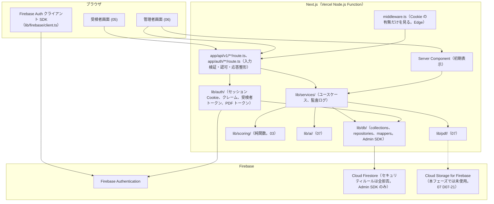
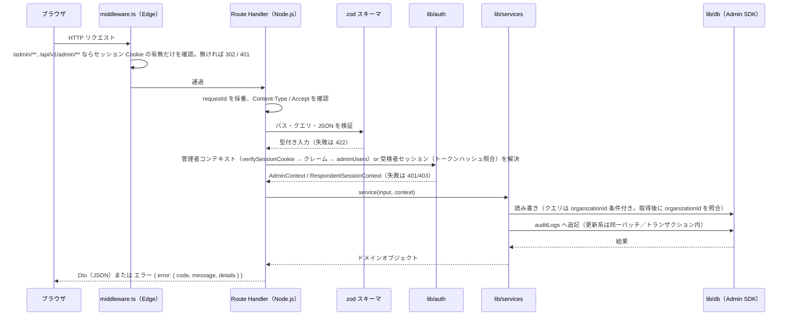
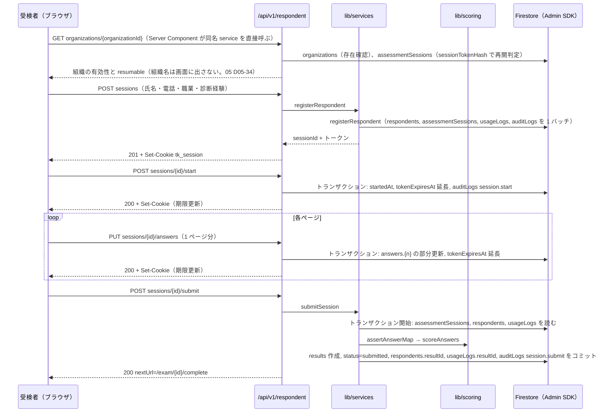
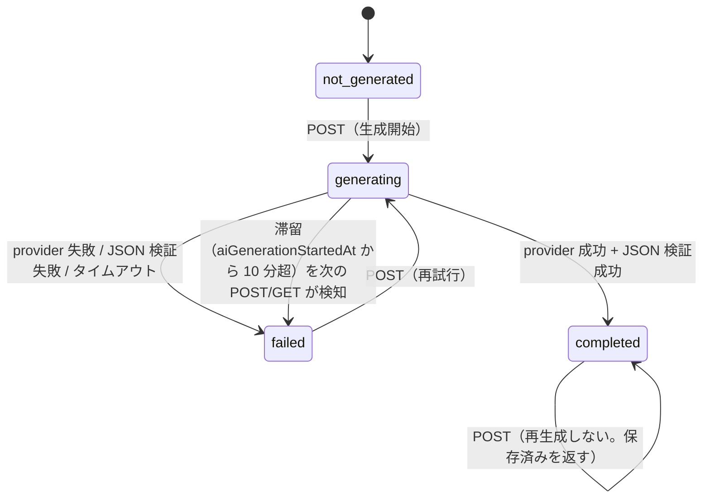
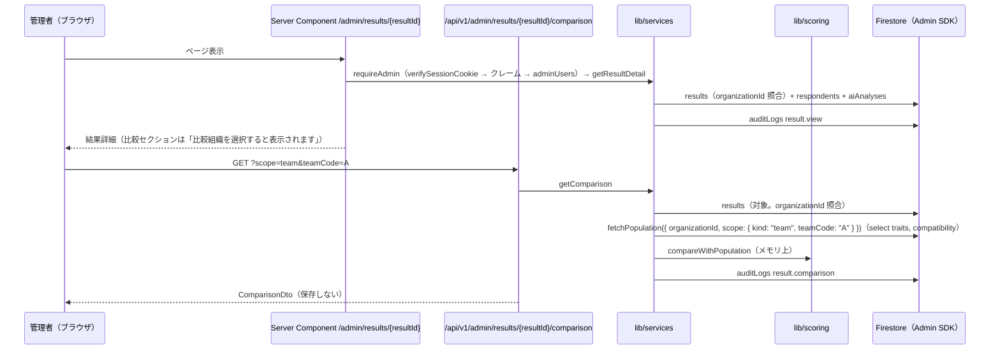
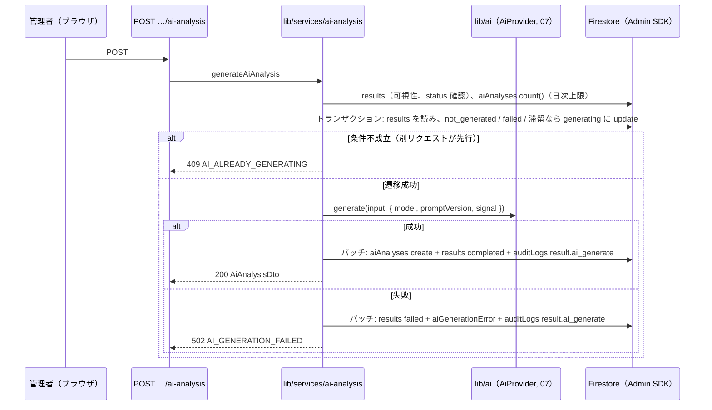
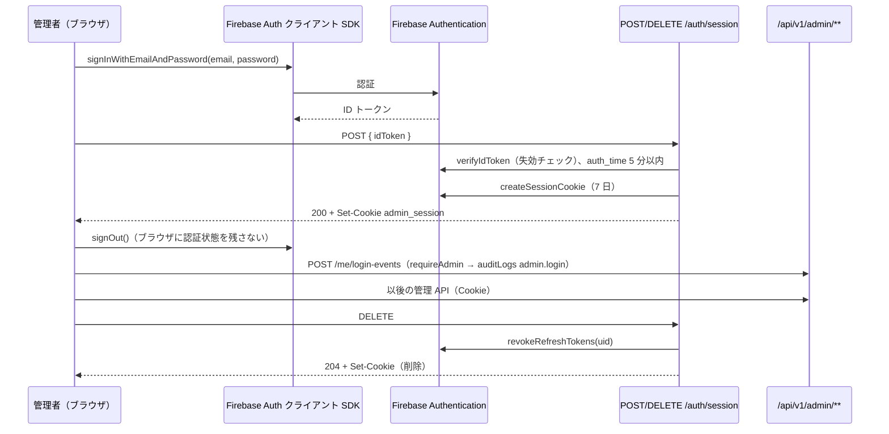

# 基本設計 04 API・サーバ処理設計

| 項目 | 内容 |
|---|---|
| 文書名 | 適性検査システム 基本設計 04 API・サーバ処理設計 |
| 版 | 2.1 |
| 作成日 | 2026-09-17（1.1 版: 2026-09-19、1.2 版: 2026-09-21、2.0 版: 2026-09-21。技術構成の変更（Supabase → Firebase。10 K-06）を反映した全面改版。2.1 版: 2026-09-21。Firebase 化後の分冊間整合（02 2.1 版の関数名・型名に統一）。改版履歴は §12） |
| 対象 | 実装者（Route Handler、`lib/services/`、`lib/auth/`、`lib/db/` の実装担当）、05〜08 分冊の設計者 |

## 0. 本書の位置づけ

本書は、共通定義（`00_共通定義.md` 2.0 版。以下「00」）の §4 で「代表」として挙げたエンドポイントを **確定** し、各 API の入出力（`Dto` / `Input`）、認可、エラー、サーバ側の処理手順（`lib/services/`）、入力検証、監査ログの書き込み箇所、レート制限、長時間処理（AI 解説・PDF）の扱いを定めるものです。

- 用語・識別子・コレクション名・フィールド名・型名は 00 に従います。Firestore のフィールド定義・検証スキーマ・複合インデックス・アクセス層（`lib/db/`）・セッション Cookie と各種トークンの実装は 02 分冊（`02_データベース設計.md`。題名は「データモデル設計（Firestore）」。以下「02」）、採点・比較の純関数は 03 分冊（以下「03」）、環境変数・ライブラリ・実行基盤・Firebase プロジェクトの設定は 01 分冊（以下「01」）が定めたものをそのまま使い、本書では参照に留めます。
- 2.1 版で、本書が呼ぶアクセス層（`lib/db/repositories/`、`lib/db/mappers/`）と `lib/auth/` の関数名・型名・`RepositoryError` のコードを 02 2.1 版（§8、§9）に **統一** しました（2.0 版の仮置き名は廃止）。02 の契約は §8.4 に要約し、各 API の処理手順は 02 の関数名で記述しています。02 と本書で食い違いが見つかった場合は、関数名・型名・コレクション・フィールドは 02、API の入出力・エラーコードは本書が正です（00 §6）。
- 本書の範囲外: 画面のレイアウトと文言（05・06）、AI プロンプトと PDF レイアウト（07）、テスト計画（08）。
- 本書と 00 が矛盾した場合は 00 を正とします。本書と 01〜03 の間で食い違いがある箇所は §11 の一覧に明記し、本書での採用案を示しています。
- 05〜08 が本書に依頼した API・Dto・エラーコードのうち、本書が名称や形を変えて確定したものは §10 の引き渡し事項に「読み替え」として列挙しています（API の契約は本書が正。05 §7.1、06 §8.2 の記載どおり）。
- 2.0 版の方針: API のパス・リクエスト・レスポンス・エラーコードは 1.2 版を **原則維持** し、Supabase Auth・RLS・SQL 関数（RPC）に依存していた記述だけを Firebase Authentication（セッション Cookie、カスタムクレーム）と Cloud Firestore（Admin SDK、バッチ／トランザクション、サーバ側の認可 3 段階。00 §4.1）に置き換えました。変更した契約は §3 の一覧に「2.0 版で変更」と付記し、§12 にまとめています。

### 0.1 参照した要件

| 参照元 | 参照した内容 |
|---|---|
| 要件定義書 §3、§4 | 受検者はログイン不要、管理者はメール＋パスワード、役割（管理者・オーナー・管理者追加・スーパーアドミン） |
| 要件定義書 §5 | 業務フロー（リンク送付→登録→回答→送信→採点→閲覧→チーム・除外・削除） |
| 要件定義書 §6.1 U-01〜U-09 | 受検者登録の入力項目、職業コード、`q` / `p` パラメータ、開始画面、ページ単位の回答保存、送信時の採点、完了後遷移 |
| 要件定義書 §6.2 A-01〜A-13 | ログイン、回答一覧（列・並び順）、チーム設定、除外設定、削除、利用履歴、結果詳細、比較組織選択、AI 解説、PDF、組織内分類、アカウント、幹部データの閲覧制限 |
| 要件定義書 §6.3、§6.6 | 送信時の同期採点、AI 解説の生成状態と保存 |
| 要件定義書 §7 | 画面一覧と結果詳細のセクション構成（1〜2 リクエストで描画するための応答設計） |
| 要件定義書 §8 | データモデル（受検者・回答・結果・AI 分析・利用履歴） |
| 要件定義書 §9 | 個人情報保護（アクセスログ）、認証、性能（1〜2 リクエスト、採点 2 秒以内）、可用性（ページ単位保存・再開） |
| 要件定義書 §11 | 不具合 10 件（特に 3・6・10 番: 母集団の統一、比較値の非永続化） |
| 要件定義書 §12 | 未確認事項（中断・再開、削除ダイアログ、幹部の非表示挙動、完了画面など） |
| 付録B §9〜§10 | 比較計算の式（API で都度計算） |
| 付録C §8 | 組織内分類の集計単位（分類 × キャラクター） |
| 付録D §1〜§2 | AI 解説の入出力と JSON スキーマ（API 応答の形） |
| 付録E §7 | PDF の 2 モード |
| tests/fixtures/README.md | 比較計算の観測値（応答 JSON の項目が検証項目を網羅していること） |
| 10 決定記録 K-01〜K-06 | 母集団に本人・幹部を含める（K-01）、データは削除しない（K-04）、技術構成の変更（K-06） |

### 0.2 決定事項との対応

| # | 決定事項 | 本書での対応 |
|---|---|---|
| 1 | Next.js（App Router）+ Firebase（Cloud Firestore、Firebase Authentication、Cloud Storage for Firebase）+ Vercel（10 K-06） | Route Handler（`app/api/v1/**/route.ts`）のみで API を構成（§1）。Firestore へのアクセスはすべてサーバ側の Admin SDK（`lib/db/`）で行い、ブラウザから直接触れない（00 §2.5、D-28）。管理者 API はセッション Cookie（`verifySessionCookie`）とカスタムクレーム（`organizationId`、`role`）で認可し、取得した文書の `organizationId` を必ず照合する（認可 3 段階。00 §4.1、§2.5.1）。受検者 API は組織 ID とセッショントークン Cookie（SHA-256 ハッシュ照合。00 D-32）で認可する（§2.5.2）。ログイン・ログアウトは `POST/DELETE /auth/session`、管理者追加は `POST /auth/invite`（§6） |
| 2 | 不具合 10 件の修正 | 比較 API は母集団を 02 の `fetchPopulation()`（00 §1.11 のクエリ。`results` の複製フィールドによる単一クエリ）で 1 回だけ取得し、差分・偏差・レーダー系列を同じ結果から返す（§5.5）。比較値は保存しない（00 D-30）。優劣性・思考の傾向は 03 の純関数に委ね、API 側で値を加工しない |
| 3 | 出題は Q1〜Q144 のみ | 回答保存 API は `questionNo` 1〜144 以外を 422 で拒否（§4.4）。送信 API は Q1〜Q144 の揃いを検証（§4.5）。`assessmentSessions.answers` map のキーは `"1"`〜`"144"` に限る（00 §2.2） |
| 4 | 既存データは移行しない | 移行用 API は作らない。`results.scoringVersion` は送信時に `SCORING_VERSION` を保存 |
| 5 | AI 解説は Claude API、差し替え可能 | AI 解説 API は `lib/ai/` の `AiProvider` 経由でのみ生成し、provider 名を応答に含める（§5.9） |
| 6 | 日本語のみ、管理画面 PC 幅、受検者画面スマートフォン対応 | エラーメッセージは日本語固定。受検者 API は 1 ページ分の回答をまとめて保存し、通信回数を抑える（§4.4） |

## 1. 全体方針

### 1.1 Route Handler と Server Action の使い分け

00 §4.1 のとおり **Server Action は使いません**。ブラウザからの更新操作はすべて Route Handler（`app/api/v1/**/route.ts`）を経由します。

| 処理の種類 | 実装場所 | 理由 |
|---|---|---|
| ブラウザからの更新（登録、回答保存、送信、チーム・除外変更、削除、AI 生成、アカウント変更） | Route Handler | 入力検証・認可・監査ログ・エラー形式を 1 か所（§2）に集約し、結合テスト（08）で HTTP レベルで検証できるようにする |
| ブラウザからの再取得（比較計算、一覧の絞り込み、AI 解説の取得、PDF） | Route Handler | 同上。比較計算は都度計算のため GET で呼ぶ（00 §4.1） |
| 画面の初期表示データ | Server Component が `lib/services/` を直接呼ぶ（00 §3.3） | HTTP を経由しないことで初期描画の往復を減らす（要件定義書 §9 性能）。**Route Handler と同じ service 関数を呼ぶ** ため、認可と監査ログの挙動は API と一致する |
| 認証操作（ログイン時の ID トークン取得、パスワード再設定メールの送信、再設定コードによるパスワード設定） | ブラウザから Firebase Auth クライアント SDK（`lib/firebase/client.ts`。00 §2.5、§4.2） | `/api/v1` には置かない。ID トークンは `POST /auth/session` に渡すためだけに使い、ブラウザに保存しない（00 D-31） |
| セッション Cookie の発行・破棄、招待受理 | `app/auth/session/route.ts`（`POST` / `DELETE`）、`app/auth/invite/route.ts`（00 §3.3） | Auth 系の Route Handler。§6 |

- 設計判断 D04-01: Server Component から service を直接呼ぶ場合も、閲覧系の監査ログ（`result.view` など）は service 内で書きます（Route Handler に書かない）。これにより、画面の初期表示でも API 経由でも同じ記録が残ります。
- 設計判断 D04-02: Route Handler の実行ランタイムはすべて Node.js（01）。`export const runtime = "nodejs"` を各 `route.ts` に明記します。Firebase Admin SDK は Edge ランタイムで動作しないため（00 D-31。実装時確認）、`middleware.ts` では Admin SDK を使いません（§8.5）。

### 1.2 層構成



| 層 | 責務 | してはいけないこと |
|---|---|---|
| Route Handler | HTTP の入出力。`Request` から入力を取り出し zod で検証（§2.3）、認可コンテキストを得て（§2.5）、service を 1 つ呼び、結果を `Dto` にして返す。例外を §2.4 のエラー応答に変換する | Firestore のクエリを書く、採点・比較の計算をする、監査ログを直接書く |
| `lib/services/` | ユースケース単位の処理。整合性の単位（バッチ／トランザクション）の指定、監査ログ、状態遷移の判定、認可 3 段階のうち「文書の `organizationId` の照合」と「役割による幹部可視性」の判定 | HTTP（`Request` / `Response`）に触れる、`process.env` を読む（01 の `serverEnv()` 経由のみ）、`firebase-admin` を直接 import する（00 §3.3） |
| `lib/auth/` | セッション Cookie の発行・検証・失効（`session-cookie.ts`）、クレームの型と取得（`claims.ts`）、管理者コンテキストの解決（`admin-context.ts`）、受検者トークンの発行・ハッシュ・検証（`respondent-token.ts`、`respondent-session.ts`）、PDF 印刷トークン（`pdf-token.ts`） | 業務データの読み書き（`adminUsers` と `assessmentSessions` の認可用の取得を除く） |
| `lib/db/` | Admin SDK の Firestore への読み書き（コレクションごとのリポジトリ関数。02）、バッチ／トランザクションの実装、`Doc` ↔ ドメイン型の変換（`mappers/`。`Timestamp` ↔ `Date`、`ScoreResult` ↔ `results` 文書） | 認可判定（`organizationId` の等価条件をクエリに含めることは行うが、判定の責任は service）、業務ルール |
| `lib/scoring/`、`lib/masters/` | 採点・比較の純関数（03） | I/O |

- Firestore にはセキュリティルールによる認可がありません（00 D-28。ルールは全拒否で、Admin SDK には適用されない）。1.x 版で RLS が担っていた「他組織・削除済み・幹部の非表示」は、すべて **service のコード** で行います。組織に属する文書へのクエリは必ず `organizationId` の等価条件を含め、単一文書の取得後も `organizationId` をクレームと照合します（00 §2.1）。この 2 点を欠いた実装は結合テスト（08）で検出します。

### 1.3 リクエスト処理の共通の流れ



## 2. 共通仕様

### 2.1 URL・メソッド・ヘッダー

| 項目 | 規約（00 §4.1 の再掲と補足） |
|---|---|
| ベースパス | `/api/v1`。受検者用 `/api/v1/respondent/...`、管理者用 `/api/v1/admin/...` |
| メソッド | 取得 GET、作成 POST、部分更新 PATCH、全置換 PUT、削除 DELETE。GET は副作用を持たない（監査ログの追記は副作用とみなさない） |
| パスパラメータ | Firestore の文書 ID（`{sessionId}`、`{resultId}`、`{respondentId}`、`{organizationId}`。自動 ID は英数字 20 文字。00 §2.1）。形式は `^[A-Za-z0-9]{1,128}$` とし（00 §4.1「英数字 1〜128 文字程度」）、満たさなければ 404（存在しない扱い。設計判断 D04-03: 400 にすると ID の推測に手掛かりを与えるため）。存在確認は Firestore の取得結果で行う。2.0 版で UUID から変更 |
| クエリ・JSON キー | camelCase |
| リクエストの Content-Type | POST／PUT／PATCH は `application/json`。それ以外は 415 `UNSUPPORTED_MEDIA_TYPE` |
| 応答の Content-Type | `application/json; charset=utf-8`。PDF のみ `application/pdf` |
| 日時 | ISO 8601、UTC、`Z` 付き（例: `2026-09-17T01:23:45.678Z`）。Firestore の `Timestamp` ↔ `Date` ↔ ISO 文字列の変換は `lib/db/mappers/`（02）と Dto の組み立てで行い、service の中では `Date` で扱う |
| 数値 | JSON の number。採点値は丸めない（03 §9）。Firestore の number をそのまま返す（1.x 版の `numeric` 文字列変換は不要） |
| 一覧応答 | `{ "items": [...], "total": n }` に加え、ページングを使う API は `page`、`pageSize` を含める（§2.2） |
| 応答ヘッダー | `X-Request-Id`（サーバが採番した UUID。リクエスト ID は文書 ID ではないため UUID のまま）。`Cache-Control: no-store`（個人情報を含むため全 API で固定） |
| リクエスト ID | `X-Request-Id` ヘッダーをクライアントが送ってきても使わず、サーバで採番する（ログの偽装防止） |
| 文字数 | 文字数の上限はコードポイント単位（`Array.from(s).length`）で数える。02 の検証スキーマと同じ規則にする |

### 2.2 ページング・並び替え

一覧 API（回答一覧、利用履歴）に共通です。

| パラメータ | 型 | 既定値 | 制約 |
|---|---|---|---|
| `page` | integer | 1 | 1 以上 |
| `pageSize` | integer | 50 | 1〜200 |
| `sort` | string | API ごとに定義 | 許可された項目名のみ |
| `order` | `asc` / `desc` | API ごとに定義 | |

応答:

```json
{
  "items": [],
  "total": 123,
  "page": 1,
  "pageSize": 50
}
```

- 設計判断 D04-04: 既存の回答一覧は全件表示と推定されますが（要件定義書 §6.2 A-02 にページングの記載なし。未確認）、1 組織あたり数百件規模（00 D-30 の推定）でも 1 リクエストで返せるよう `pageSize` の上限を 200 とし、06 分冊は初期表示で `pageSize=200` を使ってよいこととします。
- Firestore には SQL の `OFFSET` に相当する `offset()` がありますが、読み飛ばした文書も読み取りとして数えられます（実装時確認）。回答一覧はコレクションをまたぐ突き合わせと氏名の部分一致が必要なため、サーバのメモリ上でページングします（§5.3 D04-55）。利用履歴は `offset()` + `limit()` と `count()` 集計で行います（§5.8）。いずれも 1 組織あたり数百件規模を前提にした判断で、件数の上限の目安は §5.3 に記します。

### 2.3 入力検証（zod）

00 §2.1「検証ライブラリは 01 が選定」のとおり `zod` を使います（01。1.x 版から変更なし）。スキーマは **Route Handler と同じディレクトリではなく `lib/services/schemas/`** に置き、Route Handler・Server Component・テストから共有します（設計判断 D04-05）。Firestore に型制約が無いため（00 §2.1）、API の入力検証（本節）に加えて **書き込み前の文書スキーマ検証** を 02 が定めますが、両者は同じ zod を使い、値の制約（`teamCode` の `A`〜`Z`、`choiceCode` の 1〜5 など）は共通スキーマから共有します。

共通スキーマ（コピー用）:

```ts
// lib/services/schemas/common.ts
import { z } from "zod";

/** Firestore の文書 ID（自動 ID は英数字 20 文字、Firebase Auth の uid は英数字 28 文字）。00 §4.1 */
export const docIdSchema = z.string().regex(/^[A-Za-z0-9]{1,128}$/);

/** コードポイント単位で文字数を数える */
const cpLength = (s: string): number => Array.from(s).length;

/** 前後空白を除去し、空白のみを拒否する必須文字列 */
export const requiredText = (max: number) =>
  z
    .string()
    .transform((s) => s.trim())
    .refine((s) => s.length > 0, { message: "必須項目です" })
    .refine((s) => cpLength(s) <= max, { message: `${max} 文字以内で入力してください` });

export const teamCodeSchema = z.string().regex(/^[A-Z]$/, { message: "チームは A〜Z です" });

export const choiceCodeSchema = z.union([z.literal(1), z.literal(2), z.literal(3), z.literal(4), z.literal(5)]);

export const scoredQuestionNoSchema = z.number().int().min(1).max(144);

export const pagingSchema = z.object({
  page: z.coerce.number().int().min(1).default(1),
  pageSize: z.coerce.number().int().min(1).max(200).default(50),
});

export const comparisonScopeQuerySchema = z
  .object({
    scope: z.enum(["organization", "team"]),
    teamCode: teamCodeSchema.optional(),
  })
  .superRefine((v, ctx) => {
    if (v.scope === "team" && v.teamCode === undefined) {
      ctx.addIssue({ code: z.ZodIssueCode.custom, path: ["teamCode"], message: "scope=team のときは teamCode が必要です" });
    }
    if (v.scope === "organization" && v.teamCode !== undefined) {
      ctx.addIssue({ code: z.ZodIssueCode.custom, path: ["teamCode"], message: "scope=organization のときは teamCode を指定できません" });
    }
  });

export const pdfModeSchema = z.enum(["full", "restricted"]);
```

検証の規則:

| 規則 | 内容 |
|---|---|
| 未知のキー | JSON ボディの未知キーは無視する（`z.object` の既定。`strict()` は使わない）。将来のキー追加でクライアントを壊さないため |
| 検証失敗 | 422 `VALIDATION_ERROR`。`details.issues` に `{ path: "answers[3].choiceCode", message: "..." }` の配列を入れる。**入力値そのものは `details` に含めない**（個人情報の混入防止。01 のログ方針） |
| JSON 構文エラー | 400 `INVALID_JSON` |
| 電話番号 | 既存の形式検証は未確認（要件定義書 §12）。仮置き（設計判断 D04-06）: 前後空白を除去し、全角数字・全角ハイフンを半角に正規化したうえで、`^[0-9+()\-]{8,20}$` を満たすこと。Firestore（`respondents.phoneNumber`、`usageLogs.phoneNumber`）には正規化後の値を保存する。表示・赤枠の条件は 05 分冊 |
| 氏名 | 1〜100 文字。文字種は制限しない（02 の `respondents.name` の検証スキーマと同じ上限にする） |

検証エラー応答の例:

```json
{
  "error": {
    "code": "VALIDATION_ERROR",
    "message": "入力内容に誤りがあります",
    "details": {
      "issues": [
        { "path": "phoneNumber", "message": "電話番号の形式が正しくありません" },
        { "path": "occupationCode", "message": "職業を選択してください" }
      ]
    }
  }
}
```

### 2.4 エラー応答とエラーコード一覧

形式は 00 §4.1 のとおりです。`code` は本書で一覧化し、`lib/services/errors.ts` の `ApiError` クラスで表現します。

```ts
// lib/services/errors.ts
export type ApiErrorCode =
  | "INVALID_JSON" | "UNSUPPORTED_MEDIA_TYPE" | "VALIDATION_ERROR"
  | "UNAUTHENTICATED" | "ID_TOKEN_INVALID" | "RESPONDENT_TOKEN_INVALID" | "RESPONDENT_TOKEN_EXPIRED"
  | "FORBIDDEN" | "ADMIN_SUSPENDED" | "ADMIN_NOT_REGISTERED" | "ROLE_REQUIRED"
  | "NOT_FOUND" | "ORGANIZATION_NOT_FOUND" | "SESSION_NOT_FOUND" | "RESULT_NOT_FOUND" | "RESPONDENT_NOT_FOUND"
  | "SESSION_ALREADY_SUBMITTED" | "ANSWERS_INCOMPLETE" | "POPULATION_EMPTY"
  | "AI_ALREADY_GENERATING" | "AI_GENERATION_FAILED" | "AI_DAILY_LIMIT_EXCEEDED"
  | "PDF_GENERATION_FAILED" | "INVITE_TOKEN_INVALID" | "EMAIL_ALREADY_REGISTERED" | "CURRENT_PASSWORD_MISMATCH"
  | "RATE_LIMITED" | "SERVICE_UNAVAILABLE" | "INTERNAL_ERROR";

export class ApiError extends Error {
  constructor(
    readonly status: number,
    readonly code: ApiErrorCode,
    message: string,
    readonly details: Readonly<Record<string, unknown>> = {},
  ) {
    super(message);
    this.name = "ApiError";
  }
}
```

| HTTP | `code` | `message`（日本語。この文言を返す） | 発生箇所 |
|---:|---|---|---|
| 400 | `INVALID_JSON` | リクエスト本文を JSON として読み取れません | 全 POST／PUT／PATCH |
| 415 | `UNSUPPORTED_MEDIA_TYPE` | Content-Type は application/json を指定してください | 同上 |
| 422 | `VALIDATION_ERROR` | 入力内容に誤りがあります | 全 API（`details.issues`） |
| 401 | `UNAUTHENTICATED` | ログインが必要です | 管理者 API（セッション Cookie なし・検証失敗・期限切れ・失効済み。§2.5.1） |
| 401 | `ID_TOKEN_INVALID` | ログインに失敗しました。もう一度ログインしてください | `POST /auth/session`（ID トークンの検証失敗・期限切れ・`auth_time` が古い。§6.1）、`PATCH /api/v1/admin/me` の再認証トークン（§5.1。ただしこちらは 422 `CURRENT_PASSWORD_MISMATCH` に変換する）。2.0 版で追加 |
| 401 | `RESPONDENT_TOKEN_INVALID` | 受検セッションを確認できません。受検リンクから登録し直してください | 受検者 API（Cookie なし・不一致） |
| 401 | `RESPONDENT_TOKEN_EXPIRED` | 受検セッションの有効期限が切れました。受検リンクから登録し直してください | 受検者 API（期限切れ） |
| 403 | `FORBIDDEN` | この操作を行う権限がありません | 汎用 |
| 403 | `ADMIN_SUSPENDED` | このアカウントは利用停止中です | `adminUsers.isSuspended == true` または `deletedAt` 設定済み |
| 403 | `ADMIN_NOT_REGISTERED` | 管理者として登録されていません | セッション Cookie は有効だが、クレームに `organizationId` が無い・`role` が 3 値以外、または `adminUsers/{uid}` 文書が無い・文書の `organizationId` がクレームと一致しない（00 §5。§2.5.1） |
| 403 | `ROLE_REQUIRED` | この操作にはオーナー権限が必要です | owner／super_admin 限定 API を admin が呼んだ |
| 404 | `NOT_FOUND` | 指定されたリソースが見つかりません | 文書 ID の形式不正、未定義パス |
| 404 | `ORGANIZATION_NOT_FOUND` | 受検リンクが無効です。管理者にお問い合わせください | 受検者登録（組織なし・論理削除済み） |
| 404 | `SESSION_NOT_FOUND` | 受検セッションが見つかりません | 送信 API のみ（送信トランザクション内で `assessmentSessions` 文書を見つけられない。§4.5 手順 6）。Cookie とセッション ID の検証（§2.5.2）では文書が無い場合も 401 `RESPONDENT_TOKEN_INVALID` に統一し、このコードは返さない |
| 404 | `RESULT_NOT_FOUND` | 診断結果が見つかりません | 管理者 API（他組織・削除済み・admin に対する幹部データを含む） |
| 404 | `RESPONDENT_NOT_FOUND` | 受検者が見つかりません | 管理者 API（同上） |
| 409 | `SESSION_ALREADY_SUBMITTED` | この受検はすでに送信済みです | 回答保存・送信・開始 |
| 422 | `ANSWERS_INCOMPLETE` | 未回答の設問があります | 送信（`details.missing` に設問番号の配列） |
| 409 | `POPULATION_EMPTY` | 比較対象となる受検者がいません | 比較計算（母集団 0 件。03 D3-08） |
| 409 | `AI_ALREADY_GENERATING` | AI 解説を生成中です。しばらくしてから再度お試しください | AI 生成 |
| 502 | `AI_GENERATION_FAILED` | AI 解説の生成に失敗しました。再度お試しください | AI 生成（provider エラー・JSON 検証失敗・タイムアウト） |
| 429 | `AI_DAILY_LIMIT_EXCEEDED` | 本日の AI 解説の生成回数の上限に達しました | AI 生成（§2.8。上限値は 01 の仮置き。10 K-03） |
| 500 | `PDF_GENERATION_FAILED` | PDF の生成に失敗しました。再度お試しください | PDF |
| 404 | `INVITE_TOKEN_INVALID` | 管理者追加用リンクが無効です。管理者に新しいリンクを発行してもらってください | 招待受理 |
| 409 | `EMAIL_ALREADY_REGISTERED` | このメールアドレスはすでに登録されています | 招待受理、メール変更（Firebase Auth の `auth/email-already-exists`） |
| 422 | `CURRENT_PASSWORD_MISMATCH` | 現在のパスワードが正しくありません | パスワード変更（再認証トークンの検証失敗。§5.1） |
| 429 | `RATE_LIMITED` | アクセスが集中しています。しばらくしてから再度お試しください | レート制限（§2.8）、Firebase の `auth/too-many-requests`、Firestore の `resource-exhausted` |
| 503 | `SERVICE_UNAVAILABLE` | 一時的にご利用いただけません。しばらくしてから再度お試しください | Firestore・Firebase Auth の一時的な失敗（`unavailable`、`deadline-exceeded`、トランザクションの再試行上限超過）。2.0 版で追加。`Retry-After: 5` を付ける |
| 500 | `INTERNAL_ERROR` | サーバ内部でエラーが発生しました | 予期しない例外。`details` は空、`X-Request-Id` で追跡 |

- 設計判断 D04-07: 他組織のリソース、論理削除済みのリソース、`admin` が見られない幹部（`executive`）のリソースは、いずれも **404** で返し、403 と区別しません（存在自体を見せない。00 §5）。Firestore にはこの絞り込みを担うルールが無いため、service が「取得した文書の `organizationId` がクレームと一致しない」「`deletedAt != null`」「`respondentKind == "executive"` かつ `canViewExecutives == false`」のいずれかを検出したときに、これらのコードを投げます。
- 設計判断 D04-08: `AI_GENERATION_FAILED` は 502（上流エラー）にします。500 と区別することで、監視（01）で自システムの障害と外部 API の障害を分けて数えられます。
- `message` は画面にそのまま表示できる日本語にします（06・05 分冊は原則としてこの文言を表示し、必要なら上書きします）。個人情報・トークン・Firestore のパス・スタックトレース・Firebase のエラーコード文字列を含めません。
- 05 §7.1 が仮称として挙げた 401 `UNAUTHORIZED` は採用せず、`RESPONDENT_TOKEN_INVALID`（Cookie なし・不一致・文書なし）と `RESPONDENT_TOKEN_EXPIRED`（期限切れ）の 2 つに分けます（設計判断 D04-42: 画面の表示は同じ E-04 でよいが、期限切れは「登録し直し」の案内、それ以外は「受検リンクから開き直す」の案内に分けられるようにする）。05 §7.1・§9・D05-26 の読み替えは §10 に列挙します。

#### Firebase 由来のエラーの対応表（`lib/services/firebase-errors.ts`）

Admin SDK の例外（`FirebaseAuthError` の `code`、Firestore の gRPC ステータスコード）は Route Handler に漏らさず、`translateFirebaseError(error): ApiError` で §2.4 のコードに変換します（1.x 版の `translateRpcError` を置き換え。設計判断 D04-60）。対応表に無いものは 500 `INTERNAL_ERROR` にし、元の `code` はサーバログにだけ出します（応答には含めない）。コード名は Admin SDK の版で変わり得るため、実装時確認とします。

| 由来 | Firebase のエラーコード（実装時確認） | 変換後 | 備考 |
|---|---|---|---|
| `verifySessionCookie` | `auth/session-cookie-expired`、`auth/session-cookie-revoked`、`auth/invalid-session-cookie-duration`、`auth/argument-error`（Cookie 文字列が不正） | 401 `UNAUTHENTICATED` | 失効（`revokeRefreshTokens` 後）と期限切れは区別しない。画面は `/admin/login` へ |
| `verifyIdToken` | `auth/id-token-expired`、`auth/id-token-revoked`、`auth/invalid-id-token`、`auth/argument-error` | 401 `ID_TOKEN_INVALID` | `POST /auth/session` のみ。`PATCH /me` の再認証では 422 `CURRENT_PASSWORD_MISMATCH` |
| `verifyIdToken` / `verifySessionCookie`（`checkRevoked = true`） | `auth/user-disabled` | `POST /auth/session` では 401 `ID_TOKEN_INVALID`、管理者 API では 403 `ADMIN_SUSPENDED` | 無効化ユーザーが拒否されること自体が実装時確認（00 §5）。拒否されない場合は `adminUsers.isSuspended` で判定する（§2.5.1 手順 4 が常に行う） |
| `createUser` / `updateUser` | `auth/email-already-exists` | 409 `EMAIL_ALREADY_REGISTERED` | |
| `createUser` / `updateUser` | `auth/invalid-email`、`auth/invalid-password`、`auth/invalid-display-name` | 422 `VALIDATION_ERROR`（`issues[0].path` に `email` / `password` / `name`） | パスワード強度は Firebase コンソールのパスワードポリシー（01）で強制される場合、`auth/invalid-password` に含まれる（実装時確認） |
| `getUser` / `updateUser` / `setCustomUserClaims` / `revokeRefreshTokens` | `auth/user-not-found` | 403 `ADMIN_NOT_REGISTERED` | セッション Cookie の uid が Auth に存在しない（運用でユーザーを削除した直後） |
| Firebase Auth 全般 | `auth/too-many-requests` | 429 `RATE_LIMITED` | |
| Firebase Auth 全般 | `auth/internal-error`、`auth/insufficient-permission`、`auth/invalid-credential`（サービスアカウントの不備） | 500 `INTERNAL_ERROR` | 構成ミス。01 の起動時検証で早期に検出する |
| Firestore | `aborted`（トランザクションの競合。SDK が既定回数再試行した後）、`unavailable`、`deadline-exceeded` | 503 `SERVICE_UNAVAILABLE` | ブラウザ側は同じ操作の再試行を促す |
| Firestore | `resource-exhausted` | 429 `RATE_LIMITED` | 割り当て超過 |
| Firestore | `failed-precondition`（複合インデックス未定義・トランザクション内での読み取り順序違反） | 500 `INTERNAL_ERROR` | 実装不備。Emulator の警告（00 D-33）と結合テストで検出する |
| Firestore | `permission-denied` | 500 `INTERNAL_ERROR` | Admin SDK では通常発生しない（サービスアカウントの権限不足 = 構成ミス） |
| Firestore | `not-found`（`update()` の対象文書が無い） | 呼び出し側の service が文脈に応じて 404（`RESPONDENT_NOT_FOUND` など）に変換 | トランザクション内では事前の `get` で判定するため通常は発生しない |

### 2.5 認可の共通処理（`lib/auth/`）

#### 2.5.1 管理者コンテキスト（セッション Cookie → カスタムクレーム → `adminUsers` 文書）

00 §4.1 の認可 3 段階「(1) セッション Cookie の検証、(2) クレームの `role` による機能制限、(3) 取得した文書の `organizationId` とクレームの `organizationId` の一致確認」のうち、(1)(2) を `requireAdmin` / `requireOwner` が、(3) を各 service が行います。

```ts
// lib/auth/claims.ts（02 が確定。本書は形だけを示す）
import type { AdminRole } from "@/lib/db/types";   // "owner" | "admin" | "super_admin"（02 参照）

/** Firebase Auth のカスタムクレーム（00 §5）。setCustomUserClaims でサーバだけが設定する */
export interface AdminClaims {
  readonly organizationId: string;
  readonly role: AdminRole;
}

/** DecodedIdToken（verifySessionCookie / verifyIdToken の戻り）からクレームを取り出す。形が合わなければ null（02 §9.2） */
export function parseAdminClaims(decoded: DecodedIdToken): AdminClaims | null;
export function canViewExecutives(role: AdminRole): boolean;      // owner / super_admin → true
export function canManageOrganization(role: AdminRole): boolean;  // 同上（requireOwner が使う）
```

```ts
// lib/auth/session-cookie.ts（02 §9.11 が確定。本書は 04 が呼ぶ関数と定数を示す）
import type { DecodedIdToken } from "firebase-admin/auth";

export const SESSION_COOKIE_NAME: string;                                   // 環境変数 SESSION_COOKIE_NAME。初期値 "admin_session"（00 §3.2）
export const SESSION_COOKIE_MAX_AGE_MS: number;                             // 7 日（§6.1 D04-53。createSessionCookie の許容範囲 5 分〜14 日の内側。実装時確認）

/** verifyIdToken(idToken, true) と auth_time の確認 → createSessionCookie(idToken, { expiresIn }) の順に行う（§6.1）。クレームは検査しない（D04-54） */
export async function createAdminSessionCookie(idToken: string): Promise<{ readonly cookie: string; readonly expiresAt: Date; readonly uid: string }>;

/** verifySessionCookie(cookie, true)（失効チェックあり）。失効・無効は null。requireAdmin が null を ApiError(401, UNAUTHENTICATED) に変換する */
export async function verifyAdminSessionCookie(cookie: string): Promise<DecodedIdToken | null>;

/** revokeRefreshTokens(uid)。以後、この uid の既存セッション Cookie は verifyAdminSessionCookie で null になる（00 §5） */
export async function revokeAdminSessions(uid: string): Promise<void>;

/** Set-Cookie の属性（本書が定める）。HttpOnly、Secure（ローカルのみ外す）、SameSite=Lax、Path=/、Max-Age は expiresIn と同じ */
export function sessionCookieOptions(expiresAt: Date, isLocal: boolean): { name: string; httpOnly: true; secure: boolean; sameSite: "lax"; path: "/"; expires: Date };
```

```ts
// lib/auth/admin-context.ts
import type { AdminRole } from "@/lib/db/types";

export interface AdminContext {
  readonly uid: string;                  // Firebase Auth の uid = adminUsers の文書 ID（00 D-22）。Dto では adminUserId として返す
  readonly organizationId: string;       // クレームの organizationId（adminUsers 文書の同名フィールドと一致することを手順 4 で確認済み）
  readonly role: AdminRole;              // クレームの role
  readonly canViewExecutives: boolean;   // role が owner または super_admin（00 §5、D-14）
  readonly email: string | null;         // セッション Cookie の email クレーム（表示用。Firebase Auth が正で adminUsers には持たない。00 §2.2）
  readonly displayName: string;          // adminUsers.displayName
  readonly request: RequestMeta;         // §2.6 の監査ログ用
}

export interface RequestMeta {
  readonly requestId: string;
  readonly ipAddress: string | null;     // x-forwarded-for の先頭
  readonly userAgent: string | null;     // 500 文字で切り詰め
}

/**
 * セッション Cookie から管理者コンテキストを解決する。
 * - Cookie なし・検証失敗・期限切れ・失効 → ApiError(401, UNAUTHENTICATED)
 * - クレーム不正、adminUsers 文書なし、文書の organizationId 不一致 → ApiError(403, ADMIN_NOT_REGISTERED)
 * - adminUsers.isSuspended または deletedAt → ApiError(403, ADMIN_SUSPENDED)
 */
export async function requireAdmin(request: Request): Promise<AdminContext>;

/**
 * Server Component 用（引数なし）。Cookie は next/headers の cookies() から読み、
 * RequestMeta は headers() から組み立てる（requestId は採番）。判定は Request 版と同じ（§8.3）。
 */
export async function requireAdmin(): Promise<AdminContext>;

/** owner / super_admin 以外なら ApiError(403, ROLE_REQUIRED) */
export function requireOwner(ctx: AdminContext): AdminContext;
```

処理手順（`requireAdmin`）:

1. Cookie（名前は `SESSION_COOKIE_NAME`、既定 `admin_session`）を読み、無ければ 401 `UNAUTHENTICATED`。
2. `verifyAdminSessionCookie(cookie)`（内部で `verifySessionCookie(cookie, true)`）。`null`（検証失敗・期限切れ・失効（`revokeRefreshTokens` 後））はすべて 401 `UNAUTHENTICATED`（§2.4 の対応表）。無効化（`disabled`）ユーザーもここで拒否されることを期待するが、実装時確認とし、拒否されない場合に備えて手順 4 で `isSuspended` を必ず見る（00 §5）。
3. `parseAdminClaims(decoded)` が `null`（`organizationId` が無い、`role` が 3 値以外）なら 403 `ADMIN_NOT_REGISTERED`（00 §5 の「ログインできても管理 API を利用できない」。1.x 版と同じく画面は E-01 で扱えるよう 403 とし、Cookie 自体は有効なので 401 にはしない。設計判断 D04-09 改）。
4. `getAdminUser(uid)`（`lib/db/repositories/admin-users-repository.ts`。02 §8.3）で `adminUsers/{uid}` を 1 件取得する（00 D-22: クレームから 1 回の `get` で引ける）。文書が無い、または文書の `organizationId` / `role` がクレームと異なる（`scripts/set-admin-role` の途中失敗など）なら 403 `ADMIN_NOT_REGISTERED`（不一致のときは監査ログ `admin.claims_mismatch`（`actorKind: "system"`）を `writeAuditLog` で残す。02 §9.2）。`isSuspended == true` または `deletedAt != null` なら 403 `ADMIN_SUSPENDED`。
5. `canViewExecutives = role in ("owner", "super_admin")`。`email` は復号したクレームの `email`（無ければ `null`。実装時確認: セッション Cookie に `email` クレームが含まれること。含まれない場合は `getUser(uid)` で引くが、`GET /me` 以外では使わないため §5.1 だけで呼ぶ）。
6. `RequestMeta` を組み立てる。

- 幹部データの非表示は **service のクエリ条件と取得後の判定** で担保します（1.x 版の RLS の代替）。一覧・組織内分類・利用履歴は `admin` のとき `respondentKind == "applicant"` の等価条件を付け（00 §5）、単一文書の取得（結果詳細・比較・更新・削除・AI・PDF）は `respondents.kind`（または `results.respondentKind`）が `executive` かつ `canViewExecutives == false` なら 404 を返します（D04-07）。共通の判定関数を `lib/services/visibility.ts` に置きます（§8.1。`assertVisibleToAdmin(ctx, doc)`）。
- `super_admin` は `owner` と同じ扱いです（00 D-14）。
- 1 リクエストあたりの Firebase への往復は `verifySessionCookie`（公開鍵をキャッシュした後はローカル検証。`checkRevoked = true` のため `tokensValidAfterTime` の確認で Auth への問い合わせが 1 回発生する。実装時確認）と `adminUsers` の `get` 1 回です。Server Component と Route Handler が同じ画面表示の中で複数回 `requireAdmin` を呼ぶ場合は、06 の `AdminShell` と同じくリクエスト単位で結果を共有します（React の `cache()`。06 §1.3）。
- 設計判断 D04-09 改（2.0 版）: 1.x 版の「利用停止の判定にのみサービスロールを使う」は、Admin SDK が常にサービスアカウントで動く 2.0 版では不要になり、`adminUsers` の取得を全リクエストで行う形に置き換えました。返す情報は状態のみで変わりません。

#### 2.5.2 受検者セッションコンテキスト

00 §4.1・D-32（乱数トークンを Cookie に、SHA-256 ハッシュを `assessmentSessions.sessionTokenHash` に保存）を実装します。トークンの発行・ハッシュ・検証の実体は `lib/auth/respondent-token.ts`（00 §3.3。02 が確定）で、本書はその契約と、`{sessionId}` との突き合わせ（`respondent-session.ts`）を定めます。

```ts
// lib/auth/respondent-token.ts（02 が確定。本書は契約を示す）
import { createHash, randomBytes } from "node:crypto";

export const RESPONDENT_COOKIE_NAME = "tk_session";                 // 01
export const RESPONDENT_TOKEN_TTL_MS = 7 * 24 * 60 * 60 * 1000;      // 7 日（00 D-32。10 K-04「再開できる期間」。§11 D04-10）

export interface IssuedRespondentToken {
  readonly token: string;      // base64url 43 文字
  readonly tokenHash: string;  // sha256 hex 64 文字
  readonly expiresAt: Date;
}

export function issueRespondentToken(now: Date): IssuedRespondentToken {
  const token = randomBytes(32).toString("base64url");
  return { token, tokenHash: hashRespondentToken(token), expiresAt: new Date(now.getTime() + RESPONDENT_TOKEN_TTL_MS) };
}

export function hashRespondentToken(token: string): string {
  return createHash("sha256").update(token, "utf8").digest("hex");
}

/** Set-Cookie の属性（01）。ローカルのみ Secure を外す */
export function respondentCookieOptions(expiresAt: Date, isLocal: boolean) {
  return { name: RESPONDENT_COOKIE_NAME, httpOnly: true, secure: !isLocal, sameSite: "lax" as const, path: "/", expires: expiresAt };
}
```

```ts
// lib/auth/respondent-session.ts
import type { SessionStatus, RespondentKind } from "@/lib/db/types";   // 02 §5.3

export interface RespondentSessionContext {
  readonly sessionId: string;
  readonly organizationId: string;
  readonly respondentId: string;
  readonly kind: RespondentKind;
  readonly status: SessionStatus;   // draft | submitted
  readonly tokenExpiresAt: Date;
  readonly request: RequestMeta;
}

/**
 * Cookie のトークンと {sessionId} の組を検証する。
 * - Cookie なし → 401 RESPONDENT_TOKEN_INVALID
 * - 文書なし（sessionId が無い、sessionTokenHash 不一致、deletedAt あり）→ 401 RESPONDENT_TOKEN_INVALID
 * - tokenExpiresAt <= now → 401 RESPONDENT_TOKEN_EXPIRED
 * status の判定（draft 必須）は呼び出し側の service が行う（GET は submitted でも許可するため）
 */
export async function requireRespondentSession(request: Request, sessionId: string): Promise<RespondentSessionContext>;

/**
 * Server Component 用。next/headers の cookies() から tk_session を読む以外は requireRespondentSession と同じ。
 * 05 §1.3 の判定表（R-02〜R-05 の初期表示）が呼ぶ。RequestMeta は headers() から組み立てる（requestId は採番）。
 */
export async function requireRespondentSessionFromCookies(sessionId: string): Promise<RespondentSessionContext>;

/**
 * 受検リンク（/exam?q&p）を開き直したときの再開判定（05 §6.3 の ResumeBanner）。
 * Cookie のトークンのハッシュだけで assessmentSessions を 1 件引き、
 * 「organizationId と kind が一致」「status == draft」「deletedAt == null」「tokenExpiresAt > now」のときだけ sessionId を返す。
 * それ以外（Cookie なし・文書なし・別組織・別区分・submitted・期限切れ）は null を返し、例外を投げない。個人情報は返さない。
 */
export async function findResumableSession(
  cookieToken: string | null,
  organizationId: string,
  kind: RespondentKind,
): Promise<{ readonly sessionId: string; readonly answeredCount: number } | null>;
```

処理手順（`requireRespondentSession`）:

1. `sessionId` が文書 ID の形式（§2.1）でなければ 404 `NOT_FOUND`。
2. Cookie `tk_session` を読み、無ければ 401 `RESPONDENT_TOKEN_INVALID`。
3. `hashRespondentToken(token)` を計算し、`getSession(sessionId)`（`lib/db/repositories/assessment-sessions-repository.ts`。02 参照）で `assessmentSessions/{sessionId}` を 1 件取得する。文書が無い、`sessionTokenHash` がハッシュと一致しない、`deletedAt != null` のいずれかなら 401 `RESPONDENT_TOKEN_INVALID`（`sessionId` の存在有無を区別しない。404 `SESSION_NOT_FOUND` は返さない）。ハッシュの比較は `timingSafeEqual` で行う。
4. `tokenExpiresAt <= now` なら 401 `RESPONDENT_TOKEN_EXPIRED`。
5. `respondentId` で `respondents` を 1 件取得して `kind` を得る（`getRespondentById({ respondentId, organizationId: session.organizationId })`。02 §8.4。管理者の可視性判定を伴わない取得関数）。`null`（文書が無い・`deletedAt != null`・`organizationId` がセッションと異なる）の場合は整合性の異常として 401 `RESPONDENT_TOKEN_INVALID`（論理削除は 3 文書同一バッチのため通常は発生しない。00 §2.2）。コンテキストを返す。

処理手順（`findResumableSession`。設計判断 D04-43）:

1. `cookieToken` が無ければ `null`。
2. `hashRespondentToken(cookieToken)` で `getSessionByTokenHash({ organizationId, sessionTokenHash: hash, now })`（02 §8.4。`assessmentSessions` を `sessionTokenHash == hash` で 1 件引き（02 Q10。単一フィールドの等価条件のため複合インデックス不要）、`deletedAt != null`・期限切れ・組織不一致は `null` を返す。`sessionTokenHash` は乱数由来で実質一意。00 §2.1）。無ければ `null`。
3. `status == "draft"` でなければ `null`（削除済み・期限切れ・組織不一致は手順 2 で `null` になっている）。
4. `getRespondentById({ respondentId, organizationId })`（02 §8.4）で受検者を引き、`kind == kind` でなければ `null`（05 §6.3: 区分の取り違えを防ぐ）。
5. `answers` map のキー数を数え、`{ sessionId, answeredCount }` を返す（05 の `ResumeBanner` は `sessionId` だけを使う。`answeredCount` は「n 問まで回答済み」の表示用で、氏名などは含めない）。

- 受検者 API は Admin SDK（サービスアカウント。セキュリティルールの対象外）で動くため、**全ての読み書きを `sessionId` 1 件とそれに紐づく `respondentId`・`usageLogs` 1 件に限定** し、`organizationId` はコンテキストの値を使います（00 D-23、D-28）。リクエストで組織 ID を受け取るのは登録 API（§4.2）と受検リンク検証 API（§4.1。`findResumableSession` を呼ぶ）だけです。
- `findResumableSession` は Cookie の所持者が「自分の」`draft` セッションを見つけるだけの関数で、`sessionId` を返した後の実際の再開は `requireRespondentSession` の通常の検証（トークン一致）を経ます。トークンを持たない第三者は `sessionId` を得られません。

### 2.6 監査ログ（`lib/services/audit.ts`）

`auditLogs` コレクション（00 §2.2、D-24）への追記は **すべて本書の service が行います**。1.x 版で DB 関数が書いていた `respondent.delete`、`session.submit`、`organization.rotate_invite_token` も、2.0 版では service が本処理と同じバッチ／トランザクションの中で書きます（Firestore に SQL 関数は無い。10 K-06）。`action` の一覧は本書が確定します（00 §2.2「04 が確定」）。

```ts
// lib/services/audit.ts
import type { RequestMeta } from "@/lib/auth/admin-context";
import type { AdminRole } from "@/lib/db/types";   // 02 参照

export type AuditAction =
  | "respondent.register" | "session.start" | "session.submit"
  | "admin.signup" | "admin.login" | "admin.claims_mismatch"
  | "result.list" | "result.view" | "result.comparison" | "result.ai_generate" | "result.pdf_export"
  | "respondent.update_team" | "respondent.update_exclusion" | "respondent.delete"
  | "usage_log.view" | "classification.view" | "account.update" | "organization.rotate_invite_token"
  // 以下はリポジトリ・スクリプト（02 §9.6、§9.9）が書く。service からは呼ばないが、AuditAction の全集合は 02 §11 の表と一致させる
  | "organization.create" | "admin.create" | "admin.role_change" | "admin.suspend" | "admin.unsuspend" | "admin.delete";

export interface AuditEntry {
  readonly organizationId: string;
  readonly actorKind: "admin" | "respondent" | "system";
  readonly actorUid: string | null;         // admin: Firebase Auth の uid、respondent: respondentId、system: null（00 §2.2 の actorUid）
  readonly actorRole: AdminRole | null;     // admin のときクレームの role、それ以外は null（00 §2.2 の actorRole）
  readonly action: AuditAction;
  readonly targetCollection: string | null; // 00 §2.2 の targetCollection（COLLECTIONS の値）
  readonly targetId: string | null;
  readonly details: AuditDetails;
  readonly request: RequestMeta;            // ipAddress / userAgent を 02 の AuditEntry（ipAddress / userAgent の平坦なフィールド）に写す
}

/** details の値は文字列・数値・真偽値・null か、文字列の配列（例: account.update の fields）。ネストしたオブジェクトは入れない（02 §5.3 AuditDetails と同じ） */
export type { AuditDetailValue, AuditDetails } from "@/lib/db/types";

/** 単独で追記する（閲覧系）。02 の appendAuditLog() を呼ぶ。失敗しても業務処理は成功させる（ログに warn を出す）。設計判断 D04-11 */
export async function writeAuditLog(entry: AuditEntry): Promise<void>;

/** 更新系: 本処理と同じ WriteBatch / Transaction に auditLogs の create を積む（02 の addAuditLogToBatch(batch, entry) を呼ぶ）。本処理と一緒にコミットされ、失敗すれば本処理も失敗する */
export type { AuditWriter } from "@/lib/db/repositories/audit-logs-repository";   // WriteBatch | Transaction の別名。02 §8.6 が export する（lib/services/ は firebase-admin を import しない）
export function enqueueAuditLog(writer: AuditWriter, entry: AuditEntry): void;
```

- `lib/services/audit.ts` の `AuditEntry`（`request: RequestMeta` を持つ）は、02 §8.6 の `AuditEntry`（`ipAddress` / `userAgent` を平坦に持ち、`action` は `string`）へ `writeAuditLog` / `enqueueAuditLog` が変換します。登録・開始・送信・チーム／除外・削除・再発行・AI 保存／失敗の監査ログは 02 のリポジトリ関数が `meta: RequestMeta` を受け取って同一バッチ／トランザクションに書くため、service は `request` を渡すだけです（02 §8.1）。service が自分で書くのは閲覧系（`writeAuditLog`）と `admin.login`・`account.update`・`admin.claims_mismatch` です。

| 規則 | 内容 |
|---|---|
| 書き込み経路 | すべて Admin SDK（`lib/db/repositories/audit-logs-repository.ts` の `appendAuditLog` / `addAuditLogToBatch`。02 §8.6）。1.x 版の「利用者セッションのクライアントで `actor_id = auth.uid()` を強制」は無くなったため、`actorUid` は service が `AdminContext.uid` / `RespondentSessionContext.respondentId` から必ず設定する（リクエストから受け取らない） |
| タイミング | 更新系（登録・開始・送信・チーム・除外・削除・再発行・アカウント変更・AI 生成の完了／失敗）は本処理と **同じバッチ／トランザクション** に積み、成功時だけ残る。閲覧系（`result.list`、`result.view`、`result.comparison`、`result.pdf_export`、`usage_log.view`、`classification.view`）はデータ取得の成功後に単独で追記する。失敗した操作は記録しない（失敗はアプリログ。01） |
| 失敗時 | 閲覧系の追記が失敗しても本処理の応答は変えない（設計判断 D04-11: 閲覧をログ障害で止めない。ただし `logger.warn` で `requestId` とともに記録し、監視対象にする）。更新系は同一バッチのため、監査ログだけが失敗することはない |
| `details` | 個人情報を入れない。値は `{ before, after }` のようにフィールドの値だけ。配列は `account.update` の `fields`（例 `{ "fields": ["name"] }`）のように文字列の配列に限る（`AuditDetails` 型）。Firestore には map として保存する |
| `admin.signup` | 招待受理 `POST /auth/invite`（§6.3）が呼ぶ 02 の `createAdminAccount()`（`actorKind: "admin"`）が、`adminUsers` 文書の作成に続けて書く（`actorUid` = `createUser` が返した `uid`。設計判断 D04-36 改。同一バッチではないが各手順は冪等で、途中失敗は D02-40 の再要求で補完される）。`login-events`（§5.1）では書かない |
| `ipAddress` | `x-forwarded-for` の先頭要素をそのまま string で保存する（Firestore に `inet` 型は無い）。取得できなければ `null` |
| `createdAt` | `FieldValue.serverTimestamp()`（00 §2.1）。レート制限（§2.8）の範囲条件に使う |
| 2.0 版で追加した action | `session.submit`、`respondent.delete`、`organization.rotate_invite_token`（1.x 版は DB 関数が書いていた）。`session.start` は 1.1 版で追加済み（D04-12）。`action` の形式は `^[a-z_]+\.[a-z_]+$`（02 の検証スキーマ） |
| `actorRole`・`actorKind` | 00 §2.2 は `actorUid`・`actorRole` を挙げている。本書は受検者・システムの操作を区別するため `actorKind` を追加した（設計判断 D04-61）。02 §3.8 の文書定義と検証スキーマに反映済み |

### 2.7 ログ

01 の `logger` を使い、Route Handler の入口と出口で次を 1 行ずつ出します。

```json
{ "level": "info", "message": "request.end", "requestId": "…", "route": "/api/v1/admin/results/[resultId]/comparison", "method": "GET", "status": 200, "durationMs": 38, "organizationId": "…", "adminUserId": "…", "resultId": "…" }
```

- リクエストボディ・応答ボディ・Cookie・ID トークン・クエリの文字列値（`q` の検索語を含む）は出しません。
- `ApiError` は `status >= 500` のときだけ `error` レベル、それ以外は `info` に `code` を含めます。Firebase 由来の例外は変換前の `code`（`auth/...`、gRPC のステータス名）を `cause` として同じ行に出します（§2.4 の対応表）。

### 2.8 レート制限

01 の方針を実装に落とします。Vercel Firewall（基盤側）に加えて、アプリ側で判定するものは次の 2 つです。件数は Firestore の **`count()` 集計クエリ** で数え、文書本体は読みません（実装時確認: 集計クエリが範囲条件と等価条件の組み合わせで使えること、必要な複合インデックス）。

| 対象 | 判定方法 | 上限（仮置き） | 応答 |
|---|---|---|---|
| 受検者登録 `POST /api/v1/respondent/sessions` | `auditLogs` を `organizationId == 対象組織`、`action == "respondent.register"`、`ipAddress == 接続元`、`createdAt > now − 10 分` で `count()`（`countRecentAuditLogs({ organizationId, action: "respondent.register", ipAddress, since })`。02 §8.6）。1.x 版と同じく **監査ログの `ipAddress` を使う**（設計判断 D04-13。`assessmentSessions` に IP を持たない）。複合インデックス `organizationId + action + ipAddress + createdAt` は 02 Q11 で定義済み | 20 件 / 10 分 / IP / 組織（01 の仮置き） | 429 `RATE_LIMITED`、`Retry-After: 600` |
| AI 解説生成 `POST …/ai-analysis` | `aiAnalyses` を `organizationId == 自組織`、`createdAt >= 当日 00:00（Asia/Tokyo）` で `count()`（`countAiAnalysesSince({ organizationId, since })`。02 §8.6、Q14）。`admin` が呼んだ場合も幹部分を含めて数える（1.x 版の RLS による誤差は無くなる） | 200 件 / 日 / 組織（01 の仮置き。10 K-03「仮置きのまま実装」） | 429 `AI_DAILY_LIMIT_EXCEEDED` |

- `ipAddress` が取得できない（`null`）場合はアプリ側の登録レート制限を適用しません（Firewall 側に委ねる）。
- 回答保存・送信・PDF・一覧は Firewall のみ（01）。`POST /auth/session` と `POST /auth/invite` も Firewall（IP あたり 1 分 5 件を推奨。§6）で、Firebase Auth 側の組み込み制限（`auth/too-many-requests`）は 429 `RATE_LIMITED` に変換します。
- 集計クエリが使えない場合の代替: 対象文書を `select()` で最小の射影にして `limit(上限 + 1)` で読み、件数を数える（読み取り回数は上限 + 1 で頭打ち）。

### 2.9 Vercel の実行時間制限と `maxDuration`

01 のとおり `route.ts` に `export const maxDuration` を書きます。

| Route Handler | `maxDuration` | 本書での扱い |
|---|---|---|
| `POST …/ai-analysis` | 300 | 同期方式（§7.1）。応答を待つ間ブラウザは「生成中」を表示 |
| `GET …/pdf` | 120 | 同期生成してストリーム返却（§7.2） |
| `POST …/submit` | 既定（10 秒） | 採点は数十 ms（03 §10.9）。Firestore のトランザクション 1 回（読み取り 2 件、書き込み 5 件） |
| `GET /api/v1/admin/results`、`GET …/classification`、`GET …/comparison` | 既定（10 秒） | 組織内の `results` を全件読む（数百件規模）。件数が増えた場合の見直しは §5.3 の目安に従う |
| その他 | 既定 | |

- Firestore の 1 トランザクション・1 バッチあたりの書き込み上限（500 件。実装時確認）に対し、本システムの最大は送信時の 5 件です（00 §2.2）。

### 2.10 Route Handler の雛形

全ての `route.ts` はこの形に揃えます（設計判断 D04-14: 共通ラッパー `handle()` で採番・ログ・エラー変換を一元化）。

```ts
// lib/services/http.ts
import { NextResponse } from "next/server";
import { randomUUID } from "node:crypto";
import { ZodError } from "zod";
import { ApiError } from "@/lib/services/errors";
import { translateFirebaseError } from "@/lib/services/firebase-errors";
import { logger } from "@/lib/utils/logger";
import type { RequestMeta } from "@/lib/auth/admin-context";

export function requestMeta(request: Request): RequestMeta {
  const forwarded = request.headers.get("x-forwarded-for");
  const ip = forwarded ? forwarded.split(",")[0]?.trim() ?? null : null;
  const ua = request.headers.get("user-agent");
  return { requestId: randomUUID(), ipAddress: ip && ip.length > 0 ? ip : null, userAgent: ua ? ua.slice(0, 500) : null };
}

export async function readJson<T>(request: Request, parse: (input: unknown) => T): Promise<T> {
  const ct = request.headers.get("content-type") ?? "";
  if (!ct.toLowerCase().startsWith("application/json")) {
    throw new ApiError(415, "UNSUPPORTED_MEDIA_TYPE", "Content-Type は application/json を指定してください");
  }
  let body: unknown;
  try {
    body = await request.json();
  } catch {
    throw new ApiError(400, "INVALID_JSON", "リクエスト本文を JSON として読み取れません");
  }
  return parse(body);
}

export function json<T>(meta: RequestMeta, body: T, init: { status?: number; headers?: Record<string, string> } = {}) {
  return NextResponse.json(body, {
    status: init.status ?? 200,
    headers: { "Cache-Control": "no-store", "X-Request-Id": meta.requestId, ...init.headers },
  });
}

export async function handle(request: Request, route: string, fn: (meta: RequestMeta) => Promise<Response>): Promise<Response> {
  const meta = requestMeta(request);
  const started = Date.now();
  try {
    const res = await fn(meta);
    logger.info("request.end", { requestId: meta.requestId, route, method: request.method, status: res.status, durationMs: Date.now() - started });
    return res;
  } catch (e: unknown) {
    const err = toApiError(e);
    const level = err.status >= 500 ? "error" : "info";
    logger[level]("request.error", { requestId: meta.requestId, route, method: request.method, status: err.status, code: err.code, durationMs: Date.now() - started });
    return json(meta, { error: { code: err.code, message: err.message, details: err.details } }, { status: err.status });
  }
}

function toApiError(e: unknown): ApiError {
  if (e instanceof ApiError) return e;
  if (e instanceof ZodError) {
    const issues = e.issues.map((i) => ({ path: i.path.join("."), message: i.message }));
    return new ApiError(422, "VALIDATION_ERROR", "入力内容に誤りがあります", { issues });
  }
  return translateFirebaseError(e);   // §2.4 の対応表。該当しなければ 500 INTERNAL_ERROR
}
```

```ts
// app/api/v1/admin/results/[resultId]/comparison/route.ts（例）
import { handle, json } from "@/lib/services/http";
import { requireAdmin } from "@/lib/auth/admin-context";
import { comparisonScopeQuerySchema, docIdSchema } from "@/lib/services/schemas/common";
import { getComparison } from "@/lib/services/comparison";
import { ApiError } from "@/lib/services/errors";

export const runtime = "nodejs";

export async function GET(request: Request, { params }: { params: Promise<{ resultId: string }> }) {
  return handle(request, "/api/v1/admin/results/[resultId]/comparison", async (meta) => {
    const { resultId } = await params;
    if (!docIdSchema.safeParse(resultId).success) throw new ApiError(404, "NOT_FOUND", "指定されたリソースが見つかりません");
    const url = new URL(request.url);
    const query = comparisonScopeQuerySchema.parse(Object.fromEntries(url.searchParams));
    const ctx = await requireAdmin(request);
    const dto = await getComparison(ctx, { resultId, scope: query.scope === "team" ? { kind: "team", teamCode: query.teamCode! } : { kind: "organization" } });
    return json(meta, dto);
  });
}
```

- `teamCode!` の非 null 断言は `superRefine` で保証済みの箇所に限って許可します（Lint の `no-non-null-assertion` をこの行だけ無効化するより、`comparisonScopeQuerySchema` の `transform` で `ComparisonScope` に変換する実装を推奨）。

## 3. エンドポイント一覧（確定）

00 §4.2 の「代表」を確定し、本書で追加したものに「追加」を付けます。

### 3.1 受検者用（ログイン不要）

| メソッド | パス | 用途 | 認可 | 節 |
|---|---|---|---|---|
| GET | `/api/v1/respondent/organizations/{organizationId}` | 受検リンクの検証（組織名の取得）。追加 | なし（組織 ID の知識のみ） | §4.1 |
| POST | `/api/v1/respondent/sessions` | 受検者登録とセッション作成。Cookie 発行 | なし（レート制限あり） | §4.2 |
| GET | `/api/v1/respondent/sessions/{sessionId}` | 進行状態と保存済み回答の取得（再開） | セッショントークン | §4.3 |
| POST | `/api/v1/respondent/sessions/{sessionId}/start` | 「開始する」の記録。追加 | セッショントークン、`draft` | §4.3 |
| PUT | `/api/v1/respondent/sessions/{sessionId}/answers` | ページ単位の回答保存（上書き） | セッショントークン、`draft` | §4.4 |
| POST | `/api/v1/respondent/sessions/{sessionId}/submit` | 送信・採点・結果保存 | セッショントークン、`draft` | §4.5 |

### 3.2 管理者用（セッション Cookie 必須）

| メソッド | パス | 用途 | 認可 | 節 |
|---|---|---|---|---|
| GET | `/api/v1/admin/me` | ログイン中の管理者と組織情報、受検リンク 2 種と `adminInviteIssuedAt`（2.0 版で変更: `links.adminInvite` は再発行直後にしか平文を持てないため常に `null`。§5.1 D04-56） | admin 以上 | §5.1 |
| PATCH | `/api/v1/admin/me` | 氏名・メールアドレス・パスワードの変更（2.0 版で変更: `currentPassword` → `reauthIdToken`、`pendingEmail` 廃止、メール・パスワード変更後は再ログイン。§5.1） | admin 以上 | §5.1 |
| POST | `/api/v1/admin/me/login-events` | ログイン成功の記録（`admin.login`）。追加 | admin 以上 | §5.1 |
| POST | `/api/v1/admin/organization/invite-token` | 管理者追加用リンクの再発行。追加（平文のトークンはこの応答でだけ返す） | owner／super_admin | §5.2 |
| GET | `/api/v1/admin/admin-users` | 同一組織の管理者一覧（アカウント画面 M-07。06 D06-20 の依頼）。追加（2.0 版で変更: `email` を含める） | owner／super_admin | §5.11 |
| GET | `/api/v1/admin/results` | 回答一覧（検索・並び替え・チーム・除外の絞り込み） | admin 以上（幹部は owner のみ） | §5.3 |
| GET | `/api/v1/admin/results/{resultId}` | 結果詳細（全指標・受検者情報・AI 解説の状態と本文） | 同上 | §5.4 |
| GET | `/api/v1/admin/results/{resultId}/comparison` | 比較計算（都度計算、非永続化） | 同上 | §5.5 |
| PATCH | `/api/v1/admin/respondents/{respondentId}` | チーム・除外フラグの更新 | 同上 | §5.6 |
| DELETE | `/api/v1/admin/respondents/{respondentId}` | 削除（論理削除） | 同上 | §5.6 |
| GET | `/api/v1/admin/classification` | 組織内分類（分類 × タイプの人数と該当者） | 同上 | §5.7 |
| GET | `/api/v1/admin/usage-logs` | 利用履歴 | 同上 | §5.8 |
| POST | `/api/v1/admin/results/{resultId}/ai-analysis` | AI 解説の生成（生成済みなら保存済みを返す） | 同上 | §5.9 |
| GET | `/api/v1/admin/results/{resultId}/ai-analysis` | AI 解説の取得（状態のポーリングにも使う） | 同上 | §5.9 |
| GET | `/api/v1/admin/results/{resultId}/pdf` | PDF 出力（`mode=full` / `restricted`） | 同上 | §5.10 |

### 3.3 認証系（`/api/v1` の外）

| メソッド | パス | 用途 | 認可 | 節 |
|---|---|---|---|---|
| POST | `/auth/session` | ID トークン → セッション Cookie の発行（ログイン）。2.0 版で追加（00 §3.3、§4.2） | なし（ID トークンの検証） | §6.1 |
| DELETE | `/auth/session` | セッション Cookie の削除と `revokeRefreshTokens`（ログアウト）。2.0 版で追加 | セッション Cookie（無くても 204） | §6.2 |
| POST | `/auth/invite` | 招待トークンによる管理者追加（Admin SDK `createUser` + カスタムクレーム + `adminUsers`）。2.0 版で変更: 本文からパスワードを外す | なし（招待トークンの知識のみ） | §6.3 |

- 1.x 版の `GET /auth/callback`（Supabase Auth のコード交換）は **廃止** しました（00 §3.3）。パスワード再設定はブラウザの Firebase Auth クライアント SDK（`sendPasswordResetEmail` → メールのリンク → `verifyPasswordResetCode` / `confirmPasswordReset`）で完結し、サーバ API は不要です（§6.4、設計判断 D04-58）。
- 役割変更・利用停止・管理者削除の API は本フェーズでは **提供しません**（§5.12。運用者が `scripts/set-admin-role` で Admin SDK により行う。00 §4.2）。
- 受検者登録（`POST /api/v1/respondent/sessions`）は要件定義書 §6.2 A-12 の「受検リンク発行」に対応する管理者側の操作を **必要としません**。受検リンクは組織 ID（`organizations` の文書 ID）から `GET /api/v1/admin/me` が組み立てて返す固定 URL であり（00 §3.7）、受検者ごとの事前登録はありません（要件定義書 §5 の業務フロー）。

## 4. 受検者 API

受検者 API はすべて Admin SDK（`lib/db/`。サービスアカウント）で Firestore にアクセスします（00 D-23、D-28）。セキュリティルールは適用されないため、§2.5.2 のコンテキストが示す `sessionId`・`respondentId`・`organizationId` 以外の文書に触れないことを service の責任とします。複数文書の整合が必要な書き込み（登録・送信）は 02 のリポジトリ関数がバッチ／トランザクションで行い、service はそれを 1 回呼びます（00 §2.2、§6「複製フィールドの同期手順は 02 が定め、04 はそれを `lib/services/` から呼ぶ」）。

### 4.1 受検リンクの検証 `GET /api/v1/respondent/organizations/{organizationId}`

受検者登録画面（S-02）が無効なリンクの判定（フォームを出さない）と再開可能セッションの検索（`resumable`）に使います（05 §5.1.1、§6.3）。応答の `organizationName` は 05 の画面では表示しません（05 D05-34。値は返すが描画しない）。Server Component は同名の service `getOrganizationForAssessment` を直接呼び、ブラウザからこの API を呼ぶことはありません（05 §7.1）。

| 項目 | 内容 |
|---|---|
| 認可 | なし |
| パス | `organizationId`: `organizations` の文書 ID（§2.1 の形式） |
| クエリ | `kind`: `applicant` / `executive`（省略可。URL の `p=user` → `applicant`、`p=executives` → `executive` への変換は 05 分冊の画面側で行う。00 D-12） |
| 処理 | `getOrganization(organizationId)`（`lib/db/repositories/organizations-repository.ts`。02 参照）で `organizations/{organizationId}` を取得。無い、または `deletedAt != null` なら 404 `ORGANIZATION_NOT_FOUND`。あわせて Cookie `tk_session` があれば `findResumableSession(cookieToken, organizationId, kind)`（§2.5.2）を呼び、再開可能な `draft` セッションを `resumable` に入れる（`kind` 省略時は `applicant` として判定） |
| 監査ログ | なし |

レスポンス（200）:

```json
{
  "organizationId": "Org7Kq2mN4pR8sT1vW3x",
  "organizationName": "サンプル歯科医院",
  "kind": "applicant",
  "resumable": { "sessionId": "Ses3aB5cD7eF9gH1jK2m", "answeredCount": 57 }
}
```

- `resumable` は再開できるセッションが無いとき `null`。05 §6.3 の `ResumeBanner` はこの値で表示を決めます（Server Component で初期表示するときは同名の service `getOrganizationForAssessment` が `cookies()` からトークンを読んで同じ判定をします。§8.3）。
- Cookie が無効・別組織・別区分・送信済み・期限切れのいずれでも `resumable: null` を返し、エラーにはしません（受検リンクの検証自体は成功しているため）。

エラー:

| HTTP | code | 条件 |
|---:|---|---|
| 404 | `NOT_FOUND` | `organizationId` が文書 ID の形式でない |
| 404 | `ORGANIZATION_NOT_FOUND` | 組織なし・論理削除済み |
| 422 | `VALIDATION_ERROR` | `kind` が `applicant` / `executive` 以外 |

- 受付停止のためのフィールド（1.x 版で検討した `is_active`）は 2.0 版でも設けません。本書は `deletedAt == null` のみで判定し、受付停止は組織の論理削除で行います（§11 D04-15）。

### 4.2 受検者登録 `POST /api/v1/respondent/sessions`

要件定義書 §6.1 U-01〜U-03、§8.2、§8.7 に対応します。

| 項目 | 内容 |
|---|---|
| 認可 | なし。レート制限あり（§2.8） |
| 前提 | 組織が存在し論理削除されていない |
| 処理 | 1 つの WriteBatch で `respondents`、`assessmentSessions`、`usageLogs`、`auditLogs` に 1 文書ずつ作成（§4.2.2）。応答で Cookie `tk_session` を発行 |
| 監査ログ | `respondent.register`（actor `respondent`、`details: { kind }`）。同じバッチに積む |

リクエスト:

```json
{
  "organizationId": "Org7Kq2mN4pR8sT1vW3x",
  "kind": "applicant",
  "name": "山田 太郎",
  "phoneNumber": "090-1234-5678",
  "occupationCode": 2,
  "diagnosisExperience": "first_time"
}
```

zod スキーマ:

```ts
// lib/utils/phone-number.ts（I/O なし・依存なし。04 の zod スキーマと 05 の画面側検証が同じ実装を共有する。05 D05-16）
export const PHONE_PATTERN = /^[0-9+()\-]{8,20}$/;

/** 全角数字・全角ハイフン類を半角に正規化する（設計判断 D04-06） */
export function normalizePhoneNumber(raw: string): string {
  return raw
    .trim()
    .replace(/[０-９]/g, (c) => String.fromCharCode(c.charCodeAt(0) - 0xfee0))
    .replace(/[－‐‑–—ー]/g, "-")
    .replace(/[（]/g, "(")
    .replace(/[）]/g, ")")
    .replace(/\s+/g, "");
}
```

```ts
// lib/services/schemas/respondent.ts
import { z } from "zod";
import { requiredText, docIdSchema } from "./common";
import { normalizePhoneNumber, PHONE_PATTERN } from "@/lib/utils/phone-number";   // 1.2 版: 実体を lib/utils/ に移し、05 と共有（D05-16）

export const registerRespondentInputSchema = z.object({
  organizationId: docIdSchema,
  kind: z.enum(["applicant", "executive"]),
  name: requiredText(100),
  phoneNumber: z
    .string()
    .transform(normalizePhoneNumber)
    .refine((s) => PHONE_PATTERN.test(s), { message: "電話番号の形式が正しくありません" }),
  occupationCode: z.number().int().min(1).max(9),
  diagnosisExperience: z.enum(["first_time", "experienced"]),
});
export type RegisterRespondentInput = z.infer<typeof registerRespondentInputSchema>;
```

レスポンス（201）と `Set-Cookie`:

```json
{
  "sessionId": "Ses3aB5cD7eF9gH1jK2m",
  "organizationId": "Org7Kq2mN4pR8sT1vW3x",
  "kind": "applicant",
  "status": "draft",
  "tokenExpiresAt": "2026-09-24T01:23:45.678Z",
  "nextUrl": "/exam/Ses3aB5cD7eF9gH1jK2m"
}
```

```text
Set-Cookie: tk_session=<base64url 43 文字>; Path=/; Expires=<tokenExpiresAt>; HttpOnly; Secure; SameSite=Lax
```

エラー:

| HTTP | code | 条件 |
|---:|---|---|
| 422 | `VALIDATION_ERROR` | 必須欠落、形式不正 |
| 404 | `ORGANIZATION_NOT_FOUND` | 組織なし・論理削除済み |
| 429 | `RATE_LIMITED` | 同一組織・同一 IP で 10 分に 20 件超 |

#### 4.2.1 処理手順（`lib/services/respondent-registration.ts`）

```ts
export async function registerRespondent(input: RegisterRespondentInput, request: RequestMeta): Promise<{
  readonly sessionId: string; readonly organizationId: string; readonly kind: RespondentKind;
  readonly issued: IssuedRespondentToken;
}>;
```

1. `getOrganization(input.organizationId)` で組織を検証（§4.1 と同じ条件）。
2. レート制限の判定（§2.8）。
3. `issueRespondentToken(now)` でトークンを発行。
4. 02 の `registerRespondent(input)`（§4.2.2）を呼び、`respondentId`・`sessionId`・`usageLogId` を得る（service の関数名も `registerRespondent` だが、モジュールが異なる（`lib/services/respondent-registration.ts` と `lib/db/repositories/respondents-repository.ts`）。service 側は import 時に `registerRespondent as registerRespondentDocs` の別名を付ける）。
5. 応答に Cookie を付けて返す。**生のトークンは応答ボディに含めない**（Cookie のみ。00 D-32）。

- 推定: 既存では受検者が登録のたびに User レコードとして作成される（要件定義書 §8.1）ため、同一人物の再登録は別レコードになると推定します（同一人物の再登録の扱いは要件定義書・付録に記載なし）。新システムでも 00 §1.1 の定義「1 文書 = 1 回の受検登録」に従い、同じ人が再度リンクから登録すれば別の受検者文書ができます。
- 設計判断 D04-16: 重複登録の抑止（同一電話番号の検出など）は要件に無いため行いません。誤って二重に登録された受検者は管理者が一覧から削除できます（要件定義書 §6.2 A-05）。同一ブラウザからの再訪は §4.1 の `resumable` で再開を促します（05 §6.3）。

#### 4.2.2 登録バッチ `registerRespondent()`（02 §8.4 が確定。本書は契約と書く内容を示す）

受検者・セッション・利用履歴・監査ログの 4 文書を **1 つの WriteBatch** で作ります（00 §2.2「複数文書の整合が必要な書き込み」。設計判断 D04-17 改: 1.x 版の RPC `register_respondent()` の置き換え。バッチは全件成功か全件失敗のどちらかになるため、途中失敗で受検者文書だけが残ることはない）。文書 ID は書き込み前に `collection.doc()` で採番し、相互参照（`respondents.sessionId`・`usageLogId`、`assessmentSessions.respondentId`、`usageLogs.respondentId`）を同じバッチ内で埋めます。

```ts
// lib/db/repositories/respondents-repository.ts（02 §8.4 の契約の写し）
export interface RegisterRespondentInput {
  readonly organizationId: string;          // 呼び出し元が getOrganization() で存在確認済み
  readonly kind: RespondentKind;
  readonly name: string;                    // 前後空白除去済み
  readonly phoneNumber: string;             // 正規化後
  readonly occupationCode: number;
  readonly diagnosisExperience: DiagnosisExperience;
  readonly sessionTokenHash: string;        // sha256 hex
  readonly tokenExpiresAt: Date;
  readonly meta: RequestMeta;               // respondent.register の ipAddress / userAgent（監査ログはリポジトリが同じバッチに書く）
}
export interface RegisteredRespondent {
  readonly respondentId: string;
  readonly sessionId: string;
  readonly usageLogId: string;
  readonly registeredAt: Date;
}
export function registerRespondent(input: RegisterRespondentInput): Promise<RegisteredRespondent>;
```

バッチに積む文書（フィールドの詳細と検証スキーマは 02 が正。00 §2.2 の主要フィールドのみ示す）:

| コレクション | 文書 ID | 主なフィールド |
|---|---|---|
| `respondents` | 採番 | `organizationId`、`kind`、`name`、`phoneNumber`、`occupationCode`、`diagnosisExperience`、`teamCode: null`、`isExcluded: false`、`sessionId`、`usageLogId`（02 D02-36）、`resultId: null`、`deletedAt: null`、`createdAt`／`updatedAt`（`serverTimestamp()`） |
| `assessmentSessions` | 採番（URL の `{sessionId}`） | `organizationId`、`respondentId`、`status: "draft"`、`sessionTokenHash`、`tokenExpiresAt`、`answers: {}`、`startedAt: null`、`lastSavedPageNo: null`（02 D02-37。1.x 版の `lastSavedStep` / `lastSavedPage` を統合）、`lastAnsweredAt: null`、`submittedAt: null`、`resultId: null`、`deletedAt: null`、監査フィールド |
| `usageLogs` | 採番 | `organizationId`、`respondentId`、`respondentKind`（`admin` の閲覧制限のためのクエリ条件。D04-62。02 §3.7 で確定）、`name`、`phoneNumber`、`diagnosisExperience`、`registeredAt`（`serverTimestamp()`）、`resultId: null`、`submittedAt: null`、監査フィールド |
| `auditLogs` | 採番 | §2.6 の `respondent.register`（`actorKind: "respondent"`、`actorUid` = 採番した `respondentId`、`targetCollection: "respondents"`、`targetId` = 同じ、`details: { kind }`） |

- `deletedAt: null` を作成時に明示的に書くのは、母集団クエリの `deletedAt == null` 条件に一致させるためです（00 §1.11、§2.1）。
- `sessionTokenHash` の一意性: 32 バイトの乱数由来のため、存在確認は行いません（00 §2.1）。

### 4.3 進行状態の取得と開始

#### `GET /api/v1/respondent/sessions/{sessionId}`

中断・再開（00 D-16、D-32）と、設問ページの初期表示に使います。

| 項目 | 内容 |
|---|---|
| 認可 | セッショントークン（§2.5.2）。`submitted` でも 200 を返す（完了画面が状態を確認できるように） |
| 処理 | `assessmentSessions` 1 文書（`answers` map を含む。§2.5.2 の検証で取得済みの文書を再利用し、追加の読み取りは行わない）+ `organizations` 1 文書（`name`）。`answers` map（キー `"1"`〜`"144"`）を `questionNo` 昇順の配列に変換する（00 D-29） |
| 監査ログ | なし |

レスポンス（200）:

```json
{
  "sessionId": "Ses3aB5cD7eF9gH1jK2m",
  "organizationName": "サンプル歯科医院",
  "kind": "applicant",
  "status": "draft",
  "startedAt": "2026-09-17T01:25:00.000Z",
  "lastSavedPageNo": 8,
  "answeredCount": 57,
  "totalCount": 144,
  "answers": [
    { "questionNo": 1, "choiceCode": 2 },
    { "questionNo": 2, "choiceCode": 4 }
  ],
  "tokenExpiresAt": "2026-09-24T01:23:45.678Z"
}
```

- `answers` は `questionNo` 昇順の **配列** です（05 §7.1 の仮の `Record<QuestionNo, ChoiceCode>` ではない。設計判断 D04-44: JSON のキーが数値文字列になる `Record` より、配列の方が zod での検証と TypeScript の型が素直になる。画面側は `new Map(answers.map(a => [a.questionNo, a.choiceCode]))` で引く）。144 件でも約 4 KB のため分割しません。
- 再開位置 `resumePageNo`（05 §6.2）は応答に **含めません**。05 D05-08 のとおり画面側が `answers` から導出します（`lastSavedPageNo`（通しページ番号 1〜20。02 D02-37）は参考値。§4.4 D04-18）。
- 受検者の氏名・電話番号は返しません（画面で使わない。要件定義書 §7 S-03・S-04 に表示なし）。

エラー:

| HTTP | code | 条件 |
|---:|---|---|
| 401 | `RESPONDENT_TOKEN_INVALID` | Cookie なし・不一致・文書なし（削除済みを含む） |
| 401 | `RESPONDENT_TOKEN_EXPIRED` | `tokenExpiresAt` 経過 |
| 404 | `NOT_FOUND` | `sessionId` が文書 ID の形式でない |

#### `POST /api/v1/respondent/sessions/{sessionId}/start`

「開始する」（要件定義書 §6.1 U-04）の押下を記録します。設計判断 D04-12: `assessmentSessions.startedAt`（00 §2.2）を埋めるための最小の API。設問ページへの遷移の可否は 05 §5.2.2 D05-32 に従い、**200 を受け取ったときだけ遷移** します（05 は `startedAt` を設問ページ表示の前提条件にしているため。1.2 版で 1.1 版の「失敗しても設問画面へ進めてよい」を取り下げ）。

| 項目 | 内容 |
|---|---|
| 認可 | セッショントークン、`status == "draft"`（`submitted` は 409 `SESSION_ALREADY_SUBMITTED`） |
| リクエスト | 本文なし（`Content-Type` 不要） |
| 処理 | トランザクション（`markSessionStarted({ sessionId, tokenExpiresAt, meta })`。02 §8.4）: `assessmentSessions/{sessionId}` を `transaction.get` → `status != "draft"` なら 409 → `startedAt == null` のときだけ `startedAt = serverTimestamp()` を設定（冪等）→ `tokenExpiresAt = now + 7 日` に延長 → 初回のみ `auditLogs` に `session.start` を同じトランザクションで作成。Cookie を同じ期限で再発行する（05 §6.1 に合わせる。設計判断 D04-45）。2 回目以降の冪等な呼び出しでは監査ログを書かない |
| レスポンス | 200（下記） |

レスポンス（200）:

```json
{
  "sessionId": "Ses3aB5cD7eF9gH1jK2m",
  "startedAt": "2026-09-17T01:25:00.000Z",
  "tokenExpiresAt": "2026-09-24T01:25:00.000Z"
}
```

- 05 §7.1 は `start` の応答を `RespondentSessionDto`（進行状態）としていますが、本書は上の最小形にします（設計判断 D04-45: `start` 直後の設問ページは Server Component が `getSessionProgress` で初期表示するため、応答に回答を含める必要がない）。

エラー:

| HTTP | code | 条件 |
|---:|---|---|
| 401 | `RESPONDENT_TOKEN_INVALID` / `RESPONDENT_TOKEN_EXPIRED` | Cookie 不正・期限切れ |
| 404 | `NOT_FOUND` | `sessionId` が文書 ID の形式でない |
| 409 | `SESSION_ALREADY_SUBMITTED` | 送信済み |

### 4.4 回答の保存 `PUT /api/v1/respondent/sessions/{sessionId}/answers`

要件定義書 §6.1 U-07（設問ごとに保持）、§9 可用性（ページ単位で保存）に対応します。**1 ページ分の回答をまとめて上書き保存** します。

| 項目 | 内容 |
|---|---|
| 認可 | セッショントークン、`status == "draft"` |
| 処理 | トランザクション 1 回（`saveAnswers`。02 参照）: `assessmentSessions/{sessionId}` を `transaction.get` → `status != "draft"` なら 409 → `answers` map を **フィールドパス指定の部分更新**（`answers.51`、`answers.52`、… を `FieldPath` で指定した `update()`。00 D-29。ページ外の回答は触らない）→ `lastSavedPageNo` / `lastAnsweredAt` を更新し、`tokenExpiresAt` を `now + 7 日` に延長。Cookie も同じ期限で再発行 |
| 監査ログ | なし（回答内容は評価情報。保存のたびに記録しない。送信時に `session.submit` が残る） |

リクエスト（`pageNo` は 05 §5.3.1 の **通しページ番号 1〜20**。1.1 版で `step` / `page` から変更）:

```json
{
  "pageNo": 8,
  "answers": [
    { "questionNo": 51, "choiceCode": 1 },
    { "questionNo": 52, "choiceCode": 3 },
    { "questionNo": 53, "choiceCode": 5 }
  ]
}
```

zod スキーマ:

```ts
// lib/services/schemas/respondent.ts（続き）
import { choiceCodeSchema, scoredQuestionNoSchema } from "./common";

/** 通しページ番号（05 §5.3.1）。4 ステップ × 5 ページ = 20（03 §2.3 QUESTION_PAGE_LAYOUT から導出） */
export const examPageNoSchema = z.number().int().min(1).max(20);

export const saveAnswersInputSchema = z
  .object({
    pageNo: examPageNoSchema,
    answers: z
      .array(z.object({ questionNo: scoredQuestionNoSchema, choiceCode: choiceCodeSchema }))
      .min(1)
      .max(8),
  })
  .superRefine((v, ctx) => {
    const seen = new Set<number>();
    v.answers.forEach((a, i) => {
      if (seen.has(a.questionNo)) {
        ctx.addIssue({ code: z.ZodIssueCode.custom, path: ["answers", i, "questionNo"], message: "設問番号が重複しています" });
      }
      seen.add(a.questionNo);
    });
  });
export type SaveAnswersInput = z.infer<typeof saveAnswersInputSchema>;
```

`pageNo` と `step` / `page` の変換（service が使う純関数。`lib/masters/exam-pages.ts` に置き、05 の `lib/presentation/exam-pages.ts` からも同じ関数を再エクスポートして使う。設計判断 D04-46: service は `lib/presentation/` を import しないため、変換関数は `lib/masters/` 側に置く）:

```ts
// lib/masters/exam-pages.ts（純関数。I/O なし）
import { ACTIVE_QUESTIONS, QUESTION_PAGE_LAYOUT } from "@/lib/masters/questions";
import type { QuestionNo } from "@/lib/scoring/types";

export const EXAM_PAGES_PER_STEP = QUESTION_PAGE_LAYOUT.pageSizes.length;                       // 5
export const EXAM_PAGE_COUNT = QUESTION_PAGE_LAYOUT.stepCount * EXAM_PAGES_PER_STEP;             // 20

export function toStep(pageNo: number): number {          // ceil(pageNo / 5)
  return Math.ceil(pageNo / EXAM_PAGES_PER_STEP);
}
export function toPageInStep(pageNo: number): number {    // ((pageNo − 1) mod 5) + 1
  return ((pageNo - 1) % EXAM_PAGES_PER_STEP) + 1;
}
export function toPageNo(step: number, pageInStep: number): number {  // (step − 1) × 5 + pageInStep
  return (step - 1) * EXAM_PAGES_PER_STEP + pageInStep;
}
/** pageNo に属する設問番号の集合（QuestionDefinition.step / page で判定。00 §3.5、03 §2.3） */
export function questionNosOfPage(pageNo: number): ReadonlySet<QuestionNo> {
  const step = toStep(pageNo);
  const page = toPageInStep(pageNo);
  return new Set(ACTIVE_QUESTIONS.filter((q) => q.step === step && q.page === page).map((q) => q.questionNo));
}
```

処理手順（`lib/services/answer-saving.ts`）:

1. `requireRespondentSession`。`status !== "draft"` なら 409 `SESSION_ALREADY_SUBMITTED`（トランザクション前の早期判定。最終判定はトランザクション内で行う）。
2. `questionNosOfPage(input.pageNo)` を求め、`answers[].questionNo` がすべてその集合に含まれることを確認。含まれない設問があれば 422 `VALIDATION_ERROR`（`details.issues[].path = "answers[i].questionNo"`、`message = "このページの設問ではありません"`）。これにより `isActive = true`（1〜144）の確認も兼ねる。
3. `saveAnswers({ sessionId, answers, lastSavedPageNo: pageNo, tokenExpiresAt })`（02 §8.4。`answers` は `{ questionNo, choiceCode }` の配列を `Partial<Record<QuestionNo, ChoiceCode>>` に変換して渡す）をトランザクションで実行する。トランザクション内で `assessmentSessions/{sessionId}` を読み、`status != "draft"` または `deletedAt != null` なら中断して 409 `SESSION_ALREADY_SUBMITTED`（送信と保存が同時に走った場合の保護。1.x 版の DB トリガー `trg_answers_reject_after_submit` の代替）。`update()` には `answers.{questionNo}` をフィールドパス（`new FieldPath("answers", "51")`）で 1 問ずつ指定し、`lastSavedPageNo`、`lastAnsweredAt: serverTimestamp()`、`tokenExpiresAt`、`updatedAt` を同じ `update()` に含める（書き込みは 1 文書 1 回。00 §2.2 の理由 (2)）。
4. 更新後の `answers` のキー数（トランザクション内で読んだ文書の `answers` に今回の回答をマージして数える）を `answeredCount` にする。
5. 200 を返し、Cookie を再発行。

- 設計判断 D04-18（1.1 版で改）: 入力は 05 §5.3.1 の通しページ番号 `pageNo` とし、`step` / `page` への変換は service が行います。設問番号が `pageNo` のページに属することは **サーバで検証** します（05 §7.1 の前提に合わせる）。ページ割り当て（00 D-08）は 03 の `QUESTION_PAGE_LAYOUT` と設問マスタの `step` / `page` に一元化されているため、割り当てを変えても API の契約は変わりません。`lastSavedPageNo` は「再開位置」の参考値として保存するだけで、採点にも 05 の再開判定（D05-08: `answers` から導出）にも使いません。
- 設計判断 D04-19: 部分保存（ページ内の一部の設問だけ）も受け付けます。未回答チェックは画面（05）と送信 API（§4.5）で行います。
- 設計判断 D04-59（2.0 版）: 状態を条件にする更新（`draft` のときだけ保存・開始・送信する、`not_generated` / `failed` のときだけ AI 生成を開始する）は、すべて Firestore の **トランザクション**（`runTransaction`）で「読み取り → 条件判定 → 書き込み」を行います。Firestore にはフィールド値を条件にする更新（SQL の `UPDATE … WHERE status = …`）が無く、トランザクションの楽観ロック（読んだ文書が変更されていれば自動で再試行）が同時リクエストの片方だけを成功させる唯一の手段だからです。バッチ（`WriteBatch`）は条件判定を伴わない複数文書の書き込み（登録）にだけ使います。

レスポンス（200）:

```json
{
  "sessionId": "Ses3aB5cD7eF9gH1jK2m",
  "pageNo": 8,
  "savedCount": 3,
  "answeredCount": 60,
  "totalCount": 144,
  "lastSavedPageNo": 8,
  "tokenExpiresAt": "2026-09-24T02:00:00.000Z"
}
```

- 05 §7.1 の `SaveAnswersDto.resumePageNo` は含めません（05 D05-08 のとおり画面側が保存済み回答から導出する。§10）。

エラー:

| HTTP | code | 条件 |
|---:|---|---|
| 401 | `RESPONDENT_TOKEN_INVALID` / `RESPONDENT_TOKEN_EXPIRED` | Cookie 不正・期限切れ |
| 404 | `NOT_FOUND` | `sessionId` が文書 ID の形式でない |
| 409 | `SESSION_ALREADY_SUBMITTED` | 送信済み（トランザクション内の `status` 判定を含む） |
| 422 | `VALIDATION_ERROR` | `pageNo` が 1〜20 以外、設問番号が 1〜144 以外、選択肢が 1〜5 以外、重複、`pageNo` のページに属さない設問番号、1 リクエスト 9 件以上 |
| 503 | `SERVICE_UNAVAILABLE` | トランザクションの再試行上限超過など Firestore の一時的な失敗（§2.4）。画面は同じページの保存を再試行する（05 §6.4 の `sessionStorage` 退避が効く） |

### 4.5 送信 `POST /api/v1/respondent/sessions/{sessionId}/submit`

要件定義書 §6.1 U-08、§6.3、§9 性能（採点は送信時に同期実行し 2 秒以内）に対応します。

| 項目 | 内容 |
|---|---|
| 認可 | セッショントークン、`status == "draft"` |
| リクエスト | 本文なし。**最終ページの回答は事前に §4.4 で保存されていること**（送信 API は回答を受け取らない。設計判断 D04-20: 保存と送信を分けることで、送信失敗時も回答が失われない） |
| 処理 | トランザクション 1 回（02 の `submitSession({ sessionId, meta }, deps)`。02 §8.4）の中で、`assessmentSessions` を読み → `status` 検査 → `assertAnswerMap`（03）→ `scoreAnswers`（03。純関数、数十 ms）→ `results` 作成、`assessmentSessions.status = "submitted"`、`respondents.resultId`、`usageLogs.resultId` / `submittedAt`、`auditLogs`（`session.submit`）の 5 書き込みをコミットする（00 §2.2「送信: `assessmentSessions` + `results` + `respondents` + `usageLogs`」） |
| 二重送信防止 | (1) service がトランザクション前に `ctx.status` を確認し 409。(2) トランザクション内で読み直した `status != "draft"` なら中断して 409（楽観ロックにより、同時リクエストの片方だけがコミットに成功する。D04-59）。(3) 05 分冊は送信ボタンを押下後に無効化する |
| 監査ログ | `session.submit`（同じトランザクション。`details: { scoringVersion }`、`targetCollection: "results"`、`targetId` = 採番した `resultId`） |

処理手順（`lib/services/submission.ts`）:

```ts
export async function submitSession(ctx: RespondentSessionContext): Promise<{ readonly resultId: string; readonly submittedAt: string }>;
```

1. `ctx.status !== "draft"` なら 409 `SESSION_ALREADY_SUBMITTED`。
2. 02 の `submitSession({ sessionId, meta: ctx.request }, { scoreAnswers, assertAnswerMap })`（02 §8.4。service の `submitSession` とは別モジュール。import 時に別名を付ける）を呼ぶ。採点関数（03）は `deps` として service が渡し、リポジトリはトランザクションの中で次を行う:
   1. `assessmentSessions/{sessionId}` を `transaction.get`。無い、または `deletedAt != null` なら `SESSION_NOT_FOUND`（トークン検証の直後に削除された場合のみ）。`status != "draft"` なら `SESSION_ALREADY_SUBMITTED`。
   2. `respondents/{respondentId}` を `transaction.get`（`kind`・`teamCode`・`isExcluded` を `results` に複製するため。00 D-34）。`usageLogs/{respondent.usageLogId}` を `transaction.get`（02 D02-36。クエリではなく `get`）。**読み取りはすべて書き込みの前に行う**（Firestore のトランザクションの制約。実装時確認）。
   3. `answers` map を `toAnswerMap()`（02 §5.5 の mapper。キーを数値に変換）で `Record<number, number>` にし、`assertAnswerMap(map)`（03 §2.3）。`InvalidAnswerMapError` はトランザクションを中断して 422 `ANSWERS_INCOMPLETE` に変換し、`details.missing` に欠落設問番号（昇順）を入れる。`invalid` が空でなければ同じコードで `details.invalid` に設問番号だけを入れる（値は入れない）。採点前の検証のため、例外による中断では何も書かれない。
   4. `scoreAnswers(map)` → `ScoreResult`。`scoringVersion` は `SCORING_VERSION`。純関数のためトランザクションが再試行されても結果は同じ。
   5. `results` を採番して `create`: `organizationId`、`respondentId`、`sessionId`、`ScoreResult` の全フィールド（map のまま。`toResultDocFields(score)`。02 §5.5 `lib/db/mappers/`）、`submittedAt`（トランザクション内で採った `Timestamp.now()`。3 文書で同じ値。02 §8.1）、複製フィールド `respondentKind`・`teamCode`・`isExcluded`（`respondents` の値）、`aiGenerationStatus: "not_generated"`、`aiGenerationStartedAt: null`、`aiGenerationError: null`、`latestAiAnalysisId: null`、`deletedAt: null`、監査フィールド。
   6. `assessmentSessions` を `update`: `status: "submitted"`、`submittedAt: serverTimestamp()`、`resultId`。`answers` はそのまま残す（再採点や検証に使う）。
   7. `respondents` を `update`: `resultId`。`usageLogs` を `update`: `resultId`、`submittedAt: serverTimestamp()`。
   8. `auditLogs` を `create`（`session.submit`）。
3. リポジトリの例外を変換: `SESSION_ALREADY_SUBMITTED` → 409、`ANSWERS_INCOMPLETE` → 422、`SESSION_NOT_FOUND` → 404。Firestore の一時的な失敗は 503 `SERVICE_UNAVAILABLE`（§2.4）。
4. 200 を返す。Cookie は削除しない（完了画面が `GET …/sessions/{sessionId}` で状態を確認できるように残す。期限は延長しない）。

- `submittedAt` の応答値: `serverTimestamp()` はコミット後に確定するため、応答にはトランザクション内で採った `Date`（サーバの現在時刻）を返し、文書には `serverTimestamp()` を書きます。両者は数十 ms 程度ずれ得ますが、表示は分単位のため問題ありません（実装時確認: コミット後に `results` を読み直す方が厳密。読み取り 1 回の追加で済むため、厳密さを優先する場合は読み直す）。

レスポンス（200）:

```json
{
  "sessionId": "Ses3aB5cD7eF9gH1jK2m",
  "status": "submitted",
  "submittedAt": "2026-09-17T01:40:12.345Z",
  "nextUrl": "/exam/Ses3aB5cD7eF9gH1jK2m/complete"
}
```

- `resultId` と採点結果は受検者に返しません（要件定義書 §4: 受検者は結果を閲覧しない）。
- 既存の「2 秒待機後に遷移」（要件定義書 §5）は再現しません。採点は同期で完了してから応答します。
- `ANSWERS_INCOMPLETE` の欠落設問番号は `details.missing`（05 §7.1 の仮称 `details.missingQuestionNos` ではない）。05 は `pageNoOfQuestion(missing[0])` で未回答ページへ誘導します（§10）。

エラー:

| HTTP | code | 条件 |
|---:|---|---|
| 409 | `SESSION_ALREADY_SUBMITTED` | 送信済み |
| 422 | `ANSWERS_INCOMPLETE` | Q1〜Q144 に欠落。`details: { "missing": [141, 142, 143, 144] }` |
| 401 | `RESPONDENT_TOKEN_INVALID` / `RESPONDENT_TOKEN_EXPIRED` | Cookie 不正・期限切れ |
| 404 | `NOT_FOUND` | `sessionId` が文書 ID の形式でない |
| 404 | `SESSION_NOT_FOUND` | 送信トランザクションが `assessmentSessions` 文書を見つけられない（トークン検証の直後に論理削除された場合のみ。通常は発生しない） |
| 503 | `SERVICE_UNAVAILABLE` | トランザクションの再試行上限超過など Firestore の一時的な失敗（採点結果は保存されない。再送信可能） |
| 500 | `INTERNAL_ERROR` | 予期しない失敗（同上） |

### 4.6 受検フロー全体（シーケンス）



## 5. 管理者 API

管理者 API はすべて `requireAdmin`（§2.5.1）を通し、Firestore へのアクセスは Admin SDK（`lib/db/`）で行います。Admin SDK にはセキュリティルールもロールも無いため、**認可はすべて service のコード** です（設計判断 D04-21 改（2.0 版）: 1.x 版の「RLS を第 4 層として常に効かせる」は無くなり、代わりに次の 3 点を全 service で必ず行う）:

1. 組織に属するコレクションへのクエリは `organizationId == ctx.organizationId` の等価条件を必ず含める（00 §2.1）。
2. 単一文書を取得したら、`organizationId` がクレームと一致すること、`deletedAt == null` であることを `assertVisibleToAdmin(ctx, doc)`（`lib/services/visibility.ts`。§8.1）で検証し、満たさなければ 404（D04-07）。
3. 受検者に紐づく文書（`respondents`、`results`、`usageLogs`）は、`kind` / `respondentKind` が `executive` かつ `ctx.canViewExecutives == false` なら 404（一覧系はクエリ条件 `respondentKind == "applicant"` で除外。00 §5）。

### 5.1 アカウント `GET/PATCH /api/v1/admin/me`、`POST /api/v1/admin/me/login-events`

要件定義書 §6.2 A-12 に対応します。

#### `GET /api/v1/admin/me`

| 項目 | 内容 |
|---|---|
| 認可 | admin 以上 |
| 処理 | `AdminContext` + `organizations` 1 文書（`getOrganization(ctx.organizationId)`。`deletedAt != null` なら 403 `ADMIN_SUSPENDED`（組織ごと停止している状態。画面は E-01））。受検リンク 2 種をサーバ側の `appBaseUrl()`（01。`NEXT_PUBLIC_APP_BASE_URL`、無ければ `https://${VERCEL_URL}`）から組み立てる。画面は返された文字列を表示するだけ（01 の方針: ブラウザは公開 URL を組み立てない） |
| 監査ログ | なし |

レスポンス（200）:

```json
{
  "adminUserId": "u1AbCdEfGhIjKlMnOpQrStUvWxYz",
  "name": "山田 花子",
  "email": "（Firebase Auth のメールアドレス。セッション Cookie の email クレーム）",
  "role": "owner",
  "canViewExecutives": true,
  "organization": {
    "organizationId": "Org7Kq2mN4pR8sT1vW3x",
    "name": "サンプル歯科医院",
    "code": "SAMPLE-001",
    "customerNumber": "C-0001"
  },
  "links": {
    "applicant": "https://example.invalid/exam?q=Org7Kq2mN4pR8sT1vW3x&p=user",
    "executive": "https://example.invalid/exam?q=Org7Kq2mN4pR8sT1vW3x&p=executives",
    "adminInvite": null,
    "adminInviteIssuedAt": "2026-09-17T03:00:00.000Z"
  }
}
```

- `links.adminInvite` は **常に `null`** です（2.0 版で変更。設計判断 D04-56）。理由: `organizations` には招待トークンの SHA-256 ハッシュ（`inviteTokenHash`）だけを保存し、平文を持たないため（00 §2.2、§2.1「一意にしたい値は乱数由来」）、サーバはリンクを再構成できません。平文は `POST /api/v1/admin/organization/invite-token`（§5.2）の応答で **再発行時に 1 度だけ** 返し、画面はそれを表示・コピーさせます。`adminInviteIssuedAt` は `organizations.inviteTokenIssuedAt`（未発行なら `null`）で、「発行済みのリンクがある」ことだけを画面に示すために返します。1.x 版の D04-22（`admin` にも招待リンクを表示）は、再発行が owner 限定（§5.2）である以上 `admin` には表示できなくなるため取り下げます（要件定義書 §6.2 A-12 の「アカウント画面に管理者追加用リンク」との差異。依頼主確認事項。§11 D04-56）。
- `email` はセッション Cookie の `email` クレームです（§2.5.1 手順 5）。メールアドレスを変更した直後は再ログインを求めるため（下記 `PATCH`）、古い値が表示され続けることはありません。
- `code` / `customerNumber` は未設定のとき `null`。

エラー（`requireAdmin` 共通。以降の管理者 API でも同じため、各 API の表では省略する）:

| HTTP | code | 条件 |
|---:|---|---|
| 401 | `UNAUTHENTICATED` | セッション Cookie なし（middleware が先に返す。§8.5）・検証失敗・期限切れ・失効 |
| 403 | `ADMIN_NOT_REGISTERED` | クレーム不正、`adminUsers/{uid}` 文書なし、文書の `organizationId` 不一致 |
| 403 | `ADMIN_SUSPENDED` | `adminUsers.isSuspended == true` または `deletedAt` 設定済み、組織が論理削除済み |

#### `PATCH /api/v1/admin/me`

| 項目 | 内容 |
|---|---|
| 認可 | admin 以上 |
| リクエスト | `name`、`email`、`password` のいずれか 1 つ以上。`email` または `password` を変更するときは `reauthIdToken`（ブラウザで現在のパスワードにより再認証して得た ID トークン。下記）必須。2.0 版で `currentPassword` から変更 |
| 処理 | `name` → `adminUsers.displayName` を `update`（`updateAdminUserDisplayName`。02 参照）。Firebase Auth の `displayName` も `updateUser({ displayName })` で同期する（一覧の `getUsers` では使わないが、コンソールでの識別のため）。`email` → Admin SDK `updateUser(uid, { email })`（即時反映。確認メールは送らない。設計判断 D04-57）。`password` → Admin SDK `updateUser(uid, { password })`。`email` / `password` を変更した場合は続けて `revokeAdminSessions(uid)`（`revokeRefreshTokens`。02 §9.11）で全セッションを失効させ、応答でセッション Cookie を削除して `reloginRequired: true` を返す（他端末に残った古いセッションも無効化するため） |
| 監査ログ | `account.update`（`details: { "fields": ["name", "email"] }`。値は入れない。`fields` は変更した項目名の配列で、§2.6 `AuditDetails` の配列値）。`revokeAdminSessions` の前に書く |

現在のパスワードの検証（設計判断 D04-47 改（2.0 版））: Admin SDK にはパスワードを照合する API が無く（06 §8.2 の指摘）、Firebase Auth の REST API をサーバから呼ぶ方法は Web API キーの利用制限（00 §3.2。HTTP リファラー制限はサーバからの呼び出しを拒否し得る）と衝突します。そのため **ブラウザ側の再認証** に置き換えます:

1. 画面（06 §3.7）は「現在のパスワード」欄の値で `signInWithEmailAndPassword(auth, ctx.email, currentPassword)` を呼ぶ（`lib/firebase/client.ts`）。失敗（`auth/invalid-credential` など。コード名は実装時確認）は画面側で「現在のパスワードが正しくありません」（§2.4 の `CURRENT_PASSWORD_MISMATCH` と同じ文言）を表示し、API は呼ばない。
2. 成功したら `getIdToken()` で ID トークンを取り、`signOut(auth)` でクライアント SDK の状態を捨て（ログイン時と同じ。00 §4.2）、`reauthIdToken` として `PATCH` の本文に入れる。
3. サーバは `verifyIdToken(reauthIdToken, true)` を行い、`uid` が `ctx.uid` と一致し、`auth_time` が現在から **5 分以内** であることを確認する。いずれかを満たさなければ 422 `CURRENT_PASSWORD_MISMATCH`（ID トークンの検証失敗もこのコードに寄せる。§2.4）。
4. 検証に使った ID トークンは応答・ログ・Firestore のどこにも保存しない。

- この方式はセッション Cookie を書き換えず（ID トークンをセッション Cookie に交換しない）、1.x 版 D04-47 の「利用者の Cookie を置き換えない」性質を保ちます。
- ブラウザ側のログイン試行のレート制限（`auth/too-many-requests`）は画面で扱い（06）、サーバ側の `verifyIdToken` はレート制限を受けません。

リクエスト:

```json
{
  "name": "山田 花子",
  "email": "（新しいメールアドレス）",
  "password": "（新しいパスワード）",
  "reauthIdToken": "（ブラウザで再認証して得た ID トークン）"
}
```

zod スキーマ:

```ts
// lib/services/schemas/admin-account.ts
import { z } from "zod";
import { requiredText } from "./common";

export const updateMeInputSchema = z
  .object({
    name: requiredText(100).optional(),
    email: z.string().email({ message: "メールアドレスの形式が正しくありません" }).max(254).optional(),
    password: z.string().min(8, { message: "パスワードは 8 文字以上で入力してください" }).max(256).optional(),
    reauthIdToken: z.string().min(1).max(4096).optional(),
  })
  .refine((v) => v.name !== undefined || v.email !== undefined || v.password !== undefined, { message: "変更する項目がありません" })
  .refine((v) => (v.password === undefined && v.email === undefined) || v.reauthIdToken !== undefined, { path: ["reauthIdToken"], message: "現在のパスワードで再認証してください" });
export type UpdateMeInput = z.infer<typeof updateMeInputSchema>;
```

レスポンス（200）: `GET /api/v1/admin/me` と同じ形に `reloginRequired`（boolean）を加えたもの。`email` / `password` を変更した場合は `reloginRequired: true` で、応答の `Set-Cookie` がセッション Cookie を削除しています。画面は `/admin/login?reset=1` 相当の案内（06 T-36 と同じ趣旨。文言は 06）へ遷移します。1.x 版の `pendingEmail` は廃止します（即時反映のため）。

```json
{ "adminUserId": "…", "name": "山田 花子", "email": "（新しい値）", "role": "owner", "canViewExecutives": true, "organization": {}, "links": {}, "reloginRequired": true }
```

エラー:

| HTTP | code | 条件 |
|---:|---|---|
| 422 | `VALIDATION_ERROR` | 項目なし、形式不正、パスワード短い、Firebase のパスワードポリシー違反（`auth/invalid-password`。`issues[0].path = "password"`） |
| 422 | `CURRENT_PASSWORD_MISMATCH` | `reauthIdToken` の検証失敗・`uid` 不一致・`auth_time` が 5 分より前 |
| 409 | `EMAIL_ALREADY_REGISTERED` | Firebase Auth が重複メールを拒否（`auth/email-already-exists`） |

- パスワードの強度規則（8 文字以上、英字と数字を含む。01 の仮置き）は Firebase Auth のパスワードポリシー（Firebase コンソール。01）で強制できることを実装時確認とし、できない場合は zod の `refine` で同じ規則を検証します。
- 設計判断 D04-23: 要件定義書 §6.2 A-12 に「現在のパスワード」の入力は記載がありません（未確認）。個人情報を扱う管理画面のため、パスワードとメールアドレスの変更時は現在のパスワードによる再認証を必須にします（2.0 版でメールアドレス変更にも拡大。Firebase Auth のクライアント SDK がメール変更に最近のログインを要求する慣行に合わせる）。06 分冊はフォームに項目を置いています（06 §3.7）。
- 実装時確認: Admin SDK の `updateUser({ password })` / `updateUser({ email })` が既存の refresh token を自動で失効させるかどうか。自動で失効する場合も `revokeAdminSessions` を明示的に呼ぶ設計は変えません（冪等）。

#### `POST /api/v1/admin/me/login-events`

`admin.login` を記録するための API です（設計判断 D04-24 改（2.0 版）: 2.0 版では `POST /auth/session`（§6.1）がサーバ側でログイン成功を検知できるため、そこで書く案もある（06 §8.2 の依頼 (5)）。しかし `POST /auth/session` の時点ではクレーム・`adminUsers` の検証（§2.5.1 手順 3〜4）を行わず、`organizationId` を確定できない（D04-54）ため、`requireAdmin` を通るこの API で記録する 1.x 版の方式を **維持** する。00 §4.2（2.0 版）の一覧とも一致する）。

| 項目 | 内容 |
|---|---|
| 認可 | admin 以上 |
| リクエスト | 本文なし |
| 処理 | `auditLogs` に `admin.login` を 1 件作成（`actorUid` = `ctx.uid`、`targetCollection: "adminUsers"`、`targetId` = `ctx.uid`）。**それ以外の読み書きはしない** |
| レスポンス | 204 |

- `admin.signup` は招待受理 `POST /auth/invite`（§6.3）が書きます（D04-36 改）。この API では書きません。
- 呼び忘れやブロックがあっても業務には影響しません（監査記録の欠落として扱い、06 分冊はログイン成功後・パスワード再設定後の自動ログイン後に必ず呼ぶ）。`admin.login` の実行元 IP は `x-forwarded-for` から取得します。

エラー: `requireAdmin` 共通のもののみ（401／403）。

### 5.2 招待トークンの再発行 `POST /api/v1/admin/organization/invite-token`

1.x 版 02 の提案を採用して追加した API です（設計判断 D04-25）。2.0 版では、招待リンクの平文を得られる **唯一の手段** になります（§5.1 D04-56）。

| 項目 | 内容 |
|---|---|
| 認可 | owner／super_admin（`requireOwner`）。`admin` は 403 `ROLE_REQUIRED` |
| リクエスト | 本文なし |
| 処理 | `rotateInviteToken({ organizationId: ctx.organizationId, actor: { kind: "admin", uid: ctx.uid, role: ctx.role }, meta: ctx.request })`（`organizations-repository.ts`。02 §8.3）を呼ぶ。リポジトリが `issueInviteToken()`（`lib/auth/invite-token.ts`。32 バイトの乱数 → base64url 43 文字の平文と SHA-256 hex）で生成し、`organizations` の `update`（`inviteTokenHash`・`inviteTokenIssuedAt`）と `auditLogs` の `organization.rotate_invite_token` を 1 バッチで実行して `{ inviteToken, issuedAt }` を返す。service は平文をリンクに組み立てて応答にだけ含め、Firestore・ログに残さない |
| レスポンス | 200（下記） |

レスポンス（200）:

```json
{
  "adminInvite": "https://example.invalid/admin/signup?q=<新しい招待トークン（base64url 43 文字）>",
  "rotatedAt": "2026-09-17T03:00:00.000Z"
}
```

エラー:

| HTTP | code | 条件 |
|---:|---|---|
| 403 | `ROLE_REQUIRED` | `admin` が呼んだ（`requireOwner`） |

- 再発行すると旧リンクは即時無効になります（ハッシュが置き換わるため）。06 分冊はアカウント画面に「管理者追加用リンクを再発行する」ボタン（オーナーのみ表示）と確認ダイアログを置き、応答の `adminInvite` をその場で表示・コピーさせます。ページを離れると平文は再取得できません（06 への引き渡し。§10）。
- トークンの形式は 02 §9.7 が確定した base64url（43 文字。`^[A-Za-z0-9_-]{43}$`）で、`POST /auth/invite` の入力検証（§6.3）と受検者トークン（§2.5.2）も同じ形式です。

### 5.3 回答一覧 `GET /api/v1/admin/results`

要件定義書 §6.2 A-02（列、回答日時降順）、A-03（チーム）、A-04（除外）、A-13（幹部はオーナーのみ）に対応します。

| 項目 | 内容 |
|---|---|
| 認可 | admin 以上。幹部（`executive`）は owner／super_admin にのみ返す（`admin` のときはクエリに `respondentKind == "applicant"` を付ける。00 §5） |
| 処理 | `results` を組織条件でクエリし、`respondents` を `getAll()` でまとめて取得してサーバで突き合わせる（00 §2.2、D-02。Firestore は結合ができない）。絞り込み・並び替え・ページングはサーバのメモリ上で行う（下記、D04-55） |
| 監査ログ | `result.list`（`details: { "count": 件数, "page": n }`） |

クエリパラメータ:

| 名前 | 型 | 既定値 | 内容 |
|---|---|---|---|
| `q` | string（100 文字以内） | なし | 氏名の部分一致（大文字小文字を区別しない `includes`。Firestore には部分一致検索が無いため、サーバのメモリ上で判定する）。電話番号の部分一致も同時に行う（正規化後の値に対して。設計判断 D04-26） |
| `teamCode` | `A`〜`Z` または `none` | なし | チームで絞り込み。`none` は未設定（`null`）のみ |
| `excluded` | `all` / `only` / `none` | `all` | 除外フラグの表示切替。`all` = 全件、`only` = 除外のみ、`none` = 除外を含めない |
| `kind` | `applicant` / `executive` | なし | 区分で絞り込み（owner が幹部だけを見るため。admin が `executive` を指定した場合は結果 0 件） |
| `sort` | `submittedAt` / `name` / `teamCode` / `occupationCode` | `submittedAt` | 並び替え列 |
| `order` | `asc` / `desc` | `desc`（`sort=submittedAt` のとき）、`asc`（それ以外） | |
| `page`、`pageSize` | §2.2 | 1、50 | |

zod スキーマ:

```ts
// lib/services/schemas/admin-results.ts
import { z } from "zod";
import { pagingSchema, teamCodeSchema } from "./common";

export const listResultsQuerySchema = pagingSchema.extend({
  q: z.string().trim().max(100).optional(),
  teamCode: z.union([teamCodeSchema, z.literal("none")]).optional(),
  excluded: z.enum(["all", "only", "none"]).default("all"),
  kind: z.enum(["applicant", "executive"]).optional(),
  sort: z.enum(["submittedAt", "name", "teamCode", "occupationCode"]).default("submittedAt"),
  order: z.enum(["asc", "desc"]).optional(),
});
export type ListResultsQuery = z.infer<typeof listResultsQuerySchema>;
```

レスポンス（200）:

```json
{
  "items": [
    {
      "resultId": "Res4Lm6Np8Qr1St3Uv5W",
      "respondentId": "Rsp2Xy4Za6Bc8De1Fg3H",
      "name": "山田 太郎",
      "phoneNumber": "090-1234-5678",
      "occupationCode": 2,
      "kind": "applicant",
      "teamCode": "A",
      "isExcluded": false,
      "submittedAt": "2026-09-17T01:40:12.345Z",
      "aptitudeType": "attendant",
      "socialStyle": "expressive",
      "aiGenerationStatus": "not_generated"
    }
  ],
  "total": 73,
  "page": 1,
  "pageSize": 50
}
```

- 職業名（`歯科衛生士`）は返しません。06 分冊が `lib/masters/occupations.ts` で引きます（00 §1.10）。
- `aptitudeType` / `socialStyle` / `aiGenerationStatus` は一覧の要件（A-02）には無い項目ですが、組織内分類やアイコン表示に使えるよう含めます（設計判断 D04-27。`results` 文書にあるフィールドのみで追加の読み取りが無い）。
- `sort=name` は `respondents.name` を `Intl.Collator("ja")` で比べた順（コードポイント順に近く、日本語の読み順にはならない。仮置き）。

処理手順（`lib/services/result-list.ts`）:

1. `listResults({ viewer })`（`results-repository.ts`。02 §8.5）で組織の `results` を **全件** 取得する（`ResultListRow[]`。02 Q3 / Q4: `organizationId == ctx.organizationId`、`deletedAt == null`、`admin` なら `respondentKind == "applicant"`、`submittedAt` 降順。`select()` で一覧に必要な列（`respondentId`、`respondentKind`、`teamCode`、`isExcluded`、`aptitudeType`、`socialStyle`、`reliability`、`aiGenerationStatus`、`scoringVersion`、`submittedAt`）に射影済み）。`kind`・`teamCode`・`excluded` の絞り込みは **メモリ上** で行う（`kind` 指定時は `respondentKind == kind`（`admin` が `executive` を指定した場合は結果 0 件）、`teamCode` は `none` なら `null`、`excluded=only` は `isExcluded == true`、`excluded=none` は `isExcluded == false`）。Firestore 側の複合インデックスは Q3 / Q4 の 2 本だけで足りる（絞り込みの組み合わせごとのインデックスは不要。D04-55）。
2. 手順 1 の絞り込み後（`q` があれば全件、無ければ表示ページ分に限ってもよい）の `respondentId` を集め、`getRespondentsByIds({ organizationId, respondentIds })`（`respondents-repository.ts`。02 §8.4。内部で `getAll()` を 100 件ずつに分けて呼ぶ。実装時確認: `getAll()` の 1 回あたりの上限）で `respondents` を取得する（戻り値は `respondentId` をキーにした `ReadonlyMap`）。`respondents` 側の `deletedAt != null` や `organizationId` 不一致（整合性の異常）は一覧から除き、`logger.warn` を出す。
3. `q` があれば、`respondents.name` と `phoneNumber` のどちらかに `q`（前後空白除去、`toLocaleLowerCase`）が含まれる行に絞る。
4. `sort` / `order` に従ってメモリ上で並び替える（`submittedAt` は手順 1 の順を維持。`name` / `teamCode` / `occupationCode` は `respondents` の値で並び替え、同値は `submittedAt` 降順）。
5. `total` = 絞り込み後の件数。`page` / `pageSize` で切り出す。
6. 監査ログ `result.list`。

- 設計判断 D04-55（2.0 版。02 D02-44 で採用）: 一覧はメモリ上で絞り込み・並び替え・ページングします。理由: (1) Firestore は `results` と `respondents` を結合できず、氏名・電話番号による絞り込みと並び替えは `respondents` 側の値を必要とする、(2) 部分一致検索が無い、(3) 1 組織あたりの結果は数百件規模（00 D-30 の推定）で、全件でも読み取りは数百回・応答は数百 KB 以内に収まる。目安として 1 組織の `results` が **5,000 件** を超える見込みになった時点で、`respondents` の検索用フィールド（氏名の正規化文字列など）を `results` に複製して Firestore 側でクエリする方式か、外部の全文検索への移行を検討します（08 の性能テスト PF-xx で 1,000 件規模の応答時間を測る。§10）。

エラー:

| HTTP | code | 条件 |
|---:|---|---|
| 422 | `VALIDATION_ERROR` | `q` が 100 文字超、`teamCode` / `excluded` / `kind` / `sort` / `order` / `page` / `pageSize` が許可値以外 |

### 5.4 結果詳細 `GET /api/v1/admin/results/{resultId}`

要件定義書 §6.2 A-07、§7 の結果詳細（7 セクション）、§9 性能（1〜2 リクエストで描画）に対応します。**このレスポンス 1 つで、比較を除く全セクションを描画できる** ことを保証します。比較（評価・合致度・立ち位置・比較対象系列）は §5.5 の 2 つ目のリクエストです。

| 項目 | 内容 |
|---|---|
| 認可 | admin 以上（幹部は owner／super_admin） |
| 処理 | `results` 1 文書（`getResult({ resultId, viewer })`。02 §8.5。`organizationId` 一致・`deletedAt == null`・`respondentKind` と役割の判定はリポジトリ内で行い、満たさなければ `null` → 404。service 側の `assertVisibleToAdmin` は二重防御として同じ判定を再実行する）→ `respondents` 1 文書（`getRespondent({ respondentId, viewer })`）→ `latestAiAnalysisId` があれば `aiAnalyses` 1 文書（`getAiAnalysis({ aiAnalysisId, resultId, organizationId })`）。読み取りは最大 3 回、HTTP は 1 リクエスト（要件定義書 §9 性能）。指標は `toScoreResult(doc)`（02 `lib/db/mappers/`。`results` 文書の map をそのまま `ScoreResult` に写す）で変換し、そのまま `scores` に入れる |
| 監査ログ | `result.view`（`targetCollection: "results"`） |

レスポンス（200）:

```json
{
  "resultId": "Res4Lm6Np8Qr1St3Uv5W",
  "respondent": {
    "respondentId": "Rsp2Xy4Za6Bc8De1Fg3H",
    "name": "山田 太郎",
    "occupationCode": 2,
    "kind": "applicant",
    "diagnosisExperience": "first_time",
    "teamCode": "A",
    "isExcluded": false
  },
  "submittedAt": "2026-09-17T01:40:12.345Z",
  "scoringVersion": "1.0.0",
  "scores": {
    "scoringVersion": "1.0.0",
    "traits": {
      "cooperativeness": 27, "adaptability": 23, "deliberateness": 13, "humility": 7,
      "reflectiveness": 4, "rule_compliance": 22.5, "persistence": 19.5, "emotionality": 18,
      "sensitivity": 22, "self_esteem": 27, "innovativeness": 23.5, "activeness": 28,
      "positiveness": 27, "leadership": 28, "creativity": 22.5, "communication": 30
    },
    "compatibility": {
      "adaptive_environment": 83, "adaptive_work": 95, "thinking_tendency": 28, "decision_making": 78, "stress_tolerance": 90
    },
    "aptitudes": {
      "sensory_open": 122.5, "environment_receptive": 132.5, "self_actualizing": 85, "inquiry_logical": 37.5
    },
    "aptitudeFirst": "environment_receptive",
    "aptitudeSecond": "sensory_open",
    "risks": {
      "misconduct": 12.5, "complaint": 40, "mental_distress": 22.5, "careless_mistake": 35,
      "resignation_trouble": 17.5, "communication_issue": 10, "low_motivation": 27.5
    },
    "aptitudeTypeScores": {
      "attendant": 56, "follower": 41, "specialist": 38, "creator": 30, "professional": 35, "generalist": 49,
      "scientist": 22, "pioneer": 55, "conductor": 47, "controller": 52, "artist": 33, "reviewer": 40,
      "promoter": 55.5, "actor": 54, "receptionist": 55, "freelancer": 53
    },
    "aptitudeType": "attendant",
    "socialStyles": { "driving": 28, "expressive": 28, "analytical": 24.5, "amiable": 29 },
    "socialStyle": "amiable",
    "reliability": 92.65
  },
  "aiAnalysis": {
    "status": "completed",
    "startedAt": null,
    "error": null,
    "latest": {
      "aiAnalysisId": "Aia5Hj7Kl9Mn1Pq3Rs5T",
      "provider": "anthropic",
      "model": "（AI_MODEL の値）",
      "promptVersion": "（AI_PROMPT_VERSION の値）",
      "generatedAt": "2026-09-17T02:00:00.000Z",
      "reliability": 92.65,
      "output": { "summary": "…", "verdict": { "sokusenryoku": "高い", "teichaku_risk": "低い", "sougou": "推奨" }, "strengths": [], "cautions": [], "questions": [], "retention": { "levers": [], "sign": "…", "action": "…" } }
    }
  }
}
```

エラー:

| HTTP | code | 条件 |
|---:|---|---|
| 404 | `NOT_FOUND` | `resultId` が文書 ID の形式でない |
| 404 | `RESULT_NOT_FOUND` | 他組織・削除済み・`admin` に対する幹部データ（`assertVisibleToAdmin` が投げる。D04-07） |

- 06 §8.2 が依頼した `aiGenerationStatus` / `aiGenerationError` / `latestAiAnalysis` は、本書では `aiAnalysis.status` / `aiAnalysis.error` / `aiAnalysis.latest` にまとめています（§5.9 の GET と同じ形にして画面の型を 1 つにするため）。06 §8.2 の任意項目 `availableTeamCodes`（D06-09）は **採用しません**（設計判断 D04-48: 「チームごとの人数」を閲覧者の可視範囲で数えると `fetchPopulation()` の母集団（幹部を含む。00 D-06）と一致せず、比較の `populationSize` と食い違う値を画面に出すことになる。06 D06-09 は「含まれない場合は全チームを同じ表記で表示」で成立する）。
- `scores` は 00 §3.4 の `ScoreResult` と **同じキー名**（指標キーは snake_case の `TraitKey` などをそのまま使う。00 §3.1 の「JSON キーは camelCase」の例外。設計判断 D04-28: `TraitKey` 等は識別子であり、`results` 文書の map のキー・マスタ・画面・テストで同じ文字列を使う方が誤りが少ない。00 §2.1「指標の格納」と一致）。
- 数値は丸めません（03 §9）。表示の丸め・色分け・文言の出し分けは 06 分冊の `lib/presentation/` が行います。上の数値は形式を示す例であり、整合した実データではありません。
- `aiAnalysis.output` は付録D §2 のスキーマそのもの（00 §3.6 `AiAnalysisOutput`）。`latest` は生成が一度も成功していなければ `null`。
- 電話番号は結果詳細画面に表示されないため含めません（要件定義書 §7 S-06）。

### 5.5 比較計算 `GET /api/v1/admin/results/{resultId}/comparison`

要件定義書 §6.2 A-08、§11 の 3・6・10 番、付録B §9〜§10 に対応します。**保存せず、呼び出しごとに計算** します（00 §1.11 の 6 番）。

| 項目 | 内容 |
|---|---|
| 認可 | admin 以上（対象結果が見えること） |
| クエリ | `scope=organization` または `scope=team&teamCode=A`（§2.3 `comparisonScopeQuerySchema`） |
| 処理 | (1) 対象 `results` 1 文書を取得し `assertVisibleToAdmin`。(2) `fetchPopulation({ organizationId: ctx.organizationId, scope })`（`results-repository.ts`。00 §1.11 のコピー用クエリ。02 §8.5）で母集団を 1 回取得（`PopulationRow[]`。`resultId` 付き、`toPopulationMember` 変換済み）。(3) `compareWithPopulation(subject, population, scope)`（03 §7）をメモリ上で実行（00 D-30。集計クエリは使わない）。(4) `EmptyPopulationError` は 409 `POPULATION_EMPTY`。結果は **保存しない**（00 §1.11 の 6 番） |
| 監査ログ | `result.comparison`（`details: { scope, teamCode, populationSize }`） |

レスポンス（200）:

```json
{
  "resultId": "Res4Lm6Np8Qr1St3Uv5W",
  "scope": { "kind": "organization" },
  "scoringVersion": "1.0.0",
  "populationSize": 55,
  "includesSubject": true,
  "traitAverages": {
    "cooperativeness": 18.406666666666666, "adaptability": 18.773333333333333, "deliberateness": 14.96, "humility": 12.613333333333333,
    "reflectiveness": 9.78, "rule_compliance": 16.886666666666667, "persistence": 16.74, "emotionality": 15.44,
    "sensitivity": 15.106666666666667, "self_esteem": 18.533333333333335, "innovativeness": 18.64666666666667, "activeness": 19.626666666666665,
    "positiveness": 16.473333333333333, "leadership": 16.36, "creativity": 16.706666666666667, "communication": 18.453333333333333
  },
  "traitDiffs": {
    "cooperativeness": 8.593333333333334, "adaptability": 4.226666666666667, "deliberateness": 1.96, "humility": 5.613333333333333,
    "reflectiveness": 5.78, "rule_compliance": 5.613333333333333, "persistence": 2.76, "emotionality": 2.56,
    "sensitivity": 6.893333333333333, "self_esteem": 8.466666666666665, "innovativeness": 4.85333333333333, "activeness": 8.373333333333335,
    "positiveness": 10.526666666666667, "leadership": 11.64, "creativity": 5.793333333333333, "communication": 11.546666666666667
  },
  "compatibilityAverages": { "adaptive_environment": 41.69, "adaptive_work": 41.38, "thinking_tendency": 21.61, "decision_making": 33.39, "stress_tolerance": 44.04 },
  "axisDeviations": { "adaptive_environment": 70.655, "adaptive_work": 76.81, "thinking_tendency": 53.195, "decision_making": 72.305, "stress_tolerance": 72.98 },
  "matchScore": 49.84090909090909,
  "deviationScore": 69.189,
  "grade": "E",
  "position": "strong_leader",
  "computedAt": "2026-09-17T02:10:00.000Z"
}
```

- `traitAverages` はレーダーの「比較対象」系列（付録E §1）にそのまま使い、`traitDiffs`・`axisDeviations`・`matchScore`・`deviationScore`・`grade`・`position` と **同じ母集団** から計算されています（要件定義書 §11 の 10 番）。
- `includesSubject` は `fetchPopulation()` が返した文書 ID に対象の `resultId` が含まれるかどうかです（00 D-05。10 K-01 で「本人を含める」が確定したため、画面で説明できるようにする。設計判断 D04-29）。対象受検者が除外（`isExcluded == true`）または別チームなら `false` になります。`select("traits", "compatibility")` で射影しても文書 ID は返るため、判定に追加の読み取りは要りません。
- `populationSize = 1`（本人のみ）でも 200 で返します（03 D3-09）。06 分冊は `populationSize` と `includesSubject` を表示して注記します。
- 上の数値例は検証用データ `sample`（tests/fixtures/README.md。比較組織「組織全体」選択時の観測値）を入力にした 03 §7.7 の期待値（思考の傾向の不具合修正後）です。そのため `scope` は `organization` にしています。`populationSize: 55` は README が示唆する差分の分母（55 件）に合わせた **例示** で、新システムで同じ件数になることを意味しません。母集団の平均そのものは新システムでは再現しません（03 D3-17）。`scope=team` の応答は `"scope": { "kind": "team", "teamCode": "A" }` になる以外は同じ形です。

エラー:

| HTTP | code | 条件 |
|---:|---|---|
| 404 | `RESULT_NOT_FOUND` | 対象結果が見えない |
| 409 | `POPULATION_EMPTY` | 母集団 0 件（`details: { "scope": "team", "teamCode": "B" }`） |
| 422 | `VALIDATION_ERROR` | `scope` 不正、`teamCode` 欠落 |

処理手順（`lib/services/comparison.ts`）:

```ts
import type { ComparisonScope, ComparisonResult } from "@/lib/scoring/types";

export interface ComparisonDto extends ComparisonResult {
  readonly resultId: string;
  readonly scoringVersion: string;
  readonly includesSubject: boolean;
  readonly computedAt: string;
}

export async function getComparison(ctx: AdminContext, input: { readonly resultId: string; readonly scope: ComparisonScope }): Promise<ComparisonDto>;
```

1. `getResult({ resultId, viewer: ctx })` → `assertVisibleToAdmin(ctx, doc)`。無ければ 404 `RESULT_NOT_FOUND`。
2. `fetchPopulation({ organizationId: ctx.organizationId, scope })`（02 §8.5。`organizationId`、`isExcluded == false`、`scoringVersion == SCORING_VERSION`、`deletedAt == null`、チーム選択時は `teamCode` の等価条件。`traits`・`compatibility` に射影。00 §1.11）。戻り値は `PopulationRow[]`（`{ resultId, traits, compatibility }`）。
3. `population = rows`（`PopulationRow` は `PopulationMember` を拡張した型のため、そのまま 03 に渡せる）、`includesSubject = rows.some((r) => r.resultId === resultId)`。
4. `subject = { traits: score.traits, compatibility: score.compatibility }`（対象文書から）。
5. `compareWithPopulation(subject, population, scope)`。`EmptyPopulationError` → 409。
6. 監査ログ `result.comparison`。
7. `ComparisonResult` を丸めずにそのまま返す。

- 対象受検者自身の `scoringVersion` が `SCORING_VERSION` と異なる場合（将来のロジック改版後）も比較は実行します（対象側の条件は付けない）。応答の `scoringVersion` は母集団の条件に使った値です。
- 母集団のクエリ条件は 02 の `fetchPopulation()` 1 箇所に置き、本書はそれを再定義しません（00 §1.11、03 §7.1）。`admin` が呼んだ場合も幹部を含めます（00 D-06。10 K-01）。
- 性能: 1 回の比較で母集団の `results` 文書を全件読みます（数百件規模。00 D-30）。読み取りは `select()` により `traits`・`compatibility` の 2 map に絞られ、応答時間は Firestore の 1 クエリ分（数百 ms 以内。実装時確認）に採点エンジンの計算（数 ms）を加えたものです。件数が増えた場合の見直し（集計クエリ・平均のキャッシュ）は §5.3 と同じ 5,000 件を目安にします。

### 5.6 受検者の更新・削除 `PATCH/DELETE /api/v1/admin/respondents/{respondentId}`

要件定義書 §6.2 A-03（チーム）、A-04（除外）、A-05（削除）に対応します。

#### `PATCH /api/v1/admin/respondents/{respondentId}`

| 項目 | 内容 |
|---|---|
| 認可 | admin 以上（見える文書のみ。`assertVisibleToAdmin`） |
| リクエスト | `teamCode`（`A`〜`Z` または `null` = 未設定）、`isExcluded`（boolean）のいずれか 1 つ以上 |
| 処理 | `updateRespondentFlags({ respondentId, viewer: ctx, patch, meta: ctx.request })`（02 §8.4）: `respondents` を読み → 可視性の判定 → `respondents` と `results`（`resultId` があれば）の `teamCode` / `isExcluded` を **同一バッチで更新**（00 D-34 の複製フィールドの同期）→ 変更があった項目ごとに `auditLogs` を同じバッチに積む。戻り値は `{ before, after }` |
| 監査ログ | `respondent.update_team`（`details: { before, after }`）、`respondent.update_exclusion`（同） |

リクエスト:

```json
{ "teamCode": "B", "isExcluded": true }
```

zod スキーマ:

```ts
// lib/services/schemas/admin-respondents.ts
import { z } from "zod";
import { teamCodeSchema } from "./common";

export const updateRespondentInputSchema = z
  .object({
    teamCode: teamCodeSchema.nullable().optional(),
    isExcluded: z.boolean().optional(),
  })
  .refine((v) => v.teamCode !== undefined || v.isExcluded !== undefined, { message: "変更する項目がありません" });
export type UpdateRespondentInput = z.infer<typeof updateRespondentInputSchema>;
```

レスポンス（200）:

```json
{
  "respondentId": "Rsp2Xy4Za6Bc8De1Fg3H",
  "teamCode": "B",
  "isExcluded": true,
  "updatedAt": "2026-09-17T02:15:00.000Z"
}
```

処理手順（`lib/services/respondent-management.ts` の `updateRespondent`）:

1. `updateRespondentFlags({ respondentId, viewer: ctx, patch, meta: ctx.request })`（02 §8.4）を呼ぶ。リポジトリは `respondents/{respondentId}` を `get` し、無い・`organizationId` 不一致・`deletedAt != null`・`kind == "executive"` かつ `canViewExecutives(role) == false` なら `RepositoryError("RESPONDENT_NOT_FOUND")` → service が 404 `RESPONDENT_NOT_FOUND` に変換（他組織・削除済み・`admin` に対する幹部を含む。08 I-21 の期待どおり）。
2. リポジトリが入力と現在値を比べ、変更のあるフィールドだけを `respondents` に `update`（`teamCode`、`isExcluded`、`updatedAt`）。`resultId != null` なら `results/{resultId}` にも同じフィールドを `update`（複製の同期。00 D-34）。読み取り結果に依存しない書き込みのためバッチ（`WriteBatch`）で行う（02 §8.1。同じ受検者への同時更新は後勝ちになるが、値は管理者が画面で選んだ最終状態であり実害はない）。
3. 変更があった項目ごとに `auditLogs` を同じバッチに `create`（`details: { before, after }`）。
4. コミット後、`after` の値と `updatedAt`（service が採った現在時刻）を返す。変更が無ければ何も書かず `before == after` を返す。

エラー:

| HTTP | code | 条件 |
|---:|---|---|
| 404 | `NOT_FOUND` | `respondentId` が文書 ID の形式でない |
| 404 | `RESPONDENT_NOT_FOUND` | 見えない文書（他組織・削除済み・`admin` に対する幹部） |
| 422 | `VALIDATION_ERROR` | 項目なし、`teamCode` が `A`〜`Z`／`null` 以外、`isExcluded` が boolean 以外 |
| 503 | `SERVICE_UNAVAILABLE` | Firestore の一時的な失敗（§2.4） |

- 変更が無い（同じ値）場合も 200 を返し、監査ログは書きません（読み取りだけで終わる）。
- 除外・チームの変更は次回の比較計算（§5.5）から反映されます。比較値を保存していないため再計算処理は不要です（要件定義書 §11 の 6 番）。`results` の複製フィールドを同一バッチで更新するため、母集団クエリ（`results` の `isExcluded` / `teamCode` 条件）と一覧の表示が食い違う時間は生じません。
- 送信前（結果が無い受検者）は回答一覧に出ないため、この API の対象になりません（一覧は `results` 基点。§5.3）。ただし `respondentId` を直接指定すれば更新できます（`resultId == null` なので `respondents` だけ更新される）。害はないため制限しません。

#### `DELETE /api/v1/admin/respondents/{respondentId}`

| 項目 | 内容 |
|---|---|
| 認可 | admin 以上（見える文書のみ） |
| リクエスト | 本文なし。確認ダイアログは画面側（06）。要件定義書 §12 で未確認のため 00 D-11 の仮置き「確認ダイアログを表示する」に従う |
| 処理 | `softDeleteRespondent({ respondentId, viewer: ctx, meta: ctx.request })`（02 §8.4）: `respondents` を読み → 可視性の判定 → `respondents`・`assessmentSessions`（`sessionId`）・`results`（`resultId` があれば）の `deletedAt` を **同一バッチで** 同じ `Timestamp` に設定（00 §2.2、D-11。02 §8.1）→ `auditLogs` に `respondent.delete`。既に削除済み・見えなければ `RepositoryError("RESPONDENT_NOT_FOUND")` → 404 |
| レスポンス | 204 |
| エラー | 404 `RESPONDENT_NOT_FOUND`（他組織・削除済み・admin に対する幹部を含む） |

- 論理削除後は一覧・詳細・組織内分類・母集団（`results.deletedAt == null` 条件）から消え、利用履歴は残ります（00 §2.2）。物理削除は行いません（10 K-04。00 D-11）。1.x 版の物理削除の SQL 関数は 2.0 版で廃止され、将来必要になった場合は `scripts/` に Admin SDK のスクリプトとして改めて設計します（10 §2）。
- 冪等性: 既に削除済みの文書に対する DELETE は 404 です（設計判断 D04-30: 可視性の判定で `deletedAt != null` は「見えない」扱いになるため。06 分冊は一覧を再取得して整合させる）。

### 5.7 組織内分類 `GET /api/v1/admin/classification`

要件定義書 §6.2 A-11、付録C §8（4 分類 × 16 キャラクター、人数、該当者一覧）に対応します。

| 項目 | 内容 |
|---|---|
| 認可 | admin 以上（幹部は owner のみ集計に含まれる。§11 D04-31） |
| クエリ | `includeExcluded`: boolean（既定 `true`。設計判断 D04-32: 既存の集計条件は未確認。組織内分類は「組織にどんな人がいるか」を見る画面のため除外者も数える。06 で切替 UI を置くかは任意） |
| 処理 | `listResultsForClassification({ viewer: ctx })`（02 §8.5）で `results` を全件取得（02 Q3 / Q4: `organizationId`、`deletedAt == null`、`admin` なら `respondentKind == "applicant"`。`select()` で `respondentId`、`respondentKind`、`isExcluded`、`aptitudeType`、`socialStyle`、`submittedAt` に射影した `ClassificationMember[]`）。`includeExcluded=false` のときは `isExcluded == false` の行にメモリ上で絞る。`respondents` を `getRespondentsByIds({ organizationId, respondentIds })` でまとめて取得して氏名を付ける（§5.3 手順 2 と同じ）。サーバ側で `aptitudeType` ごとにグループ化し、`lib/masters/` の `AptitudeTypeDefinition.socialStyle` で分類に束ねる |
| 監査ログ | `classification.view`（`details: { "count": 件数 }`） |

レスポンス（200）:

```json
{
  "total": 73,
  "styles": [
    {
      "socialStyle": "driving",
      "count": 20,
      "types": [
        {
          "aptitudeType": "pioneer",
          "count": 6,
          "members": [
            { "resultId": "Res4Lm6Np8Qr1St3Uv5W", "respondentId": "Rsp2Xy4Za6Bc8De1Fg3H", "name": "山田 太郎", "kind": "applicant", "isExcluded": false, "submittedAt": "2026-09-17T01:40:12.345Z" }
          ]
        },
        { "aptitudeType": "controller", "count": 5, "members": [] },
        { "aptitudeType": "actor", "count": 5, "members": [] },
        { "aptitudeType": "reviewer", "count": 4, "members": [] }
      ]
    },
    { "socialStyle": "expressive", "count": 18, "types": [] },
    { "socialStyle": "amiable", "count": 19, "types": [] },
    { "socialStyle": "analytical", "count": 16, "types": [] }
  ]
}
```

- 集計の軸は **適性タイプ（`results.aptitudeType`）** です。分類（象限）はタイプが属するソーシャルスタイル（00 §1.6 の「所属分類」）で決め、`results.socialStyle`（4 値の最大）は使いません。付録C §8 は「各分類に 4 キャラクター（適性タイプ）を並べ、それぞれの該当人数を表示」としており、キャラクター単位の人数はタイプで数えるためです（設計判断 D04-33）。`results.socialStyle` と所属分類は一致しないことがあり（例: タイプはアテンダント（expressive）だが 4 値の最大は amiable）、画面で両者を混同しないよう 06 分冊に引き渡します。
- `styles` の順序は付録C §8 の表示（2×2 マトリクス）に合わせて 06 分冊が並べ替えます。API は `SOCIAL_STYLE_KEYS` の順で返します。`types` は 00 §1.6 の `sort_order` 順、`members` は `submittedAt` 降順。
- 16 タイプ × 4 分類の枠は、人数 0 でも必ず返します（`count: 0`、`members: []`）。
- 該当者一覧（付録C §8「該当回答者の一覧（氏名・回答日時）」）を同じ応答に含めるため、ポップアップ表示に追加リクエストは不要です。1 組織あたり数百件規模（00 D-30）を前提とし、応答は 100 KB 程度に収まります。
- 設計判断 D04-31 改（2.0 版）: 人数は閲覧者の可視範囲で数えます（`admin` はクエリ条件 `respondentKind == "applicant"` により幹部を含まない）。owner と admin で人数が異なり得ることは 1.x 版と同じです。
- 06 §8.2 が依頼した形 `{ style, count, types: [{ type, count, respondents: [...] }] }` に対し、本書は `socialStyle` / `aptitudeType` / `members` を確定名とします（00 §1.6 の識別子名に揃える。`style` / `type` は TypeScript の予約語に近く、`respondents` はコレクション名と紛らわしいため）。06 の読み替えは §10 に列挙します。

エラー:

| HTTP | code | 条件 |
|---:|---|---|
| 401 | `UNAUTHENTICATED` | セッション Cookie なし（`requireAdmin` 共通。§5.1） |
| 403 | `ADMIN_NOT_REGISTERED` / `ADMIN_SUSPENDED` | `requireAdmin` 共通（§5.1） |
| 422 | `VALIDATION_ERROR` | `includeExcluded` が `true` / `false` 以外 |

### 5.8 利用履歴 `GET /api/v1/admin/usage-logs`

要件定義書 §6.2 A-06、§8.7 に対応します。

| 項目 | 内容 |
|---|---|
| 認可 | admin 以上（幹部の履歴は owner のみ。`admin` のときはクエリ条件 `respondentKind == "applicant"` を付ける。`usageLogs.respondentKind` は 02 §3.7 で確定済み。§4.2.2、D04-62） |
| クエリ | `page`、`pageSize`（§2.2）。`sort` は `registeredAt` 固定、`order` 既定 `desc` |
| 処理 | `listUsageLogs({ viewer: ctx, order, offset: (page − 1) × pageSize, limit: pageSize })`（`usage-logs-repository.ts`。02 §8.6）: `usageLogs` を `organizationId`（+ `admin` なら `respondentKind == "applicant"`）の等価条件と `orderBy("registeredAt", order)` で取得し、`offset` + `limit` でページを切り出す。`total` は同じ条件の `count()` 集計クエリ（02 Q13）。戻り値は `{ items, total }`。複合インデックスは 02 Q5 / Q6 で定義済み |
| 監査ログ | `usage_log.view`（`details: { "count": 件数 }`） |

レスポンス（200）:

```json
{
  "items": [
    {
      "usageLogId": "Usg6Tu8Vw1Xy3Za5Bc7D",
      "respondentId": "Rsp2Xy4Za6Bc8De1Fg3H",
      "resultId": "Res4Lm6Np8Qr1St3Uv5W",
      "name": "山田 太郎",
      "phoneNumber": "090-1234-5678",
      "kind": "applicant",
      "diagnosisExperience": "first_time",
      "registeredAt": "2026-09-17T01:23:45.678Z",
      "submittedAt": "2026-09-17T01:40:12.345Z"
    }
  ],
  "total": 80,
  "page": 1,
  "pageSize": 50
}
```

- `submittedAt` が `null` の行は登録したが送信していない受検者です（利用回数管理は登録時に作られる。要件定義書 §8.7）。既存の利用履歴ポップアップ（S-09）の「回答日時」に何を表示していたかは未確認のため、06 分冊は `submittedAt`、無ければ `registeredAt` を表示する仮置きとします。
- 論理削除された受検者の履歴も返ります（00 §2.2「利用履歴は残る」）。物理削除は行わないため（10 K-04）、`respondentId` が `null` になることは本フェーズでは無く、Dto の `respondentId: string | null` は将来の物理削除に備えた型です。
- 06 §8.2 が依頼した項目名 `respondentName` は、本書では `name`（回答一覧 §5.3・組織内分類 §5.7 と同じ項目名）で確定します。06 の読み替えは §10 に列挙します。
- `offset()` は読み飛ばした文書も読み取りとして課金されます（実装時確認）。利用履歴は 1 組織あたり数百件規模で、`pageSize=200` なら 2〜3 ページに収まるため許容します。

エラー:

| HTTP | code | 条件 |
|---:|---|---|
| 401 | `UNAUTHENTICATED` | セッション Cookie なし（`requireAdmin` 共通。§5.1） |
| 403 | `ADMIN_NOT_REGISTERED` / `ADMIN_SUSPENDED` | `requireAdmin` 共通（§5.1） |
| 422 | `VALIDATION_ERROR` | `page` / `pageSize` / `order` が許可値以外（§2.2） |

### 5.9 AI 解説 `POST/GET /api/v1/admin/results/{resultId}/ai-analysis`

要件定義書 §6.2 A-09、§6.6、付録D、00 §3.6、00 §2.2（`aiAnalyses`、`results.aiGenerationStatus` / `latestAiAnalysisId`）、01（`maxDuration` 300）に対応します。生成処理そのもの（プロンプト組み立て、provider 呼び出し、JSON 検証、`aiAnalyses` への保存、状態遷移）は 07 分冊の `lib/ai/` と `lib/services/ai-analysis.ts` の共同責任で、本書は **API の契約と状態の扱い** を定めます。`results` の AI 関連フィールド `aiGenerationStartedAt`（Timestamp または `null`）と `aiGenerationError`（string または `null`）は 02 §3.5 で確定済みです（00 §2.2 にも 2.1 版で追記）。

#### 状態遷移（00 D-10、07 §6.2）



#### `POST /api/v1/admin/results/{resultId}/ai-analysis`

| 項目 | 内容 |
|---|---|
| 認可 | admin 以上（対象結果が見えること） |
| リクエスト | 本文なし |
| 処理 | 下記の手順。**同期方式**（応答まで生成を待つ。`maxDuration = 300`） |
| 監査ログ | `result.ai_generate`（`details: { "status": "completed" / "failed", "aiAnalysisId", "inputTokens", "outputTokens" }`。トークン数は 07 §4.8 の `AiGenerateResult.usage` から（stub は `null`）。開始時には書かず、終了時に成功・失敗の書き込みと同じバッチで 1 件） |

処理手順（`lib/services/ai-analysis.ts`）:

1. `getResult({ resultId, viewer: ctx })` → `assertVisibleToAdmin`。無ければ 404 `RESULT_NOT_FOUND`。`respondents` 1 文書（氏名・職業）を `getRespondent({ respondentId, viewer: ctx })` で取得する。
2. `aiGenerationStatus` で分岐（トランザクション前の早期判定）:
   - `completed` → `aiAnalyses` の最新文書（`latestAiAnalysisId`）を返す（200、再生成しない。要件定義書 §6.6）。
   - `generating` かつ `aiGenerationStartedAt > now − 10 分` → 409 `AI_ALREADY_GENERATING`。
   - `generating` かつ 10 分以上前 → 滞留とみなし、手順 4 のトランザクションで `failed` 経由の再開始として扱う（設計判断 D04-34: Vercel の関数が途中で打ち切られた場合の復旧）。
   - `not_generated` / `failed` → 続行。
3. 日次上限の判定（§2.8。`count()` 集計）。超過なら 429 `AI_DAILY_LIMIT_EXCEEDED`。
4. トランザクション（`markAiGenerationStarted({ resultId, viewer: ctx, staleAfterMs: 10 分 })`。02 §8.6）で `generating` に遷移: `results/{resultId}` を `transaction.get` し、`aiGenerationStatus` が `not_generated` / `failed`、または `generating` かつ `aiGenerationStartedAt <= now − 10 分` のときだけ `{ aiGenerationStatus: "generating", aiGenerationStartedAt: now, aiGenerationError: null }` に `update` する。`completed` なら `{ alreadyCompleted: true, latestAiAnalysisId }` が返るので保存済みを返す（手順 2 と同じ）。条件を満たさなければ `RepositoryError("AI_ALREADY_GENERATING")` → 409 `AI_ALREADY_GENERATING`（二重起動防止。1.x 版の条件付き `UPDATE` の代替。D04-59。同一結果に対する同時リクエストは楽観ロックにより片方だけがコミットに成功する）。
5. `AiAnalysisInput`（氏名、職業表示名、`ScoreResult`）を組み立て、`AiProvider.generate()`（07）を呼ぶ。
6. 成功: `saveAiAnalysis({ resultId, viewer: ctx, generated, reliability, meta: ctx.request })`（`ai-analyses-repository.ts`。02 §8.6）で `aiAnalyses` 文書の作成（`organizationId`・`respondentId` は `results` 文書の値、`resultId`、`provider`、`model`、`promptVersion`、`analysisKind`、`rawText`、`output`、`usage`、`stopReason`、`requestId`、`reliability`、`generatedBy` = `ctx.uid`（02 §3.6 で確定。07 §7.1 と同名）、監査フィールド）と `results` の `update`（`aiGenerationStatus: "completed"`、`latestAiAnalysisId`、`aiGenerationError: null`）と `auditLogs`（`result.ai_generate`）を **1 バッチ** で書く（07 §7.1「同一バッチ」）→ 200。
7. 失敗: `markAiGenerationFailed({ resultId, viewer: ctx, reason, meta: ctx.request })`（02 §8.6）で `results` を `{ aiGenerationStatus: "failed", aiGenerationError: reason }` に `update` し、`auditLogs` を同じバッチで書く（下記の短い理由コード。個人情報・API キー・生の応答本文を含めない）→ 502 `AI_GENERATION_FAILED`（`details.reason` に同じコードを載せる）。`aiAnalyses` 文書は作らない（07 §4.6）。

`aiGenerationError` に保存する値（07 §4.6 の `AI_FAILURE_REASONS` と同じ語彙。07 の一覧が正で、本書は service 側が付ける `internal_error` だけを追加する）:

```text
provider_error   5xx / 529 overloaded / 接続エラー（再試行で回復し得る）
rate_limited     provider のレート制限（HTTP 429）
invalid_request  400 / 404（モデル名の誤り、パラメータ不備）
auth_error       401 / 403 / 402（API キー・権限・課金）
timeout          タイムアウト・240 秒の AbortSignal（D04-38）
invalid_json     応答本文を付録D §2 のスキーマで検証できなかった
truncated        stop_reason = max_tokens
refusal          stop_reason = refusal
config_error     プロンプト版・provider 名の不整合
internal_error   Firestore の書き込みエラーなど自システム側の失敗（07 §6.2 の依頼どおり service が付ける）
```

レスポンス（200。GET と同じ形）:

```json
{
  "resultId": "Res4Lm6Np8Qr1St3Uv5W",
  "status": "completed",
  "startedAt": null,
  "error": null,
  "latest": {
    "aiAnalysisId": "Aia5Hj7Kl9Mn1Pq3Rs5T",
    "provider": "anthropic",
    "model": "（AI_MODEL の値）",
    "promptVersion": "（AI_PROMPT_VERSION の値）",
    "generatedAt": "2026-09-17T02:00:00.000Z",
    "reliability": 92.65,
    "output": {
      "summary": "山田さんは、要するに…",
      "verdict": { "sokusenryoku": "高い", "teichaku_risk": "低い", "sougou": "推奨" },
      "strengths": ["…", "…"],
      "cautions": ["…（意思決定78）", "…"],
      "questions": [{ "q": "…", "intent": "…" }],
      "retention": {
        "levers": [
          { "label": "関わり方", "text": "…" },
          { "label": "任せ方", "text": "…" },
          { "label": "認め方", "text": "…" },
          { "label": "伸ばし方", "text": "…" }
        ],
        "sign": "…",
        "action": "…"
      }
    }
  }
}
```

エラー:

| HTTP | code | 条件 |
|---:|---|---|
| 404 | `RESULT_NOT_FOUND` | 対象結果が見えない |
| 409 | `AI_ALREADY_GENERATING` | 生成中（10 分以内） |
| 429 | `AI_DAILY_LIMIT_EXCEEDED` | 組織の日次上限 |
| 502 | `AI_GENERATION_FAILED` | 生成失敗（`details: { "reason": "invalid_json" }`） |

#### `GET /api/v1/admin/results/{resultId}/ai-analysis`

| 項目 | 内容 |
|---|---|
| 認可 | admin 以上 |
| 処理 | `results` の AI 関連 4 フィールド（`aiGenerationStatus`、`aiGenerationStartedAt`、`aiGenerationError`、`latestAiAnalysisId`）+ `aiAnalyses` 最新文書。`generating` の滞留（10 分超）を検知したら `markAiGenerationFailed({ resultId, viewer: ctx, reason: "timeout", meta })` で `failed` に更新して返す（02 の契約により `result.ai_generate`（`status: "failed"`、`reason: "timeout"`）の監査ログも同じバッチで残る。2.1 版で「監査ログは書かない」を改めた） |
| 監査ログ | なし（結果詳細の `result.view` に含まれる扱い） |
| レスポンス | POST と同じ形。`latest` は無ければ `null` |

- 07 分冊が非同期方式（生成をバックグラウンドで続け、POST が `generating` で即応答）に変更した場合も、この GET をポーリングに使えるよう `status` と `startedAt` を含めています（§7.1）。
- 結果詳細（§5.4）の応答に `aiAnalysis` を含めているため、画面の初期表示でこの GET を呼ぶ必要はありません。

### 5.10 PDF 出力 `GET /api/v1/admin/results/{resultId}/pdf`

要件定義書 §6.2 A-10、§9 出力（A4 縦、2 モード）、付録E §7、01（`maxDuration` 120、`puppeteer-core` + `@sparticuz/chromium`）に対応します。生成方式・レイアウト・Cloud Storage for Firebase の利用有無（本フェーズでは保存しない。07 D07-21）は 07 分冊が確定し、本書は API の契約と認可を定めます。

| 項目 | 内容 |
|---|---|
| 認可 | admin 以上（対象結果が見えること） |
| クエリ | `mode=full` / `mode=restricted`（§2.3 `pdfModeSchema`）。`restricted` は評価・組織との合致度・リスクを非表示（00 §1.8）。`scope` / `teamCode`（省略可）: 比較組織を選択した状態で出力するとき、§5.5 と同じ形式で渡す。省略時は比較セクションを「比較組織を選択すると表示されます」の表示のままにする |
| 処理 | (1) `getResult(resultId)` → `assertVisibleToAdmin`。`scope` 指定時は `fetchPopulation` で母集団が 0 件でないことを確認（読み取りは印刷用ページ側でも行うため、ここでは `count()` 集計で件数だけを見てもよい。実装時確認）。(2) 07 の `lib/pdf/` に `resultId`、`mode`、`scope`、`AdminContext` を渡して PDF のバイト列を得る。(3) `application/pdf` でストリーム返却 |
| 応答ヘッダー | `Content-Type: application/pdf`、`Content-Disposition: attachment; filename="result-{resultId 先頭 8 文字}-{mode}.pdf"`（ファイル名に氏名を含めない。01）、`Cache-Control: no-store` |
| 監査ログ | `result.pdf_export`（`details: { "mode": "restricted", "scope": "organization" }`） |
| エラー | 404 `RESULT_NOT_FOUND`、409 `POPULATION_EMPTY`（`scope` 指定時に母集団 0 件。設計判断 D04-35: 比較セクションを空にして出力するのではなくエラーにし、画面側で `scope` を外して再要求させる）、500 `PDF_GENERATION_FAILED` |

- 印刷用ページ（`app/(admin)/admin/results/[resultId]/print/...`。07 分冊）を Chromium から取得する際の認可は、**PDF 生成時に発行する短命トークン** を使います。本書はそのトークンの契約だけを定めます（§7.2）。
- `mode=restricted` でも API のパスとクエリで指定するだけで、非表示処理は印刷用ページ（06・07）が行います。API は `mode` を印刷用ページに渡します。
- Cloud Storage for Firebase に保存する場合（07 判断）も API の契約は同じです（署名付き URL を返す方式に変える場合は `302` リダイレクトではなく、`{ "downloadUrl": "…", "expiresAt": "…" }` の JSON を返す `POST …/pdf` を別途追加する。本フェーズは同期ストリーム返却を基本とする）。

### 5.11 管理者一覧 `GET /api/v1/admin/admin-users`

06 §3.7 のアカウント画面（M-07）「管理者一覧（オーナーのみ）」が依頼した API（06 D06-20、06 §8.2）を **採用** します（設計判断 D04-49）。要件定義書 §6.2 A-12 には管理者一覧の記載がありません（未確認）。依頼範囲「アカウント（管理者一覧、招待、役割）」に基づく 06 の判断を受け、読み取り専用の一覧として追加します。

| 項目 | 内容 |
|---|---|
| 認可 | owner／super_admin（`requireOwner`）。`admin` は 403 `ROLE_REQUIRED` |
| クエリ | なし（1 組織あたりの管理者は少数のため、ページングしない） |
| 処理 | `listAdminUsers(organizationId)`（`admin-users-repository.ts`。02 §8.3）で `adminUsers` を `organizationId == 自組織` かつ `deletedAt == null` でクエリし、`createdAt` 昇順（先に登録した管理者＝通常はオーナーが先頭）。メールアドレスは Admin SDK の `getUsers(uids)`（1 回あたり 100 件まで。実装時確認）でまとめて引く（00 §2.2「一覧表示では Admin SDK の `getUser` で引く」） |
| 監査ログ | なし（管理者のメタデータのみ。メールアドレスは含むが閲覧者は owner に限られる） |

レスポンス（200）:

```json
{
  "items": [
    { "adminUserId": "u1AbCdEfGhIjKlMnOpQrStUvWxYz", "name": "山田 花子", "email": "（Firebase Auth のメールアドレス）", "role": "owner", "isSuspended": false, "createdAt": "2026-09-01T00:00:00.000Z" },
    { "adminUserId": "u2BcDeFgHiJkLmNoPqRsTuVwXyZa", "name": "山田 次郎", "email": "（同上）", "role": "admin", "isSuspended": true, "createdAt": "2026-09-10T09:30:00.000Z" }
  ],
  "total": 2
}
```

- **2.0 版で `email` を含めます**（1.x 版は RLS の制約で含められなかった）。Firebase Auth に存在しない uid（運用で削除された直後）は `email: null`。06 は氏名・メールアドレス・役割・状態・登録日を表示できます（06 §3.7 の項目に `email` を追加してよい。§10）。
- `super_admin` の行も返します（00 D-14: owner と同じ扱い。表示上の役割名は 06）。
- 停止中（`isSuspended == true`）の管理者は返しますが、削除済み（`deletedAt` 設定済み）はクエリ条件により返りません。
- 06 §8.2 の依頼項目名 `id` は本書では `adminUserId`（00 §3.1 の「ID は `xxxId`」の規約）で確定します（§10）。

エラー:

| HTTP | code | 条件 |
|---:|---|---|
| 401 | `UNAUTHENTICATED` | セッション Cookie なし（`requireAdmin` 共通。§5.1） |
| 403 | `ADMIN_NOT_REGISTERED` / `ADMIN_SUSPENDED` | `requireAdmin` 共通（§5.1） |
| 403 | `ROLE_REQUIRED` | `admin` が呼んだ（`requireOwner`） |

### 5.12 本フェーズで API を提供しない操作（役割変更・利用停止・管理者削除）

役割変更（`adminUsers.role` とカスタムクレームの `role`）、利用停止（`adminUsers.isSuspended` + Auth の `disabled` + `revokeRefreshTokens`。00 §5）、管理者の論理削除（`adminUsers.deletedAt`）の API は **本フェーズでは提供しません**（設計判断 D04-50 改（2.0 版））。根拠:

- 00 §4.2「役割変更・利用停止・管理者削除の API は本フェーズでは提供しません（運用者が `scripts/set-admin-role` で Admin SDK により行う）」。
- これらの操作はカスタムクレームの更新（`setCustomUserClaims`）と既存セッションの失効（`revokeRefreshTokens`）を伴い、誤操作で組織のオーナー自身を締め出せる。画面からの操作にする場合は、最後のオーナーを停止できない等の保護を設計する必要があり、要件定義書 §6.2 A-12 に役割変更・停止の画面操作は記載がない（未確認）ため本フェーズでは運用者対応とする。

実装者への指示: `app/api/v1/admin/admin-users/[adminUserId]/route.ts` などの PATCH／DELETE は **作らない**。運用者が `scripts/set-admin-role`（00 §3.3。02 が手順を定める）を実行し、監査ログ `admin.role_change` / `admin.suspend` / `admin.delete` を `actorKind: "system"` で同じバッチに残します（`AuditAction` にはこれらを含めるが、service からは呼ばない。02 `lib/auth/admin-accounts.ts` が書く）。将来 API 化する場合は本書に §5.13 として追加します。

## 6. 認証系の Route Handler（`/api/v1` の外）

00 §4.1・§4.2・D-31 の方式を実装します。ブラウザは Firebase Auth クライアント SDK でメール＋パスワード認証を行って ID トークンを得るだけで、認証状態はサーバのセッション Cookie に一本化します（ID トークンをブラウザに保存しない。発行後にクライアント SDK は `signOut()` する）。

### 6.1 `POST /auth/session`（ログイン: ID トークン → セッション Cookie）

| 項目 | 内容 |
|---|---|
| 認可 | なし（ID トークンの検証そのものが認証）。レート制限は Vercel Firewall（IP あたり 1 分 10 件を推奨。§2.8） |
| リクエスト | `{ "idToken": "…" }`（`application/json`。ブラウザで `signInWithEmailAndPassword` → `getIdToken()` で得た値） |
| 処理 | (1) `verifyIdToken(idToken, true)`（失効チェックあり。無効化ユーザーはここで拒否されることを期待。実装時確認）。失敗は 401 `ID_TOKEN_INVALID`。(2) `auth_time` が現在から **5 分以内** であることを確認する（古い ID トークンの再利用による Cookie 発行を防ぐ。Firebase の推奨手順。`createSessionCookie` 自体が同じ制約を持つかは実装時確認）。超えていれば 401 `ID_TOKEN_INVALID`。(3) `createSessionCookie(idToken, { expiresIn: SESSION_COOKIE_MAX_AGE_MS })`（7 日。D04-53。(1)〜(3) は `createAdminSessionCookie(idToken)`（02 §9.11）にまとめる）。(4) `Set-Cookie`（`sessionCookieOptions`。HttpOnly、Secure、SameSite=Lax、Path=/、`Max-Age` = 7 日）を付けて 200 |
| クレーム・`adminUsers` の検証 | **行わない**（設計判断 D04-54）。有効な ID トークンであれば Cookie を発行し、停止中・未所属・クレーム不正の判定は遷移先の `requireAdmin()`（§2.5.1）に委ねる。理由: 06 §3.1 の画面が「ID トークンが有効なら 200」を前提にしており（06 §8.2 の依頼 (2)）、E-01（利用不可）の表示を 1 箇所（Server Component）に集約できる。Cookie を持つが管理 API を使えない利用者が生じるが、その Cookie で読める情報は無い（全 API が `requireAdmin` を通る） |
| 監査ログ | なし（`admin.login` は `POST /api/v1/admin/me/login-events`。§5.1 D04-24 改） |

レスポンス（200）:

```json
{ "expiresAt": "2026-09-24T01:23:45.678Z" }
```

エラー:

| HTTP | code | 条件 |
|---:|---|---|
| 400 / 415 / 422 | `INVALID_JSON` / `UNSUPPORTED_MEDIA_TYPE` / `VALIDATION_ERROR` | 本文不正、`idToken` 欠落 |
| 401 | `ID_TOKEN_INVALID` | 検証失敗、期限切れ、失効済み、無効化ユーザー、`auth_time` が 5 分より前 |
| 429 | `RATE_LIMITED` | Firebase Auth の `auth/too-many-requests` |

- 設計判断 D04-53: セッション Cookie の有効期間は **7 日** とし、延長（スライディング）は行いません。Firebase のセッション Cookie は ID トークンからしか作れず、サーバだけでは更新できないためです（`createSessionCookie` の `expiresIn` は 5 分〜14 日。00 §4.1。実装時確認）。7 日経過後は再ログインになります。既存システムのログイン保持期間は未確認（要件定義書 §12）のため、依頼主確認事項とします（§11）。14 日に延ばす場合は定数 1 つの変更で済みます。
- CSRF: `SameSite=Lax` の Cookie と、更新系 API の `Content-Type: application/json` 必須（§2.1。フォーム送信では送れない）で防ぎます。追加の CSRF トークンは設けません。
- ID トークンは応答・ログ・Firestore のどこにも保存しません。

zod スキーマ:

```ts
// lib/services/schemas/auth.ts
import { z } from "zod";
import { requiredText } from "./common";

export const createSessionInputSchema = z.object({
  idToken: z.string().min(1).max(4096),
});
export type CreateSessionInput = z.infer<typeof createSessionInputSchema>;

export const acceptInviteInputSchema = z.object({
  inviteToken: z.string().regex(/^[A-Za-z0-9_-]{43}$/, { message: "リンクが正しくありません" }),   // 32 バイトの base64url（43 文字。§5.2。02 §9.7）
  name: requiredText(100),
  email: z.string().email({ message: "メールアドレスの形式が正しくありません" }).max(254),
});
export type AcceptInviteInput = z.infer<typeof acceptInviteInputSchema>;
```

### 6.2 `DELETE /auth/session`（ログアウト）

| 項目 | 内容 |
|---|---|
| 認可 | セッション Cookie があれば使う。無くても 204 |
| リクエスト | 本文なし |
| 処理 | (1) Cookie があれば `verifySessionCookie(cookie)`（失効チェックなし。`lib/auth/session-cookie.ts` 内の補助。期限切れ・不正なら手順 2 を飛ばす）で `uid` を得る。(2) `revokeAdminSessions(uid)`（`revokeRefreshTokens`。02 §9.11）。**同じ利用者の他端末のセッション Cookie もすべて失効する**（Firebase の失効は利用者単位。端末ごとの失効はできない。設計判断 D04-53 の補足として 06 の文言に反映）。(3) Cookie を削除する `Set-Cookie`（`Max-Age=0`）を付けて 204 |
| 監査ログ | なし（要件定義書 §9 のアクセスログはログインと閲覧を対象とする。ログアウトの記録は要件に無い） |

- 失効チェック（`verifySessionCookie(cookie, true)`）は `tokensValidAfterTime` を Auth に問い合わせるため、`requireAdmin` 側で毎回行う設計です（§2.5.1）。`revokeRefreshTokens` 直後にその利用者の Cookie が全 API で 401 になることを結合テストで確認します（08）。

### 6.3 `POST /auth/invite`（管理者追加）

公開サインアップは行いません（00 §4.2「Firebase Auth のクライアント側 `createUserWithEmailAndPassword` は使わず、有効化もしない」。01 がコンソールで自己登録を無効化）。招待トークンを検証したサーバが Admin SDK でユーザーを作ります。

| 項目 | 内容 |
|---|---|
| 認可 | なし（招待トークンの知識のみ）。レート制限は Vercel Firewall（IP あたり 1 分 5 件を推奨。運用文書へ） |
| リクエスト | `{ "inviteToken": "…", "name": "山田 次郎", "email": "…" }`。**2.0 版で `password` を外した**（06 D06-30 に合わせる。パスワードは再設定メールで本人が設定する） |
| 処理 | 下記の手順 |
| 監査ログ | `admin.signup` を **`adminUsers` 文書の作成と同じバッチ** で書く（`organizationId` = 照合した組織、`actorKind: "admin"`、`actorUid` = `createUser` が返した `uid`（= `adminUsers` の文書 ID。00 D-22）、`actorRole: "admin"`、`targetCollection: "adminUsers"`、`targetId` = 同じ uid、`details: {}`、`ipAddress` / `userAgent` はこの登録リクエストのもの）。設計判断 D04-36 改（2.0 版）: 1.x 版の「サービスロールで書く」を「Admin SDK でバッチに積む」に読み替え。`login-events` では書かない |

処理手順（`lib/services/invite-acceptance.ts` の `acceptInvite`）:

1. `hashInviteToken(inviteToken)`（`lib/auth/invite-token.ts`。02 §9.10）を計算し、`findOrganizationByInviteTokenHash(hash)`（`organizations-repository.ts`。02 §8.3。`inviteTokenHash == hash` かつ `deletedAt == null` で 1 件。02 Q9）で組織を得る。無ければ 404 `INVITE_TOKEN_INVALID`。比較は `timingSafeEqual` で行う（クエリの等価条件で引くため実質不要だが、取得後の再照合で徹底する）。
2. `createAdminAccount({ email, displayName: name, organizationId, role: "admin", actorKind: "admin" })`（`lib/auth/admin-accounts.ts`。02 §9.7、§9.9）を呼ぶ。内部で次を順に行う（各手順は冪等）:
   1. Admin SDK `createUser({ email, displayName: name, emailVerified: true, password: <32 バイトの乱数> })`。パスワードは本人に渡さず、応答・ログにも残さない（メール＋パスワードのプロバイダを持たせるための値。02 D02-39。実装時確認: パスワード無しで作成したユーザーに `sendPasswordResetEmail` が使えるなら乱数パスワードは不要）。`auth/invalid-email` は 422。
   2. `setCustomUserClaims(uid, { organizationId, role: "admin" })`（00 §5）。
   3. `createAdminUser({ uid, organizationId, role: "admin", displayName: name })`（`admin-users-repository.ts`。02 §8.3。`isSuspended: false`・`deletedAt: null` はリポジトリが書く）。
   4. `auditLogs` に `admin.signup`（`actorKind: "admin"`、`actorUid: uid`。§2.6）。
3. `createUser` が `auth/email-already-exists` を返した場合（02 D02-40）: `getUserByEmail(email)` で `uid` を引き、**クレームが未設定かつ `adminUsers` 文書が無いユーザーに限り** 手順 2 の 2〜4 を再実行して完了させる（前回の途中失敗の回復）。クレームまたは文書が既にあれば 409 `EMAIL_ALREADY_REGISTERED`。
4. 手順 2 の 2〜4 が失敗した場合は 500 `INTERNAL_ERROR` を返し、失敗した `uid` をサーバログに記録する（メールアドレスは出さない）。Auth ユーザーの削除による補償は行わない（2.0 版の `deleteUser` を取り下げ。02 D02-40: 同じメールアドレスでの再要求が手順 3 で回復するため、手作業の修復もロールバックも不要）。
5. 200 を返す。**パスワード再設定メールは送らない**（下記）。ブラウザはその後 `sendPasswordResetEmail(auth, email)` を呼び、案内文（06 T-35）を表示する。

レスポンス（200）:

```json
{ "organizationName": "サンプル歯科医院", "email": "（登録したメールアドレス）", "nextUrl": "/admin/login" }
```

エラー:

| HTTP | code | 条件 |
|---:|---|---|
| 404 | `INVITE_TOKEN_INVALID` | ハッシュが一致する組織が無い、組織が論理削除済み |
| 409 | `EMAIL_ALREADY_REGISTERED` | 同じメールアドレスの Firebase Auth ユーザーが存在し、クレームまたは `adminUsers` 文書を既に持つ（途中失敗の回復対象でない） |
| 422 | `VALIDATION_ERROR` | 形式不正（トークンは base64url 43 文字、氏名 1〜100 文字、メールアドレス形式） |
| 500 | `INTERNAL_ERROR` | クレーム付与・`adminUsers` 作成の失敗（同じメールアドレスで再要求すれば回復する。02 D02-40） |

- 設計判断 D04-37 改（2.1 版で 02 に統一）: `emailVerified` は `true` で作成します（02 §9.6・§9.7、01 §5.1）。メールアドレスの実在確認は、パスワード再設定メールのリンクを開けた人だけがパスワードを持てることで兼ねるため、`emailVerified` の値は認可に使いません（06 D06-30 の (3)）。招待リンクの所持が組織との関係を示す点は 1.x 版と同じです。
- 設計判断 D04-58: **パスワード再設定メールの送信はブラウザの Firebase Auth クライアント SDK（`sendPasswordResetEmail`）で行い、サーバ API は設けません**（招待受理後の初期設定、および S-01「パスワードを忘れた方」の両方）。理由: (1) サーバから送る方式（Admin SDK `generatePasswordResetLink` + 自前送信）は SMTP やメール配信サービスを構成に追加する必要があり、決定事項 1 の構成に含まれない、(2) Firebase の既定のメール配信（テンプレート・送信元は Firebase コンソールで設定。01）をそのまま使えるのはクライアント SDK 経由だけである、(3) 存在しないメールアドレスへの送信要求は `auth/user-not-found` になるが、画面は成功と同じ表示にすることで存在の有無を漏らさない（06 §3.3）。実装時確認: (a) Admin SDK で作成した直後のユーザーに対して `sendPasswordResetEmail` が成功すること、(b) メールのアクション URL を `/admin/password-reset?mode=resetPassword&oobCode=…` に向けられること（06 §3.3 の実装時確認と同じ）。(a) が成立しない場合の代替は、`POST /auth/invite` の応答前にサーバで `generatePasswordResetLink(email)` を生成し **メール送信だけをブラウザに委ねない別手段**（依頼主が用意するメール配信）で送ることになり、01 の構成変更を伴うため、そのときに改めて設計します。
- 招待経由で作られた管理者の初回ログインは、再設定メールでパスワードを設定 → `confirmPasswordReset` → `signInWithEmailAndPassword` → `POST /auth/session` → `POST /api/v1/admin/me/login-events` の順です（06 §3.3）。

### 6.4 ブラウザの Firebase Auth クライアント SDK で行う操作（API を置かないもの）

| 操作 | 実装（06 分冊の画面。`lib/firebase/client.ts` の `auth`） | 備考 |
|---|---|---|
| ログイン | `signInWithEmailAndPassword(auth, email, password)` → `getIdToken()` → `POST /auth/session` → `signOut(auth)` → `POST /api/v1/admin/me/login-events` → `/admin` へ | 失敗文言は 06。`auth/user-disabled` も他の失敗と同じ文言（06 §3.1） |
| ログアウト | `DELETE /auth/session` → `/admin/login` へ | クライアント SDK は呼ばない（ログイン後に状態を残していないため） |
| パスワード再設定メール | `sendPasswordResetEmail(auth, email)`（D04-58）。メールのリンク先は Firebase コンソールのテンプレート設定（01）で `/admin/password-reset` に向ける。ブラウザ側で URL を組み立てない（01 の方針） | Firebase の組み込みレート制限。Preview 環境ではアクション URL を固定できない（06 §3.3 の実装時確認） |
| 再設定コードの検証とパスワード設定 | `/admin/password-reset?mode=resetPassword&oobCode=…` で `verifyPasswordResetCode(auth, oobCode)` → `confirmPasswordReset(auth, oobCode, newPassword)` → 上記ログインの手順 | 1.x 版の `/auth/callback` と `updateUser({ password })` を置き換え |
| 現在のパスワードによる再認証 | `signInWithEmailAndPassword(auth, email, currentPassword)` → `getIdToken()` → `signOut(auth)` → `PATCH /api/v1/admin/me` の `reauthIdToken` | §5.1 D04-47 改 |

- 00 §4.2「認証は `/api/v1` 配下に置かない」に従います。
- `lib/firebase/client.ts` では Firestore を初期化しません（00 §2.5）。ブラウザから Firestore に触れる経路は存在せず、ルールも全拒否です（00 D-28）。

## 7. 長時間処理の扱い（AI 解説・PDF）

Vercel の Node.js Function は `maxDuration` を超えると打ち切られます（01）。本書は **同期方式** を基本とし、打ち切られても状態が壊れないように設計します。

### 7.1 AI 解説

| 観点 | 設計 |
|---|---|
| 方式 | 同期（POST が生成完了まで待つ）。`maxDuration = 300`。既存も「AI解説を表示」ボタン押下から表示までを 1 操作としていた（要件定義書 §6.2 A-09） |
| 打ち切り対策 | 生成開始時に `generating` + `aiGenerationStartedAt` を保存しておき、打ち切られて `generating` のまま残った文書は、次の POST/GET が 10 分経過で `failed` に戻す（§5.9 手順 2）。ブラウザは 502 やタイムアウト（ネットワーク切断）を受けたら GET で状態を確認する（06） |
| provider 側のタイムアウト | `AiProvider.generate()` に 240 秒の AbortSignal を渡す（設計判断 D04-38: `maxDuration` 300 の内側で自前のタイムアウトを先に発火させ、`failed` への遷移と応答を確実に行う）。07 分冊の provider 実装は `signal` を受け取る |
| 二重起動 | Firestore のトランザクション（§5.9 手順 4）の楽観ロックに依存する（D04-59）。Vercel の同時実行では同一結果に対する 2 本目が必ず 409 になる |
| 非同期化への切替 | 07 分冊が非同期（例: `waitUntil` や外部キュー）を選ぶ場合、POST は 202 `{ "status": "generating", "startedAt": "…" }` を返し、GET をポーリングに使う。応答の形は本書のまま。切替の判断基準: 実測の生成時間の中央値が 60 秒を超える場合 |
| コスト上限 | 日次上限（§2.8）と Anthropic Console の月額上限（01。10 K-03） |

`AiProvider` への引き渡し（07 との境界）:

```ts
// lib/services/ai-analysis.ts が呼ぶ 07 の関数（契約）
import type { AiAnalysisInput, AiProvider } from "@/lib/ai/types";

export interface GenerateOptions {
  readonly model: string;          // AI_MODEL
  readonly promptVersion: string;  // AI_PROMPT_VERSION
  readonly signal: AbortSignal;    // 240 秒
}
export function getAiProvider(): AiProvider;  // AI_PROVIDER に応じた実装（anthropic / stub。00 §3.2、07 §5.4）
export function buildAiAnalysisInput(args: { respondentName: string; occupationCode: number; score: ScoreResult }): AiAnalysisInput;
```

- `AiAnalysisInput.occupationLabel` は `lib/masters/occupations.ts` の表示名（例: `歯科衛生士`、`TC`）です（00 §1.10、D-19）。
- 応答の `output` は `zod` で付録D §2 のスキーマに検証済みのもの（07）。検証に失敗した生テキストは `aiAnalyses` に保存せず（成功時のみ文書を作成。07 §4.6）、`aiGenerationError = "invalid_json"` にします。

### 7.2 PDF

| 観点 | 設計 |
|---|---|
| 方式 | 同期（GET がバイト列を返す）。`maxDuration = 120` |
| 印刷用ページの認可 | 01 の推奨を採用（設計判断 D04-39）。GET の処理中に **PDF 印刷トークン** を発行し、Chromium が `GET /admin/results/{resultId}/print?mode=…&scope=…&teamCode=…&token=…` を取得する（クエリの並びは 07 §9.4 の `buildPrintUrl` が正）。印刷用ページはトークンだけで認可し、管理者のセッション Cookie を要求しない。そのため **`middleware.ts` の未認証遮断から `/admin/results/{resultId}/print` を除外** する（§8.5、設計判断 D04-41。07 §9.4 の除外パスと一致）。除外しないと Chromium のアクセスが `/admin/login` へ 302 され PDF が生成できない |
| トークンの実体 | HMAC-SHA256 署名付きの短命トークン（Firestore に保存しない）。ペイロード: `resultId`、`organizationId`、`adminUid`（1.x 版の `adminUserId`。値は uid）、`role`（クレームの役割。印刷用ページでの幹部可視性の再検証に使う）、`mode`、`scope`、`exp`（発行から 120 秒）。鍵は Firebase のサービスアカウント鍵から派生させず、専用の環境変数 `PDF_TOKEN_SECRET`（32 バイト以上）を使う（§11 D04-40。00 §3.2 に掲載済み） |
| トークン検証の失敗 | `verifyPdfToken` は署名不一致・期限切れ・ペイロード不正のいずれも 404 `NOT_FOUND` 相当として扱い、印刷用ページは `notFound()` を返す（トークンの有無で結果の存在を推測させない。D04-07 と同じ考え方）。印刷用ページのパスの `{resultId}` とトークンの `resultId` が一致しない場合も同じ |
| 印刷用ページのデータ取得 | 印刷用ページ（Server Component）はトークンを検証後、07 の `lib/services/print-data.ts` が **Admin SDK** で `results` / `respondents` / `aiAnalyses` / `fetchPopulation()` を取得する（07 §9.4）。取得前に、トークンの `organizationId` と文書の `organizationId` の一致、トークンの `role` による幹部可視性（`kind == "executive"` なら owner／super_admin のみ）を **コードで再検証** する（管理者 API の `assertVisibleToAdmin` と同じ判定関数を、`AdminContext` の代わりにトークンのペイロードから作った文脈で呼ぶ）。Admin SDK はセキュリティルールの対象外のため、この再検証を省くと他組織の結果も読めてしまう（07 §9.4 の注意と同じ） |
| 監査ログ | `result.pdf_export` は GET 側で 1 件。印刷用ページ側では書かない（同一操作の二重記録を避ける） |
| 生成失敗 | Chromium の起動失敗・タイムアウトは 500 `PDF_GENERATION_FAILED`。再試行は利用者操作に委ねる |

```ts
// lib/auth/pdf-token.ts
export interface PdfTokenPayload {
  readonly resultId: string;
  readonly organizationId: string;
  readonly adminUid: string;               // Firebase Auth の uid（2.0 版で adminUserId から改名）
  readonly role: AdminRole;                // クレームの role（印刷用ページでの幹部可視性の再検証用。2.0 版で追加）
  readonly mode: "full" | "restricted";
  readonly scope: ComparisonScope | null;
  readonly exp: number; // Unix 秒
}
export function issuePdfToken(payload: Omit<PdfTokenPayload, "exp">, now: Date): string;            // base64url(json).base64url(hmac)
export function verifyPdfToken(token: string, now: Date): PdfTokenPayload;                             // 失敗時は ApiError(404, NOT_FOUND)
```

## 8. `lib/services/` の設計

### 8.1 ファイル構成

```text
lib/services/
├── http.ts                      # handle / readJson / json / requestMeta（§2.10）
├── errors.ts                    # ApiError / ApiErrorCode（§2.4）
├── firebase-errors.ts           # translateFirebaseError（§2.4 の対応表。2.0 版で rpc-errors.ts を置き換え）
├── audit.ts                     # writeAuditLog / enqueueAuditLog（§2.6。02 の appendAuditLog / addAuditLogToBatch を呼ぶ）
├── visibility.ts                # assertVisibleToAdmin（認可 3 段階の (3) と幹部可視性。§5 冒頭。2.0 版で追加）
├── rate-limit.ts                # 受検者登録・AI 日次上限（§2.8。count() 集計）
├── schemas/                     # zod スキーマ（§2.3、各 API）
│   ├── common.ts
│   ├── respondent.ts
│   ├── admin-account.ts
│   ├── admin-results.ts
│   ├── admin-respondents.ts
│   └── auth.ts                  # createSessionInputSchema / acceptInviteInputSchema（§6）
├── organization-lookup.ts       # getOrganizationForAssessment（§4.1）
├── respondent-registration.ts   # registerRespondent（§4.2）
├── session-progress.ts          # getSessionProgress / startSession（§4.3）
├── answer-saving.ts             # saveAnswers（§4.4）
├── submission.ts                # submitSession（§4.5）
├── admin-session.ts             # createAdminSession / destroyAdminSession（§6.1、§6.2。2.0 版で追加）
├── admin-account.ts             # getMe / updateMe / recordLoginEvent / rotateInviteToken / listAdminUsers（§5.1、§5.2、§5.11）
├── result-list.ts               # listResults（§5.3）
├── result-detail.ts             # getResultDetail（§5.4）
├── comparison.ts                # getComparison（§5.5）
├── respondent-management.ts     # updateRespondent / deleteRespondent（§5.6）
├── classification.ts            # getClassification（§5.7）
├── usage-log-list.ts            # listUsageLogs（§5.8）
├── ai-analysis.ts               # generateAiAnalysis / getAiAnalysis（§5.9、07 と共同）
├── pdf-export.ts                # exportPdf（§5.10、07 と共同）
├── invite-acceptance.ts         # validateInviteToken / acceptInvite（§6.3。06 M-02 の事前検証も含む）
└── dto/                         # 応答 Dto の型（§8.2）
    ├── respondent.ts
    ├── admin.ts
    └── result.ts
```

- ファイル名は本書が正です。08（1.2 版）§2.4 PR-3.1・§2.5 PR-4.1 が挙げる `answers.ts`、`results.ts`、`respondents.ts`、`usage-logs.ts` は上表の `answer-saving.ts`、`result-list.ts` + `result-detail.ts`、`respondent-management.ts`、`usage-log-list.ts` に読み替えます（設計判断 D04-52。08 2.0 版で反映済み）。07 が追加する `print-data.ts`（07 §9.4）はこの一覧に含めず、07 が置きます。
- `lib/auth/` の構成（00 §3.3 2.1 版と一致）: `session-cookie.ts`（発行・検証・失効。02 §9.11）、`claims.ts`（クレームの型と取得。02 §9.2）、`respondent-token.ts`（発行・ハッシュ・検証。02 §9.10）、`invite-token.ts`（招待トークン。02 §9.7）、`admin-accounts.ts`（Auth + `adminUsers` の組み合わせ操作。02 §9.9）、`pdf-token.ts`（§7.2）、`admin-context.ts`（§2.5.1。本書）、`respondent-session.ts`（§2.5.2。本書）。1.x 版の `password-check.ts` は廃止（§5.1 D04-47 改）。
- `firebase-admin` を import するのは `lib/firebase/admin.ts`、`lib/db/`、`lib/auth/`、`scripts/` だけです（00 §3.3）。`lib/services/` は `lib/db/` と `lib/auth/` の関数だけを呼び、`Firestore` や `Auth` のインスタンスを直接扱いません。`firebase-errors.ts` は例外オブジェクトの `code` を文字列として見るだけで、`firebase-admin` を import しません。

### 8.2 応答 Dto の型（`lib/services/dto/`）

00 §3.1 の接尾辞 `Dto` を付けます。以下は各 API の応答の型を確定するものです（JSON の例は §4・§5）。

`@/lib/db/types` の `RespondentKind`、`SessionStatus`、`AdminRole`、`TeamCode`、`DiagnosisExperience` は 02 §5.3 が定める列挙の型（00 §1.8 の値の文字列リテラル型）です（2.1 版で 2.0 版の仮置き名 `RespondentKindValue` / `SessionStatusValue` を 02 の名前に統一）。

```ts
// lib/services/dto/respondent.ts
import type { ChoiceCode, QuestionNo } from "@/lib/scoring/types";
import type { RespondentKind, SessionStatus } from "@/lib/db/types";   // 02 §5.3

export interface AssessmentLinkDto {
  readonly organizationId: string;
  readonly organizationName: string;
  readonly kind: RespondentKind;
  /** 同一ブラウザで再開できる draft セッション（§4.1、D04-43）。無ければ null。個人情報は含めない */
  readonly resumable: { readonly sessionId: string; readonly answeredCount: number } | null;
}

export interface SessionStartedDto {
  readonly sessionId: string;
  readonly startedAt: string;
  readonly tokenExpiresAt: string;   // 延長後（D04-45）
}

export interface SessionCreatedDto {
  readonly sessionId: string;
  readonly organizationId: string;
  readonly kind: RespondentKind;
  readonly status: SessionStatus;
  readonly tokenExpiresAt: string;
  readonly nextUrl: string;
}

export interface SessionProgressDto {
  readonly sessionId: string;
  readonly organizationName: string;
  readonly kind: RespondentKind;
  readonly status: SessionStatus;
  readonly startedAt: string | null;
  readonly lastSavedPageNo: number | null;   // 通しページ番号 1〜20（02 D02-37）
  readonly answeredCount: number;
  readonly totalCount: 144;
  readonly answers: ReadonlyArray<{ readonly questionNo: QuestionNo; readonly choiceCode: ChoiceCode }>;
  readonly tokenExpiresAt: string;
}

export interface AnswersSavedDto {
  readonly sessionId: string;
  readonly pageNo: number;           // 1〜20（入力の pageNo をそのまま返す）
  readonly savedCount: number;
  readonly answeredCount: number;
  readonly totalCount: 144;
  readonly lastSavedPageNo: number;
  readonly tokenExpiresAt: string;
}

export interface SessionSubmittedDto {
  readonly sessionId: string;
  readonly status: "submitted";
  readonly submittedAt: string;
  readonly nextUrl: string;
}
```

```ts
// lib/services/dto/admin.ts
import type { AdminRole, RespondentKind } from "@/lib/db/types";
import type { AptitudeTypeKey, SocialStyleKey, TeamCode } from "@/lib/scoring/types";
import type { AiGenerationStatus } from "@/lib/ai/types";

export interface MeDto {
  readonly adminUserId: string;              // Firebase Auth の uid
  readonly name: string;                     // adminUsers.displayName
  readonly email: string | null;             // セッション Cookie の email クレーム
  readonly role: AdminRole;
  readonly canViewExecutives: boolean;
  readonly organization: {
    readonly organizationId: string;
    readonly name: string;
    readonly code: string | null;
    readonly customerNumber: string | null;
  };
  /** adminInvite は常に null（平文は再発行時の応答にだけ含まれる。§5.1 D04-56）。adminInviteIssuedAt は organizations.inviteTokenIssuedAt */
  readonly links: { readonly applicant: string; readonly executive: string; readonly adminInvite: null; readonly adminInviteIssuedAt: string | null };
}

/** PATCH /api/v1/admin/me の応答（§5.1）。email / password を変更したときは reloginRequired が true でセッション Cookie は削除済み */
export interface MeUpdatedDto extends MeDto {
  readonly reloginRequired: boolean;
}

export interface ResultListItemDto {
  readonly resultId: string;
  readonly respondentId: string;
  readonly name: string;
  readonly phoneNumber: string;
  readonly occupationCode: number;
  readonly kind: RespondentKind;
  readonly teamCode: TeamCode | null;
  readonly isExcluded: boolean;
  readonly submittedAt: string;
  readonly aptitudeType: AptitudeTypeKey;
  readonly socialStyle: SocialStyleKey;
  readonly aiGenerationStatus: AiGenerationStatus;
}

export interface PagedDto<T> {
  readonly items: readonly T[];
  readonly total: number;
  readonly page: number;
  readonly pageSize: number;
}

/** GET /api/v1/admin/admin-users（§5.11）。email は Admin SDK の getUsers で引く（Auth に無ければ null。2.0 版で追加） */
export interface AdminUserItemDto {
  readonly adminUserId: string;
  readonly name: string;
  readonly email: string | null;
  readonly role: AdminRole;
  readonly isSuspended: boolean;
  readonly createdAt: string;
}
export interface AdminUserListDto {
  readonly items: readonly AdminUserItemDto[];
  readonly total: number;
}

export interface RespondentUpdatedDto {
  readonly respondentId: string;
  readonly teamCode: TeamCode | null;
  readonly isExcluded: boolean;
  readonly updatedAt: string;
}

export interface ClassificationMemberDto {
  readonly resultId: string;
  readonly respondentId: string;
  readonly name: string;
  readonly kind: RespondentKind;
  readonly isExcluded: boolean;
  readonly submittedAt: string;
}
export interface ClassificationDto {
  readonly total: number;
  readonly styles: ReadonlyArray<{
    readonly socialStyle: SocialStyleKey;
    readonly count: number;
    readonly types: ReadonlyArray<{
      readonly aptitudeType: AptitudeTypeKey;
      readonly count: number;
      readonly members: readonly ClassificationMemberDto[];
    }>;
  }>;
}

export interface UsageLogItemDto {
  readonly usageLogId: string;
  readonly respondentId: string | null;
  readonly resultId: string | null;
  readonly name: string;
  readonly phoneNumber: string;
  readonly kind: RespondentKind;
  readonly diagnosisExperience: "first_time" | "experienced";
  readonly registeredAt: string;
  readonly submittedAt: string | null;
}
```

```ts
// lib/services/dto/result.ts
import type { ComparisonResult, ScoreResult, TeamCode } from "@/lib/scoring/types";
import type { RespondentKind } from "@/lib/db/types";
import type { AiAnalysisOutput, AiGenerationStatus } from "@/lib/ai/types";

export interface AiAnalysisDto {
  readonly resultId: string;
  readonly status: AiGenerationStatus;
  readonly startedAt: string | null;
  readonly error: string | null;
  readonly latest: {
    readonly aiAnalysisId: string;
    readonly provider: string;
    readonly model: string;
    readonly promptVersion: string;
    readonly generatedAt: string;
    readonly reliability: number;
    readonly output: AiAnalysisOutput;
  } | null;
}

export interface ResultDetailDto {
  readonly resultId: string;
  readonly respondent: {
    readonly respondentId: string;
    readonly name: string;
    readonly occupationCode: number;
    readonly kind: RespondentKind;
    readonly diagnosisExperience: "first_time" | "experienced";
    readonly teamCode: TeamCode | null;
    readonly isExcluded: boolean;
  };
  readonly submittedAt: string;
  readonly scoringVersion: string;
  readonly scores: ScoreResult;
  readonly aiAnalysis: Omit<AiAnalysisDto, "resultId">;
}

export interface ComparisonDto extends ComparisonResult {
  readonly resultId: string;
  readonly scoringVersion: string;
  readonly includesSubject: boolean;
  readonly computedAt: string;
}
```

### 8.3 service 関数の一覧

| 関数 | 入力 | 出力 | 呼ぶアクセス層（02 参照。§8.4） | 監査ログ |
|---|---|---|---|---|
| `getOrganizationForAssessment(organizationId, kind, cookieToken)` | 文書 ID、区分（省略時 `applicant`）、Cookie `tk_session` の値（無ければ `null`） | `AssessmentLinkDto`（`resumable` を含む） | `getOrganization`、`findResumableSession`（内部で `getSessionByTokenHash`、`getRespondentById`） | なし |
| `registerRespondent(input, request)` | `RegisterRespondentInput` | `SessionCreatedDto` + 発行トークン | `getOrganization`、`countRecentAuditLogs`、02 の `registerRespondent`（バッチ） | 同バッチ（リポジトリが書く） |
| `getSessionProgress(ctx)` | `RespondentSessionContext` | `SessionProgressDto` | `getSession`、`getOrganization` | なし |
| `startSession(ctx)` | 同 | `SessionStartedDto` + 新しい期限（Cookie 再発行用） | `markSessionStarted`（トランザクション） | `session.start`（初回のみ。同トランザクション） |
| `saveAnswers(ctx, input)` | `SaveAnswersInput`（`pageNo` 1〜20） | `AnswersSavedDto` + 新しい期限 | `saveAnswers`（トランザクション。フィールドパス更新） | なし |
| `submitSession(ctx)` | — | `SessionSubmittedDto` | 02 の `submitSession`（トランザクション。`deps` で 03 の `scoreAnswers` / `assertAnswerMap` を渡す） | `session.submit`（同トランザクション） |
| `createAdminSession(input, request)` | `CreateSessionInput` | `{ cookie, expiresAt }` | `createAdminSessionCookie`（`lib/auth/session-cookie.ts`） | なし |
| `destroyAdminSession(cookie)` | Cookie の値（無ければ `null`） | void | `verifySessionCookie`（失効チェックなし）、`revokeAdminSessions` | なし |
| `getMe(ctx)` | `AdminContext` | `MeDto` | `getOrganization` | なし |
| `updateMe(ctx, input)` | `UpdateMeInput` | `MeUpdatedDto` | `verifyIdToken`（再認証。`lib/auth/`）、`updateAdminUserDisplayName`、Admin SDK `updateUser`、`revokeAdminSessions`、`appendAuditLog` | `account.update` |
| `recordLoginEvent(ctx)` | — | void | `appendAuditLog` | `admin.login` のみ（`admin.signup` は書かない。D04-36 改） |
| `rotateInviteToken(ctx)` | — | `{ adminInvite, rotatedAt }` | `rotateInviteToken`（バッチ） | `organization.rotate_invite_token`（同バッチ） |
| `listAdminUsers(ctx)` | `AdminContext`（`requireOwner` 済み） | `AdminUserListDto` | `listAdminUsers`、Admin SDK `getUsers` | なし |
| `listResults(ctx, query)` | `ListResultsQuery` | `PagedDto<ResultListItemDto>` | `listResults`（全件）、`getRespondentsByIds` | `result.list` |
| `getResultDetail(ctx, resultId)` | 文書 ID | `ResultDetailDto` | `getResult`、`getRespondent`、`getAiAnalysis` | `result.view` |
| `getComparison(ctx, { resultId, scope })` | | `ComparisonDto` | `getResult`、`fetchPopulation` | `result.comparison` |
| `updateRespondent(ctx, respondentId, input)` | `UpdateRespondentInput` | `RespondentUpdatedDto` | `updateRespondentFlags`（バッチ。`respondents` + `results`） | `respondent.update_team` / `respondent.update_exclusion`（同バッチ） |
| `deleteRespondent(ctx, respondentId)` | | void | `softDeleteRespondent`（バッチ。3 文書） | `respondent.delete`（同バッチ） |
| `getClassification(ctx, { includeExcluded })` | | `ClassificationDto` | `listResultsForClassification`、`getRespondentsByIds` | `classification.view` |
| `listUsageLogs(ctx, paging)` | | `PagedDto<UsageLogItemDto>` | `listUsageLogs`（`{ items, total }`） | `usage_log.view` |
| `generateAiAnalysis(ctx, resultId)` | | `AiAnalysisDto` | `getResult`、`getRespondent`、`countAiAnalysesSince`、`markAiGenerationStarted`（トランザクション）、07 の provider、`saveAiAnalysis` / `markAiGenerationFailed`（バッチ） | `result.ai_generate`（同バッチ） |
| `getAiAnalysis(ctx, resultId)` | | `AiAnalysisDto` | `getResult`、`getAiAnalysis`、滞留時 `markAiGenerationFailed` | 滞留時のみ `result.ai_generate`（failed） |
| `exportPdf(ctx, { resultId, mode, scope })` | | `{ bytes: Uint8Array; filename: string }` | `getResult`（可視性確認）、`fetchPopulation`（`scope` 指定時の 0 件判定）+ 07 の `lib/pdf` | `result.pdf_export` |
| `validateInviteToken(inviteToken)` | 平文トークン | `{ organizationName } \| null`（例外を投げない。06 M-02 の事前検証） | `findOrganizationByInviteTokenHash` | なし |
| `acceptInvite(input, request)` | `AcceptInviteInput` | `{ organizationName, email, nextUrl }` | `findOrganizationByInviteTokenHash`、`createAdminAccount`（`lib/auth/admin-accounts.ts`。内部で `createUser` / `setCustomUserClaims` / `createAdminUser` / `appendAuditLog`） | `admin.signup`（`createAdminAccount` が書く。§6.3 D04-36 改） |

- すべて Admin SDK（サービスアカウント）で動きます。1.x 版の「user（RLS 有効）」「service_role」の区別は無くなり、代わりに各 service が §5 冒頭の 3 点（`organizationId` の等価条件、取得後の照合、幹部可視性）を行います。
- Server Component から呼ぶとき（管理者側）は `requireAdmin()` を Server Component 側で呼び、`AdminContext` を渡します。`ApiError` はページ側で `notFound()` / `redirect("/admin/login")` / E-01 に変換します（06 §1.3）。

`lib/auth/` の認可ヘルパーと呼び出し元（受検者側の Server Component からの呼び方を含む）:

| 関数 | 呼び出し元 | 入力の取り方 | 戻り |
|---|---|---|---|
| `requireAdmin(request)` | 管理者 Route Handler | `Request` の Cookie ヘッダーからセッション Cookie を読む | `AdminContext` |
| `requireAdmin()`（引数なし） | 管理者 Server Component | `cookies()` / `headers()` から Cookie と `RequestMeta` を組み立てる（`requestId` は採番） | 同 |
| `requireRespondentSession(request, sessionId)` | 受検者 Route Handler（§4.3〜§4.5） | `Request` の Cookie ヘッダーから `tk_session` を読む | `RespondentSessionContext` |
| `requireRespondentSessionFromCookies(sessionId)` | 受検者 Server Component（05 §1.3 の判定表: R-02〜R-05 の初期表示で `getSessionProgress` を直接呼ぶ前） | `next/headers` の `cookies().get("tk_session")` | 同。`ApiError` は 05 の判定表どおりページ側が `session_unavailable`（E-04）などに変換する |
| `findResumableSession(cookieToken, organizationId, kind)` | `getOrganizationForAssessment`（Route Handler・Server Component の両方から同じ service を経由） | Route Handler は `Request` の Cookie、Server Component は `cookies()` から `tk_session` を読んで渡す | `{ sessionId, answeredCount } \| null`。例外を投げない |

- 受検者側の Server Component は `Request` を持たないため、`requireRespondentSessionFromCookies` を使います（05 §7.1「Server Component は同じ内容を `lib/services/` から直接取得する」に対応）。Route Handler 版と同じ検証（§2.5.2 手順 2〜5）を共有し、Cookie の読み出し口だけが異なります。
- 受検者側の Server Component は Cookie を **書けない**（期限の延長は `PUT …/answers` と `POST …/start` の応答でのみ行う）ため、初期表示だけを繰り返しても期限は延びません（05 §6.1 の「保存と `start` のたびに延長」と一致）。

### 8.4 `lib/db/` のリポジトリと mappers（02 §8 が正。本書は呼び出す契約の要約）

Firestore のクエリ・バッチ・トランザクションは `lib/db/repositories/` に閉じ込め、service はコレクション名やフィールドパスを知らないようにします（00 §3.1: コレクション名は `COLLECTIONS` 定数）。関数のシグネチャ・戻り値（ドメイン型。02 §5.4）・`RepositoryError` のコード（02 §5.6）は 02 §8.3〜§8.6 が正で、以下は本書が呼ぶものの要約です（2.0 版の仮置き名は 2.1 版で廃止。読み替え表は不要）。

```ts
// 02 §8.3 organizations-repository.ts / admin-users-repository.ts
getOrganization(organizationId): Promise<Organization | null>
findOrganizationByInviteTokenHash(inviteTokenHash): Promise<Organization | null>                       // Q9
rotateInviteToken({ organizationId, actor, meta }): Promise<{ inviteToken, issuedAt }>                  // バッチ + organization.rotate_invite_token
getAdminUser(uid): Promise<AdminUser | null>
listAdminUsers(organizationId): Promise<readonly AdminUser[]>                                            // Q8
updateAdminUserDisplayName({ uid, organizationId, displayName }): Promise<void>
createAdminUser({ uid, organizationId, role, displayName }): Promise<void>                              // createAdminAccount() 経由でのみ呼ぶ

// 02 §8.4 respondents-repository.ts / assessment-sessions-repository.ts
registerRespondent(input: RegisterRespondentInput): Promise<RegisteredRespondent>                       // バッチ 4 文書 + respondent.register
getRespondent({ respondentId, viewer }): Promise<Respondent | null>                                     // 幹部の可視性を判定
getRespondentById({ respondentId, organizationId }): Promise<Respondent | null>                         // 受検者 API 用（可視性判定なし）
getRespondentsByIds({ organizationId, respondentIds }): Promise<ReadonlyMap<string, Respondent>>        // getAll() 100 件ずつ
updateRespondentFlags({ respondentId, viewer, patch, meta }): Promise<{ before, after }>                 // バッチ respondents + results + auditLogs
softDeleteRespondent({ respondentId, viewer, meta }): Promise<{ deletedAt }>                             // バッチ 3 文書 + respondent.delete
getSession(sessionId): Promise<AssessmentSession | null>
getSessionByTokenHash({ organizationId, sessionTokenHash, now }): Promise<AssessmentSession | null>     // Q10
markSessionStarted({ sessionId, tokenExpiresAt, meta }): Promise<{ startedAt, isFirstStart }>           // トランザクション + session.start（初回）
saveAnswers({ sessionId, answers, lastSavedPageNo, tokenExpiresAt }): Promise<{ answeredCount }>        // トランザクション。answers.{n} をフィールドパスで update
submitSession({ sessionId, meta }, deps: { scoreAnswers, assertAnswerMap }): Promise<SubmittedSession>  // トランザクション（§4.5）+ session.submit

// 02 §8.5 results-repository.ts
getResult({ resultId, viewer }): Promise<Result | null>
listResults({ viewer }): Promise<readonly ResultListRow[]>                                              // Q3 / Q4 全件。select() 射影
listResultsForClassification({ viewer }): Promise<readonly ClassificationMember[]>                      // Q3 / Q4 全件
fetchPopulation({ organizationId, scope }): Promise<readonly PopulationRow[]>                           // Q1 / Q2。PopulationRow = PopulationMember + resultId

// 02 §8.6 ai-analyses-repository.ts / usage-logs-repository.ts / audit-logs-repository.ts
markAiGenerationStarted({ resultId, viewer, staleAfterMs }): Promise<{ alreadyCompleted, latestAiAnalysisId }>   // トランザクション。AI_ALREADY_GENERATING
saveAiAnalysis({ resultId, viewer, generated, reliability, meta }): Promise<{ aiAnalysisId }>           // バッチ + result.ai_generate
markAiGenerationFailed({ resultId, viewer, reason, meta }): Promise<void>                               // 更新 + result.ai_generate
getAiAnalysis({ aiAnalysisId, resultId, organizationId }): Promise<AiAnalysis | null>
countAiAnalysesSince({ organizationId, since }): Promise<number>                                        // Q14 count()
listUsageLogs({ viewer, order, offset, limit }): Promise<{ items, total }>                              // Q5 / Q6 + Q13 count()
appendAuditLog(entry: AuditEntry): Promise<{ auditLogId }>
addAuditLogToBatch(batch: AuditWriter, entry: AuditEntry): string
countRecentAuditLogs({ organizationId, action, ipAddress, since }): Promise<number>                    // Q11 count()

// 02 §5.5 lib/db/mappers/
toScoreResult(doc: ResultDoc): ScoreResult              // results 文書の map をそのまま ScoreResult に（キーの存在と number 型を検証）
toResultDocFields(score: ScoreResult): ResultScoreFields // 保存形（map のまま。丸めない。03 §5.9）
toPopulationMember(doc): PopulationMember
toAnswerMap(answers: AssessmentSessionDoc["answers"]): Record<number, number>   // 文字列キー → 数値キー（03 の assertAnswerMap に渡す）
```

応答 Dto への変換（本書の `lib/db/mappers/dto.ts`。02 のドメイン型から §8.2 の Dto を作る純関数）:

```ts
// lib/db/mappers/dto.ts（本書が定める）
export function toResultListItemDto(row: ResultListRow, respondent: Respondent): ResultListItemDto;
export function toAiAnalysisDto(result: Result, latest: AiAnalysis | null): Omit<AiAnalysisDto, "resultId">;
export function toUsageLogItemDto(log: UsageLog): UsageLogItemDto;
```

- `Timestamp` ↔ `Date` の変換は 02 の mappers だけで行い、service はドメイン型（`Date`）を受け取ります（00 §3.1）。`serverTimestamp()` を書いた直後の応答には、リポジトリが返す `Date`（書き込み前に採った値）を使います（§4.5）。
- トランザクション内の判定で投げる業務例外（`SESSION_ALREADY_SUBMITTED`、`ANSWERS_INCOMPLETE`、`SESSION_NOT_FOUND`、`RESPONDENT_NOT_FOUND`、`AI_ALREADY_GENERATING`）は、リポジトリが `RepositoryError`（02 §5.6）として投げ、`runTransaction` の再試行の対象になりません（Admin SDK は関数が投げた例外で再試行せず中断する。実装時確認）。service は `RepositoryError.code` を §2.4 の `ApiError` に変換します（`ORGANIZATION_NOT_FOUND` → 404、`ADMIN_USER_NOT_FOUND` → 403 `ADMIN_NOT_REGISTERED`、`ADMIN_USER_SUSPENDED` → 403 `ADMIN_SUSPENDED`、`RESPONDENT_NOT_FOUND` / `RESULT_NOT_FOUND` / `SESSION_NOT_FOUND` → 404、`SESSION_ALREADY_SUBMITTED` → 409、`ANSWERS_INCOMPLETE` → 422、`INVITE_TOKEN_INVALID` → 404、`AI_ALREADY_GENERATING` → 409、`AI_ANALYSIS_MISMATCH` → 500、`VALIDATION_ERROR` → 422）。Firestore 由来の例外は `translateFirebaseError`（§2.4）で変換します。1.x 版の `lib/db/rpc-errors.ts` は廃止します。
- 複合インデックスは 02 §7 の Q1〜Q14 で定義済みです（本書が必要とするものは全て含まれる。2.0 版で本書が挙げた絞り込み組み合わせ用のインデックスは、D04-55 のメモリ上処理により不要になった）。クエリを追加するときは 02 §7.1 に行を足してから実装します。

### 8.5 `middleware.ts`

Edge ランタイムで動く `middleware.ts` では Firebase Admin SDK が動作しないため（00 D-31。実装時確認）、**セッション Cookie の有無だけ** を見て未認証を遮断します。Cookie の検証（`verifySessionCookie`）と認可は Node ランタイムの `requireAdmin`（Server Component・Route Handler）が行います（00 §3.3）。

| 項目 | 内容 |
|---|---|
| 適用パス（`matcher`） | `/admin/:path*`、`/api/v1/admin/:path*` |
| 判定 | Cookie `SESSION_COOKIE_NAME`（既定 `admin_session`）が **存在する** か。値の検証はしない（改ざん・期限切れ・失効は `requireAdmin` が 401 にする） |
| 認証不要パス（未認証でも遮断しない） | 下表。`matcher` は静的パターンしか書けないため、除外は関数本体で `PUBLIC_ADMIN_PATHS` に照合する |
| 未認証時 | 画面（`/admin/**`）→ `/admin/login?next=<元のパス>` へ 302。API（`/api/v1/admin/**`）→ 401 `UNAUTHENTICATED`（§2.4 の JSON） |
| 認可 | 行わない（役割・停止は `requireAdmin` で判定） |
| 受検者側、`/auth/**` | 適用しない（Cookie `tk_session` の検証は Route Handler 内。§2.5.2。`/auth/session`・`/auth/invite` は認証前に呼ばれる） |
| Cookie の更新 | 行わない（Firebase のセッション Cookie はサーバ側で更新できない。1.x 版の「Auth Cookie の更新」は廃止。D04-53） |
| セキュリティヘッダー | 01 に従う |

認証不要パス（01 の `PUBLIC_ADMIN_PATHS` と同じ内容。両者を常に一致させる）:

| パス | 理由 | そのページでの認可 |
|---|---|---|
| `/admin/login` | 認証画面自身。除外しないと自分自身へ無限リダイレクトする | なし（有効なセッション Cookie があれば画面側が `/admin` へ。06 §1.3） |
| `/admin/signup` | 招待リンクからの登録画面（`POST /auth/invite` を呼ぶ。§6.3） | Server Component が `validateInviteToken(q)` で事前検証（§8.3） |
| `/admin/password-reset` | メールのリンク（`oobCode`）で開く画面。セッションを持たない（06 §3.3） | クライアント SDK の `verifyPasswordResetCode` |
| `/admin/results/[resultId]/print`（07 §9.4 の `print/page.tsx`。`print/layout.tsx` 配下のこのパスのみ） | PDF 生成の Chromium が **管理者 Cookie を持たずに** 開く印刷用ページ（§7.2、設計判断 D04-41） | 認可は `verifyPdfToken`（§7.2）で行う。トークンが無い・不正なら `notFound()` |

```ts
// middleware.ts（抜粋。Edge ランタイム。firebase-admin を import しない）
import { NextResponse, type NextRequest } from "next/server";

const PUBLIC_ADMIN_PATHS = [/^\/admin\/login$/, /^\/admin\/signup$/, /^\/admin\/password-reset$/, /^\/admin\/results\/[^/]+\/print$/];
const COOKIE_NAME = process.env.SESSION_COOKIE_NAME ?? "admin_session";   // Edge では lib/utils/env.ts を使わず直接読む（01 の起動時検証の対象外）

export function middleware(request: NextRequest) {
  const { pathname, search } = request.nextUrl;
  if (PUBLIC_ADMIN_PATHS.some((re) => re.test(pathname))) return NextResponse.next();
  if (request.cookies.has(COOKIE_NAME)) return NextResponse.next();
  if (pathname.startsWith("/api/")) {
    return NextResponse.json(
      { error: { code: "UNAUTHENTICATED", message: "ログインが必要です", details: {} } },
      { status: 401, headers: { "Cache-Control": "no-store" } },
    );
  }
  const login = new URL("/admin/login", request.url);
  login.searchParams.set("next", pathname + search);
  return NextResponse.redirect(login);
}

export const config = { matcher: ["/admin/:path*", "/api/v1/admin/:path*"] };
```

- 印刷用ページの除外は **パス形状だけ** で行い、`{resultId}` の形式検証や `token` の検証は middleware ではしません（トークン検証は印刷用ページ側の責務）。
- `/api/v1/admin/**` に除外パスはありません（PDF 生成 API `GET …/pdf` 自体は管理者 Cookie で認可する。§5.10）。
- middleware は「Cookie が無い利用者をログイン画面へ送る」利便性のためだけにあり、セキュリティ境界ではありません。Cookie を持つだけの偽リクエストは `requireAdmin` が拒否します。

## 9. 受検フロー以外の主要シーケンス

### 9.1 結果詳細の表示と比較



### 9.2 AI 解説の生成



### 9.3 管理者のログインとログアウト



## 10. 他分冊への引き渡し事項

| 宛先 | 事項 |
|---|---|
| 00（共通定義） | 2.0 版で確定した契約のうち 00 §4.2 に反映を依頼したもの（**2.1 版: 00 2.1 版に反映済み**）: (1) `GET /api/v1/admin/me` の「3 種のリンクを含む」は「受検リンク 2 種。管理者追加用リンクの平文は再発行の応答でだけ返す」（D04-56）。(2) `PATCH /api/v1/admin/me` の「氏名・メールアドレス・パスワードの変更」に「メール・パスワード変更は再認証 ID トークン必須、変更後は失効して再ログイン」（D04-47 改、D04-57）。(3) `POST /auth/invite` の本文は `{ inviteToken, name, email }`（パスワードなし。D04-58）。(4) §4.2 の認証処理表「パスワード再設定: 方式は 02・04 が確定」→「ブラウザの `sendPasswordResetEmail`。サーバ API なし」（D04-58）。(5) §3.3 `lib/auth/` に `admin-context.ts`・`respondent-session.ts` を追記（§8.1）。(6) セッション Cookie の有効期間は 7 日・延長なし（D04-53）。(7) `auditLogs` に `actorKind` と `details` を持つ（D04-61）。(8) エラーコード `ID_TOKEN_INVALID`・`SERVICE_UNAVAILABLE` の追加（§2.4）。それ以外の API パスは 00 §4.2 の一覧と一致している（本書 §3 が正） |
| 01（構成） | **2.1 版: 01 2.1 版に反映済み**。環境変数の追加依頼はない（`SESSION_COOKIE_NAME`・`PDF_TOKEN_SECRET` は 00 §3.2 に掲載済み）。`middleware.ts` は Edge ランタイムで `firebase-admin` を import せず、`SESSION_COOKIE_NAME` を `process.env` から直接読む（§8.5。01 の起動時検証の対象から外す）。Vercel Firewall のルールに `POST /auth/session`（IP あたり 1 分 10 件）と `POST /auth/invite`（IP あたり 1 分 5 件）を追加（§2.8、§6）。Firebase コンソールの設定で本書が前提にするもの: メール＋パスワードのみ有効、自己登録の無効化、パスワードポリシー（8 文字以上・英字と数字。§5.1）、パスワード再設定メールのテンプレートとアクション URL（`/admin/password-reset`。§6.4）、Web API キーの HTTP リファラー制限（サーバからは Auth の REST API を呼ばない前提。D04-47 改）。Preview 環境ではアクション URL を固定できない点の扱い（06 §3.3 の実装時確認と共通） |
| 02（データモデル） | **2.1 版: すべて 02 2.1 版に反映済み**（本書側は関数名・型名を 02 に統一）。2.0 版で依頼した内容の反映先: (1) リポジトリ関数 → 02 §8.2〜§8.6（`registerRespondent`、`markSessionStarted`、`saveAnswers`、`submitSession`、`updateRespondentFlags`、`softDeleteRespondent`、`rotateInviteToken`、`createAdminUser`、`saveAiAnalysis`、`markAiGenerationFailed`、`markAiGenerationStarted`、`fetchPopulation`、`listResults`、`getRespondentsByIds`、`getRespondentById`、`countRecentAuditLogs`、`countAiAnalysesSince`、`listUsageLogs`）。(2) `auditLogs.actorKind`・`details` → 02 §3.8。(3) `usageLogs.respondentKind` → 02 §3.7。(4) `results.aiGenerationStartedAt`・`aiGenerationError` → 02 §3.5、`aiAnalyses.generatedBy` → 02 §3.6（本書の `generatedByUid` を取り下げ）。(5) 複合インデックス → 02 §7 Q1〜Q14。(6) 招待トークンの形式 → base64url 43 文字（02 §9.7。本書の 16 進 64 文字を取り下げ）。(7) `lib/auth/session-cookie.ts`・`claims.ts` の関数名 → 02 §9.2・§9.11（`createAdminSessionCookie`、`verifyAdminSessionCookie`、`revokeAdminSessions`、`parseAdminClaims`。本書の仮置き名を取り下げ）。(8) 1.x 版の RPC と `rpc-errors.ts` の廃止 → 02 §14。(9) 実装時確認 → 02 §15.2 D02-38・D02-41・D02-42、09 §6.4。02 からの読み替えで本書が改めたもの: `POST /auth/invite` の途中失敗は `deleteUser` ではなく再要求で回復（D02-40。§6.3）、`emailVerified: true`（D04-37 改）、チーム・除外・削除はバッチ（02 §8.1）、AI 滞留時の `failed` 化でも監査ログが残る（§5.9） |
| 03（採点） | **2.1 版: 03 1.4 版で確認済み**。`InvalidAnswerMapError` → 422 `ANSWERS_INCOMPLETE`、`EmptyPopulationError` → 409 `POPULATION_EMPTY` に変換（§4.5、§5.5）。`ComparisonResult` は丸めずに `ComparisonDto` に載せる。`assessmentSessions.answers` の map（文字列キー）は 02 の `submitSession()` が `toAnswerMap()` で数値キーに変換してから `assertAnswerMap` に渡す（03 §2.1 の「そのまま渡してよい」は文字列キーでも動く前提だが、本書は数値キーに揃える）。`lib/masters/exam-pages.ts`（§4.4 D04-46）は 03 の `QUESTION_PAGE_LAYOUT` と `ACTIVE_QUESTIONS` を import する純関数で、03 の `lib/masters/` に置く（05 の `lib/presentation/exam-pages.ts` は再エクスポート）。変更なし |
| 05（受検者画面） | **2.1 版: 05 1.4 版で `lastSavedPageNo` を反映済み**。2.0 版で **受検者 API の契約は変更なし**（パス・入出力・エラーコード）。05 1.3 版（D05-38）の読み替え（文書 ID の形式、`sessionTokenHash`、`answers` map の部分更新、`SESSION_NOT_FOUND` の条件）は本書 §2.1・§2.5.2・§4.4・§4.5 と一致していることを確認した。追加: 503 `SERVICE_UNAVAILABLE`（§2.4）は E-03（保存失敗の再試行）と同じ扱いでよい。画面遷移と API の対応、05 §7.1・§9・D05-26 の読み替え（1.1〜1.2 版で確定済み）は変更なし: (1) 401 `RESPONDENT_TOKEN_INVALID` / `RESPONDENT_TOKEN_EXPIRED`（D04-42）、`details.missing`。(2) 404 `SESSION_NOT_FOUND` は送信トランザクション内でのみ。(3) `answers` は昇順配列（D04-44）、`resumePageNo` は含めない。(4) `POST …/start` の応答は `SessionStartedDto`（D04-45）。(5) `PUT …/answers` の `pageNo` とページ所属の検証（D04-18 改）。(6) `SessionCreatedDto`。(7) `SessionSubmittedDto` の `nextUrl`。(8) Server Component は `requireRespondentSessionFromCookies(sessionId)` を呼ぶ |
| 06（管理者画面） | **2.1 版: 06 1.4 版に反映済み**。06 1.3 版 §8.2 の依頼への回答: (1) `POST /auth/invite` の本文は `{ inviteToken, name, email }` で確定。パスワード再設定メールは **画面（クライアント SDK `sendPasswordResetEmail`）が送る**（06 §3.2 の (1) はそのまま。D04-58）。(2) `POST /auth/session` は有効な ID トークンに対して常に Cookie を発行し、停止中・未所属の判定は `requireAdmin()` に委ねる（D04-54。06 §3.1 の前提どおり。応答は `{ expiresAt }`）。(3) `DELETE /auth/session` は 204。他端末のセッションも失効する（§6.2）。(4) `PATCH /api/v1/admin/me` は **即時反映・`pendingEmail` なし**（D04-57）。現在のパスワードの検証は画面側の再認証（`signInWithEmailAndPassword` → `getIdToken` → `signOut`）で得た `reauthIdToken` を本文に入れる方式（D04-47 改。`currentPassword` は API に送らない）。メール・パスワード変更後は応答の `reloginRequired: true` とともに Cookie が削除されるので、T-36 相当の案内でログイン画面へ遷移する。T-32（確認メール）は不要。(5) `admin.login` は `login-events` のまま（D04-24 改）。**2.0 版の Dto の変更**: `MeDto.links.adminInvite` は常に `null`、`adminInviteIssuedAt` を追加（D04-56。招待リンクは owner が「再発行」した応答の `adminInvite` をその場で表示・コピーさせる。`admin` には表示できない。1.x 版 D04-22 の取り下げ）。`AdminUserItemDto` に `email` を追加（§5.11。管理者一覧に表示してよい）。`MeDto.email` は `string | null`。`PATCH /me` の応答型は `MeUpdatedDto`。§2.4 に 401 `ID_TOKEN_INVALID`（`POST /auth/session` の失敗。T-24 でよい）と 503 `SERVICE_UNAVAILABLE`（`Toast` で再試行を促す）を追加。**1.x 版から継続の読み替え（変更なし）**: 結果詳細 `aiAnalysis.status` / `error` / `latest`、`availableTeamCodes` 不採用（D04-48）、組織内分類 `socialStyle` / `aptitudeType` / `members`、利用履歴 `name`、管理者一覧 `adminUserId`、回答一覧の `aptitudeType` / `socialStyle` / `aiGenerationStatus`（D04-27）、比較の `populationSize` / `includesSubject`（D04-29）、象限は所属分類（D04-33）、削除の 404 時は一覧再取得（D04-30） |
| 07（AI・PDF） | **2.1 版: 07 1.4 版に反映済み**。`AiProvider.generate()` は `signal`（240 秒）を受け取る（D04-38）。生成の状態遷移・滞留判定は §5.9 のとおり service が担い、provider は生成のみ。`aiGenerationError` は 07 §4.6 の `AiFailureReason` + service 側の `internal_error`（§5.9 手順 7）。`aiAnalyses` の作成と `results` の更新と監査ログは 1 バッチ（07 §7.1 と一致）。`generatedBy` は 07 の名前のまま `aiAnalyses.generatedBy` に保存（02 §3.6。本書の `generatedByUid` は取り下げ）。PDF は `issuePdfToken` / `verifyPdfToken`（§7.2。ペイロードの `adminUserId` → `adminUid`、`role` を追加）を使い、印刷用ページ（`lib/services/print-data.ts`）は Admin SDK でデータ取得し、`assertVisibleToAdmin` と同じ判定関数でトークンの `organizationId`・`role` に対する可視性を再検証する（07 §9.4 と一致）。`middleware.ts` からの `/admin/results/[resultId]/print` の除外は §8.5 で維持（D04-41）。非同期化する場合は POST を 202 に変える（§7.1）。日次上限は `aiAnalyses` の `count()` 集計（成功件数。07 §6.4 の「失敗は上限を消費しない」と一致） |
| 08（テスト） | **2.1 版: 08 2.1 版に反映済み**（観点 (1)〜(15) は 08 §5・§8 の I-xx / PF-xx に対応）。結合テスト（Firebase Emulator Suite。00 D-33）の観点: (1) `admin` で幹部の結果が一覧・詳細・分類・履歴・比較対象の詳細のいずれでも 404／非表示になり、母集団には含まれる（`fetchPopulation`）。(2) 二重送信で片方が 409（トランザクションの競合）。(3) 比較 API を 2 回呼んでも Firestore に比較値のフィールド・文書が増えない。(4) `POPULATION_EMPTY`。(5) 期限切れ Cookie で 401 `RESPONDENT_TOKEN_EXPIRED`、Cookie なしで 401 `RESPONDENT_TOKEN_INVALID`。(6) `AI_ALREADY_GENERATING` の同時実行。(7) 監査ログの action ごとの記録有無（§2.6 の表。`admin.signup` は `POST /auth/invite` 直後に 1 件、`login-events` を複数回呼んでも増えない、`session.submit` / `respondent.delete` / `organization.rotate_invite_token` が本処理と同じバッチで残る）。(8) `PUT …/answers` でページに属さない設問番号が 422、`answers` map がページ外のキーを保持したまま部分更新される。(9) `GET /api/v1/admin/admin-users` が `admin` で 403 `ROLE_REQUIRED`、owner で削除済みを除く全員を `email` 付きで返す。(10) `PATCH /api/v1/admin/me` のパスワード変更後に旧 Cookie が 401 になり（`revokeRefreshTokens`）、`reauthIdToken` の `uid` 不一致・`auth_time` 超過で 422。(11) 印刷用ページが管理者 Cookie なし + 有効トークンで 200、トークンなしで 404、他組織の `resultId` を含むトークンで 404。(12) `POST /auth/session` が `auth_time` の古い ID トークンを 401 にし、発行された Cookie で `requireAdmin` が通る。`DELETE /auth/session` 後に同じ Cookie が 401。(13) `PATCH /respondents/{id}` 後に `respondents` と `results` の `teamCode` / `isExcluded` が一致（00 D-34）。(14) `admin` の一覧・分類・履歴で `respondentKind == "applicant"` 条件が効く（`usageLogs.respondentKind`）。(15) 未定義の複合インデックスが Emulator の警告で検出されない（§8.4 の一覧）。性能: 1 組織 1,000 件の `results` で一覧・比較・分類の応答時間を測る（D04-55 の目安の検証）。**08 §2.4 PR-3.1・§2.5 PR-4.1 の service ファイル名は本書 §8.1 に合わせて改版済み**（`answers.ts` → `answer-saving.ts`、`results.ts` → `result-list.ts` + `result-detail.ts`、`respondents.ts` → `respondent-management.ts`、`usage-logs.ts` → `usage-log-list.ts`。`organization-lookup.ts`、`session-progress.ts`、`invite-acceptance.ts`、`admin-session.ts`、`visibility.ts`、`firebase-errors.ts` を追加。D04-52）。08 PR-2.2 の `lib/db/{server-client,service-client,browser-client}.ts` は 00 §3.3 の `lib/firebase/{admin,client}.ts` + `lib/db/{collections,repositories,mappers}` に読み替える |

## 11. 未確認事項・設計判断一覧

00 §8 の ID（D-xx）と 01〜03 の ID を踏襲したものに加え、本書で行った判断を `D04-xx` として列挙します。

| ID | 区分 | 内容 | 本書での仮置き・判断 | 影響分冊 |
|---|---|---|---|---|
| D-11 | 決定済み（10 K-04）・未確認（要件定義書 §12: 確認ダイアログ） | 削除の論理／物理、確認ダイアログ | 論理削除（3 文書を同一トランザクション。§5.6）。物理削除は行わない。画面で確認後に DELETE（API は本文なし） | 06 |
| D-12 | 設計判断 | `q` / `p` パラメータの踏襲 | 受検リンクは `GET /api/v1/admin/me` の `links` で組み立てる（`q` は `organizations` の文書 ID） | 05、06 |
| D-16 | 未確認（要件定義書 §12） | 中断・再開 | Cookie `tk_session` + `GET …/sessions/{id}` で再開。同一ブラウザのみ | 05 |
| D-05／D-06 | 決定済み（10 K-01） | 母集団に本人・幹部を含める | `fetchPopulation()` の結果をそのまま使い、`includesSubject` を応答に含める | 06 |
| D04-01 | 設計判断 | Server Component から service を直接呼ぶ場合も閲覧系の監査ログを service 内で書く | API 経由と同じ記録が残る | 06 |
| D04-02 | 設計判断（2.0 版で補足） | 全 Route Handler を Node.js ランタイムに固定 | `export const runtime = "nodejs"`。Admin SDK は Edge で動かないため `middleware.ts` では使わない | — |
| D04-03 | 設計判断（2.0 版で改） | 文書 ID の形式（`^[A-Za-z0-9]{1,128}$`）でないパスパラメータは 404 | 400 にしない。1.x 版の UUID から変更（00 §4.1） | 05、06 |
| D04-04 | 未確認（要件定義書 §6.2 A-02 にページングの記載なし） | 一覧のページング | `pageSize` 既定 50、上限 200。初期表示は 200 でよい | 06 |
| D04-05 | 設計判断 | zod スキーマの置き場所 | `lib/services/schemas/` に集約。02 の文書スキーマと値の制約を共有する | 02、08 |
| D04-06 | 未確認（要件定義書 §12） | 電話番号の形式 | 全角→半角正規化のうえ `^[0-9+()\-]{8,20}$`。依頼主確認事項 | 05 |
| D04-07 | 設計判断（2.0 版で補足） | 他組織・削除済み・admin に対する幹部データは 404 | 403 と区別しない。判定は `assertVisibleToAdmin`（service のコード。RLS の代替） | 06、08 |
| D04-08 | 設計判断 | AI 生成失敗は 502 | 自システム障害（500）と区別 | 07 |
| D04-09 | 設計判断（2.0 版で改） | 停止・未登録の判定 | `requireAdmin` が毎回 `adminUsers/{uid}` を 1 件読み、`isSuspended` / `deletedAt` / `organizationId`・`role` の一致を見る。クレーム不正・不一致は 403 `ADMIN_NOT_REGISTERED`（02 §9.5 も 2.1 版で 403 に統一）。1.x 版の「サービスロールを使う」は不要になった | 02、06 |
| D04-10 | 設計判断 | 受検者トークンの有効期限 | 7 日・保存と `start` のたびに延長（00 D-32、10 K-04「再開できる期間」）。Cookie の `Expires` を `tokenExpiresAt` に一致させる | 01、05 |
| D04-11 | 設計判断（2.0 版で補足） | 監査ログの追記失敗で本処理を失敗させない | 閲覧系のみ（単独追記）。更新系は本処理と同じバッチ／トランザクションのため分離しない。`logger.warn` で記録し監視対象 | 01、08 |
| D04-12 | 設計判断（1.2 版で改） | `POST …/start` と action `session.start` を追加 | `startedAt` の記録。設問ページへの遷移は 05 D05-32 に従い **成功時のみ** | 02、05 |
| D04-13 | 設計判断（2.0 版で補足） | 受検者登録のレート制限に使う IP の保存先 | `auditLogs.ipAddress` を `count()` 集計（`countRecentAuditLogs`）。複合インデックスは 02 Q11 で定義済み | 01、02 |
| D04-14 | 設計判断 | Route Handler の共通ラッパー `handle()` | 採番・ログ・エラー変換（Firebase 由来を含む）を一元化 | 08 |
| D04-15 | 設計判断 | 受付停止のためのフィールドは設けない | `deletedAt == null` のみで判定（受付停止は組織の論理削除） | 02 |
| D04-16 | 設計判断（推定を含む） | 同一人物の重複登録を抑止しない | 要件に無い。「既存では登録のたびに User レコードが作られる（要件定義書 §8.1）ため再登録は別レコードになる」は推定（要件定義書・付録に再登録時の扱いの記載なし）。同一ブラウザからの再訪は `resumable`（§4.1）で再開を促す | 05 |
| D04-17 | 設計判断（2.0 版で改。2.1 版で関数名を 02 に統一） | 受検者登録の 4 文書を 1 バッチで作る 02 の `registerRespondent()`（§4.2.2） | 1.x 版の RPC `register_respondent()` を Admin SDK の WriteBatch に置き換え。関数の実体は 02 §8.4 | 02 |
| D04-18 | 設計判断（1.1 版で改） | 回答保存の入力は通しページ番号 `pageNo`（1〜20。05 §5.3.1）。設問番号が `pageNo` のページに属することをサーバで検証する（422） | `step` / `page` への変換は `lib/masters/exam-pages.ts`（D04-46）。`lastSavedPageNo`（02 D02-37）は参考値 | 03、05 |
| D04-19 | 設計判断 | ページ内の部分保存を許可 | 未回答チェックは画面と送信 API | 05 |
| D04-20 | 設計判断 | 送信 API は回答を受け取らない | 最終ページも `PUT …/answers` で保存してから `POST …/submit` | 05 |
| D04-21 | 設計判断（2.0 版で改） | 管理者 API の認可はすべて service のコードで行う（§5 冒頭の 3 点） | 1.x 版の「RLS を第 4 層として効かせる」は Firebase に無い。`organizationId` の等価条件・取得後の照合・幹部可視性を全 service で必ず行い、08 で検証する | 02、08 |
| D04-22 | 取り下げ（2.0 版。D04-56 に置き換え） | 管理者追加用リンクを `admin` にも表示 | ハッシュしか保存しないため `GET /me` で平文を返せず、再発行は owner 限定のため `admin` には表示できない | 06 |
| D04-23 | 未確認（要件定義書 §6.2 A-12。2.0 版で拡大） | パスワード変更時の現在のパスワード入力 | パスワードとメールアドレスの変更時に、現在のパスワードによる再認証を必須にする。依頼主確認事項 | 06 |
| D04-24 | 設計判断（2.0 版で改） | `admin.login` の記録方法 | ログイン成功直後にブラウザが `POST /api/v1/admin/me/login-events` を呼ぶ方式を維持。`POST /auth/session` ではクレームと `adminUsers` を検証しない（D04-54）ため `organizationId` を確定できない | 06 |
| D04-25 | 設計判断（2.0 版で補足） | 招待トークン再発行 API を追加 | `POST /api/v1/admin/organization/invite-token`（owner のみ）。2.0 版では平文を得る唯一の手段 | 06 |
| D04-26 | 設計判断 | 一覧の `q` は氏名と電話番号の部分一致 | 正規化後の電話番号に対して。メモリ上で判定（D04-55） | 06 |
| D04-27 | 設計判断 | 一覧に `aptitudeType` / `socialStyle` / `aiGenerationStatus` を含める | `results` 文書にあり追加の読み取りが無い | 06 |
| D04-28 | 設計判断（00 §3.1 の例外） | `scores` と比較応答の指標キーは `TraitKey` 等の snake_case 識別子をそのまま使う | `results` 文書の map のキー・マスタ・画面で同じ文字列（00 §2.1） | 06、07、08 |
| D04-29 | 設計判断 | 比較応答に `includesSubject` を含める | D-05（K-01 で決定）を画面で説明可能にする | 06 |
| D04-30 | 設計判断 | 削除済みへの DELETE は 404 | 冪等な 204 にしない | 06 |
| D04-31 | 設計判断（00 §5。2.0 版で改） | 組織内分類の人数は閲覧者の可視範囲で数える（admin は幹部を含まない） | クエリ条件 `respondentKind == "applicant"` で除外して集計。owner と admin で人数が異なり得る | 06 |
| D04-32 | 未確認 | 組織内分類の集計に除外者を含めるか | 含める（`includeExcluded` 既定 true）。依頼主確認事項 | 06 |
| D04-33 | 設計判断（付録C §8） | 組織内分類の象限は適性タイプの所属分類で決める | `results.socialStyle` は使わない | 06 |
| D04-34 | 設計判断 | `generating` の滞留は 10 分で `failed` に戻す | 関数打ち切りからの復旧 | 07 |
| D04-35 | 設計判断 | PDF で `scope` 指定かつ母集団 0 件は 409 | 画面側で `scope` を外して再要求 | 06、07 |
| D04-36 | 設計判断（2.0 版で改。2.1 版で 02 に統一） | `admin.signup` は招待受理 `POST /auth/invite` が呼ぶ 02 の `createAdminAccount()` が `adminUsers` 作成に続けて書く（§6.3） | `actorUid` には `createUser` の戻りの `uid` を入れる。`login-events` では書かない。同一バッチではないが各手順は冪等（D02-40） | 02、06、08 |
| D04-37 | 設計判断（2.0 版で改。2.1 版で 02 に統一） | 招待経由の管理者は `emailVerified: true` で作成し（02 §9.7）、メールアドレスの実在確認はパスワード再設定メールで兼ねる（`emailVerified` を認可に使わない） | 招待リンクの所持を組織との関係の証明とみなす点は同じ。依頼主確認事項 | 02、06 |
| D04-38 | 設計判断 | AI provider 呼び出しに 240 秒の AbortSignal | `maxDuration` 300 の内側で確実に `failed` へ | 07 |
| D04-39 | 設計判断 | 印刷用ページの認可は HMAC 署名付き短命トークン | Firestore に保存しない。120 秒。ペイロードに `adminUid`・`role` | 07 |
| D04-40 | 設計判断 | 環境変数 `PDF_TOKEN_SECRET`（PDF 印刷トークンの HMAC 鍵。サーバ専用・秘匿） | 32 バイト以上の乱数。00 §3.2 に掲載済み。Firebase のサービスアカウント鍵から派生させない | 00、01 |
| D04-41 | 設計判断（07 §9.4 との整合） | `middleware.ts` の未認証遮断から `/admin/results/[resultId]/print` を除外する（§8.5） | 印刷用ページは管理者 Cookie を持たない Chromium が開くため。認可は `verifyPdfToken`（§7.2）。除外はパス形状のみで判定し、01 の `PUBLIC_ADMIN_PATHS` と一致させる | 01、07、08 |
| D04-42 | 設計判断（05 D05-26 の確定） | 受検者 API の 401 は `RESPONDENT_TOKEN_INVALID` と `RESPONDENT_TOKEN_EXPIRED` の 2 つ | 期限切れだけ「登録し直し」の案内に分けられるようにする。`SESSION_NOT_FOUND` は送信トランザクション内のみ（§2.4） | 05、08 |
| D04-43 | 設計判断（05 §6.3 の要求） | 受検リンク再訪時の再開判定 `findResumableSession`（§2.5.2）を追加し、`GET organizations/{organizationId}` の応答 `resumable` で返す | Cookie のトークンハッシュだけで `draft` セッションを 1 件引く（`sessionTokenHash` の等価クエリ）。組織・区分・期限・状態が合わないときは `null`。個人情報は返さない | 02、05 |
| D04-44 | 設計判断（05 §7.1 との差） | `SessionProgressDto.answers` は `{ questionNo, choiceCode }` の昇順配列（`Record` ではない）。`resumePageNo` は応答に含めない | `answers` map（00 D-29）は API 境界で配列に変換する。再開位置は 05 D05-08 のとおり画面側が導出 | 05 |
| D04-45 | 設計判断（05 §6.1・§7.1 との整合） | `POST …/start` は `tokenExpiresAt` を 7 日延長して Cookie を再発行し、応答は `SessionStartedDto` | 直後の設問ページは Server Component が `getSessionProgress` で初期表示するため、回答を応答に含める必要がない | 01、05 |
| D04-46 | 設計判断 | `pageNo` ⇄ `step` / `page` の変換と `questionNosOfPage` は `lib/masters/exam-pages.ts`（03 側）に置き、05 の `lib/presentation/exam-pages.ts` は再エクスポート | service は `lib/presentation/` を import しない（層の依存方向） | 03、05 |
| D04-47 | 設計判断（2.0 版で改） | 現在のパスワードの検証はブラウザの再認証で得た ID トークン（`reauthIdToken`）をサーバで `verifyIdToken` し、`uid` 一致と `auth_time` 5 分以内を確認する（§5.1） | Admin SDK にパスワード照合が無く、Auth の REST API をサーバから呼ぶ方式は Web API キーの利用制限と衝突する。セッション Cookie は書き換えない。`currentPassword` は API に送らない | 06、08 |
| D04-48 | 設計判断（06 D06-09 の任意項目） | 結果詳細の `availableTeamCodes` は採用しない | 閲覧者の可視範囲で数えたチーム人数は `fetchPopulation()` の母集団（幹部を含む）と食い違い、比較の `populationSize` と異なる値を画面に出すことになる。06 は全チームを同じ表記で表示 | 06 |
| D04-49 | 設計判断（06 D06-20 の依頼を採用。要件定義書 §6.2 A-12 に管理者一覧の記載なし。未確認。2.0 版で改） | `GET /api/v1/admin/admin-users`（§5.11）を追加 | owner／super_admin 限定、読み取り専用。2.0 版でメールアドレスを含める（Admin SDK `getUsers` で引ける。00 §2.2） | 06、08 |
| D04-50 | 設計判断（00 §4.2。2.0 版で改） | 役割変更・利用停止・管理者削除の API は本フェーズでは提供しない（§5.12） | クレーム更新とセッション失効を伴い、オーナー自身の締め出しの保護が要る。運用者が `scripts/set-admin-role` で実施し監査ログを残す | 02、06 |
| D04-51 | 設計判断（2.0 版で改。2.1 版で 02 に統一） | 管理者追加は公開サインアップ無効 + `POST /auth/invite` が 02 の `createAdminAccount()`（`createUser` + `setCustomUserClaims` + `adminUsers` 作成 + `admin.signup`）を呼ぶ（§6.3） | 1.x 版の DB トリガー `handle_new_auth_user()` は廃止。クレーム付与・文書作成に失敗した場合は同じメールアドレスでの再要求で回復（02 D02-40。2.0 版の `deleteUser` 補償は取り下げ） | 01、02、06 |
| D04-52 | 設計判断（2.0 版で補足） | `lib/services/` のファイル名は本書 §8.1 が正 | 08 PR-3.1・PR-4.1 の読み替え（§10）。2.0 版で `admin-session.ts`、`visibility.ts`、`firebase-errors.ts` を追加 | 08 |
| D04-53 | 設計判断（2.0 版）・未確認（要件定義書 §12: ログイン保持期間） | 管理者セッション Cookie の有効期間 | 7 日・延長なし（Firebase のセッション Cookie はサーバ側で更新できない。`expiresIn` の上限 14 日は実装時確認）。`middleware.ts` は Cookie の更新を行わない。ログアウト・パスワード変更の失効は利用者単位（他端末も失効）。依頼主確認事項 | 01、02、06 |
| D04-54 | 設計判断（2.0 版。06 §8.2 の依頼 (2) への回答） | `POST /auth/session` はクレーム・`adminUsers` を検証せず、有効な ID トークン（`auth_time` 5 分以内）に対して常に Cookie を発行する | 停止中・未所属の判定は `requireAdmin` に集約し、E-01 の表示を Server Component の 1 箇所にする。Cookie を持つだけでは何も読めない | 06 |
| D04-55 | 設計判断（2.0 版） | 回答一覧・組織内分類は組織内の `results` を全件読み、`respondents` を `getAll()` で突き合わせてメモリ上で絞り込み・並び替え・ページングする | Firestore に結合・部分一致が無い。数百件規模（00 D-30）では許容。1 組織 5,000 件を目安に検索用フィールドの複製などを検討。08 で 1,000 件の性能を測る | 02、06、08 |
| D04-56 | 設計判断（2.0 版）・依頼主確認事項 | 管理者追加用リンクの平文は再発行の応答でだけ返し、`GET /me` の `links.adminInvite` は `null` | `organizations.inviteTokenHash` しか保存しないため（00 §2.2）。要件定義書 §6.2 A-12「アカウント画面に管理者追加用リンク」との差異: owner が再発行したときにだけ表示され、`admin` には表示されない。平文を保存する案（ハッシュ化をやめる）は Firestore 漏えい時に管理者を追加できるため採らない | 00、06 |
| D04-57 | 設計判断（2.0 版。06 §8.2 の依頼 (4) への回答） | メールアドレスの変更は Admin SDK `updateUser({ email })` で即時反映し、確認メール・`pendingEmail` は設けない。メール・パスワード変更後は `revokeRefreshTokens` で全セッションを失効させ、`reloginRequired: true` を返して再ログインさせる | 確認メール方式は Firebase の `verifyBeforeUpdateEmail`（クライアント SDK）を要し、ログイン状態をブラウザに残さない方針（00 D-31）と合わない。失効はセッション Cookie の `email` クレームを最新にし、他端末の古いセッションを無効化するため | 06、08 |
| D04-58 | 設計判断（2.0 版） | パスワード再設定メールはブラウザの Firebase Auth クライアント SDK（`sendPasswordResetEmail`）で送り、サーバ API は設けない（招待受理後の初期設定と「パスワードを忘れた方」の両方） | サーバ送信（`generatePasswordResetLink` + 自前送信）はメール配信サービスの追加を要し、決定事項 1 の構成に無い。実装時確認: Admin SDK で作成した直後のユーザーへの送信、アクション URL の設定。`createUser` にはランダムパスワードを与える（パスワード無しで作成したユーザーに再設定メールが使えるなら不要） | 01、06 |
| D04-59 | 設計判断（2.0 版。2.1 版で 02 §8.1 に合わせて範囲を限定） | 状態を条件にする更新（保存・開始・送信の `draft` 検査、AI 生成開始の `not_generated` / `failed` 検査）は Firestore のトランザクション（`runTransaction`）で「読み取り → 判定 → 書き込み」を行う。チーム・除外・削除は可視性を `get` で確認したうえでバッチ（02 §8.4） | Firestore にフィールド値を条件にする更新が無く、楽観ロックが同時リクエストの片方だけを成功させる唯一の手段。チーム・除外・削除は同時更新が後勝ちでも実害が無いため 02 の規約どおりバッチにする | 02、08 |
| D04-60 | 設計判断（2.0 版） | Firebase 由来の例外は `translateFirebaseError`（§2.4 の対応表）で §2.4 のコードに変換し、元のコードは応答に含めない | `ID_TOKEN_INVALID`（401）と `SERVICE_UNAVAILABLE`（503）を追加。1.x 版の `translateRpcError` を置き換え。コード名は実装時確認 | 05、06、08 |
| D04-61 | 設計判断（2.0 版。02 §3.8 に反映済み） | `auditLogs` に `actorKind`（`admin` / `respondent` / `system`）と `details`（map）を持つ | 00 §2.2 の `actorUid`・`actorRole` だけでは受検者とシステムの操作を区別できない。`details` は 1.x 版から継続（07 のトークン数など） | 02 |
| D04-62 | 設計判断（2.0 版。02 §3.7 に反映済み） | `usageLogs.respondentKind` を持つ | `admin` の利用履歴から幹部を除くクエリ条件に使う（結合ができないため `respondents.kind` を参照できない）。登録時に 02 の `registerRespondent()` が書く | 02、06 |

## 12. 改版履歴

| 版 | 日付 | 内容 |
|---|---|---|
| 1.0 | 2026-09-17 | 初版 |
| 2.1 | 2026-09-21 | Firebase 化後の分冊間整合（00 §6 の優先順位）。**02 2.1 版に統一**: リポジトリ関数名（`createRegistration` → `registerRespondent`、`startSession` → `markSessionStarted`、`finalizeSubmission` → `submitSession`、`updateRespondentAttributes` → `updateRespondentFlags`、`beginAiGeneration` → `markAiGenerationStarted`、`failAiGeneration` → `markAiGenerationFailed`、`getRespondents` → `getRespondentsByIds`、`findSessionByTokenHash` → `getSessionByTokenHash`、`countRecentRegistrations` → `countRecentAuditLogs`、`countUsageLogs` → `listUsageLogs` の `total`、`enqueueAuditLog`（02 側）→ `addAuditLogToBatch`、`toResultDoc` → `toResultDocFields`）、`lib/auth/` の関数名（`readAdminClaims` → `parseAdminClaims`、`issueSessionCookie` → `createAdminSessionCookie`、`verifySession` → `verifyAdminSessionCookie`、`revokeSessions` → `revokeAdminSessions`、`SESSION_COOKIE_EXPIRES_IN_MS` → `SESSION_COOKIE_MAX_AGE_MS`）、型名（`RespondentKindValue` → `RespondentKind`、`SessionStatusValue` → `SessionStatus`）、フィールド名（`lastSavedStep` / `lastSavedPage` → `lastSavedPageNo`、`generatedByUid` → `generatedBy`）、招待トークンの形式（16 進 64 文字 → base64url 43 文字）、`POST /auth/invite` の処理を `createAdminAccount()` に置き換え（`emailVerified: true`、途中失敗は D02-40 の再要求で回復。`deleteUser` 補償を取り下げ。D04-37 改・D04-51 改）、チーム・除外・削除をバッチに（D04-59 改）、`listResults` を全件取得に（§5.3）、AI 滞留時の `failed` 化で監査ログを残す（§5.9）、`AuditAction` に 02 §11 の全 action を追加、§8.4 を 02 の契約の要約に書き換え。§10 の各行に反映状況を追記。API のパス・入出力・エラーコードは変更なし |
| 2.0 | 2026-09-21 | 技術構成の変更（10 K-06。Supabase → Firebase）に伴う全面改版。00 2.0 版を正とし、API のパス・入出力・エラーコードは原則維持したうえで、Supabase Auth・RLS・SQL 関数（RPC）に依存する記述を置き換えた。**追加**: `POST /auth/session`（ID トークン → セッション Cookie。§6.1 D04-53・D04-54）、`DELETE /auth/session`（§6.2）、エラーコード `ID_TOKEN_INVALID`・`SERVICE_UNAVAILABLE` と Firebase 由来のエラー対応表（§2.4 D04-60）、`lib/services/visibility.ts`・`firebase-errors.ts`・`admin-session.ts`（§8.1）、監査 action `session.submit`・`respondent.delete`・`organization.rotate_invite_token`（§2.6）、シーケンス §9.3。**廃止**: `GET /auth/callback`、`lib/auth/password-check.ts`、`lib/db/rpc-errors.ts`、§4.2.2 の RPC の写し、1.x 版の RPC 一式。**変更**: パスパラメータを Firestore の文書 ID に（§2.1 D04-03）、`requireAdmin` を `verifySessionCookie` → クレーム → `adminUsers` の 3 段階に（§2.5.1 D04-09 改）、受検者セッションを `sessionTokenHash` の照合に（§2.5.2）、監査ログを `actorUid` / `actorRole` / `actorKind` / `targetCollection` に（§2.6 D04-61）、レート制限を `count()` 集計に（§2.8）、受検者登録をバッチ・保存／開始／送信をトランザクションに（§4 D04-17 改・D04-59）、`POST /auth/invite` の本文からパスワードを外し Admin SDK `createUser` + クレーム + `adminUsers` に（§6.3 D04-36 改・D04-37 改・D04-51 改・D04-58）、`GET /me` の `links.adminInvite` を `null` に（§5.1 D04-56。D04-22 取り下げ）、`PATCH /me` の `currentPassword` を `reauthIdToken` に・`pendingEmail` 廃止・変更後は再ログイン（§5.1 D04-47 改・D04-57）、`GET /admin-users` に `email` を追加（§5.11 D04-49 改）、一覧・分類をメモリ上で処理（§5.3 D04-55）、チーム・除外・削除で `results` の複製フィールドを同一トランザクションで更新（§5.6）、AI 生成の開始をトランザクション・保存をバッチに（§5.9）、PDF トークンのペイロードに `adminUid`・`role`（§7.2）、`middleware.ts` を Cookie の有無だけの判定に（§8.5）、`lib/db/` の関数名を 00 §3.3 の範囲で仮置き（§8.4）。§10 の引き渡し事項と §11 の D04-xx を更新し D04-53〜D04-62 を追加 |
| 1.2 | 2026-09-21 | 最終点検（09）。01 D01-35 に従い §6.3 の `resetPasswordForEmail` の `redirectTo` を `window.location.origin` に改版。§5.1 `GET /me` のリンク生成を `appBaseUrl()` に明記。05 D05-16 に従い `normalizePhoneNumber`／`PHONE_PATTERN` の実体を `lib/utils/phone-number.ts` に移し §4.2 のスキーマはそこから import。05 D05-32 に従い §4.3・D04-12 の「失敗しても画面は進める」を取り下げ（成功時のみ遷移）。05 D05-34 に従い §4.1・§4.6 の「組織名を表示」を改版。02 D02-27 に従い §4.1・D04-15 の `is_active` の保留を解消。§4.2.2 を「02 §11.16 が正」に改め D04-17 を採用済みに。§5.9 の監査ログ `details` に `inputTokens`／`outputTokens`（07 §4.8）を追加。§7.2・D04-40・§10 の「00 §3.2 未掲載」を掲載済みに更新 |
| 1.1 | 2026-09-19 | レビュー指摘への対応。must: (1) `middleware.ts` の認証不要パスに `/admin/results/[resultId]/print` を追加（§7.2、§8.5、D04-41）。(2) `login-events` の `admin.signup` 補完を取り下げ、招待受理がサービスロールで書く（§2.6、§5.1、§6.2、§8.3、D04-36 改）。(3) 回答保存の入力を `pageNo`（1〜20）に変更し、ページ所属をサーバで検証（§4.4、§8.2、D04-18 改、D04-46）。(4) `GET /api/v1/admin/admin-users` を追加（§3.2、§5.11、§8.1〜§8.3、D04-49）。should: 管理者追加方式の整合確認（§6.2、D04-51）、エラー表の追加と表内 JSON のコードブロック化（§4.1、§4.3、§5.1、§5.2、§5.6〜§5.9）、05・06・08 への読み替えを §10 に列挙（D04-42、D04-44、D04-45、D04-48、D04-52）、再開判定 `findResumableSession` と Server Component からの認可ヘルパーの呼び方（§2.5.2、§4.1、§8.3、D04-43）、`PDF_TOKEN_SECRET` の 00 §3.2 追記依頼（§7.2、§10、D04-40）、役割変更 API の不提供（§3.3、§5.12、D04-50）、パスワード検証の一時クライアント（§5.1、D04-47）、`AuditDetails` に配列を許容（§2.6）、比較応答例の `scope` を `organization` に・結果詳細例に `reliability` を追加（§5.4、§5.5）、D04-16 の既存挙動を推定に改める（§4.2.1）。あわせて `ai_generation_error` の語彙を 07 §4.6 に合わせ（§5.9）、§0.2 の節番号を訂正 |

以上。
