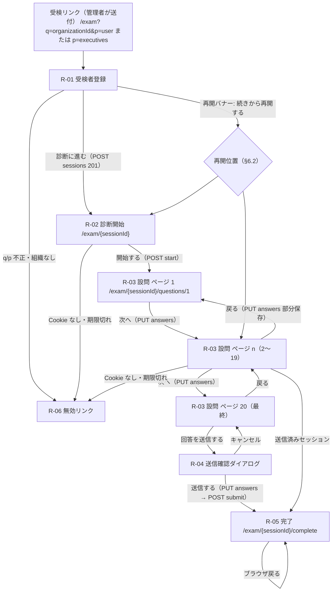
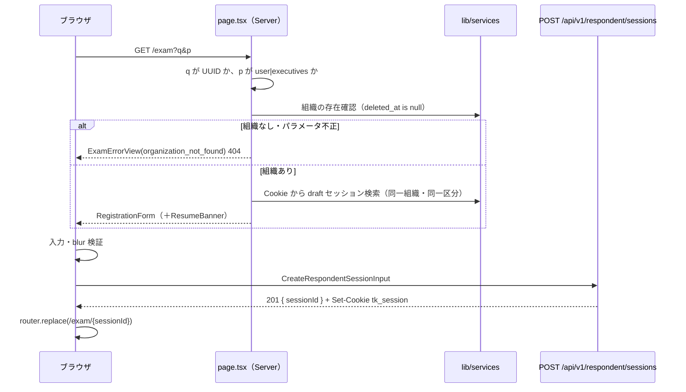

# 基本設計 05 画面設計（受検者側）

| 項目 | 内容 |
|---|---|
| 文書名 | 適性検査システム 基本設計 05 画面設計（受検者側） |
| 版 | 1.0 |
| 作成日 | 2026-09-17 |
| 対象 | 受検者側画面（S-02 受検者登録、S-03 診断開始、S-04 設問、送信確認、完了、無効リンク）の実装者、04（API）・08（テスト）分冊の設計者 |

## 0. 本書の位置づけ

本書は、受検者（求職者・既存スタッフ）がログインなしで利用する画面の設計を定めます。対象は共通定義（`docs/基本設計/00_共通定義.md`、以下「00」）§3.7 のルートグループ `app/(respondent)/exam/...` に置く画面すべてです。

本書で定めること:

- 画面一覧、URL、画面遷移、セッション状態と画面の対応
- スマートフォン対応のレイアウト方針（幅、タップ領域、1 ページの構成）
- 各画面の表示項目、入力チェック、ボタン挙動、文言
- 144 問のステップ・ページへの割り当て（00 §1.9、D-08 の確定）
- 未回答時の「次へ」の挙動、進捗表示、中断・再開、送信確認、完了画面
- エラー表示、二重送信防止、ブラウザ戻る操作の扱い、受検リンクが無効なときの表示
- アクセシビリティの最低限
- 画面が API に求める入出力（確定は 04 分冊）

本書で定めないこと（参照のみ）:

| 内容 | 担当分冊 |
|---|---|
| テーブル定義、セッショントークンの生成・保存・検証、`finalize_assessment_session()` | 02 |
| 設問文（`lib/masters/questions.ts`）、`QUESTION_PAGE_LAYOUT` の実体、採点 | 03 |
| Route Handler の入出力の確定、エラーコード一覧、`lib/services/`、Cookie の発行処理、レート制限 | 04（Cookie 属性は 01 §5.7） |
| 管理者側画面、結果の表示 | 06 |
| テスト計画（本書 §12 の観点を移植） | 08 |

用語・識別子・型名は 00 に従います。本書で新たに定義する型・定数は §10 にまとめ、末尾 §13 の一覧で他分冊への影響を示します。

### 0.1 参照した要件

| 参照元 | 参照した内容 |
|---|---|
| 要件定義書 §3 | 受検者はログイン不要。組織ごとの受検リンクから登録して回答する |
| 要件定義書 §4 | 受検者（求職者・既存スタッフ）は登録・回答・送信のみ。結果は閲覧しない |
| 要件定義書 §5 | 業務フロー 1〜4（リンク送付 → 登録 → 開始 → Step1〜4 各 5 ページ → 送信） |
| 要件定義書 §6.1 U-01〜U-09 | 受検者登録の項目と赤枠警告、職業 9 択、`q` / `p` パラメータ、診断開始画面の文言、設問画面の構成、設問の固定順、回答の下書き保存、送信時の採点、完了後遷移 |
| 要件定義書 §7 S-02〜S-04 | 受検者側の画面と URL、主な要素 |
| 要件定義書 §8.2、§8.3 | 受検者の項目、回答（下書き／送信済み） |
| 要件定義書 §9 | 個人情報保護、性能（採点 2 秒以内）、可用性（ページ単位保存と再開が望ましい）、対応端末（受検者画面はスマートフォン対応が望ましい、既存のモバイル表示は未確認） |
| 要件定義書 §11 の 1・7 番 | 「次へ」に紐づく残存アクション（優劣性上書き）を実装しない。Q145〜Q204 は出題しない |
| 要件定義書 §12 | 完了後の画面内容・完了メール、ページ分割と未回答時の挙動、中断・再開可否、モバイル表示が未確認 |
| 付録A | 設問文、5 件法の選択肢文言 |
| 付録B §1 | 選択肢 5 種と配点属性（本書は文言と `choice_code` の対応のみ使用） |
| 00 §1.8〜§1.10、§3.3、§3.7、§4、§8 | 列挙値、設問・選択肢、ディレクトリ、ルートグループ、API 規約、D-08・D-12・D-15・D-16・D-19 |
| 01 §3.2、§5.7、§8.4 | 採用ライブラリ、Cookie 名 `tk_session` と属性、レート制限 |
| 02 §3.4、§3.6、§3.7、§7.4 | `respondents` の列と長さ制約、`assessment_sessions` の再開用列、`answers` の upsert、セッショントークンの検証 |
| 03 §2.3、§4.3 | `QUESTION_PAGE_LAYOUT`、`ACTIVE_QUESTIONS`、設問マスタの `step` / `page` |

### 0.2 決定事項との対応

| # | 決定事項 | 本書での対応 |
|---|---|---|
| 1 | Next.js（App Router、TypeScript）+ Supabase + Vercel | 画面は App Router の Server Component で初期表示し、更新操作は Route Handler（00 §4）経由。ApexCharts は受検者画面では使わない（グラフなし） |
| 2 | 既存不具合 10 件の修正 | 「次へ」に採点・上書き処理を一切紐づけない（§5.3.7、要件定義書 §11 の 1 番）。Q145〜Q204 を描画しない（§5.3.2、7 番）。資質の内部名は受検者画面に出ない |
| 3 | 出題は Q1〜Q144 のみ | 設問ページは `ACTIVE_QUESTIONS`（`isActive = true` の 144 件）だけを描画する。ページ割り当ては §5.3.2 |
| 4 | 既存データは移行しない | 受検者画面に影響なし |
| 5 | AI 解説は Claude API | 受検者画面に影響なし |
| 6 | 日本語のみ。受検者画面はスマートフォン対応 | §2 のレイアウト方針（320〜430 CSS px を主対象、最大幅 640 px、PC では中央寄せ）。文言は §9 |

## 1. 画面一覧と遷移

### 1.1 画面一覧

要件定義書 §7 の S-02〜S-04 に、要件定義書 §6.1 U-09 の完了画面と、本書で追加する送信確認・無効リンクの表示を加えます。本書内の参照用に `R-xx` を振ります。

| R-ID | 要件定義書の ID | 画面名 | URL（00 §3.7） | ファイル（00 §3.3） | 認可 | 主な内容 |
|---|---|---|---|---|---|---|
| R-01 | S-02 | 受検者登録 | `/exam?q={organizationId}&p=user` または `p=executives` | `app/(respondent)/exam/page.tsx` | なし（組織 ID の存在確認のみ） | お名前、電話番号、職業、過去の診断経験、「診断に進む」 |
| R-02 | S-03 | 診断開始 | `/exam/{sessionId}` | `app/(respondent)/exam/[sessionId]/page.tsx` | Cookie `tk_session` | 「診断を開始する」「開始する」 |
| R-03 | S-04 | 設問 | `/exam/{sessionId}/questions/{page}`（`page` は通しページ番号 1〜20。§5.3.1） | `app/(respondent)/exam/[sessionId]/questions/[page]/page.tsx` | Cookie `tk_session` | ステップ・ページ表示、設問リスト、「戻る」「次へ」（最終ページは「回答を送信する」） |
| R-04 | （S-04 内） | 送信確認ダイアログ | R-03 の最終ページ内 | `components/respondent/SubmitConfirmDialog.tsx` | 同上 | 「送信する」「キャンセル」 |
| R-05 | （U-09） | 完了 | `/exam/{sessionId}/complete` | `app/(respondent)/exam/[sessionId]/complete/page.tsx` | Cookie `tk_session` | 固定文言のみ。結果は表示しない |
| R-06 | （新規） | 無効リンク・エラー表示 | R-01〜R-05 の各 URL でそのまま描画（専用 URL なし） | `components/respondent/ExamErrorView.tsx` | — | 受検リンク・セッションが無効なときの案内 |

- ヘッダーの「利用履歴」やサイドメニューなど管理者側の要素は受検者画面に一切置きません（要件定義書 §7 S-05 以降は管理者側）。
- 受検者画面にはグラフ・結果・個人情報の再表示（登録した氏名の表示など）を置きません（要件定義書 §4「結果は閲覧しない」、§9 個人情報保護）。

### 1.2 画面遷移図



- 「戻る」「次へ」はページ単位の URL 遷移です（`/questions/{page}` を変える）。ブラウザの戻る・進むもこの URL の履歴に従います（§7.3）。
- 送信後は `/exam/{sessionId}/...` のどの URL を開いても R-05 に着地します（§7.3）。

### 1.3 セッション状態と画面の対応

`assessment_sessions.status`（00 §1.8: `draft` / `submitted`）と Cookie の状態で、サーバ側（Server Component）がどの画面を返すかを固定します。判定はすべてサーバで行い、ブラウザ側の状態に依存しません。

| URL | Cookie `tk_session` が有効でセッションと一致 | `status` | `started_at` | 返す画面 |
|---|---|---|---|---|
| `/exam?q&p` | （不問。有効な下書きが同一組織にあれば再開バナー §6.3） | — | — | R-01 |
| `/exam/{sessionId}` | いいえ | — | — | R-06（種別 `session_unavailable`） |
| `/exam/{sessionId}` | はい | `submitted` | — | R-05 へリダイレクト（302） |
| `/exam/{sessionId}` | はい | `draft` | null | R-02 |
| `/exam/{sessionId}` | はい | `draft` | あり | 再開位置のページへリダイレクト（§6.2） |
| `/exam/{sessionId}/questions/{page}` | いいえ | — | — | R-06（`session_unavailable`） |
| `/exam/{sessionId}/questions/{page}` | はい | `submitted` | — | R-05 へリダイレクト |
| `/exam/{sessionId}/questions/{page}` | はい | `draft` | null | R-02 へリダイレクト（「開始する」を押していない） |
| `/exam/{sessionId}/questions/{page}` | はい | `draft` | あり | `page` が 1〜20 の整数でなければ R-06（`page_not_found`、404）。`page` が到達可能範囲（§6.2）を超えていれば再開位置へリダイレクト。それ以外は R-03 |
| `/exam/{sessionId}/complete` | いいえ | — | — | R-06（`session_unavailable`） |
| `/exam/{sessionId}/complete` | はい | `draft` | — | `/exam/{sessionId}` へリダイレクト |
| `/exam/{sessionId}/complete` | はい | `submitted` | — | R-05 |

- 「Cookie が有効でセッションと一致」の判定は 02 §7.4 の検証（ハッシュ一致、`token_expires_at > now()`、`deleted_at is null`、パスの `{sessionId}` と一致）です。実装は `lib/auth/respondent-token.ts`（04 分冊）を Server Component からも呼びます。
- 01 §5.7 は検証条件に `status = draft` を含めていますが、本書では完了画面（R-05）を送信後にも表示するため、**トークン検証は状態に依存せず**、状態による分岐は上表で行います。API 側（保存・送信）が `submitted` を 409 で拒否する点（02 §7.4）は変わりません。設計判断 D05-15。

## 2. スマートフォン対応のレイアウト方針

既存のモバイル表示は未確認（要件定義書 §12）のため、以下はすべて設計判断です（D05-22）。既存の PC 表示で確認された要素（要件定義書 §6.1 U-04・U-05）はそのまま含めます。

### 2.1 ビューポートと幅

| 項目 | 方針 |
|---|---|
| 主対象 | 幅 320〜430 CSS px のスマートフォン（縦向き）。横向き・タブレット・PC でも同じ 1 カラムレイアウトを使う |
| コンテンツ最大幅 | 640 px。それより広い画面では中央寄せし、外側は薄い背景色（`--color-bg`）で埋める（D05-24）。管理画面のような PC 専用レイアウトは作らない |
| 左右余白 | 16 px（320 px 幅でも本文が 288 px 確保できる） |
| viewport | `width=device-width, initial-scale=1`。`maximum-scale` と `user-scalable=no` は付けない（拡大を禁止しない。§8） |
| 縦方向 | 1 ページの設問リストはスクロールで閲覧する。ナビゲーション（戻る／次へ）は画面下部に固定表示し、`env(safe-area-inset-bottom)` の分だけ下余白を足す |
| 横スクロール | 発生させない。長い設問文は折り返す |

### 2.2 タップ領域と文字サイズ

| 対象 | 最小サイズ | 備考 |
|---|---|---|
| 選択肢（ラジオ 1 件） | 高さ 48 px、幅はカード幅いっぱい | ラベル全体をタップ可能にする（`label` で `input` を包む）。円形のラジオ部品だけをタップ対象にしない |
| ボタン（次へ・戻る・診断に進む・開始する・送信する） | 高さ 48 px | 主ボタンは幅いっぱい、副ボタン（戻る・キャンセル）は主ボタンと同じ高さ |
| 入力欄（お名前・電話番号・職業） | 高さ 48 px | フォントサイズ 16 px 以上（iOS Safari のフォーカス時自動ズームを避ける） |
| 本文フォント | 16 px | 設問文は 16 px、行間 1.6 |
| 見出し | 20〜22 px | 1 画面に h1 は 1 つ |
| 補助文（進捗、注記） | 14 px | 12 px 未満は使わない |

### 2.3 1 ページの構成（1 問ずつか一覧か）

設計判断 D05-04: **1 ページに複数問を縦に並べる一覧形式**を採用します（既存踏襲。要件定義書 §6.1 U-05「1 ページに複数問を縦に並べ、各問に 5 択のラジオ」）。1 問ずつの画面遷移にしない理由:

- 144 問を 1 問ずつにすると遷移が 144 回になり、ページ単位保存（要件定義書 §9）の単位と合わない。
- 既存の Step・ページ表示（U-05）を保てる。
- 一覧形式でも 1 ページ 7〜8 問（§5.3.2）に抑えることで、スマートフォンでのスクロール量を 2〜3 画面分に収められる。

### 2.4 選択肢の表示形式

設計判断 D05-05: 5 件法は**縦積みのラジオボタン**で表示します（横 1 列の 5 点スケールにしない）。理由: 選択肢文言は最長 13 文字（「どちらかと言えばそう思わない」）で、320 px 幅では横並びにすると文言を省略せざるを得ず、既存の文言（付録A）をそのまま表示できないためです。

選択肢の表示順と `choice_code`（00 §1.9）は固定です:

| 表示順 | 文言 | `choice_code` |
|---:|---|---:|
| 1 | そう思う | 1 |
| 2 | どちらかと言えばそう思う | 2 |
| 3 | どちらでもない | 3 |
| 4 | どちらかと言えばそう思わない | 4 |
| 5 | そう思わない | 5 |

### 2.5 デザイントークン

配色は既存資料に記載がないため設計判断です（D05-22）。コントラスト比は §8 の基準を満たす値にしています。ダークモード対応は行いません（受検者画面は常にライト配色。設計判断: 既存に無く、赤枠警告などの色の意味を単純に保つため）。

```css
/* app/(respondent)/exam.css （app/(respondent)/layout.tsx から読み込む） */
:root {
  --color-bg: #f3f5f8;            /* 画面外側の背景 */
  --color-surface: #ffffff;       /* カード・フォームの背景 */
  --color-text: #1f2933;          /* 本文。#ffffff 上のコントラスト比 14.7:1 */
  --color-text-muted: #52606d;    /* 補助文。7.0:1 */
  --color-border: #cbd2d9;        /* 通常の枠線 */
  --color-primary: #0b5cad;       /* 主ボタン背景・選択状態。白文字とのコントラスト比 7.6:1 */
  --color-primary-soft: #e6f0fa;  /* 選択済みの選択肢の背景 */
  --color-danger: #c62828;        /* 未入力・未回答の赤枠と文言。白背景とのコントラスト比 5.9:1 */
  --color-danger-soft: #fdecea;   /* エラーバナー背景 */
  --color-success: #1b7f4b;       /* 完了画面のアイコン。白背景とのコントラスト比 5.2:1 */
  --radius: 8px;
  --tap-min: 48px;
  --content-max-width: 640px;
  --gutter: 16px;
}
```

- 状態を色だけで表さない（§8）。未回答の赤枠には必ず文言を添え、選択済みの選択肢は背景色に加えてラジオのチェック状態で示します。
- フォントはシステムフォント（`system-ui, -apple-system, "Hiragino Sans", "Noto Sans JP", sans-serif`）とし、Web フォントは読み込みません（設計判断: 回線が細い端末での初期表示を優先）。

### 2.6 共通レイアウト

```text
┌──────────────────────────────┐  ← 幅 320〜640 px、外側は --color-bg
│ 適性検査                      │  ← 共通ヘッダー（サイト名のみ。リンクなし）
├──────────────────────────────┤
│                              │
│   画面ごとの内容（スクロール）   │
│                              │
├──────────────────────────────┤
│ [ 戻る ]      [ 次へ ▶ ]      │  ← R-03 のみ。下部固定（sticky）
└──────────────────────────────┘
```

- 共通ヘッダーの「適性検査」はサイト名の仮置きです（既存サイト名「First」は要件定義書の分析対象欄にのみ記載。表示名は依頼主確認事項。D05-22）。
- ヘッダーにナビゲーションやログアウトは置きません。組織名も表示しません（設計判断: 受検リンクの URL に組織 ID が含まれる点は許容されていますが（要件定義書 §9）、組織名を画面に出す要件はなく、出さない方が安全）。

## 3. 共通部品（`components/respondent/`）

| コンポーネント | ファイル | 種別 | 役割 |
|---|---|---|---|
| `ExamShell` | `ExamShell.tsx` | Server | 共通ヘッダーと最大幅のコンテナ。`app/(respondent)/layout.tsx` から使う |
| `ExamErrorView` | `ExamErrorView.tsx` | Server | R-06。種別ごとの見出し・本文（§5.6） |
| `RegistrationForm` | `RegistrationForm.tsx` | Client | R-01 のフォーム。入力チェック（§5.1.4）、`POST /api/v1/respondent/sessions` の呼び出し |
| `ResumeBanner` | `ResumeBanner.tsx` | Server | R-01 上部の再開バナー（§6.3） |
| `StartPanel` | `StartPanel.tsx` | Client | R-02 の「開始する」ボタンと `POST .../start` の呼び出し |
| `ProgressHeader` | `ProgressHeader.tsx` | Client | R-03 上部のステップ表示・ページ表示・進捗バー（§5.3.4） |
| `QuestionCard` | `QuestionCard.tsx` | Client | 設問 1 問（番号、設問文、`ChoiceRadioGroup`、未回答の赤枠と文言） |
| `ChoiceRadioGroup` | `ChoiceRadioGroup.tsx` | Client | 5 件法のラジオ（`fieldset` / `legend`、縦積み） |
| `QuestionPage` | `QuestionPage.tsx` | Client | R-03 のページ本体。回答状態の保持、保存、ナビゲーション、未回答チェック |
| `PageNav` | `PageNav.tsx` | Client | 下部固定の「戻る」「次へ」「回答を送信する」と未回答件数の表示 |
| `SubmitConfirmDialog` | `SubmitConfirmDialog.tsx` | Client | R-04。`dialog` 要素で実装 |
| `ErrorBanner` | `ErrorBanner.tsx` | Client | 通信エラーなどの画面内バナー（`role="alert"`、「再試行」ボタン） |
| `BusyOverlay` | `BusyOverlay.tsx` | Client | 保存中・送信中の全面オーバーレイ（操作を防ぐ。`aria-busy`） |
| `CompleteView` | `CompleteView.tsx` | Server | R-05 の固定文言 |

- 汎用のボタン・入力部品は `components/ui/`（00 §3.3）を使います。上記は受検者画面固有の組み合わせです。
- Client Component は `"use client"` を先頭に置き、`lib/db/`・`lib/services/` を import しません（01 §3.5 の `no-restricted-imports`）。API 呼び出しは `lib/utils/respondent-api.ts`（§7.1 で定義）に集約します。

## 4. 画面設計の共通ルール

| 項目 | ルール |
|---|---|
| 初期表示 | Server Component が Cookie を検証し、必要なデータ（セッション状態、保存済み回答）を `lib/services/` から取得して Client Component に渡す（00 §3.3「画面は `lib/services/` を直接呼んでよい」）。設問文は `lib/masters/questions.ts` の `ACTIVE_QUESTIONS` を Server Component が直接参照し、API では配信しない（D05-29。02 §3.5 で `anon` に `questions` の権限を与えない方針と整合） |
| 更新操作 | すべて Route Handler（00 §4.1）。フォーム送信は `fetch` で JSON を送る。Server Action は使わない |
| 通信中 | ボタンを `aria-disabled="true"` + 見た目の無効化にし、`BusyOverlay` を出す。同じ操作の二重送出はクライアントの in-flight フラグで防ぐ（§7.2） |
| 通信エラー | `ErrorBanner` に文言（§9 の E-xx）と「再試行」を表示し、入力内容・選択内容は保持する。ページを自動で再読み込みしない |
| 文言 | §9 の一覧が正。`lib/presentation/exam-texts.ts` に定数として置き、JSX に直書きしない |
| 日時 | 受検者画面に日時を表示する箇所はない（完了画面にも送信日時を出さない。D05-13） |
| 個人情報 | 登録後の画面に氏名・電話番号を再表示しない。ブラウザの `localStorage` に個人情報を置かない（§6.4 の退避対象は回答の選択値のみ） |
| ログ | ブラウザの `console` にセッショントークン・氏名・電話番号を出さない（01 §8.6） |

## 5. 各画面の設計

### 5.1 R-01 受検者登録（S-02）

#### 5.1.1 URL とパラメータ

| パラメータ | 値 | 必須 | 意味 | 根拠 |
|---|---|---|---|---|
| `q` | 組織 ID（UUID） | 必須 | `organizations.id` | 要件定義書 §6.1 U-03、00 D-12、02 §3.2 |
| `p` | `user` または `executives` | 必須 | `user` → `respondent_kind = applicant`、`executives` → `executive` | 要件定義書 §6.1 U-03、00 §1.8 |

サーバ側の判定（`app/(respondent)/exam/page.tsx`）:

| 条件 | 結果 |
|---|---|
| `q` が無い、UUID 形式でない | R-06（`organization_not_found`、HTTP 404） |
| `p` が `user` / `executives` 以外、または無い | R-06（`organization_not_found`、404）。設計判断 D05-21: 区分の誤りも同じ文言にし、パラメータの仕様を画面で説明しない |
| `organizations` に `id = q and deleted_at is null` の行が無い | R-06（`organization_not_found`、404） |
| （02 分冊が受付停止フラグを追加した場合）受付停止中 | R-06（`organization_closed`、404）。01 D01-27 参照。02 §3.2 の現行 DDL には該当列が無いため、追加されるまでは `deleted_at` のみで判定する |
| 上記以外 | R-01 を表示。Cookie に有効な `draft` セッションがあり同一組織なら `ResumeBanner` を上部に出す（§6.3） |

- 組織の存在確認はサービスロールで行います（01 §1.3 のシーケンス）。画面には組織名を出しません（§2.6）。
- `p` の値は隠し項目としてフォームに保持し、送信時に `kind` へ変換して API に渡します。受検者は区分を変更できません。

#### 5.1.2 ワイヤーフレーム

```text
┌──────────────────────────────┐
│ 適性検査                      │
├──────────────────────────────┤
│ ┌──────────────────────────┐ │  ← ResumeBanner（該当時のみ。§6.3）
│ │ 回答中の診断があります       │ │
│ │ [ 続きから再開する ]         │ │
│ │ 新しく登録する場合はこのまま │ │
│ │ 下の項目を入力してください   │ │
│ └──────────────────────────┘ │
│                              │
│ 受検者登録                    │  ← h1
│ 以下の項目を入力し、「診断に   │
│ 進む」を押してください。       │
│                              │
│ お名前 *                      │
│ ┌──────────────────────────┐ │
│ │                          │ │
│ └──────────────────────────┘ │
│                              │
│ 電話番号 *                    │
│ ┌──────────────────────────┐ │
│ │                          │ │  ← inputmode="tel"
│ └──────────────────────────┘ │
│ ハイフンなしでも入力できます   │
│                              │
│ 職業 *                        │
│ ┌──────────────────────────┐ │
│ │ 選択してください        ▼ │ │  ← select
│ └──────────────────────────┘ │
│                              │
│ 過去の診断経験 *              │
│ ( ) 初めて診断する            │
│ ( ) 過去に診断したことがある   │
│                              │
│ ┌──────────────────────────┐ │
│ │       診断に進む          │ │  ← 主ボタン。未入力があれば aria-disabled
│ └──────────────────────────┘ │
│ 未入力の項目があります        │  ← 未入力時のみ（§5.1.5）
└──────────────────────────────┘
```

#### 5.1.3 表示項目と入力項目

| 項目 | 種別 | 必須 | 入力部品 | 保存先（02 §3.4） | 根拠 |
|---|---|---|---|---|---|
| 見出し | 表示 | — | h1「受検者登録」 | — | 要件定義書 §7 S-02 の見出しは「受験者登録」。設計判断 D05-18: 00 §1.1 の用語「受検者」に合わせ「受検者登録」とする（既存の「受験」は表記ゆれと推定。依頼主確認事項） |
| お名前 | 入力 | 必須 | `input type="text"`、`autocomplete="name"` | `respondents.name` | 要件定義書 §6.1 U-01 |
| 電話番号 | 入力 | 必須 | `input type="tel"`、`inputmode="tel"`、`autocomplete="tel"` | `respondents.phone_number` | 同上 |
| 職業 | 選択 | 必須 | `select`（先頭に選択不可の「選択してください」） | `respondents.occupation_code`（1〜9） | 要件定義書 §6.1 U-02、00 §1.10 |
| 過去の診断経験 | 選択 | 必須 | ラジオ 2 択 | `respondents.diagnosis_experience` | 要件定義書 §6.1 U-01、00 §1.8 |
| 区分 | 隠し | — | `p` から決定 | `respondents.kind` | 要件定義書 §6.1 U-03 |
| 診断に進む | ボタン | — | 主ボタン | — | 要件定義書 §6.1 U-01 |

職業の選択肢（00 §1.10 の順、表示名そのまま）:

| `occupationCode` | 表示 |
|---:|---|
| 1 | 歯科医師 |
| 2 | 歯科衛生士 |
| 3 | 歯科助手(アシスタント・受付) |
| 4 | アシスタント |
| 5 | 受付 |
| 6 | TC（00 D-19: 表示は「TC」のまま） |
| 7 | 事務スタッフ |
| 8 | 技工士 |
| 9 | その他 |

- 個人情報の取り扱いに関する同意チェックや規約へのリンクは、要件定義書に記載がないため設けません（設計判断 D05-20。依頼主確認事項）。

#### 5.1.4 入力チェック

クライアント側（即時のフィードバック）とサーバ側（04 分冊、`zod`。01 D01-03）で同じ規則を適用します。規則は `lib/presentation/registration-rules.ts`（§10.3）に置き、Route Handler と画面の両方から import します（`lib/presentation/` は DB・API に触れないため両側から使えます。00 §3.3）。

| 項目 | 規則 | 正規化 | エラー文言（§9 の ID） |
|---|---|---|---|
| お名前 | 前後の空白を除いて 1〜100 文字（02 §3.4「空白不可、100 文字以内」）。改行を含まない | 前後の空白（半角・全角）を除去 | 空: V-01 / 100 文字超: V-02 |
| 電話番号 | NFKC 正規化後、空白・ハイフン類（`-`、`－`、`ー`、`‐`）・括弧を除いた文字列が `^0[0-9]{9,10}$`（国内番号 10〜11 桁）に一致する。既存の形式は未確認のため設計判断 D05-16（依頼主確認事項） | NFKC 正規化と空白除去を行った文字列（ハイフンは残す）を送信・保存する。長さは 02 §3.4 の 30 文字以内に収まる | 空: V-03 / 形式不一致: V-04 |
| 職業 | 1〜9 のいずれか | — | 未選択: V-05 |
| 過去の診断経験 | `first_time` / `experienced` のいずれか | — | 未選択: V-06 |
| 区分 | `applicant` / `executive` | — | （画面では発生しない。サーバは 422） |
| 組織 ID | UUID、存在し削除されていない | — | （サーバが 404 `ORGANIZATION_NOT_FOUND`。画面は E-05） |

チェックのタイミング:

| タイミング | 動作 |
|---|---|
| 各項目の `blur`（フォーカスが外れたとき） | その項目だけ検証し、不備なら赤枠と項目直下のエラー文言を出す（`aria-describedby` で結びつける。§8） |
| 入力の変更 | 赤枠が出ている項目は、正しい値になった時点で赤枠と文言を消す |
| 「診断に進む」押下 | 全項目を検証。不備があれば最初の不備項目にフォーカスを移し、ボタン下に「未入力の項目があります」（V-00）を出す |

#### 5.1.5 「診断に進む」の挙動

要件定義書 §6.1 U-01 は「未入力項目は赤枠で警告し、『診断に進む』を無効化する」です。無効化は次の方式で実装します（設計判断 D05-03 と同じ方式）:

1. 必須項目のいずれかが未入力の間、ボタンを `aria-disabled="true"` にし、見た目も無効状態にする。HTML の `disabled` 属性は使わない（フォーカスできず、支援技術に理由を伝えられないため）。
2. その状態でタップされたら、送信せずに全項目を検証し、未入力項目を赤枠にして、最初の未入力項目へフォーカスとスクロールを移し、V-00 を表示する。
3. すべて入力されるとボタンは有効になり、押下で §5.1.6 の送信を行う。

- 送信中はボタンを無効化し `BusyOverlay`（「登録しています…」）を出す。二重送信の防止は §7.2。

#### 5.1.6 送信と遷移

| 手順 | 内容 |
|---|---|
| 1 | `POST /api/v1/respondent/sessions` に `CreateRespondentSessionInput`（§7.1）を送る |
| 2 | 201 なら応答の `sessionId` で `router.replace("/exam/{sessionId}")`。`replace` を使い、ブラウザ戻るで登録フォームに戻らないようにする（§7.3）。応答の `Set-Cookie`（`tk_session`。01 §5.7）はブラウザが保持する |
| 3 | 422（`VALIDATION_ERROR`）なら `details` の項目名（`name` / `phoneNumber` / `occupationCode` / `diagnosisExperience`）ごとにエラー文言を出す（クライアント検証をすり抜けた場合の保険） |
| 4 | 404（`ORGANIZATION_NOT_FOUND`）なら E-05 をバナー表示（リンクが無効になった場合） |
| 5 | 429（`RATE_LIMITED`。01 §8.4）なら E-06 |
| 6 | ネットワークエラー・5xx なら E-01 と「再試行」。入力値は保持する |

### 5.2 R-02 診断開始（S-03）

#### 5.2.1 ワイヤーフレーム

```text
┌──────────────────────────────┐
│ 適性検査                      │
├──────────────────────────────┤
│                              │
│ 診断を開始する                │  ← h1（要件定義書 U-04）
│                              │
│ 下記のボタンをクリックして、   │  ← 要件定義書 U-04 の文言そのまま
│ 診断を開始してください。       │
│                              │
│ ・全 144 問、4 ステップです    │  ← 追加の案内（設計判断）
│ ・各設問に 5 つの選択肢から     │
│   1 つを選んでください         │
│ ・途中で中断しても、同じ端末・  │
│   同じブラウザなら 7 日以内は   │
│   続きから再開できます         │
│                              │
│ ┌──────────────────────────┐ │
│ │        開始する           │ │
│ └──────────────────────────┘ │
└──────────────────────────────┘
```

#### 5.2.2 表示項目とボタン挙動

| 項目 | 内容 | 根拠 |
|---|---|---|
| 見出し | 「診断を開始する」 | 要件定義書 §6.1 U-04 |
| 案内文 | 「下記のボタンをクリックして、診断を開始してください。」 | 同上。設計判断 D05-19: スマートフォンでは「タップ」が自然だが、既存文言をそのまま採用する（変更は依頼主確認事項） |
| 補足案内 | 設問数（144 問・4 ステップ）、選択方法、中断・再開の条件（§6） | 設計判断。所要時間の目安は根拠がないため表示しない |
| 開始する | 主ボタン。押下で `POST /api/v1/respondent/sessions/{sessionId}/start`（§7.1）を呼び、成功したら `router.replace("/exam/{sessionId}/questions/1")` | 要件定義書 §6.1 U-04。`started_at` の記録は 02 §3.6（「開始する」押下日時） |

- `start` は冪等です（すでに `started_at` があれば更新せず 200）。API 名は 00 §4.2 に無いため本書からの追加提案（D05-11）で、04 分冊が確定します。
- 通信エラー時は E-01 と「再試行」。
- 「戻る」ボタンは置きません。登録内容の修正は要件にないためです。誤登録は管理者が回答一覧で削除します（要件定義書 §6.2 A-05）。

### 5.3 R-03 設問（S-04）

#### 5.3.1 URL とページ番号

`/exam/{sessionId}/questions/{page}` の `{page}` は **通しページ番号 `pageNo`（1〜20）** です（設計判断 D05-02）。ステップとステップ内ページは `pageNo` から導出します:

```text
step        = ceil(pageNo / 5)            （1〜4）
pageInStep  = ((pageNo − 1) mod 5) + 1     （1〜5）
```

- 00 §1.9 の用語 `step`（1〜4）と `page`（1〜5）は表示とマスタ（`questions.step` / `questions.page`、02 §3.5）で使い、URL には通し番号を使います。理由: URL が 1 つの整数で済み、到達可能範囲の判定（§6.2）と「戻る」「次へ」が `±1` で書けるためです。
- `{page}` が整数でない、1〜20 の範囲外のときは R-06（`page_not_found`、404）。

#### 5.3.2 144 問のステップ・ページ割り当て（D-08 の確定）

設計判断 D05-01: **4 ステップ × 5 ページ = 20 ページ、1 ステップ 36 問、ページの問数は 7・7・7・7・8** とします。00 §1.9 と 03 §2.3 の `QUESTION_PAGE_LAYOUT` の仮置きをそのまま確定値にします。

理由:

1. 既存は Step1〜Step4 各 5 ページの構成で、設問画面に「Step 表示」と「1 / 5」のページ表示があります（要件定義書 §5、§6.1 U-05）。この構成を保つと 20 ページになります。02 §3.6 の `last_saved_step`（1〜4）・`last_saved_page`（1〜5）の制約もこの構成を前提にしています。
2. 144 ÷ 20 = 7.2 のため、各ステップの 1〜4 ページ目を 7 問、5 ページ目を 8 問にすると全ページがほぼ均等になります。端数を最終ページに寄せることで、1〜4 ページ目の見た目が揃います。
3. スマートフォンで 1 ページ 7〜8 問（1 問あたり設問文 + 選択肢 5 行 ≈ 320 px）はスクロール 2〜3 画面分で、一覧形式（§2.3）として扱いやすい量です。
4. 保存単位がページなので、通信失敗時に失われる回答は最大 8 問に収まります。
5. 検討した代替案: 既存のように 1 ページ 24 問以上（要件定義書 U-05 は 204 問時代に 24 問以上を確認）にすると 6 ページ程度になり、スマートフォンでは 1 ページが 8 画面分を超えて長く、Step・ページ表示の形も崩れるため採用しません。

割り当て表（`questionNo` は付録A の設問番号。Q145〜Q204 はどのページにも含めません。決定事項 3）:

| `pageNo` | `step` | `pageInStep` | 設問番号 | 問数 |
|---:|---:|---:|---|---:|
| 1 | 1 | 1 | Q1〜Q7 | 7 |
| 2 | 1 | 2 | Q8〜Q14 | 7 |
| 3 | 1 | 3 | Q15〜Q21 | 7 |
| 4 | 1 | 4 | Q22〜Q28 | 7 |
| 5 | 1 | 5 | Q29〜Q36 | 8 |
| 6 | 2 | 1 | Q37〜Q43 | 7 |
| 7 | 2 | 2 | Q44〜Q50 | 7 |
| 8 | 2 | 3 | Q51〜Q57 | 7 |
| 9 | 2 | 4 | Q58〜Q64 | 7 |
| 10 | 2 | 5 | Q65〜Q72 | 8 |
| 11 | 3 | 1 | Q73〜Q79 | 7 |
| 12 | 3 | 2 | Q80〜Q86 | 7 |
| 13 | 3 | 3 | Q87〜Q93 | 7 |
| 14 | 3 | 4 | Q94〜Q100 | 7 |
| 15 | 3 | 5 | Q101〜Q108 | 8 |
| 16 | 4 | 1 | Q109〜Q115 | 7 |
| 17 | 4 | 2 | Q116〜Q122 | 7 |
| 18 | 4 | 3 | Q123〜Q129 | 7 |
| 19 | 4 | 4 | Q130〜Q136 | 7 |
| 20 | 4 | 5 | Q137〜Q144 | 8 |

- 設問はページ内でも設問番号の昇順に固定表示し、ランダム化しません（要件定義書 §6.1 U-06）。
- 割り当ての実体は 03 分冊の `QUESTION_PAGE_LAYOUT`（`stepCount: 4, questionsPerStep: 36, pageSizes: [7, 7, 7, 7, 8]`）と `questions.step` / `questions.page` です。本書のヘルパー（§10.1）はそれらから導出し、表を二重に持ちません。

#### 5.3.3 ワイヤーフレーム

```text
┌──────────────────────────────┐
│ 適性検査                      │
├──────────────────────────────┤
│ Step 2   ●●○○         3 / 5  │  ← ProgressHeader（ステップ、ステップ進捗、ページ）
│ ▓▓▓▓▓▓▓▓░░░░░░░░░░ 50 / 144  │  ← 全体進捗バー（回答済み数）
│ 直感的にサクサクと回答して      │  ← 要件定義書 U-05 の案内文
│ ください！                    │
├──────────────────────────────┤
│ ┌──────────────────────────┐ │
│ │ Q51                      │ │  ← QuestionCard
│ │ （設問文。付録A のとおり）   │ │
│ │ ( ) そう思う              │ │  ← 各行 高さ 48 px 以上、行全体タップ可
│ │ ( ) どちらかと言えばそう思う │ │
│ │ (●) どちらでもない          │ │  ← 選択済み: 背景 --color-primary-soft
│ │ ( ) どちらかと言えばそう思わ │ │
│ │     ない                  │ │
│ │ ( ) そう思わない           │ │
│ └──────────────────────────┘ │
│ ┌──────────────────────────┐ │
│ │ Q52                      │ │  ← 未回答で「次へ」を押した後: 赤枠
│ │ （設問文）                 │ │
│ │ 回答してください           │ │  ← 赤文字（role="alert" ではなく aria-describedby）
│ │ ( ) そう思う              │ │
│ │  …                        │ │
│ └──────────────────────────┘ │
│  … Q57 まで                   │
│                              │
├──────────────────────────────┤
│ 未回答 3 問                   │  ← PageNav（下部固定）。未回答があるときのみ
│ [ ◀ 戻る ]      [ 次へ ▶ ]    │
└──────────────────────────────┘
```

最終ページ（`pageNo = 20`）の下部:

```text
├──────────────────────────────┤
│ [ ◀ 戻る ]  [ 回答を送信する ] │  ← 主ボタンの文言が変わる
└──────────────────────────────┘
```

#### 5.3.4 表示項目

| 項目 | 内容 | 根拠 |
|---|---|---|
| ステップ表示 | 「Step {step}」と 4 個の丸印（現在のステップまで塗る）。`aria-label="ステップ 2 / 4"` | 要件定義書 §6.1 U-05「Step1〜4 のステップ表示」 |
| ページ表示 | 「{pageInStep} / 5」 | 同上「1 / 5 のページ表示」 |
| 全体進捗バー | 回答済み数 / 144（`progress` 要素。値は保存済み回答数 + 現在ページで選択済みの数）。設計判断 D05-23（既存には無い追加。中断・再開時に残量を把握しやすくする） | 要件定義書 §9 可用性 |
| 案内文 | 「直感的にサクサクと回答してください！」 | 要件定義書 §6.1 U-05 |
| 設問カード | 設問番号「Q{questionNo}」、設問文（`ACTIVE_QUESTIONS` の `text`。付録A の転記。03 §4.3）、5 択ラジオ | 要件定義書 §6.1 U-05、U-06、付録A |
| 未回答件数 | 「未回答 {n} 問」。現在ページに未回答があるときのみ表示 | 設計判断 D05-03 |
| 戻る | `pageNo = 1` では表示しない（R-02 に戻る意味がないため）。それ以外は `pageNo − 1` へ | 要件定義書 §5「『戻る』で戻れる」 |
| 次へ／回答を送信する | `pageNo < 20` は「次へ」、`pageNo = 20` は「回答を送信する」 | 要件定義書 §5、U-08 |

- 設問番号は付録A の通し番号（Q1〜Q144）を表示します。ページ内の連番（1〜7）は表示しません（設計判断: 管理者・依頼主が付録A と照合しやすい）。
- 設問文は加工しません（03 §4.3「表記ゆれ・誤字も含めて変更しない」）。

#### 5.3.5 回答の状態管理

| 状態 | 保持場所 | 内容 |
|---|---|---|
| 保存済み回答 | サーバ（`answers`） | Server Component が `GET` 相当のサービス呼び出しで取得し、初期値として Client Component に渡す |
| 現在ページの選択 | Client Component の state | ラジオ選択のたびに更新。`sessionStorage` にも退避（§6.4） |
| 回答済み数 | 導出 | 保存済み（現在ページ分を除く）+ 現在ページで選択済み |

- 選択のたびに API を呼びません（保存はページ単位。要件定義書 §9「ページ単位で保存」。設計判断 D05-06）。
- 同一設問で選択を変更した場合は最後の選択が有効です。選択を解除する操作は提供しません。

#### 5.3.6 「次へ」の挙動（未回答時を含む）

要件定義書 §12 で未回答時の挙動は未確認です。00 D-08 の仮置き「未回答があれば『次へ』を無効化」を採用し、無効化の実装を次のとおり定めます（設計判断 D05-03）:

| 状況 | 「次へ」の見た目 | タップ時の動作 |
|---|---|---|
| 現在ページに未回答がある | `aria-disabled="true"`、無効状態の色。ボタン上に「未回答 {n} 問」 | 遷移しない。未回答の設問カードをすべて赤枠にし、各カードに「回答してください」（Q-02）を表示。最初の未回答カードの先頭までスクロールし、その最初のラジオにフォーカスを移す |
| 現在ページの全問に回答済み | 有効 | §5.3.7 の保存 → `pageNo + 1` へ遷移 |

- 赤枠は「次へ」を押す前には出しません（回答前から警告しない）。一度出た赤枠は、その設問に回答した時点で消します。
- 未回答のまま次のページに進む手段は提供しません（設問の飛ばしを許さない）。理由: 送信時に 144 問すべての回答が必要（03 §2「未回答を許容しない」、02 `finalize_assessment_session()` の 144 件チェック）で、最終ページで大量の未回答に戻らせるより、ページごとに完結させる方が受検者の負担が小さいためです。
- HTML の `disabled` を使わない理由は §5.1.5 と同じです。

#### 5.3.7 保存（PUT answers）と「戻る」

| 操作 | 送る内容 | 成功時 | 失敗時 |
|---|---|---|---|
| 次へ | 現在ページの全問（`pageNo` と 7〜8 件の `{questionNo, choiceCode}`） | `router.push("/exam/{sessionId}/questions/{pageNo+1}")`。`sessionStorage` の退避を削除。先頭へスクロール | `ErrorBanner` に E-02 と「再試行」。選択は保持。遷移しない |
| 戻る | 現在ページで選択済みの分だけ（部分保存。0 件なら API を呼ばない） | `router.push(".../questions/{pageNo−1}")` | 部分保存に失敗しても遷移は行い、未保存分は `sessionStorage` に残す（次回このページを開いたときに復元。§6.4）。E-02 はバナーで表示 |

- 保存は `PUT /api/v1/respondent/sessions/{sessionId}/answers`（00 §4.2）で、サーバは `answers` を upsert します（02 §3.7）。同じ設問を再保存すると上書きされます。
- 「次へ」に紐づく処理は**保存と遷移だけ**です。採点や結果列の更新、固定値の書き込みは行いません（要件定義書 §11 の 1 番: 既存の「次へ」に残っていた `優劣性 = 12` の上書きを実装しない）。
- 応答の `tokenExpiresAt` で Cookie の期限が延長されます（§6.1）。
- 保存中は `BusyOverlay`（「保存しています…」）を出し、ボタンの再押下を受け付けません（§7.2）。

#### 5.3.8 最終ページの「回答を送信する」

1. 現在ページ（Q137〜Q144）に未回答があれば §5.3.6 と同じ挙動（送信しない）。
2. 全問回答済みなら R-04 送信確認ダイアログを開く。
3. ダイアログで「送信する」→ §5.4.2 の手順。

### 5.4 R-04 送信確認ダイアログ

設計判断 D05-12: 送信後は回答を変更できない（02 §3.7、`trg_answers_reject_after_submit`）ため、送信前に確認を挟みます。既存の「2 秒待機後に遷移」（要件定義書 §5 の 4）は再現しません（待機に意味がないため）。

#### 5.4.1 ワイヤーフレーム

```text
        ┌──────────────────────────┐
        │ 回答を送信します          │  ← dialog（aria-labelledby）
        │                          │
        │ 送信後は回答を変更でき     │
        │ ません。よろしいですか？   │
        │                          │
        │ [ キャンセル ] [ 送信する ] │
        └──────────────────────────┘
```

#### 5.4.2 「送信する」の手順

| 手順 | 内容 | 失敗時 |
|---|---|---|
| 1 | ダイアログのボタンを無効化し `BusyOverlay`（「送信しています…」）を出す | — |
| 2 | 最終ページの回答を `PUT .../answers` で保存（§5.3.7 と同じ） | E-02 と「再試行」。ダイアログは閉じる |
| 3 | `POST /api/v1/respondent/sessions/{sessionId}/submit`（00 §4.2）。本文は空。サーバが採点（`scoreAnswers`）と `finalize_assessment_session()` を実行する（02 §11、04 分冊） | 下表 |
| 4 | 200 なら `router.replace("/exam/{sessionId}/complete")`。`sessionStorage` の退避をすべて削除 | — |

`submit` の失敗時の扱い:

| HTTP / `error.code` | 画面の動作 |
|---|---|
| 409 `SESSION_ALREADY_SUBMITTED` | 成功と同じ扱いで R-05 へ遷移（二重送信の後続。§7.2） |
| 422 `ANSWERS_INCOMPLETE`（`details.missingQuestionNos`） | E-03 を表示し、「未回答のページへ移動」ボタンで最初の未回答設問を含むページへ遷移（§10.1 `pageNoOfQuestion`）。通常は §5.3.6 で防がれるため、別タブでの操作など例外時のみ発生する |
| 401 `UNAUTHORIZED`（トークン無効・期限切れ） | R-06（`session_unavailable`）相当の E-04 を全面表示 |
| 429 | E-06 |
| 5xx・ネットワークエラー | E-01 と「再試行」。再試行は手順 3 から（保存は完了しているため） |

- 採点は同期実行で 2 秒以内（要件定義書 §9）。応答が遅い場合も途中で文言を変えずに待ち、`fetch` のタイムアウト（§7.1、30 秒）で失敗扱い（E-01 と「再試行」）にします。

### 5.5 R-05 完了

要件定義書 §12 で完了後の画面内容と完了メールの有無は未確認です。00 D-15 の仮置き（固定文言のみ、メールは送らない）を採用します（設計判断 D05-13）。

#### 5.5.1 ワイヤーフレーム

```text
┌──────────────────────────────┐
│ 適性検査                      │
├──────────────────────────────┤
│                              │
│         ✓（成功アイコン）      │  ← 装飾。aria-hidden
│                              │
│ 回答が完了しました            │  ← h1
│                              │
│ ご回答ありがとうございました。  │
│ 回答内容は送信されました。     │
│ このページを閉じて終了して     │
│ ください。                    │
│                              │
└──────────────────────────────┘
```

#### 5.5.2 仕様

| 項目 | 内容 | 根拠 |
|---|---|---|
| 表示内容 | 見出しと固定文言のみ（§9 の C-01〜C-02） | 00 D-15 |
| 結果 | 表示しない（タイプ名・スコア・グラフのいずれも出さない） | 要件定義書 §4、§6.1 U-09 |
| 個人情報 | 氏名・電話番号・送信日時を表示しない | §4 の共通ルール |
| ボタン | 置かない。「もう一度受検する」などの導線も置かない（受検リンクから再登録する運用） | 設計判断 |
| メール | 送らない | 00 D-15、01 §3.3 |
| Cookie | 送信後も削除しない。期限（§6.1）まで R-05 を再表示できる。期限後は R-06（`session_unavailable`） | 設計判断 D05-15 |

### 5.6 R-06 無効リンク・エラー表示

受検リンクやセッションが無効なときは、URL を変えずにその場で案内を描画します（HTTP ステータスは 404）。個人情報やシステム内部の情報（組織の有無の理由、トークンの状態）は出しません（設計判断 D05-21）。

| 種別 `kind` | 発生条件 | 見出し（§9） | 本文（§9） | HTTP |
|---|---|---|---|---|
| `organization_not_found` | `q` / `p` が不正、組織が存在しないか削除済み | X-01 | X-02 | 404 |
| `organization_closed` | 受付停止（02 分冊が列を追加した場合のみ。01 D01-27） | X-01 | X-03 | 404 |
| `session_unavailable` | Cookie が無い、トークン不一致、期限切れ、セッションが削除済み | X-04 | X-05 | 404 |
| `page_not_found` | `{page}` が 1〜20 の整数でない | X-06 | X-07 | 404 |
| `unexpected` | Server Component での予期しない例外（`app/(respondent)/exam/error.tsx`） | X-08 | X-09 | 500 |

ワイヤーフレーム（`session_unavailable` の例）:

```text
┌──────────────────────────────┐
│ 適性検査                      │
├──────────────────────────────┤
│                              │
│ 回答を続けられません          │  ← h1
│                              │
│ 回答の有効期限が切れたか、     │
│ 別の端末・ブラウザで開いて     │
│ います。お手数ですが、受検     │
│ リンクからもう一度登録して     │
│ ください。                    │
│                              │
└──────────────────────────────┘
```

- `session_unavailable` では受検リンク（`/exam?q=...`）へのリンクを置きません。セッションからは組織 ID を（Cookie が無効な時点で）安全に特定できないためです。受検者は管理者から受け取ったリンクを開き直します。
- `app/(respondent)/exam/not-found.tsx` は `page_not_found` の表示に、`error.tsx` は `unexpected` の表示に使います。`error.tsx` は Client Component のため、例外の内容は表示せず固定文言だけを出します（01 §8.6）。

## 6. 中断・再開

要件定義書 §9 で「離脱時に再開できることが望ましい」、§12 で既存の可否は未確認です。00 D-16「セッショントークン（Cookie）で再開可能にする」を採用し、詳細を次のとおり定めます。

### 6.1 再開の前提（Cookie と有効期限）

| 項目 | 内容 | 根拠 |
|---|---|---|
| 識別 | HttpOnly Cookie `tk_session`（01 §5.7）。値はトークン。DB にはハッシュ（02 §3.6） | 00 D-16、D-23 |
| 有効期限 | **発行から 7 日。回答保存（PUT answers）と `start` のたびに `token_expires_at = now() + 7 日` に延長**（02 §7.4、D02-13）。Cookie の `Max-Age` も同じ値にし、延長のたびに `Set-Cookie` を返す（04 分冊）。設計判断 D05-09: 01 §5.7（D01-12）の 24 時間は、01 自身が「05 の再開仕様に合わせて調整可」としているため、本書の 7 日に合わせて 01 を改版する | 02 §7.4 |
| 再開できる条件 | 同じ端末・同じブラウザ（Cookie を持つ）で、期限内、セッションが `draft`、受検者が削除されていない | 02 §7.4 |
| 再開できない場合 | 別端末・別ブラウザ・プライベートウィンドウ終了後・Cookie 削除後・期限切れ。この場合は受検リンクから再登録する（新しい受検者行になる。設計判断 D05-10） | — |

- 7 日を選んだ理由: 求職者が受検リンクを受け取ってから回答するまでに日をまたぐことがあり、24 時間では中断当日中の再開しかできないため。7 日を超える中断は再登録で対応します。値は依頼主確認事項です。
- Cookie は 1 ブラウザに 1 つです。同じブラウザで別の受検リンクから新規登録すると Cookie が置き換わり、前のセッションは再開できなくなります（共用端末での運用注意。§6.3 で「新しく登録する」前に注意文を出します）。

### 6.2 再開位置の決定

再開位置は `assessment_sessions.last_saved_page` ではなく、**保存済み回答（`answers`）から導出**します（設計判断 D05-08）。

```text
resumePageNo = min { pageNo | そのページに未回答の設問がある }    （全問回答済みなら 20）
```

- 「戻る」での部分保存や、別タブでの操作があっても、必ず最初の未回答を含むページに戻せます。
- `last_saved_step` / `last_saved_page` / `last_answered_at`（02 §3.6）は保存 API が更新し、管理・調査用の情報として持ちます。画面の判定には使いません。
- **到達可能範囲**: `pageNo ≤ resumePageNo` のページだけを表示します。それより先の `pageNo` を直接開いた場合は `resumePageNo` へリダイレクトします（§1.3）。回答済みのページは自由に開き直して変更できます。

`/exam/{sessionId}` を開いたときの動作（§1.3 の再掲）:

| `started_at` | 動作 |
|---|---|
| null | R-02（「開始する」から） |
| あり | `/exam/{sessionId}/questions/{resumePageNo}` へリダイレクト |

### 6.3 再開の導線

| 導線 | 動作 |
|---|---|
| 同じ URL を開き直す（ブラウザ履歴、タブの復元） | §1.3 の判定で自動的に再開位置へ |
| 受検リンク（`/exam?q&p`）を開き直す | サーバが Cookie を検証し、**同一組織**の `draft` セッションがあれば R-01 の上部に `ResumeBanner` を表示。「続きから再開する」で `/exam/{sessionId}` へ（§6.2 の判定に従う）。別組織のセッションなら表示しない |
| バナーを無視して登録フォームを送信 | 新しい受検者・セッションを作成し、Cookie を置き換える。バナー内に「新しく登録すると、回答中の内容は再開できなくなります」（R-03 文言）を出す |

- `ResumeBanner` には氏名などの個人情報を表示しません（設計判断 D05-27。共用端末で前の受検者の情報が見えないようにする）。
- `p`（区分）がセッションの `kind` と異なる場合（求職者用リンクで登録した後に既存スタッフ用リンクを開いた場合など）もバナーは表示しません（区分の取り違えを防ぐ）。

### 6.4 未保存の選択の退避（`sessionStorage`）

ページ内で選択した回答は「次へ」「戻る」で保存されるまでサーバに送られません。誤操作での再読み込みやアプリ切り替えによるタブ破棄に備え、選択のたびに `sessionStorage` へ退避します（設計判断 D05-07）。

| 項目 | 内容 |
|---|---|
| キー | `tk_exam_draft:{sessionId}:{pageNo}` |
| 値 | `{"51":3,"52":1}` のように `questionNo` → `choiceCode` の JSON |
| 書き込み | ラジオ選択のたび |
| 読み込み | ページ表示時。サーバの保存済み回答より退避値を優先する（退避値の方が新しいため） |
| 削除 | そのページの保存成功時、送信成功時、`session_unavailable` の表示時 |
| 例外処理 | 読み書きは `try/catch` で囲み、失敗しても画面は動作する（プライベートモードなどで使えない場合がある） |
| 内容 | 選択値のみ。個人情報は含めない（§4） |

- `localStorage` ではなく `sessionStorage` を使う理由: タブを閉じれば消え、共用端末に残りにくいため。タブを閉じた後の再開はサーバ保存分（ページ単位）から行います。

## 7. 通信、二重送信防止、ブラウザ操作

### 7.1 画面が API に求める入出力

00 §4.2 の受検者用エンドポイントに、本書から `start` を追加提案します。確定（`zod` スキーマ、エラーコード一覧、Cookie の発行）は 04 分冊です。ここでは画面が必要とする形を示します。

| メソッド | パス | 用途 | 画面 |
|---|---|---|---|
| POST | `/api/v1/respondent/sessions` | 受検者登録・セッション作成。応答で `Set-Cookie: tk_session` | R-01 |
| POST | `/api/v1/respondent/sessions/{sessionId}/start` | 「開始する」押下。`started_at` を記録（冪等）。**本書からの追加提案（D05-11）** | R-02 |
| GET | `/api/v1/respondent/sessions/{sessionId}` | 進行状態と保存済み回答（Server Component は同じ内容を `lib/services/` から直接取得する。ブラウザからは再試行時のみ使用） | R-02、R-03 |
| PUT | `/api/v1/respondent/sessions/{sessionId}/answers` | ページ単位の保存（部分可） | R-03 |
| POST | `/api/v1/respondent/sessions/{sessionId}/submit` | 送信・採点 | R-04 |

```ts
// lib/utils/respondent-api.ts（画面側の呼び出し口。型は 04 分冊の Dto / Input を import する）
// 以下は画面が必要とする形。04 分冊がこれを満たす形で確定する。

import type { ChoiceCode, QuestionNo } from "@/lib/scoring/types";

export interface CreateRespondentSessionInput {
  readonly organizationId: string;                    // q
  readonly kind: "applicant" | "executive";           // p=user → applicant、p=executives → executive
  readonly name: string;                              // 正規化後（§5.1.4）
  readonly phoneNumber: string;                       // 正規化後（§5.1.4）
  readonly occupationCode: 1 | 2 | 3 | 4 | 5 | 6 | 7 | 8 | 9;
  readonly diagnosisExperience: "first_time" | "experienced";
}
export interface CreateRespondentSessionDto {
  readonly sessionId: string;
  readonly tokenExpiresAt: string;                    // ISO 8601 UTC
}

export interface RespondentSessionDto {
  readonly sessionId: string;
  readonly status: "draft" | "submitted";
  readonly startedAt: string | null;
  readonly answers: Readonly<Record<QuestionNo, ChoiceCode>>;  // 保存済み分のみ（Q1〜Q144 の部分集合）
  readonly answeredCount: number;                     // 0〜144
  readonly resumePageNo: number;                      // §6.2（1〜20）
  readonly tokenExpiresAt: string;
}

export interface SaveAnswersInput {
  readonly pageNo: number;                            // 1〜20（last_saved_step / last_saved_page の更新用）
  readonly answers: ReadonlyArray<{ readonly questionNo: QuestionNo; readonly choiceCode: ChoiceCode }>;
  // 1〜8 件。questionNo は pageNo のページに属するものに限る（サーバが検証、422）
}
export interface SaveAnswersDto {
  readonly savedCount: number;
  readonly answeredCount: number;
  readonly resumePageNo: number;
  readonly tokenExpiresAt: string;                    // 延長後
}

export interface SubmitSessionDto {
  readonly sessionId: string;
  readonly status: "submitted";
  readonly submittedAt: string;
}

export interface ApiError {
  readonly code: string;                              // 04 分冊のエラーコード
  readonly message: string;
  readonly details?: Readonly<Record<string, unknown>>;
}

export function createSession(input: CreateRespondentSessionInput): Promise<CreateRespondentSessionDto>;
export function startSession(sessionId: string): Promise<RespondentSessionDto>;
export function getSession(sessionId: string): Promise<RespondentSessionDto>;
export function saveAnswers(sessionId: string, input: SaveAnswersInput): Promise<SaveAnswersDto>;
export function submitSession(sessionId: string): Promise<SubmitSessionDto>;
```

- 各関数は `fetch`（`credentials: "same-origin"`、`Content-Type: application/json`）で呼び、30 秒でタイムアウトします（`AbortController`）。非 2xx は `ApiError` を含む例外に変換します。
- 画面が依存するエラーコード（提案。04 分冊が確定し、名前が変わる場合は本書 §9 の対応表を更新）:

| HTTP | `error.code` | 発生箇所 | 画面の表示（§9） |
|---:|---|---|---|
| 401 | `UNAUTHORIZED` | Cookie 無し・不一致・期限切れ | E-04（全面） |
| 404 | `ORGANIZATION_NOT_FOUND` | 登録時の組織 ID | E-05 |
| 404 | `SESSION_NOT_FOUND` | セッション ID が無い・削除済み | E-04（全面） |
| 409 | `SESSION_ALREADY_SUBMITTED` | 送信済みへの保存・送信 | 保存: R-05 へ遷移／送信: 成功扱い |
| 422 | `VALIDATION_ERROR` | 入力不備（`details` に項目名） | V-xx（項目ごと） |
| 422 | `ANSWERS_INCOMPLETE` | 送信時に 144 問未満（`details.missingQuestionNos`） | E-03 |
| 429 | `RATE_LIMITED` | 登録のレート制限（01 §8.4） | E-06 |
| 500 | `INTERNAL_ERROR` | 内部エラー | E-01 |

### 7.2 二重送信の防止

| 層 | 対策 |
|---|---|
| ボタン | 押下直後に in-flight フラグを立て、応答が返るまで同じ操作を無視する。`aria-disabled` と `BusyOverlay` で視覚的にも防ぐ。フラグは応答（成功・失敗）で必ず解除する |
| 登録（POST sessions） | 応答前の再押下は無視。ネットワーク断で応答を受け取れず再試行した場合、2 件目の受検者行ができる可能性があるが、管理者が一覧で削除できる（要件定義書 §6.2 A-05）ため許容する。設計判断 D05-14 |
| 保存（PUT answers） | upsert のため何度送っても結果は同じ（02 §3.7） |
| 送信（POST submit） | サーバは `finalize_assessment_session()` の `for update` と `status` チェックで 1 回しか採点しない（02 §11）。2 回目は 409 `SESSION_ALREADY_SUBMITTED` → 画面は成功扱いで R-05 へ。したがって結果行が 2 つできることはない |
| フォーム | `form` の `onSubmit` で `preventDefault` し、Enter キーの連打でも 1 回だけ送る |

### 7.3 ブラウザの戻る・進む・再読み込み

| 場面 | 動作 |
|---|---|
| R-01 で「診断に進む」後に戻る | `router.replace` で遷移しているため、戻ると受検リンクの前のページ（メールなど）に戻る。R-01 を再表示した場合は `ResumeBanner`（§6.3）が出る |
| R-02 で「開始する」後に戻る | `/exam/{sessionId}` は `started_at` ありのため再開位置へリダイレクト（R-02 には戻れない。戻る必要がない） |
| R-03 のページ間 | 各ページが URL を持つため、ブラウザの戻る・進むは「戻る」「次へ」と同じページ移動になる。ただし**保存は行わない**ため、未保存の選択は `sessionStorage`（§6.4）で復元する |
| R-03 で再読み込み | Server Component が保存済み回答を取得し、`sessionStorage` の退避で上書きする。到達可能範囲外なら再開位置へ |
| 送信後に戻る | `/exam/{sessionId}/questions/{page}` は `submitted` のため R-05 へリダイレクト（§1.3）。回答画面には戻れない。設計判断 D05-15 |
| R-05 で再読み込み | R-05 を再表示 |
| `beforeunload` | 未保存の選択があるページでタブを閉じる・URL を直接変えるときだけ、ブラウザ標準の確認を出す（設計判断 D05-25。スマートフォンでは表示されないことがあるため、`sessionStorage` の退避が主な対策） |

- `router.push` によるページ移動では `beforeunload` は発火しません。Next.js のクライアント遷移で未保存の選択が失われないように、「戻る」でも部分保存を行います（§5.3.7）。

### 7.4 オフライン・低速回線

| 状況 | 動作 |
|---|---|
| `navigator.onLine === false` で「次へ」 | API を呼ばずに E-07（オフライン）を表示。選択は保持 |
| タイムアウト（30 秒） | E-01 と「再試行」 |
| 保存成功後に遷移先の描画が遅い | `BusyOverlay` を遷移完了まで維持する（`useTransition` の `isPending`） |

## 8. アクセシビリティ（最低限）

| 項目 | 方針 |
|---|---|
| 言語 | `html lang="ja"` |
| ラベル | すべての入力に `label`（`for` / `id`）を付ける。設問は `fieldset` + `legend`（`legend` に「Q51 設問文」）、選択肢は同じ `name` のラジオ 5 個。ラジオの `value` は `choice_code` |
| エラーの結びつけ | 項目のエラー文言は `id` を持ち、入力に `aria-describedby` と `aria-invalid="true"` を付ける。ページ全体のエラーバナーは `role="alert"` |
| 無効状態 | `aria-disabled` を使い、理由（未回答件数）をボタンの直上に文字で示す（§5.1.5、§5.3.6） |
| フォーカス | ページ遷移後は見出し（h1）にフォーカスを移す（`tabIndex={-1}`）。ダイアログは `dialog` 要素の `showModal()` でフォーカスを閉じ込め、閉じたら「回答を送信する」に戻す |
| コントラスト | 本文・ラベル 4.5:1 以上、ボタン文字 4.5:1 以上、枠線・進捗バー 3:1 以上（§2.5 のトークンで担保） |
| 色以外の手掛かり | 未回答・未入力は赤枠 + 文言。選択済みは背景色 + ラジオのチェック。進捗バーは数値（「50 / 144」）を併記 |
| 拡大 | ピンチズームを禁止しない。200% 拡大でも横スクロールが出ないよう、幅は `%` と `max-width` で指定する |
| 動き | アニメーションは進捗バーの伸長のみ。`prefers-reduced-motion: reduce` では無効化 |
| 見出し構造 | 各画面に h1 を 1 つ。設問カードは見出し要素にせず `legend` で表す |
| キーボード | すべての操作がキーボードで完結する（Tab、Space、Enter、矢印キーでラジオ選択） |
| スクリーンリーダー | 進捗バーは `progress` 要素に `aria-label="回答の進み具合"`。ステップの丸印は装飾（`aria-hidden`）にし、テキスト「ステップ 2 / 4」を `aria-label` で提供 |

## 9. 文言一覧

受検者画面の文言はここが正です。`lib/presentation/exam-texts.ts` に ID 名の定数として置きます。「根拠」が要件定義書・付録の文言はそのまま採用し、それ以外は設計判断です（依頼主が変更する場合はこの表と定数を更新します）。

### 9.1 共通

| ID | 文言 | 根拠 |
|---|---|---|
| H-01 | 適性検査 | 設計判断（サイト名の仮置き。D05-22） |
| B-01 | 診断に進む | 要件定義書 §6.1 U-01 |
| B-02 | 開始する | 要件定義書 §6.1 U-04 |
| B-03 | 次へ | 要件定義書 §5 |
| B-04 | 戻る | 要件定義書 §5 |
| B-05 | 回答を送信する | 設計判断（要件定義書 §5「最終ページで送信」） |
| B-06 | 送信する | 設計判断 |
| B-07 | キャンセル | 設計判断 |
| B-08 | 再試行 | 設計判断 |
| B-09 | 続きから再開する | 設計判断 |
| B-10 | 未回答のページへ移動 | 設計判断 |
| L-01 | 登録しています… | 設計判断 |
| L-02 | 保存しています… | 設計判断 |
| L-03 | 送信しています… | 設計判断 |

### 9.2 R-01 受検者登録

| ID | 文言 | 根拠 |
|---|---|---|
| R1-01 | 受検者登録 | 要件定義書 §7 S-02（既存は「受験者登録」。D05-18） |
| R1-02 | 以下の項目を入力し、「診断に進む」を押してください。 | 設計判断 |
| R1-03 | お名前 | 要件定義書 §6.1 U-01 |
| R1-04 | 電話番号 | 同上 |
| R1-05 | ハイフンなしでも入力できます | 設計判断 |
| R1-06 | 職業 | 要件定義書 §6.1 U-01 |
| R1-07 | 選択してください | 設計判断 |
| R1-08 | 過去の診断経験 | 要件定義書 §6.1 U-01 |
| R1-09 | 初めて診断する | 要件定義書 §6.1 U-01、00 §1.8 |
| R1-10 | 過去に診断したことがある | 同上 |
| R1-11 | * は必須項目です | 設計判断 |
| R3-01 | 回答中の診断があります | 設計判断（§6.3） |
| R3-02 | 新しく登録すると、回答中の内容は再開できなくなります。 | 設計判断（§6.3） |

入力チェックの文言:

| ID | 文言 | 対応する規則（§5.1.4） |
|---|---|---|
| V-00 | 未入力の項目があります | 「診断に進む」押下時 |
| V-01 | お名前を入力してください | 氏名が空 |
| V-02 | お名前は 100 文字以内で入力してください | 氏名が 100 文字超 |
| V-03 | 電話番号を入力してください | 電話番号が空 |
| V-04 | 電話番号は数字 10〜11 桁で入力してください | 形式不一致 |
| V-05 | 職業を選択してください | 職業が未選択 |
| V-06 | 過去の診断経験を選択してください | 診断経験が未選択 |

### 9.3 R-02 診断開始

| ID | 文言 | 根拠 |
|---|---|---|
| R2-01 | 診断を開始する | 要件定義書 §6.1 U-04 |
| R2-02 | 下記のボタンをクリックして、診断を開始してください。 | 要件定義書 §6.1 U-04（D05-19） |
| R2-03 | 全 144 問、4 ステップです | 設計判断（決定事項 3） |
| R2-04 | 各設問に 5 つの選択肢から 1 つを選んでください | 設計判断（付録A） |
| R2-05 | 途中で中断しても、同じ端末・同じブラウザなら 7 日以内は続きから再開できます | 設計判断（§6.1） |

### 9.4 R-03 設問

| ID | 文言 | 根拠 |
|---|---|---|
| Q-00 | 直感的にサクサクと回答してください！ | 要件定義書 §6.1 U-05 |
| Q-01 | Step {step} | 要件定義書 §6.1 U-05（「Step1〜4」） |
| Q-01a | {pageInStep} / 5 | 要件定義書 §6.1 U-05（「1 / 5」） |
| Q-01b | {answered} / 144 | 設計判断（D05-23） |
| Q-02 | 回答してください | 設計判断（未回答カード） |
| Q-03 | 未回答 {n} 問 | 設計判断（D05-03） |
| Q-04 | ステップ {step} / 4 | 設計判断（`aria-label`） |
| Q-05 | 回答の進み具合 | 設計判断（`aria-label`） |
| CH-1 | そう思う | 付録A、付録B §1 |
| CH-2 | どちらかと言えばそう思う | 同上 |
| CH-3 | どちらでもない | 同上 |
| CH-4 | どちらかと言えばそう思わない | 同上 |
| CH-5 | そう思わない | 同上 |

### 9.5 R-04 送信確認、R-05 完了

| ID | 文言 | 根拠 |
|---|---|---|
| S-01 | 回答を送信します | 設計判断 |
| S-02 | 送信後は回答を変更できません。よろしいですか？ | 設計判断 |
| C-01 | 回答が完了しました | 設計判断（00 D-15） |
| C-02 | ご回答ありがとうございました。回答内容は送信されました。このページを閉じて終了してください。 | 設計判断（00 D-15。結果を表示しない: 要件定義書 §4） |

### 9.6 R-06 無効リンク・エラー

| ID | 文言 | 用途 |
|---|---|---|
| X-01 | この受検リンクは利用できません | `organization_not_found` / `organization_closed` の見出し |
| X-02 | リンクが正しくないか、有効期限が切れています。受検リンクを送付した医院の担当者にお問い合わせください。 | `organization_not_found` の本文 |
| X-03 | 現在、この受検リンクは受付を停止しています。医院の担当者にお問い合わせください。 | `organization_closed` の本文 |
| X-04 | 回答を続けられません | `session_unavailable` の見出し |
| X-05 | 回答の有効期限が切れたか、別の端末・ブラウザで開いています。お手数ですが、受検リンクからもう一度登録してください。 | `session_unavailable` の本文 |
| X-06 | ページが見つかりません | `page_not_found` の見出し |
| X-07 | URL が正しくありません。 | `page_not_found` の本文 |
| X-08 | エラーが発生しました | `unexpected` の見出し |
| X-09 | 時間をおいて、もう一度お試しください。 | `unexpected` の本文 |

通信エラー（バナー）:

| ID | 文言 | 用途 |
|---|---|---|
| E-01 | 通信に失敗しました。電波の良い場所で「再試行」を押してください。 | ネットワークエラー・5xx・タイムアウト |
| E-02 | 回答を保存できませんでした。「再試行」を押してください。 | PUT answers 失敗 |
| E-03 | 未回答の設問があります。「未回答のページへ移動」を押して回答してください。 | 422 `ANSWERS_INCOMPLETE` |
| E-04 | 回答の有効期限が切れました。受検リンクからもう一度登録してください。 | 401 / 404（セッション） |
| E-05 | この受検リンクは利用できません。医院の担当者にお問い合わせください。 | 404 `ORGANIZATION_NOT_FOUND`（登録時） |
| E-06 | アクセスが集中しています。しばらく待ってから、もう一度お試しください。 | 429 |
| E-07 | インターネットに接続されていません。接続を確認してから「再試行」を押してください。 | オフライン |

## 10. 型定義・定数・ヘルパー（本書が定義するもの）

### 10.1 ページのヘルパー（`lib/presentation/exam-pages.ts`）

03 分冊の `QUESTION_PAGE_LAYOUT` と `ACTIVE_QUESTIONS` から導出します。表（§5.3.2）を再度書きません。

```ts
// lib/presentation/exam-pages.ts
import type { QuestionNo } from "@/lib/scoring/types";
import type { QuestionDefinition } from "@/lib/masters/types";
import { ACTIVE_QUESTIONS, QUESTION_PAGE_LAYOUT } from "@/lib/masters/questions";

/** 通しページ番号 1〜20 */
export type ExamPageNo = number;

export const EXAM_STEP_COUNT = QUESTION_PAGE_LAYOUT.stepCount;                 // 4
export const EXAM_PAGES_PER_STEP = QUESTION_PAGE_LAYOUT.pageSizes.length;      // 5
export const EXAM_PAGE_COUNT = EXAM_STEP_COUNT * EXAM_PAGES_PER_STEP;          // 20
export const EXAM_QUESTION_COUNT = ACTIVE_QUESTIONS.length;                    // 144

export interface ExamPage {
  readonly pageNo: ExamPageNo;              // 1〜20
  readonly step: 1 | 2 | 3 | 4;
  readonly pageInStep: 1 | 2 | 3 | 4 | 5;
  readonly questions: readonly QuestionDefinition[];  // questionNo 昇順、7 または 8 件
  readonly isFirst: boolean;                // pageNo === 1（「戻る」を出さない）
  readonly isLast: boolean;                 // pageNo === 20（「回答を送信する」）
}

/** 1〜20 以外は null（R-06 page_not_found の判定に使う） */
export function parseExamPageNo(raw: string): ExamPageNo | null;

/** pageNo → ページ定義。questions は ACTIVE_QUESTIONS を step / page で絞ったもの */
export function getExamPage(pageNo: ExamPageNo): ExamPage;

export function toStep(pageNo: ExamPageNo): 1 | 2 | 3 | 4;              // ceil(pageNo / 5)
export function toPageInStep(pageNo: ExamPageNo): 1 | 2 | 3 | 4 | 5;    // ((pageNo − 1) mod 5) + 1
export function toPageNo(step: number, pageInStep: number): ExamPageNo; // (step − 1) × 5 + pageInStep

/** 設問番号が属する通しページ番号（E-03 の遷移先） */
export function pageNoOfQuestion(questionNo: QuestionNo): ExamPageNo;

/** 保存済み回答から再開位置を求める（§6.2）。全問回答済みなら EXAM_PAGE_COUNT */
export function resolveResumePageNo(answeredQuestionNos: ReadonlySet<QuestionNo>): ExamPageNo;

/** 現在ページの未回答設問番号（昇順） */
export function unansweredOnPage(page: ExamPage, answers: ReadonlyMap<QuestionNo, number>): readonly QuestionNo[];
```

- `resolveResumePageNo` はサーバ（`RespondentSessionDto.resumePageNo` の算出。04 分冊）と画面の両方で同じ関数を使います。`lib/presentation/` は DB・API に依存しないため共有できます（00 §3.3）。
- 単体テスト（08 分冊）: `getExamPage(1).questions` が Q1〜Q7、`getExamPage(20).questions` が Q137〜Q144、全ページの問数の合計が 144、どのページにも `questionNo > 144` が含まれないこと、`pageNoOfQuestion(64) === 9`、`resolveResumePageNo(空) === 1`、`resolveResumePageNo(Q1〜Q144) === 20`、`resolveResumePageNo(Q1〜Q36 と Q40) === 6`。

### 10.2 選択肢の表示定義（`lib/presentation/exam-choices.ts`）

```ts
// lib/presentation/exam-choices.ts
import type { ChoiceCode } from "@/lib/scoring/types";

export interface ChoiceOption {
  readonly code: ChoiceCode;   // 00 §1.9
  readonly label: string;      // 付録A の文言
}

/** 表示順 = choice_code 順（00 §1.9） */
export const CHOICE_OPTIONS: readonly ChoiceOption[] = [
  { code: 1, label: "そう思う" },
  { code: 2, label: "どちらかと言えばそう思う" },
  { code: 3, label: "どちらでもない" },
  { code: 4, label: "どちらかと言えばそう思わない" },
  { code: 5, label: "そう思わない" },
] as const;
```

### 10.3 登録の入力規則（`lib/presentation/registration-rules.ts`）

画面と Route Handler（04 分冊の `zod` スキーマ）で共有します。

```ts
// lib/presentation/registration-rules.ts
export const NAME_MAX_LENGTH = 100;            // 02 §3.4
export const PHONE_MAX_LENGTH = 30;            // 02 §3.4
export const PHONE_DIGITS_PATTERN = /^0[0-9]{9,10}$/;   // D05-16（依頼主確認事項）

/** 前後の空白（半角・全角）を除く */
export function normalizeName(raw: string): string;

/** NFKC 正規化 → 空白除去（ハイフンは残す）。保存・送信に使う値 */
export function normalizePhoneNumber(raw: string): string;

/** normalizePhoneNumber の結果からハイフン類・括弧を除いた数字列。検証にのみ使う */
export function phoneDigits(normalized: string): string;

export type RegistrationField = "name" | "phoneNumber" | "occupationCode" | "diagnosisExperience";
export type RegistrationErrorCode = "V-01" | "V-02" | "V-03" | "V-04" | "V-05" | "V-06";

export interface RegistrationDraft {
  readonly name: string;
  readonly phoneNumber: string;
  readonly occupationCode: number | null;
  readonly diagnosisExperience: "first_time" | "experienced" | null;
}

/** 項目ごとの最初のエラー。空なら妥当 */
export function validateRegistration(draft: RegistrationDraft): Readonly<Partial<Record<RegistrationField, RegistrationErrorCode>>>;
```

- 判定順: 氏名 → 電話番号 → 職業 → 診断経験。1 項目につき 1 件のエラーだけ返します。
- 単体テスト（08 分冊）: `"　山田 太郎　"` → `"山田 太郎"`、`"０９０－１２３４－５６７８"` → `"090-1234-5678"`、`phoneDigits("090-1234-5678") === "09012345678"`（妥当）、`"0312345678"`（妥当、10 桁）、`"12345"`（V-04）、`"+81 90 1234 5678"`（V-04。国際形式は受け付けない）、101 文字の氏名（V-02）。

### 10.4 文言定数（`lib/presentation/exam-texts.ts`）

§9 の ID をキーにした `as const` オブジェクトです。プレースホルダ（`{step}` など）を持つ文言は関数にします。

```ts
// lib/presentation/exam-texts.ts（抜粋）
export const EXAM_TEXTS = {
  "H-01": "適性検査",
  "B-01": "診断に進む",
  "B-02": "開始する",
  "B-03": "次へ",
  "B-04": "戻る",
  "B-05": "回答を送信する",
  "Q-00": "直感的にサクサクと回答してください！",
  "Q-02": "回答してください",
  "C-01": "回答が完了しました",
  // …§9 の全 ID
} as const;

export const examTextStep = (step: number): string => `Step ${step}`;
export const examTextPageInStep = (pageInStep: number): string => `${pageInStep} / 5`;
export const examTextAnswered = (answered: number): string => `${answered} / 144`;
export const examTextUnanswered = (n: number): string => `未回答 ${n} 問`;
```

### 10.5 コンポーネントの主要な props

```ts
// components/respondent/QuestionPage.tsx
import type { ChoiceCode, QuestionNo } from "@/lib/scoring/types";
import type { ExamPage } from "@/lib/presentation/exam-pages";

export interface QuestionPageProps {
  readonly sessionId: string;
  readonly page: ExamPage;
  readonly savedAnswers: Readonly<Record<QuestionNo, ChoiceCode>>;  // サーバ保存済み（全ページ分）
  readonly answeredCount: number;                                   // 進捗バーの初期値
}

// components/respondent/QuestionCard.tsx
export interface QuestionCardProps {
  readonly questionNo: QuestionNo;
  readonly text: string;
  readonly value: ChoiceCode | null;
  readonly showUnansweredError: boolean;     // 「次へ」押下後に未回答なら true
  readonly onChange: (code: ChoiceCode) => void;
}

// components/respondent/PageNav.tsx
export interface PageNavProps {
  readonly isFirst: boolean;
  readonly isLast: boolean;
  readonly unansweredCount: number;
  readonly busy: boolean;
  readonly onBack: () => void;
  readonly onNext: () => void;                // isLast のときは送信確認を開く
}

// components/respondent/ExamErrorView.tsx
export type ExamErrorKind =
  | "organization_not_found"
  | "organization_closed"
  | "session_unavailable"
  | "page_not_found"
  | "unexpected";
export interface ExamErrorViewProps { readonly kind: ExamErrorKind }

// components/respondent/RegistrationForm.tsx
export interface RegistrationFormProps {
  readonly organizationId: string;
  readonly kind: "applicant" | "executive";
}
```

### 10.6 Server Component の判定ヘルパー（`lib/auth/respondent-page-guard.ts`）

§1.3 の判定を 1 か所にまとめます。実装は 04 分冊（`lib/auth/respondent-token.ts` を使う）ですが、画面側の契約として形を定めます。

```ts
// lib/auth/respondent-page-guard.ts（契約。実装は 04 分冊）
export type RespondentPageGuardResult =
  | { readonly kind: "ok"; readonly session: import("@/lib/utils/respondent-api").RespondentSessionDto }
  | { readonly kind: "redirect"; readonly to: string }      // 例: /exam/{sessionId}/complete
  | { readonly kind: "error"; readonly error: import("@/components/respondent/ExamErrorView").ExamErrorKind };

/** Cookie と {sessionId} を検証し、状態に応じて表示・リダイレクト・エラーを返す（§1.3 の表） */
export function guardRespondentPage(
  sessionId: string,
  expect: "start" | { readonly pageNo: number } | "complete",
): Promise<RespondentPageGuardResult>;
```

- 各 `page.tsx` はこの結果に従い、`redirect()`（`next/navigation`）、`ExamErrorView`、または本体の描画を行います。

## 11. 画面ごとの処理フロー（実装者向けの要約）

### 11.1 `app/(respondent)/exam/page.tsx`（R-01）



### 11.2 `app/(respondent)/exam/[sessionId]/page.tsx`（R-02）

1. `guardRespondentPage(sessionId, "start")`。
2. `error` → `ExamErrorView`、`redirect` → `redirect(to)`。
3. `ok` → `StartPanel` を描画。「開始する」で `startSession()` → `router.replace(".../questions/1")`。

### 11.3 `app/(respondent)/exam/[sessionId]/questions/[page]/page.tsx`（R-03）

1. `parseExamPageNo(params.page)` が `null` → `notFound()`。
2. `guardRespondentPage(sessionId, { pageNo })`。到達可能範囲外なら `redirect` が返る。
3. `getExamPage(pageNo)` で設問を取り、`QuestionPage` に `savedAnswers`・`answeredCount` とともに渡す。
4. `QuestionPage` は `sessionStorage` の退避を読み、選択状態を初期化する。
5. 「次へ」「戻る」「回答を送信する」は §5.3.6〜§5.3.8。

### 11.4 `app/(respondent)/exam/[sessionId]/complete/page.tsx`（R-05）

1. `guardRespondentPage(sessionId, "complete")`。
2. `ok` → `CompleteView`。`draft` なら `redirect("/exam/{sessionId}")`。

## 12. テスト観点（08 分冊への引き渡し）

08 分冊が E2E（Playwright、モバイルビューポート。01 §3.2）と単体テストに移植します。

| # | 観点 | 期待 |
|---|---|---|
| T-01 | `getExamPage` の全ページ | 問数 7・7・7・7・8 × 4、合計 144、Q145 以上を含まない（決定事項 3、要件定義書 §11 の 7 番） |
| T-02 | 設問画面の DOM | 各ページに `fieldset` が 7 または 8 個、`input[type=radio]` が 35 または 40 個、Q145〜Q204 の文言が存在しない |
| T-03 | 登録の入力チェック | 各必須項目の未入力で赤枠と V-xx、ボタンが `aria-disabled`。全入力で 201 と遷移 |
| T-04 | 電話番号の正規化 | 全角数字・ハイフンが半角化され、10〜11 桁で受理、それ以外は V-04 |
| T-05 | `q` / `p` 不正 | `organization_not_found` の表示、404 |
| T-06 | 未回答で「次へ」 | 遷移せず、未回答カードが赤枠、最初の未回答へフォーカス。全回答で PUT が 1 回呼ばれ次ページへ |
| T-07 | 「次へ」の副作用 | PUT answers 以外の API 呼び出しがない（採点・上書きの残存処理がない。要件定義書 §11 の 1 番） |
| T-08 | 再開 | ページ 3 まで保存して `/exam/{sessionId}` を開くと `/questions/4` へ。`/questions/10` を直接開くと `/questions/4` へ |
| T-09 | 「戻る」の部分保存 | 3 問だけ選んで「戻る」→ PUT に 3 件、前ページへ遷移。戻ってくると 3 問が選択済み |
| T-10 | 再読み込み | 未保存の選択が `sessionStorage` から復元される |
| T-11 | 送信 | 最終ページで全回答 → ダイアログ → PUT → POST submit → `/complete`。結果は画面に表示されない |
| T-12 | 二重送信 | 「送信する」を連打しても submit は 1 回。2 回目の 409 でも `/complete` に着地 |
| T-13 | 送信後の戻る | `/questions/20` を開くと `/complete` へリダイレクト |
| T-14 | Cookie なし | `/exam/{sessionId}` が `session_unavailable`、404。個人情報を含まない |
| T-15 | 期限切れ | `token_expires_at` を過去にすると `session_unavailable`。PUT は 401 → E-04 |
| T-16 | アクセシビリティ | 各入力に `label`、各設問に `legend`、エラーに `aria-describedby`、コントラスト（自動検査ツールで重大違反なし） |
| T-17 | レイアウト | 幅 320 px で横スクロールなし、ボタンの高さ 48 px 以上、ラジオ行の高さ 48 px 以上 |
| T-18 | 完了画面 | C-01・C-02 のみ。氏名・電話番号・日時・スコアが含まれない |
| T-19 | 再開バナー | 同一組織・同一区分の draft がある状態で `/exam?q&p` を開くとバナー表示。別組織・別区分では非表示。バナーに氏名が含まれない |

## 13. 未確認事項・設計判断一覧

00 §8 の D-01〜D-24 に加え、本書の判断を `D05-xx` として列挙します。00 の ID を引用したものは、その仮置きを本書で確定したことを示します。

| ID | 区分 | 内容 | 本書での判断・仮置き | 影響分冊 |
|---|---|---|---|---|
| D05-01 | 未確認（要件定義書 §12）→ 確定（00 D-08） | 144 問のページ分割 | 4 ステップ × 5 ページ、1 ステップ 36 問、ページ 7・7・7・7・8 問（§5.3.2）。03 の `QUESTION_PAGE_LAYOUT` の仮置きをそのまま確定 | 03、02（シード検証）、08 |
| D05-02 | 設計判断 | URL の `{page}` の意味 | 通しページ番号 1〜20。`step` / `pageInStep` は導出（§5.3.1） | 04 |
| D05-03 | 未確認（要件定義書 §12）→ 確定（00 D-08） | 未回答時の「次へ」 | `aria-disabled` で無効化し、タップ時は未回答へスクロール・赤枠・件数表示。飛ばして進む手段は無し（§5.3.6） | 08 |
| D05-04 | 設計判断 | 1 問ずつか一覧か | 1 ページ複数問の縦一覧（既存踏襲。§2.3） | — |
| D05-05 | 設計判断 | 選択肢の表示形式 | 縦積みラジオ。横 5 点スケールにしない（§2.4） | — |
| D05-06 | 設計判断 | 保存のタイミング | 「次へ」「戻る」押下時にページ単位で PUT。選択のたびには送らない（§5.3.5、§5.3.7） | 04 |
| D05-07 | 設計判断 | 未保存の選択の退避 | `sessionStorage`（キー `tk_exam_draft:{sessionId}:{pageNo}`、選択値のみ、try/catch）（§6.4） | — |
| D05-08 | 設計判断 | 再開位置と到達可能範囲 | `answers` から「最初の未回答を含むページ」を導出。先のページは再開位置へリダイレクト。`last_saved_*` は判定に使わない（§6.2） | 04（`resumePageNo` の算出） |
| D05-09 | 未確認（要件定義書 §12）→ 仮置き | セッショントークン・Cookie の有効期限 | 7 日、保存のたびに延長（02 D02-13 に合わせる）。Cookie `Max-Age` を `token_expires_at` に同期。01 D01-12（24 時間）は本書に合わせて改版を依頼。依頼主確認事項 | 01、02、04 |
| D05-10 | 未確認（要件定義書 §12）→ 仮置き（00 D-16） | 中断・再開の範囲 | 同じ端末・同じブラウザに限る。別端末・期限切れは再登録（§6.1） | 04 |
| D05-11 | 設計判断（API 追加提案） | 「開始する」の記録 | `POST /api/v1/respondent/sessions/{sessionId}/start`（冪等）で `started_at` を記録。00 §4.2 に無いため 04 が確定 | 04、02 |
| D05-12 | 設計判断 | 送信確認 | 最終ページで確認ダイアログを表示。既存の 2 秒待機は再現しない（§5.4） | — |
| D05-13 | 未確認（要件定義書 §12）→ 確定（00 D-15） | 完了画面の内容・完了メール | 固定文言のみ（C-01、C-02）。結果・個人情報・日時を表示しない。メールは送らない（§5.5） | — |
| D05-14 | 設計判断 | 二重送信の防止 | クライアントの in-flight ロック + サーバの 409 を成功扱い。登録の重複行は管理者の削除で対応（§7.2） | 04 |
| D05-15 | 設計判断 | 送信後の URL とブラウザ戻る | 送信済みセッションの全 URL を完了画面へリダイレクト。Cookie は送信後も期限まで保持。トークン検証は `status` に依存させない（01 §5.7 の `status = draft` 条件は API 側のみ）（§1.3、§7.3） | 01、04 |
| D05-16 | 未確認（02 §3.4「既存の形式は未確認」） | 電話番号の検証規則 | NFKC 正規化・空白除去後、ハイフン類・括弧を除いた数字列が `^0[0-9]{9,10}$`。国際形式は不可。保存はハイフンを残した正規化文字列。依頼主確認事項（§5.1.4） | 04 |
| D05-17 | 設計判断 | 氏名の検証規則 | 前後空白除去後 1〜100 文字（02 §3.4 に準拠）、改行不可 | 04 |
| D05-18 | 推定 | 見出し「受験者登録」（要件定義書 §7 S-02） | 「受検者登録」に統一（既存の「受験」は表記ゆれと推定）。依頼主確認事項 | — |
| D05-19 | 設計判断 | 「クリック」の文言（要件定義書 U-04） | 既存文言をそのまま採用。「タップ」への変更は依頼主確認事項 | — |
| D05-20 | 設計判断（要件なし） | 個人情報の同意文・規約リンク | 設けない。依頼主確認事項 | — |
| D05-21 | 設計判断 | 無効リンク時の表示 | 理由の詳細（組織の有無、区分の誤り、トークンの状態）を出さず、種別ごとの固定文言。HTTP 404。受検リンクへの再リンクは置かない（§5.6） | 04 |
| D05-22 | 未確認（要件定義書 §12: モバイル表示） | 配色・フォント・サイト名 | §2.5 のトークン、システムフォント、ヘッダー「適性検査」（仮置き）。ダークモード非対応。依頼主確認事項 | — |
| D05-23 | 設計判断（既存なし） | 全体進捗バー | 回答済み数 / 144 を `progress` で表示（§5.3.4） | — |
| D05-24 | 設計判断 | PC 幅での表示 | 同一レイアウトを最大幅 640 px で中央寄せ（§2.1） | — |
| D05-25 | 設計判断 | `beforeunload` | 未保存の選択があるときだけブラウザ標準の確認。主対策は `sessionStorage`（§7.3） | — |
| D05-26 | 設計判断（04 が確定） | エラーコードと画面表示の対応 | §7.1 の表（`UNAUTHORIZED`、`ORGANIZATION_NOT_FOUND`、`SESSION_NOT_FOUND`、`SESSION_ALREADY_SUBMITTED`、`VALIDATION_ERROR`、`ANSWERS_INCOMPLETE`、`RATE_LIMITED`、`INTERNAL_ERROR`）。名称が変わる場合は §9 の対応を更新 | 04 |
| D05-27 | 設計判断 | 再開バナーの内容 | 個人情報を表示しない。同一組織・同一区分の `draft` のみ表示（§6.3） | 04 |
| D05-28 | 決定事項 3 の担保 | Q145〜Q204 の非出題 | 設問ページは `ACTIVE_QUESTIONS` のみを描画し、テスト T-01・T-02 で検証 | 03、08 |
| D05-29 | 設計判断 | 設問文の配信方法 | Server Component が `lib/masters/questions.ts` を直接参照。設問配信 API は作らない（02 §3.5 の `anon` 非公開と整合） | 04 |
| D05-30 | 設計判断（対象外の明示） | 送信されなかった `draft` セッションの整理 | 本書の対象外。管理画面には結果（`results`）のみ表示されるため受検者の下書きは見えない。保持期間・削除は 02 §8.5 の運用または将来の課題 | 02 |
| D05-31 | 設計判断 | 受付停止時の表示 | 02 が受付停止フラグ（01 D01-27）を追加した場合は `organization_closed`（X-03）。追加されるまでは `deleted_at` のみで判定 | 02、04 |

以上。
