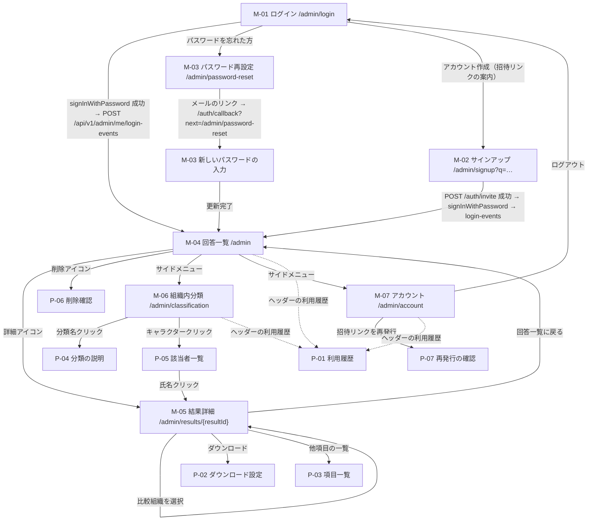

# 基本設計 06 画面設計（管理者側）とグラフ

| 項目 | 内容 |
|---|---|
| 文書名 | 適性検査システム 基本設計 06 画面設計（管理者側）とグラフ |
| 版 | 1.2（1.1 版: レビュー指摘 20 件への対応。1.2 版: 最終点検で 07 D07-15・01 D01-35・00 1.1 版との整合を反映。変更点は §13） |
| 作成日 | 2026-09-17（1.1 版: 2026-09-21、1.2 版: 2026-09-21） |
| 対象 | 管理者画面（S-01、S-05〜S-11 と付随画面）、文言の出し分け、色規則、グラフ部品を実装する担当者。07（PDF）、04（API）、08（テスト）の担当者 |

## 0. 本書の位置づけ

本書は、管理者（`admin_user`）が使う画面と、その画面に載るグラフ・文言・色の設計を確定するものです。共通定義（`docs/基本設計/00_共通定義.md`。以下「00」）の用語・識別子・テーブル名・型名・API 規約をそのまま使い、本書で別名を作りません。

- 本書が定めるもの: 管理者画面の一覧・遷移・認可、PC 幅のレイアウト方針、各画面の項目・操作・表示条件、文言マスタ（付録C）のデータ構造と出し分け条件、色規則（信頼係数の緑系化を含む）、ApexCharts のコンポーネント仕様、ゲージ・スライダー・評価レター・立ち位置・組織内分類の描画方式、イラストの配置規約、比較未選択時の表示、負値の表示。
- 本書が定めないもの（参照のみ）: システム構成・ライブラリ版（01 分冊）、DDL・RLS・認証の仕組み（02 分冊）、採点式と比較計算の純関数（03 分冊）、API の入出力・エラーコード・監査ログの書き込み（04 分冊）、受検者画面（05 分冊）、AI 解説の生成処理と PDF の生成方式（07 分冊）、実装順とテスト計画（08 分冊）。
- 文言の本文は付録C を正とし、本書には複製しません。本書は「どの条件でどの文言を出すか」と「コード上の置き場所」を定めます。
- 04・07・08 分冊は本書 1.0 版と同時に執筆されました。1.1 版では、01（1.1 版）・02（1.1 版）・04（1.1 版）・07・08 が確定した事項（管理者追加の方式、ログイン記録 API、Dto の項目名、印刷用ページの認可、`onMounted`／`PdfSectionVisibility`）を本書側に取り込み、本書が依頼した項目のうち各分冊が採用しなかったもの（`availableTeamCodes`）は取り下げています。残る依頼は §8・§9 に「依頼」として明示します。

### 0.1 参照した要件

| 参照元 | 参照した内容 |
|---|---|
| 要件定義書 §3、§4 | 管理者・オーナー・管理者追加・スーパーアドミンの権限、ログイン方式 |
| 要件定義書 §5 | 管理者の業務フロー（リンク送付、結果閲覧、比較組織の選択、AI 解説、PDF、チーム・除外・削除） |
| 要件定義書 §6.2 A-01〜A-13 | 管理者機能（ログイン、回答一覧、チーム、除外、削除、利用履歴、結果詳細、比較組織選択、AI 解説、PDF、組織内分類、アカウント、幹部データの閲覧制限） |
| 要件定義書 §6.4 | 文言の出し分けのキー（タイプ、16 尺度の最大・最小、資質第一・第二候補、ソーシャルスタイル、偏差値、分類） |
| 要件定義書 §6.5 V-01〜V-09 | レーダー 3 種、ドーナツゲージ、評価レター、相性スライダー、立ち位置、組織内分類マトリクス、PDF |
| 要件定義書 §6.6 | AI 解説の表示（7 ブロック）、生成状態 |
| 要件定義書 §7 | 画面一覧 S-01、S-05〜S-11 と結果詳細の 7 セクション構成 |
| 要件定義書 §9 | PC 幅（既存 1440px）、性能（結果詳細を 1〜2 リクエストで描画）、個人情報保護 |
| 要件定義書 §11 の 3・5・6・10 番 | 母集団の統一、信頼係数の色、比較値の非永続化、母集団の定義 |
| 要件定義書 §12 | 幹部データの表示位置、削除の確認ダイアログ、PDF レイアウト、パスワード再設定・アカウント作成の画面文言、イラスト、負値のスライダー表示 |
| 付録B §9、§10 | 合致度・偏差値・評価・立ち位置の定義（表示条件の理解のため。計算は 03） |
| 付録C §1〜§8 | 文言マスタの構造と出し分け条件、色分けルール、組織内分類 |
| 付録D §1、§2 | AI 解説の 7 ブロック、JSON スキーマ、免責表示 |
| 付録E §1〜§7 | レーダーチャートの軸順・設定値・色・サイズ、ゲージ、スライダー、評価レター、組織内分類の色、PDF |
| 00 §1.11、§3.3、§3.5、§3.8、§4、§5、§8 | 不具合対応の共通ルール、ディレクトリ、マスタ型、イラスト配置、API 規約、役割、設計判断 D-xx |
| 01 §3.2、§5.3、§5.5、§8.7 | `react-apexcharts` は `next/dynamic`（`ssr: false`）で読み込む、公開サインアップの無効化（D01-09）、`middleware.ts` の認証不要パス、CSP で ApexCharts のインライン style を許可 |
| 02 §3、§7.1、§7.3、§8.6、§14.1 | 画面が参照する列名、ログイン・招待の流れ（`POST /auth/invite` 方式。D02-32）、監査ログの記録対象、06 への改版依頼 |
| 03 §2.3、§4.4、§8、§9、§11 | `lib/presentation/` の責任分界、色分けの関数形、最高・最低尺度の同点規則、負値の表示規則、丸め規則、`chartOrder`、`populationSize` の表示 |
| 04 §2.4、§5、§6、§7、§8.3、§8.5、§9.1、§10 | エラーコード、管理者 API の入出力（Dto の項目名）、認証系 Route Handler、AI 解説の同期方式、Server Component からの service 呼び出し、`middleware.ts`、比較のシーケンス、06 への読み替え |
| 05 §2.5、§4、§9.1 | デザイントークンの書き方、画面の共通ルール、サイト名の仮置き（受検者側との整合） |
| 07 §6、§7.2、§9.4〜§9.6、§11 | AI 解説の状態遷移と失敗理由コード、印刷用ページの配置と認可、`PdfSectionVisibility`、レーダーの `onMounted` |
| 08 §3.4.3、§4.1 | E2E（E-13 比較 API 1 本、E-14 色）、既存との差異 4（信頼係数の色） |

### 0.2 決定事項との対応

| # | 決定事項 | 本書での対応 |
|---|---|---|
| 1 | Next.js（App Router、TypeScript）+ Supabase + Vercel。グラフは ApexCharts（react-apexcharts） | §6 のレーダー 3 種は `react-apexcharts`。ゲージ・スライダー・評価レターは自前 SVG／CSS（設計判断 D06-01。§6.1）。画面は `app/(admin)/admin/` 配下（00 §3.3） |
| 2 | 要件定義書 §11 の不具合 10 件を修正 | 3・10 番: 比較系列・合致度・評価・立ち位置は同一 API 応答（同一母集団）から描く（§3.5.3）。5 番: 信頼係数の色を高いほど緑系にする（§5.2）。6 番: 比較値を画面状態と URL クエリだけで扱い保存しない（§3.5.3）。8 番: 画面には表示名（直感型など）を使い、内部名「感性開放型」は表示しない（§4） |
| 3 | 出題は Q1〜Q144 のみ | 管理者画面は設問を扱いません。結果詳細に設問数を表示しません |
| 4 | 既存データは移行しない | 一覧の初期状態は 0 件。0 件時の表示を定めます（§3.4.6） |
| 5 | AI 解説は Claude API。差し替え可能 | 画面は provider 名を表示しません。表示は 07 が返す `AiAnalysisOutput`（00 §3.6）だけに依存します（§3.5.9） |
| 6 | 日本語のみ。管理画面は PC 幅 | §2 の PC 幅レイアウト方針（1440px 基準、レスポンシブ対応なし） |

## 1. 画面一覧と遷移

### 1.1 画面一覧

画面 ID は本書内の識別子です（要件定義書の S-xx と対応付けます）。ポップアップは `P-xx`、エラー表示は `E-xx` とします。

| ID | 画面 | 要件定義書 | URL | 認証 | 役割による差 |
|---|---|---|---|---|---|
| M-01 | ログイン | S-01 | `/admin/login` | 不要 | なし |
| M-02 | 管理者サインアップ | S-01「アカウント作成」、§4「管理者追加」 | `/admin/signup?q={inviteToken}` | 不要 | なし（登録後は `admin`。02 §7.3） |
| M-03 | パスワード再設定 | S-01「パスワードを忘れた方」、§9 認証 | `/admin/password-reset` | 不要（再設定リンク経由の一時セッションで新パスワード入力） | なし |
| M-04 | 回答一覧 | S-05、A-02〜A-05 | `/admin` | 必要 | `admin` には幹部（`executive`）を表示しない（A-13、00 §5） |
| M-05 | 結果詳細 | S-06、A-07〜A-10 | `/admin/results/{resultId}?scope=organization` または `?scope=team&teamCode=A` | 必要 | `admin` は幹部の結果を開けない（404 相当。§1.3） |
| M-06 | 組織内分類 | S-07、A-11 | `/admin/classification` | 必要 | `admin` の人数・該当者に幹部を含めない |
| M-07 | アカウント | S-08、A-12 | `/admin/account` | 必要 | `owner`／`super_admin` のみ管理者一覧と招待リンク再発行（§3.7） |
| P-01 | 利用履歴 | S-09、A-06 | M-04〜M-07 のヘッダーから開くポップアップ | 必要 | `admin` には幹部の履歴を表示しない |
| P-02 | ダウンロード設定 | S-10、A-10 | M-05 内 | 必要 | なし |
| P-03 | 項目一覧 | S-11 | M-05 内 | 必要 | なし |
| P-04 | 分類の説明 | A-11 | M-06 内 | 必要 | なし |
| P-05 | 該当者一覧 | A-11 | M-06 内 | 必要 | `admin` には幹部を含めない |
| P-06 | 削除確認 | A-05（未確認。D-11 の仮置き） | M-04 内 | 必要 | なし |
| P-07 | 招待リンク再発行の確認 | （既存に無し。02 §7.3） | M-07 内 | 必要 | `owner`／`super_admin` のみ |
| E-01 | 利用不可（停止中・未所属） | 02 §7.1、04 §2.4 | 全管理画面（専用 URL は置かず、各ページの Server Component が本文の代わりに描画する。§1.3） | ログイン済み | `is_suspended`／`deleted_at`（04 の 403 `ADMIN_SUSPENDED`）、`admin_users` 行なし（403 `ADMIN_NOT_REGISTERED`） |
| E-02 | 見つからない・権限なし | 00 §4.1（404／403） | M-05 など | 必要 | 他組織・幹部（`admin`）・削除済み |

- 既存の URL（`/admin_page?fg_p=…`、`?section=…`）は踏襲しません。00 §3.3 のルートを正とします。
- 「受検者登録（受検リンク発行）」は独立した画面ではなく、M-07 アカウントの 3 リンク（求職者用・既存スタッフ用・管理者追加用）で行います（要件定義書 §6.2 A-12、§5 の 1 番）。

### 1.2 画面遷移図



### 1.3 認可と画面の対応

認証の仕組みは 02 §7、API 側の認可は 04 分冊です。画面側は次のとおり振る舞います。

| 状態 | 画面側の挙動 | 根拠 |
|---|---|---|
| 未ログインで `/admin/**`（認証不要パスを除く）にアクセス | `middleware.ts`（04 §8.5、01 §5.5）が `/admin/login?next={元のパス}` へ 302 する。認証不要パスは `/admin/login`、`/admin/signup`、`/admin/password-reset`、`/admin/results/{resultId}/print`（04 §8.5 `PUBLIC_ADMIN_PATHS`）。画面側は `next` を `/admin` で始まるパスのみ許可（オープンリダイレクト防止） | 04 §8.5、00 §3.7、要件定義書 §9 認証 |
| ログイン済みで M-01 にアクセス | `/admin` へリダイレクト（`login/page.tsx` の Server Component が `getUser()` で判定） | 設計判断 |
| 認証済みページ（M-04〜M-07）の初期表示 | 各ページの Server Component が `requireAdmin()`（04 §2.5.1、§8.3）を呼んで `AdminContext` を得てから `lib/services/` を呼ぶ。`ApiError` の変換: 401 `UNAUTHENTICATED` → `redirect("/admin/login?next=…")`（middleware をすり抜けた Cookie 失効の保険）、403 `ADMIN_SUSPENDED`／`ADMIN_NOT_REGISTERED` → E-01 を本文の代わりに描画、404 系 → `notFound()`（E-02） | 04 §8.3「`ApiError` はページ側で `notFound()` / `redirect` に変換（06）」 |
| ログイン済みだが `admin_users` の状態が不正（403 `ADMIN_SUSPENDED`: 停止中・削除済み、403 `ADMIN_NOT_REGISTERED`: 未所属） | E-01 を表示（T-15）。サイドメニュー・ヘッダーは出さず「ログアウト」だけを置く。ブラウザからの API 呼び出しで同じ 403 を受けたときは `window.location.reload()` で Server Component に描画し直させる（§10.4）。専用ルート（`/admin/unavailable` など）は置かない（00 §3.3 に無いため。設計判断 D06-27） | 02 §7.1、04 §2.4、00 §5 |
| `admin` が幹部の結果詳細 URL を直接開く | 04 が 404 を返す前提で E-02「回答データが見つかりません」を表示（存在を見せない。00 §5 補足） | 要件定義書 §6.2 A-13、00 §5、04 D04-07 |
| `owner`／`super_admin` | 幹部データを一覧・詳細・分類・履歴に表示。`super_admin` は本フェーズでは `owner` と同じ画面（D-14） | 00 §5 |
| 他組織のリソース ID | 04 が 404 を返す（RLS で行が見えない）。E-02 | 02 §6 |
| 印刷用ページ `/admin/results/{resultId}/print`（07 §9.4） | 管理者 Cookie を要求せず、クエリ `token` を `verifyPdfToken`（04 §7.2）で検証する。本書の認証チェック・`AdminShell` はこのページに掛からない（下記のレイアウト構成） | 07 §9.4、04 §7.2、§8.5 D04-41 |

`app/(admin)/admin/layout.tsx` の役割（設計判断 D06-27）:

- このレイアウトは **認証チェックを行わず、`AdminShell` も描画しません**。`app/(admin)/admin.css`（§2.2）の読み込みと `lang="ja"` 配下の共通 `metadata`（`robots: noindex`）だけを担います。理由: Next.js の入れ子レイアウトは配下の全ルートに適用されるため、ここで Auth セッションを確認すると、認証不要パス（M-01〜M-03）と 07 の印刷用ページ（Chromium が管理者 Cookie を持たずに開く）までログイン画面へ送ってしまい、PDF 生成が失敗します。00 §3.3 は `app/(admin)/admin/` 直下に各 `page.tsx` を置く構成のため、ルートグループで認証済みページだけを分ける構成（ファイルパスが 00 §3.3 と変わる）も採りません。
- 未ログインの遮断は `middleware.ts`（04 §8.5）に一本化し、認証済みページ（M-04〜M-07）は各 `page.tsx` の Server Component で `requireAdmin()` → `AdminShell`（`me` に `MeDto` を渡し、本文を子要素にする）の順に描画します（`AdminShell` は §2.4）。M-01〜M-03 は `AuthCard` を使い、`AdminShell` を使いません。
- 07 の `print/layout.tsx` はこのレイアウトの内側に置かれます。本書のレイアウトは CSS の読み込みだけなので、印刷用ページが本書の `components/admin/result/*`・`components/charts/*` を再利用する際に必要なクラス定義（`.compat-slider` など）がそのまま使えます。07 §9.4 の「最小の `html` / `body`」は、00 §3.3 の `app/layout.tsx`（ルートレイアウト）の内側では `html` / `body` を再定義できないため、「サイドメニュー・ヘッダーを描画しない最小のラッパー」と読み替えるよう 07 に申し送ります（§9）。

役割の判定は `GET /api/v1/admin/me`（または Server Component から `lib/services/` 経由）で得た `role` で行い、画面はこれをキャッシュしません。`canViewExecutives = role === "owner" || role === "super_admin"` をヘルパー `lib/auth/admin-role.ts` に置きます（§10.1）。

## 2. PC 幅レイアウト方針

### 2.1 幅と対応範囲

| 項目 | 方針 | 根拠 |
|---|---|---|
| 基準幅 | 1440px（既存の確認幅） | 要件定義書 §9 対応端末 |
| 対応範囲 | 1280px〜1920px。1280px 未満ではページ全体を横スクロール可とし、レイアウトを崩さない（レスポンシブ対応は行わない） | 決定事項 6（管理画面は PC 幅）。設計判断 D06-02 |
| 全体構成 | 左に固定幅サイドメニュー（224px）、右に本文。本文は最大幅 1200px、左右余白 32px | 要件定義書 §7 S-05「サイドメニュー」 |
| 結果詳細の列 | 本文内を 2 列（左 7 : 右 5）または 3 列に分ける。列幅は §3.5 の各セクションで定める | 付録E §1 のレーダーサイズ（626×450、440×440 など） |
| 文字サイズ | 本文 14px、見出し 20px／16px、評価レター 64px、ゲージ中央 22px | 設計判断 |
| 印刷 | 画面は `@media print` を持たない。PDF は 07 の印刷用ページが担う | 00 §6 分冊間の境界 |

### 2.2 デザイントークン

配色は既存資料に具体値が無い（付録C §7 は CSS 変数名のみ。橙だけ `rgba(255,128,0,1)`）ため、指標の色以外は設計判断です（D06-03）。受検者側（05 §2.5）とは別のスタイルシートにし、ダークモード対応は行いません。

```css
/* app/(admin)/admin.css （app/(admin)/admin/layout.tsx から読み込む。このレイアウトは CSS の読み込みのみ。§1.3 D06-27） */
:root {
  /* 画面の基調 */
  --admin-bg: #f3f5f8;
  --admin-surface: #ffffff;
  --admin-text: #1f2933;
  --admin-text-muted: #52606d;
  --admin-border: #cbd2d9;
  --admin-primary: #0b5cad;         /* 主ボタン、リンク、サイドメニューの選択状態 */
  --admin-primary-soft: #e6f0fa;
  --admin-danger: #c62828;          /* 削除、エラー */
  --admin-danger-soft: #fdecea;
  --admin-sidebar-bg: #1f2933;
  --admin-sidebar-text: #f3f5f8;
  --admin-radius: 8px;
  --admin-sidebar-width: 224px;
  --admin-content-max-width: 1200px;
  --admin-gutter: 32px;

  /* グラフ系列（付録E §1、§2 の取得値） */
  --chart-subject: #00a2ff;         /* 受検者系列 */
  --chart-comparison: #14f584;      /* 比較対象系列 */

  /* 5 段階の値域色（付録C §7。橙のみ取得値、他は設計判断 D06-03） */
  --band-very-low: #8ecae6;         /* 薄い青 */
  --band-low: #2e9e5b;              /* 緑 */
  --band-middle: #d4a600;           /* 黄（白背景で読める濃さに調整） */
  --band-high: #ff8000;             /* 橙（付録C §7 の取得値） */
  --band-very-high: #d32f2f;        /* 赤 */

  /* 信頼係数専用（高いほど緑系。§5.2、D06-04） */
  --reliability-very-high: #1b7f4b; /* 濃い緑 */
  --reliability-high: #7cb342;      /* 黄緑 */

  /* ソーシャルスタイル（付録E §6 の取得値） */
  --style-driving: rgb(149, 112, 161);
  --style-expressive: rgb(229, 179, 83);
  --style-analytical: rgb(65, 166, 123);
  --style-amiable: rgb(65, 148, 175);

  /* 相性スライダー（付録E §4「緑の四角マーカー」。具体値は未取得のため設計判断） */
  --slider-track: #e5e7eb;
  --slider-marker: #1fa463;

  /* ゲージ */
  --gauge-track: #e5e7eb;
}
```

- フォントはシステムフォント（`system-ui, -apple-system, "Hiragino Sans", "Noto Sans JP", sans-serif`）とし、Web フォントを読み込みません（05 §2.5 と同じ方針。PDF の印刷用ページでも同じフォント指定にすることを 07 に依頼。§9）。
- ApexCharts の `chart.fontFamily` にも同じフォント列を渡します（§6.1）。

### 2.3 共通レイアウト

```text
┌──────────┬────────────────────────────────────────────────────────────┐
│ サイド    │ ヘッダー: [組織名]              [利用履歴] [管理者名 ▾ ログアウト] │
│ メニュー  ├────────────────────────────────────────────────────────────┤
│          │                                                            │
│ 回答一覧  │   本文（最大幅 1200px、左右余白 32px）                        │
│ 組織内分類│                                                            │
│ アカウント│                                                            │
│          │                                                            │
│ (下部)    │                                                            │
│ サイト名  │                                                            │
└──────────┴────────────────────────────────────────────────────────────┘
```

| 要素 | 内容 | 根拠 |
|---|---|---|
| サイドメニュー | 「回答一覧」（`/admin`）、「組織内分類」（`/admin/classification`）、「アカウント」（`/admin/account`）。現在位置を強調 | 要件定義書 §7 S-05 |
| ヘッダー左 | 組織名（`organizations.name`。`GET /api/v1/admin/me` の組織情報） | 設計判断（複数組織の管理者が混同しないため） |
| ヘッダー右 | 「利用履歴」ボタン（P-01 を開く）、管理者名、「ログアウト」 | 要件定義書 §6.2 A-06「ヘッダーの『利用履歴』ボタン」 |
| サイト名 | 「適性検査」（05 §9.1 H-01 と同じ仮置き。依頼主確認事項） | 05 D05-22 |
| M-01〜M-03 | サイドメニュー・ヘッダーなし。中央に幅 420px のカード | 設計判断 |

### 2.4 共通部品

| コンポーネント | ファイル | 種別 | 役割 |
|---|---|---|---|
| `AdminShell` | `components/admin/AdminShell.tsx` | Server | サイドメニュー・ヘッダー・本文コンテナ。認証済みページ（M-04〜M-07）の各 `page.tsx` が `requireAdmin()` の後に使う（`layout.tsx` からは使わない。§1.3 D06-27）。props に `MeDto`（04 §5.1）を受け取る |
| `AdminHeader` | `components/admin/AdminHeader.tsx` | Client | 組織名、利用履歴ボタン、管理者名、ログアウト |
| `AdminUnavailable` | `components/admin/AdminUnavailable.tsx` | Server | E-01（T-15 と「ログアウト」ボタンのみ）。`requireAdmin()` が 403 を投げたときに各 `page.tsx` が本文の代わりに描画する |
| `AuthCard` | `components/admin/AuthCard.tsx` | Server | M-01〜M-03 の中央カード |
| `UsageLogDialog` | `components/admin/UsageLogDialog.tsx` | Client | P-01 |
| `ResultTable` | `components/admin/ResultTable.tsx` | Client | M-04 の一覧テーブル（チーム・除外・削除の操作を含む） |
| `ResultFilters` | `components/admin/ResultFilters.tsx` | Client | M-04 の検索・絞り込み・並び替え |
| `DeleteConfirmDialog` | `components/admin/DeleteConfirmDialog.tsx` | Client | P-06 |
| `ResultDetailPage` | `components/admin/result/ResultDetailPage.tsx` | Server | M-05 の本文。`ComparisonProvider` の内側に §3.5 の各セクション部品を並べる |
| `ComparisonProvider` | `components/admin/result/ComparisonProvider.tsx` | Client | URL クエリ（`scope`、`teamCode`）を読み、`GET …/comparison` を 1 本呼んで比較状態（§3.5.1）を React Context で配下に渡す。印刷用ページ（07）では `initialComparison` を props で受け取り API を呼ばない |
| `ComparisonScopeSelect` | `components/admin/result/ComparisonScopeSelect.tsx` | Client | 比較組織プルダウン。選択で URL クエリを更新（`router.replace`）。取得は `ComparisonProvider` が行う |
| `SummarySection` ほか | `components/admin/result/*.tsx` | Server（グラフ部分と比較依存部分は Client） | §3.5 の 7 セクション。比較に依存する部品（評価レター、合致度ゲージ、立ち位置、レーダーの比較系列、母集団注記）は `useComparison()` を使う Client 部品 |
| `TraitListDialog` | `components/admin/result/TraitListDialog.tsx` | Client | P-03 |
| `DownloadDialog` | `components/admin/result/DownloadDialog.tsx` | Client | P-02 |
| `AiAnalysisSection` | `components/admin/result/AiAnalysisSection.tsx` | Client | AI 解説の生成・表示・状態遷移 |
| `ClassificationMatrix` | `components/admin/classification/ClassificationMatrix.tsx` | Client | M-06 のマトリクス、P-04、P-05 |
| `AccountPage` | `components/admin/account/*.tsx` | Client | M-07 の各フォーム、コピー、管理者一覧 |
| `TraitRadar` / `AptitudeRadar` / `SocialStyleRadar` | `components/charts/*.tsx` | Client | ApexCharts ラッパー（§6.2〜§6.4） |
| `DonutGauge` / `CompatSlider` / `GradeLetter` | `components/charts/*.tsx` | Server 可（SVG／CSS） | §6.5〜§6.7 |
| `Illustration` | `components/ui/Illustration.tsx` | Server | イラスト画像（§7） |
| `Dialog`、`Button`、`Select`、`Checkbox`、`TextField`、`Toast`、`CopyButton` | `components/ui/*.tsx` | Client | 汎用部品（00 §3.3） |

- ポップアップはすべて `dialog` 要素で実装し、Esc と背景クリックで閉じます。開いた時に最初の操作要素へフォーカスを移し、閉じた時に元の要素へ戻します。
- Client Component は `"use client"` を先頭に置き、`lib/db/`・`lib/services/`・`@anthropic-ai/*` を import しません（01 §3.5）。API 呼び出しは `lib/utils/admin-api.ts` に集約します（§10.4）。

### 2.5 画面の共通ルール

| 項目 | ルール | 根拠 |
|---|---|---|
| 初期表示 | Server Component が `lib/services/` を直接呼んで初期データを取得し、Client Component に渡す（00 §3.3）。監査ログ（`result.list`、`result.view`、`classification.view`、`usage_log.view`）はサービス側で書く（02 §8.6、04） | 要件定義書 §9 性能 |
| 更新操作 | すべて Route Handler（`/api/v1/admin/...`）。Server Action は使わない | 00 §4.1 |
| 通信中 | 対象の操作要素を `aria-disabled="true"` にし、二重送出を in-flight フラグで防ぐ。全画面オーバーレイは削除・AI 生成・PDF 生成のときだけ | 設計判断 |
| 通信エラー | `Toast`（`role="alert"`）に 04 の `error.message`（日本語。04 §2.4）を表示し、入力値・選択値を保持する。403 `ADMIN_SUSPENDED`／`ADMIN_NOT_REGISTERED` は `window.location.reload()` で Server Component に E-01 を描画させる（§1.3、§10.4）。401 `UNAUTHENTICATED` は `/admin/login?next={現在のパス}` へ遷移 | 00 §4.1、04 §2.4 |
| 日時 | `Intl.DateTimeFormat("ja-JP", { timeZone: "Asia/Tokyo", ... })` で `YYYY/MM/DD HH:mm` に整形（`lib/presentation/format-datetime.ts`）。API は ISO 8601 UTC | 00 §2.1、01 §3.2 |
| 数値 | 丸めは `lib/presentation/rounding.ts`（03 §9.2）だけで行う。JSX で `toFixed` を直接呼ばない | 03 §9 |
| 個人情報 | 氏名・電話番号は一覧・詳細・履歴に必要な箇所だけに表示し、`localStorage` に置かない。ブラウザの `console` に出さない | 要件定義書 §9、01 §8.6 |
| 文言 | 画面固有の文言は `lib/presentation/admin-texts.ts` に定数として置く（§10.5）。付録C の文言は `lib/masters/texts/`（§4） | 05 §4 と同じ方針 |
| 状態を色だけで表さない | 評価レター・ゲージ・信頼係数には数値または文字を必ず併記する。組織内分類の分類色には分類名を併記する | アクセシビリティ（設計判断） |
| 比較値 | 比較計算の結果は API 応答と URL クエリ（`scope`、`teamCode`）だけで扱い、Cookie・`localStorage`・DB に保存しない | 要件定義書 §11 の 6 番、00 §1.11 |

## 3. 各画面の設計

### 3.1 M-01 ログイン（S-01）

```text
┌──────────────────────────────┐
│           適性検査            │
│  管理画面ログイン              │
│  メールアドレス [__________]  │
│  パスワード     [__________]  │
│  [        ログイン        ]   │
│  パスワードを忘れた方          │
│  アカウント作成（管理者追加用   │
│  リンクからご登録ください）     │
└──────────────────────────────┘
```

| 項目 | 内容 | 根拠 |
|---|---|---|
| メールアドレス | `type="email"`、必須 | 要件定義書 §6.2 A-01 |
| パスワード | `type="password"`、必須。表示切替ボタン付き | 同上 |
| ログイン | Supabase Auth SDK `signInWithPassword`（ブラウザ）→ 成功したら **`POST /api/v1/admin/me/login-events`**（`recordLoginEvent()`。§10.4）を 1 回呼ぶ → `next` クエリ（`/admin` 配下のみ）または `/admin` へ遷移。`login-events` が失敗（ネットワークエラー・403 など）しても遷移は続行する（監査記録の欠落として扱う。04 §5.1）。403 を受けた場合は遷移先の Server Component が E-01 を描画する | 02 §7.1、04 §5.1 D04-24、§6.3 |
| 失敗時 | 「メールアドレスまたはパスワードが正しくありません」（T-24）を表示。存在の有無を区別しない | 設計判断（要件定義書 §12: 文言は未確認） |
| `?error=auth_callback` 付きで開かれたとき | `/auth/callback` がコード交換に失敗して戻した状態（04 §6.1）。フォームの上に T-23「認証リンクが無効か期限切れです。もう一度お試しください」を表示し、クエリはフォーム送信時に取り除く | 04 §6.1 |
| パスワードを忘れた方 | `/admin/password-reset` へのリンク | 要件定義書 §7 S-01 |
| アカウント作成 | 既存にはリンクがあるが、新システムのサインアップは招待トークンが必須（02 §7.3）。設計判断 D06-05: リンク先を `/admin/signup`（トークンなし）とし、そこで「管理者追加用リンクから登録してください」の案内を出す | 要件定義書 §7 S-01、02 §7.3 |
| レート制限 | Supabase Auth の既定に依存（01 §8.4）。画面側での追加制御なし | 01 |

### 3.2 M-02 管理者サインアップ

| 項目 | 内容 | 根拠 |
|---|---|---|
| 事前検証 | Server Component が `q` を `validate_admin_invite_token(p_token)`（02 §7.3。anon で呼べる）に渡し、組織名を得る。無効・欠落なら案内文 T-22「このリンクは無効です。管理者追加用リンクを組織の管理者から受け取ってください」だけを表示し、フォームを出さない | 02 §7.3（トリガー例外を避けるため画面で事前検証）、04 §8.5 |
| 表示 | 「{組織名} の管理者として登録します」 | 02 §7.3 の図 |
| 入力 | お名前（必須、100 文字以内）、メールアドレス（必須）、パスワード（必須、8 文字以上 72 文字以内。強度規則は Supabase Auth 側。01 D01-10）、パスワード（確認。一致しなければ送信しない） | 02 §3.3 `name`、04 §6.2 `acceptInviteInputSchema`、要件定義書 §9 認証 |
| 送信 | **`POST /auth/invite`**（04 §6.2）を `acceptInvite({ inviteToken, name, email, password })`（§10.4）で呼ぶ。ブラウザから Supabase Auth SDK の `signUp` は **呼ばない**（公開サインアップは無効。01 §5.3 D01-09、02 D02-32）。200 を受けたら (1) `signInWithPassword({ email, password })` でログイン、(2) `POST /api/v1/admin/me/login-events`（§3.1 と同じ。失敗しても続行）、(3) `/admin`（M-04）へ遷移。(1) が失敗した場合は応答の `nextUrl`（`/admin/login`）へ遷移し、M-01 で T-25「登録が完了しました。ログインしてください」を表示する（`?registered=1` クエリで判定し、送信時に取り除く）。確認メールは送られない（`email_confirm: true`。04 D04-37）ため「確認メールを送信しました」の表示は置かない | 04 §6.2、§6.3、D04-37、02 §14.1 |
| 失敗 | 404 `INVITE_TOKEN_INVALID`: フォームを閉じて T-22 を表示（事前検証後に再発行された場合）。409 `EMAIL_ALREADY_REGISTERED`: 04 の `error.message` をメールアドレス欄の下に表示し、M-01 へのリンクを添える。422 `VALIDATION_ERROR`: `details.issues` の `path` に対応する欄の下に `message` を表示。429 `RATE_LIMITED`／その他: `Toast` に `error.message` | 04 §2.4、§6.2 |
| 登録後の役割 | 常に `admin`。画面で役割を選ばせない | 要件定義書 §4、02 §7.3 |

- 05・02 と同じく、`POST /auth/invite` は `/api/v1` の外にあり（00 §4.2「認証は `/api/v1` 配下に置かない」）、`lib/utils/admin-api.ts` の共通ラッパーから見ると「認証済みでなくても呼べる例外」です。`acceptInvite()` は 403 を E-01 に変換しません（§10.4）。

### 3.3 M-03 パスワード再設定

1 つのページを 2 つのモードで使います。

| モード | 判定 | 内容 |
|---|---|---|
| 送信依頼 | Auth セッションがない、または `type=recovery` の一時セッションでない | メールアドレスを入力し、`resetPasswordForEmail(email, { redirectTo: `${window.location.origin}/auth/callback?next=/admin/password-reset` })` を呼ぶ（ブラウザ側は `NEXT_PUBLIC_APP_BASE_URL` を直接参照しない。01 §4.2 D01-35。Preview では Supabase Auth の Redirect URLs にワイルドカード登録が必要。01 §5.3）。結果にかかわらず「入力したメールアドレス宛に案内を送信しました」を表示（存在の有無を区別しない） |
| 新パスワード入力 | `/auth/callback` 経由で recovery セッションが確立している | 新しいパスワードと確認を入力し、`updateUser({ password })`。成功後「パスワードを変更しました」を表示し `/admin` へ |

- メール本文は Supabase Auth のテンプレート（01 §7.7）。未確認（要件定義書 §12: パスワード再設定メールの文言）。
- 運用者が作成した初期オーナー（02 §7.2）も同じ画面でパスワードを設定します。

### 3.4 M-04 回答一覧（S-05）

#### 3.4.1 レイアウト

```text
回答一覧                                                        [利用履歴]
┌────────────────────────────────────────────────────────────────────────┐
│ 氏名・電話番号で検索 [________] 区分 [すべて ▾]（オーナーのみ） チーム [すべて ▾] │
│ 並び替え [回答日時（新しい順） ▾]                          全 123 件       │
├───┬──────────┬────┬──────────┬────────┬─────────┬──────────────┬────┤
│詳細│お名前      │区分 │チーム      │除外     │職業      │電話番号 │回答日時   │削除│
├───┼──────────┼────┼──────────┼────────┼─────────┼──────────────┼────┤
│ ▤ │山田 太郎   │求職者│[Aチーム ▾]│☐ 除外する│歯科衛生士│090-…   │2026/09/17 10:30│ 🗑 │
│ … │            │     │           │         │          │        │              │    │
├───┴──────────┴────┴──────────┴────────┴─────────┴──────────────┴────┤
│                        ‹ 1 2 3 … ›   1 ページ 50 件                     │
└────────────────────────────────────────────────────────────────────────┘
```

#### 3.4.2 列

| 列 | 内容 | データ元（00 §2.2） | 根拠 |
|---|---|---|---|
| 詳細 | アイコンボタン。`/admin/results/{resultId}` へ遷移 | `results.id` | 要件定義書 §6.2 A-02 |
| お名前 | 氏名。クリックでも詳細へ | `respondents.name` | 同上 |
| 区分 | 「求職者」／「既存スタッフ」。`owner`／`super_admin` のときだけ表示（`admin` には幹部行自体が無いため列も出さない） | `respondents.kind` | 要件定義書 §6.2 A-13、§12（表示位置は未確認。設計判断 D06-06: 同一表に区分列で示す） |
| チーム | プルダウン。「未設定」「Aチーム」…「Zチーム」。変更で即時 `PATCH /api/v1/admin/respondents/{respondentId}` `{ "teamCode": "A" }`（未設定は `null`） | `respondents.team_code` | 要件定義書 §6.2 A-03 |
| 除外 | チェックボックス「除外する」。変更で即時 `PATCH` `{ "isExcluded": true }` | `respondents.is_excluded` | 要件定義書 §6.2 A-04 |
| 職業 | 職業コードを `lib/masters/occupations.ts` で表示名に変換 | `respondents.occupation_code` | 要件定義書 §6.1 U-02、00 §1.10 |
| 電話番号 | そのまま表示 | `respondents.phone_number` | 要件定義書 §6.2 A-02 |
| 回答日時 | Asia/Tokyo で `YYYY/MM/DD HH:mm` | `results.submitted_at` | 同上 |
| 削除 | ゴミ箱アイコン。P-06 を開く | | 要件定義書 §6.2 A-05 |

- 一覧に載るのは送信済み（`results` 行が存在する）受検者だけです。下書き中（`assessment_sessions.status = draft`）の受検者は一覧に出さず、利用履歴（P-01）で「未回答」として確認できます（設計判断 D06-07。既存の一覧が「回答データ」の一覧であることに合わせる。要件定義書 §6.2 A-02）。
- 幹部行（`executive`）は `owner`／`super_admin` にだけ返されます（04 の `GET /api/v1/admin/results` が役割で絞る。00 §5）。画面側で隠す処理は持ちません（隠し忘れを防ぐ）。

#### 3.4.3 検索・絞り込み・並び替え

要件定義書には検索・並び替えの記載がありません（A-02 は「回答日時降順で一覧表示」のみ）。設計判断 D06-08: 件数が増えたときの運用のため次を追加します。すべてサーバ側で処理し（04 の `GET /api/v1/admin/results` のクエリパラメータ。§8.2）、URL クエリに反映してブラウザの戻る・再読み込みで状態を保ちます。

| 操作 | クエリ | 挙動 |
|---|---|---|
| 氏名・電話番号で検索 | `q` | 氏名の部分一致に加え、電話番号（正規化後）の部分一致も同時に行う（04 §5.3 D04-26。正規化は 04）。ラベルはこの挙動に合わせ「氏名・電話番号で検索」とする。空なら全件。100 文字以内 |
| 区分 | `kind=applicant` / `executive` | `owner`／`super_admin` のみ表示。既定「すべて」 |
| チーム | `teamCode=A`〜`Z`、`teamCode=none`（未設定） | 既定「すべて」 |
| 並び替え | `sort=submittedAt` / `name`、`order=desc` / `asc` | 既定 `submittedAt desc`（要件定義書 §6.2 A-02）。04 §5.3 の `sort=teamCode` / `occupationCode` は本フェーズの画面では使わない（列見出しクリックの並び替えは置かない） |
| 除外の絞り込み | （使わない） | 04 §5.3 の `excluded`（`all` / `only` / `none`）は本フェーズの画面では使わず、常に既定の `all`（全件）で取得する。除外状態は行のチェックボックスで確認できるため |
| ページ | `page`（1 始まり）、`pageSize`（既定 50、最大 200） | 一覧は `{ items, total, page, pageSize }`（00 §4.1、04 §2.2）。ページャは `total` から計算 |

- 04 §5.3 の item には依頼項目に加えて `aptitudeType`、`socialStyle`、`aiGenerationStatus` が含まれます（D04-27）。本フェーズの一覧では表示しません（列を増やさない）。

#### 3.4.4 チーム・除外の更新

| 手順 | 内容 |
|---|---|
| 1 | 操作した行の該当コントロールを `aria-disabled` にし、`PATCH /api/v1/admin/respondents/{respondentId}` を送る（本文は変更した項目だけ） |
| 2 | 成功: 応答の値で行を更新。失敗: 元の値に戻し `Toast` にエラーを表示 |
| 3 | 更新は比較母集団に即時反映される（母集団は都度取得。00 §1.11）。結果詳細を開いているタブがあっても自動では更新しない（次の比較選択・再読み込みで反映） |

- チームと除外は受検者の属性であり、採点結果（`results`）には影響しません。
- 「除外する」の意味は「比較母集団から除く」だけです（要件定義書 §6.2 A-04）。一覧・詳細・組織内分類からは消えません（§3.6.3）。

#### 3.4.5 削除（P-06）

| 項目 | 内容 | 根拠 |
|---|---|---|
| ダイアログ | 見出し「回答データを削除しますか？」、本文「{氏名} さんの回答データと結果を削除します。この操作は取り消せません。」、ボタン「削除する」（危険色）／「キャンセル」 | D-11（確認ダイアログを表示） |
| 実行 | `DELETE /api/v1/admin/respondents/{respondentId}`（論理削除。02 §8.5） | 要件定義書 §6.2 A-05、D-11 |
| 成功（204） | 行を一覧から除き、`Toast`「削除しました」。`total` を 1 減らす | |
| 失敗: 404 `RESPONDENT_NOT_FOUND` | 別タブなどで既に削除済み（04 は削除済み行への DELETE を 404 で返す。D04-30）。ダイアログを閉じ、`Toast` に T-26「この回答データはすでに削除されています」を出して、現在の URL クエリで一覧を再取得する（`router.refresh()`） | 04 §5.6 D04-30、04 §10 |
| 失敗: それ以外（401／403／5xx／ネットワーク） | ダイアログを閉じずにダイアログ内に `error.message` を表示。403 `ADMIN_SUSPENDED`／`ADMIN_NOT_REGISTERED` は §2.5 のとおり再読み込み | 00 §4.1 |

#### 3.4.6 0 件時・エラー時

| 状態 | 表示 |
|---|---|
| 組織に回答データがない（初期状態。決定事項 4） | 「まだ回答データがありません。アカウント画面の受検リンクを受検者に送付してください。」と「アカウント画面へ」リンク |
| 検索・絞り込みで 0 件 | 「条件に一致する回答データがありません。」 |
| 取得エラー | `Toast` と「再読み込み」ボタン |

#### 3.4.7 P-01 利用履歴

| 項目 | 内容 | 根拠 |
|---|---|---|
| 開き方 | ヘッダーの「利用履歴」（全管理画面で共通） | 要件定義書 §6.2 A-06 |
| データ | `GET /api/v1/admin/usage-logs?page=1&pageSize=50`（`fetchUsageLogs`。§10.4）。`registeredAt` 降順（04 §5.8 の固定順） | 00 §4.2、02 §3.11、04 §5.8 |
| 列 | 名前（`name`）、電話番号（`phoneNumber`）、回答日時（`submittedAt`。`null` は T-19「未回答」）、過去の診断経験（`diagnosisExperience`: `first_time` →「初めて診断する」、`experienced` →「過去に診断したことがある」）、登録日時（`registeredAt`）。項目名は 04 §5.8 の確定形（本書 1.0 版の `respondentName` は `name` に読み替え済み）。`usageLogId`・`respondentId`・`resultId`・`kind` は表示しない | 要件定義書 §6.2 A-06、§7 S-09、00 §1.8、04 §5.8 |
| 見出し | 「利用履歴（全 {total} 件）」。既存の「利用回数管理」の意図を件数で示す | 要件定義書 §8.7 |
| 幹部 | `admin` には幹部の履歴を返さない（04 が `usage_logs.respondent_kind` で絞る） | 02 §3.11、00 §5 |
| 削除済み | 論理削除された受検者の履歴も表示する（02 D02-11）。物理削除後は名前・電話番号が「（削除済み）」で返る | 02 §8.5 |

### 3.5 M-05 結果詳細（S-06）

#### 3.5.1 データの取得と比較組織の状態

要件定義書 §9（1〜2 リクエストで描画）と §11 の 6 番（比較値を保存しない）を満たすため、比較組織の選択状態は **URL クエリ**に置きます。

| 状態 | URL | 取得 |
|---|---|---|
| 比較未選択 | `/admin/results/{resultId}` | Server Component（`page.tsx`）が `requireAdmin()` → `getResultDetail(ctx, resultId)`（04 §8.3。`GET /api/v1/admin/results/{resultId}` と同じ `ResultDetailDto`）を 1 回呼ぶ。比較 API は呼ばない |
| 組織全体を選択 | `/admin/results/{resultId}?scope=organization` | 結果詳細は上と同じ（Server Component）。比較は **ブラウザ**の `ComparisonProvider`（Client）が `GET /api/v1/admin/results/{resultId}/comparison?scope=organization`（`fetchComparison`。§10.4）を 1 本呼ぶ |
| チームを選択 | `/admin/results/{resultId}?scope=team&teamCode=A` | 同上（`scope=team&teamCode=A`） |

取得方式は 04 §9.1 のシーケンスと 08 E-13「比較 API の呼び出しが 1 本」に合わせ、**結果詳細は Server Component、比較はブラウザからの `GET …/comparison` 1 本**で確定します（設計判断 D06-28。1.0 版の「Server Component が結果詳細と比較を並行取得」は取り下げ）。要件定義書 §9「1〜2 リクエストで描画」は、初期表示 1 回 + 比較 1 回で満たします（08 PF-04）。

- `ComparisonScopeSelect`（Client）は選択の変更時に `router.replace`（履歴を増やさない）で URL クエリだけを書き換えます。`ComparisonProvider`（Client）は `useSearchParams()` で `scope`／`teamCode` を読み、`parseComparisonScope`（§10.2）が `null` でなければ `fetchComparison(resultId, scope)` を呼び、結果を Context で配下の比較依存部品に渡します。クエリが変わるたびに呼び直し、応答は React の state にだけ置きます（Cookie・`localStorage`・DB に保存しない。要件定義書 §11 の 6 番、00 §1.11）。比較値は毎回サーバで計算されます（04 §5.5）。
- 初期表示時に URL に `scope` が付いていれば（再読み込み・ブックマーク）、マウント直後に同じ取得を行います（08 E-13「URL クエリ `scope` の再読み込みで状態が保たれる」）。
- 取得中は比較依存の項目を「読み込み中…」の枠（選択前と同じ寸法）にし、レイアウトを動かしません。取得完了までプルダウンは `aria-disabled` にします（連続変更時は最後の選択だけを反映。前の応答は捨てる）。
- 無効なクエリ（`scope=team` で `teamCode` なし、`teamCode` が A〜Z 以外）は未選択として扱い、`router.replace` でクエリを除去します（API は呼ばない）。
- 409 `POPULATION_EMPTY` の扱いは §3.5.3。404 `RESULT_NOT_FOUND`（表示中に削除された場合など）は `Toast` に `error.message` を出し、比較依存の項目を選択前の表示に戻します。
- 印刷用ページ（07 §9.4）は Cookie を持たないため API を呼べません。07 の `lib/services/print-data.ts` がサーバ側で計算した `ComparisonDto`（または未選択なら `null`）を `ComparisonProvider` の `initialComparison` に渡して描画します。
- AI 解説（§3.5.9）は Client Component が生成・取得を行います。

比較状態の型（`ComparisonProvider` が配下に渡すもの）:

```ts
// components/admin/result/ComparisonProvider.tsx（抜粋）
import type { ComparisonDto } from "@/lib/services/comparison"; // 04 §5.5
import type { ComparisonScope } from "@/lib/scoring/types";

export type ComparisonState =
  | { readonly kind: "none" }                                              // 比較未選択（scope なし・無効）
  | { readonly kind: "loading"; readonly scope: ComparisonScope }
  | { readonly kind: "ready"; readonly scope: ComparisonScope; readonly comparison: ComparisonDto }
  | { readonly kind: "empty"; readonly scope: ComparisonScope }            // 409 POPULATION_EMPTY（§3.5.3）
  | { readonly kind: "error"; readonly scope: ComparisonScope; readonly message: string };

export interface ComparisonProviderProps {
  readonly resultId: string;
  readonly initialComparison?: ComparisonDto | null;   // 印刷用ページ（07）専用。指定時は API を呼ばない
  readonly children: React.ReactNode;
}
export function ComparisonProvider(props: ComparisonProviderProps): JSX.Element;
export function useComparison(): ComparisonState;
```

比較組織プルダウンの選択肢:

| 値 | 表示 | 根拠 |
|---|---|---|
| （未選択） | 比較組織を選択 | 要件定義書 §6.2 A-08 |
| `organization` | 組織全体 | 同上 |
| `team:A` … `team:Z` | Aチーム … Zチーム | 同上、00 §1.8 |

- 26 チームすべてを常に同じ表記で表示します（既存踏襲。要件定義書 §6.2 A-08）。設計判断 D06-09（1.1 版で確定）: 1.0 版で 04 に依頼した `availableTeamCodes`（未使用チームに「（0 名）」を併記する案）は 04 が採用しませんでした（04 D04-48: 閲覧者の RLS で数えたチーム人数は `fetch_population()` の母集団と食い違う）。本書は D06-09 の「含まれない場合は全チームを同じ表記で表示」を確定形とし、依頼を取り下げます。母集団 0 件のチームを選んだときの表示は §3.5.3（409 `POPULATION_EMPTY`）です。

#### 3.5.2 ヘッダー部

```text
[← 回答一覧に戻る]
山田 太郎 様の診断結果          比較組織: [組織全体 ▾]   [ダウンロード]   [AI解説を表示]
求職者 ／ 歯科衛生士 ／ 回答日時 2026/09/17 10:30 ／ 比較対象: 組織全体（12 名）
```

| 項目 | 内容 | 根拠 |
|---|---|---|
| 回答一覧に戻る | `/admin` へ。一覧のクエリ（検索・ページ）は `history.back()` ではなく一覧側の URL クエリで保たれる | 要件定義書 §6.2 A-07 |
| 見出し | 「{氏名} 様の診断結果」 | 要件定義書 §7 S-06 |
| 補足行 | 区分（`owner` のみ幹部を「既存スタッフ」と表示。`admin` は幹部を開けないため「求職者」固定でも同じ）、職業、回答日時、比較対象と母集団人数（§3.5.3） | 設計判断 |
| 比較組織 | §3.5.1 | 要件定義書 §6.2 A-08 |
| ダウンロード | P-02 を開く | 要件定義書 §6.2 A-10 |
| AI解説を表示 | §3.5.9。ボタンはヘッダーとセクション 7 の両方に置き、押すとセクション 7 へスクロール | 要件定義書 §6.2 A-09 |

#### 3.5.3 比較に依存する項目と母集団人数の表示

比較組織を選択したときだけ表示する項目（要件定義書 §6.2 A-08、付録E §5、付録C §6）と、選択前の表示です。すべて同一の `ComparisonDto`（04 §5.5。`ComparisonResult`（00 §3.4）に `includesSubject` などを加えたもの）から描きます（同一母集団。要件定義書 §11 の 3・10 番）。

| 項目 | 選択前（`kind: "none"` / `"empty"`） | 選択後（`kind: "ready"`） | データ |
|---|---|---|---|
| 評価（レター） | 「比較組織を選択すると表示されます」 | A〜E を色付きで表示（§6.7） | `comparison.grade` |
| 合致度（ゲージ） | 同上 | 「NN%」ゲージ（§6.5）。色は §5.3 | `comparison.matchScore` |
| 比較対象内での立ち位置 | 同上 | 名称・説明・イラスト（§3.5.7） | `comparison.position`、`comparison.deviationScore` |
| 16 軸レーダーの比較対象系列 | 受検者系列のみ | 「比較対象」系列を重ね描き（§6.2） | `comparison.traitAverages` |
| 母集団人数 | （表示なし） | 「比較対象: 組織全体（12 名）」「比較対象: Aチーム（3 名）」 | `comparison.populationSize` |

母集団人数と本人の包含に応じた注記（03 §11「`populationSize` を画面に出す（1 件のときの注記を含む）」、03 D3-08・D3-09、04 §5.5 D04-29「06 分冊は `populationSize` と `includesSubject` を表示して注記します」）:

| 条件 | 表示 |
|---|---|
| 409 `POPULATION_EMPTY`（母集団 0 件。03 D3-08） | `ComparisonState.kind = "empty"`。比較に依存する項目をすべて選択前の表示に戻し、ヘッダー補足行に T-10「比較できる回答データがありません（除外されていない・現在の採点版の回答データが 0 件です）」を表示。プルダウンは選択状態のまま（利用者が別の組織を選び直せる）。URL クエリも残す |
| `populationSize = 1` かつ `includesSubject = true` | 通常どおり表示し、注記 T-11「比較対象は本人のみのため、合致度・偏差値は参考値です」を評価の近くに表示 |
| `populationSize = 1` かつ `includesSubject = false` | 通常どおり表示し、注記 T-27「比較対象が 1 名のため、合致度・偏差値は参考値です」 |
| `populationSize ≧ 2` かつ `includesSubject = false` | 注記 T-28「（本人は母集団に含まれていません: 除外中または別チーム）」を母集団人数の後ろに小さく表示 |
| `populationSize ≧ 2` かつ `includesSubject = true` | 注記なし |

- 母集団に本人を含める仮置き（D-05）と幹部を含める仮置き（D-06）は 04（`fetch_population()`）に従います。本人が含まれているかは 04 の `includesSubject`（対象受検者が除外中・別チームのとき `false`）で画面に示します。幹部が含まれているかは応答に無いため表示しません。
- 偏差値の数値は要件定義書・付録に表示の記載がありません。設計判断 D06-10: 立ち位置の説明の近くに「偏差値 68.7」（小数第 1 位。03 §9.2）を小さく表示します。依頼主が不要と判断した場合は非表示にできるよう `showDeviationScore` を定数で持ちます。

#### 3.5.4 セクション 1 サマリー

要件定義書 §7 の「1. サマリー: 個別特性（評価・合致度・信頼係数ゲージ、16 軸レーダー）、タイプ（タイプ名・イラスト・キャラクター名・適性職種文）、比較対象内での立ち位置、リスク（7 ゲージ）」に対応します。

```text
┌─ 個別特性 ─────────────────────────────┬─ タイプ ───────────────────────┐
│  評価     合致度      信頼係数           │  [イラスト]  アテンダントタイプ    │
│   B     (◯ 72%)    (◯ 90%)             │              キャラクター: ハルカ │
│                                        │  <人と接する機会の多い仕事>に     │
│   16 軸レーダー（626×450）               │  適性があります                  │
│   受検者 ／ 比較対象                     │  適性職種: 接客業務など…          │
├─ 比較対象内での立ち位置 ─────────────────┼─ リスク ───────────────────────┤
│  [イラスト] 協調性を重視するリーダータイプ │ (◯38%) (◯20%) (◯45%) (◯10%)   │
│  ・院長先生とスタッフの橋渡し役…          │ 不祥事  苦情   メンタル 不注意    │
│  偏差値 52.3                            │ (◯25%) (◯30%) (◯15%)           │
│                                        │ 退職   コミュ   就業辞退          │
└────────────────────────────────────────┴───────────────────────────────┘
```

| 項目 | データ | 表示条件・出し分け | 根拠 |
|---|---|---|---|
| 評価 | `comparison.grade` | §3.5.3。色は `gradeColor` | 付録E §5 |
| 合致度 | `comparison.matchScore` | §3.5.3。丸めは `Math.round`（03 §9.2）。色は `matchScoreColor`（既存踏襲。D-09） | 付録E §3 |
| 信頼係数 | `result.reliability` | 常に表示。色は `reliabilityColor`（高いほど緑系。§5.2） | 要件定義書 §11 の 5 番 |
| 16 軸レーダー | `result.traits`、`comparison.traitAverages` | 常に受検者系列。比較選択時に比較対象系列を追加。サイズ 626×450（推定: 付録E §2 は比較系列付きの 16 軸レーダーを 626×450 と 440×440 の 2 件で取得しているが、どちらがサマリーかは明記していない。JSON の並び順（サマリー → 個人特性）から 626×450 をサマリーに割り当てた。D06-25） | 付録E §1、§2 |
| タイプ名 | `result.aptitudeType` → `AptitudeTypeDefinition.label` | 常に表示 | 付録C §1 |
| イラスト | `public/images/types/{aptitudeType}.png` | §7 | 00 §3.8 |
| キャラクター名 | `AptitudeTypeDefinition.characterName`（カタカナ） | D-04 | 付録C §1 |
| 適性（見出し） | `TYPE_TEXTS[aptitudeType].aptitudeHeading` | 常に表示 | 付録C §1 の表 |
| 適性職種 | `TYPE_TEXTS[aptitudeType].suitableJobs` | 要件定義書 §7 は「適性職種文」、付録C §1 の表は「適性（見出し）」。設計判断 D06-11: 両方を表示 | 要件定義書 §7、付録C §1 |
| 立ち位置 | `comparison.position` | §3.5.7 | 付録C §6 |
| リスク 7 ゲージ | `result.risks` | 常に表示。ラベルは短縮名（00 §1.5）。ゲージにホバーで正式名をツールチップ表示。負値は「0%」（03 §8.4） | 付録E §3、付録B §5 |

#### 3.5.5 セクション 2 個人特性

| 項目 | データ | 表示条件・出し分け | 根拠 |
|---|---|---|---|
| タイプ: 特徴 | `TYPE_TEXTS[aptitudeType].characteristics` | 常に表示 | 付録C §1 |
| タイプ: 適性 | `TYPE_TEXTS[aptitudeType].aptitudeHeading` | 常に表示 | 付録C §1 |
| タイプ: 適性職種 | `TYPE_TEXTS[aptitudeType].suitableJobs` | 常に表示 | 付録C §1 |
| アドバイス | `TYPE_TEXTS[aptitudeType].advice` | 常に表示 | 付録C §1 |
| 特性: 合致度・信頼係数ゲージ | セクション 1 と同じ値 | 同じ規則（合致度は比較選択時のみ） | 要件定義書 §7 |
| 特性: 16 軸レーダー | セクション 1 と同じ系列 | サイズ 440×440（推定: 付録E §2 の並び順から個人特性側に割り当て。D06-25） | 付録E §2 |
| 項目詳細: 最も数値が高い項目 | `pickHighestTrait(result.traits)`（03 §8.3） | 尺度名、値（`formatStep`）、「高い場合」のポジティブとネガティブ（`TRAIT_HIGHLIGHT_TEXTS[key].highPositive` / `highNegative`） | 付録C §3 |
| 項目詳細: 最も数値が小さい項目 | `pickLowestTrait(result.traits)` | 尺度名、値、「低い場合」のポジティブとネガティブ（`lowPositive` / `lowNegative`） | 付録C §3 |
| 項目詳細: 全尺度同点 | 最高と最低が同じ尺度 | 両方に同じ尺度を表示し、注記「すべての尺度が同じ値です」を添える（03 §8.3 の設計判断を受け、注記ありと決定。D06-12） | 03 §8.3 |
| 他項目の一覧ボタン | P-03 を開く | ボタン文言「他項目のポジティブ・ネガティブを確認」 | 付録C §3「他項目の…を確認」 |
| 特性詳細（5 カテゴリ） | `resolveTraitDetails(aptitudeType)` | カテゴリごとに、`appliesTo` に `aptitudeType` を含む定型文だけを定義順に箇条書き。該当 0 件のカテゴリは見出しごと非表示 | 付録C §2 |

特性詳細のカテゴリ順は付録C §2 の記載順（対人関係 → 行動特性 → 情緒及び精神面 → 業務対応 → 環境適応）とします。付録C §2 は「カテゴリ分けは実画面から確認した」としており、要件定義書 §6.4 の列挙順（対人関係・行動特性・業務対応・環境適応・情緒及び精神面）とは異なります。推定: 付録C の順が画面の並びです（D06-13）。

#### 3.5.6 セクション 3 組織との相性

| 項目 | 内容 | 根拠 |
|---|---|---|
| 5 スライダー | `CompatSlider` × 5（§6.6）。順は 00 §1.3。左右ラベルは `CompatibilityDefinition.lowLabel` / `highLabel` | 付録E §4 |
| マーカー | 受検者の値の位置に緑の四角 | 付録E §4 |
| 凡例 | 「■ {氏名}さん」 | 付録E §4 |
| 比較対象 | 表示しない（既存画面で確認できず。付録E §4） | 付録E §4 |
| 負値 | 0 の位置にマーカー。値の数値は表示せず、ホバーのツールチップ（下記）も出さない（保存値の負数をどこにも見せない。D-07 の仮置き「値の表示は行わない」に合わせる）。スライダー下に注記「※ 計算値が 0 未満のため左端に表示しています」（注記は設計判断 D06-14） | 要件定義書 §12、03 §8.4 |
| 数値表示 | 付録E §4 に数値表示の記載がないため常時表示はしない。0 以上のときだけ、ホバーで保存値（例「83」）を `title` 属性のツールチップで表示する（設計判断。PDF には出ない）。§6.6 の `title={value >= 0 ? String(value) : undefined}` と対応 | 付録E §4 |

#### 3.5.7 セクション 4 比較対象内での立ち位置・リスク（再掲）

セクション 1 と同じ部品・同じ値を再掲します（要件定義書 §7 の 4）。

立ち位置の表示:

| 項目 | データ | 根拠 |
|---|---|---|
| 名称 | `POSITION_DEFINITIONS[position].label` | 付録C §6 |
| 説明文 | `POSITION_DEFINITIONS[position].description` を改行で分割して箇条書き | 付録C §6（既存は改行区切りの 3〜4 行） |
| イラスト | `public/images/positions/{position}.png` | 00 §3.8 |
| 選択前 | 「比較組織を選択すると表示されます」 | 要件定義書 §6.2 A-08 |

閾値は 03 の `POSITION_RULES` が正で、`texts/positions.ts` には再定義しません（03 §4.4、§11）。

#### 3.5.8 セクション 5 育成方法、セクション 6 ソーシャルスタイル

育成方法:

| 項目 | データ | 出し分け | 根拠 |
|---|---|---|---|
| 4 軸レーダー | `result.aptitudes` | 軸順は `APTITUDE_KEYS`（直感型・柔軟型・目標達成型・専門追求型）。ラベルは表示名（`AptitudeDefinition.label`）。最大値は自動 | 付録E §1、§2 |
| 見出し | 「第一候補: 直感型」 | `result.aptitudeFirst` → `label` | 付録C §4 |
| 14 項目 | `DEVELOPMENT_GUIDES[aptitudeFirst].items` を §4.2 の項目順で表示 | | 付録C §4 |
| 第二候補を見る | トグルボタン。押すと見出しが「第二候補: 柔軟型」になり `DEVELOPMENT_GUIDES[aptitudeSecond]` を表示。ボタン文言は「第一候補に戻る」 | 状態は Client の `useState`（URL に載せない） | 要件定義書 §6.4、付録C §4 |

ソーシャルスタイル:

| 項目 | データ | 出し分け | 根拠 |
|---|---|---|---|
| スタイル名 | `STYLE_TEXTS[socialStyle].typeName`（「ドライビングタイプ」） | `result.socialStyle` | 付録C §5 |
| 偉人イラスト・偉人名 | `public/images/styles/{socialStyle}.png`、`STYLE_TEXTS[socialStyle].greatPersonName` | | 付録C §5、00 §3.8 |
| 本文 | `STYLE_TEXTS[socialStyle].body` | 改行を保持して表示（`white-space: pre-line`） | 付録C §5 |
| 4 軸レーダー | `result.socialStyles` | 軸順は `chartOrder`（ドライビング・エクスプレッシブ・エミアブル・アナリティカル）。最大 30 固定。負値は 0 に丸めて描画（03 D3-06） | 付録E §1、03 §11 |
| 本タイプの対処法 | `interactionHeading`、`identify`、`praise`、`response`、`phrases` とそれぞれの見出し | | 付録C §5 |
| タイプ別の対処法 | `STYLE_INTERACTIONS[viewer][subject]` を閲覧者 4 スタイル分（「ドライビングなあなたは」…「アナリティカルなあなたは」の 4 見出し）縦に並べ、`subject = result.socialStyle` 列の文言を表示 | 閲覧者のスタイルは既存でも入力しない（4 見出しを全部表示） | 付録C §5 の表 |

#### 3.5.9 セクション 7 AI 解説

データは結果詳細応答の `aiAnalysis`（04 §5.4: `{ status, startedAt, error, latest }`。`latest` は `{ aiAnalysisId, provider, model, promptVersion, generatedAt, reliability, output }` または `null`）と、`POST`／`GET …/ai-analysis` の応答（同じ形。04 §5.9 `AiAnalysisDto`）です。本書 1.0 版の `aiGenerationStatus`／`aiGenerationError`／`latestAiAnalysis` は、04 の確定名 `aiAnalysis.status`／`aiAnalysis.error`／`aiAnalysis.latest` に読み替えます（04 §10）。`AiAnalysisSection`（Client）は初期値として `aiAnalysis` を props で受け取り、以後の状態を `useState` で持ちます。

| 状態（`aiAnalysis.status`） | 表示 | 操作 | 根拠 |
|---|---|---|---|
| `not_generated` | セクション見出しと「AI解説を表示」ボタン、免責表示（T-09） | ボタンで `requestAiAnalysis(resultId)`（`POST /api/v1/admin/results/{resultId}/ai-analysis`）。04 は **同期方式**（応答まで生成を待つ。04 §5.9、§7.1）のため、応答が返るまでボタンを無効化し T-17「AI解説を生成しています。1〜2 分かかることがあります。」とスピナーを表示する。ブラウザ側の `fetch` にはタイムアウトを設けない（04 の `maxDuration` 300 秒に委ねる） | 要件定義書 §6.2 A-09、付録D §1、04 §5.9 |
| `generating`（初期表示でこの状態、または `POST` が 409 `AI_ALREADY_GENERATING` を返した） | T-17 とスピナー。ボタンは無効化 | 別タブ・別管理者が生成中。3 秒間隔で `fetchAiAnalysis(resultId)`（`GET …/ai-analysis`）をポーリングし、`completed`／`failed` になったら止める。最大 **10 分**（04 D04-34 の滞留判定と同じ。10 分経過時点の GET で 04 が `failed` に戻すため、超過はほぼ起きない）。10 分を超えても `generating` のままなら T-29「時間内に完了しませんでした。ページを再読み込みしてください」を表示 | 要件定義書 §6.6、04 §5.9 手順 2、§7.1、D04-34 |
| `completed` | 7 ブロック（下表。`aiAnalysis.latest.output`）と生成日時（`latest.generatedAt` を §10.3 で整形）、「AI解説を非表示」ボタン。再表示は再生成せず保存済みを表示（`POST` は `completed` のとき保存済みを返す。04 §5.9 手順 2） | 「AI解説を非表示」で本文を畳む（状態は Client のみ） | 要件定義書 §6.2 A-09 |
| `failed` | T-18「AI解説の生成に失敗しました。」と「再試行」ボタン。`aiAnalysis.error`（理由コード。07 §4.6・04 §5.9）を下表で日本語に写して小さく表示する。理由コードをそのまま見せない | 再試行で `POST`（`not_generated` と同じ流れ） | D-10、07 §6.4 |

`POST` の応答・失敗ごとの扱い:

| 応答 | 画面の処理 |
|---|---|
| 200（`status: "completed"`） | `completed` の表示に切り替え、セクション 7 へスクロール |
| 409 `AI_ALREADY_GENERATING` | `generating` の表示に切り替え、上表のポーリングを開始 |
| 429 `AI_DAILY_LIMIT_EXCEEDED` | 04 の `error.message`（「本日の AI 解説の生成回数の上限に達しました」）をセクション内に表示し、「AI解説を表示」「再試行」ボタンを **無効化** する（同じ画面の再押下で再度 429 になるため。再読み込みで解除） |
| 502 `AI_GENERATION_FAILED` | `failed` の表示に切り替える（`details.reason` に理由コード。`aiAnalysis.error` と同じ語彙） |
| 404 `RESULT_NOT_FOUND` | `Toast` に `error.message`。ボタンは無効化 |
| ネットワーク断・ブラウザ側のタイムアウト（`fetch` が例外を投げた） | サーバでは生成が続いている可能性があるため、`fetchAiAnalysis` で状態を確認し（04 §7.1「ブラウザは 502 やタイムアウトを受けたら GET で状態を確認する」）、`generating` ならポーリングへ、`completed`／`failed` ならその表示へ |

`aiAnalysis.error`（理由コード）の表示文言（`lib/presentation/admin-texts.ts` の `AI_FAILURE_TEXTS`。コードの語彙は 07 §4.6 の `AiFailureReason` + 04 §5.9 の `internal_error` が正）:

| 理由コード | 表示（T-30 群） |
|---|---|
| `provider_error` | AI サービスとの通信に失敗しました。時間をおいて再試行してください |
| `rate_limited` | AI サービスが混み合っています。時間をおいて再試行してください |
| `invalid_request`、`auth_error`、`config_error` | AI 連携の設定に問題があります。運用担当者にお問い合わせください |
| `timeout` | 生成に時間がかかりすぎたため中断しました。再試行してください |
| `invalid_json`、`truncated` | AI の応答を解釈できませんでした。再試行してください |
| `refusal` | AI が解説の生成を行いませんでした。再試行してください |
| `internal_error`、未知の値、`null` | 生成処理でエラーが発生しました。再試行してください |

7 ブロックと JSON キー（付録D §1、§2。`AiAnalysisOutput` は 00 §3.6）:

| 順 | 見出し（付録D §1） | JSON キー | 表示形 |
|---:|---|---|---|
| 1 | この人物の要約 | `summary` | 段落 |
| 2 | 総合判定／即戦力性／離職リスク | `verdict.sougou`、`verdict.sokusenryoku`、`verdict.teichaku_risk` | 3 つのバッジ（文字色は共通。判定値に色を付けない。設計判断 D06-15: 付録D に色の規定がなく、AI の判定に指標色を流用すると意味が混ざるため） |
| 3 | このクリニックで活きる強み | `strengths[]` | 箇条書き |
| 4 | 採用前に見極めたい注意点 | `cautions[]` | 箇条書き |
| 5 | 面接で深掘りすべき質問 | `questions[]`（`q`、`intent`） | 質問文を太字、意図を下に小さく |
| 6 | 長く働いてもらうための接し方・育て方 | `retention.levers[]`（`label`、`text`） | 「関わり方」「任せ方」「認め方」「伸ばし方」の順に見出し＋本文 |
| 7 | 辞めそうなサイン＆引き止めの一手 | `retention.sign`、`retention.action` | 2 段落 |

- 免責表示は付録D §1 の文言をそのまま `lib/presentation/admin-texts.ts` に置き、ボタンの下と本文の末尾に表示します。
- 推定: 同期方式（04 §7.1）では、応答を待っている間に画面を離れて接続が切れても、サーバ側の関数は処理を続けることが多いと考えられますが、実行基盤（Vercel）の挙動に依存し、要件定義書・付録・他分冊に根拠はなく保証されません。画面はこれに依存しない設計とします: 戻ってきたときは初期表示の `aiAnalysis.status` に従い、`generating` なら上表のとおり GET でポーリングします。打ち切られて `generating` のまま残った行は、`ai_generation_started_at` から 10 分経過後の POST／GET で 04 が `failed` に戻します（04 §5.9 手順 2、D04-34）。

#### 3.5.10 P-03 項目一覧

| 項目 | 内容 | 根拠 |
|---|---|---|
| 並び | `sortTraitsForList(result.traits)`（値の降順、同点は軸順。03 §8.3） | 03 §8.3 |
| 列 | 尺度、値、高い場合（ポジティブ／ネガティブ）、低い場合（ポジティブ／ネガティブ） | 要件定義書 §7 S-11、付録C §3 |
| 強調 | 最も高い項目の行を `--chart-subject` の淡色、最も低い項目の行を `--band-very-low` の淡色で背景強調し、行頭に「最高」「最低」のバッジ | 設計判断 |
| 閉じる | 「閉じる」ボタン、Esc | |

#### 3.5.11 P-02 ダウンロード設定

| 項目 | 内容 | 根拠 |
|---|---|---|
| 選択肢（ラジオ） | 「全画面ダウンロード」（`mode=full`）／「評価・組織との合致度・リスクを非表示にしてダウンロード」（`mode=restricted`）。既定は `full` | 要件定義書 §6.2 A-10、付録E §7、00 §1.8 |
| 比較組織 | 現在の比較状態（§3.5.1 `ComparisonState`）を PDF に引き継ぐ（D06-16）。`kind: "ready"` のときだけ URL クエリの `scope`／`teamCode` を付け、ダイアログに「比較対象: 組織全体（12 名）」を表示。`kind: "none"` のときは `scope` を付けず「比較組織: 未選択」を表示（比較項目は「比較組織を選択すると表示されます」のまま印字）。`kind: "empty"`（母集団 0 件。§3.5.3）のときも **`scope` を付けず**、「比較組織: 未選択（比較対象がいないため比較なしで出力します）」を表示（04 D04-35: `scope` 指定かつ母集団 0 件は 409 になるため、画面側で外して要求する） | 要件定義書 §9 出力「結果詳細と同一レイアウト」、04 §5.10 D04-35 |
| ダウンロードを開始する | `downloadPdf(resultId, { mode, scope?, teamCode? })`（§10.4）で `GET /api/v1/admin/results/{resultId}/pdf?mode=full&scope=organization`（04 §5.10 で確定。`scope`／`teamCode` は §5.5 と同じ形式）。応答（`application/pdf`）を Blob として保存。ファイル名は 04 §5.10 の `Content-Disposition`（`result-{resultId 先頭 8 文字}-{mode}.pdf`）から取る | 要件定義書 §6.2 A-10、04 §5.10 |
| 生成中 | ボタンを無効化し「PDF を生成しています…」。最大 120 秒（01 §5.4、04 §7.2） | 01、04 |
| 失敗: 409 `POPULATION_EMPTY` | `scope` 付きで要求した後に母集団が 0 件になった場合（別タブでの除外操作など）。ダイアログ内に T-31「比較対象がいないため、比較なしで出力します」を表示し、`scope`／`teamCode` を外して **自動で 1 回だけ再要求** する。あわせて `ComparisonProvider` に再取得を促す（プルダウンの状態を §3.5.3 の `empty` に揃える） | 04 §5.10 D04-35 |
| 失敗: それ以外（500 `PDF_GENERATION_FAILED`、404、ネットワーク） | ダイアログ内に `error.message` を表示（ダイアログは閉じない） | 04 §5.10 |

`restricted` で非表示にするもの（07 が印刷用ページで参照する一覧。§9）:

| 非表示にする項目 | 出現箇所 |
|---|---|
| 評価（レター） | セクション 1 |
| 合致度（ゲージ） | セクション 1、セクション 2 |
| リスク 7 ゲージ | セクション 1、セクション 4 |
| AI 解説（見出し・7 ブロック・免責表示） | セクション 7（07 D07-15。本文にリスク数値の引用が必須のため。1.2 版で追加） |

- 設計判断 D06-26（依頼主確認事項）: 立ち位置・偏差値は、付録E §7 の文言「評価・組織との合致度・リスクを非表示」に含まれないと解釈し、`restricted` でも表示します（比較選択時）。ただし立ち位置は評価と同じく偏差値から決まる比較指標であり（付録B §10）、既存の `restricted` PDF で実際にどう扱われているかは PDF の実物が未取得のため未確認です（要件定義書 §12）。確認の結果によっては非表示に切り替えられるよう、07 の `PdfSectionVisibility` に `showPosition` を持たせることを §9 で依頼します（07 §9.5 は本書 1.0 版の記述を根拠に「印字する」としているため、両分冊が同時に影響を受けます）。
- AI 解説の PDF への掲載は 07 が確定しました（07 §7.2 D07-15: `completed` **かつ `full`** のときのみ掲載し、**`restricted` では掲載しない**）。本書 1.0 版・1.1 版の提案「`restricted` でも掲載する（判定はリスク値ではないため）」は、付録D §3「cautions の書き方（必須）」がリスク数値の引用を必須としており AI 解説の本文にリスク値が必ず含まれるため、07 が不採用としました。本書は 1.2 版で 07 に合わせます（`restricted` の非表示対象に「AI 解説（セクション 7 全体）」を加える）。依頼主が「`restricted` でも掲載する」と明示的に確認した場合のみ、07 §9.5 `visibilityForMode()` の 1 行で切り替えます（依頼主確認事項。08 D08-27）。

### 3.6 M-06 組織内分類（S-07）

#### 3.6.1 レイアウト

```text
組織内分類                                            [利用履歴]
                       意見を聞く              意見を主張する
            ┌───────────────────────┬───────────────────────┐
 感情表現を │ Analytical 分析型  5 名 │ Driving 実行型   3 名  │
 抑える     │ [あいり][まどか][れい][みゆ]│ [ひなた][なつき][まい][えりか]│
            │ サイエンティスト 2 名 …  │ パイオニア 1 名 …       │
            ├───────────────────────┼───────────────────────┤
 感情を表す │ Amiable 温和型   4 名   │ Expressive 直感型 6 名 │
            │ [なお][かな][りつか][あかり]│ [はるか][りさ][のぞみ][さら]│
            └───────────────────────┴───────────────────────┘
```

| 項目 | 内容 | 根拠 |
|---|---|---|
| 軸ラベル | 縦: 「感情表現を抑える」（上）／「感情を表す」（下）。横: 「意見を聞く」（左）／「意見を主張する」（右）。上下・左右の向きは付録C §8 に記載がないため設計判断 D06-17 | 付録C §8 |
| 象限 | 左上 Analytical（抑える × 聞く）、右上 Driving（抑える × 主張）、左下 Amiable（表す × 聞く）、右下 Expressive（表す × 主張） | 付録C §8 の「位置」 |
| 象限カード | 分類名（英語 + 日本語。例「Analytical 分析型」）、分類の人数、4 キャラクター（イラスト、ひらがな名、タイプの短縮名、人数） | 付録E §6、付録C §8、D-04 |
| ホバー色 | カードの背景を分類色（`--style-*`）の 15% 不透明にし、境界線を分類色にする | 付録E §6 |
| キャラクターの並び | 付録C §8 の表の順（例: Analytical は あいり・まどか・れい・みゆ） | 付録C §8 |
| 分類名クリック | P-04 | 要件定義書 §6.2 A-11 |
| キャラクタークリック | P-05 | 同上 |

#### 3.6.2 P-04 分類の説明、P-05 該当者一覧

| ポップアップ | 内容 | 根拠 |
|---|---|---|
| P-04 | 見出し「{英語名}タイプ（{日本語名}）」、本文 `CLASSIFICATION_TEXTS[style].description`（改行を保持） | 付録C §8 の説明文 |
| P-05 | 見出し「{ひらがな名}（{タイプ短縮名}タイプ）」、適性見出し（`TYPE_TEXTS[type].aptitudeHeading`）、該当者の表（`members[]` の `name`、`submittedAt`。氏名クリックで `/admin/results/{resultId}` へ）。`members` は 04 が `submittedAt` 降順で返す。`isExcluded = true` の行には「除外中」のバッジを添える（D06-18 の「除外者を含める」を画面で示す）。0 名なら T-07「本タイプの回答者はいません。」 | 付録C §8 末尾、04 §5.7 |

#### 3.6.3 人数の集計条件

`GET /api/v1/admin/classification`（00 §4.2、04 §5.7）が返す集計を表示します。集計条件は 04 §5.7 で確定しており（本書 1.0 版の依頼と同内容）、応答は次の形です。

```json
{
  "total": 73,
  "styles": [
    {
      "socialStyle": "driving",
      "count": 20,
      "types": [
        { "aptitudeType": "pioneer", "count": 6, "members": [ { "resultId": "…", "respondentId": "…", "name": "山田 太郎", "kind": "applicant", "isExcluded": false, "submittedAt": "2026-09-17T01:40:12.345Z" } ] }
      ]
    }
  ]
}
```

- 本書 1.0 版が §8.2 で依頼した `{ style, count, types: [{ type, count, respondents: [...] }] }` は、04 の確定名 `styles[].socialStyle`／`types[].aptitudeType`／`members[]` に読み替えます（04 §5.7、§10）。`styles` は `SOCIAL_STYLE_KEYS` 順で返るため、画面は §3.6.1 の 2×2 配置に並べ替えます。`types` は `sort_order` 順で返りますが、象限内のキャラクター順は `CLASSIFICATION_TEXTS[style].characterOrder`（付録C §8 の表の順）に並べ替えます。人数 0 の枠も返るため（`count: 0`、`members: []`）、画面側で 16 タイプ分の枠を補う処理は不要です。
- Server Component（`classification/page.tsx`）が `getClassification(ctx, { includeExcluded: true })`（04 §8.3）を呼び、`ClassificationMatrix` に渡します。

| 条件 | 値 | 根拠・判断 |
|---|---|---|
| 組織 | 同一 `organization_id`（RLS） | 00 §2.1、04 §5.7 |
| 削除 | `deleted_at is null`（RLS） | 00 §2.2 |
| 区分 | `admin` は `applicant` のみ、`owner`／`super_admin` は両方（閲覧者の可視範囲で数える。owner と admin で人数が異なり得る） | 00 §5、04 D04-31 |
| 除外フラグ | 含める。04 §5.7 のクエリ `includeExcluded`（既定 `true`）を **省略** して既定値に依存し、切替 UI は置かない（04 D04-32「06 で切替 UI を置くかは任意」に対する本書の判断）。設計判断 D06-18。依頼主確認事項 | 要件定義書 §6.2 A-04、04 §5.7 |
| 採点バージョン | 条件にしない（分類は `results.aptitude_type` の集計で、比較計算ではない） | 00 §2.4 |
| 分類の人数 | その分類に属する 4 タイプの人数の合計（`results.aptitude_type` の所属分類で数える。`results.social_style` では数えない）。04 §5.7 が同じ規則で集計済み（D04-33） | 付録C §8「4 分類 × 16 キャラクター」。D06-19、04 D04-33 |

- `results.social_style`（4 値の最大）と `results.aptitude_type` の所属分類は一致しないことがあります（例: タイプはアテンダント＝Expressive でも `social_style` が Amiable）。組織内分類は「キャラクター（適性タイプ）」の配置図であり、付録C §8 でも各分類の 4 キャラクターは適性タイプで固定されています。したがって集計はタイプ基準です（D06-19、04 D04-33）。

### 3.7 M-07 アカウント（S-08）

```text
アカウント
┌─ アカウント情報 ──────────────────────────────────────────────┐
│ お名前          山田 花子                     [変更]           │
│ メールアドレス   （auth.users の email）        [変更]           │
│                 確認待ち: （新しいメールアドレス）※変更直後のみ     │
│ 役割            オーナー                                      │
├─ 受検リンク ───────────────────────────────────────────────┤
│ 求職者用回答リンク        https://…/exam?q=…&p=user      [コピーする] │
│ 既存スタッフ用回答リンク   https://…/exam?q=…&p=executives [コピーする] │
│   院長先生のみ回答データを閲覧できます                              │
│ 管理者追加用リンク        https://…/admin/signup?q=…     [コピーする] │
│   [招待リンクを再発行する]（オーナーのみ）                           │
├─ 管理者一覧（オーナーのみ） ───────────────────────────────────┤
│ お名前 ／ 役割 ／ 状態 ／ 登録日                                  │
├─ パスワード ───────────────────────────────────────────────┤
│ [パスワードを変更する]                                          │
├────────────────────────────────────────────────────────────┤
│ [ログアウト]                                                   │
└────────────────────────────────────────────────────────────┘
```

| 項目 | 内容 | API | 根拠 |
|---|---|---|---|
| お名前 | `admin_users.name`。「変更」でインライン編集 → 保存（`updateMe({ name })`）。成功で応答（`MeDto`）の `name` を表示に反映し `Toast`「変更しました」 | `PATCH /api/v1/admin/me` `{ "name": "…" }` | 要件定義書 §6.2 A-12、04 §5.1 |
| メールアドレス | Auth の `email`（`GET /api/v1/admin/me` の `email`）。「変更」で新アドレスを入力 → `updateMe({ email })`。Supabase Auth SDK の `updateUser` をブラウザから直接呼ばない（04 がサーバ側で `updateUser({ email })` を行い、監査ログ `account.update` を書く）。成功後は応答の `pendingEmail` を「確認待ち: {pendingEmail}」として表示し、T-32「新しいメールアドレス宛に確認メールを送信しました。メール内のリンクを開くと変更が反映されます」を表示する（応答の `email` は変更前の値のまま。04 §5.1）。失敗: 409 `EMAIL_ALREADY_REGISTERED` は `error.message` を欄の下に表示、422 `VALIDATION_ERROR` は `details.issues` の `message` を表示 | `PATCH /api/v1/admin/me` `{ "email": "…" }` | 要件定義書 §6.2 A-12、04 §5.1 |
| 役割 | `owner` →「オーナー」、`admin` →「管理者」、`super_admin` →「スーパーアドミン」。表示のみ（変更は運用者。02 §7.5） | `GET /api/v1/admin/me` | 00 §5 |
| 求職者用回答リンク | `{appBaseUrl()}/exam?q={organizationId}&p=user`（基底 URL はサーバの `appBaseUrl()`。01 §4.3） | `GET /api/v1/admin/me` の `links.applicant`（04 §5.1 が生成。00 §4.2「3 種のリンクを含む」） | 要件定義書 §6.2 A-12、D-12 |
| 既存スタッフ用回答リンク | `…/exam?q={organizationId}&p=executives`。説明文「院長先生のみ回答データを閲覧できます」 | `links.executive` | 要件定義書 §4、§6.2 A-12 |
| 管理者追加用リンク | `{appBaseUrl()}/admin/signup?q={inviteToken}` | `links.adminInvite` | 要件定義書 §6.2 A-12、02 §3.2 |
| コピーする | `navigator.clipboard.writeText`。成功で `Toast`「コピーしました」。失敗時は入力欄を選択状態にして手動コピーを促す | | 要件定義書 §6.2 A-12 |
| 招待リンクを再発行する | `owner`／`super_admin` のみ。P-07「再発行すると、これまでの管理者追加用リンクは使えなくなります。」→ 実行。成功で応答の `adminInvite` を表示に反映し `Toast`「再発行しました」 | `POST /api/v1/admin/organization/invite-token`（04 §5.2 D04-25 で確定。02 D02-02 の提案） | 02 §7.3 D02-02、04 §5.2 |
| 管理者一覧 | `owner`／`super_admin` のみ表示（`admin` には節ごと出さない。API は `admin` に 403 `ROLE_REQUIRED` を返す）。同一組織の `admin_users`（削除済みを除く）の氏名（`name`）・役割（`role` → §10.1 のラベル）・状態（`isSuspended`: 「有効」／「停止中」）・登録日（`createdAt`）。`createdAt` 昇順（04 の返却順のまま）。メールアドレスは応答に含まれないため表示しない（04 §5.11）。役割変更・停止の操作は本フェーズでは置かない（02 §7.5、04 §5.12 D04-50。運用者対応）。データは Server Component（`account/page.tsx`）が `listAdminUsers(ctx)`（04 §8.3）で取得し、`AccountPage` に渡す | `GET /api/v1/admin/admin-users`（04 §5.11 で確定。D04-49） | 要件定義書 §4（管理者追加）、依頼範囲「アカウント（管理者一覧、招待、役割）」。設計判断 D06-20 |
| パスワードを変更する | 現在のパスワード（必須。04 D04-23）、新しいパスワード（8〜72 文字）、確認（一致しなければ送信しない）。`updateMe({ password, currentPassword })`。Supabase Auth SDK の `updateUser` をブラウザから直接呼ばない（04 がサーバ側で現在のパスワードを検証してから `updateUser({ password })` を行い、監査ログ `account.update` を書く。D04-47）。成功で `Toast`「パスワードを変更しました」と入力欄のクリア。失敗: 422 `CURRENT_PASSWORD_MISMATCH` は `error.message` を現在のパスワード欄の下に表示、422 `VALIDATION_ERROR` は該当欄の下に表示、429 `RATE_LIMITED` は `Toast` | `PATCH /api/v1/admin/me` `{ "password": "…", "currentPassword": "…" }` | 要件定義書 §6.2 A-12、04 §5.1 D04-23・D04-47 |
| ログアウト | Auth SDK `signOut` → `/admin/login`（04 §6.3） | Auth SDK | 要件定義書 §6.2 A-12 |

- 受検リンクの生成規則はサーバ（04 §5.1 の `appBaseUrl()`）に置き、画面は返された文字列を表示するだけにします（基底 URL の扱いを 1 箇所にするため。ブラウザ側は `NEXT_PUBLIC_APP_BASE_URL` を直接参照しない。01 D01-35）。
- リンクは QR コードにしません（要件になし）。

## 4. 文言マスタの構造と出し分け

### 4.1 ファイル構成（`lib/masters/texts/`）

付録C の文言をコード内定数として持ちます（00 D-01）。文言本文は付録C からそのまま転記し、本書には複製しません。すべて Next.js・Supabase 非依存の純粋な TypeScript です（00 §3.3）。

| ファイル | 付録C | エクスポート | 型 |
|---|---|---|---|
| `type-texts.ts` | §1 | `TYPE_TEXTS` | `Readonly<Record<AptitudeTypeKey, AptitudeTypeTexts>>` |
| `trait-details.ts` | §2 | `TRAIT_DETAIL_SENTENCES`、`TRAIT_DETAIL_CATEGORIES` | `readonly TraitDetailSentence[]`、`readonly TraitDetailCategoryDefinition[]` |
| `trait-highlights.ts` | §3 | `TRAIT_HIGHLIGHT_TEXTS` | `Readonly<Record<TraitKey, TraitHighlightTexts>>` |
| `development-guides.ts` | §4 | `DEVELOPMENT_GUIDES`、`DEVELOPMENT_GUIDE_ITEMS` | `Readonly<Record<AptitudeKey, DevelopmentGuide>>`、`readonly DevelopmentGuideItemDefinition[]` |
| `style-texts.ts` | §5 | `STYLE_TEXTS` | `Readonly<Record<SocialStyleKey, SocialStyleTexts>>` |
| `style-interactions.ts` | §5 末尾の表 | `STYLE_INTERACTIONS`、`STYLE_VIEWER_HEADINGS` | `Readonly<Record<SocialStyleKey, Readonly<Record<SocialStyleKey, string>>>>`、`Readonly<Record<SocialStyleKey, string>>` |
| `positions.ts` | §6 | `POSITION_DEFINITIONS` | `Readonly<Record<PositionKey, PositionDefinition>>`（00 §3.5。閾値は 03 の `POSITION_RULES` から導出） |
| `classifications.ts` | §8 | `CLASSIFICATION_TEXTS`、`CLASSIFICATION_AXES` | `Readonly<Record<SocialStyleKey, ClassificationTexts>>`、`ClassificationAxes` |
| `index.ts` | | 上記の再エクスポート | |

### 4.2 型定義（`lib/masters/texts/types.ts`）

```ts
// lib/masters/texts/types.ts
import type {
  AptitudeKey, AptitudeTypeKey, SocialStyleKey, TraitKey, PositionKey,
} from "@/lib/scoring/types";

/** 付録C §1: 適性タイプ別の 5 種の文言（キャラクター名は AptitudeTypeDefinition が持つ） */
export interface AptitudeTypeTexts {
  readonly key: AptitudeTypeKey;
  readonly aptitudeHeading: string;   // 「<人と接する機会の多い仕事>に適性があります」
  readonly characteristics: string;   // 特徴
  readonly suitableJobs: string;      // 適性職種
  readonly advice: string;            // アドバイス
}

/** 付録C §2: 特性詳細のカテゴリ（表示順は付録C §2 の記載順。D06-13） */
export const TRAIT_DETAIL_CATEGORY_KEYS = [
  "interpersonal", "behavior", "emotion", "work", "environment",
] as const;
export type TraitDetailCategoryKey = (typeof TRAIT_DETAIL_CATEGORY_KEYS)[number];
export interface TraitDetailCategoryDefinition {
  readonly key: TraitDetailCategoryKey;
  readonly label: string;             // 対人関係 / 行動特性 / 情緒及び精神面 / 業務対応 / 環境適応
  readonly sortOrder: number;
}
export interface TraitDetailSentence {
  readonly category: TraitDetailCategoryKey;
  readonly sortOrder: number;                       // カテゴリ内の定義順（付録C §2 の表の行順）
  readonly text: string;
  readonly appliesTo: readonly AptitudeTypeKey[];   // 表示するタイプ
}

/** 付録C §3: 項目詳細（高い場合／低い場合のポジティブ・ネガティブ）。読点区切りの文字列をそのまま持つ */
export interface TraitHighlightTexts {
  readonly key: TraitKey;
  readonly highPositive: string;
  readonly highNegative: string;
  readonly lowPositive: string;
  readonly lowNegative: string;
}

/** 付録C §4: 育成方法 14 項目 */
export const DEVELOPMENT_GUIDE_ITEM_KEYS = [
  "characteristics", "approach", "thinking", "dominant_sense", "impression", "emotion",
  "personality", "top_priority", "listening", "behavior", "speaking", "learning_style",
  "compatibility", "interpersonal",
] as const;
export type DevelopmentGuideItemKey = (typeof DEVELOPMENT_GUIDE_ITEM_KEYS)[number];
export interface DevelopmentGuideItemDefinition {
  readonly key: DevelopmentGuideItemKey;
  readonly label: string;             // 特徴 / 本タイプへのアプローチ / 思考 / 優位感覚 / 周りからの印象 / 感情 / 性格 / 最優先対象 / 聞き方 / 行動 / 話し方 / 学習スタイル / 他タイプとの相性 / 対人関係
  readonly sortOrder: number;         // 付録C §4 の記載順
}
export interface DevelopmentGuide {
  readonly key: AptitudeKey;
  readonly items: Readonly<Record<DevelopmentGuideItemKey, string>>;
}

/** 付録C §5: ソーシャルスタイル別文言 */
export interface SocialStyleTexts {
  readonly key: SocialStyleKey;
  readonly typeName: string;            // ドライビングタイプ
  readonly greatPersonName: string;     // ナポレオン
  readonly body: string;                // 本文（改行を含む）
  readonly interactionHeading: string;  // 対処法見出し
  readonly identifyHeading: string;     // 見分け方（見出し）
  readonly identify: string;
  readonly praiseHeading: string;
  readonly praise: string;
  readonly responseHeading: string;     // 効果的な対応（見出し）
  readonly response: string;
  readonly phrasesHeading: string;      // 声かけ例（見出し）
  readonly phrases: string;
}

/** 付録C §8: 組織内分類 */
export interface ClassificationTexts {
  readonly key: SocialStyleKey;
  readonly description: string;                     // 分類の説明文
  readonly emotionAxis: "suppress" | "express";     // 感情を抑える / 感情を表す
  readonly assertionAxis: "listen" | "assert";      // 意見を聞く / 意見を主張する
  readonly characterOrder: readonly AptitudeTypeKey[]; // 付録C §8 の表のキャラクター順
}
export interface ClassificationAxes {
  readonly emotion: { readonly suppress: string; readonly express: string }; // 感情表現を抑える / 感情を表す
  readonly assertion: { readonly listen: string; readonly assert: string };  // 意見を聞く / 意見を主張する
}
```

`PositionDefinition`（00 §3.5）の `description` は付録C §6 の箇条書きを改行（`\n`）区切りで持ちます。画面では `split("\n")` して箇条書きにします。

### 4.3 画面項目ごとの出し分け条件

| 画面・項目 | 出し分けのキー | 参照するマスタ | 条件 | 付録C |
|---|---|---|---|---|
| M-05 サマリー／個人特性: タイプ名・キャラクター名・イラスト | `result.aptitudeType` | `APTITUDE_TYPE_DEFINITIONS`（03） | タイプに 1 対 1 | §1 の表 |
| M-05 タイプ: 適性（見出し）・特徴・適性職種・アドバイス | `result.aptitudeType` | `TYPE_TEXTS` | タイプに 1 対 1 | §1 |
| M-05 特性詳細（5 カテゴリ） | `result.aptitudeType` | `TRAIT_DETAIL_SENTENCES` | `appliesTo.includes(aptitudeType)` の文をカテゴリ順・定義順に列挙 | §2 |
| M-05 項目詳細: 最も高い項目 | `pickHighestTrait(result.traits)` | `TRAIT_HIGHLIGHT_TEXTS[key].highPositive` / `.highNegative` | 同点は軸順で先（03 §8.3） | §3 |
| M-05 項目詳細: 最も低い項目 | `pickLowestTrait(result.traits)` | `.lowPositive` / `.lowNegative` | 同上 | §3 |
| P-03 項目一覧 | 16 尺度すべて | `TRAIT_HIGHLIGHT_TEXTS` | `sortTraitsForList` の順 | §3 |
| M-05 育成方法 14 項目（第一候補） | `result.aptitudeFirst` | `DEVELOPMENT_GUIDES` | 初期表示 | §4 |
| M-05 育成方法 14 項目（第二候補） | `result.aptitudeSecond` | `DEVELOPMENT_GUIDES` | 「第二候補を見る」押下中 | §4 |
| M-05 育成方法の見出し | `aptitudeFirst` / `aptitudeSecond` | `APTITUDE_DEFINITIONS[].label`（表示名。内部名は出さない） | | §4 の表、00 §1.4 |
| M-05 ソーシャルスタイル: スタイル名・偉人名・本文・対処法 4 種 | `result.socialStyle` | `STYLE_TEXTS` | スタイルに 1 対 1 | §5 |
| M-05 タイプ別の対処法 | 閲覧者 4 スタイル × `result.socialStyle` | `STYLE_INTERACTIONS[viewer][result.socialStyle]`、見出しは `STYLE_VIEWER_HEADINGS[viewer]` | 4 見出しをすべて表示 | §5 の表 |
| M-05 比較対象内での立ち位置 | `comparison.position` | `POSITION_DEFINITIONS` | 比較選択時のみ。未選択は固定文言 | §6 |
| M-05 評価・合致度・信頼係数・リスクの色 | 表示値 | `lib/presentation/colors.ts` | §5 | §7 |
| M-06 象限の分類名・説明 | 4 分類 | `SOCIAL_STYLE_DEFINITIONS`（英語名・日本語名・色）、`CLASSIFICATION_TEXTS` | 固定 | §8 |
| M-06 キャラクター名（ひらがな）・タイプ名 | 16 タイプ | `APTITUDE_TYPE_DEFINITIONS[].characterNameHiragana`、`.shortLabel` | 固定 | §8、D-04 |
| P-05 該当者一覧の適性見出し | クリックしたタイプ | `TYPE_TEXTS[type].aptitudeHeading` | 固定 | §8 末尾 |
| P-05 0 名 | 該当者数 | 固定文言「本タイプの回答者はいません。」 | 該当者 0 | §8 末尾 |
| 比較未選択の固定文言 | `comparison` なし | 「比較組織を選択すると表示されます」 | 評価・合致度・立ち位置 | 要件定義書 §6.2 A-08 |

### 4.4 出し分け関数（`lib/presentation/`）

```ts
// lib/presentation/result-texts.ts
import type { ScoreResult, AptitudeTypeKey, SocialStyleKey, AptitudeKey } from "@/lib/scoring/types";
import type {
  AptitudeTypeTexts, TraitDetailCategoryKey, TraitDetailSentence, TraitHighlightTexts,
  DevelopmentGuide, SocialStyleTexts,
} from "@/lib/masters/texts/types";
import type { TraitHighlight } from "@/lib/presentation/trait-highlights"; // 03 §2.3

export interface TraitDetailGroup {
  readonly category: TraitDetailCategoryKey;
  readonly label: string;
  readonly sentences: readonly string[];   // 該当文のみ、定義順
}

export interface ResultTexts {
  readonly type: AptitudeTypeTexts;
  readonly characterName: string;                       // カタカナ（結果詳細）
  readonly traitDetails: readonly TraitDetailGroup[];   // 該当 0 件のカテゴリは含めない
  readonly highest: { readonly highlight: TraitHighlight; readonly label: string; readonly positive: string; readonly negative: string };
  readonly lowest: { readonly highlight: TraitHighlight; readonly label: string; readonly positive: string; readonly negative: string };
  readonly allTraitsEqual: boolean;                     // 注記の表示（D06-12）
  readonly developmentFirst: { readonly key: AptitudeKey; readonly label: string; readonly guide: DevelopmentGuide };
  readonly developmentSecond: { readonly key: AptitudeKey; readonly label: string; readonly guide: DevelopmentGuide };
  readonly style: SocialStyleTexts;
  readonly styleInteractions: ReadonlyArray<{ readonly viewer: SocialStyleKey; readonly heading: string; readonly text: string }>;
}

/** 比較に依存しない文言をすべて解決する。純関数 */
export function resolveResultTexts(result: ScoreResult): ResultTexts;

/** 特性詳細だけを解決する（P-05 やテストで単独利用） */
export function resolveTraitDetails(aptitudeType: AptitudeTypeKey): readonly TraitDetailGroup[];
```

```ts
// lib/presentation/comparison-view.ts
import type { ComparisonResult, ComparisonScope, PositionKey } from "@/lib/scoring/types";
import type { PositionDefinition } from "@/lib/masters/types";

export interface PositionView {
  readonly key: PositionKey;
  readonly label: string;
  readonly descriptionLines: readonly string[];  // PositionDefinition.description を改行で分割
  readonly imagePath: string;                    // /images/positions/{key}.png
}

/** 「組織全体」「Aチーム」 */
export function formatScopeLabel(scope: ComparisonScope): string;
/** 「比較対象: 組織全体（12 名）」 */
export function formatPopulationLabel(scope: ComparisonScope, populationSize: number): string;
export function toPositionView(comparison: ComparisonResult): PositionView;
/** 母集団人数と本人の包含に応じた注記文（§3.5.3 の表。T-11 / T-27 / T-28）。不要なら null */
export function populationNote(populationSize: number, includesSubject: boolean): string | null;
```

- `resolveResultTexts` は `lib/masters/` と 03 の `lib/presentation/trait-highlights.ts` だけに依存します。DB・API に触れません（03 §8.1）。
- マスタの不変条件テスト（08 へ。§10.6）: `TRAIT_DETAIL_SENTENCES` の `appliesTo` が `APTITUDE_TYPE_KEYS` の要素のみで空でないこと、`TYPE_TEXTS`・`TRAIT_HIGHLIGHT_TEXTS`・`DEVELOPMENT_GUIDES`・`STYLE_TEXTS` が全キーを持つこと、`STYLE_INTERACTIONS` が 4×4 すべて非空であること、`CLASSIFICATION_TEXTS[].characterOrder` の和集合が 16 タイプと一致し、各タイプの `socialStyle`（03 マスタ）と分類が一致すること。

## 5. 色規則

### 5.1 5 段階の値域（付録C §7）

`bandOf(displayValue)`（03 §8.2）の値域です。判定は表示値（丸め後の整数。03 D3-13）で行います。

| `ValueBand` | 値域（表示値） | 既存の意味（付録C §7） |
|---|---|---|
| `very_low` | 0〜19 | 低 |
| `low` | 20〜39 | やや低 |
| `middle` | 40〜59 | 中 |
| `high` | 60〜79 | 高 |
| `very_high` | 80〜100 | 非常に高 |

### 5.2 指標ごとの色（`lib/presentation/colors.ts`）

| 指標 | `very_low` | `low` | `middle` | `high` | `very_high` | 規則 | 根拠 |
|---|---|---|---|---|---|---|---|
| リスク 7 項目（`riskColor`） | 薄い青 `--band-very-low` | 緑 `--band-low` | 黄 `--band-middle` | 橙 `--band-high` | 赤 `--band-very-high` | 既存どおり（高いほど赤） | 付録C §7 |
| 合致度（`matchScoreColor`） | 薄い青 | 緑 | 黄 | 橙 | 赤 | 既存どおり。依頼主確認事項（D-09） | 付録C §7、00 D-09 |
| 信頼係数（`reliabilityColor`） | 赤 `--band-very-high` | 橙 `--band-high` | 黄 `--band-middle` | 黄緑 `--reliability-high` | 濃い緑 `--reliability-very-high` | **高いほど緑系**（要件定義書 §11 の 5 番）。単純な逆順では 80 以上が「薄い青」になり「緑系」と一致しないため、上位 2 段階を緑系に置き換える（設計判断 D06-04。依頼主確認事項） | 要件定義書 §11 の 5 番、00 §1.11 |

- 00 §1.11 の 5 番は 1.1 版（D-25）で「付録C §7 の 5 段階を逆順に適用し、上位 2 段階（60〜79、80〜100）は緑系（黄緑・濃い緑）に置き換える。具体値は 06 §5.2」に改版され、本表と一致しました（1.0 版の「逆順に適用する」だけの記載では 80〜100 が薄い青になり「緑系」と両立しなかったため）。03 §8.2（`reliabilityColor` は「単純な逆順ではない。06 D06-04 が定める」）と 08 §4.1 差異 4・E-14（90% が `#1b7f4b`）も同じ前提です。本書と 00 の差異はありません（§12 D06-04）。

評価レター（`gradeColor`）:

| 評価 | 色 | 根拠 |
|---|---|---|
| A | 赤 `--band-very-high` | 付録C §7、付録E §5 |
| B | 橙 `--band-high` | 同上 |
| C | 緑 `--band-low` | 同上 |
| D | 黄 `--band-middle` | 同上 |
| E | 薄い青 `--band-very-low` | 同上 |

```ts
// lib/presentation/colors.ts
import type { Grade } from "@/lib/scoring/types";

export type ValueBand = "very_low" | "low" | "middle" | "high" | "very_high"; // 03 §8.2 と同一

export const BAND_COLORS: Readonly<Record<ValueBand, string>> = {
  very_low: "#8ecae6",   // --band-very-low 薄い青
  low: "#2e9e5b",        // --band-low 緑
  middle: "#d4a600",     // --band-middle 黄
  high: "#ff8000",       // --band-high 橙（付録C §7 の取得値）
  very_high: "#d32f2f",  // --band-very-high 赤
} as const;

/** 信頼係数専用: 高いほど緑系（D06-04） */
export const RELIABILITY_COLORS: Readonly<Record<ValueBand, string>> = {
  very_low: BAND_COLORS.very_high,  // 赤
  low: BAND_COLORS.high,            // 橙
  middle: BAND_COLORS.middle,       // 黄
  high: "#7cb342",                  // --reliability-high 黄緑
  very_high: "#1b7f4b",             // --reliability-very-high 濃い緑
} as const;

export const GRADE_COLORS: Readonly<Record<Grade, string>> = {
  A: BAND_COLORS.very_high, B: BAND_COLORS.high, C: BAND_COLORS.low, D: BAND_COLORS.middle, E: BAND_COLORS.very_low,
} as const;

/** 付録C §7 の値域。displayValue は丸め後の整数（03 D3-13） */
export function bandOf(displayValue: number): ValueBand {
  if (displayValue < 20) return "very_low";
  if (displayValue < 40) return "low";
  if (displayValue < 60) return "middle";
  if (displayValue < 80) return "high";
  return "very_high";
}
export function riskColor(displayValue: number): string { return BAND_COLORS[bandOf(displayValue)]; }
export function matchScoreColor(displayValue: number): string { return BAND_COLORS[bandOf(displayValue)]; }
export function reliabilityColor(displayValue: number): string { return RELIABILITY_COLORS[bandOf(displayValue)]; }
export function gradeColor(grade: Grade): string { return GRADE_COLORS[grade]; }
```

- `BAND_COLORS` の値と §2.2 の CSS 変数は同じ値です。SVG（ゲージ）や ApexCharts には CSS 変数を渡せないため、TypeScript 側の定数を正とし、CSS 変数はそこから生成した値を手で同期します（変更時は両方を更新）。
- 色に依存しない情報: ゲージには必ず「NN%」を表示し、評価レターには文字を表示します。色覚特性への配慮として、リスクのゲージ下に帯の意味（低／やや低／中／高／非常に高）をツールチップで出します。

### 5.3 ソーシャルスタイルの色・グラフ系列の色

| 用途 | 色 | 根拠 |
|---|---|---|
| 受検者系列（レーダー 3 種） | `#00a2ff` | 付録E §1、§2 |
| 比較対象系列（16 軸レーダー） | `#14f584` | 同上 |
| 組織内分類 Driving | `rgb(149,112,161)` | 付録E §6 |
| 組織内分類 Expressive | `rgb(229,179,83)` | 同上 |
| 組織内分類 Analytical | `rgb(65,166,123)` | 同上 |
| 組織内分類 Amiable | `rgb(65,148,175)` | 同上 |
| 相性スライダーのマーカー | `#1fa463`（緑。具体値は未取得のため設計判断） | 付録E §4「緑の四角マーカー」 |

`SocialStyleDefinition.color`（00 §3.5）には付録E §6 の値を `rgba(149,112,161)` の表記のまま持ち、画面では CSS 変数 `--style-*` を使います。

## 6. グラフのコンポーネント仕様

### 6.1 共通事項と描画方式の判断

| 項目 | 内容 | 根拠 |
|---|---|---|
| レーダー 3 種 | `react-apexcharts`（`type: "radar"`）。`next/dynamic` で `ssr: false` 読み込み | 決定事項 1、01 §3.2 |
| ゲージ・スライダー・評価レター | 自前描画（SVG／CSS）。設計判断 D06-01 | 付録E §3「ApexCharts の radialBar または独自 SVG で再現可能」 |
| アニメーション | すべて無効（`chart.animations.enabled = false`） | PDF 化（07）で描画途中の状態を取り込まないため。設計判断 D06-21 |
| ツールチップ・データラベル | 無効 | 付録E §1 の取得値 |
| 凡例 | 下部。系列名は「{氏名}」と「比較対象」 | 付録E §1 |
| フォント | `chart.fontFamily` に §2.2 のフォント列 | |
| 読み込み中 | チャート領域と同じサイズの空枠（レイアウトのずれ防止） | |

ゲージ・スライダーを自前 SVG にする理由（D06-01）:

1. 結果詳細 1 画面にゲージが 18 個（信頼係数 2、合致度 2、リスク 7 × 2 箇所 = 14。要件定義書 §7 のセクション 1・2・4）あり、ApexCharts のインスタンスを増やすより SVG の方が軽い（要件定義書 §9 性能）。
2. 色を `lib/presentation/colors.ts` の関数で直接指定でき、Server Component で描けるため PDF の印刷用ページ（07）でも JavaScript なしに確定描画できる。
3. スライダーは ApexCharts に対応するチャート種別がない。

### 6.2 `TraitRadar`（16 尺度。V-01）

```ts
// components/charts/TraitRadar.tsx
"use client";
import dynamic from "next/dynamic";
import type { ApexOptions } from "apexcharts";
import type { TraitScores } from "@/lib/scoring/types";
import { TRAIT_DEFINITIONS } from "@/lib/masters/indicators/traits"; // 03。sortOrder = レーダー軸順
import { CHART_COLORS, CHART_FONT_FAMILY } from "@/lib/presentation/chart-theme";

const ReactApexChart = dynamic(() => import("react-apexcharts"), { ssr: false });

export interface TraitRadarProps {
  readonly subjectName: string;               // 凡例の系列名（氏名）
  readonly subject: TraitScores;              // 受検者 0〜30
  readonly comparison?: TraitScores | null;   // 比較対象平均（比較選択時のみ）
  readonly width: number;                     // 626（サマリー）／440（個人特性）。D06-25
  readonly height: number;                    // 450／440
  readonly onMounted?: () => void;            // ApexCharts の chart.events.mounted。07 の PrintReadyMarker が描画完了を数える（07 §9.6、§11）
}

const CATEGORIES = [...TRAIT_DEFINITIONS].sort((a, b) => a.sortOrder - b.sortOrder).map((d) => d.label);
const ORDERED_KEYS = [...TRAIT_DEFINITIONS].sort((a, b) => a.sortOrder - b.sortOrder).map((d) => d.key);

export function traitRadarOptions(hasComparison: boolean, onMounted?: () => void): ApexOptions {
  return {
    chart: {
      type: "radar",
      toolbar: { show: false },
      animations: { enabled: false },
      fontFamily: CHART_FONT_FAMILY,
      events: onMounted ? { mounted: () => onMounted() } : undefined,   // 07 §9.6（画面では省略）
    },
    xaxis: { categories: CATEGORIES },                  // 付録E §1 の軸順
    yaxis: { show: false, min: 0, max: 30 },            // 付録E §2 yaxis_max 30、yaxis_show false
    stroke: { width: 5, curve: "straight" },            // 付録E §2
    fill: { type: "solid", opacity: 0.5 },              // 付録E §2
    markers: { size: 5 },                               // 付録E §2
    legend: { show: true, position: "bottom" },         // 付録E §2
    dataLabels: { enabled: false },                     // 付録E §2
    tooltip: { enabled: false },                        // 付録E §1
    colors: hasComparison ? [CHART_COLORS.subject, CHART_COLORS.comparison] : [CHART_COLORS.subject],
  };
}

export function traitRadarSeries(props: Pick<TraitRadarProps, "subjectName" | "subject" | "comparison">): ApexAxisChartSeries {
  const series: ApexAxisChartSeries = [
    { name: props.subjectName, data: ORDERED_KEYS.map((k) => props.subject[k]) },
  ];
  if (props.comparison) {
    series.push({ name: "比較対象", data: ORDERED_KEYS.map((k) => props.comparison![k]) }); // 丸めない（03 §9.2）
  }
  return series;
}

export function TraitRadar(props: TraitRadarProps) {
  return (
    <ReactApexChart
      type="radar"
      options={traitRadarOptions(Boolean(props.comparison), props.onMounted)}
      series={traitRadarSeries(props)}
      width={props.width}
      height={props.height}
    />
  );
}
```

- 比較対象系列は `comparison.traitAverages`（00 §3.4）をそのまま渡します。差分（`traitDiffs`）は描きません。
- 系列名の「比較対象」は付録E §1 の取得値です。チーム選択時も「比較対象」のままにし、対象はヘッダー補足行（§3.5.3）で示します。
- `onMounted` はレーダー 3 部品（§6.2〜§6.4）に共通の任意 prop です。07 の印刷用ページは `PrintReadyMarker` から渡し、期待個数（4 個）の `mounted` を数えて `data-print-ready` を立てます（07 §9.6）。画面では渡しません。`onMounted` を変更しても options を再生成しないよう、`useRef` に保持して `events.mounted` から呼びます（`react-apexcharts` の options 変更による再描画を避ける）。
- `TraitRadar` の `comparison` は、画面では `useComparison()` の `kind === "ready"` のときだけ `comparison.traitAverages` を渡す Client の親（`TraitRadarWithComparison`）から受け取ります。印刷用ページでは 07 が `initialComparison` 経由で同じ経路を通します（§3.5.1）。

```ts
// lib/presentation/chart-theme.ts
export const CHART_COLORS = { subject: "#00a2ff", comparison: "#14f584" } as const;  // 付録E §1
export const CHART_FONT_FAMILY = 'system-ui, -apple-system, "Hiragino Sans", "Noto Sans JP", sans-serif';
export const CHART_SIZES = {
  traitRadarSummary: { width: 626, height: 450 },   // 付録E §2（比較あり時の取得値）。推定: 並び順からサマリーに割り当て（D06-25）
  traitRadarDetail: { width: 440, height: 440 },    // 付録E §2。推定: 並び順から個人特性に割り当て（D06-25）
  aptitudeRadar: { width: 440, height: 500 },       // 付録E §2
  socialStyleRadar: { width: 484, height: 500 },    // 付録E §2（484.39 を整数化）
} as const;
```

### 6.3 `AptitudeRadar`（資質 4 型。V-02）

```ts
// components/charts/AptitudeRadar.tsx（options の差分のみ。構造は TraitRadar と同じ）
import { APTITUDE_DEFINITIONS } from "@/lib/masters/indicators/aptitudes"; // 03。sortOrder 順 = 直感型・柔軟型・目標達成型・専門追求型

export interface AptitudeRadarProps {
  readonly subjectName: string;
  readonly subject: AptitudeScores;   // 0 以上、1.25 刻み
  readonly onMounted?: () => void;    // §6.2 と同じ（07 §9.6）
}

export function aptitudeRadarOptions(onMounted?: () => void): ApexOptions {
  return {
    chart: { type: "radar", toolbar: { show: false }, animations: { enabled: false }, fontFamily: CHART_FONT_FAMILY, events: onMounted ? { mounted: () => onMounted() } : undefined },
    xaxis: { categories: ORDERED_APTITUDES.map((d) => d.label) },   // 表示名（直感型…）。内部名は使わない（00 §1.4）
    yaxis: { show: false, min: 0 },                                 // 最大値は自動（付録E §2 yaxis_max null）
    stroke: { width: 5, curve: "straight" },
    fill: { type: "solid", opacity: 0.5 },
    markers: { size: 5 },
    legend: { show: true, position: "bottom" },
    dataLabels: { enabled: false },
    tooltip: { enabled: false },
    colors: [CHART_COLORS.subject],
  };
}
```

- 系列は 1 本（受検者）。サイズは `CHART_SIZES.aptitudeRadar`。
- 4 型すべて 0 のとき（付録B §4 の例）は ApexCharts が最大値を決められないため、`yaxis.max` に 10 を仮置きして空のレーダーを描きます（設計判断）。

### 6.4 `SocialStyleRadar`（ソーシャルスタイル 4 分類。V-03）

```ts
// components/charts/SocialStyleRadar.tsx（options の差分のみ）
import { SOCIAL_STYLE_DEFINITIONS } from "@/lib/masters/indicators/social-styles"; // 03。chartOrder を使う
import { clampForRadar } from "@/lib/presentation/negative-values";                // 03 §8.4

const ORDERED_STYLES = [...SOCIAL_STYLE_DEFINITIONS].sort((a, b) => a.chartOrder - b.chartOrder);
// => driving, expressive, amiable, analytical（付録E §1。同点優先順 sortOrder とは別）

export interface SocialStyleRadarProps {
  readonly subjectName: string;
  readonly subject: SocialStyleScores;   // 負値あり（描画時に clampForRadar）
  readonly onMounted?: () => void;       // §6.2 と同じ（07 §9.6）
}

export function socialStyleRadarOptions(onMounted?: () => void): ApexOptions {
  return {
    chart: { type: "radar", toolbar: { show: false }, animations: { enabled: false }, fontFamily: CHART_FONT_FAMILY, events: onMounted ? { mounted: () => onMounted() } : undefined },
    xaxis: { categories: ORDERED_STYLES.map((d) => d.labelKatakana) },  // ドライビング・エクスプレッシブ・エミアブル・アナリティカル
    yaxis: { show: false, min: 0, max: 30 },                            // 付録E §2 yaxis_max 30
    stroke: { width: 5, curve: "straight" },
    fill: { type: "solid", opacity: 0.5 },
    markers: { size: 5 },
    legend: { show: true, position: "bottom" },
    dataLabels: { enabled: false },
    tooltip: { enabled: false },
    colors: [CHART_COLORS.subject],
  };
}

export function socialStyleRadarSeries(subjectName: string, styles: SocialStyleScores): ApexAxisChartSeries {
  return [{ name: subjectName, data: ORDERED_STYLES.map((d) => clampForRadar(styles[d.key])) }];
}
```

### 6.5 `DonutGauge`（ドーナツゲージ。V-04）

自前 SVG です。値の丸め（`Math.round`、負値は 0）は呼び出し側が `lib/presentation/rounding.ts` で行い、色も呼び出し側が `lib/presentation/colors.ts` で決めて渡します。ゲージ自体は「整数 0〜100 と色」しか知りません。

```ts
// components/charts/DonutGauge.tsx（Server Component 可）
export interface DonutGaugeProps {
  readonly value: number;        // 表示値。整数 0〜100（丸め・クランプ済み）
  readonly color: string;        // 外周の色（riskColor / reliabilityColor / matchScoreColor の戻り値）
  readonly label: string;        // ゲージ下のラベル（例: 信頼係数、不祥事）
  readonly title?: string;       // ホバーで出す正式名（リスクの正式名など）
  readonly size?: number;        // 既定 120（px）。PDF 用に 96 も使う
}

const RADIUS = 44;               // viewBox 100×100 中の半径
const STROKE = 10;
const CIRCUMFERENCE = 2 * Math.PI * RADIUS;

export function DonutGauge({ value, color, label, title, size = 120 }: DonutGaugeProps) {
  const clamped = Math.min(100, Math.max(0, Math.round(value)));
  const dash = (CIRCUMFERENCE * clamped) / 100;
  return (
    <figure className="donut-gauge" style={{ width: size }} title={title}>
      <svg viewBox="0 0 100 100" width={size} height={size} role="img" aria-label={`${label} ${clamped}%`}>
        <circle cx="50" cy="50" r={RADIUS} fill="none" stroke="#e5e7eb" strokeWidth={STROKE} />
        <circle
          cx="50" cy="50" r={RADIUS} fill="none" stroke={color} strokeWidth={STROKE}
          strokeDasharray={`${dash} ${CIRCUMFERENCE}`} strokeLinecap="butt"
          transform="rotate(-90 50 50)"
        />
        <text x="50" y="50" textAnchor="middle" dominantBaseline="central" fontSize="22" fontWeight="700" fill="#1f2933">
          {clamped}%
        </text>
      </svg>
      <figcaption>{label}</figcaption>
    </figure>
  );
}
```

| 使用箇所 | `value` | `color` | `label` | 根拠 |
|---|---|---|---|---|
| 信頼係数（セクション 1・2） | `Math.round(result.reliability)` | `reliabilityColor(value)` | 信頼係数 | 付録E §3、要件定義書 §11 の 5 番 |
| 合致度（セクション 1・2、比較選択時） | `Math.round(comparison.matchScore)` | `matchScoreColor(value)` | 組織との合致度 | 付録E §3 |
| リスク 7（セクション 1・4） | `Math.round(clampPercent(result.risks[key]))` | `riskColor(value)` | `RiskDefinition.shortLabel`（`title` に `label`） | 付録E §3、付録B §5 |

- 「NN%」の小数の有無は未確認（付録E §3）。03 D3-12 の「四捨五入して整数」を踏襲します。

### 6.6 `CompatSlider`（相性スライダー。V-06）

```ts
// components/charts/CompatSlider.tsx（Server Component 可）
export interface CompatSliderProps {
  readonly label: string;         // 適応する環境
  readonly lowLabel: string;      // 個人優先型
  readonly highLabel: string;     // 組織優先型
  readonly value: number;         // 保存値（整数、負値あり）
}

export function CompatSlider({ label, lowLabel, highLabel, value }: CompatSliderProps) {
  const position = Math.min(100, Math.max(0, value));   // clampForSlider（03 §8.4）
  const isNegative = value < 0;
  return (
    <div className="compat-slider" role="img" aria-label={`${label}: ${lowLabel} から ${highLabel} のうち ${position}`}>
      <div className="compat-slider__label">{label}</div>
      <div className="compat-slider__row">
        <span className="compat-slider__end">{lowLabel}</span>
        <div className="compat-slider__track" title={value >= 0 ? String(value) : undefined}>  {/* 負値はツールチップも出さない（§3.5.6、D-07） */}
          <span className="compat-slider__marker" style={{ left: `calc(${position}% - 7px)` }} />
        </div>
        <span className="compat-slider__end">{highLabel}</span>
      </div>
      {isNegative ? <p className="compat-slider__note">※ 計算値が 0 未満のため左端に表示しています</p> : null}
    </div>
  );
}
```

```css
/* app/(admin)/admin.css（抜粋） */
.compat-slider__track { position: relative; height: 10px; border-radius: 5px; background: var(--slider-track); flex: 1; }
.compat-slider__marker { position: absolute; top: -4px; width: 14px; height: 18px; border-radius: 2px; background: var(--slider-marker); }
.compat-slider__end { width: 160px; font-size: 13px; color: var(--admin-text-muted); }
.compat-slider__end:last-child { text-align: right; }
.compat-slider__note { font-size: 12px; color: var(--admin-text-muted); margin: 4px 0 0; }
```

- 凡例はセクションの下部に 1 つ（「■ {氏名}さん」）。マーカーと同じ色の四角を置きます（付録E §4）。
- 目盛・数値は表示しません（付録E §4 の既存表示に合わせる）。`title` 属性の数値表示はホバー時のみで、保存値が 0 以上のときに限ります。負値のときは `title` を付けず、注記（T-12）だけを出します（§3.5.6。D-07「値の表示は行わない」と一致させる）。`aria-label` にも保存値ではなく表示位置（`position`）を使います。

### 6.7 `GradeLetter`（評価レター。V-05）

```ts
// components/charts/GradeLetter.tsx（Server Component 可）
import type { Grade } from "@/lib/scoring/types";
import { gradeColor } from "@/lib/presentation/colors";

export interface GradeLetterProps { readonly grade: Grade | null; }  // null = 比較未選択

export function GradeLetter({ grade }: GradeLetterProps) {
  if (grade === null) return <p className="grade-letter__placeholder">比較組織を選択すると表示されます</p>;
  return <span className="grade-letter" style={{ color: gradeColor(grade) }} aria-label={`評価 ${grade}`}>{grade}</span>;
}
```

- `.grade-letter { font-size: 64px; font-weight: 800; line-height: 1; }`。
- 「評価」の見出しはレターの上に固定表示します。

### 6.8 グラフ用データ整形（`lib/presentation/chart-series.ts`）

画面部品が `ScoreResult` / `ComparisonResult` から直接系列を作らず、次の関数を通します（テスト対象を 1 箇所にするため）。

```ts
// lib/presentation/chart-series.ts
import type { ScoreResult, ComparisonResult, RiskKey } from "@/lib/scoring/types";

export interface GaugeView { readonly key: string; readonly label: string; readonly title: string; readonly value: number; readonly color: string }
export interface SliderView { readonly key: string; readonly label: string; readonly lowLabel: string; readonly highLabel: string; readonly value: number }

export function reliabilityGauge(result: ScoreResult): GaugeView;                 // 丸め + reliabilityColor
export function matchScoreGauge(comparison: ComparisonResult): GaugeView;          // 丸め + matchScoreColor
export function riskGauges(result: ScoreResult): readonly GaugeView[];             // 7 件、sortOrder 順、clampPercent + riskColor
export function compatSliders(result: ScoreResult): readonly SliderView[];         // 5 件、sortOrder 順、値はそのまま（負値含む）
```

## 7. イラスト画像の配置規約

既存の画像ファイルは未取得です（要件定義書 §12）。素材は依頼主が提供し、実装者は次の規約で配置します（00 §3.8 を具体化）。

| 種別 | パス | 枚数 | 使用画面 | 推奨サイズ |
|---|---|---|---|---|
| 適性タイプ | `public/images/types/{AptitudeTypeKey}.png` | 16 | M-05 サマリー・個人特性 | 512×512、透過 PNG |
| 組織内分類のキャラクター | `public/images/characters/{AptitudeTypeKey}.png` | 16 | M-06、P-05 | 256×256、透過 PNG |
| 資質 | `public/images/aptitudes/{AptitudeKey}.png` | 4 | M-05 育成方法（見出し横。任意） | 256×256 |
| ソーシャルスタイル（偉人） | `public/images/styles/{SocialStyleKey}.png` | 4 | M-05 ソーシャルスタイル | 512×512 |
| 立ち位置 | `public/images/positions/{PositionKey}.png` | 5 | M-05 セクション 1・4 | 600×400 |

- ファイル名は識別子そのもの（例: `attendant.png`、`sensory_open.png`、`driving.png`、`strong_leader.png`）です。日本語ファイル名・空白・大文字は使いません。
- 適性タイプとキャラクターが同一画像かは未確認（D-13）。別パスを用意し、同一なら同じファイルを両方に置きます。
- `Illustration` コンポーネント（`components/ui/Illustration.tsx`）は `alt` にタイプ名・キャラクター名などの表示名を入れ、画像が 404 のときは表示名だけの枠（`--admin-primary-soft` 背景）に差し替えます（`onError`）。素材が揃う前でも画面が崩れません。
- 画像は `next/image` ではなく `img` 要素で読み込み、幅・高さを固定します（PDF の印刷用ページで最適化画像の URL を扱わないため。07 と共用）。
- 命名の一覧（コピー用）:

```text
public/images/types/       attendant.png follower.png specialist.png creator.png professional.png generalist.png scientist.png pioneer.png conductor.png controller.png artist.png reviewer.png promoter.png actor.png receptionist.png freelancer.png
public/images/characters/  （同上 16 ファイル）
public/images/aptitudes/   sensory_open.png environment_receptive.png self_actualizing.png inquiry_logical.png
public/images/styles/      driving.png expressive.png analytical.png amiable.png
public/images/positions/   strong_leader.png cooperative_leader.png follower.png passive_follower.png unfit.png
```

## 8. API との対応と 04 分冊への依頼

### 8.1 画面と API の対応

| 画面 | 初期表示（Server Component → `requireAdmin()` → `lib/services/`。04 §8.3） | ブラウザからの呼び出し（Route Handler・Auth SDK） |
|---|---|---|
| M-01 | なし（`getUser()` でログイン済みなら `/admin` へ） | Auth SDK `signInWithPassword` → `POST /api/v1/admin/me/login-events`（04 §5.1） |
| M-02 | `validate_admin_invite_token()`（anon。02 §7.3） | `POST /auth/invite`（04 §6.2）→ Auth SDK `signInWithPassword` → `POST /api/v1/admin/me/login-events` |
| M-03 | なし（recovery セッションの有無で表示切替） | Auth SDK `resetPasswordForEmail`、`updateUser({ password })`（04 §6.3） |
| M-04 | `listResults(ctx, query)`（`GET /api/v1/admin/results` 相当。クエリ §3.4.3） | `PATCH /api/v1/admin/respondents/{respondentId}`、`DELETE /api/v1/admin/respondents/{respondentId}` |
| P-01 | なし（ポップアップを開いたときにブラウザから取得） | `GET /api/v1/admin/usage-logs?page=&pageSize=` |
| M-05 | `getResultDetail(ctx, resultId)`（`GET /api/v1/admin/results/{resultId}` 相当）1 回 | `GET …/comparison?scope=&teamCode=`（比較選択時に 1 本。§3.5.1 D06-28）、`POST` / `GET …/ai-analysis`、`GET …/pdf?mode=&scope=&teamCode=` |
| M-06 | `getClassification(ctx, { includeExcluded: true })`（`GET /api/v1/admin/classification` 相当） | なし |
| M-07 | `getMe(ctx)`、`listAdminUsers(ctx)`（owner／super_admin のとき） | `PATCH /api/v1/admin/me`（氏名・メール・パスワード）、`POST /api/v1/admin/organization/invite-token`、Auth SDK `signOut` |
| 共通（M-04〜M-07） | `getMe(ctx)`（役割・組織名。`AdminShell` の表示に使う。`requireAdmin()` の `AdminContext` と同じ取得を 1 回にまとめる） | Auth SDK `signOut` |

### 8.2 04 分冊への依頼（本書が必要とする入出力）

Dto の名称は 04 分冊が確定しています。本書 1.0 版の依頼は 04 §5 で採否が確定したため、本表は「04 の確定形と、本書がそれに合わせた読み替え」を示します（04 §10 の 06 宛の読み替えと対応）。

| API | 04 の確定形（本書が従うもの） | 本書 1.0 版の依頼からの差分 |
|---|---|---|
| `GET /api/v1/admin/results`（04 §5.3） | クエリ `q`、`teamCode`（`none` を含む）、`excluded`、`kind`、`sort`、`order`、`page`、`pageSize`。item は `resultId`、`respondentId`、`name`、`phoneNumber`、`occupationCode`、`kind`、`teamCode`、`isExcluded`、`submittedAt`、`aptitudeType`、`socialStyle`、`aiGenerationStatus` | `q` は電話番号も対象（ラベルを「氏名・電話番号で検索」に変更）。`excluded`、`sort=teamCode|occupationCode`、`aptitudeType`・`socialStyle`・`aiGenerationStatus` は本フェーズの画面で使わない（§3.4.3） |
| `GET /api/v1/admin/results/{resultId}`（04 §5.4） | `resultId`、`respondent`（`respondentId`、`name`、`occupationCode`、`kind`、`diagnosisExperience`、`teamCode`、`isExcluded`）、`submittedAt`、`scoringVersion`、`scores`（`ScoreResult`。指標キーは snake_case のまま。D04-28）、`aiAnalysis`（`status`、`startedAt`、`error`、`latest`） | `aiGenerationStatus` → `aiAnalysis.status`、`aiGenerationError` → `aiAnalysis.error`、`latestAiAnalysis` → `aiAnalysis.latest`（§3.5.9）。`availableTeamCodes` は 04 が不採用（D04-48）のため取り下げ（§3.5.1 D06-09） |
| `GET …/comparison`（04 §5.5） | `ComparisonResult` 全項目（丸めなし）+ `resultId`、`scoringVersion`、`includesSubject`、`computedAt`。母集団 0 件は 409 `POPULATION_EMPTY` | `includesSubject` を注記に使う（§3.5.3）。ブラウザから `fetchComparison` で呼ぶ（§3.5.1 D06-28） |
| `GET …/pdf`（04 §5.10） | `mode`、`scope`、`teamCode`。`Content-Disposition: attachment; filename="result-{resultId 先頭 8 文字}-{mode}.pdf"`。`scope` 指定かつ母集団 0 件は 409 `POPULATION_EMPTY` | 409 を受けたら `scope` を外して再要求（§3.5.11） |
| `GET /api/v1/admin/classification`（04 §5.7） | クエリ `includeExcluded`（既定 `true`）。応答 `{ total, styles: [{ socialStyle, count, types: [{ aptitudeType, count, members: [{ resultId, respondentId, name, kind, isExcluded, submittedAt }] }] }] }` | `style` → `socialStyle`、`type` → `aptitudeType`、`respondents` → `members`（§3.6.3）。`includeExcluded` は省略（D06-18） |
| `GET /api/v1/admin/usage-logs`（04 §5.8） | item は `usageLogId`、`respondentId`、`resultId`、`name`、`phoneNumber`、`kind`、`diagnosisExperience`、`registeredAt`、`submittedAt`（null 可） | `respondentName` → `name`（§3.4.7） |
| `GET /api/v1/admin/me`（04 §5.1） | `adminUserId`、`name`、`email`、`role`、`canViewExecutives`、`organization`（`organizationId`、`name`、`code`、`customerNumber`）、`links`（`applicant`、`executive`、`adminInvite`） | 差分なし。`canViewExecutives` は API 応答にも含まれるが、画面は §10.1 のヘルパーで `role` から求めてもよい（同じ規則） |
| `PATCH /api/v1/admin/me`（04 §5.1） | `{ name? , email?, password?, currentPassword? }`。応答は `MeDto` + `pendingEmail`。422 `CURRENT_PASSWORD_MISMATCH`、409 `EMAIL_ALREADY_REGISTERED`、429 `RATE_LIMITED` | メール・パスワード変更も API 経由に統一（§3.7）。`updateMe` の型を広げる（§10.4） |
| `POST /api/v1/admin/me/login-events`（04 §5.1） | 本文なし、204。`admin.login` を記録 | ログイン成功後・招待受理後に必ず呼ぶ（§3.1、§3.2） |
| `GET /api/v1/admin/admin-users`（04 §5.11。D04-49 で採用） | `{ items: [{ adminUserId, name, role, isSuspended, createdAt }], total }`。`admin` は 403 `ROLE_REQUIRED`。メールアドレスは含まれない | `id` → `adminUserId`。メールアドレスは表示しない（§3.7）。D06-20 は「04 で確定済み」に更新 |
| `POST /api/v1/admin/organization/invite-token`（04 §5.2。D04-25 で採用） | `{ adminInvite, rotatedAt }` | 差分なし（§3.7 P-07） |
| `POST /auth/invite`（04 §6.2） | `{ inviteToken, name, email, password }` → `{ organizationName, email, nextUrl }`。404 `INVITE_TOKEN_INVALID`、409 `EMAIL_ALREADY_REGISTERED` | M-02 の送信先（§3.2）。ブラウザ `signUp` は取り下げ |
| エラーコード（04 §2.4） | E-01 の判定に `ADMIN_SUSPENDED` と `ADMIN_NOT_REGISTERED`（いずれも 403）を使う。`error.message` は日本語でそのまま表示可 | 1.0 版は `ADMIN_SUSPENDED` のみだった（§1.3、§10.4） |

本書から 04 への残る依頼はありません。

### 8.3 監査ログ

画面は監査ログを直接書きません。02 §8.6 の `result.view`、`result.comparison`、`result.pdf_export`、`result.ai_generate`、`classification.view`、`usage_log.view`、`respondent.update_team`、`respondent.update_exclusion`、`respondent.delete`、`account.update`、`organization.rotate_invite_token`、`admin.signup`（`POST /auth/invite` がサービスロールで書く。04 D04-36 改）はサービス（04）が書きます。

例外は `admin.login` です。Supabase Auth のログインはブラウザと Auth サーバの間で完結し、サーバ側で成功を検知できないため（04 D04-24）、**画面がログイン成功直後に `POST /api/v1/admin/me/login-events` を 1 回呼ぶ** ことで記録されます（§3.1、§3.2）。呼び忘れると要件定義書 §9 の「アクセスログ」のうちログイン記録が残らないため、E2E（08）で「ログイン後に `login-events` が 1 回呼ばれる」ことを確認対象にします（§11）。

画面側のもう 1 つの要件は「同じ操作を 1 回の閲覧で二重に呼ばない」ことです（Server Component の取得を 1 回にまとめる。比較は URL クエリが変わったときだけ 1 本呼ぶ。React の Strict Mode の二重実行で `GET …/comparison` が 2 回走らないよう、`ComparisonProvider` は取得中の `AbortController` を持ち、同じ `scope` に対する重複呼び出しを抑止する）。

## 9. PDF（07 分冊）との関係

| 項目 | 本書の決定 | 07 への依頼 |
|---|---|---|
| レイアウト | 結果詳細（§3.5）のセクション 1〜7 を同じ順で A4 縦に並べる（要件定義書 §9「結果詳細と同一レイアウト」、D-18） | 印刷用ページは 07 §9.4 のとおり `app/(admin)/admin/results/[resultId]/print/page.tsx`（`print/layout.tsx` 付き）で確定。本書の `app/(admin)/admin/layout.tsx` は認証チェックも `AdminShell` も持たない CSS 読み込みだけのレイアウトにした（§1.3 D06-27）ため、印刷用ページに本書の認証リダイレクトは掛からず、`components/admin/result/*` と `components/charts/*` が必要とする CSS クラスは継承される。07 §9.4「最小の `html` / `body`」は、00 §3.3 のルートレイアウト（`app/layout.tsx`）の内側では `html` / `body` を再定義できないため、「サイドメニュー・ヘッダーを描画しない最小のラッパー」と読み替えるよう申し送る |
| 認可 | 印刷用ページは管理者 Cookie を要求せず、`token` クエリを `verifyPdfToken`（04 §7.2）で検証する。未認証の遮断は `middleware.ts`（04 §8.5）で `/admin/results/{resultId}/print` が除外済み | 本書からの追加依頼なし（07 §9.4、04 D04-41、01 §5.5 で確定） |
| 比較の受け渡し | 画面はブラウザから `GET …/comparison` を呼ぶ（§3.5.1 D06-28）が、印刷用ページは Cookie を持たないため API を呼べない | 07 の `lib/services/print-data.ts` が計算した `ComparisonDto`（未選択なら `null`）を `ComparisonProvider` の `initialComparison` に渡す。`initialComparison` 指定時、`ComparisonProvider` は API を呼ばず `kind: "ready"`（または `"none"`）で固定する。母集団 0 件は 04 §5.10 が 409 で返すため印刷用ページには到達しない |
| 非表示（`restricted`） | §3.5.11 の表（評価、合致度 ×2、リスク ×2、AI 解説） | `import type { PdfSectionVisibility } from "@/lib/pdf/visibility"`（07 §9.5 が置く。`showGrade`、`showMatchScore`、`showRisks`、`showPosition`、`showAiAnalysis`）を、各セクション部品（`SummarySection`、`TraitSection`、`PositionRiskSection`、`AiAnalysisSection`）が `visibility?: PdfSectionVisibility` prop で受け取る。画面では省略し、省略時はすべて `true` として扱う（`const v = visibility ?? ALL_VISIBLE`）。`showPosition` は D06-26（§3.5.11）の確認結果で立ち位置・偏差値を非表示に切り替えるためのもので、07 §9.5 の `visibilityForMode` は当面 `true` を返す（07 1.2 版で追加済み） |
| 比較組織 | 比較状態が `ready` のときだけ URL クエリの `scope`／`teamCode` を PDF に引き継ぐ（D06-16、§3.5.11） | `pdf` エンドポイントで受け取り、印刷用ページに渡す（04 §5.10 で確定） |
| グラフ | レーダーはアニメーション無効（D06-21）。ゲージ・スライダー・評価レターは SVG／CSS で JavaScript 不要 | レーダー 3 部品の `onMounted?: () => void`（§6.2〜§6.4。ApexCharts の `chart.events.mounted`）を `PrintReadyMarker` から渡し、期待個数（4 個）が揃ったら `data-print-ready` を立てる（07 §9.6 で確定） |
| 画面固有の操作要素 | ボタン（戻る、ダウンロード、AI 解説の表示切替、第二候補を見る、他項目の一覧）は印刷しない | 第二候補は PDF で第一候補に続けて印字（07 D07-18 で確定。本書の提案どおり） |
| AI 解説 | `completed` かつ `full` のときのみ掲載。`restricted` では掲載しない（§3.5.11。本書 1.1 版までの「`restricted` でも掲載」は 1.2 版で取り下げ） | 07 D07-15 で確定（依頼主確認事項。08 D08-27） |
| フォント | §2.2 のシステムフォント列 | 印刷用ページだけ Noto Sans JP を `@font-face` で読み込む（07 §9.7 D07-20 で確定）。画面はシステムフォントのまま |
| ゲージのサイズ | `DonutGaugeProps.size` の既定 120 | PDF では 96 を使う（07 §9.5、§11 (5)） |

## 10. 型定義・定数・ヘルパー（本書が定義するもの）

### 10.1 役割ヘルパー（`lib/auth/admin-role.ts`）

```ts
// lib/auth/admin-role.ts
import type { AdminRole } from "@/lib/db/types"; // 02 §12

export function canViewExecutives(role: AdminRole): boolean {
  return role === "owner" || role === "super_admin";
}
export const ADMIN_ROLE_LABELS: Readonly<Record<AdminRole, string>> = {
  owner: "オーナー", admin: "管理者", super_admin: "スーパーアドミン",
} as const;
```

### 10.2 比較範囲の URL 変換（`lib/presentation/comparison-scope-params.ts`）

```ts
// lib/presentation/comparison-scope-params.ts
import type { ComparisonScope, TeamCode } from "@/lib/scoring/types";

const TEAM_CODE_PATTERN = /^[A-Z]$/;

/** URL クエリ → ComparisonScope。無効なら null（未選択） */
export function parseComparisonScope(params: { readonly scope?: string; readonly teamCode?: string }): ComparisonScope | null {
  if (params.scope === "organization") return { kind: "organization" };
  if (params.scope === "team" && params.teamCode && TEAM_CODE_PATTERN.test(params.teamCode)) {
    return { kind: "team", teamCode: params.teamCode as TeamCode };
  }
  return null;
}

/** ComparisonScope → URL クエリ文字列（先頭の ? なし） */
export function toComparisonQuery(scope: ComparisonScope | null): string {
  if (scope === null) return "";
  return scope.kind === "organization" ? "scope=organization" : `scope=team&teamCode=${scope.teamCode}`;
}

/** プルダウンの value（"organization" | "team:A"）との相互変換 */
export function toSelectValue(scope: ComparisonScope | null): string;
export function fromSelectValue(value: string): ComparisonScope | null;

export const TEAM_CODES: readonly TeamCode[] = [..."ABCDEFGHIJKLMNOPQRSTUVWXYZ"] as TeamCode[];
export function teamLabel(code: TeamCode): string { return `${code}チーム`; }   // 要件定義書 §6.2 A-03
```

### 10.3 日時整形（`lib/presentation/format-datetime.ts`）

```ts
// lib/presentation/format-datetime.ts
const FORMATTER = new Intl.DateTimeFormat("ja-JP", {
  timeZone: "Asia/Tokyo", year: "numeric", month: "2-digit", day: "2-digit", hour: "2-digit", minute: "2-digit", hour12: false,
});
/** ISO 8601（UTC）→ "2026/09/17 10:30"。null は "未回答" などの代替文言を呼び出し側が決める */
export function formatDateTime(iso: string): string {
  return FORMATTER.format(new Date(iso));
}
```

### 10.4 API クライアント（`lib/utils/admin-api.ts`）

```ts
// lib/utils/admin-api.ts（Client Component からの API 呼び出しを集約。応答型は 04 §8.2 の Dto を import する）
import type {
  MeDto, UpdateMeInput, ResultListItemDto, ComparisonDto, RespondentUpdatedDto, AiAnalysisDto,
  UsageLogItemDto, AdminUserListDto, PagedDto,
} from "@/lib/services/dto";                       // 04 §8.2
import type { ComparisonScope } from "@/lib/scoring/types";

/** 04 §2.4 のエラー応答。ブラウザ側では ApiErrorCode を string として受ける（未知のコードを落とさない） */
export class AdminApiError extends Error {
  constructor(readonly status: number, readonly code: string, message: string, readonly details: Readonly<Record<string, unknown>> = {}) {
    super(message);
    this.name = "AdminApiError";
  }
}

// 認証系（/api/v1 の外。403 → E-01 の変換は行わない）
export function acceptInvite(input: { inviteToken: string; name: string; email: string; password: string }): Promise<{ organizationName: string; email: string; nextUrl: string }>;   // POST /auth/invite（04 §6.2）
export function recordLoginEvent(): Promise<void>;                                   // POST /api/v1/admin/me/login-events（04 §5.1）。失敗は呼び出し側が握りつぶす（§3.1）

// 結果詳細・比較・AI・PDF
export function fetchComparison(resultId: string, scope: ComparisonScope, signal?: AbortSignal): Promise<ComparisonDto>;   // GET …/comparison（04 §5.5）。409 POPULATION_EMPTY は AdminApiError のまま投げ、ComparisonProvider が "empty" に変換
export function requestAiAnalysis(resultId: string): Promise<AiAnalysisDto>;         // POST …/ai-analysis（同期。04 §5.9）
export function fetchAiAnalysis(resultId: string): Promise<AiAnalysisDto>;           // GET …/ai-analysis
export function downloadPdf(resultId: string, params: { mode: "full" | "restricted"; scope?: ComparisonScope | null }): Promise<{ blob: Blob; filename: string }>;   // GET …/pdf。filename は Content-Disposition から

// 回答一覧
export function updateRespondent(respondentId: string, patch: { teamCode?: string | null; isExcluded?: boolean }): Promise<RespondentUpdatedDto>;
export function deleteRespondent(respondentId: string): Promise<void>;               // 404 RESPONDENT_NOT_FOUND は AdminApiError のまま投げる（§3.4.5）
export function fetchUsageLogs(params: { page: number; pageSize: number }): Promise<PagedDto<UsageLogItemDto>>;

// アカウント
export function updateMe(patch: { name?: string; email?: string; password?: string; currentPassword?: string }): Promise<MeDto & { pendingEmail?: string }>;   // PATCH /api/v1/admin/me（04 §5.1）
export function rotateInviteToken(): Promise<{ adminInvite: string; rotatedAt: string }>;   // POST /api/v1/admin/organization/invite-token（04 §5.2）
```

- 応答型は 04 §8.2 の Dto をそのまま使います（本書 1.0 版の `RespondentPatchResponse`、`AiAnalysisStatusResponse`、`UsageLogItem`、`AdminUserItem` は 04 の `RespondentUpdatedDto`、`AiAnalysisDto`、`UsageLogItemDto`、`AdminUserListDto` に読み替え）。管理者一覧（`listAdminUsers`）は Server Component から取得するため、ブラウザ側の関数は置きません（§3.7）。
- `/api/v1/admin/**` を呼ぶ関数は共通ラッパー `adminFetch()` を通し、次の変換を行います: (1) 401 `UNAUTHENTICATED` → `window.location.assign("/admin/login?next=" + encodeURIComponent(location.pathname + location.search))`。(2) 403 `ADMIN_SUSPENDED` または `ADMIN_NOT_REGISTERED` → `window.location.reload()`（再読み込み後に Server Component が E-01 を描画する。§1.3 D06-27。専用ルートは置かない）。(3) それ以外のエラー応答 → `AdminApiError` を投げ、呼び出し側が画面ごとの扱い（§3）を決める。(4) ネットワーク例外 → `AdminApiError(0, "NETWORK_ERROR", T-33)`。
- `acceptInvite()` と `recordLoginEvent()` は (2) の変換を行いません（登録直後・ログイン直後は 403 でも遷移先の Server Component が E-01 を描画するため）。

### 10.5 画面文言（`lib/presentation/admin-texts.ts`）

要件定義書・付録に文言があるものはそのまま、それ以外は設計判断です。

| ID | 文言 | 根拠 |
|---|---|---|
| H-01 | 適性検査 | 05 §9.1 と同じ仮置き |
| N-01 / N-02 / N-03 | 回答一覧 ／ 組織内分類 ／ アカウント | 要件定義書 §7 S-05 |
| B-01 | 利用履歴 | 要件定義書 §6.2 A-06 |
| B-02 | 回答一覧に戻る | 要件定義書 §6.2 A-07 |
| B-03 | ダウンロード | 要件定義書 §6.2 A-10 |
| B-04 | ダウンロードを開始する | 同上 |
| B-05 / B-06 | AI解説を表示 ／ AI解説を非表示 | 要件定義書 §6.2 A-09 |
| B-07 / B-08 | 第二候補を見る ／ 第一候補に戻る | 要件定義書 §6.4（後者は設計判断） |
| B-09 | 他項目のポジティブ・ネガティブを確認 | 付録C §3（「他項目の…を確認」） |
| B-10 | コピーする | 要件定義書 §6.2 A-12 |
| B-11 | ログイン | 要件定義書 §7 S-01 |
| B-12 | 除外する | 要件定義書 §6.2 A-02 |
| B-13 / B-14 | 削除する ／ キャンセル | 設計判断 |
| B-15 | 招待リンクを再発行する | 設計判断 |
| T-01 | {氏名} 様の診断結果 | 要件定義書 §7 S-06 |
| T-02 | 比較組織を選択 | 要件定義書 §6.2 A-08 |
| T-03 | 組織全体 | 同上 |
| T-04 | 比較組織を選択すると表示されます | 同上 |
| T-05 | 全画面ダウンロード | 付録E §7 |
| T-06 | 評価・組織との合致度・リスクを非表示にしてダウンロード | 付録E §7 |
| T-07 | 本タイプの回答者はいません。 | 付録C §8 |
| T-08 | 院長先生のみ回答データを閲覧できます | 要件定義書 §4 |
| T-09 | ※ 診断スコア（16特性・ソーシャルスタイル・リスク指標）をもとにAIが自動生成しています。生成結果は院長が内容をご確認のうえご活用ください。 | 付録D §1 |
| T-10 | 比較できる回答データがありません（除外されていない・現在の採点版の回答データが 0 件です） | 設計判断（§3.5.3） |
| T-11 | 比較対象は本人のみのため、合致度・偏差値は参考値です | 設計判断（03 D3-09、04 D04-29 `includesSubject`） |
| T-12 | ※ 計算値が 0 未満のため左端に表示しています | 設計判断（D06-14） |
| T-13 | すべての尺度が同じ値です | 設計判断（D06-12） |
| T-14 | 回答データを削除しますか？ | 設計判断（D-11） |
| T-15 | このアカウントは現在利用できません。組織の管理者にお問い合わせください。 | 設計判断（E-01） |
| T-16 | 回答データが見つかりません | 設計判断（E-02） |
| T-17 | AI解説を生成しています。1〜2 分かかることがあります。 | 設計判断 |
| T-18 | AI解説の生成に失敗しました。 | 設計判断 |
| T-19 | 未回答 | 設計判断（P-01 の `submittedAt` null） |
| T-20 | 初めて診断する ／ 過去に診断したことがある | 要件定義書 §6.1 U-01 |
| T-21 | まだ回答データがありません。アカウント画面の受検リンクを受検者に送付してください。 | 設計判断 |
| T-22 | このリンクは無効です。管理者追加用リンクを組織の管理者から受け取ってください。 | 設計判断（要件定義書 §12: 文言は未確認） |
| T-23 | 認証リンクが無効か期限切れです。もう一度お試しください | 設計判断（04 §6.1 `?error=auth_callback`） |
| T-24 | メールアドレスまたはパスワードが正しくありません | 設計判断（§3.1） |
| T-25 | 登録が完了しました。ログインしてください | 設計判断（§3.2。自動ログインに失敗したときのみ） |
| T-26 | この回答データはすでに削除されています | 設計判断（§3.4.5、04 D04-30） |
| T-27 | 比較対象が 1 名のため、合致度・偏差値は参考値です | 設計判断（§3.5.3。`populationSize = 1` かつ本人を含まない） |
| T-28 | （本人は母集団に含まれていません: 除外中または別チーム） | 設計判断（§3.5.3。`includesSubject = false`） |
| T-29 | 時間内に完了しませんでした。ページを再読み込みしてください | 設計判断（§3.5.9。ポーリング 10 分超過） |
| T-30 群 | AI 解説の失敗理由コードの表示文言（§3.5.9 の表。`AI_FAILURE_TEXTS`） | 設計判断（07 §4.6 の語彙に対応） |
| T-31 | 比較対象がいないため、比較なしで出力します | 設計判断（§3.5.11、04 D04-35） |
| T-32 | 新しいメールアドレス宛に確認メールを送信しました。メール内のリンクを開くと変更が反映されます | 設計判断（§3.7、04 §5.1 `pendingEmail`） |
| T-33 | 通信に失敗しました。ネットワーク接続を確認して再度お試しください | 設計判断（§10.4 ネットワーク例外） |
| T-34 | 除外中 | 設計判断（P-05 のバッジ。§3.6.2） |

### 10.6 マスタの不変条件（08 へ）

| ID | 検証内容 |
|---|---|
| X-01 | `TYPE_TEXTS`、`TRAIT_HIGHLIGHT_TEXTS`、`DEVELOPMENT_GUIDES`、`STYLE_TEXTS`、`CLASSIFICATION_TEXTS`、`POSITION_DEFINITIONS` が対応するキー集合の全要素を持ち、各文字列が空でない |
| X-02 | `TRAIT_DETAIL_SENTENCES` の `appliesTo` が空でなく、重複がなく、`APTITUDE_TYPE_KEYS` の要素のみ。カテゴリごとの `sortOrder` が連番 |
| X-03 | `DEVELOPMENT_GUIDES[*].items` が 14 項目すべてを持つ |
| X-04 | `STYLE_INTERACTIONS` が 4×4 = 16 件すべて非空。`STYLE_VIEWER_HEADINGS` が 4 件 |
| X-05 | `CLASSIFICATION_TEXTS[*].characterOrder` の和集合が 16 タイプと一致し、各タイプの `APTITUDE_TYPE_DEFINITIONS[type].socialStyle` が所属分類と一致する |
| X-06 | `POSITION_DEFINITIONS[*].minDeviation` / `maxDeviation` が 03 の `POSITION_RULES` と一致する（再定義していない） |
| X-07 | 16 タイプすべてについて `resolveTraitDetails(type)` の各カテゴリが付録C §2 の表から期待される文の集合と一致する（付録C からの転記漏れ検出） |
| X-08 | `bandOf` の境界（19→very_low、20→low、39→low、40→middle、59、60、79、80）、`reliabilityColor(80)` が緑系、`riskColor(80)` が赤、`gradeColor` の 5 値 |
| X-09 | `parseComparisonScope` の無効値（`scope=team` のみ、`teamCode=a`、`teamCode=AA`）が null |
| X-11 | `populationNote(1, true)` が T-11、`populationNote(1, false)` が T-27、`populationNote(2, false)` が T-28、`populationNote(2, true)` が null |
| X-12 | `AI_FAILURE_TEXTS` が 07 §4.6 の `AiFailureReason` 全値と `internal_error` を持ち、未知の値・`null` で既定文言を返す |
| X-10 | `traitRadarSeries` の軸順が `TRAIT_DEFINITIONS.sortOrder` 順、`socialStyleRadarSeries` の軸順が `chartOrder` 順で、負値が 0 に丸められる |

## 11. テスト観点（08 分冊への引き渡し）

| 区分 | 観点 |
|---|---|
| 単体（`lib/presentation/`、`lib/masters/texts/`） | §10.6 の X-01〜X-10、`resolveResultTexts` の代表ケース（付録C §2 のコンダクタータイプの表示例）、`populationNote(0/1/2)`、`formatPopulationLabel` |
| 単体（コンポーネント） | `DonutGauge` の `strokeDasharray` が値に比例、負値・100 超のクランプ、`CompatSlider` の負値で注記が出る、`GradeLetter(null)` が固定文言、`TraitRadar` の options が付録E §2 のキーと一致 |
| 結合（画面） | `admin` で幹部行が一覧・分類・履歴に出ない、`owner` で出る。比較未選択で評価・合致度・立ち位置が固定文言、選択で表示。URL クエリの再読み込みで比較状態が保たれる（マウント時に `GET …/comparison` が 1 本呼ばれる）。409 `POPULATION_EMPTY` で比較依存項目が選択前表示に戻り T-10 が出る。チーム・除外の変更が API を呼び、失敗時に元に戻る。削除に確認ダイアログが出る。削除で 404 を受けたら `Toast` T-26 と一覧再取得。印刷用ページ（07）が `app/(admin)/admin/layout.tsx` 経由でもログイン画面へリダイレクトされない（D06-27） |
| E2E（Playwright、1440×900） | ログイン（`POST /api/v1/admin/me/login-events` が 1 回呼ばれる）→ 一覧 → 詳細 → 比較選択 → AI 解説生成（モック provider。同期応答）→ PDF ダウンロード → 組織内分類 → アカウントのリンクコピー → 管理者追加（招待リンク → `POST /auth/invite` → 自動ログイン）。信頼係数 90% のゲージ色が緑系、リスク 90% が赤であることを DOM の `stroke` 属性で確認（要件定義書 §11 の 5 番の受入。08 E-14） |
| 不具合対応の受入（00 §1.11） | 3・10 番: レーダーの比較対象系列の値と合致度に使う平均が同一 API 応答から来ていること（比較選択 1 回あたり `GET …/comparison` のネットワークリクエストが 1 本。08 E-13 と同じ観点）。6 番: 比較選択後に `admin_users` の行が変化しない、2 つのタブで別のチームを選んでも互いに影響しない。5 番: 上記の色確認 |

## 12. 未確認事項・設計判断一覧

00 §8 の D-xx を踏襲したものと、本書で追加した D06-xx を一覧化します。

| ID | 区分 | 内容 | 本書での仮置き | 影響分冊 |
|---|---|---|---|---|
| D-04 | 設計判断 | キャラクター名のカタカナ／ひらがな | 結果詳細はカタカナ、組織内分類・P-05 はひらがな（§3.5.4、§3.6） | 06 |
| D-07 | 未確認（要件定義書 §12） | 相性 5 軸が負値のときのスライダー表示 | 0 の位置にマーカー、数値非表示、注記を表示（§6.6） | 06、07 |
| D-09 | 設計判断（依頼主確認事項） | 合致度の色分け | 既存どおり（高いほど赤。§5.2） | 06、07 |
| D-11 | 未確認（要件定義書 §12） | 削除の確認ダイアログ | 表示する（P-06） | 04、06 |
| D-13 | 未確認（要件定義書 §12） | 適性タイプとキャラクターの画像が同一か | 別パス、同一なら同じファイル（§7） | 06、07 |
| D-14 | 未確認（要件定義書 §4） | スーパーアドミンの機能 | 画面は `owner` と同一 | 06 |
| D06-01 | 設計判断 | ゲージ・スライダー・評価レターの描画方式 | 自前 SVG／CSS。レーダー 3 種のみ ApexCharts（§6.1） | 06、07 |
| D06-02 | 設計判断 | 対応する画面幅 | 1280〜1920px。未満は横スクロール。レスポンシブなし（§2.1） | 06、08 |
| D06-03 | 設計判断 | 指標色の具体値（付録C §7 は CSS 変数名のみ、橙だけ取得値） | §2.2 の値。依頼主のブランド色があれば置換 | 06、07 |
| D06-04 | 設計判断（依頼主確認事項。00 1.1 版 D-25 で反映済み） | 信頼係数の「逆順」の解釈 | 単純逆順では 80 以上が薄い青になるため、上位 2 段階を黄緑・濃い緑に置き換える（§5.2）。00 §1.11 の 5 番は 1.1 版で「逆順に適用し、上位 2 段階は緑系に置き換える。具体値は 06 §5.2」に改版され、本書と一致（03 §8.2・08 §4.1 差異 4・E-14 も同じ前提） | 00、03、06、07、08 |
| D06-05 | 設計判断 | ログイン画面の「アカウント作成」リンク先 | `/admin/signup`（トークンなし）で案内文のみ表示 | 06 |
| D06-06 | 未確認（要件定義書 §12） | 幹部データの一覧上の表示位置 | 同一表に「区分」列（オーナーのみ）と区分フィルタ | 04、06 |
| D06-07 | 設計判断 | 下書き中（未送信）の受検者の一覧表示 | 一覧には出さず、利用履歴で「未回答」として見える | 04、06 |
| D06-08 | 設計判断 | 回答一覧の検索・絞り込み・並び替え・ページング（要件になし） | 氏名部分一致、区分、チーム、回答日時／氏名の並び替え、50 件ページ（§3.4.3） | 04、06 |
| D06-09 | 設計判断（1.1 版で確定） | 比較組織プルダウンでの未使用チームの扱い | 26 チームを常に同じ表記で表示。`availableTeamCodes` の依頼は 04 が不採用（D04-48）のため取り下げ。母集団 0 件は選択後に 409 `POPULATION_EMPTY` → T-10 で示す | 04、06 |
| D06-10 | 設計判断 | 偏差値の数値表示（要件・付録に記載なし） | 立ち位置の近くに小数第 1 位で表示。定数で非表示化可能 | 06、07 |
| D06-11 | 設計判断 | サマリーのタイプ欄に「適性（見出し）」と「適性職種」のどちらを出すか（要件定義書 §7 と付録C §1 で表記が異なる） | 両方表示 | 06 |
| D06-12 | 設計判断 | 16 尺度が全て同点のときの項目詳細 | 最高・最低に同じ尺度を表示し注記を添える | 06 |
| D06-13 | 推定 | 特性詳細 5 カテゴリの表示順 | 付録C §2 の記載順（対人関係・行動特性・情緒及び精神面・業務対応・環境適応） | 06 |
| D06-14 | 設計判断 | 負値スライダーの注記 | 「※ 計算値が 0 未満のため左端に表示しています」を表示 | 06、07 |
| D06-15 | 設計判断 | AI 判定 3 種のバッジ色 | 色を付けない（指標色と混同させない） | 06、07 |
| D06-16 | 設計判断 | PDF に比較組織の選択を引き継ぐ | `pdf` エンドポイントに `scope`／`teamCode` を渡す。未選択なら比較項目は固定文言のまま印字 | 04、07 |
| D06-17 | 設計判断 | 組織内分類マトリクスの軸の向き（付録C §8 に上下左右の記載なし） | 上 = 感情を抑える、左 = 意見を聞く | 06 |
| D06-18 | 設計判断（依頼主確認事項） | 組織内分類の人数に除外者を含めるか | 含める（除外は比較母集団のみの条件）。04 §5.7 の `includeExcluded`（既定 `true`）を省略して既定値に依存し、切替 UI は置かない。P-05 では除外中の該当者に「除外中」バッジ（T-34） | 04、06 |
| D06-19 | 設計判断 | 組織内分類の分類人数の数え方 | `results.aptitude_type` の所属分類で数える（`social_style` では数えない） | 04、06 |
| D06-20 | 設計判断（04 で確定済み） | アカウント画面の管理者一覧・招待リンク再発行（要件になし。依頼範囲の指示） | オーナーのみ閲覧・再発行。API は 04 §5.11 `GET /api/v1/admin/admin-users`（D04-49）と 04 §5.2 `POST …/invite-token`（D04-25）で確定。メールアドレスは応答に含まれないため表示しない。役割変更・停止は本フェーズでは運用者（02 §7.5、04 D04-50） | 02、04、06 |
| D06-21 | 設計判断 | ApexCharts のアニメーション | 全画面で無効（PDF の確定描画のため） | 06、07 |
| D06-22 | 未確認（要件定義書 §12） | パスワード再設定・サインアップの画面文言 | §3.2、§3.3、§10.5 の設計判断文言 | 06 |
| D06-23 | 未確認（要件定義書 §12） | サイト名 | 「適性検査」（05 D05-22 と同じ仮置き） | 05、06 |
| D06-24 | 設計判断 | 比較組織の選択状態の置き場所 | URL クエリ（`scope`、`teamCode`）。Cookie・ストレージ・DB に置かない。応答は `ComparisonProvider` の React state だけに置く | 04、06、07 |
| D06-25 | 推定 | 付録E §2 の 16 軸レーダー 2 サイズ（626×450、440×440）の画面位置への割り当て | JSON の並び順（サマリー → 個人特性）から 626×450 をサマリー、440×440 を個人特性に割り当てる（§3.5.4、§3.5.5、§6.2）。実画面での確認は依頼主へ | 06、07 |
| D06-26 | 設計判断（依頼主確認事項） | `restricted` PDF での立ち位置・偏差値の扱い | 付録E §7 の文言「評価・組織との合致度・リスクを非表示」に含まれないと解釈し表示する（§3.5.11）。既存 PDF での扱いは未確認（要件定義書 §12）。07 1.2 版で `PdfSectionVisibility.showPosition`（当面 `true`）が追加され、確認結果で切り替えられる（§9、07 §9.5、08 U-14） | 06、07、08 |
| D06-29 | 設計判断（1.2 版。07 D07-15 に合わせる） | `restricted` PDF の AI 解説 | 1.1 版までの「`restricted` でも掲載」を取り下げ、07 D07-15（`completed` かつ `full` のときのみ掲載）に従う。理由は付録D §3 がリスク数値の引用を必須としているため。依頼主が「掲載する」と確認した場合は 07 §9.5 の 1 行で切り替える（§3.5.11、§9） | 06、07、08 |
| D06-27 | 設計判断 | `app/(admin)/admin/layout.tsx` の役割と E-01 の実現方法 | レイアウトは CSS 読み込みのみ（認証チェック・`AdminShell` を持たない）。未認証の遮断は `middleware.ts`（04 §8.5）、認証済みページは各 `page.tsx` が `requireAdmin()` → `AdminShell`。403 `ADMIN_SUSPENDED`／`ADMIN_NOT_REGISTERED` は Server Component が E-01 を描画し、ブラウザ側は再読み込みで委ねる。`/admin/unavailable` などの専用ルートは置かない（00 §3.3 に無い）。理由: 入れ子レイアウトの認証チェックは 07 の印刷用ページ（Cookie なし）にも掛かり PDF 生成が失敗する。ルートグループで分ける構成は 00 §3.3 のファイルパスと変わるため採らない（§1.3、§9） | 04、06、07 |
| D06-28 | 設計判断（04・08 との整合） | 比較計算の取得経路 | 結果詳細は Server Component、比較はブラウザからの `GET …/comparison` 1 本（`ComparisonProvider`）。1.0 版の「Server Component が並行取得」は取り下げ（04 §9.1、08 E-13・PF-04 と一致）。印刷用ページは 07 が計算した `ComparisonDto` を `initialComparison` で渡す（§3.5.1） | 04、06、07、08 |

## 13. 改版履歴

| 版 | 日付 | 内容 |
|---|---|---|
| 1.0 | 2026-09-17 | 初版 |
| 1.2 | 2026-09-21 | 最終点検（09）。07 D07-15 に合わせて `restricted` PDF の AI 解説を「掲載しない」に改版し §3.5.11 の非表示一覧に追加（D06-29）。01 D01-35 に従い §3.3 の `redirectTo` を `window.location.origin` に、§3.7 のリンク表記を `appBaseUrl()` に改版。00 1.1 版 D-25 の反映を §5.2・D06-04 に記載。07 1.2 版で `showPosition` が追加されたことを §9・D06-26 に反映。§3.7 の招待リンク再発行を 04 §5.2 確定形に |
| 1.1 | 2026-09-21 | レビュー指摘への対応。must: (1) M-02 の管理者登録をブラウザ `signUp` から `POST /auth/invite` → `signInWithPassword` → `login-events` に変更（§1.2、§3.2、§8.1、§10.4 `acceptInvite`）。(2) ログイン成功後の `POST /api/v1/admin/me/login-events` と `?error=auth_callback` の文言を追加（§3.1、§8.1、§8.3、§10.4 `recordLoginEvent`、T-23）。(3) `app/(admin)/admin/layout.tsx` から認証チェックと `AdminShell` を外し、未認証の遮断を `middleware.ts` に一本化。印刷用ページ（07 §9.4）にリダイレクトが掛からない構成にした（§1.3、§2.4、§9、D06-27）。should: 比較の取得経路をブラウザからの `GET …/comparison` 1 本に確定（§2.4 `ComparisonProvider`、§3.5.1、§8.1、§10.4 `fetchComparison`、D06-28）、メール・パスワード変更を `PATCH /api/v1/admin/me` に統一（§3.7、§10.4）、管理者一覧を 04 §5.11 の確定形に更新（§3.7、D06-20）、AI 解説を 04 の `aiAnalysis` Dto・同期方式・409／429／502 の扱い・10 分ポーリング・失敗理由の日本語表に書き換え（§3.5.9、X-12）、離脱時の生成継続を推定表記に変更（§3.5.9）、組織内分類・利用履歴の項目名を 04 §5.7／§5.8 に合わせ `includeExcluded` の扱いを明記（§3.4.7、§3.6.2、§3.6.3、D06-18）、`includesSubject` による注記を追加（§3.5.3、§4.4、T-11・T-27・T-28、X-11）、検索ラベルを「氏名・電話番号で検索」にし未使用クエリを明記（§3.4.1、§3.4.3）、削除の 404 を一覧再取得に分岐（§3.4.5、T-26）、PDF の 409 `POPULATION_EMPTY` を `scope` なしで自動再要求（§3.5.11、T-31）、E-01 の判定に `ADMIN_NOT_REGISTERED` を追加し `/admin/unavailable` を廃止（§1.1、§1.3、§2.5、§10.4）、D06-04 と 00 §1.11 の差異を明記し 00 の改版を依頼（§5.2、§12）、レーダー 3 部品に `onMounted` を追加し `PdfSectionVisibility` の受け取り方と `showPosition` の依頼を具体化（§6.2〜§6.4、§9）、レーダーサイズの割り当てを推定表記に（§3.5.4、§3.5.5、§6.2、D06-25）、`restricted` での立ち位置表示を設計判断 D06-26 に（§3.5.11、§9）、ゲージ個数を 18 に訂正（§6.1）、負値スライダーのツールチップを出さない形に統一（§3.5.6、§6.6）。あわせて `availableTeamCodes` の依頼を取り下げ（§3.5.1、D06-09）、§8.2 を 04 の確定形との対応表に改め、§0.1 に 04・07・08 を追加 |

以上。
