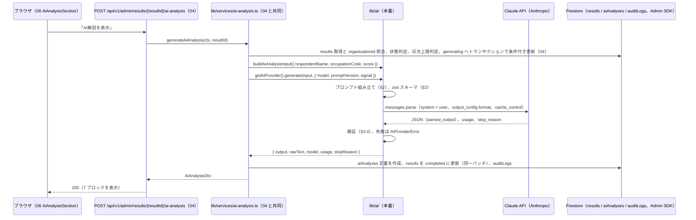
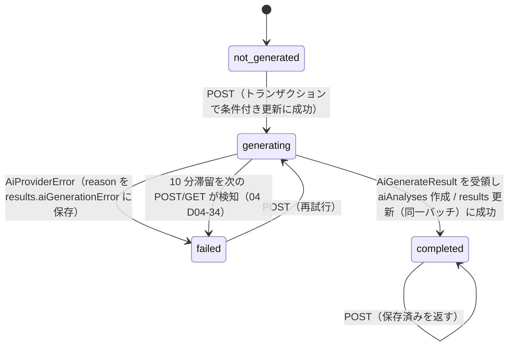
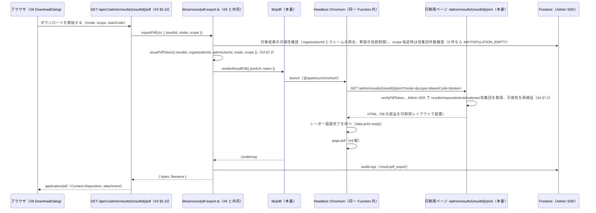

# 基本設計 07 AI 解説・PDF 出力設計

| 項目 | 内容 |
|---|---|
| 文書名 | 適性検査システム 基本設計 07 AI 解説・PDF 出力設計 |
| 版 | 1.3 |
| 作成日 | 2026-09-17（1.1 版: 2026-09-21、1.2 版: 2026-09-21 最終点検、1.3 版: 2026-09-21 K-06（Supabase → Firebase）に伴う部分改版。§13） |
| 対象 | `lib/ai/`、`lib/pdf/`、印刷用ページ、`lib/services/ai-analysis.ts` / `pdf-export.ts` の 07 担当部分を実装する担当者。04（API）、06（管理者画面）、08（テスト）の担当者 |

## 0. 本書の位置づけ

本書は、共通定義（`docs/基本設計/00_共通定義.md`。以下「00」）§6 の分冊担当に従い、次の 2 つを確定するものです。

1. **AI 解説**（要件定義書 §6.6、§6.2 A-09、付録D）: 付録D のプロンプト全文を Claude API（Anthropic）でどう使うか、JSON 出力をどう強制するか、連携先を差し替えるための `lib/ai/` の provider インターフェース、生成のトリガー・状態管理・再試行・タイムアウト・Vercel の実行時間制限への対処、コストの見積もり方、`aiAnalyses` への保存と表示。
2. **PDF 出力**（要件定義書 §6.2 A-10、§9 出力、付録E §7）: A4 縦・結果詳細と同一レイアウト・2 モードの PDF を生成する方式の比較と推奨、グラフの取り込み方、印刷用ページ、認可、保存先（Cloud Storage for Firebase。本フェーズでは使わない）とダウンロード URL の有効期限。

他分冊との境界:

- 00 §3.6 の `AiAnalysisInput` / `AiAnalysisOutput` / `AiProvider` / `AiGenerationStatus` をそのまま使い、本書は**追加のみ**行います（名称変更は行いません）。
- `aiAnalyses` コレクションと `results` の AI 関連フィールド（`aiGenerationStatus`、`latestAiAnalysisId` ほか）のフィールド定義・検証スキーマ・書き込み手順は 02 分冊（00 §2.2）。本書はそこに「何を」書くかを定めます。
- `POST/GET /api/v1/admin/results/{resultId}/ai-analysis` と `GET …/pdf` の API 契約、状態遷移の手順、日次上限、監査ログ、PDF 印刷トークン（`issuePdfToken` / `verifyPdfToken`）は 04 分冊（04 §5.9、§5.10、§7.1、§7.2）が定めています。本書はその契約の「provider 側」「`lib/pdf/` 側」を定め、04 から本書への依頼（`signal` の受け取り、印刷用ページのデータ取得と可視性再検証）に答えます。
- AI 解説の 7 ブロックの画面表示・免責表示・ポーリング、ダウンロード設定ダイアログ、`restricted` で非表示にする項目の一覧は 06 分冊（06 §3.5.9、§3.5.11、§9）。本書は 06 §9 の「07 への依頼」に答えます。
- 実行基盤（Node.js ランタイム、`maxDuration`、`puppeteer-core` + `@sparticuz/chromium` の候補、Cloud Storage for Firebase のバケットとルール、環境変数の管理）は 01 分冊。本書は 01 が「07 が最終判断」とした事項（PDF 方式の採否、Storage 保存の要否、モデル名の初期値）を確定します。
- テストの実装は 08 分冊。本書は §10 に観点だけを列挙します。

### 0.1 参照した要件

| 参照元 | 参照した内容 |
|---|---|
| 要件定義書 §6.2 A-09 | 「AI解説を表示」ボタンで生成・表示。生成済みなら保存済みを表示し、「AI解説を非表示」で閉じる |
| 要件定義書 §6.2 A-10 | 「ダウンロード」→ 設定選択（全画面／評価・合致度・リスクを非表示）→「ダウンロードを開始する」 |
| 要件定義書 §6.6 | ボタン押下で確定スコアをテンプレートに埋め込み LLM に送信し、JSON を受け取って 7 ブロックで表示。生成結果は保存し再表示時は再生成しない（生成前／生成中／生成完了）。使用モデル・API キーは既存から取得していない |
| 要件定義書 §8.4、§8.6 | 結果の AI 列（AI生成ステータス、AI生成文章、最新AI分析ID）、AI 分析（raw_json、model、prompt_version、分析種別、verdict 3 種、信頼係数） |
| 要件定義書 §9 | 個人情報保護（TLS、保存時の暗号化、アクセスログ、組織間分離）、出力（PDF: A4 縦、結果詳細と同一レイアウト、2 モード） |
| 要件定義書 §10 | 生成 AI（既存の応答フォーマットは Gemini 形式。API キー・モデル名は未取得）、PDF（SelectPDF 系プラグイン相当） |
| 要件定義書 §11 の 5 番 | 信頼係数の色は高いほど良い色（PDF でも同じ規則を使う） |
| 要件定義書 §12 | AI 連携のモデル名・生成パラメータ（maxOutputTokens=8192、thinkingConfig の存在のみ確認）、PDF の実際のレイアウト、負値のスライダー表示は未確認 |
| 付録D §1 | 入力（確定済みスコアと氏名・職業）、出力（厳密な JSON）、7 ブロック、生成状態、AI 分析レコードの項目、免責表示 |
| 付録D §2 | 出力 JSON スキーマ |
| 付録D §3 | プロンプト全文（system 指示、ユーザー入力テンプレート、`maxOutputTokens: 8192`、`thinkingLevel: high`） |
| 付録E §1〜§3 | レーダーチャートの軸順・設定値、ゲージ（PDF に同じ図を入れるため） |
| 付録E §7 | PDF ダウンロードの操作、既存実装（URL パラメータで結果ページを PDF 化）、新システムでの推奨方式（HTML→PDF 変換） |
| 付録C §7 | 数値表示の色分けルール（PDF のゲージ色に適用） |
| tests/fixtures/README.md | AI 生成文章と AI 分析へのリンクは除去済み（AI 出力の実例は検証用データに含まれない） |

### 0.2 決定事項との対応

| # | 決定事項 | 本書での対応 |
|---|---|---|
| 1 | Next.js（App Router、TypeScript）+ Firebase（Cloud Firestore、Firebase Authentication、Cloud Storage for Firebase）+ Vercel。グラフは ApexCharts（10 K-06） | AI 解説の保存先は Firestore の `aiAnalyses`（§7.1。Admin SDK 経由。00 §2.5）。PDF は Vercel の Node.js Function 上の Headless Chromium で、画面と同じ `react-apexcharts` の SVG をそのまま印刷する（§9）。本フェーズでは PDF を保存せず、保存する場合の保存先は Cloud Storage for Firebase（§9.11、D07-21） |
| 2 | 既存不具合 10 件を修正 | 信頼係数の色は PDF でも緑系逆順（06 の色関数を印刷用ページで再利用。§9.5）。内部名は「感性開放型」に統一し、付録D プロンプトの転記部分だけ例外（§2.2） |
| 3 | 出題は Q1〜Q144 のみ | AI 入力は `ScoreResult`（採点済みの指標）だけを使い、回答そのものは送らない（§2.3） |
| 4 | 既存データは移行しない | AI 解説・PDF は新システムで生成された結果だけを対象にする。旧版ロジックの扱いは対象外 |
| 5 | AI 解説は Claude API（Anthropic）。差し替え可能な構造 | `AiProvider` インターフェース（00 §3.6）に `anthropic` と `stub` の 2 実装を持ち、`AI_PROVIDER` で切り替える（§5）。モデル ID・パラメータは skill「claude-api」に記載の仕様のみを根拠にする（§4） |
| 6 | 日本語のみ。管理画面は PC 幅 | プロンプト・出力・PDF はすべて日本語。PDF は A4 縦（§9.5）。印刷用ページは管理者画面の部品を再利用する |

### 0.3 本書で使う略記

- 「skill」= 本書執筆時に参照した Claude API リファレンス skill「claude-api」（モデル一覧の取得日 2026-06-24 と明記されたもの）。§4 のモデル ID・パラメータ・料金はすべてこの skill の記載を根拠にし、記憶で補っていません。
- 「D-xx」= 00 §8 の設計判断 ID。「D01-xx」「D02-xx」「D04-xx」「D06-xx」= 各分冊の ID。「D07-xx」= 本書 §12 の ID。

## 1. AI 解説の全体像

### 1.1 処理の流れ



- サービス（`lib/services/ai-analysis.ts`）が状態遷移・上限・保存・監査ログを担い、`lib/ai/` は「入力を受け取って検証済み JSON を返す」ことだけを担います（04 §7.1「provider は生成のみ」）。
- `lib/ai/` は Firebase と Next.js に依存しません（`@anthropic-ai/sdk` と `zod` のみ。01）。`lib/scoring/` と `lib/masters/` から型と定義を import します（逆方向の import は禁止。01 §3.5 の `no-restricted-imports`）。

### 1.2 ファイル構成（`lib/ai/`）

```text
lib/ai/
├── types.ts                 # 00 §3.6 の型 + 本書の追加型（§5.1）
├── errors.ts                # AiProviderError と AiFailureReason（§4.6）
├── schema.ts                # AiAnalysisOutput の zod スキーマと parseAiOutputText()（§3.2。08 の validate.ts はこのファイル）
├── input.ts                 # buildAiAnalysisInput（04 §7.1 の契約）と埋め込み値の整形（§2.3）
├── prompts/
│   ├── index.ts             # PROMPT_REGISTRY: プロンプト版 → PromptDefinition（§2.2）
│   └── recruitment-v1.ts    # 付録D §3 の system 指示とユーザー入力テンプレート（§2.1）
├── prompt-builder.ts        # buildMessages(input, promptVersion): { system, user }（§2.1）
├── provider.ts              # getAiProvider(): AI_PROVIDER に応じた実装を返す（§5.2）
└── providers/
    ├── anthropic.ts         # AnthropicProvider（§5.3）
    └── stub.ts              # StubProvider（§5.4。ローカル・CI 用。01 D01-07）
```

## 2. プロンプト設計（付録D §3 の適用）

### 2.1 system と user の分割

付録D §3 の既存リクエストは Gemini 形式（`system_instruction` と `contents`）でした（要件定義書 §10）。Claude API の Messages API では `system`（システムプロンプト）と `messages[0]`（`role: "user"`）に 1 対 1 で対応させます。

| 付録D §3 の要素 | Claude API での位置 | 内容 |
|---|---|---|
| `system_instruction.parts[0].text`（「# あなたの役割」〜「# levers の出力形式（厳守）」） | `system`（`type: "text"` ブロック 1 個。`cache_control` 付き。§4.4） | 付録D §3 の全文をそのまま（§2.2 の 1 箇所の修正を除く） |
| `contents[0].parts[0].text`（「【氏名】〜【リスク】」のテンプレート） | `messages[0]`（`role: "user"`、`type: "text"`） | 山括弧の差し込み位置を `AiAnalysisInput` の値で置換したもの（§2.3） |
| `generationConfig.maxOutputTokens: 8192` | `max_tokens`（§4.2） | 値は skill の指針に従い見直す |
| `generationConfig.thinkingConfig.thinkingLevel: "high"` | `output_config.effort` と適応思考（§4.2） | 既存の「high」相当を `effort: "high"` に対応させる |

設計判断 D07-01: 付録D の system 指示に含まれる「出力は指定の JSON のみ」「コードフェンスを付けない」という指示は、§3 の構造化出力を使えば冗長になりますが、**削除しません**。理由: (1) 付録D 全文を初期値としてそのまま採用する方針（要件定義書 §6.6、00 §1.4）、(2) 将来 provider を差し替えて構造化出力が使えない場合にこの指示が JSON 化の最後の砦になる、(3) 指示があっても構造化出力の動作に害はない。

### 2.2 プロンプトの管理（版・レジストリ・転記ルール）

| 項目 | 内容 |
|---|---|
| 置き場所 | `lib/ai/prompts/recruitment-v1.ts` に、system 指示全文とユーザー入力テンプレートを **文字列定数** として置く。Firestore には持たない（00 D-01 と同じ考え方。文言の変更はコード改版で行う） |
| 版の識別子 | 環境変数 `AI_PROMPT_VERSION`（00 §3.2）の値。初期値 `recruitment-v1`（設計判断 D07-02。`aiAnalyses.analysisKind` の値 `recruitment`（00 §2.2）に版番号を付けた形） |
| レジストリ | `lib/ai/prompts/index.ts` の `PROMPT_REGISTRY: Readonly<Record<string, PromptDefinition>>`。起動時検証（01 §4.3 の env スキーマ）で `AI_PROMPT_VERSION` がレジストリに存在しなければ失敗させる（本書から 01 への依頼。§11） |
| 保存 | 生成に使った版を `aiAnalyses.promptVersion` に保存する（00 §2.2）。同じ結果に対して版が変わっても再生成はしない（要件定義書 §6.6「再表示時は再生成しない」） |
| 転記ルール | 付録D §3 の system 指示は **一字一句そのまま** 転記する。ただし次の 1 箇所だけ修正する（下記） |

付録D からの修正箇所（設計判断 D07-03。00 D-20 の判断を本書で確定）:

| 箇所 | 付録D の記載 | 本書での扱い | 理由 |
|---|---|---|---|
| 「# 適性タイプ」の辞書 | `コンタクター=人を活かす大組織のリーダー` | `コンダクター=人を活かす大組織のリーダー` に修正する | 推定: 既存プロンプトの誤記（00 §1.6）。ユーザー入力の【適性タイプ】には 00 §1.6 の短縮名「コンダクター」が入るため、辞書側が「コンタクター」のままだと該当タイプの受検者で辞書引きが失敗し得る。修正は 1 語のみで、他の文言には触れない |
| 「# 資質タイプ」の辞書 | `直感型／感性解放型（言語感覚）` | **そのまま残す** | 00 §1.4「付録D のプロンプト全文は初期値としてそのまま採用するため、プロンプト内の『感性解放型』表記はそのまま残す」。ユーザー入力には表示名（直感型など）のみを入れるため内部名の表記ゆれは AI 入力に現れない |
| 「# 資質タイプ（各0〜100 …）」 | 資質の範囲を 0〜100 と記載 | そのまま残す。値は 100 を超えても **そのまま渡す**（§2.3） | 実際の値域は 0〜約 150（付録B §4、00 §1.4。03 §5 の計算上の最大は 145）だが、既存プロンプトの記載を初期値として踏襲する。付録D は資質を「最高点=第一候補／2位=第二候補」の相対比較にしか使わず、絶対値の閾値判定が無いため、宣言範囲を超えた値が判定を狂わせる経路は無い（§2.3 補足）。依頼主確認事項（D07-04）。修正する場合は `recruitment-v2` として追加する |

`PromptDefinition` の型:

```ts
// lib/ai/prompts/index.ts
export interface PromptDefinition {
  readonly version: string;          // "recruitment-v1"
  readonly analysisKind: string;     // "recruitment"（aiAnalyses.analysisKind）
  readonly system: string;           // 付録D §3 の system 指示全文（D07-03 の修正込み）
  readonly userTemplate: string;     // 付録D §3 のユーザー入力テンプレート（{{...}} 形式に置換済み。§2.3）
}

export const PROMPT_REGISTRY: Readonly<Record<string, PromptDefinition>> = {
  "recruitment-v1": RECRUITMENT_V1,
};

export function getPromptDefinition(version: string): PromptDefinition {
  const def = PROMPT_REGISTRY[version];
  if (!def) throw new AiProviderError("config_error", `unknown prompt version: ${version}`);
  return def;
}
```

### 2.3 ユーザー入力テンプレートへの埋め込み規則

付録D §3 のテンプレートの山括弧部分を、`AiAnalysisInput`（00 §3.6: `respondentName`、`occupationLabel`、`result: ScoreResult`）から埋めます。テンプレートは実装上 `{{name}}` のような二重波括弧のプレースホルダに置き換えて保持し、`prompt-builder.ts` が置換します（山括弧のままだと値中の記号と衝突し得るため）。

03 §11 の引き渡し「AI 入力は `ScoreResult` の真値を渡し、パーセント表示の丸めは付録D の埋め込み位置で 07 が決める」に従い、整形規則を確定します（設計判断 D07-05）。

| プレースホルダ（付録D） | 取得元 | 整形規則 | 例 |
|---|---|---|---|
| `<氏名>` | `input.respondentName` | そのまま（前後の空白を除去） | 山田 太郎 |
| `<職種>` | `input.occupationLabel`（`lib/masters/occupations.ts` の表示名。00 §1.10） | そのまま | 歯科衛生士、TC |
| `<信頼係数>` | `result.reliability` | 四捨五入して整数（画面のゲージ表示と同じ。03 §9.2） | 89.71 → `90` |
| 16 尺度（`<協力性>` など 16 個） | `result.traits[TraitKey]` | 0.5 刻みの真値。整数なら小数を付けない（03 §9.2 `formatStep`） | 22.5 → `22.5`、27 → `27` |
| ソーシャルスタイル 4 値（`<SS_ドライビング>` など） | `result.socialStyles[SocialStyleKey]` | 0.25 刻みの真値。末尾の 0 を除く（最大 2 桁）。負値は 0（画面のレーダーと同じ。03 §8.4） | 28.75 → `28.75`、−1.5 → `0` |
| 資質 4 値（`<資質_直感型>` など） | `result.aptitudes[AptitudeKey]` | 1.25 刻みの真値。末尾の 0 を除く（最大 2 桁）。採点時に 0 以上にクランプ済み。**100 を超えてもそのまま渡す**（プロンプトの宣言「0〜100」の範囲外になるが、下記補足の理由で置換・圧縮しない。D07-04） | 122.5 → `122.5`、68.75 → `68.75` |
| `<適性タイプ>` | `result.aptitudeType` → `APTITUDE_TYPE_DEFINITIONS[].shortLabel`（00 §1.6 の短縮名） | 「タイプ」を除いた短縮名（プロンプトの辞書がその形のため） | `conductor` → `コンダクター` |
| 相性 5 軸（`<相性_適応する環境>` など） | `result.compatibility[CompatibilityKey]` | 整数の真値。**負値は 0** に置き換える（画面のスライダー表示（D-07、03 §8.4）と一致させ、プロンプトが宣言する 0〜100 の範囲を守る） | 83 → `83`、−7 → `0` |
| リスク 7 項目（`<リスク_不祥事>` など） | `result.risks[RiskKey]` | 2.5 刻みの真値。整数なら小数を付けない。**負値は 0**（付録B §5 の画面表示と一致） | 37.5 → `37.5`、−5 → `0` |

補足:

- プレースホルダの順序・ラベル（「コミュ起因の支障」「就業辞退」などの AI 入力ラベル）は付録D §3 のテンプレートどおりで、`RISK_DEFINITIONS[].aiLabel`（00 §3.5）と一致させます。テンプレート側はラベルを固定文字列として持ち、値だけを差し込みます。
- 負値を 0 に置き換える判断（D07-05）の理由: (1) 画面（相性スライダー・リスクゲージ）が負値を 0 として表示する（D-07、03 §8.4、付録B §5）ため、AI 解説が引用する数値と画面の数値を一致させる（AI 解説は「（意思決定15）」のように数値を引用する。付録D §3「cautions の書き方」）。(2) 付録D の system 指示 4 番に「0 と書かれていても『リスクなし』『能力ゼロ』とは解釈しない」とあり、0 は安全に扱われる。(3) 相性とリスクには付録D §3「判定基準」の **絶対閾値**（「意思決定が 20 未満」「ストレス耐性が 42 未満」「適応する業務が 25 未満」、リスク 4 項目の平均の区分）があり、負値をそのまま渡しても閾値判定の結果は 0 と同じで、置換による判定の変化は無い。依頼主が「負値をそのまま渡す」ことを望む場合は `formatCompatibilityForAi` の 1 関数を変えるだけで切り替えられるようにします。
- 資質の 100 超をそのまま渡す判断（D07-04 と対）の理由: (1) 画面も 122.5 のような真値を表示する（付録E §2 の実例 `[122.5, 132.5, 85, 37.5]`）ため、画面と AI 入力を一致させる。(2) 付録D は資質を「最高点=第一候補／2位=第二候補」の **相対比較** にしか使わず、絶対閾値が無いので、宣言範囲（0〜100）を超えた値が判定を変える経路が無い。(3) 100 に切り詰めると複数の型が 100 で同点になり、第一候補・第二候補の判別（相対比較そのもの）を壊す。負値の置換（相性・リスク）と 100 超の非置換（資質）は「画面の表示値と一致させ、付録D の判定基準を変えない」という同じ基準から出た判断です。プロンプトの宣言範囲の記載（0〜100）を実態（0〜約 150）に直すかどうかは D07-04 として依頼主に確認します。
- 16 タイプ得点・第一／第二候補・ソーシャルスタイル名は、付録D §3 のテンプレートに無いため渡しません（03 §8.4）。資質の候補は AI が 4 値から判断します（付録D「最高点=第一候補」）。
- 個人情報の扱い: AI に送る個人情報は氏名のみです（付録D §1 の仕様どおり）。電話番号・メールアドレスは送りません。氏名は `summary` に含まれて返るため、`aiAnalyses.output` と `aiAnalyses.rawText` は個人情報を含むデータとして扱います（02 の「個人情報の所在」に記載する）。

`buildAiAnalysisInput`（04 §7.1 の契約）と `buildMessages` の形:

```ts
// lib/ai/input.ts
import type { ScoreResult } from "@/lib/scoring/types";
import { getOccupationLabel } from "@/lib/masters/occupations";
import type { AiAnalysisInput } from "@/lib/ai/types";

export function buildAiAnalysisInput(args: {
  readonly respondentName: string;
  readonly occupationCode: number;
  readonly score: ScoreResult;
}): AiAnalysisInput {
  return {
    respondentName: args.respondentName.trim(),
    occupationLabel: getOccupationLabel(args.occupationCode),
    result: args.score,
  };
}

// lib/ai/prompt-builder.ts
export interface BuiltMessages {
  readonly system: string;   // PromptDefinition.system
  readonly user: string;     // テンプレートに値を埋めたもの
}
export function buildMessages(input: AiAnalysisInput, promptVersion: string): BuiltMessages;
```

`buildMessages` は純関数です（同じ入力で同じ文字列を返す。日時や乱数を含めない。§4.4 のキャッシュのため）。

### 2.4 ユーザー入力の例（03 §10.5 の T-06 回帰ベクトルを埋めたもの）

03 §10.5 の周期回答（T-06）の期待値を §2.3 の規則で埋めると、次のユーザー入力になります。08 のスナップショットテストの期待値として使えます（氏名・職種は仮の値）。

```text
【氏名】山田 太郎
【評価する職種】歯科衛生士
【信頼係数】79%

【性格特性｜0〜30, 15=平均】
コミュニケーション力:17 協力性:15 適応力:13.5 優劣性:14 謙虚さ:13 反省力:14.5 規則遵守力:18.5 こだわり:13 感情の豊かさ:13.5 敏感さ:16 自己肯定感:15.5 革新的思考:13.5 行動力:15.5 前向きさ:16 リーダーシップ:16 発想力:13

【ソーシャルスタイル｜0〜30, 最高点が主軸】
ドライビング:4.75 エクスプレッシブ:3.75 エミアブル:4 アナリティカル:3.25

【資質｜0〜100, 最高=第一候補/2位=第二候補】
直感型:13.75 柔軟型:7.5 目標達成型:22.5 専門追求型:12.5

【適性タイプ】パイオニア

【組織との相性｜0〜100】
適応する環境:0 適応する業務:0 思考の傾向:11 意思決定:0 ストレス耐性:0

【リスク｜0〜100, 高いほど危険】
不祥事:27.5 苦情:47.5 メンタル不服:30 不注意ミス:57.5 退職トラブル:42.5 コミュ起因の支障:52.5 就業辞退:42.5
```

- 信頼係数 78.685 → `79`、相性の −3・−13・−7 → `0`、優劣性は計算値 14 のまま（要件定義書 §11 の 1 番）。

## 3. 構造化出力（JSON 出力の強制）

### 3.1 方式の比較と採用

| 方式 | 仕組み | 長所 | 短所 | 採否 |
|---|---|---|---|---|
| A. 構造化出力（`output_config.format`） | リクエストに JSON スキーマを渡し、応答テキストがスキーマに従うことを API が保証する。SDK の `client.messages.parse()` + `zodOutputFormat` で zod スキーマから生成し、応答を `parsed_output` として受け取る | skill が「推奨」と明記する方式。スキーマ準拠が API 側で保証され、コードフェンスや前置きが混入しない。適応思考・ストリーミング・Batches と併用可。`tool_choice` を使わないため、強制ツール呼び出しを受け付けないモデル（skill: Claude Fable 5.1）でも同じコードが動く | 対応モデルが限定される（skill: Claude Opus 5、Sonnet 5、Opus 4.8、Haiku 4.5、Fable 5/5.1 など）。スキーマ制約の一部（配列長、文字列長、数値範囲）は API 側で強制されず SDK がクライアント側で検証する。引用（citations）・prefill と併用不可（本設計では不要） | **採用**（設計判断 D07-06） |
| B. strict tool use（`strict: true` の tool 定義 + `tool_choice: {type: "tool"}`） | 「JSON を返すツール」を 1 つ定義し、`tool_use.input` としてスキーマ準拠の JSON を受け取る | スキーマ準拠が保証される。tool use を持つ provider なら広く使える | skill によると `tool_choice` の `any` / `tool` は Claude Fable 5.1 で 400 になるため、モデル変更時に書き換えが必要。応答が `tool_use` ブロックになり、`rawText` に保存する「生テキスト」が JSON 文字列化した `input` になる | 代替経路として provider 実装内に残す（`ANTHROPIC_OUTPUT_MODE` のような環境変数は増やさず、コード定数で切り替える） |
| C. プロンプト指示のみ（付録D の「出力形式（厳守）」） | system 指示で JSON のみを返すよう求め、応答テキストを `JSON.parse` する | どの provider でも動く | 保証がない。コードフェンス混入・欠落キーが起こり得る（既存の方式） | 差し替え先の provider が A・B を持たない場合の最終手段。`schema.ts` の `parseAiOutputText()`（§3.2。コードフェンス・前置きの拒否 + zod 検証）を必ず通す |

- 依頼文では「tool use による構造化出力を推奨」とありますが、skill は `output_config.format`（構造化出力）を推奨・正典（canonical）としており、A は B と同じ保証をより単純なコードで得られ、かつモデル差し替えに強いため A を採用します（D07-06）。B は A が使えない環境向けの代替として provider 内に実装可能な形で残します。

### 3.2 zod スキーマ（`lib/ai/schema.ts`）

付録D §2 のスキーマと 00 §3.6 の `AiAnalysisOutput` に 1 対 1 で対応させます。キー名は付録D のまま（`sokusenryoku`、`teichaku_risk`、`sougou`、`levers`。00 §3.6「camelCase に変換しない」）。

```ts
// lib/ai/schema.ts
import { z } from "zod";
import type { AiAnalysisOutput } from "@/lib/ai/types";
import { AiProviderError } from "@/lib/ai/errors";

export const LEVER_LABELS = ["関わり方", "任せ方", "認め方", "伸ばし方"] as const;

// 余分なキーは拒否する（.strict()）。構造化出力（§3.1 A）が要求する additionalProperties: false と同じ制約を、
// 方式 C（テキスト解析）でも同じスキーマで課すため（08 U-10「余分なキー」の期待値）
export const AiAnalysisOutputSchema = z
  .object({
    summary: z.string().describe("3〜4文。冒頭で氏名を使う"),
    verdict: z.object({
      sokusenryoku: z.enum(["非常に高い", "高い", "中", "低い", "非常に低い"]),
      teichaku_risk: z.enum(["非常に低い", "低い", "中", "高い", "非常に高い"]),
      sougou: z.enum(["推奨", "条件付きで推奨", "要検討", "非推奨"]),
    }).strict(),
    strengths: z.array(z.string()).describe("このクリニックで活きる強み。2〜4個"),
    cautions: z.array(z.string()).describe("採用前に見極めたい注意点。2〜4個（根拠スコア付き）"),
    questions: z.array(
      z.object({
        q: z.string().describe("面接質問文"),
        intent: z.string().describe("見極めたいこと"),
      }).strict(),
    ).describe("3〜5個"),
    retention: z.object({
      levers: z.array(
        z.object({
          label: z.enum(LEVER_LABELS),
          text: z.string(),
        }).strict(),
      ).describe("必ず「関わり方」「任せ方」「認め方」「伸ばし方」の4つ・この順"),
      sign: z.string().describe("離職に向かう最初のサイン"),
      action: z.string().describe("引き止めの一手"),
    }).strict(),
  })
  .strict()
  // 以下は API 側では強制されない制約（skill: 配列長・文字列長は非対応）。SDK がクライアント側で検証する
  .refine((v) => v.summary.trim().length > 0, { message: "summary is empty" })
  .refine((v) => v.strengths.length >= 1 && v.strengths.length <= 6, { message: "strengths length" })
  .refine((v) => v.cautions.length >= 1 && v.cautions.length <= 6, { message: "cautions length" })
  .refine((v) => v.questions.length >= 1 && v.questions.length <= 8, { message: "questions length" })
  .refine(
    (v) => v.retention.levers.length === 4 && v.retention.levers.every((l, i) => l.label === LEVER_LABELS[i]),
    { message: "levers must be the 4 labels in order" },
  );

export type AiAnalysisOutputParsed = z.infer<typeof AiAnalysisOutputSchema>;

/**
 * 方式 C（構造化出力を持たない provider。§3.1）と stub の不正 JSON モード（§5.4）が使う、応答テキストの検証関数。
 * 付録D §3「出力形式（厳守）」のとおり「先頭が { で始まり末尾が } で終わる純粋な JSON」だけを受理する。
 * 失敗はすべて AiProviderError("invalid_json")（§3.4 と同じ扱い）。
 * 08 U-10 の期待値（コードフェンス付きテキスト・先頭が { でないテキストを拒否）に対応する。
 */
export function parseAiOutputText(text: string): AiAnalysisOutput {
  const trimmed = text.trim();
  if (!trimmed.startsWith("{") || !trimmed.endsWith("}")) {
    // ```json … ``` のコードフェンス、前置き・後置きの文章はここで落ちる。テキストは例外メッセージに含めない（氏名が含まれ得る。§4.8）
    throw new AiProviderError("invalid_json", "response text is not a bare JSON object", null, false);
  }
  let json: unknown;
  try {
    json = JSON.parse(trimmed);
  } catch {
    throw new AiProviderError("invalid_json", "response text is not valid JSON", null, false);
  }
  const result = AiAnalysisOutputSchema.safeParse(json);
  if (!result.success) {
    throw new AiProviderError("invalid_json", `schema validation failed: ${result.error.issues.map((i) => i.path.join(".")).join(", ")}`, null, false);
  }
  return result.data;
}
```

- `AiAnalysisOutputParsed` は 00 §3.6 の `AiAnalysisOutput` と構造が一致します（`readonly` の有無だけが異なる）。provider は `AiAnalysisOutput` 型で返します。
- 設計判断 D07-07: 配列長の検証は付録D の「2〜4個」「3〜5個」より緩い上限（6・8）で **失敗扱いにせず受け入れ** ます。理由: 付録D の個数は文体の指示であり、1 個多い・少ないだけで生成失敗にして再生成コストを払うより、そのまま表示する方が利用者の利益になる。0 個と `levers` の順序違反だけは失敗にします（画面の 7 ブロックが成立しないため）。
- `describe()` の文言は付録D §2 の説明を転記したものです（スキーマの `description` としてモデルに渡ります）。
- ファイル名は `lib/ai/schema.ts` を正とします（08 §2.6 PR-5.1 と U-10 の `lib/ai/validate.ts` は本書に合わせた改版を依頼。§11）。方式 A では `zodOutputFormat(AiAnalysisOutputSchema)` が、方式 C と stub では `parseAiOutputText()` が同じスキーマを使うため、スキーマの定義は 1 箇所です（08 D08-10「スキーマの二重管理を避ける」に対応）。

### 3.3 付録D §2 スキーマとの対応表

| 付録D §2 のキー | 型 | `AiAnalysisOutput`（00 §3.6） | 画面の 7 ブロック（06 §3.5.9） | `aiAnalyses` のフィールド（00 §2.2、02） |
|---|---|---|---|---|
| `summary` | string | `summary` | 1. この人物の要約 | `output.summary` |
| `verdict.sokusenryoku` | enum 5 値 | `verdict.sokusenryoku` | 2. 即戦力性 | `output.verdict.sokusenryoku`（map のまま。別フィールドへの抜粋はしない） |
| `verdict.teichaku_risk` | enum 5 値 | `verdict.teichaku_risk` | 2. 離職リスク | `output.verdict.teichaku_risk` |
| `verdict.sougou` | enum 4 値 | `verdict.sougou` | 2. 総合判定 | `output.verdict.sougou` |
| `strengths[]` | string[] | `strengths` | 3. このクリニックで活きる強み | `output.strengths` |
| `cautions[]` | string[] | `cautions` | 4. 採用前に見極めたい注意点 | `output.cautions` |
| `questions[].q` / `.intent` | object[] | `questions` | 5. 面接で深掘りすべき質問 | `output.questions` |
| `retention.levers[].label` / `.text` | object[]（4 固定） | `retention.levers` | 6. 接し方・育て方（関わり方／任せ方／認め方／伸ばし方） | `output.retention.levers` |
| `retention.sign` / `.action` | string | `retention.sign` / `retention.action` | 7. 辞めそうなサイン＆引き止めの一手 | `output.retention.sign` / `output.retention.action` |

- `aiAnalyses.output` は検証済み JSON を map としてそのまま保存します（付録D §2 のキーのまま。00 §2.2）。1.x 版の `raw_json` と `verdict_*` 列は、Firestore では map の入れ子をそのままクエリ・表示できるため 1.3 版で `output` に統合しました（判定 3 種を一覧で集計する要件は本フェーズに無い）。生テキストは `rawText` に別途保存します（§7.1）。

### 3.4 検証失敗の扱い

| 事象 | 判定方法 | `AiFailureReason`（§4.6） | サービスの扱い（04 §5.9 手順 7） |
|---|---|---|---|
| `parsed_output` が `null`（SDK の検証失敗） | `response.parsed_output === null` | `invalid_json` | `failed` + `results.aiGenerationError = "invalid_json"`、502 |
| `refine` の失敗（配列 0 個、`levers` の順序違反） | `AiAnalysisOutputSchema.safeParse` が失敗 | `invalid_json` | 同上 |
| `stop_reason === "max_tokens"` | 応答が途中で切れた | `truncated` | `failed`、502。`max_tokens` は §4.2 の値で十分大きいため、発生したら設定不備として監視対象 |
| `stop_reason === "refusal"` | 安全上の理由で拒否 | `refusal` | `failed`、502。`results.aiGenerationError = "refusal"`。再試行は利用者操作に委ねる（§6.4） |

- 検証に失敗した生テキストは `aiAnalyses` に保存しません（成功時のみ文書を作成する。02）。障害調査のため、サーバログに **生テキストは出さず**、失敗理由・`stop_reason`・`usage`・リクエスト ID だけを出します（氏名が含まれ得るため。§4.8）。

## 4. Claude API の呼び出し仕様

本節のモデル ID・パラメータ・料金は skill「claude-api」（モデル一覧の取得日 2026-06-24）の記載を根拠にしています。skill に無い事項は書いていません。実装時に SDK の版を固定したうえで、§4.2 の各パラメータが受理されることを最初の 1 回の呼び出しで確認してください（§10 の AI-01）。

### 4.1 モデル ID

| 項目 | 値 | 根拠 |
|---|---|---|
| 初期値（`AI_MODEL`） | `claude-opus-5` | skill の既定（「ALWAYS use `claude-opus-5` unless the user explicitly names a different model」）。日付サフィックスは付けない（skill: モデル ID は表の文字列で完結） |
| 選定理由 | 付録D のプロンプトは「判定基準」「数値引用の論理チェック」など多段の条件判断を要求し、既存は `thinkingLevel: high` を使っていた（付録D §3）。skill の「Which Surface」の分類では単一呼び出しの抽出・生成タスクで、Opus 系の判断力をそのまま使うのが既存相当の品質を得る最短経路 | 要件定義書 §6.6、付録D §3、skill |
| コスト重視の代替（依頼主判断。D07-08） | `claude-sonnet-5`（skill 表: 入力 $2.00 / 出力 $10.00 per 1M トークン。1M コンテキスト。構造化出力対応） | skill の表。既定を変えるのは依頼主の判断であり本書は変更しない（skill: 「Never downgrade for cost - that's the user's decision」） |
| 使わないモデル | `claude-fable-5-1`（skill: 明示的に求められた場合のみ。30 日データ保持の要件、価格が Opus より高い、`tool_choice` の `any`/`tool` が 400）。`claude-haiku-4-5`（200K コンテキスト、`budget_tokens` 方式の思考。skill の表） | skill |

- skill の料金表（Anthropic 第一者 API）: `claude-opus-5` 入力 $5.00 / 出力 $25.00 per 1M トークン、1M コンテキスト。§8 のコスト見積もりはこの値を使います。
- 実際に組織で利用できるモデルは `client.models.list()`（skill: Models API、beta 不要）で確認できます。実装時の疎通確認手順に含めます（§10 AI-01）。

### 4.2 リクエストパラメータ（`claude-opus-5`）

| パラメータ | 値 | 根拠（skill） |
|---|---|---|
| `model` | `AI_MODEL`（初期値 `claude-opus-5`） | §4.1 |
| `max_tokens` | `16000` | skill「`max_tokens` defaults」: 非ストリーミングは約 16000 を既定にし、低くしすぎない。既存の 8192（付録D §3）より大きいが、出力 JSON は概算 1,500〜2,500 トークン（§8）で、上限は打ち切り防止のための余裕。ストリーミングは不要（応答は 1 個の JSON で、UI は完了を待つ方式。04 §7.1） |
| `system` | `[{ type: "text", text: PromptDefinition.system, cache_control: { type: "ephemeral" } }]` | §2.1、§4.4 |
| `messages` | `[{ role: "user", content: BuiltMessages.user }]` | §2.1 |
| `thinking` | `{ type: "adaptive" }`（省略時も同じ。明示する） | skill: Claude Opus 5 は思考が既定で有効（省略時は adaptive）。`budget_tokens` は 400 になるため使わない。`display` は指定しない（既定 `omitted`。思考内容を表示・保存しないため） |
| `output_config.effort` | `"high"` | skill: 既定 `high`（省略と同義）。既存の `thinkingLevel: high` に対応させて明示する。skill は「effort は最初の品質・コストのレバー」としているため、実測後に `medium` へ下げる余地を D07-09 として残す |
| `output_config.format` | `zodOutputFormat(AiAnalysisOutputSchema)` | §3.1 A |
| `temperature` / `top_p` / `top_k` | **送らない** | skill: Claude Opus 5 / Fable 5 / Opus 4.8 / 4.7 では削除済みで、送ると 400 |
| `tool_choice` / `tools` | 送らない（方式 A） | §3.1 |
| assistant prefill | 使わない | skill: 4.6 以降のモデルで 400 |
| `stream` | 使わない（`messages.parse` の非ストリーミング） | 上記 `max_tokens` の行 |
| リクエストオプション `timeout` | `240_000`（ミリ秒。TypeScript SDK はミリ秒） | skill「Client config」: `timeout` の単位は SDK により異なり TypeScript はミリ秒。04 D04-38 の 240 秒に合わせる |
| リクエストオプション `maxRetries` | `1` | skill: 既定 2（408/409/429/5xx と接続エラーを再試行）。タイムアウトも再試行対象で壁時計は `timeout × (maxRetries + 1)` に達し得るため、`maxDuration` 300 秒（01 §5.4）の内側に収めるよう 1 に下げる（§4.5） |
| リクエストオプション `signal` | サービスから渡される `AbortSignal`（04 §7.1 `GenerateOptions.signal`） | 04 D04-38 |

`client.messages.parse()` の呼び出し形（skill「Structured Outputs」の TypeScript 例に、上記のパラメータを当てはめたもの）:

```ts
// lib/ai/providers/anthropic.ts（抜粋）
import Anthropic from "@anthropic-ai/sdk";
import { zodOutputFormat } from "@anthropic-ai/sdk/helpers/zod";
import { AiAnalysisOutputSchema } from "@/lib/ai/schema";

const response = await client.messages.parse(
  {
    model: options.model,
    max_tokens: 16000,
    thinking: { type: "adaptive" },
    output_config: {
      effort: "high",
      format: zodOutputFormat(AiAnalysisOutputSchema),
    },
    system: [
      { type: "text", text: messages.system, cache_control: { type: "ephemeral" } },
    ],
    messages: [{ role: "user", content: messages.user }],
  },
  { timeout: 240_000, maxRetries: 1, signal: options.signal },
);
```

- `client` は `new Anthropic({ apiKey })` で、`apiKey` は `serverEnv().ANTHROPIC_API_KEY`（01 §4.3 の `lib/utils/env.ts`。`AI_PROVIDER=anthropic` のとき存在することを起動時検証が保証する）をファクトリ（§5.2）が渡します（skill の「Client Initialization」）。サーバ専用の値で、`lib/ai/providers/anthropic.ts` と `lib/ai/provider.ts` 以外では参照しません（01 §3.2、01 §8.7）。
- `output_config` は `effort` と `format` を同じオブジェクトに入れます（skill: いずれも `output_config` の下）。
- リクエストオプションのうち `timeout` と `maxRetries` は skill の「Client config」に記載があります。`signal` は同じリクエストオプションに渡す想定ですが skill には記載がないため、実装時に SDK の型定義で確認し、無ければ `AbortSignal` の `abort` イベントで `timeout` を短縮する（`AbortSignal.timeout` と `Promise.race` を使わず、SDK の `timeout` を 240 秒に固定する）方式に倒します（§12 D07-10）。

### 4.3 skill が警告する「古い書き方」を使わない

skill の「API Drift」と「Common Pitfalls」から、本設計に関係するものを列挙します。実装レビューのチェックリストとして使ってください。

| 使わない書き方 | 理由（skill） | 本設計での代わり |
|---|---|---|
| `thinking: { type: "enabled", budget_tokens: N }` | Claude Opus 5 では 400 | `thinking: { type: "adaptive" }` |
| `temperature`、`top_p`、`top_k` | Claude Opus 5 では 400 | 送らない |
| `output_format` パラメータ | 非推奨 | `output_config: { format }` |
| assistant メッセージの prefill（`{` で始めさせる） | 4.6 以降で 400 | 構造化出力 |
| `messages.create` の応答テキストを正規表現で JSON 抽出 | 保証がない | `messages.parse` の `parsed_output` |
| 応答の文字列一致でエラー判定 | 型付き例外がある | `Anthropic.RateLimitError` などの `instanceof`（§4.6） |
| ツール入力の文字列比較 | エスケープが変わり得る | 方式 B を使う場合も `tool_use.input` はオブジェクトとして扱う |
| `tiktoken` 等でのトークン数見積もり | Claude のトークナイザではない | `client.messages.countTokens`（§8.1） |

### 4.4 プロンプトキャッシュ

| 項目 | 内容 |
|---|---|
| 対象 | `system` ブロック（付録D の system 指示。約 6,700 文字）。ユーザー入力は受検者ごとに異なるためキャッシュしない |
| 指定 | `system[0].cache_control = { type: "ephemeral" }`（5 分 TTL）。skill「Prompt Caching」の明示ブレークポイント方式（「共有プレフィックス、可変サフィックス」の配置。トップレベルの自動キャッシュは可変のユーザー入力までキャッシュに書いてしまうため使わない） |
| 最小サイズ | skill: Claude Opus 5 の最小キャッシュ長は 512 トークン。system 指示はこれを大きく超える（§8.2 の概算 5,000〜7,000 トークン。実測は §8.1 の手順で置き換える）ためキャッシュ対象になる |
| 効果 | skill: キャッシュ読み取りは基本入力単価の約 0.1 倍、書き込みは 1.25 倍（5 分 TTL）。TTL は **キャッシュを書いた／読んだリクエストの開始時刻から** 数え、生成時間も TTL を消費する（skill「Choosing the TTL」: 4 分かかる生成の後は次の開始まで約 1 分しか残らない）。本設計は同期方式（§6.1、04 §5.9）で 1 件の完了を待ってから次を開始するため、命中する条件は「**前回の生成開始から 5 分以内に次の生成を開始した**」こと。生成が数十秒（§4.5）なら、同じ管理者が受検者の解説を続けて生成する場面で命中する。生成が散発的（開始間隔が 5 分超）なら毎回書き込みになり、system 入力分が約 25% 割増になる |
| 判断（D07-11） | 割増は system 入力分だけ（概算 $0.005〜0.01/回。§8）で小さく、まとめて生成する運用では system 入力分が 90% 減になるため、**5 分 TTL で有効にする**。1 時間 TTL（書き込み 2 倍）は初期値では採用しない（生成間隔が読めないため）。判断条件: §10 AI-02 で生成時間の実測（`elapsedMs`。§4.8）を取り、生成時間が長く（目安: 中央値が 2〜3 分以上）連続生成でも `cache_read_input_tokens` が 0 になる場合、または開始間隔が 5〜60 分に集中する運用が分かった場合は、1 時間 TTL（`cache_control: { type: "ephemeral", ttl: "1h" }`。skill）への切替を再検討する |
| キャッシュを壊さないための規則 | `PromptDefinition.system` は定数（日時・受検者 ID・乱数を含めない）。`buildMessages` は純関数（§2.3）。`tools` を使わない。モデルを変えるとキャッシュは別になる（skill: キャッシュはモデル単位） |
| 確認 | `response.usage.cache_read_input_tokens` / `cache_creation_input_tokens` をログに出し（§4.8）、連続生成時に read が 0 のままなら不変条件の破れを疑う（skill「Verifying Cache Hits」） |

### 4.5 タイムアウトと実行時間の内訳

Vercel の Node.js Function は `maxDuration` を超えると打ち切られます（01 §5.4: AI 生成の Route Handler は 300 秒）。打ち切られると `results` が `generating` のまま残るため、04 §5.9 の滞留検知（10 分）で復旧しますが、可能な限り provider 側で先に失敗させて `failed` へ遷移させます（04 D04-38）。

| 段階 | 上限 | 備考 |
|---|---|---|
| サービスの前処理（`results` 文書の取得と `organizationId` 照合、状態判定、トランザクションによる条件付き更新） | 数秒 | 04 §5.9 手順 1〜4 |
| provider の 1 回の API 呼び出し | 240 秒（`timeout`） | skill: SDK のタイムアウトは再試行対象 |
| SDK の自動再試行 | 1 回（`maxRetries: 1`）。ただし `signal`（240 秒）が先に発火すれば再試行しない | `timeout × 2 = 480 秒` を `signal` の 240 秒で抑える。`signal` が使えない場合は `maxRetries: 0` にし、再試行は利用者の「再試行」ボタンに委ねる（D07-10） |
| 後処理（`aiAnalyses` の作成、`results` の更新、監査ログ） | 数秒 | |
| 合計 | 250 秒程度 | `maxDuration` 300 の内側 |

- 応答時間の目安: skill は Claude Opus 5 について具体的な秒数を示していません。付録D の出力（JSON 約 1,500〜2,500 トークン）と適応思考を含めると、数十秒に達し得ると見込みます。これは 01 §5.4 の見立て（既存が `maxOutputTokens=8192` と思考設定（`thinkingConfig`）を使っていたこと（要件定義書 §12）から「応答に数十秒以上かかり得る」とした推定）と整合します。要件定義書自体には応答時間の記載はありません（未確認（要件定義書 §12））。実測の中央値が 60 秒を超える場合は 04 §7.1 の基準に従い非同期化を検討します（§6.5）。

### 4.6 エラーの分類（`lib/ai/errors.ts`）

SDK の型付き例外を **具体的なものから順に** `instanceof` で判定し（skill「Error Handling」と `shared/error-codes.md`）、`AiProviderError` に変換してサービスへ返します。サービスは `reason` を `results.aiGenerationError`（フィールド名は 02 が確定）に保存し（04 §5.9 手順 7）、502 `AI_GENERATION_FAILED` の `details.reason` に載せます。

```ts
// lib/ai/errors.ts
export const AI_FAILURE_REASONS = [
  "provider_error",   // 5xx / 529 overloaded / 接続エラー（再試行で回復し得る）
  "rate_limited",     // 429
  "invalid_request",  // 400 / 404（モデル名の誤り、パラメータ不備。設定の問題）
  "auth_error",       // 401 / 403 / 402（API キー・権限・課金）
  "timeout",          // タイムアウト・AbortSignal
  "invalid_json",     // スキーマ検証失敗（§3.4）
  "truncated",        // stop_reason = max_tokens
  "refusal",          // stop_reason = refusal
  "config_error",     // プロンプト版・provider 名の不整合
] as const;
export type AiFailureReason = (typeof AI_FAILURE_REASONS)[number];

export class AiProviderError extends Error {
  constructor(
    public readonly reason: AiFailureReason,
    message: string,
    public readonly requestId: string | null = null,
    public readonly retryable: boolean = false,
  ) {
    super(message);
    this.name = "AiProviderError";
  }
}
```

SDK 例外との対応（skill `shared/error-codes.md` の TypeScript 列。`APIConnectionError` は TypeScript では `APIError` のサブクラスのため先に判定する）:

| SDK 例外（`Anthropic.*`） | HTTP | `reason` | `retryable` |
|---|---:|---|---|
| `RateLimitError` | 429 | `rate_limited` | true |
| `AuthenticationError`、`PermissionDeniedError` | 401、403 | `auth_error` | false |
| `APIError` かつ `error.status === 402`（`error.type === "billing_error"`。TypeScript SDK に 402 専用の例外クラスは無い（skill `shared/error-codes.md` の対応表）ため `status` / `type` で判定） | 402 | `auth_error`（課金停止。01 D01-15 の月額上限到達を含む） | **false**（skill: `billing_error` は Retryable: No。再試行で回復しないため、06 の「再試行」案内の対象外として `retryable: false` を返す） |
| `NotFoundError`、`BadRequestError`、`UnprocessableEntityError` | 404、400、422 | `invalid_request` | false |
| `InternalServerError` | 500 以上（529 overloaded を含む） | `provider_error` | true |
| `APIConnectionError`（タイムアウトを含む） | なし | `timeout`（`error.message` にタイムアウトの旨がある場合）／`provider_error` | true |
| その他の `APIError`（402 を除く） | 任意 | `provider_error` | true |
| `AbortSignal` による中断（`DOMException` の `AbortError`） | なし | `timeout` | true |

- `error.status` と `error.type`（skill: `"rate_limit_error"`、`"overloaded_error"`、`"billing_error"` など）をログに出します。メッセージ本文に個人情報は含まれない前提ですが、念のためユーザー入力（氏名）を含む文字列はログに連結しません。
- 04 §5.9 手順 7 の例（`provider_error`、`invalid_json`、`timeout`）はこの一覧の部分集合です。本書の一覧を正とし、02 の `results.aiGenerationError` には `reason` の文字列だけを保存します（自由文は保存しない）。

### 4.7 拒否（refusal）とサーバ側フォールバック

- skill は Claude Opus 5 / Fable 5.1 のコードで、サーバ側フォールバック（`fallbacks` パラメータ + beta ヘッダー）を既定で有効にすることを推奨しています。これは `client.beta.messages` 経由の呼び出しが前提です。
- 設計判断 D07-12: 本フェーズでは **採用しません**。理由: (1) 本設計は `client.messages.parse()`（非 beta）の構造化出力を使っており、beta 経路との併用可否が skill に記載されていない、(2) 入力は採点結果の数値と氏名・職種だけで、安全上の拒否が起きる可能性は低い、(3) 拒否は `failed`（`reason = refusal`）として記録し、利用者の「再試行」で回復できる。拒否が実運用で観測された場合に、skill の「Refusal Fallbacks」の手順で追加します（`betas: ["server-side-fallback-2026-06-01"]` + `fallbacks: [{ model: ... }]` の配列形、または `-2026-07-01` ヘッダー + `fallbacks: "default"`）。依頼主に方針を伝えます。

### 4.8 ログとメトリクス

サーバログ（Vercel Runtime Logs。01 §9）に、1 回の生成につき 1 行の JSON を出します。個人情報・生テキスト・API キーは含めません。

| 項目 | 取得元 |
|---|---|
| `resultId`、`organizationId`、`provider`、`model`、`promptVersion` | サービス |
| `status`（`completed` / `failed`）、`reason`、`retryable` | provider の結果 |
| `requestId` | SDK の応答ヘッダー（`request-id`。skill `error-codes.md` の例に `request_id` がある）。取得方法は SDK の `withResponse()` 等を実装時に確認 |
| `stopReason` | `response.stop_reason` |
| `inputTokens`、`outputTokens`、`cacheReadInputTokens`、`cacheCreationInputTokens` | `response.usage`（skill「Verifying Cache Hits」） |
| `elapsedMs` | 呼び出し前後の時刻差 |

- 監査ログ `result.ai_generate` の `details` に `inputTokens` / `outputTokens` を追加します（`auditLogs.details` は個人情報を含まない map。02。04 §5.9 の `{ status, aiAnalysisId }` への追加。本書から 04 への依頼。§11）。月次のコスト集計に使えます。

## 5. provider インターフェース（`lib/ai/`）

### 5.1 型定義（`lib/ai/types.ts`）

00 §3.6 の型をそのまま置き、本書で必要な項目を **追加** します（`GenerateOptions` は 04 §7.1 の契約と同じ形）。

```ts
// lib/ai/types.ts
import type { ScoreResult } from "@/lib/scoring/types";

/** 00 §3.6 と同一 */
export interface AiAnalysisInput {
  readonly respondentName: string;
  readonly occupationLabel: string;
  readonly result: ScoreResult;
}

/** 00 §3.6 と同一（付録D §2 のキーをそのまま） */
export interface AiAnalysisOutput {
  readonly summary: string;
  readonly verdict: {
    readonly sokusenryoku: "非常に高い" | "高い" | "中" | "低い" | "非常に低い";
    readonly teichaku_risk: "非常に低い" | "低い" | "中" | "高い" | "非常に高い";
    readonly sougou: "推奨" | "条件付きで推奨" | "要検討" | "非推奨";
  };
  readonly strengths: readonly string[];
  readonly cautions: readonly string[];
  readonly questions: ReadonlyArray<{ readonly q: string; readonly intent: string }>;
  readonly retention: {
    readonly levers: ReadonlyArray<{ readonly label: "関わり方" | "任せ方" | "認め方" | "伸ばし方"; readonly text: string }>;
    readonly sign: string;
    readonly action: string;
  };
}

export type AiGenerationStatus = "not_generated" | "generating" | "completed" | "failed";

/** 04 §7.1 の契約 */
export interface GenerateOptions {
  readonly model: string;          // AI_MODEL
  readonly promptVersion: string;  // AI_PROMPT_VERSION
  readonly signal: AbortSignal;    // 240 秒（04 D04-38）
}

/** 本書で追加: トークン使用量（コスト集計・キャッシュ確認用。§4.8） */
export interface AiUsage {
  readonly inputTokens: number;
  readonly outputTokens: number;
  readonly cacheReadInputTokens: number;
  readonly cacheCreationInputTokens: number;
}

/** 本書で追加: generate() の戻り値（00 §3.6 の 3 項目に usage / stopReason / requestId を追加） */
export interface AiGenerateResult {
  readonly output: AiAnalysisOutput;   // 検証済み
  readonly rawText: string;            // aiAnalyses.rawText に保存する生テキスト（JSON 文字列）
  readonly model: string;              // 実際に応答したモデル（response.model）
  readonly promptVersion: string;      // 使ったプロンプト版
  readonly analysisKind: string;       // PromptDefinition.analysisKind（aiAnalyses.analysisKind）
  readonly usage: AiUsage | null;      // stub は null
  readonly stopReason: string | null;
  readonly requestId: string | null;
}

/** 00 §3.6 の AiProvider。generate の第 2 引数を GenerateOptions（signal 付き）に拡張 */
export interface AiProvider {
  readonly name: "anthropic" | "stub";   // aiAnalyses.provider に保存
  generate(input: AiAnalysisInput, options: GenerateOptions): Promise<AiGenerateResult>;
}
```

- 00 §3.6 の `generate()` の戻り値 `{ output, rawText, model }` は `AiGenerateResult` に含まれるため互換です。`options` は 00 の `{ model, promptVersion }` に `signal` を追加した形です（04 §7.1、D04-38）。
- 差し替え時の契約: 新しい provider は `AiProvider` を実装し、`name` のユニオンに値を追加し、`provider.ts` の分岐に加えるだけで済みます。プロンプト（§2）とスキーマ（§3.2）は provider 非依存なので共用します。構造化出力を持たない provider は §3.1 C（プロンプト指示のみ + zod 検証）で実装します。

### 5.2 ファクトリ（`lib/ai/provider.ts`）

```ts
// lib/ai/provider.ts
import { serverEnv } from "@/lib/utils/env";        // 01 §4.3 の唯一の環境変数読み出し口（process.env は直接読まない。01 §3.5 の Lint）
import type { AiProvider } from "@/lib/ai/types";
import { AiProviderError } from "@/lib/ai/errors";
import { createAnthropicProvider } from "@/lib/ai/providers/anthropic";
import { createStubProvider } from "@/lib/ai/providers/stub";

let cached: AiProvider | null = null;

export function getAiProvider(): AiProvider {
  if (cached) return cached;
  const env = serverEnv();
  switch (env.AI_PROVIDER) {
    case "anthropic": {
      // 01 §4.3 の serverEnv() は AI_PROVIDER=anthropic のとき ANTHROPIC_API_KEY の存在を保証するが、
      // 型は string | undefined のまま。非 null 断言（!）は使わず（04 §2.10 の no-non-null-assertion）、型を絞る
      const apiKey = env.ANTHROPIC_API_KEY;
      if (!apiKey) throw new AiProviderError("config_error", "ANTHROPIC_API_KEY is not set");
      cached = createAnthropicProvider({ apiKey });
      break;
    }
    case "stub":
      cached = createStubProvider();
      break;
  }
  return cached;
}

/** テスト用: 差し替えと解除 */
export function setAiProviderForTest(provider: AiProvider | null): void {
  cached = provider;
}
```

### 5.3 Anthropic 実装（`lib/ai/providers/anthropic.ts`）

```ts
// lib/ai/providers/anthropic.ts
import Anthropic from "@anthropic-ai/sdk";
import { zodOutputFormat } from "@anthropic-ai/sdk/helpers/zod";
import type { AiGenerateResult, AiProvider, AiAnalysisInput, GenerateOptions } from "@/lib/ai/types";
import { AiAnalysisOutputSchema } from "@/lib/ai/schema";
import { buildMessages } from "@/lib/ai/prompt-builder";
import { getPromptDefinition } from "@/lib/ai/prompts";
import { AiProviderError } from "@/lib/ai/errors";

const MAX_TOKENS = 16000;             // §4.2
const REQUEST_TIMEOUT_MS = 240_000;   // §4.2（04 D04-38）
const MAX_RETRIES = 1;                // §4.2

export function createAnthropicProvider(config: { readonly apiKey: string }): AiProvider {
  const client = new Anthropic({ apiKey: config.apiKey });

  return {
    name: "anthropic",
    async generate(input: AiAnalysisInput, options: GenerateOptions): Promise<AiGenerateResult> {
      const prompt = getPromptDefinition(options.promptVersion);
      const messages = buildMessages(input, options.promptVersion);
      const startedAt = Date.now();

      let response: Awaited<ReturnType<typeof client.messages.parse>>;
      try {
        response = await client.messages.parse(
          {
            model: options.model,
            max_tokens: MAX_TOKENS,
            thinking: { type: "adaptive" },
            output_config: { effort: "high", format: zodOutputFormat(AiAnalysisOutputSchema) },
            system: [{ type: "text", text: messages.system, cache_control: { type: "ephemeral" } }],
            messages: [{ role: "user", content: messages.user }],
          },
          { timeout: REQUEST_TIMEOUT_MS, maxRetries: MAX_RETRIES, signal: options.signal },
        );
      } catch (error) {
        throw toAiProviderError(error);   // §4.6 の対応表。instanceof を具体的な順に判定
      }

      if (response.stop_reason === "refusal") {
        throw new AiProviderError("refusal", "model refused", null, false);
      }
      if (response.stop_reason === "max_tokens") {
        throw new AiProviderError("truncated", "max_tokens reached", null, false);
      }
      const parsed = response.parsed_output;
      if (parsed === null || parsed === undefined) {
        throw new AiProviderError("invalid_json", "schema validation failed", null, false);
      }
      const rawText = response.content
        .filter((b): b is Anthropic.TextBlock => b.type === "text")
        .map((b) => b.text)
        .join("");

      return {
        output: parsed,
        rawText,
        model: response.model,
        promptVersion: prompt.version,
        analysisKind: prompt.analysisKind,
        usage: {
          inputTokens: response.usage.input_tokens,
          outputTokens: response.usage.output_tokens,
          cacheReadInputTokens: response.usage.cache_read_input_tokens ?? 0,
          cacheCreationInputTokens: response.usage.cache_creation_input_tokens ?? 0,
        },
        stopReason: response.stop_reason,
        requestId: null,   // 取得方法は実装時に SDK で確認（§4.8）
        // elapsedMs = Date.now() - startedAt はログにのみ出す（§4.8）
      };
    },
  };
}
```

- `response.content` は判別共用体で、`type` で絞り込んでから `text` を読みます（skill「Basic Message Request」）。思考ブロック（`type: "thinking"`）は無視します（既定 `display: "omitted"` で本文は空）。
- `toAiProviderError` の判定順: `Anthropic.RateLimitError` → `AuthenticationError` → `PermissionDeniedError` → `NotFoundError` → `BadRequestError` → `UnprocessableEntityError` → `InternalServerError` → `APIConnectionError` → `APIError` かつ（`error.status === 402` または `error.type === "billing_error"`）を `auth_error`（`retryable: false`）→ その他の `APIError` → `AbortError` → その他（§4.6 の表）。402 の判定は `APIConnectionError` より後・汎用の `APIError` より前に置きます（TypeScript SDK では `APIConnectionError` も `APIError` のサブクラスのため）。

### 5.4 スタブ実装（`lib/ai/providers/stub.ts`。01 D01-07）

| 項目 | 内容 |
|---|---|
| 用途 | `ANTHROPIC_API_KEY` を持たない開発者のローカル、CI の結合・E2E テスト（01 §6.2 は `AI_PROVIDER: stub`）。本番では起動時検証で拒否（01 §4.3） |
| 出力 | `AiAnalysisOutput` の固定値を、入力から決定的に組み立てる（`summary` の冒頭に `respondentName`、`cautions` の 1 件目に `result.risks` の最大項目名と値を入れる）。判定 3 種は付録D §3 の「判定基準」を簡略化した決定的な規則で決める（例: リスク 4 項目の平均で `teichaku_risk`、`sougou` は `要検討` 固定）。同じ入力で同じ出力になること |
| 遅延 | 既定 500 ms（`createStubProvider({ delayMs })` で変更可）。06 の「生成中」表示の確認用 |
| 失敗の再現（単体テスト用） | `createStubProvider({ failWith: "timeout" })` のように `AiFailureReason` を渡すと、その理由の `AiProviderError` を投げる。テストコードからのみ使い、環境変数では切り替えない（環境変数を増やさない） |
| 不正 JSON モード（結合・E2E 用。設計判断 D07-24） | `getAiProvider()` 経由（`AI_PROVIDER=stub`）でも再現できるように、08 D08-22 の提案を採用する: `input.respondentName`（`trim` 後）が **`__INVALID_JSON__`** のとき、stub は付録D の「出力形式」に違反するテキスト（コードフェンス付き。例: `` ```json\n{"summary": …}\n``` ``）を組み立て、それを `parseAiOutputText()`（§3.2）に通す。同関数が `AiProviderError("invalid_json")` を投げるため、サービスは `failed` + `results.aiGenerationError = "invalid_json"` になる（08 I-43 の期待値）。判定は決定的で、環境変数を増やさない。実 provider（`anthropic`）にはこの特殊値の分岐を **置かない**（本番の受検者名がこの文字列になることは想定しないが、万一の場合も通常どおり生成される） |
| 戻り値 | `model: options.model`（`AI_MODEL` の値。`"stub"` 固定にしない。`aiAnalyses.model` のスキーマ検証（1〜100 文字。02）に収まる。08 U-12 の期待値）、`usage: null`、`stopReason: "end_turn"`、`rawText` は出力の `JSON.stringify` |

## 6. 生成のトリガー・状態管理・再試行

### 6.1 トリガー

- 管理者が結果詳細の「AI解説を表示」ボタンを押したときだけ生成します（要件定義書 §6.2 A-09、§6.6）。受検者の送信時には生成しません（受検者に結果を見せない設計（要件定義書 §4）と、生成コストを閲覧された結果だけに限るため。設計判断 D07-13）。
- 同じ結果に対する 2 回目以降のボタン押下は保存済みを返し、再生成しません（要件定義書 §6.6。04 §5.9 手順 2）。プロンプト版やモデルを変えた後も同様です。管理者が意図的に再生成する機能は既存に無く、本フェーズでも作りません（D07-14。必要なら 04 に `POST …/ai-analysis?force=true` を owner 限定で追加する）。

### 6.2 状態遷移（04 §5.9 の再掲と provider 側の責任）



| 責任 | 担当 |
|---|---|
| 状態の判定・遷移・二重起動防止・日次上限・監査ログ | サービス（04 §5.9 手順 1〜7） |
| プロンプト組み立て、API 呼び出し、検証、エラー分類 | provider（本書 §2〜§5） |
| `aiAnalyses` 文書の値の組み立て | サービス。`AiGenerateResult` から §7.1 の対応で写す |
| `failed` 時の `results.aiGenerationError` | `AiProviderError.reason` の文字列（§4.6）。provider が投げた例外以外（Firestore の書き込みエラーなど）は `internal_error` とする（サービス側の定数。04 への依頼） |

### 6.3 タイムアウトと Vercel の実行時間制限への対処

§4.5 の内訳のとおり、provider の 240 秒タイムアウト（`signal` と SDK `timeout`）を `maxDuration` 300 秒の内側で先に発火させます。打ち切られた場合の復旧は 04 §5.9 手順 2 の滞留検知（`results.aiGenerationStartedAt` から 10 分。フィールド名は 02 が確定）に依存します。ブラウザ側は 06 §3.5.9 のポーリング（3 秒間隔、最大 10 分。04 D04-34 の滞留判定と同じ）で状態を追います。

### 6.4 再試行の方針

| 層 | 再試行 | 根拠 |
|---|---|---|
| SDK（`maxRetries: 1`） | 408/409/429/5xx と接続エラーを 1 回だけ自動再試行（skill「Client config」） | 時間予算（§4.5） |
| provider | 追加の再試行はしない（`invalid_json` でも再生成しない） | 1 回の生成が数十秒〜数分になり得るため、自動再生成は `maxDuration` を超えるリスクが高い。`invalid_json` は構造化出力の採用でまれになる見込み |
| サービス・画面 | `failed` の結果に「再試行」ボタン（06 §3.5.9）。利用者操作で `POST` を再送する | D-10、04 §5.9 |
| 日次上限 | 再試行も `aiAnalyses` の文書数ではなく成功件数で数える（失敗は文書を作らないため上限を消費しない。04 §2.8 の判定方法の帰結。件数の数え方（`count()` 集計クエリか、日次カウンタ文書か）は 04 が確定。実装時確認: 集計クエリの制約。00 D-30） | 04 §2.8 |

### 6.5 非同期化の判断基準（将来）

04 §7.1 のとおり、実測の生成時間の中央値が 60 秒を超える場合は非同期化します。その場合の本書側の変更点: (1) `POST` は `generating` へ遷移後すぐ 202 を返し、(2) 生成本体を Route Handler の応答後に続ける仕組み（Next.js の `after()` または Vercel の `waitUntil` 相当。01 の判断）で実行し、(3) provider の `signal` はその仕組みの上限に合わせる。`AiProvider` のインターフェースは変わりません。

## 7. 保存と表示

### 7.1 `aiAnalyses` への保存（00 §2.2 のフィールドとの対応）

| フィールド（00 §2.2。詳細は 02） | 値 | 取得元 |
|---|---|---|
| `organizationId`、`resultId`、`respondentId` | 対象結果の値（string の ID。`DocumentReference` は使わない。00 §2.1） | サービス |
| `analysisKind` | `AiGenerateResult.analysisKind`（`recruitment`） | provider（`PromptDefinition`） |
| `provider` | `AiProvider.name`（`anthropic` / `stub`） | provider |
| `model` | `AiGenerateResult.model`（応答の `model`。`AI_MODEL` がエイリアスでも実際に応答したモデル名が入る） | provider |
| `promptVersion` | `AiGenerateResult.promptVersion` | provider |
| `output` | `AiGenerateResult.output`（検証済み。付録D §2 のキーのまま map で保存。`verdict` も map の入れ子で持ち、別フィールドへ抜粋しない。§3.3） | provider |
| `rawText` | `AiGenerateResult.rawText` | provider |
| `usage` | `AiGenerateResult.usage`（map。stub は `null`） | provider |
| `stopReason` | `AiGenerateResult.stopReason` | provider |
| `requestId` | `AiGenerateResult.requestId` | provider |
| `status` | `completed`（失敗時は文書を作らないため常に `completed`。00 §2.2 の `status` は将来の非同期化（§6.5）に備えたもの） | サービス |
| `reliability` | `input.result.reliability`（生成時点の真値。付録D §1、要件定義書 §8.6） | サービス |
| `generatedBy` | クレームの `uid`（ログイン中の管理者。00 §5） | サービス |
| `createdAt`、`updatedAt` | `FieldValue.serverTimestamp()`（00 §2.1 の監査フィールド。1.x 版の `generated_at` は `createdAt` に統合） | サービス |

- `results.latestAiAnalysisId` を新しい文書の ID に向け、`aiGenerationStatus = "completed"` にします（04 §5.9 手順 6）。`aiAnalyses` の作成と `results` の更新は同一バッチ（またはトランザクション）で行い、片方だけが残らないようにします（00 §2.2 の複数文書書き込みの方針）。履歴は残りますが（00 §2.2「生成履歴」）、本フェーズでは再生成しないため 1 結果 1 文書です。
- `aiAnalyses` は組織に属する文書のため `organizationId` を必ず持ち、読み取り時はサーバでクレームの `organizationId` と照合します（00 §2.1）。論理削除の対象外です（00 §2.2）。

### 7.2 表示

- 画面表示（7 ブロック、免責表示、状態ごとの表示、ポーリング、再試行）は 06 §3.5.9 に従います。本書からの補足はありません。判定 3 種のバッジに色を付けない判断（06 D06-15）を PDF でも踏襲します。
- PDF への掲載: `results.aiGenerationStatus == "completed"` **かつ `mode = full`** のときだけ、結果詳細のセクション 7 として末尾に掲載します。**`restricted` モードでは掲載しません**（設計判断 D07-15。06 §3.5.11 の提案「`restricted` でも掲載する（判定はリスク値ではないため）」は **不採用**）。理由: (1) 付録D §3「cautions の書き方（必須）」は「注意点には根拠スコアを必ず『（◯◯リスク◯◯）』のように添える」「最低 3 箇所は実際の数値を引用する」と **必須** で指示し、同 §3「リスク」節も「cautions と retention（特に sign・action）に、関連するリスクの数値を根拠として反映する」と指示しているため、AI 解説の本文にはリスク値が「引用され得る」のではなく **必ず引用される**。(2) `verdict.teichaku_risk`（離職リスク）はリスク値と特性から判断した判定であり、それ自体がリスクの印字になる。(3) したがって `restricted` の要件「評価・組織との合致度・リスクを非表示」（要件定義書 §6.2 A-10、付録E §7）を満たす PDF は AI 解説を含められない。依頼主が「`restricted` でも AI 解説を掲載する」と明示的に確認した場合に限り、`visibilityForMode()`（§9.5）の 1 行を `showAiAnalysis: aiCompleted` に戻して切り替えます（依頼主確認事項として §12 に残す）。
- 免責表示（付録D §1）は PDF でも AI 解説の末尾に印字します。

## 8. コスト見積もり（概算）

本節の数値はすべて **概算** です。トークン数は付録D §3 のプロンプト長（system 指示 約 6,700 文字、ユーザー入力テンプレート 約 700 文字。本書執筆時に付録D から機械的に数えた文字数）から仮定で換算したもので、実際の値は §8.1 の手順で計測して置き換えてください。

### 8.1 トークン数の計測方法

- skill「Token Counting」: `client.messages.countTokens({ model, system, messages })` の `input_tokens` を使う。`tiktoken` 等は使わない（Claude のトークナイザではなく 15〜20% 以上ずれる）。
- 実装後の最初の作業として、§2.4 のユーザー入力と system 指示で `countTokens` を 1 回呼び、下表の「入力トークン」を実測値に置き換えます（§10 AI-02）。出力トークンと思考トークンは `response.usage.output_tokens` を数十件分集計して置き換えます。

### 8.2 1 回の生成あたりの概算

前提（概算の仮定）: 日本語 1 文字 ≈ 1 トークン前後と仮定。出力 JSON は 7 ブロック合計で 1,200〜2,000 文字程度と仮定。適応思考の出力トークンは `effort: high` で本文の 1〜4 倍と幅を持たせる。料金は skill の表（`claude-opus-5`: 入力 $5.00 / 1M、出力 $25.00 / 1M。キャッシュ読み取りは入力の約 0.1 倍、書き込みは 1.25 倍）。

| 項目 | トークン（概算） | 単価 | 金額（概算、USD） |
|---|---:|---|---:|
| system 指示（キャッシュ未命中・書き込み） | 約 5,000〜7,000 | $5.00 × 1.25 / 1M | 0.031〜0.044 |
| system 指示（キャッシュ命中） | 同上 | $5.00 × 0.1 / 1M | 0.003〜0.004 |
| ユーザー入力 + スキーマ相当 | 約 700〜1,000 | $5.00 / 1M | 0.004〜0.005 |
| 出力 JSON | 約 1,500〜2,500 | $25.00 / 1M | 0.038〜0.063 |
| 思考（適応、high） | 約 1,500〜8,000 | $25.00 / 1M | 0.038〜0.200 |
| **合計（キャッシュ未命中）** | | | **約 0.11〜0.31** |
| **合計（キャッシュ命中）** | | | **約 0.08〜0.27** |

- 1 USD = 150 円と仮定すると 1 回あたり **約 12〜47 円（概算）** です。思考トークンの幅が支配的なため、実測後に `effort` を `medium` に下げる余地があります（D07-09。skill: 「measure on a sample of real requests before raising a default, and tune per route」）。
- `claude-sonnet-5` に切り替えた場合（D07-08、依頼主判断）は単価が入力 $2.00 / 出力 $10.00 のため、同じトークン数なら約 0.4 倍です。

### 8.3 月額の概算

| 想定 | 生成回数／月 | 金額（概算、USD） |
|---|---:|---:|
| 小規模（1 組織、受検者 20 名／月を全員生成） | 20 | 2〜6 |
| 中規模（10 組織、各 20 名） | 200 | 22〜62 |
| 上限運用（04 §2.8 の日次上限 200 回／組織・日を 1 組織が毎日使い切る最悪値） | 6,000 | 660〜1,860 |

- 予算管理: Anthropic Console の月額上限（01 D01-15）と組織別の日次上限（01 D01-17、04 §2.8）の 2 段で抑えます。§4.8 の監査ログ `details` のトークン数から組織別の実績を集計できます。

## 9. PDF 出力

### 9.1 要件の整理

| 要件 | 内容 | 根拠 |
|---|---|---|
| 用紙 | A4 縦 | 要件定義書 §9 出力 |
| レイアウト | 結果詳細（S-06）と同一レイアウト。セクション 1〜7 を同じ順で | 要件定義書 §9、§7、06 §9 |
| モード | `full`（全画面）／`restricted`（評価・組織との合致度・リスクを非表示） | 要件定義書 §6.2 A-10、付録E §7、00 §1.8 |
| 比較組織 | 画面で選択中の `scope` / `teamCode` を引き継ぐ。未選択なら比較項目は「比較組織を選択すると表示されます」のまま印字 | 06 D06-16、04 §5.10 |
| グラフ | レーダー 4 個（16 軸 ×2、資質 4 軸、ソーシャルスタイル 4 軸）、ドーナツゲージ（信頼係数 ×2、合致度 ×2、リスク 7 × 2 箇所）、相性スライダー 5 本、評価レター、立ち位置イラスト | 要件定義書 §6.5、§7、付録E |
| 色 | 画面と同じ（信頼係数は緑系逆順、合致度は既存どおり（D-09）） | 要件定義書 §11 の 5 番、付録C §7 |
| API | `GET /api/v1/admin/results/{resultId}/pdf?mode=&scope=&teamCode=` が `application/pdf` をストリーム返却。ファイル名 `result-{resultId 先頭 8 文字}-{mode}.pdf`。`maxDuration` 120 | 04 §5.10、01 §5.4 |
| 未確認 | 既存 PDF の実際のレイアウト（ダウンロード実行結果は未取得） | 要件定義書 §12、D-18 |

- D-18 の仮置きを本書で確定します: 「同一レイアウト」は **同じセクション・同じ順序・同じ図と文言** を意味し、PC 幅 1440px の画面をそのまま縮小した見た目ではなく、A4 の幅に合わせて再配置します（§9.5）。

### 9.2 生成方式の比較と推奨

| 観点 | A. `@react-pdf/renderer` | B. Vercel 上の Headless Chromium（`puppeteer-core` + `@sparticuz/chromium`、または `playwright-core` + 同 Chromium） | C. 外部 PDF サービス（HTML→PDF の SaaS） |
|---|---|---|---|
| 仕組み | React コンポーネントを PDF プリミティブ（`Document` / `Page` / `View` / `Text` / `Svg`）で書き、Node.js でレンダリング | 印刷用 HTML ページを Chromium で開き、`page.pdf()` で A4 に印刷 | HTML または URL を外部 API に送り PDF を受け取る |
| 画面部品の再利用 | 不可。PDF 専用の部品を別途実装（06 の `components/admin/result/*` は DOM 前提） | 可。06 の部品と `components/charts/*` をそのまま印刷用ページに置く | 可（URL 方式）だが、外部サービスが管理者画面にアクセスできる必要がある |
| ApexCharts のグラフ | 不可。ApexCharts は DOM/SVG 描画のため、別途 SVG を生成して `Svg` に変換する必要がある（レーダーの再実装に近い） | 画面と同じ SVG をそのまま印刷（ベクター） | URL 方式なら可 |
| 日本語 | フォントファイルを登録すれば可 | Chromium 環境に日本語フォントを用意する必要がある（§9.7） | サービス依存 |
| 個人情報 | サーバ内で完結 | サーバ内で完結（自分自身の印刷用ページに一時トークンでアクセス。04 §7.2） | **氏名を含む結果画面を第三者に送る**（要件定義書 §9 の個人情報保護に反しやすい。契約・所在地の確認が必要） |
| Vercel での制約 | 軽量。追加バイナリ不要 | Chromium の同梱で関数サイズが増える（01 §5.4: 展開後 250 MB の上限に収める）。コールドスタートで数秒。メモリ 1 GB 以上を推奨 | 外部依存・従量課金・障害点の追加 |
| レイアウトの一致 | 別実装のため画面との乖離が起きやすい | 同じ CSS・同じ部品で最も一致しやすい | 同上（URL 方式） |
| 既存との対応 | ― | 既存も「結果ページを PDF 化」する方式（付録E §7: URL パラメータ `trigger_pdf=true` で結果ページを PDF 化する SelectPDF 系プラグイン） | 推定: SelectPDF 系プラグインは外部 API に URL を渡して PDF 化する製品と推定されるが、既存の実装形態（外部サービスへ URL／HTML を送っていたか、サーバ内で完結していたか）は要件定義書 §10・付録E §7 に記載が無く未確認（要件定義書 §12: PDF の実際のレイアウト・実行結果は未取得） |
| 推奨 | 採用しない | **採用**（設計判断 D07-16。01 D01-04 の候補を確定） | 採用しない |

- 推奨理由: (1) 「結果詳細と同一レイアウト」（要件定義書 §9）を満たす最短経路が画面部品の再利用であり、B だけがそれを可能にする、(2) ApexCharts（決定事項 1）の SVG をそのまま印刷でき、グラフの再実装が不要、(3) 個人情報を外部に出さない、(4) 既存も同じ「ページを PDF 化」する方式で、付録E §7 も HTML→PDF 変換を推奨している。
- ライブラリの選択: 01 §3.2 の候補どおり `puppeteer-core` + `@sparticuz/chromium` とします。`playwright-core` でも同じ設計が成り立ちます（E2E で Playwright を使うため（01 §3.2）、実装者が慣れている方を選んでよい。ただし Vercel 上で動かす Chromium バイナリは `@sparticuz/chromium` で、`playwright-core` の `chromium.launch({ executablePath })` に渡す）。本書のコードは `puppeteer-core` で書きます。
- 代替の保険: B が Vercel の関数サイズ上限に収まらない場合の代替は A ではなく、**別のホスティング（例: Chromium を持つコンテナ）に PDF 生成だけを切り出す** ことです（`lib/pdf/` の `renderPdf` インターフェース（§9.8）は変えない）。A は画面との二重実装になるため最後の選択肢です。

### 9.3 処理の流れ



### 9.4 印刷用ページ

| 項目 | 内容 |
|---|---|
| パス | `app/(admin)/admin/results/[resultId]/print/page.tsx`（01 §5.4、06 §9 の配置案を採用）。ルートグループは `(admin)` だが、**管理者 Cookie を要求せず**、クエリ `token` だけで認可する（04 §7.2） |
| レイアウト | `app/(admin)/admin/results/[resultId]/print/layout.tsx` を置き、管理者画面のサイドメニュー・ヘッダー（`AdminShell`）を描画しない最小のラッパーにする。00 §3.3 のルートレイアウト（`app/layout.tsx`）の内側では `html` / `body` を再定義できないため、1.1 版の「最小の `html` / `body`」はこの読み替えとする（06 §1.3 D06-27）。06 の `app/(admin)/admin/layout.tsx` は CSS の読み込みだけで認証チェックを持たないため、印刷用ページは本書の認可（下記）だけで開け、06 の部品が必要とする CSS クラスは継承される。印刷用 CSS（§9.5）とフォント（§9.7）はこの `print/layout.tsx` で読み込む |
| 認可の流れ | (1) `token` が無い／検証失敗 → 404（`verifyPdfToken` は `ApiError(404, NOT_FOUND)` を投げる。04 §7.2）。(2) トークンの `resultId` とパスの `[resultId]` の一致、`mode` / `scope` / `teamCode` とクエリの一致を確認（クエリの改ざん防止。不一致は 404）。(3) Admin SDK で取得した `results` 文書の `organizationId` とトークンの `organizationId` の一致を確認。(4) 文書の `respondentKind == "executive"` なら、トークンの `adminUserId`（= Firebase Auth の `uid`）の役割が `owner` / `super_admin` であることを `adminUsers/{uid}` の `role` で確認し（印刷用ページは Cookie を持たずクレームを読めないため、文書の複製値を使う。00 §5）、あわせて `isSuspended == false`・`deletedAt == null` を確認する（04 §7.2「アプリ層で再検証」）。いずれかに失敗したら 404 |
| データ取得 | Admin SDK（`lib/firebase/admin.ts` 経由の `lib/db/` リポジトリ。00 §2.5）で `results` 1 文書 + `respondents` 1 文書 + `aiAnalyses`（`results.latestAiAnalysisId` の 1 文書）+ `scope` 指定時は `fetchPopulation()`（02）→ `compareWithPopulation`（03）。取得関数は 04 の `getResultDetail` / `getComparison` と同じ mapper（`toScoreResult` など。02 `lib/db/mappers/`）を使い、管理者 API の認可 3 段階（00 §4.1）の代わりに上記 (3)(4) を行う `lib/services/print-data.ts`（本書が追加。§11）に置く。Admin SDK はセキュリティルールの対象外（全拒否ルールでも読める。00 §2.5）ため、認可は必ずこの関数のコードで行う |
| 描画 | 06 の `components/admin/result/*` と `components/charts/*` を `components/pdf/PrintResultDocument.tsx` から再利用する。操作要素（戻る、ダウンロード、AI 解説の表示切替、第二候補を見る、他項目の一覧）は描画しない（06 §9）。`PdfSectionVisibility`（§9.5）を props で渡す |
| 監査ログ | 書かない（04 §7.2。GET 側で 1 件） |
| 検索避け | `robots: { index: false, follow: false }` を `metadata` で指定し、応答ヘッダー `X-Robots-Tag: noindex, nofollow` と `Referrer-Policy: no-referrer`（URL にトークンが載るため）を付ける。01 §8.7 の `next.config.ts`（`printPageHeaders`）で反映済み |
| ミドルウェア | 管理者ログインを要求する `middleware.ts` の未認証遮断から `/admin/results/{resultId}/print` を除外する。01 §5.5 `PUBLIC_ADMIN_PATHS` と 04 §8.5 D04-41 で確定済み。除外しないと Chromium のアクセスがログイン画面へリダイレクトされる |
| キャッシュ | `export const dynamic = "force-dynamic"`。応答ヘッダー `Cache-Control: no-store` |

### 9.5 レイアウト仕様（A4 縦）

| 項目 | 値 | 備考 |
|---|---|---|
| 用紙・向き | A4 縦（210 × 297 mm） | 要件定義書 §9 |
| 余白 | 上下 14 mm、左右 12 mm（設計判断 D07-17） | `@page { size: A4 portrait; margin: 14mm 12mm; }` |
| 本文幅 | 186 mm（≒ 703 px @ 96dpi） | 画面の PC 幅 1440px（06）から 2 段組みを 1 段に落とす |
| ビューポート | `page.setViewport({ width: 794, height: 1123, deviceScaleFactor: 2 })` | A4 @ 96dpi。`deviceScaleFactor: 2` はラスタ画像（イラスト）の解像度確保 |
| `page.pdf` オプション | `{ format: "A4", printBackground: true, preferCSSPageSize: true, margin: { top: "14mm", bottom: "14mm", left: "12mm", right: "12mm" }, displayHeaderFooter: true, headerTemplate, footerTemplate }` | 背景色（ゲージ・バッジ）を印字するため `printBackground` 必須 |
| ヘッダー | 左「{氏名} 様の診断結果」、右「回答日時 YYYY/MM/DD HH:mm」（06 §10.3 の日時整形） | `headerTemplate` は Chromium 側のテンプレートで、ページの CSS を継承しない（フォント指定を埋め込む） |
| フッター | 中央「ページ番号 / 総ページ数」、左「出力日時」、右に `restricted` のとき「評価・合致度・リスク非表示」 | `pageNumber` / `totalPages` のクラス |
| フォント | §9.7 | |
| 改ページ | セクション見出しの直前で `break-before: auto`、各カード（ゲージ群、レーダー、文言ブロック）に `break-inside: avoid`。セクション 1（サマリー）は 1 ページ目に収める | 見出しだけがページ末に残ることを防ぐ `break-after: avoid` を見出しに |
| セクション順 | 要件定義書 §7 の 1〜7 と同じ: 1 サマリー、2 個人特性、3 組織との相性、4 立ち位置・リスク（再掲）、5 育成方法、6 ソーシャルスタイル、7 AI 解説（`completed` かつ `full` のときのみ。`restricted` では印字しない。§7.2） | 06 §3.5 |
| サマリーの配置 | 上段: 個別特性（評価レター・合致度・信頼係数のゲージ横並び、その下に 16 軸レーダー 320 px 角）。中段: タイプ（イラスト 96 px、タイプ名、キャラクター名、適性職種文）。下段: 立ち位置（イラスト 96 px、名称、説明）とリスク 7 ゲージ（4 + 3 の 2 行、各 96 px。06 `DonutGaugeProps.size` の 96 を使う） | 06 §3.5.4 の内容を縦に並べる |
| レーダーのサイズ | 16 軸: 320 × 320 px、資質・ソーシャルスタイル: 280 × 280 px | 付録E §2 の取得値（440〜626 px）より小さいが軸ラベル 16 個が読める最小として仮置き。実機で確認して調整（D07-17） |
| 育成方法 | 資質レーダーの下に第一候補の 14 項目、続けて第二候補の 14 項目を印字（見出し「第二候補: {表示名}」） | 06 §9 の提案を採用（設計判断 D07-18） |
| ソーシャルスタイル | スタイル名・偉人イラスト・本文、4 軸レーダー、本タイプの対処法、タイプ別の対処法（閲覧者 4 スタイル分すべて。06 §3.5.8 と同じ） | |
| AI 解説 | 7 ブロック + 免責表示。判定 3 種は色なし（06 D06-15）。`restricted` ではセクション 7 全体（見出しを含む）を印字しない（D07-15） | §7.2 |
| 比較未選択 | 評価・合致度・立ち位置・比較対象系列は「比較組織を選択すると表示されます」の固定文言のまま印字 | 06 D06-16 |
| 母集団人数の注記 | 06 §3.5.3 の注記（1 名のときの参考値注記）を同様に印字 | |
| 負値 | 相性スライダーは 0 の位置（D-07、03 §8.4）、リスクは「0%」 | 06 と同じ `lib/presentation/` |
| 色 | 06 の `lib/presentation/colors.ts` を使う（信頼係数は緑系逆順。要件定義書 §11 の 5 番） | |

`restricted` モードの非表示（06 §3.5.11 の一覧を型にしたもの）:

```ts
// lib/pdf/visibility.ts
import type { PdfMode } from "@/lib/services/schemas/common"; // 04 §2.3 pdfModeSchema の型

export interface PdfSectionVisibility {
  readonly showGrade: boolean;        // 評価レター（セクション 1）
  readonly showMatchScore: boolean;   // 合致度ゲージ（セクション 1、2）
  readonly showRisks: boolean;        // リスク 7 ゲージ（セクション 1、4）
  readonly showPosition: boolean;     // 立ち位置・偏差値（セクション 1、4）。06 D06-26: 当面は restricted でも true
  readonly showAiAnalysis: boolean;   // AI 解説（セクション 7）。completed かつ full のときのみ true
}

export function visibilityForMode(mode: PdfMode, aiCompleted: boolean): PdfSectionVisibility {
  const restricted = mode === "restricted";
  return {
    showGrade: !restricted,
    showMatchScore: !restricted,
    showRisks: !restricted,
    // D06-26（依頼主確認事項）: 立ち位置は付録E §7 の非表示対象「評価・合致度・リスク」に含まれないと解釈し、
    // restricted でも印字する。既存 PDF での扱いが確認でき非表示と分かった場合はここを `!restricted` に変える
    showPosition: true,
    // D07-15: AI 解説はリスク値の引用が必須（付録D §3）のため restricted では掲載しない。
    // 依頼主が「restricted でも掲載する」と確認した場合のみ `aiCompleted` に変更する
    showAiAnalysis: aiCompleted && !restricted,
  };
}
```

- 非表示にした要素の場所は詰めます（空白の枠を残さない）。「評価」「合致度」の見出しも印字しません。立ち位置・偏差値は `restricted` でも印字します（06 §3.5.11 D06-26「付録E §7 の非表示対象に含まれない」）。06 §9 の依頼により 1.2 版で `showPosition` を追加し、確認結果で切り替えられるようにしました（当面 `true`。切り替えた場合は 08 U-14・E-21・A-11 を改版）。AI 解説（セクション 7）は `restricted` では見出しごと印字しません（§7.2、D07-15。06 は 1.2 版で本書に合わせ §3.5.11 を改版済み）。
- 06 §9 の依頼「`PdfSectionVisibility` を props で受け取り、該当部品を描画しない」に対して、本書は上記の型を `lib/pdf/visibility.ts` に置き、06 の各セクション部品が `visibility?: PdfSectionVisibility` を受け取る形とします（画面では省略時すべて表示）。

### 9.6 グラフを PDF に入れる方法（ApexCharts の SVG）

| 項目 | 内容 |
|---|---|
| 方式 | 印刷用ページでも画面と同じ `react-apexcharts`（`next/dynamic` の `ssr: false`。01 §3.2）でレーダーを描画し、Chromium がその SVG をベクターのまま PDF に印刷する。**PNG 化や `dataURI()` は使わない**（設計判断 D07-19。ベクターの方が拡大しても劣化せず、変換工程が減る） |
| アニメーション | 06 D06-21 のとおり全画面で `chart.animations.enabled = false`。印刷用ページでは描画途中を取り込まないための必須条件 |
| 描画完了の検知 | 印刷用ページに Client Component `PrintReadyMarker` を置き、期待するレーダー個数（4 個。16 軸 ×2、資質、ソーシャルスタイル）の `mounted` イベント（ApexCharts の `chart.events.mounted`。06 §9 の提案）を数え、全部揃ったら `document.documentElement.setAttribute("data-print-ready", "true")` を設定する。`lib/pdf/` は `page.waitForSelector('html[data-print-ready="true"]', { timeout: 20_000 })` で待つ。ApexCharts の `mounted` が使えない場合の代替は `.apexcharts-svg` の個数を `page.waitForFunction` で数える |
| ゲージ・スライダー・評価レター | 06 §6 のとおり SVG／CSS で Server Component が描くため待ち合わせ不要 |
| イラスト | `img` 要素（06 §7 の方針。`next/image` を使わない）。`public/images/...`（00 §3.8）を同一オリジンから読み込む。`page.goto(url, { waitUntil: "networkidle0" })` で画像の読み込み完了を待つ |
| フォント読み込み | `document.fonts.ready` を `page.evaluate` で待つ（§9.7） |
| 代替（将来 A 方式へ変える場合） | ApexCharts の `chart.dataURI()`（PNG/SVG の data URI）をブラウザ側で取得して API に送り、PDF に埋め込む方法があるが、サーバ側生成の設計と合わないため採用しない |

### 9.7 日本語フォント

- `@sparticuz/chromium` の Chromium 実行環境には日本語フォントが無い前提で設計します（06 §9 の指摘。未確認のため、無いものとして扱う方が安全）。
- 設計判断 D07-20: 印刷用レイアウトでのみ、リポジトリに同梱した Web フォント **Noto Sans JP**（Google Fonts で配布される SIL Open Font License のフォント。Regular と Bold の 2 ウェイト、`woff2`）を `@font-face` で読み込みます。配置は `public/fonts/NotoSansJP-Regular.woff2` / `NotoSansJP-Bold.woff2`（01 §2 のツリーに反映済み）。画面（06 §2.2）はシステムフォントのままで、印刷用ページだけが `font-family: "Noto Sans JP", system-ui, sans-serif` を指定します。
- 配置を `public/fonts/` にする理由（08 R-03 / D08-09 の `lib/pdf/fonts/` 案に対する本書の回答）: フォントは Chromium が印刷用ページを HTTP で取得する際に読み込む **静的アセット** であり、Node.js の関数コードから `fs` で読むものではありません。`public/` 配下は Next.js が静的ファイルとして配信し、Route Handler の関数バンドルには含まれない（推定: Next.js の出力ファイルトレースは `import` で到達するファイルだけを関数に同梱する。実装初期に Vercel のビルド出力で関数サイズを確認する。§10 PDF-02）ため、08 R-04（Chromium + フォントの関数サイズ）の対象は Chromium だけになります。`lib/pdf/fonts/` に置くと、参照されないまま関数バンドルに含まれるか、逆に静的配信されず `@font-face` から読めないかのどちらかになるため採用しません。
- サブセット化（08 D08-09 の「検討」に対する本書の判断）: 初期値では **サブセット化しません**。理由: (1) 上記のとおり関数サイズには影響しない、(2) AI 解説の本文（§7.2）は任意の日本語文字列で、サブセット（例: JIS X 0208 のみ）から外れた文字が豆腐になるリスクを PDF に持ち込まない、(3) フォントは同一オリジンからの読み込みで Vercel の静的配信キャッシュが効き、1 回の生成でのコストは読み込み時間だけ。印刷用ページの読み込み（`networkidle0`。§9.10 の 30 秒）が実測で逼迫する場合にのみ、JIS X 0208 + 基本ラテンへのサブセット化を再検討します（その場合も `public/fonts/` に置く）。
- 読み込み完了の待ち合わせ: `await page.evaluate(() => document.fonts.ready)` を `data-print-ready` の待機の後に行います。
- ヘッダー・フッターのテンプレート（`headerTemplate` / `footerTemplate`）はページの CSS を継承しないため、同じ `@font-face` をテンプレート内の `style` 要素に埋め込みます（`lib/pdf/templates.ts`。§9.8）。フォント URL は `${origin}/fonts/NotoSansJP-Regular.woff2` のような同一オリジンの絶対 URL で、`origin` は §9.13 の `appBaseUrl()` の値（`RenderResultPdfArgs.origin`）を使います（配置と同じ `public/fonts/` を指す）。
- 01 §3.2 の依頼どおり、実装初期に Vercel Preview で日本語が豆腐（□）にならないことを確認します（§10 PDF-02）。

### 9.8 `lib/pdf/` の設計

```text
lib/pdf/
├── types.ts              # RenderResultPdfArgs / RenderedPdf
├── errors.ts             # PdfGenerationError と reason 5 種（browser_launch_failed / print_page_unavailable / chart_timeout / pdf_timeout / aborted）
├── browser.ts            # launchBrowser(): Vercel（isVercel()）では @sparticuz/chromium、ローカル・CI では PDF_CHROMIUM_EXECUTABLE_PATH（§9.12）
├── render-result-pdf.ts  # renderResultPdf(): 印刷用ページを開いて PDF 化（本節）
├── templates.ts          # buildHeaderTemplate(args) / buildFooterTemplate(args): ヘッダー・フッターの HTML 文字列と @font-face の埋め込み（§9.5、§9.7）
├── protection-bypass.ts  # protectionBypassHeaders(): Preview の x-vercel-protection-bypass ヘッダー（§9.13）。値は serverEnv() から読む
├── visibility.ts         # PdfSectionVisibility / visibilityForMode（§9.5）
└── print-url.ts          # buildPrintUrl(origin, resultId, mode, scope, token)
```

- `render-result-pdf.ts` の骨子（下記）が呼ぶ関数の置き場所: `launchBrowser()` は `browser.ts`、`buildPrintUrl()` は `print-url.ts`、`protectionBypassHeaders()` は `protection-bypass.ts`、`buildHeaderTemplate()` / `buildFooterTemplate()` は `templates.ts`、`PdfGenerationError` は `errors.ts`。`lib/pdf/` は Firebase と Next.js に依存せず（`puppeteer-core`、`@sparticuz/chromium`、`lib/utils/env.ts` のみ）、印刷用ページのデータ取得は `lib/services/print-data.ts`（§9.4）が担います。

```ts
// lib/pdf/types.ts
import type { ComparisonScope } from "@/lib/scoring/types";

export interface RenderResultPdfArgs {
  readonly origin: string;                 // 自分自身の公開オリジン。appBaseUrl()（01 §4.3）の値（§9.13）
  readonly resultId: string;
  readonly mode: "full" | "restricted";
  readonly scope: ComparisonScope | null;
  readonly token: string;                  // issuePdfToken の戻り値（04 §7.2）
  readonly headerText: string;             // 「{氏名} 様の診断結果」
  readonly submittedAtText: string;        // 06 §10.3 で整形済み
  readonly generatedAtText: string;        // 出力日時（Asia/Tokyo）
  readonly signal?: AbortSignal;           // 全体の打ち切り（サービスが 90 秒で発火。§9.10）
}

export interface RenderedPdf {
  readonly bytes: Uint8Array;
  readonly pageCount: number | null;       // 取得できる場合のみ
  readonly elapsedMs: number;
}

export function renderResultPdf(args: RenderResultPdfArgs): Promise<RenderedPdf>;
```

```ts
// lib/pdf/render-result-pdf.ts（骨子）
import { launchBrowser } from "@/lib/pdf/browser";
import { buildPrintUrl } from "@/lib/pdf/print-url";
import { protectionBypassHeaders } from "@/lib/pdf/protection-bypass";
import { buildHeaderTemplate, buildFooterTemplate } from "@/lib/pdf/templates";
import { PdfGenerationError } from "@/lib/pdf/errors";
import type { RenderResultPdfArgs, RenderedPdf } from "@/lib/pdf/types";

const NAVIGATION_TIMEOUT_MS = 30_000;
const CHART_READY_TIMEOUT_MS = 20_000;
const PDF_TIMEOUT_MS = 20_000;

export async function renderResultPdf(args: RenderResultPdfArgs): Promise<RenderedPdf> {
  const startedAt = Date.now();
  const browser = await launchBrowser();
  try {
    const page = await browser.newPage();
    await page.setViewport({ width: 794, height: 1123, deviceScaleFactor: 2 });
    await page.setExtraHTTPHeaders(protectionBypassHeaders());   // §9.13（Preview のみ）
    const url = buildPrintUrl(args.origin, args.resultId, args.mode, args.scope, args.token);
    const res = await page.goto(url, { waitUntil: "networkidle0", timeout: NAVIGATION_TIMEOUT_MS });
    if (!res || !res.ok()) throw new PdfGenerationError("print_page_unavailable", `status ${res?.status()}`);
    await page.waitForSelector('html[data-print-ready="true"]', { timeout: CHART_READY_TIMEOUT_MS });
    await page.evaluate(() => document.fonts.ready);
    const pdf = await page.pdf({
      format: "A4",
      printBackground: true,
      preferCSSPageSize: true,
      margin: { top: "14mm", bottom: "14mm", left: "12mm", right: "12mm" },
      displayHeaderFooter: true,
      headerTemplate: buildHeaderTemplate(args),
      footerTemplate: buildFooterTemplate(args),
      timeout: PDF_TIMEOUT_MS,
    });
    return { bytes: new Uint8Array(pdf), pageCount: null, elapsedMs: Date.now() - startedAt };
  } finally {
    await browser.close();   // 関数の再利用時にプロセスを残さない
  }
}
```

- `launchBrowser()`（`lib/pdf/browser.ts`）: `isVercel()`（01 §4.3 の `lib/utils/env.ts`。`serverEnv().VERCEL === "1"`）が真のときは `@sparticuz/chromium` の `executablePath()` と推奨 `args` / `headless` を `puppeteer-core` の `launch` に渡す。それ以外（ローカル・CI）は `serverEnv().PDF_CHROMIUM_EXECUTABLE_PATH`（§9.12）を使い、未設定なら `PdfGenerationError("browser_launch_failed")` を投げる。`process.env` は直接読まない（01 §3.5 の `no-restricted-syntax`。01 §12 の 07 宛て改版依頼 (1)(2) に対応）。`@sparticuz/chromium` と `puppeteer-core` の版の組み合わせは 01 §3.2 の方針で固定する。
- URL 中のトークンは Chromium のプロセス内でしか使われず、ログにも出しません（`buildPrintUrl` の結果をログに出さない）。
- `PdfGenerationError`（`lib/pdf/errors.ts`）の `reason`: `browser_launch_failed` / `print_page_unavailable` / `chart_timeout` / `pdf_timeout` / `aborted`。サービスは 500 `PDF_GENERATION_FAILED` の `details.reason` に載せ、ログに出します（04 §5.10）。

### 9.9 認可（PDF 印刷トークン）

04 §7.2 の契約（`issuePdfToken` / `verifyPdfToken`、HMAC-SHA256、`PDF_TOKEN_SECRET`、有効期限 120 秒、Firestore に保存しない）をそのまま採用します。本書の追加点:

- 印刷用ページはトークンの `mode` / `scope` とクエリの `mode` / `scope` / `teamCode` の一致を検証します（§9.4）。トークンだけを正とし、クエリは Chromium 側の URL 組み立ての便宜です。
- トークンは 1 回の生成で 1 個発行し、再利用しません。有効期限 120 秒は `maxDuration` 120 秒と同じで、関数終了後には使えません。
- `PDF_TOKEN_SECRET` は 04 D04-40 の追加依頼を本書も支持します（§11）。

### 9.10 タイムアウト・失敗時の扱い

| 段階 | 上限 | 失敗時の `reason` |
|---|---|---|
| Chromium 起動 | 15 秒（コールドスタートを含む） | `browser_launch_failed` |
| 印刷用ページの取得（`networkidle0`） | 30 秒 | `print_page_unavailable` |
| レーダー描画完了 | 20 秒 | `chart_timeout` |
| `page.pdf` | 20 秒 | `pdf_timeout` |
| 全体（サービスの `AbortSignal`） | 90 秒 | `aborted` |
| Route Handler の `maxDuration` | 120 秒（01 §5.4） | 打ち切り（500 にもならずに切れる。06 のダイアログはタイムアウトとして扱う） |

- 失敗時は 500 `PDF_GENERATION_FAILED`（04 §5.10）。再試行は利用者操作に委ねます（自動再試行はしない。1 回で最大 90 秒かかるため）。
- 同一結果に対する同時ダウンロードは制限しません（状態を持たないため）。Firewall のレート制限（01 §8.4: IP あたり 1 分に 10 件）で抑えます。
- メモリ: Chromium のため関数メモリは 1 GB 以上を推奨します（設定方法は 01 の担当。§11）。

### 9.11 保存先（Cloud Storage for Firebase）とダウンロード URL の有効期限

設計判断 D07-21: 本フェーズでは **PDF を Storage に保存せず**、生成したバイト列を `GET …/pdf` の応答としてそのまま返します（04 §5.10 の「同期ストリーム返却を基本」に一致。00 §2.1「本フェーズでは PDF を Storage に保存しない」、00 §3.2 `FIREBASE_STORAGE_BUCKET` は任意）。

理由: (1) PDF は結果文書からいつでも再生成できる（01「PDF は再生成できる」）、(2) 氏名を含む PDF の保存先を増やさない方が個人情報保護（要件定義書 §9）に沿う、(3) 保存すると 24 時間削除のクリーンアップが必要になり、本フェーズの範囲を超える（10 K-04 により受検者の物理削除は行わないため、削除連動は不要）、(4) ダウンロードは管理者の 1 操作で完結し、URL を第三者に渡す要件が無い（要件定義書 §6.2 A-10）。

将来、保存が必要になった場合（例: 生成に時間がかかり非同期化する、同じ PDF を複数回配布する）の仕様を本書で確定しておきます。1.x 版で 01 §8.5 と 02 §9（Supabase Storage のポリシー）の食い違いを 01 側で確定した内容を、Cloud Storage for Firebase に読み替えたものです。方針は変えません: **利用者はバケットを直接読まず、サーバが発行する署名付き URL だけで取得する**。理由: (1) ダウンロードは 04 §5.10 の `POST …/pdf` が返す署名付き URL で行い、ブラウザが Firebase クライアント SDK で Storage を直接読む経路は無い（`lib/firebase/client.ts` は Storage を初期化しない。00 §3.3）ので、`storage.rules` は全拒否のままでよい（00 §2.1、D-28）、(2) 幹部の可視性（`admin` 役割には見せない）はルールで再実装せず、署名付き URL の発行時にサービスが `results` の可視性を確認する、(3) timestamp 付きのパスは同一結果の再生成で古いオブジェクトと衝突せず、24 時間削除の判定にも使える。

| 項目 | 内容 | 根拠 |
|---|---|---|
| バケット | 既定バケット（`FIREBASE_STORAGE_BUCKET`。00 §3.2）。パスの先頭を `pdf-exports/` にする | 00 §2.1、01 |
| オブジェクトパス | `pdf-exports/{organizationId}/{resultId}/{mode}-{timestamp}.pdf`（氏名を含めない。`timestamp` は UTC の `YYYYMMDDTHHmmssZ`） | 00 §2.1（kebab-case）、1.x 版 01 §8.5 の timestamp 付きキーを踏襲 |
| 書き込み | サーバ（Admin SDK。サービスアカウント）のみ | 00 §2.5 |
| 読み取り | 利用者はバケットを読めない。`storage.rules` は全拒否（`allow read, write: if false;`）のまま変えない。取得は署名付き URL のみ | 00 §2.1、D-28 |
| ダウンロード URL | Admin SDK（`bucket.file(path).getSignedUrl({ action: "read", expires })`）の署名付き URL。**有効期限 60 秒**。発行前にサービスが `results` の可視性（幹部の役割制限を含む）を確認する。実装時確認: Vercel 上のサービスアカウント（`FIREBASE_SERVICE_ACCOUNT_KEY`）で署名付き URL を生成できること（署名に秘密鍵が必要。Emulator では Storage を使わないため署名付き URL のテストは Preview で行う） | 04 §5.10 |
| API | 04 §5.10 の記載どおり `POST …/pdf` を追加して `{ "downloadUrl": "…", "expiresAt": "…" }` を返す（302 リダイレクトにしない） | 04 §5.10 |
| 保持 | 生成後 24 時間で削除。生成時に同一結果の古いオブジェクトを削除する方式（Cron 不要）。バケットのライフサイクルルール（1 日で削除）を併用できるかは実装時確認 | 01 |
| 削除連動 | 本フェーズは物理削除を行わない（10 K-04）ため不要。将来物理削除を設計する場合は `pdf-exports/{organizationId}/{resultId}/` 配下の削除を同じスクリプトに含める | 10 K-04、00 D-11 |
| 設定 | 1.x 版の Storage マイグレーション（`create_storage_pdf_exports.sql`）は廃止。保存を有効にする場合は 01 が `FIREBASE_STORAGE_BUCKET` を必須にし、`storage.rules`（全拒否）を CLI でデプロイする | 00 §3.2、§3.3 |

### 9.12 ローカル開発と CI

| 環境 | Chromium | 備考 |
|---|---|---|
| ローカル | 開発者の PC にある Chrome／Chromium、または E2E 用に導入済みの Playwright の Chromium（01 §6.2 `playwright install chromium`）。実行ファイルのパスは環境変数 `PDF_CHROMIUM_EXECUTABLE_PATH`（**本書で追加**。01 1.1 版 §4.1・§4.3 の `serverSchema` に `z.string().min(1).optional()` として反映済み。00 §3.2 には 00 1.1 版（D-27）で掲載済み。未設定ならローカルでは PDF 生成を「未設定」エラー（`browser_launch_failed`）にし、他の機能は動く） | `@sparticuz/chromium` は Lambda 系の Linux 向けで、macOS／Windows のローカルでは使わない |
| CI（GitHub Actions） | Playwright の Chromium（E2E のために既に導入。01 §6.2、08 §3.4.2）。`e2e.yml` で `pnpm exec playwright install chromium` の後に、その実行ファイルのパスを `PDF_CHROMIUM_EXECUTABLE_PATH` に設定する（例: `echo "PDF_CHROMIUM_EXECUTABLE_PATH=$(node -e "console.log(require('playwright').chromium.executablePath())")" >> "$GITHUB_ENV"`。08 §3.4.2 への追加依頼。§11）。日本語フォントは印刷用ページの `@font-face`（§9.7）で読むため、08 §3.4.2 の `fonts-noto-cjk` は必須ではないが、ヘッダー・フッターの描画失敗時の保険として残してよい | E2E の中で PDF ダウンロードを 1 回実行し、`application/pdf` と先頭バイト `%PDF-` を確認する（§10 PDF-01）。01 §4.1・§6.3 は 1.2 版で「Vercel には置かない（CI では `e2e.yml` が設定する）」に改版済み |
| Vercel Preview／本番 | `@sparticuz/chromium` | §9.13 |

### 9.13 自分自身へのアクセス（オリジン）と Preview の Deployment Protection

- Chromium が開く印刷用ページの URL のオリジンは、01 §4.3 の **`appBaseUrl()`** の値を使います（設計判断 D07-22。1.0 版の「受信リクエストの `Host` / `x-forwarded-proto` から組み立てる」は取り下げ）。`appBaseUrl()` は `NEXT_PUBLIC_APP_BASE_URL` があればその値、無ければ `https://${VERCEL_URL}`（Preview のデプロイごとの URL。01 §4.2）、どちらも無ければ `http://localhost:3000` を返すため、Preview ごとに変わる URL でも動きます。`lib/services/pdf-export.ts` が `appBaseUrl()` を呼び、`RenderResultPdfArgs.origin` に渡します。受信ヘッダーを使わない理由: (1) 04 §2.10 の `RequestMeta` は `requestId` / `ipAddress` / `userAgent` のみで `Host` / `x-forwarded-proto` を持たない、(2) 受信 `Host` から組み立てると、`Host` が改ざんされたリクエストで **印刷トークン付きの URL を外部ホストへ送る** 経路になり得る（トークンは 120 秒有効で、受け取ったホストが印刷用ページを開ける）。`appBaseUrl()` は環境変数（Vercel が設定する自ドメイン）だけを根拠にするため、この経路がありません。
- 01 §5.2 は Preview を Vercel Authentication で保護します。この状態では Chromium の自己アクセスも認証画面に遮られます。対処: Vercel の「Protection Bypass for Automation」を有効にし、Vercel が提供する環境変数 `VERCEL_AUTOMATION_BYPASS_SECRET`（01 1.1 版 §4.1 の派生表・§4.3 の `serverSchema` に反映済み。00 §3.2 には Vercel の自動設定変数として追記しない（01 D01-30））の値を `serverEnv()` から読み、`x-vercel-protection-bypass` ヘッダーに載せて印刷用ページを取得します（`lib/pdf/protection-bypass.ts` の `protectionBypassHeaders()` → `page.setExtraHTTPHeaders`）。本番では不要（変数が無ければ空のヘッダー集合を返す）。この設定は 01 §5.2・§7.2（D01-31）で確定済みです。推定: 変数名・ヘッダー名は Vercel の機能名から推定したもので、実装時に Vercel のドキュメントで確認します（D07-23）。
- 印刷用ページは外部リソースを読み込みません（01 §8 のセキュリティヘッダー（CSP）が Chromium にも適用される。フォントも同一オリジン。§9.7）。

## 10. テスト観点（08 への引き渡し）

08 分冊が実装します。本書は観点のみ列挙します。

| ID | 対象 | 観点 |
|---|---|---|
| AI-01 | 疎通確認（手動、実装初期に 1 回） | `client.models.list()` で `AI_MODEL` が利用可能なこと。§4.2 のパラメータで 1 回生成し、400 が出ないこと（`temperature` 等を送っていないこと、`output_config.format` が受理されること） |
| AI-02 | トークン計測（手動） | `countTokens` で system 指示とユーザー入力の実測値を取り、§8.2 の概算を置き換える |
| AI-03 | `buildMessages` | §2.4 のユーザー入力とスナップショット一致（T-06 の `ScoreResult` を入力）。負値の 0 置換、`formatStep`、信頼係数の四捨五入、`shortLabel` の使用。同じ入力で同じ文字列（純関数） |
| AI-04 | プロンプト定数 | `RECRUITMENT_V1.system` が付録D §3 の本文と、D07-03 の 1 語（コンタクター→コンダクター）以外で一致すること（付録D をテストのフィクスチャとして読み込み差分を検査）。「感性解放型」がプロンプト定数以外のコード・マスタに出現しないこと（00 §1.11 の 8 番） |
| AI-05 | zod スキーマ | 付録D §2 の例が通る。`levers` の順序違反・0 個の配列・enum 外の判定値・余分なキー（`.strict()`）が失敗する。5 個の `strengths` は通る（D07-07）。`parseAiOutputText()` がコードフェンス付きテキスト・先頭が `{` でないテキスト・不正 JSON を `invalid_json` で拒否し、例外メッセージに入力テキストを含めない（08 U-10 に対応） |
| AI-06 | Anthropic provider（モック） | SDK の `fetch` をモックした応答で `parsed_output` を得られること。`stop_reason = refusal` / `max_tokens` が `refusal` / `truncated` になること。429 / 500 / 接続エラーが §4.6 の `reason` に写ること。`AbortSignal` 発火で `timeout` になること |
| AI-07 | stub provider | 決定的な出力、`failWith` の動作、`delayMs`、`model` が `options.model` と一致、`respondentName = "__INVALID_JSON__"` で `invalid_json` の `AiProviderError` を投げる（D07-24。08 I-43 の前提） |
| AI-08 | サービス結合（04 と共同。Firestore Emulator 上） | `completed` 後の `aiAnalyses` 文書のフィールド（§7.1）、`output` が provider の `output` と一致（`verdict` の map を含む）、`rawText` の保存、`results.latestAiAnalysisId` の更新と `aiGenerationStatus == "completed"` が同一バッチで反映される、失敗時に文書が作られず `results.aiGenerationError == reason` |
| AI-09 | ログ | ログ行に氏名・生テキスト・API キーが含まれないこと（`summary` の文字列がログに現れない） |
| PDF-01 | E2E（Playwright、CI） | 詳細画面からダウンロード（`full` / `restricted`）し、`Content-Type: application/pdf`、先頭 `%PDF-`、`Content-Disposition` のファイル名に氏名が無いこと |
| PDF-02 | 実機確認（Preview） | 日本語が正しく描画される（豆腐が無い）。A4 縦、ヘッダー・フッター、ページ番号。レーダー 4 個が描画され、色が画面と一致（信頼係数 90% が緑系、リスク 90% が赤） |
| PDF-03 | `restricted` | PDF のテキスト抽出（08 が選ぶ PDF 解析ライブラリ）で「評価」「合致度」「リスク」の見出しと数値が含まれず、AI 解説（セクション 7 の見出し・7 ブロック・免責表示）も含まれず、立ち位置が含まれること（D07-15）。同じ結果の `full` では AI 解説（`completed` の場合）が含まれること |
| PDF-04 | 認可 | トークン無し・改ざん・期限切れ・`resultId` 不一致で印刷用ページが 404。`admin` の管理者が発行したトークンで幹部の結果を開くと 404。管理者 Cookie だけでは印刷用ページを開けない |
| PDF-05 | 母集団 0 件 | `scope` 指定で 409 `POPULATION_EMPTY`（Chromium を起動しない） |
| PDF-06 | 失敗 | 印刷用ページが 500 を返す・レーダーが描画されない（`data-print-ready` が付かない）ケースで 500 `PDF_GENERATION_FAILED` と `reason`、`browser.close()` が呼ばれること |
| PDF-07 | ローカル | `PDF_CHROMIUM_EXECUTABLE_PATH` 未設定時に PDF 以外の機能が影響を受けず、PDF は 500 `PDF_GENERATION_FAILED`（`reason = browser_launch_failed`）になること |
| PDF-08 | 関数サイズ（Preview のビルドログ） | PDF の Route Handler の関数サイズが 01 §5.4 の上限（展開後 250 MB）に収まり、`public/fonts/` のフォントが関数バンドルに含まれていないこと（§9.7 の推定の確認） |

## 11. 他分冊への引き渡し事項

| 宛先 | 事項 |
|---|---|
| 00（共通定義） | 反映済み（00 1.1 版）: (1) §3.6 の `AiProvider` を本書 §5.1 の形（`GenerateOptions`（`signal` 付き）、`AiGenerateResult`、`name` のユニオン `"anthropic" \| "stub"`）に更新。(2) §3.2 に `PDF_CHROMIUM_EXECUTABLE_PATH` と `PDF_TOKEN_SECRET` を掲載（D-27）。`VERCEL_AUTOMATION_BYPASS_SECRET` と `VERCEL` は 01 D01-30 のとおり載せない。残る依頼はない |
| 01（構成） | (1) `AI_MODEL` の初期値 `claude-opus-5`、`AI_PROMPT_VERSION` の初期値 `recruitment-v1`（`.env.example` に記載。01 1.1 版 §4.1 で反映済み）。(2) 起動時検証に「`AI_PROMPT_VERSION` が `PROMPT_REGISTRY` に存在する」を追加（§2.2。01 1.1 版 §4.3 で反映済み）。(3) 環境変数 `PDF_CHROMIUM_EXECUTABLE_PATH`（任意）と `VERCEL_AUTOMATION_BYPASS_SECRET`（Vercel 自動設定、Preview 専用）は 01 1.1 版 §4.1・§4.3 の `serverSchema`（`z.string().optional()`）に反映済みであることを確認した。追加の依頼: §4.1 の `PDF_CHROMIUM_EXECUTABLE_PATH` の設定場所「Vercel・CI には置かない」を「Vercel には置かない（CI では `e2e.yml` が Playwright の Chromium のパスを設定する。08 §3.4.2）」に改める（§9.12）。(4) PDF 生成方式を `puppeteer-core` + `@sparticuz/chromium` で確定（D07-16）。関数メモリ 1 GB 以上（§9.10）。(5) Preview の Deployment Protection に対する Protection Bypass for Automation の有効化（§9.13、D07-23。01 D01-31 で確定済み）。(6) `public/fonts/` に Noto Sans JP（OFL）を同梱（§9.7。01 §2 で反映済み。サブセット化はしない）。(7) 印刷用ページに `X-Robots-Tag: noindex` と `Referrer-Policy: no-referrer`（§9.4）。(8) Cloud Storage for Firebase は本フェーズでは使わない（`FIREBASE_STORAGE_BUCKET` は任意。`storage.rules` は全拒否。D07-21、00 §2.1・§3.2）。(9) `PDF_TOKEN_SECRET` の追加（04 D04-40）を支持。(10) 本書は環境変数を `serverEnv()` / `isVercel()` / `appBaseUrl()`（01）経由でのみ読み、`process.env` を直接読まない（§5.2、§9.8、§9.13）。(11) 将来 PDF を Storage に保存する場合の仕様は本書 §9.11（`pdf-exports/{organizationId}/{resultId}/{mode}-{timestamp}.pdf`、利用者は読み取り不可・Admin SDK の署名付き URL 60 秒のみ、ライフサイクル 24 時間）を正とし、01 は Storage の設定（バケット、`storage.rules` のデプロイ、サービスアカウントの署名権限）だけを持つ。(12) Firebase Auth のメールテンプレートと同様、AI 解説・PDF に Firebase 固有の設定は無い |
| 02（Firestore データモデル） | (1) `aiAnalyses` のフィールドは §7.1 の表（`provider` の値は `anthropic` / `stub`、`output` は付録D §2 のキーのままの map、`verdict` の別フィールドへの抜粋はしない、`usage`・`stopReason`・`requestId`・`reliability`・`generatedBy` を持つ、`createdAt` が生成日時）。1.x 版の `raw_json`・`verdict_*`・`generated_at` は廃止。(2) `results` の AI 関連フィールドは `aiGenerationStatus`（00 §1.8 の 4 値）、`aiGenerationError`（§4.6 の `AiFailureReason` の文字列または `internal_error` のみ。自由文は保存しない）、`aiGenerationStartedAt`（滞留検知用。04 D04-34）、`latestAiAnalysisId`。名称は 02 が確定してよいが、本書・04・06 は上記の名称で参照している。(3) `aiAnalyses` の作成と `results` の更新を同一バッチで行うリポジトリ関数を用意する（§7.1）。(4) 1.x 版の Storage マイグレーション（`create_storage_pdf_exports.sql`）と `pdf_exports_select_same_org` ポリシーは廃止（Firebase では `storage.rules` 全拒否のみ。§9.11） |
| 03（採点） | AI 入力の整形規則を §2.3 で確定（相性・リスクの負値は 0、資質の 100 超はそのまま、信頼係数は四捨五入、16 尺度は `formatStep`）。`lib/presentation/rounding.ts` の `formatStep` と `negative-values.ts` の `clampForSlider` / `clampPercent` を `lib/ai/input.ts` から再利用する |
| 04（API・services） | (1) `GenerateOptions.signal` を受け取る（§4.2、§5.1）。(2) 失敗理由は `AiProviderError.reason`（§4.6）を保存し、`details.reason` に載せる。Firestore の書き込みエラー等は `internal_error`。402（課金）は `auth_error` かつ `retryable: false`（§4.6）。(3) 監査ログ `result.ai_generate` の `details` に `inputTokens` / `outputTokens` を追加（§4.8）。(4) `exportPdf` は **`appBaseUrl()`（01 §4.3）** でオリジンを求め（`RequestMeta` からは求めない。D07-22）、`issuePdfToken` → `renderResultPdf`（§9.8）の順で呼び、全体 90 秒の `AbortSignal` を渡す（§9.10）。(5) 印刷用ページのデータ取得関数 `lib/services/print-data.ts`（Admin SDK + アプリ層の可視性再検証。`adminUsers/{uid}` の `role`・`isSuspended`・`deletedAt` を文書から確認）を 02 の mapper を使って本書側が実装する（§9.4）。(8) 日次上限の件数の数え方（集計クエリかカウンタ文書か）を確定する（§6.4）。(6) 管理者認証ミドルウェアから `/admin/results/*/print` を除外（§9.4）。(7) 非同期化する場合の変更点は §6.5 |
| 05（受検者画面） | 影響なし（受検者は AI 解説・PDF に触れない） |
| 06（管理者画面） | (1) `PdfSectionVisibility` は `lib/pdf/visibility.ts` に置き、各セクション部品が `visibility?` を受け取る（§9.5）。(2) 第二候補は PDF で続けて印字（D07-18）。(3) AI 解説は `completed` **かつ `full`** のときのみ掲載し、**`restricted` では掲載しない**（D07-15）。06 §3.5.11 の提案「`restricted` でも掲載する（判定はリスク値ではないため）」は、付録D §3 が `cautions` へのリスク数値の引用を必須としている（「最低 3 箇所は実際の数値を引用する」）ため不採用。06 は 1.2 版で §3.5.11・§9 を本書に合わせて改版済み（06 D06-29）。(4) `PrintReadyMarker` のために `TraitRadar` / `AptitudeRadar` / `SocialStyleRadar` が `onMounted?: () => void` を受け取れるようにする（§9.6。06 1.1 版で反映済み）。(5) `DonutGaugeProps.size = 96` を PDF で使う。(6) 06 §9 の依頼により `PdfSectionVisibility.showPosition`（当面 `true`）を 1.2 版で追加した（§9.5、06 D06-26） |
| 08（テスト） | §10 の AI-01〜AI-09、PDF-01〜PDF-08。08 §9 の「07 が確定すべき事項」への回答: (1) AI 出力検証のファイル名は **`lib/ai/schema.ts`** を正とし、08 §2.6 PR-5.1 と U-10 の `lib/ai/validate.ts` を `schema.ts` に改版する。(2) 構造化出力（方式 A）を使い、U-10 のスキーマは `AiAnalysisOutputSchema` と同一定義（D08-10 のとおり二重管理しない）。方式 C・stub 用のテキスト検証は同ファイルの `parseAiOutputText()`（§3.2）で、U-10 の「コードフェンス付きテキスト・先頭が `{` でないテキスト・余分なキーを拒否」はこの関数と `.strict()` で満たす。(3) stub の不正 JSON モードは D08-22 の提案どおり `respondentName = "__INVALID_JSON__"` で切り替える（D07-24、§5.4）。(4) U-12 の stub の `model` は `options.model`（`AI_MODEL` の値）で一致。(5) U-11 の「未置換の山括弧が残らない」は、テンプレートを `{{...}}` 形式で保持する（§2.3）ため「**未置換の `{{`／`}}` が残らない**」に改める（付録D の山括弧はそもそもテンプレート定数に無い）。(6) フォントは `public/fonts/` に置き、サブセット化しない（§9.7）。R-03 / D08-09 の「`lib/pdf/fonts/` に同梱、サブセット化を検討」と R-04 の「Chromium + フォント」を、「`public/fonts/`（静的配信、関数バンドル外）、R-04 の対象は Chromium のみ」に改版する。(7) `e2e.yml`（§3.4.2）に Playwright の Chromium の実行パスを `PDF_CHROMIUM_EXECUTABLE_PATH` に設定するステップを追加する（§9.12）。(8) E-21 の `restricted` の検査に「AI 解説が含まれない」を加える（PDF-03） |

## 12. 未確認事項・設計判断一覧

00 §8 の D-xx を踏襲したものと、本書で追加した D07-xx を一覧化します。

| ID | 区分 | 内容 | 本書での仮置き | 影響分冊 |
|---|---|---|---|---|
| D-09 | 設計判断（依頼主確認事項） | 合致度の色分け | PDF でも既存どおり（付録C §7）。信頼係数のみ緑系逆順（06 の色関数を再利用。§9.5） | 06、07 |
| D-10 | 設計判断 | AI 生成状態 `failed` | `AiFailureReason` を `results.aiGenerationError` に保存し、「再試行」で `generating` に戻す（§6.2、§6.4） | 02、04、07 |
| D-17 | 未確認（要件定義書 §12） | AI 連携のモデル名・生成パラメータ | `claude-opus-5`、`max_tokens 16000`、適応思考、`effort high`、構造化出力、`temperature` 等は送らない（§4.1、§4.2。skill の記載を根拠） | 07 |
| D-18 | 未確認（要件定義書 §12） | PDF の実際のレイアウト | 同じセクション・順序・図・文言を A4 縦に再配置（§9.1、§9.5）。ピクセル一致は目標にしない | 07 |
| D-20 | 推定 | 付録D の「コンタクター」 | 「コンダクター」に修正して転記（D07-03） | 07 |
| D07-01 | 設計判断 | 付録D の「JSON のみ」指示を構造化出力採用後も残す | 残す（将来の provider 差し替えの保険） | 07 |
| D07-02 | 設計判断 | `AI_PROMPT_VERSION` の初期値 | `recruitment-v1` | 01、07 |
| D07-03 | 推定（D-20 の確定） | 付録D プロンプトの誤記修正 | 「コンタクター」→「コンダクター」の 1 語のみ修正。他は一字一句そのまま | 07、08 |
| D07-04 | 設計判断（依頼主確認事項） | 付録D の「資質タイプ（各0〜100）」の範囲記載（実際は 0〜約 150）と、100 超の値の渡し方 | プロンプトの記載はそのまま残し、値は 100 を超えてもそのまま渡す（付録D は資質を相対比較にしか使わず絶対閾値が無い。画面の表示値と一致させる。§2.3 補足）。記載を実態に直すなら `recruitment-v2` として追加 | 07 |
| D07-05 | 設計判断 | AI 入力の整形（相性・リスクの負値の 0 置換、信頼係数の四捨五入、`formatStep`、短縮名） | §2.3 の表。負値の置換は「画面の表示値と一致させ、付録D の絶対閾値の判定結果を変えない」基準（D07-04 と同じ基準） | 03、07、08 |
| D07-06 | 設計判断 | JSON 出力の強制方式 | 構造化出力（`output_config.format` + `messages.parse`）。strict tool use は代替経路 | 07 |
| D07-07 | 設計判断 | 配列個数の検証 | 付録D の個数指定より緩い上限で受け入れ、0 個と `levers` の順序違反のみ失敗 | 07、08 |
| D07-08 | 決定済み（10 K-03） | コスト重視のモデル代替 | `claude-opus-5` で確定。`claude-sonnet-5` への切替は環境変数のみで可能だが、依頼主は現時点で不要と判断 | 07 |
| D07-09 | 設計判断（実測後に判断） | `effort` の値 | `high`。実測後に `medium` へ下げる余地 | 07 |
| D07-10 | 未確認（SDK 仕様） | リクエストオプション `signal` の可否 | 使えれば `signal` + `maxRetries 1`。使えなければ `timeout 240 秒` + `maxRetries 0` | 04、07 |
| D07-11 | 設計判断（実測後に再判断） | プロンプトキャッシュ | system ブロックに 5 分 TTL の `cache_control` を付ける。命中条件は「前回の生成開始から 5 分以内に次の生成を開始」（生成時間も TTL を消費する。skill）。生成時間の実測（§4.8 `elapsedMs`）と `cache_read_input_tokens` を見て、命中しない運用なら 1 時間 TTL を再検討（§4.4） | 07 |
| D07-12 | 設計判断（依頼主に周知） | サーバ側フォールバック（`fallbacks`） | 本フェーズでは採用しない。拒否は `failed` + 再試行 | 07 |
| D07-13 | 設計判断 | 生成のトリガー | 管理者のボタン押下のみ。送信時に自動生成しない | 04、07 |
| D07-14 | 設計判断 | 意図的な再生成機能 | 作らない（必要なら owner 限定の `force` を 04 に追加） | 04、07 |
| D07-15 | 設計判断（依頼主確認事項） | AI 解説の PDF 掲載 | `completed` かつ `full` のときのみ掲載し、**`restricted` では掲載しない**（付録D §3 が `cautions` へのリスク数値の引用を必須としており、`teichaku_risk` の判定も印字されるため。§7.2）。06 §3.5.11 の「`restricted` でも掲載」提案は不採用。依頼主が「`restricted` でも掲載する」と明示的に確認した場合のみ `visibilityForMode()` の 1 行で切り替える | 06、07、08 |
| D07-16 | 設計判断（01 D01-04 の確定） | PDF 生成方式 | `puppeteer-core` + `@sparticuz/chromium`。`@react-pdf/renderer` と外部サービスは不採用 | 01、07 |
| D07-17 | 設計判断（実機確認で調整） | A4 の余白・本文幅・レーダーのサイズ | 上下 14 mm 左右 12 mm、本文 186 mm、レーダー 320 / 280 px | 07 |
| D07-18 | 設計判断（06 の提案を採用） | 育成方法の第二候補 | PDF では第一候補・第二候補を続けて印字 | 06、07 |
| D07-19 | 設計判断 | グラフの取り込み | ApexCharts の SVG をベクターのまま印刷。PNG 化しない | 06、07 |
| D07-20 | 未確認（Chromium 環境のフォント）＋ 推定（`public/` は関数バンドル外） | 日本語フォント | Noto Sans JP（OFL）を `public/fonts/` に同梱し印刷用ページの `@font-face` で読み込む。サブセット化しない（AI 解説の任意文字の豆腐化を避ける。§9.7）。`public/` が関数バンドルに含まれないことは Preview のビルドログで確認（PDF-08） | 01、07、08 |
| D07-21 | 設計判断（1.3 版で Cloud Storage for Firebase に読み替え） | PDF の Storage 保存 | 本フェーズは保存せず同期ストリーム返却（00 §2.1、§3.2 と一致）。保存する場合の仕様は §9.11 に確定（既定バケットの `pdf-exports/{organizationId}/{resultId}/{mode}-{timestamp}.pdf`、`storage.rules` は全拒否のまま、Admin SDK の署名付き URL 60 秒のみ、24 時間削除。署名付き URL の生成可否は実装時確認） | 01、02、04、07 |
| D07-22 | 設計判断 | 印刷用ページのオリジン | 01 §4.3 の `appBaseUrl()`（`NEXT_PUBLIC_APP_BASE_URL`、無ければ `https://${VERCEL_URL}`）を使う。受信 `Host` からは組み立てない（`RequestMeta` に `Host` が無く、`Host` 改ざんで印刷トークン付き URL が外部へ送られる経路を作らないため。§9.13） | 04、07 |
| D07-23 | 推定（Vercel の機能名） | Preview の Deployment Protection の回避 | Protection Bypass for Automation と `x-vercel-protection-bypass` ヘッダー（値は `serverEnv().VERCEL_AUTOMATION_BYPASS_SECRET`）。実装時に確認 | 01、07 |
| D07-24 | 設計判断（08 D08-22 の提案を採用） | stub provider の不正 JSON モード | `respondentName = "__INVALID_JSON__"` のとき、コードフェンス付きテキストを `parseAiOutputText()` に通して `invalid_json` を発生させる。環境変数は増やさない。実 provider には分岐を置かない（§5.4） | 07、08 |
| D07-25 | 設計判断（1.3 版。10 K-06） | `aiAnalyses` の保存形 | 検証済み JSON を `output` map にそのまま保存し、`verdict` 3 種の別フィールドへの抜粋（1.x 版の `verdict_*` 列）と `raw_json` を廃止する（§3.3、§7.1）。理由: Firestore は map の入れ子をそのまま保存・読み戻しでき、判定 3 種で横断集計する要件が本フェーズに無い。`rawText`・`usage`・`stopReason`・`requestId` は 00 §2.2 のとおり保存する。`aiAnalyses` の作成と `results` の更新は同一バッチで行う | 02、04、07、08 |

## 13. 改版履歴

| 版 | 日付 | 内容 |
|---|---|---|
| 1.0 | 2026-09-17 | 初版 |
| 1.3 | 2026-09-21 | K-06（Supabase → Firebase。10）に伴う部分改版。§0・§0.2 の決定事項 1 と分冊境界、§1.1 の流れ図（Firestore・Admin SDK・同一バッチ）、§2.2・§2.3・§3.3・§3.4・§4.5・§4.6・§4.8・§5.1・§5.4・§6.2〜§6.4・§7.1・§7.2 の `aiAnalyses`・`results` のフィールド名（`output`・`rawText`・`analysisKind`・`promptVersion`・`aiGenerationError`・`aiGenerationStartedAt`・`latestAiAnalysisId`）と保存形（D07-25）、§9.3・§9.4 の印刷用ページのデータ取得と可視性再検証（Admin SDK、`adminUsers/{uid}` の `role`）、§9.9、§9.11 を Cloud Storage for Firebase に読み替え（本フェーズは未使用のまま。D07-21）、§10 AI-08、§11 の 01・02・04 への引き渡し、D-10。Claude API の呼び出し仕様（§4）、プロンプト（§2）、PDF の生成方式・Vercel の実行時間・Chromium（§9）は変更なし |
| 1.2 | 2026-09-21 | 最終点検（09）。06 §9 の依頼により `PdfSectionVisibility.showPosition`（当面 `true`。06 D06-26）を追加（§9.5、§11）。§6.3 のポーリング上限を 06 §3.5.9 と同じ 10 分に訂正。§9.4 のレイアウト行を 06 D06-27 の読み替えに、検索避け・ミドルウェア行を 01 §8.7・§5.5、04 D04-41 で確定済みに更新。§9.12・§11 の「00 §3.2 未掲載」「01 への改版依頼」を反映済みに更新 |
| 1.1 | 2026-09-21 | レビュー指摘への対応。must: `restricted` の PDF に AI 解説を掲載しない（付録D §3 の必須引用のため。§7.2、§9.5、§10 PDF-03、§11、D07-15）。should: 印刷用ページのオリジンを `appBaseUrl()` に（§9.8、§9.13、D07-22）、環境変数の読み取りを `serverEnv()` / `isVercel()` に統一し非 null 断言を排除（§4.2、§5.2、§9.8）、`PDF_CHROMIUM_EXECUTABLE_PATH` の 00 §3.2 追記依頼と CI での設定（§9.12、§11）、Storage 仕様の 01／02 の食い違いを 01 §8.5 で確定（§9.11、§11、D07-21）、08 への回答（`schema.ts`、`parseAiOutputText()`、`.strict()`、stub の不正 JSON モードと `model`、U-11 の `{{…}}` 検査。§3.2、§5.4、§10、§11、D07-24）、フォント配置の理由とサブセット化の判断（§9.7、D07-20）、SelectPDF の記述を推定に（§9.2）、資質の 100 超と相性の負値の扱いの理由を揃えた（§2.2、§2.3、D07-04、D07-05）、`lib/pdf/` のツリーに `errors.ts` / `templates.ts` / `protection-bypass.ts` を追加（§9.8）、402 を `auth_error`・`retryable: false` に（§4.6、§5.3）、§4.4・§4.5 の参照誤りの訂正、キャッシュ TTL の命中条件（§4.4、D07-11） |
