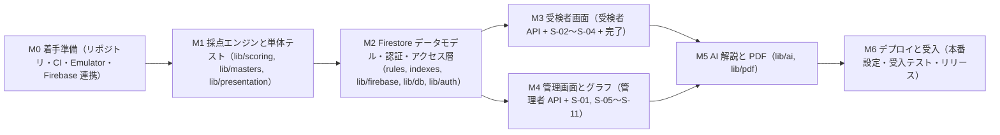
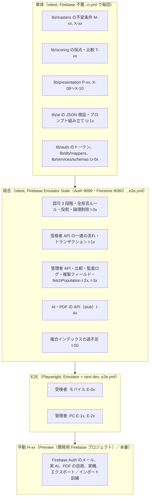
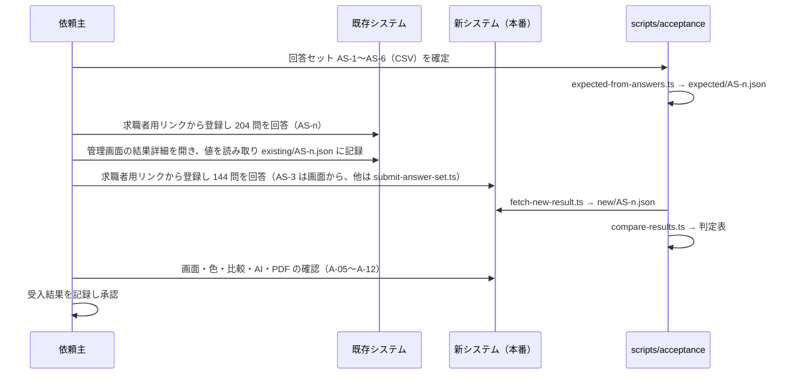
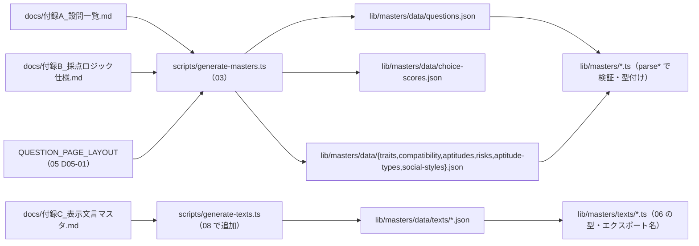

# 基本設計 08 実装計画とテスト計画

| 項目 | 内容 |
|---|---|
| 文書名 | 適性検査システム 基本設計 08 実装計画・テスト計画・受入 |
| 版 | 2.0 |
| 作成日 | 2026-09-18（1.1 版: 2026-09-21、1.2 版: 2026-09-21 最終点検、2.0 版: 2026-09-21 技術構成の変更（Supabase → Firebase。10 K-06）を反映。§11） |
| 対象 | 実装者（全担当）、テスト担当、依頼主（マイルストーンの確認、受入テストの実施、準備物の用意） |

## 0. 本書の位置づけ

本書は、基本設計 00〜07 で定めた仕様を **どの順序で実装し、どう検証し、どの基準で受け入れるか** を定めるものです。実装の内容（Firestore の文書定義、型、API の入出力、画面）は各分冊が正であり、本書はそれらを再定義しません。本書が定めるのは次の 7 点です。

1. マイルストーン M1〜M6 の成果物、PR 分割、完了条件、依頼主の確認ポイント（§1、§2）
2. テスト戦略（単体・結合・E2E・手動）と、各分冊から引き渡されたテスト観点の集約・採番（§3）
3. `tests/verify_fixtures.py` の移植と、合成回答による採点テストの位置づけ（§3.6、§3.7）
4. 既存システムとの突き合わせによる受入テストの手順と、不具合修正により意図的に異なる箇所（§4）
5. 依頼主が用意するものと期限（§5）
6. リスクと対策（§6）
7. マスタデータ（付録A・付録B・付録C）を機械生成する手順（§7）とリリース手順（§8）

本書が定めないもの（参照のみ）: システム構成・CI の定義そのもの・Firebase プロジェクトの設定（01 分冊）、Firestore の文書定義・セキュリティルール・複合インデックス・アクセス層・認証の仕組み（02 分冊）、採点式（03 分冊）、API の入出力（04 分冊）、画面（05・06 分冊）、AI 解説と PDF の生成方式（07 分冊）。1.0 版は 07 分冊と同時に執筆したため 07 の確定を待つ箇所を仮置きしていましたが、1.1 版では 07（構造化出力 D07-06、配列長の受け入れ D07-07、stub の不正 JSON モード D07-24、フォント配置 D07-20、Storage 不使用 D07-21、PDF 方式 D07-16、AI 解説の PDF 掲載 D07-15、テスト観点 AI-01〜AI-09・PDF-01〜PDF-08）と 01（1.1 版）・02（1.1 版）・04（1.1 版）・05（1.1 版）の確定内容に合わせて改版しました。

2.0 版は、依頼主の指示によりデータベースと認証を Supabase から Firebase（Cloud Firestore、Firebase Authentication）に変更した決定（10 K-06）を反映したものです。00 の 2.0 版（用語・コレクション名・ディレクトリ構成・環境変数・認証方式・D-28〜D-34）を正とし、マイルストーン構成（M0〜M6）、PR 単位の進め方、テスト戦略の層構成、受入手順と回答セット、マスタ生成手順は維持したうえで、PostgreSQL・RLS・マイグレーション・SQL 関数に依存していた箇所を Firestore・Admin SDK・Firebase Emulator Suite 前提に置き換えました。01（システム構成）・02（データモデル設計）・04（API 設計）は本書と同時に 2.0 版へ改版中のため、本書からの参照は分冊番号と対象（関数名・ファイル名は 00 §3.3 の範囲）にとどめ、節番号は変更のない箇所（03・05・06・07 と、04 の API 契約）にだけ付けています。Firebase の仕様で設計時に確信が持てない点は「実装時確認」と明記し、確認時期を M0〜M2 の早い段階に置きます（09 §6.4 の一覧と対応。§3.3.4）。残る依頼は §9 に「依頼」として明示します。

### 0.1 参照した要件

| 参照元 | 参照した内容 |
|---|---|
| 要件定義書 §5、§6.1〜§6.6 | 業務フロー、機能要件 U-01〜U-09、A-01〜A-13、採点の骨子、文言、視覚化、AI 解説（受入項目の母体） |
| 要件定義書 §9 | 非機能要件（性能「採点 2 秒以内」「結果詳細 1〜2 リクエスト」、対応端末、PDF）。性能テストと手動確認の根拠 |
| 要件定義書 §11 | 既存不具合 10 件と新システムでの方針。受入テストで「意図的に異なる箇所」を先に示す根拠 |
| 要件定義書 §12 | 未確認事項。手戻りリスク（§6）と依頼主確認ポイントの根拠 |
| 要件定義書 §13 | 根拠一覧。既存システムの値は「通信データ」から取得できたという事実（受入時の値の読み取り方法の根拠） |
| 付録A | 設問 204 問と逆引き表（マスタ生成の入力） |
| 付録B §1〜§10、§12、§13 | 配点表・全計算式・同点処理・比較計算・立ち位置・欠陥・旧ロジック混在（マスタ生成の入力、採点テストの期待値の根拠、受入で比較できない項目の根拠） |
| 付録C §1〜§8 | 文言と出し分け条件（文言マスタ生成の入力、画面受入の根拠） |
| 付録D §1〜§3 | AI 解説の入出力・JSON スキーマ・プロンプト（AI の単体テスト、受入で比較しない根拠） |
| 付録E §1〜§7 | グラフ設定値、ゲージ色、PDF（グラフ受入の根拠） |
| tests/fixtures/README.md、tests/verify_fixtures.py | 検証用データ 73 件の内容、検証できること・できないこと、6 つのチェック（移植元） |
| 00 分冊（2.0 版）§1.11、§2、§3.2、§3.3、§4.1、§5、§6、§8 | 不具合対応の共通ルールと担当、母集団の Firestore クエリ、コレクション 8 つと複製フィールド、環境変数（Emulator 用 3 変数を含む）、ディレクトリ構成（`firebase/`、`lib/firebase/`、`lib/db/`、`lib/auth/`、`scripts/`）、認可の 3 段階（Cookie 検証・役割・組織一致）、カスタムクレーム、分冊の担当範囲、設計判断 D-01〜D-34（特に D-28〜D-34） |
| 10 決定記録 K-01〜K-06 | 母集団に本人・幹部を含める、合致度の色、AI モデル、データは削除しない、イラストは実装者が作成、技術構成の変更（Firebase） |
| 01 分冊（2.0 版に改版中） | ライブラリ（vitest、Playwright、`firebase`、`firebase-admin`、`firebase-tools`）、`package.json` のコマンド、環境変数の管理と起動時検証、Firebase プロジェクトの環境分離、CI（Emulator の起動、ルール・インデックスのデプロイ）、サービスアカウントの発行と保管、監視・バックアップ（Firestore のエクスポート） |
| 02 分冊（2.0 版に改版中） | 各コレクションのフィールド定義と検証スキーマ、`Doc` 型、複製フィールドの同期手順（バッチ／トランザクション）、`firestore.rules`・`storage.rules`（全拒否）、`firestore.indexes.json`、`lib/db/`（collections、repositories、mappers）と `fetchPopulation()`、セッション Cookie の発行・検証・失効、初期オーナー作成（`scripts/create-owner`）、Emulator 用シード（`scripts/seed-local`）、監査ログの記録対象 |
| 03 分冊（1.3 版）§2.3、§4.4、§4.5、§5.10、§6、§7.1、§7.7、§8.1、§9.1、§10、§11 | 追加する型・関数、`chartOrder`、マスタ生成方針、値域表、不具合修正の反映点、母集団条件（Firestore クエリ）、検証用データの期待値、`lib/presentation/` の構成、保存型 number（丸めなし。D3-19）、テスト設計 T／M／P、08 への引き渡し |
| 04 分冊（2.0 版に改版中。API 契約は 1.2 版 §2.4、§4、§5、§7 を参照） | エラーコード、電話番号の規則（D04-06）、長時間処理、`lib/services/`・`lib/auth/` のファイル構成、`/auth/session`・`/auth/invite`、認可チェックの実装箇所、結合テストの観点 |
| 09 分冊（1.1 版）§6.4 | K-06 で新たに「実装時確認」となった 19 件と確認時期（本書 §3.3.4 で M0〜M2 の確認項目に割り当てる） |
| 05 分冊 §10.3、§12、§13 | 登録の入力規則（`lib/utils/phone-number.ts`。D05-16）、受検者画面のテスト観点 T-01〜T-19、設計判断 D05-xx |
| 06 分冊 §4.2、§9、§10.6、§11、§12 | 文言マスタの型（`AptitudeTypeTexts`）、PDF との関係、マスタの不変条件 X-01〜X-10、テスト観点、設計判断 D06-xx |
| 07 分冊 §1.2、§2.3、§3.2、§3.4、§4.6、§5、§9、§10、§11、§12 | `lib/ai/` の構成、テンプレートの `{{…}}` 形式、zod スキーマ `AiAnalysisOutputSchema`、検証失敗の扱い、`AiFailureReason`、provider（stub の `model`・不正 JSON モード・`setAiProviderForTest`）、PDF（`lib/pdf/` の構成、フォント、CI の Chromium、`visibilityForMode`）、テスト観点 AI-01〜AI-09・PDF-01〜PDF-08、08 への引き渡し、設計判断 D07-xx |

### 0.2 決定事項との対応

| # | 決定事項 | 本書での対応 |
|---|---|---|
| 1 | Next.js on Vercel + Firebase（Cloud Firestore、Firebase Authentication、Cloud Storage for Firebase）、ApexCharts。サーバ側は Admin SDK のみ、ブラウザから Firestore に直接アクセスしない。ローカル・CI は Firebase Emulator Suite（10 K-06） | M1〜M6 の実装順を、Firebase 非依存の純関数（`lib/scoring`、`lib/masters`）から着手し、Firestore データモデル・画面・外部連携へ広げる順にする（§1.1）。結合・E2E は Emulator 上で実行し、本番・開発の Firebase プロジェクトには接続しない（§3.1、00 D-33）。Firebase 固有の実装時確認事項は M0〜M2 で潰す（§3.3.4）。ApexCharts の版差分は M4 の最初に確認する（§6 R-08） |
| 2 | 既存不具合 10 件をすべて修正 | 不具合ごとに「確認するテスト ID」を対応付け（§3.8）、受入テストでは修正により既存と値が異なる箇所を先に一覧化する（§4.1） |
| 3 | 出題は Q1〜Q144 のみ | マスタ生成時の不変条件（§7.4）、単体 M-05／M-06、E2E で Q145 以降の文言が画面に出ないことを確認（§3.4 E-02） |
| 4 | 既存データは移行しない | 移行作業・移行テストを計画に含めない。受入は「同じ回答を両システムに入力して突き合わせる」方式（§4）。検証用データ 73 件はテストの入力としてのみ使う |
| 5 | AI 解説は Claude API、差し替え可能 | 単体・結合・E2E は `AI_PROVIDER=stub`（01 D01-07）で行い、実 API は Preview での手動確認と受入に限る（§3.5 H-03）。API キーの用意は M5 開始までに依頼（§5） |
| 6 | 日本語のみ、管理画面 PC 幅、受検者画面スマートフォン対応 | Playwright のプロジェクトを PC（1440×900）とモバイル（iPhone 相当）に分ける（§3.4）。実機確認を手動項目にする（§3.5 H-05） |

## 1. 実装計画の全体像

### 1.1 マイルストーンと依存関係



| マイルストーン | 主な成果物 | 主担当分冊 | 先行条件 |
|---|---|---|---|
| M0 着手準備 | リポジトリ骨組み、`firebase/`（Emulator 設定、全拒否ルール）、`ci.yml`・`e2e.yml`（`firebase emulators:exec`）、ローカル環境手順、PR テンプレート、Firebase プロジェクトとの連携（サービスアカウント鍵、ウェブアプリ登録、Vercel の環境変数） | 01 | 依頼主の GitHub・Vercel・Firebase 準備（§5） |
| M1 採点エンジンと単体テスト | `lib/scoring/`、`lib/masters/`（生成物を含む）、`lib/presentation/` の純関数部分、単体テスト一式 | 03、06（色・丸め）、08 | M0 |
| M2 Firestore データモデル・認証・アクセス層 | `firebase/firestore.rules`（全拒否）、`firestore.indexes.json`、`lib/firebase/admin.ts`、`lib/db/`（collections、repositories、mappers）、`lib/auth/`、`scripts/create-owner`、`scripts/seed-local`、結合テスト基盤、開発用 Firebase プロジェクトへのルール・インデックスのデプロイ | 02、01 | M1（`questions.ts`・`ScoreResult` が正） |
| M3 受検者画面 | 受検者 API、`app/(respondent)/`、`components/respondent/`、受検者 E2E | 04、05 | M2 |
| M4 管理画面とグラフ | 管理者 API、文言マスタ、`components/charts/`、`app/(admin)/`、管理者 E2E | 04、06 | M2（M3 と並行可） |
| M5 AI 解説と PDF | `lib/ai/`、`lib/pdf/`、印刷用ページ、AI／PDF の API と画面連携 | 07、04、06 | M3、M4 |
| M6 デプロイと受入 | 本番設定、受入テスト用スクリプト、受入テストの実施と記録、リリース | 01、08 | M5 |

- 設計判断 D08-01: M3 と M4 は M2 完了後に並行して進めます。両者は `lib/services/` と `app/api/v1/` の別ディレクトリ（`respondent/` と `admin/`）を触るため衝突が少なく、共通部分（`lib/auth/`、`lib/services/errors.ts`、`lib/services/audit.ts`、Route Handler の共通ラッパー `handle()`（`lib/services/http.ts`。04 §2.10、§8.1、D04-14））は M2 の最後の PR で先に入れます。
- 設計判断 D08-02: M5 は AI と PDF を同じマイルストーンにまとめますが、PR は分けます。PDF は M4 の画面部品に依存し、AI は M4 の結果詳細への表示に依存するため、どちらも M4 完了後に着手します。

### 1.2 進め方の共通ルール（PR 単位）

01 のブランチ運用と PR 必須条件を前提に、本書は PR の粒度と「完了の定義」を定めます。

| ルール | 内容 |
|---|---|
| 粒度 | 1 PR = §2 の表の 1 行。差分の目安は 1,500 行以内（生成物・テストデータを除く）。超える場合は分割する |
| ブランチ名 | `feature/m{番号}-{短い説明}`（例: `feature/m1-scoring-engine`）。不具合修正は `fix/{説明}` |
| PR テンプレート | 01 の項目（変更概要、影響する分冊、`firestore.rules`・`firestore.indexes.json` の変更有無、文書型（`Doc`）の変更有無、環境変数の追加有無、テスト方法、不具合 10 件への影響）に加え、本書の **「対応するテスト ID」** と **「依頼主確認事項（D-xx）への影響」** を記載する。インデックスを変更する PR は、デプロイ（`firebase deploy --only firestore:indexes`）がコードのデプロイより先に必要かを明記する（§8.2） |
| 完了の定義（Definition of Done） | (1) `ci.yml` 合格（lint／format／typecheck／unit／build）、(2) その PR が担当するテスト ID がすべて実装され合格、(3) 画面に触れる PR は `run-e2e` ラベルで `e2e.yml` を実行し合格（01）、(4) レビュー 1 名以上の承認、(5) 設計書からの逸脱があれば該当分冊の改版 PR を先に出す（00 §0） |
| 生成物 | `lib/masters/data/*.json` は生成してコミットする。CI で「再生成しても差分がない」ことを検査する（§7.6）。2.0 版で `supabase/seed/questions.sql`（設問シード）と `lib/db/database.types.ts`（DB 型の生成物）は廃止した（設問マスタは Firestore に持たず、文書型は 02 が TypeScript で手書きする。00 D-01、§3.1） |
| 個人情報 | テストデータ・スクリーンショット・PR 本文に実在の氏名・電話番号・メールアドレスを入れない。受検者名は「受入テスト AS-1」のような識別用文字列にする |
| マイルストーンの完了 | §2 の完了条件をすべて満たし、依頼主の確認ポイントに回答（承認または変更指示）が得られた時点。変更指示は次のマイルストーンの最初の PR で反映する |

### 1.3 分冊と PR の対応（早見表）

| 分冊 | 実装される主な PR |
|---|---|
| 01 構成 | PR-0.1〜PR-0.4、PR-2.5、PR-6.1 |
| 02 データモデル | PR-2.1〜PR-2.4 |
| 03 採点 | PR-1.2〜PR-1.4 |
| 04 API | PR-2.4、PR-3.1、PR-4.1、PR-5.2、PR-5.4 |
| 05 受検者画面 | PR-3.2、PR-3.3 |
| 06 管理者画面 | PR-1.5、PR-4.2〜PR-4.7 |
| 07 AI・PDF | PR-5.1〜PR-5.5 |
| 08 本書 | PR-0.2（テスト基盤）、PR-1.4（fixtures 移植）、PR-6.2（受入ツール）、PR-6.3 |

## 2. マイルストーン詳細

各マイルストーンについて、PR 単位の成果物、完了条件、依頼主の確認ポイントを示します。「テスト ID」は §3 の採番です。

### 2.1 M0 着手準備

| PR | 内容 | 主な成果物 | テスト ID |
|---|---|---|---|
| PR-0.1 | リポジトリ骨組み | `package.json`（01 の雛形。`firebase`、`firebase-admin`、`firebase-tools` を含む）、`.nvmrc`、`tsconfig.json`（`strict`）、ESLint／Prettier 設定（`firebase-admin` の import 制限を含む。00 §3.3）、`.env.example`（00 §3.2 の全変数。Emulator 用 3 変数はローカル・CI 専用と注記）、`lib/utils/env.ts`、`scripts/check-env.ts`、`README.md`（01 のセットアップ手順。Emulator の起動を含む） | — |
| PR-0.2 | Emulator とテスト基盤 | `firebase/firebase.json`（Auth 9099、Firestore 8080、Emulator UI のポート。rules・indexes のパス）、`firebase/.firebaserc`（プロジェクト別名。01）、`firebase/firestore.rules`・`storage.rules`（全拒否。00 D-28）、`firebase/firestore.indexes.json`（空の初期値。M2 で 02 が定義）、`lib/firebase/admin.ts`（Admin SDK の単一初期化。`FIREBASE_SERVICE_ACCOUNT_KEY` または Emulator）、`lib/firebase/client.ts`（Auth クライアントの初期化のみ）、`vitest.config.ts`（§3.1.2）、`playwright.config.ts`（§3.4.1）、`tests/{unit,integration,e2e,fixtures}/` の空構成と最小の合格テスト 1 本ずつ（結合の 1 本は Emulator に文書を 1 件書いて読む）、`tests/integration/setup/`（Emulator のデータクリア。§3.3.1） | I-00 |
| PR-0.3 | CI | `.github/workflows/ci.yml`（01。lint／format／typecheck／unit／build）、`e2e.yml`（`firebase emulators:exec` で結合と E2E を実行。§3.4.2）、`firebase-deploy.yml`（ルール・インデックスのデプロイ。手動・承認付き。01）、`dependabot.yml`、PR テンプレート（§1.2） | — |
| PR-0.4 | Firebase プロジェクト連携 | 依頼主が作成済みの Firebase プロジェクト（Auth 有効化・Firestore 作成済み）に対する、ウェブアプリ登録（`NEXT_PUBLIC_FIREBASE_*` の 4 値の取得）、サービスアカウント鍵の発行と Base64 化（`FIREBASE_SERVICE_ACCOUNT_KEY`）、Vercel の環境変数登録（Preview・Production）、GitHub Environment Secrets への Firebase CLI 認証情報の登録、API キーの利用制限（01）。手順書は `docs/運用/` に置く（PR-6.3 で完成） | H-00 |

完了条件:

- 空の Next.js アプリが `pnpm ci` と `pnpm build` に合格し、Vercel の Preview デプロイが作成される（Preview の環境変数は開発用 Firebase プロジェクトの値。01 が環境分離を確定）。
- ローカルと CI（`e2e.yml`）で Firebase Emulator Suite（Auth、Firestore）が起動し、結合テストの最小 1 本（I-00）が Emulator に対して合格する。CI の Emulator 実行には Java ランタイムが必要と推定されるため、`e2e.yml` に `setup-java` 相当のステップを置く（実装時確認: 必要な Java の版）。
- `FIREBASE_SERVICE_ACCOUNT_KEY` を省略し `FIRESTORE_EMULATOR_HOST`・`FIREBASE_AUTH_EMULATOR_HOST` だけで Admin SDK が Emulator に接続できる（00 §3.2、09 §6.4 の 15。できない場合はダミーの資格情報で初期化する経路を `lib/firebase/admin.ts` に足す）。
- `firebase/` を作業ディレクトリとして Firebase CLI が動く（00 §3.3、09 §6.4 の 16。動かない場合は 01 がルート配置に変え、00 §3.3 を改版する）。
- `main` の Branch protection が有効で、`ci / check` が必須チェックになっている（01）。

依頼主の確認ポイント:

- §5 の「M0 まで」の準備物（GitHub、Vercel、Firebase プロジェクト）の完了。Firebase プロジェクトの作成・Auth（メール＋パスワード）の有効化・Firestore（Native モード）の作成は依頼主が完了済み。残りは PR-0.4 の連携作業で、サービスアカウント鍵の発行と Vercel への登録は実装者が依頼主の立ち会いで行う。
- Firestore のロケーションが作成後に変更できない点（09 §6.4 の 14）を踏まえ、作成済みプロジェクトのロケーション（00 §2.1 は `asia-northeast1` を推奨）を記録し、01 の構成に反映することの承認。
- 本書 §2 のマイルストーンと確認ポイントの一覧そのものの承認（以降の確認の進め方）。

### 2.2 M1 採点エンジンと単体テスト

| PR | 内容 | 主な成果物 | テスト ID |
|---|---|---|---|
| PR-1.1 | 型と定数 | `lib/scoring/types.ts`（00 §3.4 をそのまま）、`lib/scoring/version.ts`、`lib/masters/types.ts`（00 §3.5）、03 §2.3 の追加型・エラー型 | — |
| PR-1.2 | マスタ生成 | `scripts/generate-masters.ts`（03 §4.5、本書 §7.3）、生成物 `lib/masters/data/*.json`、`lib/masters/validate.ts`、`lib/masters/{questions,choice-scores,occupations}.ts`、`lib/masters/indicators/*.ts` | M-01〜M-08、§7.6 の再生成検査 |
| PR-1.3 | 採点 | `lib/scoring/evaluate.ts`、`compute-*.ts`、`validate-answers.ts`、`score.ts`（03 §5） | T-01〜T-09b、T-10、PF-01 |
| PR-1.4 | 比較と検証用データ | `lib/scoring/compare.ts`（03 §7）、`tests/unit/scoring/fixture-adapter.ts`、`tests/unit/scoring/fixtures.test.ts`（§3.6） | T-10b〜T-14、PF-02 |
| PR-1.5 | 表示用の純関数 | `lib/presentation/{rounding,negative-values,colors,trait-highlights,chart-series,comparison-scope-params,exam-pages}.ts`（03 §8.1・§8.3・§8.4・§9、06 §5、§6.8、§10.2、05 §10.1。`negative-values.ts` の `clampForSlider`／`clampPercent` は P-04 と 07 §2.3 の AI 入力整形が使う） | P-01〜P-04、X-08〜X-10、05/T-01 |

完了条件:

- `pnpm test`（unit プロジェクト）が全件合格し、`lib/scoring` と `lib/masters` が `next`・`firebase`・`firebase-admin` を import していない（01 の `no-restricted-imports` が有効。00 §3.3）。
- `results` 文書の保存形（`ScoreResult` をそのまま map で保存。03 §5.9、00 §2.1）で、数値が保存・読み戻しで変わらないことを M1 の最後に Emulator で 1 件確認する（09 §6.4 の 19。U-01 の Emulator 版は M2 の I-00 で正式に行う）。
- 03 §10.4〜§10.7 の期待値（全問同一回答 5 種、周期回答、検証用データ 73 件）をすべて再現する。
- `scoreAnswers` 1 件あたり平均 5 ms 未満、`compareWithPopulation`（母集団 1,000 件）10 ms 未満（03 §10.9）。
- 生成 JSON の `sourceHash`（§7.6）が付録A・付録B の現在の内容と一致する。

依頼主の確認ポイント（M1 で確認するもの）:

| ID | 内容 | 判断が必要な理由 |
|---|---|---|
| D-03 | 16 タイプ得点の同点時の優先順位（付録B §6 の表の順） | 要件定義書・付録に記載なし |
| D-21 | ソーシャルスタイル同点時の Expressive と Analytical の順 | 付録B §7 で判別不能 |
| D3-04 | 自己実現型の式で Q13 が 2 回出現する点をそのまま保持する | 既存の編集痕跡と推定。修正すると既存の出力と変わる |
| D3-05 | 全 16 尺度を 0〜30 として扱う | 付録B §2 冒頭の記述との差 |
| 設問文 | 付録A の設問文（表記ゆれ・誤字を含む）をそのまま使う | 03 §4.3。修正は依頼主判断 |
| 報告 | 全問同一回答・周期回答の採点結果表（03 §10.4〜§10.5）を提出し、既存システムの理解と矛盾がないか確認してもらう | 受入前に計算式の解釈を早期に固定する |

### 2.3 M2 Firestore データモデル・認証・アクセス層

1.x 版の「DB・認証・マスタ投入」を改めました。Firestore はスキーマレスのため、マイグレーション（1.x 版の 01〜16）の概念は廃止し、文書の形は 02 が定める TypeScript の文書型（`Doc`。00 §3.1）と書き込み前のスキーマ検証で管理します。設問マスタは Firestore に投入しません（00 D-01）。

| PR | 内容 | 主な成果物 | テスト ID |
|---|---|---|---|
| PR-2.1 | 文書型・ルール・インデックス | `lib/db/collections.ts`（`COLLECTIONS` 定数と型付きコレクション参照。00 §3.1）、`lib/db/types/`（8 コレクションの `Doc` 型。02 が確定。配置は 02）、`lib/db/schemas/`（書き込み前の検証スキーマ。02）、`firebase/firestore.rules`（全拒否。PR-0.2 の内容を確定）、`firebase/firestore.indexes.json`（`results` の `organizationId + isExcluded + scoringVersion + deletedAt (+ teamCode)`、一覧・分類・利用履歴のクエリに必要な複合インデックス。02） | I-01、I-50 |
| PR-2.2 | アクセス層 | `lib/db/mappers/`（`Doc` ↔ ドメイン型。`Timestamp` ↔ `Date`、`ScoreResult` ↔ `results` 文書）、`lib/db/repositories/`（コレクションごとの読み書き。`fetchPopulation()`（00 §1.11 のクエリ）、受検登録・送信・チーム／除外更新・削除のバッチ／トランザクション。02） | U-01（mappers の往復）、I-00、I-36、I-37 |
| PR-2.3 | 認証・認可 | `lib/auth/session-cookie.ts`（`createSessionCookie`／`verifySessionCookie(cookie, true)`／`revokeRefreshTokens`）、`lib/auth/claims.ts`（`organizationId`・`role` の型と取得）、`lib/auth/respondent-token.ts`（乱数トークンの発行・SHA-256・照合）、`lib/auth/pdf-token.ts`（04 §7.2）、`lib/auth/admin-context.ts`（Cookie 検証 → クレーム → `adminUsers` 文書の取得。認可 3 段階の (1)(2)。04）、`middleware.ts`（Cookie の有無だけで遮断。`/admin/results/*/print` を除外。00 §3.3）、`app/auth/session/route.ts`（`POST`／`DELETE`。04） | U-02、I-02〜I-08 |
| PR-2.4 | 共通基盤 | `lib/services/{http,errors,audit,rate-limit}.ts`（04。`handle()`／`readJson`／`json`／`requestMeta` は `http.ts`）、`lib/services/schemas/{common,respondent,admin-account,admin-results,admin-respondents,auth}.ts`（zod。04）、`lib/utils/phone-number.ts`（05 D05-16。04 の `respondent.ts` と 05 の `registration-rules.ts` が共有）、結合テストのヘルパー（§3.3.2） | U-06、U-07 |
| PR-2.5 | 運用スクリプトと開発環境 | `scripts/create-owner.ts`（`pnpm owner:create`。Admin SDK で `organizations` 文書 → Auth ユーザー作成 → カスタムクレーム付与 → `adminUsers` 文書（ID = uid）→ パスワード設定メール。02、00 §5）、`scripts/seed-local.ts`（Emulator 用の組織・オーナー・送信済み受検者の投入。本番には投入しない）、`scripts/set-admin-role.ts`（役割変更・利用停止。00 §5）、`firebase-deploy.yml` を開発用 Firebase プロジェクトに対して実行し、ルール（全拒否）とインデックスをデプロイ。Vercel Preview の環境変数を開発用プロジェクトの値に設定 | I-09、H-01 |

完了条件:

- ローカルで `pnpm emulators`（`firebase emulators:start --only auth,firestore`。コマンド名は 01）を起動し、`pnpm seed:local` で組織 1 つ・オーナー 1 名・送信済み受検者 3 件が投入され、Emulator UI で文書が確認できる。
- 結合テスト I-00〜I-09、I-36、I-37、I-50 が合格（Admin SDK の Emulator 接続、認可の 3 段階、全拒否ルール、`adminUsers` の役割・停止、`owner:create` によるオーナー作成、複製フィールドの同期、`fetchPopulation()` のクエリ結果、複合インデックスの過不足なし）。
- 09 §6.4 の実装時確認事項のうち M1〜M2 に割り当てたもの（§3.3.4）がすべて「成立」または「代替に切り替え済み」として PR に記録されている。特に (1) `where("deletedAt", "==", null)` の一致、(3) 複合インデックスの要否、(4) `createSessionCookie` の `expiresIn` の上限、(6) `verifySessionCookie(cookie, true)` が無効化ユーザー・失効後セッションを拒否すること、(7) 自己登録の無効化。
- 開発用 Firebase プロジェクトで `firebase-deploy.yml` によりルール・インデックスがデプロイされ、Firebase コンソールでルールが全拒否になっている（H-01）。同プロジェクトで `pnpm owner:create` により初期オーナーを作成し、パスワード設定メールからパスワードを設定した後、クライアント SDK のログイン → `POST /auth/session` が成立する（画面はまだ無いため Node のスクリプトで確認）。開発用・本番用プロジェクトに対する `owner:create` の実行は依頼主または運用責任者が行う（実装者は Emulator に対してのみ実行する。01）。

依頼主の確認ポイント:

| ID | 内容 |
|---|---|
| 02、00 §5、00 §4.2 | 組織と初期オーナーは運用スクリプト `pnpm owner:create`（`scripts/create-owner.ts`。Admin SDK）で作成し、本番・開発プロジェクトに対しては依頼主または運用責任者が実行する手順の承認。Firebase コンソールからユーザーを追加した場合はカスタムクレームと `adminUsers` 文書が無いため管理 API を利用できない（00 §5）。コンソールでの追加は行わない運用とする |
| D-11、10 K-04 | 決定済み: データは削除しない。論理削除のみ（`respondents`・`assessmentSessions`・`results` の 3 文書を同一バッチで更新）。1.x 版の物理削除 SQL 関数は廃止し、将来必要になれば Admin SDK のスクリプトとして設計する。監査ログは無期限 |
| 01 | Firebase の料金プラン（従量制。Emulator はローカルのため課金なし）と、本番用・開発用の 2 プロジェクト構成、Preview が開発用プロジェクトに接続する構成（01 が確定） |
| D-05、D-06、10 K-01 | 決定済み: 母集団に本人・幹部を含める（`fetchPopulation()` のクエリ条件として実装される。00 §1.11） |
| D04-10／D05-09 | 受検者トークンの有効期限 7 日・保存のたびに延長（`assessmentSessions.tokenExpiresAt`。00 D-32） |
| 00 D-31、04 | 管理者セッション Cookie の有効期限（14 日を上限に 04 が定める。実装時確認の結果を報告） |

### 2.4 M3 受検者画面

| PR | 内容 | 主な成果物 | テスト ID |
|---|---|---|---|
| PR-3.1 | 受検者 API | `app/api/v1/respondent/**`（04 §4）、`lib/services/{organization-lookup,respondent-registration,session-progress,answer-saving,submission}.ts`（04 のファイル名。D04-52）、`lib/services/dto/respondent.ts`、受検登録（`respondents` + `assessmentSessions` + `usageLogs` の同一バッチ）と送信（`assessmentSessions` + `results` + `respondents` + `usageLogs` のトランザクション。二重送信は `status` の再読み取りで拒否）の `lib/db/repositories/` 呼び出し（02、00 §2.2）、レート制限（`rate-limit.ts`。04） | I-10〜I-18、PF-03 |
| PR-3.2 | 画面 | `app/(respondent)/exam/**`、`components/respondent/*`（05 §3、§5）、`lib/presentation/{exam-choices,registration-rules,exam-texts}.ts`（05 §10。`registration-rules.ts` は `lib/utils/phone-number.ts` を再エクスポートし規則を再定義しない。D05-16）、`lib/auth/respondent-page-guard.ts`（05 §10.6、D05-37） | U-03、05/T-03〜T-07 の単体部分 |
| PR-3.3 | E2E | `tests/e2e/respondent/*.spec.ts`（§3.4.3 E-01〜E-04） | E-01〜E-04、05/T-08〜T-19 |

完了条件:

- 受検者が登録 → 開始 → 20 ページ（144 問）→ 送信 → 完了画面まで進め、`results` に 1 文書、`usageLogs` に 1 文書、`auditLogs` に `respondent.register`・`session.start`・`session.submit` が記録される。`assessmentSessions.answers` の map に `"1"`〜`"144"` のキーだけがある（00 D-29）。
- 送信 API の所要時間（登録から送信応答まで、ローカル Emulator）が 2 秒以内（PF-03）。
- モバイルビューポートの E2E（E-01〜E-04）が合格し、幅 320px で横スクロールがない（05/T-17）。
- 依頼主が Preview URL をスマートフォン実機で通しで受検できる（H-05 の前倒し。Preview は Deployment Protection で保護されるため、依頼主を Vercel チームに招待する。01）。

依頼主の確認ポイント:

| ID | 内容 |
|---|---|
| D-08／D05-01 | 144 問を 4 ステップ × 5 ページ（7・7・7・7・8 問）に割り当てる |
| D05-03 | 未回答があれば「次へ」を無効化し、飛ばして進む手段を設けない |
| D04-06、D05-16 | 電話番号の検証規則。正は 04 §4.2 の `normalizePhoneNumber`（全角→半角、ハイフン類・括弧の正規化、空白除去）と `PHONE_PATTERN = ^[0-9+()\-]{8,20}$`（国際形式・括弧付きも受理。D04-06 の仮置き）。05 D05-16 は同じ実装（`lib/utils/phone-number.ts`）を共有する |
| D05-18〜D05-22 | 見出し「受検者登録」への統一、「クリック」文言、同意文の有無、配色・サイト名 |
| D-15／D05-13 | 完了画面は固定文言のみ、完了メールは送らない |
| D-16／D05-10 | 中断・再開は同一端末・同一ブラウザに限る |

### 2.5 M4 管理画面とグラフ

| PR | 内容 | 主な成果物 | テスト ID |
|---|---|---|---|
| PR-4.1 | 管理者 API | `app/api/v1/admin/**`（04 §5）、`app/auth/invite/route.ts`（招待トークン検証 → Admin SDK `createUser` → カスタムクレーム → `adminUsers` 文書。04、00 §4.2。`app/auth/session/route.ts` は PR-2.3）、`lib/services/{admin-account,result-list,result-detail,comparison,respondent-management,classification,usage-log-list,invite-acceptance}.ts`（04 のファイル名。D04-52）、`lib/services/dto/{admin,result}.ts`。一覧・分類・利用履歴は `results` を組織条件でクエリし `respondents` を `getAll()` で突き合わせる（00 §2.2。実装時確認: `getAll()` の 1 回あたりの上限） | I-20〜I-35 |
| PR-4.2 | 文言マスタ | `scripts/generate-texts.ts`（§7.4）、生成物 `lib/masters/data/texts/*.json`、`lib/masters/texts/*.ts`（06 §4.1 のエクスポート名・型）、`lib/presentation/resolve-*.ts`（06 §4.4） | X-01〜X-07、U-04 |
| PR-4.3 | グラフ部品 | `components/charts/{TraitRadar,AptitudeRadar,SocialStyleRadar,DonutGauge,CompatSlider,GradeLetter}.tsx`（06 §6） | U-05（コンポーネント単体、06 §11） |
| PR-4.4 | 認証画面と一覧 | `app/(admin)/admin/{login,signup,password-reset}/page.tsx`（06 §3.1〜§3.3。ログインは `signInWithEmailAndPassword` → `POST /auth/session` → `signOut()`、招待は `POST /auth/invite` → `sendPasswordResetEmail`、再設定は `verifyPasswordResetCode`／`confirmPasswordReset`。06 1.3 版、D06-30）、`lib/utils/admin-auth.ts`（06 §10.4）、`app/(admin)/admin/page.tsx`（06 §3.4）、共通レイアウト（06 §2.3） | E-10、E-11 |
| PR-4.5 | 結果詳細 | `app/(admin)/admin/results/[resultId]/page.tsx` とセクション部品（06 §3.5）、比較組織の選択、ポップアップ S-11 | E-12〜E-15 |
| PR-4.6 | 組織内分類・アカウント | `app/(admin)/admin/{classification,account}/page.tsx`（06 §3.6、§3.7）、利用履歴ポップアップ S-09 | E-16、E-17 |
| PR-4.7 | E2E | `tests/e2e/admin/*.spec.ts`（§3.4.3 E-10〜E-18） | E-10〜E-18 |

完了条件:

- 結合テスト I-20〜I-36 が合格（幹部データの可視性、比較 API の非永続化、母集団の条件、`POPULATION_EMPTY`、監査ログ、複製フィールドの同期）。
- 結果詳細の初期表示が Server Component の 1 回のデータ取得（`results` 1 文書 + `respondents` 1 文書 + 最新 `aiAnalyses` 1 文書。00 §2.2）で描画され、比較は `GET …/comparison` 1 本で完結する（PF-04。要件定義書 §9）。
- 09 §6.4 の M4 に割り当てた実装時確認事項（(8) パスワード再設定メールのアクション URL のカスタマイズ、(9) パスワードポリシーとエラーコード名、(10) 現在のパスワードの検証方法）が PR に記録されている（§3.3.4）。
- E2E E-10〜E-18 が 1440×900 で合格し、信頼係数 90% のゲージが緑系・リスク 90% が赤であることを DOM で確認する（06 §11、要件定義書 §11 の 5 番）。
- 付録E §2 の ApexCharts 設定キーが採用版で同じ意味で動くことを確認済み（01 D01-25、§6 R-08）。

依頼主の確認ポイント:

| ID | 内容 |
|---|---|
| D-09、D06-04 | 合致度の色は既存どおり、信頼係数は上位 2 段階を緑系に置き換える（Preview の実画面で確認してもらう） |
| D-07、D06-14 | 相性が負値のときは左端に表示し注記を出す |
| D06-03 | 指標色の具体値。ブランド色があれば置換 |
| D-13、10 K-05、D08-20 | 決定済み: イラスト 45 枚（16 タイプ・16 キャラクター・4 資質・4 スタイル・5 立ち位置）は実装者が SVG で作成する（M4 で作成し Preview で確認してもらう） |
| D04-32／D06-18 | 組織内分類の人数に除外者を含める |
| D04-23、09 §6.4 の 10 | パスワード変更に現在のパスワードを必須にする。Admin SDK にはパスワード照合が無いため検証方法は 04 が確定する（実装時確認。成立しない場合は「現在のパスワード必須」を取り下げる） |
| D06-06、00 §5 | 幹部データはオーナーの一覧に区分列付きで混在表示し、`admin` には存在自体を見せない（`results.respondentKind` の複製フィールドで絞り込む） |
| D06-10 | 偏差値の数値を立ち位置の近くに表示する |
| 01、06 §3.2、§3.3、D06-30 | パスワード再設定・招待後のパスワード設定メールは Firebase Authentication の標準メール（Firebase コンソールのテンプレート設定で日本語化・送信元表示名を設定）で賄い、SMTP 事業者の契約を行わない（設計判断 D08-29）。テンプレートの文言と、アクション URL を `/admin/password-reset` にカスタマイズできるか（09 §6.4 の 8）の結果を Preview で確認してもらう |

### 2.6 M5 AI 解説と PDF

| PR | 内容 | 主な成果物 | テスト ID |
|---|---|---|---|
| PR-5.1 | AI 連携 | 07 §1.2 のファイル構成: `lib/ai/{types,errors,schema,input,prompt-builder,provider}.ts`、`lib/ai/prompts/{index,recruitment-v1}.ts`、`lib/ai/providers/{anthropic,stub}.ts`（00 §3.6、01 D01-07）。AI 出力の zod スキーマは `lib/ai/schema.ts` の `AiAnalysisOutputSchema` と `parseAiOutputText()`（07 §3.2）の 1 箇所 | U-10〜U-13、U-15、U-16 |
| PR-5.2 | AI の API と画面 | `POST/GET …/ai-analysis`（04 §5.9、§7.1）、`lib/services/ai-analysis.ts`（04 §8.1。07 と共同）、結果詳細の AI 解説セクション（06 §3.5） | I-40〜I-44、I-48、E-20 |
| PR-5.3 | PDF 生成 | `lib/pdf/{types,errors,browser,render-result-pdf,templates,protection-bypass,visibility,print-url}.ts`（07 §9.8）、`lib/services/print-data.ts`（07 §9.4。07 が置く）、印刷用ページ `app/(admin)/admin/results/[resultId]/print/{page,layout}.tsx`（07 §9.4）、`components/pdf/PrintResultDocument.tsx`・`PrintReadyMarker`（07 §9.4、§9.6）、日本語フォント `public/fonts/NotoSansJP-{Regular,Bold}.woff2` の同梱（07 §9.7、D07-20。§6 R-03） | U-14、U-17、U-02（pdf-token） |
| PR-5.4 | PDF の API と画面 | `GET …/pdf`（04 §5.10、§7.2）、`lib/services/pdf-export.ts`（04 §8.1。07 と共同）、ダウンロードポップアップ S-10（06 §3.5.11） | I-45〜I-47、I-49、E-21 |
| PR-5.5 | E2E と手動確認 | `tests/e2e/admin/ai-and-pdf.spec.ts`、Preview での実 API・実 PDF の確認記録 | E-20、E-21、H-03、H-04、H-12、H-13 |

完了条件:

- `AI_PROVIDER=stub` で生成 → 保存 → 再表示 → 非表示が動き、`aiAnalyses` に 1 文書、`results.aiGenerationStatus == "completed"` と `results.latestAiAnalysisId` が同一バッチで反映される（07 §7.1、07/AI-08）。
- 実 API（Preview、検証用キー）で 3 件以上生成し、すべて `AiAnalysisOutputSchema`（07 §3.2。付録D §2 に対応）の検証に合格する。生成時間の中央値を記録し、60 秒を超える場合は非同期化の判断を 07 と行う（04 §7.1、07 §6.5）。
- PDF が A4 縦で 2 モード出力され、日本語が豆腐（□）にならない。`restricted` で評価・合致度・リスク（06 §3.5.11 の表）と AI 解説（07 D07-15）が出ず、立ち位置は出る（07 §9.5）。
- PDF 生成が Vercel Preview で 120 秒以内、関数のデプロイサイズが上限内で、`public/fonts/` が関数バンドルに含まれていない（01、07 PDF-08。H-13）。

依頼主の確認ポイント:

| ID | 内容 |
|---|---|
| D-17、D07-08、D07-09 | 使用モデルと生成パラメータ（07 §4.1・§4.2 の提案: `claude-opus-5`、`max_tokens 16000`、適応思考、`effort high`、構造化出力。代替 `claude-sonnet-5` は依頼主判断）。月額上限（D01-15） |
| D-20、D07-03 | 付録D プロンプトの「コンタクター」を「コンダクター」に修正して転記する（07 が 1 語のみ修正で確定。依頼主に報告） |
| D07-04 | 付録D の「資質タイプ（各0〜100）」の記載をそのまま残し、100 超の値もそのまま渡す（07 §2.3） |
| D07-15 | AI 解説を `restricted` PDF に掲載しない（07 §9.5。06 §3.5.11 の「`restricted` でも掲載」提案は 07 が不採用。依頼主が「掲載する」と確認した場合は `visibilityForMode()` の 1 行で切り替える） |
| D06-26 | `restricted` PDF で立ち位置・偏差値を印字する（07 §9.5 も印字する前提） |
| D01-17 | AI 生成の組織あたり日次上限 200 回 |
| D-18、D07-17、D07-18 | PDF のレイアウト（結果詳細と同一構成を A4 縦に再配置。余白・レーダーサイズは実機確認で調整）。第二候補は第一候補に続けて印字することで確定（07 D07-18） |
| D07-12 | AI の拒否（refusal）に対するサーバ側フォールバックを本フェーズでは使わない（周知） |
| 出力の確認 | 実 API の生成結果 3 件を依頼主が読み、免責表示（付録D §1）とあわせて内容が許容範囲か確認する |

### 2.7 M6 デプロイと受入

| PR | 内容 | 主な成果物 | テスト ID |
|---|---|---|---|
| PR-6.1 | 本番設定 | セキュリティヘッダー（01）、レート制限（01）、`NEXT_PUBLIC_APP_BASE_URL` などの Production 環境変数の設定手順、本番 Firebase プロジェクトの Auth 設定（メール＋パスワードのみ、自己登録の無効化、メールテンプレートの日本語化と送信元表示名、承認済みドメインに本番ドメインを追加）・API キーの利用制限（HTTP リファラー）・ルールと本番インデックスのデプロイ（`firebase-deploy.yml` の `production`）の確認（01） | H-06〜H-09 |
| PR-6.2 | 受入ツール | `tests/fixtures/acceptance/`（回答セット）、`scripts/acceptance/{submit-answer-set,compare-results,expected-from-answers}.ts`（§4.4） | A-01〜A-12 の実施に使用 |
| PR-6.3 | 運用文書 | `docs/運用/`（初回リリース手順 §8.1、通常リリース §8.2、ロールバック §8.3、月次点検（01）、初期オーナー作成（`pnpm owner:create` の実行手順を運用者向けに転記）、役割変更・利用停止（`scripts/set-admin-role`）、招待トークン再発行、サービスアカウント鍵のローテーション（01）、Firestore のエクスポート／インポート手順（§8.3）） | — |
| PR-6.4 | 受入指摘の修正 | 受入テストで見つかった不具合の修正（複数 PR） | 該当テスト ID の追加・修正 |

完了条件:

- §4 の受入テスト A-01〜A-12 がすべて合格し、「意図的に異なる箇所」（§4.1）以外の差異がない。
- 本番環境で初期オーナーがログインでき、アカウント画面の 3 種のリンクが本番ドメインで表示される（01 のチェックリスト）。
- 開発用 Firebase プロジェクトで Firestore のエクスポート → インポートによる復元を 1 回試した記録がある（01、H-09。手順の詳細は実装時確認: エクスポート先の Cloud Storage バケットと `gcloud firestore export`／`import` 相当の操作）。
- §5 の依頼主準備物がすべて揃い、01 のチェックリストが完了している。

依頼主の確認ポイント:

- 受入テストの結果表（§4.6 の形式）への署名（承認）。
- 本番リリース日時と、リリース後 1 週間の運用体制（問い合わせ先、監視の担当）。

## 3. テスト戦略

### 3.1 全体方針とテストの配置



| 種別 | 実行環境 | 実行タイミング | 目標 |
|---|---|---|---|
| 単体 | Node のみ（`vitest --project unit`） | すべての push（`ci.yml`） | 数秒で完了。`lib/` の純関数を網羅 |
| 結合 | Firebase Emulator Suite（Auth、Firestore。`firebase emulators:exec` の子プロセス）+ Next.js の Route Handler を直接呼ぶ（`vitest --project integration`）。Admin SDK は `FIRESTORE_EMULATOR_HOST`・`FIREBASE_AUTH_EMULATOR_HOST` で Emulator に接続する（00 D-33） | `run-e2e` ラベル付き PR と `main`（`e2e.yml`）、および開発者のローカル | API 契約・認可 3 段階（Cookie 検証・役割・組織一致）・トランザクション（二重送信拒否）・複製フィールドの同期・`fetchPopulation()` のクエリ結果・監査ログ |
| E2E | Emulator + `next dev`（Emulator 用の環境変数を与えた開発サーバ）+ Playwright | 同上 | 画面遷移・表示・色・二重送信などブラウザでしか確認できないもの |
| 手動 | Vercel Preview（開発用 Firebase プロジェクト、実 API キー）と本番 | マイルストーン完了時、受入時 | Firebase Auth のメール、実 AI、PDF の見た目、実機、エクスポート／インポートによる復元 |

- 設計判断 D08-28: E2E は `next build && next start`（1.x 版）ではなく `next dev` で実行します。理由: (1) Emulator の起動と Next.js の起動を `firebase emulators:exec` の 1 コマンドに収め、CI のステップを減らす、(2) 本番相当のビルドは Vercel Preview（H-xx）で必ず確認するため、E2E の目的（画面遷移・表示・色）は開発サーバで足りる。開発サーバ固有の挙動（初回コンパイルの遅延）は `playwright.config.ts` の `webServer.timeout` と各テストの `timeout` で吸収します。Preview で本番ビルド固有の問題が出た場合は E2E を `next start` に戻します。
- 本番・開発の Firebase プロジェクトには自動テストから接続しません（00 D-33）。Emulator 専用のプロジェクト ID（`demo-` で始まる ID は Emulator 専用として扱われると推定。実装時確認）を `NEXT_PUBLIC_FIREBASE_PROJECT_ID` に与え、万一 Emulator 用の環境変数が欠けても本物のプロジェクトに書き込まれないようにします。

#### 3.1.1 テスト ID の体系

各分冊が定めたテスト観点をそのまま使い、本書で追加するものに新しい接頭辞を付けます。分冊の ID を引用するときは分冊番号を前置します（`03/T-06`、`05/T-11`、`06/X-08`）。

| 接頭辞 | 種別 | 定義元 |
|---|---|---|
| `M-`、`T-`、`P-` | 単体（マスタ、採点・比較、表示） | 03 §10.3〜§10.8 |
| `X-` | 単体（文言マスタ・色・URL 変換・系列） | 06 §10.6 |
| `05/T-` | 受検者画面（単体または E2E） | 05 §12 |
| `07/AI-`、`07/PDF-` | AI 解説・PDF の観点（07 が定義。本書の `U-`／`I-`／`E-`／`H-` に採番して実装する。対応表は §3.2.1） | 07 §10 |
| `U-` | 単体（本書で追加。`lib/db/mappers`、`lib/auth`、`lib/ai`、`lib/pdf`、`lib/services/schemas`、コンポーネント） | 本書 §3.2 |
| `I-` | 結合 | 本書 §3.3 |
| `E-` | E2E | 本書 §3.4 |
| `H-` | 手動 | 本書 §3.5 |
| `PF-` | 性能 | 本書 §3.9 |
| `A-` | 受入 | 本書 §4 |

#### 3.1.2 `vitest.config.ts`

01 の `--project unit` / `--project integration` に対応する設定です。

```ts
// vitest.config.ts
import { defineConfig } from "vitest/config";
import path from "node:path";

export default defineConfig({
  resolve: { alias: { "@": path.resolve(__dirname, ".") } },
  test: {
    projects: [
      {
        extends: true,
        test: {
          name: "unit",
          include: ["tests/unit/**/*.test.ts", "tests/unit/**/*.test.tsx"],
          environment: "node",
          environmentMatchGlobs: [["tests/unit/components/**", "jsdom"]],
        },
      },
      {
        extends: true,
        test: {
          name: "integration",
          include: ["tests/integration/**/*.test.ts"],
          environment: "node",
          globalSetup: ["tests/integration/setup/global-setup.ts"],
          setupFiles: ["tests/integration/setup/per-file.ts"],
          fileParallelism: false,   // 同じ Emulator を使い、ファイルごとにデータをクリアするため直列
          testTimeout: 30_000,
        },
      },
    ],
    coverage: {
      provider: "v8",
      include: ["lib/**"],
      thresholds: { "lib/scoring/**": { lines: 100, branches: 95 }, "lib/masters/**": { lines: 95 } },
    },
  },
});
```

- 設計判断 D08-03: カバレッジの閾値は `lib/scoring` と `lib/masters` にだけ設けます（採点式の分岐漏れを検知するため）。画面・API は E2E と結合で担保し、行カバレッジを目標にしません。
- `environmentMatchGlobs` により、コンポーネント単体（U-05）だけ jsdom で動かします。ApexCharts は jsdom で描画できないため、コンポーネント単体では「渡した options と series が付録E §2 のキーに一致すること」だけを検証し、描画は E2E で確認します（06 §11）。

### 3.2 単体テスト

#### 3.2.1 分冊から引き継ぐもの（採番済み）

| 分冊 | ID | 対象ファイル（`tests/unit/`） | 備考 |
|---|---|---|---|
| 03 | M-01〜M-08 | `masters/*.test.ts` | §7.6 の再生成検査と同じ不変条件 |
| 03 | T-01〜T-09b、T-10 | `scoring/score.test.ts`、`scoring/validate-answers.test.ts`、`scoring/property.test.ts` | T-10 は固定シードの乱数 1,000 件 |
| 03 | T-10b〜T-14 | `scoring/fixtures.test.ts`、`scoring/compare.test.ts` | §3.6 |
| 03 | P-01〜P-04 | `presentation/*.test.ts` | |
| 06 | X-01〜X-10 | `masters/texts.test.ts`、`presentation/colors.test.ts`、`presentation/comparison-scope-params.test.ts`、`presentation/chart-series.test.ts` | X-07 は §7.4 の生成物と付録C の照合を兼ねる |
| 05 | 05/T-01 | `presentation/exam-pages.test.ts` | `getExamPage` の全ページ（7・7・7・7・8 × 4 = 144、Q145 以上を含まない） |

07 §10 の観点（AI-01〜AI-09、PDF-01〜PDF-08）は本書の ID に次のとおり採番します（07 §11 の「08（テスト）」宛て引き渡しへの回答）。

| 07 の ID | 本書の ID | 種別 | 備考 |
|---|---|---|---|
| AI-01 | H-12 | 手動（実装初期に 1 回） | `client.models.list()` と §4.2 のパラメータでの疎通 |
| AI-02 | H-12 | 手動 | `countTokens` の実測。07 §8.2 の概算の置き換え |
| AI-03 | U-11 | 単体 | `buildMessages` のスナップショット |
| AI-04 | U-15 | 単体 | プロンプト定数と付録D の差分 |
| AI-05 | U-10 | 単体 | `AiAnalysisOutputSchema` と `parseAiOutputText()` |
| AI-06 | U-16 | 単体 | Anthropic provider（SDK の `fetch` モック） |
| AI-07 | U-12 | 単体 | stub provider |
| AI-08 | I-40、I-43 | 結合 | `aiAnalyses` 文書のフィールドと同一バッチ反映、失敗時に文書を作らない |
| AI-09 | I-48 | 結合 | ログに氏名・生テキスト・API キーが出ない |
| PDF-01 | E-21 | E2E | ダウンロードとファイル名 |
| PDF-02 | H-04 | 手動 | 日本語・レイアウト・色の目視 |
| PDF-03 | U-14、E-21 | 単体、E2E | `visibilityForMode` と PDF テキスト抽出 |
| PDF-04 | I-47 | 結合 | 印刷用ページの認可（管理者 Cookie だけでは開けないことを含む） |
| PDF-05 | I-46 | 結合 | 母集団 0 件で 409（Chromium を起動しない） |
| PDF-06 | U-17 | 単体（`launchBrowser` をモック） | 失敗時の `reason` と `browser.close()` |
| PDF-07 | I-49 | 結合 | `PDF_CHROMIUM_EXECUTABLE_PATH` 未設定時の挙動 |
| PDF-08 | H-13 | 手動（Preview のビルドログ） | 関数サイズと `public/fonts/` がバンドル外であること |

#### 3.2.2 本書で追加するもの（U-xx）

| ID | 対象 | 検証内容 | 期待 |
|---|---|---|---|
| U-01 | `lib/db/mappers/` | `ScoreResult` → `results` 文書のデータ（指標 map 6 つと `aptitudeFirst`・`aptitudeSecond`・`aptitudeType`・`socialStyle`・`reliability`・`scoringVersion`）→ `ScoreResult` の往復で深い等価（map のキーが `TraitKey` 等の snake_case のまま。00 §2.1）。数値を丸めない（保存型は倍精度 number。03 D3-19）。`toPopulationMember()` が `traits`・`compatibility` だけを読む。`Timestamp` ↔ `Date` の往復（`deletedAt: null` を保つ）。`ComparisonResult` → `ComparisonDto` が値を丸めない。Emulator 不要（Admin SDK の `Timestamp` クラスは Node で生成できる） | 03 §5.9、§9.1、§11、02、04 |
| U-02 | `lib/auth/pdf-token.ts` | `issuePdfToken` → `verifyPdfToken` の往復、`exp` 経過で失敗、署名改ざんで失敗、`scope` の有無で往復可能。失敗は `ApiError(404, NOT_FOUND)` | 04 §7.2 |
| U-03 | `lib/utils/phone-number.ts`、`lib/presentation/registration-rules.ts`、`exam-choices.ts` | 氏名 1〜100 文字（コードポイント単位）・改行不可、`normalizePhoneNumber`（前後空白除去 → 全角数字を半角 → ハイフン類 `－‐‑–—ー` を `-` → 全角括弧を半角 → 空白除去）の結果が `PHONE_PATTERN = ^[0-9+()\-]{8,20}$` で判定されること（`０３－１２３４－５６７８` → `03-1234-5678` 受理、`+81 3 1234 5678` 受理、7 桁・21 桁・英字混じりは拒否）、`registration-rules.ts` が同モジュールを再エクスポートし規則を再定義しないこと、選択肢 5 件の表示順と `choice_code` の対応 | 04 §4.2・D04-06（規則の正）、05 §10.2、§10.3、D05-16（同一実装の共有）、D05-17 |
| U-04 | `lib/presentation/resolve-*.ts` | `resolveResultTexts` の代表ケース（付録C §2 のコンダクタータイプ表示例）、`populationNote(0/1/2)`、`formatPopulationLabel` | 06 §11 |
| U-05 | `components/charts/*` | `DonutGauge` の `strokeDasharray` が値に比例、負値と 100 超のクランプ、`CompatSlider` の負値注記、`GradeLetter(null)` の固定文言、`TraitRadar` の options が付録E §2 のキー（`type: radar`、`yaxis.max = 30`、`yaxis.show = false`、`stroke.width = 5`、`stroke.curve = straight`、`fill.opacity = 0.5`、`markers.size = 5`、`legend.position = bottom`、`dataLabels.enabled = false`、`colors = [#00a2ff, #14f584]`、`animations.enabled = false`）と一致 | 06 §11、D06-21 |
| U-06 | `lib/services/schemas/` | 受検者登録・回答保存・比較クエリ・PATCH respondents の zod スキーマが、正常入力を受理し、不正入力（`kind` 不正、`choiceCode = 6`、`teamCode = "AA"`、`isExcluded = "yes"`）を `VALIDATION_ERROR` 相当で拒否する | 04 §2.3 |
| U-07 | `lib/services/errors.ts`、`lib/services/http.ts` の `handle()` | `ApiError` → JSON（`{ error: { code, message, details } }`）と HTTP ステータスの対応が 04 §2.4 の表と一致。予期しない例外は 500 `INTERNAL_ERROR` で `details` が空。応答に `X-Request-Id` が付く | 04 §2.4、§2.10、§8.1、D04-14 |
| U-08 | `lib/utils/env.ts` | 01 の `serverEnv()` の検証をそのまま検査する: 必須変数（`NEXT_PUBLIC_FIREBASE_*` 4 値、`NEXT_PUBLIC_APP_BASE_URL` など。00 §3.2）の欠落で失敗、`FIREBASE_SERVICE_ACCOUNT_KEY` が未設定かつ Emulator 用 2 変数（`FIRESTORE_EMULATOR_HOST`・`FIREBASE_AUTH_EMULATOR_HOST`）も未設定で失敗、`FIREBASE_SERVICE_ACCOUNT_KEY` が Base64 の JSON でない値で失敗、`VERCEL_ENV` が `production` または `preview` かつ Emulator 用の変数（`NEXT_PUBLIC_FIREBASE_AUTH_EMULATOR_HOST` を含む 3 変数）のいずれかが設定されていれば失敗（00 §3.2）、`AI_PROVIDER = anthropic` かつ `ANTHROPIC_API_KEY` 未設定で失敗、`VERCEL_ENV = production` かつ `AI_PROVIDER = stub` で失敗（`NODE_ENV` は判定に使わない）、`VERCEL_ENV = production` かつ `NEXT_PUBLIC_APP_BASE_URL` 未設定で失敗、`AI_PROMPT_VERSION` が `PROMPT_REGISTRY` に無い値で失敗、`VERCEL = "1"` かつ `PDF_CHROMIUM_EXECUTABLE_PATH` 設定で失敗。`SESSION_COOKIE_NAME` の既定値 `admin_session`。`appBaseUrl()` の優先順（`NEXT_PUBLIC_APP_BASE_URL` → `https://${VERCEL_URL}` → `http://localhost:3000`、末尾 `/` の除去）。検証の条件の正は 01（2.0 版）で、本項は 00 §3.2 の記載から書いた仮置き | 00 §3.2、01、D01-07、07 §2.2 |
| U-10 | `lib/ai/schema.ts`（`AiAnalysisOutputSchema`、`parseAiOutputText()`） | (1) 付録D §2 の例と 07 §5.4 の stub 出力が通る。(2) 拒否: `verdict` 3 種の enum 外の値、`summary` が空文字（空白のみを含む）、`strengths`／`cautions`／`questions` が 0 件、`levers` が 4 件でない・順序違い（`関わり方, 任せ方, 認め方, 伸ばし方` 以外の並び）・`label` 不正、余分なキー（トップレベル・`verdict`・`questions[]`・`levers[]` のいずれでも。`.strict()`）。(3) 受理: `strengths` 5 件・6 件、`cautions` 6 件、`questions` 8 件（付録D の個数指定より緩い上限。07 D07-07）。拒否: `strengths` 7 件、`questions` 9 件。(4) `parseAiOutputText()` がコードフェンス付きテキスト（`` ```json … ``` ``）、先頭が `{` でない前置き付きテキスト、末尾が `}` でないテキスト、構文不正な JSON、スキーマ不一致の JSON をすべて `AiProviderError("invalid_json")` で拒否し、例外メッセージに入力テキスト（氏名を含み得る）を含めない。(5) スキーマの定義が 1 箇所で、`zodOutputFormat(AiAnalysisOutputSchema)`（provider）と `parseAiOutputText()` が同じ定数を参照している | 07 §3.2、§3.4、D07-07、07/AI-05、付録D §2・§3「出力形式」 |
| U-11 | `lib/ai/prompt-builder.ts`、`lib/ai/input.ts`、`lib/ai/prompts/` | `buildMessages(input, "recruitment-v1")` が 03 §10.5 の T-06 の `ScoreResult` を入力として 07 §2.4 のユーザー入力とスナップショット一致する。テンプレートは `{{…}}` 形式で保持されるため、生成した `user` 文字列に未置換の `{{`／`}}` が残らない（付録D の山括弧は定数に無い）。整形規則（07 §2.3）: 信頼係数は四捨五入した整数、16 尺度は `formatStep`、ソーシャルスタイル・資質は末尾 0 除去（最大 2 桁）、相性・リスク・スタイルの負値は 0、資質の 100 超はそのまま、適性タイプは短縮名（`conductor` → `コンダクター`）、リスク 7 項目のラベルが `RISK_DEFINITIONS[].aiLabel`（00 §1.5）、資質は表示名（直感型…）、職業は `occupations.ts` の表示名。同じ入力で同じ文字列（純関数。日時・乱数を含めない） | 07 §2.3、§2.4、07/AI-03、付録D §3、00 §1.4、§1.5 |
| U-12 | `lib/ai/providers/stub.ts` | 決定的な `AiAnalysisOutput` を返し（同じ入力で同じ出力。`summary` の冒頭に `respondentName`、`cautions` の 1 件目に `result.risks` の最大項目名と値）、出力が U-10 のスキーマを通る。`rawText` が出力の `JSON.stringify`、`model` が `options.model`（`AI_MODEL` の値。`"stub"` 固定ではない）、`usage` が `null`、`stopReason` が `"end_turn"`、`name` が `"stub"`。`createStubProvider({ delayMs })` で遅延が変わる。`createStubProvider({ failWith: "timeout" })` が `AiProviderError("timeout")` を投げる（`AI_FAILURE_REASONS` の各値で確認）。`respondentName = "__INVALID_JSON__"`（`trim` 後）のとき `AiProviderError("invalid_json")` を投げる（不正 JSON モード。I-43 の前提） | 07 §5.4、D07-24、07/AI-07、01 D01-07 |
| U-13 | `lib/ai/provider.ts` | `getAiProvider()` が `AI_PROVIDER` に応じて `anthropic` / `stub` を返しキャッシュする。`anthropic` で `ANTHROPIC_API_KEY` が無ければ `AiProviderError("config_error")`。`setAiProviderForTest(provider)` で差し替え、`null` で解除できる。`signal` が中断済みなら provider が即座に `AiProviderError("timeout")` で失敗する | 07 §5.2、§4.6、04 §7.1、D04-38 |
| U-14 | `lib/pdf/visibility.ts`、印刷用ページのデータ整形 | `visibilityForMode("restricted", true)` が `{ showGrade: false, showMatchScore: false, showRisks: false, showPosition: true, showAiAnalysis: false }`、`visibilityForMode("full", true)` がすべて `true`、`visibilityForMode("full", false)` が `showAiAnalysis: false` で他は `true`（06 §3.5.11 の表 + 07 D07-15）。`showPosition` は 07 1.2 版で追加され当面 `true`（06 D06-26。依頼主の確認で非表示に切り替えた場合は本テストと E-21・A-11 を改版）。印刷用ページのデータ整形が 06 と同じ `lib/presentation/` を使う | 07 §9.5、D07-15、07/PDF-03、06 §9、§3.5.11、03 §11 |
| U-15 | `lib/ai/prompts/recruitment-v1.ts` | `RECRUITMENT_V1.system` が `docs/付録D_AI解説仕様.md` §3 の system 指示本文（テストがフィクスチャとして読み込む）と、`コンタクター` → `コンダクター` の 1 語（D07-03）以外で一致する。`userTemplate` が付録D §3 のユーザー入力テンプレートの山括弧を `{{…}}` に置き換えたものと一致し、ラベル・順序が同じ。「感性解放型」が `lib/ai/prompts/` 以外の `lib/**`、`components/**`、`app/**`、`firebase/**`、`scripts/**` に出現しない（M-07 拡張版 D08-04 と同じ走査） | 07 §2.2、D07-03、07/AI-04、00 §1.11 の 8 番 |
| U-16 | `lib/ai/providers/anthropic.ts`（SDK の `fetch` をモック） | 構造化出力の応答（`parsed_output` あり）で `AiGenerateResult` が組み立てられ、`model` が `response.model`、`usage` が 4 項目、`rawText` が `text` ブロックの結合。`stop_reason = "refusal"` → `AiProviderError("refusal")`、`"max_tokens"` → `"truncated"`、`parsed_output === null` → `"invalid_json"`。429 → `rate_limited`（`retryable: true`）、401／403 → `auth_error`、402（`billing_error`）→ `auth_error`（`retryable: false`）、400／404／422 → `invalid_request`、500／529 → `provider_error`、接続エラー → `provider_error` または `timeout`、`AbortSignal` 発火 → `timeout`（07 §4.6 の表の全行）。リクエストに `temperature` 等を送らず、`system` に `cache_control` が付く | 07 §4.2、§4.6、§5.3、07/AI-06 |
| U-17 | `lib/pdf/render-result-pdf.ts`（`lib/pdf/browser.ts` の `launchBrowser` を `vi.mock` で差し替え） | 印刷用ページが 500 を返す → `PdfGenerationError("print_page_unavailable")`、`data-print-ready` が付かない → `"chart_timeout"`、`page.pdf` のタイムアウト → `"pdf_timeout"`、`signal` 発火 → `"aborted"`、起動失敗 → `"browser_launch_failed"`。いずれの場合も `browser.close()` が 1 回呼ばれる。成功時に `page.pdf` の引数が 07 §9.5 の値（`format: "A4"`、`printBackground: true`、`preferCSSPageSize: true`、余白 14／12 mm、`displayHeaderFooter: true`）で、`buildPrintUrl` の結果がログに出ない | 07 §9.8、§9.10、07/PDF-06 |

- M-07（`lib/` 配下に「感性解放型」が無いこと。03 §10.3）は、対象を `lib/**`、`components/**`、`app/**`、`firebase/**`、`scripts/**` に広げ、除外を `lib/ai/prompts/**`（付録D 転記）と `tests/unit/scoring/fixture-adapter.ts`（検証用データの写像。03 §10.7）だけにします（設計判断 D08-04。00 §1.11 の 8 番「コード・Firestore・画面に出さない」を検査で担保する。Firestore に保存される値は I-13 で `AptitudeKey` であることを確認する）。

### 3.3 結合テスト（API と Firestore・Auth）

#### 3.3.1 方針

- Next.js の Route Handler（`app/api/v1/**/route.ts`・`app/auth/**/route.ts` の `GET`／`POST` 等の関数）を `Request` オブジェクトを組み立てて直接呼びます（サーバを起動しない）。Cookie は `Request` のヘッダーに入れます。
- Firestore と Auth は Firebase Emulator Suite（Firestore `127.0.0.1:8080`、Auth `127.0.0.1:9099`）を使い、`fileParallelism: false` で直列実行します。Admin SDK（`lib/firebase/admin.ts`）は環境変数 `FIRESTORE_EMULATOR_HOST`・`FIREBASE_AUTH_EMULATOR_HOST` により自動的に Emulator へ接続します（00 §3.2、D-33）。`FIREBASE_SERVICE_ACCOUNT_KEY` は置きません。
- **テストファイルごとに Emulator のデータをクリア**します（`tests/integration/setup/per-file.ts` の `beforeAll` で `clearEmulators()`）。クリアの方法は実装時確認とします（推定: Firestore Emulator の REST エンドポイント `DELETE /emulator/v1/projects/{projectId}/databases/(default)/documents` と Auth Emulator の `DELETE /emulator/v1/projects/{projectId}/accounts`。09 §6.4 の 15）。REST で消せない場合は Admin SDK で全コレクションの文書を削除し、`listUsers()` の結果を `deleteUsers()` で消す実装に置き換えます（`clearEmulators()` の呼び出し側は変えない）。テスト間でデータを共有しません。
- 管理者のセッション Cookie は本番と同じ経路で作ります: Admin SDK でユーザーを作成しカスタムクレーム（`organizationId`、`role`）を付与 → Auth Emulator の REST（`accounts:signInWithPassword`。Emulator では API キーの値は任意と推定。実装時確認）で ID トークンを取得 → `POST /auth/session` の Route Handler を直接呼び `Set-Cookie` から Cookie を取り出す（ヘルパー §3.3.2）。実装時確認: Auth Emulator に対して Admin SDK の `createSessionCookie`／`verifySessionCookie` が動作すること。動作しない場合は、`lib/auth/session-cookie.ts` の発行・検証を Emulator 使用時（`FIREBASE_AUTH_EMULATOR_HOST` 設定時）だけ ID トークンの `verifyIdToken` に切り替える経路を 02 と設計し、失効チェック（I-02 の一部）は Preview の手動確認（H-02）に移します。
- 認可はセキュリティルールではなくサーバコードで行うため（00 D-28）、結合テストの認可項目はすべて **Route Handler の応答**（401／403／404）と Firestore の実際の文書の状態で検証します。1.x 版の「PostgREST 経由で他組織を SELECT して 0 行」に相当する項目は「他組織の ID を指定した API が 404 を返す」（I-03）に置き換えました。セキュリティルールが全拒否であることは、クライアント SDK 相当の経路から Emulator に読み書きして拒否されることで 1 件だけ検証します（I-01）。
- `AI_PROVIDER = stub`。実 API には接続せず、Auth Emulator は実際のメールを送りません。stub の失敗再現は、API 経由（`getAiProvider()` の経路）では 07 §5.4 の不正 JSON モード（`respondentName = "__INVALID_JSON__"`。D07-24）を使い、それ以外の失敗理由（`timeout`、`refusal` など）を API 経由で再現したい場合は 07 §5.2 の `setAiProviderForTest(createStubProvider({ failWith }))` でテストファイル内から差し替えます（テストの末尾で `setAiProviderForTest(null)` に戻す）。
- PDF の結合テスト（I-45〜I-47、I-49）は `PDF_CHROMIUM_EXECUTABLE_PATH` に Chromium の実行ファイルのパスが設定されていることを前提にします（ローカルは `.env.local`、CI は §3.4.2 のステップ。07 §9.12）。未設定の環境では I-45 をスキップせず失敗させます（I-49 だけが未設定を前提にする）。
- 母集団の件数や比較値の検証には、`scoreAnswers` で作った `ScoreResult` を **受検者 API（登録→保存→送信）経由** で投入します（`results` に Admin SDK で直接書かない）。これにより送信フローと比較フローの整合も同時に検証されます。例外は PF-05（件数）と I-27（`scoringVersion` の書き換え）だけで、いずれも `writeDocForTest()`（§3.3.2）を使い、テスト名に例外であることを明記します。
- Emulator は未定義の複合インデックスを必要とするクエリでも失敗せず警告を出すと推定されます（実装時確認）。結合テスト全体を通して警告が 0 件であることを I-50 で検査し、`firestore.indexes.json` の過不足を M2 で検出します（00 §1.11、D-33）。

#### 3.3.2 ヘルパー（`tests/integration/helpers/`）

```ts
// tests/integration/helpers/index.ts
import type { AnswerMap, ChoiceCode, TeamCode } from "@/lib/scoring/types";

export interface TestOrganization { readonly organizationId: string; readonly inviteToken: string; }
export interface TestAdmin { readonly uid: string; readonly email: string; readonly cookieHeader: string; }   // セッション Cookie を Cookie ヘッダーに整形済み
export interface SubmittedRespondent { readonly respondentId: string; readonly sessionId: string; readonly resultId: string; }

/** Admin SDK で organizations 文書と owner（Auth ユーザー + クレーム + adminUsers 文書）を作り、POST /auth/session で Cookie を得る */
export async function createOrganizationWithOwner(name?: string): Promise<{ org: TestOrganization; owner: TestAdmin }>;
export async function createAdmin(org: TestOrganization, role: "admin" | "owner" | "super_admin"): Promise<TestAdmin>;
/** Auth の disabled + revokeRefreshTokens + adminUsers.isSuspended を 00 §5 の手順どおりに行う（scripts/set-admin-role と同じ関数） */
export async function suspendAdmin(admin: TestAdmin): Promise<void>;
/** ID トークン → POST /auth/session の経路で Cookie を作り直す（失効の検証に使う） */
export async function loginAgain(admin: TestAdmin): Promise<TestAdmin>;

/** 受検者 API を通して登録→回答保存（20 ページ）→送信まで行う。answers は Q1〜Q144 */
export async function submitAnswerSet(
  org: TestOrganization,
  answers: AnswerMap,
  options?: { kind?: "applicant" | "executive"; name?: string; occupationCode?: number },
): Promise<SubmittedRespondent & { cookieHeader: string }>;

export async function setTeam(owner: TestAdmin, respondentId: string, teamCode: TeamCode | null): Promise<void>;
export async function setExcluded(owner: TestAdmin, respondentId: string, excluded: boolean): Promise<void>;

export function callRoute(handler: (req: Request, ctx: { params: Promise<Record<string, string>> }) => Promise<Response>,
  init: { method: string; url: string; body?: unknown; cookieHeader?: string; params?: Record<string, string> }): Promise<Response>;

/** Admin SDK（Emulator）で文書を読む・数える。where は [field, op, value] の配列 */
export async function getDocForTest<T>(collection: string, id: string): Promise<T | null>;
export async function countDocs(collection: string, where: ReadonlyArray<readonly [string, FirebaseFirestore.WhereFilterOp, unknown]>): Promise<number>;
/** 例外的な直接書き込み（PF-05、I-27 のみ） */
export async function writeDocForTest(collection: string, id: string, data: Record<string, unknown>): Promise<void>;
/** Emulator の Firestore・Auth を空にする（§3.3.1。実装時確認） */
export async function clearEmulators(): Promise<void>;
/** Emulator の未定義インデックス警告を捕捉する（I-50。実装時確認: 警告の取得方法） */
export function collectIndexWarnings(): { readonly warnings: readonly string[]; stop(): void };
export function uniformAnswers(choice: ChoiceCode): AnswerMap;   // 03 §10.2 と同じ実装を再利用
```

- `tests/integration/setup/global-setup.ts` は Emulator が起動済みであること（`FIRESTORE_EMULATOR_HOST` に接続できること）を確認し、起動していなければ「`pnpm emulators` を先に起動するか `pnpm test:integration`（`firebase emulators:exec` 経由）を使う」と案内して失敗します。CI では `e2e.yml` が `firebase emulators:exec` で起動します（§3.4.2）。
- `tests/integration/setup/per-file.ts` は `beforeAll` で `clearEmulators()` を呼びます。1.x 版の「組織ごとに `purge`」は不要になりました（Emulator ごと空にする）。

#### 3.3.3 テストケース一覧

Emulator 接続・全拒否ルール・認可の 3 段階（PR-0.2、PR-2.1〜PR-2.4。I-09 は PR-2.5）:

| ID | ケース | 期待 | 根拠 |
|---|---|---|---|
| I-00 | `lib/firebase/admin.ts` 経由で `results` 文書を 1 件書き、読み戻す（`ScoreResult` の T-06 の値。`deletedAt: null`、`createdAt` は `serverTimestamp()`） | `FIREBASE_SERVICE_ACCOUNT_KEY` 無しで Emulator に接続できる。読み戻した指標 map が書いた値と深い等価（倍精度で変化しない。09 §6.4 の 19）。`createdAt` が `Timestamp`。`deletedAt` が `null` として存在する（フィールド欠落ではない） | 00 §2.1、§2.5、§3.2、03 D3-19 |
| I-01 | セキュリティルールが全拒否であること。`@firebase/rules-unit-testing`（実装時確認: 版と API）で「認証なし」「任意の uid で認証済み」の 2 通りの文脈を作り、`results`・`respondents`・`organizations` の `get`／`list`／`set` を Emulator に対して実行 | すべて拒否される。`storage.rules` も同様に `get`／`put` が拒否される（Storage Emulator を起動する場合のみ。起動しない場合はルールファイルの内容が `allow read, write: if false;` だけであることを文字列比較で確認する） | 00 §2.1、D-28 |
| I-02 | 認可 (1) Cookie 検証: `GET /api/v1/admin/me` を (a) Cookie なし、(b) 改ざんした Cookie、(c) 有効期限切れ（`createSessionCookie` の `expiresIn` を最小値で発行し、時刻を進めるか短い期限の失効を待つ。方法は実装時確認）、(d) `revokeRefreshTokens` 後の Cookie、(e) 利用停止（`suspendAdmin()`。Auth の `disabled`）後の Cookie で呼ぶ | (a)〜(e) いずれも 401（コードは 04。(e) で `verifySessionCookie(cookie, true)` が拒否しない場合は 403 `ADMIN_SUSPENDED` を `adminUsers.isSuspended` の確認で返す。00 §5、09 §6.4 の 6）。`loginAgain()` で作り直した Cookie では 200 | 00 §4.1、§5、D-31、04 |
| I-03 | 認可 (3) 組織一致: 組織 A の owner Cookie で、組織 B の `resultId`・`respondentId` に対する `GET /admin/results/{id}`、`/comparison`、`PATCH /admin/respondents/{id}`、`DELETE`、`POST …/ai-analysis`、`GET …/pdf` を呼ぶ。`GET /admin/results`・`/classification`・`/usage-logs` の応答に組織 B の文書が含まれないこと | すべて 404（存在を見せない）。一覧系に他組織の文書が 0 件。Firestore 上の組織 B の文書は変化しない | 00 §2.1（組織分離）、§4.1、04 |
| I-04 | 論理削除した受検者（`DELETE /admin/respondents/{id}`）を owner の一覧・詳細・分類・利用履歴・`fetchPopulation()` から探す | 一覧・分類・利用履歴に含まれず、詳細は 404、母集団にも含まれない（`results.deletedAt` の複製が同一バッチで設定される。00 §2.2、D-34） | 00 §1.11、§2.2、02 |
| I-05 | クレーム不備: `organizationId` の無いクレーム、`role` が 3 値以外のクレーム、クレームなしの Auth ユーザーで作った Cookie で `GET /admin/me` | 401（00 §5「ログインできても管理 API を利用できない」） | 00 §5、04 |
| I-06 | Auth にはあり正しいクレームもあるが `adminUsers` 文書が無いユーザーで管理者 API | 403 `ADMIN_NOT_REGISTERED` | 04 §2.4 |
| I-07 | 監査ログの書き手: 各管理者 API の `auditLogs` 文書の `actorUid` が Cookie の uid と一致し、リクエスト本文・ヘッダーで `actorUid`・`organizationId` を偽装しても反映されない。`auditLogs` を更新・削除する API が存在しない（`app/api/v1/**` に該当ハンドラが無いことをファイル走査で確認） | 追記のみ。偽装値が無視される（スキーマ検証で余分なキーを拒否） | 00 §2.2、04 |
| I-08 | 役割の自己昇格不能: `PATCH /admin/me` の本文に `role: "owner"`・`organizationId` を含める。`admin` の Cookie で `POST /admin/organization/invite-token`・`GET /admin/admin-users`（owner のみの API）を呼ぶ | 前者は 422 `VALIDATION_ERROR`（余分なキー）または無視され、`adminUsers.role` とクレームが変化しない。後者は 403（認可 (2) 役割） | 00 §4.1、§4.2、§5、04 |
| I-09 | Emulator に対して `scripts/create-owner.ts`（`pnpm owner:create` と同じ関数を import して実行。メール送信は Emulator では実際に送られないため送信要求が成功したことだけを確認） | `organizations` 文書 1 件、Auth ユーザー 1 件（カスタムクレーム `{ organizationId, role: "owner" }`）、`adminUsers/{uid}` 文書（`role == "owner"`、`isSuspended == false`、`deletedAt == null`）。テストがパスワードを設定（Admin SDK `updateUser`）した後、ID トークン → `POST /auth/session` で Cookie が得られ `GET /admin/me` が 200。同じメールアドレスで 2 回目の実行は失敗し文書が増えない。`scripts/seed-local.ts` を実行すると送信済み受検者 3 件（全問 1、全問 3、周期回答）と幹部 1 件が投入され、`GET /admin/results` が owner で 4 件を返す | 00 §3.3、§5、02 |

受検者 API（PR-3.1）:

| ID | ケース | 期待 | 根拠 |
|---|---|---|---|
| I-10 | `GET /api/v1/respondent/organizations/{id}` を存在しない ID・論理削除済み ID で呼ぶ | 404 `ORGANIZATION_NOT_FOUND` | 04 §4.1 |
| I-11 | `POST sessions`（`kind = applicant`）→ `respondents`・`assessmentSessions`・`usageLogs` に各 1 文書（同一バッチ。`organizationId` が一致、`deletedAt: null` が明示的に存在、`respondents.resultId == null`、`teamCode == null`、`isExcluded == false`）、`auditLogs` に `respondent.register`、`Set-Cookie`（HttpOnly の受検者トークン。名前は 04）。`assessmentSessions.sessionTokenHash` が Cookie 値の SHA-256 と一致し、平文が Firestore のどこにも無い | 201 | 04 §4.2、00 §2.2、D-32 |
| I-12 | `PUT …/answers` をページ 1〜20 で呼ぶ → `assessmentSessions.answers` の map に `"1"`〜`"144"` のキーだけがあり値が 1〜5。ページ保存がフィールドパス指定の部分更新であること（ページ 2 を保存してもページ 1 の値が残る）。`questionNo = 145` を含む本文、`choiceCode = 6`、キーが数字でない本文 | 不正な本文は 422 `VALIDATION_ERROR`（サーバのスキーマ検証。Firestore には型制約が無いため到達させない）。`tokenExpiresAt` が保存のたびに延長される | 00 §2.1、§2.2、D-29、04 §4.4、D04-10 |
| I-13 | `POST …/submit`（144 問保存済み）→ `results` 1 文書（`scoringVersion == "1.0.0"`、指標 map 6 つのキー数が 16・5・4・7・16・4、`aptitudeFirst` 等が `AptitudeKey`／`AptitudeTypeKey`／`SocialStyleKey` の識別子）、複製フィールド `respondentKind == "applicant"`・`teamCode == null`・`isExcluded == false`・`deletedAt == null`、`assessmentSessions.status == "submitted"`・`resultId`、`respondents.resultId`、`usageLogs.resultId`・`submittedAt`、`auditLogs` に `session.submit` | 200。`results` の指標が `scoreAnswers(answers)` と完全一致（保存時の丸めなし。03 D3-19）。4 文書の更新が同一トランザクションで反映される（途中状態が観測されない） | 04 §4.5、00 §2.2、§2.4、02、03 §5.9 |
| I-14 | 未回答（Q100 欠落）で `submit` | 422 `ANSWERS_INCOMPLETE`、`details.missing = [100]`、`results` は作られず `status` は `draft` のまま | 04 §4.5、03 §11 |
| I-15 | 同一セッションに `submit` を 2 回並行して呼ぶ（`Promise.all`） | 片方 200、他方 409 `SESSION_ALREADY_SUBMITTED`。`results` は 1 文書、`usageLogs.resultId` はその 1 件を指す（トランザクション内で `status` を再読み取りして拒否する。02） | 04 §10 (2)、00 §2.2 |
| I-16 | `tokenExpiresAt` を過去にして（`writeDocForTest` ではなく、発行時の期限を最小にする設定か時刻のモックで。方法は 02 と実装時確認）`PUT …/answers` | 401 `RESPONDENT_TOKEN_EXPIRED` | 04 §10 (5)、00 D-32 |
| I-17 | 別セッションの Cookie、および同じセッション ID で乱数だけ変えた Cookie で `PUT …/answers` | 401 `RESPONDENT_TOKEN_INVALID`（ハッシュ不一致） | 04 §2.5、00 D-32 |
| I-18 | `kind = executive` で送信 → `results.respondentKind`・`usageLogs.respondentKind`（利用履歴に区分を持つ場合。02）が `executive` | サーバコードで複製される（トリガーは存在しない。00 §2.2、D-34） | 00 §2.2、02 |

管理者 API・比較・監査（PR-4.1）:

| ID | ケース | 期待 | 根拠 |
|---|---|---|---|
| I-20 | 求職者 3 件 + 幹部 1 件を送信後、`admin` で `GET /admin/results` | `items` 3 件、`total = 3`。`owner` では 4 件 | 00 §5、D04-07 |
| I-21 | `admin` で幹部の `GET /admin/results/{id}`、`/comparison`、`PATCH /admin/respondents/{id}`、`DELETE` | すべて 404 | 04 D04-07 |
| I-22 | `GET /admin/classification`・`GET /admin/usage-logs` を `admin` と `owner` で | 幹部が `admin` の人数・履歴に含まれない | 04 D04-31、02 D02-11 |
| I-23 | 求職者 2 件（全問 1、全問 3）を送信し、全問 1 の結果に `GET …/comparison?scope=organization` | `populationSize = 2`、`includesSubject = true`、`traitAverages` 全 15.5、`matchScore = 96`、`axisDeviations = (70, 75, 75, 65, 35)`、`deviationScore = 64`、`grade = A`、`position = strong_leader`（03 T-12 と同値） | 03 §10.7 T-12、00 §1.11 |
| I-24 | I-23 の状態で全問 3 の受検者を `isExcluded = true` にして（`PATCH /admin/respondents/{id}`）再度比較 | `populationSize = 1`、差分全 0、`matchScore = 100`、`deviationScore = 50`、`grade = B`、`position = cooperative_leader`。`results.isExcluded` の複製も `true` | 03 D3-09、00 D-34 |
| I-25 | I-23 に幹部（全問 3）を追加し `admin` で比較 | `populationSize = 3`（幹部が母集団に含まれる。`admin` が幹部を閲覧できなくても含まれる。10 K-01） | 00 §1.11、D-06、04 §10 (1) |
| I-26 | I-23 に別組織の受検者を追加 | `populationSize` が変わらない（クエリの `organizationId` 条件） | 00 §1.11 |
| I-27 | `writeDocForTest` で 1 件の `results.scoringVersion` を `"0.9.9"` に書き換えて比較（直接書き込みの例外） | その 1 件が母集団から外れる | 00 §2.4、§1.11 |
| I-28 | チーム A に 1 件、チーム B に 1 件を設定し `scope=team&teamCode=A` | `populationSize = 1`。`teamCode=C`（誰もいない）は 409 `POPULATION_EMPTY` | 04 §5.5、03 D3-08 |
| I-29 | 比較 API を同じ結果に 3 回、別のチームで呼ぶ | `adminUsers/{uid}` 文書（`updatedAt` を含む）が変化しない。`results`・`respondents` にも書き込みがない（`updatedAt` 不変）。比較用のコレクションが存在しない（Admin SDK の `listCollections()` の結果が 00 §2.2 の 8 コレクションの部分集合） | 要件定義書 §11 の 6 番、00 §1.11、D-30 |
| I-30 | 比較応答の `traitAverages` と、同じ応答の `traitDiffs`・`matchScore` を再計算 | 応答内で整合（レーダーの比較系列と合致度が同一母集団） | 要件定義書 §11 の 3・10 番 |
| I-31 | 各管理者 API 呼び出し後の `auditLogs` | 04 の `AuditAction` ごとに 1 文書（`result.list`、`result.view`、`result.comparison`（`details.populationSize` あり）、`respondent.update_team`（`before`/`after`）、`respondent.update_exclusion`、`respondent.delete`、`usage_log.view`、`classification.view`、`account.update`（`fields` のみ、値なし））。`details` に氏名・電話番号が無い。`organizationId`・`actorUid`・`actorRole`・`createdAt` がある | 00 §2.2、04 §10 (7) |
| I-32 | `DELETE /admin/respondents/{id}` → 再度 DELETE、再度 GET | 1 回目 204、2 回目 404、GET 404。`respondents`・`assessmentSessions`・`results` の 3 文書の `deletedAt` が同一バッチで設定され（3 文書の `deletedAt` が同じ `Timestamp`）、`auditLogs` に `respondent.delete`（サーバコードが記録） | 04 D04-30、00 §2.2、D-11 |
| I-33 | `POST /auth/invite` を無効トークン・有効トークンで | 無効 404 `INVITE_TOKEN_INVALID`。有効で Auth ユーザーが作られ（Admin SDK `createUser`）、カスタムクレーム `{ organizationId, role: "admin" }` と `adminUsers/{uid}` 文書（`role == "admin"`）ができる。パスワードは設定されない（06 D06-30。パスワード設定メールは画面が要求する）。同じメールで 2 回目は 409 `EMAIL_ALREADY_REGISTERED`。トークンは使い回せる（招待リンクは再発行まで有効。04） | 04 §6.2、00 §4.2、§5 |
| I-34 | `PATCH /admin/me` で現在のパスワード不一致、およびメールアドレス変更 | 不一致は 422 `CURRENT_PASSWORD_MISMATCH`（検証方法は 04 が確定。09 §6.4 の 10。取り下げた場合は本項を「現在のパスワードを要求しない」に反転）。メールアドレス変更は Admin SDK `updateUser` で Auth 側が更新され、`adminUsers` 文書にメールアドレスが保存されない（00 §2.2）。`displayName` の変更は `adminUsers.displayName` に反映 | 04 §5.1、D04-23、00 §2.2 |
| I-35 | `GET /admin/results/{id}` の応答が `results` 1 文書 + `respondents` 1 文書 + 最新 `aiAnalyses` 1 文書（`latestAiAnalysisId`）から作られ、`scores` のキーが `TraitKey` 等の識別子 | 応答の形が 04 §5.4 の `ResultDetailDto` と一致。Firestore の読み取りが 3 文書（`getDocForTest` の呼び出しではなく、リポジトリ関数のスパイで確認） | 04 D04-28、00 §2.2 |
| I-36 | 複製フィールドの同期: `PATCH /admin/respondents/{id}` で `teamCode` を `A` → `B` → `null`、`isExcluded` を `true` → `false` と変更し、そのたびに `respondents` と `results` を読む | 両文書の `teamCode`・`isExcluded` が常に一致し、`updatedAt` が同じ `Timestamp`（同一バッチ）。`GET /admin/results` の一覧の値も一致。`respondentKind` は変更 API が無く両文書で不変 | 00 §2.2、D-34、02 |
| I-37 | `fetchPopulation()` のクエリ結果: 組織に (a) 通常 2 件、(b) 除外 1 件、(c) 論理削除 1 件、(d) `scoringVersion` 旧 1 件（I-27 と同じ例外書き込み）、(e) チーム A 1 件、(f) 幹部 1 件、別組織に 1 件を投入し、`fetchPopulation(organizationId, { kind: "organization" })` と `{ kind: "team", teamCode: "A" }` を直接呼ぶ | 前者は (a)(e)(f) の 4 件、後者は (e) の 1 件。`deletedAt == null` の等価条件が `null` を明示した文書に一致する（09 §6.4 の 1。一致しない場合は 02 が `isDeleted` を追加し本項の期待は変えない）。`select("traits", "compatibility")` の射影で `traits` map 全体が返る（09 §6.4 の 2。返らない場合は全フィールド読みに切り替え、本項は件数だけを検証）。戻り値が `PopulationMember[]` で氏名など個人情報を含まない | 00 §1.11、§3.4、02、03 §7.1 |

AI・PDF（PR-5.2、PR-5.4。`AI_PROVIDER = stub`）:

| ID | ケース | 期待 | 根拠 |
|---|---|---|---|
| I-40 | `POST …/ai-analysis` → `aiAnalyses` 1 文書（`model`、`promptVersion`、`provider`、`analysisKind`、`rawText`、`output`（map。`verdict` 3 種を含む）、`usage`、`stopReason`、`status`）、`results.aiGenerationStatus == "completed"` と `results.latestAiAnalysisId` が同一バッチで反映、`auditLogs` に `result.ai_generate` | 200 で `AiAnalysisOutput` を返す。`output` が provider の `output` と深い等価（付録D §2 のキーのまま。camelCase に変換しない） | 04 §5.9、07 §7.1、07/AI-08、00 §2.2、§3.6 |
| I-41 | 生成済みで再度 POST | 再生成せず保存済みを返す（`aiAnalyses` が増えない） | 要件定義書 §6.6、A-09 |
| I-42 | `generating` の文書に対して POST を並行 | 2 本目が 409 `AI_ALREADY_GENERATING`（`aiGenerationStatus` の遷移をトランザクションで行う。07 §6.2） | 04 §7.1、§10 (6)、07 §6.2 |
| I-43 | 受検者名を `__INVALID_JSON__` にして送信した結果に対して POST（stub の不正 JSON モード。07 §5.4、D07-24。`AI_PROVIDER = stub` のまま `getAiProvider()` の経路で再現できる） | 502 `AI_GENERATION_FAILED`（`details.reason = "invalid_json"`）、`results.aiGenerationStatus == "failed"`、`results.aiGenerationError == "invalid_json"`、`aiAnalyses` に文書が増えない、`results.latestAiAnalysisId` が変わらない。再度 POST で `generating` に戻る（受検者名を `PATCH` できないため、再試行が成功することは `setAiProviderForTest(createStubProvider())` で通常の stub に差し替えて確認する。07 §5.2） | 07 §3.4、§6.2、§7.1、D07-25、04 §7.1、07/AI-08、00 D-10 |
| I-44 | `generating` かつ `results.aiGenerationStartedAt` が 11 分前の文書に GET（`aiGenerationStartedAt` は時刻のモックで作る。直接書き込みは使わない） | `failed` に戻る | 04 D04-34、07 §6.3 |
| I-45 | `GET …/pdf?mode=full`、`?mode=restricted`、`?mode=x` | 前 2 者は `application/pdf` で 1 KB 以上、`%PDF-` で始まる、`Content-Disposition` のファイル名が `result-{resultId 先頭 8 文字}-{mode}.pdf` で氏名を含まない、`auditLogs` に `result.pdf_export` が 1 件。後者は 422。Cloud Storage for Firebase には何も書かれない（`FIREBASE_STORAGE_BUCKET` 未設定で動く。07 D07-21） | 04 §5.10、07 §9.1、§9.11 |
| I-46 | `GET …/pdf?scope=team&teamCode=C`（母集団 0） | 409 `POPULATION_EMPTY`。Chromium が起動されない（`lib/pdf/browser.ts` の `launchBrowser` をスパイして呼び出し 0 回） | 04 D04-35、07/PDF-05 |
| I-47 | 印刷用ページ（`/admin/results/{resultId}/print`）を、(a) トークンなし、(b) 署名改ざん、(c) 期限切れトークン、(d) 他組織の `resultId` を含むトークン、(e) パスの `resultId` とトークンの `resultId` の不一致、(f) トークンの `mode`／`scope` とクエリの不一致、(g) `admin` の uid で幹部の `resultId` を指すトークン（`adminUsers/{uid}` の `role` で可視性を再検証。07 §9.4）、(h) 有効な管理者 Cookie のみ（トークンなし）で取得 | (a)〜(h) いずれも 404。管理者 Cookie なし + 有効トークンでは 200 で、応答に `X-Robots-Tag: noindex`、`Cache-Control: no-store`、`Referrer-Policy: no-referrer` が付く。ミドルウェアがログイン画面へリダイレクトしない | 04 §7.2、§10 (11)、07 §9.4、07/PDF-04、00 §3.3 |
| I-48 | I-40（成功）と I-43（失敗）の実行中にサーバログ（`console` をスパイ）を捕捉 | ログ行に受検者名、`summary` の文字列、生テキスト（`rawText`）、`ANTHROPIC_API_KEY` の値、印刷トークンが含まれない。成功時のログに `resultId`、`provider`、`model`、`promptVersion`、`status`、`stopReason`、`elapsedMs` がある。監査ログ `result.ai_generate` の `details` に `inputTokens`／`outputTokens`（stub では `null` または 0） | 07 §4.8、07/AI-09、04 §10 (7) |
| I-49 | `PDF_CHROMIUM_EXECUTABLE_PATH` を未設定にした専用テストファイル（`serverEnv()` のキャッシュはファイルごとに独立） | `GET …/pdf?mode=full` が 500 `PDF_GENERATION_FAILED`、`details.reason = "browser_launch_failed"`。同じ環境で `GET /admin/results/{id}`、`/comparison`、`POST …/ai-analysis`（stub）は正常に動く | 07 §9.12、§9.8、07/PDF-07 |

複合インデックスの整合（PR-2.1。結合テスト全体の完走後に判定）:

| ID | ケース | 期待 | 根拠 |
|---|---|---|---|
| I-50 | `collectIndexWarnings()` で結合テスト全体（I-0x〜I-4x）の実行中に Emulator が出す「複合インデックスが必要」相当の警告を捕捉する（実装時確認: Emulator が警告を出す仕様と、その取得方法（Emulator のログ出力か、Admin SDK の例外か）。取得できない場合は、`lib/db/repositories/` の各クエリの `where`／`orderBy` の組み合わせを列挙し、`firestore.indexes.json` の定義と機械的に照合するテストに置き換える） | 警告 0 件。`firestore.indexes.json` に `results` の `organizationId + isExcluded + scoringVersion + deletedAt` と `+ teamCode`、一覧（`organizationId + deletedAt + submittedAt` 降順。04 のクエリに合わせる）など、実装で使う全クエリ分の定義があり、使わない定義が無い | 00 §1.11、§2.1、D-33、02 |

- 1.x 版の I-50（DB の `questions` テーブルとマスタの一致）は、設問マスタを Firestore に持たなくなったため（00 D-01）廃止し、ID を複合インデックスの整合に振り直しました。設問マスタの検証は M-06 と 05/T-01（単体）だけで足ります。

#### 3.3.4 Firebase 固有の実装時確認事項の割り当て

09 §6.4 の 19 件を、本書のテスト ID とマイルストーンに割り当てます。各項目は「成立」または「代替に切り替え」を PR 本文に記録し、代替に切り替えた場合は該当分冊の改版 PR を先に出します（§1.2）。

| 09 §6.4 の # | 事項（要約） | 確認するテスト・作業 | 時期 |
|---|---|---|---|
| 1 | `where("deletedAt", "==", null)` の一致 | I-00、I-37 | M2 |
| 2 | `select()` の map 射影 | I-37 | M2 |
| 3 | 等価条件だけの複合クエリのインデックス要否 | I-50 | M2 |
| 4 | `createSessionCookie` の `expiresIn` の上限 | I-02（発行時に上限値を指定して成功すること） | M2 |
| 5 | Edge の `middleware.ts` で Admin SDK が動かないこと | PR-2.3 で `middleware.ts` が `firebase-admin` を import しないことを ESLint で保証（動く場合も設計は変えない） | M2 |
| 6 | `verifySessionCookie(cookie, true)` の失効・無効化の拒否 | I-02 (d)(e) | M2 |
| 7 | 自己登録の無効化と Admin SDK `createUser` への非影響 | H-01（開発用プロジェクトのコンソール設定）、I-33 | M2 |
| 8 | 再設定メールのアクション URL のカスタマイズ | H-02 | M4 |
| 9 | パスワードポリシーとエラーコード名 | E-18、H-02 | M4 |
| 10 | 現在のパスワードの検証方法 | I-34 | M4 |
| 11 | `getAll()` の上限 | I-20（50 件を超える一覧を投入して 2 ページ目まで取得。PF-05 のデータを流用） | M4 |
| 12 | バッチ／トランザクションの書き込み上限 500 | I-13（4 文書）、I-32（3 文書）で上限内であることの確認のみ | M2〜M3 |
| 13 | 文書サイズ上限 1 MiB | I-12（144 エントリの文書サイズをログに出す）、I-40（`aiAnalyses` の文書サイズ） | M3、M5 |
| 14 | Firestore のロケーションが変更不可 | M0 の確認ポイント（作成済みプロジェクトの記録） | M0 |
| 15 | Emulator のクリア用エンドポイント、`projectId` だけでの Admin SDK 初期化 | I-00、`clearEmulators()` | M0〜M1 |
| 16 | `firebase/` を作業ディレクトリとする CLI 実行 | PR-0.2、`e2e.yml` | M0 |
| 17 | 集計クエリの制約（日次上限の数え方） | I-42 の周辺で 04 が確定した数え方を I-4x に追加（M5） | M5 |
| 18 | Storage の署名付き URL | 対象外（本フェーズは Storage 未使用。07 D07-21） | — |
| 19 | 倍精度 number の保存精度 | I-00、I-13 | M1〜M2 |

### 3.4 E2E テスト（Playwright）

#### 3.4.1 `playwright.config.ts`

```ts
// playwright.config.ts
import { defineConfig, devices } from "@playwright/test";

export default defineConfig({
  testDir: "tests/e2e",
  timeout: 60_000,
  fullyParallel: false,
  retries: process.env.CI ? 1 : 0,
  reporter: [["html", { open: "never" }], ["list"]],
  use: {
    baseURL: process.env.PLAYWRIGHT_BASE_URL ?? "http://localhost:3000",
    trace: "retain-on-failure",
    locale: "ja-JP",
    timezoneId: "Asia/Tokyo",
  },
  globalSetup: "./tests/e2e/setup/global-setup.ts",   // Emulator をクリアし、組織・オーナー・受検者データを API 経由で投入
  projects: [
    { name: "respondent-mobile", testMatch: /respondent\/.*\.spec\.ts/, use: { ...devices["iPhone 13"] } },
    { name: "respondent-desktop", testMatch: /respondent\/.*\.spec\.ts/, use: { ...devices["Desktop Chrome"], viewport: { width: 1280, height: 800 } } },
    { name: "admin-desktop", testMatch: /admin\/.*\.spec\.ts/, use: { ...devices["Desktop Chrome"], viewport: { width: 1440, height: 900 } } },
  ],
  webServer: {
    command: "pnpm dev",           // Emulator 用の環境変数（FIRESTORE_EMULATOR_HOST など）を継承した開発サーバ（D08-28）
    url: "http://localhost:3000",
    reuseExistingServer: !process.env.CI,
    timeout: 180_000,              // 初回コンパイルを見込む
  },
});
```

- 受検者画面はモバイルと PC の両プロジェクトで同じ spec を実行します（決定事項 6、01）。管理者画面は 1440×900 のみ（06 D06-02。既存の確認幅 1440px。要件定義書 §9）。
- `globalSetup` は `tests/integration/helpers/` を再利用して、`clearEmulators()` の後に組織 1 つ、オーナー 1 名、`admin` 1 名、送信済み受検者（全問 1、全問 3、周期回答、幹部 1 名）を投入し、ログイン情報（メールアドレスは `e2e-owner@example.com` のような予約ドメイン、パスワードは生成値）を `tests/e2e/.state.json`（git 管理外）に書きます。管理者のログインは画面から行い（E-10。ブラウザの Auth クライアント SDK が `NEXT_PUBLIC_FIREBASE_AUTH_EMULATOR_HOST` で Auth Emulator に接続する。00 §3.2）、Cookie の注入は行いません。
- Playwright と Next.js は同じ `firebase emulators:exec` の子プロセスとして起動し、Emulator のポートは `firebase/firebase.json` の固定値（Auth 9099、Firestore 8080）です。

#### 3.4.2 `e2e.yml` の構成（01 の枠への追記）

結合テストと E2E は 1 つのジョブで、`firebase emulators:exec` の中で順に実行します。Supabase 用の「変数名の読み替え」ステップ（1.x 版）は廃止し、Emulator 用の環境変数を直接設定します。PDF の結合・E2E テスト（I-45〜I-47、E-21）が必要とする Chromium のパス設定は **`pnpm exec playwright install --with-deps chromium` の直後** に置きます（07 §9.12）。

```yaml
      - uses: actions/setup-java@v4          # Emulator の実行に Java が必要（推定。版は実装時確認）
        with: { distribution: temurin, java-version: "21" }
      - name: Emulator 用の環境変数（本物の Firebase プロジェクトには接続しない。00 D-33）
        run: |
          echo "FIRESTORE_EMULATOR_HOST=127.0.0.1:8080" >> "$GITHUB_ENV"
          echo "FIREBASE_AUTH_EMULATOR_HOST=127.0.0.1:9099" >> "$GITHUB_ENV"
          echo "NEXT_PUBLIC_FIREBASE_AUTH_EMULATOR_HOST=127.0.0.1:9099" >> "$GITHUB_ENV"
          echo "NEXT_PUBLIC_FIREBASE_PROJECT_ID=demo-tekisei-kensa" >> "$GITHUB_ENV"
          echo "NEXT_PUBLIC_FIREBASE_API_KEY=emulator-dummy-key" >> "$GITHUB_ENV"
          echo "NEXT_PUBLIC_FIREBASE_AUTH_DOMAIN=demo-tekisei-kensa.firebaseapp.com" >> "$GITHUB_ENV"
          echo "NEXT_PUBLIC_FIREBASE_APP_ID=1:0:web:emulator" >> "$GITHUB_ENV"
          echo "NEXT_PUBLIC_APP_BASE_URL=http://localhost:3000" >> "$GITHUB_ENV"
          echo "AI_PROVIDER=stub" >> "$GITHUB_ENV"
          echo "PDF_TOKEN_SECRET=$(openssl rand -hex 32)" >> "$GITHUB_ENV"
      - name: 日本語フォント（任意。07 D07-20 の方式では不要。ヘッダー・フッターの描画失敗時の保険として残す）
        run: sudo apt-get update && sudo apt-get install -y fonts-noto-cjk
      - run: pnpm exec playwright install --with-deps chromium
      - name: Playwright の Chromium を PDF 生成に使う（07 §9.12）
        run: |
          echo "PDF_CHROMIUM_EXECUTABLE_PATH=$(node -e "console.log(require('@playwright/test').chromium.executablePath())")" >> "$GITHUB_ENV"
          test -x "$(node -e "console.log(require('@playwright/test').chromium.executablePath())")"
      - name: Emulator 上で結合テストと E2E を実行
        working-directory: firebase
        run: >
          pnpm exec firebase emulators:exec --only auth,firestore --project demo-tekisei-kensa
          "cd .. && pnpm vitest run --project integration && pnpm exec playwright test"
```

- `FIREBASE_SERVICE_ACCOUNT_KEY` は CI に置きません（Emulator 使用時は省略可。00 §3.2。省略できない場合は PR-0.2 でダミーの資格情報による初期化経路を足す）。`e2e.yml` に Firebase の Secrets は一切不要で、`firebase-deploy.yml`（ルール・インデックスのデプロイ。01）だけが Firebase CLI の認証情報を GitHub Environment Secrets から読みます。
- `--project demo-tekisei-kensa` の値は `NEXT_PUBLIC_FIREBASE_PROJECT_ID` と一致させます（Admin SDK・クライアント SDK・Emulator が同じプロジェクト ID を見る必要があるため）。`demo-` 接頭辞は Emulator 専用プロジェクトの慣例と推定しています（実装時確認。慣例が無くても本物のプロジェクト ID と重ならない値であれば足りる）。
- `working-directory: firebase` は 00 §3.3 の配置（`firebase/firebase.json`）に従います。CLI がルート配置を要求する場合は 01 が配置を変え、本ステップから `working-directory` と `cd ..` を外します（09 §6.4 の 16）。
- Emulator のデータは `emulators:exec` の終了で破棄されるため、`--export-on-exit` は使いません。テストファイルごとのクリアは §3.3.1 のとおりです。
- `PDF_TOKEN_SECRET` は 04 D04-40 で追加された環境変数で、00 §3.2（D-27）に掲載済みです。`PDF_CHROMIUM_EXECUTABLE_PATH` は 07 §9.12 が追加した環境変数です（00 §3.2 に掲載済み）。CI では `VERCEL` が未設定のため `lib/pdf/browser.ts` がローカル経路（この変数）を選びます。01 の起動時検証（`VERCEL = "1"` かつ設定ありで失敗）には抵触しません。
- 実行パスの取得に `require('@playwright/test').chromium.executablePath()` を使うのは、pnpm の厳密な `node_modules` では `playwright` パッケージが直接依存に無いと `require('playwright')`（07 §9.12 の例）が解決できないためです。`playwright` を直接依存に持つ場合はどちらでも構いません。
- `fonts-noto-cjk` は 07 D07-20（Noto Sans JP を `public/fonts/` に同梱し印刷用ページの `@font-face` で読む）により必須ではなくなりました。07 §9.12 の「保険として残してよい」に従い残します（削除しても E-21 は合格する想定）。本番（Vercel）のフォントは §6 R-03 のとおり `public/fonts/` の同梱分だけを使います。
- ローカルでは `package.json` に `emulators`（`firebase emulators:start --only auth,firestore`）、`test:integration`・`test:e2e`（上記の `emulators:exec` と同じ内容）を置きます（コマンド名の確定は 01。§9）。

#### 3.4.3 シナリオ一覧

受検者（`tests/e2e/respondent/`）:

| ID | シナリオ | 検証する主なこと | 引用 |
|---|---|---|---|
| E-01 | 受検リンク → 登録 → 開始 → 20 ページ回答 → 送信確認 → 完了 | 各ページの `fieldset` が 7 または 8 個、Q145〜Q204 の文言が一度も現れない、完了画面に個人情報・スコアが無い、URL に `sessionId` 以外の識別子が無い | 05/T-02、05/T-11、05/T-18、決定事項 3 |
| E-02 | 登録の入力チェック | 未入力で赤枠・`aria-disabled`、全角電話番号の半角化、`q`／`p` 不正で固定文言と 404 | 05/T-03〜T-05 |
| E-03 | 未回答で「次へ」、「戻る」の部分保存、再読み込み、再開 | 遷移せず未回答にフォーカス、PUT の件数、`sessionStorage` 復元、`/exam/{sessionId}` が再開ページへ、先のページへの直接アクセスがリダイレクト | 05/T-06〜T-10 |
| E-04 | 二重送信、送信後の戻る、Cookie なし、期限切れ | submit が 1 回、送信後は完了へリダイレクト、Cookie なしで 404 固定文言、期限切れで再登録案内 | 05/T-12〜T-15 |
| E-05 | 「次へ」の副作用 | ページ遷移時のネットワーク要求が `PUT …/answers` の 1 本だけ（採点・上書きの残存処理が無い） | 05/T-07、要件定義書 §11 の 1 番 |
| E-06 | アクセシビリティとレイアウト | `label`／`legend`／`aria-describedby`、自動検査ツール（axe）で重大違反なし、幅 320px で横スクロールなし、タップ領域 48px 以上 | 05/T-16、05/T-17 |

管理者（`tests/e2e/admin/`）:

| ID | シナリオ | 検証する主なこと | 引用 |
|---|---|---|---|
| E-10 | ログイン → 回答一覧 → ログアウト | ログイン後に `POST /admin/me/login-events` が呼ばれる、一覧が回答日時降順、列構成（詳細・氏名・チーム・除外・職業・電話番号・回答日時・削除） | 要件定義書 §6.2 A-02、04 D04-24 |
| E-11 | 幹部の可視性 | `admin` でログインすると幹部行が一覧・組織内分類・利用履歴に出ず、URL 直打ちで 404 画面。`owner` では区分列付きで出る | 00 §5、06 D06-06 |
| E-12 | 結果詳細の 7 セクション | サマリー〜AI 解説の見出し順、タイプ名・キャラクター名（カタカナ）・イラスト `img` の `src` が `/images/types/{key}.svg`（10 K-05、D08-20）、項目詳細の最高・最低、特性詳細の文（付録C §2 のコンダクタータイプ例と一致）、育成方法の「第二候補を見る」 | 要件定義書 §7、付録C |
| E-13 | 比較未選択と選択 | 未選択で「比較組織を選択すると表示されます」、組織全体を選ぶと評価レター・合致度ゲージ・立ち位置・レーダーの比較系列が表示され、比較 API の呼び出しが 1 本。URL クエリ `scope` の再読み込みで状態が保たれる | 要件定義書 §6.2 A-08、06 D06-24 |
| E-14 | 色の確認 | 信頼係数 90% のゲージの `stroke` が `#1b7f4b`（濃い緑）、リスク 90% が `#d32f2f`（赤）、合致度は既存規則、評価 A が赤 | 06 §5.2、要件定義書 §11 の 5 番 |
| E-15 | 2 タブでの独立性 | タブ 1 で組織全体、タブ 2 でチーム A を選んでも互いの表示が変わらない。選択後に `adminUsers/{uid}` 文書が変化しない（`GET /admin/me` の応答と、テストから Admin SDK で読んだ `updatedAt` で確認） | 要件定義書 §11 の 6 番 |
| E-16 | チーム・除外・削除 | プルダウン変更で PATCH、失敗時に元に戻る、削除で確認ダイアログ → DELETE → 一覧から消える | 要件定義書 §6.2 A-03〜A-05、D-11 |
| E-17 | 組織内分類・利用履歴・アカウント | 2×2 マトリクスの人数の合計が一覧の件数と一致（`admin` と `owner` で異なり得る）、分類クリックで説明、キャラクタークリックで該当者一覧（ひらがな名）、利用履歴ポップアップ、3 種のリンクのコピー | 要件定義書 §6.2 A-06、A-11、A-12、D-04 |
| E-18 | 招待とパスワード再設定の画面 | `/admin/signup?q={inviteToken}` で氏名・メールアドレスを登録すると T-35（パスワード設定メールの案内）が表示され、Auth Emulator にユーザーとクレームができる（06 §3.2、D06-30）。無効トークンで固定文言。パスワード再設定は Auth Emulator が実際のメールを送らないため送信依頼の画面遷移までとし、`oobCode` 付きの新パスワード入力（`verifyPasswordResetCode`／`confirmPasswordReset`）は Emulator の REST（`emulator/v1/projects/{projectId}/oobCodes` 相当。実装時確認）でコードを取り出せる場合のみ E2E に含め、取り出せなければ H-02 で確認する。エラーコード名（`auth/invalid-credential` など。09 §6.4 の 9）が画面の T-24 に写像されている | 04 §6、06 §3.1〜§3.3、00 §4.2 |
| E-20 | AI 解説（stub） | 「AI解説を表示」→ 生成中表示 → 7 ブロック表示 → 「AI解説を非表示」→ 再表示で再生成されない、免責表示が出る | 要件定義書 §6.2 A-09、付録D §1 |
| E-21 | PDF ダウンロード | ポップアップで 2 モード選択 → ダウンロード → ファイルが `application/pdf` で 1 KB 以上、先頭 `%PDF-`、`Content-Disposition` のファイル名が `result-{resultId 先頭 8 文字}-{mode}.pdf` で氏名を含まない。テキスト抽出（`pdf-parse` 相当。設計判断 D08-23: ライブラリは実装者が選ぶが、抽出テキストで日本語が取れることを R-03 の検知に使う）で、`restricted` には「評価」「合致度」「リスク」の見出し（ゲージ・レター）とその数値、および AI 解説（セクション 7 の見出し・7 ブロック・免責表示）が含まれず、立ち位置（名称）は含まれる。同じ結果の `full` には評価・合致度・リスクの見出しと、AI 解説（E-20 で `completed` にした後）が含まれる。**AI 解説本文中の数値は検査対象外**（stub の `cautions` にはリスクの項目名と値が入るため。07 §5.4）。比較組織を選んだ状態でダウンロードすると比較系（評価レター・合致度・立ち位置）が印字され、未選択では固定文言「比較組織を選択すると表示されます」が印字される | 要件定義書 §6.2 A-10、06 §3.5.11、D06-16、07 §9.5、D07-15、07/PDF-01、07/PDF-03 |

### 3.5 手動確認項目（H-xx）

自動化できない、または実環境でしか確認できない項目です。実施者・環境・記録先を固定します。

| ID | 項目 | 環境 | 実施時期 | 合格基準 |
|---|---|---|---|---|
| H-00 | Firebase プロジェクト連携（PR-0.4）: ウェブアプリ登録で得た `NEXT_PUBLIC_FIREBASE_*` 4 値と `FIREBASE_SERVICE_ACCOUNT_KEY` を Vercel（Preview・Production）に登録し、Preview の起動時検証（01）が通る。サービスアカウント鍵の JSON がリポジトリ・チャット・ログに残っていない | Preview | M0 | Preview の `/api/v1/admin/me` が 401（接続できて認証だけ失敗）を返す |
| H-01 | `firebase-deploy.yml`（開発用プロジェクト）が成功し、Firebase コンソールで Firestore ルールが全拒否（`allow read, write: if false;`）、複合インデックスが `firestore.indexes.json` と一致して「有効」、Auth のプロバイダがメール＋パスワードのみ、自己登録が無効（09 §6.4 の 7。設定項目が無い場合は API キーの利用制限で代替。01）、承認済みドメインに Preview のドメインが含まれる | 開発用 Firebase プロジェクト | M2 | コンソールの各画面で確認し、スクリーンショットを PR に添付（鍵・ID を含む部分はマスク） |
| H-02 | パスワード再設定メール・招待後のパスワード設定メールが Firebase Auth の標準メールで実際に届く（日本語テンプレート、送信元表示名、アクション URL が `/admin/password-reset?mode=resetPassword&oobCode=…` にカスタマイズされている。09 §6.4 の 8。カスタマイズできない場合は Firebase の既定ページで設定させ 06 §3.3 を改版） | Preview（開発用プロジェクト）→ 本番 | M4、M6 | メールが 1 分以内に届き、リンクから再設定できる。迷惑メール判定されない（判定される場合はメール送信ドメインのカスタマイズ（01）を検討） |
| H-03 | 実 API による AI 解説の生成（3 件以上）。スキーマ検証合格、生成時間、内容の妥当性（依頼主が読む） | Preview（検証用キー） | M5 | 3 件すべて `completed`。中央値 60 秒以内（超える場合は 04 §7.1 の非同期化を判断） |
| H-04 | PDF の目視: A4 縦、結果詳細と同一構成、日本語フォント、レーダーが描画済み、`restricted` で非表示、比較組織の引き継ぎ | Preview → 本番 | M5、M6 | 依頼主が「同一レイアウト」と認める（D-18） |
| H-05 | 受検者画面の実機確認（iOS Safari、Android Chrome、各最新版）。登録〜完了、再開、横向き | Preview | M3、M6 | 操作不能・レイアウト崩れなし |
| H-06 | セキュリティヘッダー（01）、Preview の Deployment Protection、本番 Firebase プロジェクトの自己登録無効・API キーの HTTP リファラー制限・承認済みドメイン・ルール全拒否・インデックス有効 | 本番 | M6 | 01 の項目がすべて有効。ブラウザの開発者ツールからクライアント SDK で Firestore を読もうとしても拒否される |
| H-07 | レート制限（受検者登録を短時間に 21 回）で 429 `RATE_LIMITED` | Preview | M6 | 21 回目以降が 429 |
| H-08 | 本番の初期オーナー作成 → ログイン → 3 種のリンク → 求職者リンクからの受検 → 一覧に表示（スモークテスト。受検者名は識別用文字列） | 本番 | M6 リリース直後 | 通し操作に失敗なし。テストデータは削除する |
| H-09 | Firestore のエクスポート → 別の空の状態へのインポートによる復元訓練（手順は 01。実装時確認: エクスポート先バケット、必要な権限、所要時間、Auth ユーザーは Firestore に含まれないため `auth:export`／`auth:import` 相当を併用すること） | 開発用 Firebase プロジェクト | M6 | 復元後にログイン・一覧表示ができる。手順書（PR-6.3）に所要時間を記録 |
| H-10 | 監視画面の確認手順（Vercel Runtime Logs、Firebase コンソールの Firestore 使用量（読み取り・書き込み件数）と Auth のユーザー数、Google Cloud の予算アラート、Anthropic Usage）を運用担当と一緒に実施 | 本番 | M6 | 01 の表の各項目を開けること。予算アラートの通知先が運用責任者になっている |
| H-11 | ApexCharts の採用版で付録E §2 の設定キーが同じ意味で動くこと（レーダーの見た目が既存に近い） | ローカル | M4 冒頭 | 01 D01-25。差異があれば 3 系最新に固定 |
| H-12 | Claude API の疎通とトークン計測（07/AI-01、AI-02）: `client.models.list()` に `AI_MODEL` が含まれる、07 §4.2 のパラメータで 1 回生成して 400 が出ない（`temperature` 等を送っていない、`output_config.format` が受理される）、`countTokens` で system 指示とユーザー入力の実測値を取り 07 §8.2 の概算を置き換える | ローカル（検証用キー） | M5 冒頭（PR-5.1 の最初） | 生成 1 件が `completed`。実測トークン数を PR に記録 |
| H-13 | PDF の Route Handler の関数サイズ（07/PDF-08）: Vercel Preview のビルドログで展開後 250 MB（01）以内であり、`public/fonts/` のフォントが関数バンドルに含まれていない | Preview | M5（PR-5.3） | 上限内。含まれていれば 07 D07-20 の推定を 07 と再確認（R-04） |

### 3.6 `tests/verify_fixtures.py` の移植

`tests/verify_fixtures.py` の 6 つのチェックは 03 §10.7 で T-10b〜T-11 に対応付けられています。本書はその対応を確定し、移植の実装ルールを定めます。

| verify_fixtures.py | 新テスト ID | 移植のポイント |
|---|---|---|
| 1. 値の範囲と刻み | T-10b | 73 件の 16 尺度・リスク・信頼係数、`現行ロジック整合 = true` の 31 件の相性・資質・スタイル。値域と刻みは 03 §5.10 の表を `tests/unit/scoring/value-ranges.ts` に定数（`VALUE_RANGES`: 16 尺度 0〜30 刻み 0.5、相性 −100〜100 刻み 1、資質 0〜145 刻み 1.25、リスク −40〜100 刻み 2.5、スタイル −29〜29 刻み 0.25、信頼係数 0〜100）として 1 箇所に持ち、各テストはそれを import する（03 §2.3 には値域を返すエクスポートが無いため。03 が `INDICATOR_RANGES` 等を公開した場合は定数をその再エクスポートに置き換える。§9） |
| 2. 資質第一・第二候補 | T-10c | `rankKeys(scores, APTITUDE_KEYS)` の上位 2 つ。検証用データの日本語キー（内部名「感性開放型」、表示表記「感性解放型」）から `AptitudeKey` への写像は `fixture-adapter.ts` にのみ置く（03 §10.7） |
| 3. ソーシャルスタイル名 | T-10d | `pickFirstMax(scores, SOCIAL_STYLE_KEYS)`。同点 15 件がすべて一致すること。加えて、Python 版の「観測と矛盾しない優先順位の列挙」は移植せず、代わりに **同点行のうち Expressive と Analytical が同点最大となる行が 0 件である** ことを確認するテストを置く（D-21 の仮置きが検証用データで判別不能であることの記録） |
| 4. 優劣性 = 12 | T-10e | 既存不具合の再現確認は新システムに不要。sample の `レーダーチャート個別特性.優劣性 = 13` と `records[R073].優劣性 = 12` が異なることを確認し、テスト名に「既存不具合の記録」と明記する |
| 5. sample のチャート用レコード | T-10f | 16 尺度（優劣性除く）・資質 4 値・スタイル 4 値が R073 と一致 |
| 6. 比較計算の再計算 | T-11 | 既存の観測値は「思考の傾向に適応力を使う」不具合込み。新システムでは `computeAxisDeviations` に受検者の `compatibility.thinking_tendency = 28` を渡して 53.195、偏差値 69.189、評価 E、`strong_leader` を期待する。合致度 49.8409… と他 4 軸の偏差は観測値と一致（03 §7.7）。Python 版の「母集団の分母の示唆」（55 件・75 件）は移植しない（再現不能。03 D3-17） |

実装ルール:

- `tests/fixtures/existing_results.json` は移動・改変しません。`fixture-adapter.ts` が読み込み、`records` を `{ id, traits, compatibility, aptitudes, risks, socialStyles, reliability, aptitudeTypeLabel, aptitudeFirstLabel, aptitudeSecondLabel, socialStyleLabel, isExcluded, isCurrentLogic }` に写します。
- 許容誤差は 1e-9（03 §7.6）。
- `python3 tests/verify_fixtures.py` は移植後も削除せず、リポジトリに残します（要件定義書 §13 の根拠として）。CI では実行しません（設計判断 D08-05）。

### 3.7 合成回答による採点テストの位置づけ

検証用データには生の回答が無いため（tests/fixtures/README.md「できないこと」）、回答 → 指標の計算は **合成回答** で検証します。03 §10.4〜§10.6 の T-01〜T-10 がそれです。本書はそれらに加えて、次の 2 つの用途で合成回答を使います。

| 用途 | 回答セット | 使うテスト |
|---|---|---|
| 結合・E2E のデータ投入 | 全問 1、全問 3、周期回答（03 §10.2 の `uniformAnswers`／`cyclicAnswers`） | I-13、I-23〜I-30、E-12〜E-15 |
| 受入テスト | §4.3 の AS-1〜AS-6（AS-1〜AS-3 は上と同じ。AS-4〜AS-6 は依頼主が用意） | A-03〜A-08 |

- 同じ回答セットを単体（期待値表）・結合（Firestore の保存値）・E2E（画面表示）・受入（既存システム）で使い回すことで、層をまたいだ値の一貫性を確認できます。
- 回答セットは `tests/fixtures/acceptance/answer-sets/AS-{n}.csv`（`question_no,choice_code`、Q1〜Q204 の 204 行）に置きます。新システムには Q1〜Q144 だけを投入し、既存システムには 204 行すべてを入力します（§4.3）。

### 3.8 不具合 10 件の修正確認マトリクス

要件定義書 §11 の各項目を、どのテストで確認するかの対応です（00 §1.11、03 §6 の担当を本書で採番に結びつけます）。

| §11 | 事象 | 確認するテスト | 受入（§4） |
|---|---|---|---|
| 1 | 優劣性が 12 に固定 | 03/T-01（全問 1 で 16）、03/T-06（周期回答で 14）、E-05（「次へ」の副作用なし）、I-13（`results.traits.deliberateness` の保存値が `scoreAnswers` と一致。`lib/db/mappers/` と `lib/services/submission.ts` に上書き処理が無い） | A-04（優劣性が 12 でなく式の値。§4.1 の差異 1） |
| 2 | 思考の傾向の偏差で適応力を参照 | 03/T-11（53.195／69.189）、I-23（`axisDeviations` が 5 軸とも同じ式）、U-01（`toPopulationMember()` が `traits`・`compatibility` を別 map として写し、偏差計算が `compatibility` だけを見る型） | A-06（差異 2） |
| 3 | 差分の母集団が不統一 | 03/T-12、I-30（同一応答内の整合）、I-37（`fetchPopulation()` 1 箇所のクエリ）、E-13（比較 API 1 本） | A-06 |
| 4 | 同点処理が不明確 | 03/T-02〜T-05、T-10c、T-10d、T-10（性質） | A-04（AS-1・AS-2 は全同点を含む） |
| 5 | 信頼係数の色 | 06/X-08、E-14、H-04（PDF） | A-08（差異 4） |
| 6 | 比較値を閲覧者アカウントに保存 | I-29（`adminUsers` 文書不変・比較用コレクション無し）、E-15（2 タブ） | A-07 |
| 7 | Q145〜Q204 が未使用 | 03/M-05、M-06、T-07、05/T-01、E-01（文言が出ない）、I-12（`answers` の 145 を拒否） | A-03（新システムは 144 問で完了。差異 5） |
| 8 | 感性開放型／解放型の表記ゆれ | 03/M-07（拡張版 D08-04）、I-13（Firestore の保存値が `sensory_open`）、E-12（画面表示名は「直感型」） | A-08 |
| 9 | 旧ロジック混在 | 03/T-08（`scoringVersion`）、I-27（母集団条件）。移行しないため他は対象外 | 対象外（決定事項 4） |
| 10 | 分母の食い違い | I-23〜I-28、I-37（母集団の定義どおりの件数。複製フィールドの同期は I-36）、I-30、E-13 | A-06、A-07（`populationSize` が一覧の件数と一致） |

### 3.9 性能テスト（PF-xx）

| ID | 項目 | 目標 | 測定方法 | 根拠 |
|---|---|---|---|---|
| PF-01 | `scoreAnswers` | 1 件平均 5 ms 未満（1,000 件、ウォームアップ 100 件除く） | `tests/unit/scoring/performance.test.ts` | 03 §10.9 |
| PF-02 | `compareWithPopulation`（母集団 1,000 件） | 10 ms 未満 | 同上 | 03 §10.9 |
| PF-03 | 送信 API（`POST …/submit`）の応答時間 | ローカル Emulator で 2 秒以内（中央値 500 ms 以内を目安。トランザクション 1 回・4 文書） | 結合テストで `performance.now()` を計測し閾値判定。Preview（本物の Firestore。Vercel の関数と Firestore のリージョン差を含む）では H 項目として 10 回計測を記録し、コールドスタート込みの初回も別に記録する | 要件定義書 §9 |
| PF-04 | 結果詳細の初期表示に必要な Firestore の読み取り文書数と API 呼び出し数 | Server Component のデータ取得で 3 文書（`results`・`respondents`・最新 `aiAnalyses`）+ 比較 1 API（母集団 N 文書の読み取り）+ AI 1 API（ボタン時） | E-13 でブラウザのネットワーク要求を数える。サーバ側はリポジトリ関数のスパイ（I-35）と Firebase コンソールの読み取り件数（H） | 要件定義書 §9「1〜2 リクエスト」、00 §2.2 |
| PF-05 | 比較 API（母集団 500 件を投入） | 1 秒以内（`fetchPopulation()` の 500 文書読み取りを含む） | 結合テストで 500 件を `submitAnswerSet` で投入するのは遅いため、このテストだけ `writeDocForTest` で `results` に直接書く（例外を明記。複製フィールドと `deletedAt: null` を含む完全な文書を書く）。Emulator と本物の Firestore で読み取り速度が異なるため、Preview でも同じ組織で 1 回計測する（H） | 00 D-30「数百件規模」 |
| PF-06 | AI 生成時間 | 中央値 60 秒以内（超える場合は非同期化） | H-03 | 04 §7.1 |
| PF-07 | PDF 生成時間 | 120 秒以内、目標 30 秒以内 | H-04 で計測 | 01、07 §9 |

### 3.10 CI との対応

| ワークフロー | 実行するもの | 契機 |
|---|---|---|
| `ci.yml`（01） | lint、format、typecheck、`vitest --project unit`（M-、T-、P-、X-、U-、PF-01、PF-02）、build、バンドル検査（`firebase-admin` が `app/`・`components/` から import されていないこと。00 §3.3）、**§7.6 の再生成検査** | 全 push、PR |
| `e2e.yml`（01 + §3.4.2） | `firebase emulators:exec` の中で `vitest --project integration`（I-）と `playwright test`（E-） | `run-e2e` ラベル、手動、`main` へのマージ後（設計判断 D08-06: `main` でも実行して回帰を検知する。01 に `on.push.branches: [main]` と、push イベントでジョブがスキップされないための `if: github.event_name != 'pull_request' \|\| github.event.label.name == 'run-e2e'` を置く） |
| `firebase-deploy.yml`（01。1.x 版の `db-migrate.yml` に相当） | `firebase deploy --only firestore:rules,firestore:indexes,storage`（対象プロジェクトは `development`／`production` の入力で選ぶ） | 手動（`production` は承認付き）。マイグレーションは存在しないため、デプロイ対象はルールとインデックスだけ |

## 4. 受入テスト

### 4.1 意図的に異なる箇所（先に確認する一覧）

既存システムと新システムに同じ回答を入力しても、**次の箇所は設計上の意図により値・表示が異なります**。受入では、これらが「異なること」を合格条件とし、それ以外の差異を不具合として扱います。

| # | 項目 | 既存システム | 新システム | 根拠 | 受入での扱い |
|---|---|---|---|---|---|
| 1 | 優劣性（16 尺度） | 回答データの保存値は常に 12。レーダーチャート用レコードには正しい計算値が残る | 付録B §2 の式の計算値を保存・表示 | 要件定義書 §11 の 1 番、付録B §12 | 新システムの値が 12 でなく、`scripts/acceptance/expected-from-answers.ts` の期待値（付録B §2 の式）と一致すること。既存側は「レーダーチャート用レコード」の値が取得できればそれと比較する（§4.4） |
| 2 | 偏差値・評価・立ち位置 | 「思考の傾向」の偏差に受検者の「適応力」を使う | 受検者の「思考の傾向」を使う | 要件定義書 §11 の 2 番、付録B §9 | 既存と一致しないことを許容。新システム側は §4.5 の手計算と一致すること |
| 3 | 合致度・偏差値・レーダーの比較系列・立ち位置 | 母集団の定義が不統一で分母が 55 件・75 件と食い違い、再現不能 | 「同一組織・除外でない・現行ロジックで採点済み・論理削除でない」の単一母集団 | 要件定義書 §11 の 3・10 番、付録B §9、03 D3-17 | 既存の数値とは比較しない。新システム内で `populationSize` が一覧の件数と一致し、§4.5 の手計算と一致すること |
| 4 | 信頼係数の色 | 高いほど赤（リスクと同じ規則） | 高いほど緑系（上位 2 段階を黄緑・濃い緑に置換。D06-04） | 要件定義書 §11 の 5 番、付録C §7 注 | 色が異なることを合格条件にする。合致度の色は既存どおり（D-09） |
| 5 | 出題数 | 204 問（Step1〜4 各 5 ページ、1 ページの問数は未確認） | 144 問（4 ステップ × 5 ページ、7・7・7・7・8 問） | 決定事項 3、D-08 | 既存には Q145〜Q204 も入力する（採点に影響しない）。新システムは 144 問で完了すること |
| 6 | 資質の内部名 | 「感性開放型」と「感性解放型」が混在（保存値は「感性解放型」） | 識別子 `sensory_open`、表示名「直感型」。「感性解放型」は画面・Firestore に出ない | 要件定義書 §11 の 8 番 | 表示名「直感型」で突き合わせる |
| 7 | 比較値の保存先 | 閲覧者アカウントに一時保存（複数人で混線） | 保存しない | 要件定義書 §11 の 6 番 | 2 名の管理者が同時に別のチームを選んでも互いに影響しないこと（A-07） |
| 8 | ソーシャルスタイルの同点（Expressive と Analytical） | 順位不明 | Expressive 優先（仮置き D-21） | 付録B §7 | AS-1・AS-2 は 4 値同点で Driving になるため判別対象外。Expressive と Analytical だけが同点最大になる回答セットは受入では作らない（作れた場合は依頼主が判断） |
| 9 | 16 タイプ得点の同点 | 順位不明 | 付録B §6 の表の順（D-03） | 00 §1.6 | AS-1（13 タイプ同点）・AS-2（全同点）で新システムは「アテンダントタイプ」。既存の結果と異なる場合は D-03 の判断材料として記録し、不具合にしない |
| 10 | 相性が負値のときの表示 | 未確認 | 左端（0 の位置）にマーカー、注記表示（D-07、D06-14） | 要件定義書 §12 | AS-2（全問 3）は 5 軸とも 0、AS-3（周期回答）は −3／−13／−7 を含む。既存の表示を記録し、依頼主が判断 |
| 11 | ゲージの小数 | 未確認（「NN%」） | 四捨五入して整数（D3-12） | 付録E §3 | 整数で比較する（信頼係数 89.71 → 90%） |
| 12 | AI 解説 | Gemini 形式の API（モデル未確認） | Claude API、プロンプトは付録D を初期値とする | 決定事項 5、付録D | 文章の一致は求めない。付録D §2 の構造（7 ブロック、判定 3 種の語彙）と免責表示の有無だけを確認 |
| 13 | PDF | 実際のレイアウト未確認 | 結果詳細と同一構成を A4 縦に組む（D-18） | 要件定義書 §12 | 既存の PDF が取得できればレイアウトを目視比較し、差異は依頼主の判断とする |
| 14 | 一覧の付加機能 | 検索・並び替え・ページングは未確認 | 氏名部分一致、区分・チーム絞り込み、50 件ページ（D06-08） | 要件定義書 §6.2 A-02 | 既存に無い機能は「新規」として確認 |
| 15 | 削除の確認ダイアログ、完了画面、再開 | 未確認 | ダイアログあり、固定文言、同一ブラウザで再開可 | D-11、D-15、D-16 | 既存の挙動を記録し、依頼主が判断 |

### 4.2 受入テストの前提

| 項目 | 内容 |
|---|---|
| 実施者 | 依頼主（または依頼主が指名した担当者）と実装者の 2 名以上。既存システムの操作は依頼主のアカウントで行う |
| 環境 | 新システムは **本番環境**（受入用の組織を 1 つ作り、受入完了後にその組織の受検者を削除する）。既存システムは依頼主の本番アカウント（受入用の受検者名は識別用文字列にし、受入後に既存側でも削除する） |
| 期間 | M6 の 2 週間以内。既存システムへのアクセスが受入完了まで維持されていること（§5、§6 R-10） |
| 記録 | `docs/受入/受入結果_YYYYMMDD.md`（PR-6.3 の雛形）に、回答セットごとの突き合わせ表と判定を記録し、依頼主が承認する。個人情報は含めない |
| 判定基準 | §4.7 |

### 4.3 回答セット（AS-1〜AS-6）

| ID | 回答 | 目的 | 期待値の出所 |
|---|---|---|---|
| AS-1 | Q1〜Q204 すべて「そう思う」（1） | 上限値と全同点の処理。信頼係数 100 | 03 §10.4 T-01 |
| AS-2 | すべて「どちらでもない」（3） | 資質・タイプ・スタイルの全 0 と定義順の採用。信頼係数 0。相性 5 軸 0 | 03 §10.4 T-02 |
| AS-3 | 周期回答 `Q(q) = ((q − 1) mod 5) + 1` | 一般的な混在回答。負値の相性（−3、−13、−7）とタイプ `pioneer` | 03 §10.5 T-06 |
| AS-4〜AS-6 | 依頼主が「実在しそうな 3 人物」を想定して作る回答（各 204 問）。すべて 3 にしない、同じ値を 30 問以上連続させない | 現実的な値域での一致確認 | `expected-from-answers.ts`（付録B の式による計算） |

- 回答セットは CSV（`question_no,choice_code`、1〜204）で用意し、受入前に `tests/fixtures/acceptance/answer-sets/` にコミットします（回答には個人情報を含みません）。
- 設計判断 D08-07: AS-4〜AS-6 を依頼主に作ってもらうのは、実装者が期待値を先に知らない回答で計算式を確認するためです。用意が難しい場合は、固定シード（`seed = 20260918`）の乱数回答 3 件で代替します。

### 4.4 受入ツール（`scripts/acceptance/`、PR-6.2）

| スクリプト | 用途 | 入出力 |
|---|---|---|
| `expected-from-answers.ts` | 回答 CSV から `scoreAnswers` を実行し、期待値 JSON を出す | 入力 `answer-sets/AS-n.csv` → 出力 `expected/AS-n.json`（`ScoreResult` を日本語ラベル付きで整形。優劣性の期待値を含む） |
| `submit-answer-set.ts` | 新システムの受検者 API に対して登録 → 保存 → 送信を行い、`resultId` を返す | 引数: 組織 ID、区分、回答 CSV、受検者名（識別用）。`NEXT_PUBLIC_APP_BASE_URL` に接続。受入ではこれに加えて AS-3 を **画面から手動で** 入力する（A-03） |
| `fetch-new-result.ts` | 新システムの `GET /admin/results/{id}` と `/comparison` を管理者セッションで取得して保存 | 出力 `new/AS-n.json` |
| `compare-results.ts` | 既存の値・新システムの値・期待値の 3 者を突き合わせ、§4.1 の差異一覧を考慮して判定表を出す | 入力 `existing/AS-n.json`（§4.5 の手順で作る）、`new/AS-n.json`、`expected/AS-n.json` → 標準出力に Markdown の表、終了コード 0／1 |

`existing/AS-n.json` の形式（`tests/fixtures/existing_results.json` の `records` 1 件と同じキーを使う。取得できない項目は `null`）:

```json
{
  "id": "AS-1",
  "性格特性16": { "協力性": 16, "適応力": 16, "優劣性": 12, "謙虚さ": 16, "反省力": 16, "規則遵守力": 16, "こだわり": 16, "感情の豊かさ": 16, "敏感さ": 16, "自己肯定感": 16, "革新的思考": 16, "行動力": 16, "前向きさ": 16, "リーダーシップ": 16, "発想力": 16, "コミュニケーション力": 16 },
  "レーダーチャート個別特性": { "優劣性": 16 },
  "相性5": { "適応する環境": 80, "適応する業務": 100, "思考の傾向": 100, "意思決定": 60, "ストレス耐性": -60 },
  "資質4": { "感性開放型": 115, "環境受容型": 137.5, "自己実現型": 107.5, "探求論理型": 137.5 },
  "資質第一候補": "環境受容型",
  "資質第二候補": "探求論理型",
  "リスク7": { "不祥事が発生するリスク": 100, "苦情を強く主張するリスク": 100, "メンタル面の不服が起こるリスク": 100, "不注意からミスが発生するリスク": 100, "退職時におけるトラブル発生のリスク": 100, "コミュニケーションが課題となり業務に支障が出るリスク": 100, "モチベーションの不足により就業自体に繋がるリスク": 100 },
  "タイプ": "アテンダントタイプ",
  "ソーシャルスタイル4": { "Driving": 29, "Expressive": 29, "Amiable": 29, "Analytical": 29 },
  "ソーシャルスタイル": "Driving",
  "信頼係数": 100,
  "画面": { "信頼係数の色": "赤", "評価": null, "合致度": null, "立ち位置": null, "AI解説の有無": true }
}
```

- 上の数値は 03 §10.4 の T-01（全問 1）から導いた **新システムの期待値** を例として入れたものです。既存システムでの実測値は受入時に置き換えます（優劣性は既存では 12 になる見込み）。
- `compare-results.ts` の判定規則:

| 項目 | 比較対象 | 許容誤差 | 差異があった場合 |
|---|---|---|---|
| 16 尺度（優劣性除く） | 既存 vs 新 vs 期待値の 3 者一致 | 0 | 不具合 |
| 優劣性 | 新 vs 期待値の一致。既存の「レーダーチャート個別特性」が取得できていれば新 vs それも一致 | 0 | 新 ≠ 期待値なら不具合。既存の回答データ値（12）との差は差異 1 として合格 |
| 相性 5 軸、資質 4 値、リスク 7 項目、タイプ得点由来のスタイル 4 値 | 3 者一致 | 0 | 不具合 |
| 信頼係数 | 3 者一致 | 0.001 | 不具合 |
| タイプ名、資質第一・第二候補、スタイル名 | 3 者一致（表記は 00 §1 の対応表で正規化: 「感性解放型」→「感性開放型」→ 表示「直感型」など） | — | 差異 8・9 に該当する同点ケースは「記録」、それ以外は不具合 |
| 評価・合致度・偏差値・立ち位置 | 新 vs §4.5 の手計算 | 1e-6 | 不具合。既存との差は差異 2・3 として記録 |
| 色 | 新の信頼係数が緑系、リスクが既存規則 | — | 差異 4 |

### 4.5 手順



#### A-01 準備

1. 受入用の組織を新システムの本番に作成し（`pnpm owner:create`。依頼主または運用責任者が実行。§8.1 の 6）、オーナー 1 名と `admin` 1 名（招待リンク経由。パスワードは Firebase Auth の設定メールから設定）を作る。
2. AS-1〜AS-6 の CSV を確定し、`expected-from-answers.ts` で期待値を生成する。
3. 既存システムに受入用の受検者を登録する準備（求職者用リンクの取得）をする。

#### A-02 既存システムへの入力と値の読み取り

1. 既存の求職者用リンクから、受検者名「受入 AS-n」、電話番号は依頼主が用意した検証用番号、職業「その他」、診断経験「初めて診断する」で登録する（要件定義書 §5 の手順 2）。
2. 204 問を CSV のとおり回答して送信する（要件定義書 §5 の手順 3〜4）。
3. 管理画面の回答一覧から結果詳細を開き、次を `existing/AS-n.json` に記録する。
   - 画面から読める値: 信頼係数（%）、リスク 7 項目（%）、タイプ名、キャラクター名、資質第一候補（育成方法の見出し）、第二候補（「第二候補を見る」）、ソーシャルスタイル名、項目詳細の最高・最低尺度、信頼係数の色。
   - 画面に数値が出ない値（16 尺度、相性 5 軸、資質 4 値、スタイル 4 値）: 要件定義書 §13 に記載のとおり、既存の管理画面が受信する「回答データ」と「チャート用データ」に数値が含まれます。ブラウザの開発者ツール（Network）で結果詳細を開いたときの応答から読み取ります（推定: 要件定義書作成時と同じ方法で取得できる。取得できない場合は画面から読める値だけで突き合わせ、残りは新システム vs 期待値の一致で代替する。§6 R-11）。
   - 優劣性は「回答データ」の値（12 の見込み）と「レーダーチャート用レコード」の値の両方を記録する。
4. 比較組織「組織全体」を選択し、評価・合致度・立ち位置を記録する（既存の母集団は受入用組織ではなく依頼主の本番組織になるため、参考値として記録するのみ。差異 3）。

#### A-03 新システムへの入力

1. AS-3 は依頼主がスマートフォンで求職者用リンクから **画面操作で** 入力する（05/E-01 の実機版。H-05 を兼ねる）。20 ページ・144 問で完了画面に到達すること、Q145 以降が出題されないことを確認する（差異 5）。
2. AS-1、AS-2、AS-4〜AS-6 は `submit-answer-set.ts` で投入する（時間短縮。設計判断 D08-08）。うち 1 件（AS-4）は幹部用リンク（`p=executives`）で投入し、A-09 に使う。
3. `fetch-new-result.ts` で `new/AS-n.json` を取得する。

#### A-04 採点値の突き合わせ

`compare-results.ts` を AS-1〜AS-6 で実行し、§4.4 の判定規則で全項目を確認する。優劣性が 12 でないこと（差異 1）を確認する。

#### A-05 画面・文言の突き合わせ

結果詳細を既存・新で並べて次を確認する（スクリーンショットを記録に添付。氏名部分はマスクする）。

| 項目 | 確認内容 | 根拠 |
|---|---|---|
| セクション構成 | サマリー、個人特性、組織との相性、立ち位置・リスク、育成方法、ソーシャルスタイル、AI 解説の順 | 要件定義書 §7 |
| タイプ欄 | タイプ名、キャラクター名（カタカナ）、適性見出し、特徴、適性職種、アドバイスの文言が付録C §1 と一致 | 付録C §1 |
| 項目詳細 | 最高・最低の尺度と 4 種の文言が付録C §3 と一致。同点時は軸順（D3-11）で、既存と異なれば記録 | 付録C §3 |
| 特性詳細 | 5 カテゴリの文が付録C §2 の「表示するタイプ」に従う | 付録C §2 |
| 育成方法 | 第一候補の 14 項目、第二候補への切替 | 付録C §4 |
| ソーシャルスタイル | 名称・偉人名・本文・見分け方・褒め方・効果的な対応・声かけ例、タイプ別の対処法 4×4 | 付録C §5 |
| レーダー 3 種 | 軸順（16 尺度は付録E §1、スタイルはドライビング・エクスプレッシブ・エミアブル・アナリティカル）、受検者系列の色 #00a2ff、最大値 30 固定（16 尺度・スタイル）、資質は自動 | 付録E §1、§2 |
| スライダー | 5 軸のラベル（個人優先型↔組織優先型 など）、緑のマーカー位置。AS-3 の負値は左端と注記（差異 10） | 付録E §4、D-07 |
| ゲージ | 「NN%」整数表示（差異 11）、リスクの色が付録C §7 の規則 | 付録E §3、付録C §7 |

#### A-06 比較計算の確認（チーム Z を使った手計算）

1. 新システムで AS-1 と AS-2 の受検者だけをチーム Z に設定する（要件定義書 §6.2 A-03）。
2. AS-1 の結果詳細でチーム Z を選ぶ。期待値（03 §10.7 T-12 と同一の状況）: `populationSize = 2`、レーダーの比較系列が全軸 15.5、差分 0.5 × 16 = 8 → 合致度 96、各軸偏差 (70, 75, 75, 65, 35) → 偏差値 64、評価 A、立ち位置「個が強いリーダータイプ」。
3. AS-2 の結果詳細でチーム Z を選ぶ。期待値: 合致度 96（差分は同じ 8）、各軸偏差 (30, 25, 25, 35, 65) → 偏差値 36、評価 D（付録B §9: 合致度 96 ≥ 60 かつ偏差値 36 ≥ 30 で D が成立し、C の条件 偏差値 ≥ 40 は不成立）、立ち位置「フォロワータイプ（消極的）」（付録B §10: 30 以上 40 未満）。
4. 組織全体を選び、`populationSize` が一覧の件数（除外・削除を除く。幹部 AS-4 を含む）と一致することを確認する。AS-2 を「除外する」にして再選択し、件数が 1 減ることを確認する。
5. 差異 2・3 により既存の値とは一致しないことを記録する。

導出（付録B §9 の式。母集団 = AS-1（全問 1）と AS-2（全問 3）の 2 件、03 §10.4 の全問同一回答の値を使用）: 16 尺度の平均は (16 + 15) / 2 = 15.5、5 軸の平均は ((80 + 0) / 2, (100 + 0) / 2, (100 + 0) / 2, (60 + 0) / 2, (−60 + 0) / 2) = (40, 50, 50, 30, −30)。AS-2 の偏差は例えば 適応する環境 (0 − 40) / 2 + 50 = 30、ストレス耐性 (0 − (−30)) / 2 + 50 = 65。

#### A-07 比較値の非永続化と同時利用

1. オーナーと `admin` が別ブラウザで同じ結果詳細を開き、片方が組織全体、他方がチーム Z を選ぶ。互いの画面が影響を受けないこと（差異 7）。
2. 実装者が Firebase コンソール（または本番の読み取り専用の資格情報を持つ Admin SDK のスクリプト。01）で `adminUsers` の 2 文書の `updatedAt` が変化していないこと、比較用のコレクションが存在しないことを確認し、記録する（I-29 の本番版）。

#### A-08 色と表記

- 信頼係数 100%（AS-1）のゲージが濃い緑、0%（AS-2）が赤（06 §5.2）。既存では逆（差異 4）。
- 画面・PDF・API 応答のどこにも「感性解放型」が現れない（差異 6）。資質の表示名は「直感型・柔軟型・目標達成型・専門追求型」。

#### A-09 幹部データの可視性

- `admin` でログインすると AS-4（幹部）が一覧・組織内分類・利用履歴に出ず、URL 直打ちで 404 画面。オーナーでは区分列付きで表示される（要件定義書 §6.2 A-13、00 §5）。
- 組織全体の比較で `populationSize` に AS-4 が含まれる（D-06）。

#### A-10 AI 解説

- オーナーが AS-3 で「AI解説を表示」を押し、7 ブロックが表示される。判定 3 種の語彙が付録D §2 の集合に含まれる。免責表示がある。「AI解説を非表示」→ 再表示で再生成されない（`aiAnalyses` がその結果について 1 文書のまま。Firebase コンソールで確認）。
- 生成時間を記録する（PF-06）。
- 依頼主が内容を読み、明らかな矛盾（入力に無い経歴の創作、数値の向きの誤り。付録D §3 の禁止事項）が無いことを確認する。文章の一致は求めない（差異 12）。

#### A-11 PDF

- AS-3 で `full` と `restricted` をダウンロードし、H-04 の基準で確認する。`restricted` に評価・合致度・リスクの見出しとゲージ・レターが無く、AI 解説（セクション 7）も無い（07 D07-15。依頼主が「`restricted` でも掲載する」と確認した場合はこの項目を反転する）。立ち位置は `restricted` でも印字される（D06-26）。`full` には A-10 で生成した AI 解説が印字される。比較組織を選んだ状態でダウンロードすると比較系が印字される（D06-16）。AI 解説の本文中に現れる数値（`cautions` の根拠スコア）は評価対象にしない。

#### A-12 その他の機能

| 項目 | 確認内容 | 根拠 |
|---|---|---|
| 回答一覧 | 回答日時降順、チーム・除外の変更、削除（確認ダイアログ → 消える） | 要件定義書 §6.2 A-02〜A-05 |
| 利用履歴 | 名前・電話番号・回答日時・診断経験が表示される | A-06 |
| 組織内分類 | 4 分類 × 16 キャラクターの人数、説明ポップアップ、該当者ポップアップ（ひらがな名） | A-11、付録C §8 |
| アカウント | 3 種のリンクのコピー、メール変更、パスワード変更（現在のパスワード必須）、ログアウト | A-12 |
| 管理者追加 | 管理者追加用リンクから氏名・メールアドレスを登録し、届いたパスワード設定メール（Firebase Auth の標準メール）からパスワードを設定して `admin` としてログインできる（06 D06-30） | 要件定義書 §4 |
| パスワード再設定 | メールが届き再設定できる（H-02） | A-01 |
| ログアウト・失効 | ログアウト後にブラウザの戻るで管理画面が開けない。別ブラウザのセッションが、利用停止（`scripts/set-admin-role`）後に次のリクエストで拒否される（00 §5。実装時確認の結果によっては `isSuspended` の確認で拒否） | 00 §4.1、§5 |
| 受検者画面 | 再開（同一ブラウザ）、未回答時の「次へ」無効化、完了画面 | D-16、D05-03、D-15 |

### 4.6 受入結果の記録形式

```markdown
## 受入結果（AS-n）

| 項目 | 既存 | 新 | 期待値 | 判定 | 備考（差異 #） |
|---|---:|---:|---:|---|---|
| 協力性 | 16 | 16 | 16 | 合格 | |
| 優劣性 | 12 | 16 | 16 | 合格 | 差異 1（既存レーダー用レコード = 16） |
| … | | | | | |
| 信頼係数の色 | 赤 | 濃い緑 | 濃い緑 | 合格 | 差異 4 |
```

### 4.7 判定基準

| 区分 | 基準 |
|---|---|
| 合格 | A-01〜A-12 のすべての項目が「合格」または「記録（§4.1 の差異）」であり、「不具合」が 0 件 |
| 条件付き合格 | 「不具合」が画面表示の軽微なもの（文言の句読点、余白）に限られ、修正 PR がリリース前にマージされる |
| 不合格 | 採点値（16 尺度・相性・資質・リスク・タイプ・スタイル・信頼係数）に 1 件でも「不具合」がある、または比較計算が手計算と一致しない。原因を修正し、該当する AS を再実施する |

## 5. 依頼主が用意するもの一覧と期限

01 の準備手順を、いつまでに必要かで整理したものです。「期限」はマイルストーンの着手時点を基準にしています。

| # | 準備物 | 用途 | 期限 | 手順の参照 | 備考 |
|---|---|---|---|---|---|
| 1 | GitHub リポジトリ（private）と実装者の Write 権限、Branch protection、Environments（`development`、`production`。`firebase-deploy.yml` の対象） | 開発全般、CI | M0 着手時 | 01 | 本リポジトリをそのまま使う場合は権限設定のみ |
| 2 | Vercel Pro チームと実装者の招待、GitHub 連携 | Preview／本番デプロイ | M0 着手時（Preview が M0 の完了条件） | 01、D01-13 | 環境変数の登録は実装者が行う。依頼主は Preview を見るためチームメンバーである必要がある |
| 3 | Firebase プロジェクト（本番用・開発用の 2 つ。01 が確定）の作成、Firebase Authentication（メール＋パスワード）の有効化、Cloud Firestore（Native モード。ロケーションは作成時に確定し変更不可）の作成、実装者の招待（プロジェクトの編集者相当。権限の粒度は 01） | Firestore・Auth | M0 着手時 | 01、00 §2.1 | **依頼主が完了済み**（少なくとも 1 プロジェクト）。2 プロジェクト構成にする場合は開発用を M2 着手までに追加する。Google Cloud の請求先アカウントの紐付け（従量制）と予算アラートの設定も依頼主 |
| 4 | Firebase プロジェクトへの連携作業への立ち会い: ウェブアプリ登録（`NEXT_PUBLIC_FIREBASE_*`）、サービスアカウント鍵の発行（`FIREBASE_SERVICE_ACCOUNT_KEY`。Vercel にのみ登録し、実装者の端末・リポジトリ・チャットに残さない）、Firebase CLI 用の認証情報（`firebase-deploy.yml`。GitHub Environment Secrets）の発行 | Vercel・CI からの接続 | M0 着手時（PR-0.4） | 01、00 §3.2 | 実装者が手順を案内し、鍵の発行と登録は依頼主の立ち会いで行う。担当者交代時は鍵をローテーション（PR-6.3 の手順書） |
| 5 | （廃止）SMTP 事業者の契約 | — | — | D08-29 | パスワード再設定・招待後のパスワード設定メールは Firebase Auth の標準メールで賄うため不要（設計判断 D08-29）。既存は Postmark 連携があった（要件定義書 §10）が、新システムはメールを Auth の標準メール以外に送らない（完了メールも送らない。D-15）。送信元をカスタムドメインにしたい場合のみ、M6 前に DNS 設定（01）を依頼する |
| 6 | 本番ドメインの決定と DNS の設定権限 | 本番 URL、受検リンク、Firebase Auth の承認済みドメインとメール内リンク | M6 着手の 2 週間前 | 01 | 証明書発行と DNS 伝播の時間を見込む |
| 7 | Anthropic Console のアカウント、支払い方法、月額上限、API キー 2 本（本番・検証） | AI 解説 | M5 着手時 | 01、D01-15 | キーは作成時にしか表示されないため、Vercel への登録を同じ場で行う |
| 8 | 使用モデルと日次上限の承認 | AI 解説 | M5 着手時 | 07 §4.1、§4.2、D-17、D07-08、D01-17 | 決定済み（10 K-03。`claude-opus-5`、日次上限 200 回は仮置きのまま実装）。変更があれば M5 着手時に申し出る |
| 9 | （決定済み・不要）イラスト画像 45 枚 | 結果詳細・組織内分類・PDF | — | 00 §3.8、06 §7、D-13、10 K-05 | 依頼主は提供せず、実装者が SVG で作成する（D08-20）。後日正式な画像を提供する場合は同名で差し替える |
| 10 | ブランド色（任意） | 画面の指標色・UI 色 | M4 着手時 | 06 D06-03 | 無ければ 06 §2.2 の値 |
| 11 | 既存システムの管理者アカウント（依頼主本人が操作）と、受入完了まで既存システムが利用可能であること | 受入テスト | M6 着手時 | §4 | 既存の契約終了・解約の前に受入を終える（§6 R-10） |
| 12 | 受入用の回答セット AS-4〜AS-6（各 204 問の CSV）と検証用の電話番号 | 受入テスト | M6 着手時 | §4.3 | 難しければ乱数回答で代替（D08-07） |
| 13 | 初期オーナーの氏名・メールアドレス（組織ごと）と、組織名・コード・顧客番号 | 本番の組織作成（`pnpm owner:create`） | M6 リリース日の 3 営業日前 | 02、00 §5 | メールアドレスは実装者に **口頭または安全な経路** で伝え、リポジトリ・チャットに書かない |
| 14 | 運用責任者（`production` Environment の必須レビュアー、月次点検の担当、Firebase プロジェクトのオーナー権限の保持者） | リリース承認、監視、鍵のローテーション | M6 着手時 | 01 | |
| 15 | 設計判断・未確認事項への回答 | 各マイルストーンの確認ポイント | 各マイルストーンの完了時 | §2 の表 | 回答が無い場合は仮置きのまま進め、変更は次のマイルストーンで反映 |

## 6. リスク一覧と対策

| ID | リスク | 影響 | 発生しやすさ | 対策 | 検知方法 |
|---|---|---|---|---|---|
| R-01 | 未確認事項（要件定義書 §12）に起因する手戻り。D-05／D-06（母集団の本人・幹部包含）・D-09（色）・D-13（画像）は 10 K-01・K-02・K-05 で決定済み。残るのは D-07（負値スライダー）、D-08（ページ分割）、D-15／D-16（完了画面・再開）、D-18（PDF） | 画面・API・リポジトリ関数の修正。母集団の定義変更は `fetchPopulation()`（02）のクエリと複合インデックス、結合テスト I-23〜I-28・I-37 の期待値に波及 | 中 | 各マイルストーンの確認ポイント（§2）で仮置きを早期に承認してもらう。母集団の条件はリポジトリ関数 1 箇所に閉じ込め（00 §1.11）、変更しても API・画面が変わらない構造にする。条件を変える場合は `firestore.indexes.json` の更新とデプロイ（§8.2）を同じ PR で行う。ページ分割は `QUESTION_PAGE_LAYOUT` 1 定数（03 §4.3） | 確認ポイントの未回答が次のマイルストーン着手時に残っている |
| R-02 | Vercel の実行時間制限。AI 生成（`maxDuration` 300 秒）と PDF（120 秒）が打ち切られる。加えて、Admin SDK の初期化と Firestore への初回接続がコールドスタートに乗り、送信 API・比較 API（母集団の読み取り）が既定の関数タイムアウトに近づく | AI が `generating` のまま滞留、PDF 失敗、送信・比較の応答遅延 | 中 | 04 §7.1 の滞留復旧（10 分で `failed`）と 240 秒の AbortSignal、Pro プラン（D01-13）。H-03 で生成時間の中央値を測り、60 秒超なら非同期化（04 §7.1 の 202 応答）に切り替える。PDF はレーダー描画待ちに上限を置き、Chromium の起動を関数のコールドスタート込みで計測（PF-07）。Admin SDK はモジュールスコープの単一インスタンス（`lib/firebase/admin.ts`。00 §3.3）で初期化し、PF-03・PF-05 を Preview でコールドスタート込みで計測する。Vercel の関数リージョンを Firestore のロケーションに近い場所（東京）に設定する（01。実装時確認: プランで選べるリージョン） | Vercel Runtime Logs の `maxDuration` 超過と実行時間の分布、`results.aiGenerationStatus == "failed"` の件数 |
| R-03 | PDF の日本語フォント。`@sparticuz/chromium` の実行環境に日本語フォントが無い前提（07 §9.7。未確認のため無いものとして扱う） | PDF の日本語が豆腐になる | 高 | 07 D07-20 のとおり、Noto Sans JP（SIL Open Font License。Regular・Bold の `woff2`）を `public/fonts/NotoSansJP-Regular.woff2`／`NotoSansJP-Bold.woff2` に同梱し、印刷用レイアウトの `@font-face` で同一オリジンから読み込む（ヘッダー・フッターのテンプレートにも同じ `@font-face` を埋め込む。07 §9.7）。本書 1.0 版の D08-09（`lib/pdf/fonts/` に同梱、サブセット化を検討）は取り下げ、`public/fonts/` は静的配信で関数バンドルに含まれないため初期値ではサブセット化しない（07 §9.7。読み込み時間が逼迫した場合のみ再検討）。M5 の最初の PR（PR-5.3）で Preview 上の PDF を目視する | H-04、H-13、E-21 の PDF テキスト抽出で日本語が取れること |
| R-04 | Vercel の関数デプロイサイズ上限（`@sparticuz/chromium`。フォントは `public/fonts/` の静的配信で関数バンドル外のため対象外。07 §9.7） | PDF 関数がデプロイできない | 中 | Chromium と `puppeteer-core` の版固定（01）、PDF の Route Handler を独立させて他の関数に影響させない、H-13 でビルドログの関数サイズを確認。上限に収まらない場合の代替は 07 D07-16 のとおり **Chromium を持つ別ホスティングに PDF 生成だけを切り出す**（`lib/pdf/` の `renderResultPdf` の契約は変えない）。`@react-pdf/renderer` は画面との二重実装になるため代替にしない（07 §9.2） | Vercel のビルドログ（H-13） |
| R-05 | AI の出力ばらつき。付録D §2 のスキーマに合わない JSON、判定語彙の逸脱、配列個数の過不足、氏名の多用 | 生成失敗（502）、表示崩れ | 中 | 07 D07-06 の構造化出力（`output_config.format` + `messages.parse`。JSON の構造と enum は API 側が保証）と、`lib/ai/schema.ts` の `AiAnalysisOutputSchema` 1 箇所での検証（U-10。配列長・空文字・`levers` の順序は SDK がクライアント側で検証）。配列個数は付録D の指定より緩い上限（6・8）で受け入れ、0 個と `levers` の順序違反だけを失敗にする（07 D07-07）。失敗は `failed`（`reason`）にして再試行可能にする（D-10、D02-14）。H-03 で 3 件以上を実測し、`invalid_json`／`truncated`／`refusal` が出るならプロンプトの「出力形式」節または `max_tokens` を 07 と見直す | `ai_generation_error` の集計、H-03 |
| R-06 | マスタ生成の解析ミス（付録の Markdown の書式に依存） | 採点式の項が欠ける・重複する | 中 | 生成時と単体テストの二重の不変条件（03 §10.3 M-01〜M-05、§7.4）、付録B の項数と生成結果の項数を機械的に照合、03 §10.4 の全問同一回答の期待値（生成スクリプトと独立に手計算した値）で突き合わせる | M-xx、T-01〜T-06 の失敗 |
| R-07 | 同点処理の仮置き（D-03、D-21）が既存と異なる | 一部の受検者でタイプ名・スタイル名が既存と異なる | 低〜中 | 定数 1 箇所（`APTITUDE_TYPE_KEYS`、`SOCIAL_STYLE_KEYS` の順）で切り替え可能。受入で該当ケースが出たら記録し依頼主が判断（§4.1 の差異 8・9） | 受入 A-04 |
| R-08 | ApexCharts の版差分（既存 v3.37.3 と新規最新版）でレーダーの見た目・設定キーが変わる | グラフの再現性 | 中 | M4 冒頭に H-11 で確認し、差異があれば 3 系最新に固定（D01-25）。U-05 で options を固定 | H-11 |
| R-09 | 認可の実装漏れで組織間のデータが見える。Firestore のセキュリティルールは全拒否で認可を担わないため（00 D-28）、Route Handler・Server Component の 1 箇所でも認可 3 段階（Cookie 検証・役割・組織一致）を欠くと、Admin SDK は制限なく他組織の文書を返す | 個人情報漏えい | 低（影響は重大） | 認可を `lib/auth/admin-context.ts` と `lib/services/` の共通経路に集約し、Route Handler が Firestore を直接触らない（00 §3.3 の import 制限を ESLint で強制）。全管理者 API を結合テスト I-02〜I-08 で「他組織 404」「役割 403」「Cookie 401」の 3 観点で検証し、新しい API を追加する PR は I-03 の対象一覧に追加することを PR テンプレートの必須項目にする。`GET /admin/results/{id}` のように文書 ID を受け取る API は、取得後に `organizationId` とクレームの一致を確認する（00 §2.1）。全拒否ルールが本番にデプロイされていることを H-01・H-06 で確認 | I-0x、H-01、H-06、コードレビュー |
| R-10 | 受入前に既存システムへのアクセスが失われる（契約終了、パスワード失効） | 受入テストの突き合わせができない | 中 | §5 の 11 で受入完了まで維持することを依頼。万一失われた場合は、検証用データ 73 件（tests/fixtures）と付録B の式による期待値で代替し、受入結果に「既存との直接比較は未実施」と明記する | M6 着手時の確認 |
| R-11 | 既存画面から 16 尺度などの数値が直接読めない | 突き合わせが画面表示の範囲に限られる | 中 | 通信データからの取得（A-02 の 3。要件定義書 §13）。取得できなければ期待値（付録B の式）との一致で代替（§4.4 の判定規則） | A-02 |
| R-12 | 07 が「未確認」「推定」としている実装時確認事項（D07-10: SDK の `signal` オプションの可否、D07-23: Vercel の Protection Bypass の変数名・ヘッダー名、D07-20: `public/` が関数バンドル外であること、07 §4.8: `requestId` の取得方法）が実装時に外れる | M5 の手戻り | 低〜中 | PR-5.1 の最初に H-12（疎通）、PR-5.3 の最初に H-13（関数サイズ）と Preview での PDF 取得を行い、外れた場合は 07 の代替（`timeout 240 秒` + `maxRetries 0`、`fonts-noto-cjk` の保険、別ホスティング）に切り替える。07 のモデル（`claude-opus-5`）、PDF 方式（D07-16）、Storage 不使用（D07-21）、フォント配置（D07-20）は確定済みで、確定待ちの事項は無い | H-12、H-13、M5 着手時 |
| R-13 | 電話番号の検証規則（04 D04-06。`^[0-9+()\-]{8,20}$`）が実運用と合わない（内線、8 桁未満の番号） | 登録できない受検者が出る | 低 | M3 の確認ポイントで承認を得る。規則は `lib/utils/phone-number.ts` 1 箇所（05 D05-16。04 の zod スキーマと 05 の画面が同じ実装を共有） | 受入 A-03、運用後の問い合わせ |
| R-14 | 受検中のブラウザ変更・端末変更で再開できない（D05-10） | 受検者が最初からやり直す | 低 | 完了画面と登録画面に「同じ端末・同じブラウザで再開できます」の案内（05）。運用上の問い合わせ先を案内に含める | 運用後の問い合わせ |
| R-15 | 検証用データ（`existing_results.json`）は依頼主の既存システム由来であり、公開範囲の変更で扱いに注意が必要（tests/fixtures/README.md） | 情報管理 | 低 | リポジトリを private に保つ（§5 の 1）。公開する場合は依頼主の承認と当該ファイルの除外 | リポジトリ設定の確認 |
| R-16 | 依頼主のイラストが遅れる | 結果詳細の見た目が確認できない | 中 | 仮画像で先行し、`public/images/` のパス規約（00 §3.8）に従って差し替えるだけにする。受入前に本物を必須にする | §5 の 9 |
| R-17 | 電話番号・氏名を含むテストデータの混入 | 個人情報の漏えい | 低 | テストヘルパーが受検者名を「受入 AS-n」「E2E-{連番}」に固定、電話番号は検証用番号のみ。PR レビューのチェック項目に追加（§1.2） | レビュー |
| R-18 | Firestore の複合インデックス不足。Emulator では警告だけで動いたクエリが本番では失敗する（推定: 未定義インデックスのクエリは本番でエラーになる）、または `firestore.indexes.json` のデプロイがコードのデプロイより遅れてインデックス構築中に一覧・比較が失敗する | 一覧・比較・分類・利用履歴の 500 エラー | 中 | `firestore.indexes.json` を 02 が全クエリ分定義し、I-50 で Emulator の警告ゼロを結合テストの合格条件にする。インデックスを追加する PR は §8.2 の順（先に `firebase-deploy.yml` でデプロイし、コンソールで「有効」になってからコードをデプロイ）を守る。Preview で本物の Firestore に対して一覧・比較・分類・利用履歴を 1 回ずつ開く手動確認を M4 の完了条件に足す（H-01 の再実施） | I-50、Vercel Runtime Logs の Firestore エラー（インデックス作成 URL を含むメッセージ） |
| R-19 | サービスアカウント鍵（`FIREBASE_SERVICE_ACCOUNT_KEY`）の漏えい。鍵は Firestore・Auth の全権限を持ち、セキュリティルールが適用されない | 全組織の個人情報・認証情報の漏えい | 低（影響は重大） | 鍵は Vercel の環境変数（Sensitive）と依頼主の保管場所にだけ置き、ローカル・CI では Emulator を使って鍵を持たない（00 D-33。`e2e.yml` に Firebase の Secrets を置かない）。`.env.local` と `*.json` の鍵ファイルを `.gitignore` に入れ、`ci.yml` に秘密情報の検出（`FIREBASE_SERVICE_ACCOUNT_KEY=` の実値・`"private_key"` を含むファイルの検出）を置く。サービスアカウントの権限を最小限（Firestore・Auth・必要なら Storage）にする（01）。担当者交代時と漏えい疑い時のローテーション手順を PR-6.3 に置く | 秘密情報検出の CI、Google Cloud の監査ログ（01） |
| R-20 | 管理者セッション Cookie の制約。`createSessionCookie` の `expiresIn` の上限（14 日と推定）を超える設定はできない。カスタムクレームを含む Cookie のサイズがブラウザの Cookie 上限（1 件 4 KB 程度と推定）に近づく。Cookie 発行時点のクレームが固定されるため役割変更が即時に反映されない | ログイン維持期間の制限、Cookie 拒否、役割変更の遅延 | 低 | 有効期限は 04 が上限内で定め、I-02 で上限値の発行を確認する。クレームは `organizationId`・`role` の 2 つだけにし（00 §5）、他の情報を入れない。役割変更・利用停止は `revokeRefreshTokens` で失効させ、`verifySessionCookie(cookie, true)` の失効チェックで次のリクエストから拒否する（I-02 (d)(e)。拒否されない場合は `adminUsers.isSuspended` を毎回確認。00 §5） | I-02、H-02 |
| R-21 | Firestore の読み取り課金。比較 API は母集団の `results` を毎回全件読み（D-30）、一覧は `results` + `respondents` を読むため、閲覧のたびに文書数に比例した読み取りが発生する。1 組織あたり数百件規模（推定）なら許容範囲だが、想定を超える利用（比較組織の頻繁な切り替え、多数の組織）で費用が増える | 運用費の増加 | 低〜中 | Google Cloud の予算アラート（§5 の 3、H-10）。`fetchPopulation()` は `select("traits", "compatibility")` の射影で転送量を抑える（読み取り件数は変わらない）。PF-05 と Firebase コンソールの読み取り件数で 1 閲覧あたりの読み取り数を M4 で記録し、1 組織の結果が 1,000 件を超える見込みになった時点で 04 が平均のキャッシュ（`organizations` 文書への集計値の保存。比較値そのものは保存しない。00 §1.11 の 6 番に抵触しない範囲）または集計クエリへの置き換えを設計する | H-10、Firebase コンソールの使用量 |
| R-22 | Emulator と本番 Firestore・Auth の差異。Emulator は複合インデックスを強制しない、`null` 等価クエリ・`select()` 射影・トランザクションの競合検出・セッション Cookie の発行と失効の挙動が本番と異なる可能性がある。実装時確認事項（§3.3.4）が Emulator では成立しても本番で成立しないことがあり得る | 結合テストが合格しても本番で失敗する | 中 | §3.3.4 のうち本番の挙動に依存する項目（1、2、3、4、6、7、8）は、Emulator の結果に加えて開発用 Firebase プロジェクトに対する 1 回の手動確認（H-01、H-02。Node のスクリプトで I-00・I-02・I-37 相当を開発用プロジェクトに対して実行する `scripts/verify-firebase.ts`（PR-2.5）を用意する）を M2・M4 の完了条件にする。二重送信（I-15）はトランザクションの再読み取りで判定する設計のため Emulator と本番で同じ結果になる想定だが、Preview で `submit-answer-set.ts` を 2 本並行実行して 1 回確認する | H-01、H-02、Preview での手動確認 |

## 7. マスタデータの生成手順

### 7.1 生成物と担当スクリプト

マスタは Firestore ではなくコード内定数（00 D-01）で、付録から機械生成してコミットします（03 D3-02）。本書は 03 §4.5 の方針に付録C（文言）を加えた全体を定めます。2.0 版で設問シード（`scripts/generate-question-seed.ts` → `supabase/seed/questions.sql`）は廃止しました（設問マスタを Firestore に投入しない。00 D-01、03 §1.3）。



| スクリプト | 定義元 | 入力 | 出力 | `package.json` のコマンド |
|---|---|---|---|---|
| `scripts/generate-masters.ts` | 03 §4.5 | 付録A、付録B、`QUESTION_PAGE_LAYOUT` | `lib/masters/data/questions.json`、`choice-scores.json`、`traits.json`、`compatibility.json`、`aptitudes.json`、`risks.json`、`aptitude-types.json`、`social-styles.json` | `masters:generate` |
| `scripts/generate-texts.ts` | 本書（設計判断 D08-11） | 付録C | `lib/masters/data/texts/{type-texts,trait-details,trait-highlights,development-guides,style-texts,style-interactions,positions,classifications}.json` | `texts:generate` |

```json
{
  "scripts": {
    "masters:generate": "tsx scripts/generate-masters.ts",
    "texts:generate": "tsx scripts/generate-texts.ts",
    "masters:check": "tsx scripts/generate-masters.ts --check && tsx scripts/generate-texts.ts --check"
  }
}
```

- `--check` は生成せずに「現在のコミット済み生成物と再生成結果が一致するか」を検査し、不一致なら終了コード 1 を返します（§7.6）。01 の雛形にこの 3 コマンドを置きます（§9）。
- 設計判断 D08-11: 06 §4.1 は文言を「付録C からそのまま転記」としています。本書はその転記を手作業ではなく `generate-texts.ts` で行い、`lib/masters/texts/*.ts` は生成 JSON を読み込んで 06 §4.2 の型に整形して同じエクスポート名で公開します。06 の型・エクスポート名・出し分け関数は変えません。転記漏れ・誤記を機械的に防ぎ、付録C の改版に追従するためです。

### 7.2 生成物の共通形式

各 JSON は次のメタデータを先頭に持ちます。

```json
{
  "generatedFrom": ["docs/付録C_表示文言マスタ.md"],
  "sourceHash": { "docs/付録C_表示文言マスタ.md": "sha256:…" },
  "generatorVersion": "1",
  "scoringVersion": "1.0.0",
  "items": []
}
```

- `sourceHash` は入力ファイルの SHA-256 です。`--check` はまずこれを比較し、付録が変わっていれば「再生成が必要」と報告します。
- `generatorVersion` は解析規則の版です。規則を変えたら上げ、全生成物を再生成します。
- 生成物は手で編集しません（ファイル先頭のコメントは JSON に書けないため、`lib/masters/data/README.md` に「生成物。編集禁止」を明記します）。

### 7.3 `generate-masters.ts` の解析規則（03 §4.5 の具体化）

03 §4.5 の規則を実装者向けに手順化します。

| 手順 | 入力箇所 | 規則 | 不変条件（失敗させる） |
|---|---|---|---|
| 1 設問 | 付録A「## 設問（Q1〜Q204）」の表 | 行を `\| {番号} \| {設問文} \|` として読み、`questionNo` 昇順に 204 件。`isActive = isScored = (questionNo ≤ 144)`。`step`／`page` は `QUESTION_PAGE_LAYOUT` から計算（03 §4.3） | 204 件、欠落・重複なし、設問文が空でない |
| 2 配点表 | 付録B §1 の表 | 5 行 × 9 列を `choice_code` 1〜5、`ScoreAttributeKey` に写す（列見出しの日本語 → 識別子は 00 §1.9 の表） | 00 §1.9 の JSON と完全一致（M-08） |
| 3 式 | 付録B §2〜§5 の各コードブロック | `=` の右辺を走査し `([+−-])?\s*Q(\d+)\.(属性名)` を出現順に項へ。属性名は長いものから照合（`スコア(-相性)`、`スコア(タイプ用)`、`スコア(相性)`、`スコア(重要)`、`ソーシャル(重要)`、`+ソーシャル`、`-ソーシャル`、`信頼係数`、`スコア`）。`+ 14` は `constant`。§5 は `multiplier = 5`、§4 は `clampMin = 0` | 項数（16 尺度 15、5 軸 20、資質 26、リスク 10）、符号の数、Q145 以上が無い（03 §4.2） |
| 4 タイプ表 | 付録B §6 の表 | 列「加算設問」「減算設問」「重要設問」から `Q(\d+)` を拾う。「－」は空。所属分類は列「組織内分類」 | 加算 + 減算 = 20、重要 6、分類ごとに 4 タイプ（M-05） |
| 5 スタイル | 00 §1.7（付録B §7、付録E §1、§6） | 式を持たないため、生成スクリプト内の定数として `SocialStyleDefinition` 4 件を書き出す（`sortOrder` = 同点優先順: driving 1、expressive 2、analytical 3、amiable 4。`chartOrder` = レーダー軸順: driving 1、expressive 2、amiable 3、analytical 4。03 §4.4） | 4 件。`sortOrder` 順（driving, expressive, analytical, amiable）に並べたとき `chartOrder` が `1,2,4,3`、`chartOrder` 順に並べたときのキーが driving, expressive, amiable, analytical（00 §1.7 の軸順） |
| 6 逆引き照合 | 付録A「## 設問ごとの採点への使われ方」の表 | 生成した全指標の項を設問番号ごとに集約し、逆引き表の記載（指標名・符号・属性）と一致するか照合する。差異は警告ではなく失敗 | 付録A と付録B の整合。自己実現型の Q13 重複（D3-04）は逆引き表にも 2 回記載されている前提で照合（記載が 1 回なら D3-04 の扱いを 03 と再確認） |

### 7.4 `generate-texts.ts` の解析規則（付録C）

付録C の節ごとの書式（本書作成時点で確認したもの）と生成物の対応です。書式が変わった場合は本節を改版します。

| 付録C | 書式（確認した形） | 生成物 | 生成時の検査 |
|---|---|---|---|
| §1 冒頭の表 | `\| タイプ \| 組織内分類 \| キャラクター名 \| 適性（見出し） \|` 16 行 | `type-texts.json` の `aptitudeHeading`、および `aptitude-types.json` との照合用（分類・キャラクター名） | 16 行。タイプ名 → `AptitudeTypeKey` は 00 §1.6 の表で写像。分類とキャラクター名（カタカナ）が `aptitude-types.json` と一致 |
| §1 各タイプ | `### {タイプ名}` の下に `**特徴**`、`**適性職種**`、`**アドバイス**` の見出しとコードブロック | `type-texts.json` の各要素は 06 §4.2 の `AptitudeTypeTexts` と同じキー名 `{ key, aptitudeHeading, characteristics, suitableJobs, advice }` を持つ（`aptitudeHeading` は上の行の §1 冒頭の表から、`characteristics` は `**特徴**`、`suitableJobs` は `**適性職種**`、`advice` は `**アドバイス**` から。`type-texts.ts` は写像なしで型付けだけを行う） | 16 タイプ × 4 本文（`aptitudeHeading` を含む）、空でない、キー名が `AptitudeTypeTexts` と一致（X-07） |
| §2 | `### {カテゴリ}` ごとに `\| 定型文 \| 表示するタイプ \|` の表。タイプは短縮名を「、」区切り | `trait-details.json`（`category`、`sortOrder`、`text`、`appliesTo: AptitudeTypeKey[]`） | カテゴリ 5 つ（対人関係、行動特性、情緒及び精神面、業務対応、環境適応。表示順は D06-13）、各行の `appliesTo` が空でなく重複なし、短縮名がすべて写像できる |
| §3 | `\| 尺度 \| 高い: ポジ \| 高い: ネガ \| 低い: ポジ \| 低い: ネガ \|` 16 行 | `trait-highlights.json` | 16 尺度すべて、4 文言が空でない。尺度名 → `TraitKey` は 00 §1.2 |
| §4 | 内部名・表示名の表の後、`### {表示名}（{内部名}）` ごとに `**{項目名}**` + コードブロックが 14 組 | `development-guides.json`（`aptitudeKey`、`items: [{ label, text }]`、項目順は付録C の記載順） | 4 型 × 14 項目、項目名の並びが 4 型で同一（06 `DEVELOPMENT_GUIDE_ITEMS` と一致）。見出しの「感性解放型」は写像にのみ使い、生成物には `sensory_open` と表示名「直感型」だけを出す（00 §1.11 の 8 番） |
| §5 各スタイル | `### {カタカナ}タイプ（{英名}）` の下に `**タイプ名**`、`**偉人名（イラスト）**`、`**本文**`、`**対処法見出し**`、`**見分け方（見出し）**` … の順で `**見出し**` + コードブロック | `style-texts.json`（`socialStyleKey` と、見出し名を 06 §4.2 の `SocialStyleTexts` のフィールドに写した値） | 4 スタイル、必須フィールドが揃う。見出し名 → フィールド名の対応表を生成スクリプト内に持ち、未知の見出しは失敗 |
| §5 末尾の表 | `\| 閲覧者 ＼ 対象者 \| Driving \| Expressive \| Amiable \| Analytical \|` 4 行 | `style-interactions.json`（`viewer`、`target`、`text`、`viewerHeading`） | 4 × 4 = 16 件、`viewerHeading` 4 件（「ドライビングなあなたは」など） |
| §6 | `\| 偏差値 \| 立ち位置 \| 説明文 \|` 5 行。説明文は改行タグで区切られた箇条書き | `positions.json`（`positionKey`、`label`、`descriptionLines: string[]`）。改行タグは区切りとしてのみ解釈し、生成物に含めない。`positions.ts` は `descriptionLines` を改行で結合して 06 `PositionDefinition.description` に入れ、閾値は 03 `POSITION_RULES` から埋める（06 X-06） | 5 件、各 `descriptionLines` が 3 行以上、HTML タグ文字列を含まない |
| §7 | 色分けの表 | 生成しない（06 §5.2 の `lib/presentation/colors.ts` が正。値域は 06 X-08 で検証） | — |
| §8 | 分類の表（分類、日本語名、位置、キャラクター 4 名）、分類ごとの説明文コードブロック 4 つ、末尾の固定文言 | `classifications.json`（`socialStyleKey`、`labelJa`、`axisPosition`、`characterOrder: AptitudeTypeKey[]`、`characterNamesHiragana`、`description`、`emptyMessage`） | 4 分類、`characterOrder` の和集合が 16 タイプ、各タイプの所属が `aptitude-types.json` と一致（06 X-05）、ひらがな名が 00 §1.6 と一致 |

- 設計判断 D08-12: 付録C の説明文中の改行タグ（§6）は Markdown の表内で改行を表すために使われた記法と解釈し、生成物・コードには一切残しません（本設計書群は HTML タグを使わない方針）。
- 生成物のキーは付録C の日本語をそのまま持たず、00 の識別子（`AptitudeTypeKey` など）に写した状態で保存します。日本語 → 識別子の写像表は `scripts/lib/labels.ts` に 1 箇所置き、`generate-masters.ts` と共有します。

### 7.5 生成の実行手順

```bash
# 1. 付録を改版したら（依頼主が式・文言を修正した場合）
pnpm masters:generate      # 付録A・付録B → lib/masters/data/*.json
pnpm texts:generate        # 付録C → lib/masters/data/texts/*.json

# 2. 検査
pnpm masters:check         # 再生成して差分がないこと（sourceHash も一致）
pnpm test                  # M-01〜M-08、X-01〜X-07 を含む単体テスト

# 3. 採点式・配点が変わった場合のみ
#    lib/scoring/version.ts の SCORING_VERSION を上げ、03 §10.4〜§10.5 の期待値表を更新する（00 §2.4）
#    Firestore 側の作業は無い（設問マスタは Firestore に無く、results.scoringVersion は送信時に書かれる）

# 4. 生成物と付録の改版を同じ PR に含める
```

- 付録A の設問文だけが変わった場合（誤字修正）は採点式に影響しないため `SCORING_VERSION` は上げません。設問文の版は Firestore に記録しないため、改版履歴は Git の履歴で追います（設計判断 D08-13。設問文の版を保存する必要が生じたら `assessmentSessions` に `questionMasterVersion` を持つ形を 02・03 と再設計）。

### 7.6 再生成検査（CI）

`ci.yml` に次のステップを追加します（01 の `pnpm test` の直前）。

```yaml
      - name: マスタ生成物が付録と一致していることを確認
        run: pnpm masters:check
```

- 検査内容: (1) `sourceHash` が現在の付録の SHA-256 と一致、(2) 再生成した JSON がコミット済みの JSON とバイト一致（キー順・整形を固定した決定的な出力）。
- 不一致のときのメッセージに「`pnpm masters:generate` 等を実行して生成物をコミットしてください」と出します。

### 7.7 生成物の版管理と検証の対応表

| 生成物 | 単体テスト | 結合テスト | 受入 |
|---|---|---|---|
| `questions.json` | M-06、05/T-01 | I-12（`answers` のキーが 1〜144 に限られること） | A-03（144 問で完了） |
| `choice-scores.json` | M-08 | — | A-04（採点値） |
| 指標 JSON 6 種 | M-01〜M-05、T-01〜T-06 | I-13（Firestore の保存値が `scoreAnswers` と一致） | A-04 |
| `texts/*.json` | X-01〜X-07、U-04 | — | A-05（画面文言） |

## 8. リリース手順

### 8.1 初回リリース（M6）

| 順 | 作業 | 実施者 | 確認 |
|---|---|---|---|
| 1 | §5 の準備物と 01 のチェックリストが完了していることを確認 | 依頼主・実装者 | チェックリスト |
| 2 | `firebase-deploy.yml` を `production` で実行し、`firebase deploy --only firestore:rules,firestore:indexes,storage`（`firebase/` 配下のルール・インデックス）を本番 Firebase プロジェクトに適用（`production` Environment の必須レビュアーが承認）。複合インデックスの構築完了（コンソールで「有効」）を待つ | 実装者 → 運用責任者が承認 | Actions の成功、コンソールでルールが全拒否・インデックスが有効 |
| 3 | Vercel の Production 環境変数（00 §3.2 の全変数。`FIREBASE_SERVICE_ACCOUNT_KEY` は本番プロジェクトの鍵、Emulator 用 3 変数は未設定、`AI_PROVIDER = anthropic`、`PDF_TOKEN_SECRET` は本番専用の乱数）を確認 | 実装者（鍵の登録は依頼主の立ち会い） | 起動時検証（01）がエラーを出さない。Emulator 用変数が無いこと |
| 4 | 本番 Firebase プロジェクトの Auth 設定（メール＋パスワードのみ、自己登録の無効化、メールテンプレートの日本語化・送信元表示名・アクション URL、承認済みドメインに本番ドメイン）と API キーの利用制限（本番ドメインの HTTP リファラー）を確認（PR-6.1、01） | 実装者・依頼主 | コンソールの各画面（H-06） |
| 5 | `main` にリリース PR をマージし、Production デプロイを待つ | 実装者 | Vercel の Deployment が Ready |
| 6 | 本番ドメインで `/admin/login` が開き、HTTPS・セキュリティヘッダーが有効（H-06） | 実装者 | ブラウザ・ヘッダー確認 |
| 7 | 初期組織と初期オーナーを `pnpm owner:create`（`scripts/create-owner.ts`。本番プロジェクトのサービスアカウント鍵を実行時の環境変数で渡し、実行後に端末から消す。02、00 §5）で作成する。受入用組織も同時に作る。Firebase コンソールからのユーザー追加は使わない（クレームと `adminUsers` 文書ができないため。§2.3） | 依頼主または運用責任者（実装者は手順の案内のみ。01） | オーナーにパスワード設定メール（Firebase Auth の標準メール）が届き、設定後にログインできる |
| 8 | スモークテスト H-08 | 依頼主・実装者 | 通し操作の成功 |
| 9 | 受入テスト §4 | 依頼主・実装者 | §4.7 の合格 |
| 10 | 受入用組織の受検者を削除（論理削除。物理削除は行わない。10 K-04。受入データは個人情報を含まない） | 実装者 | 一覧から消えている |
| 11 | 運用開始の連絡。監視の担当と頻度（01）、Firestore の定期エクスポート（01。実装時確認: スケジュールエクスポートの設定方法と保存先）を運用責任者と確認（H-10） | 依頼主 | — |

### 8.2 通常リリース（運用開始後）

1. 作業ブランチで実装し、PR を作成。`ci.yml` 合格、必要なら `run-e2e`。
2. `firestore.rules`・`firestore.indexes.json` の変更を含む場合は、先に `firebase-deploy.yml`（`development`）で開発用プロジェクトに適用し、Preview で確認（01）。
3. レビュー承認後に squash merge。
4. インデックスの**追加**を含む場合は、**Production デプロイの前に** `firebase-deploy.yml`（`production`）を実行し承認を得て、インデックスの構築完了を待ってからデプロイする（構築中はそのクエリが失敗するため。§6 R-18）。インデックスの**削除**は、それを使うコードのデプロイが終わった後に行う。ルールの変更（全拒否からの変更は本フェーズでは想定しない）は同様に先に適用する。
5. 文書の形（`Doc` 型）を変える場合は、スキーマレスのため Firestore 側の事前作業は無いが、**既存文書に新フィールドが無い状態で動く**コード（読み取り時の既定値、または新フィールドを `null` で埋める Admin SDK のスクリプト `scripts/`）を同じ PR に含める（設計判断 D08-30）。等価条件のクエリに使うフィールドを追加する場合は、既存文書への埋め込みスクリプトを Production デプロイの前に実行する（`deletedAt == null` と同じ理由。00 §2.1）。
6. デプロイ完了後、H-08 相当の簡易スモーク（ログイン、一覧、結果詳細 1 件）を行う。

### 8.3 ロールバック

| 状況 | 手順 |
|---|---|
| アプリの不具合（文書の形・インデックスの変更なし） | Vercel の Deployments から直前のデプロイを「Promote to Production」（01） |
| 文書の形の変更を伴う不具合 | 前進のみ（修正版をデプロイ）。直前のコードは新フィールドを無視して動く設計（D08-30）のため、緊急時は Promote で戻してよい。追加したインデックスは残しても害が無いため削除しない |
| データ破損・誤削除 | Firestore のエクスポート（01 の定期エクスポート。H-09 で訓練）からのインポートで復元する。インポートは同名の文書を上書きし、エクスポート後に作られた文書は残る（推定。実装時確認: インポートの上書き規則と、コレクション単位の部分インポートの可否）。Auth ユーザーは Firestore に含まれないため、Auth のエクスポート／インポート（Firebase CLI `auth:export`／`auth:import` 相当。実装時確認）を併用する。復元の判断と実施は運用責任者。復元手順の詳細（バケット、コマンド、所要時間）は PR-6.3 の運用文書に置き、実装時確認の結果で確定する |
| 採点式の不具合（`results` の値が誤り） | 該当期間の `results` を再採点する運用スクリプト（`assessmentSessions.answers` は保存されているため再計算可能）を用意し、`scoringVersion` の扱いを 03 と決めてから実行する。本フェーズでは手順のみ用意し、実行は依頼主の承認を要する（設計判断 D08-14） |

### 8.4 `SCORING_VERSION` を上げる改版の手順（将来）

1. 付録B（または付録A の採点に関わる部分）を改版し、§7.5 で生成物を再生成。`SCORING_VERSION` を上げる。
2. 03 §10.4〜§10.5 の期待値表と本書 §4.3 の期待値を更新。
3. 旧バージョンの `results` の扱い（再採点か母集団除外か）を 03・02 と設計し、再採点する場合は `assessmentSessions.answers` から `scoreAnswers` で再計算して `results` を更新する Admin SDK のスクリプト（`scripts/`）を用意する（バッチ 500 件単位。実装時確認: バッチの上限）。
4. 通常リリース手順で反映。母集団条件は `scoringVersion == SCORING_VERSION` のため、再採点しない旧文書は自動的に母集団から外れる（00 §2.4）。

## 9. 他分冊への引き渡し・追加依頼

| 宛先 | 事項 |
|---|---|
| 01（構成。2.0 版に改版中） | 1.x 版で反映済みの事項（`masters:generate`・`texts:generate`・`masters:check`、`ci.yml` の `pnpm masters:check`、`e2e.yml` の `on.push.branches: [main]` + `if` 条件（D08-06）、`PDF_TOKEN_SECRET`・`PDF_CHROMIUM_EXECUTABLE_PATH`）は 2.0 版でも維持を依頼する。**2.0 版での依頼**: (1) `package.json` に `emulators`（`firebase emulators:start --only auth,firestore`）、`test:integration`・`test:e2e`（`firebase emulators:exec` 経由）、`seed:local`（`scripts/seed-local.ts`）、`owner:create`、`set-admin-role` のコマンドを置く（名称は 01 が確定。本書は仮名で書いた）。(2) `e2e.yml` を §3.4.2 の構成（Java のセットアップ、Emulator 用の環境変数、`emulators:exec` 内での結合・E2E 実行、Firebase の Secrets を持たない）にする。`seed:questions` と Supabase 用の読み替えステップは廃止。(3) `db-migrate.yml` を `firebase-deploy.yml`（`--only firestore:rules,firestore:indexes,storage`。`development`／`production` の選択、`production` は承認付き）に置き換える。(4) 環境分離（本番用・開発用の 2 プロジェクト、Preview は開発用に接続）と、Vercel の関数リージョン（東京。R-02）、サービスアカウントの最小権限とローテーション手順（R-19）、Firestore の定期エクスポートの設定（§8.1 の 11、H-09）を 01 で定める。(5) `ci.yml` に秘密情報の検出（R-19）を置く。(6) SMTP は契約しない（D08-29）ため、01 のメール関連は Firebase Auth のテンプレート設定（日本語化、送信元表示名、アクション URL）に置き換える。残る依頼はカバレッジ閾値（§3.1.2）の運用 |
| 02（データモデル。2.0 版に改版中） | 結合テスト I-00〜I-09、I-36、I-37、I-50 が前提とする事項: (1) `lib/db/repositories/` の `fetchPopulation(organizationId, scope)` が 00 §1.11 のクエリで `PopulationMember[]` を返す。(2) 受検登録・送信・チーム／除外更新・削除・AI 保存がそれぞれ 1 バッチまたは 1 トランザクションで、送信は `status` を再読み取りして二重送信を拒否する（I-15）。(3) すべての文書に `deletedAt: null` を明示的に書く（I-00、I-37）。(4) `firestore.indexes.json` が実装の全クエリを覆う（I-50）。(5) `scripts/create-owner.ts`・`scripts/seed-local.ts`・`scripts/set-admin-role.ts` の関数を結合テストから import できる形（副作用を持つ `main()` と、純粋な関数を分ける）にする（I-09）。(6) `assessmentSessions.tokenExpiresAt` を短くする、または時刻を差し替える経路（I-16。時刻取得を `lib/utils/clock.ts` のような 1 箇所にすることを提案）。(7) 文書型の名称（`Doc`）と `lib/db/types/`・`lib/db/schemas/` の配置は 02 が確定し、本書 PR-2.1 の仮置きを 02 の記載で読み替える。PF-05・I-27 のために Admin SDK で `results` に直接書く例外を許容 |
| 03（採点） | `tests/unit/scoring/helpers.ts` の `uniformAnswers`／`cyclicAnswers` を結合・受入からも再利用する（`tests/unit/` 外からの import を許すため `tests/support/answers.ts` に移動することを提案）。M-07 の対象範囲拡大（D08-04。`supabase/**` → `firebase/**`）。**提案（任意）**: 03 §5.10 の値域・刻みを `lib/scoring/` から `INDICATOR_RANGES` のような定数として公開すれば、T-10b のテスト側定数 `tests/unit/scoring/value-ranges.ts`（§3.6）をその再エクスポートに置き換える。公開しない場合はテスト側定数のままでよい。03 1.3 版の `results` 文書への保存形（`ScoreResult` をそのまま map で保存、丸めなし。D3-19）は U-01・I-00・I-13 に反映した |
| 04（API。2.0 版に改版中） | 結合テストの `callRoute` が Route Handler の `GET`／`POST` を直接呼べる形（`(req, ctx) => Promise<Response>`）であること。`handle()`（`lib/services/http.ts`）が `X-Request-Id` を応答に含めること（U-07）。**2.0 版での依頼**: (1) 認可 3 段階（Cookie 検証・役割・組織一致）を `lib/auth/admin-context.ts` と `lib/services/` の共通経路に集約し、Route Handler が `lib/db/` を直接呼ばない（R-09。I-02〜I-08 の前提）。(2) Cookie 検証失敗（401）とクレーム不備（401）、`adminUsers` 未登録（403）、利用停止（401 または 403）のエラーコードを確定し、本書 I-02・I-05・I-06 の期待を読み替える。(3) 印刷用ページ（07 §9.4）の可視性再検証で `adminUsers/{uid}` の `role` を読む（I-47 (g)）。(4) 現在のパスワードの検証方法（09 §6.4 の 10。I-34）。(5) AI 解説の日次上限の数え方（09 §6.4 の 17）。(6) `getAll()` の分割（09 §6.4 の 11。I-20）。04 §10 (1)〜(11) の結合観点は I-20〜I-37、I-47 に含まれる |
| 05（受検者画面） | E2E E-05 のために「次へ」でのネットワーク要求が `PUT …/answers` 1 本であること。テスト用に `data-testid` を各設問カード・ラジオ・ボタンに付与。D05-16（`lib/utils/phone-number.ts` の共有）と D05-37（`lib/auth/respondent-page-guard.ts`）は PR-2.4・PR-3.2 の成果物に反映した |
| 06（管理者画面） | 文言マスタを `generate-texts.ts` の生成 JSON から読む構成（D08-11。型・エクスポート名は不変。`type-texts.json` のキー名は `AptitudeTypeTexts` と同じ `characteristics` 等。§7.4）。`PositionDefinition.description` は `descriptionLines` の改行結合（D08-12）。E-14 のためにゲージの `circle` 要素に `data-testid` と `stroke` 属性で色を持たせる。E-12 のイラスト `img` の `src` 規約（`{key}.svg`。K-05）。06 1.3 版の認証画面（`establishSession`、`POST /auth/invite` → `sendPasswordResetEmail`、`verifyPasswordResetCode`／`confirmPasswordReset`、T-35・T-36）は E-10・E-18・A-12 に反映した。E2E の管理者ログインは画面から行うため、ログインフォームの入力欄・ボタンに `data-testid` を付与する |
| 07（AI・PDF） | 07 §11 の「08（テスト）」宛て (1)〜(8) はすべて本書 1.1 版で反映した: (1) `lib/ai/schema.ts`（PR-5.1、U-10）、(2) `AiAnalysisOutputSchema` の 1 箇所定義と `parseAiOutputText()`（U-10、D08-10）、(3) 不正 JSON モード `respondentName = "__INVALID_JSON__"`（I-43、U-12、D08-22）、(4) stub の `model` が `options.model`（U-12）、(5) U-11 を `{{…}}` に改めた、(6) `public/fonts/`・サブセット化なし（R-03、R-04、D08-09）、(7) `e2e.yml` の `PDF_CHROMIUM_EXECUTABLE_PATH`（§3.4.2）、(8) E-21 に「AI 解説が含まれない」を追加。07 §10 の AI-01〜AI-09・PDF-01〜PDF-08 は §3.2.1 の対応表で採番した。**依頼**: (a) U-17 は `lib/pdf/browser.ts` の `launchBrowser` を `vi.mock` で差し替える前提。モジュール構成が変わる場合は差し替え点を維持する。(b) I-46 は `launchBrowser` が呼ばれないことをスパイで確認するため、`exportPdf` が母集団件数の確認を `renderResultPdf` の前に行う順序（07 §9.3）を維持する。(c) 06 D06-26 の `showPosition` は 07 1.2 版で `PdfSectionVisibility` に追加された（当面 `true`）。U-14 に反映済み。依頼主の確認で `false`（`restricted` で非表示）に切り替える場合は U-14・E-21・A-11 を改版する |

## 10. 未確認事項・設計判断一覧

00 §8 の D-xx、各分冊の D0x-xx を踏襲したものに加え、本書で行った判断を `D08-xx` として列挙します。

| ID | 区分 | 内容 | 本書での仮置き・判断 | 影響分冊 |
|---|---|---|---|---|
| D08-01 | 設計判断 | M3（受検者画面）と M4（管理画面）の並行実施 | 共通基盤（`lib/auth`、`errors`、`audit`、`handle()`）を M2 の最後の PR で先に入れる | 04、05、06 |
| D08-02 | 設計判断 | M5 で AI と PDF を同一マイルストーン・別 PR にする | どちらも M4 完了後に着手 | 07 |
| D08-03 | 設計判断 | カバレッジ閾値を `lib/scoring`（行 100%・分岐 95%）と `lib/masters`（行 95%）にだけ設ける | 画面・API は結合・E2E で担保 | 01、03 |
| D08-04 | 設計判断（2.0 版で更新） | M-07（「感性解放型」不在の検査）の対象を `lib/`、`components/`、`app/`、`firebase/`、`scripts/` に拡大 | 除外は `lib/ai/prompts/` と `fixture-adapter.ts` のみ。Firestore の保存値は I-13 で確認 | 03、06、07 |
| D08-05 | 設計判断 | `tests/verify_fixtures.py` は移植後も残すが CI では実行しない | 要件定義書 §13 の根拠として保持 | — |
| D08-06 | 設計判断 | `e2e.yml` を `main` への push でも実行する | 回帰検知のため。01（1.1 版で反映済み。2.0 版でも維持を依頼）に `on.push.branches: [main]` と、push でジョブがスキップされないための `if: github.event_name != 'pull_request' \|\| github.event.label.name == 'run-e2e'` を置く | 01 |
| D08-07 | 設計判断（依頼主確認事項） | 受入用回答セット AS-4〜AS-6 を依頼主が作成する | 難しければ固定シードの乱数回答で代替 | — |
| D08-08 | 設計判断 | 受入で新システムへの入力を AS-3 のみ画面操作、他はスクリプト投入にする | 時間短縮。画面の通し確認は AS-3 と E2E で担保 | — |
| D08-09 | 設計判断（07 D07-20 で確定） | PDF の日本語フォントをリポジトリに同梱し `@font-face` で読み込む | 1.0 版の「`lib/pdf/fonts/` に同梱、サブセット化を検討」は取り下げ。07 D07-20 のとおり `public/fonts/NotoSansJP-{Regular,Bold}.woff2`（静的配信、関数バンドル外）に置き、サブセット化しない。CI の `fonts-noto-cjk` は保険として残す（§3.4.2） | 07、01 |
| D08-10 | 設計判断（07 D07-06 で確定） | AI 出力の検証スキーマを 1 箇所にする | 07 が構造化出力（`output_config.format` + `messages.parse`）を採用し、`lib/ai/schema.ts` の `AiAnalysisOutputSchema` を `zodOutputFormat()` と `parseAiOutputText()` の両方が使う。U-10 はこのファイルを対象にする | 07 |
| D08-11 | 設計判断 | 付録C の文言を `scripts/generate-texts.ts` で機械生成し、06 の `lib/masters/texts/*.ts` は生成 JSON を読む | 06 の型・エクスポート名・出し分け関数は不変 | 06 |
| D08-12 | 設計判断 | 付録C §6 の説明文中の改行タグは区切りとしてのみ解釈し生成物に残さない | `descriptionLines: string[]` として保持、`positions.ts` で改行結合 | 06 |
| D08-13 | 設計判断（2.0 版で更新） | 設問文だけの改版では `SCORING_VERSION` を上げない | 設問文の版は Firestore に記録せず Git 履歴で追う。別版が必要になれば `assessmentSessions.questionMasterVersion` の追加を 02・03 と再設計 | 02、03 |
| D08-14 | 設計判断（2.0 版で更新） | 採点式の不具合時の再採点は Admin SDK の運用スクリプト（`scripts/`）を用意し、実行は依頼主承認制 | `assessmentSessions.answers` から再計算可能。バッチ 500 件単位 | 03、02 |
| D08-15 | 未確認（要件定義書 §12: 既存の値の取得方法） | 既存画面で 16 尺度・相性・資質・スタイルの数値を読む方法 | 要件定義書 §13 のとおり通信データから取得できると推定。取得不能なら期待値との一致で代替（R-11） | — |
| D08-16 | 未確認（要件定義書 §12: 既存の同点処理・負値表示） | 受入で既存の同点処理（D-03、D-21）や負値スライダー（D-07）が新システムと異なった場合 | 不具合とせず記録し、依頼主が判断（§4.1 の差異 8〜10） | 03、06 |
| D08-17 | 設計判断（2.0 版で更新） | 結合テストは Route Handler を直接呼び、サーバを起動しない | 管理者のセッション Cookie は本番と同じ経路（Admin SDK でユーザー作成 → Auth Emulator の REST で ID トークン → `POST /auth/session`）で作り、ヘッダーで注入する。E2E が実サーバ経由（画面からのログイン）を担う | 02、04 |
| D08-18 | 設計判断（2.0 版で更新） | 結合テストのデータ投入は受検者 API 経由を原則とし、PF-05 と I-27 のみ Admin SDK での直接書き込み（`writeDocForTest`）を許す | 送信フローと比較フローの整合を同時に検証 | 02、04 |
| D08-19 | 設計判断（2.0 版で更新） | 受入は本番環境の受入用組織で行い、完了後に受検者を論理削除する | 開発用 Firebase プロジェクトとの設定差異（Auth のメールテンプレート・承認済みドメイン・API キー制限、本番ドメイン、実キー、本番インデックス）を受入で検証するため | 01 |
| D08-20 | 決定済み（10 K-05） | イラストは依頼主から提供されず、実装者が SVG で作成する（M4 で作成） | 受入前に本物を必須とする条件は取り下げ。依頼主が後日提供する場合は同名で差し替え | 06 |
| D08-21 | 設計判断 | E2E の管理者画面は 1440×900 のみ、受検者画面はモバイルと PC の 2 プロジェクト | 06 D06-02、決定事項 6 | 05、06 |
| D08-22 | 設計判断（07 D07-24 で採用） | `stub` provider の不正 JSON モードは `respondentName = "__INVALID_JSON__"` で切り替える | 環境変数を増やさない。07 §5.4 が採用し、`parseAiOutputText()` を通して `invalid_json` を発生させる。それ以外の失敗理由は `createStubProvider({ failWith })` を `setAiProviderForTest()`（07 §5.2）で差し替えて再現する（§3.3.1） | 07 |
| D08-23 | 設計判断 | E-21 の PDF テキスト抽出ライブラリ | 07 PDF-03 が「08 が選ぶ」とした。`pdf-parse` 相当の Node 用ライブラリを devDependency として実装者が選ぶ（テストにのみ使い、アプリのバンドルには入れない） | — |
| D08-24 | 設計判断 | 07 §10 の観点の採番 | AI-01〜AI-09・PDF-01〜PDF-08 を §3.2.1 の対応表で U-／I-／E-／H- に割り当て、未対応だった AI-04・AI-06・AI-09・PDF-06・PDF-07・PDF-08・AI-01／02 に U-15、U-16、I-48、U-17、I-49、H-13、H-12 を新設 | 07 |
| D08-25 | 設計判断 | T-10b の値域定数の置き場所 | 03 §2.3 に値域を返すエクスポートが無いため、03 §5.10 の表をテスト側の `tests/unit/scoring/value-ranges.ts` に定数として持つ。03 が公開した場合は再エクスポートに置き換える（§9） | 03 |
| D08-26 | 設計判断（04 D04-06、05 D05-16 に従う） | 電話番号の検証規則のテスト | 1.0 版の `^0[0-9]{9,10}$`（国内形式のみ）は取り下げ、04 §4.2 の `normalizePhoneNumber` + `PHONE_PATTERN = ^[0-9+()\-]{8,20}$` を `lib/utils/phone-number.ts` で検査する（U-03） | 04、05 |
| D08-27 | 設計判断（06 と 07 の食い違いへの対処。06 1.2 版で解消） | `restricted` PDF の AI 解説 | 07 D07-15（掲載しない）を正として E-21・A-11・U-14 を書いた。06 は 1.2 版（D06-29）で 07 に合わせて改版済み。依頼主が D07-15 を覆した場合は 3 項目を反転する | 06、07 |
| D08-28 | 設計判断（2.0 版） | E2E を `next dev`（開発サーバ）で実行する | Emulator と Next.js を `firebase emulators:exec` の 1 コマンドに収める。本番ビルドの確認は Vercel Preview（H-xx）で行う。Preview で本番ビルド固有の問題が出た場合は `next start` に戻す（§3.1） | 01 |
| D08-29 | 設計判断（2.0 版。依頼主確認事項） | SMTP 事業者を契約せず、パスワード再設定・招待後のパスワード設定メールを Firebase Authentication の標準メールで賄う | 新システムが送るメールはこの 2 種だけ（完了メールは送らない。D-15）で、いずれも Firebase Auth が送信する。テンプレートの日本語化・送信元表示名・アクション URL は Firebase コンソールで設定（01、H-02）。到達性（迷惑メール判定）に問題が出た場合のみ、メール送信ドメインのカスタマイズ（01）を検討する。§5 の 5 を廃止 | 01、06 |
| D08-30 | 設計判断（2.0 版） | 文書の形（`Doc` 型）の変更手順 | Firestore はスキーマレスのため、新フィールドが無い既存文書でも動くコード（読み取り時の既定値）を同じ PR に含め、等価条件のクエリに使うフィールドを追加する場合だけ既存文書への埋め込みスクリプトをデプロイ前に実行する（§8.2）。ロールバックは Promote で戻してよい（§8.3） | 02、04 |
| D08-31 | 設計判断（2.0 版） | Emulator のデータクリアの単位と方法 | テストファイルごとに `clearEmulators()` で Firestore・Auth の Emulator を空にする。方法（REST エンドポイントか Admin SDK での全削除か）は実装時確認とし、呼び出し側の契約を変えない（§3.3.1、§3.3.2） | 01 |
| D08-32 | 設計判断（2.0 版） | セキュリティルールの検証方法 | ルールは全拒否のため、`@firebase/rules-unit-testing` で「認証なし」「認証あり」の 2 文脈から読み書きが拒否されることを 1 件（I-01）だけ検証し、認可の検証はすべて Route Handler の応答で行う。ルールに認可を書かない方針（00 D-28）と整合 | 02 |
| D08-33 | 設計判断（2.0 版） | Firebase 固有の実装時確認事項（09 §6.4 の 19 件）の扱い | §3.3.4 でテスト ID とマイルストーンに割り当て、M0〜M2 で確認する。Emulator と本番の差異（R-22）に備え、本番の挙動に依存する項目は開発用プロジェクトに対する `scripts/verify-firebase.ts` の 1 回実行を M2・M4 の完了条件に含める | 01、02、04 |
| D08-34 | 設計判断（2.0 版） | テストの Firebase プロジェクト ID | Emulator 専用の ID（`demo-` 接頭辞。慣例は実装時確認）を `NEXT_PUBLIC_FIREBASE_PROJECT_ID` と `--project` に与え、Emulator 用の環境変数が欠けても本物のプロジェクトに書き込まれないようにする（§3.1、§3.4.2） | 01 |

## 11. 改版履歴

| 版 | 日付 | 内容 |
|---|---|---|
| 1.0 | 2026-09-18 | 初版 |
| 2.0 | 2026-09-21 | 技術構成の変更（10 K-06。Supabase → Firebase）を反映。00 2.0 版を正とし、マイルストーン構成（M0〜M6）・PR 単位の進め方・テスト戦略の層構成・受入手順と回答セット・マスタ生成手順・不具合 10 件の修正確認マトリクスは維持した。§0・§0.1・§0.2 を Firebase 前提に更新（01・02・04 は改版中のため節番号の参照を外した）。§1.1 の M0（Emulator・Firebase 連携）と M2（「Firestore データモデル・認証・アクセス層」に改名。マイグレーション・設問シード・DB 型生成物を廃止）。§1.2 の PR テンプレート（ルール・インデックス・文書型の変更有無）。§2.1 に PR-0.2（`firebase/`、`lib/firebase/`、Emulator）・PR-0.4（プロジェクト連携）と Firebase の完了条件、§2.3 を全面改版（PR-2.1〜PR-2.5、`scripts/create-owner`・`seed-local`・`set-admin-role`、開発用プロジェクトへのデプロイ）、§2.4〜§2.7 のコレクション名・バッチ／トランザクション・Auth 設定・エクスポート訓練。§3.1 を Emulator 前提に（D08-28、D08-34）。§3.2.2 の U-01（map 保存形・丸めなし）・U-08（Firebase の環境変数）・U-15。§3.3 を全面改版: RLS の項目を廃止し、Emulator 接続（I-00）、全拒否ルール（I-01）、認可 3 段階（I-02・I-03・I-05・I-06・I-08）、監査ログの書き手（I-07）、`owner:create`・`seed-local`（I-09）、受検者 API の文書構造・二重送信のトランザクション（I-11〜I-18）、管理者 API の文書名・同一バッチ・`listCollections()`（I-20〜I-35）、複製フィールドの同期（I-36）、`fetchPopulation()` のクエリ結果（I-37）、AI・PDF のフィールド名（I-40〜I-49）、複合インデックスの過不足（I-50 を振り直し）に置き換え、§3.3.4（09 §6.4 の 19 件の割り当て）を新設。§3.4 を Emulator + `next dev` と `firebase emulators:exec` の `e2e.yml` に（Supabase の読み替えステップを廃止）。§3.5 に H-00 を追加し H-01・H-02・H-06・H-09・H-10 を Firebase に。§3.8・§3.9・§3.10（`firebase-deploy.yml`）。§4 の A-01・A-07・A-10・A-12。§5 を Firebase（依頼主が完了済みの項目、連携作業、SMTP 廃止 D08-29、K-03・K-05 の決定済み）に更新。§6 の R-01・R-02・R-09 を更新し R-18（複合インデックス不足）・R-19（Admin SDK 鍵の漏えい）・R-20（セッション Cookie の制約）・R-21（読み取り課金）・R-22（Emulator と本番の差異）を追加、Supabase 固有の記述を削除。§7 の設問シードを廃止。§8 を `firebase deploy --only firestore`・Vercel の環境変数・`owner:create`・エクスポート／インポートによるロールバック（D08-30）に改版。§9 の 01・02・04・06 宛てを更新。§10 の D08-04・D08-13・D08-14・D08-17〜D08-19 を更新し D08-28〜D08-34 を追加。単体テスト（採点エンジン、`verify_fixtures.py` の移植）、受入テストの手順・回答セット・判定基準は変更なし |
| 1.2 | 2026-09-21 | 最終点検（09）。U-14 に 07 1.2 版の `showPosition`（当面 `true`）を反映。§2.3 の確認ポイントを 02 1.1 版（監査ログ無期限、D02-31 の 30 日）に更新。§3.4.2・§9 の 01・00 宛て依頼を反映済みに更新。06 1.2 版で `restricted` PDF の AI 解説の食い違いが解消したことを §9・D08-27 に反映 |
| 1.1 | 2026-09-21 | レビュー指摘への対応。must: U-10 を `lib/ai/schema.ts` と 07 D07-07（配列長の受け入れ）・AI-05 に合わせて改版し PR-5.1 の成果物を 07 §1.2 に揃え D08-10 を確定済みに（§2.6、§3.2.2、§6 R-05、§10）。U-12・I-43・D08-22 を 07 §5.4・D07-24（`model: options.model`、`respondentName = "__INVALID_JSON__"`、`setAiProviderForTest`）の確定内容で明文化（§3.2.2、§3.3.1、§3.3.3、§10）。should: フォント配置を `public/fonts/` に（R-03、R-04、D08-09、PR-5.3、§3.4.2）、`e2e.yml` に `PDF_CHROMIUM_EXECUTABLE_PATH` の設定ステップを追加し 01 §4.1 の改版を依頼（§3.4.2、§9）、マイグレーションを 16 本に（§2.3、PR-2.1、§9）、07 §10 の AI-／PDF- 観点を採番し U-15〜U-17・I-48・I-49・H-12・H-13 を新設（§3.1.1、§3.2.1、§3.2.2、§3.3.3、§3.5、D08-24）、E-21・A-11・U-14 を 07 D07-15・PDF-03（`restricted` に AI 解説を含めない、立ち位置は含める）に合わせ 06 との食い違いを明記（§3.4.3、§4、D08-27）、R-04 の代替を 07 D07-16 の別ホスティングに、PR 成果物のファイル名を 04 §8.1・03 §8.1・07 §1.2・§9.8・05 D05-16・D05-37 に揃えた（§2）、`type-texts.json` のキー名を `characteristics` に（§7.4）、`chartOrder` の並びの記述を訂正（§7.3）、D08-06 を 01 §6.3 の `if` 条件込みで反映済みに、初期オーナー作成を `pnpm owner:create` 方式に（§2.3、§8.1、PR-2.5、PR-6.3、I-09）、U-03 を D04-06／D05-16 の規則に、U-08 を 01 §4.3 の条件に、U-11 を `{{…}}` に、T-10b の値域定数をテスト側に（§3.2.2、§3.6、D08-25、D08-26）。§0・§0.1・§9 を各分冊の確定内容に合わせて改版 |

以上。
