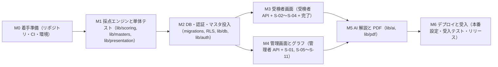
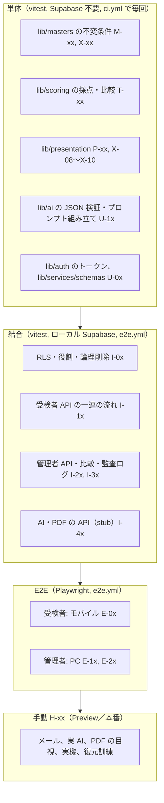
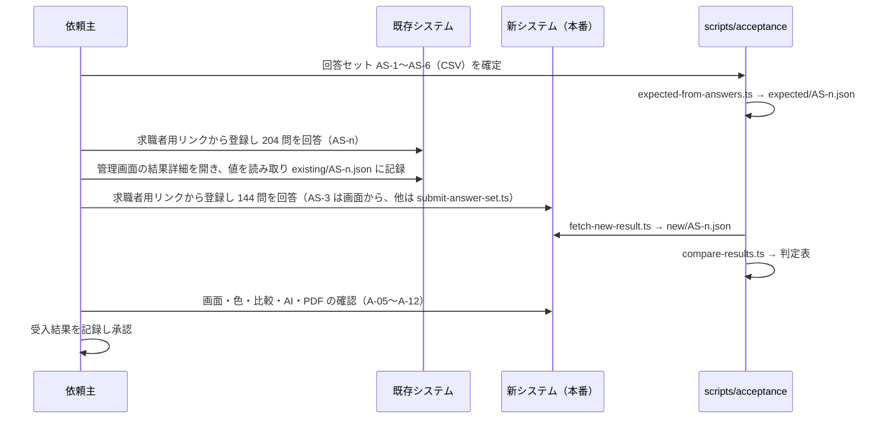
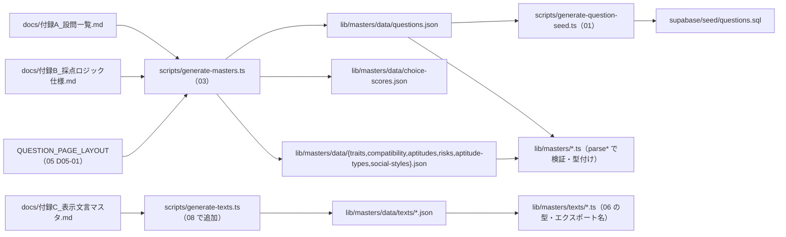

# 基本設計 08 実装計画とテスト計画

| 項目 | 内容 |
|---|---|
| 文書名 | 適性検査システム 基本設計 08 実装計画・テスト計画・受入 |
| 版 | 1.2 |
| 作成日 | 2026-09-18（1.1 版: 2026-09-21、1.2 版: 2026-09-21 最終点検。§11） |
| 対象 | 実装者（全担当）、テスト担当、依頼主（マイルストーンの確認、受入テストの実施、準備物の用意） |

## 0. 本書の位置づけ

本書は、基本設計 00〜07 で定めた仕様を **どの順序で実装し、どう検証し、どの基準で受け入れるか** を定めるものです。実装の内容（DDL、型、API の入出力、画面）は各分冊が正であり、本書はそれらを再定義しません。本書が定めるのは次の 7 点です。

1. マイルストーン M1〜M6 の成果物、PR 分割、完了条件、依頼主の確認ポイント（§1、§2）
2. テスト戦略（単体・結合・E2E・手動）と、各分冊から引き渡されたテスト観点の集約・採番（§3）
3. `tests/verify_fixtures.py` の移植と、合成回答による採点テストの位置づけ（§3.6、§3.7）
4. 既存システムとの突き合わせによる受入テストの手順と、不具合修正により意図的に異なる箇所（§4）
5. 依頼主が用意するものと期限（§5）
6. リスクと対策（§6）
7. マスタデータ（付録A・付録B・付録C）を機械生成する手順（§7）とリリース手順（§8）

本書が定めないもの（参照のみ）: システム構成・CI の定義そのもの（01 分冊）、DDL・RLS（02 分冊）、採点式（03 分冊）、API の入出力（04 分冊）、画面（05・06 分冊）、AI 解説と PDF の生成方式（07 分冊）。1.0 版は 07 分冊と同時に執筆したため 07 の確定を待つ箇所を仮置きしていましたが、1.1 版では 07（構造化出力 D07-06、配列長の受け入れ D07-07、stub の不正 JSON モード D07-24、フォント配置 D07-20、Storage 不使用 D07-21、PDF 方式 D07-16、AI 解説の PDF 掲載 D07-15、テスト観点 AI-01〜AI-09・PDF-01〜PDF-08）と 01（1.1 版）・02（1.1 版）・04（1.1 版）・05（1.1 版）の確定内容に合わせて改版しました。残る依頼は §9 に「依頼」として明示します。

### 0.1 参照した要件

| 参照元 | 参照した内容 |
|---|---|
| 要件定義書 §5、§6.1〜§6.6 | 業務フロー、機能要件 U-01〜U-09、A-01〜A-13、採点の骨子、文言、視覚化、AI 解説（受入項目の母体） |
| 要件定義書 §9 | 非機能要件（性能「採点 2 秒以内」「結果詳細 1〜2 リクエスト」、対応端末、PDF）。性能テストと手動確認の根拠 |
| 要件定義書 §11 | 既存不具合 10 件と新システムでの方針。受入テストで「意図的に異なる箇所」を先に示す根拠 |
| 要件定義書 §12 | 未確認事項。手戻りリスク（§6）と依頼主確認ポイントの根拠 |
| 要件定義書 §13 | 根拠一覧。既存システムの値は「通信データ」から取得できたという事実（受入時の値の読み取り方法の根拠） |
| 付録A | 設問 204 問と逆引き表（マスタ生成の入力） |
| 付録B §1〜§10、§12、§13 | 配点表・全計算式・同点処理・比較計算・立ち位置・欠陥・旧ロジック混在（マスタ生成の入力、採点テストの期待値の根拠、受入で比較できない項目の根拠） |
| 付録C §1〜§8 | 文言と出し分け条件（文言マスタ生成の入力、画面受入の根拠） |
| 付録D §1〜§3 | AI 解説の入出力・JSON スキーマ・プロンプト（AI の単体テスト、受入で比較しない根拠） |
| 付録E §1〜§7 | グラフ設定値、ゲージ色、PDF（グラフ受入の根拠） |
| tests/fixtures/README.md、tests/verify_fixtures.py | 検証用データ 73 件の内容、検証できること・できないこと、6 つのチェック（移植元） |
| 00 分冊 §1.11、§6、§8 | 不具合対応の共通ルールと担当、分冊の担当範囲、設計判断 D-01〜D-24 |
| 01 分冊 §3.4、§4.1、§4.3、§5.6、§6、§7.6、§9、§12 | ライブラリ（vitest、Playwright）、`package.json` のコマンド（`owner:create` を含む）、環境変数と起動時検証、`ci.yml`・`e2e.yml`・`db-migrate.yml`、初期オーナー作成手順（`scripts/create-owner.ts`）、監視・バックアップ、08 への引き渡し |
| 02 分冊 §7.2、§8、§10.3、§11、§14 | 組織と初期オーナーの作成、母集団取得関数、監査ログ、シードの検証（08 へ）、マイグレーション 16 本、設計判断 D02-xx |
| 03 分冊 §2.3、§4.4、§4.5、§5.10、§6、§7.7、§8.1、§10、§11 | 追加する型・関数、`chartOrder`、マスタ生成方針、値域表、不具合修正の反映点、検証用データの期待値、`lib/presentation/` の構成、テスト設計 T／M／P、08 への引き渡し |
| 04 分冊 §2.4、§4.2、§7、§8.1、§10 | エラーコード、電話番号の規則（D04-06）、長時間処理、`lib/services/`・`lib/auth/` のファイル構成、結合テストの観点 |
| 05 分冊 §10.3、§12、§13 | 登録の入力規則（`lib/utils/phone-number.ts`。D05-16）、受検者画面のテスト観点 T-01〜T-19、設計判断 D05-xx |
| 06 分冊 §4.2、§9、§10.6、§11、§12 | 文言マスタの型（`AptitudeTypeTexts`）、PDF との関係、マスタの不変条件 X-01〜X-10、テスト観点、設計判断 D06-xx |
| 07 分冊 §1.2、§2.3、§3.2、§3.4、§4.6、§5、§9、§10、§11、§12 | `lib/ai/` の構成、テンプレートの `{{…}}` 形式、zod スキーマ `AiAnalysisOutputSchema`、検証失敗の扱い、`AiFailureReason`、provider（stub の `model`・不正 JSON モード・`setAiProviderForTest`）、PDF（`lib/pdf/` の構成、フォント、CI の Chromium、`visibilityForMode`）、テスト観点 AI-01〜AI-09・PDF-01〜PDF-08、08 への引き渡し、設計判断 D07-xx |

### 0.2 決定事項との対応

| # | 決定事項 | 本書での対応 |
|---|---|---|
| 1 | Next.js + Supabase + Vercel、ApexCharts | M1〜M6 の実装順を、Supabase 非依存の純関数（`lib/scoring`、`lib/masters`）から着手し、DB・画面・外部連携へ広げる順にする（§1.1）。ApexCharts の版差分は M4 の最初に確認する（§6 R-08） |
| 2 | 既存不具合 10 件をすべて修正 | 不具合ごとに「確認するテスト ID」を対応付け（§3.8）、受入テストでは修正により既存と値が異なる箇所を先に一覧化する（§4.1） |
| 3 | 出題は Q1〜Q144 のみ | マスタ生成時の不変条件（§7.4）、単体 M-05／M-06、E2E で Q145 以降の文言が画面に出ないことを確認（§3.4 E-02） |
| 4 | 既存データは移行しない | 移行作業・移行テストを計画に含めない。受入は「同じ回答を両システムに入力して突き合わせる」方式（§4）。検証用データ 73 件はテストの入力としてのみ使う |
| 5 | AI 解説は Claude API、差し替え可能 | 単体・結合・E2E は `AI_PROVIDER=stub`（01 D01-07）で行い、実 API は Preview での手動確認と受入に限る（§3.5 H-03）。API キーの用意は M5 開始までに依頼（§5） |
| 6 | 日本語のみ、管理画面 PC 幅、受検者画面スマートフォン対応 | Playwright のプロジェクトを PC（1440×900）とモバイル（iPhone 相当）に分ける（§3.4）。実機確認を手動項目にする（§3.5 H-05） |

## 1. 実装計画の全体像

### 1.1 マイルストーンと依存関係



| マイルストーン | 主な成果物 | 主担当分冊 | 先行条件 |
|---|---|---|---|
| M0 着手準備 | リポジトリ骨組み、`ci.yml`、ローカル環境手順、PR テンプレート | 01 | 依頼主の GitHub 準備（§5） |
| M1 採点エンジンと単体テスト | `lib/scoring/`、`lib/masters/`（生成物を含む）、`lib/presentation/` の純関数部分、単体テスト一式 | 03、06（色・丸め）、08 | M0 |
| M2 DB・認証・マスタ投入 | `supabase/migrations/`、`seed/questions.sql`、`lib/db/`、`lib/auth/`、結合テスト基盤、検証用 Supabase へのマイグレーション適用 | 02、01 | M1（`questions.ts` が正） |
| M3 受検者画面 | 受検者 API、`app/(respondent)/`、`components/respondent/`、受検者 E2E | 04、05 | M2 |
| M4 管理画面とグラフ | 管理者 API、文言マスタ、`components/charts/`、`app/(admin)/`、管理者 E2E | 04、06 | M2（M3 と並行可） |
| M5 AI 解説と PDF | `lib/ai/`、`lib/pdf/`、印刷用ページ、AI／PDF の API と画面連携 | 07、04、06 | M3、M4 |
| M6 デプロイと受入 | 本番設定、受入テスト用スクリプト、受入テストの実施と記録、リリース | 01、08 | M5 |

- 設計判断 D08-01: M3 と M4 は M2 完了後に並行して進めます。両者は `lib/services/` と `app/api/v1/` の別ディレクトリ（`respondent/` と `admin/`）を触るため衝突が少なく、共通部分（`lib/auth/`、`lib/services/errors.ts`、`lib/services/audit.ts`、Route Handler の共通ラッパー `handle()`（`lib/services/http.ts`。04 §2.10、§8.1、D04-14））は M2 の最後の PR で先に入れます。
- 設計判断 D08-02: M5 は AI と PDF を同じマイルストーンにまとめますが、PR は分けます。PDF は M4 の画面部品に依存し、AI は M4 の結果詳細への表示に依存するため、どちらも M4 完了後に着手します。

### 1.2 進め方の共通ルール（PR 単位）

01 §6.1 のブランチ運用と PR 必須条件を前提に、本書は PR の粒度と「完了の定義」を定めます。

| ルール | 内容 |
|---|---|
| 粒度 | 1 PR = §2 の表の 1 行。差分の目安は 1,500 行以内（生成物・テストデータを除く）。超える場合は分割する |
| ブランチ名 | `feature/m{番号}-{短い説明}`（例: `feature/m1-scoring-engine`）。不具合修正は `fix/{説明}` |
| PR テンプレート | 01 §6.1 の項目（変更概要、影響する分冊、マイグレーションの有無、環境変数の追加有無、テスト方法、不具合 10 件への影響）に加え、本書の **「対応するテスト ID」** と **「依頼主確認事項（D-xx）への影響」** を記載する |
| 完了の定義（Definition of Done） | (1) `ci.yml` 合格（lint／format／typecheck／unit／build）、(2) その PR が担当するテスト ID がすべて実装され合格、(3) 画面に触れる PR は `run-e2e` ラベルで `e2e.yml` を実行し合格（01 §6.3）、(4) レビュー 1 名以上の承認、(5) 設計書からの逸脱があれば該当分冊の改版 PR を先に出す（00 §0） |
| 生成物 | `lib/masters/data/*.json`、`supabase/seed/questions.sql`、`lib/db/database.types.ts` は生成してコミットする。CI で「再生成しても差分がない」ことを検査する（§7.6） |
| 個人情報 | テストデータ・スクリーンショット・PR 本文に実在の氏名・電話番号・メールアドレスを入れない。受検者名は「受入テスト AS-1」のような識別用文字列にする |
| マイルストーンの完了 | §2 の完了条件をすべて満たし、依頼主の確認ポイントに回答（承認または変更指示）が得られた時点。変更指示は次のマイルストーンの最初の PR で反映する |

### 1.3 分冊と PR の対応（早見表）

| 分冊 | 実装される主な PR |
|---|---|
| 01 構成 | PR-0.1〜PR-0.3、PR-2.5、PR-6.1 |
| 02 DB | PR-2.1〜PR-2.4 |
| 03 採点 | PR-1.2〜PR-1.4 |
| 04 API | PR-2.4、PR-3.1、PR-4.1、PR-5.2、PR-5.4 |
| 05 受検者画面 | PR-3.2、PR-3.3 |
| 06 管理者画面 | PR-1.5、PR-4.2〜PR-4.7 |
| 07 AI・PDF | PR-5.1〜PR-5.5 |
| 08 本書 | PR-0.2（テスト基盤）、PR-1.4（fixtures 移植）、PR-6.2（受入ツール）、PR-6.3 |

## 2. マイルストーン詳細

各マイルストーンについて、PR 単位の成果物、完了条件、依頼主の確認ポイントを示します。「テスト ID」は §3 の採番です。

### 2.1 M0 着手準備

| PR | 内容 | 主な成果物 | テスト ID |
|---|---|---|---|
| PR-0.1 | リポジトリ骨組み | `package.json`（01 §3.4 の雛形）、`.nvmrc`、`tsconfig.json`（`strict`）、ESLint／Prettier 設定（01 §3.5）、`.env.example`（01 §4.5）、`lib/utils/env.ts`、`scripts/check-env.ts`、`README.md`（01 §11 のセットアップ手順） | — |
| PR-0.2 | テスト基盤 | `vitest.config.ts`（§3.1.2）、`playwright.config.ts`（§3.4.1）、`tests/{unit,integration,e2e,fixtures}/` の空構成と最小の合格テスト 1 本ずつ | — |
| PR-0.3 | CI | `.github/workflows/ci.yml`（01 §6.2）、`e2e.yml`（01 §6.3 に §3.4.2 の読み替えステップを追加）、`db-migrate.yml`（01 §6.4）、`dependabot.yml`、PR テンプレート（§1.2） | — |

完了条件:

- 空の Next.js アプリが `pnpm ci` と `pnpm build` に合格し、Vercel の Preview デプロイが作成される（環境変数は 01 §6.2 のダミー値で可）。
- `main` の Branch protection が有効で、`ci / check` が必須チェックになっている（01 §7.1）。

依頼主の確認ポイント:

- §5 の「M0 まで」の準備物（GitHub、Vercel）の完了。
- 本書 §2 のマイルストーンと確認ポイントの一覧そのものの承認（以降の確認の進め方）。

### 2.2 M1 採点エンジンと単体テスト

| PR | 内容 | 主な成果物 | テスト ID |
|---|---|---|---|
| PR-1.1 | 型と定数 | `lib/scoring/types.ts`（00 §3.4 をそのまま）、`lib/scoring/version.ts`、`lib/masters/types.ts`（00 §3.5）、03 §2.3 の追加型・エラー型 | — |
| PR-1.2 | マスタ生成 | `scripts/generate-masters.ts`（03 §4.5、本書 §7.3）、生成物 `lib/masters/data/*.json`、`lib/masters/validate.ts`、`lib/masters/{questions,choice-scores,occupations}.ts`、`lib/masters/indicators/*.ts` | M-01〜M-08、§7.6 の再生成検査 |
| PR-1.3 | 採点 | `lib/scoring/evaluate.ts`、`compute-*.ts`、`validate-answers.ts`、`score.ts`（03 §5） | T-01〜T-09b、T-10、PF-01 |
| PR-1.4 | 比較と検証用データ | `lib/scoring/compare.ts`（03 §7）、`tests/unit/scoring/fixture-adapter.ts`、`tests/unit/scoring/fixtures.test.ts`（§3.6） | T-10b〜T-14、PF-02 |
| PR-1.5 | 表示用の純関数 | `lib/presentation/{rounding,negative-values,colors,trait-highlights,chart-series,comparison-scope-params,exam-pages}.ts`（03 §8.1・§8.3・§8.4・§9、06 §5、§6.8、§10.2、05 §10.1。`negative-values.ts` の `clampForSlider`／`clampPercent` は P-04 と 07 §2.3 の AI 入力整形が使う） | P-01〜P-04、X-08〜X-10、05/T-01 |

完了条件:

- `pnpm test`（unit プロジェクト）が全件合格し、`lib/scoring` と `lib/masters` が `next`・`@supabase/*` を import していない（01 §3.5 の `no-restricted-imports` が有効）。
- 03 §10.4〜§10.7 の期待値（全問同一回答 5 種、周期回答、検証用データ 73 件）をすべて再現する。
- `scoreAnswers` 1 件あたり平均 5 ms 未満、`compareWithPopulation`（母集団 1,000 件）10 ms 未満（03 §10.9）。
- 生成 JSON の `sourceHash`（§7.6）が付録A・付録B の現在の内容と一致する。

依頼主の確認ポイント（M1 で確認するもの）:

| ID | 内容 | 判断が必要な理由 |
|---|---|---|
| D-03 | 16 タイプ得点の同点時の優先順位（付録B §6 の表の順） | 要件定義書・付録に記載なし |
| D-21 | ソーシャルスタイル同点時の Expressive と Analytical の順 | 付録B §7 で判別不能 |
| D3-04 | 自己実現型の式で Q13 が 2 回出現する点をそのまま保持する | 既存の編集痕跡と推定。修正すると既存の出力と変わる |
| D3-05 | 全 16 尺度を 0〜30 として扱う | 付録B §2 冒頭の記述との差 |
| 設問文 | 付録A の設問文（表記ゆれ・誤字を含む）をそのまま使う | 03 §4.3。修正は依頼主判断 |
| 報告 | 全問同一回答・周期回答の採点結果表（03 §10.4〜§10.5）を提出し、既存システムの理解と矛盾がないか確認してもらう | 受入前に計算式の解釈を早期に固定する |

### 2.3 M2 DB・認証・マスタ投入

| PR | 内容 | 主な成果物 | テスト ID |
|---|---|---|---|
| PR-2.1 | スキーマ | `supabase/migrations/`（02 §11 の 01〜16 の 16 本。§11.17 の Storage マイグレーションは 07 D07-21 により作成しない）、`supabase/config.toml`、`scripts/generate-question-seed.ts`（01）、`supabase/seed/questions.sql`（生成物）、ローカル専用 `supabase/seed.sql`（01 §11 の SQL。`raw_app_meta_data` 付きの `auth.users` 行）、`lib/db/database.types.ts`（生成物） | I-01、I-02 |
| PR-2.2 | DB アクセス層 | `lib/db/{server-client,service-client,browser-client}.ts`（01 §5.5）、`lib/db/mappers/`、`lib/db/repositories/`（04 §8.4） | U-01（mappers の往復） |
| PR-2.3 | 認可 | `lib/auth/{admin-context,respondent-token,respondent-session,password-check,pdf-token}.ts`（04 §2.5、§5.1、§7.2、§8.1）、`middleware.ts`（04 §8.5。`/admin/results/*/print` を除外） | U-02、I-03〜I-06 |
| PR-2.4 | 共通基盤 | `lib/services/{http,errors,audit,rate-limit}.ts`（04 §2.4、§2.6、§2.8、§2.10。`handle()`／`readJson`／`json`／`requestMeta` は `http.ts`）、`lib/services/schemas/{common,respondent,admin-account,admin-results,admin-respondents,auth}.ts`（zod。04 §2.3、§8.1）、`lib/utils/phone-number.ts`（05 D05-16。04 の `respondent.ts` と 05 の `registration-rules.ts` が共有）、結合テストのヘルパー（§3.3.2） | I-07、I-08 |
| PR-2.5 | 検証環境 | `scripts/create-owner.ts`（`pnpm owner:create`。01 §3.4、§7.6、02 §7.2）、`db-migrate.yml` を `staging` で実行し、検証用 Supabase にスキーマとシードを適用。Vercel Preview の環境変数を検証用に設定 | I-09、H-01 |

完了条件:

- ローカル `supabase db reset` でマイグレーション 16 本（02 §11）とシードが成功し、`questions` が 204 行、`is_active = true` が 144 行（02 §10.3）。
- 結合テスト I-01〜I-09 が合格（RLS の組織分離、役割差、論理削除の不可視、監査ログの自己挿入制約、`owner:create` によるオーナー作成）。
- Supabase ダッシュボードの Advisors で RLS の警告がゼロ（01 §9.1）。
- 検証用プロジェクトで `provision_organization()`（SQL）と `pnpm owner:create`（01 §7.6、02 §7.2）により初期オーナーを作成し、recovery メールからのパスワード設定後に Auth ログインが成立する（画面はまだ無いため Supabase の SDK で確認）。検証用プロジェクトに対する `owner:create` の実行は 01 §3.4 のとおり依頼主または運用責任者が行う（実装者はローカル Supabase に対してのみ実行する）。

依頼主の確認ポイント:

| ID | 内容 |
|---|---|
| D02-04、D01-29、01 §7.6 | 組織は SQL（`provision_organization()`）で、初期オーナーは運用スクリプト `pnpm owner:create`（`scripts/create-owner.ts`。サービスロール）で作成し、本番・検証プロジェクトに対しては依頼主または運用責任者が実行する手順の承認。Supabase ダッシュボードの「Add user」は使えない（トリガーが `INVITE_TOKEN_REQUIRED` で失敗する。01 §5.6） |
| D02-10、D02-17、D02-31 | 論理削除の物理削除 180 日後（`purge_deleted_respondents()`）、放置された下書きの物理削除はトークン失効後 30 日（`purge_abandoned_sessions()`。02 §8.5）、監査ログは本フェーズ無期限（01 §9 と同じ。短縮は依頼主判断） |
| D01-14、D01-08 | Supabase Pro、本番・検証の 2 プロジェクト構成 |
| D-05、D-06 | 母集団に本人・幹部を含める（DB 関数 `fetch_population()` の条件として実装される。02 §8.4） |
| D04-10／D05-09 | 受検者トークンの有効期限 7 日・保存のたびに延長 |

### 2.4 M3 受検者画面

| PR | 内容 | 主な成果物 | テスト ID |
|---|---|---|---|
| PR-3.1 | 受検者 API | `app/api/v1/respondent/**`（04 §4）、`lib/services/{organization-lookup,respondent-registration,session-progress,answer-saving,submission}.ts`（04 §8.1 のファイル名。D04-52）、`lib/services/dto/respondent.ts`、RPC `register_respondent()`・`finalize_assessment_session()` の呼び出し、レート制限（`rate-limit.ts`。04 §2.8） | I-10〜I-18、PF-03 |
| PR-3.2 | 画面 | `app/(respondent)/exam/**`、`components/respondent/*`（05 §3、§5）、`lib/presentation/{exam-choices,registration-rules,exam-texts}.ts`（05 §10。`registration-rules.ts` は `lib/utils/phone-number.ts` を再エクスポートし規則を再定義しない。D05-16）、`lib/auth/respondent-page-guard.ts`（05 §10.6、D05-37） | U-03、05/T-03〜T-07 の単体部分 |
| PR-3.3 | E2E | `tests/e2e/respondent/*.spec.ts`（§3.4.3 E-01〜E-04） | E-01〜E-04、05/T-08〜T-19 |

完了条件:

- 受検者が登録 → 開始 → 20 ページ（144 問）→ 送信 → 完了画面まで進め、`results` に 1 行、`usage_logs` に 1 行、`audit_logs` に `respondent.register`・`session.start`・`session.submit` が記録される。
- 送信 API の所要時間（登録から送信応答まで、ローカル Supabase）が 2 秒以内（PF-03）。
- モバイルビューポートの E2E（E-01〜E-04）が合格し、幅 320px で横スクロールがない（05/T-17）。
- 依頼主が Preview URL をスマートフォン実機で通しで受検できる（H-05 の前倒し。Preview は Deployment Protection で保護されるため、依頼主を Vercel チームに招待する。01 §7.2）。

依頼主の確認ポイント:

| ID | 内容 |
|---|---|
| D-08／D05-01 | 144 問を 4 ステップ × 5 ページ（7・7・7・7・8 問）に割り当てる |
| D05-03 | 未回答があれば「次へ」を無効化し、飛ばして進む手段を設けない |
| D04-06、D05-16 | 電話番号の検証規則。正は 04 §4.2 の `normalizePhoneNumber`（全角→半角、ハイフン類・括弧の正規化、空白除去）と `PHONE_PATTERN = ^[0-9+()\-]{8,20}$`（国際形式・括弧付きも受理。D04-06 の仮置き）。05 D05-16 は同じ実装（`lib/utils/phone-number.ts`）を共有する |
| D05-18〜D05-22 | 見出し「受検者登録」への統一、「クリック」文言、同意文の有無、配色・サイト名 |
| D-15／D05-13 | 完了画面は固定文言のみ、完了メールは送らない |
| D-16／D05-10 | 中断・再開は同一端末・同一ブラウザに限る |

### 2.5 M4 管理画面とグラフ

| PR | 内容 | 主な成果物 | テスト ID |
|---|---|---|---|
| PR-4.1 | 管理者 API | `app/api/v1/admin/**`（04 §5）、`app/auth/{callback,invite}/route.ts`（04 §6）、`lib/services/{admin-account,result-list,result-detail,comparison,respondent-management,classification,usage-log-list,invite-acceptance}.ts`（04 §8.1 のファイル名。D04-52）、`lib/services/dto/{admin,result}.ts` | I-20〜I-35 |
| PR-4.2 | 文言マスタ | `scripts/generate-texts.ts`（§7.4）、生成物 `lib/masters/data/texts/*.json`、`lib/masters/texts/*.ts`（06 §4.1 のエクスポート名・型）、`lib/presentation/resolve-*.ts`（06 §4.4） | X-01〜X-07、U-04 |
| PR-4.3 | グラフ部品 | `components/charts/{TraitRadar,AptitudeRadar,SocialStyleRadar,DonutGauge,CompatSlider,GradeLetter}.tsx`（06 §6） | U-05（コンポーネント単体、06 §11） |
| PR-4.4 | 認証画面と一覧 | `app/(admin)/admin/{login,signup,password-reset}/page.tsx`、`app/(admin)/admin/page.tsx`（06 §3.1〜§3.4）、共通レイアウト（06 §2.3） | E-10、E-11 |
| PR-4.5 | 結果詳細 | `app/(admin)/admin/results/[resultId]/page.tsx` とセクション部品（06 §3.5）、比較組織の選択、ポップアップ S-11 | E-12〜E-15 |
| PR-4.6 | 組織内分類・アカウント | `app/(admin)/admin/{classification,account}/page.tsx`（06 §3.6、§3.7）、利用履歴ポップアップ S-09 | E-16、E-17 |
| PR-4.7 | E2E | `tests/e2e/admin/*.spec.ts`（§3.4.3 E-10〜E-18） | E-10〜E-18 |

完了条件:

- 結合テスト I-20〜I-32 が合格（幹部データの可視性、比較 API の非永続化、母集団の条件、`POPULATION_EMPTY`、監査ログ）。
- 結果詳細の初期表示が Server Component の 1 回のデータ取得で描画され、比較は `GET …/comparison` 1 本で完結する（PF-04。要件定義書 §9）。
- E2E E-10〜E-18 が 1440×900 で合格し、信頼係数 90% のゲージが緑系・リスク 90% が赤であることを DOM で確認する（06 §11、要件定義書 §11 の 5 番）。
- 付録E §2 の ApexCharts 設定キーが採用版で同じ意味で動くことを確認済み（01 D01-25、§6 R-08）。

依頼主の確認ポイント:

| ID | 内容 |
|---|---|
| D-09、D06-04 | 合致度の色は既存どおり、信頼係数は上位 2 段階を緑系に置き換える（Preview の実画面で確認してもらう） |
| D-07、D06-14 | 相性が負値のときは左端に表示し注記を出す |
| D06-03 | 指標色の具体値。ブランド色があれば置換 |
| D-13、06 §7 | イラスト 45 枚（16 タイプ・16 キャラクター・4 資質・4 スタイル・5 立ち位置）。届くまでは仮画像（§5） |
| D04-32／D06-18 | 組織内分類の人数に除外者を含める |
| D04-23 | パスワード変更に現在のパスワードを必須にする |
| D06-06、D02-06 | 幹部データはオーナーの一覧に区分列付きで混在表示し、`admin` には存在自体を見せない |
| D06-10 | 偏差値の数値を立ち位置の近くに表示する |
| D01-23／D06-22 | パスワード再設定・招待メールの日本語テンプレート文言 |

### 2.6 M5 AI 解説と PDF

| PR | 内容 | 主な成果物 | テスト ID |
|---|---|---|---|
| PR-5.1 | AI 連携 | 07 §1.2 のファイル構成: `lib/ai/{types,errors,schema,input,prompt-builder,provider}.ts`、`lib/ai/prompts/{index,recruitment-v1}.ts`、`lib/ai/providers/{anthropic,stub}.ts`（00 §3.6、01 D01-07）。AI 出力の zod スキーマは `lib/ai/schema.ts` の `AiAnalysisOutputSchema` と `parseAiOutputText()`（07 §3.2）の 1 箇所 | U-10〜U-13、U-15、U-16 |
| PR-5.2 | AI の API と画面 | `POST/GET …/ai-analysis`（04 §5.9、§7.1）、`lib/services/ai-analysis.ts`（04 §8.1。07 と共同）、結果詳細の AI 解説セクション（06 §3.5） | I-40〜I-44、I-48、E-20 |
| PR-5.3 | PDF 生成 | `lib/pdf/{types,errors,browser,render-result-pdf,templates,protection-bypass,visibility,print-url}.ts`（07 §9.8）、`lib/services/print-data.ts`（07 §9.4。07 が置く）、印刷用ページ `app/(admin)/admin/results/[resultId]/print/{page,layout}.tsx`（07 §9.4）、`components/pdf/PrintResultDocument.tsx`・`PrintReadyMarker`（07 §9.4、§9.6）、日本語フォント `public/fonts/NotoSansJP-{Regular,Bold}.woff2` の同梱（07 §9.7、D07-20。§6 R-03） | U-14、U-17、U-02（pdf-token） |
| PR-5.4 | PDF の API と画面 | `GET …/pdf`（04 §5.10、§7.2）、`lib/services/pdf-export.ts`（04 §8.1。07 と共同）、ダウンロードポップアップ S-10（06 §3.5.11） | I-45〜I-47、I-49、E-21 |
| PR-5.5 | E2E と手動確認 | `tests/e2e/admin/ai-and-pdf.spec.ts`、Preview での実 API・実 PDF の確認記録 | E-20、E-21、H-03、H-04、H-12、H-13 |

完了条件:

- `AI_PROVIDER=stub` で生成 → 保存 → 再表示 → 非表示が動き、`ai_analyses` に 1 行、`results.ai_generation_status = completed`。
- 実 API（Preview、検証用キー）で 3 件以上生成し、すべて `AiAnalysisOutputSchema`（07 §3.2。付録D §2 に対応）の検証に合格する。生成時間の中央値を記録し、60 秒を超える場合は非同期化の判断を 07 と行う（04 §7.1、07 §6.5）。
- PDF が A4 縦で 2 モード出力され、日本語が豆腐（□）にならない。`restricted` で評価・合致度・リスク（06 §3.5.11 の表）と AI 解説（07 D07-15）が出ず、立ち位置は出る（07 §9.5）。
- PDF 生成が Vercel Preview で 120 秒以内、関数のデプロイサイズが上限内で、`public/fonts/` が関数バンドルに含まれていない（01 §5.4、07 PDF-08。H-13）。

依頼主の確認ポイント:

| ID | 内容 |
|---|---|
| D-17、D07-08、D07-09 | 使用モデルと生成パラメータ（07 §4.1・§4.2 の提案: `claude-opus-5`、`max_tokens 16000`、適応思考、`effort high`、構造化出力。代替 `claude-sonnet-5` は依頼主判断）。月額上限（D01-15） |
| D-20、D07-03 | 付録D プロンプトの「コンタクター」を「コンダクター」に修正して転記する（07 が 1 語のみ修正で確定。依頼主に報告） |
| D07-04 | 付録D の「資質タイプ（各0〜100）」の記載をそのまま残し、100 超の値もそのまま渡す（07 §2.3） |
| D07-15 | AI 解説を `restricted` PDF に掲載しない（07 §9.5。06 §3.5.11 の「`restricted` でも掲載」提案は 07 が不採用。依頼主が「掲載する」と確認した場合は `visibilityForMode()` の 1 行で切り替える） |
| D06-26 | `restricted` PDF で立ち位置・偏差値を印字する（07 §9.5 も印字する前提） |
| D01-17 | AI 生成の組織あたり日次上限 200 回 |
| D-18、D07-17、D07-18 | PDF のレイアウト（結果詳細と同一構成を A4 縦に再配置。余白・レーダーサイズは実機確認で調整）。第二候補は第一候補に続けて印字することで確定（07 D07-18） |
| D07-12 | AI の拒否（refusal）に対するサーバ側フォールバックを本フェーズでは使わない（周知） |
| 出力の確認 | 実 API の生成結果 3 件を依頼主が読み、免責表示（付録D §1）とあわせて内容が許容範囲か確認する |

### 2.7 M6 デプロイと受入

| PR | 内容 | 主な成果物 | テスト ID |
|---|---|---|---|
| PR-6.1 | 本番設定 | セキュリティヘッダー（01 §8.7）、レート制限（01 §8.4）、`NEXT_PUBLIC_APP_BASE_URL` などの Production 環境変数の設定手順、本番 Supabase の Auth 設定（01 §7.4）の確認 | H-06〜H-09 |
| PR-6.2 | 受入ツール | `tests/fixtures/acceptance/`（回答セット）、`scripts/acceptance/{submit-answer-set,compare-results,expected-from-answers}.ts`（§4.4） | A-01〜A-12 の実施に使用 |
| PR-6.3 | 運用文書 | `docs/運用/`（初回リリース手順 §8.1、通常リリース §8.2、ロールバック §8.3、月次点検 01 §9.1、初期オーナー作成（`pnpm owner:create` の実行手順。01 §7.6 を運用者向けに転記）、招待トークン再発行、物理削除の実行） | — |
| PR-6.4 | 受入指摘の修正 | 受入テストで見つかった不具合の修正（複数 PR） | 該当テスト ID の追加・修正 |

完了条件:

- §4 の受入テスト A-01〜A-12 がすべて合格し、「意図的に異なる箇所」（§4.1）以外の差異がない。
- 本番環境で初期オーナーがログインでき、アカウント画面の 3 種のリンクが本番ドメインで表示される（01 §7.8 の 8）。
- 検証用プロジェクトでバックアップからの復元を 1 回試した記録がある（01 §9.3、H-09）。
- §5 の依頼主準備物がすべて揃い、01 §7.8 のチェックリストが完了している。

依頼主の確認ポイント:

- 受入テストの結果表（§4.6 の形式）への署名（承認）。
- 本番リリース日時と、リリース後 1 週間の運用体制（問い合わせ先、監視の担当）。

## 3. テスト戦略

### 3.1 全体方針とテストの配置



| 種別 | 実行環境 | 実行タイミング | 目標 |
|---|---|---|---|
| 単体 | Node のみ（`vitest --project unit`） | すべての push（`ci.yml`） | 数秒で完了。`lib/` の純関数を網羅 |
| 結合 | ローカル Supabase（Docker）+ Next.js の Route Handler を直接呼ぶ（`vitest --project integration`） | `run-e2e` ラベル付き PR と `main`（`e2e.yml`）、および開発者のローカル | API 契約・RLS・トランザクション・監査ログ |
| E2E | ローカル Supabase + `next build && next start` + Playwright | 同上 | 画面遷移・表示・色・二重送信などブラウザでしか確認できないもの |
| 手動 | Vercel Preview（検証用 Supabase、実 API キー）と本番 | マイルストーン完了時、受入時 | メール、実 AI、PDF の見た目、実機、復元 |

#### 3.1.1 テスト ID の体系

各分冊が定めたテスト観点をそのまま使い、本書で追加するものに新しい接頭辞を付けます。分冊の ID を引用するときは分冊番号を前置します（`03/T-06`、`05/T-11`、`06/X-08`）。

| 接頭辞 | 種別 | 定義元 |
|---|---|---|
| `M-`、`T-`、`P-` | 単体（マスタ、採点・比較、表示） | 03 §10.3〜§10.8 |
| `X-` | 単体（文言マスタ・色・URL 変換・系列） | 06 §10.6 |
| `05/T-` | 受検者画面（単体または E2E） | 05 §12 |
| `07/AI-`、`07/PDF-` | AI 解説・PDF の観点（07 が定義。本書の `U-`／`I-`／`E-`／`H-` に採番して実装する。対応表は §3.2.1） | 07 §10 |
| `U-` | 単体（本書で追加。`lib/db/mappers`、`lib/auth`、`lib/ai`、`lib/pdf`、`lib/services/schemas`、コンポーネント） | 本書 §3.2 |
| `I-` | 結合 | 本書 §3.3 |
| `E-` | E2E | 本書 §3.4 |
| `H-` | 手動 | 本書 §3.5 |
| `PF-` | 性能 | 本書 §3.9 |
| `A-` | 受入 | 本書 §4 |

#### 3.1.2 `vitest.config.ts`

01 §3.4 の `--project unit` / `--project integration` に対応する設定です。

```ts
// vitest.config.ts
import { defineConfig } from "vitest/config";
import path from "node:path";

export default defineConfig({
  resolve: { alias: { "@": path.resolve(__dirname, ".") } },
  test: {
    projects: [
      {
        extends: true,
        test: {
          name: "unit",
          include: ["tests/unit/**/*.test.ts", "tests/unit/**/*.test.tsx"],
          environment: "node",
          environmentMatchGlobs: [["tests/unit/components/**", "jsdom"]],
        },
      },
      {
        extends: true,
        test: {
          name: "integration",
          include: ["tests/integration/**/*.test.ts"],
          environment: "node",
          globalSetup: ["tests/integration/setup/global-setup.ts"],
          setupFiles: ["tests/integration/setup/per-file.ts"],
          fileParallelism: false,   // 同じローカル DB を使うため直列
          testTimeout: 30_000,
        },
      },
    ],
    coverage: {
      provider: "v8",
      include: ["lib/**"],
      thresholds: { "lib/scoring/**": { lines: 100, branches: 95 }, "lib/masters/**": { lines: 95 } },
    },
  },
});
```

- 設計判断 D08-03: カバレッジの閾値は `lib/scoring` と `lib/masters` にだけ設けます（採点式の分岐漏れを検知するため）。画面・API は E2E と結合で担保し、行カバレッジを目標にしません。
- `environmentMatchGlobs` により、コンポーネント単体（U-05）だけ jsdom で動かします。ApexCharts は jsdom で描画できないため、コンポーネント単体では「渡した options と series が付録E §2 のキーに一致すること」だけを検証し、描画は E2E で確認します（06 §11）。

### 3.2 単体テスト

#### 3.2.1 分冊から引き継ぐもの（採番済み）

| 分冊 | ID | 対象ファイル（`tests/unit/`） | 備考 |
|---|---|---|---|
| 03 | M-01〜M-08 | `masters/*.test.ts` | §7.6 の再生成検査と同じ不変条件 |
| 03 | T-01〜T-09b、T-10 | `scoring/score.test.ts`、`scoring/validate-answers.test.ts`、`scoring/property.test.ts` | T-10 は固定シードの乱数 1,000 件 |
| 03 | T-10b〜T-14 | `scoring/fixtures.test.ts`、`scoring/compare.test.ts` | §3.6 |
| 03 | P-01〜P-04 | `presentation/*.test.ts` | |
| 06 | X-01〜X-10 | `masters/texts.test.ts`、`presentation/colors.test.ts`、`presentation/comparison-scope-params.test.ts`、`presentation/chart-series.test.ts` | X-07 は §7.4 の生成物と付録C の照合を兼ねる |
| 05 | 05/T-01 | `presentation/exam-pages.test.ts` | `getExamPage` の全ページ（7・7・7・7・8 × 4 = 144、Q145 以上を含まない） |

07 §10 の観点（AI-01〜AI-09、PDF-01〜PDF-08）は本書の ID に次のとおり採番します（07 §11 の「08（テスト）」宛て引き渡しへの回答）。

| 07 の ID | 本書の ID | 種別 | 備考 |
|---|---|---|---|
| AI-01 | H-12 | 手動（実装初期に 1 回） | `client.models.list()` と §4.2 のパラメータでの疎通 |
| AI-02 | H-12 | 手動 | `countTokens` の実測。07 §8.2 の概算の置き換え |
| AI-03 | U-11 | 単体 | `buildMessages` のスナップショット |
| AI-04 | U-15 | 単体 | プロンプト定数と付録D の差分 |
| AI-05 | U-10 | 単体 | `AiAnalysisOutputSchema` と `parseAiOutputText()` |
| AI-06 | U-16 | 単体 | Anthropic provider（SDK の `fetch` モック） |
| AI-07 | U-12 | 単体 | stub provider |
| AI-08 | I-40、I-43 | 結合 | `ai_analyses` の列、失敗時の非 INSERT |
| AI-09 | I-48 | 結合 | ログに氏名・生テキスト・API キーが出ない |
| PDF-01 | E-21 | E2E | ダウンロードとファイル名 |
| PDF-02 | H-04 | 手動 | 日本語・レイアウト・色の目視 |
| PDF-03 | U-14、E-21 | 単体、E2E | `visibilityForMode` と PDF テキスト抽出 |
| PDF-04 | I-47 | 結合 | 印刷用ページの認可（管理者 Cookie だけでは開けないことを含む） |
| PDF-05 | I-46 | 結合 | 母集団 0 件で 409（Chromium を起動しない） |
| PDF-06 | U-17 | 単体（`launchBrowser` をモック） | 失敗時の `reason` と `browser.close()` |
| PDF-07 | I-49 | 結合 | `PDF_CHROMIUM_EXECUTABLE_PATH` 未設定時の挙動 |
| PDF-08 | H-13 | 手動（Preview のビルドログ） | 関数サイズと `public/fonts/` がバンドル外であること |

#### 3.2.2 本書で追加するもの（U-xx）

| ID | 対象 | 検証内容 | 期待 |
|---|---|---|---|
| U-01 | `lib/db/mappers/` | `ScoreResult` → `results` 行（`trait_*`…55 列）→ `ScoreResult` の往復で深い等価。`PopulationMember` への写像が `trait_*`・`compat_*` だけを読む。`ComparisonResult` → `ComparisonDto` が値を丸めない | 03 §11、04 §8.4 |
| U-02 | `lib/auth/pdf-token.ts` | `issuePdfToken` → `verifyPdfToken` の往復、`exp` 経過で失敗、署名改ざんで失敗、`scope` の有無で往復可能。失敗は `ApiError(404, NOT_FOUND)` | 04 §7.2 |
| U-03 | `lib/utils/phone-number.ts`、`lib/presentation/registration-rules.ts`、`exam-choices.ts` | 氏名 1〜100 文字（コードポイント単位）・改行不可、`normalizePhoneNumber`（前後空白除去 → 全角数字を半角 → ハイフン類 `－‐‑–—ー` を `-` → 全角括弧を半角 → 空白除去）の結果が `PHONE_PATTERN = ^[0-9+()\-]{8,20}$` で判定されること（`０３－１２３４－５６７８` → `03-1234-5678` 受理、`+81 3 1234 5678` 受理、7 桁・21 桁・英字混じりは拒否）、`registration-rules.ts` が同モジュールを再エクスポートし規則を再定義しないこと、選択肢 5 件の表示順と `choice_code` の対応 | 04 §4.2・D04-06（規則の正）、05 §10.2、§10.3、D05-16（同一実装の共有）、D05-17 |
| U-04 | `lib/presentation/resolve-*.ts` | `resolveResultTexts` の代表ケース（付録C §2 のコンダクタータイプ表示例）、`populationNote(0/1/2)`、`formatPopulationLabel` | 06 §11 |
| U-05 | `components/charts/*` | `DonutGauge` の `strokeDasharray` が値に比例、負値と 100 超のクランプ、`CompatSlider` の負値注記、`GradeLetter(null)` の固定文言、`TraitRadar` の options が付録E §2 のキー（`type: radar`、`yaxis.max = 30`、`yaxis.show = false`、`stroke.width = 5`、`stroke.curve = straight`、`fill.opacity = 0.5`、`markers.size = 5`、`legend.position = bottom`、`dataLabels.enabled = false`、`colors = [#00a2ff, #14f584]`、`animations.enabled = false`）と一致 | 06 §11、D06-21 |
| U-06 | `lib/services/schemas/` | 受検者登録・回答保存・比較クエリ・PATCH respondents の zod スキーマが、正常入力を受理し、不正入力（`kind` 不正、`choiceCode = 6`、`teamCode = "AA"`、`isExcluded = "yes"`）を `VALIDATION_ERROR` 相当で拒否する | 04 §2.3 |
| U-07 | `lib/services/errors.ts`、`lib/services/http.ts` の `handle()` | `ApiError` → JSON（`{ error: { code, message, details } }`）と HTTP ステータスの対応が 04 §2.4 の表と一致。予期しない例外は 500 `INTERNAL_ERROR` で `details` が空。応答に `X-Request-Id` が付く | 04 §2.4、§2.10、§8.1、D04-14 |
| U-08 | `lib/utils/env.ts` | 01 §4.3 の `serverEnv()` の検証をそのまま検査する: 必須変数の欠落で失敗、`AI_PROVIDER = anthropic` かつ `ANTHROPIC_API_KEY` 未設定で失敗、`VERCEL_ENV = production` かつ `AI_PROVIDER = stub` で失敗（`NODE_ENV` は判定に使わない）、`VERCEL_ENV = production` かつ `NEXT_PUBLIC_APP_BASE_URL` 未設定で失敗、`AI_PROMPT_VERSION` が `PROMPT_REGISTRY` に無い値で失敗、`VERCEL = "1"` かつ `PDF_CHROMIUM_EXECUTABLE_PATH` 設定で失敗。`appBaseUrl()` の優先順（`NEXT_PUBLIC_APP_BASE_URL` → `https://${VERCEL_URL}` → `http://localhost:3000`、末尾 `/` の除去） | 01 §4.3、D01-07、07 §2.2 |
| U-10 | `lib/ai/schema.ts`（`AiAnalysisOutputSchema`、`parseAiOutputText()`） | (1) 付録D §2 の例と 07 §5.4 の stub 出力が通る。(2) 拒否: `verdict` 3 種の enum 外の値、`summary` が空文字（空白のみを含む）、`strengths`／`cautions`／`questions` が 0 件、`levers` が 4 件でない・順序違い（`関わり方, 任せ方, 認め方, 伸ばし方` 以外の並び）・`label` 不正、余分なキー（トップレベル・`verdict`・`questions[]`・`levers[]` のいずれでも。`.strict()`）。(3) 受理: `strengths` 5 件・6 件、`cautions` 6 件、`questions` 8 件（付録D の個数指定より緩い上限。07 D07-07）。拒否: `strengths` 7 件、`questions` 9 件。(4) `parseAiOutputText()` がコードフェンス付きテキスト（`` ```json … ``` ``）、先頭が `{` でない前置き付きテキスト、末尾が `}` でないテキスト、構文不正な JSON、スキーマ不一致の JSON をすべて `AiProviderError("invalid_json")` で拒否し、例外メッセージに入力テキスト（氏名を含み得る）を含めない。(5) スキーマの定義が 1 箇所で、`zodOutputFormat(AiAnalysisOutputSchema)`（provider）と `parseAiOutputText()` が同じ定数を参照している | 07 §3.2、§3.4、D07-07、07/AI-05、付録D §2・§3「出力形式」 |
| U-11 | `lib/ai/prompt-builder.ts`、`lib/ai/input.ts`、`lib/ai/prompts/` | `buildMessages(input, "recruitment-v1")` が 03 §10.5 の T-06 の `ScoreResult` を入力として 07 §2.4 のユーザー入力とスナップショット一致する。テンプレートは `{{…}}` 形式で保持されるため、生成した `user` 文字列に未置換の `{{`／`}}` が残らない（付録D の山括弧は定数に無い）。整形規則（07 §2.3）: 信頼係数は四捨五入した整数、16 尺度は `formatStep`、ソーシャルスタイル・資質は末尾 0 除去（最大 2 桁）、相性・リスク・スタイルの負値は 0、資質の 100 超はそのまま、適性タイプは短縮名（`conductor` → `コンダクター`）、リスク 7 項目のラベルが `RISK_DEFINITIONS[].aiLabel`（00 §1.5）、資質は表示名（直感型…）、職業は `occupations.ts` の表示名。同じ入力で同じ文字列（純関数。日時・乱数を含めない） | 07 §2.3、§2.4、07/AI-03、付録D §3、00 §1.4、§1.5 |
| U-12 | `lib/ai/providers/stub.ts` | 決定的な `AiAnalysisOutput` を返し（同じ入力で同じ出力。`summary` の冒頭に `respondentName`、`cautions` の 1 件目に `result.risks` の最大項目名と値）、出力が U-10 のスキーマを通る。`rawText` が出力の `JSON.stringify`、`model` が `options.model`（`AI_MODEL` の値。`"stub"` 固定ではない）、`usage` が `null`、`stopReason` が `"end_turn"`、`name` が `"stub"`。`createStubProvider({ delayMs })` で遅延が変わる。`createStubProvider({ failWith: "timeout" })` が `AiProviderError("timeout")` を投げる（`AI_FAILURE_REASONS` の各値で確認）。`respondentName = "__INVALID_JSON__"`（`trim` 後）のとき `AiProviderError("invalid_json")` を投げる（不正 JSON モード。I-43 の前提） | 07 §5.4、D07-24、07/AI-07、01 D01-07 |
| U-13 | `lib/ai/provider.ts` | `getAiProvider()` が `AI_PROVIDER` に応じて `anthropic` / `stub` を返しキャッシュする。`anthropic` で `ANTHROPIC_API_KEY` が無ければ `AiProviderError("config_error")`。`setAiProviderForTest(provider)` で差し替え、`null` で解除できる。`signal` が中断済みなら provider が即座に `AiProviderError("timeout")` で失敗する | 07 §5.2、§4.6、04 §7.1、D04-38 |
| U-14 | `lib/pdf/visibility.ts`、印刷用ページのデータ整形 | `visibilityForMode("restricted", true)` が `{ showGrade: false, showMatchScore: false, showRisks: false, showPosition: true, showAiAnalysis: false }`、`visibilityForMode("full", true)` がすべて `true`、`visibilityForMode("full", false)` が `showAiAnalysis: false` で他は `true`（06 §3.5.11 の表 + 07 D07-15）。`showPosition` は 07 1.2 版で追加され当面 `true`（06 D06-26。依頼主の確認で非表示に切り替えた場合は本テストと E-21・A-11 を改版）。印刷用ページのデータ整形が 06 と同じ `lib/presentation/` を使う | 07 §9.5、D07-15、07/PDF-03、06 §9、§3.5.11、03 §11 |
| U-15 | `lib/ai/prompts/recruitment-v1.ts` | `RECRUITMENT_V1.system` が `docs/付録D_AI解説仕様.md` §3 の system 指示本文（テストがフィクスチャとして読み込む）と、`コンタクター` → `コンダクター` の 1 語（D07-03）以外で一致する。`userTemplate` が付録D §3 のユーザー入力テンプレートの山括弧を `{{…}}` に置き換えたものと一致し、ラベル・順序が同じ。「感性解放型」が `lib/ai/prompts/` 以外の `lib/**`、`components/**`、`app/**`、`supabase/**`、`scripts/**` に出現しない（M-07 拡張版 D08-04 と同じ走査） | 07 §2.2、D07-03、07/AI-04、00 §1.11 の 8 番 |
| U-16 | `lib/ai/providers/anthropic.ts`（SDK の `fetch` をモック） | 構造化出力の応答（`parsed_output` あり）で `AiGenerateResult` が組み立てられ、`model` が `response.model`、`usage` が 4 項目、`rawText` が `text` ブロックの結合。`stop_reason = "refusal"` → `AiProviderError("refusal")`、`"max_tokens"` → `"truncated"`、`parsed_output === null` → `"invalid_json"`。429 → `rate_limited`（`retryable: true`）、401／403 → `auth_error`、402（`billing_error`）→ `auth_error`（`retryable: false`）、400／404／422 → `invalid_request`、500／529 → `provider_error`、接続エラー → `provider_error` または `timeout`、`AbortSignal` 発火 → `timeout`（07 §4.6 の表の全行）。リクエストに `temperature` 等を送らず、`system` に `cache_control` が付く | 07 §4.2、§4.6、§5.3、07/AI-06 |
| U-17 | `lib/pdf/render-result-pdf.ts`（`lib/pdf/browser.ts` の `launchBrowser` を `vi.mock` で差し替え） | 印刷用ページが 500 を返す → `PdfGenerationError("print_page_unavailable")`、`data-print-ready` が付かない → `"chart_timeout"`、`page.pdf` のタイムアウト → `"pdf_timeout"`、`signal` 発火 → `"aborted"`、起動失敗 → `"browser_launch_failed"`。いずれの場合も `browser.close()` が 1 回呼ばれる。成功時に `page.pdf` の引数が 07 §9.5 の値（`format: "A4"`、`printBackground: true`、`preferCSSPageSize: true`、余白 14／12 mm、`displayHeaderFooter: true`）で、`buildPrintUrl` の結果がログに出ない | 07 §9.8、§9.10、07/PDF-06 |

- M-07（`lib/` 配下に「感性解放型」が無いこと。03 §10.3）は、対象を `lib/**`、`components/**`、`app/**`、`supabase/**`、`scripts/**` に広げ、除外を `lib/ai/prompts/**`（付録D 転記）と `tests/unit/scoring/fixture-adapter.ts`（検証用データの写像。03 §10.7）だけにします（設計判断 D08-04。00 §1.11 の 8 番「コード・DB・画面に出さない」を検査で担保する）。

### 3.3 結合テスト（API と RLS）

#### 3.3.1 方針

- Next.js の Route Handler（`app/api/v1/**/route.ts` の `GET`／`POST` 関数）を `Request` オブジェクトを組み立てて直接呼びます（サーバを起動しない）。Cookie は `Request` のヘッダーに入れます。
- DB はローカル Supabase（`supabase start`）を使い、`fileParallelism: false` で直列実行します。各テストファイルの冒頭で組織を新規作成し、末尾で `purge`（サービスロールでその組織の行を削除）します。テスト間でデータを共有しません。
- 管理者のセッションは Supabase Auth Admin API でユーザーを作り、`signInWithPassword` で得たトークンを `@supabase/ssr` の Cookie 形式に整形して `Request` に載せます（ヘルパー §3.3.2）。
- `AI_PROVIDER = stub`。実 API・実 SMTP には接続しません。stub の失敗再現は、API 経由（`getAiProvider()` の経路）では 07 §5.4 の不正 JSON モード（`respondentName = "__INVALID_JSON__"`。D07-24）を使い、それ以外の失敗理由（`timeout`、`refusal` など）を API 経由で再現したい場合は 07 §5.2 の `setAiProviderForTest(createStubProvider({ failWith }))` でテストファイル内から差し替えます（テストの末尾で `setAiProviderForTest(null)` に戻す）。
- PDF の結合テスト（I-45〜I-47、I-49）は `PDF_CHROMIUM_EXECUTABLE_PATH` に Chromium の実行ファイルのパスが設定されていることを前提にします（ローカルは `.env.local`、CI は §3.4.2 のステップ。07 §9.12）。未設定の環境では I-45 をスキップせず失敗させます（I-49 だけが未設定を前提にする）。
- 母集団の件数や比較値の検証には、`scoreAnswers` で作った `ScoreResult` を **受検者 API（登録→保存→送信）経由** で投入します（`results` に直接 INSERT しない）。これにより送信フローと比較フローの整合も同時に検証されます。

#### 3.3.2 ヘルパー（`tests/integration/helpers/`）

```ts
// tests/integration/helpers/index.ts
import type { AnswerMap, ChoiceCode, TeamCode } from "@/lib/scoring/types";

export interface TestOrganization { readonly organizationId: string; readonly inviteToken: string; }
export interface TestAdmin { readonly userId: string; readonly cookieHeader: string; }   // Auth セッションを Cookie に整形済み
export interface SubmittedRespondent { readonly respondentId: string; readonly sessionId: string; readonly resultId: string; }

export async function createOrganizationWithOwner(name?: string): Promise<{ org: TestOrganization; owner: TestAdmin }>;
export async function createAdmin(org: TestOrganization, role: "admin" | "owner" | "super_admin"): Promise<TestAdmin>;
export async function suspendAdmin(admin: TestAdmin): Promise<void>;

/** 受検者 API を通して登録→回答保存（20 ページ）→送信まで行う。answers は Q1〜Q144 */
export async function submitAnswerSet(
  org: TestOrganization,
  answers: AnswerMap,
  options?: { kind?: "applicant" | "executive"; name?: string; occupationCode?: number },
): Promise<SubmittedRespondent & { cookieHeader: string }>;

export async function setTeam(owner: TestAdmin, respondentId: string, teamCode: TeamCode | null): Promise<void>;
export async function setExcluded(owner: TestAdmin, respondentId: string, excluded: boolean): Promise<void>;

export function callRoute(handler: (req: Request, ctx: { params: Promise<Record<string, string>> }) => Promise<Response>,
  init: { method: string; url: string; body?: unknown; cookieHeader?: string; params?: Record<string, string> }): Promise<Response>;

export async function countRows(table: string, where: Record<string, unknown>): Promise<number>;   // サービスロール
export async function purgeOrganization(org: TestOrganization): Promise<void>;
export function uniformAnswers(choice: ChoiceCode): AnswerMap;   // 03 §10.2 と同じ実装を再利用
```

#### 3.3.3 テストケース一覧

RLS・認可（PR-2.3、PR-2.4。I-09 は PR-2.5）:

| ID | ケース | 期待 | 根拠 |
|---|---|---|---|
| I-01 | 組織 A の owner セッションで組織 B の `results` を PostgREST 経由で SELECT | 0 行（エラーではなく空） | 00 §2.1 RLS、02 §6 |
| I-02 | `anon` キーで `questions`、`results`、`respondents` を SELECT | 拒否または 0 行（02 §6.4 の GRANT に従う） | 02 §6.4、D05-29 |
| I-03 | `admin` セッションで `respondent_kind = executive` の `results`・`respondents` を SELECT | 0 行。`owner`・`super_admin` では見える | 00 §5、02 D02-06 |
| I-04 | 論理削除した受検者（`soft_delete_respondent()`）を owner で SELECT | 0 行（02 D02-25）。`fetch_population()` にも含まれない | 02 §8.5 |
| I-05 | `is_suspended = true` の管理者で `GET /api/v1/admin/me` | 403 `ADMIN_SUSPENDED` | 00 §5、04 §2.4 |
| I-06 | Auth にはあるが `admin_users` に無いユーザーで管理者 API | 403 `ADMIN_NOT_REGISTERED` | 04 §2.4 |
| I-07 | `audit_logs` に利用者セッションで `actor_id` を他人にして INSERT | 拒否（`audit_logs_insert_self`） | 04 §2.6、02 §6.3 |
| I-08 | `admin_users` に管理者セッションで UPDATE（自分の `role` を `owner` に） | 拒否 | 02 §5.2 |
| I-09 | ローカル Supabase に対して `provision_organization()` → `scripts/create-owner.ts`（`pnpm owner:create` と同じ関数を import して実行。メールは Inbucket 等のローカル受信で確認するか送信結果だけを確認） | `auth.users` に 1 行、トリガーが `admin_users` に `role = owner` の行を作る、`signInWithPassword`（テストが `auth.admin` でパスワードを設定）でログインでき `GET /api/v1/admin/me` が 200。`app_metadata` の無い `auth.admin.createUser` は `INVITE_TOKEN_REQUIRED` で失敗する（ダッシュボードの「Add user」が使えないことの記録） | 01 §7.6、§12 の 08 宛て (4)、02 §7.2、§7.3、D01-29 |

受検者 API（PR-3.1）:

| ID | ケース | 期待 | 根拠 |
|---|---|---|---|
| I-10 | `GET /api/v1/respondent/organizations/{id}` を存在しない ID・論理削除済み ID で呼ぶ | 404 `ORGANIZATION_NOT_FOUND` | 04 §4.1 |
| I-11 | `POST sessions`（`kind = applicant`）→ `respondents`・`assessment_sessions`・`usage_logs` に各 1 行、`audit_logs` に `respondent.register`、`Set-Cookie: tk_session`（HttpOnly） | 201 | 04 §4.2、02 §8.6、01 §5.7 |
| I-12 | `PUT …/answers` をページ 1〜20 で呼ぶ → `answers` が 144 行。`question_no = 145` を含む本文 | 145 を含む場合は 422 `VALIDATION_ERROR`（DB の CHECK に到達させない） | 02 D02-12、04 §4.4 |
| I-13 | `POST …/submit`（144 問保存済み）→ `results` 1 行、`scoring_version = "1.0.0"`、`type_*` 16 列に値、`assessment_sessions.status = submitted`、`usage_logs.result_id` 設定、`audit_logs` に `session.submit` | 200。`results` の指標が `scoreAnswers(answers)` と `numeric(7,3)` の範囲で一致 | 04 §4.5、02 D02-20、00 §2.4 |
| I-14 | 未回答（Q100 欠落）で `submit` | 422 `ANSWERS_INCOMPLETE`、`details.missing = [100]`、`results` は作られない | 04 §4.5、03 §11 |
| I-15 | 同一セッションに `submit` を 2 回並行して呼ぶ | 片方 200、他方 409 `SESSION_ALREADY_SUBMITTED`。`results` は 1 行 | 04 §10 (2) |
| I-16 | `token_expires_at` を過去にして `PUT …/answers` | 401 `RESPONDENT_TOKEN_EXPIRED` | 04 §10 (5) |
| I-17 | 別セッションの Cookie で `PUT …/answers` | 401 `RESPONDENT_TOKEN_INVALID` | 04 §2.5 |
| I-18 | `kind = executive` で送信 → `results.respondent_kind`・`usage_logs.respondent_kind` が `executive` | トリガーで複製される | 02 D02-05 |

管理者 API・比較・監査（PR-4.1）:

| ID | ケース | 期待 | 根拠 |
|---|---|---|---|
| I-20 | 求職者 3 件 + 幹部 1 件を送信後、`admin` で `GET /admin/results` | `items` 3 件、`total = 3`。`owner` では 4 件 | 00 §5、D04-07 |
| I-21 | `admin` で幹部の `GET /admin/results/{id}`、`/comparison`、`PATCH /admin/respondents/{id}`、`DELETE` | すべて 404 | 04 D04-07 |
| I-22 | `GET /admin/classification`・`GET /admin/usage-logs` を `admin` と `owner` で | 幹部が `admin` の人数・履歴に含まれない | 04 D04-31、02 D02-11 |
| I-23 | 求職者 2 件（全問 1、全問 3）を送信し、全問 1 の結果に `GET …/comparison?scope=organization` | `populationSize = 2`、`includesSubject = true`、`traitAverages` 全 15.5、`matchScore = 96`、`axisDeviations = (70, 75, 75, 65, 35)`、`deviationScore = 64`、`grade = A`、`position = strong_leader`（03 T-12 と同値） | 03 §10.7 T-12、00 §1.11 |
| I-24 | I-23 の状態で全問 3 の受検者を `is_excluded = true` にして再度比較 | `populationSize = 1`、差分全 0、`matchScore = 100`、`deviationScore = 50`、`grade = B`、`position = cooperative_leader` | 03 D3-09 |
| I-25 | I-23 に幹部（全問 3）を追加し `admin` で比較 | `populationSize = 3`（幹部が母集団に含まれる。`admin` が幹部を閲覧できなくても含まれる） | 00 §1.11、D-06、04 §10 (1) |
| I-26 | I-23 に別組織の受検者を追加 | `populationSize` が変わらない | 00 §1.11 |
| I-27 | サービスロールで 1 件の `results.scoring_version` を `"0.9.9"` に書き換えて比較 | その 1 件が母集団から外れる | 00 §2.4、02 D02-16 |
| I-28 | チーム A に 1 件、チーム B に 1 件を設定し `scope=team&teamCode=A` | `populationSize = 1`。`teamCode=C`（誰もいない）は 409 `POPULATION_EMPTY` | 04 §5.5、03 D3-08 |
| I-29 | 比較 API を同じ結果に 3 回、別のチームで呼ぶ | `admin_users` の行（`updated_at` を含む）が変化しない。`results`・`respondents` にも書き込みがない。比較用のテーブルが存在しない（`information_schema.tables` を確認） | 要件定義書 §11 の 6 番、00 §1.11 |
| I-30 | 比較応答の `traitAverages` と、同じ応答の `traitDiffs`・`matchScore` を再計算 | 応答内で整合（レーダーの比較系列と合致度が同一母集団） | 要件定義書 §11 の 3・10 番 |
| I-31 | 各管理者 API 呼び出し後の `audit_logs` | 04 §2.6 の `AuditAction` ごとに 1 行（`result.list`、`result.view`、`result.comparison`（`details.populationSize` あり）、`respondent.update_team`（`before`/`after`）、`respondent.update_exclusion`、`usage_log.view`、`classification.view`、`account.update`（`fields` のみ、値なし））。`details` に氏名・電話番号が無い | 02 §8.6、04 §10 (7) |
| I-32 | `DELETE /admin/respondents/{id}` → 再度 DELETE、再度 GET | 1 回目 204、2 回目 404、GET 404。`respondents.deleted_at` 設定、`audit_logs` に `respondent.delete`（DB 関数が記録） | 04 D04-30、02 §8.6 |
| I-33 | `POST /auth/invite` を無効トークン・使用済みでない有効トークンで | 無効 404 `INVITE_TOKEN_INVALID`、有効で `admin_users` に `role = admin`。同じメールで 2 回目は 409 `EMAIL_ALREADY_REGISTERED` | 04 §6.2、02 §7.3 |
| I-34 | `PATCH /admin/me` で現在のパスワード不一致 | 422 `CURRENT_PASSWORD_MISMATCH` | 04 §5.1、D04-23 |
| I-35 | `GET /admin/results/{id}` の応答が `results` 1 行 + `respondents` 1 行 + 最新 `ai_analyses` 1 行から作られ、`scores` のキーが `TraitKey` 等の識別子 | 応答の形が 04 §5.4 の `ResultDetailDto` と一致 | 04 D04-28、02 §13 |

AI・PDF（PR-5.2、PR-5.4。`AI_PROVIDER = stub`）:

| ID | ケース | 期待 | 根拠 |
|---|---|---|---|
| I-40 | `POST …/ai-analysis` → `ai_analyses` 1 行（`model`、`prompt_version`、`provider`、verdict 3 種）、`results.ai_generation_status = completed`、`audit_logs` に `result.ai_generate` | 200 で `AiAnalysisOutput` を返す | 04 §5.9、02 §3.10 |
| I-41 | 生成済みで再度 POST | 再生成せず保存済みを返す（`ai_analyses` が増えない） | 要件定義書 §6.6、A-09 |
| I-42 | `generating` の行に対して POST を並行 | 2 本目が 409 `AI_ALREADY_GENERATING` | 04 §7.1、§10 (6) |
| I-43 | 受検者名を `__INVALID_JSON__` にして送信した結果に対して POST（stub の不正 JSON モード。07 §5.4、D07-24。`AI_PROVIDER = stub` のまま `getAiProvider()` の経路で再現できる） | 502 `AI_GENERATION_FAILED`（`details.reason = "invalid_json"`）、`ai_generation_status = failed`、`ai_generation_error = "invalid_json"`、`ai_analyses` に行が増えない、`results.latest_ai_analysis_id` が変わらない。再度 POST で `generating` に戻る（受検者名を `PATCH` できないため、再試行が成功することは `setAiProviderForTest(createStubProvider())` で通常の stub に差し替えて確認する。07 §5.2） | 02 D02-14、04 §7.1、07 §3.4、07/AI-08 |
| I-44 | `generating` かつ `ai_generation_started_at` が 11 分前の行に GET | `failed` に戻る | 04 D04-34 |
| I-45 | `GET …/pdf?mode=full`、`?mode=restricted`、`?mode=x` | 前 2 者は `application/pdf` で 1 KB 以上、`%PDF-` で始まる、`Content-Disposition` のファイル名が `result-{resultId 先頭 8 文字}-{mode}.pdf` で氏名を含まない、`audit_logs` に `result.pdf_export` が 1 件。後者は 422 | 04 §5.10、07 §9.1 |
| I-46 | `GET …/pdf?scope=team&teamCode=C`（母集団 0） | 409 `POPULATION_EMPTY`。Chromium が起動されない（`lib/pdf/browser.ts` の `launchBrowser` をスパイして呼び出し 0 回） | 04 D04-35、07/PDF-05 |
| I-47 | 印刷用ページ（`/admin/results/{resultId}/print`）を、(a) トークンなし、(b) 署名改ざん、(c) 期限切れトークン、(d) 他組織の `resultId` を含むトークン、(e) パスの `resultId` とトークンの `resultId` の不一致、(f) トークンの `mode`／`scope` とクエリの不一致、(g) `admin` の ID で幹部の `resultId` を指すトークン、(h) 有効な管理者 Cookie のみ（トークンなし）で取得 | (a)〜(h) いずれも 404。管理者 Cookie なし + 有効トークンでは 200 で、応答に `X-Robots-Tag: noindex`、`Cache-Control: no-store`、`Referrer-Policy: no-referrer` が付く。ミドルウェアがログイン画面へリダイレクトしない | 04 §7.2、§8.5、§10 (11)、07 §9.4、07/PDF-04 |
| I-48 | I-40（成功）と I-43（失敗）の実行中にサーバログ（`console` をスパイ）を捕捉 | ログ行に受検者名、`summary` の文字列、生テキスト（`rawText`）、`ANTHROPIC_API_KEY` の値、印刷トークンが含まれない。成功時のログに `resultId`、`provider`、`model`、`promptVersion`、`status`、`stopReason`、`elapsedMs` がある。監査ログ `result.ai_generate` の `details` に `inputTokens`／`outputTokens`（stub では `null` または 0） | 07 §4.8、07/AI-09、04 §10 (7) |
| I-49 | `PDF_CHROMIUM_EXECUTABLE_PATH` を未設定にした専用テストファイル（`serverEnv()` のキャッシュはファイルごとに独立） | `GET …/pdf?mode=full` が 500 `PDF_GENERATION_FAILED`、`details.reason = "browser_launch_failed"`。同じ環境で `GET /admin/results/{id}`、`/comparison`、`POST …/ai-analysis`（stub）は正常に動く | 07 §9.12、§9.8、07/PDF-07 |

シード・マスタ整合（PR-2.1）:

| ID | ケース | 期待 | 根拠 |
|---|---|---|---|
| I-50 | DB の `questions` 204 行と `lib/masters/questions.ts` を全列比較 | 文言・`is_active`・`is_scored`・`step`・`page`・`master_version` が一致。`is_active = true` 144 件、`step`／`page` の組み合わせごとの件数が `QUESTION_PAGE_LAYOUT` と一致 | 02 §10.3 |

### 3.4 E2E テスト（Playwright）

#### 3.4.1 `playwright.config.ts`

```ts
// playwright.config.ts
import { defineConfig, devices } from "@playwright/test";

export default defineConfig({
  testDir: "tests/e2e",
  timeout: 60_000,
  fullyParallel: false,
  retries: process.env.CI ? 1 : 0,
  reporter: [["html", { open: "never" }], ["list"]],
  use: {
    baseURL: process.env.PLAYWRIGHT_BASE_URL ?? "http://localhost:3000",
    trace: "retain-on-failure",
    locale: "ja-JP",
    timezoneId: "Asia/Tokyo",
  },
  globalSetup: "./tests/e2e/setup/global-setup.ts",   // 組織・オーナー・受検者データを API 経由で投入
  projects: [
    { name: "respondent-mobile", testMatch: /respondent\/.*\.spec\.ts/, use: { ...devices["iPhone 13"] } },
    { name: "respondent-desktop", testMatch: /respondent\/.*\.spec\.ts/, use: { ...devices["Desktop Chrome"], viewport: { width: 1280, height: 800 } } },
    { name: "admin-desktop", testMatch: /admin\/.*\.spec\.ts/, use: { ...devices["Desktop Chrome"], viewport: { width: 1440, height: 900 } } },
  ],
  webServer: {
    command: "pnpm start",
    url: "http://localhost:3000",
    reuseExistingServer: !process.env.CI,
    timeout: 120_000,
  },
});
```

- 受検者画面はモバイルと PC の両プロジェクトで同じ spec を実行します（決定事項 6、01 §6.3）。管理者画面は 1440×900 のみ（06 D06-02。既存の確認幅 1440px。要件定義書 §9）。
- `globalSetup` は `tests/integration/helpers/` を再利用して、組織 1 つ、オーナー 1 名、`admin` 1 名、送信済み受検者（全問 1、全問 3、周期回答、幹部 1 名）を投入し、ログイン情報を `tests/e2e/.state.json`（git 管理外）に書きます。

#### 3.4.2 `e2e.yml` の補足（01 §6.3 の枠への追記）

01 §6.3（1.1 版）のワークフローは、本書 1.0 版の 2 ステップ（変数名の読み替え、`fonts-noto-cjk`）を既に取り込んでいます。本書 1.1 版はこれに、PDF の結合・E2E テスト（I-45〜I-47、E-21）が必要とする Chromium のパス設定を **`pnpm exec playwright install --with-deps chromium` の直後** に追加します（07 §9.12 の依頼。01 §6.3 は「本書の枠には含めない。08 §3.4.2 に従って追加」としている）。

```yaml
      - name: supabase status の変数名をアプリの変数名に読み替える（01 §6.3 に反映済み）
        run: |
          echo "NEXT_PUBLIC_SUPABASE_URL=$API_URL" >> "$GITHUB_ENV"
          echo "NEXT_PUBLIC_SUPABASE_ANON_KEY=$ANON_KEY" >> "$GITHUB_ENV"
          echo "SUPABASE_SERVICE_ROLE_KEY=$SERVICE_ROLE_KEY" >> "$GITHUB_ENV"
          echo "NEXT_PUBLIC_APP_BASE_URL=http://localhost:3000" >> "$GITHUB_ENV"
          echo "PDF_TOKEN_SECRET=$(openssl rand -hex 32)" >> "$GITHUB_ENV"
      - name: 日本語フォント（任意。07 D07-20 の方式では不要。ヘッダー・フッターの描画失敗時の保険として残す）
        run: sudo apt-get update && sudo apt-get install -y fonts-noto-cjk
      - run: pnpm exec playwright install --with-deps chromium
      - name: Playwright の Chromium を PDF 生成に使う（07 §9.12。本書 1.1 版で追加）
        run: |
          echo "PDF_CHROMIUM_EXECUTABLE_PATH=$(node -e "console.log(require('@playwright/test').chromium.executablePath())")" >> "$GITHUB_ENV"
          test -x "$(node -e "console.log(require('@playwright/test').chromium.executablePath())")"
```

- `PDF_TOKEN_SECRET` は 04 D04-40 で追加された環境変数で、01 §4.1（1.1 版）と 00 §3.2（1.1 版 D-27）に掲載済みです。
- `PDF_CHROMIUM_EXECUTABLE_PATH` は 07 §9.12 が追加した環境変数です（00 §3.2 1.1 版に掲載済み）。CI では `VERCEL` が未設定のため `lib/pdf/browser.ts` がローカル経路（この変数）を選びます。01 §4.1・§6.3 は 1.2 版で「ローカルと CI（`e2e.yml` が Playwright の Chromium のパスを設定する）。Vercel には置かない」に改版され、上記のステップは 01 §6.3 の `e2e.yml` にも取り込まれています。01 §4.3 の起動時検証（`VERCEL = "1"` かつ設定ありで失敗）には抵触しません。
- 実行パスの取得に `require('@playwright/test').chromium.executablePath()` を使うのは、pnpm の厳密な `node_modules` では `playwright` パッケージが直接依存に無いと `require('playwright')`（07 §9.12 の例）が解決できないためです。`playwright` を直接依存に持つ場合はどちらでも構いません。
- `fonts-noto-cjk` は 07 D07-20（Noto Sans JP を `public/fonts/` に同梱し印刷用ページの `@font-face` で読む）により必須ではなくなりました。07 §9.12 の「保険として残してよい」に従い、01 §6.3 に既にあるステップは残します（削除しても E-21 は合格する想定）。本番（Vercel）のフォントは §6 R-03 のとおり `public/fonts/` の同梱分だけを使います。

#### 3.4.3 シナリオ一覧

受検者（`tests/e2e/respondent/`）:

| ID | シナリオ | 検証する主なこと | 引用 |
|---|---|---|---|
| E-01 | 受検リンク → 登録 → 開始 → 20 ページ回答 → 送信確認 → 完了 | 各ページの `fieldset` が 7 または 8 個、Q145〜Q204 の文言が一度も現れない、完了画面に個人情報・スコアが無い、URL に `sessionId` 以外の識別子が無い | 05/T-02、05/T-11、05/T-18、決定事項 3 |
| E-02 | 登録の入力チェック | 未入力で赤枠・`aria-disabled`、全角電話番号の半角化、`q`／`p` 不正で固定文言と 404 | 05/T-03〜T-05 |
| E-03 | 未回答で「次へ」、「戻る」の部分保存、再読み込み、再開 | 遷移せず未回答にフォーカス、PUT の件数、`sessionStorage` 復元、`/exam/{sessionId}` が再開ページへ、先のページへの直接アクセスがリダイレクト | 05/T-06〜T-10 |
| E-04 | 二重送信、送信後の戻る、Cookie なし、期限切れ | submit が 1 回、送信後は完了へリダイレクト、Cookie なしで 404 固定文言、期限切れで再登録案内 | 05/T-12〜T-15 |
| E-05 | 「次へ」の副作用 | ページ遷移時のネットワーク要求が `PUT …/answers` の 1 本だけ（採点・上書きの残存処理が無い） | 05/T-07、要件定義書 §11 の 1 番 |
| E-06 | アクセシビリティとレイアウト | `label`／`legend`／`aria-describedby`、自動検査ツール（axe）で重大違反なし、幅 320px で横スクロールなし、タップ領域 48px 以上 | 05/T-16、05/T-17 |

管理者（`tests/e2e/admin/`）:

| ID | シナリオ | 検証する主なこと | 引用 |
|---|---|---|---|
| E-10 | ログイン → 回答一覧 → ログアウト | ログイン後に `POST /admin/me/login-events` が呼ばれる、一覧が回答日時降順、列構成（詳細・氏名・チーム・除外・職業・電話番号・回答日時・削除） | 要件定義書 §6.2 A-02、04 D04-24 |
| E-11 | 幹部の可視性 | `admin` でログインすると幹部行が一覧・組織内分類・利用履歴に出ず、URL 直打ちで 404 画面。`owner` では区分列付きで出る | 00 §5、06 D06-06 |
| E-12 | 結果詳細の 7 セクション | サマリー〜AI 解説の見出し順、タイプ名・キャラクター名（カタカナ）・イラスト `img` の `src` が `/images/types/{key}.png`、項目詳細の最高・最低、特性詳細の文（付録C §2 のコンダクタータイプ例と一致）、育成方法の「第二候補を見る」 | 要件定義書 §7、付録C |
| E-13 | 比較未選択と選択 | 未選択で「比較組織を選択すると表示されます」、組織全体を選ぶと評価レター・合致度ゲージ・立ち位置・レーダーの比較系列が表示され、比較 API の呼び出しが 1 本。URL クエリ `scope` の再読み込みで状態が保たれる | 要件定義書 §6.2 A-08、06 D06-24 |
| E-14 | 色の確認 | 信頼係数 90% のゲージの `stroke` が `#1b7f4b`（濃い緑）、リスク 90% が `#d32f2f`（赤）、合致度は既存規則、評価 A が赤 | 06 §5.2、要件定義書 §11 の 5 番 |
| E-15 | 2 タブでの独立性 | タブ 1 で組織全体、タブ 2 でチーム A を選んでも互いの表示が変わらない。選択後に `admin_users` の行が変化しない（API 経由で確認） | 要件定義書 §11 の 6 番 |
| E-16 | チーム・除外・削除 | プルダウン変更で PATCH、失敗時に元に戻る、削除で確認ダイアログ → DELETE → 一覧から消える | 要件定義書 §6.2 A-03〜A-05、D-11 |
| E-17 | 組織内分類・利用履歴・アカウント | 2×2 マトリクスの人数の合計が一覧の件数と一致（`admin` と `owner` で異なり得る）、分類クリックで説明、キャラクタークリックで該当者一覧（ひらがな名）、利用履歴ポップアップ、3 種のリンクのコピー | 要件定義書 §6.2 A-06、A-11、A-12、D-04 |
| E-18 | 招待とパスワード再設定の画面 | `/admin/signup?q={inviteToken}` で登録できる、無効トークンで固定文言。パスワード再設定はメール送信を伴うため画面遷移までとし、メールは H-02 | 04 §6、06 §3.2、§3.3 |
| E-20 | AI 解説（stub） | 「AI解説を表示」→ 生成中表示 → 7 ブロック表示 → 「AI解説を非表示」→ 再表示で再生成されない、免責表示が出る | 要件定義書 §6.2 A-09、付録D §1 |
| E-21 | PDF ダウンロード | ポップアップで 2 モード選択 → ダウンロード → ファイルが `application/pdf` で 1 KB 以上、先頭 `%PDF-`、`Content-Disposition` のファイル名が `result-{resultId 先頭 8 文字}-{mode}.pdf` で氏名を含まない。テキスト抽出（`pdf-parse` 相当。設計判断 D08-23: ライブラリは実装者が選ぶが、抽出テキストで日本語が取れることを R-03 の検知に使う）で、`restricted` には「評価」「合致度」「リスク」の見出し（ゲージ・レター）とその数値、および AI 解説（セクション 7 の見出し・7 ブロック・免責表示）が含まれず、立ち位置（名称）は含まれる。同じ結果の `full` には評価・合致度・リスクの見出しと、AI 解説（E-20 で `completed` にした後）が含まれる。**AI 解説本文中の数値は検査対象外**（stub の `cautions` にはリスクの項目名と値が入るため。07 §5.4）。比較組織を選んだ状態でダウンロードすると比較系（評価レター・合致度・立ち位置）が印字され、未選択では固定文言「比較組織を選択すると表示されます」が印字される | 要件定義書 §6.2 A-10、06 §3.5.11、D06-16、07 §9.5、D07-15、07/PDF-01、07/PDF-03 |

### 3.5 手動確認項目（H-xx）

自動化できない、または実環境でしか確認できない項目です。実施者・環境・記録先を固定します。

| ID | 項目 | 環境 | 実施時期 | 合格基準 |
|---|---|---|---|---|
| H-01 | `db-migrate.yml`（staging）が成功し、検証用 Supabase に 10 テーブル・RLS 有効・`questions` 204 行 | 検証用 Supabase | M2 | ダッシュボードの Advisors で RLS 警告ゼロ |
| H-02 | パスワード再設定メール・招待後の初回ログインが実際のメールで動く（日本語テンプレート、リンク先が本番ドメイン） | Preview（検証用 SMTP）→ 本番 | M4、M6 | メールが 1 分以内に届き、リンクから再設定できる |
| H-03 | 実 API による AI 解説の生成（3 件以上）。スキーマ検証合格、生成時間、内容の妥当性（依頼主が読む） | Preview（検証用キー） | M5 | 3 件すべて `completed`。中央値 60 秒以内（超える場合は 04 §7.1 の非同期化を判断） |
| H-04 | PDF の目視: A4 縦、結果詳細と同一構成、日本語フォント、レーダーが描画済み、`restricted` で非表示、比較組織の引き継ぎ | Preview → 本番 | M5、M6 | 依頼主が「同一レイアウト」と認める（D-18） |
| H-05 | 受検者画面の実機確認（iOS Safari、Android Chrome、各最新版）。登録〜完了、再開、横向き | Preview | M3、M6 | 操作不能・レイアウト崩れなし |
| H-06 | セキュリティヘッダー（01 §8.7）、Preview の Deployment Protection、本番のサインアップ無効 | 本番 | M6 | 01 §8 の項目がすべて有効 |
| H-07 | レート制限（受検者登録を短時間に 21 回）で 429 `RATE_LIMITED` | Preview | M6 | 21 回目以降が 429 |
| H-08 | 本番の初期オーナー作成 → ログイン → 3 種のリンク → 求職者リンクからの受検 → 一覧に表示（スモークテスト。受検者名は識別用文字列） | 本番 | M6 リリース直後 | 通し操作に失敗なし。テストデータは削除する |
| H-09 | バックアップからの復元訓練 | 検証用 Supabase | M6 | 復元後にログイン・一覧表示ができる（01 §9.3） |
| H-10 | 監視画面の確認手順（Vercel Runtime Logs、Supabase Reports、Anthropic Usage）を運用担当と一緒に実施 | 本番 | M6 | 01 §9.1 の表の各項目を開けること |
| H-11 | ApexCharts の採用版で付録E §2 の設定キーが同じ意味で動くこと（レーダーの見た目が既存に近い） | ローカル | M4 冒頭 | 01 D01-25。差異があれば 3 系最新に固定 |
| H-12 | Claude API の疎通とトークン計測（07/AI-01、AI-02）: `client.models.list()` に `AI_MODEL` が含まれる、07 §4.2 のパラメータで 1 回生成して 400 が出ない（`temperature` 等を送っていない、`output_config.format` が受理される）、`countTokens` で system 指示とユーザー入力の実測値を取り 07 §8.2 の概算を置き換える | ローカル（検証用キー） | M5 冒頭（PR-5.1 の最初） | 生成 1 件が `completed`。実測トークン数を PR に記録 |
| H-13 | PDF の Route Handler の関数サイズ（07/PDF-08）: Vercel Preview のビルドログで展開後 250 MB（01 §5.4）以内であり、`public/fonts/` のフォントが関数バンドルに含まれていない | Preview | M5（PR-5.3） | 上限内。含まれていれば 07 D07-20 の推定を 07 と再確認（R-04） |

### 3.6 `tests/verify_fixtures.py` の移植

`tests/verify_fixtures.py` の 6 つのチェックは 03 §10.7 で T-10b〜T-11 に対応付けられています。本書はその対応を確定し、移植の実装ルールを定めます。

| verify_fixtures.py | 新テスト ID | 移植のポイント |
|---|---|---|
| 1. 値の範囲と刻み | T-10b | 73 件の 16 尺度・リスク・信頼係数、`現行ロジック整合 = true` の 31 件の相性・資質・スタイル。値域と刻みは 03 §5.10 の表を `tests/unit/scoring/value-ranges.ts` に定数（`VALUE_RANGES`: 16 尺度 0〜30 刻み 0.5、相性 −100〜100 刻み 1、資質 0〜145 刻み 1.25、リスク −40〜100 刻み 2.5、スタイル −29〜29 刻み 0.25、信頼係数 0〜100）として 1 箇所に持ち、各テストはそれを import する（03 §2.3 には値域を返すエクスポートが無いため。03 が `INDICATOR_RANGES` 等を公開した場合は定数をその再エクスポートに置き換える。§9） |
| 2. 資質第一・第二候補 | T-10c | `rankKeys(scores, APTITUDE_KEYS)` の上位 2 つ。検証用データの日本語キー（内部名「感性開放型」、表示表記「感性解放型」）から `AptitudeKey` への写像は `fixture-adapter.ts` にのみ置く（03 §10.7） |
| 3. ソーシャルスタイル名 | T-10d | `pickFirstMax(scores, SOCIAL_STYLE_KEYS)`。同点 15 件がすべて一致すること。加えて、Python 版の「観測と矛盾しない優先順位の列挙」は移植せず、代わりに **同点行のうち Expressive と Analytical が同点最大となる行が 0 件である** ことを確認するテストを置く（D-21 の仮置きが検証用データで判別不能であることの記録） |
| 4. 優劣性 = 12 | T-10e | 既存不具合の再現確認は新システムに不要。sample の `レーダーチャート個別特性.優劣性 = 13` と `records[R073].優劣性 = 12` が異なることを確認し、テスト名に「既存不具合の記録」と明記する |
| 5. sample のチャート用レコード | T-10f | 16 尺度（優劣性除く）・資質 4 値・スタイル 4 値が R073 と一致 |
| 6. 比較計算の再計算 | T-11 | 既存の観測値は「思考の傾向に適応力を使う」不具合込み。新システムでは `computeAxisDeviations` に受検者の `compat_thinking_tendency = 28` を渡して 53.195、偏差値 69.189、評価 E、`strong_leader` を期待する。合致度 49.8409… と他 4 軸の偏差は観測値と一致（03 §7.7）。Python 版の「母集団の分母の示唆」（55 件・75 件）は移植しない（再現不能。03 D3-17） |

実装ルール:

- `tests/fixtures/existing_results.json` は移動・改変しません。`fixture-adapter.ts` が読み込み、`records` を `{ id, traits, compatibility, aptitudes, risks, socialStyles, reliability, aptitudeTypeLabel, aptitudeFirstLabel, aptitudeSecondLabel, socialStyleLabel, isExcluded, isCurrentLogic }` に写します。
- 許容誤差は 1e-9（03 §7.6）。
- `python3 tests/verify_fixtures.py` は移植後も削除せず、リポジトリに残します（要件定義書 §13 の根拠として）。CI では実行しません（設計判断 D08-05）。

### 3.7 合成回答による採点テストの位置づけ

検証用データには生の回答が無いため（tests/fixtures/README.md「できないこと」）、回答 → 指標の計算は **合成回答** で検証します。03 §10.4〜§10.6 の T-01〜T-10 がそれです。本書はそれらに加えて、次の 2 つの用途で合成回答を使います。

| 用途 | 回答セット | 使うテスト |
|---|---|---|
| 結合・E2E のデータ投入 | 全問 1、全問 3、周期回答（03 §10.2 の `uniformAnswers`／`cyclicAnswers`） | I-13、I-23〜I-30、E-12〜E-15 |
| 受入テスト | §4.3 の AS-1〜AS-6（AS-1〜AS-3 は上と同じ。AS-4〜AS-6 は依頼主が用意） | A-03〜A-08 |

- 同じ回答セットを単体（期待値表）・結合（DB 保存値）・E2E（画面表示）・受入（既存システム）で使い回すことで、層をまたいだ値の一貫性を確認できます。
- 回答セットは `tests/fixtures/acceptance/answer-sets/AS-{n}.csv`（`question_no,choice_code`、Q1〜Q204 の 204 行）に置きます。新システムには Q1〜Q144 だけを投入し、既存システムには 204 行すべてを入力します（§4.3）。

### 3.8 不具合 10 件の修正確認マトリクス

要件定義書 §11 の各項目を、どのテストで確認するかの対応です（00 §1.11、03 §6 の担当を本書で採番に結びつけます）。

| §11 | 事象 | 確認するテスト | 受入（§4） |
|---|---|---|---|
| 1 | 優劣性が 12 に固定 | 03/T-01（全問 1 で 16）、03/T-06（周期回答で 14）、E-05（「次へ」の副作用なし）、I-13（保存値が `scoreAnswers` と一致） | A-04（優劣性が 12 でなく式の値。§4.1 の差異 1） |
| 2 | 思考の傾向の偏差で適応力を参照 | 03/T-11（53.195／69.189）、I-23（`axisDeviations` が 5 軸とも同じ式）、U-01（`PopulationMember` に `traits` を渡しても偏差計算が `compatibility` だけを見る型） | A-06（差異 2） |
| 3 | 差分の母集団が不統一 | 03/T-12、I-30（同一応答内の整合）、E-13（比較 API 1 本） | A-06 |
| 4 | 同点処理が不明確 | 03/T-02〜T-05、T-10c、T-10d、T-10（性質） | A-04（AS-1・AS-2 は全同点を含む） |
| 5 | 信頼係数の色 | 06/X-08、E-14、H-04（PDF） | A-08（差異 4） |
| 6 | 比較値を閲覧者アカウントに保存 | I-29（`admin_users` 不変・比較テーブル無し）、E-15（2 タブ） | A-07 |
| 7 | Q145〜Q204 が未使用 | 03/M-05、M-06、T-07、05/T-01、E-01（文言が出ない）、I-12（145 を拒否） | A-03（新システムは 144 問で完了。差異 5） |
| 8 | 感性開放型／解放型の表記ゆれ | 03/M-07（拡張版 D08-04）、E-12（画面表示名は「直感型」） | A-08 |
| 9 | 旧ロジック混在 | 03/T-08（`scoringVersion`）、I-27（母集団条件）。移行しないため他は対象外 | 対象外（決定事項 4） |
| 10 | 分母の食い違い | I-23〜I-28（母集団の定義どおりの件数）、I-30、E-13 | A-06、A-07（`populationSize` が一覧の件数と一致） |

### 3.9 性能テスト（PF-xx）

| ID | 項目 | 目標 | 測定方法 | 根拠 |
|---|---|---|---|---|
| PF-01 | `scoreAnswers` | 1 件平均 5 ms 未満（1,000 件、ウォームアップ 100 件除く） | `tests/unit/scoring/performance.test.ts` | 03 §10.9 |
| PF-02 | `compareWithPopulation`（母集団 1,000 件） | 10 ms 未満 | 同上 | 03 §10.9 |
| PF-03 | 送信 API（`POST …/submit`）の応答時間 | ローカル Supabase で 2 秒以内（中央値 500 ms 以内を目安） | 結合テストで `performance.now()` を計測し閾値判定。Preview では H 項目として 10 回計測を記録 | 要件定義書 §9 |
| PF-04 | 結果詳細の初期表示に必要な DB クエリ数と API 呼び出し数 | Server Component のデータ取得 1 回（結合クエリ）+ 比較 1 API + AI 1 API（ボタン時） | E-13 でブラウザのネットワーク要求を数える。サーバ側は Supabase のログで確認（H） | 要件定義書 §9「1〜2 リクエスト」 |
| PF-05 | 比較 API（母集団 500 件を投入） | 1 秒以内 | 結合テストで 500 件を `submitAnswerSet` で投入するのは遅いため、このテストだけサービスロールで `results` に直接 INSERT する（例外を明記） | 02 §13「数百件規模」 |
| PF-06 | AI 生成時間 | 中央値 60 秒以内（超える場合は非同期化） | H-03 | 04 §7.1 |
| PF-07 | PDF 生成時間 | 120 秒以内、目標 30 秒以内 | H-04 で計測 | 01 §5.4 |

### 3.10 CI との対応

| ワークフロー | 実行するもの | 契機 |
|---|---|---|
| `ci.yml`（01 §6.2） | lint、format、typecheck、`vitest --project unit`（M-、T-、P-、X-、U-、PF-01、PF-02）、build、バンドル検査、**§7.6 の再生成検査** | 全 push、PR |
| `e2e.yml`（01 §6.3 + §3.4.2） | `vitest --project integration`（I-）、`playwright test`（E-） | `run-e2e` ラベル、手動、`main` へのマージ後（設計判断 D08-06: `main` でも実行して回帰を検知する。01 §6.3（1.1 版）に `on.push.branches: [main]` と、push イベントでジョブがスキップされないための `if: github.event_name != 'pull_request' \|\| github.event.label.name == 'run-e2e'` が反映済み） |
| `db-migrate.yml`（01 §6.4） | マイグレーション適用 | 手動（承認付き） |

## 4. 受入テスト

### 4.1 意図的に異なる箇所（先に確認する一覧）

既存システムと新システムに同じ回答を入力しても、**次の箇所は設計上の意図により値・表示が異なります**。受入では、これらが「異なること」を合格条件とし、それ以外の差異を不具合として扱います。

| # | 項目 | 既存システム | 新システム | 根拠 | 受入での扱い |
|---|---|---|---|---|---|
| 1 | 優劣性（16 尺度） | 回答データの保存値は常に 12。レーダーチャート用レコードには正しい計算値が残る | 付録B §2 の式の計算値を保存・表示 | 要件定義書 §11 の 1 番、付録B §12 | 新システムの値が 12 でなく、`scripts/acceptance/expected-from-answers.ts` の期待値（付録B §2 の式）と一致すること。既存側は「レーダーチャート用レコード」の値が取得できればそれと比較する（§4.4） |
| 2 | 偏差値・評価・立ち位置 | 「思考の傾向」の偏差に受検者の「適応力」を使う | 受検者の「思考の傾向」を使う | 要件定義書 §11 の 2 番、付録B §9 | 既存と一致しないことを許容。新システム側は §4.5 の手計算と一致すること |
| 3 | 合致度・偏差値・レーダーの比較系列・立ち位置 | 母集団の定義が不統一で分母が 55 件・75 件と食い違い、再現不能 | 「同一組織・除外でない・現行ロジックで採点済み・論理削除でない」の単一母集団 | 要件定義書 §11 の 3・10 番、付録B §9、03 D3-17 | 既存の数値とは比較しない。新システム内で `populationSize` が一覧の件数と一致し、§4.5 の手計算と一致すること |
| 4 | 信頼係数の色 | 高いほど赤（リスクと同じ規則） | 高いほど緑系（上位 2 段階を黄緑・濃い緑に置換。D06-04） | 要件定義書 §11 の 5 番、付録C §7 注 | 色が異なることを合格条件にする。合致度の色は既存どおり（D-09） |
| 5 | 出題数 | 204 問（Step1〜4 各 5 ページ、1 ページの問数は未確認） | 144 問（4 ステップ × 5 ページ、7・7・7・7・8 問） | 決定事項 3、D-08 | 既存には Q145〜Q204 も入力する（採点に影響しない）。新システムは 144 問で完了すること |
| 6 | 資質の内部名 | 「感性開放型」と「感性解放型」が混在（保存値は「感性解放型」） | 識別子 `sensory_open`、表示名「直感型」。「感性解放型」は画面・DB に出ない | 要件定義書 §11 の 8 番 | 表示名「直感型」で突き合わせる |
| 7 | 比較値の保存先 | 閲覧者アカウントに一時保存（複数人で混線） | 保存しない | 要件定義書 §11 の 6 番 | 2 名の管理者が同時に別のチームを選んでも互いに影響しないこと（A-07） |
| 8 | ソーシャルスタイルの同点（Expressive と Analytical） | 順位不明 | Expressive 優先（仮置き D-21） | 付録B §7 | AS-1・AS-2 は 4 値同点で Driving になるため判別対象外。Expressive と Analytical だけが同点最大になる回答セットは受入では作らない（作れた場合は依頼主が判断） |
| 9 | 16 タイプ得点の同点 | 順位不明 | 付録B §6 の表の順（D-03） | 00 §1.6 | AS-1（13 タイプ同点）・AS-2（全同点）で新システムは「アテンダントタイプ」。既存の結果と異なる場合は D-03 の判断材料として記録し、不具合にしない |
| 10 | 相性が負値のときの表示 | 未確認 | 左端（0 の位置）にマーカー、注記表示（D-07、D06-14） | 要件定義書 §12 | AS-2（全問 3）は 5 軸とも 0、AS-3（周期回答）は −3／−13／−7 を含む。既存の表示を記録し、依頼主が判断 |
| 11 | ゲージの小数 | 未確認（「NN%」） | 四捨五入して整数（D3-12） | 付録E §3 | 整数で比較する（信頼係数 89.71 → 90%） |
| 12 | AI 解説 | Gemini 形式の API（モデル未確認） | Claude API、プロンプトは付録D を初期値とする | 決定事項 5、付録D | 文章の一致は求めない。付録D §2 の構造（7 ブロック、判定 3 種の語彙）と免責表示の有無だけを確認 |
| 13 | PDF | 実際のレイアウト未確認 | 結果詳細と同一構成を A4 縦に組む（D-18） | 要件定義書 §12 | 既存の PDF が取得できればレイアウトを目視比較し、差異は依頼主の判断とする |
| 14 | 一覧の付加機能 | 検索・並び替え・ページングは未確認 | 氏名部分一致、区分・チーム絞り込み、50 件ページ（D06-08） | 要件定義書 §6.2 A-02 | 既存に無い機能は「新規」として確認 |
| 15 | 削除の確認ダイアログ、完了画面、再開 | 未確認 | ダイアログあり、固定文言、同一ブラウザで再開可 | D-11、D-15、D-16 | 既存の挙動を記録し、依頼主が判断 |

### 4.2 受入テストの前提

| 項目 | 内容 |
|---|---|
| 実施者 | 依頼主（または依頼主が指名した担当者）と実装者の 2 名以上。既存システムの操作は依頼主のアカウントで行う |
| 環境 | 新システムは **本番環境**（受入用の組織を 1 つ作り、受入完了後にその組織の受検者を削除する）。既存システムは依頼主の本番アカウント（受入用の受検者名は識別用文字列にし、受入後に既存側でも削除する） |
| 期間 | M6 の 2 週間以内。既存システムへのアクセスが受入完了まで維持されていること（§5、§6 R-10） |
| 記録 | `docs/受入/受入結果_YYYYMMDD.md`（PR-6.3 の雛形）に、回答セットごとの突き合わせ表と判定を記録し、依頼主が承認する。個人情報は含めない |
| 判定基準 | §4.7 |

### 4.3 回答セット（AS-1〜AS-6）

| ID | 回答 | 目的 | 期待値の出所 |
|---|---|---|---|
| AS-1 | Q1〜Q204 すべて「そう思う」（1） | 上限値と全同点の処理。信頼係数 100 | 03 §10.4 T-01 |
| AS-2 | すべて「どちらでもない」（3） | 資質・タイプ・スタイルの全 0 と定義順の採用。信頼係数 0。相性 5 軸 0 | 03 §10.4 T-02 |
| AS-3 | 周期回答 `Q(q) = ((q − 1) mod 5) + 1` | 一般的な混在回答。負値の相性（−3、−13、−7）とタイプ `pioneer` | 03 §10.5 T-06 |
| AS-4〜AS-6 | 依頼主が「実在しそうな 3 人物」を想定して作る回答（各 204 問）。すべて 3 にしない、同じ値を 30 問以上連続させない | 現実的な値域での一致確認 | `expected-from-answers.ts`（付録B の式による計算） |

- 回答セットは CSV（`question_no,choice_code`、1〜204）で用意し、受入前に `tests/fixtures/acceptance/answer-sets/` にコミットします（回答には個人情報を含みません）。
- 設計判断 D08-07: AS-4〜AS-6 を依頼主に作ってもらうのは、実装者が期待値を先に知らない回答で計算式を確認するためです。用意が難しい場合は、固定シード（`seed = 20260918`）の乱数回答 3 件で代替します。

### 4.4 受入ツール（`scripts/acceptance/`、PR-6.2）

| スクリプト | 用途 | 入出力 |
|---|---|---|
| `expected-from-answers.ts` | 回答 CSV から `scoreAnswers` を実行し、期待値 JSON を出す | 入力 `answer-sets/AS-n.csv` → 出力 `expected/AS-n.json`（`ScoreResult` を日本語ラベル付きで整形。優劣性の期待値を含む） |
| `submit-answer-set.ts` | 新システムの受検者 API に対して登録 → 保存 → 送信を行い、`resultId` を返す | 引数: 組織 ID、区分、回答 CSV、受検者名（識別用）。`NEXT_PUBLIC_APP_BASE_URL` に接続。受入ではこれに加えて AS-3 を **画面から手動で** 入力する（A-03） |
| `fetch-new-result.ts` | 新システムの `GET /admin/results/{id}` と `/comparison` を管理者セッションで取得して保存 | 出力 `new/AS-n.json` |
| `compare-results.ts` | 既存の値・新システムの値・期待値の 3 者を突き合わせ、§4.1 の差異一覧を考慮して判定表を出す | 入力 `existing/AS-n.json`（§4.5 の手順で作る）、`new/AS-n.json`、`expected/AS-n.json` → 標準出力に Markdown の表、終了コード 0／1 |

`existing/AS-n.json` の形式（`tests/fixtures/existing_results.json` の `records` 1 件と同じキーを使う。取得できない項目は `null`）:

```json
{
  "id": "AS-1",
  "性格特性16": { "協力性": 16, "適応力": 16, "優劣性": 12, "謙虚さ": 16, "反省力": 16, "規則遵守力": 16, "こだわり": 16, "感情の豊かさ": 16, "敏感さ": 16, "自己肯定感": 16, "革新的思考": 16, "行動力": 16, "前向きさ": 16, "リーダーシップ": 16, "発想力": 16, "コミュニケーション力": 16 },
  "レーダーチャート個別特性": { "優劣性": 16 },
  "相性5": { "適応する環境": 80, "適応する業務": 100, "思考の傾向": 100, "意思決定": 60, "ストレス耐性": -60 },
  "資質4": { "感性開放型": 115, "環境受容型": 137.5, "自己実現型": 107.5, "探求論理型": 137.5 },
  "資質第一候補": "環境受容型",
  "資質第二候補": "探求論理型",
  "リスク7": { "不祥事が発生するリスク": 100, "苦情を強く主張するリスク": 100, "メンタル面の不服が起こるリスク": 100, "不注意からミスが発生するリスク": 100, "退職時におけるトラブル発生のリスク": 100, "コミュニケーションが課題となり業務に支障が出るリスク": 100, "モチベーションの不足により就業自体に繋がるリスク": 100 },
  "タイプ": "アテンダントタイプ",
  "ソーシャルスタイル4": { "Driving": 29, "Expressive": 29, "Amiable": 29, "Analytical": 29 },
  "ソーシャルスタイル": "Driving",
  "信頼係数": 100,
  "画面": { "信頼係数の色": "赤", "評価": null, "合致度": null, "立ち位置": null, "AI解説の有無": true }
}
```

- 上の数値は 03 §10.4 の T-01（全問 1）から導いた **新システムの期待値** を例として入れたものです。既存システムでの実測値は受入時に置き換えます（優劣性は既存では 12 になる見込み）。
- `compare-results.ts` の判定規則:

| 項目 | 比較対象 | 許容誤差 | 差異があった場合 |
|---|---|---|---|
| 16 尺度（優劣性除く） | 既存 vs 新 vs 期待値の 3 者一致 | 0 | 不具合 |
| 優劣性 | 新 vs 期待値の一致。既存の「レーダーチャート個別特性」が取得できていれば新 vs それも一致 | 0 | 新 ≠ 期待値なら不具合。既存の回答データ値（12）との差は差異 1 として合格 |
| 相性 5 軸、資質 4 値、リスク 7 項目、タイプ得点由来のスタイル 4 値 | 3 者一致 | 0 | 不具合 |
| 信頼係数 | 3 者一致 | 0.001 | 不具合 |
| タイプ名、資質第一・第二候補、スタイル名 | 3 者一致（表記は 00 §1 の対応表で正規化: 「感性解放型」→「感性開放型」→ 表示「直感型」など） | — | 差異 8・9 に該当する同点ケースは「記録」、それ以外は不具合 |
| 評価・合致度・偏差値・立ち位置 | 新 vs §4.5 の手計算 | 1e-6 | 不具合。既存との差は差異 2・3 として記録 |
| 色 | 新の信頼係数が緑系、リスクが既存規則 | — | 差異 4 |

### 4.5 手順



#### A-01 準備

1. 受入用の組織を新システムの本番に作成し（01 §7.6）、オーナー 1 名と `admin` 1 名（招待リンク経由）を作る。
2. AS-1〜AS-6 の CSV を確定し、`expected-from-answers.ts` で期待値を生成する。
3. 既存システムに受入用の受検者を登録する準備（求職者用リンクの取得）をする。

#### A-02 既存システムへの入力と値の読み取り

1. 既存の求職者用リンクから、受検者名「受入 AS-n」、電話番号は依頼主が用意した検証用番号、職業「その他」、診断経験「初めて診断する」で登録する（要件定義書 §5 の手順 2）。
2. 204 問を CSV のとおり回答して送信する（要件定義書 §5 の手順 3〜4）。
3. 管理画面の回答一覧から結果詳細を開き、次を `existing/AS-n.json` に記録する。
   - 画面から読める値: 信頼係数（%）、リスク 7 項目（%）、タイプ名、キャラクター名、資質第一候補（育成方法の見出し）、第二候補（「第二候補を見る」）、ソーシャルスタイル名、項目詳細の最高・最低尺度、信頼係数の色。
   - 画面に数値が出ない値（16 尺度、相性 5 軸、資質 4 値、スタイル 4 値）: 要件定義書 §13 に記載のとおり、既存の管理画面が受信する「回答データ」と「チャート用データ」に数値が含まれます。ブラウザの開発者ツール（Network）で結果詳細を開いたときの応答から読み取ります（推定: 要件定義書作成時と同じ方法で取得できる。取得できない場合は画面から読める値だけで突き合わせ、残りは新システム vs 期待値の一致で代替する。§6 R-11）。
   - 優劣性は「回答データ」の値（12 の見込み）と「レーダーチャート用レコード」の値の両方を記録する。
4. 比較組織「組織全体」を選択し、評価・合致度・立ち位置を記録する（既存の母集団は受入用組織ではなく依頼主の本番組織になるため、参考値として記録するのみ。差異 3）。

#### A-03 新システムへの入力

1. AS-3 は依頼主がスマートフォンで求職者用リンクから **画面操作で** 入力する（05/E-01 の実機版。H-05 を兼ねる）。20 ページ・144 問で完了画面に到達すること、Q145 以降が出題されないことを確認する（差異 5）。
2. AS-1、AS-2、AS-4〜AS-6 は `submit-answer-set.ts` で投入する（時間短縮。設計判断 D08-08）。うち 1 件（AS-4）は幹部用リンク（`p=executives`）で投入し、A-09 に使う。
3. `fetch-new-result.ts` で `new/AS-n.json` を取得する。

#### A-04 採点値の突き合わせ

`compare-results.ts` を AS-1〜AS-6 で実行し、§4.4 の判定規則で全項目を確認する。優劣性が 12 でないこと（差異 1）を確認する。

#### A-05 画面・文言の突き合わせ

結果詳細を既存・新で並べて次を確認する（スクリーンショットを記録に添付。氏名部分はマスクする）。

| 項目 | 確認内容 | 根拠 |
|---|---|---|
| セクション構成 | サマリー、個人特性、組織との相性、立ち位置・リスク、育成方法、ソーシャルスタイル、AI 解説の順 | 要件定義書 §7 |
| タイプ欄 | タイプ名、キャラクター名（カタカナ）、適性見出し、特徴、適性職種、アドバイスの文言が付録C §1 と一致 | 付録C §1 |
| 項目詳細 | 最高・最低の尺度と 4 種の文言が付録C §3 と一致。同点時は軸順（D3-11）で、既存と異なれば記録 | 付録C §3 |
| 特性詳細 | 5 カテゴリの文が付録C §2 の「表示するタイプ」に従う | 付録C §2 |
| 育成方法 | 第一候補の 14 項目、第二候補への切替 | 付録C §4 |
| ソーシャルスタイル | 名称・偉人名・本文・見分け方・褒め方・効果的な対応・声かけ例、タイプ別の対処法 4×4 | 付録C §5 |
| レーダー 3 種 | 軸順（16 尺度は付録E §1、スタイルはドライビング・エクスプレッシブ・エミアブル・アナリティカル）、受検者系列の色 #00a2ff、最大値 30 固定（16 尺度・スタイル）、資質は自動 | 付録E §1、§2 |
| スライダー | 5 軸のラベル（個人優先型↔組織優先型 など）、緑のマーカー位置。AS-3 の負値は左端と注記（差異 10） | 付録E §4、D-07 |
| ゲージ | 「NN%」整数表示（差異 11）、リスクの色が付録C §7 の規則 | 付録E §3、付録C §7 |

#### A-06 比較計算の確認（チーム Z を使った手計算）

1. 新システムで AS-1 と AS-2 の受検者だけをチーム Z に設定する（要件定義書 §6.2 A-03）。
2. AS-1 の結果詳細でチーム Z を選ぶ。期待値（03 §10.7 T-12 と同一の状況）: `populationSize = 2`、レーダーの比較系列が全軸 15.5、差分 0.5 × 16 = 8 → 合致度 96、各軸偏差 (70, 75, 75, 65, 35) → 偏差値 64、評価 A、立ち位置「個が強いリーダータイプ」。
3. AS-2 の結果詳細でチーム Z を選ぶ。期待値: 合致度 96（差分は同じ 8）、各軸偏差 (30, 25, 25, 35, 65) → 偏差値 36、評価 D（付録B §9: 合致度 96 ≥ 60 かつ偏差値 36 ≥ 30 で D が成立し、C の条件 偏差値 ≥ 40 は不成立）、立ち位置「フォロワータイプ（消極的）」（付録B §10: 30 以上 40 未満）。
4. 組織全体を選び、`populationSize` が一覧の件数（除外・削除を除く。幹部 AS-4 を含む）と一致することを確認する。AS-2 を「除外する」にして再選択し、件数が 1 減ることを確認する。
5. 差異 2・3 により既存の値とは一致しないことを記録する。

導出（付録B §9 の式。母集団 = AS-1（全問 1）と AS-2（全問 3）の 2 件、03 §10.4 の全問同一回答の値を使用）: 16 尺度の平均は (16 + 15) / 2 = 15.5、5 軸の平均は ((80 + 0) / 2, (100 + 0) / 2, (100 + 0) / 2, (60 + 0) / 2, (−60 + 0) / 2) = (40, 50, 50, 30, −30)。AS-2 の偏差は例えば 適応する環境 (0 − 40) / 2 + 50 = 30、ストレス耐性 (0 − (−30)) / 2 + 50 = 65。

#### A-07 比較値の非永続化と同時利用

1. オーナーと `admin` が別ブラウザで同じ結果詳細を開き、片方が組織全体、他方がチーム Z を選ぶ。互いの画面が影響を受けないこと（差異 7）。
2. 実装者がサービスロールで `admin_users` の 2 行の `updated_at` が変化していないことを確認し、記録する（I-29 の本番版）。

#### A-08 色と表記

- 信頼係数 100%（AS-1）のゲージが濃い緑、0%（AS-2）が赤（06 §5.2）。既存では逆（差異 4）。
- 画面・PDF・API 応答のどこにも「感性解放型」が現れない（差異 6）。資質の表示名は「直感型・柔軟型・目標達成型・専門追求型」。

#### A-09 幹部データの可視性

- `admin` でログインすると AS-4（幹部）が一覧・組織内分類・利用履歴に出ず、URL 直打ちで 404 画面。オーナーでは区分列付きで表示される（要件定義書 §6.2 A-13、00 §5）。
- 組織全体の比較で `populationSize` に AS-4 が含まれる（D-06）。

#### A-10 AI 解説

- オーナーが AS-3 で「AI解説を表示」を押し、7 ブロックが表示される。判定 3 種の語彙が付録D §2 の集合に含まれる。免責表示がある。「AI解説を非表示」→ 再表示で再生成されない（`ai_analyses` が 1 行のまま）。
- 生成時間を記録する（PF-06）。
- 依頼主が内容を読み、明らかな矛盾（入力に無い経歴の創作、数値の向きの誤り。付録D §3 の禁止事項）が無いことを確認する。文章の一致は求めない（差異 12）。

#### A-11 PDF

- AS-3 で `full` と `restricted` をダウンロードし、H-04 の基準で確認する。`restricted` に評価・合致度・リスクの見出しとゲージ・レターが無く、AI 解説（セクション 7）も無い（07 D07-15。依頼主が「`restricted` でも掲載する」と確認した場合はこの項目を反転する）。立ち位置は `restricted` でも印字される（D06-26）。`full` には A-10 で生成した AI 解説が印字される。比較組織を選んだ状態でダウンロードすると比較系が印字される（D06-16）。AI 解説の本文中に現れる数値（`cautions` の根拠スコア）は評価対象にしない。

#### A-12 その他の機能

| 項目 | 確認内容 | 根拠 |
|---|---|---|
| 回答一覧 | 回答日時降順、チーム・除外の変更、削除（確認ダイアログ → 消える） | 要件定義書 §6.2 A-02〜A-05 |
| 利用履歴 | 名前・電話番号・回答日時・診断経験が表示される | A-06 |
| 組織内分類 | 4 分類 × 16 キャラクターの人数、説明ポップアップ、該当者ポップアップ（ひらがな名） | A-11、付録C §8 |
| アカウント | 3 種のリンクのコピー、メール変更、パスワード変更（現在のパスワード必須）、ログアウト | A-12 |
| 管理者追加 | 管理者追加用リンクから登録し、`admin` としてログインできる | 要件定義書 §4 |
| パスワード再設定 | メールが届き再設定できる（H-02） | A-01 |
| 受検者画面 | 再開（同一ブラウザ）、未回答時の「次へ」無効化、完了画面 | D-16、D05-03、D-15 |

### 4.6 受入結果の記録形式

```markdown
## 受入結果（AS-n）

| 項目 | 既存 | 新 | 期待値 | 判定 | 備考（差異 #） |
|---|---:|---:|---:|---|---|
| 協力性 | 16 | 16 | 16 | 合格 | |
| 優劣性 | 12 | 16 | 16 | 合格 | 差異 1（既存レーダー用レコード = 16） |
| … | | | | | |
| 信頼係数の色 | 赤 | 濃い緑 | 濃い緑 | 合格 | 差異 4 |
```

### 4.7 判定基準

| 区分 | 基準 |
|---|---|
| 合格 | A-01〜A-12 のすべての項目が「合格」または「記録（§4.1 の差異）」であり、「不具合」が 0 件 |
| 条件付き合格 | 「不具合」が画面表示の軽微なもの（文言の句読点、余白）に限られ、修正 PR がリリース前にマージされる |
| 不合格 | 採点値（16 尺度・相性・資質・リスク・タイプ・スタイル・信頼係数）に 1 件でも「不具合」がある、または比較計算が手計算と一致しない。原因を修正し、該当する AS を再実施する |

## 5. 依頼主が用意するもの一覧と期限

01 §7 の手順を、いつまでに必要かで整理したものです。「期限」はマイルストーンの着手時点を基準にしています。

| # | 準備物 | 用途 | 期限 | 手順の参照 | 備考 |
|---|---|---|---|---|---|
| 1 | GitHub リポジトリ（private）と実装者の Write 権限、Branch protection、Environments（`staging`、`production`） | 開発全般、CI | M0 着手時 | 01 §7.1 | 本リポジトリをそのまま使う場合は権限設定のみ |
| 2 | Vercel Pro チームと実装者の招待、GitHub 連携 | Preview／本番デプロイ | M0 着手時（Preview が M0 の完了条件） | 01 §7.2、D01-13 | 環境変数の登録は実装者が行う。依頼主は Preview を見るためチームメンバーである必要がある |
| 3 | Supabase Pro の Organization と実装者の招待。本番用・検証用の 2 プロジェクト（東京） | DB・Auth | M2 着手時 | 01 §7.4、D01-14、D01-08 | プロジェクトの API キー・DB パスワード・アクセストークンを GitHub Environment Secrets と Vercel に登録する作業は実装者が依頼主の立ち会いで行う |
| 4 | 個人アクセストークン（Supabase） | `db-migrate.yml` | M2 着手時 | 01 §7.4 の 6 | 担当者交代時は再発行 |
| 5 | SMTP 事業者の契約と送信元ドメインの認証（SPF・DKIM） | パスワード再設定・招待メール | M4 着手時（検証用に設定。本番用は M6） | 01 §7.7、D01-24 | 既存は Postmark 連携があった（要件定義書 §10） |
| 6 | 本番ドメインの決定と DNS の設定権限 | 本番 URL、受検リンク | M6 着手の 2 週間前 | 01 §7.3 | 証明書発行と DNS 伝播の時間を見込む |
| 7 | Anthropic Console のアカウント、支払い方法、月額上限、API キー 2 本（本番・検証） | AI 解説 | M5 着手時 | 01 §7.5、D01-15 | キーは作成時にしか表示されないため、Vercel への登録を同じ場で行う |
| 8 | 使用モデルと日次上限の承認 | AI 解説 | M5 着手時 | 07 §4.1、§4.2、D-17、D07-08、D01-17 | 07 の提案（`claude-opus-5`、`max_tokens 16000`、適応思考、`effort high`。代替 `claude-sonnet-5`）に対する回答 |
| 9 | イラスト画像 45 枚（PNG）: 適性タイプ 16、組織内分類キャラクター 16、資質 4、ソーシャルスタイル 4（偉人）、立ち位置 5 | 結果詳細・組織内分類・PDF | M4 着手時（遅くとも M4 完了時） | 00 §3.8、06 §7、D-13 | 既存の画像は本書に含まれていない（要件定義書 §8.8、§12）。届くまでは実装者が仮画像（キー名を書いた単色画像）を置く。適性タイプとキャラクターが同一画像なら 16 枚で足りる |
| 10 | ブランド色（任意） | 画面の指標色・UI 色 | M4 着手時 | 06 D06-03 | 無ければ 06 §2.2 の値 |
| 11 | 既存システムの管理者アカウント（依頼主本人が操作）と、受入完了まで既存システムが利用可能であること | 受入テスト | M6 着手時 | §4 | 既存の契約終了・解約の前に受入を終える（§6 R-10） |
| 12 | 受入用の回答セット AS-4〜AS-6（各 204 問の CSV）と検証用の電話番号 | 受入テスト | M6 着手時 | §4.3 | 難しければ乱数回答で代替（D08-07） |
| 13 | 初期オーナーの氏名・メールアドレス（組織ごと）と、組織名・コード・顧客番号 | 本番の組織作成 | M6 リリース日の 3 営業日前 | 01 §7.6、02 §7.2 | メールアドレスは実装者に **口頭または安全な経路** で伝え、リポジトリ・チャットに書かない |
| 14 | 運用責任者（`production` Environment の必須レビュアー、月次点検の担当） | リリース承認、監視 | M6 着手時 | 01 §7.1 の 4、§9.1 | |
| 15 | 設計判断・未確認事項への回答 | 各マイルストーンの確認ポイント | 各マイルストーンの完了時 | §2 の表 | 回答が無い場合は仮置きのまま進め、変更は次のマイルストーンで反映 |

## 6. リスク一覧と対策

| ID | リスク | 影響 | 発生しやすさ | 対策 | 検知方法 |
|---|---|---|---|---|---|
| R-01 | 未確認事項（要件定義書 §12）に起因する手戻り。特に D-05／D-06（母集団の本人・幹部包含）、D-07（負値スライダー）、D-08（ページ分割）、D-09／D06-04（色）、D-13（画像）、D-15／D-16（完了画面・再開）、D-18（PDF） | 画面・API・DB 関数の修正。母集団の定義変更は `fetch_population()`（02）と結合テスト I-23〜I-28 の期待値に波及 | 高 | 各マイルストーンの確認ポイント（§2）で仮置きを早期に承認してもらう。母集団の条件は DB 関数 1 箇所に閉じ込め（02 §8.4）、変更しても API・画面が変わらない構造にする。ページ分割は `QUESTION_PAGE_LAYOUT` 1 定数（03 §4.3） | 確認ポイントの未回答が次のマイルストーン着手時に残っている |
| R-02 | Vercel の実行時間制限。AI 生成（`maxDuration` 300 秒）と PDF（120 秒）が打ち切られる | AI が `generating` のまま滞留、PDF 失敗 | 中 | 04 §7.1 の滞留復旧（10 分で `failed`）と 240 秒の AbortSignal、Pro プラン（D01-13）。H-03 で生成時間の中央値を測り、60 秒超なら非同期化（04 §7.1 の 202 応答）に切り替える。PDF はレーダー描画待ちに上限を置き、Chromium の起動を関数のコールドスタート込みで計測（PF-07） | Vercel Runtime Logs の `maxDuration` 超過、`ai_generation_status = failed` の件数 |
| R-03 | PDF の日本語フォント。`@sparticuz/chromium` の実行環境に日本語フォントが無い前提（07 §9.7。未確認のため無いものとして扱う） | PDF の日本語が豆腐になる | 高 | 07 D07-20 のとおり、Noto Sans JP（SIL Open Font License。Regular・Bold の `woff2`）を `public/fonts/NotoSansJP-Regular.woff2`／`NotoSansJP-Bold.woff2` に同梱し、印刷用レイアウトの `@font-face` で同一オリジンから読み込む（ヘッダー・フッターのテンプレートにも同じ `@font-face` を埋め込む。07 §9.7）。本書 1.0 版の D08-09（`lib/pdf/fonts/` に同梱、サブセット化を検討）は取り下げ、`public/fonts/` は静的配信で関数バンドルに含まれないため初期値ではサブセット化しない（07 §9.7。読み込み時間が逼迫した場合のみ再検討）。M5 の最初の PR（PR-5.3）で Preview 上の PDF を目視する | H-04、H-13、E-21 の PDF テキスト抽出で日本語が取れること |
| R-04 | Vercel の関数デプロイサイズ上限（`@sparticuz/chromium`。フォントは `public/fonts/` の静的配信で関数バンドル外のため対象外。07 §9.7） | PDF 関数がデプロイできない | 中 | Chromium と `puppeteer-core` の版固定（01 §3.2）、PDF の Route Handler を独立させて他の関数に影響させない、H-13 でビルドログの関数サイズを確認。上限に収まらない場合の代替は 07 D07-16 のとおり **Chromium を持つ別ホスティングに PDF 生成だけを切り出す**（`lib/pdf/` の `renderResultPdf` の契約は変えない）。`@react-pdf/renderer` は画面との二重実装になるため代替にしない（07 §9.2） | Vercel のビルドログ（H-13） |
| R-05 | AI の出力ばらつき。付録D §2 のスキーマに合わない JSON、判定語彙の逸脱、配列個数の過不足、氏名の多用 | 生成失敗（502）、表示崩れ | 中 | 07 D07-06 の構造化出力（`output_config.format` + `messages.parse`。JSON の構造と enum は API 側が保証）と、`lib/ai/schema.ts` の `AiAnalysisOutputSchema` 1 箇所での検証（U-10。配列長・空文字・`levers` の順序は SDK がクライアント側で検証）。配列個数は付録D の指定より緩い上限（6・8）で受け入れ、0 個と `levers` の順序違反だけを失敗にする（07 D07-07）。失敗は `failed`（`reason`）にして再試行可能にする（D-10、D02-14）。H-03 で 3 件以上を実測し、`invalid_json`／`truncated`／`refusal` が出るならプロンプトの「出力形式」節または `max_tokens` を 07 と見直す | `ai_generation_error` の集計、H-03 |
| R-06 | マスタ生成の解析ミス（付録の Markdown の書式に依存） | 採点式の項が欠ける・重複する | 中 | 生成時と単体テストの二重の不変条件（03 §10.3 M-01〜M-05、§7.4）、付録B の項数と生成結果の項数を機械的に照合、03 §10.4 の全問同一回答の期待値（生成スクリプトと独立に手計算した値）で突き合わせる | M-xx、T-01〜T-06 の失敗 |
| R-07 | 同点処理の仮置き（D-03、D-21）が既存と異なる | 一部の受検者でタイプ名・スタイル名が既存と異なる | 低〜中 | 定数 1 箇所（`APTITUDE_TYPE_KEYS`、`SOCIAL_STYLE_KEYS` の順）で切り替え可能。受入で該当ケースが出たら記録し依頼主が判断（§4.1 の差異 8・9） | 受入 A-04 |
| R-08 | ApexCharts の版差分（既存 v3.37.3 と新規最新版）でレーダーの見た目・設定キーが変わる | グラフの再現性 | 中 | M4 冒頭に H-11 で確認し、差異があれば 3 系最新に固定（D01-25）。U-05 で options を固定 | H-11 |
| R-09 | RLS の設定漏れ・ポリシーの誤りで組織間のデータが見える | 個人情報漏えい | 低（影響は重大） | 全テーブルの RLS を結合テスト I-01〜I-04 で検証、Supabase Advisors の警告ゼロを完了条件に（H-01）、管理者 API はサービスロールを使わない（04 D04-21） | I-0x、Advisors |
| R-10 | 受入前に既存システムへのアクセスが失われる（契約終了、パスワード失効） | 受入テストの突き合わせができない | 中 | §5 の 11 で受入完了まで維持することを依頼。万一失われた場合は、検証用データ 73 件（tests/fixtures）と付録B の式による期待値で代替し、受入結果に「既存との直接比較は未実施」と明記する | M6 着手時の確認 |
| R-11 | 既存画面から 16 尺度などの数値が直接読めない | 突き合わせが画面表示の範囲に限られる | 中 | 通信データからの取得（A-02 の 3。要件定義書 §13）。取得できなければ期待値（付録B の式）との一致で代替（§4.4 の判定規則） | A-02 |
| R-12 | 07 が「未確認」「推定」としている実装時確認事項（D07-10: SDK の `signal` オプションの可否、D07-23: Vercel の Protection Bypass の変数名・ヘッダー名、D07-20: `public/` が関数バンドル外であること、07 §4.8: `requestId` の取得方法）が実装時に外れる | M5 の手戻り | 低〜中 | PR-5.1 の最初に H-12（疎通）、PR-5.3 の最初に H-13（関数サイズ）と Preview での PDF 取得を行い、外れた場合は 07 の代替（`timeout 240 秒` + `maxRetries 0`、`fonts-noto-cjk` の保険、別ホスティング）に切り替える。07 のモデル（`claude-opus-5`）、PDF 方式（D07-16）、Storage 不使用（D07-21）、フォント配置（D07-20）は確定済みで、確定待ちの事項は無い | H-12、H-13、M5 着手時 |
| R-13 | 電話番号の検証規則（04 D04-06。`^[0-9+()\-]{8,20}$`）が実運用と合わない（内線、8 桁未満の番号） | 登録できない受検者が出る | 低 | M3 の確認ポイントで承認を得る。規則は `lib/utils/phone-number.ts` 1 箇所（05 D05-16。04 の zod スキーマと 05 の画面が同じ実装を共有） | 受入 A-03、運用後の問い合わせ |
| R-14 | 受検中のブラウザ変更・端末変更で再開できない（D05-10） | 受検者が最初からやり直す | 低 | 完了画面と登録画面に「同じ端末・同じブラウザで再開できます」の案内（05）。運用上の問い合わせ先を案内に含める | 運用後の問い合わせ |
| R-15 | 検証用データ（`existing_results.json`）は依頼主の既存システム由来であり、公開範囲の変更で扱いに注意が必要（tests/fixtures/README.md） | 情報管理 | 低 | リポジトリを private に保つ（§5 の 1）。公開する場合は依頼主の承認と当該ファイルの除外 | リポジトリ設定の確認 |
| R-16 | 依頼主のイラストが遅れる | 結果詳細の見た目が確認できない | 中 | 仮画像で先行し、`public/images/` のパス規約（00 §3.8）に従って差し替えるだけにする。受入前に本物を必須にする | §5 の 9 |
| R-17 | 電話番号・氏名を含むテストデータの混入 | 個人情報の漏えい | 低 | テストヘルパーが受検者名を「受入 AS-n」「E2E-{連番}」に固定、電話番号は検証用番号のみ。PR レビューのチェック項目に追加（§1.2） | レビュー |

## 7. マスタデータの生成手順

### 7.1 生成物と担当スクリプト

マスタは DB ではなくコード内定数（00 D-01）で、付録から機械生成してコミットします（03 D3-02）。本書は 03 §4.5 の方針に、付録C（文言）と `questions` シードを加えた全体を定めます。



| スクリプト | 定義元 | 入力 | 出力 | `package.json` のコマンド |
|---|---|---|---|---|
| `scripts/generate-masters.ts` | 03 §4.5 | 付録A、付録B、`QUESTION_PAGE_LAYOUT` | `lib/masters/data/questions.json`、`choice-scores.json`、`traits.json`、`compatibility.json`、`aptitudes.json`、`risks.json`、`aptitude-types.json`、`social-styles.json` | `masters:generate` |
| `scripts/generate-texts.ts` | 本書（設計判断 D08-11） | 付録C | `lib/masters/data/texts/{type-texts,trait-details,trait-highlights,development-guides,style-texts,style-interactions,positions,classifications}.json` | `texts:generate` |
| `scripts/generate-question-seed.ts` | 01 §2、02 §10 | `lib/masters/questions.ts` | `supabase/seed/questions.sql` | `seed:questions` |

```json
{
  "scripts": {
    "masters:generate": "tsx scripts/generate-masters.ts",
    "texts:generate": "tsx scripts/generate-texts.ts",
    "masters:check": "tsx scripts/generate-masters.ts --check && tsx scripts/generate-texts.ts --check && tsx scripts/generate-question-seed.ts --check"
  }
}
```

- `--check` は生成せずに「現在のコミット済み生成物と再生成結果が一致するか」を検査し、不一致なら終了コード 1 を返します（§7.6）。01 §3.4 の雛形にこの 3 コマンドを追加します（§9）。
- 設計判断 D08-11: 06 §4.1 は文言を「付録C からそのまま転記」としています。本書はその転記を手作業ではなく `generate-texts.ts` で行い、`lib/masters/texts/*.ts` は生成 JSON を読み込んで 06 §4.2 の型に整形して同じエクスポート名で公開します。06 の型・エクスポート名・出し分け関数は変えません。転記漏れ・誤記を機械的に防ぎ、付録C の改版に追従するためです。

### 7.2 生成物の共通形式

各 JSON は次のメタデータを先頭に持ちます。

```json
{
  "generatedFrom": ["docs/付録C_表示文言マスタ.md"],
  "sourceHash": { "docs/付録C_表示文言マスタ.md": "sha256:…" },
  "generatorVersion": "1",
  "scoringVersion": "1.0.0",
  "items": []
}
```

- `sourceHash` は入力ファイルの SHA-256 です。`--check` はまずこれを比較し、付録が変わっていれば「再生成が必要」と報告します。
- `generatorVersion` は解析規則の版です。規則を変えたら上げ、全生成物を再生成します。
- 生成物は手で編集しません（ファイル先頭のコメントは JSON に書けないため、`lib/masters/data/README.md` に「生成物。編集禁止」を明記します）。

### 7.3 `generate-masters.ts` の解析規則（03 §4.5 の具体化）

03 §4.5 の規則を実装者向けに手順化します。

| 手順 | 入力箇所 | 規則 | 不変条件（失敗させる） |
|---|---|---|---|
| 1 設問 | 付録A「## 設問（Q1〜Q204）」の表 | 行を `\| {番号} \| {設問文} \|` として読み、`questionNo` 昇順に 204 件。`isActive = isScored = (questionNo ≤ 144)`。`step`／`page` は `QUESTION_PAGE_LAYOUT` から計算（03 §4.3） | 204 件、欠落・重複なし、設問文が空でない |
| 2 配点表 | 付録B §1 の表 | 5 行 × 9 列を `choice_code` 1〜5、`ScoreAttributeKey` に写す（列見出しの日本語 → 識別子は 00 §1.9 の表） | 00 §1.9 の JSON と完全一致（M-08） |
| 3 式 | 付録B §2〜§5 の各コードブロック | `=` の右辺を走査し `([+−-])?\s*Q(\d+)\.(属性名)` を出現順に項へ。属性名は長いものから照合（`スコア(-相性)`、`スコア(タイプ用)`、`スコア(相性)`、`スコア(重要)`、`ソーシャル(重要)`、`+ソーシャル`、`-ソーシャル`、`信頼係数`、`スコア`）。`+ 14` は `constant`。§5 は `multiplier = 5`、§4 は `clampMin = 0` | 項数（16 尺度 15、5 軸 20、資質 26、リスク 10）、符号の数、Q145 以上が無い（03 §4.2） |
| 4 タイプ表 | 付録B §6 の表 | 列「加算設問」「減算設問」「重要設問」から `Q(\d+)` を拾う。「－」は空。所属分類は列「組織内分類」 | 加算 + 減算 = 20、重要 6、分類ごとに 4 タイプ（M-05） |
| 5 スタイル | 00 §1.7（付録B §7、付録E §1、§6） | 式を持たないため、生成スクリプト内の定数として `SocialStyleDefinition` 4 件を書き出す（`sortOrder` = 同点優先順: driving 1、expressive 2、analytical 3、amiable 4。`chartOrder` = レーダー軸順: driving 1、expressive 2、amiable 3、analytical 4。03 §4.4） | 4 件。`sortOrder` 順（driving, expressive, analytical, amiable）に並べたとき `chartOrder` が `1,2,4,3`、`chartOrder` 順に並べたときのキーが driving, expressive, amiable, analytical（00 §1.7 の軸順） |
| 6 逆引き照合 | 付録A「## 設問ごとの採点への使われ方」の表 | 生成した全指標の項を設問番号ごとに集約し、逆引き表の記載（指標名・符号・属性）と一致するか照合する。差異は警告ではなく失敗 | 付録A と付録B の整合。自己実現型の Q13 重複（D3-04）は逆引き表にも 2 回記載されている前提で照合（記載が 1 回なら D3-04 の扱いを 03 と再確認） |

### 7.4 `generate-texts.ts` の解析規則（付録C）

付録C の節ごとの書式（本書作成時点で確認したもの）と生成物の対応です。書式が変わった場合は本節を改版します。

| 付録C | 書式（確認した形） | 生成物 | 生成時の検査 |
|---|---|---|---|
| §1 冒頭の表 | `\| タイプ \| 組織内分類 \| キャラクター名 \| 適性（見出し） \|` 16 行 | `type-texts.json` の `aptitudeHeading`、および `aptitude-types.json` との照合用（分類・キャラクター名） | 16 行。タイプ名 → `AptitudeTypeKey` は 00 §1.6 の表で写像。分類とキャラクター名（カタカナ）が `aptitude-types.json` と一致 |
| §1 各タイプ | `### {タイプ名}` の下に `**特徴**`、`**適性職種**`、`**アドバイス**` の見出しとコードブロック | `type-texts.json` の各要素は 06 §4.2 の `AptitudeTypeTexts` と同じキー名 `{ key, aptitudeHeading, characteristics, suitableJobs, advice }` を持つ（`aptitudeHeading` は上の行の §1 冒頭の表から、`characteristics` は `**特徴**`、`suitableJobs` は `**適性職種**`、`advice` は `**アドバイス**` から。`type-texts.ts` は写像なしで型付けだけを行う） | 16 タイプ × 4 本文（`aptitudeHeading` を含む）、空でない、キー名が `AptitudeTypeTexts` と一致（X-07） |
| §2 | `### {カテゴリ}` ごとに `\| 定型文 \| 表示するタイプ \|` の表。タイプは短縮名を「、」区切り | `trait-details.json`（`category`、`sortOrder`、`text`、`appliesTo: AptitudeTypeKey[]`） | カテゴリ 5 つ（対人関係、行動特性、情緒及び精神面、業務対応、環境適応。表示順は D06-13）、各行の `appliesTo` が空でなく重複なし、短縮名がすべて写像できる |
| §3 | `\| 尺度 \| 高い: ポジ \| 高い: ネガ \| 低い: ポジ \| 低い: ネガ \|` 16 行 | `trait-highlights.json` | 16 尺度すべて、4 文言が空でない。尺度名 → `TraitKey` は 00 §1.2 |
| §4 | 内部名・表示名の表の後、`### {表示名}（{内部名}）` ごとに `**{項目名}**` + コードブロックが 14 組 | `development-guides.json`（`aptitudeKey`、`items: [{ label, text }]`、項目順は付録C の記載順） | 4 型 × 14 項目、項目名の並びが 4 型で同一（06 `DEVELOPMENT_GUIDE_ITEMS` と一致）。見出しの「感性解放型」は写像にのみ使い、生成物には `sensory_open` と表示名「直感型」だけを出す（00 §1.11 の 8 番） |
| §5 各スタイル | `### {カタカナ}タイプ（{英名}）` の下に `**タイプ名**`、`**偉人名（イラスト）**`、`**本文**`、`**対処法見出し**`、`**見分け方（見出し）**` … の順で `**見出し**` + コードブロック | `style-texts.json`（`socialStyleKey` と、見出し名を 06 §4.2 の `SocialStyleTexts` のフィールドに写した値） | 4 スタイル、必須フィールドが揃う。見出し名 → フィールド名の対応表を生成スクリプト内に持ち、未知の見出しは失敗 |
| §5 末尾の表 | `\| 閲覧者 ＼ 対象者 \| Driving \| Expressive \| Amiable \| Analytical \|` 4 行 | `style-interactions.json`（`viewer`、`target`、`text`、`viewerHeading`） | 4 × 4 = 16 件、`viewerHeading` 4 件（「ドライビングなあなたは」など） |
| §6 | `\| 偏差値 \| 立ち位置 \| 説明文 \|` 5 行。説明文は改行タグで区切られた箇条書き | `positions.json`（`positionKey`、`label`、`descriptionLines: string[]`）。改行タグは区切りとしてのみ解釈し、生成物に含めない。`positions.ts` は `descriptionLines` を改行で結合して 06 `PositionDefinition.description` に入れ、閾値は 03 `POSITION_RULES` から埋める（06 X-06） | 5 件、各 `descriptionLines` が 3 行以上、HTML タグ文字列を含まない |
| §7 | 色分けの表 | 生成しない（06 §5.2 の `lib/presentation/colors.ts` が正。値域は 06 X-08 で検証） | — |
| §8 | 分類の表（分類、日本語名、位置、キャラクター 4 名）、分類ごとの説明文コードブロック 4 つ、末尾の固定文言 | `classifications.json`（`socialStyleKey`、`labelJa`、`axisPosition`、`characterOrder: AptitudeTypeKey[]`、`characterNamesHiragana`、`description`、`emptyMessage`） | 4 分類、`characterOrder` の和集合が 16 タイプ、各タイプの所属が `aptitude-types.json` と一致（06 X-05）、ひらがな名が 00 §1.6 と一致 |

- 設計判断 D08-12: 付録C の説明文中の改行タグ（§6）は Markdown の表内で改行を表すために使われた記法と解釈し、生成物・コードには一切残しません（本設計書群は HTML タグを使わない方針）。
- 生成物のキーは付録C の日本語をそのまま持たず、00 の識別子（`AptitudeTypeKey` など）に写した状態で保存します。日本語 → 識別子の写像表は `scripts/lib/labels.ts` に 1 箇所置き、`generate-masters.ts` と共有します。

### 7.5 生成の実行手順

```bash
# 1. 付録を改版したら（依頼主が式・文言を修正した場合）
pnpm masters:generate      # 付録A・付録B → lib/masters/data/*.json
pnpm texts:generate        # 付録C → lib/masters/data/texts/*.json
pnpm seed:questions        # lib/masters/questions.ts → supabase/seed/questions.sql

# 2. 検査
pnpm masters:check         # 再生成して差分がないこと（sourceHash も一致）
pnpm test                  # M-01〜M-08、X-01〜X-07 を含む単体テスト

# 3. 採点式・配点が変わった場合のみ
#    lib/scoring/version.ts の SCORING_VERSION を上げ、03 §10.4〜§10.5 の期待値表を更新する（00 §2.4）
#    DB の questions.master_version はシード再投入で更新される（02 §10）

# 4. 生成物と付録の改版を同じ PR に含める
```

- 付録A の設問文だけが変わった場合（誤字修正）は採点式に影響しないため `SCORING_VERSION` は上げません。ただし `questions.master_version` は `SCORING_VERSION` と同じ値を記録する設計（02 D02-16）のため、設問文の改版履歴は Git の履歴で追います（設計判断 D08-13。設問文の版を別に持つ必要が生じたら 02・03 と再設計）。

### 7.6 再生成検査（CI）

`ci.yml` に次のステップを追加します（01 §6.2 の `pnpm test` の直前）。

```yaml
      - name: マスタ生成物が付録と一致していることを確認
        run: pnpm masters:check
```

- 検査内容: (1) `sourceHash` が現在の付録の SHA-256 と一致、(2) 再生成した JSON がコミット済みの JSON とバイト一致（キー順・整形を固定した決定的な出力）、(3) `questions.sql` も同様。
- 不一致のときのメッセージに「`pnpm masters:generate` 等を実行して生成物をコミットしてください」と出します。

### 7.7 生成物の版管理と検証の対応表

| 生成物 | 単体テスト | 結合テスト | 受入 |
|---|---|---|---|
| `questions.json` | M-06、05/T-01 | I-50（DB と一致） | A-03（144 問で完了） |
| `choice-scores.json` | M-08 | — | A-04（採点値） |
| 指標 JSON 6 種 | M-01〜M-05、T-01〜T-06 | I-13 | A-04 |
| `texts/*.json` | X-01〜X-07、U-04 | — | A-05（画面文言） |
| `questions.sql` | — | I-50 | — |

## 8. リリース手順

### 8.1 初回リリース（M6）

| 順 | 作業 | 実施者 | 確認 |
|---|---|---|---|
| 1 | §5 の準備物と 01 §7.8 のチェックリストが完了していることを確認 | 依頼主・実装者 | チェックリスト |
| 2 | `db-migrate.yml` を `target = production`、`seed = true` で実行（`production` Environment の必須レビュアーが承認） | 実装者 → 運用責任者が承認 | Actions の成功、`questions` 204 行 |
| 3 | Vercel の Production 環境変数（01 §4.1 の 8 個 + `PDF_TOKEN_SECRET`）を確認。`AI_PROVIDER = anthropic` | 実装者 | 起動時検証（01 §4.3）がエラーを出さない |
| 4 | `main` にリリース PR をマージし、Production デプロイを待つ | 実装者 | Vercel の Deployment が Ready |
| 5 | 本番ドメインで `/admin/login` が開き、HTTPS・セキュリティヘッダーが有効（H-06） | 実装者 | ブラウザ・ヘッダー確認 |
| 6 | 初期組織を SQL Editor の `provision_organization()` で作成し、初期オーナーを `pnpm owner:create`（`scripts/create-owner.ts`。本番の接続情報を一時的に環境変数で渡す）で作成する（01 §3.4、§7.6、02 §7.2、D01-29）。受入用組織も同時に作る。Supabase ダッシュボードの「Add user」は使えない（01 §5.6） | 依頼主または運用責任者（実装者は手順の案内のみ。01 §3.4） | オーナーに recovery メールが届き、パスワード設定後にログインできる（01 §7.8 の 9） |
| 7 | スモークテスト H-08 | 依頼主・実装者 | 通し操作の成功 |
| 8 | 受入テスト §4 | 依頼主・実装者 | §4.7 の合格 |
| 9 | 受入用組織の受検者を削除（論理削除 → 物理削除 `purge_deleted_respondents()` は保持期間に従う。受入データは個人情報を含まないため即時の物理削除は不要） | 実装者 | 一覧から消えている |
| 10 | 運用開始の連絡。監視の担当と頻度（01 §9.1）を運用責任者と確認（H-10） | 依頼主 | — |

### 8.2 通常リリース（運用開始後）

1. 作業ブランチで実装し、PR を作成。`ci.yml` 合格、必要なら `run-e2e`。
2. マイグレーションを含む場合は、先に `db-migrate.yml`（`staging`）で検証用に適用し、Preview で確認（01 §6.4）。
3. レビュー承認後に squash merge。
4. マイグレーションを含む場合は、**Production デプロイの前に** `db-migrate.yml`（`production`）を実行し承認を得る（後方互換な変更のみ。非互換な変更は 2 段階。01 §6.4）。
5. デプロイ完了後、H-08 相当の簡易スモーク（ログイン、一覧、結果詳細 1 件）を行う。

### 8.3 ロールバック

| 状況 | 手順 |
|---|---|
| アプリの不具合（スキーマ変更なし） | Vercel の Deployments から直前のデプロイを「Promote to Production」（01 §6.5） |
| マイグレーションを伴う不具合 | 前進のみ（修正マイグレーションを追加）。データ破損時は Supabase のバックアップから復元（01 §9.3。RPO 24 時間） |
| 採点式の不具合（`results` の値が誤り） | 該当期間の `results` を再採点する運用スクリプト（`answers` は保存されているため再計算可能）を用意し、`scoring_version` の扱いを 03 と決めてから実行する。本フェーズでは手順のみ用意し、実行は依頼主の承認を要する（設計判断 D08-14） |

### 8.4 `SCORING_VERSION` を上げる改版の手順（将来）

1. 付録B（または付録A の採点に関わる部分）を改版し、§7.5 で生成物を再生成。`SCORING_VERSION` を上げる。
2. 03 §10.4〜§10.5 の期待値表と本書 §4.3 の期待値を更新。
3. 旧バージョンの `results` の扱い（再採点か母集団除外か）を 03・02 と設計し、再採点する場合は `answers` から `scoreAnswers` で再計算して `results` を更新する運用スクリプトを用意する。
4. 通常リリース手順で反映。母集団条件は `scoring_version = SCORING_VERSION` のため、再採点しない旧行は自動的に母集団から外れる（00 §2.4）。

## 9. 他分冊への引き渡し・追加依頼

| 宛先 | 事項 |
|---|---|
| 01（構成） | 反映済み（01 1.1 版 §3.4、§6.2、§6.3 で確認）: `package.json` の `masters:generate`、`texts:generate`、`masters:check`、`ci.yml` の `pnpm masters:check`、`e2e.yml` の読み替え 2 ステップと `on.push.branches: [main]` + `if` 条件（D08-06）、`PDF_TOKEN_SECRET`（§4.1）。1.2 版時点の反映状況: (1) `e2e.yml` の `PDF_CHROMIUM_EXECUTABLE_PATH` 設定ステップは 01 1.2 版 §6.3 に取り込み済み。(2) §4.1 の設定場所は 01 1.2 版で「ローカルと CI。Vercel には置かない」に改版済み。(3) §12 の 08 宛て (4)（`owner:create` の結合テスト）は I-09 として採用した。(4) 00 §3.2 への `PDF_TOKEN_SECRET`・`PDF_CHROMIUM_EXECUTABLE_PATH` の追記は 00 1.1 版（D-27）で掲載済み。残る依頼はカバレッジ閾値（§3.1.2）の運用のみ |
| 02（DB） | 結合テスト I-01〜I-09、I-50 が前提とする `GRANT`・ポリシー名（`audit_logs_insert_self`）・関数名（`provision_organization()`、`soft_delete_respondent()`、`fetch_population()`、`purge_deleted_respondents()`）は 02 の記載を正とし、改名時は本書の ID 表を更新する。マイグレーションは 02 §11 の 01〜16 の 16 本で確定（§11.17 は 07 D07-21 により作成しない。本書 §2.3・PR-2.1 を合わせた）。PF-05 のためにサービスロールで `results` に直接 INSERT する例外を許容 |
| 03（採点） | `tests/unit/scoring/helpers.ts` の `uniformAnswers`／`cyclicAnswers` を結合・受入からも再利用する（`tests/unit/` 外からの import を許すため `tests/support/answers.ts` に移動することを提案）。M-07 の対象範囲拡大（D08-04）。**提案（任意）**: 03 §5.10 の値域・刻みを `lib/scoring/` から `INDICATOR_RANGES` のような定数として公開すれば、T-10b のテスト側定数 `tests/unit/scoring/value-ranges.ts`（§3.6）をその再エクスポートに置き換える。公開しない場合はテスト側定数のままでよい |
| 04（API） | 結合テストの `callRoute` が Route Handler の `GET`／`POST` を直接呼べる形（`(req, ctx) => Promise<Response>`）であること。`handle()`（`lib/services/http.ts`）が `X-Request-Id` を応答に含めること（U-07）。04 §10 の「08 §2.4 PR-3.1・§2.5 PR-4.1 の service ファイル名を §8.1 に合わせる」（D04-52）は本書 1.1 版で反映した。04 §10 (1)〜(11) の結合観点は I-20〜I-35、I-47 に含まれる |
| 05（受検者画面） | E2E E-05 のために「次へ」でのネットワーク要求が `PUT …/answers` 1 本であること。テスト用に `data-testid` を各設問カード・ラジオ・ボタンに付与。D05-16（`lib/utils/phone-number.ts` の共有）と D05-37（`lib/auth/respondent-page-guard.ts`）は PR-2.4・PR-3.2 の成果物に反映した |
| 06（管理者画面） | 文言マスタを `generate-texts.ts` の生成 JSON から読む構成（D08-11。型・エクスポート名は不変。`type-texts.json` のキー名は `AptitudeTypeTexts` と同じ `characteristics` 等。§7.4）。`PositionDefinition.description` は `descriptionLines` の改行結合（D08-12）。E-14 のためにゲージの `circle` 要素に `data-testid` と `stroke` 属性で色を持たせる。E-12 のイラスト `img` の `src` 規約。06 §3.5.11・§9 の「AI 解説は `restricted` でも掲載」は 06 1.2 版（D06-29）で 07 D07-15（`restricted` では掲載しない）に合わせて改版され、本書の E-21・A-11・U-14 と一致した |
| 07（AI・PDF） | 07 §11 の「08（テスト）」宛て (1)〜(8) はすべて本書 1.1 版で反映した: (1) `lib/ai/schema.ts`（PR-5.1、U-10）、(2) `AiAnalysisOutputSchema` の 1 箇所定義と `parseAiOutputText()`（U-10、D08-10）、(3) 不正 JSON モード `respondentName = "__INVALID_JSON__"`（I-43、U-12、D08-22）、(4) stub の `model` が `options.model`（U-12）、(5) U-11 を `{{…}}` に改めた、(6) `public/fonts/`・サブセット化なし（R-03、R-04、D08-09）、(7) `e2e.yml` の `PDF_CHROMIUM_EXECUTABLE_PATH`（§3.4.2）、(8) E-21 に「AI 解説が含まれない」を追加。07 §10 の AI-01〜AI-09・PDF-01〜PDF-08 は §3.2.1 の対応表で採番した。**依頼**: (a) U-17 は `lib/pdf/browser.ts` の `launchBrowser` を `vi.mock` で差し替える前提。モジュール構成が変わる場合は差し替え点を維持する。(b) I-46 は `launchBrowser` が呼ばれないことをスパイで確認するため、`exportPdf` が母集団件数の確認を `renderResultPdf` の前に行う順序（07 §9.3）を維持する。(c) 06 D06-26 の `showPosition` は 07 1.2 版で `PdfSectionVisibility` に追加された（当面 `true`）。U-14 に反映済み。依頼主の確認で `false`（`restricted` で非表示）に切り替える場合は U-14・E-21・A-11 を改版する |

## 10. 未確認事項・設計判断一覧

00 §8 の D-xx、各分冊の D0x-xx を踏襲したものに加え、本書で行った判断を `D08-xx` として列挙します。

| ID | 区分 | 内容 | 本書での仮置き・判断 | 影響分冊 |
|---|---|---|---|---|
| D08-01 | 設計判断 | M3（受検者画面）と M4（管理画面）の並行実施 | 共通基盤（`lib/auth`、`errors`、`audit`、`handle()`）を M2 の最後の PR で先に入れる | 04、05、06 |
| D08-02 | 設計判断 | M5 で AI と PDF を同一マイルストーン・別 PR にする | どちらも M4 完了後に着手 | 07 |
| D08-03 | 設計判断 | カバレッジ閾値を `lib/scoring`（行 100%・分岐 95%）と `lib/masters`（行 95%）にだけ設ける | 画面・API は結合・E2E で担保 | 01、03 |
| D08-04 | 設計判断 | M-07（「感性解放型」不在の検査）の対象を `lib/`、`components/`、`app/`、`supabase/`、`scripts/` に拡大 | 除外は `lib/ai/prompts/` と `fixture-adapter.ts` のみ | 03、06、07 |
| D08-05 | 設計判断 | `tests/verify_fixtures.py` は移植後も残すが CI では実行しない | 要件定義書 §13 の根拠として保持 | — |
| D08-06 | 設計判断 | `e2e.yml` を `main` への push でも実行する | 回帰検知のため。01 §6.3（1.1 版）に `on.push.branches: [main]` と、push でジョブがスキップされないための `if: github.event_name != 'pull_request' \|\| github.event.label.name == 'run-e2e'` が反映済み | 01 |
| D08-07 | 設計判断（依頼主確認事項） | 受入用回答セット AS-4〜AS-6 を依頼主が作成する | 難しければ固定シードの乱数回答で代替 | — |
| D08-08 | 設計判断 | 受入で新システムへの入力を AS-3 のみ画面操作、他はスクリプト投入にする | 時間短縮。画面の通し確認は AS-3 と E2E で担保 | — |
| D08-09 | 設計判断（07 D07-20 で確定） | PDF の日本語フォントをリポジトリに同梱し `@font-face` で読み込む | 1.0 版の「`lib/pdf/fonts/` に同梱、サブセット化を検討」は取り下げ。07 D07-20 のとおり `public/fonts/NotoSansJP-{Regular,Bold}.woff2`（静的配信、関数バンドル外）に置き、サブセット化しない。CI の `fonts-noto-cjk` は保険として残す（§3.4.2） | 07、01 |
| D08-10 | 設計判断（07 D07-06 で確定） | AI 出力の検証スキーマを 1 箇所にする | 07 が構造化出力（`output_config.format` + `messages.parse`）を採用し、`lib/ai/schema.ts` の `AiAnalysisOutputSchema` を `zodOutputFormat()` と `parseAiOutputText()` の両方が使う。U-10 はこのファイルを対象にする | 07 |
| D08-11 | 設計判断 | 付録C の文言を `scripts/generate-texts.ts` で機械生成し、06 の `lib/masters/texts/*.ts` は生成 JSON を読む | 06 の型・エクスポート名・出し分け関数は不変 | 06 |
| D08-12 | 設計判断 | 付録C §6 の説明文中の改行タグは区切りとしてのみ解釈し生成物に残さない | `descriptionLines: string[]` として保持、`positions.ts` で改行結合 | 06 |
| D08-13 | 設計判断 | 設問文だけの改版では `SCORING_VERSION` を上げない | 設問文の版は Git 履歴で追う。別版が必要になれば 02・03 と再設計 | 02、03 |
| D08-14 | 設計判断 | 採点式の不具合時の再採点は運用スクリプトを用意し、実行は依頼主承認制 | `answers` から再計算可能 | 03、02 |
| D08-15 | 未確認（要件定義書 §12: 既存の値の取得方法） | 既存画面で 16 尺度・相性・資質・スタイルの数値を読む方法 | 要件定義書 §13 のとおり通信データから取得できると推定。取得不能なら期待値との一致で代替（R-11） | — |
| D08-16 | 未確認（要件定義書 §12: 既存の同点処理・負値表示） | 受入で既存の同点処理（D-03、D-21）や負値スライダー（D-07）が新システムと異なった場合 | 不具合とせず記録し、依頼主が判断（§4.1 の差異 8〜10） | 03、06 |
| D08-17 | 設計判断 | 結合テストは Route Handler を直接呼び、サーバを起動しない | Cookie はヘッダーで注入。E2E が実サーバ経由を担う | 04 |
| D08-18 | 設計判断 | 結合テストのデータ投入は受検者 API 経由を原則とし、PF-05 のみ直接 INSERT を許す | 送信フローと比較フローの整合を同時に検証 | 02、04 |
| D08-19 | 設計判断 | 受入は本番環境の受入用組織で行い、完了後に受検者を削除する | 検証用プロジェクトとの設定差異（SMTP、ドメイン、実キー）を受入で検証するため | 01 |
| D08-20 | 設計判断（依頼主確認事項） | イラストが届くまで仮画像（キー名入りの単色 PNG）で進める | 受入前に本物を必須（§5 の 9） | 06 |
| D08-21 | 設計判断 | E2E の管理者画面は 1440×900 のみ、受検者画面はモバイルと PC の 2 プロジェクト | 06 D06-02、決定事項 6 | 05、06 |
| D08-22 | 設計判断（07 D07-24 で採用） | `stub` provider の不正 JSON モードは `respondentName = "__INVALID_JSON__"` で切り替える | 環境変数を増やさない。07 §5.4 が採用し、`parseAiOutputText()` を通して `invalid_json` を発生させる。それ以外の失敗理由は `createStubProvider({ failWith })` を `setAiProviderForTest()`（07 §5.2）で差し替えて再現する（§3.3.1） | 07 |
| D08-23 | 設計判断 | E-21 の PDF テキスト抽出ライブラリ | 07 PDF-03 が「08 が選ぶ」とした。`pdf-parse` 相当の Node 用ライブラリを devDependency として実装者が選ぶ（テストにのみ使い、アプリのバンドルには入れない） | — |
| D08-24 | 設計判断 | 07 §10 の観点の採番 | AI-01〜AI-09・PDF-01〜PDF-08 を §3.2.1 の対応表で U-／I-／E-／H- に割り当て、未対応だった AI-04・AI-06・AI-09・PDF-06・PDF-07・PDF-08・AI-01／02 に U-15、U-16、I-48、U-17、I-49、H-13、H-12 を新設 | 07 |
| D08-25 | 設計判断 | T-10b の値域定数の置き場所 | 03 §2.3 に値域を返すエクスポートが無いため、03 §5.10 の表をテスト側の `tests/unit/scoring/value-ranges.ts` に定数として持つ。03 が公開した場合は再エクスポートに置き換える（§9） | 03 |
| D08-26 | 設計判断（04 D04-06、05 D05-16 に従う） | 電話番号の検証規則のテスト | 1.0 版の `^0[0-9]{9,10}$`（国内形式のみ）は取り下げ、04 §4.2 の `normalizePhoneNumber` + `PHONE_PATTERN = ^[0-9+()\-]{8,20}$` を `lib/utils/phone-number.ts` で検査する（U-03） | 04、05 |
| D08-27 | 設計判断（06 と 07 の食い違いへの対処。06 1.2 版で解消） | `restricted` PDF の AI 解説 | 07 D07-15（掲載しない）を正として E-21・A-11・U-14 を書いた。06 は 1.2 版（D06-29）で 07 に合わせて改版済み。依頼主が D07-15 を覆した場合は 3 項目を反転する | 06、07 |

## 11. 改版履歴

| 版 | 日付 | 内容 |
|---|---|---|
| 1.0 | 2026-09-18 | 初版 |
| 1.2 | 2026-09-21 | 最終点検（09）。U-14 に 07 1.2 版の `showPosition`（当面 `true`）を反映。§2.3 の確認ポイントを 02 1.1 版（監査ログ無期限、D02-31 の 30 日）に更新。§3.4.2・§9 の 01・00 宛て依頼を反映済みに更新。06 1.2 版で `restricted` PDF の AI 解説の食い違いが解消したことを §9・D08-27 に反映 |
| 1.1 | 2026-09-21 | レビュー指摘への対応。must: U-10 を `lib/ai/schema.ts` と 07 D07-07（配列長の受け入れ）・AI-05 に合わせて改版し PR-5.1 の成果物を 07 §1.2 に揃え D08-10 を確定済みに（§2.6、§3.2.2、§6 R-05、§10）。U-12・I-43・D08-22 を 07 §5.4・D07-24（`model: options.model`、`respondentName = "__INVALID_JSON__"`、`setAiProviderForTest`）の確定内容で明文化（§3.2.2、§3.3.1、§3.3.3、§10）。should: フォント配置を `public/fonts/` に（R-03、R-04、D08-09、PR-5.3、§3.4.2）、`e2e.yml` に `PDF_CHROMIUM_EXECUTABLE_PATH` の設定ステップを追加し 01 §4.1 の改版を依頼（§3.4.2、§9）、マイグレーションを 16 本に（§2.3、PR-2.1、§9）、07 §10 の AI-／PDF- 観点を採番し U-15〜U-17・I-48・I-49・H-12・H-13 を新設（§3.1.1、§3.2.1、§3.2.2、§3.3.3、§3.5、D08-24）、E-21・A-11・U-14 を 07 D07-15・PDF-03（`restricted` に AI 解説を含めない、立ち位置は含める）に合わせ 06 との食い違いを明記（§3.4.3、§4、D08-27）、R-04 の代替を 07 D07-16 の別ホスティングに、PR 成果物のファイル名を 04 §8.1・03 §8.1・07 §1.2・§9.8・05 D05-16・D05-37 に揃えた（§2）、`type-texts.json` のキー名を `characteristics` に（§7.4）、`chartOrder` の並びの記述を訂正（§7.3）、D08-06 を 01 §6.3 の `if` 条件込みで反映済みに、初期オーナー作成を `pnpm owner:create` 方式に（§2.3、§8.1、PR-2.5、PR-6.3、I-09）、U-03 を D04-06／D05-16 の規則に、U-08 を 01 §4.3 の条件に、U-11 を `{{…}}` に、T-10b の値域定数をテスト側に（§3.2.2、§3.6、D08-25、D08-26）。§0・§0.1・§9 を各分冊の確定内容に合わせて改版 |

以上。
